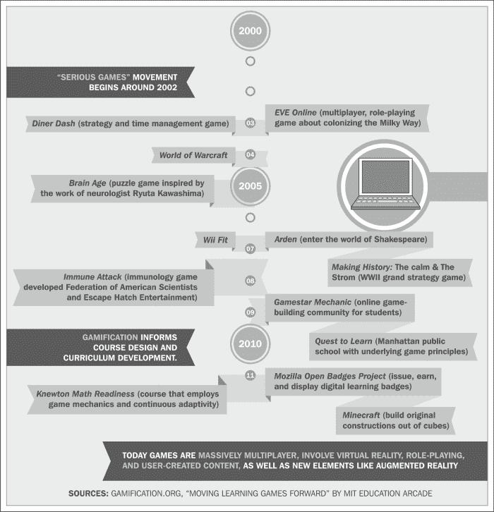
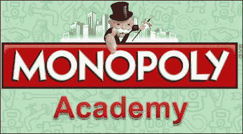
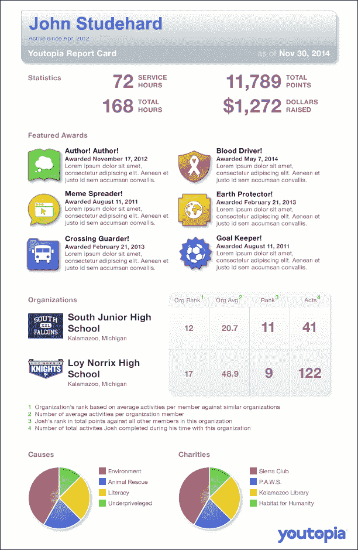

# 第一章：游戏化教育过程

游戏有潜力带来个人方面的巨大变化。历史上，游戏被用来提高技能，有时还能培养新技能。最明显的游戏化例子可以是全球军队进行的“战争游戏”，帮助士兵体验战争环境并运用他们的训练技能取得成果。这些游戏帮助他们运用和发展他们的技能。尽管游戏化方法需要谨慎使用，但如果游戏化过程得到聪明实施，其优势将超过警告。

# 游戏化到底是什么？

**游戏化**是游戏设计师在游戏之外的情境中使用的策略和技术，让人们更像玩游戏一样对待这些情境。人们将严肃游戏、博弈论、视频游戏设计和游戏化混为一谈。这些可能是一些有趣、规则、竞争、积分等，然后将它们应用到非游戏情境中。

游戏化与严肃游戏不同。严肃游戏被认为是游戏，但它们并非旨在带来乐趣。它们用于更实际的用途。例如，飞行模拟器具有飞行视频游戏中的所有机械、技术和设计过程。然而，开发者创建视频游戏是为了娱乐目的，而飞行模拟器具有更严肃的目的。

另一方面，博弈论仅仅是研究战略决策的学科，它在做决策时考虑了“类似游戏”的思维。

游戏化涉及应用于良好游戏设计的结构和设计过程，无论是视频游戏、桌面游戏还是严肃游戏。游戏化只是游戏设计中使用的一组工具和材料，也适用于除了创造游戏之外的工作。

在不久的将来，我们将看到的大多数游戏化应用将是严肃游戏。我们将开始在日常生活中越来越多地看到游戏元素的出现。

游戏化领域的一个巨大增长领域是教育游戏化。将游戏化应用于学习过程有很多前景。

## 使用游戏化的学校

如果我们考虑学校是什么，我们很快就会得出结论，学校本身就是一个游戏。我们传统的学校系统中已经内置了所有经典的游戏元素。在几乎每种学习环境中，你都会发现奖励制度的概念。这种奖励制度可以以成绩或平均成绩的形式存在。学校奖励表现良好的人高分，而不是表现不佳的人。

学校也有处罚制度。如果学习者表现不达标，学校会对他/她进行惩罚。它会阻止他/她，排斥他/她，并在某些情况下将他/她从社区中移除。学校可能是世界上玩得最多的游戏。不幸的是，今天大多数人并不觉得学校有多有趣。因此，学校作为游戏的概念几乎不存在。然而，在未来几十年，随着我们使学习环境更具吸引力，你可以期待这种改变。

# 教育中游戏化的历史

游戏化在学习环境中最早的应用可以追溯到 20 世纪 80 年代的视频和电脑游戏，比如《世界在哪里是卡门圣地亚哥》。软件开发商 Broderbund Software 于 1985 年出版了这款游戏。它取得了巨大成功。这款游戏教授地理和历史知识，玩家扮演侦探，ACME 侦探社寻找前 ACME 侦探卡门圣地亚哥。它获得了 70 多个奖项，特别是 1996 年获得了国家教育媒体网络的银苹果奖。

学习中游戏化的简史如下图所示：

其他成为家喻户晓的早期电脑游戏包括《梅维斯·比肯教打字》和《文明》。还有一些其他游戏显示在下图中：

## 大富翁学院

有几位创新的教育工作者正在努力在他们的课堂中实施游戏机制。其中一位是加利福尼亚州橙县的 Hesperia Unified School District 的老师蒂姆·范登堡。范登堡在他所在学区的六年级学生中开设了“大富翁学院”（Monopoly Academy）。([`www.youtube.com/watch?v=3iHv3vrW2Lo`](http://www.youtube.com/watch?v=3iHv3vrW2Lo)) 游戏的截图如下：

大富翁学院使用大富翁游戏来教授数学概念。范登堡是一位冠军级的大富翁玩家，他利用这个游戏来教授比率、概率、期望值和其他传统上孩子们难以理解的数学概念。

范登堡在他的课堂上实施了“水平制”，这是一个游戏元素。他将班级分成不同的水平，学生需要达到一定的里程碑才能参与游戏。他使用了一个“名人堂”，上面展示了过去玩家的高分，起到了排行榜的作用。排行榜是另一个重要的游戏元素。

范登堡将他的数学课变成了一个有趣的互动场所，学生们通过玩大富翁来学习。当大富翁学院于 2007 年开始时，只有十名范登堡的学生在加利福尼亚标准化数学测试中被评为高级。到 2010 年，他使用大富翁作为主要教学工具，将这一数字增加到了 37 人。

## 可汗学院

在网络上使用游戏化的另一个领先组织是可汗学院（[`www.khanacademy.org/`](https://www.khanacademy.org/)）。这是一个致力于改变全世界教育的非营利组织。

他们的超过 100 个自主学习练习、1800 个课程和 2100 个视频对于任何访问他们网站的人都是免费的。尽管他们的大部分教学材料都是视频为基础的，但网站上也大量使用了游戏元素。它为学习者提供挑战。它根据学生回答问题的正确性和速度来奖励学生。该网站量化了学习进度，并在学生每次登录网站时与学生分享反馈。

根据可汗学院总裁沙坦努·辛哈的说法，“我们当前的教育体系拥有一个设计不佳的激励系统。它对大多数人来说并不起作用。”

## Spongelab

在学习环境中还有几种其他的游戏化应用。加拿大游戏开发商 Spongelab 创建了视频游戏《生物学史》，在整个加拿大用于教授生物学。用户通过玩不同的生物学相关游戏来获得徽章。

该网站通过为加入网站的学生提供初始的欢迎徽章来迅速吸引学生。学生可以使用在网站在线市场积累的积分和学分来购买高级内容。Spongelab 甚至已经引入了基于现金的奖励，用于参与他们网站上的某些挑战[`www.spongelab.com/`](http://www.spongelab.com/)。

## Youtopia

Youtopia 允许教师将游戏元素应用到他们的学习环境中。因为教师将这个网站（[`home.youtopia.com/`](http://home.youtopia.com/)）作为他们课堂的延伸，设计师们将其称为混合学习平台。这个在线平台允许教师和在家自学的家长将游戏元素，如积分、徽章和排行榜，插入到他们的课堂中。学生可以赚取积分和徽章，然后在教师的 Youtopia 商店中兑换。朋友、家人和其他 Youtopians 可以看到学生的成就和徽章。教师有能力为他们的班级和学校创建排行榜。他们允许教师通过将积分、徽章和成就作为班级和学校来实现团队概念。这使得利用基于班级和学校的竞争成为可能。

Youtopians 可以建立一个 Youtopia 简历，许多学生可以用它来建立他们申请第一份工作经验时的初始简历。教师能够快速登录并查看他们的学生表现。以下是 Youtopia 成绩单的示例截图：

Youtopia 不仅仅局限于学校相关的活动。学生们也可以在网站上记录志愿服务小时和课外活动。这记录了他们软技能的发展以及具体技能，都在同一个地方。这使得学生的能力和潜力能够更真实地展现出来。

## Quest2Learn

Quest2Learn 是位于曼哈顿的一所学校，是教育部、公共教育新视野和游戏研究所的合作项目。他们实际上创建了一所课程完全基于游戏机制的学校。

Quest 学生按照一种游戏的方式完成课程。学生不是按年级水平前进，而是按照由一系列任务组成的十周任务前进。在任务结束时，学生升级到 Boss-Level（挑战）。学生在这个挑战级别停留 2 周，老师们根据他们在任务中学到的技能给他们分配一个复杂的问题来解决。该领域的专家评判挑战的结果。学生需要通过创造结果来展示他们学到的东西，而不仅仅是在测试中回答问题。

一个名为“幽灵对决”的任务挑战了学校的七年级学生去思考不同的观点。学生们要学习人们如何将各种经历带到一个事件中。一群虚构的来自不同祖先和背景的幽灵对美国殖民地建立相关事件的不同观点进行争论。幽灵们为了对不同事件的解释而争斗。在任务的过程中，学生们深入研究原始文件，以揭示支持有争议事件不同版本的证据。

Quest 学生仍然必须满足与纽约公立教育学生相同的标准。然而，教师还要根据一组核心能力来评估他们，如同理解和合作。到目前为止，测试结果显示，Quest 学生的标准化测试成绩略高于同一人口统计学的其他学生。此外，该学校还赢得了纽约市数学奥林匹克竞赛。

他们甚至使用谷歌地球学习地理知识。他们的一个关键优势是搭建基于问题的学习，根据罗格斯大学的研究，这种学习方式被证明可以提高学术技能和动力。我们希望所有学校再次变得有趣。这是教育中游戏化运动的核心。([`q2l.org/`](http://q2l.org/))

## Classcraft 世界

Classcraft 的世界是一个增强现实的基于计算机的课堂游戏。有趣的是，它并不是由公立教育系统资助的，而是由 Kickstarter 资助的。学生们玩这个游戏来获得真正的力量，并将课堂变成一次冒险。玩家们打败怪物（家庭作业）和 boss（考试）。学生们获得经验点（XP）、生命值（HP）、行动点（AP）和能量点（PP），如下面的屏幕截图所示：

当玩家完成某些任务时，他会获得经验点。这些任务的例子是：

+   在课堂笔记中找到错误

+   每次考试成绩超过 70％的得分

+   在课堂上给出正确的答案

+   帮助另一个学生完成他的课业

+   利用自己的力量帮助另一个玩家

+   在课堂上积极努力

游戏主（老师）将学生分成八人小组。他们加入三个班级中的一个：牧师，法师或战士。老师是游戏主。学生在课堂上宣布他们想要承担的任务，游戏主（老师）将它们记录在游戏系统中。([`worldofclasscraft.com/en/`](http://worldofclasscraft.com/en/))

## 大学中的游戏化

大学比 K-12、小学和中学教育机构更多地使用游戏机制。许多教授对教学过程有更多的控制。例如，卡尔顿大学的肖恩·格雷厄姆教授在“历史学家的技艺课”（历史 2809 [`www.playthepast.org/?p=848`](http://www.playthepast.org/?p=848)）中设置了一个复杂的成就系统。这个系统是自愿的，这正是学生们喜欢的原因。他们不是被迫参与，这让它感觉更像一个游戏。

在传统的大学课程中，你的成绩主要是基于你在几次考试中的得分。学生从 100％的成绩开始，然后在整个学期失去分数，直到他/她最终确定了一个最终成绩。格雷厄姆建立了一个系统，学生可以通过不同类型的成就来赚取积分。根据格雷厄姆的说法，“我希望学生有更多的机会练习作为历史学家的技艺，超越课堂上的正式评估。”这些成就范围从考试成绩到课堂参与。学生可以获得不同的成就点，比如进行外部研究，拜访教授。一些游戏挑战包括抄写古代纸草的行数，学习嵌入计算机代码的修辞，完成关于逻辑谬误的教程，学习一些拉丁语，并参与在线众包历史项目。学生的成绩是基于他/她的成就水平，而不仅仅是他/她的考试成绩。更重要的是，这个系统是自愿的，所以一个学生通往 A 级成绩的道路可能与另一个学生通往相同成绩的道路非常不同。尽管是自愿的，格雷厄姆看到大约 40％的参与率，所有学生完成了超过十项成就，以 A 或 B 的成绩完成了课程。

学生在学习过程中有一种自主感，研究表明这是内在（自发产生的）动机的主要组成部分。格雷厄姆教授证明了当有一定程度的自主性、挑战（掌握）和参与的背景（目的）时，参与度会大大提高。

坦普尔大学福克斯商学院助理教授史蒂文·L·约翰逊教授通过在他的 MIS3538 课程社交媒体创新中添加他所称的“任务”，引入了游戏化。约翰逊的目标是通过一系列逐渐变得更加困难的必修和自愿活动来鼓励自主学习。 

他使用了基本的现成工具来实施他的计划。他使用了 WordPress 成就插件和 Google 表单。学生们赚取了积分和徽章。班级有一个排行榜，约翰逊每周为达到游戏下一个级别的学生进行表彰。

约翰逊设置了这样一个系统，学生们在他们的前三篇帖子和预设的评论水平（例如，第 1、5、10、20 等，一直到第 100 个）中赚取积分和徽章。他甚至为学生留下了一些隐藏的成就，这在他们达到时增加了一些惊喜。

学生们发现竞争环境既具有挑战性又有趣。有趣的是，约翰逊发现在游戏中表现良好的学生和排行榜底部的学生之间的乐趣和参与度并没有什么不同。似乎无论学生在班级中的个人进步如何，乐趣和参与度都是平等分配的。最终，他能够创造出大多数老师都希望创造的东西——一个令人兴奋和引人入胜的学习体验，学生可以利用并有能力这样做。

# 教育中的游戏化的未来

游戏和体育总的来说，教会了我们宝贵的软技能。例如，它们教会了我们团队合作、沟通、委派和协作。今天学校中的大部分学习都集中在结晶化的学习目标上。结晶化学习包括事实、数字、公式等。教育中游戏化的真正未被利用的好处在于**流体智力**领域。流体智力更多地涉及问题解决和情商。

教育系统的主要目的是为未来做准备。我们当前的教育系统正在为一个已经不存在的现实做准备。它试图在游戏擅长的领域赶上。

已经有超过 50 年的研究表明，游戏在某些领域增强了学习体验。不幸的是，这些领域并不是我们传统上衡量的领域。由于我们在成绩单上不衡量沟通能力、情绪控制和领导能力等领域，我们没有过多关注确保学生学会这些技能。然而，这些正是我们发现在社会中最重要的技能。

游戏独特地展示了这些类型的技能。它们也是展示学习者为什么某种行为或行为是不正确的很好的工具。例如，当玩家在视频游戏中犯了一个错误时，他/她会失去一个回合或失去一个角色。正是通过安全地失败，我们最终学会了。游戏允许安全失败。传统学校环境中的大多数课程只有在不可逆的失败之后才能学到，比如考试失败。

游戏通常会包含失败。当我们考虑视频游戏时，通常认为每个玩家都有一定数量的玩家可以尝试。如果犯了一个错误，玩家会在游戏中被摧毁，但通常会有另一个机会用另一个游戏代币再次尝试。

这种即时反馈在学习过程中非常重要。学习者需要一个让他们知道自己是否在进步的系统。不幸的是，通过我们传统的教育系统，学习者需要等待长达 12 年的时间才能知道他们是否真正学会了成为一个有生产力的公民所需的知识。这种长时间的延迟导致了反馈循环失败，无法及时给学习者提供充分的反馈。

另一方面，游戏可以提供即时的反馈和纠正。这为学生、家长和教师提供了他们需要的信息，以确保学生正常学习。

## 课堂中的游戏化

尽管人们对课堂中的游戏化充满了兴奋，但也有一些怀疑者。首要的问题是教育中的游戏化有多大的可扩展性，无论是在线还是不在线。一些成功的例子并不足以彻底改变我们整个教育系统。

可以肯定的是，在教育环境中，游戏化并不总是奏效。事实上，根据 2013 年 Gartner 的一份报告，超过 80%的游戏化项目将无法实现其目标。当然，他们指的是特定的游戏化项目，但其中许多将与教育相关。

根据 Gartner 的说法，大多数失败是由于：

+   糟糕的设计

+   缺乏规划和策略

+   糟糕的流程

+   不切实际的期望

即使是格雷厄姆教授，他试图在课堂上模拟游戏《文明》，也承认这是一个令人沮丧的失败。他将失败归因于游戏机制不是自愿的。在这种情况下，他要求所有学生参与游戏，这似乎影响了学生享受课程的能力。然而，在大多数学校中，这将是一个真正的问题。教育委员会的整个目的是制定标准并决定学生需要什么。这与给予学生在过程中一定程度的自主权的概念完全矛盾。

在尝试在教育环境中应用游戏化之前，另一个基本问题是，“学校应该是有趣的吗？”许多教育倡导者认为，给学生一个愉快的体验并不是学校的目标，获得技能是成为有生产力公民所必需的。

从我的角度来看，真正的问题是：

+   未来成为有生产力公民所必需的技能是什么？

+   游戏机制能被用来教授那些成为有生产力公民所必需的技能吗？

+   学生是否被激励和奖励来学习这些成为有生产力公民所必需的技能？

支持教育体验游戏化的人认为，游戏和游戏元素并不是教师的替代品。良好的游戏设计与充满激情的教师共同促成了充满活力的学习环境。此外，传统的教育体系已经被证明在传授批判性的读写能力方面非常有效。然而，在教授思维技能、软技能和体验式学习方面做得很差。似乎，游戏化教育的角色并不是取代或打破。它的角色更多地是增强和延伸当前的过程。

将学习环境变成游戏的成功或失败将归结为良好的游戏化设计。我们看到许多网站添加积分、徽章和排行榜（PBLs）并称其为游戏化。良好的设计意味着一个框架和一个结构。框架导致明确的、可衡量的目标。设计框架包括对受众的清晰理解以及他们做事情的动机。它提供了一个遵循的过程。当这些事情发生在学习环境中时，学生将会有动力去学习。在那一刻，当有一个清晰可理解的奖励并且它是在适当的背景下时，就会有动力。这些时刻成为学习的肥沃机会。

当我们正确地开发学习环境时，学生甚至不应该意识到他们正在学习。他们应该只是参与游戏并享受乐趣。学习是那个环境的副产品。

## 在学校玩得开心吗？

传统上，当我们想到学校时，会想到很多词，但有趣不是其中之一。事实上，迄今为止，学校惩罚学习者做游戏认为是正常的事情。例如，学习者因未能跟上规定的学习进度而受到惩罚。这种学习压力是适得其反的。压力使过程变得不愉快。一个经常使用的游戏元素是进步的概念。当学生以自己的步伐学习和进步时，他们会更有乐趣。

在一些游戏化圈子中，比如教育游戏化，F-词（乐趣）是不受欢迎的。我们倾向于回避主要的游戏元素，即乐趣，而是努力追求参与和动机。参与和动机确实是一个良好的游戏化应用的结果，但它们并不是乐趣的替代品；相反，它们是设计师针对的乐趣体验的结果。

然而，我们必须记住，乐趣并不是一个“一刀切”的命题。对一个人来说有趣的事情对另一个人来说可能并不有趣。这是试图将课堂设置游戏化的批评之一。一组游戏元素对一个学生来说可能很有趣，但对另一个学生来说却不会有趣。

游戏化的实施者必须非常清楚他们的受众（玩家）以及他们想要通过他们的系统实现的目标行为。

# 总结

到目前为止，我们已经看了一些成功将教育过程游戏化的教育机构。在下一章中，您将学习如何通过理解游戏化设计框架来使您的过程游戏化。
