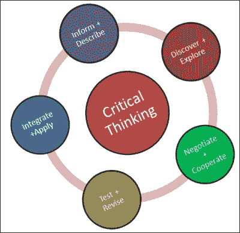
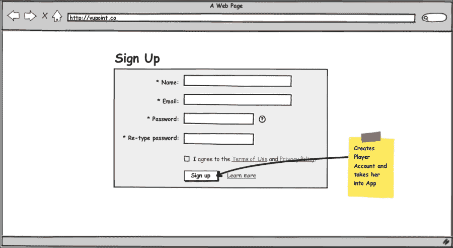
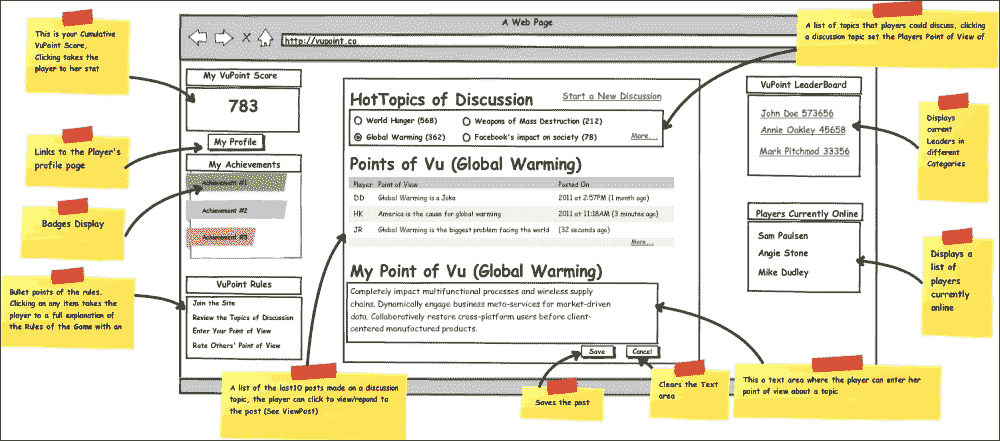
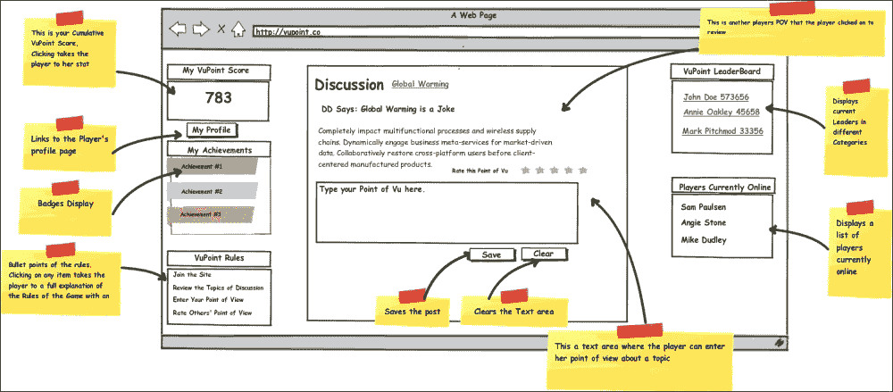

# 第二章：框架

现在我们已经看到了游戏化在现实世界中的一些用途，让我们更仔细地看看我们将如何创建我们的游戏化电子学习系统。

正如前面提到的，大多数游戏化应用都会失败。这不是因为游戏化不起作用，而是因为我们应用不当。我们希望通过遵循开发系统的过程和框架来避免这种情况。在本章中，我们将概述这个框架，并开始为我们的系统建立一些结构。

我们将遵循一个由六个组成部分组成的游戏化设计框架。它们是：

+   业务目标

+   目标行为

+   玩家

+   活动循环

+   有趣

+   工具

在接下来的几页中，我们将更仔细地研究每个部分，并开始为我们的游戏化电子学习网站增加一些内容。

我们将以高层次的模拟图结束本章，这将使我们更容易地进入细节并构建我们的应用程序。

# 业务目标

在我们开始任何旅程之前，我们首先需要明确我们试图去哪里。这就是业务目标出现的地方。尽管游戏是有趣的，游戏化是为了在不失去业务目标的情况下产生积极情绪，但游戏化是一项严肃的业务。

组织每年在信息技术上花费数百万美元。对信息技术的持续投资预计将通过改善业务流程带来投资回报。它旨在帮助组织更顺畅、更轻松地运行。

游戏化的目的在于“改进”业务流程。组织试图尽可能改进流程本身，而技术只是促进流程。因此，游戏化努力将受到类似信息技术努力的审查和成功度量标准的影响。顾客、员工或利益相关者对组织提供的产品更有乐趣这一事实是不够的。它需要达到一个业务目标。

定义业务目标的起点是组织希望改进的业务流程。

在我们的情况下，我们计划改进的过程是电子学习。我们正在研究 K-12 年龄段的人学习“思考”的过程。那个过程现在是什么样子？

图片来源：http://www.moddb.com/groups/critical-thinkers-of-moddb/images/critical-thinking-skills-explained

在一个完整的电子学习情境中，我们将尽可能地使这个过程游戏化。对于我们的目的，我们将专注于谈判和合作领域。根据批判性思维过程的谈判和合作阶段，学习者考虑不同的观点并与他人进行讨论。

这给了我们一个清晰的目标图景。它们可能是：

+   与他人讨论增加参与度

+   增加对不同观点的考虑程度

请注意，这些目标是可衡量的。随着时间的推移，我们将能够测试我们正在寻找的增加/改进是否真的发生了。

有了一组可衡量的目标，我们可以把注意力转向下一步，即我们的游戏化设计框架中的**目标行为**。

# 目标行为

现在我们清楚了我们的系统想要实现什么，我们将专注于我们希望激励的行为：我们的目标行为。

关于游戏化努力的一个重要问题是它是否真的能引起行为改变。员工、客户和利益相关者在游戏结束后是否会简单地回到他们习惯的做事方式？他们会想出一种“作弊”系统的方法吗？

以系统化的方式实现长期组织目标的唯一途径是，应用不仅仅引起瞬间的改变，而且在长期内产生持久的改变。许多游戏化应用在长期行为改变方面失败了，原因在于此。

心理学家长期以来一直研究行为变化生命周期。研究表明，人们在改变行为时经历五个不同的阶段。每个阶段都提出了一系列不同的挑战。

行为生命周期的五个阶段如下：

+   **意识**：在一个人采取任何行动改变行为之前，他/她必须首先意识到他们当前的行为以及它可能需要改变。

+   **认同**：在一个人意识到他们需要改变之后，他们必须同意他们实际上需要改变并做出必要的承诺来实现这一点。

+   **学习**：但实际上一个人需要做什么来改变呢？不能假设他/她知道如何改变。他们必须学习新的行为。

+   **采用**：现在他/她已经学会了必要的技能，他们需要实际实施它们。他们需要采取新的行动。

+   **维持**：最终，采用新行为后，只有通过不断的实践才能使其成为持久的改变。

图片来源：http://www.accenture.com/us-en/blogs/technology-labs-blog/archive/2012/03/28/gamification-and-the-behavior-change-lifecycle.aspx）

我们如何利用这一理解来建立我们的目标行为？请记住，我们的目标是通过讨论增加互动并增加对其他观点的考虑。根据我们对围绕我们目标的行为变化的理解，我们需要我们的用户：

+   意识到他们与其他用户的讨论频率

+   意识到其他观点的存在

+   承诺与其他用户进行更多的讨论

+   承诺考虑其他用户的观点

+   学习如何与其他用户进行更多的讨论

+   了解其他用户的观点

+   与其他用户进行更多的讨论

+   实际考虑其他用户的观点

+   继续保持与其他用户的讨论一贯的频率

+   继续考虑其他用户的观点

这概述了用户需要执行的活动列表，以便我们的系统满足我们的目标。当然，我们的一些目标行为将是明确的。在其他情况下，我们需要一些创造力来促使用户采取这些行动。

那么，我们可以让用户采取哪些可能的行动来推动他们沿着行为变化生命周期前进呢？

+   检查他们的讨论帖数

+   审查不同观点部分

+   设定特定时间段的目标讨论数量

+   设定一个目标数量的不同观点来审查

+   观看关于如何使用讨论区的视频（或一些指导材料）

+   观看关于观看其他观点价值的视频（或一些指导材料）

+   参与讨论小组

+   阅读其他用户的讨论帖子

+   随着时间的推移参与讨论小组

+   随着时间的推移阅读其他用户的观点

其中一些目标行为相对容易实施。其他则需要更多的思考。更重要的是，我们现在已经确定了我们希望用户采取的目标行为。这将指导我们其余的发展工作。

# 玩家

尽管最近几节都是关于严肃的事情，比如目标和目标行为，但我们仍然把游戏化作为焦点。因此，从这一点开始，我们将把我们的用户称为**玩家**。我们必须记住，尽管我们已经定义了我们希望玩家采取的行动，但激励他们采取这些行动的策略因玩家而异。游戏化绝对不是一刀切的过程。我们需要从玩家的角度看待我们的每个目标行为。我们必须考虑他们的动机，除非我们的机制基本上是试错。我们需要一种更有结构的方法。

根据巴特尔的玩家动机理论，任何游戏系统的玩家都属于以下四类之一：

+   **杀手**：这些人受到参与游戏场景的主要目的是通过“对其他玩家采取行动”来赢得游戏的动机驱使。这可能包括杀死他们，在游戏中击败其他玩家直接竞争。

+   **成就者**：另一方面，这些人受到对抗系统本身以取胜的明确行动的动机驱使。他们的动机不是打败对手，而是通过取得成就来取胜。

+   **社交者**：这些人参与游戏有非常不同的动机。他们更多地受到与其他玩家互动和交流的动机驱使。

+   **探险家**：像社交者一样，探险者喜欢互动和交流，但与其他玩家的互动不如与系统本身的互动。

以下图表概述了每种玩家动机类型以及什么游戏机制可能最能保持他们的参与度。

图片来源：http://frankcaron.com/Flogger/?p=1732

在定义我们的活动循环时，我们需要确保包括每种类型的玩家及其动机。

# 活动循环

游戏化系统，就像其他系统一样，只是一系列行动。玩家对系统进行操作，系统做出响应。我们将用户与系统互动的方式称为活动循环。我们将讨论两种类型的活动循环，**参与循环**和**进度循环**，以描述我们的玩家互动。

参与循环描述了玩家如何与系统互动。它们概述了玩家做什么以及系统如何做出响应。根据他们的动机，玩家的活动会有所不同，因此我们还必须考虑玩家为什么采取他们正在采取的行动。

进度循环描述了玩家如何与整个系统互动。它概述了玩家如何通过游戏本身取得进展。而参与循环讨论了玩家在详细层面上做什么，进度循环概述了玩家在系统中的移动。

例如，当一个人开车时，他/她几乎不断地与汽车进行互动。这种互动是一组参与循环。与此同时，汽车正在前往某个地方。汽车的目的地描述了它的进度循环。

活动循环往往遵循动机、行动、反馈的模式。

### 注

有关更多详细信息，请参见附录，*表格*。

玩家受到足够的动机来采取行动。当玩家采取行动并从系统中获得反馈时，希望反馈能够足够激励玩家采取另一个行动。他们采取这个行动并获得更多的反馈。在理想的世界中，这个循环将无限期地继续下去，玩家永远不会停止玩我们的游戏化系统。我们的目标是尽可能接近这种持续的活动循环。

## 进度循环

在过去的几页中，我们已经看到了玩家在我们的参与循环中与系统进行的详细互动。现在是时候把注意力转向另一种类型的活动循环，即进展循环。进展循环从宏观角度看待系统。它描述了玩家在系统中的旅程。当我们考虑进展循环时，通常会考虑级别、徽章和/或模式。我们回答诸如：你去过哪里，你现在在哪里，你将去哪里等问题。所有这些都可以总结为对玩家掌握水平的编码。

在我们的应用中，我们将从新手、专家和大师的角度来看待旅程。

加入游戏后，玩家将从新手级别开始。

在新手级别，我们将专注于：

+   欢迎

+   入职和让用户适应使用系统

+   可实现的目标

在欢迎阶段，我们将简单地向用户介绍游戏，并鼓励他/她尝试。在入职时，我们需要尽可能简化流程，并尽快给予积极的反馈。一旦用户上手，我们将概述参与并开始旅程的最简单方式。

在专家级别，玩家经常参与游戏。然而，其他玩家可能不认为这个玩家是游戏中的领导者。我们在这个级别的目标是逐渐提出更困难的挑战。当玩家遇到看起来太困难的挑战时，我们可以在途中包括一些意外的替代方案，以保持他们的动力，直到他们突破专家级别达到大师级别。

游戏和其他玩家会认可大师。他们应该在游戏中显著展示，并可能倾向于在新手和专家级别帮助其他玩家。这些选项应该在游戏的后期阶段可用。

# 乐趣

在我们确定了目标、定义了目标行为、确定了玩家范围并规划了系统活动之后，我们最终可以考虑许多新手游戏设计师开始的系统领域：乐趣。其他游戏化从业者会避免或至少掩饰游戏化设计过程中的乐趣方面。重要的是我们不要过分或不足地强调过程中的乐趣。例如，厨师们用香料烹饪整顿饭菜，但他们不会把所有香料都加在一起。他们在烹饪中适量使用香料，为菜肴增添风味。把乐趣看作是我们可以应用于活动循环的一系列香料。

马克·勒布朗将乐趣分为八个不同的类别。我们将尝试在适当的情况下适量地添加每种乐趣，以达到期望的乐趣程度。请记住，一个玩家认为有趣的体验对另一个玩家来说可能并不相同。在这种情况下，一刀切绝对行不通。

+   **感知**：愉快的体验

+   **叙事**：一个展开的故事

+   **挑战**：一个障碍课程

+   **幻想**：虚构

+   **团体**：社交框架

+   **发现**：探索未知领域

+   **表达**：玩家获得了一个平台

+   **提交**：无意识的活动

那么我们如何在系统中适度引入上述乐趣维度？以下表格为我们概述了选项：

| 采取的行动 | 乐趣维度 |
| --- | --- |
| 检查他们的讨论帖子数量 | 挑战 |
| 审查不同观点部分 | 发现 |
| 设定特定时间段内的讨论数量目标 | 挑战 |
| 设定“不同观点”的目标数量进行审查 | 挑战 |
| 观看关于如何使用讨论区的视频（或一些指导材料） | 挑战 |
| 观看关于观看其他观点价值的视频（或一些指导材料） | 挑战 |
| 参与讨论小组 | 团体表达 |
| 阅读其他用户的讨论帖子 | 发现 |
| 随着时间的推移参与讨论组 | FellowshipExpression |
| 随着时间的推移阅读其他用户的观点 | 发现 |

# 工具

我们终于到了可以开始实施的阶段。在这一点上，我们可以看看各种游戏元素（工具）来实施我们的游戏化系统。如果我们一直遵循这个框架，那么机制和元素应该变得明显。我们不是为了而简单地添加排行榜或积分系统。我们可以将我们使用的所有工具都与我们之前的工作联系起来。这将为我们的应用程序产生一个游戏化设计矩阵。但在我们继续之前，让我们停下来看看我们手头的一些工具。

我们有无数的工具、机制和策略可供我们使用。每天都有新的工具被设计出来。以下是我们在设计游戏化系统时会遇到的一些最常见的机制：

+   **成就**：这些是玩家达到的具体目标。

+   **头像**：这些是玩家在游戏中的角色、角色或角色的视觉表示。

+   **徽章**：这些是用来认可特定成就的视觉元素。它们让玩家感到自豪，可以向他人展示。

+   **Boss 战**：这是游戏情景中异常困难的挑战，通常在关卡结束时展示足够的技能水平以晋升到下一个级别。

+   **排行榜**：这些公开显示玩家的排名。它们认可像徽章一样的成就，但是所有人都可以看到。我们几乎每天都能看到这一点，无论是从体育团队排名到销售代表的月度成绩。

+   **积分**：这些相当直接。玩家在系统中累积积分并采取各种行动。

+   **任务/任务**：这些是游戏情景中的专门挑战，具有故事和目标的特点。

+   **奖励**：这是用来外部激励用户采取特定行动的任何东西。

+   **团队**：这是一组作为单个单位玩游戏的玩家。

+   **虚拟资产**：这些是游戏中具有一定价值的元素，可以被获取或用来获取其他资产，无论是有形的还是虚拟的。

现在是时候转变，摘下我们的游戏化设计帽子，戴上我们的开发者帽子。让我们从开发一些初步的草图开始，以展示我们最终网站可能会是什么样子，使用我们之前概述的设计。许多人使用诸如 Photoshop 或 Gimp 之类的图形工具来开发草图。在这个阶段，我们的草图将不那么详细，只是使用铅笔草图或诸如 Balsamiq 之类的草图工具。

### 注

有关此更多详细信息，请参见附录，*表格*。

登录屏幕

这是我们应用程序中基本登录屏幕的草图。玩家习惯于基本的登录和密码情景，我们在这里提供了。

# 帐户创建屏幕

首次玩家需要首先创建一个帐户。

这是我们注册页面的草图。

主玩家屏幕

这捕捉了当玩家完全参与系统时我们系统的主要元素。 

主玩家发布回应屏幕

我们已经通过草图概述了我们的游戏化系统的关键功能。草图是一种视觉上向我们的团队传达我们正在构建的东西以及我们为什么在构建它的方式。视觉草图也给了我们一个机会，在设计的早期阶段发现问题。

# 总结

大多数游戏化应用程序将因为设计不当的系统而失败。因此，我们引入了一个游戏化设计框架来指导我们的开发过程。我们知道，如果我们：

+   明确业务目标

+   建立目标行为

+   了解我们的玩家

+   通过活动循环工作

+   记住乐趣

+   优化工具
