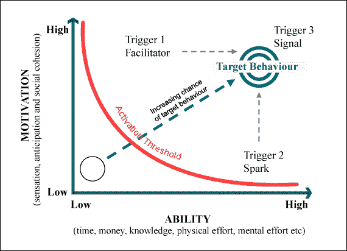
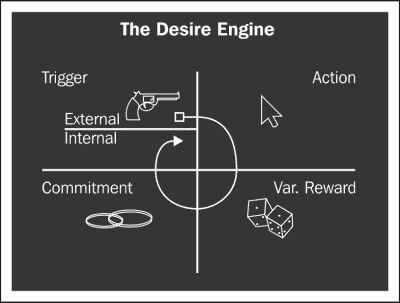
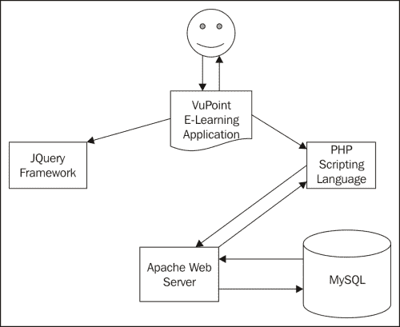
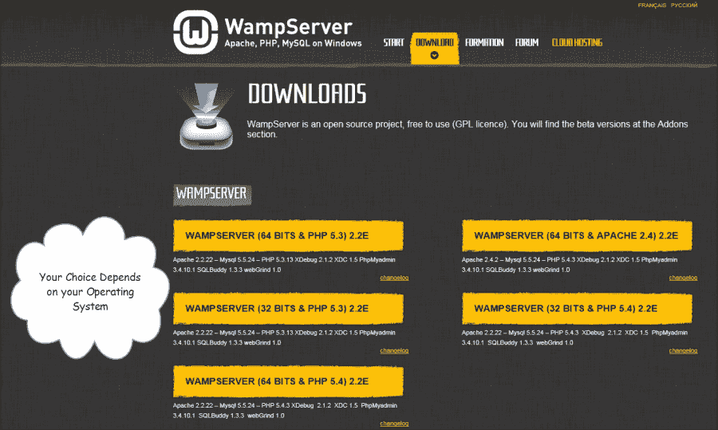
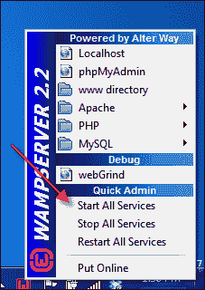
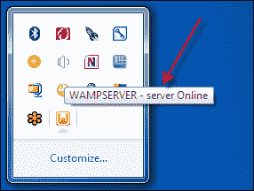
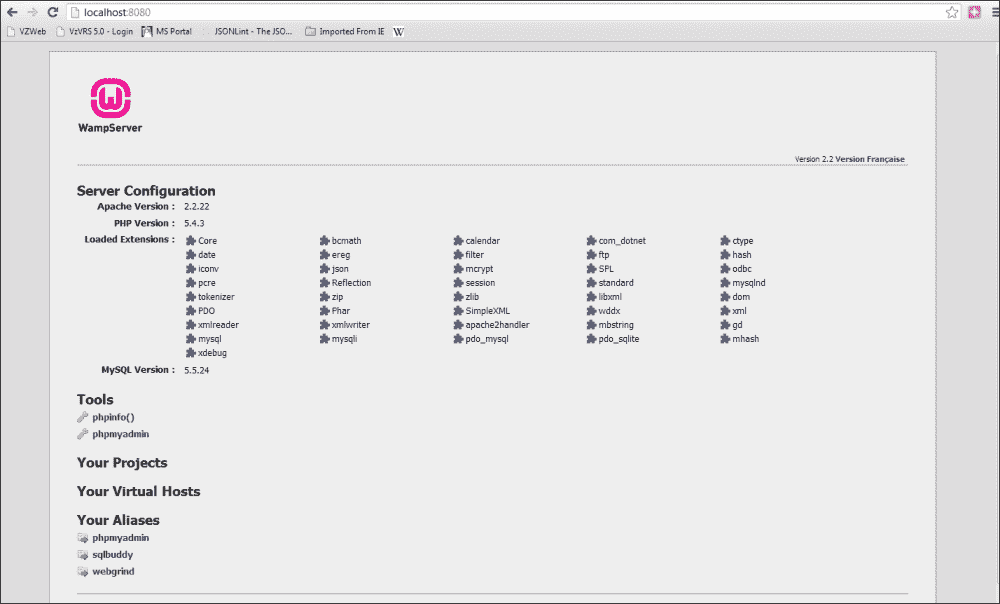
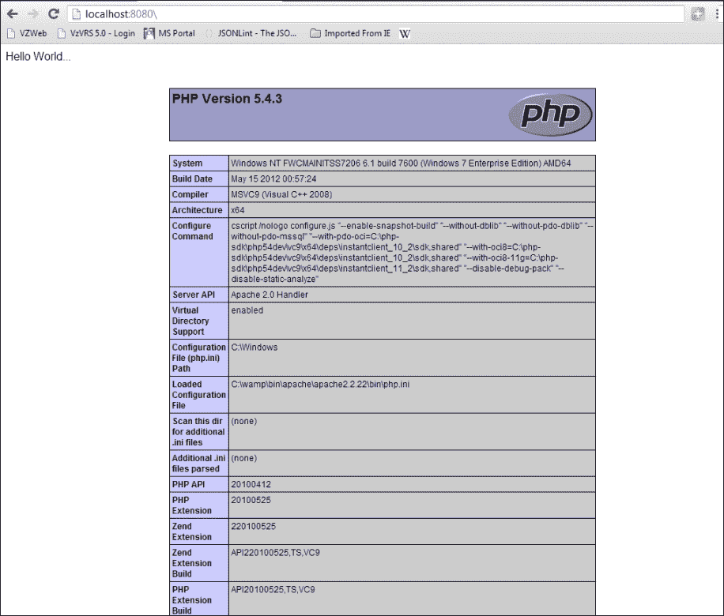
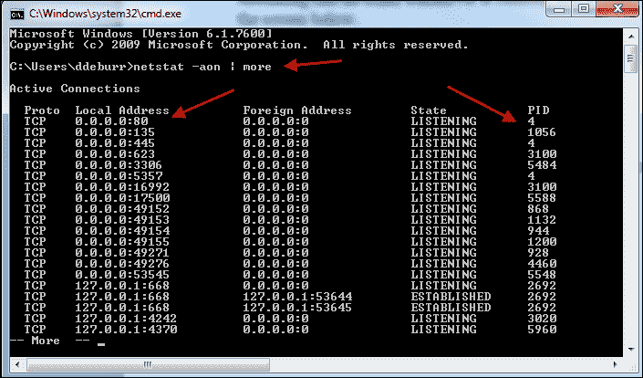
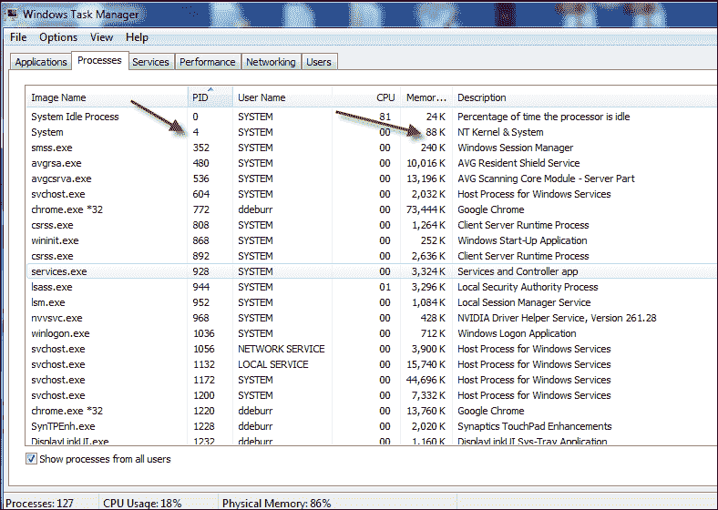

# 第三章：目标和目标行为

在上一章中，我们概述了游戏化设计过程，从定义我们的业务目标和目标行为开始。

我们开发游戏化系统的目标是引起行为改变。在我们的用户拥有我们的游戏化系统之前，他们以某种方式行为。在我们实施我们的系统之后，我们希望他们的行为有所不同。我们希望他们采取符合我们业务目标的行为。因此，在本章中，我们将更仔细地看看在幕后真正需要发生什么，以使我们的用户（玩家）采取我们需要他们采取的行动。

我们在上一章中发现了我们希望玩家采取的 10 个行动：

+   检查他们的讨论帖数

+   审查不同观点部分

+   设定特定时间段的讨论数量目标

+   设定要审查的不同观点数量的目标

+   观看关于如何使用讨论区的视频（或一些指导材料）

+   观看关于查看其他观点价值的视频（或一些指导材料）

+   参与讨论小组

+   阅读其他用户的讨论帖子

+   随着时间的推移参与讨论小组

+   随着时间的推移阅读其他用户的观点

我们假设如果玩家定期并一贯地采取这 10 个行动，我们可以实现我们的业务目标：

+   增加与他人讨论的参与度

+   增加对不同观点的考虑程度

我们希望如果我们实现这两个目标，我们可以实现我们的教学使命，并帮助我们的玩家通过与我们的游戏化系统互动学习思维技能。

在设计我们的系统时，我们需要牢记行为实际上不仅仅是一个行动，而是我们希望玩家采取的一系列行动。我们将在本章后面更详细地绘制我们的行为链（我们希望用户采取的行动）。理想情况下，我们可以在玩家中创建一种行为循环（即习惯）。然而，习惯并非偶然发生；我们必须设计我们的系统来鼓励我们希望成为习惯的行为。

重要的是，我们找到最小的行为或行动，并且如果可能，将该行为附加到现有行为上。

例如，大多数人习惯于早上第一件事就是查看他们的电子邮件。这是否是一个好习惯还是坏习惯有争议，但无论如何，这是我们许多玩家的习惯。我们希望我们的玩家阅读其他玩家的帖子作为目标行为。他们可以采取的一个小行为是简单地查看过去 24 小时内发帖的人。我们可以将这与他们检查电子邮件的现有习惯联系起来，通过电子邮件每天发送给他们一个简单的仪表板。当然，他们可以关闭此功能，让他们掌控。玩家有能力直接从此仪表板阅读帖子并回复帖子。

# Fogg 行为模型

这是一个我们需要问并最终回答的基本问题。斯坦福大学说服技术实验室的创始人和主任 BJ Fogg 教授在**Fogg 行为模型**（**FBM**）中出色地描述了为什么人们采取特定行动。这是设计师可以使用的工具，以了解用户为什么采取或不采取特定行动或行为。

根据 FBM，如果您的用户没有采取设计的行动，那是因为行为方程中缺少了某些东西。FBM 行为方程式陈述*行为=动机+能力+触发器*。

当有足够的动机水平，加上适当的能力水平和适当的触发器时，行为每次都会发生。这可以从以下图表中看出：



图片来源：BJ Fogg 的行为模型（[`www.behaviormodel.org/`](http://www.behaviormodel.org/)）

在这两个概念——动机和能力触发器——融合的时候，行为发生了。

## 动机

对一个人来说真正激励的东西可能对另一个人来说并不激励，因此需要清楚了解你的玩家和激励类型。但根据 Fogg 教授的说法，动机由三个组成部分构成。动机的三个子组成部分是：

+   感觉：在愉悦到痛苦的连续体上进行测量

+   预期：在希望到恐惧的连续体上进行测量

+   社会凝聚力：在接受到拒绝的连续体上进行测量

对于每个人来说，他们采取特定行动的动机程度可以沿着这三个连续体进行测量，从而得出他们采取该行动的动机程度。因此，我们的任务是尽可能使我们的目标行为愉快，激发尽可能多的希望，并使它们尽可能受到社会的接受。我们必须牢记，这些都是根据个体不断波动的变量。

## 能力

假设用户有足够的动机，他/她还必须有能力采取所需的行动。许多应用在涉及用户能力方面非常幼稚，他们期望用户做的事情。Fogg 的模型表明，仅仅有动机做某事是不够的，还必须具备能力。动机也必须存在。

Fogg 在感知的简单性的背景下讨论了能力。如果用户认为某个行动很简单，那么他/她就更有能力采取这个行动。从用户的角度来看，任务被认为越简单，它在能力连续体上的位置就越高。

Fogg 进一步提出，简单性是资源稀缺的函数。用户拥有的资源越多，任务就越简单。在试图确定用户感知简单性时要关注的六个关键资源是：

+   金钱：任务需要的金钱相对于用户拥有的金钱数量

+   时间：任务需要的时间相对于用户拥有的时间

+   体力付出：任务需要的体力付出相对于用户的身体能力

+   脑力消耗：用户完成任务时需要思考的程度相对于用户当时的智力水平

+   社会偏差：采取行动会让用户脱离社会规范的程度

+   非例行：用户需要偏离正常例行程序的程度

用户认为自己有足够的资源来采取行动的程度描述了任务对他/她来说有多简单，以及他/她有多有能力采取行动。

请注意，我们指的是感知的简单性。实际上，当用户耗尽上述资源时，简单性就会结束。当用户耗尽金钱、时间、身体能力等资源时，任务从定义上变得困难。然而，我们指的是感知的简单性。感知的简单性是指用户认为任务应该需要的资源量与实际需要的资源量之间的比较。

例如，如果我们的用户认为登录、阅读帖子和回复帖子需要 10 分钟，但实际上只用了 4 分钟，他们会认为这个任务很简单。这是理想的情况。理想情况下，我们希望我们的目标行为比我们的玩家最初预期的要简单（即需要更少的资源）。简而言之，我们将确保提高用户的资源期望，然后努力使我们的目标行为尽可能轻松。

# 触发器

假设我们现在有一个动机足够的用户，有能力采取我们目标行为中定义的行动。换句话说，他们已经超过了我们目标行为的激活门槛。但出于某种原因，我们的玩家并没有像我们期望的那样行为。根据 FBM，必须有一个适当的触发器让用户意识到采取行动以及为什么他/她应该采取行动。所有这些需要同时发生。**触发器**有三种形式，取决于用户及其相对于激活门槛的位置：

+   **促进者**：当动机水平高而能力低时，这种形式最有效。这种触发器试图让已经有动机的用户更容易地采取目标行为。

+   **信号**：当动机水平和完成任务的能力都很高时，这种形式最有效。这种触发器仅作为提醒采取行动（例如，闹钟）。

+   **火花**：当能力很高但动机水平不太高时，这种形式最有效。火花暂时提高用户的动机水平。就像他/她着火了一样。

在试图提高玩家采取我们期望的行为的机会时，我们将努力确保必要的触发器存在。然后，我们将努力简化行为并增加用户采取行动的动机，以降低激活门槛。我们将先做简单的事情，然后再解决更难的任务。提出行动触发比简化任务更容易。假设您清楚地呈现了触发器，并简化了任务，我们可以将注意力转向激励玩家采取行动。

## 我们应用中的触发器

让我们将注意力转向我们 VUPoint 电子学习应用的一些潜在触发器。记住，时机是有效触发的关键。我们需要让玩家意识到他们何时超过了激活门槛。这是当他们的动机和能力水平足够高以使触发器产生影响时。

我们已经提到的一个潜在触发器是每日仪表板电子邮件。另一个可能是在某人连续五天未登录时发送一封电子邮件提醒。我们甚至可以考虑在周末发送这个触发器，假设玩家的时间资源和大脑资源可能更高。（这只是一个假设。）

我们可以安全地假设每次登录时玩家都有足够的动机，因为他们会努力登录。在登录时，给出相同的仪表板信号触发是有意义的。玩家登录并阅读其他玩家的一些帖子后，提供促进者触发可能是有意义的。我们提供一个快速回复按钮给一个随机帖子。我们需要更多地考虑如何选择那个随机的快速帖子。

但是对于那些甚至不再登录的用户呢？我们将假设他们的动机相对较低，但采取行动的能力是可用的。我们可能会发送一个火花触发的电子邮件。在这封电子邮件中，目标是激励并激发玩家采取行动。我们可以快速介绍网站上正在进行的活动以及他们错过了多少。然后，我们可以给他们提供快速回复的选项，就像我们与促进者一样。希望激励的话语/信息足以提高玩家的动机水平。然后，我们可以通过给他/她一个快速简单的任务来促进行动。

# 增加我们玩家的能力

假设我们已经合理地放置了所有触发器，而没有关闭我们的玩家，我们可以专注于玩家的能力。请记住，这取决于从玩家的角度来看采取期望行为的简单程度。

我们可以立即采取的一步是尽可能为用户自动完成尽可能多的活动。例如，登录应用程序和接收电子邮件触发器应该是默认的。当然，用户可以选择关闭这些默认设置。我们希望在不超过两次鼠标点击的情况下完成所有行为，并在可能的情况下只需一次点击。在测试阶段，我们可以识别需要超过两分钟的任务，并尝试减少执行它们所需的时间。

我们可能可以做一些事情来减少进行我们的目标行为所需的大脑循环（大脑能量）。首先想到的是，让玩家很容易识别相反和相似的观点。我们可以通过简单地根据我们认为玩家会同意或不同意该观点来对帖子进行颜色编码来解决这个问题。我们不需要在我们的预测中正确，因为我们的目标是减少玩家在决定阅读哪些帖子时的思考量。这样的预测算法超出了本书的范围，但我们可以做任何事情来减少进行我们的目标行为（即回复帖子）所需的心理能力是目标。

## 激励我们的玩家

到目前为止，FBM 中最难制造或控制的是动机方面。我们可以尝试通过外部奖励来产生尽可能多的动机，但有太多的心理变量需要应对，这完全超出了我们的控制范围。我们试图做的是设计用户行为。更好的是，我们希望在玩家中创建一种习惯，以采取我们期望的行动。

但是，习惯到底是什么？习惯就是当我们不做某个特定行为时所感受到的痛苦。我们如何创造一种情况，让我们的玩家如果不登录我们的应用程序就会经历负面情绪？我们如何创造一个环境，让玩家不回复其他玩家的帖子或不阅读其他玩家的帖子会让他们感到社交排斥？他/她会因为不定期使用应用程序而感到一种预期的恐惧吗？当然，我们可以单独写一本书来讨论这些概念，但这些都是我们在试图激励用户时需要解决的问题。

讲师和作家尼尔·艾尔将在玩家中建立动机和习惯称为创造**欲望引擎**，如下图所示：



他建议我们可以系统地创造欲望，并最终将我们的目标行为变成玩家的习惯。他的公式简单而循环。

# 识别内部和外部触发器

外部触发器就像我们之前讨论过的触发器一样，而内部触发器是玩家在自己的情绪中经历的触发器。例如，玩家收到一封电子邮件，这是一个外部触发器，突出了关于美国枪支暴力的帖子。如果玩家曾经是枪支暴力的受害者或以某种方式经历过，他/她可能会对这个话题产生强烈的情绪，并更倾向于回应这篇帖子（即采取我们的目标行为）。我们的外部触发器在玩家内部引发了一个内部触发器。我们需要尽可能地最大化内部触发器。我们已经在前几节中概述了一些外部触发器。我们的玩家可能会经历哪些内部触发器呢？

## 预期行动

因为我们的触发器引发了一个行动，我们现在的任务是尽可能简化这个行动的执行。我们已经讨论了一键式操作和尽可能自动登录来实现这些目标。

## 可变奖励

但是，我们应该如何回应玩家执行我们的动作呢？我们用可变的奖励来回应。我们最初的想法可能是任何奖励都足够了。但根据艾尔的说法，奖励应该是不可预测的，以创造一种期待和渴望的感觉。例如，当我们打开灯开关时，灯会亮起。这是我们期望的。假设一切正常，这是可预测和可靠的。然而，这并不会创造出一种渴望或持续打开灯开关的动力。然而，如果每次你打开开关时，不同的电器都会开启呢？在某种情况下，灯可能会亮起，在另一种情况下，电视会开启，而在另一种情况下，收音机会随机开启。现在我们创造了渴望。这是经典的玩偶匣情景，你永远不知道小丑何时会从盒子里跳出来。

我们可以通过随机弹出消息给用户，例如“干得好”，来创建一个可变的奖励。有时，当用户采取行动时，我们会表现得很热情，而其他时候则不会。我们改变执行动作的奖励，以便玩家永远不确定他们是否会收到奖励，如果他们确实收到了，他们也不知道会是什么。

研究表明，当我们期待获得奖励时，大脑会产生愉悦化学物质多巴胺。当奖励变化时，多巴胺的产生会显著增加。

在我们的情景中，有时用户会收到弹出消息以获得奖励。在其他时候，我们会给玩家建议去评论更多的帖子。

最后，我们要求玩家投入一些时间、精力或努力。请记住，此时玩家的大脑充满了多巴胺。现在我们可以要求他们对我们的游戏做出一些小的承诺。我们要求他们评价其他人的帖子，阅读其他人的帖子，甚至可能邀请一个 Facebook 朋友加入。玩家的这种小承诺为通过“Desire Engine”开启另一条道路创造了条件。

# 我们的开发环境

所有这些关于行为和心理的讨论可能会让我们忽视我们在这里的目标。目标是构建一个游戏化的电子学习应用程序。为此，我们需要设置我们的环境来构建我们的应用程序。

构建我们的应用程序，我们需要一些基本条件。我们需要：

+   一个 Web 服务器（Apache）

+   服务器端技术（PHP）

+   一个数据库（MySQL）

+   客户端技术（JQuery）

+   一个文本编辑器（Notepad++）

我们需要一个 Web 服务器来托管和测试我们的应用程序。我们将使用开源 Web 服务器 Apache。我们将使用**Hypertext Preprocessor** **(PHP)**，它将在 Apache Web 服务器上运行以生成我们页面的 HTML。我们将在开源数据库 MySQL 上存储和访问我们应用程序所需的数据。我们将主要使用 JavaScript 与玩家在客户端（即浏览器）进行交互。我们将主要使用 JQuery JavaScript 框架。最后，我们需要一个纯文本编辑器。有几个免费和付费版本，所以使用您最熟悉的那个。我将使用 Notepad++。

但在我们开始编码之前，我们需要设置和测试我们的环境。

# 安装 LAMP stack

我们将使用的 Web 开发环境通常被称为**LAMP**（**Linux, Apache, MySQL, PHP**）**Stack**。根据您的操作系统，有各种不同版本的 Stack。我将演示设置**WAMP**，即 LAMP stack 的 Windows 版本。

### 注意

MAC 用户请参考 MAMP（[www.mamp.info](http://www.mamp.info)）

Linux 用户请参考 XAMPP（[www.apachefriends.org/en/xampp.html](http://www.apachefriends.org/en/xampp.html)）

1.  让我们从[www.wampserver.com/en](http://www.wampserver.com/en)下载 WAMP 并在本地计算机上安装。

1.  假设一切都安装正确，您将在系统托盘中看到一个**WAMPSERVER**图标，您可以使用**启动所有服务**选项实际启动 Web 服务器。当您在系统托盘中看到**服务器在线**消息时，您将知道您的 WAMP 服务器安装正在正确运行，如下截图所示：

1.  我们将在 WAMP 服务器安装文件夹的`www`目录中构建和存储我们的网站文件。

### 注意：

默认安装文件夹是`C:\wamp`。

1.  现在让我们看看您的 PHP 是否正确运行。转到您的 Web 浏览器并输入`http://localhos``t/`。假设没有其他 Web 服务器在运行，并且没有其他应用程序阻止端口 80，您应该会看到一个类似于以下截图的屏幕：

1.  最后，让我们测试一下 PHP 是否正确响应。在我们的文本编辑器中，我们将要求 PHP 为我们显示一些关于服务器的一般信息，带有特殊的“Hello World”消息。

1.  在您的文本编辑器中创建一个名为`index.php`的文件。输入以下代码。（稍后我们将更详细地讨论 PHP 的具体内容）：

```php
<html>
<body>
<?php 
echo print "<p>Hello World... </p>";
phpinfo();
?>
<body>
</html>
```

结果应该如下截图所示：



## 故障排除 WAMP 服务器设置

如果您在运行 Apache Web 服务器时遇到问题，请执行以下一些故障排除步骤：

1.  检查当前计算机上正在监听什么。在命令提示符（cmd）中输入`netstat –aon | more`，如下截图所示：

1.  检查您的任务管理器以查看该进程 ID 属于哪个应用程序。以下是一个示例：

1.  简单地禁用此应用程序。如果没有此选项，例如 NT 内核的情况，或者运行在端口 80 上的系统，您将需要在 Apache 配置文件（`httpd.conf`）中更改端口。

1.  如果您仍然在安装过程中遇到问题，访问诸如 Stack Overflow（[www.stackoverflow.com](http://www.stackoverflow.com)）之类的网站应该会导致一些其他可能的故障排除选项。

# 摘要

我们对我们提出的系统有目标和目标，总体目标是改变行为。我们特别注意确保我们的目标行为支持我们的业务目标。这使我们对我们的游戏化系统的成功和失败标准有了很好的把握。
