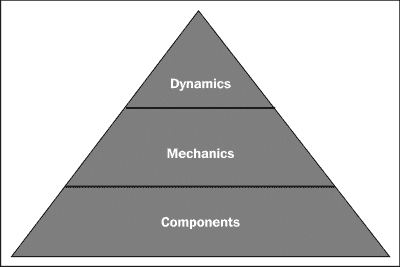
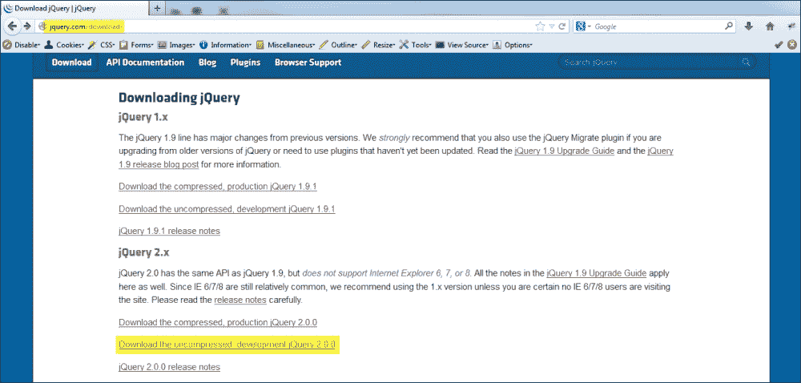
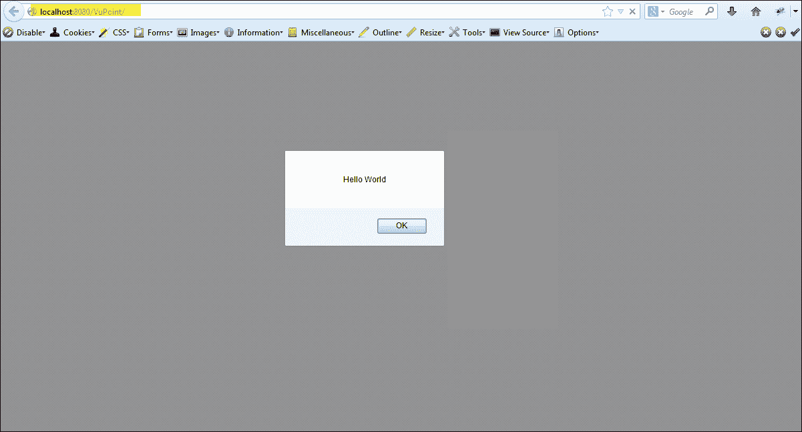
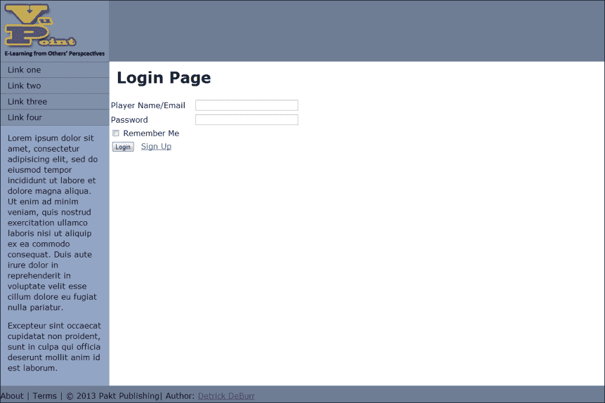
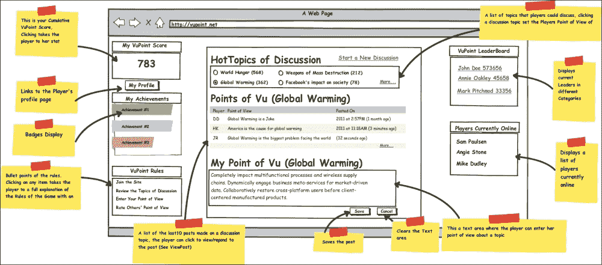

# 第五章。活动

在任何游戏化系统的核心是活动。用户是谁以及他/她的动机很重要，但归根结底，一切都归结为系统允许用户采取的活动。在本章中，我们讨论活动。我们看看我们的玩家可以参与和将要参与的元素、进展循环和参与场景。

游戏化系统中的活动只是游戏机制的配方。这些是规则和构造，它们控制玩家在游戏场景中的行为。它们概述了玩家通过奖励、反馈和激励系统的移动。正是游戏机制使系统变得有趣。

然而，我们必须清楚，游戏元素不是游戏，就像足球不是足球比赛一样。然而，它是游戏的一个元素和关键机制。它的本质决定了玩家在游戏中可以做什么和不能做什么。如果我们用棒球代替足球，游戏的基本本质将发生变化。因此，机制是游戏化系统的核心。

# 游戏元素金字塔

根据《为胜利而战：游戏思维如何革新您的业务》一书的作者凯文·沃尔巴赫博士，游戏元素可以分为三类，构成了他所称的**游戏元素金字塔**，如下截图所示：



游戏元素金字塔是一种以视觉方式思考各种游戏元素的方法。**动态**是关于大局的。它们代表了通过系统、叙事和系统对玩家的整体限制的进展。系统的**机制**是系统的动词。它们是推动玩家沿着进展循环前进的元素。**组件**是细节。这些是我们在想到游戏元素时会想到的东西，比如积分、排行榜、徽章。构成游戏化体验的一切都可以归类为元素金字塔中的元素。

# 游戏化工具箱-比 PBLs 更好

批评者很快指出游戏化元素的不良使用，表明游戏化还有很多不足之处。在许多情况下，他们是正确的。PBLs（积分、徽章和排行榜）很快成为游戏化应用的主打。虽然它们是优秀的游戏元素，但在特定情况下可能有可能没有意义。优秀的游戏元素永远不会让设计不佳的流程变得有趣。更重要的是，我们不应该希望它们会。不幸的是，它们正在定义游戏化行业。

然而，我们手头有许多工具（即游戏元素）在我们的**游戏化工具箱**中，只有那些鼓励我们目标行为的工具才重要。关键在于元素的质量而不是数量，这将决定系统的成功与否。

以下是一些游戏动态的例子：

+   **社交互动**：关系产生团队和归属感。例如，与朋友分享成就。

+   **情感**：挫折和成就是游戏化环境可能引起的情感。例如，提出略高于玩家技能水平的挑战会引起挫折感。另一方面，玩家在掌握挑战后会感到成就感。

+   **限制**：在所有游戏的核心是迫使玩家进行权衡的规则。例如，玩家现在可以在游戏中获得更多资产，但解决挑战的时间可能更短。

+   **进展**：玩家随时间的发展；例如，当玩家在游戏中变得更好时，她会被赋予一个头衔。例如，Foursquare 用户随着时间的推移逐渐成为市长。

+   **叙事**：一个持续的故事情节；例如，玩家在整个游戏中扮演一个角色，并且围绕玩家和游戏的其他机制发展了一个故事。

以下是一些游戏机制的例子：

+   **奖励**：玩家因为内在/外在奖励而采取某些行动

+   **反馈**：玩家需要关于他们在系统中的进展的信息

+   **竞争**：有明确的赢家和输家

+   **挑战**：系统中需要一定程度努力的任务

以下是一些更常见的游戏元素（即工具）：

+   **排行榜**：这个工具指定了玩家进展和成就的视觉显示

+   **级别**：这个工具指定了玩家进展中的定义步骤

+   **徽章**：这个工具指定了成就的视觉表示

+   **积分**：这个工具指定了游戏进展的数字表示

+   **任务**：这个工具指定了具有目标和奖励的预定义挑战

+   **社交图表**：这个工具指定了游戏中玩家社交网络的表示

+   **团队**：这个工具指定了为了共同目标而一起工作的玩家的定义组

+   **虚拟商品**：这个工具指定了具有感知或实际货币价值的游戏资产

通过正确的游戏元素组合，比如前面段落中提到的那些，再加上数据分析和社交媒体，我们的目标是创造一个引人入胜的体验。

我们的电子学习应用程序可能会是什么样的正确组合？以下是我们可能考虑的一些标准：

+   **积分**：我们为目标行为提供积分

+   **徽章**：我们为达到某些预定义成就提供徽章

+   **排行榜**：我们在主页上显著地列出了前几名玩家（按积分值）

+   **反馈**：我们在应用程序的每个屏幕/视图上显著地向玩家提供他/她的当前得分

+   **竞争**：我们展示了竞争的强烈使用，允许玩家批评和/或捍卫其他玩家的观点

# VuPoint 应用程序

让我们再次把注意力转向我们的应用程序代码。我们将从应用程序的用户界面方面开始。这是处理用户与应用程序交互的代码。由于这是一个 Web 应用程序，这段代码将在 Web 浏览器中运行。JavaScript 已经成为在 Web 浏览器中运行代码的事实标准语言。

## jQuery

如前所述，我们需要有几个地方来编写代码。在上一章中，这主要是在数据库中。在这里，我们将把注意力转向服务器（PHP）和客户端（jQuery）。

在我们继续之前，让我们在 Wamp 服务器安装的根目录（`www`）文件夹内为 VuPoint 应用程序创建一个目录结构。完成后，您应该有以下内容：


jQuery 是一个流行的开源 JavaScript 框架，允许我们在浏览器中搜索（或查询）项目，并与这些项目进行交互。因此得名 jQuery。jQuery 的主要优势之一是它为我们处理了许多不同浏览器的细微差别，使我们能够专注于我们想要做的事情，而不是不同浏览器可能如何处理我们的代码。jQuery 保护我们免受这些影响。

我们有几种选项可以在我们的应用程序中安装 jQuery。我们可以从[www.jquery.com/downloads](http://www.jquery.com/downloads)下载整个库。有一个压缩版本，我们应该在生产环境中使用，还有一个未压缩版本用于开发和调试目的。第三个选项是使用来自**内容传送网络**（**CDN**）的托管版本的库。以下是一些您可能考虑使用的位置。这实际上是一个偏好问题，您更希望从系统获得可靠的互联网连接。如果您没有互联网连接，您将需要在本地计算机上下载代码的版本。这就是我们将要做的，但以下是一些常见的 jQuery CDN 来源：

+   jQuery

```php
    <script src="http://code.jQuery.com/jQuery-1.9.1.min.js"></script>
    <script src="http://code.jQuery.com/jQuery-migrate-1.1.1.min.js"></script>
    ```

+   谷歌

```php
    <script src="//ajax.googleapis.com/ajax/libs/jQuery/2.0.0/jQuery.min.js"></script>
    ```

+   微软

```php
    <script src="http://ajax.aspnetcdn.com/ajax/jQuery/jQuery-1.9.0.js"></script>
    ```

我们将按照以下截图直接在我们的系统上下载和安装库：



下载后，只需将`.js`文件保存到我们将存储所有 JavaScript 代码的`scripts`目录中。

我们可以通过创建和运行一个简单的页面来测试 jQuery 是否已安装。我们将创建一个`.js`文件来保存我们的 HelloWorld JavaScript 方法。然后，我们将在`Vupoint`文件夹的根目录中创建一个`index.html`页面并执行它。

### Vupoint.js

此代码验证了 jQuery 是否成功安装：

```php
function HelloWorld(){
  alert('Hello World');
}
```

### Index.html

```php
<html>
  <head>
    <meta http-equiv="Content-Type" content="text/html; charset=utf-8">
    <title>VuPoint E-Learning System</title>
    <link href="assets/stylesheets/main.css" rel="stylesheet" type="text/css" media="all">
    <script  type="text/javascript" src="scripts/jQuery-2.0.0.js"></script>
    <script  type="text/javascript" src="scripts/vupoint.js"></script>
  <script  type="text/javascript" >
  $(document).ready(function(){
  HelloWorld();
  });

</script>
  </head>
<body>

<body>
</html>
```

由上述代码生成的输出如下所示：



## 主页

现在我们知道一切都运行良好，我们将把注意力转向构建我们的电子学习应用程序的框架。

在大多数网站中，当没有特定调用其他页面时，会呈现一个默认或索引页面给用户。在我们的情况下，我们将构建一个`index.php`页面，它将位于我们应用程序的`root`文件夹中。这将是第一个被调用的页面。

然而，我们的`index.php`页面不会向用户呈现任何内容。它将更多地作为我们应用程序的驱动程序。它将简单地重定向到其他实际用户视图的各个页面。最初，我们将检查用户的计算机上是否有`VuPointuser` cookie。如果找到了，这意味着他们有一个帐户，可以直接进入主视图页面或登录页面。在我们放置了账户创建和登录页面之后，我们将添加这个功能。以下是我们初始`index.php`页面的代码：

```php
<html>
  <head>
    <meta http-equiv="Content-Type" content="text/html; charset=utf-8">
    <title>VuPoint E-Learning System</title>
    <link href="assets/stylesheets/main.css" rel="stylesheet" type="text/css" media="all">
    <script  type="text/javascript" src="scripts/jQuery-2.0.0.js"></script>
    <script  type="text/javascript" src="scripts/vupoint.js"></script>
    <script  type="text/javascript" >
      $(document).ready(function(){
        HelloWorld();
      });
    </script>
  </head>
  <body>
    <?php
      deleteCookie("VuPointUser");
    if(!isset($_COOKIE['VuPointUser'])) {
      redirect('AccountCreation.php');
    }else{
      redirect('Login.php');
    }
    function redirect($url, $statusCode = 303)
    {
      header('Location: ' . $url, true, $statusCode);
      die();
    }
    function deleteCookie($cookieName){
      setcookie($cookieName, "", time()-3600);
    }
    ?>
  <body>
</html>
```

# 账户创建页面

这是玩家将看到的实际页面，如下面的截图所示。当没有找到`VuPointUser` cookie 时，他/她将被重定向到这个页面。


创建此页面的代码如下：

```php
<?php include 'header.php'; ?>
<div class="container">
  <?php include 'menu.php'; ?>
  <div class="content">
    <h1>Account Creation Page</h1>
    <form action="AccountCreation.php" method="post">
    <table width="550" border="0">
  <tr>
    <td>Name</td>
    <td><input id="username" type="text" size="30" /></td>
  </tr>
  <tr>
    <td>Email</td>
    <td><input id="email" type="text" size="30" /></td>
  </tr>
  <tr>
    <td>Password</td>
    <td><input  id="password" type="password" size="30" /><span class="instruction"> At Least 5 Characters<span></td>
  </tr>
  <tr>
    <td>Confirm Password</td>
    <td><input id="confirmPassword" type="password" size="30" /></td>
  </tr>
<tr>
    <td colspan="2">
    <input id="termsofuseagreement" type="checkbox" value="" />
    I agree to the Terms of Use and Privacy Policy</td>
  </tr>
<tr>
    <td colspan="2">
  <input id="signup" type="button" value="Sign Up" onClick="return ValidateAccountCreationForm();" />&nbsp; <a href="Login.php">Already Have An Account</a> </tr>
</table>
</form>
  </div>
   <?php include 'footer.php'; ?>
  </div>
</body>
</html>
```

现在我们有了页面本身，当我们点击**注册**按钮时实际上会发生什么？

在点击**注册**按钮时，我们需要做以下几件事：

1.  验证表单。

1.  确保玩家输入的密码匹配。

1.  确保玩家已输入有效的电子邮件地址。

1.  将这个新帐户添加到数据库中。

1.  将`VuPointUser` cookie 添加到玩家的浏览器中。

1.  登录玩家。

1.  带他/她去主视图。

这似乎是很多需要考虑的事情，但我们将以一种小模块化的方式来开发和编码它们。

## 验证表单

由于这是客户端功能，我们将使用 jQuery 来处理这个功能。虽然有免费可用的插件来帮助我们进行验证，但我们将编写自己的插件。我们首先将一个表单验证方法添加到我们的`vupoint.js`文件中。

以下是我们将需要的一些方法：

```php
//Purpose: Test to see if the information on the form is valid
function ValidateAccountCreationForm(){
  if(EmailAddressValid()&&PasswordLongEnough(5)&&PasswordsMatch())
    {return true;}
  else
    {return false;}
}

//Purpose: Test to see if the email address is valid
function EmailAddressValid(){
  var emailAddress=$("#email").val();
  var re = /^(([^<>()[\]\\.,;:\s@\"]+(\.[^<>()[\]\\.,;:\s@\"]+)*)|(\".+\"))@((\[[0-9]{1,3}\.[0-9]{1,3}\.[0-9]{1,3}\.[0-9]{1,3}\])|(([a-zA-Z\-0-9]+\.)+[a-zA-Z]{2,}))$/;
  if(!re.test(emailAddress)){
    alert('The Email Address you entered is not valid. TryAgain');
  $("#email").focus();
  return false;
  }
  else{
    return true;
  }
}

//Purpose: Test to see if the entered password is long enough 
function PasswordLongEnough(len){
  if(parseInt($("#password").val().length) < parseInt(len)){
    alert('The Password you entered is not long enough. Try Again');
  $("#password").focus();
  return false;
  }
  else{
    return true;
  }
}

//Purpose: Test to see if the entered passwords match
function PasswordsMatch(){
  if(($("#password").val()!=$("#confirmPassword").val())){
    alert('The Passwords you entered do not match. Try Again');
    $("#password").focus();
    return false;
  }
  else{
    return true;
  }
}
```

## 将新帐户写入数据库

现在我们将注意力转向编写一个 php 函数，将表单中的信息插入到我们的`VuPoint`数据库中。此函数接受来自表单的用户名、密码和电子邮件地址，并将玩家插入到数据库中。该函数的编码如下：

```php
function CreatePlayerAccount($UserName,$Password,$EmailAdddress){
  createDBConnection();
  $CheckIfExist = "Select count(*) from Player where UserName='$UserName' and Password='$Password' and EmailAddress='$EmailAdddress'";
  $insStatment = "Insert into Player (UserName,Password,EmailAddress) values('$UserName','$Password','$EmailAdddress')";
  $result = mysql_query($CheckIfExist);
  $row = mysql_fetch_row($result);
  $numOfRows = $row[0];
  if($numOfRows>0){
    echo '<p>You already have a VuPoint Account.</p>';
    return false;
  }
  else{
    if(mysql_query($insStatment)){
    return true;
  }
  else{
    die("Insert  failed ".mysql_error());
    return false;
    }
  }
}
```

## 登录页面

**登录页面**是账户创建页面的补充页面。玩家将使用此页面登录到站点的主视图。如下面的截图所示：



```php
<?php include 'vupoint.php'; ?>
<?php include 'header.php'; ?>

<div class="container">
  <?php include 'menu.php'; ?>
  <div class="content">
  <?php if(isset($_POST['login'])=='Login') {
    $UserNameEmail=$_POST['username_email'];
    $Password=$_POST['password'];
    if(LogPlayerIn($UserNameEmail,$Password)){
      redirect('MainVu.php');
    }
    else{
      echo 'Invalid Login... Try Again';
    }
    }
    else{ ?>
      <h1>Login Page</h1>
       <form action="Login.php" method="post">
    <table width="420" border="0">
  <tr>
    <td>Player Name/Email</td>
    <td><input id="username_email" name="username_email" type="text" size="30" /></td>
  </tr>
  <tr>
    <td>Password</td>
    <td><input id="password" name="password" type="password" size="30" /></td>
  </tr>
  <tr>
    <td colspan="2">
    <input name="rememberme" type="checkbox" value="" />
    Remember Me</td>
  </tr>
  <tr>
    <td colspan="2">
  <input name="login" type="submit" value="Login"  onClick="return ValidateLoginForm();"/>&nbsp; <a href="accountcreation.php">Sign Up</a> </tr>
    </table>
  </form>
  <?php } ?>
  </div>
    <?php include 'footer.php'; ?>
  </div>
  </body>
</html>
```

我们可以使用 jQuery 和 JavaScript 验证用户输入的内容，就像我们在账户创建页面中所做的那样，如下面的代码片段所示：

```php
function ValidateLoginForm(){
  var pwd = $("#password").val(),username='',emailaddress = '',username_email=$("#username_email").val();
  if(pwd==''||username_email==''){
    alert('You have entered an invalid username/email and password combination');{
  return false;
  }
}
```

## 主页面视图

在这里，我们布局了主页面。一旦我们将布局结构放置好，我们就准备好用开发每个模块（块）的代码来填充它们，如下面的代码片段所示：

```php
<?php include 'vupoint.php'; ?>
<?php include 'header.php'; ?>
<div class="container">
<div class="header">
  <a href="../VuPoint"></a>
    </div>
  <div class="content" style="width:100%">
    <div id="col1">
    <div id="vupointscorediv">VuPoint Score</div>
    <div id="myachievementsdiv">My Achievements</div>
    <div id="vupointrulesdiv">VuPoint Rules</div>
    </div>
    <div id="col2">
    <div id="hottopicsdiv">Hot Topics</div>
    <div id="pointsofvudiv">Points of Vu</div>
    <div id="mypointofvudiv">My Point of Vu</div>
    </div>
    <div id="col3">
    <div id="leaderboardsdiv">Leader Board</div>
    <div id="playersonlinenowdiv">Players Currently Online</div>
    </div>
   </div>
   <?php include 'footer.php'; ?>
  </div>
</body>
</html>
```

现在我们应该有的与之前的草图模型相比如下：


这是我们的原始草图：



# 摘要

此时，我们应该对我们试图开发的内容和原因有一个很好的想法。

我们已经开发了我们游戏化系统的核心。我们已经概述了玩家互动的活动。我们已经研究了他/她是谁，以及他/她的动机是什么。我们已经定义了我们的元素、进展循环和参与场景。从众多可用的游戏机制中，我们已经将其缩小到我们认为玩家会觉得有趣的原则、规则和结构。在下一章中，我们将更深入地探讨这个有趣的概念。
