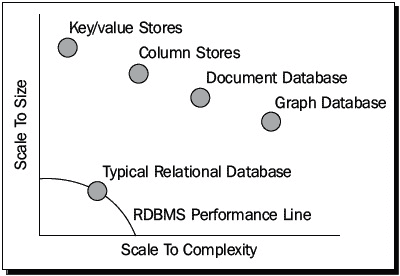

# 第一章：CouchDB 简介

> 欢迎来到 CouchDB 和 PHP Web 开发初学者指南。在这本书中，我们将学习使用 CouchDB 和 PHP 构建一个简单但功能强大的网站的方方面面。为了让你理解为什么我们在 CouchDB 中做某些事情，你首先需要了解 NoSQL 数据库的历史，并了解 CouchDB 在数据库历史中的地位是非常重要的。

在本章中，我们将：

+   简要介绍数据库的历史及其在技术中的地位

+   谈论数据库是如何演变成 NoSQL 概念的

+   通过理解 NoSQL 数据库的不同分类、CAP 定理及其避免 ACID 模型来定义 NoSQL 数据库

+   查看 CouchDB 的历史及其主要贡献者

+   谈论 CouchDB 的特殊之处

让我们首先看看数据库的演变以及 NoSQL 是如何出现的。

# NoSQL 数据库的演变

在 20 世纪 60 年代初，术语“数据库”被引入世界，作为信息系统背后的一个简单层。将应用程序与数据分离的简单概念是新颖而令人兴奋的，它为应用程序提供了更加强大的可能性。在这一点上，数据库首先存在于基于磁带的设备上，但很快就变得更加可用，作为系统直接访问磁盘上的存储。

在 1970 年，埃德加·科德提出了一种更有效的存储数据的方式——关系模型。这个模型也将使用 SQL 来允许应用程序找到其表中存储的数据。这个关系模型几乎与我们今天所知的传统关系数据库相同。虽然这个模型被广泛接受，但直到 1980 年代中期才有硬件能够有效地使用它。到了 1990 年，硬件终于赶上了，关系模型成为了存储数据的主要方法。

就像在任何技术领域一样，与关系数据库管理系统（RDBMS）竞争出现了。一些流行的 RDMBS 系统的例子包括 Oracle、Microsoft SQL Server、MySQL 和 PostgreSQL。

随着我们走过 2000 年，应用程序开始通过更复杂的应用程序产生大量的数据。社交网络进入了舞台。公司希望理解可用的大量数据。这种转变引发了关于关系模型似乎无法处理的数据结构、可扩展性和数据可用性的严重关切。面对如何管理这么大量不断变化的数据的不确定性，NoSQL 这个术语出现了。

术语“NoSQL”并不是“不使用 SQL”的缩写；它实际上代表“不仅仅是 SQL”。NoSQL 数据库是一组持久性解决方案，不遵循关系模型，也不使用 SQL 进行查询。除此之外，NoSQL 并不是为了取代关系数据库而引入的，而是为了补充关系数据库的不足之处。

## 什么使 NoSQL 不同

除了 NoSQL 数据库不使用 SQL 来查询数据之外，还有一些关键特征。为了理解这些特征，我们需要涵盖大量的术语和定义。重要的不是你要记住或记住这里的一切，而是你要知道究竟是什么构成了 NoSQL 数据库。

使 NoSQL 数据库与众不同的第一件事是它们的数据结构。有多种不同的方式可以对 NoSQL 数据库进行分类。

### NoSQL 数据库的分类

NoSQL 数据库（在大多数情况下）可以分为四种主要的数据结构：

+   键值存储：它们使用唯一的键和值保存数据。它们的简单性使它们能够非常快速地扩展到巨大的规模。

+   列存储：它们类似于关系数据库，但是不是存储记录，而是将一列中的所有值一起存储在流中。

+   **文档存储：** 它们保存数据而无需在模式中进行结构化，其中包含自包含对象内的键值对桶。这种数据结构让人想起 PHP 中的关联数组。这就是 CouchDB 所在的领域。我们将在第三章中深入探讨这个主题，*开始使用 CouchDB 和 Futon*。

+   **图数据库：** 它们以灵活的图模型存储数据，其中包含每个对象的节点。节点具有属性和与其他节点的关系。

我们不会深入讨论每种数据库的示例，但重要的是要看看现有的不同选项。通过在这个层面上查看数据库，我们可以相对容易地看到（一般来说）数据将如何按规模和复杂性进行扩展，通过查看以下屏幕截图：

如果你看一下这个图表，你会看到我放置��一个**典型的关系数据库**和一个粗糙的性能线。这条性能线给出了一个简单的想法，即数据库可能如何按规模和复杂性进行扩展。NoSQL 数据库在数据规模和复杂性方面表现得如此出色是如何可能的呢？

在大多数情况下，NoSQL 数据库是可扩展的，因为它们依赖于分布式系统并忽略了 ACID 模型。让我们通过分布式系统讨论我们获得了什么，以及我们放弃了什么，然后定义 ACID 模型。

谈到任何分布式系统（不仅仅是存储或数据库），都有一个概念定义了你可以做什么的限制。这就是所谓的 CAP 定理。

### CAP 定理

*Eric Brewer*在 2000 年引入了 CAP 定理。它指出在任何分布式环境中，不可能提供三个保证。

+   **一致性：** 系统中的所有服务器将具有相同的数据。因此，无论用户与分布式系统中的哪个节点交谈，他们都将获得最新的数据。

+   **可用性：** 所有服务器将始终返回数据。

+   **分区容错性：** 即使单个服务器失败或无法访问，系统仍将作为一个整体运行。

通过观察这些选择，你可以知道肯定希望这三个东西都能得到保证，但从理论上讲是不可能的。在现实世界中，每个 NoSQL 数据库选择了三个选项中的两个，并通常开发了某种过程来减轻第三个未处理属性的影响。

我们很快会谈论 CouchDB 采取的方法，但还有一些关于 NoSQL 数据库避免的另一个概念要学习：ACID。

### ACID

**ACID**是适用于数据库事务的一组属性，这些事务是传统关系数据库的核心。虽然事务非常强大，但它们也是使关系数据库的读写变得相当慢的因素之一。

ACID 由四个主要属性组成：

+   **原子性：** 这是一种处理数据的全盘或无。事务中的所有内容必须成功发生，否则所有更改都不会被提交。这是在系统中处理货币或货币时的关键属性，并需要一套检查和平衡系统。

+   **一致性：** 数据只有在通过数据库上的所有验证（如触发器、数据类型和约束）后才会被接受。

+   **隔离性：** 事务不会影响正在发生的其他事务，其他用户也不会看到正在进行的事务的部分结果。

+   **持久性：** 一旦数据保存，它就会在错误、崩溃和其他软件故障中得到保护。

当你阅读 ACID 的定义时，你可能会想：“这些都是必须的！”也许是这样，但请记住，大多数 NoSQL 数据库并没有完全采用 ACID，因为要同时具备所有这些限制并且仍然能够对数据进行快速写入几乎是不可能的。

### 那么所有这些意味着什么呢？

我现在给了你很多定义，但让我们试着把它们整合成几个简单的列表。让我们讨论一下 NoSQL 数据库的优缺点，何时使用，何时避免使用 NoSQL 数据库。

#### NoSQL 数据库的优势

随着 NoSQL 数据库的引入，有很多优势：

+   你可以做一些传统关系数据库的处理和查询能力无法做到的事情。

+   你的数据是可扩展和灵活的，可以更快地适应规模和复杂性，直接开箱即用。

+   有新的数据模型需要考虑。如果没有意义，你不必强迫你的数据适应关系模型。

+   写入数据非常快。

正如你所看到的，NoSQL 数据库有一些明显的优势，但正如我之前提到的，仍然有一些需要考虑的负面影响。

#### NoSQL 数据库的负面影响

然而，除了好处，也存在一些坏处：

+   没有通用标准；每个数据库都有一点点不同的做法

+   查询数据不涉及熟悉的 SQL 模型来查找记录

+   NoSQL 数据库仍然相对不成熟且不断发展

+   有新的数据模型需要考虑；有时让你的数据适应可能会令人困惑

+   因为 NoSQL 数据库避免了 ACID 模型，所以不能保证所有数据都能成功写入。

其中一些负面影响可能对你来说很容易接受，除了 NoSQL 避免 ACID 模型这一点。

#### 你应该使用 NoSQL 数据库的情况

现在我们对优缺点有了很好的了解，让我们谈谈使用 NoSQL 数据库的一些绝佳用例：

+   有大量写入的应用程序

+   数据的模式和结构可能会发生变化的应用

+   大量的非结构化或半结构化数据

+   传统的关系数据库感觉限制很多，你想尝试一些新的东西。

这个列表并不是排他性的，但在何时可以使用 NoSQL 数据库上并没有明确的定义。实际上，你可以在几乎每个项目中使用它们。

#### 你应该避免使用 NoSQL 数据库的情况

然而，有一些明显的领域，你在其中存储数据时应该避免使用 NoSQL。

+   任何涉及金钱或交易的事情。如果由于 NoSQL 避免 ACID 模型或分布式系统的数据不是 100%可用，会发生什么？

+   业务关键数据或业务应用程序，如果丢失一行数据可能会导致巨大问题。

+   需要在关系数据库中实现功能的高度结构化数据。

对于所有这些用例，你应该真正专注于使用关系数据库，以确保你的数据安全可靠。当然，在有意义的情况下，你也可以包含 NoSQL 数据库。

在选择数据库时，重要的是要记住“没有银弹”。这个短语在谈论技术时经常被使用，它意味着没有一种技术可以解决所有问题而没有任何副作用或负面后果。所以要明智选择！

# CouchDB 简介

对于这本书和我的一些项目和创业公司，我选择了 CouchDB。让我们来历史性地看一下 CouchDB，然后快速触及它对 CAP 定理的处理方式，以及它的优势和劣势。

## CouchDB 的历史

2005 年 4 月，*Damien Katz*发布了一篇关于他正在开发的新数据库引擎的博客文章，后来被称为 CouchDB，这是**Cluster Of Unreliable Commodity Hardware**的缩写。Katz 是 IBM 的前 Lotus Notes 开发人员，试图在 C++中创建一个容错的文档数据库，但很快转向**Erlang OTP**平台。随着时间的推移，CouchDB 在 Damien Katz 的自我资助下开始发展，并于 2008 年 2 月被引入 Apache 孵化器项目。最后，2008 年 11 月，它毕业为一个顶级项目。

Damien 的团队**CouchOne**在 2011 年与 Membase 团队合并，组成了一个名为**Couchbase**的新公司。这家公司成立的目的是将**CouchDB**和**Membase**合并成一个新产品，并增加产品的文档和可见性。

2012 年初，Couchbase 宣布将把重点从促进 CouchDB 转移到创建 Couchbase Server 2.0。这个新的数据库采用了与数据库不同的方法，这意味着它将不再为 CouchDB 社区做出贡献。这一消息在 CouchDB 社区引起了一些不安，直到 Cloudant 介入。

**Cloudant**，CouchDB 的主要托管公司和 BigCouch 的创建者，BigCouch 是为 CouchDB 构建的容错和水平可扩展的集群框架，宣布他们将把他们的更改合并回 CouchDB，并承担继续开发 CouchDB 的角色。

2012 年初，在撰写本文时，CouchDB 的最重要的版本是 2011 年 3 月 31 日的 1.1.1 版。但 CouchDB 1.2 即将发布！

## 定义 CouchDB

根据[`couchdb.apache.org/`](http://couchdb.apache.org/)，CouchDB 可以被定义为：

+   一个通过 RESTful JSON API 访问的文档数据库服务器

+   自由式和无模式，具有平面地址空间

+   分布式，具有强大的增量复制和双向冲突检测和管理

+   可查询和可索引，具有使用 JavaScript 作为查询语言的面向表的报告引擎。

你可能能够在行间读出，但 CouchDB 从 CAP 定理中选择了可用性和部分容忍，并专注于使用复制实现最终一致性。

我们可以深入探讨每个这些要点的含义，因为在我们深入讨论它们之前，这将占据本书的剩余部分。在每一章中，我们将开始建立在我们对 CouchDB 的知识之上，直到我们拥有一个完全运行的应用程序。

# 总结

希望你喜欢这一章，并准备深入学习 CouchDB 的方方面面。让我们回顾一下这一章学到的一切。

+   我们谈到了数据库的历史和 NoSQL 数据库的出现

+   我们定义了使用 NoSQL 的优缺点

+   我们看了 CouchDB 的定义和历史

历史课就讲到这里。打开你的电脑。在下一章中，我们将设置好一切，用 CouchDB 和 PHP 开发 Web 应用程序，并确保一切设置正确。
