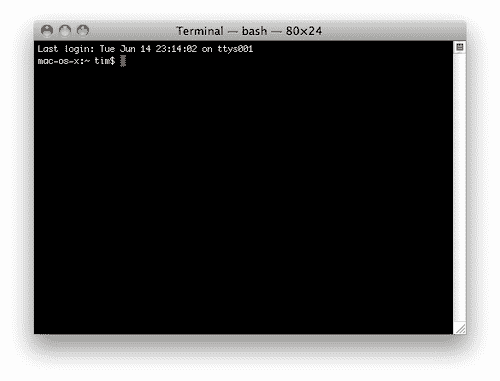
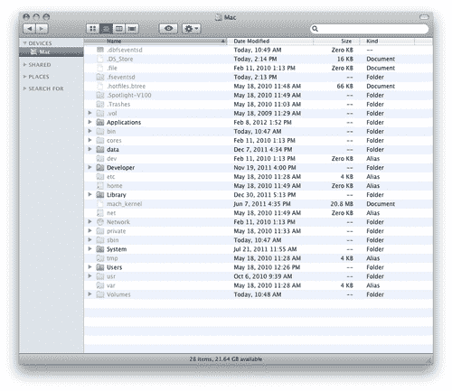
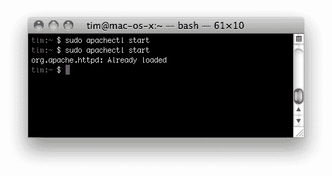
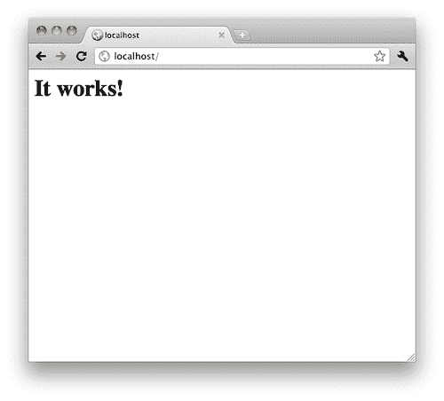
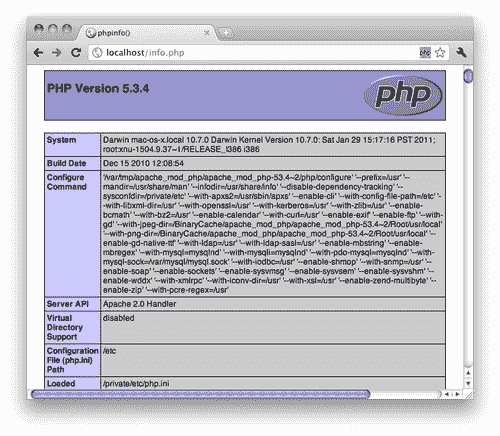

# 第二章。设置你的开发环境

> 在本章中，我们将设置你的计算机，以便你可以使用 PHP 和 CouchDB 开发 Web 应用程序。在开发 Web 应用程序时涉及到很多技术，所以在开始编写代码之前，我们需要确保我们的系统配置正确。

在本章中，我们将：

+   讨论你的操作系统以及如何安装必要的组件

+   了解开发 PHP 和 CouchDB 应用程序所需的工具

+   配置我们的 Web 开发环境

+   了解 Homebrew 并安装 CouchDB

+   使用 Homebrew 来安装 Git 进行版本控制

+   确认你可以向 CouchDB 发出请求

准备好了吗？很好！让我们开始谈论操作系统以及它们在设置你的开发环境中所起的作用。

# 操作系统

本书将主要关注 Mac OS X 操作系统（10.5 及更高版本）。虽然在任何操作系统上都可以开发 PHP 和 CouchDB 应用程序，但为了简单和简洁起见，我将大部分讨论限制在 Mac OS X 上。如果你使用的是 Mac，你可以直接跳到下一节，标题为*在 Mac OS X 上设置你的 Web 开发环境*。

如果你使用的是 Windows 或 Linux，不用担心！我会给你一些设置提示，然后你可以自己操作。值得注意的是，我在本书中使用的命令行语句是为 Mac OS 设计的。因此，一些东西，比如导航到你的工作目录，文件的位置等等可能不会按照描述的方式工作。

## Windows

如果你使用 Windows，有一些简单的步骤需要遵循才能让你的机器正常运行。

### 安装 Apache 和 PHP

你可以使用 WAMP ([`www.wampserver.com/en/`](http://www.wampserver.com/en/))或 XAMPP ([`www.apachefriends.org/en/xampp.html`](http://www.apachefriends.org/en/xampp.html))来简化 Apache 和 PHP 环境的设置。这两个选项都可以让你通过几次鼠标点击轻松设置 Apache 和 PHP。

### 安装 Git

**Git**适用于每个操作系统。要在 Windows 上安装 Git，请转到 Git 的主页（[`git-scm.com/`](http://git-scm.com/)），然后点击 Windows 图标。

### 安装 CouchDB

你可以在这里找到更多关于在 Windows 上使用 Apache 的安装页面安装 CouchDB 的信息：[`wiki.apache.org/couchdb/Installing_on_Windows`](http://wiki.apache.org/couchdb/Installing_on_Windows)。

## Linux

由于 Linux 的不同版本和配置很多，很难标准化 Linux 的`install`方法。但是如果你使用的是通用发行版，比如 Ubuntu，所有必需的工具都可以通过几个简单的命令行语句来安装。

### 安装 Apache 和 PHP

`apt-get`是一个强大的工具，我们将使用它来在你的系统中安装应用程序和实用工具。让我们首先确保`apt-get`是最新的，通过运行以下命令：

```php
**sudo apt-get update** 

```

通过安装 Apache 来确保我们可以托管我们的 PHP 页面：

```php
**sudo apt-get install apache2** 

```

既然我们有了 Apache，让我们安装 PHP 和其他一些运行本书中代码所需的组件：

```php
**sudo apt-get install php5 php5-dev libapache2-mod-php5 php5-curl php5-mcrypt** 

```

我们已经准备好托管网站所需的一切。因此，让我们重新启动 Apache 以使我们的更改生效：

```php
**sudo /etc/init.d/apache2 restart** 

```

### 安装 Git

我们将使用 Git 进行源代码控制；幸运的是，通过我们的朋友`apt-git`的帮助，安装它非常容易。通过运行以下命令来安装 Git：

```php
**sudo apt-get install git-core** 

```

### 安装 CouchDB

CouchDB 是本书中我们将使用的数据库。在本节中，我们将使用命令行安装和启动它。

1.  使用`apt-get`安装 CouchDB：

```php
    **sudo apt-get install couchDB** 

    ```

1.  通过运行以下命令将 CouchDB 作为服务启动：

```php
    **sudo /etc/init.d/couchdb start** 

    ```

是不是很容易？如果你使用的是其他 Linux 发行版，那么你可能需要研究如何安装所有必需的应用程序和工具。

既然我们已经解决了这个问题，让我们讨论一下在 Mac OS X 上设置 Web 开发环境。

# 在 Mac OS X 上设置你的 Web 开发环境

在这一部分，我们将逐步确保我们的开发环境设置正确。从现在开始，我假设你正在使用运行 Mac OS X 的机器，没有对 Apache 或 PHP 进行任何特殊修改。如果你对开发环境进行了很多定制，那么你可能已经知道如何配置你的机器，使一切正常工作。

现在我已经用免责声明把你弄得厌烦了，让我们开始吧！我们旅程的第一部分是认识一个我们将花费大量时间的应用程序：`Terminal`。

## Terminal

`Terminal`是 Mac OS X 内置的命令行实用程序。当你刚开始使用命令行时，可能会有点奇怪的体验，但一旦掌握了，它就非常强大。如果基本命令，如`cd, ls`和`mkdir`对你来说像胡言乱语，那么你可能需要快速了解一下 UNIX 命令行。

这是如何打开`Terminal`的：

1.  打开**Finder**。

1.  点击**应用程序**。

1.  找到名为**实用工具**的文件夹，并打开它。

1.  将**Terminal**图标拖到你的 dock 中；你会经常使用它！

1.  点击你 dock 中的**Terminal**图标。

# 行动时间——使用 Terminal 显示隐藏文件

现在我们已经启动了`Terminal`，让我们通过运行一个快速命令来熟悉它，这个命令会显示你电脑上所有的隐藏文件。不管你知不知道，有各种各样的文件是隐藏的，它们需要可见才能完成我们的开发环境设置。

1.  首先打开**Terminal**。

1.  输入以下命令以允许 Finder 显示隐藏文件，准备好后按*Enter*：

```php
    **defaults write com.apple.finder AppleShowAllFiles TRUE** 

    ```

1.  为了看到文件，你需要重新启动`Finder`，输入以下命令，然后按*Enter*：

```php
    **killall Finder** 

    ```

## 刚刚发生了什么？

我们刚刚使用`Terminal`运行了一个特殊命令，配置了`Finder`显示隐藏文件，然后运行了另一个命令重新启动了`Finder`。你不需要记住这些命令或完全理解它们的含义；你可能永远不需要再次输入这些命令。如果你四处看看你的电脑，你应该会看到很多以前没见过的文件。这是我电脑上的一个快速示例：



### 提示

如果看到这么多文件让你烦恼，你可以在设置完成后再次隐藏隐藏文件。你只需在`Terminal`中运行以下命令：defaults write `com.apple.finder AppleShowAllFiles FALSE`。然后通过运行以下命令重新启动`Finder`：`killall Finder`。

现在我们的机器上所有的文件都显示出来了，让我们谈谈文本编辑器，这将是你查看和编辑开发项目的主要方式。

## 文本编辑器

为了编写代码，你需要一个可靠的文本编辑器。有很多文本编辑器可供选择，你可以使用任何你喜欢的。本书中的所有代码都适用于任何文本编辑器。我个人更喜欢`TextMate`，因为它简单易用。

你可以在这里下载并安装`TextMate`：[`macromates.com/`](http://macromates.com/)。

## Apache

Apache 是一个开源的 Web 服务器，也是将在本书中编写的 PHP 代码运行的引擎。幸运的是，Apache 预装在所有的 Mac OS X 安装中，所以我们只需要使用`Terminal`来启动它。

1.  打开**Terminal**。

1.  运行以下命令启动 Apache：

```php
    **sudo apachectl start** 

    ```

这就是在你的电脑上启动 Apache 所需的全部。如果 Apache 已经在运行，它不会让你启动它。尝试再次输入相同的语句；你的机器会提醒你它已经在运行了：



### 注意

这很不可能，但万一您的机器没有安装 Apache，您可以按照 Apache 网站上的说明进行安装：[`httpd.apache.org/docs/2.0/install.html`](http://httpd.apache.org/docs/2.0/install.html)。

## Web 浏览器

您可能每天都在上网时使用 Web 浏览器，但它也可以作为我们强大的调试工具。我将使用 Chrome 作为我的 Web 浏览器，但 Safari、Firefox 或 Internet Explorer 的最新版本也可以正常工作。让我们使用我们的 Web 浏览器来检查 Apache 是否可访问。

# 行动时间-打开您的 Web 浏览器

我们将通过打开 Web 浏览器并导航到 Apache 的 URL 来访问我们机器上的 Apache 服务。

1.  打开您的 Web 浏览器。

1.  在地址栏中输入`http://localhost`，然后按*Enter*键。

1.  您的浏览器将向您显示以下消息：

## 刚刚发生了什么？

我们使用 Web 浏览器访问了 Apache，作为回报，它向我们显示了一个快速的验证，证明一切都正确连接。我们的计算机知道我们正在尝试访问本地 Apache 服务，因为 URL`http://localhost`。URL`http://localhost`实际上映射到地址`http://127.0.0.1:80`，这是 Apache 服务的地址和端口。当我们讨论 CouchDB 时，您将再次看到`127.0.0.1`。

## PHP

`PHP`是本书的标题，因此您知道它将在开发过程中发挥重要作用。PHP 已经安装在您的机器上，因此您无需安装任何内容。让我们通过 Terminal 再次检查您是否可以访问 PHP。

# 行动时间-检查您的 PHP 版本

我们将通过 Terminal 访问您的计算机上的 PHP 来检查 PHP 是否正常工作。

1.  打开**Terminal**。

1.  运行以下命令以返回 PHP 的版本：

```php
    **php -v** 

    ```

1.  **Terminal**将以类似以下内容的方式做出响应：

## 刚刚发生了什么？

我们使用**Terminal**确保我们的机器上的 PHP 正确运行。我们不仅检查了 PHP 是否可访问，还要求其版本。您的版本可能与我的略有不同，但只要您的版本是 PHP 5.3 或更高版本即可。

### 注意

如果您的版本低于 PHP 5.3 或无法使 PHP 响应，您可以通过查看 PHP 手册进行安装或升级：[`php.net/manual/en/install.macosx.php`](http://php.net/manual/en/install.macosx.php)。

# 行动时间-确保 Apache 可以连接到 PHP

为了创建一个 Web 应用程序，Apache 需要能够运行 PHP 代码。因此，我们将检查 Apache 是否可以访问 PHP。

1.  使用**Finder**导航到以下文件夹：`/etc/apache2`。

1.  在您的文本编辑器中打开名为`httpd.conf`的文件。

1.  查看文件，并找到以下行（它应该在第 116 行左右）：

```php
    **#LoadModule php5_module libexec/apache2/libphp5.so** 

    ```

1.  删除`config`文件中位于此字符串前面的哈希（#）符号以取消此行的注释。您的配置文件可能已经取消了此注释。如果是这样，那么您无需更改任何内容。无论如何，最终结果应如下所示：

```php
    **LoadModule php5_module libexec/apache2/libphp5.so** 

    ```

1.  打开**Terminal**。

1.  通过运行以下命令重新启动 Apache：

```php
    **sudo apachectl restart** 

    ```

## 刚刚发生了什么？

我们打开了 Apache 的主配置文件`httpd.conf`，并取消了一行的注释，以便 Apache 可以加载 PHP。然后我们重新启动了 Apache 服务器，以便更新的配置生效。

# 行动时间-创建一个快速信息页面

我们将通过快速创建一个`phpinfo`页面来双重检查 Apache 是否能够渲染 PHP 脚本，该页面将显示有关您配置的大量数据。

1.  打开您的文本编辑器。

1.  创建一个包含以下代码的新文件：

```php
    <?php phpinfo(); ?>

    ```

1.  将文件保存为`info.php`，并将该文件保存在以下位置：`/Library/WebServer/Documents/info.php`。

1.  打开您的浏览器。

1.  将浏览器导航到`http://localhost/info.php`。

1.  您的浏览器将显示以下页面：

## 刚刚发生了什么？

我们使用文本编辑器创建了一个名为`info.php`的文件，其中包含一个名为`phpinfo`的特殊 PHP 函数。我们将`info.php`文件保存到文件夹：`/Library/Webserver/Documents`。这个文件夹是 Apache 服务将显示的所有文件的默认位置（仅适用于 Mac OS X）。当您的浏览器访问`info.php`页面时，`phpinfo`会查看您的 PHP 安装并返回一个包含有关您配置详细信息的 HTML 文件。您可以看到这里有很多事情要做。在我们继续之前，随意浏览并查看一些信息。

## 微调 Apache

我们最终建立了基本的 Web 开发环境。但是，为了构建我们的应用程序，我们需要调整 Apache 中的一些内容；首先是启用一个名为`mod_rewrite`的内置模块。

# 行动时间 — 进一步配置 Apache

`mod_rewrite`将允许我们动态重写请求的 URL，这将帮助我们构建具有清晰 URL 的应用程序。重写本身在另一个名为`.htaccess`的 Apache 配置文件中处理，我们将在第四章 *启动您的应用程序*中介绍。在下一节中，我们将配置 Apache，以便启用`mod_rewrite`。

1.  使用**Finder**导航到以下文件夹：`/etc/apache2`。

1.  在文本编辑器中找到并打开名为`httpd.conf`的文件。

1.  浏览文件，并找到此行（应该是第 114 行）：

```php
    **#LoadModule rewrite_module libexec/apache2/mod_rewrite.so** 

    ```

1.  取消注释行，删除井号（#）符号。您的系统可能已经配置为启用`mod_rewrite`。无论如何，请确保它与以下代码匹配：

```php
    **LoadModule rewrite_module libexec/apache2/mod_rewrite.so** 

    ```

1.  浏览文件，并找到此代码块（应该从第 178-183 行开始）：

```php
    <Directory />
    Options FollowSymLinks
    AllowOverride None
    Order deny,allow
    Allow from all
    </Directory>

    ```

1.  更改代码行，将`AllowOverride None`更改为`AllowOverride All`。结果部分应如下所示：

```php
    <Directory />
    Options FollowSymLinks
    **AllowOverride All** 
    Order deny,allow
    Allow from all
    </Directory>

    ```

1.  继续滚动文件，直到找到这段代码（应该从第 210-215 行开始）：

```php
    #
    # AllowOverride controls what directives may be placed in #.htaccess files.
    # It can be —All—, —None—, or any combination of the keywords:
    # Options FileInfo AuthConfig Limit
    #
    AllowOverride None

    ```

1.  更改此代码行，将`AllowOverride None`更改为`AllowOverride All`。结果部分应如下所示：

```php
    #
    # AllowOverride controls what directives may be placed in #.htaccess files.
    # It can be "All", "None", or any combination of the keywords:
    # Options FileInfo AuthConfig Limit
    #
    AllowOverride All

    ```

1.  打开**Terminal**。

1.  通过运行以下命令重新启动 Apache：

```php
    **sudo apachectl restart** 

    ```

## 刚刚发生了什么？

我们刚刚配置了 Apache，使其可以更自由地运行，并包括使用`mod_rewrite`模块重写 URL 的能力。然后，我们将`AllowOverride`的配置从`None`更改为`All`。`AllowOverride`告诉服务器在找到`.htaccess`文件时该怎么做。将此设置为`None`时，将忽略`.htaccess`文件。将设置更改为`All`允许在`.htaccess`文件中覆盖设置。这正是我们将在第四章中开始构建应用程序时要做的事情。

## 我们的 Web 开发设置已经完成！

我们现在已经设置好了创建标准 Web 应用程序的一切。我们有 Apache 处理请求。我们已经连接并响应来自 Apache 的 PHP 调用，并且我们的文本编辑器已准备好接受我们可以投入其中的任何代码。

我们还需要一些部分才能拥有完整的开发环境。在下一节中，我们将安装 CouchDB 作为我们的数据库。

## 安装 CouchDB

在本节中，我们将在您的计算机上安装 CouchDB 1.0 并为其进行开发准备。有多种方法可以在您的计算机上安装 CouchDB，因此如果您在以下安装过程中遇到问题，请参考 CouchDB 的网站：[`wiki.apache.org/couchdb/Installation`](http://wiki.apache.org/couchdb/Installation)。

## Homebrew

为了安装本书中将使用的其余组件，我们将使用一个名为**Homebrew**的实用程序。Homebrew 是安装苹果 OSX 中遗漏的 UNIX 工具的最简单方法。在我们可以使用 Homebrew 安装其他工具之前，我们首先需要安装 Homebrew。

# 安装 Homebrew 的时间到了

我们将使用**终端**下载 Homebrew 并将其安装到我们的计算机上。

1.  打开**终端**。

1.  在**终端**中输入以下命令，每行后按*Enter*：

```php
    **sudo mkdir -p /usr/local
    sudo chown -R $USER /usr/local
    curl -Lf http://github.com/mxcl/homebrew/tarball/master | tar xz -- strip 1 -C/usr/local** 

    ```

1.  **终端**将会显示一个进度条，告诉你安装过程进行得如何。安装完成后，你会收到一个成功的消息，然后你就可以再次控制**终端**了。

## 刚刚发生了什么？

我们添加了目录`/usr/local`，这是 Homebrew 将保存所有文件的位置。然后我们确保该文件夹归我们所有（当前用户）。然后我们使用`cURL`语句从 Github 获取存储库（我将在本章后面介绍`cURL`；我们将经常使用它）。获取存储库后，使用命令行函数`tar`解压缩，并将其放入`/usr/local`文件夹中。

# 安装 CouchDB 的时间到了

现在我们已经安装了 Homebrew，终于可以安装 CouchDB 了。

### 注意

请注意，在 Homebrew 安装 CouchDB 之前，它将安装所有的依赖项，包括：Erlang，Spidermonkey，ICU 等。这一部分可能需要 10-15 分钟才能完成，因为它们是在您的计算机上本地编译的。如果看起来花费的时间太长，不要担心；这是正常的。

我们将使用 Homebrew 安装 CouchDB。

1.  打开终端

1.  运行以下命令：

```php
    **brew install couchdb -v** 

    ```

1.  接下来的几分钟，终端将会回复大量的文本。您将看到它获取每个依赖项，然后安装它。最后，您将收到一个成功的消息。

## 刚刚发生了什么？

我们刚刚从源代码安装了 CouchDB 并下载了所有的依赖项。安装完成后，Homebrew 将所有内容放在正确的文件夹中，并配置了我们使用 CouchDB 所需的一切。

# 检查我们的设置是否完成

在过去的几页中，我们已经完成了很多工作。我们已经设置好了我们的 Web 开发环境并安装了 CouchDB。现在，让我们再次确认我们能否运行和访问 CouchDB。

## 启动 CouchDB

CouchDB 很容易管理。它作为一个服务运行，我们可以使用命令行启动和停止它。让我们用命令行语句启动 CouchDB。

1.  打开**终端**。

1.  运行以下命令：

```php
    **couchdb -b** 

    ```

1.  **终端**将回复以下内容：

```php
    **Apache CouchDB has started, time to relax.** 

    ```

太好了！现在我们已经将 CouchDB 作为后台进程启动，它将在后台处理请求，直到我们关闭它。

# 检查 CouchDB 是否正在运行的时间到了

我们将尝试使用命令行实用程序`cURL`（为了简单起见，我们将其拼写为`curl`）来访问我们机器上的 CouchDB 服务，它允许您发出原始的 HTTP 请求。`curl`是我们与 CouchDB 进行通信的主要方法。让我们从一个`curl`语句开始与 CouchDB 交流。

1.  打开**终端**。

1.  运行以下语句创建一个将访问 CouchDB 的请求：

```php
    **curl http://127.0.0.1:5984/** 

    ```

1.  **终端**将回复以下内容：

```php
    **{"couchdb":"Welcome","version":"1.0.2"}** 

    ```

## 刚刚发生了什么？

我们刚刚使用`curl`通过发出`GET`请求与 CouchDB 服务进行通信。默认情况下，`curl`会假定我们正在尝试发出`GET`请求，除非我们告诉它不是。我们向`http://127.0.0.1:5984`发出了我们的`curl`语句。将这个资源分解成几部分，`http://127.0.0.1`是我们本地计算机的 IP，`5984`是 CouchDB 默认运行的端口。

## 作为后台进程运行 CouchDB

如果我们在这里停止配置，您将不得不在每次开始开发时运行`couchdb b`。这对我们来说很快就会成为一个痛点。因此，让我们将 CouchDB 作为一个系统守护程序运行，即使在重新启动计算机后也会一直在后台运行。为了做到这一点，我们将使用一个名为`launchd`的 Mac OS X 服务管理框架，该框架管理系统守护程序并允许启动和停止它们。

1.  打开**终端**。

1.  通过运行以下命令杀死 CouchDB 的后台进程：

```php
    **couchdb -k** 

    ```

1.  如果 CouchDB 正在运行，它将返回以下文本：

```php
    **Apache CouchDB has been killed.** 

    ```

1.  让我们将 CouchDB 作为一个真正的后台进程运行，并确保每次启动计算机时都会运行它，通过运行以下语句：

```php
    **launchctl load -w /usr/local/Cellar/couchdb/1.0.2/Library/LaunchDaemons/org.apache.couchdb.plist** 

    ```

### 注意

如果您的 CouchDB 版本与我的不同，您将不得不更改此脚本中的版本，该脚本显示为"1.0.2"，以匹配您的版本。

CouchDB 现在在后台运行，即使我们重新启动计算机，也不必担心在尝试使用它之前启动服务。

如果由于某种原因，您决定不希望 CouchDB 在后台运行，您可以通过运行以下命令卸载它：

```php
**launchctl unload /usr/local/Cellar/couchdb/1.0.2/Library/LaunchDaemons/org.apache.couchdb.plist** 

```

您可以通过使用我们之前使用的`curl`语句来双重检查 CouchDB 是否正在运行：

1.  打开**终端**。

1.  运行以下命令：

```php
    **curl http://127.0.0.1:5984/** 

    ```

1.  **终端**将回复以下内容：

```php
    **{"couchdb":"Welcome","version":"1.0.2"}** 

    ```

# 安装版本控制

版本控制系统允许开发人员跟踪代码更改，合并其他开发人员的代码，并回滚任何无意的错误。对于有几个开发人员的项目，版本控制系统是必不可少的，但对于单个开发人员项目也可能是一个救命稻草。把它想象成一个安全网-如果您不小心做了一些您不想做的事情，那么源代码控制就在那里保护您。在版本控制方面有几种选择，但在本书中，我们将使用 Git。

## Git

Git ([`git-scm.com/`](http://git-scm.com/))已经成为更受欢迎和广泛采用的版本控制系统之一，因为它的分布式性和易用性。实际使用 Git 的唯一比安装更容易的事情就是安装它。我们将使用 Homebrew 来安装 Git，就像我们用 CouchDB 一样。

# 行动时间-安装和配置 Git

准备好了！我们将使用 Homebrew 在计算机上安装 Git。

1.  打开**终端**。

1.  运行以下命令使用 Homebrew 安装 Git：

```php
    **brew install git** 

    ```

1.  **终端**将在短短几分钟内为您下载并安装 Git。然后，它将以成功消息回复您，告诉您 Git 已安装。

1.  安装 Git 后，您需要配置它，以便在提交数据更改时知道您是谁。运行以下命令来标识自己，并确保在我放置`Your Name`和`your_email@domain.com`的地方填写您自己的信息：

```php
    **git config global user.name "Your Name"
    git config global user.email your_email@domain.com** 

    ```

## 刚刚发生了什么？

我们刚刚使用 Homebrew 从源代码安装了 Git。然后，我们配置了 Git 以使用我们的姓名和电子邮件地址。这些设置将确保从这台机器提交到源代码控制的任何更改都能被识别。

# 你遇到了什么问题吗？

我们已经完成了配置我们的系统！在一个完美的世界中，一切都会顺利安装，但完全有可能有些东西安装不完美。如果似乎有些东西不正常，或者您认为自己可能在某个地方打错了字，我有一个脚本可以帮助您重新回到正轨。这个命令可以通过在**终端**中调用我在 github 上的一个文件来本地执行。您只需在**终端**中运行以下命令，它将运行本章所需的所有必要代码：

**sh <(curl -s https://raw.github.com/timjuravich/environment-setup/master/ configure.sh)**

这个脚本将完成本节中提到的所有工作，并且可以安全地运行多次。我本可以给你这个命令并在几页前结束这一章，但这一章对教会你如何使用我们将在接下来的章节中使用的工具和实用程序是至关重要的。

## 小测验

1.  当我们使用默认的 Apache 安装进行 Web 开发时，默认的工作目录在哪里？

1.  为了在本地开发环境中使用 CouchDB，我们需要确保两个服务正在运行。它们是什么，你如何在**终端**中让它们运行？

1.  你使用什么命令行语句来向 CouchDB 发出`Get`请求？

# 总结

让我们快速回顾一下本章涵盖的所有内容：

+   我们熟悉了**终端**并用它来显示隐藏文件

+   我们安装了一个文本编辑器供我们在开发中使用

+   我们学会了如何配置 Apache 以及如何通过命令行与其交互

+   我们学会了如何创建简单的 PHP 文件，并将它们放在正确的位置，以便 Apache 可以显示它们

+   我们学会了如何安装 Homebrew，然后用它来安装 CouchDB 和 Git

+   我们检查了一下，确保 CouchDB 已经启动运行

在下一章中，我们将更加熟悉 CouchDB，并探索如何在创建我们的 Web 应用程序中使用它。
