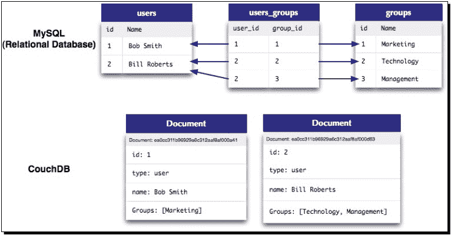
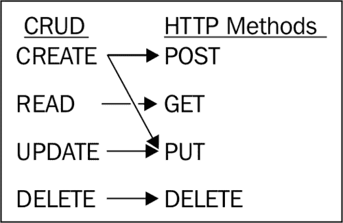
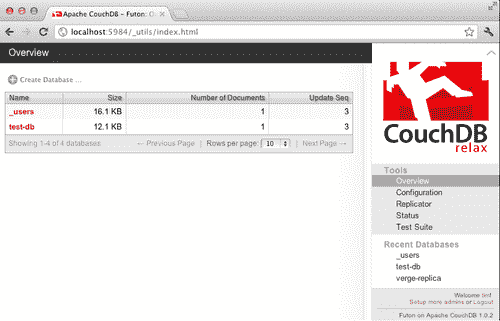
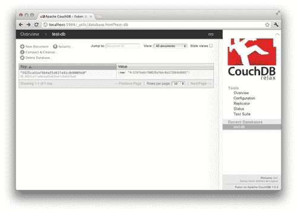
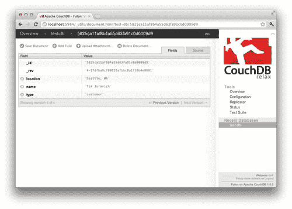
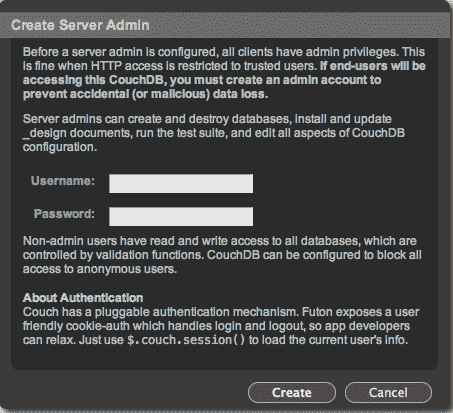
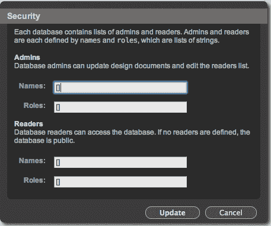

# 第三章。开始使用 CouchDB 和 Futon

> 在上一章中，我们设置了开发环境，我相信你迫不及待地想知道 CouchDB 对我们有什么作用。在这一点上，我们将花费整整一章的时间来深入了解 CouchDB。

具体来说，我们将：

+   深入了解 CouchDB 的含义，学习它在数据库和文档中的样子

+   学习我们将如何通过其 RESTful JSON API 与 CouchDB 交互

+   使用 CouchDB 内置的管理控制台：Futon

+   学习如何向 CouchDB 数据库添加安全性

# 什么是 CouchDB？

CouchDB 的定义（由[`couchdb.apache.org/)`](http://couchdb.apache.org/)定义）的第一句是：

> CouchDB 是一个文档数据库服务器，可通过 RESTful JSON API 访问。

让我们解剖这个句子，充分理解它的含义。让我们从术语**数据库服务器**开始。

## 数据库服务器

CouchDB 采用了面向文档的数据库管理系统，提供了一组没有模式、分组或层次结构的文档。这是**NoSQL**引入的概念，与关系数据库（如 MySQL）有很大的不同，您会期望在那里看到表、关系和外键。每个开发人员都经历过一个项目，他们不得不将关系数据库模式强加到一个真正不需要表和复杂关系的项目中。这就是 CouchDB 与众不同的地方；它将所有数据存储在一个自包含的对象中，没有固定的模式。下面的图表将有助于说明这一点：



在前面的例子中，我们可能希望方便许多用户属于一对多的组。为了在关系数据库（如 MySQL）中处理这个功能，我们需要创建一个用户表、一个组表，以及一个名为`users_groups`的链接表，允许您将许多用户映射到许多组。这种做法对大多数 Web 应用程序都很常见。

现在看看 CouchDB 文档。这里没有表或链接表，只有文档。这些文档包含与单个对象相关的所有数据。

### 注意

这个图表非常简化。如果我们想在 CouchDB 中创建更多关于组的逻辑，我们将不得不创建**组**文档，并在用户文档和组文档之间建立简单的关系。随着我们深入学习，我们将介绍如何处理这种类型的关系。

在本节中，我们经常看到术语**文档**。所以让我们进一步了解文档是什么，以及 CouchDB 如何使用它们。

## 文档

为了说明你可能如何使用文档，首先想象一下你在填写工作申请表的纸质表格。这个表格包含关于你、你的地址和过去地址的信息。它还包含关于你过去的工作、教育、证书等许多信息。一个文档会将所有这些数据保存下来，就像你在纸质表格上看到的那样 - 所有信息都在一个地方，没有任何不必要的复杂性。

在 CouchDB 中，文档被存储为包含键值对的 JSON 对象。每个文档都有保留字段用于元数据，如`id, revision`和`deleted`。除了保留字段，文档是 100%无模式的，这意味着每个文档可以根据需要格式化和独立处理，有许多不同的变化。

### CouchDB 文档的示例

让我们看一个 CouchDB 文档可能是什么样子的例子：

```php
{
"_id": "431f956fa44b3629ba924eab05000553",
"_rev": "1-c46916a8efe63fb8fec6d097007bd1c6",
"title": "Why I like Chicken",
"author": "Tim Juravich",
"tags": [
"Chicken",
"Grilled",
"Tasty"
],
"body": "I like chicken, especially when it's grilled."
}

```

### 提示

**下载示例代码**

您可以从您在[`www.packtpub.com`](http://www.packtpub.com)的帐户中购买的所有 Packt 图书下载示例代码文件。如果您在其他地方购买了这本书，您可以访问[`www.packtpub.com/support`](http://www.packtpub.com/support)并注册，文件将直接通过电子邮件发送给您。

### JSON 格式

你可能注意到的第一件事是文档的奇怪标记，这是 **JavaScript 对象表示法（JSON）**。JSON 是一种基于 JavaScript 语法的轻量级数据交换格式，非常便携。CouchDB 使用 JSON 进行与其所有通信，因此在阅读本书的过程中，您将对其非常熟悉。

### 键值存储

接下来，您可能注意到这个文档中有很多信息。有一些简单易懂的键值对，比如 `"title", "author"` 和 `"body"`，但您还会注意到 `"tags"` 是一个字符串数组。CouchDB 允许您直接将尽可能多的信息嵌入到文档中。这对于习惯于规范化和结构化数据库的关系数据库用户来说可能是一个新概念。

### 保留字段

我们之前提到了保留字段。让我们来看看您在前面的示例文档中看到的两个保留字段：`_id` 和 `_rev`。

`_id` 是文档的唯一标识符。这意味着 `_id` 是必需的，没有两个文档可以具有相同的值。如果在创建文档时没有定义 `_id`，CouchDB 将为您选择一个唯一的值。

`_rev` 是文档的修订版本，是帮助驱动 CouchDB 版本控制系统的字段。每次保存文档时，都需要修订号，以便 CouchDB 知道哪个版本的文档是最新的。这是必需的，因为 CouchDB 不使用锁定机制，这意味着如果两个人同时更新文档，那么先保存更改的人获胜。CouchDB 修订系统的一个独特之处在于，每次保存文档时，原始文档不会被覆盖，而是创建一个新的带有新数据的文档，同时 CouchDB 以其原始形式存储先前文档的备份。旧的修订版本保持可用，直到数据库被压缩或发生某些清理操作。

定义句子的最后一部分是 RESTful JSON API。接下来让我们来介绍它。

## RESTful JSON API

为了理解 REST，让我们首先定义 **超文本传输协议（HTTP）**。HTTP 是互联网的基础协议，它定义了消息的格式和传输方式，以及在使用各种方法时服务应该如何响应。这些方法包括 `GET, PUT, POST` 和 `DELETE` 等四个主要动词。为了充分理解 HTTP 方法的功能，让我们首先定义 REST。

**表述状态转移（REST）** 是一种通过 HTTP 方法访问可寻址资源的无状态协议。**无状态** 意味着每个请求包含了完全理解和使用请求中的数据所需的所有信息，**可寻址资源** 意味着您可以通过 URL 访问对象。

这本身可能并不意味着太多，但是将所有这些想法结合在一起，它就成为了一个强大的概念。让我们通过两个例子来说明 REST 的强大之处：

| 资源 | 获取 | 放置 | 发布 | 删除 |
| --- | --- | --- | --- | --- |
| `http://localhost/collection` | **读取** `collection` 中所有项目的列表 | **更新** 另一个 `collection` | **创建** 一个新的 `collection` | **删除** `collection` |
| `http://localhost/collection/abc123` | **读取** `collection` 中 `abc123` 项目的详细信息 | **更新** `collection` 中 `abc123` 的详细信息 | **创建** `collection` 中的新对象 `abc123` | **从 `collection` 中删除** `abc123` |

通过查看表格，您可以看到每个资源都以 URL 的形式存在。第一个资源是 `collection`，第二个资源是 `abc123`，它位于 `collection` 中。当您对这些资源传递不同的方法时，每个资源会有不同的响应。这就是 REST 和 HTTP 共同工作的美妙之处。

请注意我在表中使用的粗体字：**读取，更新，创建**和**删除**。这些词实际上是另一个概念，当然，它有自己的术语；**CRUD**。这个不太动听的术语 CRUD 代表创建、读取、更新和删除，是 REST 用来定义当 HTTP 方法与 URL 形式的资源结合时发生的情况的概念。因此，如果您要将所有这些都归纳起来，您将得到以下图表：



这个图表的含义是：

+   为了**创建**一个资源，您可以使用**POST**或**PUT**方法

+   为了**读取**一个资源，您需要使用**GET**方法

+   为了**更新**一个资源，您需要使用**PUT**方法

+   为了**删除**一个资源，您需要使用**DELETE**方法

正如您所看到的，CRUD 的这个概念使得清楚地找出您在执行特定操作时需要使用的方法。

现在我们已经了解了 REST 的含义，让我们继续学习术语**API**，它代表**应用程序编程接口**。虽然有很多不同的用例和 API 的概念，但 API 是我们将用来与 CouchDB 进行编程交互的工具。

现在我们已经定义了所有术语，RESTful JSON API 可以定义如下：我们可以通过向 CouchDB API 发出 HTTP 请求并定义资源、HTTP 方法和任何额外数据来与 CouchDB 进行交互。结合所有这些意味着我们正在使用 REST。在 CouchDB 处理我们的 REST 请求后，它将返回一个 JSON 格式的响应，其中包含请求的结果。

当我们逐个浏览每个 HTTP 方法时，所有这些背景知识将开始变得有意义，因为我们将使用 CouchDB 的 RESTful JSON API 进行操作。

我们将使用`curl`（我们在上一章中学习使用的）通过发出原始 HTTP 请求来探索每个 HTTP 方法。

# 执行操作——获取 CouchDB 中所有数据库的列表

在本书的前面，当我们使用`curl`语句：`curl http://localhost:5984`时，您已经看到了一个`GET`请求。

这一次，让我们发出一个`GET`请求来访问 CouchDB 并获取服务器上所有数据库的列表。

1.  在**终端**中运行以下命令：

```php
    **curl -X GET http://localhost:5984/_all_dbs** 

    ```

1.  **终端**将会返回以下内容：

```php
    **["_users"]** 

    ```

## 刚刚发生了什么？

我们使用**终端**触发了一个`GET`请求到 CouchDB 的 RESTful JSON API。我们使用了`curl`的一个选项：`-X`，来定义 HTTP 方法。在这种情况下，我们使用了`GET`。`GET`是默认方法，所以在技术上，如果您愿意，您可以省略`-X`。一旦 CouchDB 处理了请求，它会返回一个包含 CouchDB 服务器中所有数据库列表的响应。目前，只有`_users`数据库，这是 CouchDB 用于验证用户的默认数据库。

# 执行操作——在 CouchDB 中创建新的数据库

在这个练习中，我们将发出一个`PUT`请求，这将在 CouchDB 中创建一个新的数据库。

1.  通过在**终端**中运行以下命令创建一个新的数据库：

```php
    **curl -X PUT http://localhost:5984/test-db** 

    ```

1.  **终端**将会返回以下内容：

```php
    **{"ok":true}** 

    ```

1.  尝试使用**终端**中的以下命令创建另一个同名数据库：

```php
    **curl -X PUT http://localhost:5984/test-db** 

    ```

1.  **终端**将会返回以下内容：

```php
    **{"error":"file_exists","reason":"The database could not be created, the file already exists."}** 

    ```

1.  好吧，那没用。所以让我们尝试通过在**终端**中运行以下命令创建一个不同名称的数据库：

```php
    **curl -X PUT http://localhost:5984/another-db** 

    ```

1.  **终端**将会返回以下内容：

```php
    **{"ok":true}** 

    ```

1.  让我们快速检查`test-db`数据库的详细信息，并查看更多关于它的详细信息。为此，请在**终端**中运行以下命令：

```php
    **curl -X GET http://localhost:5984/test-db** 

    ```

1.  **终端**将会返回类似于以下内容（我重新格式化了我的内容以便阅读）：

```php
    **{
    "committed_update_seq": 1,
    "compact_running": false,
    "db_name": "test-db",
    "disk_format_version": 5,
    "disk_size": 4182,
    "doc_count": 0,
    "doc_del_count": 0,
    "instance_start_time": "1308863484343052",
    "purge_seq": 0,
    "update_seq": 1
    }** 

    ```

## 刚刚发生了什么？

我们刚刚使用**终端**来触发了一个`PUT`方法，通过 CouchDB 的 RESTful JSON API 来创建数据库，将`test-db`作为我们想要在 CouchDB 根 URL 的末尾创建的数据库的名称。当数据库成功创建时，我们收到了一条一切正常的消息。

接下来，我们发出了一个`PUT`请求来创建另一个同名`test-db`数据库。因为不能有多个同名数据库，我们收到了一个错误消息。

然后我们使用`PUT`请求再次创建一个新的数据库，名为`another-db`。当数据库成功创建时，我们收到了一条一切正常的消息。

最后，我们向我们的`test-db`数据库发出了一个`GET`请求，以了解更多关于数据库的信息。知道每个统计数据的确切含义并不重要，但这是一个了解数据库概况的有用方式。

值得注意的是，在最后的`GET`请求中调用的 URL 与我们创建数据库时调用的 URL 相同。唯一的区别是我们将 HTTP 方法从`PUT`改为了`GET`。这就是 REST 的工作原理！

# 行动时间——删除数据库在 CouchDB

在这个练习中，我们将调用`DELETE`请求来删除`another-db`数据库。

1.  通过在**终端**中运行以下命令删除`another-db`：

```php
    **curl -X DELETE http://localhost:5984/another-db** 

    ```

1.  **终端**将会回复以下内容：

```php
    **{"ok":true}** 

    ```

## 刚刚发生了什么？

我们使用**终端**来触发 CouchDB 的 RESTful JSON API 的`DELETE`方法。我们在根 URL 的末尾传递了我们想要删除的数据库的名称`another-db`。当数据库成功删除时，我们收到了一条一切正常的消息。

# 行动时间——创建 CouchDB 文档

在这个练习中，我们将通过发起`POST`调用来创建一个文档。你会注意到我们的`curl`语句将开始变得有点复杂。

1.  通过在**终端**中运行以下命令在`test-db`数据库中创建一个文档：

```php
    **curl -X POST -H "Content-Type:application/json" -d '{"type": "customer", "name":"Tim Juravich", "location":"Seattle, WA"}' http://localhost:5984/test-db** 

    ```

1.  **终端**将会回复类似以下的内容：

```php
    **{"ok":true,"id":"39b1fe3cdcc7e7006694df91fb002082","rev":"1-8cf37e845c61cc239f0e98f8b7f56311"}** 

    ```

1.  让我们从 CouchDB 中检索新创建的文档。首先复制你在**终端**最后一次响应中收到的 ID 到你的剪贴板；我的是`39b1fe3cdcc7e7006694df91fb002082`，但你的可能不同。然后在**终端**中运行这个命令，将你的 ID 粘贴到 URL 的末尾：

```php
    **curl -X GET http://localhost:5984/test-db/41198fc6e20d867525a8faeb7a000015 | python -mjson.tool** 

    ```

1.  **终端**将会回复类似以下的内容：

```php
    **{
    "_id": "41198fc6e20d867525a8faeb7a000015",
    "_rev": "1-4cee6ca6966fcf1f8ea7980ba3b1805e",
    "location": "Seattle, WA",
    "name": "Tim Juravich",
    "type:": "customer"
    }** 

    ```

## 刚刚发生了什么？

我们使用**终端**来触发 CouchDB 的 RESTful JSON API 的`POST`调用。这一次，我们的`curl`语句增加了一些以前没有使用过的选项。`-H`选项使我们能够设置`POST`方法的 HTTP 请求头。我们需要将`content-type`设置为 JSON，以便 CouchDB 的 RESTful API 知道传入的格式是什么。我们还使用了一个新选项，`-d`选项，代表数据。数据选项允许我们在字符串形式与我们的`curl`语句一起传递数据。

创建完我们的文档后，我们通过向`http://localhost:5984/test-db/41198fc6e20d867525a8faeb7a000015`提交`GET`请求来在**终端**中检索它。作为响应，我们收到了一个包含所有文档数据的 JSON 对象。在这个请求的最后，我们做了一些不同的事情。我们添加了`python mjson.tool`，这是 Python 的内置组件，它使我们能够很好地格式化我们的 JSON 响应，以便我们能更好地理解它们。当我们开始查看更复杂的文档时，这将会很有用。

### 注意

我之前没有提到你需要在书中早些时候安装 Python，因为这是一个很好有的功能。如果你因为缺少 Python 而收到错误，你可以通过这里安装它：[`python.org/download/`](http://python.org/download/)。

我知道这有点烦人，但`curl`将是我们的 PHP 代码与 CouchDB 交流的主要方法，因此熟悉它的工作原理非常重要。幸运的是，有一种更容易的方法可以通过名为**Futon**的工具来访问和管理您的数据。

# Futon

CouchDB 自带一个名为 Futon 的内置基于 Web 的管理控制台。Futon 允许您在一个简单的界面中管理数据库、用户和文档。Futon 最好的部分是它已经安装并准备就绪，因为它已经与 CouchDB 捆绑在一起。

让我们来看看：

1.  打开您的浏览器。

1.  转到`http://localhost:5984/_utils/`。

这是 Futon 的**概述**页面。在此页面上，您可以看到 CouchDB 安装中的所有数据库以及创建新数据库的功能。您应该看到我们在之前步骤中创建的数据库`test-db`，还可以看到 CouchDB 默认安装的`_users`数据库。

如果您看窗口右侧，您会看到**工具**。我们将在本书后面介绍*复制器*时使用它。

1.  点击**概述**页面上数据库列表中`test-db`的链接，深入了解我们的数据库`test-db`。

您看到的页面是数据库详细信息。在此页面上，您可以看到我们数据库中的所有文档列表，以及一些可以在所选数据库上执行的操作，例如**新文档、安全性、压缩和清理...、删除数据库、搜索**等。值得注意的是，Futon 只是一个辅助工具，所有这些功能也可以通过`curl`来实现。

1.  让我们通过点击文档来深入了解 Futon，您将被转到文档详细信息页面。

这些数据应该看起来很熟悉！我们所有的键都列在左边，值都列在右边。

# 行动时间——在 Futon 中更新文档

使用 Futon，您可以轻松更新此文档的值。让我们通过一个快速示例来看看。

1.  确保您在浏览器中打开了文档。

1.  注意文档中`_rev`的值。

1.  双击**位置**字段的值：“西雅图，华盛顿州”，将其更改为“纽约州纽约市”。

1.  点击页面顶部的**保存文档**。

1.  检查一下您文档中`_rev`的值是否已更改，以及“纽约州纽约市”现在是否是位置的值。

## 刚刚发生了什么？

您刚刚使用 Futon 更改了文档中字段的值，然后保存更改以更新文档。当文档刷新时，您应该已经注意到`_rev`字段已更改，并且您对字段的更改已更新。

您可能也注意到“上一个版本”现在看起来是可点击的。点击它，看看会发生什么。Futon 显示了文档的旧版本，其中位置是“华盛顿州西雅图”，而不是新值“纽约州纽约市”。

现在您将看到 CouchDB 的修订版本生效。如果您愿意，可以使用“上一个版本”和“下一个版本”链接循环浏览文档的所有版本。

### 注意

有两件关于 CouchDB 的修订系统需要注意的重要事项：

您无法更新文档的旧版本；如果您尝试保存文档的旧版本，CouchDB 将返回文档更新冲突错误。这是因为文档的唯一真实版本是最新版本。

您的修订历史仅是临时的。如果您的数据库记录了每一次更改，它将开始变得臃肿。因此，CouchDB 有一个名为**压缩**的功能，可以清除任何旧的修订版本。

# 行动时间——在 Futon 中创建文档

我们已经了解了更新现有文档。让我们在 Futon 中从头开始创建一个文档。

1.  通过点击页眉中的数据库名称`test-db`转到数据库概述。

1.  点击“新文档”。

1.  一个空白文档已经创建好，准备让我们放入新的字段。请注意，`_id`已经为我们设置好了（但如果我们愿意，我们可以更改它）。

1.  点击**添加字段**创建一个新字段，并称其为`location`。

1.  双击标签旁边的值，该标签显示为**null**，然后输入您当前的位置。

1.  点击**添加字段**创建一个新字段，并称其为`name`。

1.  双击标签旁边的值，该标签显示为`null`，然后输入您的名字。

1.  点击页面顶部的**保存文档**。

1.  文档已保存。请注意，现在它有一个`_rev`值。

## 刚刚发生了什么？

你刚刚使用 Futon 从头开始创建了一个文档。当文档第一次创建时，CouchDB 为您创建了一个唯一的 ID，以便您将其设置为`_id`字段的值。接下来，您添加了`name`字段，并输入了您的名字作为其值。最后，您保存它以创建一个新文档。我们已经讨论过文档可以有完全不同的字段，但这是我们实际做到的第一次！

# 安全

到目前为止，我们已经创建、读取、更新和删除了文档和数据库，而且所有这些都没有任何安全性。当您的 CouchDB 实例上没有任何管理员时，称为**管理员派对**，这意味着 CouchDB 将处理来自任何人的任何请求。

# 行动时间-将 CouchDB 从管理员派对中带出来

当您在本地编程时，CouchDB 不安全并不是什么坏事，但如果您在公开可访问的服务器上意外地有一个不安全的数据库，那可能是灾难性的。现在让我们简要地添加安全性，以确保您知道将来如何做。

1.  打开 Futon 到**概述**，并查看右下角。您会看到文字说：

```php
    **Welcome to Admin Party!
    Everyone is admin. Fix this.** 

    ```

1.  点击**修复此问题**链接。

1.  一个新窗口将弹出，提示您**创建服务器管理员**。

1.  输入您想要用于管理员帐户的用户名和密码，然后点击**创建**。

## 刚刚发生了什么？

您刚刚使用 Futon 向 CouchDB 安装添加了一个服务器管理员。**创建服务器管理员**弹出窗口说，一旦添加了服务器管理员，您将能够创建和销毁数据库，并执行其他管理功能。所有其他用户（包括匿名用户）仍然可以读取和写入数据库。考虑到这一点，我们也希望在数据库上添加一些安全性。

# 行动时间-匿名访问用户数据库

让我们快速练习一下调用一个`curl`语句到`_users`数据库，看看为什么安全我们的数据很重要。

1.  打开**终端**。

1.  运行以下命令，将`your_username`替换为您刚刚创建的服务器管理员的用户名。

```php
    **curl localhost:5984/_users/org.couchdb.user:your_username | python -mjson.tool** 

    ```

1.  **终端**将会回复类似于：

```php
    **{
    "_id": "org.couchdb.user:your_username",
    "_rev": "1-b9af54a7cdc392c2c298591f0dcd81f3",
    "name": "your_username",
    "password_sha": "3bc7d6d86da6lfed6d4d82e1e4d1c3ca587aecc8",
    "roles": [],
    "salt": "9812acc4866acdec35c903f0cc072c1d",
    "type": "user"
    }** 

    ```

## 刚刚发生了什么？

你使用**终端**创建了一个`curl`请求来读取包含服务器管理员数据的文档。数据库中的密码是加密的，但有可能有人仍然可以解密密码或使用用户的用户名对他们进行攻击。考虑到这一点，让我们保护数据库，只有管理员才能访问这个数据库。

# 行动时间-保护用户数据库

让我们保护`_users`数据库，以便只有服务器管理员可以读取、写入和编辑系统中的其他用户。

1.  打开 Futon 到**概述**。

1.  点击`_users`数据库。

1.  点击屏幕顶部的**安全**。

1.  更改**管理员**和**读者**的**角色**的值为`["admins"]`，使其如下所示：

## 刚刚发生了什么？

您刚刚将`_users`数据库的**管理员**和**读者**角色更改为`["admins"]`，这样只有管理员才能读取或更改设计文档和读者列表。我们将角色的格式设置为`["admins"]`，因为它接受数组形式的角色。

# 行动时间 - 检查数据库是否安全

您的`_users`数据库应该是安全的，这样只有管理员才能读取或更改数据库的结构。让我们快速测试一下：

1.  打开**终端**。

1.  通过运行以下命令再次尝试读取用户文档。再次用服务管理员的用户名替换`your_username`：

```php
    **curl localhost:5984/_users/org.couchdb.user:your_username** 

    ```

1.  **终端**将会返回以下内容：

```php
    **{"error":"unauthorized","reason":"You are not authorized to access this db."}** 

    ```

## 刚刚发生了什么？

通过关闭 CouchDB 实例的管理员模式，认证模块开始起作用，以确保匿名用户无法读取数据库。

### 注意

我们将在以后进一步增强数据库的安全性，但这是向数据库添加安全性的最简单方法之一。

如果您再次尝试在命令行上玩耍，您将受到对`_users`数据库的限制，但您还会注意到`test-db`数据库的操作方式与之前一样，非常好！这正是我们想要的。您可能会问，既然启用了安全性，我如何通过命令行访问`_users`数据库？您必须通过将您的凭据传递给 RESTful JSON API 来证明您是管理员。

# 行动时间 - 访问启用了安全性的数据库

让我们尝试快速访问一个启用了安全性的数据库，通过在请求中传递用户名和密码。

1.  打开**终端**。

1.  通过运行以下命令查看在`_users`数据库中保存的所有文档。用您的管理员用户名和密码替换`username`和`password`。

```php
    **curl username:password@localhost:5984/_users/_all_docs** 

    ```

1.  **终端**将会返回您在添加认证之前看到的相同数据。

```php
    **{
    "_id": "org.couchdb.user:your_username",
    "_rev": "1-b9af54a7cdc392c2c298591f0dcd81f3",
    "name": "your_username",
    "password_sha": "3bc7d6d86da6lfed6d4d82e1e4d1c3ca587aecc8",
    "roles": [],
    "salt": "9812acc4866acdec35c903f0cc072c1d",
    "type": "user"
    }** 

    ```

## 刚刚发生了什么？

您刚刚向`_users`数据库发出了一个`GET`请求，并使用了我们之前创建的服务器管理员的用户名和密码进行了身份验证。一旦经过身份验证，我们就能够正常访问数据。如果您想在安全数据库上执行任何操作，只需在要处理的资源的 URL 之前添加`username:password@`即可。

## 突发测验

1.  根据[`couchdb.apache.org/`](http://couchdb.apache.org/)，CouchDB 的定义的第一句是什么？

1.  HTTP 使用的四个动词是什么，每个动词与 CRUD 的匹配是什么？

1.  访问 Futon 的 URL 是什么？

1.  对 CouchDB 来说，“管理员模式”是什么意思，以及如何将 CouchDB 退出这种模式？

1.  您如何通过命令行对安全数据库进行用户认证？

# 摘要

在本章中，我们学到了很多关于 CouchDB。让我们快速回顾一下

+   我们通过查看数据库、文档和 RESTful JSON API 来定义 CouchDB

+   我们将 CouchDB 与传统的关系型数据库（如 MySQL）进行了比较

+   我们使用`curl`语句与 CouchDB 的 RESTful JSON API 进行交互

+   我们使用 Futon 创建和更改文档

+   我们学会了如何向数据库添加安全性并测试其有效性

准备好了！在下一章中，我们将开始构建 PHP 框架，这将是我们在本书的其余部分中开发的平台。
