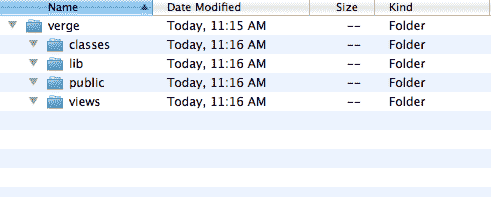
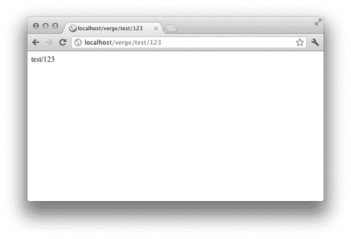
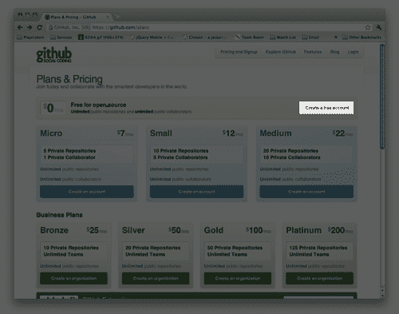
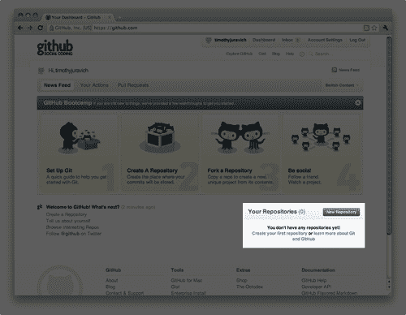
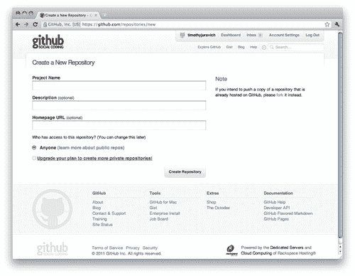

# 第四章：开始你的应用程序

> 我们准备开始开发我们应用程序的框架！

在本章中，我们将：

+   从头开始创建一个简单的 PHP 框架 - Bones

+   学习如何使用 Git 进行源代码控制

+   添加功能到 Bones 来处理 URL 请求

+   构建视图和布局的支持，以便我们可以为我们的应用程序添加一个前端

+   添加代码以允许我们处理所有的 HTTP 方法

+   设置复杂的路由并将其构建到一个示例应用程序中

+   添加使用公共文件并在我们的框架中使用它们的能力

+   将我们的代码发布到 GitHub，以便我们可以管理我们的源代码

让我们开始吧！

# 在本书中我们将构建什么

在本书的其余部分，我们将创建一个类似 Twitter 的简单社交网络。让我们称之为`Verge`。

`Verge`将允许用户注册、登录和创建帖子。通过构建这个应用程序，我们将跳过大多数开发人员在构建应用程序时遇到的障碍，并学会依赖 CouchDB 来完成一些繁重的工作。

为了构建 Verge，我们将制作一个轻量级的 PHP 包装器，用于处理基本路由和 HTTP 请求，这些在前一章中提到过。让我们称这个框架为`Bones`。

# 骨架

在本书中，我们将构建一个非常轻量级的框架`Bones`来运行我们的应用程序。你可能会想*为什么我们要构建另一个框架？*这是一个合理的问题！有很多 PHP 框架，比如：Zend 框架，Cake，Symfony 等等。这些都是强大的框架，但它们也有一个陡峭的学习曲线，而且在本书中不可能涉及到它们的每一个。相反，我们将创建一个非常轻量级的 PHP 框架，它将帮助简化我们的开发，但不会有很多其他的花里胡哨。通过构建这个框架，你将更好地理解 HTTP 方法以及如何从头开始构建轻量级应用程序。一旦你使用 Bones 开发了这个应用程序，你应该很容易将你的知识应用到另一个框架上，因为我们将使用一些非常标准的流程。

如果你在本章遇到任何问题或渴望看到最终成品，那么你可以在 GitHub 上访问完整的 Bones 框架：[`github.com/timjuravich/bones`](http://https://github.com/timjuravich/bones)。我还将在本章末尾介绍一个简单的方法，让你可以获取所有这些代码。

让我们开始设置我们的项目。

# 项目设置

在本节中，我们将逐步创建用于我们代码的文件夹，并确保我们初始化 Git，以便我们可以跟踪我们向项目添加新功能时的源代码。

# 行动时间 - 为 Verge 创建目录

让我们通过在`/Library/WebServer/Documents`文件夹中创建一个名为`verge`的目录来开始设置我们的项目，并将该目录包含所有项目的代码。为了简洁起见，在本章中，我们将称`/Library/WebServer/Documents/verge`为我们的**工作**目录。

在我们的工作目录中，让我们创建四个新的文件夹，用于存放我们的源文件：

1.  创建一个名为`classes`的文件夹。这个文件夹将包含我们在这个项目中将要使用的 PHP 类对象

1.  创建一个名为`lib`的文件夹。这个文件夹将包含我们的应用程序依赖的 PHP 库，也就是我们的`Bones`框架和将与 CouchDB 通信的类。

1.  创建一个名为`public`的文件夹。这个文件夹将包含我们所有的公共文件，比如**层叠样式表（CSS）**，JavaScript 和我们的应用程序需要的图片。

1.  创建一个名为`views`的文件夹。这个文件夹将包含我们的布局和网页应用程序的不同页面。

如果你查看你的工作目录，本节的最终结果应该类似于以下截图：



## 刚刚发生了什么？

我们快速创建了一些占位符文件夹，用于组织本书其余部分中将添加的代码。

## 使用 Git 进行源代码控制

为了跟踪我们的应用程序、我们的进展，并允许我们在犯错时回滚，我们需要在我们的仓库上运行源代码控制。我们在第二章中安装了 Git，*设置您的开发环境*，所以让我们好好利用它。虽然有一些桌面客户端可以使用，但为了简单起见，我们将使用命令行，以便适用于所有人。

# 开始行动-初始化 Git 仓库

Git 需要在每个开发项目的根目录中初始化，以便跟踪所有项目文件。让我们为我们新创建的`verge`项目做这个！

1.  打开**终端**。

1.  输入以下命令以更改目录到我们的工作目录：

```php
**cd /Library/Webserver/Documents/verge/** 

```

1.  输入以下命令以初始化我们的 Git 目录：

```php
**git init** 

```

1.  Git 将回应以下内容：

```php
**Initialized empty Git repository in /Library/WebServer/Documents/verge/.git/** 

```

1.  保持您的**终端**窗口打开，以便在本章中与 Git 进行交互。

## 刚刚发生了什么？

我们使用**终端**通过在工作目录中使用命令`git init`来初始化我们的 Git 仓库。Git 回应让我们知道一切都进行得很顺利。现在我们已经设置好了 Git 仓库，当创建新文件时，我们需要将每个文件添加到源代码控制中。将文件添加到 Git 的语法很简单，`git add path_to_file`。您还可以通过输入`"git add ."`的通配符语句递归地添加目录中的所有文件。在本章的大部分部分，我们将快速添加文件，因此我们将使用`"git add ."`。

# 实现基本路由

在我们开始创建`Bones`之前，让我们先看看为什么我们需要它的帮助。让我们首先创建一个简单的文件，确保我们的应用程序已经设置好并准备就绪。

# 开始行动-创建我们的第一个文件：index.php

我们将创建的第一个文件是一个名为`index.php`的文件。这个文件将处理我们应用程序的所有请求，并最终将成为主要的应用程序控制器，将与`Bones`进行通信。

1.  在工作目录中创建`index.php`，并添加以下文本：

```php
<?php echo 'Welcome to Verge'; ?>

```

1.  打开您的浏览器，转到网址：`http://localhost/verge/`。

1.  `index.php`文件将显示以下文字：

```php
**Welcome to Verge** 

```

## 刚刚发生了什么？

我们创建了一个简单的 PHP 文件，名为`index.php`，目前只是简单地返回文本给我们。我们只能在直接访问`http://localhost/verge/`或`http://localhost/verge/index.php`时访问这个文件。然而，我们的目标是`index.php`将被我们工作目录中的几乎每个请求所访问（除了我们的`public`文件）。为了做到这一点，我们需要添加一个`.htaccess`文件，允许我们使用 URL 重写。

## .htaccess 文件

`.htaccess`文件被称为分布式配置文件，它允许 Apache 配置在目录基础上被覆盖。如果您记得，在第一章中，*CouchDB 简介*，我们确保可以通过改变一些代码行来使用`.htaccess`文件，以`Override All`。大多数 PHP 框架都以我们将要使用的方式利用`.htaccess`文件，因此您需要熟悉这个过程。

# 开始行动-创建.htaccess 文件

为了处理对目录的所有请求，我们将在工作目录中创建一个`.htaccess`文件。

1.  在工作目录中创建一个名为`.htaccess`的文件。

1.  将以下代码添加到文件中：

```php
<IfModule mod_rewrite.c>
RewriteEngine On
RewriteCond %{REQUEST_FILENAME} !-f
RewriteCond %{REQUEST_FILENAME} !-d
RewriteRule ^(.*)$ index.php?request=$1 [QSA,L]
</IfModule>

```

1.  在工作目录中打开`index.php`文件。

1.  更改`index.php`中的代码以匹配以下内容：

```php
<?php echo $_GET['request']; ?>

```

1.  打开浏览器，转到`http://localhost/verge/test/abc`，然后转到`http://localhost/verge/test/123`。注意页面会以你在根 URL 末尾输入的相同值回应你。

## 刚刚发生了什么？

首先，我们创建了一个`.htaccess`文件，以便启用 URL 重写。第一行`<IfModule mod_rewrite.c>`检查我们是否启用了`mod_rewrite`模块。这将是`true`，因为我们在第二章的`http.conf`文件中启用了`mod_rewrite`。

文件的下一行说`RewriteEngine On`，它确切地做了你认为它会做的事情；它打开了 Apache 的`RewriteEngine`并等待一些条件和规则。接下来，我们设置了两个`RewriteCond`（重写条件）。第一个`RewriteCond`告诉`RewriteEngine`，如果传递的 URL 与现有文件的位置不匹配（这就是`f`的含义），则重写 URL。第二个`RewriteCond`告诉`RewriteEngine`，重写 URL 如果它不是已经存在的目录（这就是`-d`的含义）。最后，我们设置了我们的`RewriteRule`，它表示当输入一个 URL 时，将其转发到第二个值（目标）。这个`RewriteRule`告诉`RewriteEngine`，传递到这个目录的任何 URL 都应该被强制通过索引文件，并将路由传递给`index.php`文件，形成一个名为`request`的查询字符串。

最后，字符串是`[QSA, L]`。让我解释一下这是什么意思。`QSA`表示，如果有任何查询字符串添加到请求中，请将其附加到重写目标。`L`表示，停止尝试查找匹配项，并且不应用任何其他规则。

然后，你打开了`index.php`文件，并更改了代码以输出`request`变量。现在你知道，输入浏览器的路由将以查询字符串的形式传递给`index.php`文件。

有了所有这些代码，我们测试了一切，通过转到 URL`http://localhost/verge/test/abc`，我们的`index.php`文件返回了`test/abc`。当我们将 URL 更改为`http://localhost/verge/test/123`时，我们的`index.php`文件将`test/123`返回给我们。

## 拼凑 URL

在这一点上，我们技术上可以用一堆`if`语句拼凑在一起，让我们的网站提供不同的内容。例如，我们可以根据 URL 显示不同的内容，只需将一些代码添加到`index.php`中，如下所示：

```php
if ($_GET['request'] == '') {
echo －Welcome To Verge－;
} elseif ($_GET['request'] == 'signup') {
echo "Sign Up!";
}

```

在这段代码中，如果用户转到 URL`http://localhost/verge`，他们的浏览器将显示：

```php
**Welcome to Verge** 

```

同样，如果用户转到`http://localhost/verge/signup`，他们的浏览器将显示：

```php
**Sign Up!** 

```

我们可以进一步扩展这种思维方式，通过编写各种`if`语句，将我们的代码串联成一个长文件，并立即开始编写我们的应用程序。然而，这将是一个维护的噩梦，难以调试，并且一般来说是不好的做法。

相反，让我们删除`index.php`文件中的所有代码，专注于以正确的方式构建我们的项目。在本章的其余部分，我们将致力于创建一个名为`Bones`的简单框架，它将为我们处理一些请求的繁重工作。

## 创建 Bones 的骨架

正如我之前提到的，`Bones`是一个非常轻量级的框架，总共只有 100 多行代码，全部都在一个文件中。在本节中，我们将开始形成一个结构，以便在接下来的章节中构建更多的功能。

# 执行操作-将我们的应用程序连接到 Bones

让我们首先创建`Bones`库，然后将我们的`index.php`文件连接到它。

1.  在我们的工作目录的`lib`文件夹中创建一个名为`bones.php`的文件(`/Library/Webserver/Documents/verge/lib/bones.php`)。

1.  将以下代码添加到我们工作目录中的`index.php`文件中，以便我们可以与新创建的`bones.php`文件进行通信：

```php
<?php
include 'lib/bones.php';

```

## 刚刚发生了什么？

这段代码所做的就是包含我们的`lib/bones.php`文件，现在这已经足够了！请注意，我们没有用`?>`结束文件，这可能不是你习惯看到的。`?>`标签实际上是可选的，在我们的情况下，不使用它可以减少不需要的空白，并且在代码后面添加响应头，如果需要的话。

## 使用 Bones 处理请求

为了说明我们计划使用`Bones`类做什么，让我们通过一个快速示例来看看我们希望在本节结束时实现的目标。

+   如果浏览器访问 URL `http://localhost/verge/signup`，我们希望`Bones`拦截调用并将其解释为`http://localhost/verge/index.php?request=signup`。

+   然后，`Bones`将查看我们在`index.php`文件中定义的路由列表，并查看是否有匹配。

+   如果确实有匹配，`Bones`将执行匹配函数的回调并执行该路由内的操作。

如果以上内容有些令人困惑，不用担心。随着我们慢慢构建这个功能，希望它会开始变得有意义。

# 行动时间-创建 Bones 的类结构

让我们通过向我们的工作目录中的`lib/bones.php`文件添加以下代码来开始构建`Bones`类：

`/Library/Webserver/Documents/verge/lib/bones.php`

```php
<?php
class Bones {
private static $instance;
public static $route_found = false;
public $route = '';
public static function get_instance() {
if (!isset(self::$instance)) {
self::$instance = new Bones();
}
return self::$instance;
}

```

## 刚刚发生了什么？

我们刚刚创建了我们的`Bones`类，添加了一些`private`和`public`变量，以及一个名为`get_instance()`的奇怪函数。私有静态变量`$instance`与函数`get_instance()`结合在一起，形成了所谓的**单例模式**。

单例模式允许我们的`Bones`类不仅仅是一个简单的类，还可以是一个对象。这意味着每次调用我们的`Bones`类时，我们都在访问一个现有的对象。但如果对象不存在，它将为我们创建一个新的对象来使用。这是一个有点复杂的想法；然而，我希望随着我们在后面使用它，它开始变得有意义。

### 访问路由

现在我们已经有了我们类的基本概念，让我们添加一些函数来获取和解释路由（传递给`Bones`的 URL）每次创建新请求时。然后我们将在下一节中将结果与每个可能的路由进行比较。

# 行动时间-创建函数以访问 Bones 创建时的路由

为了弄清楚请求中传递了什么路由，我们需要在`lib/bones.php`文件的`get_instance()`函数的结束括号下面添加以下两个函数：

`/Library/Webserver/Documents/verge/lib/bones.php`

```php
public static function get_instance() {
if (!isset(self::$instance)) {
self::$instance = new Bones();
}
return self::$instance;
}
**public function __construct() {
$this->route = $this->get_route();
}
protected function get_route() {
parse_str($_SERVER['QUERY_STRING'], $route);
if ($route) {
return '/' . $route['request'];
} else {
return '/';
}
}** 

```

## 刚刚发生了什么？

在这段代码中，我们添加了一个名为`__construct()`的函数，这是一个在每次创建类时自动调用的函数。我们的`__construct()`函数然后调用另一个名为`get_route()`的函数，它将从我们的请求查询字符串中获取路由（如果有的话）并将其返回给实例的`route`变量。

### 匹配 URL

为了匹配我们应用程序的路由，我们需要将每个可能的路由通过一个名为`register`的函数。

# 行动时间-创建注册函数以匹配路由

`register`函数将是`Bones`类中最重要的函数之一，但我们将从在`lib/bones.php`文件的末尾添加以下代码开始：

`/Library/Webserver/Documents/verge/lib/bones.php`

```php
public static function register($route, $callback) {
$bones = static::get_instance();
if ($route == $bones->route && !static::$route_found) {
static::$route_found = true;
echo $callback($bones);
} else {
return false;
}
}

```

## 刚刚发生了什么？

我们首先创建了一个名为`register`的公共静态函数。这个函数有两个参数：`$route`和`$callback`。`$route`包含我们试图匹配实际路由的路由，`$callback`是如果路由匹配则将被执行的函数。请注意，在`register`函数的开头，我们调用了我们的`Bones`实例，使用`static:get_instance()`函数。这就是单例模式的作用，将`Bones`对象的单一实例返回给我们。

然后`register`函数检查我们通过浏览器访问的路由是否与传入函数的路由匹配。如果匹配，我们的`$route_found`变量将被设置为`true`，这将允许我们跳过查看其余的路由。`register`函数将执行一个回调函数，该函数将执行我们在路由中定义的工作。我们的`Bones`实例也将与回调函数一起传递，这样我们就可以利用它。如果路由不匹配，我们将返回`false`，以便我们知道路由不匹配。

现在我们已经完成了我们在`Bones`中的工作。所以，请确保用以下方式结束你的类：

```php
}

```

## 从我们的应用程序调用`register`函数

我们现在对`Bones`应该做什么有了基本的了解，但我们缺少一个将我们的`index.php`和`lib/bones.php`文件联系在一起的函数。我们最终将创建四个函数来做到这一点，每个函数对应一个 HTTP 方法。但是，现在让我们先创建我们的`get`函数。

# 行动时间——在我们的 Bones 类中创建一个 get 函数

让我们在`lib/bones.php`文件的顶部创建一个`get`函数，在`<?php`标签之后，在我们定义`Bones`类之前：

`/Library/Webserver/Documents/verge/lib/bones.php`

```php
<?php
ini_set('display_errors','On');
error_reporting(E_ERROR | E_PARSE);
**function get($route, $callback) {
Bones::register($route, $callback);
}** 
class Bones {
...
}

```

## 刚刚发生了什么？

这个函数位于`lib/bones.php`文件中，并且被调用来处理你在`index.php`文件中定义的每个`get`路由。这个函数是一个简单的传递函数，将路由和回调传递给`Bones`的`register`函数。

我们是否在同一页面上？

在这一部分我们做了很多事情。让我们仔细检查一下你的代码是否与我的代码匹配：

`/Library/Webserver/Documents/verge/lib/bones.php`

```php
<?php
function get($route, $callback) {
Bones::register($route, $callback);
}
class Bones {
private static $instance;
public static $route_found = false;
public $route = '';
public function __construct() {
$this->route = $this->get_route();
}
public static function get_instance() {
if (!isset(self::$instance)) {
self::$instance = new Bones();
}
return self::$instance;
}
public static function register($route, $callback) {
$bones = static::get_instance();
if ($route == $bones->route && !static::$route_found) {
static::$route_found = true;
echo $callback($bones);
} else {
return false;
}
}
protected function get_route() {
parse_str($_SERVER['QUERY_STRING'], $route);
if ($route) {
return '/' . $route['request'];
} else {
return '/';
}
}
}

```

### 为我们的应用程序添加路由

我们现在已经完成了我们的`lib/bones.php`文件。我们所需要做的就是在我们的`index.php`文件中添加一些路由，调用`lib/bones.php`文件夹中的`get`函数。

# 行动时间——为我们测试`Bones`的路由创建路由

打开`index.php`文件，添加以下两个路由，以便我们可以测试我们的新代码：

```php
<?php
include 'lib/bones.php';
**get('/', function($app) {
echo "Home";
});
get('/signup', function($app) {
echo "Signup!";
});** 

```

## 刚刚发生了什么？

我们刚刚为我们的`Bones`类创建了两个路由，分别处理`/`（即根 URL）和`/signup`。

在我们刚刚添加的代码中有一些需要注意的地方：

+   我们的两个`get`路由现在都是干净的小函数，包括我们的路由和一个将作为回调函数的函数。

+   一旦函数被执行，我们就使用`echo`来显示简单的文本。

+   当一个路由匹配并且从`Bones`执行回调时，`Bones`的实例将作为变量`$app`返回，可以在回调函数中的任何地方使用

## 测试一下！

我们已经准备好测试我们对`Bones`的新添加内容了！打开你的浏览器，然后转到`http://localhost/verge/`。你会看到`Home`这个词。然后将你的浏览器指向`http://localhost/verge/signup`，你会看到`Signup!`这个文本。

虽然我们的应用程序仍然非常基础，但我希望你能看到以这种简单的方式添加路由的强大之处。在继续下一部分之前，随意玩耍并添加一些更多的路由。

## 将更改添加到 Git

在这一部分，我们启动了我们的`lib/bones.php`库，并添加了一些简单的路由。让我们将所有的更改都添加到 Git 中，这样我们就可以跟踪我们的进度了。

1.  打开**终端**。

1.  输入以下命令以更改目录到我们的工作目录：

```php
**cd /Library/Webserver/Documents/verge/** 

```

1.  通过输入以下命令将我们在此目录中创建的所有文件添加进来：

```php
**git add .** 

```

1.  给 Git 一个描述，说明自上次提交以来我们做了什么：

```php
**git commit am 'Created bones.php and added simple support for routing'** 

```

# 处理布局和视图

我们将暂时停止路由的操作，添加一些有趣的前端功能。每个应用程序都由一些页面组成，我们将称之为**视图**。每个视图都有一个标准的布局，这些视图将填充。布局是视图的包装器，可能包含到 CSS 引用、导航或其他你认为对每个视图都是通用的内容。

## 使用 Bones 支持视图和布局

为了支持视图和布局，我们需要向我们的`Bones`类添加一些额外的功能。

# 行动时间-使用常量获取工作目录的位置

我们需要做的第一件事是创建一个名为`ROOT`的命名常量，它将给出我们工作目录的完整位置。到目前为止，我们还没有不得不包含任何额外的文件，但是随着我们的布局和视图，如果我们不添加一些功能来获取工作目录，它将开始变得有点困难。为了支持这一点，让我们在`lib/bones.php`文件的顶部添加一行简单的代码。

```php
<?php
ini_set('display_errors','On');
error_reporting(E_ERROR | E_PARSE);
**define('ROOT', __DIR__ . '/..');** 
function get($route, $callback) {
...
}

```

## 刚刚发生了什么？

这行代码创建了一个名为`ROOT`的常量，我们可以在整个代码中使用它来引用工作目录。`__DIR__`给出了当前文件的根目录(`/Library/Webserver/Documents/verge/lib`)。因此，我们将希望通过在路径后添加`/.`来查看另一个目录。

# 行动时间-允许 Bones 存储变量和内容路径

我们需要能够从`index.php`中设置和接收变量到我们的视图中。因此，让我们将这个支持添加到`Bones`中。

1.  让我们定义一个名为`$vars`的`public`数组，它将允许我们从`index.php`中的路由中存储变量，并且定义一个名为`$content`的字符串，它将存储视图的路径，这些视图将加载到我们的布局中。我们将首先在`lib/bones.php`类中添加两个变量：

```php
class Bones {
public $route = '';
**public $content = '';
public $vars = array();** 
public function __construct() {
...
}

```

1.  为了能够从`index.php`文件中设置变量，我们将创建一个简单的名为`set`的函数，它将允许我们传递一个索引和一个变量的值，并将其保存到当前的`Bones`实例中。让我们在`lib/bones.php`中的`get_route()`函数之后创建一个名为`set`的函数。

```php
protected function get_route() {
...
}
**public function set($index, $value) {
$this->vars[$index] = $value;
}** 

```

## 刚刚发生了什么？

我们向`Bones`类添加了两个新变量`$vars`和`$content`。它们两者将在下一节中被使用。然后我们创建了一个`set`函数，允许我们从`index.php`文件发送变量到我们的`Bones`类，以便我们可以在我们的视图中显示它们。

接下来，我们需要添加能够从`index.php`中调用视图并显示它们的功能。将包含此功能的函数称为`render`。

# 行动时间-通过在 index.php 中调用它来允许我们的应用程序显示视图

我们将首先创建一个名为`render`的`public`函数，它接受两个参数。第一个是`$view`，它是你想要显示的视图的名称（或路径），第二个是`$layout`，它将定义我们用来显示视图的布局。布局也将有一个默认值，以便我们可以保持简单，以处理视图的显示。在`lib/bones.php`文件中的`set`函数之后添加以下代码：

```php
public function set($index, $value) {
$this->vars[$index] = $value;
}
**public function render($view, $layout = "layout") {
$this->content = ROOT. '/views/' . $view . '.php';
foreach ($this->vars as $key => $value) {
$$key = $value;
}
if (!$layout) {
include($this->content);
} else {
include(ROOT. '/views/' . $layout . '.php');
}
}** 

```

## 刚刚发生了什么？

我们创建了`render`函数，它将设置我们想要在布局中显示的视图的路径。所有的视图都将保存在我们在本章前面创建的`views`目录中。然后，代码循环遍历实例的`vars`数组中设置的每个变量。对于每个变量，我们使用一个奇怪的语法`$$`，这使我们能够使用我们在数组中定义的键来设置一个变量。这将允许我们直接在我们的视图中引用这些变量。最后，我们添加了一个简单的`if`语句，用于检查是否定义了一个`layout`文件。如果未定义`$layout`，我们将简单地返回视图的内容。如果定义了`$layout`，我们将包含布局，这将返回我们的视图包裹在定义的布局中。我们这样做是为了以后避免使用布局。例如，在一个 AJAX 调用中，我们可能只想返回视图而不包含布局。

# 行动时间——创建一个简单的布局文件

在这一部分，我们将创建一个名为`layout.php`的简单布局文件。请记住，在我们的`render`函数中，`$layout`有一个默认值，它被设置为`layout`。这意味着，默认情况下，`Bones`将查找`views/layout.php`。所以，现在让我们创建这个文件。

1.  首先，在我们的`views`目录中创建一个名为`layout.php`的新文件。

1.  在新创建的`views/layout.php`中添加以下代码：

```php
<html>
<body>
<h1>Verge</h1>
<?php include($this->content); ?>
</body>
</html>

```

## 刚才发生了什么？

我们创建了一个非常简单的 HTML 布局，它将在应用程序的所有视图中使用。如果你记得，我们在`Bones`的`render`函数中使用了路径设置为`$content`变量，我们在前一个函数中设置了它，并且也包含了它，这样我们就可以显示视图。

## 向我们的应用程序添加视图

现在我们已经把所有的部分都放在了视图中，我们只需要在`index.php`文件中添加几行代码，这样我们就可以呈现视图了。

# 行动时间——在我们的路由中呈现视图

让我们用以下代码替换我们路由中已经输出文本的现有部分，这些代码将实际使用我们的新框架：

```php
get('/', function($app) {
**$app->set('message', 'Welcome Back!');
$app->render('home');** 
});
get('/signup', function($app) {
**$app->render('signup');** 
});

```

## 刚才发生了什么？

对于根路由，我们使用了我们的新函数`set`来传递一个键为`'message'`的变量，并且它的内容是`'Welcome Back!'`，然后我们告诉`Bones`呈现主页视图。对于`signup`路由，我们只是呈现`signup`视图。

# 行动时间——创建视图

我们几乎准备好测试这段新代码了，但我们需要创建实际的视图，这样我们才能显示它们。

1.  首先，在我们的工作目录中的`views`文件夹中创建两个新文件，分别命名为`home.php`和`signup.php`。

1.  通过编写以下代码将以下代码添加到`views/home.php`文件中：

```php
Home Page <br /><br />
<?php echo $message; ?>

```

1.  将以下代码添加到`views/signup.php`文件中：

```php
Signup Now!

```

## 刚才发生了什么？

我们创建了两个简单的视图，它们将由`index.php`文件呈现。`views/home.php`文件中的一行代码`<?php echo $message; ?>`将显示传递给我们的`Bones`库的`index.php`文件中的名称为 message 的变量。试一下吧！

打开你的浏览器，转到`http://localhost/verge/`或`http://localhost/verge/signup`，你会看到我们所有的辛勤工作都得到了回报。我们的布局现在正在呈现，我们的视图正在显示。我们还能够从`index.php`传递一个名为`message`的变量，并在我们的主页视图上输出该值。我希望你能开始看到我们迄今为止为`Bones`添加的功能的强大之处！

## 将更改添加到 Git

到目前为止，我们已经为布局和视图添加了支持，这将帮助我们构建应用程序的所有页面。让我们把所有的改变都添加到 Git 中，这样我们就可以跟踪我们的进展。

1.  打开**终端**。

1.  输入以下命令以更改目录到我们的工作目录：

```php
**cd /Library/Webserver/Documents/verge/** 

```

1.  通过输入以下命令，将我们在该目录中创建的所有文件都添加进去：

```php
**git add .** 

```

1.  给 Git 一个描述，说明我们自上次提交以来做了什么：

```php
**git commit am 'Added support for views and layouts'** 

```

# 添加对其他 HTTP 方法的支持

到目前为止，我们一直在处理`GET`调用，但在 Web 应用程序中，我们将需要支持我们在上一章中讨论过的所有`HTTP`方法：`GET, PUT, POST`和`DELETE`。

# 行动时间-检索请求中使用的 HTTP 方法

我们已经完成了支持、捕获和处理 HTTP 请求所需的大部分繁重工作。我们只需要插入几行额外的代码。

1.  让我们在我们的`Bones`类中添加一个变量`$method`，在我们的`$route`变量之后。这个变量将存储每个请求上执行的`HTTP`方法：

```php
class Bones {
private static $instance;
public static $route_found = false;
public $route = '';
**public $method = '';** 
public $content = '';

```

1.  为了让我们在每个请求中获取方法，我们需要在我们的`__construct()`函数中添加一行代码，名为`get_route()`，并将结果的值保存在我们的实例变量`$method`中。这意味着当`Bones`在每个请求中被创建时，它也将检索方法并将其保存到我们的`Bones`实例中，以便我们以后可以使用它。通过添加以下代码来实现这一点：

```php
public function __construct() {
$this->route = $this->get_route();
**$this->method = $this->get_method();** 
}

```

1.  让我们创建一个名为`get_method()`的函数，这样我们的`__construct()`函数就可以调用它。让我们在我们的`get_route()`方法之后添加它：

```php
protected function get_route() {
parse_str($_SERVER['QUERY_STRING'], $route);
if ($route) {
return '/' . $route['request'];
} else {
return '/';
}
}
protected function get_method() {
**return isset($_SERVER['REQUEST_METHOD']) ? $_SERVER['REQUEST_METHOD'] : 'GET';
}** 

```

## 刚刚发生了什么？

我们在你的`Bones`类中添加了一个变量`$method`。这个变量是由函数`get_route()`设置的，并且每次通过`__construct()`方法向`Bones`发出请求时，都会将一个值返回给实例`$method`变量。这可能听起来非常令人困惑，但请耐心等待。

`get_route()`函数使用一个名为`$_SERVER`的数组，这个数组是由 Web 服务器创建的，并允许我们检索有关请求和执行的信息。这个简单的一行代码是在说，如果`$_SERVER`中设置了`REQUEST_METHOD`，那么就返回它，但如果由于某种原因`REQUEST_METHOD`没有设置，就返回`GET`以确保方法的安全。

# 行动时间-修改注册以支持不同的方法

现在我们在每个请求中检索方法，我们需要修改我们的注册函数，以便我们可以在每个路由中传递`$method`，以便它们能够正确匹配。

1.  在`lib/bones.php`的`register`函数中添加`$method`，以便我们可以将一个方法传递到函数中：

```php
**public static function register($route, $callback, $method) {** 
$bones = static::get_instance();

```

1.  现在，我们需要更新我们在注册函数中的简单路由匹配，以检查传递的路由`$method`是否与我们的实例变量`$bones->method`匹配，这是实际发生在服务器上的方法：

```php
public static function register($route, $callback, $method) {
$bones = static::get_instance();
**if ($route == $bones->route && !static:: $route_found && $bones->method == $method) {** 
static::$route_found = true;
echo $callback($bones);
} else {
return false;
}
}

```

## 刚刚发生了什么？

我们在我们的`register`函数中添加了一个`$method`参数。然后我们在我们的`register`函数中使用这个`$method`变量，通过将它添加到必须为`true`的参数列表中，以便路由被视为匹配。因此，如果路由匹配，但如果它是一个不同于预期的`HTTP`方法，它将被忽略。这将允许您创建具有相同名称但根据传递的方法而有所不同的路由。听起来就像我们在上一章中讨论的`REST`，不是吗？

为了执行`register`函数，让我们回顾一下我们在`lib/bones.php`文件开头的`get`函数：

```php
<?php
ini_set('display_errors','On');
error_reporting(E_ERROR | E_PARSE);
define('ROOT', dirname(dirname(__FILE__)));
function get($route, $callback) {
Bones::register($route, $callback);
}

```

希望很容易看出我们接下来要做什么。让我们扩展我们当前的`get`函数，并创建另外三个函数，分别对应剩下的每种 HTTP 方法，确保我们以大写形式传递每种方法的名称。

```php
<?php
ini_set('display_errors','On');
error_reporting(E_ERROR | E_PARSE);
define('ROOT', dirname(dirname(__FILE__)));
**function get($route, $callback) {
Bones::register($route, $callback, 'GET');
}
function post($route, $callback) {
Bones::register($route, $callback, 'POST');
}
function put($route, $callback) {
Bones::register($route, $callback, 'PUT');
}
function delete($route, $callback) {
Bones::register($route, $callback, 'DELETE');
}** 

```

我们已经在我们的 Bones 库中添加了所有需要的功能，以便我们可以使用其他 HTTP 方法，非常简单对吧？

# 行动时间-向 Bones 添加简单但强大的辅助功能

让我们在我们的`lib/bones.php`文件中添加两个小函数，这将帮助我们使用表单。

1.  添加一个名为`form`的函数，如下所示：

```php
public function form($key) {
return $_POST[$key];
}

```

1.  添加一个名为`make_route`的函数。这个函数将允许我们的`Bones`实例创建干净的链接，以便我们可以链接到应用程序中的其他资源：

```php
public function make_route($path = '') {
$url = explode("/", $_SERVER['PHP_SELF']);
if ($url[1] == "index.php") {
return $path;
} else {
return '/' . $url[1] . $path;
}
}

```

## 刚刚发生了什么？

我们添加了一个名为`form`的简单函数，它作为`$_POST`数组的包装器，这是通过`HTTP POST`方法传递的变量数组。这将允许我们在`POST`后收集值。我们创建的下一个函数叫做`make_route`。这个函数很快将被用于创建干净的链接，以便我们可以链接到应用程序中的其他资源。

## 使用表单测试我们的 HTTP 方法支持

我们在这里添加了一些很酷的东西。让我们继续测试新添加的 HTTP 方法的支持。

打开文件`verge/views/signup.php`，并添加一个简单的表单，类似于以下内容：

```php
Signup
**<form action="<?php echo $this->make_route('/signup') ?>" method="post">
<label for="name">Name</label>
<input id="name" name="name" type="text"> <br />
<input type="Submit" value="Submit">
</form>** 

```

我们通过使用`$this->make_route`设置了表单的`action`属性。`$this->make_route`使用我们的`Bones`实例来创建一个解析为我们的`signup`路由的路由。然后我们定义了使用`post`方法。表单的其余部分都是相当标准的，包括`name`的标签和文本框，以及用于处理表单的`submit`按钮。

如果您在浏览器中输入`http://localhost/verge/signup`，您现在将看到表单，但如果您单击`submit`按钮，您将被发送到一个空白页面。这是因为我们还没有在`index.php`文件中定义我们的`post`方法。

打开`index.php`文件，并添加以下代码：

```php
get('/signup', function($app) {
$app->render('signup');
});
**post('/signup', function($app) {
$app->set('message', 'Thanks for Signing Up ' . $app->form('name') . '!');
$app->render('home');
});** 

```

让我们走过这段代码，确保清楚我们在这里做什么。我们告诉`Bones`查找`/signup`路由，并将`post`方法发送到它。一旦解析了这个路由，回调将使用一些文本设置变量`message`的值。文本包括我们创建的新函数`$app->form('name')`。这个函数正在从具有属性`name`的表单中获取发布的值。然后我们将告诉`Bones`渲染主视图，以便我们可以看到消息。

## 测试一下！

现在让我们试试这些！

1.  打开您的浏览器，转到：`http://localhost/verge/signup`。

1.  您的浏览器应该显示以下内容：

1.  输入您的名字（我输入了`Tim`），然后单击**提交**。

## 将更改添加到 Git

在这一部分，我们为所有的 HTTP 方法添加了支持，这将允许我们处理任何类型的请求。让我们将所有的更改添加到 Git，以便我们可以跟踪我们的进展。

1.  打开**终端**。

1.  输入以下命令以更改目录到我们的工作目录：

```php
**cd /Library/Webserver/Documents/verge/** 

```

1.  通过输入以下命令来添加我们在此目录中创建的所有文件：

```php
**git add .** 

```

1.  给 Git 描述我们自上次提交以来所做的工作：

```php
**git commit -am 'Added support for all HTTP methods'** 

```

# 添加对复杂路由的支持

我们的框架在技术上已经准备好让我们开始构建。但是，我们还没有足够的支持来匹配和处理复杂的路由。由于大多数应用程序都需要这个，让我们快速添加它。

## 处理复杂的路由

例如，在`index.php`文件中，我们希望能够为用户配置文件定义路由。这个路由可能是`/user/:username`。在这种情况下，`:username`将是一个我们可以访问的变量。因此，如果您访问 URL`/user/tim`，您可以使用`Bones`来获取 URL 的该部分，并返回其值。

让我们首先在我们的`lib/bones.php`文件的`__construct`函数中添加另一个变量和另一个调用：

```php
public $content = '';
public $vars = array();
**public $route_segments = array();
public $route_variables = array();** 
public function __construct() {
$this->route = $this->get_route();
**$this->route_segments = explode('/', trim($this->route, '/'));** 
$this->method = $this->get_method();
}

```

我们刚刚在我们的`Bones`实例中添加了两个变量，称为`$route_segments`和`$route_variables。$route_segments`每次使用`__construct()`创建`Bones`对象时都会设置。`$route_segments`数组通过在斜杠(/)上分割它们来将`$route`分割成可用的段。这将允许我们检查浏览器发送到`Bones`的 URL，然后决定路由是否匹配。`$route_variables`将是通过路由传递的变量的库，它将使我们能够使用`index.php`文件。

现在，让我们开始修改 `register` 函数，以便处理这些特殊路由。让我们删除所有代码，然后慢慢添加一些代码。

```php
public static function register($route, $callback, $method) {
if (!static::$route_found) {
$bones = static::get_instance();
$url_parts = explode('/', trim($route, '/'));
$matched = null;

```

我们添加了一个 `if` 语句，检查路由是否已经匹配。如果是，我们就忽略 `register` 函数中的其他所有内容。然后，我们添加了 `$url_parts`。这将拆分我们传递到注册函数中的路由，并将帮助我们将此路由与浏览器实际访问的路由进行比较。

### 注意

当我们完成这一部分时，我们将关闭 `if` 语句和注册函数；不要忘记这样做！

让我们开始比较 `$bones->route_segments`（浏览器访问的路由）和 `$url_parts`（我们正在尝试匹配的路由）。首先，让我们检查确保 `$route_segments` 和 `$url_parts` 的长度相同。这将确保我们节省时间，因为我们已经知道它不匹配。

在 `lib/bones.php` 的 `register` 函数中添加以下代码：

```php
if (count($bones->route_segments) == count($url_parts)) {
} else {
// Routes are different lengths
$matched = false;
}

```

现在，在 `if` 语句中添加一个 `for` 循环，循环每个 `$url_parts`，并尝试将其与 `route_segments` 匹配。

```php
if (count($bones->route_segments) == count($url_parts)) {
**foreach ($url_parts as $key=>$part) {
}** 
} else {
// Routes are different lengths
$matched = false;
}

```

为了识别变量，我们将检查冒号（:）的存在。这表示该段包含变量值。

```php
if (count($bones->route_segments) == count($url_parts)) {
foreach ($url_parts as $key=>$part) {
**if (strpos($part, ":") !== false) {
// Contains a route variable
} else {
// Does not contain a route variable
}** 
}
} else {
// Routes are different lengths
$matched = false;
}

```

接下来，让我们添加一行代码，将段的值保存到我们的 `$route_variables` 数组中，以便稍后使用。仅仅因为我们找到一个匹配的变量，并不意味着整个路由就匹配了，所以我们暂时不会设置 `$matched = true`。

```php
if (strpos($part, ":") !== false) {
// Contains a route variable
**$bones->route_variables[substr($part, 1)] = $bones->route_segments[$key];** 
} else {
// Does not contain a route variable
}

```

让我们分解刚刚添加的代码行。第二部分 `$bones->route_segments[$key]` 获取传递给浏览器的段的值，并且具有与我们当前循环的段相同的索引。

然后，`$bones->route_variables[substr($part, 1)]` 将值保存到 `$route_variables` 数组中，索引设置为 `$part` 的值，然后使用 `substr` 确保我们不包括键中的冒号。

这段代码有点混乱。所以，让我们快速通过一个使用案例：

1.  打开你的浏览器，输入 URL `/users/tim`。

1.  这个注册路由开始检查路由 `/users/:username`。

1.  `$bones->route_segments[$key]` 将返回 `tim`。

1.  `$bones->route_variables[substr($part, 1)]` 将保存值，并使我们能够稍后检索值 `tim`。

现在，让我们完成这个 `if` 语句，检查不包含路由变量的段（`if` 语句的 `else` 部分）。在这个区域，我们将检查我们正在检查的段是否与从浏览器的 URL 传递的段匹配。

```php
} else {
// Does not contain a route variable
**if ($part == $bones->route_segments[$key]) {
if (!$matched) {
// Routes match
$matched = true;
}
} else {
// Routes don't match
$matched = false;
}**
}

```

我们刚刚添加的代码检查我们循环遍历的 `$part` 是否与 `$route_segments` 中的并行段匹配。然后，我们检查是否已经标记此路由不匹配。这告诉我们，在先前的段检查中，我们已经标记它为不匹配。如果路由不匹配，我们将设置 `$matched = false`。这将告诉我们 URL 不匹配，并且我们可以忽略路由的其余部分。

让我们为路由匹配谜题添加最后一部分。这个语句看起来与我们旧的匹配语句相似，但实际上会更加简洁。

```php
if (!$matched || $bones->method != $method) {
return false;
} else {
static::$route_found = true;
echo $callback($bones);
}

```

这段代码检查我们的路由是否与上面的匹配语句匹配，查看 `$matched` 变量。然后，我们检查 HTTP 方法是否与我们检查的路由匹配。如果没有匹配，我们返回 `false` 并退出该函数。如果匹配，我们设置 `$route_found = true`，然后对路由执行回调，这将执行 `index.php` 文件中定义的路由内的代码。

最后，让我们关闭`if $route_found`语句和`register`函数，通过添加闭合括号来结束这个函数。

```php
}
}

```

在过去的部分中，我们添加了很多代码。所以，请检查一下你的代码是否和我的一致：

```php
public static function register($route, $callback, $method) {
if (!static::$route_found) {
$bones = static::get_instance();
$url_parts = explode('/', trim($route, '/'));
$matched = null;
if (count($bones->route_segments) == count($url_parts)) {
foreach ($url_parts as $key=>$part) {
if (strpos($part, ":") !== false) {
// Contains a route variable
$bones->route_variables[substr($part, 1)] = $bones-> route_segments[$key];
} else {
// Does not contain a route variable
if ($part == $bones->route_segments[$key]) {
if (!$matched) {
// Routes match
$matched = true;
}
} else {
// Routes don't match
$matched = false;
}
}
}
} else {
// Routes are different lengths
$matched = false;
}
if (!$matched || $bones->method != $method) {
return false;
} else {
static::$route_found = true;
echo $callback($bones);
}
}
}

```

## 访问路由变量

现在我们将路由变量保存到一个数组中，我们需要在`lib/bones.php`文件中添加一个名为`request`的函数：

```php
public function request($key) {
return $this->route_variables[$key];
}

```

这个函数接受一个名为`$key`的变量，并通过返回具有相同键的对象在我们的`route_variables`数组中的值来返回值。

## 在 index.php 中添加更复杂的路由

我们已经做了很多工作。让我们测试一下，确保一切顺利。

让我们在`index.php`中添加一个快速路由来测试路由变量：

```php
get('/say/:message', function($app) {
$app->set('message', $app->request('message'));
$app->render('home');
});

```

我们添加了一个带有路由变量`message`的路由。当路由被找到并通过回调执行时，我们将变量`message`设置为路由变量 message 的值。然后，我们渲染了主页，就像我们之前做了几次一样。

## 测试一下！

如果你打开浏览器并访问 URL `http://localhost/verge/say/hello`，浏览器将显示：`hello`。

如果你将值更改为任何不同的值，它将把相同的值显示回给你。

## 将更改添加到 Git

这一部分添加了更详细的路由匹配，并允许我们在 URL 中使用路由变量。让我们把所有的改变都添加到 Git 中，这样我们就可以跟踪我们的进展。

1.  打开**终端**。

1.  输入以下命令以更改目录到我们的工作目录：

```php
**cd /Library/Webserver/Documents/verge/** 

```

1.  通过输入以下命令，将我们在这个目录中创建的所有文件都添加进去：

```php
**git add .** 

```

1.  给 Git 一个描述，说明我们自上次提交以来做了什么：

```php
**git commit am 'Refactored route matching to handle more complex URLs and allow for route variables'** 

```

# 添加对公共文件的支持

开发 Web 应用程序的一个重要部分是能够使用 CSS 和 JS 文件。目前，我们真的没有一个很好的方法来使用和显示它们。让我们改变这一点！

# 行动时间——修改.htaccess 以支持公共文件

我们需要修改`.htaccess`文件，这样对`public`文件的请求不会被传递到`index.php`文件，而是进入`public`文件夹并找到请求的资源。

1.  首先打开我们项目根目录中的.htaccess 文件。

1.  添加以下突出显示的代码：

```php
<IfModule mod_rewrite.c>
RewriteEngine On
**RewriteCond %{REQUEST_FILENAME} !-f
RewriteCond %{REQUEST_FILENAME} !-d
RewriteRule ^css/([^/]+) public/css/$1 [L]
RewriteRule ^js/([^/]+) public/js/$1 [L]** 
RewriteCond %{REQUEST_FILENAME} !-f
RewriteCond %{REQUEST_FILENAME} !-d
RewriteRule ^(.*)$ index.php?request=$1 [QSA,L]
</IfModule>

```

## 刚才发生了什么？

我们刚刚添加了`RewriteRule`来绕过我们的“捕获所有”规则，如果是`public`文件的话，就将所有请求定向。然后我们简化路由，允许 URL 解析为`/css`和`/js`，而不是`/public/css`和`/public/js`。

我们准备好使用公共文件了。我们只需要实现它们，这应该和设置一样容易。

# 行动时间——为应用程序创建一个样式表

让我们首先添加一个样式表来改变我们应用程序的外观。

1.  打开`views/layout.php`。这个文件目前驱动着我们项目中所有页面的布局。我们只需要添加代码来包含我们的样式表：

```php
<html>
**<head>
<link href="<?php echo $this->make_route('/css/master.css') ?>" rel="stylesheet" type="text/css" />
</head>** 
<body>
<?php include($this->view_content); ?>
</body>
</html>

```

1.  创建一个名为`master.css`的新文件，并将其放在我们工作目录的`public/css`文件夹中。

1.  在`public/css/master.css`中添加一小段代码，以显示不同颜色的背景，这样我们就可以测试所有这些是否有效。

```php
body {background:#e4e4e4;}

```

## 刚才发生了什么？

我们添加了一个新的应用程序样式表`master.css`的引用。我们使用标准标记来包含样式表，并使用`Bones, make_route`的一个函数来正确创建文件的路径。

让我们测试一下，确保我们的样式表现在被正确显示。

1.  打开你的浏览器，然后转到`http://localhost/verge/`。

1.  你的浏览器应该显示以下内容：

1.  注意我们页面的背景颜色已经变成了灰色，显示出样式表已经生效了！

## 将更改添加到 Git

在这一部分，我们添加了对样式表、JavaScript 和图像等公共文件的支持。然后我们通过创建一个`master.css`文件来测试它。让我们把所有的改变都添加到 Git 中，这样我们就可以跟踪我们的进展。

1.  打开**终端**。

1.  通过键入以下命令，将目录更改为我们的工作目录：

```php
**cd /Library/Webserver/Documents/verge/** 

```

1.  通过键入以下命令，将我们在此目录中创建的所有文件添加进来：

```php
**git add .** 

```

1.  给 Git 一个描述，说明自上次提交以来我们所做的工作：

```php
**git commit am 'Added clean routes for public files, created a master.css file, linked to master.css in layout.php'** 

```

# 将您的代码发布到 GitHub

现在我们已经创建了我们的框架和所有底层代码，我们可以将我们的代码推送到任何支持 Git 的服务提供商。在本书中，我们将使用**GitHub**。

您可以通过访问以下网址在 GitHub 上创建一个帐户：[`github.com/plans`](http://https://github.com/plans)。GitHub 有各种不同的计划供您选择，但我建议您选择免费帐户，这样您就不必在此时支付任何费用。如果您已经有帐户，可以登录并跳过创建新帐户的步骤。



点击**创建免费帐户**。

### 注意

重要的是要注意，选择免费帐户后，您的所有存储库都将是“公共”的。这意味着任何人都可以看到您的代码。现在这样做没问题，但随着开发的进展，您可能希望注册一个付费帐户，以便它不是公开可用的。


您将看到一个快速注册表单。填写完整，并在完成后点击**创建帐户**。

创建完帐户后，您将看到您的帐户仪表板。在此屏幕上，您将看到您的帐户或您正在关注的存储库的任何活动。由于我们还没有任何存储库，因此应该首先点击**新存储库**。



**创建新存储库**页面将允许您创建一个新的存储库来存放您的代码。



通过填写每个字段来完成此表单的其余部分。

+   **项目名称：**`verge`

+   **描述：**`使用 Bones 构建的名为 verge 的社交网络`

+   **主页 URL：**现在您可以将其留空

+   点击**创建存储库**

您的存储库现在已创建并准备好推送您的代码。您只需要在**终端**中运行几条语句。

1.  打开**终端**。

1.  键入以下命令以更改目录到我们的工作目录：

```php
**cd /Library/WebServer/Documents/verge/** 

```

1.  通过输入以下命令并将**用户名**替换为您的 GitHub 用户名，将 GitHub 添加为您的远程存储库：

```php
**git remote add origin git@github.com:username/verge.git** 

```

1.  将您的本地存储库推送到 GitHub。

```php
**git push -u origin master** 

```

1.  Git 将返回一大堆文本，并在完成时停止。

如果刷新您在[`github.com`](https://github.com)上的 Git 存储库的 URL（我的 URL 是[`github.com/timjuravich/verge`](https://github.com/timjuravich/verge)），您将看到所有文件，如果点击**历史记录**，您将看到我们在本章中进行的每个部分中添加的所有更改。


随着您不断添加更多的代码，您必须手动每次将代码推送到 GitHub，执行命令`git push origin master`。在我们继续阅读本书的过程中，我们将继续向此存储库添加内容。

# 从 GitHub 获取完整的代码

如果您在某个地方迷失了方向，或者无法使一切都像应该的那样工作，您可以轻松地从 GitHub 的 Git 存储库中克隆 Bones，并且您将获得一个包含我们在本章中所做的所有更改的新副本。

1.  打开**终端**。

1.  使用以下命令将目录更改为我们的工作目录：

```php
**cd /Library/WebServer/Documents** 

```

1.  通过键入以下命令，将存储库克隆到您的本地计算机：

```php
**git clone git@github.com:timjuravich/bones.git** 

```

1.  Git 将从 GitHub 获取所有文件，并将它们移动到您的本地计算机。

# 摘要

在本章中，我们已经做了大量的工作！我们已经：

+   从头开始创建一个 PHP 框架来处理 Web 请求

+   添加了清晰的 URL、路由变量、HTTP 方法支持、简单的视图和布局引擎，以及一个用于显示`public`文件（如样式表、JavaScript 和图像）的系统

+   用我们的浏览器测试了框架的每个部分，以确保我们能够访问我们的更改

+   将我们的代码发布到 GitHub，这样我们就可以看到我们的更改并管理我们的代码。

准备好了！在下一章中，我们将直奔主题，将我们新创建的应用程序连接到 CouchDB。
