# 第六章：建模用户

> 信不信由你，我们已经做了很多工作，使我们与 CouchDB 的交互变得简单。在本章中，我们将直接进入 CouchDB 的核心，并开始对用户文档进行建模。

更具体地说，我们将：

+   安装 Bootstrap，这是 Twitter 的一个工具包，将处理 CSS、表单、按钮等繁重的工作

+   仔细观察 CouchDB 默认存储用户文档的方式以及我们如何向其中添加字段

+   为用户添加基本功能，以便他们可以在我们的应用程序中注册、登录和注销

+   学习如何处理异常和错误

这将是我们迄今为止最有价值的一章；您将喜欢将一些标准的身份验证和安全性外包给 CouchDB。系好安全带。这将是一次有趣的旅程！

# 在我们开始之前

我们已经玩弄了很多文件来测试 Bones 和 Sag，但您会注意到我们的应用程序看起来仍然相当空旷。所以，让我们稍微改善一下设计。由于设计和实现 UI 并不是本书的目的，我们将使用一个名为**Bootstrap**的工具包来为我们做大部分工作。Bootstrap ([`twitter.github.com/bootstrap/`](http://twitter.github.com/bootstrap/))是由 Twitter 创建的，旨在启动 Web 应用程序和网站的开发。它将使我们能够轻松进行前端开发而不需要太多工作。让我们先让 Bootstrap 运行起来，然后对我们的布局进行一些整理。

## 通过安装 Bootstrap 来清理我们的界面

设置 Bootstrap 非常容易。我们可以引用它们的远程服务器上的 CSS，但我们将下载并在本地调用 CSS，因为最佳实践是减少外部调用的数量。

# 执行时间-本地安装 Bootstrap

安装 Bootstrap 非常简单；我们将在本节中介绍安装它的基础知识。

1.  打开您的浏览器，转到[`twitter.github.com/bootstrap/`](http://twitter.github.com/bootstrap/)。

1.  点击**下载 Bootstrap**。

1.  一个`.zip`文件将被下载到您的`downloads`文件夹中；双击它或使用您喜欢的解压工具解压它。

1.  您将在`bootstrap`文件夹中找到三个目录，分别是`css, img`和`js`，每个目录中都包含若干文件。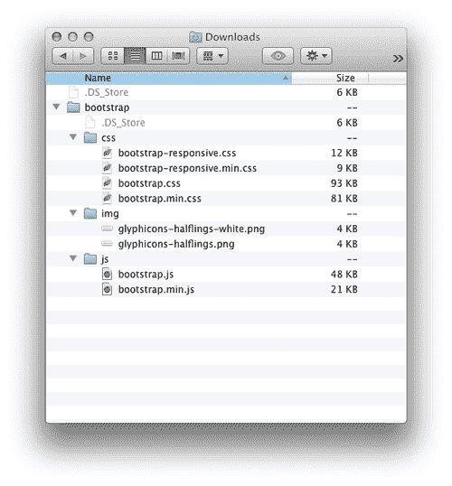

1.  将这些文件夹中的所有文件复制到您的`verge`项目的相应文件夹中：`/public/css, public/img`和`public/js`。完成后，您的`verge`目录应该类似于以下屏幕截图：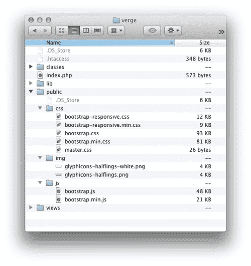

## 刚刚发生了什么？

我们刚刚通过下载一个包含所有资产的`.zip`文件并将它们放在本地机器的正确文件夹中，将 Twitter 的 Bootstrap 安装到我们的项目中。

仅仅通过查看我们项目中的新文件，您可能会注意到每个文件似乎出现了两次，一个带有文件名中的`min`，一个没有。这两个文件是相同的，除了包含`min`在文件名中的文件已经被压缩。**压缩**意味着从代码中删除所有非必要的字符以减小文件大小。删除的字符包括空格、换行符、注释等。因为这些文件是从网站上按需加载的，所以它们尽可能小以加快应用程序的速度是很重要的。如果您尝试打开一个压缩文件，通常很难看出发生了什么，这没关系，因为我们一开始就不想对这些文件进行任何更改。

所有这些文件的作用可能很明显——`css`文件定义了 Bootstrap 的一些全局样式。`img`文件用于帮助我们在网站周围使用图标，如果我们愿意的话，`js`文件用于帮助我们为网站添加交互、过渡和效果。但是，在`css`文件夹中，有`bootstrap`和`bootstrap-responsive`两个 css 文件，这可能会让人感到困惑。**响应式设计**是近年来真正爆发的东西，本身已经有很多书籍写到了这个主题。简而言之，`bootstrap`包括了`bootstrap-responsive`文件中的样式，以帮助我们的网站在不同的分辨率和设备上工作。因此，我们的网站应该可以在 Web 和现代移动设备上正常工作（大部分情况下）。

现在，你可能能够理解为什么我选择使用 Bootstrap 了；我们只需复制文件到我们的项目中，就获得了很多功能。但是，还没有完全连接好；我们需要告诉我们的`layout.php`文件去哪里查找，以便它可以使用这些新文件。

# 采取行动——包括 Bootstrap 并调整我们的布局以适应它

因为 Bootstrap 框架只是一系列文件，所以我们可以像在第四章中处理`master.css`文件一样轻松地将其包含在我们的项目中，

1.  在`layout.php`文件中，在`master.css`之前添加一个链接到`bootstrap.min.css`和`bootstrap-responsive.min.css`：

```php
<head>
**<link href="<?php echo $this->make_route('/css/bootstrap.min.css') ?>" rel="stylesheet" type="text/css" />
<link href="<?php echo $this->make_route('/css/master.css') ?>" rel="stylesheet" type="text/css" />
<link href="<?php echo $this->make_route('/css/bootstrap-responsive.min.css') ?>" rel="stylesheet" type="text/css" />** 
</head>

```

1.  接下来，让我们确保 Bootstrap 在较旧版本的 Internet Explorer 和移动浏览器中能够良好运行，通过添加以下一小段代码：

```php
<link href="<?php echo $this->make_route('/css/bootstrap- responsive.min.css') ?>" rel="stylesheet" type="text/css" />
**<!--[if lt IE 9]>
<script src="http://html5shim.googlecode.com/svn/trunk/html5.js">
</script>
<![endif]-->
<meta name="viewport" content="width=device-width, initial-scale=1.0">** 
</head>

```

1.  通过以下内容替换`views/layout.php`文件的内容，为我们的应用程序创建一个干净简单的包装：

```php
<body>
**<div class="navbar navbar-fixed-top">
<div class="navbar-inner">
<div class="container">
<a class="btn btn-navbar" data-toggle="collapse" data- target=".nav-collapse">
<span class="icon-bar"></span>
<span class="icon-bar"></span>
<span class="icon-bar"></span>
</a>
<a class="brand" href="<?php echo $this->make_route('/') ?>">Verge</a>
<div class="nav-collapse">
<ul class="nav">
<li><a href="<?php echo $this->make_route('/') ?>">
Home
</a></li>
<li>
<a href="<?php echo $this->make_route('/signup') ?>">Signup</a>
</li>
</ul>
</div>
</div>
</div>
</div>
<div class="container">
<?php include($this->content); ?>
</div>** 
</body>

```

1.  删除`master.css`文件的内容，并用以下内容替换，对我们的布局进行一些小的调整：

```php
.page-header {margin-top: 50px;}
input {height: 20px;}

```

## 刚刚发生了什么？

我们在`layout.php`文件中包含了 Bootstrap，并确保了 Internet Explorer 的版本可以正常工作，通过添加了许多开发人员使用的 HTML5 shim。如果你想了解更多关于这是如何工作的，可以随时访问[`html5shim.googlecode.com/`](http://html5shim.googlecode.com/)。

接下来，我们添加了一些 HTML 来符合 Bootstrap 中定义的 CSS。你不需要太在意 HTML 为什么设置成这样，但如果你好奇的话，你可以参考 Bootstrap 的主页了解更多（[`twitter.github.com/bootstrap/`](http://twitter.github.com/bootstrap/)）。然后，我们在`main.css`文件中添加了一些规则，以在 Bootstrap 的基础上添加额外的样式。我这样做是为了在我们的应用程序中创造一些空间，使事情不会杂乱。

如果你现在去首页[`localhost/verge/`](http://localhost/verge/)，标题看起来确实很酷，但首页需要一些爱。让我们快速清理一下首页。

# 采取行动——装饰首页

Bootstrap 将再次为我们节省一些真正的时间；我们只需要一点 HTML 标记，我们的应用程序就会看起来相当不错！用以下内容替换`views/home.php`的内容：

```php
<div class="hero-unit">
<h1>Welcome to Verge!</h1>
<p>Verge is a simple social network that will make you popular.</p>
<p>
<a href="<?php echo $this->make_route('/signup') ?>" class="btn btn-primary btn-large">
Signup Now
</a>
</p>
</div>

```

## 刚刚发生了什么？

我们刚刚为我们的首页添加了一个漂亮简洁的布局，还有一个按钮，提示人们在来到我们的网站时注册。请注意，我们从文件中删除了`<? php echo $message; ?>`，当我们最初添加它来向用户显示简单的消息时，但我们将在本章后面探索更清晰的方法。

准备看到一些魔法吗？打开你的浏览器，转到[`localhost/verge/`](http://localhost/verge/)。

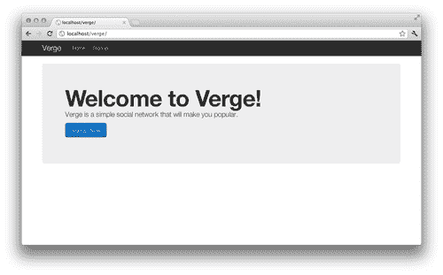

我们几乎没有花费任何时间在设计上，但我们已经有了一个更友好的应用程序。当我们深入处理用户时，这种新设计将会派上用场。

准备看到一些很酷的东西吗？试着把浏览器窗口缩小，看看会发生什么。

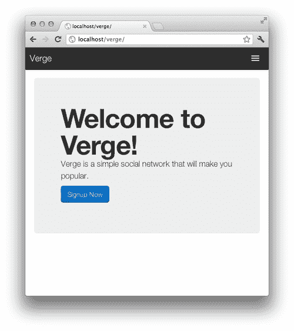

注意内容如何根据屏幕大小调整；这意味着在移动设备上，您的应用程序将调整以便轻松查看。Bootstrap 的响应式样板代码只是一个开始。您可以选择根据浏览器的大小来显示和隐藏内容。

浏览器窗口变小后，您会注意到导航栏也被压缩了，而不是看到您的链接，您会看到一个有三条杠的按钮。尝试点击它...什么也没有发生！

这个组件需要 Bootstrap 的 JavaScript 文件，以及一个名为**jQuery**的 JavaScript 库。我们现在还没有必要让这一切都工作，所以让我们在下一章回来吧！

## 将所有用户文件移动到用户文件夹中

我们的应用程序在这一部分将开始大幅增长。如果我们继续像现在这样随意地把文件扔来扔去，我们的视图将变得非常混乱。让我们进行一些整理工作，并为我们的`views`目录添加一些结构。

# 行动时间 - 组织我们的用户视图

随着我们继续为我们的应用程序创建视图，对我们来说很聪明的是要有一些组织，以确保我们保持事情简单明了。

1.  在`views`目录中创建一个名为`user`的文件夹。

1.  将现有的`signup.php`视图移动到这个文件夹中。结果的目录结构将类似于以下截图：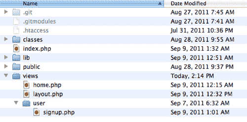

1.  我们需要更新`index.php`并让它知道在哪里找到我们刚刚移动的注册视图：

```php
get('/signup', function($app) {
**$app->render('user/signup');** 
});

```

## 刚刚发生了什么？

我们通过创建一个`user`文件夹来清理我们的`views`文件夹结构，将所有与用户相关的视图放入其中。然后我们将现有的`signup.php`文件移动到`user`文件夹，并告诉我们的`index.php`文件在哪里找到`user/signup.php`文件。请注意，注册页面的路由`/signup`并没有改变。

# 设计我们的用户文档

我们在第三章中已经看到了 CouchDB 如何查看用户文档。在本章中，我们将学习如何利用现有的 CouchDB 功能，并在其上添加一些额外的字段。

## CouchDB 如何查看基本用户文档

CouchDB 已经有一个存储用户文档的机制，我们已经看到并使用过。我们将使用相同的结构来处理我们应用程序的用户：

```php
{
"_id": "org.couchdb.user:your_username",
"_rev": "1-b9af54a7cdc392c2c298591f0dcd81f3",
"name": "your_username",
"password_sha": "3bc7d6d86da6lfed6d4d82e1e4d1c3ca587aecc8",
"roles": [],
"salt": "9812acc4866acdec35c903f0cc072c1d",
"type": "user"
}

```

这七个字段是 CouchDB 要求用户在 CouchDB 中正确操作所必需的：

+   `_id`是用户的唯一标识符。它需要以`org.couchdb.user:`开头，并以`name`属性的相同值结尾。这些角色由`_auth`设计文档强制执行。我们还没有太多讨论设计文档。但是，此时，您需要知道设计文档是直接在数据库中运行的代码。它们可以用于强制执行验证和业务角色。

+   `_rev`是文档的修订标识符。我们在第三章中快速涉及了修订。

+   `name`是用户的用户名。这个字段是`_auth`设计文档所必需的，并且它还需要与冒号后文档的`_id`的值匹配。

+   `password_sha`是密码与`salt`组合后进行 SHA-1 加密的值。我们稍后会介绍 SHA-1 加密。

+   `password_sha`是密码与`salt`组合后进行 SHA-1 加密的值。我们稍后会介绍 SHA-1 加密。

+   `roles`是用户可能拥有的特权数组。通过具有`[]`的值，我们知道这个用户没有特权。

+   `salt`是用户的唯一`salt`。`salt`与密码的明文值组合，并通过 SHA-1 加密得到`password_sha`的值。

+   `type`是 CouchDB 用来标识文档类型的标识符。请记住，CouchDB 是一个扁平的文档存储。这个`type`字段标识了文档的分类。

这些用户文档是独特的，因为它们需要一定结构，但我们总是可以向其添加额外字段。让我们接着做吧！

## 向用户文档添加更多字段

让我们谈谈一些额外的字段，我们知道我们将想要从 Verge 的用户那里收集信息。请记住，如果您的应用程序需要，您总是可以添加更多字段。

+   **用户名：** 我们知道我们将想要存储一个唯一的用户名，这样我们的用户将拥有一个唯一的 URL，例如`/user/johndoe`。幸运的是，这个功能已经由 CouchDB 的`name`字段处理了。考虑到这一点，这里没有什么要做的。我们只需使用现有的`name`即可！

+   **全名：** 用户的全名，这样我们就可以显示用户的名称为`John Doe`。这将是一个用户友好的名称，我们可以用来展示给访问用户，我们需要向文档中添加一个字段来支持这一点。

+   **电子邮件：** 电子邮件地址，以便我们可以与用户进行通信，例如通知电子邮件：`<john@example.com>`。实际上，我们已经在当前类中保存了电子邮件，所以我们也可以忽略这一点。

听起来很容易；我们只需要添加一个字段！每当您向文档添加新字段时，您都应该考虑如何格式化它。让我们讨论一下我们可以采用的 CouchDB 的不同方法。

### 讨论添加这些字段的选项

我们可能会使用各种方法来在 CouchDB 的基本用户文档上添加字段：

+   我们可以创建一个新类型的文档，称之为`verge_user`。这个文档将包含我们在应用程序中需要的任何额外用户属性，然后将引用回用户文档。

+   我们可以在用户文档内创建一个数组，其中包含特定于应用程序的属性，并将所有用户属性添加到其中。

+   或者我们可以只是在用户文档内添加这两个新字段。

我认为，目前我们可以一致同意通过添加一个字段来选择最后提到的选项。

考虑到这一点，我们的最终文档将类似于以下内容：

```php
{
"_id": "org.couchdb.user:johndoe",
"_rev": "1-b9af54a7cdc392c2c298591f0dcd81f3",
"name": "johndoe",
"full_name": "John Doe",
"email": "john@example.com",
"password_sha": "3bc7d6d86da6lfed6d4d82e1e4d1c3ca587aecc8",
"roles": [],
"salt": "9812acc4866acdec35c903f0cc072c1d",
"type": "user"
}

```

您可能会觉得在许多地方看到用户名称的变化很奇怪：`_id、name`和`full_name`。但请记住，CouchDB 有充分的理由这样做。通过将用户名存储在`_id`中，CouchDB 将自动检查每个用户名是否唯一。

### 注意

请记住，如果我们想要开始存储诸如`网站、传记`或`位置`等字段，我们可能会想要更有创意。我们将在本书后面更详细地讨论这个问题。

### 添加对额外字段的支持

为了向用户文档中添加这些字段，我们不需要在代码中做太多更改；我们只需要在`user.php`类中添加一些变量即可。

# 采取行动-添加字段以支持用户文档

我们已经在`classes/user.php`文件中设置了用户文档的基本结构，但让我们继续添加一些字段。

1.  我们目前没有在任何项目中设置`_id`，但我们需要为我们的用户文档这样做。让我们打开`classes/base.php`，并添加`_id`，这样我们就有了在任何文档上设置`_id`的选项。

```php
<?php
abstract class Base {
**protected $_id;** 
protected $type;

```

1.  我们需要将我们刚刚讨论的所有用户字段添加到`classes/user.php`文件中，以及一些其他字段。将以下代码添加到`classes/user.php`中，使其看起来如下：

```php
<?php
class User extends Base {
protected $name;
protected $email;
**protected $full_name;
protected $salt;
protected $password_sha;
protected $roles;** 

```

## 刚刚发生了什么？

我们添加了所有需要保存用户文档到系统中的字段。我们在`base.php`类中添加了`_id`，因为我们知道每个 CouchDB 文档都需要这个字段。到目前为止，我们已经能够在没有`_id`的情况下生活，因为 CouchDB 自动为我们设置了一个。然而，在本章中，我们需要能够设置和检索我们的用户文档的`_id`。然后，我们添加了`full_name`和其他一些可能让您感到困惑的字段。`$salt`和`$password_sha`用于安全存储密码。这个过程通过一个例子更容易解释，所以我们将在我们的注册过程中详细介绍这个过程。最后，我们添加了角色，在本书中将为空，但对于您开发基于角色的系统可能会有用，允许某些用户能够看到应用程序的某些部分等。

现在我们已经定义了用户结构，我们需要走一遍注册过程，这比我们迄今为止所做的 CouchDB 文档创建要复杂一些。

# 注册过程

现在我们已经支持用户类中的所有字段，让我们为用户注册 Verge 添加支持。注册是一个有点复杂的过程，但我们将尝试逐步分解它。在本节中，我们将：

1.  定义我们的数据库管理员用户名和密码，以便我们可以创建新的用户文档

1.  创建一个新的注册界面来支持我们添加的所有字段

1.  添加一个 Bootstrap 助手，使创建表单输入更容易

1.  开发一个快速而简单的注册过程的实现

1.  深入了解我们密码的 SHA-1 加密

1.  重构我们的注册过程，使其更加结构化

## 一点管理员设置

在第三章中，我们锁定了`our _users`数据库，这样我们就可以保护我们的用户数据，这意味着每当我们处理`_users`数据库时，我们需要提供管理员登录。为此，我们将在`index.php`文件的顶部添加用户和密码的 PHP 常量，以便我们在需要执行管理员功能时随时引用它。如果这看起来混乱，不要担心；我们将在本书的后面整理这一点。

```php
<?php
include 'lib/bones.php';
**define('ADMIN_USER', 'tim');
define('ADMIN_PASSWORD', 'test');** 

```

## 更新界面

如果您现在打开浏览器并转到`http://localhost/verge/signup`，您会注意到它与我们的新 Bootstrap 更改不符。实际上，您可能甚至看不到所有的输入框！让我们使用 Bootstrap 来帮助清理我们的注册界面，使其看起来正确。

1.  用以下 HTML 代码替换`views/user/signup.php`页面的所有内容：

```php
<div class="page-header">
<h1>Signup</h1>
</div>
<div class="row">
<div class="span12">
<form class="form-vertical" action="<?php echo $this- >make_route('/signup') ?>" method="post">
<fieldset>
<label for="full_name">Full Name</label>
<input class="input-large" id="full_name" name="full_name" type="text" value="">
<label for="email">Email</label>
<input class="input-large" id="email" name="email" type="text" value="">
<div class="form-actions">
<button class="btn btn-primary">Sign Up!</button>
</div>
</fieldset>
</form>
</div>
</div>

```

1.  刷新注册页面，您将看到我们的表单现在很棒！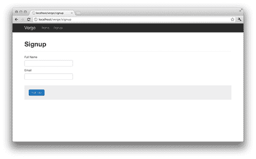

+   我们的表单看起来很干净。但是，让我们诚实点，随着我们添加更多字段，为输入字段添加代码将开始变得痛苦。让我们创建一个小的辅助类，帮助我们创建一个可以与 Bootstrap 很好地配合的 HTML 标记：

1.  在`lib`目录中创建一个名为`bootstrap.php`的新文件。

1.  在`bones.php`中引用`lib/bootstrap.php`。

```php
define('ROOT', __DIR__ . '/..');
**require_once ROOT . '/lib/bootstrap.php';** 
require_once ROOT . '/lib/sag/src/Sag.php';

```

1.  打开`lib/bootstrap.php`，并创建一个基本类。

```php
<?php
class Bootstrap {
}

```

1.  我们将创建一个名为`make_input`的函数，它将接受四个参数：`$id, $label, $type`和`$value`。

```php
<?php
class Bootstrap {
**public static function make_input($id, $label, $type, $value = '') {
echo '<label for="' . $id . '">' . $label . '</label> <input class="input-large" id="' . $id . '" name="' . $id . '" type="' . $type . '" value="' . $value . '">';
}** 
}

```

1.  返回到`views/user/signup.php`，并简化代码以使用新的`make_input`函数。

```php
<div class="page-header">
<h1>Signup</h1>
</div>
<div class="row">
<div class="span12">
<form action="<?php echo $this->make_route('/signup') ?>" method="post">
<fieldset>
**<?php Bootstrap::make_input('full_name', 'Full Name', 'text'); ?>
<?php Bootstrap::make_input('email', 'Email', 'text'); ?>** 
<div class="form-actions">
<button class="btn btn-primary">Sign Up!</button>
</div>
</fieldset>
</form>
</div>
</div>

```

1.  现在我们有了`lib/bootstrap.php`来让我们的生活更轻松，让我们向用户询问另外两个字段：`username`和`password`。

```php
<fieldset>
<?php Bootstrap::make_input('full_name', 'Full Name', 'text'); ?>
<?php Bootstrap::make_input('email', 'Email', 'text'); ?>
**<?php Bootstrap::make_input('username', 'Username', 'text'); ?>
<?php Bootstrap::make_input('password', 'Password', 'password'); ?>** 
<div class="form-actions">
<button class="btn btn-primary">Sign Up!</button>
</div>
</fieldset>

```

1.  刷新您的浏览器，您会看到一个大大改进的注册表单。如果它看起来不像下面的截图，请检查您的代码是否与我的匹配。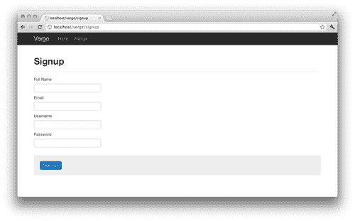

我们的表单看起来很棒！不幸的是，当您点击**注册！**时，它实际上还没有注册用户。让我们在下一节中改变这一点。

## 快速而简单的注册

现在，我们将直接将用户注册代码写入`index.php`。我们将多次重构此代码，并在本章结束时，将大部分注册功能移至`classes/user.php`文件。

# 行动时间-处理简单用户注册

让我们逐步进行注册过程，在此过程中，我们将从头开始重建注册`POST`路由中的代码。我会逐步解释每段代码，然后在本节结束时进行全面回顾。

1.  打开`index.php`，并开始收集简单字段：`full_name, email`和`roles`。`full_name`和`email`字段将直接来自表单提交，`roles`我们将设置为空数组，因为此用户没有特殊权限。

```php
post('/signup', function($app) {
$user = new User();
$user->full_name = $app->form('full_name');
$user->email = $app->form('email');
$user->roles = array();

```

1.  接下来，我们将捕获用户提交的用户名，但我们希望防止奇怪的字符或空格，因此我们将使用正则表达式将提交的用户名转换为不带任何特殊字符的小写字符串。最终结果将作为我们的`name`字段，也将作为 ID 的一部分。请记住，用户文档要求`_id`必须以`org.couchdb.user`开头，并以用户的`name`结尾。

```php
post('/signup', function($app) {
$user = new User();
$user->full_name = $app->form('full_name'); $user->email = $app->form('email');
$user->roles = array();
**$user->name = preg_replace('/[^a-z0-9-]/', '', strtolower($app- >form('username')));
$user->_id = 'org.couchdb.user:' . $user->name;** 

```

1.  为了加密用户输入的明文密码值，我们将临时设置一个字符串作为`salt`的值。然后，我们将明文密码传递给 SHA-1 函数，并将其保存在`password_sha`中。我们将在接下来的几分钟内深入了解 SHA-1 的工作原理。

```php
post('/signup', function($app) {
$user = new User();
$user->full_name = $app->form('full_name'); $user->email = $app->form('email');
$user->roles = array();
$user->name = preg_replace('/[^a-z0-9-]/', '', strtolower($app- >form('username')));
$user->_id = 'org.couchdb.user:' . $user->name;
**$user->salt = 'secret_salt';
$user->password_sha = sha1($app->form('password') . $user- >salt);** 

```

1.  为了保存用户文档，我们需要将数据库设置为`_users`，并以我们在 PHP 常量中设置的管理员用户身份登录。然后，我们将使用 Sag 将用户放入 CouchDB。

```php
post('/signup', function($app) {
$user = new User();
$user->full_name = $app->form('full_name'); $user->email = $app->form('email');
$user->roles = array();
$user->name = preg_replace('/[^a-z0-9-]/', '', strtolower($app- >form('username')));
$user->_id = 'org.couchdb.user:' . $user->name;
$user->salt = 'secret_salt';
$user->password_sha = sha1($app->form('password') . $user- >salt);
**$app->couch->setDatabase('_users');
$app->couch->login(ADMIN_USER, ADMIN_PASSWORD);
$app->couch->put($user->_id, $user->to_json());** 

```

1.  最后，让我们关闭用户注册功能并呈现主页。

```php
post('/signup', function($app) {
$user = new User();
$user->full_name = $app->form('full_name'); $user->email = $app->form('email');
$user->roles = array();
$user->name = preg_replace('/[^a-z0-9-]/', '', strtolower($app- >form('username')));
$user->_id = 'org.couchdb.user:' . $user->name;
$user->salt = 'secret_salt';
$user->password_sha = sha1($app->form('password') . $user- >salt);
$app->couch->setDatabase('_users');
$app->couch->login(ADMIN_USER, ADMIN_PASSWORD);
$app->couch->put($user->_id, $user->to_json());
**$app->render('home');** 
});

```

## 刚刚发生了什么？

我们刚刚添加了代码来设置 CouchDB 用户文档的所有值。收集`full_name, email`和`roles`的值非常简单；我们只需从提交的表单中获取这些值。设置`name`变得更加复杂，我们将用户名的提交值转换为小写字符串，然后使用**正则表达式（Regex）**函数将任何特殊字符更改为空字符。有了干净的名称，我们将其附加到`org.couchdb.user`并保存到文档的`_id`中。哇！这真是一大堆。

迅速进入加密世界，我们设置了一个静态（非常不安全的）`salt`。将`salt`与明文密码结合在 SHA-1 函数中，得到了一个加密密码，保存在我们对象的`password_sha`字段中。接下来，我们使用`setDatabase`设置了 Sag 的数据库，以便我们可以与 CouchDB 的`_users`数据库进行通信。为了与用户进行通信，我们需要管理员凭据。因此，我们使用`ADMIN_USER`和`ADMIN_PASSWORD`常量登录到 CouchDB。最后，我们使用 HTTP 动词`PUT`在 CouchDB 中创建文档，并为用户呈现主页。

让我们测试一下，看看当我们提交注册表单时会发生什么。

1.  在浏览器中打开注册页面，访问`http://localhost/verge/signup`。

1.  填写表格，将**全名**设置为`John Doe`，**电子邮件**设置为`<john@example.com>`，**用户名**设置为`johndoe`，**密码**设置为`temp123`。完成后，点击**注册**！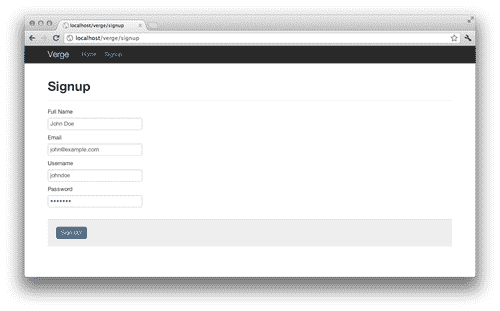

1.  您的用户已创建！让我们通过访问`http://localhost:5984/_utils`，并查看`_users`数据库的新文档。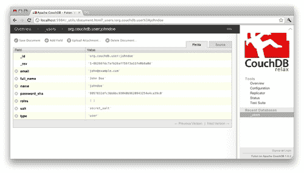

1.  完美，一切应该已经保存正确！查看完毕后，点击**删除文档**删除用户。如果您当前未以管理员用户身份登录，您需要先登录，然后 CouchDB 才允许您删除文档。

我让您删除用户，因为如果每个用户的“盐”等于`secret_salt`，我们的密码实际上就是明文。为了让您理解为什么会这样，让我们退一步看看 SHA-1 的作用。

## SHA-1

在安全方面，存储明文密码是最大的禁忌之一。因此，我们使用 SHA-1 ([`en.wikipedia.org/wiki/SHA-1`](http://en.wikipedia.org/wiki/SHA-1))来创建加密哈希。SHA-1 是由**国家安全局（NSA）**创建的加密哈希函数。SHA-1 的基本原理是我们将密码与**盐**结合在一起，使我们的密码无法辨认。**盐**是一串随机位，我们将其与密码结合在一起，使我们的密码以独特的方式加密。

在我们刚刚编写的注册代码中，我们忽略了一些非常重要的事情。我们的“盐”每次都被设置为`secret_salt`。我们真正需要做的是为每个密码创建一个随机的“盐”。

为了创建随机盐，我们可以使用 CouchDB 的 RESTful JSON API。Couch 在`http://localhost:5984/_uuids`提供了一个资源，当调用时，将为我们返回一个唯一的`UUID`供我们使用。每个`UUID`都是一个长而随机的字符串，这正是盐所需要的！Sag 通过一个名为`generateIDs`的函数非常容易地获取 UUID。

让我们更新我们的注册代码，以反映我们刚刚讨论的内容。打开`index.php`，并更改`盐`值的设置以匹配以下内容：

```php
post('/signup', function($app) {
$user = new User();
$user->full_name = $app->form('full_name'); $user->email = $app->form('email');
$user->roles = array();
$user->name = preg_replace('/[^a-z0-9-]/', '', strtolower($app- >form('username')));
$user->_id = 'org.couchdb.user:' . $user->name;
**$user->salt = $app->couch->generateIDs(1)->body->uuids[0];** 
$user->password_sha = sha1($app->form('password') . $user->salt);
$app->couch->setDatabase('_users');
$app->couch->login(ADMIN_USER, ADMIN_PASSWORD);
$app->couch->put($user->_id, $user->to_json());
$app->render('home');
});

```

### 再次测试注册流程

现在我们已经解决了盐的不安全性，让我们回去再试一次注册流程。

1.  通过在浏览器中转到`http://localhost/verge/signup`来打开注册页面。

1.  填写表格，**全名**为`John Doe`，**电子邮件**为`<john@example.com>`，**用户名**为`johndoe`，**密码**为`temp123`。完成后，点击**注册**。

1.  您的用户已创建！让我们通过转到`http://localhost:5984/_utils`，并在`_users`数据库中查找我们的新文档来到 Futon。这次我们的“盐”是随机且唯一的！再次测试注册流程

## 重构注册流程

正如我之前提到的，我们将把这段代码重构为干净的函数，放在我们的用户类内部，而不是直接放在`index.php`中。我们希望保留`index.php`用于处理路由、传递值和渲染视图。

# 行动时间-清理注册流程

通过在`User`类内创建一个名为`signup`的公共函数来清理我们的注册代码。

1.  打开`classes/user.php`，并创建一个用于注册的`public`函数。

```php
public function signup($username,$password) {
}

```

1.  输入以下代码以匹配下面的代码。它几乎与我们在上一节输入的代码相同，只是不再引用`$user`，而是引用`$this`。您还会注意到`full_name`和`email`不在这个函数中；您马上就会看到它们。

```php
public function signup($username, $password) {
**$bones = new Bones();
$bones->couch->setDatabase('_users');
$bones->couch->login(ADMIN_USER, ADMIN_PASSWORD);
$this->roles = array();
$this->name = preg_replace('/[^a-z0-9-]/', '', strtolower($username));
$this->_id = 'org.couchdb.user:' . $this->name;
$this->salt = $bones->couch->generateIDs(1)->body->uuids[0];
$this->password_sha = sha1($password . $this->salt);
$bones->couch->put($this->_id, $this->to_json());
}** 

```

1.  打开`index.php`，清理注册路由，使其与以下代码匹配：

```php
post('/signup', function($app) {
$user = new User();
$user->full_name = $app->form('full_name');
$user->email = $app->form('email');
**$user->signup($app->form('username'), $app->form('password'));** 
$app->set('message', 'Thanks for Signing Up ' . $user->full_name . '!');
$app->render('home');
});

```

## 刚刚发生了什么？

我们创建了一个名为`signup`的公共函数，它将包含我们的用户注册所需的所有注册代码。然后我们从`index.php`注册路由中复制了大部分代码。你会注意到里面有一些以前没有看到的新东西。例如，所有对`$user`的引用都已更改为`$this`，因为我们使用的所有变量都附加到当前用户对象上。你还会注意到，在开始时，我们创建了一个新的`Bones`对象，以便我们可以使用它。我们还创建了 Sag，我们已经连接到 Bones，我们能够初始化而不会造成任何开销，因为我们使用了单例模式。请记住，单例模式允许我们在此请求中调用我们在其他地方使用的相同对象，而不创建新对象。最后，我们回到`index.php`文件，并简化了我们的注册代码路由，以便我们只处理直接来自表单的值。然后我们通过注册函数传递了未经修改的用户名和密码，以便我们可以处理它们并执行注册代码。

我们的注册代码现在清晰并且在类级别上运行，并且不再影响我们的应用程序。但是，如果你尝试测试我们的表单，你会意识到它还不够完善。

# 异常处理和解决错误

如果你试图返回到你的注册表单并保存另一个名为`John Doe`的文档，你会看到一个相似于以下截图的相当不友好的错误页面：

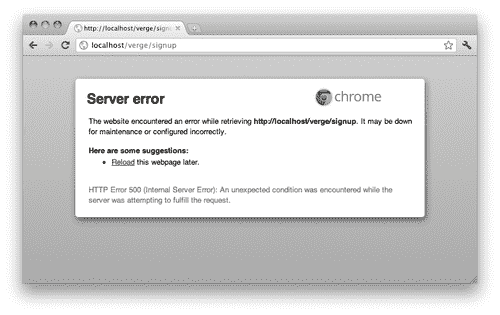

如果你使用的是 Chrome 以外的浏览器，你可能收到了不同的消息，但结果仍然是一样的。发生了我们没有预料到的不好的事情，更糟糕的是，我们没有捕获这些异常。

当出现问题时会发生什么？我们如何找出出了什么问题？答案是：我们查看日志。

## 解读错误日志

当 PHP 和 Apache 一起工作时，它们会为我们产生大量的日志。有些是访问级别的日志，而另一些是错误级别的。所以让我们看看是否可以通过查看 Apache 错误日志来调查这里发生了什么。

# 行动时间——检查 Apache 的日志

让我们开始找 Apache 的错误日志。

1.  打开终端。

1.  运行以下命令询问 Apache 的`config`文件保存日志的位置：

```php
**grep ErrorLog /etc/apache2/httpd.conf** 

```

1.  终端会返回类似以下的内容：

```php
**# ErrorLog: The location of the error log file.
# If you do not specify an ErrorLog directive within a <VirtualHost>
ErrorLog "/private/var/log/apache2/error_log"** 

```

1.  通过运行以下命令检索日志的最后几行：

```php
**tail /private/var/log/apache2/error_log** 

```

1.  日志会显示很多东西，但最重要的消息是这个，它说 PHP`致命错误`。你的消息可能略有不同，但总体消息是一样的。

```php
**[Sun Sep 11 22:10:31 2011] [error] [client 127.0.0.1] PHP Fatal error: Uncaught exception 'SagCouchException' with message 'CouchDB Error: conflict (Document update conflict.)' in /Library/WebServer/Documents/verge/lib/sag/src/Sag.php:1126\nStack trace:\n#0 /Library/WebServer/Documents/verge/lib/sag/src/Sag.php(286): Sag->procPacket('PUT', '/_users/org.cou...', '{"name":"johndoe')\n#1 /Library/WebServer/Documents/verge/classes/user.php(30): Sag->put('org.couchdb.use...', '{"name":"johndoe')\n#2 /Library/WebServer/Documents/verge/index.php(20): User->signup('w')\n#3 /Library/WebServer/Documents/verge/lib/bones.php(91): {closure}(Object(Bones))\n#4 /Library/WebServer/Documents/verge/lib/bones.php(17): Bones::register('/signup', Object(Closure), 'POST')\n#5 /Library/WebServer/Documents/verge/index.php(24): post('/signup', Object(Closure))\n#6 {main}\n thrown in /Library/WebServer/Documents/verge/lib/sag/src/Sag.php on line 1126, referer: http://localhost/verge/signup
[Sun Sep 11 22:10:31 2011] [error] [client 127.0.0.1] PHP Fatal error: Uncaught exception 'SagCouchException' with message 'CouchDB Error: conflict (Document update conflict.)' in /Library/WebServer/Documents/verge/lib/sag/src/Sag.php:1126\nStack trace:\n#0 /Library/WebServer/Documents/verge/lib/sag/src/Sag.php(286): Sag->procPacket('PUT', '/_users/org.cou...', '{"name":"johndoe')\n#1 /Library/WebServer/Documents/verge/classes/user.php(30): Sag->put('org.couchdb.use...', '{"name":"johndoe')\n#2 /Library/WebServer/Documents/verge/index.php(20): User->signup('w')\n#3 /Library/WebServer/Documents/verge/lib/bones.php(91): {closure}(Object(Bones))\n#4 /Library/WebServer/Documents/verge/lib/bones.php(17): Bones::register('/signup', Object(Closure), 'POST')\n#5 /Library/WebServer/Documents/verge/index.php(24): post('/signup', Object(Closure))\n#6 {main}\n thrown in /Library/WebServer/Documents/verge/lib/sag/src/Sag.php on line 1126, referer: http://localhost/verge/signup** 

```

## 刚刚发生了什么？

我们询问 Apache 它存储日志的位置，一旦我们找到日志文件的保存位置。我们使用`tail`命令返回 Apache 日志的最后几行。

### 注意

有各种各样的方法来阅读日志，我们不会深入讨论，但你可以选择让自己感到舒适的方式。你可以通过搜索互联网来研究`tail`，或者你可以在预装在你的 Mac OSX 机器上的控制台应用程序中打开日志。

查看我们收到的 PHP 致命错误相当令人困惑。如果你开始深入研究，你会发现这是一个 CouchDB 错误。更具体地说，这个错误的主要行是：

```php
**Uncaught exception 'SagCouchException' with message 'CouchDB Error: conflict (Document update conflict.)** 

```

这个消息意味着 CouchDB 对我们传递给它的内容不满意，而且我们没有处理 Sag 以`SagCouchException`形式抛出的异常。`SagCouchException`是一个类，将帮助我们解读 CouchDB 抛出的异常，但为了做到这一点，我们需要知道 CouchDB 返回的状态码是什么。

为了获取状态码，我们需要查看我们的 CouchDB 日志。

# 行动时间：检查 CouchDB 的日志

由于我们都是用 Homebrew 相同的方式安装了 CouchDB，我们可以确保我们的 CouchDB 日志都在同一个位置。考虑到这一点，让我们看看我们的 CouchDB 日志。

1.  打开终端。

1.  通过运行以下命令检索日志的最后几行：

```php
**tail /usr/local/var/log/couchdb/couch.log** 

```

1.  终端将返回类似以下内容：

```php
**[Mon, 12 Sep 2011 16:04:56 GMT] [info] [<0.879.0>] 127.0.0.1 - - 'GET' /_uuids?count=1 200
[Mon, 12 Sep 2011 16:04:56 GMT] [info] [<0.879.0>] 127.0.0.1 - - 'PUT' /_users/org.couchdb.user:johndoe 409** 

```

## 刚刚发生了什么？

我们使用`tail`命令返回 CouchDB 日志的最后几行。

您将注意到的第一条记录是`/uuids?count=1`，这是我们在`signup`函数中抓取`salt`的 UUID。请注意，它返回了`200`状态，这意味着它执行成功。

下一行说`'PUT' /_users/org.couchdb.user:johndoe`，并返回了`409`响应。`409`响应意味着存在更新冲突，这是因为我们传递给用户的名称与已存在的名称相同。这应该很容易解决，但首先我们需要讨论如何捕获错误。

## 捕获错误

幸运的是，借助我们友好的`try...catch`语句，捕获错误相对容易。`try...catch`语句允许您测试一段代码块是否存在错误。`try`块包含您要尝试运行的代码，如果出现问题，将执行`catch`块。

`try...catch`语句的语法看起来类似于以下内容：

```php
try {
// Code to execute
} catch {
// A problem occurred, do this
}

```

正如我之前提到的，Sag 包括一个名为`SagCouchException`的异常类。这个类让我们能够看到 CouchDB 的响应，然后我们可以相应地采取行动。

# 行动时间 - 使用 SagCouchException 处理文档更新冲突

我们在上一节中确定，我们的代码由于`409`响应而中断。因此，让我们调整`classes/user.php`文件中的注册功能，以使用`SagCouchException`处理异常。

```php
public function signup($username, $password) {
...
**try {
$bones->couch->put($this->_id, $this->to_json());
} catch(SagCouchException $e) {
if($e->getCode() == "409") {
$bones->set('error', 'A user with this name already exists.');
$bones->render('user/signup');
exit;
}
}** 
}

```

## 刚刚发生了什么？

我们使用了`try...catch`语句来解决触发的重复文档更新冲突。通过将其转换为`(SagCouchException $e)`，我们告诉它现在只捕获通过的`SagCouchExceptions`。一旦捕获到这个异常，我们就会检查返回的代码是什么。如果是`409`的代码，我们将设置一个带有错误消息的`error`变量。然后我们需要重新显示用户/注册表单，以便用户有机会再次尝试注册流程。为了确保在此错误之后不再执行任何代码，我们使用`exit`命令，以便应用程序停在那里。

我们刚刚设置了一个`error`变量。让我们讨论如何显示这个变量。

## 显示警报

在我们的应用程序中，我们将根据用户交互显示标准通知，我们将其称为警报。我们刚刚设置了一个错误变量，用于错误警报，但我们也希望能够显示成功消息。

# 行动时间 - 显示警报

在这一部分，我们将使用我们现有的变量在 bones 中允许我们向用户显示警报消息。

1.  打开`lib/bones.php`并创建一个名为`display_alert()`的新函数。将调用此函数以查看`alert`变量是否设置。如果设置了`alert`变量，我们将回显一些 HTML 以在布局上显示警报框。

```php
public function display_alert($variable = 'error') {
if (isset($this->vars[$variable])) {
return "<div class='alert alert-" . $variable . "'><a class='close' data-dismiss='alert'>x</a>" . $this- >vars[$variable] . "</div>";
}
}

```

1.  在`layout.php`中添加代码，就在容器`div`内部显示 Flash 调用`display_flash`函数。

```php
<div class="container">
**<?php echo $this->display_alert('error'); ?>
<?php echo $this->display_alert('success'); ?>** 
<?php include($this->content); ?>
</div>

```

1.  现在我们已经添加了这些 Flash 消息，让我们回到`index.php`中的注册`POST`路由，并添加一个 Flash 消息，感谢用户注册。

```php
$user->signup($app->form('username'), $app->form('password'));
**$app->set('success', 'Thanks for Signing Up ' . $user->full_name . '!');** 
$app->render('home');
});

```

## 刚刚发生了什么？

我们创建了一个名为`display_alert`的函数，用于检查传递变量的变量是否设置。如果设置了，我们将借助 Bootstrap 在警报框中显示变量的内容。然后我们在`layout.php`中添加了两行代码，以便我们可以显示错误和成功的 Flash 消息。最后，我们为我们的注册流程添加了一个成功的 Flash 消息。

让我们测试一下。

1.  返回并尝试再次注册用户名为`johndoe`的用户。

你会看到这个友好的错误消息，告诉你有问题：

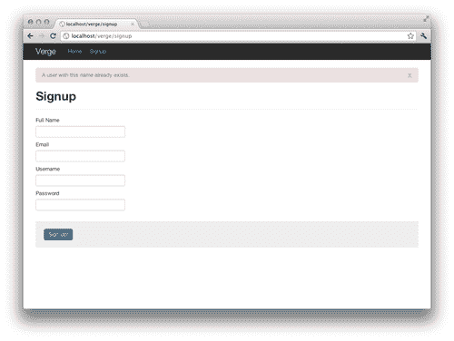

1.  现在，让我们测试一下成功的警报消息。将用户名更改为`johndoe2`。点击**注册！**，你将收到一个漂亮的绿色警报。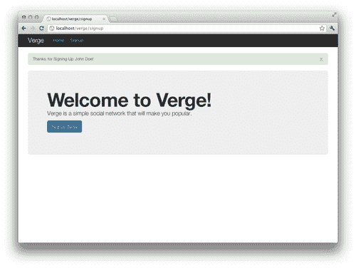

+   即使有了这些简单的警报，我们的注册表单还不完美。随机的异常和错误可能会发生，我们无法处理。更令人担忧的是，我们并没有要求表单中的字段填写。这些项目需要在我们的视线范围内，但我们无法在本书中涵盖所有这些。

让我们继续讨论用户认证。

# 用户认证

现在我们已经创建了用户，我们肯定需要找到一种让他们登录到我们系统的方法。幸运的是，CouchDB 和 Sag 在这个领域真的会为我们做很多繁重的工作。在这一部分，我们将：

+   设置登录表单

+   了解会话、cookie，以及 CouchDB 和 Sag 如何处理我们的认证

+   添加支持用户登出

+   为已登录和未登录的用户不同处理 UI

## 设置登录表单

让我们创建一些登录表单，这样我们的用户就可以登录到我们的网站并使用他们新创建的账户。

## 试试吧——设置登录的路由和表单

我们已经多次经历了创建页面、设置路由和创建表单的过程。所以，让我们看看这次你能否自己尝试一下。我不会完全不帮助你。我会先告诉你需要尝试做什么，然后当你完成时，我们会进行回顾，确保我们的代码匹配起来。

你需要做的是：

1.  创建一个名为`user/login.php`的新页面。

1.  在`index.php`文件中为登录页面创建新的`GET`和`POST`路由。

1.  告诉登录页面的`GET`路由渲染`user/login`视图。

1.  使用`user/signup.php`作为指南创建一个包含`username`和`password`字段的表单。

1.  使用 Bootstrap 助手和`submit`按钮添加名为`username`和`password`的字段。

在你这样做的时候，我会去看电视。当你准备好了，翻到下一页，我们看看进展如何！

干得好！我希望你能够在不需要太多帮助的情况下完成。如果你需要回头看旧代码寻求帮助，不要担心，因为当开发者陷入困境时，很多人最终都会这样做。让我们看看你的代码与我的代码匹配程度如何。

此外，你的`index.php`文件应该类似于以下内容：

```php
get('/login', function($app) {
$app->render('user/login');
});
post('/login', function($app) {
});

```

你的`views/user/login.php`页面应该类似于以下内容：

```php
<div class="page-header">
<h1>Login</h1>
</div>
<div class="row">
<div class="span12">
<form action="<?php echo $this->make_route('/login') ?>" method="post">
<fieldset>
<?php Bootstrap::make_input('username', 'Username', 'text'); ?>
<?php Bootstrap::make_input('password', 'Password', 'password'); ?>
<div class="form-actions">
<button class="btn btn-primary">Login</button>
</div>
</fieldset>
</form>
</div>
</div>

```

确保将你的代码更新到与我的相匹配，这样我们的代码在未来能够匹配起来。

## 登录和登出

现在我们已经准备好表单了，让我们谈谈我们需要做什么才能让表单真正起作用。让我们快速谈谈我们在登录过程中要实现的目标。

1.  Sag 将连接到 CouchDB 的`_users`数据库。

1.  Sag 将从我们的 PHP 直接将登录信息传递给 CouchDB。

1.  如果登录成功，CouchDB 将返回一个认证的 cookie。

1.  然后，我们将查询 CouchDB 以获取当前登录的用户名，并将其保存到会话变量中以供以后使用。

如果你已经使用其他数据库开发了一段时间，你会立刻看到登录过程有多酷。CouchDB 正在处理我们通常需要自己处理的大部分认证问题！

让我们来看看登录功能。幸运的是，它比注册过程要简单得多。

# 行动时间——为用户添加登录功能

我们将慢慢地进行这个过程，但我认为你会喜欢我们能够如此快速地添加这个功能，因为我们迄今为止编写的所有代码。

1.  打开`classes/user.php`。

1.  创建一个名为`login`的`public`函数，我们可以将我们的明文`$password`作为参数传递。

```php
public function login($password) {
}
Create a new bones object and set the database to _users.
public function login($password) {
**$bones = new Bones();
$bones->couch->setDatabase('_users');** 
}

```

1.  为我们的登录代码创建一个`try...catch`语句。在`catch`块中，我们将捕获错误代码`401`。如果触发了错误代码，我们希望告诉用户他们的登录是不正确的。

```php
public function login($password) {
$bones = new Bones();
$bones->couch->setDatabase('_users');
**try {
}
catch(SagCouchException $e) {
if($e->getCode() == "401") {
$bones->set('error', ' Incorrect login credentials.');
$bones->render('user/login');
exit;
}
}** 
}

```

1.  添加代码来启动会话，然后通过 Sag 将用户名和密码传递到 CouchDB。当用户成功登录时，从 CouchDB 获取当前用户的用户名。

```php
public function login($password) {
$bones = new Bones();
$bones->couch->setDatabase('_users');
**try {
$bones->couch->login($this->name, $password, Sag::$AUTH_COOKIE);
session_start();
$_SESSION['username'] = $bones->couch->getSession()->body- >userCtx->name;
session_write_close();** 
}

```

## 刚刚发生了什么？

我们在`user`类中创建了一个名为`login`的`public`函数，允许用户登录。然后我们创建了一个新的 Bones 引用，以便我们可以访问 Sag。为了处理无效的登录凭据，我们创建了一个`try...catch`块，并先处理`catch`块。这次，我们检查错误代码是否为`401`。如果错误代码匹配，我们设置`error`变量来显示错误消息，渲染登录页面，最后退出当前代码。

接下来，我们通过将用户名和明文密码传递给 Sag 的登录方法来处理登录代码，同时设置`Sag::$AUTH_COOKIE`。这个参数告诉我们使用 CouchDB 的 cookie 身份验证。通过使用 cookie 身份验证，我们可以处理身份验证，而无需每次传递用户名和密码。

在幕后，正在发生的是我们的用户名和密码被发布到`/_session` URL。如果登录成功，它将返回一个 cookie，我们可以在此之后的每个请求中使用它，而不是用户名和密码。幸运的是，Sag 为我们处理了所有这些！

接下来，我们使用`session_start`函数初始化了一个会话，这允许我们设置会话变量，只要我们的会话存在，它就会持续存在。然后，我们为用户名设置了一个会话变量，等于当前登录用户的用户名。我们通过使用 Sag 来获取会话信息，使用`$bones->couch->getSession()`。然后使用`->body()`获取响应的主体，最后使用`userCtx`获取当前用户，并进一步获取`username`属性。这一切都导致了一行代码，如下所示：

```php
**$_SESSION['username'] = $bones->couch->getSession()->body->userCtx->name;** 

```

最后，我们使用`session_write_close`来写入会话变量并关闭会话。这将提高速度并减少锁定的机会。别担心；通过再次调用`session_start()`，我们可以再次检索我们的`session`变量。

最后，我们需要将登录函数添加到`index.php`中的`post`路由。让我们一起快速完成。

```php
post('/login', function($app) {
**$user = new User();
$user->name = $app->form('username');
$user->login($app->form('password'));
$app->set('success', 'You are now logged in!');
$app->render('home');** 
});

```

我们现在可以去测试这个，但让我们完成更多的事情，以便完全测试这里发生了什么。

# 行动时间-为用户添加注销功能

我敢打赌你认为登录脚本非常简单。等到你看到我们如何让用户注销时，你会觉得更容易。

1.  打开`classes/user.php`，创建一个名为`logout`的`public static`函数。

```php
public static function logout() {
$bones = new Bones();
$bones->couch->login(null, null);
session_start();
session_destroy();
}

```

1.  在`index.php`文件中添加一个路由，并调用`logout`函数。

```php
get('/logout', function($app) {
User::logout();
$app->redirect('/');
});

```

1.  注意，我们在 Bones 内部调用了一个新功能`redirect`函数。为了使其工作，让我们在底部添加一个快速的新功能

```php
public function redirect($path = '/') {
header('Location: ' . $this->make_route($path));
}

```

## 刚刚发生了什么？

我们添加了一个名为`logout`的`public static`函数。我们将其设置为`public static`的原因是，我们目前登录的用户对我们来说并不重要。我们只需要执行一些简单的会话级操作。首先，我们像往常一样创建了一个`$bones`实例，但接下来的部分非常有趣，所以我们设置了`$bones->couch->login(null, null)`。通过这样做，我们将当前用户设置为匿名用户，有效地注销了他们。然后，我们调用了`session_start`和`session_destroy`。请记住，通过`session_start`，我们使我们的会话可访问，然后我们销毁它，这将删除与当前会话相关的所有数据。

在完成`login`函数后，我们打开了`index.php`，并调用了我们的`public static`函数，使用`User::logout()`。

最后，我们使用了一个重定向函数，将其添加到了`index.php`文件中。因此，我们迅速在 Bones 中添加了一个函数，这样就可以使用`make_route`将用户重定向到一个路由。

## 处理当前用户

我们真的希望能够确定用户是否已登录，并相应地更改导航。幸运的是，我们可以在几行代码中实现这一点。

# 行动时间 - 处理当前用户

大部分拼图已经就位，让我们来看看根据用户是否已登录来更改用户布局的过程。

1.  让我们在`classes/user.php`中添加一个名为`current_user`的函数，这样我们就可以从会话中检索当前用户的用户名。

```php
public static function current_user() {
session_start();
return $_SESSION['username'];
session_write_close();
}

```

1.  在`classes/user.php`中添加一个名为`is_authenticated`的`public static`函数，以便我们可以查看用户是否已经认证。

```php
public static function is_authenticated() {
if (self::current_user()) {
return true;
} else {
return false;
}
}

```

1.  既然我们的身份验证已经就绪，让我们来收紧`layout.php`中的导航，以便根据用户是否已登录来显示不同的导航项。

```php
<ul class="nav">
**<li><a href="<?php echo $this->make_route('/') ?>">Home</a></li>
<?php if (User::is_authenticated()) { ?>
<li>
<a href="<?php echo $this->make_route('/logout') ?>">
Logout
</a>
</li>
<?php } else { ?>
<li>
<a href="<?php echo $this->make_route('/signup') ?>">
Signup
</a>
</li>
<li>
<a href="<?php echo $this->make_route('/login') ?>">
Login
</a>
</li>
<?php } ?>** 
</ul>

```

## 刚刚发生了什么？

我们首先创建了一个名为`current_user`的`public static`函数，用于检索存储在会话中的用户名。然后我们创建了另一个名为`is_authenticated`的`public static`函数。该函数检查`current_user`是否有用户名，如果有，则用户已登录。如果没有，则用户当前未登录。

最后，我们迅速进入我们的布局，这样我们就可以在用户登录时显示首页和注销的链接，以及在用户当前未登录时显示首页、注册和登录的链接。

让我们来测试一下：

1.  通过转到`http://localhost/verge/`登录页面在浏览器中打开。请注意，标题显示**首页、注册**和**登录**，因为您当前未登录。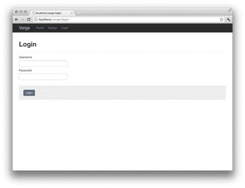

1.  使用您的一个用户帐户的凭据登录。您将收到一个很好的警报消息，并且标题更改为显示**首页**和**注销**。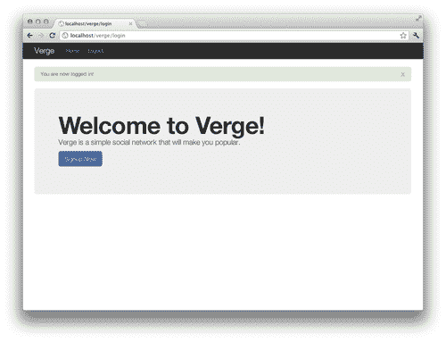

# 总结

我希望你对我们在本章中所取得的成就感到震惊。我们的应用程序真的开始成形了。

具体来说，我们涵盖了：

+   如何通过使用 Twitter 的 Bootstrap 大大改善界面

+   如何在现有 CouchDB 用户文档的基础上创建额外的字段

+   如何处理错误并通过日志调试问题

+   如何完全构建出用户可以使用 Sag 和 CouchDB 注册、登录和注销应用程序的能力

这只是我们应用程序的开始。我们还有很多工作要做。在下一章中，我们将开始着手用户个人资料，并开始创建 CouchDB 中的新文档。这些文档将是我们用户的帖子。
