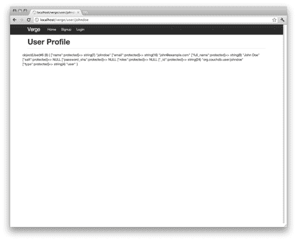
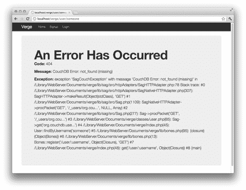
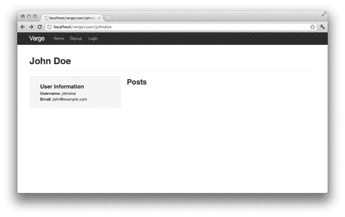
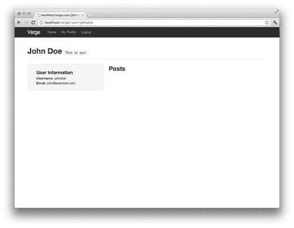
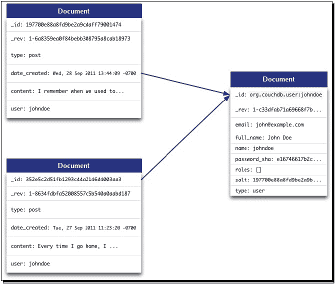
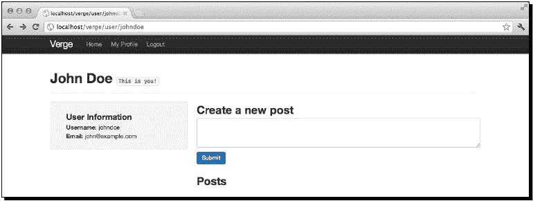
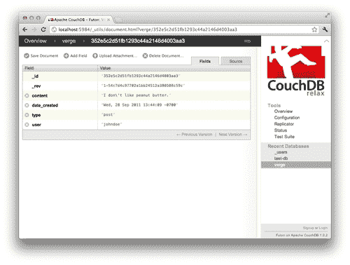

# 第七章：用户个人资料和帖子建模

> 随着我们的应用程序的基础创建，我们允许用户注册并登录到我们的应用程序。这是任何应用程序的重要部分，但我们仍然缺少可以连接到用户帐户的内容的创建。我们将在本章中详细介绍所有内容！

在本章中，我们将：

+   创建一个用户个人资料，以公开显示用户的信息

+   使用 Bootstrap 清理个人资料

+   处理各种异常

+   讨论在 CouchDB 中对帖子和关系的建模

+   创建一个表单，从已登录用户的个人资料中创建帖子

有了我们的路线图，让我们继续讨论用户个人资料！

# 用户个人资料

任何社交网络的主要吸引力是用户的个人资料；用户个人资料通常显示用户的基本信息，并显示他们创建的任何内容。

到本节结束时，我们的用户个人资料将按以下方式工作：

+   如果访问者转到`http://localhost/verge/user/johndoe`，我们的路由系统将将其与路由`/user/:username`匹配

+   `index.php`文件将`johndoe`作为`username`的值，并将其传递给`User`类，尝试查找具有匹配 ID 的用户文档

+   如果找到`johndoe`，`index.php`将显示一个带有`johndoe`信息的个人资料

+   如果找不到`johndoe`，访问者将看到一个`404`错误，这意味着该用户名的用户不存在

## 使用路由查找用户

为了找到用户，我们首先需要创建一个函数，该函数将以用户名作为参数，并在有效时返回一个用户对象。

# 行动时间-获取单个用户文档

您可能还记得，在第三章中，*使用 CouchDB 和 Futon 入门*，我们能够通过传递所需文档的 ID 来从 CouchDB 中检索文档。这一次，我们将使用 Sag 来找到用户的信息。需要注意的一点是，当我们使用 ID 查找用户时，我们需要确保在查找用户时，需要使用`org.couchdb.user:`命名空间进行前置。

让我们从打开`classes/user.php`并滚动到底部开始。

1.  添加一个名为`get_by_username()`的`public static`函数。

```php
public static function get_by_username() {
}

```

1.  为了通过 ID 查找用户，我们需要允许我们的函数接受参数`$username`。

```php
public static function get_by_username($username = null) {
}

```

1.  现在，让我们设置数据库来实例化 Bones 和代理 Sag。记住，我们正在处理`_users`数据库，所以我们需要以`admin`权限登录。

```php
public static function get_by_username($username = null) {
**$bones = new Bones();
$bones->couch->setDatabase('_users');
$bones->couch->login(ADMIN_USER, ADMIN_PASSWORD);
}**

```

1.  现在我们可以连接到`_users`数据库，让我们通过 Sag 发出一个`get`调用，通过添加`org.couchdb.user:`来返回一个用户的传递用户名。

```php
public static function get_by_username($username = null) {
$bones = new Bones()
$bones->couch->login(ADMIN_USER, ADMIN_PASSWORD);
$bones->couch->setDatabase('_users');
**$user = new User();
$document = $bones->couch->get('org.couchdb.user:' . $username)- >body;
$user->_id = $document->_id;
$user->name = $document->name;
$user->email = $document->email;
$user->full_name = $document->full_name;
return $user;
}** 

```

## 刚刚发生了什么？

我们创建了一个名为`get_by_username`的`public static`函数，允许我们传入`$username`。要实际获取文档，我们需要使用我们的`ADMIN_USER`和`ADMIN_PASSWORD`常量来访问`_users`数据库。为了返回一个用户对象，我们需要创建一个名为`$user`的新用户对象。然后我们使用 Sag 的`get`调用通过 ID 标识文档并将其作为名为`$document`的`stdClass`对象返回。然后我们从`document`变量中获取值，并将它们传递到`$user`对象上的相应值。最后，我们将用户文档返回到调用函数的地方。

现在我们有一个处理按用户名查找用户的函数，让我们在`index.php`中创建一个路由，将用户名传递给这个函数。

# 行动时间-为用户个档案创建路由

我们将创建一个路由，以便人们可以通过转到唯一的 URL 来查看个人资料。这将是我们真正利用我们的路由系统处理路由变量的能力的第一次。

1.  打开`index.php`，并创建一个用户个人资料的`get`路由，输入以下代码：

```php
get('/user/:username', function($app) {
});

```

1.  让我们使用路由变量`:username`告诉我们要查找的用户名；我们将把这个变量传递给我们在`User`类中创建的`get_by_username`函数。最后，我们将返回的`user`对象传递给视图中的`user`变量：

```php
get('/user/:username', function($app) {
**$app->set('user', User::get_by_username($app- >request('username')));** 
});

```

1.  最后，我们将呈现`user/profile.php`视图，我们很快就会创建。

```php
get('/user/:username', function($app) {
$app->set('user', User::get_by_username($app- >request('username')));
**$app->render('user/profile');** 
});

```

## 刚刚发生了什么？

我们在短短的四行代码中做了很多事情！首先，我们通过使用`route /user/:username`定义了用户配置文件路由。接下来，我们创建了一段代码，将`route`变量中的`:username`传递给我们`user`类中的`get_by_username`函数。`get_by_username`函数将返回一个包含用户信息的对象，并且我们使用`$app->set('user')`将其发送到我们的视图中。最后，我们呈现了用户配置文件。

让我们继续创建用户配置文件，这样我们就可以看到我们的辛勤工作在发挥作用！

# 行动时间——创建用户配置文件

在本章中，我们将多次清理`user`视图。但是，让我们首先将所有用户文档内容都转储到我们的视图中。

1.  在我们的`working`文件夹中的`views`目录中创建一个名为`user/profile.php`的视图。

1.  为配置文件创建一个简单的标题，使用以下 HTML：

```php
<div class="page-header">
<h1>User Profile</h1>
</div>

```

1.  由于我们还没有设计，让我们只使用`var_dump`来显示`User`文档的所有内容：

```php
<div class="page-header">
<h1>User Profile</h1>
</div>
<div class="container">
**<div class="row">
<?php var_dump($user); ?>
</div>
</div>** 

```

## 刚刚发生了什么？

我们刚刚创建了一个非常基本的用户配置文件，其中包含一个标题，告诉我们这个页面是用户配置文件。然后，我们使用`var_dump`来显示`user`对象的所有内容。`var_dump`是一个通用的 PHP 函数，用于输出关于变量或对象的结构化信息，在你只想确保事情正常运行时非常有用。

### 测试一下

现在我们有了一个简单的用户配置文件设置，让我们看看它的效果如何。

1.  打开你的浏览器，然后转到`http://localhost/verge/user/johndoe`。

1.  你的浏览器将显示以下内容：

+   还不错，但当然我们需要很快清理一下这些数据的格式。但是，现在让我们确保将我们的更改提交到 Git。

### 将你的更改添加到 Git。

在本节中，我们开始创建用户配置文件，并直接从 CouchDB 输出用户信息。让我们将所有更改添加到 Git，以便跟踪我们的进度。

1.  打开终端。

1.  输入以下命令以更改目录到我们的工作目录。

```php
**cd /Library/Webserver/Documents/verge/** 

```

1.  我们只添加了一个文件`views/user/profile.php`，所以让我们告诉 Git 将这个文件添加到源代码控制中。

```php
**git add views/user/profile.php** 

```

1.  给`Git`一个描述，说明自上次提交以来我们做了什么。

```php
**git commit am 'Created the get_by_username function, a basic user profile, and a route to display it'** 

```

## 修复一些问题

你可能已经注意到，我们忽略了一个潜在的问题，即当找不到用户配置文件时我们没有优雅地处理发生了什么。

例如：

如果你访问`http://localhost/verge/user/someone`，你的浏览器会显示这个非常不友好的错误消息：


### 查找错误

在第六章中，我们通过终端使用`tail`命令查看 Apache 的错误日志。我们将再次做同样的事情。让我们看看 Apache 的日志，看看我们能否弄清楚出了什么问题。

# 行动时间——检查 Apache 的日志

在第六章中，我们首先尝试定位我们的 Apache 日志。默认情况下，它保存在`/private/var/log/apache2/error_log`。如果在上一章中发现它位于其他位置，你可以通过在终端中输入`grep ErrorLog /etc/apache2/httpd.conf`来再次找到它的位置。

让我们找出问题出在哪里。

1.  打开终端。

1.  通过运行以下命令检索日志的最后几行：

```php
**tail /private/var/log/apache2/error_log** 

```

1.  日志会显示很多东西，但最重要的消息是这个，说`PHP 致命错误`。你的消息可能略有不同，但总体消息是一样的。

```php
**[Wed Sep 28 09:29:49 2011] [error] [client 127.0.0.1] PHP Fatal error: Uncaught exception 'SagCouchException' with message 'CouchDB Error: not_found (missing)' in /Library/WebServer/Documents/verge/lib/sag/src/Sag.php:1221\nStack trace:\n#0 /Library/WebServer/Documents/verge/lib/sag/src/Sag.php(206): Sag->procPacket('GET', '/_users/org.cou...')\n#1 /Library/WebServer/Documents/verge/classes/user.php(81): Sag->get('org.couchdb.use...')\n#2 /Library/WebServer/Documents/verge/index.php(44): User::get_by_username('someone')\n#3 /Library/WebServer/Documents/verge/lib/bones.php(91): {closure}(Object(Bones))\n#4 /Library/WebServer/Documents/verge/lib/bones.php(13): Bones::register('/user/:username', Object(Closure), 'GET')\n#5 /Library/WebServer/Documents/verge/index.php(46): get('/user/:username', Object(Closure))\n#6 {main}\n thrown in /Library/WebServer/Documents/verge/lib/sag/src/Sag.php on line 1221** 

```

## 刚刚发生了什么？

我们使用了`tail`命令来返回 Apache 日志的最后几行。如果你仔细看日志，你会看到`CouchDB error`。更具体地说，错误如下：

```php
**error: Uncaught exception 'SagCouchException' with message 'CouchDB Error: not_found (missing)'** 

```

这个消息意味着 CouchDB 对我们的操作不满意，Sag 以`SagCouchException`的形式抛出了一个错误。为了适当地处理`SagCouchException`，我们需要在对 Sag 的调用中添加一些代码。

在上一章中，我们通过检查状态代码并将其与分辨率进行匹配来修复了一个错误。我们可以继续这样做，但最终会发生我们不知道的错误。从现在开始，当发生未处理的异常时，我们希望显示友好的错误消息，以便我们可以调试它。

在接下来的部分，我们将使用 Bones 来帮助我们显示一个异常页面。

## 处理 500 错误

我们真正想解决的是如何处理应用程序中的 500 错误。**500 错误**指的是 HTTP 状态代码`500`，即*"内部服务器错误"。通常，这意味着发生了某些事情，我们没有正确处理。

# 行动时间 - 使用 Bones 处理 500 错误

让我们首先创建一个简单的视图，用于向我们显示错误。

1.  让我们首先在我们的`views`目录内创建一个名为`error`的新文件夹。

1.  创建一个名为`500.php`的新视图，并将其放入`errors`文件夹中（views/error/500.php）。

1.  在`500.php`中添加以下代码以输出异常信息：

```php
<div class="hero-unit">
<h1>An Error Has Occurred</h1>
<p>
<strong>Code:</strong><?php echo $exception->getCode(); ?>
</p>
<p>
<strong>Message:</strong>
<?php echo $exception->getMessage(); ?>
</p>
<p><strong>Exception:</strong> <?php echo $exception; ?></p>
</div>

```

1.  在`lib/bones.php`中添加一个名为`error500`的函数，以便我们可以在我们的应用程序中轻松地显示 500 错误。

```php
public function error500($exception) {
$this->set('exception', $exception);
$this->render('error/500');
exit;
}

```

## 刚才发生了什么？

我们在`views`目录中创建了一个名为`error`的新文件夹，其中包含了我们在应用程序中使用的所有错误视图。然后我们创建了一个名为`500.php`的新视图，以友好的方式显示我们的异常。异常是 Sag 扩展的内置类，使用`SagCouchException`类。有了这个，我们可以很容易地直接与我们的视图中的这个异常类交谈。这个`Exception`类有很多属性。但是，在这个应用程序中，我们只会显示代码、消息和以字符串格式表示的异常。最后，我们创建了一个函数在 Bones 中，允许我们传递异常进去，以便我们可以在视图中显示它。在这个函数中，我们将异常传递给`error/500`视图，然后使用`exit`，告诉 PHP 停止在我们的应用程序中做任何其他事情。这样做是因为发生了问题，我们的应用程序停止做任何其他事情。

# 行动时间 - 处理异常

现在我们可以处理异常了，让我们在`get_by_username`函数中添加一些代码，以便我们可以更深入地查看我们的问题。

1.  让我们打开`classes/user.php`，并在我们的 Sag 调用周围添加一个`try...catch`语句，以确保我们可以处理任何发生的错误。

```php
public static function get_by_username($username = null) {
$bones = new Bones();
$bones->couch->login(ADMIN_USER, ADMIN_PASSWORD);
$bones->couch->setDatabase('_users');
$user = new User();
**try {** 
$document = $bones->couch->get('org.couchdb.user:' . $username)->body;
$user->_id = $document->_id;
$user->name = $document->name;
$user->email = $document->email;
$user->full_name = $document->full_name;
return $user;
**} catch (SagCouchException $e) {
}** 
}

```

1.  既然我们正在捕获错误，让我们在`error500`函数中添加。

```php
public static function get_by_username($username = null) {
$bones = new Bones();
$bones->couch->login(ADMIN_USER, ADMIN_PASSWORD);
$bones->couch->setDatabase('_users');
$user = new User();
try {
$document = $bones->couch->get('org.couchdb.user:' . $username)->body;
$user->_id = $document->_id;
$user->name = $document->name;
$user->email = $document->email;
$user->full_name = $document->full_name;
return $user;
} catch (SagCouchException $e) {
**$bones->error500($e);** 
}
}

```

1.  当我们在`classes/user.php`中时，让我们捕获一些可能的异常。让我们从`public`函数注册开始。

```php
public function signup($username, $password) {
$bones = new Bones();
$bones->couch->setDatabase('_users');
$bones->couch->login(ADMIN_USER, ADMIN_PASSWORD);
$this->roles = array();
$this->name = preg_replace('/[^a-z0-9-]/', '', strtolower($username));
$this->_id = 'org.couchdb.user:' . $this->name;
$this->salt = $bones->couch->generateIDs(1)->body->uuids[0];
$this->password_sha = sha1($password . $this->salt);
try {
$bones->couch->put($this->_id, $this->to_json());
}
catch(SagCouchException $e) {
if($e->getCode() == "409") {
$bones->set('error', 'A user with this name already exists.');
$bones->render('user/signup');
**} else {
$bones->error500($e);
}** 
}
}

```

1.  接下来，让我们在我们的公共函数登录中添加到`catch`语句。

```php
public function login($password) {
$bones = new Bones();
$bones->couch->setDatabase('_users');
try {
$bones->couch->logiBn($this->name, $password, Sag::$AUTH_COOKIE);
session_start();
$_SESSION['username'] = $bones->couch->getSession()->body- >userCtx->name;
session_write_close();
}
catch(SagCouchException $e) {
if($e->getCode() == "401") {
$bones->set('error', 'Incorrect login credentials.');
$bones->render('user/login');
exit;
**} else {
$bones->error500($e);
}** 
}
}

```

## 刚才发生了什么？

现在我们可以优雅地处理异常了，我们通过我们的`User`类，并在发生意外情况时添加了抛出`500`错误的能力。在我们已经预期到某些问题的调用中，如果发生了意外情况，我们可以使用`if...else`语句触发`500`错误。

### 测试我们的异常处理程序

让我们再试一次，看看我们是否能找到异常的根源。

1.  转到`http://localhost/verge/user/someone`。

1.  现在你会看到一个更友好的错误页面，告诉我们代码、消息和完整的错误，你会在错误日志中看到。

对我们来说，从中弄清楚发生了什么是更容易的。在我们调试应用程序的过程中，这个页面对我们来说将非常有用，以跟踪发生了什么错误。

通过查看这段代码，我们可以知道 CouchDB 正在抛出一个`404`错误。我们可能期望这个错误会发生，因为我们正在寻找一个不存在的用户文档。让我们进一步了解一下`404`错误是什么，以及我们如何处理它。

## 显示 404 错误

`404`错误指的是 HTTP 状态码`404`，意思是“未找到”。`404`错误通常发生在您尝试访问不存在的内容时，比如访问错误的 URL。在我们的情况下，我们收到`404`错误是因为我们试图查找一个不存在的 CouchDB 文档。

### 如果找不到用户，则显示 404

`404`错误是一种特殊的错误，我们会在应用程序的不同位置看到。让我们创建另一个错误页面，以便在发生`404`错误时使用。

# 采取行动：使用 Bones 处理 404 错误

让我们为应用程序中的`404`错误创建一个视图。

1.  首先，在我们的`views/error/`目录中创建一个名为`404.php`的新视图。

1.  让我们在`404.php`中添加一些非常基本的代码，以通知访问者我们的应用程序找不到请求的页面。

```php
<div class="hero-unit">
<h1>Page Not Found</h1>
</div>

```

1.  为了呈现这个视图，让我们在`lib/bones.php`文件中添加另一个名为`error404`的函数。这个函数将为我们很好地显示`404`错误。

```php
public function error404() {
$this->render('error/404');
exit;
}

```

## 刚才发生了什么？

我们创建了一个简单的视图，名为`404.php`，我们可以在应用程序中任何时候显示`404`错误。然后我们在`lib/bones.php`中创建了一个名为`error404`的简单函数，它呈现`error/404.php`并终止当前脚本，以便不会发生进一步的操作。

### 为未知用户显示 404 错误

现在我们有了`404`错误处理程序，让我们在`classes/user.php`的`get_by_username`函数中发生`404`错误时显示它。

打开`classes/user.php`，并修改`get_by_username`函数以匹配以下内容：

```php
public static function get_by_username($username = null) {
$bones = new Bones();
$bones->couch->login(ADMIN_USER, ADMIN_PASSWORD);
$bones->couch->setDatabase('_users');
$user = new User();
**try {** 
$document = $bones->couch->get('org.couchdb.user:' . $username)- >body;
$user->_id = $document->_id;
$user->name = $document->name;
$user->email = $document->email;
$user->full_name = $document->full_name;
return $user;
**} catch (SagCouchException $e) {
if($e->getCode() == "404") {
$bones->error404();
} else {
$bones->error500($e);
}** 
}

```

```php
}

```

### 在整个站点上挂接 404

`404`错误的有趣之处在于，它们可以在访问者通过 Bones 不理解的路由时发生。因此，让我们在 Bones 中添加代码来处理这个问题。

# 采取行动-使用 Bones 处理 404 错误

让我们在`lib/bones.php`和`index.php`周围添加一些简单的代码，以便处理`404`错误。

1.  打开`lib/bones.php`，在`Bones`类内部创建一个名为`resolve`的函数，我们可以在路由的末尾调用它，并确定是否找到了路由。

```php
public static function resolve() {
if (!static::$route_found) {
$bones = static::get_instance();
$bones->error404();
}
}

```

1.  转到`lib/bones.php`的顶部，并创建一个名为`resolve`的函数，放在`Bones`类之外（例如`get, post, put`或`delete`），我们可以在任何地方调用它。

```php
function resolve() {
Bones::resolve();
}

```

1.  我们要做的最后一件事就是在`index.php`的最底部添加一行代码，如果没有找到路由，就可以调用它。随着添加更多的路由，确保`resolve()`始终位于文件的末尾。

```php
get('/user/:username', function($app) {
$app->set('user', User::get_by_username($app- >request('username')));
$app->render('user/profile');
});
**resolve();** 

```

## 刚才发生了什么？

我们创建了一个名为`resolve`的函数，在我们的`index.php`文件的底部执行，它会在所有路由之后执行。这个函数作为一个“清理”函数，如果没有匹配的路由，它将向访问者显示一个`404`错误并终止当前脚本。

### 测试一下

既然我们优雅地处理了`404`错误，让我们测试一下，看看会发生什么。

1.  打开您的浏览器，转到`http://localhost/verge/user/anybody`。

1.  您的浏览器将显示以下内容：

+   太好了！我们的`User`类正在转发给我们一个`404`错误，因为我们在`get_by_username`函数中添加了代码。

1.  接下来，让我们检查一下我们的`index.php`，看看如果找不到请求的路由，它是否会转发给我们一个`404`错误。

1.  打开您的浏览器，转到`http://localhost/verge/somecrazyurl`。

1.  您的浏览器将显示以下内容：

完美！我们的`404`错误处理程序正是我们需要的。如果我们将来需要再次使用它，我们只需要在我们的`Bones`类中调用`error404`，然后一切都设置好了！

## 给用户一个链接到他们的个人资料

在大多数社交网络中，一旦您登录，就会显示一个链接，以查看当前登录用户的个人资料。让我们打开`view/layout.php`，并在导航中添加一个`My Profile`链接。

```php
<ul class="nav">
<li><a href="<?php echo $this->make_route('/') ?>">Home</a></li>
<?php if (User::is_authenticated()) { ?> <li>
<a href="<?php echo $this->make_route('/user/' . User::current_user()) ?>">
My Profile
</a>
</li>
<li>
<a href="<?php echo $this->make_route('/logout') ?>">
Logout
</a>
</li>
<?php } else { ?>
<li>
<a href="<?php echo $this->make_route('/signup') ?>">
Signup
</a>
</li>
<li>
<a href="<?php echo $this->make_route('/login') ?>">
Login
</a>
</li>
<?php } ?>
</ul>

```

## 使用 Bootstrap 创建更好的个人资料

我们的个人资料并不是很好地组合在一起，这开始让我感到困扰，我们需要在本章后面再添加更多内容。让我们准备好我们的用户个人资料，以便我们可以很好地显示用户的信息和帖子。

# 行动时间-检查用户当前是否已登录

我们需要能够弄清楚用户正在查看的个人资料是否是他们自己的。所以，让我们在我们的视图中添加一个变量，告诉我们是否是这种情况。

1.  打开`index.php`，并添加一个名为`is_current_user`的变量，用于确定您正在查看的个人资料是否等于当前登录用户。

```php
get('/user/:username', function($app) {
$app->set('user', User::get_by_username($app- >request('username')));
**$app->set('is_current_user', ($app->request('username') == User::current_user() ? true : false));** 
$app->render('user/profile');
});

```

1.  让我们更改`views/user/profile.php`头部的代码，这样我们就可以输出用户的全名以及`This is you!`，如果这是当前用户的个人资料。

```php
<div class=－page-header－>
**<h1><?php echo $user->full_name; ?>
<?php if ($is_current_user) { ?>
<code>This is you!</code>
<?php } ?>
</h1>** 
</div>

```

## 刚刚发生了什么？

我们使用了一个称为`ternary`的简写操作。`ternary`操作是`if-else`语句的简写形式。在这种情况下，我们说如果从路由传递的用户名等于当前登录用户的用户名，则返回`true`，否则返回`false`。然后，我们进入我们的个人资料，并且如果`is_current_user`变量设置为`true`，则显示`This is you!`。

### 清理个人资料的设计

再次，Bootstrap 将通过允许我们用有限的代码清理我们的个人资料来拯救我们。

1.  让我们通过以下代码将我们的行`div`分成两列：

```php
<div class="page-header">
<h1><?php echo $user->full_name; ?>
<?php if ($is_current_user) { ?>
<code>This is you!</code>
<?php } ?>
</h1>
</div>
**<div class="container">
<div class="row">
<div class="span4">
<div class="well sidebar-nav">
<ul class="nav nav-list">
<li><h3>User Information</h3>
</ul>
</div>
</div>
<div class="span8">
<h2>Posts</h2>
</div>
</div>
</div>** 

```

1.  通过将更多的列表项添加到无序列表中，将用户的信息输出到左列。

```php
<div class="container">
<div class="row">
<div class="span4">
<div class="well sidebar-nav">
<ul class="nav nav-list">
<li><h3>User Information</h3></li>
**<li><b>Username:</b> <?php echo $user->name; ?></li>
<li><b>Email:</b> <?php echo $user->email; ?></li>** 
</ul>
</div>
</div>
<div class="span8">
<h2>Posts</h2>
</div>
</div>
</div>

```

#### 让我们来看看我们的新个人资料

有了这个，我们的新的改进的个人资料已经出现了！让我们来看看。

1.  通过转到`http://localhost/verge/user/johndoe`，在浏览器中打开`johndoe`用户的 URL。

1.  您的浏览器将显示一个精心改造的用户个人资料。

1.  现在，让我们检查一下我们的`$is_current_user`变量是否正常工作。为了做到这一点，请使用`johndoe`作为用户名登录，并转到`http://localhost/verge/user/johndoe`。

1.  您的浏览器将显示用户个人资料，以及一个友好的消息告诉您这是您的个人资料。

太棒了！我们的个人资料真的开始变得完整起来了。这是我们应用程序的一个重要里程碑。所以，让我们确保将我们的更改提交到 Git。

#### 将您的更改添加到 Git

在这一部分，我们添加了支持清晰处理异常的功能，并且还改进了用户个人资料。让我们把所有的更改都添加到 Git 中，这样我们就可以跟踪我们的进展。

1.  打开终端。

1.  输入以下命令以更改目录到我们的`working`目录： 

```php
**cd /Library/Webserver/Documents/verge/** 

```

1.  我们在这一部分添加了一些文件。所以，让我们把它们都加入到源代码控制中。

```php
**git add .** 

```

1.  给 Git 一个描述，说明自上次提交以来我们做了什么。

```php
**git commit -am 'Added 404 and 500 error exception handling and spruced up the layout of the user profile'** 

```

# 帖子

我们在个人资料中有一个帖子的占位符。但是，让我们开始填充一些真实内容。我们将允许用户发布小段内容，并将它们与用户帐户关联起来。

## 建模帖子

让我们讨论一下我们需要做什么才能将帖子保存到 CouchDB 并与用户关联起来。在我们使用 CouchDB 进行此操作之前，让我们尝试通过查看如何在 MySQL 中进行操作来加深理解。

### 如何在 MySQL 中建模帖子

如果我们要为 MySQL（或其他 RDBMS）建模这种关系，它可能看起来类似于以下截图：


简而言之，这个图表显示了一个`posts`表，它有一个外键`user_id`，引用了用户表的`id`。这种一对多的关系在大多数应用程序中都很常见，在这种情况下，意味着一个用户可以有多个帖子。

既然我们已经看过一个熟悉的图表，让我们再看看与 CouchDB 相关的相同关系。

### 如何在 CouchDB 中建模帖子

令人惊讶的是，CouchDB 以非常相似的方式处理关系。你可能会想，等一下，我以为你说它不是关系数据库。请记住，无论你使用什么数据库，它们处理关系的方式都可能有共同之处。让我们看看 CouchDB 如何说明相同的数据和模型。



这很相似，对吧？最大的区别始终是，在关系数据库中，数据存储在固定的行和列中，而在 CouchDB 中，它们存储在自包含的文档中，具有无模式的键和值集。无论你如何查看数据，关系都是相同的，即，通过对用户 ID 的引用，帖子与用户相连接。

为了确保我们在同一页面上，让我们逐个浏览`post`文档中的每个字段，并确保我们理解它们是什么。

+   `_id`是文档的唯一标识符。

+   `_rev`是文档的修订标识符。我们在第三章中提到过修订，如果你想重新了解这个概念。

+   `type`告诉我们我们正在查看什么类型的文档。在这种情况下，每个`post`文档都将等于`post`。

+   `date_created`是文档创建时的时间戳。

+   `content`包含我们想要放在帖子中的任何文本。

+   `user`包含创建帖子的用户的用户名，并引用回`_users`文档。有趣的是，我们不需要在这个字段中放入`org.couchdb.user`，因为 CouchDB 实际上会查看用户名。

现在我们已经定义了需要保存到 CouchDB 的值，我们准备在一个新类`Post`中对其进行建模。

## 试试看-设置帖子类

创建`Post`类将与我们的`User`类非常相似。如果你感到足够自信，请尝试自己创建基本类。

你需要做的是：

1.  创建一个名为`post.php`的新类，它扩展了`Base`类。

1.  为之前定义的每个必需字段创建变量。

1.  添加一个`construct`函数来定义文档的类型。

完成后，继续阅读下一页，并确保你的工作与我的匹配。

让我们检查一下一切的结果。

你应该已经创建了一个名为`post.php`的新文件，并将其放在我们`working`文件夹中的`classes`目录中。post.php 的内容应该类似于以下内容：

```php
<?php
class Post extends Base
{
protected $date_created;
protected $content;
protected $user;
public function __construct() {
parent::__construct('post');
}
}

```

这就是我们在 PHP 中处理帖子文档所需要的一切。现在我们已经建立了这个类，让我们继续创建帖子。

# 创建帖子

现在对我们来说，创建帖子将是小菜一碟。我们只需要添加几行代码，它就会出现在数据库中。

# 行动时间-制作处理帖子创建的函数

让我们创建一个名为`create`的公共函数，它将处理我们应用程序的帖子创建。

1.  打开`classes/post.php`，并滚动到底部。在这里，我们将创建一个名为`create`的新公共函数。

```php
public function create() {
}

```

1.  让我们首先获得一个新的 Bones 实例，然后设置当前`post`对象的变量。

```php
public function create() {
**$bones = new Bones();
$this->_id = $bones->couch->generateIDs(1)->body->uuids[0];
$this->date_created = date('r');
$this->user = User::current_user();
}** 

```

1.  最后，让我们使用 Sag 将文档放入 CouchDB。

```php
public function create() {
$bones = new Bones();
$this->_id = $bones->couch->generateIDs(1)->body->uuids[0];
$this->date_created = date('r');
$this->user = User::current_user();
**$bones->couch->put($this->_id, $this->to_json());** 
}

```

1.  让我们用一个`try...catch`语句包装对 CouchDB 的调用，在`catch`语句中，让我们像以前一样将其弹到`500`错误。

```php
public function create() {
$bones = new Bones();
$this->_id = $bones->couch->generateIDs(1)->body->uuids[0];
$this->date_created = date('r');
$this->user = User::current_user();
**try {
$bones->couch->put($this->_id, $this->to_json());
}
catch(SagCouchException $e) {
$bones->error500($e);
}** 
}

```

## 刚刚发生了什么？

我们刚刚创建了一个名为`create`的函数，使我们能够创建一个新的`Post`文档。我们首先实例化了一个 Bones 对象，以便我们可以使用 Sag。接下来，我们使用 Sag 为我们获取了一个`UUID`作为我们的`post`的 ID。然后，我们使用`date('r')`将日期输出为`RFC 2822`格式（这是 CouchDB 和 JavaScript 所喜欢的格式），并将其保存到帖子的`date_created`变量中。然后，我们将帖子的用户设置为当前用户的用户名。

在设置了所有字段后，我们使用 Sag 的`put`命令将帖子文档保存到 CouchDB。最后，为了确保我们没有遇到任何错误，我们将`put`命令包装在一个`try...catch`语句中。在`catch`部分中，如果出现问题，我们将用户传递给 Bones 的`error500`函数。就是这样！我们现在可以在我们的应用程序中创建帖子。我们唯一剩下的就是在用户个人资料中创建一个表单。

# 开始行动-创建一个表单来启用帖子创建

让我们直接在用户的个人资料页面中编写用于创建帖子的表单。只有当已登录用户查看自己的个人资料时，该表单才会显示出来。

1.  打开`user/profile.php`。

1.  让我们首先检查用户正在查看的个人资料是否是他们自己的。

```php
<div class="span8">
**<?php if ($is_current_user) { ?>
<h2>Create a new post</h2>
<?php } ?>** 
<h2>Posts</h2>
</div>

```

1.  接下来，让我们添加一个表单，允许当前登录的用户发布帖子。

```php
<div class="span8">
<?php if ($is_current_user) { ?>
<h2>Create a new post</h2>
**<form action="<?php echo $this->make_route('/post')?>" method="post">
<textarea id="content" name="content" class="span8" rows="3">
</textarea>
<button id="create_post" class="btn btn-primary">Submit
</button>
</form>
<?php } ?>** 
<h2>Posts</h2>
</div>

```

## 刚刚发生了什么？

我们使用`$is_current_user`变量来确定查看个人资料的用户是否等于当前登录的用户。接下来，我们创建了一个表单，该表单提交到`post`路由（接下来我们将创建）。在表单中，我们放置了一个`id`为`content`的`textarea`和一个`submit`按钮来实际提交表单。

现在我们已经准备好一切，让我们通过在`index.php`文件中创建一个名为`post`的路由来完成`post`的创建。

# 开始行动-创建一个路由并处理帖子的创建

为了实际创建一个帖子，我们需要创建一个路由并处理表单输入。

1.  打开`index.php`。

1.  创建一个基本的`post`路由，并将其命名为`post`。

```php
post('/post', function($app) {
});

```

1.  在我们的`post`路由中，让我们接受传递的值`content`并在我们的`Post`类上使用`create`函数来实际创建帖子。帖子创建完成后，我们将用户重定向回他们的个人资料页面。

```php
post('/post', function($app) {
**$post = new Post();
$post->content = $app->form('content');
$post->create();
$app->redirect('/user/' . User::current_user());** 
});

```

1.  我们已经做了很多工作，以确保用户在创建帖子时经过身份验证，但让我们再三检查用户是否在这里经过了身份验证。如果他们没有经过身份验证，我们的应用程序将将他们转发到用户登录页面，并显示错误消息。

```php
post('/post', function($app) {
**if (User::is_authenticated()) {** 
$post = new Post();
$post->content = $app->form('content');
$post->create();
$app->redirect('/user/' . User::current_user());
**} else {
$app->set('error', 'You must be logged in to do that.');
$app->render('user/login');
}** 
});

```

## 刚刚发生了什么？

在这一部分，我们为`post`路由创建了一个`post`路由（抱歉，这是一个令人困惑的句子）。在`post`路由内部，我们实例化了一个`Post`对象，并将其实例变量`content`设置为来自提交表单的`textarea`的内容。接下来，我们通过调用公共的`create`函数创建了`post`。帖子保存后，我们将用户重定向回他/她自己的个人资料。最后，我们在整个`route`周围添加了功能，以确保用户已登录。如果他们没有登录，我们将把他们弹到登录页面，并要求他们登录以执行此操作。

## 测试一下

现在我们已经编写了创建帖子所需的一切，让我们一步一步地测试一下。

1.  首先以`johndoe`的身份登录，并通过在浏览器中打开`http://localhost/verge/user/johndoe`来转到他的个人资料。

1.  您的浏览器将显示一个用户个人资料，就像我们以前看到的那样，但这次您将看到`post`表单。

1.  在文本区域中输入一些内容。我输入了`我不喜欢花生酱`，但您可以随意更改。

1.  完成后，点击**提交**按钮。

1.  您已被转发回`johndoe`的用户个人资料，但您还看不到任何帖子。因此，让我们登录 Futon，确保帖子已创建。

1.  通过转到`http://localhost:5984/_utils/database.html?verge`，在 Futon 中转到`verge`数据库。

1.  太棒了！这里有一个文档；让我们打开它并查看内容。

这个完美解决了！当用户登录时，他们可以通过转到他们的个人资料并提交**创建新帖子**表单来创建帖子。

## 将您的更改添加到 Git

在这一部分，我们添加了一个基于我们的`Post`模型来创建帖子的函数。然后我们在用户个人资料中添加了一个表单，这样用户就可以真正地创建帖子。让我们把所有的更改都添加到 Git 中，这样我们就可以跟踪我们的进展。

1.  打开终端。

1.  输入以下命令以更改目录到我们的`working`目录：

```php
**cd /Library/Webserver/Documents/verge/** 

```

1.  我们添加了`classes/post.php`文件，所以让我们把那个文件加入到源代码控制中：

```php
**git add classes/post.php** 

```

1.  给`Git`一个描述，说明自上次提交以来我们做了什么：

```php
**git commit –am 'Added a Post class, built out basic post creation into the user profile. Done with chapter 7.'**

```

1.  我知道我说过我不会再提醒你了，但我也只是个人。让我们把这些更改推送到 GitHub 上去。

```php
**git push origin master**

```

# 总结

信不信由你，这就是我们在本章中要写的所有代码。收起你的抗议标语，上面写着“我们甚至还没有查询用户的帖子！”我们停在这里的原因是 CouchDB 有一种非常有趣的方式来列出和处理文档。为了讨论这个问题，我们需要定义如何使用**设计文档**来进行视图和验证。幸运的是，这正是我们将在下一章中涵盖的内容！

与此同时，让我们快速回顾一下我们在本章中取得的成就。

# 摘要

在本章中，我们涵盖了创建用户个人资料来显示用户信息，如何优雅地处理异常并向用户显示`500`和`404`错误页面，如何在 CouchDB 中对帖子进行建模，以及最后，创建一个为已登录用户创建帖子的表单。

正如我所说，在下一章中，我们将涉及一些 CouchDB 带来的非常酷的概念。这可能是本书中最复杂的一章，但会非常有趣。
