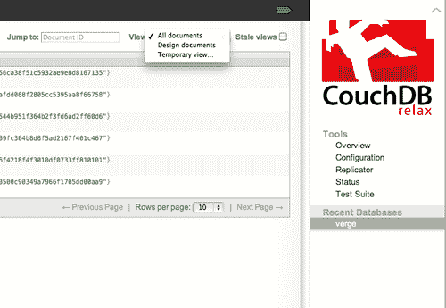
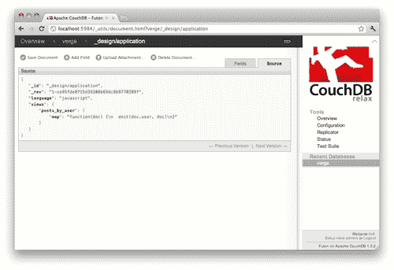
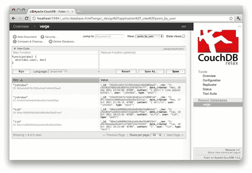
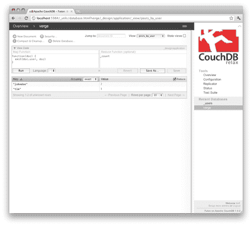
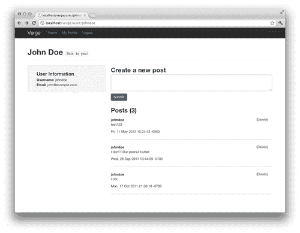
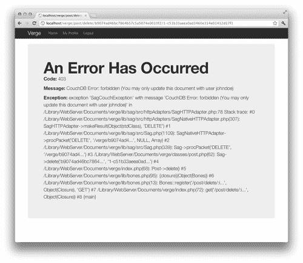

# 第八章：使用设计文档进行视图和验证

> 到目前为止，我们的应用程序与使用 MySQL 或其他关系数据库时并没有太大的不同。但是，在本章中，我们将真正发挥 CouchDB 的作用，通过它来处理以前在关系数据库中可能是痛点的许多事情。

在本章中，我们将：

+   定义设计文档

+   了解视图以及如何使用它们来查询数据

+   发现 MapReduce 函数的威力

+   使用 CouchDB 的 `validation` 函数

让我们不浪费时间，直接谈论设计文档。

# 设计文档

**设计文档** 是 CouchDB 的特殊功能之一，你可能没有从数据库中预期到。表面上，设计文档看起来和普通文档一样。它们有标准字段：`_id` 和 `_rev`，可以创建、读取、更新和删除。但与普通文档不同的是，它们包含 JavaScript 形式的应用代码，并且具有特定的结构。这些 JavaScript 可以驱动验证，使用 `map` 和 `reduce` 函数显示视图，以及更多功能。我们将简要介绍每个功能以及如何使用它们。

## 一个基本的设计文档

一个基本的设计文档可能看起来类似于以下内容：

```php
{
—_id— : —_design/application—,
"_rev" : "3-71c0b0bd73a9c9a45ea738f1e9612798",
"views" : {
"example" : {
"map" : "function(doc){ emit(doc._id, doc)}"
}
}
}

```

`_id` 和 `_rev` 应该看起来很熟悉，但与迄今为止的其他文档不同，`_id` 有一个可读的名称：`_design/example`。设计文档通过名称中包含 `_design` 来标识。因此，您需要遵循这种格式。

从 `_id` 和 `_rev` 过渡后，您会注意到键视图。视图是设计文档的重要组成部分，让我们更多地谈谈它们。

## 视图

**视图** 是 CouchDB 提供给我们的用于索引、查询和报告数据库文档的工具。如果您在 MySQL 经验之后阅读本书，那么视图将替代典型的 SQL `SELECT` 语句。

现在您对视图有了一些了解，您会注意到在前面的设计文档中，我们创建了一个名为 `test` 的视图。

### 映射函数

在 `example` 键内，我们放置了一个名为 `map` 的函数。Map 函数是 JavaScript 函数，用于消耗文档，然后将它们从原始结构转换为应用程序可以使用的新的键/值对。了解 Map 函数至关重要。因此，让我们看一下 `map` 函数的最简单实现，以确保我们都在同一个页面上。

```php
－example－ : {
－map－ : －function(doc){ emit(doc._id, doc)}－
}

```

当调用示例 `map` 函数时，CouchDB 将尝试索引数据库中的每个文档，并使用 `doc` 参数以 JSON 格式将它们传递给这个函数。然后，我们调用一个名为 `emit` 的函数，它接受一个键和一个值，从中键和值将保存到一个数组中，并在索引完成后返回。

`emit` 函数的键和值可以是文档中的任何字段。在这个例子中，我们将 `doc._id` 作为键，`doc` 作为值传递给 `emit` 函数。`doc._id` 可能是被索引的文档的 `_id` 字段，`doc` 是以 JSON 格式表示的整个文档。

在下一节中，我们将使用视图来处理我们的数据。为了确保您完全理解视图对我们的数据做了什么，请确保您在 `verge` 数据库中至少创建了五到六篇帖子。

# 行动时间 — 创建临时视图

CouchDB 为我们提供了临时视图，供我们在开发或尝试测试视图结果时使用。让我们使用 Futon 创建一个临时视图，以便我们可以处理一些数据。

1.  打开浏览器，转到 Futon (`http://localhost:5984/_utils/`)。

1.  确保您已登录到 `admin` 帐户，通过检查右侧列的底部。

1.  通过单击 `verge` 进入我们的 `verge` 数据库。

1.  点击下拉框，选择**临时视图...**。

1.  这个表单将允许我们玩弄视图并实时测试它们与数据。

1.  让我们编辑**Map Function**文本区域中的代码，使其与我们之前查看的示例代码匹配：

```php
function(doc) {
emit(doc._id, doc)
}

```

1.  点击**运行**以查看`map`函数的结果。

1.  让我们确保我们只能通过检查`doc.type`是否等于`post:`来看到帖子。

```php
function(doc) {
if (doc.type == 'post') {
emit(doc._id, doc);
}
}

```

1.  再次点击**运行**，你会看到相同的结果。

## 刚刚发生了什么？

我们刚刚学习了如何在 CouchDB 中创建一个临时视图，以便我们可以测试之前查看的`map`函数。使用 Futon 给我们的临时视图界面，我们运行了我们的示例`map`函数，并显示了一系列键/值对。

最后，我们稍微加强了我们的`map`函数，以确保我们只查看`type`等于`post`的文档。现在，这个改变对我们的`map`函数没有任何影响，但是一旦我们添加了一个不同类型的文档，情况就会改变。如果你记得的话，这是因为 CouchDB 将文档存储在一个扁平的数据存储中；这意味着当我们添加新的文档类型时，我们希望具体指出我们要处理哪些文档。因此，通过在我们的代码中添加`if`语句，我们告诉 CouchDB 忽略那些`type`未设置为`post`的文档。

# 进行操作的时间-创建用于列出帖子的视图

你可能已经注意到了临时视图页面上的警告，内容如下：

```php
**Warning: Please note that temporary views that we'll create are not suitable for use in production and will respond much slower as your data increases. It's recommended that you use temporary views in experimentation and development, but switch to a permanent view before using them in an application.** 

```

让我们听从这个警告，创建一个设计文档，这样我们就可以开始将所有这些构建到我们的应用程序中。

1.  打开你的浏览器到 Futon。

1.  导航到我们正在使用的临时视图页面：（`http://localhost:5984/_utils/database.html?verge/_temp_view`）。

1.  让我们让我们的函数更有用一些，将我们的键改为`doc.user`。

```php
function(doc) {
if (doc.type == 'post') {
emit(doc.user, doc);
}
}

```

1.  点击**运行**以查看结果。

1.  现在我们的视图中有我们想要在应用程序中使用的代码，点击**另存为...**以保存此视图并为我们创建一个设计文档。

1.  将显示一个窗口，要求我们给设计文档和视图命名。将`_design/application`输入为**设计文档**名称，`posts_by_user`输入为**视图名称**，然后点击**保存**。

## 刚刚发生了什么？

我们从临时视图中创建了一个设计文档，以便我们的应用程序可以使用它。这一次，我们将键从`doc._id`更改为`doc.user`，以便我们可以选择具有特定用户名的文档，这将在几分钟内有所帮助。然后，我们将这个临时视图保存为一个名为`posts_by_user`的视图，并将其保存到一个名为`_design/application`的新设计文档中。

你可以使用 Futon 的界面轻松检查我们的设计文档是否成功创建。

1.  打开你的浏览器，进入 Futon 中的`verge`数据库（`http://localhost:5984/_utils/database.html?verge`）。

1.  点击视图下拉框，选择**设计文档**。

1.  你只会在这里看到一个文档，那就是我们新创建的设计文档，名为`_design/application`。

1.  点击文档，你会看到完整的设计文档。

趁热打铁，让我们快速看看如何使用 Futon 来测试设计文档及其视图：

1.  打开你的浏览器到 Futon，并确保你正在查看`verge`数据库（`http://localhost:5984/_utils/database.html?verge`）。

1.  点击视图下拉框，你会看到应用程序（我们设计文档的名称）。点击名为`posts_by_user`的视图。

1.  您将看到视图的结果，以及当前与之关联的代码。

从这个页面，您可以点击结果并查看文档详细信息。您甚至可以通过简单地输入新代码并点击**保存**来更改视图的代码。

玩弄这些简单视图很有趣，但让我们深入一点，看看我们实际上如何使用这些视图来查询我们的文档。

### 查询 map 函数

我们可以在我们的`map`查询中使用各种选项。我将涉及最常见的一些选项，但您可以通过查看 CouchDB 的 wiki 找到更多：[`wiki.apache.org/couchdb/HTTP_view_API#Querying_Options`](http://wiki.apache.org/couchdb/HTTP_view_API#Querying_Options)。

最常见的查询选项是：

+   `reduce`

+   `startkey`

+   `endkey`

+   `key`

+   `limit`

+   `skip`

+   `descending`

+   `include_docs`

让我们使用一些这些选项与我们的`posts_by_user`视图，看看我们可以得到什么样的结果。

# 行动时间-查询 posts_by_user 视图

请记住，设计文档仍然是一个文档，这意味着我们可以像查询常规文档一样查询它。唯一的区别是我们需要使用稍微不同的 URL 模式来命中正确的文件。

1.  打开终端。

1.  使用一个`curl`语句通过传递`johndoe`的关键字（或者您数据库中帖子数量较多的其他用户）来查询我们的设计文档，然后通过`python mjson.tool`使其变得更漂亮：

```php
**curl http://127.0.0.1:5984/verge/_design/application/_view/posts_by_user?key=%22johndoe%22 | python -mjson.tool** 

```

1.  终端将返回类似以下的内容：

```php
{
"offset": 0,
"rows": [
{
"id": "352e5c2d51fb1293c44a2146d4003aa3",
"key": "johndoe",
"value": {
"_id": "352e5c2d51fb1293c44a2146d4003aa3",
"_rev": "3-ced38337602bd6c0587dc2d9792f6cff",
"content": "I don\\'t like peanut butter.",
"date_created": "Wed, 28 Sep 2011 13:44:09 -0700",
"type": "post",
"user": "johndoe"
}
},
{
"id": "d3dd453dbfefab8c8ea62a7efe000fad",
"key": "johndoe",
"value": {
"_id": "d3dd453dbfefab8c8ea62a7efe000fad",
"_rev": "2-07c7502eecb088aad5ee8bd4bc6371d1",
"content": "I do!\r\n",
"date_created": "Mon, 17 Oct 2011 21:36:18 -0700",
"type": "post",
"user": "johndoe"
}
}
],
"total_rows": 4
}

```

## 刚刚发生了什么？

我们刚刚使用了一个`curl`语句来查询我们应用程序设计文档中的`posts_by_user`视图。我们将`johndoe`作为我们的视图搜索的关键字传递，CouchDB 用它来返回只匹配该关键字的文档。然后我们使用`python mjson.tool`，这样我们就可以以友好的方式看到我们的输出。

让我们再玩一会儿，通过几个快速场景来讨论一下，确定我们如何使用 map 的`query`选项来解决它们。

1.  如果您真的只想检索我们的`map`函数为`johndoe`返回的第一篇帖子，您可以通过在查询字符串的末尾添加`limit=1`来实现这一点：

```php
**curl 'http://127.0.0.1:5984/verge/_design/application/_view/posts_by_user?key=%22johndoe%22&limit=1'| python -mjson.tool** 

```

1.  您的终端将返回以下输出。请注意，这次您只会得到一篇帖子：

```php
{
"offset": 0,
"rows": [
{
"id": "352e5c2d51fb1293c44a2146d4003aa3",
"key": "johndoe",
"value": {
"_id": "352e5c2d51fb1293c44a2146d4003aa3",
"_rev": "3-ced38337602bd6c0587dc2d9792f6cff",
"content": "I don\\'t like peanut butter.",
"content": "I don\\'t like peanut butter.",
"date_created": "Wed, 28 Sep 2011 13:44:09 -0700",
"type": "post",
"user": "johndoe"
}
}
],
"total_rows": 4
}

```

1.  现在，如果我们想要看到我们的`map`函数为`johndoe`返回的最后一篇帖子，您可以通过在我们的语句末尾添加`descending=true`以及`limit=1`来实现这一点，以获取最新的帖子，如下所示：

```php
**curl 'http://127.0.0.1:5984/verge/_design/application/_view/posts_by_user?key=%22johndoe%22&limit=1&descending=true'| python -mjson.tool** 

```

1.  您的命令行将精确返回您要查找的内容：由`johndoe`创建的最后一篇帖子。

```php
{
"offset": 2,
"rows": [
{
"id": "d3dd453dbfefab8c8ea62a7efe000fad",
"key": "johndoe",
"value": {
"_id": "d3dd453dbfefab8c8ea62a7efe000fad",
"_rev": "2-07c7502eecb088aad5ee8bd4bc6371d1",
"content": "I do!\r\n",
"date_created": "Mon, 17 Oct 2011 21:36:18 -0700",
"type": "post",
"user": "johndoe"
}
}
],
"total_rows": 4
}

```

通过这些示例，您应该清楚地知道我们可以链式和组合我们的`query`选项以各种方式检索数据。我们可以玩一会儿查询视图，但让我们继续尝试将`posts_by_user`视图构建到我们的应用程序中，以便我们可以在用户的个人资料上显示用户的帖子。

### 在我们的应用程序中使用视图

我们已经完成了查询数据库所需的大部分繁重工作；我们只需要向我们的应用程序添加几行代码。

# 行动时间-在帖子类中添加对 get_posts_by_user 的支持

1.  在文本编辑器中打开`classes/post.php`。

1.  创建一个名为`get_posts_by_user`的新的`public`函数，它将接受`$username`作为参数。

```php
public function get_posts_by_user($username) {
}

```

1.  现在，让我们创建一个新的`Bones`实例，以便我们可以查询 CouchDB。让我们还实例化一个名为`$posts`的数组，在这个函数的最后返回它。

```php
public function get_posts_by_user($username) {
**$bones = new Bones();
$posts = array();
return $posts;** 
}

```

1.  接下来，让我们通过传递`$username`作为关键字来查询我们的视图，并使用`foreach`函数来遍历所有结果到一个名为`$_post`的变量中。

```php
public function get_posts_by_user($username) {
$bones = new Bones();
$posts = array();
**foreach ($bones->couch- >get('_design/application/_view/posts_by_user?key="' . $username . '"&descending=true')->body->rows as $_post) {
}** 
return $posts;
}

```

1.  最后，让我们使用`$_post`变量中的数据创建和填充一个新的`Post`实例。然后，让我们将`$post`添加到`$posts`数组中。

```php
public function get_posts_by_user($username) {
$bones = new Bones();
$posts = array();
foreach ($bones->couch- >get('_design/application/_view/posts_by_user?key="' . $username . '"')->body->rows as $_post) {
**$post = new Post();
$post->_id = $_post->id;
$post->date_created = $_post->value->date_created;
$post->content = $_post->value->content;
$post->user = $_post->value->user;
array_push($posts, $post);
}** 
return $posts;
}

```

## 刚刚发生了什么？

我们创建了一个名为`get_posts_by_user`的函数，并将其放在我们的`Post`类中。这个函数接受一个名为`$username`的参数。`get_posts_by_user`函数使用`get_posts_by_user`视图将帖子列表返回到一个通用类中，我们遍历每个文档，创建单独的`Post`对象，并将它们推入数组中。您会注意到，我们必须使用`$_post->value`来获取帖子文档。请记住，这是因为我们的视图返回一个键和值的列表，每个文档一个，我们整个文档都存在于`value`字段中。

简而言之，这个函数使我们能够传入用户的用户名，并检索由传入用户创建的帖子数组。

# 行动时间——将帖子添加到用户资料

现在我们已经完成了所有繁重的工作，获取了用户的帖子，我们只需要再写几行代码，就可以让它们显示在用户资料中。让我们首先在`index.php`文件中添加一些代码，接受路由中的用户名，将其传递给`get_posts_by_user`函数，并将数据传递给资料视图：

1.  打开`index.php`，找到`/user/:username`路由，并添加以下代码，将我们的`get_posts_by_user`函数返回的帖子传递给一个变量，以便我们的视图访问：

```php
get('/user/:username', function($app) {
$app->set('user', User::find_by_username($app- >request('username')));
$app->set('is_current_user', ($app->request('username') == User::current_user() ? true : false));
**$app->set('posts', Post::get_posts_by_user($app- >request('username')));** 
$app->render('user/profile');
});

```

1.  打开`views/user/profile.php`，并在**创建新帖子**文本区域的下面添加以下代码，以便我们可以在用户资料页面上显示帖子列表：

```php
<h2>Posts</h2>
**<?php foreach ($posts as $post): ?>
<div class="post-item row">
<div class="span7">
<strong><?php echo $user->name; ?></strong>
<p>
<?php echo $post->content; ?>
</p>
<?php echo $post->date_created; ?>
</div>
<div class="span1">
<a href=#">(Delete)</a>
</div>
<div class="span8"></div>
</div>** 
<?php endforeach; ?>

```

1.  最后，为了支持我们添加的一些新代码，让我们更新我们的`public/css/master.css`文件，使资料看起来漂亮整洁。

```php
.post-item {padding: 10px 0 10px 0;}
.post-item .span8 {margin-top: 20px; border-bottom: 1px solid #ccc;}
.post-item .span1 a {color:red;}

```

## 发生了什么？

我们刚刚在`index.php`文件中添加了一些代码，这样当用户导航到用户的资料时，我们的应用程序将从路由中获取用户名，传递给`get_posts_by_user`函数，并将该函数的结果传递给一个名为`posts`的变量。然后，在`views/user/profile.php`页面中，我们循环遍历帖子，并使用 Bootstrap 的 CSS 规则使其看起来漂亮。最后，我们在我们的`master.css`文件中添加了几行代码，使一切看起来漂亮。

在本节中，我们还在每篇帖子旁边添加了一个(删除)链接，目前还没有任何功能。我们将在本章后面再连接它。

打开我们的浏览器，让我们检查一下，确保一切都正常工作。

1.  打开您的浏览器，以一个用户的身份登录。

1.  点击**我的个人资料**查看用户资料。

1.  现在，您应该能够看到包含用户所有帖子的完整资料。

1.  让我们测试一下，确保我们的列表正常工作，输入一些文本到文本区域中，然后点击**提交**。

1.  您的个人资料已刷新，您的新帖子应该显示在列表的顶部。

随意在这里暂停一下，以几个不同的用户身份登录，并创建大量的帖子！

完成后，让我们继续讨论`map`函数的伴侣：**reduce**。

### Reduce 函数

**Reduce**允许您处理`map`函数返回的键/值对，然后将它们分解为单个值或更小的值组。为了让我们的工作更容易，CouchDB 带有三个内置的`reduce`函数，分别是`_count, _sum`和`_stats`。

+   `_count:` 它返回映射值的数量

+   `_sum:` 它返回映射值的总和

+   `_stats:` 它返回映射值的数值统计，包括总和、计数、最小值和最大值

由于`reduce`函数对于新开发者来说可能不是 100%直观，让我们直截了当地在我们的应用程序中使用它。

在下一节中，我们将为我们的`get_posts_by_user`视图创建一个`reduce`函数，显示每个用户创建的帖子数量。看一下我们现有的设计文档，显示了`reduce`函数的样子：

```php
{
"_id": "_design/application",
"_rev": "3-71c0b0bd73a9c9a45ea738f1e9612798",
"language": "javascript",
"views": {
"posts_by_user": {
"map": "function(doc) {emit(doc.user, doc)}",
**"reduce": "_count"** 
}
}
}

```

在这个例子中，`reduce`函数将`map`函数中的所有用户名分组，并返回每个用户名在列表中出现的次数。

# 执行操作-在 Futon 中创建 reduce 函数

使用 Futon 向视图添加`reduce`函数非常容易。

1.  打开你的浏览器，进入 Futon 中的`verge`数据库（`http://localhost:5984/_utils/database.html?verge`）。

1.  点击视图下拉框，你会看到应用程序（我们设计文档的名称）。你可以点击名为`posts_by_user`的视图。

1.  点击**查看代码**，这样你就可以看到**Map**和**Reduce**的文本区域。

1.  在**Reduce**文本区域输入`_count`，然后点击**保存**。

1.  你可以通过点击**保存**按钮下面的**Reduce**复选框来验证你的`reduce`函数是否正常工作。

1.  你应该看到类似以下的屏幕截图：

## 刚刚发生了什么？

我们刚刚使用 Futon 更新了我们的视图以使用`_count reduce`函数。然后，我们通过点击**Reduce**复选框在同一视图中测试了`reduce`函数。你会注意到我们的`reduce`函数也返回了一个键/值对，键等于用户名，值等于他们创建的帖子的数量。

# 执行操作-为我们的应用程序添加支持以使用 reduce 函数

现在我们已经创建了`reduce`函数，让我们向我们的应用程序添加一些代码来检索这个值。

1.  打开`classes/post.php`。

1.  现在我们已经创建了一个`reduce`函数，我们需要确保`get_posts_by_user`函数在不使用`reduce`函数的情况下使用该视图。我们将通过在查询字符串中添加`reduce=false`来实现这一点。这告诉视图不要运行`reduce`函数。

```php
public function get_posts_by_user($username) {
$bones = new Bones();
$posts = array();
**foreach ($bones->couch- >get('_design/application/_view/posts_by_user?key="' . $username . '"&descending=true&reduce=false')->body->rows as $_post) {** 

```

1.  创建一个名为`get_post_count_by_user`的新的`public`函数，它将接受`$username`作为参数。

```php
public function get_post_count_by_user($username) {
}

```

1.  让我们添加一个调用我们的视图，模仿我们的`get_posts_by_user`函数。但是，这一次，我们将在查询字符串中添加`reduce=true`。一旦我们从视图中获得结果，就遍历数据以获取位于第一个返回行的值中的值。

```php
public function get_post_count_by_user($username) {
**$bones = new Bones();
$rows = $bones->couch- >get('_design/application/_view/posts_by_user?key="' . " $username . '"&reduce=true')->body->rows;
if ($rows) {
return $rows[0]->value;
} else {
return 0;
}** 
}

```

1.  打开`index.php`，找到`/user/:username`路由。

1.  添加代码将`get_post_count_by_user`函数的值传递给我们的视图可以访问的变量。

```php
get('/user/:username', function($app) {
$app->set('user', User::get_by_username($app- >request('username')));
$app->set('is_current_user', ($app->request('username') == User::current_user() ? true : false));
$app->set('posts', Post::get_posts_by_user($app- >request('username')));
**$app->set('post_count', Post::get_post_count_by_user($app- >request('username')));** 
$app->render('user/profile');
});

```

1.  最后，打开用户资料（`views/user/profile.php`）并在我们的`post`列表顶部显示$post_count 变量。

```php
<h2>Posts (<?php echo $post_count; ?>)</h2>

```

## 刚刚发生了什么？

我们通过更新现有的`get_posts_by_user`函数开始本节，并告诉它不要运行`reduce`函数，只运行`map`函数。然后，我们创建了一个名为`get_post_count_by_user`的函数，它访问了我们的`posts_by_user`视图。但是，这一次，我们告诉它通过在调用中传递`reduce=true`来运行`reduce`函数。当我们从`reduce`函数接收到值时，我们进入第一行的值并返回它。我们只看一个行，因为我们只传入一个用户名，这意味着只会返回一个值。

然后我们从用户资料路由调用`get_post_count_by_user`并将其传递给`user/profile.php`视图。在视图中，我们在帖子列表的顶部输出了`$post_count`。

通过这么少的代码，我们为我们的资料添加了一个很酷的功能。让我们测试一下看看`$post_count`显示了什么。

1.  打开你的浏览器，通过`http://localhost/verge/user/johndoe`进入 John Doe 的用户资料。

1.  请注意，我们现在在`post`列表的顶部显示了帖子的数量。

### 更多关于 MapReduce

使用`map`和`reduce`函数一起通常被称为**MapReduce**，当它们一起使用时，它们可以成为数据分析的强大方法。不幸的是，我们无法在本书中介绍各种案例研究，但我会在本章末尾包含一些进一步学习的参考资料。

## 验证

在本节中，我们将揭示并讨论 CouchDB 的另一个非常独特的属性-其内置的文档函数支持。这个功能允许我们对我们的数据进行更严格的控制，并可以保护我们免受一些可能在 Web 应用程序中发生的严重问题。

请记住，我们的`verge`数据库可以被任何用户读取，这对我们来说还不是一个问题。但是，例如，如果有人找出了我们的数据库存储位置怎么办？他们可以很容易地在我们的数据库中创建和删除文档。

为了充分说明这个问题，让我们添加一个功能，允许我们的用户删除他们的帖子。这个简单的功能将说明一个潜在的安全漏洞，然后我们将用 CouchDB 的`validation`函数来修补它。

# 行动时间-为我们的类添加对$_rev 的支持

直到这一点，我们在 CouchDB 文档中看到了`_rev`键，但我们实际上并没有在我们的应用程序中使用它。为了能够对已经存在的文档采取任何操作，我们需要传递`_rev`以及`_id`，以确保我们正在处理最新的文档。

让我们通过向我们的`base`类添加一个`$_rev`变量来为此做好准备。

1.  在您的工作目录中打开`classes/base.php`，并添加`$_rev`变量。

```php
abstract class Base
{
protected $_id;
**protected $_rev;** 
protected $type;

```

1.  不幸的是，现在每次调用`to_json`函数时，无论是否使用，`_rev`都将始终包含在内。如果我们向 CouchDB 发送一个`null _rev`，它将抛出错误。因此，让我们在`classes/base.php`的`to_json`函数中添加一些代码，如果没有设置值，就取消设置我们的`_rev`变量。

```php
public function to_json() {
**if (isset($this->_rev) === false) {
unset($this->_rev);
}** 
return json_encode(get_object_vars($this));
}

```

## 刚刚发生了什么？

我们将`$_rev`添加到我们的`base`类中。直到这一点，我们实际上并没有需要使用这个值，但在处理现有文档时，这是一个要求。在将`$_rev`添加到`base`类之后，我们不得不修改我们的`to_json`函数，以便在没有设置值时取消设置`$_rev`。

# 行动时间-在我们的应用程序中添加删除帖子的支持

现在我们在`base`类中有访问`_rev`变量的支持，让我们添加支持，以便我们的应用程序可以从用户个人资料中删除帖子。

1.  让我们从打开`classes/post.php`并向`get_posts_by_user`函数添加一行代码开始，以便我们可以使用`_rev`。

```php
public function get_posts_by_user($username) {
$bones = new Bones();
$posts = array();
foreach $bones->couch- >get('_design/application/_view/posts_by_user?key="' . $username . '"&descending=true&reduce=false')->body->rows as $_post) {
$post = new Post();
$post->_id = $_post->value->_id;
**$post->_rev = $_post->value->_rev;** 
$post->date_created = $_post->value->date_created;

```

1.  接下来，让我们在`classes/post.php`文件中创建一个简单的`delete`函数，以便我们可以删除帖子。

```php
public function delete() {
$bones = new Bones();
try {
$bones->couch->delete($this->_id, $this->_rev);
}
catch(SagCouchException $e) {
$bones->error500($e);
}
}

```

1.  现在我们有了删除帖子的后端支持，让我们在我们的`index.php`文件中添加一个接受`_id`和`_rev`的路由。通过这个路由，我们可以触发从我们的个人资料页面删除帖子。

```php
get('/post/delete/:id/:rev', function($app) {
$post = new Post();
$post->_id = $app->request('id');
$post->_rev = $app->request('rev'
$post->delete();
$app->set('success', 'Your post has been deleted');
$app->redirect('/user/' . User::current_user());
});

```

1.  最后，让我们更新我们的`views/user/profile.php`页面，以便用户点击`delete`链接时，会命中我们的路由，并传递必要的变量。

```php
<?php foreach ($posts as $post): ?>
<div class="post-item row">
<div class="span7">
<strong><?php echo $user->name; ?></strong>
<p>
<?php echo $post->content; ?>
</p>
<?php echo $post->date_created; ?>
</div>
<div class="span1">
**<a href="<?php echo $this->make_route('/post/delete/' . $post->_id . '/' . $post->_rev)?>" class="delete">
(Delete)
</a>** 
</div>
<div class="span8"></div>
</div>
<?php endforeach; ?>

```

## 刚刚发生了什么？

我们刚刚添加了支持用户从其个人资料中删除帖子。我们首先确保在`get_posts_by_user`函数中将`_rev`返回到我们的帖子对象中，以便在尝试删除帖子时可以传递它。接下来，我们在我们的`post`类中创建了一个接受`$id`和`$rev`作为属性并调用 Sag 的`delete`方法的`delete`函数。然后，我们创建了一个名为`/post/delete`的新路由，允许我们向其传递`_id`和`_rev`。在这个路由中，我们创建了一个新的`Post`对象，为其设置了`_id`和`_rev`，然后调用了`delete`函数。然后我们设置了`success`变量并刷新了个人资料。

最后，我们通过将`$post->_id`和`$post->_rev`传递给`/post/delete`路由，使用户个人资料中的`delete`链接可操作。

太棒了！现在我们可以点击网站上任何帖子旁边的**删除**，它将从数据库中删除。让我们试一试。

1.  打开浏览器，转到`http://localhost/verge`。

1.  以任何用户身份登录，转到他们的用户资料。

1.  点击**（删除）**按钮。

1.  页面将重新加载，您的帖子将神奇地消失！

这段代码从技术上讲确实按照我们的计划工作，但是如果您玩了几分钟删除帖子，您可能会注意到我们这里有一个问题。现在，任何用户都可以从任何个人资料中删除帖子，这意味着我可以转到您的个人资料并删除您的所有帖子。当然，我们可以通过隐藏**删除**按钮来快速解决这个问题。但是，让我们退一步，快速思考一下。

如果有人找到（或猜到）用户帖子的`_id`和`_rev`，并将其传递给`/post/delete`路由，会发生什么？帖子将被删除，因为我们没有任何用户级别的验证来确保试图删除文档的人实际上是文档的所有者。

让我们首先在数据库级别解决这个问题，然后我们将逆向工作，并在界面中正确隐藏**删除**按钮。

### CouchDB 对验证的支持

CouchDB 通过设计文档中的`validate_doc_update`函数为文档提供验证。如果操作不符合我们的标准，此函数可以取消文档的创建/更新/删除。验证函数具有定义的结构，并且可以直接适用于设计文档，如下所示：

```php
{
"_id": "_design/application",
"_rev": "3-71c0b0bd73a9c9a45ea738f1e9612798",
"language": "javascript",
**"validate_doc_update": "function(newDoc, oldDoc, userCtx) { //JavaScript Code }",** 
"views": {
"posts_by_user": {
"map": "function(doc) {emit(doc.user, doc)}",
"reduce": "_count"
}
}
}

```

让我们看看`validate_doc_update`函数，并确保我们清楚这里发生了什么。

```php
function(newDoc, oldDoc, userCtx) { //JavaScript Code }

```

+   `newDoc:`它是您要保存的文档

+   `oldDoc:`它是现有的文档（如果有的话）

+   `userCtx:`它是用户对象和他们的角色

现在我们知道我们可以使用哪些参数，让我们创建一个简单的`validate`函数，确保只有文档的创建者才能更新或删除该文档。

# 行动时间-添加一个验证函数，以确保只有创建者可以更新或删除他们的文档

添加`validate`函数可能有点奇怪，因为与视图不同，在 Futon 中没有一个很好的界面供我们使用。添加`validate_doc_update`函数的最快方法是将其视为文档中的普通字段，并将代码直接输入值中。这有点奇怪，但这是调整设计文档的最快方法。在本章的末尾，如果您想更清晰地了解如何管理设计文档，我会给您一些资源。

1.  打开浏览器，转到 Futon（`http://localhost:5984/_utils/`）。

1.  确保您已登录到`admin`帐户，方法是检查右下角列是否显示**欢迎**。

1.  通过单击`verge`转到我们的`verge`数据库。

1.  点击我们的`_design/application`设计文档。

1.  点击**添加字段**，并将此字段命名为`validate_doc_update`。

1.  在**值**文本区域中，添加以下代码（格式和缩进无关紧要）：

```php
function(newDoc, oldDoc, userCtx) {
if (newDoc.user) {
if(newDoc.user != userCtx.name) {
throw({"forbidden": "You may only update this document with user " + userCtx.name});
}
}
}

```

1.  点击**保存**，您的文档将被更新以包括验证函数。

## 刚刚发生了什么？

我们刚刚使用 Futon 更新了我们的`_design/application`设计文档。我们使用简单的界面创建了`validate_doc_update`函数，并将验证代码放在值中。代码可能看起来有点混乱；让我们快速浏览一下。

1.  首先，我们检查要保存的文档是否使用此`if`语句附加了一个用户变量：

```php
if (newDoc.user).

```

1.  然后，我们检查文档上的用户名是否与当前登录用户的用户名匹配：

```php
if(newDoc.user != userCtx.name).

```

1.  如果事实证明文档确实与用户相关联，并且尝试保存的用户不是已登录用户，则我们使用以下代码行抛出禁止错误（带有状态码`403`的 HTTP 响应），并说明为什么无法保存文档：

```php
throw({"forbidden": "You may only update this document with user " + userCtx.name});

```

值得注意的是，一个设计文档只能有一个`validate_doc_update`函数。因此，如果你想对不同的文档进行不同类型的验证，那么你需要做如下操作：

```php
function(newDoc, oldDoc, userCtx) {
if (newDoc.type == "post") {
// validation logic for posts
}
if (newDoc.type == "comment") {
// validation logic for comments
}
}

```

我们可以用验证函数做更多的事情。事实上，我们经常使用的`_users`数据库通过`validate_doc_update`函数驱动所有用户验证和控制。

现在，让我们测试一下我们的`validation`函数。

1.  打开你的浏览器，转到`http://localhost/verge`。

1.  以一个不同于`John Doe`的用户登录。

1.  通过访问：`http://localhost/verge/user/johndoe`，转到`John Doe`的个人资料。

1.  尝试点击`(Delete)`按钮。

1.  你的浏览器将向你显示以下消息：

太棒了！CouchDB 为我们抛出了一个`403`错误，因为它知道我们没有以`John Doe`的身份登录，而我们试图删除他的帖子。如果你想进一步调查，你可以再次以`John Doe`的身份登录，并验证当你以他的身份登录时是否可以删除他的帖子。

我们可以放心地知道，无论用户使用什么接口，Sag、curl，甚至通过 Futon，CouchDB 都会确保用户必须拥有文档才能删除它。

我们可以为这个验证错误添加一个更优雅的错误消息，但这种错误很少发生，所以现在让我们继续。让我们只是在用户个人资料中添加一些简单的逻辑，这样用户就没有能力删除其他用户的帖子。

# 行动时间-当不在当前用户的个人资料页面时隐藏删除按钮

对用户隐藏删除按钮对我们来说实际上非常容易。虽然这种方法不能取代我们之前的验证函数，但对我们来说，这是一种友好的方式，可以防止用户意外尝试删除其他人的帖子。

1.  在文本编辑器中打开 view/user/profile.php。

1.  找到我们创建帖子的循环，并在我们的删除按钮周围添加这段代码。

```php
<div class="span1">
<?php if ($is_current_user) { ?>
<a href="<?php echo $this->make_route('/post/delete/' . $post-
>
_id . '/' . $post->_rev)?>" class="delete">(Delete)
</a>
<?php } ?>
</div>

```

## 刚刚发生了什么？

我们刚刚使用了我们简单的变量`$is_current_user`，当用户查看其他人的个人资料时，隐藏了删除按钮，并在查看自己的个人资料时显示了它。这与我们在本章早期用于显示和隐藏创建帖子文本区域的技术相同。

如果你的用户现在去另一个用户的个人资料，他们将无法看到删除他们帖子的选项。即使他们以某种方式找到了帖子的`_id`和`_rev`，并且能够触发删除帖子，`validation`函数也会阻止他们。

# 总结

在本章中，我们经历了很多，但我只能触及一些绝对值得进一步研究的要点。

## 想要更多例子吗？

学习`MapReduce`函数和设计文档的高级技术可能需要一整本书的篇幅。事实上，已经有一整本书在讲这个！如果你想了解更多关于真实用例场景以及如何处理一对多和多对多关系的内容，那就看看*Bradley Holt*的一本书，名为《在 CouchDB 中编写和查询 MapReduce Views》。

## 在 Futon 中使用设计文档太难了！

你并不是唯一一个认为在 Futon 中使用设计文档太难的人。

有一些工具可能值得一试：

+   **CouchApp** ([`couchapp.org/`](http://couchapp.org/))：这是一个实用程序，可以让你创建在 CouchDB 内部运行的完整的 JavaScript 应用程序。然而，它管理设计文档的方式也可以在开发 PHP 应用程序时让你的生活更轻松。

+   **LoveSeat** ([`www.russiantequila.com/wordpress/?p=119`](http://www.russiantequila.com/wordpress/?p=119))：这是一个轻量级的编辑器，可以在 Mono 下工作，这意味着它可以在任何操作系统上运行。它允许你非常容易地管理你的文档和设计文档。

# 摘要

在本章中，我们深入研究了 CouchDB，并利用了它的一些独特特性来使我们的应用程序更简单。更具体地说，我们讨论了设计文档以及 CouchDB 如何使用它们，使用 Futon 创建视图和设计文档。我们了解了视图，以及如何使用选项查询它们，例如 SQL，如何在视图中使用 MapReduce 查询我们的帖子，在我们的应用程序中使用视图动态显示每个用户的帖子列表和计数，还学习了如何在 CouchDB 中构建验证并将其用于保护我们的应用程序。

在下一章中，我们将进一步完善我们的应用程序，并添加一些有趣的功能，例如使用 JQuery 改善用户体验，添加分页，使用 Gravatars 等等！
