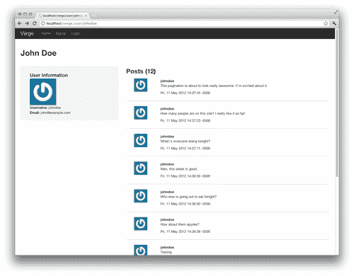
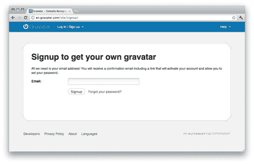
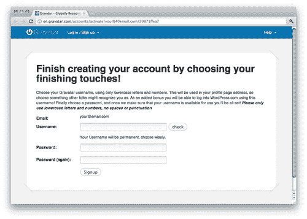
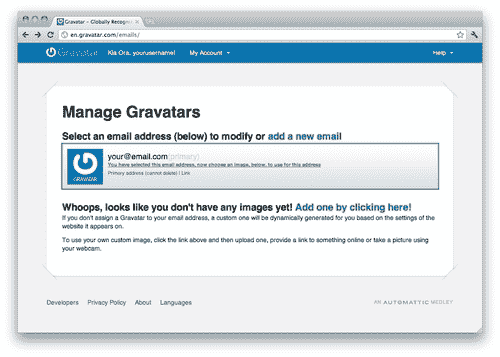
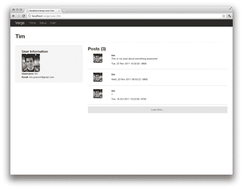

# 第九章。为您的应用程序添加花里胡哨的功能

> 我们为我们的应用程序添加了许多实用功能。但是，还有一些缺少的功能，有些人可能认为是“很好有”的，并且对我们来说很重要，以便我们的应用程序具有良好的用户体验。

在本章中，我们将：

+   将 jQuery 添加到项目中并使用它简化删除按钮

+   通过使用 CouchDB 视图和 jQuery 为用户帖子添加基本分页

+   通过使用 Gravatar 的 Web 服务为我们所有的用户添加个人资料图片

这些功能是有趣的小添加，它们也会让您看到当您将其他库与 CouchDB 和 PHP 结合使用时可能发生的事情。

# 将 jQuery 添加到我们的项目中

尽管这本书主要是关于在 PHP 中编写应用程序，但是在构建优秀的应用程序时，JavaScript 已经成为开发人员工具包中几乎必不可少的工具。我们已经在 CouchDB 视图中使用了 JavaScript，但是在本章中，我们将使用 JavaScript 进行其最常见的用例-改善用户体验。为了使我们能够编写更简单的 JavaScript，我们将使用一个名为**jQuery**的流行库。如果您以前没有使用过 jQuery，您会惊喜地发现它在简化 JavaScript 中的常见和复杂操作方面有多么简化。

## 安装 jQuery

幸运的是，将 jQuery 添加到任何项目中都非常简单。我们可以从[`www.jquery.com`](http://www.jquery.com)下载它，但是，因为我们想要专注于速度，我们实际上可以在不将任何内容安装到我们的存储库中的情况下使用它。

# 行动时间-将 jQuery 添加到我们的项目中

由于使用 jQuery 的人数激增，谷歌建立了一个内容传递网络，为我们提供 jQuery 库，而无需在我们的项目中需要任何东西。让我们告诉我们的`layout.php`文件在哪里找到 jQuery。

打开`layout.php`文件，并在`body`部分的末尾之前添加以下代码：

```php
<script type="text/javascript" src= "//ajax.googleapis.com/ajax/libs/jquery/1.7.2/jquery.min.js">
</script>
</body>
</html>

```

## 刚刚发生了什么？

我们只是在`layout.php`文件的`body`标记的末尾之前添加了一行代码。这就是使用 jQuery 与我们的项目所需的全部！您可能想知道为什么我们决定将我们的 jQuery 库放在文件的底部。最简单的解释是，当浏览器加载代码时，它会逐行加载。通过将 JavaScript 放在页面底部，它可以更快地加载其他元素，例如 CSS 和 HTML 标记，从而给用户一种快速加载的印象。

# 行动时间-创建 master.js 并连接 Boostrap 的 JavaScript 文件

随着我们的应用程序的增长，我们希望能够将我们的 JavaScript 添加到外部文件中。让我们创建一个名为`master.js`的文件，它将保存我们应用程序的所有 JavaScript，然后连接我们在第六章中下载的 Bootstrap 的 JavaScript 文件，*建模用户*。

1.  在`public/js`文件夹中创建一个名为`master.js`的新文件。

1.  打开`layout.php`文件，并在`body`部分的末尾之前添加以下代码：

```php
<script type="text/javascript" src= "//ajax.googleapis.com/ajax/libs/jquery /1.7.2/jquery.min.js">
**<script type="text/javascript" src= "//ajax.googleapis.com/ajax/libs/jquery /1.7.2/jquery.min.js">
</script>
<script type="text/javascript" src="<?php echo $this- >make_route('/js/bootstrap.min.js') ?>">
</script>
<script type="text/javascript" src="<?php echo $this- >make_route('/js/master.js') ?>">
</script>** 
</body>
</html>

```

## 刚刚发生了什么？

我们创建了一个名为`master.js`的空文件，这是我们应用程序的所有 JavaScript 将存储的地方。接下来，我们再次调整了我们的`layout.php`文件，允许我们包括我们在第六章中下载的`boostrap.min.js`文件，以及我们新创建的`master.js`文件。

### 注意

在编写 JavaScript 时，加载文件的顺序很重要。在本章后面编写 jQuery 时，对于我们的浏览器首先加载 jQuery 文件很重要，这样它就知道 jQuery 是什么以及语法是如何工作的。

# 使用 jQuery 改进我们的网站

现在我们有了 jQuery，让我们立即使用它来稍微改进我们的网站。您可以以许多不同的方式编写 jQuery 和 JavaScript 代码，但是在本书中，我们将坚持绝对基础知识，并尽量保持简单。

## 修复我们的删除帖子操作以实际使用 HTTP 删除

你可能已经在上一章的早期注意到的一件事是，当我们从用户的个人资料中编写帖子删除时，我们实际上使用了`GET HTTP`方法而不是`DELETE`方法。这是因为很难触发`DELETE`路由而不使用 JavaScript。因此，在接下来的部分中，我们将改进删除过程，使其按照以下方式工作：

1.  用户点击帖子上的“删除”。

1.  从 jQuery 到我们的应用程序发出了一个`DELETE AJAX`请求。

1.  我们的应用程序将删除帖子文档，并向 jQuery 报告一切都如预期般进行。

1.  帖子将从视图中淡出，而无需用户刷新页面。

这将是对我们用户资料的一个很好的改进，因为我们不需要每次执行操作时重新加载页面。

# 行动时间-通过使用 AJAX 删除帖子来改善我们的用户体验

让我们通过向我们的`master.js`文件添加一些代码，使我们能够使用 JavaScript 删除帖子，来初步了解一下 jQuery。如果 jQuery 的语法一开始对您不太熟悉，请不要感到不知所措；坚持下去，我相信您会对结果感到非常满意。

1.  打开`public/js/master.js`，确保 jQuery 代码在页面加载完成后运行，通过在我们的文件中添加`$(document).ready`事件。这段代码意味着一旦页面加载完成，此函数内的任何 JavaScript 代码都将运行：

```php
$(document).ready(function() {
});

```

1.  现在，让我们添加一个事件，将`click`事件绑定到我们 HTML 中具有`delete`类的任何按钮。`function(event)`括号内的所有代码将在每次点击我们的删除帖子按钮时运行：

```php
$(document).ready(function() {
**$('.delete').bind('click', function(event){** 
});
});

```

1.  让我们阻止链接像通常情况下那样将我们带到新页面，使用一个叫做`event.preventDefault()`的代码。然后，让我们将点击链接的`href`属性保存到一个叫做`location`的变量中，这样我们就可以在我们的 AJAX 调用中使用它：

```php
$(document).ready(function() {
$('.delete').bind( 'click', function(event){
**event.preventDefault();
var location = $(this).attr('href');** 
});
});

```

1.  最后，让我们创建一个基本的 AJAX 请求，将调用我们的应用程序并为我们删除帖子：

```php
$(document).ready(function() {
$('.delete').bind( 'click', function(){
event.preventDefault();
var location = $(this).attr('href');
**$.ajax({
type: 'DELETE',
url: location,
context: $(this),
success: function(){
$(this).parent().parent().fadeOut();
},
error: function (request, status, error) {
alert('An error occurred, please try again.'); }
});** 
});
});

```

## 刚刚发生了什么？

我们刚刚学会了如何在几行代码中使用 JavaScript 进行 AJAX 请求。我们首先将我们的代码包装在一个`$(document).ready`函数中，该函数在页面完全加载后运行。然后，我们添加了一个捕获我们应用程序中任何`删除帖子`链接点击的函数。最后，脚本中最复杂的部分是我们的 AJAX 调用。让我们通过一点来讨论一下，以便它有意义。jQuery 有一个名为`$.ajax`的函数，它有各种选项（所有选项都可以在这里查看：[`api.jquery.com/jQuery.ajax/)`](http://api.jquery.com/jQuery.ajax/)）。让我们逐个讨论我之前给出的代码片段中使用的每个选项，并确保您知道它们的含义。

+   `type: 'DELETE'`表示我们要使用`DELETE HTTP`方法进行请求。

+   `url: location`表示我们将使用点击链接的`href`属性进行请求。这将确保正确的帖子被删除。

+   `context: $(this)`是将用于所有 AJAX 回调的对象。因此，在此示例中，此调用的`success`选项中的所有代码将使用点击链接作为所有调用的上下文。

+   `success: function()`在我们的 AJAX 请求完成时调用。我们将以下代码放在此函数中：`$(this).parent().parent().fadeOut()`；这意味着我们将从点击链接的两个 HTML 级别向上查找。这意味着我们将查找帖子的`<div class="post-item row">`，然后将其淡出视图。

+   `error: function (request, status, error)`在您的代码中发生错误时运行。现在，我们只是显示一个警报框，这不是最优雅的方法，特别是因为我们没有提供发生了什么的细节给用户。这暂时对我们有效，但如果您想要一些额外的分数，可以尝试一下这个函数，看看是否可以使它更加优雅。

太棒了！我们刚刚添加了一些代码，这将真正改善用户的体验。随着您的应用程序的增长，并且您为其添加更多功能，请确保牢记 jQuery 的`AJAX`方法，这肯定会让事情变得更容易。

### 更新我们的路由以使用 DELETE HTTP 方法

现在我们正确地使用`DELETE`作为我们的 AJAX 调用的`HTTP`方法，我们需要更新我们的路由，这样我们的代码就知道如何处理路由了。

1.  打开`index.php`，查找我们在上一章中创建的`post/delete/:id/:rev`路由：

```php
get('/post/delete/:id/:rev', function($app) {
$post = new Post();
$post->_id = $app->request('id');
$post->_rev = $app->request('rev');
$post->delete();
$app->set('success', 'Your post has been deleted');
$app->redirect('/user/' . User::current_user());
});

```

1.  让我们通过将`get`更改为`delete`来更改路由以使用`delete`方法。然后，删除`success`变量和重定向代码，因为我们将不再需要它们：

```php
delete('/post/delete/:id/:rev', function($app) {
$post = new Post();
$post->_id = $app->request('id');
$post->_rev = $app->request('rev');
$post->delete();
});

```

#### 让我们来测试一下！

在测试这个功能时，确保停下来欣赏所有技术的协同工作，以解决一个相当复杂的问题。

1.  转到`http://localhost/verge/login`，并以`johndoe`的身份登录应用程序。

1.  单击“我的个人资料”。

1.  单击您的帖子旁边的“(删除)”。

1.  删除的帖子将从视图中消失，其他帖子将在页面上升。

# 使用 jQuery 添加简单的分页

随着我们的应用程序的增长，帖子将开始填满用户的个人资料。如果我们的应用程序变得成功，并且人们开始使用它，会发生什么？每次加载页面时，将打印数百个帖子到个人资料视图中。这样的情况绝对会使您的应用程序陷入瘫痪。

考虑到这一点，我们将在我们的个人资料页面上创建一些分页。我们的简单分页系统将按以下方式工作：

1.  默认情况下，我们将在页面上显示 10 个帖子。当用户想要查看更多时，他们将单击“加载更多”链接。

1.  当单击“显示更多”链接时，jQuery 将找出要跳过多少项，并告诉 Bones 要检索哪些文档。

1.  Bones 将使用 Sag 调用 CouchDB，并通过`posts_by_user`视图获取更多帖子。

1.  Bones 将结果加载到包含我们帖子需要格式化的 HTML 布局的部分视图中。这个 HTML 将返回给 jQuery 在我们的页面上显示。

这里有很多事情要做，但这种功能在大多数应用程序中都很常见。所以，让我们跳进去，看看我们是否能把这一切都拼凑起来。

# 采取行动-将帖子从 profile.php 中取出并放入它们自己的部分视图

列出帖子的代码直接位于`profile.php`页面内，这在目前为止都还好。然而，在某一时刻，我们将希望能够通过`Javascript`回调显示帖子，如果我们不小心，这可能意味着重复的代码或不一致的布局。让我们通过将我们的代码移动到一个可以轻松重用的部分视图中来保护自己。

1.  在 views/user 中创建一个名为`_posts.php`的新文件。

1.  复制并粘贴从`views/user/profile.php`列出帖子的`foreach`代码，并将其粘贴到我们的新文件`_posts.php`中。`_posts.php`的最终结果应该如下所示：

```php
<?php foreach ($posts as $post): ?>
<div class="post-item row">
<div class="span7">
<strong><?php echo $user->name; ?></strong>
<p>
<?php echo $post->content; ?>
</p>
<?php echo $post->date_created; ?>
</div>
<div class="span1">
<?php if ($is_current_user) { ?>
<a href="<?php echo $this->make_route('/post/delete/' . $post->_id . '/' . $post->_rev)?>" class="delete">
(Delete)
</a>
<?php } ?>
</div>
<div class="span8"></div>
</div>
<?php endforeach; ?>

```

1.  现在，让我们从`views/user/profile.php`中删除相同的`foreach`语句，并将其替换为对新创建的`_posts`文件的`include`调用。然后让我们在我们的列表的`h2`元素内添加一个`span`，这样我们就可以很容易地通过 jQuery 访问它。

```php
**<h2>
Posts (<span id="post_count"><?php echo $post_count; ?></span>)
</h2>
<div id="post_list">
<?php include('_posts.php'); ?>
</div>** 

```

## 刚刚发生了什么？

我们将`profile.php`中列出的所有帖子的代码移到了一个名为`_posts.php`的新部分中。我们在文件名前加上下划线，没有其他原因，只是为了让我们在查看源代码时知道它与普通视图不同。所谓的部分视图，是指它是要加载到另一个页面中的，单独存在时可能没有任何作用。在表面上，我们的应用程序将与我们将代码移动到部分视图之前完全相同。

然后我们修改了`profile.php`中的代码，以便使用 jQuery 更容易。我们在`h2`元素内添加了一个 ID 为`post_count`的`span`元素。这个`span`元素只包含总帖子数。我们很快就会用到它，以便告诉我们是否已经将我们需要的所有帖子加载到我们的列表中。然后我们用 ID 为`post_list`的`div`包装了我们的帖子列表。我们将使用这个标识符来从我们的分页控件中将新帖子追加到列表中。

## 为分页添加后端支持

我们不需要另一个用于分页的函数。让我们只是改进`Post`类的`get_posts_by_user`函数。我们只需要添加`skip`和`limit`选项，然后将它们传递给 CouchDB 中的`posts_by_user`视图。将`skip`传递给此视图将使我们能够跳过结果中的某些记录，而`limit`将允许我们一次只显示一定数量的帖子。通过结合这两个变量，我们将支持分页！

# 行动时间——调整我们的 get_posts_by_user 函数以跳过和限制帖子

既然我们知道该怎么做，让我们立即进入编辑`classes/post.php`文件，并调整我们的`get_posts_by_user`函数，以便我们可以将`$skip`和`$limit`作为参数添加进去。

1.  通过打开名为`classes/post.php`的文件来打开`Post`类。

1.  找到我们的`get_posts_by_user`函数，并添加带有默认值`0`的`$skip`和带有默认值`10`的`$limit`。

```php
**public function get_posts_by_user($username, $skip = 0, $limit = 10) {** 
$bones = new Bones();
$posts = array();
...
}

```

1.  更新我们对 Sag 的`get`调用，以便将`$skip`和`$limit`的值传递给查询。

```php
public function get_posts_by_user($username, $skip = 0, $limit = 10) {
$bones = new Bones();
$posts = array();
**foreach ($bones->couch-> get('_design/application/_view/posts_by_user?key="' . $username . '"&descending=true&reduce=false&skip=' . $skip . '&limit=' . $limit)->body->rows as $_post) {** 
...
}

```

1.  现在我们已经更新了我们的函数以包括`skip`和`limit`，让我们在`index.php`中创建一个类似于`user/:username`路由的新路由，但是接受`skip`的路由变量来驱动分页。在这个路由中，我们将返回部分`_posts`，而不是整个布局：

```php
get('/user/:username/:skip', function($app) {
$app->set('user', User::get_by_username($app-> request('username')));
$app->set('is_current_user', ($app->request('username') == User::current_user() ? true : false));
$app->set('posts', Post::get_posts_by_user($app-> request('username'), $app->request('skip')));
$app->set('post_count', Post::get_post_count_by_user($app-> request('username')));
$app->render('user/_posts', false);
});

```

## 刚刚发生了什么？

我们刚刚为`get_posts_by_user`函数添加了额外的`$skip`和`$limit`选项。我们还设置了当前调用，使其在不更改任何内容的情况下也能正常运行，因为我们为每个变量设置了默认值。我们现有的用户资料中的调用现在也将显示前 10 篇文章。

然后我们创建了一个名为`/user/:username/:skip`的新路由，其中`skip`是我们在查询时要跳过的项目数。这个函数中的其他所有内容与`/user/:username`路由中的内容完全相同，只是我们将结果返回到我们的部分中，并且布局为`false`，因此没有布局包装。我们这样做是为了让 jQuery 可以调用这个路由，它将简单地返回需要添加到页面末尾的帖子列表。

### 让我们来测试一下！

通过直接通过浏览器玩弄它来确保我们的`/user/:username/:skip`路由按预期工作。

1.  前往`http://localhost/verge/user/johndoe/0`（或任何有相当数量帖子的用户）。

1.  您的浏览器将使用`views/user/_posts.php`作为模板返回一个大的帖子列表。请注意，它显示了 10 篇总帖子，从最近的帖子开始。让我们来测试一下！

1.  现在，让我们尝试跳过前 10 篇文章（就像我们的分页器最终会做的那样），并通过访问`http://localhost/verge/user/johndoe/10`来检索接下来的 10 篇文章！让我们来测试一下！

1.  我们的代码希望能够很好地工作。我在这个帐户上只有 12 篇帖子，所以这个视图跳过了前 10 篇帖子，显示了最后两篇。

这一切都按我们的预期进行，但是我们的代码还有一些清理工作要做。

# 行动时间-重构我们的代码，使其不冗余

虽然我们的代码运行良好，但您可能已经注意到我们在`/user/:username`和`/user/:username/:skip`中有几乎相同的代码。我们可以通过将所有冗余代码移动到一个函数中并从每个路由中调用它来减少代码膨胀。让我们这样做，以便保持我们的代码整洁的习惯。

1.  打开`index.php`，并创建一个名为`get_user_profile`的函数，它以`$app`作为参数，并将其放在`/user/:username`路由的上方。

```php
function get_user_profile($app) {
}

```

1.  将`/user/:username/:skip`中的代码复制到此函数中。但是，这一次，我们不仅仅`传递$app->request('skip')`，让我们检查它是否存在。如果存在，让我们将其传递给`get_posts_by_user`函数。如果不存在，我们将只传递`0`。

```php
function get_user_profile($app) {
**$app->set('user', User::get_by_username($app-> request('username')));
$app->set('is_current_user', ($app->request('username') == User::current_user() ? true : false));
$app->set('posts', Post::get_posts_by_user($app-> request('username'), ($app->request('skip') ? $app-> request('skip') : 0)));
$app->set('post_count', Post::get_post_count_by_user($app-> request('username')));
}** 

```

1.  最后，让我们清理我们的两个 profile 函数，使它们都只调用`get_user_profile`函数。

```php
get('/user/:username', function($app) {
**get_user_profile($app);** 
$app->render('user/profile');
});
get('/user/:username/:skip', function($app) {
**get_user_profile($app);** 
$app->render('user/_posts', false);
});

```

## 刚刚发生了什么？

我们通过将大部分逻辑移动到一个名为`get_user_profile`的新函数中，简化了用户配置文件路由。两个路由之间唯一不同的功能是`request`变量`skip`。因此，我们在对`Posts::get_posts_by_user`函数的调用中放置了一个快捷的`if`语句，如果存在`skip`请求变量，就会传递`skip`请求变量；但如果不存在，我们将只传递`0`。添加这个小功能片段使我们能够在两个不同的路由中使用相同的代码。最后，我们将全新的函数插入到我们的路由中，并准备享受代码的简洁。一切仍然与以前一样工作，但现在更容易阅读，并且将来更新也更容易。

重构和持续清理代码是开发过程中要遵循的重要流程；以后你会为自己做这些而感激的！

# 行动时间-为分页添加前端支持

我们几乎已经完全支持分页。现在我们只需要向我们的项目添加一点 HTML 和 JavaScript，我们就会有一个很好的体验。

1.  让我们从`master.css`文件中添加一行 CSS，这样我们的**加载更多**按钮看起来会很漂亮。

```php
#load_more a {padding: 10px 0 10px 0; display: block; text-align: center; background: #e4e4e4; cursor: pointer;}

```

1.  现在我们已经有了 CSS，让我们在`profile.php`视图中的`post`列表底部添加我们的**加载更多**按钮的 HTML。

```php
<h2>
Posts (<span id="post_count"><?php echo $post_count; ?></span>)
</h2>
<div id="post_list">
<?php include('_posts.php'); ?>
</div>
**<div id="load_more" class="row">
<div class="span8">
<a id="more_posts" href="#">Load More...</a>
</div>
</div>**

```

1.  现在，让我们打开`master.js`，并在`$(document).ready`函数的闭合括号内创建一个函数。这个函数将针对 ID 为`more_posts`的任何元素的`click`事件。

```php
**$('#more_posts').bind( 'click', function(event){
event.preventDefault();
});** 
});

```

1.  为了调用`/user/:username/:skip`路由，我们需要使用一个名为`window.location.pathname`的 JavaScript 函数来获取页面的当前 URL。然后，我们将在字符串的末尾添加帖子项目的数量，以便跳过当前页面上显示的帖子数量。

```php
$('#more_posts').bind( 'click', function(event){
event.preventDefault();
**var location = window.location.pathname + "/" + $('.post-item') .size();** 
});

```

1.  现在我们已经有了位置，让我们填写剩下的 AJAX 调用。这一次，我们将使用`GET HTTP`方法，并使用 ID 为`post_list`的帖子列表作为我们的上下文，这将允许我们在`success`事件中引用它。然后，让我们只添加一个通用的`error`事件，以便在发生错误时通知用户发生了错误。

```php
$('#more_posts').bind( 'click', function(event){
event.preventDefault();
var location = window.location.pathname + "/" + $('#post_list').children().size();
**$.ajax({
type: 'GET',
url: location,
context: $('#post_list'),
success: function(html){
// we'll fill this in, in just one second
},
error: function (request, status, error) {
alert('An error occurred, please try again.');
}
});** 
});

```

1.  最后，让我们用一些代码填充我们的`success`函数，将从我们的 AJAX 调用返回的 HTML 附加到`post_list div`的末尾。然后，我们将检查是否有其他帖子要加载。如果没有更多帖子要加载，我们将隐藏**加载更多**按钮。为了获取帖子数量，我们将查看我们使用`post_count`作为 ID 创建的`span`，并使用`parseInt`将其转换为整数。

```php
$('#more_posts').bind( 'click', function(event){
event.preventDefault();
var location = window.location.pathname + "/" + $('#post_list').children().size();
$.ajax({
type: 'GET',
url: location,
context: $('#post_list'),
success: function(html){
**$(this).append(html);
if ($('#post_list').children().size() <= " parseInt($('#post_count').text())) {
$('#load_more').hide();
}** 
},
error: function (request, status, error) {
alert('An error occurred, please try again.');
}
});
});

```

## 刚刚发生了什么？

在这一部分，我们完成了分页！我们首先创建了一个快速的 CSS 规则，用于我们的**加载更多**链接，使其看起来更友好，并添加了在个人资料页面上出现所需的 HTML。我们通过调用一个 AJAX 函数到当前用户个人资料的 URL，并将当前存在的帖子数量附加到`#post_list div`中来完成分页。通过将这个数字传递给我们的路由，我们告诉我们的路由将这个数字传递并忽略所有这些项目，因为我们已经显示了它们。

接下来，我们添加了一个`success`函数，使用`_posts`部分的布局返回我们路由的 HTML。这个 HTML 将被附加到`#post_list div`的末尾。最后，我们检查了是否有更多的项目要加载，通过比较`#post_list`的大小与我们的`reduce`函数返回到我们个人资料顶部的帖子数量`#post_count span`。如果这两个值相等，这意味着没有更多的帖子可以加载，我们可以安全地隐藏**加载更多**链接。

# 行动时间-修复我们的删除帖子功能以适应分页

当我们添加分页时，我们还破坏了通过 AJAX 加载的帖子的删除功能。这是因为我们使用`bind`事件处理程序将`click`事件绑定到我们的链接，这只会在页面加载时发生。因此，我们需要考虑通过 AJAX 加载的链接。幸运的是，我们可以使用 jQuery 的`live`事件处理程序来做到这一点。

1.  打开`master.js`，并将`delete`帖子代码更改为使用`live`而不是`bind`：

```php
**$('.delete').live( 'click', function(event){** 
event.preventDefault();
var location = $(this).attr('href');

```

1.  如果您开始删除帖子列表中的一堆项目，它目前不会使用 JavaScript 更改与用户帐户相关联的帖子数量。在这里，让我们修改`success`函数，以便它还更新我们帖子列表顶部的帖子数量：

```php
$('.delete').live( 'click', function(event){
event.preventDefault();
var location = $(this).attr('href');
$.ajax({
type: 'DELETE',
url: location,
context: $(this),
success: function(html){
$(this).parent().parent().parent().fadeOut();
**$('#post_count').text(parseInt($('#post_count').text()) - 1);** 
},
error: function (request, status, error) {
alert('An error occurred, please try again.');
}
});
});

```

## 刚刚发生了什么？

我们刚刚更新了我们的删除按钮，使用`live`事件处理程序而不是`bind`事件处理程序。通过使用`live`，jQuery 允许我们定义一个选择器，并将规则应用于所有当前和将来匹配该选择器的项目。然后，我们使我们的`#post_count`元素动态化，以便每次删除帖子时，帖子计数相应地更改。

### 测试我们完整的分页系统

我们的分页最终完成了。让我们回去测试一切，确保分页按预期工作。

1.  转到`http://localhost/verge/login`，并以`johndoe`的身份登录应用程序。

1.  点击**我的个人资料**。

1.  滚动到页面底部，点击**加载更多**。接下来的 10 篇帖子将返回给你。

1.  如果您的帐户中帖子少于 20 篇，**加载更多**按钮将从页面中消失，向您显示您已经加载了所有帖子。

1.  尝试点击通过 AJAX 加载的列表中的最后一篇帖子，它将消失，就像应该的那样！

太棒了！我们的分页系统正如我们所希望的那样工作；我们能够删除帖子，我们的帖子计数每次删除帖子时都会更新。

# 使用 Gravatars

在这一点上，我们的个人资料看起来有点无聊，只有一堆文本，因为我们没有支持将图像上传到我们的系统中。出于时间考虑，我们将在本书中避免这个话题，也是为了我们用户的利益。让用户每次加入服务时都上传新的个人资料图像存在相当大的摩擦。相反，有一个服务可以让我们的生活变得更轻松：**Gravatar**（[`www.gravatar.com`](http://www.gravatar.com)）。Gravatar 是一个网络服务，允许用户将个人资料图像上传到一个单一位置。从那里，其他应用程序可以使用用户的电子邮件地址作为图像的标识符来获取个人资料图像。

# 行动时间-向我们的应用程序添加 Gravatars

通过我们的用户类添加对 Gravatars 的支持就像添加几行代码一样简单。之后，我们将在我们的应用程序中添加`gravatar`函数。

1.  打开`user/profile.php`，并添加一个名为`gravatar`的`public`函数，它接受一个名为 size 的参数；我们将给它一个默认值`50`。

```php
public function gravatar($size='50') {
}

```

1.  为了获取用户的 Gravatar，我们只需要创建用户电子邮件地址的`md5`哈希，这将作为`gravatar_id`。然后，我们使用我们的`$size`变量设置大小，并将所有这些附加到 Gravatar 的网络服务 URL。

```php
public function gravatar($size='50') {
return 'http://www.gravatar.com/avatar/?gravatar_id=' .md5(strtolower($this->email)).'&size='.$size;
}

```

1.  就是这样！我们现在在我们的应用程序中有了 Gravatar 支持。我们只需要在任何我们想要看到个人资料图片的地方开始添加它。让我们首先在`views/user/profile.php`文件的**用户信息**部分顶部添加一个大的 Gravatar。

```php
<div class="span4">
<div class="well sidebar-nav">
<ul class="nav nav-list">
<li><h3>User Information</h3></li>
**<li>gravatar('100'); ?>" /></li>** 
<li><b>Username:</b> <?php echo $user->name; ?></li>
<li><b>Email:</b> <?php echo $user->email; ?></li>
</ul>
</div>
</div>

```

1.  接下来，让我们更新`views/user/_posts.php`文件中的帖子列表，这样我们就可以很好地显示我们的 Gravatars。

```php
<?php foreach ($posts as $post): ?>
<div class="post-item row">
**<div class="span7">
<div class="span1">
gravatar('50'); ?>" />
</div>
<div class="span5">
<strong><?php echo $user->name; ?></strong>
<p>
<?php echo $post->content; ?>
</p>
<?php echo $post->date_created; ?>
</div>
</div>** 
<div class="span1">
<?php if ($is_current_user) { ?>
<a href="<?php echo $this->make_route('/post/delete/' . $post->_id . '/' . $post->_rev)?>" class="deletes">(Delete)</a>
<?php } ?>
</div>
<div class="span8"></div>
</div>
<?php endforeach; ?>

```

## 刚刚发生了什么？

我们在我们的`User`类中添加了一个名为`gravatar`的函数，它接受一个名为`$size`的参数，默认值为 50。从那里，我们对对象的电子邮件地址和`$size`进行了`md5`哈希，并将其附加到 Gravatar 的网络服务的末尾。结果是一个链接到一个漂亮且易于显示的 Gravatar 图像。

有了我们的 Gravatar 系统，我们将它添加到了`views/user/profile.php`和`views/user/_posts.php`页面中。

## 测试我们的 Gravatars

我们的 Gravatars 应该在我们的个人资料页面上运行。如果用户的电子邮件地址没有关联的图像，将显示一个简单的占位图像。

1.  转到`http://localhost/user/johndoe`，你会在每篇帖子和**用户信息**部分看到 Gravatar 的占位符。

1.  现在，让我们通过访问[`www.gravatar.com`](http://www.%20gravatar.com)并点击**注册**来将 Gravatar 与你的电子邮件关联起来。

1.  输入你的电子邮件，然后点击**注册**。你将收到一封验证邮件到你的地址，所以去检查一下，然后点击激活链接。

1.  接下来，你将被带到一个页面，显示你当前的账户和与你的账户关联的图像。你还没有任何与你的账户关联的东西，所以点击**点击这里添加一个！**

1.  在你上传了图像到账户并添加了你想要使用的任何电子邮件地址之后，你可以回到与你的电子邮件地址关联的个人资料（对我来说是`http://localhost/user/tim`），你将看到一个 Gravatar！

## 将所有内容添加到 Git

我希望在本章的过程中，你已经将你的代码提交到了 Git；如果你还没有，这是提醒你。确保及早并经常这样做！

# 总结

希望你喜欢这一章！虽然这些功能对我们的应用程序的工作并不是“使命关键”的功能，但随着应用程序的发展，这些是用户会要求的功能。

具体来说，我们学会了如何安装 jQuery 并使用它来帮助创建一些基本的 JavaScript，并用它来使帖子的删除和分页更加清晰。接下来，我们添加了 Gravatar 图像到个人资料和帖子列表中，使我们的个人资料更加有趣。

就是这样！我们的应用程序已经准备好投入使用。在下一章中，我们将保护应用程序的最后部分并部署所有内容，这样世界就可以看到你所建立的东西。
