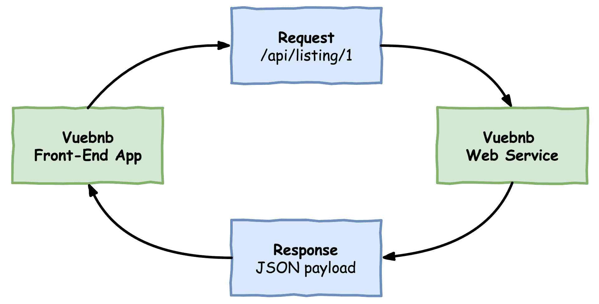
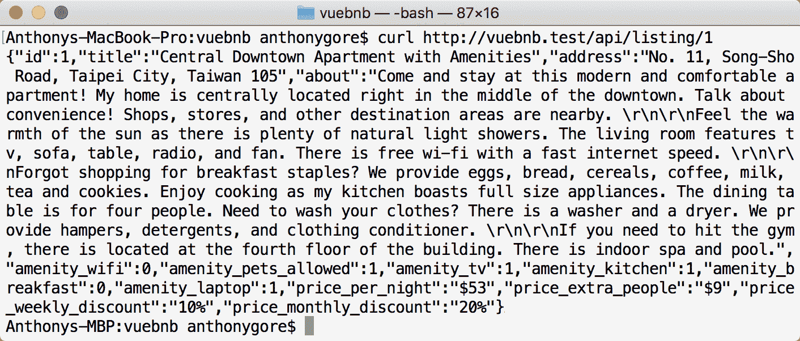
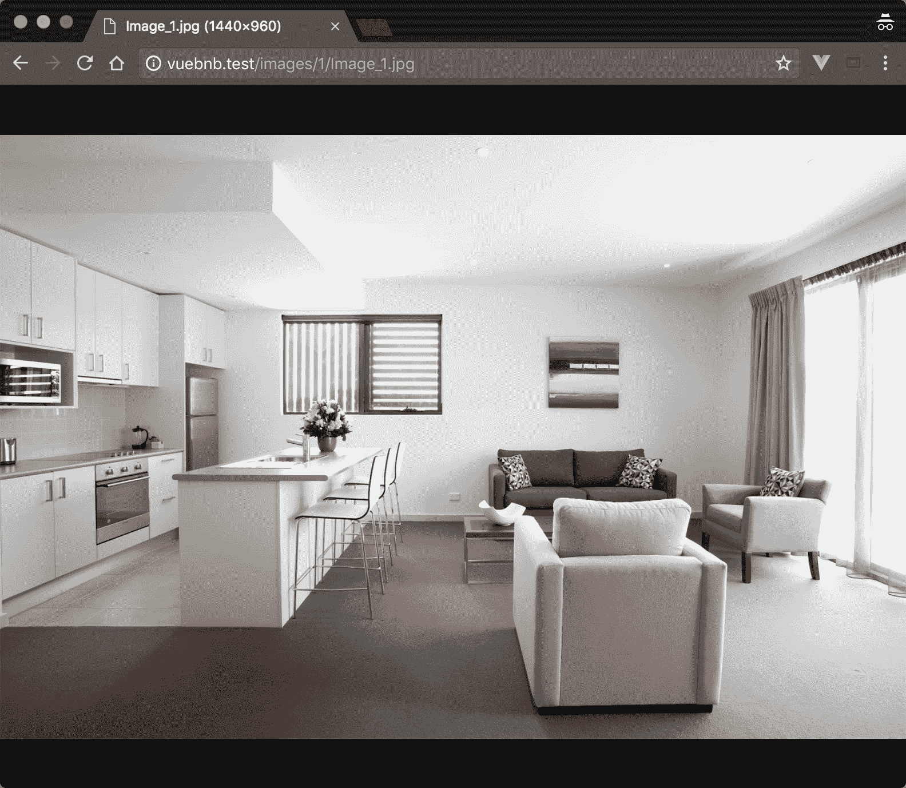

# 第四章：使用 Laravel 构建网络服务

在上一章中，我们已经启动并运行了 Homestead 开发环境，并开始为主要的 Vuebnb 项目提供服务。在本章中，我们将创建一个简单的网络服务，使 Vuebnb 的房间列表数据可以在前端显示。

本章涵盖的主题：

+   使用 Laravel 创建网络服务

+   编写数据库迁移和种子文件

+   创建 API 端点以使数据公开访问

+   从 Laravel 提供图像

# Vuebnb 房间列表

在第二章中，*Vuebnb 原型设计，您的第一个 Vue.js 项目*，我们构建了前端应用程序的列表页面原型。很快，我们将删除此页面上的硬编码数据，并将其转换为可以显示任何房间列表的模板。

在本书中，我们不会为用户创建他们自己的房间列表添加功能。相反，我们将使用包含 30 个不同列表的模拟数据包，每个列表都有自己独特的标题、描述和图像。我们将使用这些列表填充数据库，并配置 Laravel 根据需要将它们提供给前端。

# 网络服务

**网络服务**是在服务器上运行的应用程序，允许客户端（如浏览器）通过 HTTP 远程写入/检索数据到/从服务器。

网络服务的接口将是一个或多个 API 端点，有时会受到身份验证的保护，它们将以 XML 或 JSON 有效负载返回数据：

图 4.1。Vuebnb 网络服务

网络服务是 Laravel 的特长，因此为 Vuebnb 创建一个网络服务不难。我们将使用路由来表示我们的 API 端点，并使用 Laravel 无缝同步与数据库的 Eloquent 模型来表示列表：

图 4.2。网络服务架构

Laravel 还具有内置功能，可以添加 REST 等 API 架构，尽管我们不需要这个简单的用例。

# 模拟数据

模拟列表数据在文件`database/data.json`中。该文件包括一个 JSON 编码的数组，其中包含 30 个对象，每个对象代表一个不同的列表。在构建了列表页面原型之后，您无疑会认出这些对象上的许多相同属性，包括标题、地址和描述。

`database/data.json`：

```php
[
  {
    "id": 1,
    "title": "Central Downtown Apartment with Amenities",
    "address": "...",
    "about": "...",
    "amenity_wifi": true,
    "amenity_pets_allowed": true,
    "amenity_tv": true,
    "amenity_kitchen": true,
    "amenity_breakfast": true,
    "amenity_laptop": true,
    "price_per_night": "$89"
    "price_extra_people": "No charge",
    "price_weekly_discount": "18%",
    "price_monthly_discount": "50%",
  },
  {
    "id": 2, ... }, ... ]
```

每个模拟列表还包括房间的几张图片。图像并不真正属于网络服务的一部分，但它们将存储在我们应用程序的公共文件夹中，以便根据需要提供服务。

图像文件不在项目代码中，而是在我们从 GitHub 下载的代码库中。我们将在本章后期将它们复制到我们的项目文件夹中。

# 数据库

我们的网络服务将需要一个用于存储模拟列表数据的数据库表。为此，我们需要创建一个模式和迁移。然后，我们将创建一个 seeder，它将加载和解析我们的模拟数据文件，并将其插入数据库，以便在应用程序中使用。

# 迁移

`迁移`是一个特殊的类，其中包含针对数据库运行的一组操作，例如创建或修改数据库表。迁移确保每次创建应用程序的新实例时，例如在生产环境中安装或在团队成员的机器上安装时，您的数据库都会被相同地设置。

要创建新的迁移，请使用`make:migration` Artisan CLI 命令。命令的参数应该是迁移将要执行的操作的蛇形描述。

```php
$ php artisan make:migration create_listings_table
```

现在您将在`database/migrations`目录中看到新的迁移。您会注意到文件名具有前缀时间戳，例如`2017_06_20_133317_create_listings_table.php`。时间戳允许 Laravel 确定迁移的正确顺序，以防需要同时运行多个迁移。

您的新迁移声明了一个扩展了`Migration`的类。它覆盖了两个方法：`up`用于向数据库添加新表、列或索引；`down`用于删除它们。我们很快将实现这些方法。

`2017_06_20_133317_create_listings_table.php`：

```php
<?php

use Illuminate\Support\Facades\Schema;
use Illuminate\Database\Schema\Blueprint;
use Illuminate\Database\Migrations\Migration;

class CreateListingsTable extends Migration
{
  public function up()
  {
    //
  }

  public function down()
  {
    //
  }
}
```

# 模式

**模式**是数据库结构的蓝图。对于诸如 MySQL 之类的关系数据库，模式将数据组织成表和列。在 Laravel 中，可以使用`Schema`外观的`create`方法声明模式。

现在我们将为一个表创建一个模式，用于保存 Vuebnb 列表。表的列将与我们的模拟列表数据的结构相匹配。请注意，我们为设施设置了默认的`false`值，并允许价格有一个`NULL`值。所有其他列都需要一个值。

模式将放在我们迁移的`up`方法中。我们还将填写`down`，调用`Schema::drop`。

`2017_06_20_133317_create_listings_table.php`：

```php
public function up()
{ Schema::create('listings', function (Blueprint $table) {
    $table->primary('id');
    $table->unsignedInteger('id');
    $table->string('title');
    $table->string('address');
    $table->longText('about');

    // Amenities
    $table->boolean('amenity_wifi')->default(false);
    $table->boolean('amenity_pets_allowed')->default(false);
    $table->boolean('amenity_tv')->default(false);
    $table->boolean('amenity_kitchen')->default(false);
    $table->boolean('amenity_breakfast')->default(false);
    $table->boolean('amenity_laptop')->default(false);

    // Prices
    $table->string('price_per_night')->nullable();
    $table->string('price_extra_people')->nullable();
    $table->string('price_weekly_discount')->nullable();
    $table->string('price_monthly_discount')->nullable();
  });
}

public function down()
{ Schema::drop('listings');
}
```

**外观**是一种面向对象的设计模式，用于在服务容器中创建对底层类的静态代理。外观不是为了提供任何新功能；它的唯一目的是提供一种更易记和易读的方式来执行常见操作。将其视为面向对象的辅助函数。

# 执行

现在我们已经设置了新的迁移，让我们使用这个 Artisan 命令来运行它：

```php
$ php artisan migrate
```

您应该在终端中看到类似以下的输出：

```php
Migrating: 2017_06_20_133317_create_listings_table
Migrated:  2017_06_20_133317_create_listings_table
```

要确认迁移是否成功，让我们使用 Tinker 来显示新表的结构。如果您从未使用过 Tinker，它是一个 REPL 工具，允许您在命令行上与 Laravel 应用程序进行交互。当您在 Tinker 中输入命令时，它将被评估为您的应用程序代码中的一行。

首先，打开 Tinker shell：

```php
$ php artisan tinker
```

现在输入一个 PHP 语句进行评估。让我们使用`DB`外观的`select`方法来运行一个 SQL`DESCRIBE`查询，以显示表结构：

```php
>>>> DB::select('DESCRIBE listings;');
```

输出非常冗长，所以我不会在这里重复，但您应该看到一个包含所有表细节的对象，确认迁移已经成功。

# 种子模拟列表

现在我们有了列表的数据库表，让我们用模拟数据填充它。为此，我们需要做以下事情：

1.  加载`database/data.json`文件

1.  解析文件

1.  将数据插入列表表中

# 创建一个 seeder

Laravel 包括一个我们可以扩展的 seeder 类，称为`Seeder`。使用此 Artisan 命令来实现它：

```php
$ php artisan make:seeder ListingsTableSeeder
```

当我们运行 seeder 时，`run`方法中的任何代码都会被执行。

`database/ListingsTableSeeder.php`：

```php
<?php

use Illuminate\Database\Seeder;

class ListingsTableSeeder extends Seeder
{
  public function run()
  {
    //
  }
}
```

# 加载模拟数据

Laravel 提供了一个`File`外观，允许我们简单地从磁盘打开文件，如`File::get($path)`。要获取模拟数据文件的完整路径，我们可以使用`base_path()`辅助函数，它将应用程序目录的根路径作为字符串返回。

然后，可以使用内置的`json_decode`方法将此 JSON 文件转换为 PHP 数组。一旦数据是一个数组，只要表的列名与数组键相同，就可以直接将数据插入数据库。

`database/ListingsTableSeeder.php`：

```php
public function run()
{
  $path = base_path() . '/database/data.json';
  $file = File::get($path);
  $data = json_decode($file, true);
}
```

# 插入数据

为了插入数据，我们将再次使用`DB`外观。这次我们将调用`table`方法，它返回一个`Builder`的实例。`Builder`类是一个流畅的查询构建器，允许我们通过链接约束来查询数据库，例如`DB::table(...)->where(...)->join(...)`等。让我们使用构建器的`insert`方法，它接受一个列名和值的数组。

`database/seeds/ListingsTableSeeder.php`：

```php
public function run()
{
  $path = base_path() . '/database/data.json';
  $file = File::get($path);
  $data = json_decode($file, true);
  DB::table('listings')->insert($data);
}
```

# 执行 seeder

要执行 seeder，我们必须从相同目录中的`DatabaseSeeder.php`文件中调用它。

`database/seeds/DatabaseSeeder.php`：

```php
<?php

use Illuminate\Database\Seeder;

class DatabaseSeeder extends Seeder
{
  public function run()
  {
    $this->call(ListingsTableSeeder::class);
  }
}
```

完成后，我们可以使用 Artisan CLI 来执行 seeder：

```php
$ php artisan db:seed
```

您应该在终端中看到以下输出：

```php
Seeding: ListingsTableSeeder
```

我们将再次使用 Tinker 来检查我们的工作。模拟数据中有 30 个列表，所以为了确认种子成功，让我们检查数据库中是否有 30 行：

```php
$ php artisan tinker >>>> DB::table('listings')->count(); 
# Output: 30
```

最后，让我们检查表的第一行，以确保其内容符合我们的预期：

```php
>>>> DB::table('listings')->get()->first();
```

以下是输出：

```php
=> {#732
 +"id": 1,
 +"title": "Central Downtown Apartment with Amenities",
 +"address": "No. 11, Song-Sho Road, Taipei City, Taiwan 105",
 +"about": "...",
 +"amenity_wifi": 1,
 +"amenity_pets_allowed": 1,
 +"amenity_tv": 1,
 +"amenity_kitchen": 1,
 +"amenity_breakfast": 1,
 +"amenity_laptop": 1,
 +"price_per_night": "$89",
 +"price_extra_people": "No charge",
 +"price_weekly_discount": "18%",
 +"price_monthly_discount": "50%"
}
```

如果你的看起来像这样，那么你已经准备好继续了！

# 列表模型

我们现在已经成功为我们的列表创建了一个数据库表，并用模拟列表数据进行了种子。现在我们如何从 Laravel 应用程序中访问这些数据呢？

我们看到`DB`外观让我们直接在数据库上执行查询。但是 Laravel 提供了一种更强大的方式通过**Eloquent ORM**访问数据。

# Eloquent ORM

**对象关系映射**（**ORM**）是一种在面向对象编程语言中在不兼容的系统之间转换数据的技术。MySQL 等关系数据库只能存储整数和字符串等标量值，这些值组织在表中。但是我们希望在我们的应用程序中使用丰富的对象，因此我们需要一种强大的转换方式。

Eloquent 是 Laravel 中使用的 ORM 实现。它使用**活动记录**设计模式，其中一个模型与一个数据库表绑定，模型的一个实例与一行绑定。

要在 Laravel 中使用 Eloquent ORM 创建模型，只需使用 Artisan 扩展`Illuminate\Database\Eloquent\Model`类：

```php
$ php artisan make:model Listing
```

这将生成一个新文件。

`app/Listing.php`：

```php
<?php

namespace App;

use Illuminate\Database\Eloquent\Model;

class Listing extends Model
{
  //
}
```

我们如何告诉 ORM 要映射到哪个表，以及要包含哪些列？默认情况下，`Model`类使用类名（`Listing`）的小写形式（`listing`）作为要使用的表名。并且默认情况下，它使用表中的所有字段。

现在，每当我们想要加载我们的列表时，我们可以在我们的应用程序的任何地方使用这样的代码：

```php
<?php

// Load all listings
$listings = \App\Listing::all();

// Iterate listings, echo the address
foreach ($listings as $listing) {
  echo $listing->address . '\n' ;
}

/*
 * Output:
 *
 * No. 11, Song-Sho Road, Taipei City, Taiwan 105
 * 110, Taiwan, Taipei City, Xinyi District, Section 5, Xinyi Road, 7
 * No. 51, Hanzhong Street, Wanhua District, Taipei City, Taiwan 108
 * ... */
```

# 转换

MySQL 数据库中的数据类型与 PHP 中的数据类型并不完全匹配。例如，ORM 如何知道数据库值 0 是表示数字 0 还是布尔值`false`？

Eloquent 模型可以使用`$casts`属性声明任何特定属性的数据类型。`$casts`是一个键/值数组，其中键是要转换的属性的名称，值是我们要转换为的数据类型。

对于列表表，我们将把设施属性转换为布尔值。

`app/Listing.php`：

```php
<?php

namespace App;

use Illuminate\Database\Eloquent\Model;

class Listing extends Model
{
  protected $casts = [
    'amenity_wifi' => 'boolean',
    'amenity_pets_allowed' => 'boolean',
    'amenity_tv' => 'boolean',
    'amenity_kitchen' => 'boolean',
    'amenity_breakfast' => 'boolean',
    'amenity_laptop' => 'boolean'
  ];
}
```

现在这些属性将具有正确的类型，使我们的模型更加健壮：

```php
echo gettype($listing->amenity_wifi());

// boolean
```

# 公共接口

我们 Web 服务的最后一部分是公共接口，允许客户端应用程序请求列表数据。由于 Vuebnb 列表页面设计为一次显示一个列表，所以我们至少需要一个端点来检索单个列表。

现在让我们创建一个路由，将匹配任何传入的 GET 请求到 URI`/api/listing/{listing}`，其中`{listing}`是一个 ID。我们将把这个路由放在`routes/api.php`文件中，路由会自动添加`/api/`前缀，并且默认情况下具有用于 Web 服务的中间件优化。

我们将使用`closure`函数来处理路由。该函数将有一个`$listing`参数，我们将其类型提示为`Listing`类的实例，也就是我们的模型。Laravel 的服务容器将解析此实例，其 ID 与`{listing}`匹配。

然后我们可以将模型编码为 JSON 并将其作为响应返回。

`routes/api.php`：

```php
<?php

use App\Listing; Route::get('listing/{listing}', function(Listing $listing) {
  return $listing->toJson();  
});
```

我们可以使用终端上的`curl`命令来测试这个功能是否有效：

```php
$ curl http://vuebnb.test/api/listing/1
```

响应将是 ID 为 1 的列表：

图 4.3。Vuebnb Web 服务的 JSON 响应

# 控制器

随着项目的进展，我们将添加更多的路由来检索列表数据。最佳实践是使用`controller`类来实现这个功能，以保持关注点的分离。让我们使用 Artisan CLI 创建一个：

```php
$ php artisan make:controller ListingController
```

然后我们将从路由中的功能移动到一个新的方法`get_listing_api`。

`app/Http/Controllers/ListingController.php`：

```php
<?php

namespace App\Http\Controllers;

use Illuminate\Http\Request;
use App\Listing;

class ListingController extends Controller
{
  public function get_listing_api(Listing $listing) 
  {
    return $listing->toJson();
  }
}
```

对于`Route::get`方法，我们可以将字符串作为第二个参数传递，而不是`closure`函数。字符串应该是`[controller]@[method]`的形式，例如`ListingController@get_listing_web`。Laravel 将在运行时正确解析这个。

`routes/api.php`：

```php
<?php Route::get('/listing/{listing}', 'ListingController@get_listing_api');
```

# 图像

正如在本章开头所述，每个模拟列表都附带了房间的几张图片。这些图片不在项目代码中，必须从代码库中名为`images`的平行目录中复制。

将此目录的内容复制到`public/images`文件夹中：

```php
$ cp -a ../images/. ./public/images
```

一旦您复制了这些文件，`public/images`将有 30 个子文件夹，每个模拟列表一个。每个文件夹将包含四张主要图片和一个缩略图图片：

图 4.4。公共文件夹中的图像文件

# 访问图像

`public`目录中的文件可以通过将它们的相对路径附加到站点 URL 直接请求。例如，默认的 CSS 文件`public/css/app.css`可以在`http://vuebnb.test/css/app.css`请求。

使用`public`文件夹的优势，以及我们将图像放在那里的原因，是避免创建任何访问它们的逻辑。然后前端应用程序可以直接在`img`标签中调用图像。

您可能认为我们的网络服务器以这种方式提供图像是低效的，您是对的。在本书的后面，当处于生产模式时，我们将从 CDN 提供图像。

让我们尝试在浏览器中打开一个模拟列表图片来测试这个论点：`http://vuebnb.test/images/1/Image_1.jpg`：

图 4.5。在浏览器中显示的模拟列表图像

# 图片链接

Web 服务的每个列表的负载应该包括指向这些新图像的链接，这样客户端应用程序就知道在哪里找到它们。让我们将图像路径添加到我们的列表 API 负载中，使其看起来像这样：

```php
{
  "id": 1,
  "title": "...",
  "description": "...",
  ... "image_1": "http://vuebnb.test/app/image/1/Image_1.jpg",
  "image_2": "http://vuebnb.test/app/image/1/Image_2.jpg",
  "image_3": "http://vuebnb.test/app/image/1/Image_3.jpg",
  "image_4": "http://vuebnb.test/app/image/1/Image_4.jpg"
}
```

缩略图图像直到项目后期才会被使用。

为了实现这一点，我们将使用我们模型的`toArray`方法来创建模型的数组表示。然后我们将能够轻松地添加新字段。每个模拟列表都有四张图片，编号为 1 到 4，所以我们可以使用`for`循环和`asset`助手来生成公共文件夹中文件的完全合格的 URL。

最后，通过调用`response`助手创建`Response`类的实例。我们使用`json`方法并传入我们的字段数组，返回结果。

`app/Http/Controllers/ListingController.php`：

```php
public function get_listing_api(Listing $listing) 
{
  $model = $listing->toArray();
  for($i = 1; $i <=4; $i++) {
    $model['image_' . $i] = asset( 'images/' . $listing->id . '/Image_' . $i . '.jpg' );
  }
  return response()->json($model);
}
```

`/api/listing/{listing}`端点现在已准备好供客户端应用程序使用。

# 总结

在本章中，我们使用 Laravel 构建了一个 Web 服务，使 Vuebnb 列表数据可以公开访问。

这涉及使用迁移和模式设置数据库表，然后使用路由向数据库中填充模拟列表数据。然后我们创建了一个公共接口，用于返回模拟数据作为 JSON 负载，包括指向我们模拟图像的链接。

在下一章中，我们将介绍 Webpack 和 Laravel Mix 构建工具，以建立一个全栈开发环境。我们将把 Vuebnb 原型迁移到项目中，并对其进行重构以适应新的工作流程。
