# 将 Laravel 和 Vue.js 集成到 Webpack 中

在本章中，我们将把 Vuebnb 前端原型迁移到我们的主要 Laravel 项目中，实现 Vuebnb 的第一个全栈迭代。这个完全集成的环境将包括一个 Webpack 构建步骤，允许我们在继续构建前端时整合更复杂的工具和技术。

本章涵盖的主题：

+   Laravel 开箱即用前端应用程序简介

+   Webpack 的高级概述

+   如何配置 Laravel Mix 来编译前端资产

+   将 Vuebnb 原型迁移到全栈 Laravel 环境中

+   在 Vue.js 中使用 ES2015，包括为旧浏览器提供语法和 polyfills

+   将前端应用程序中的硬编码数据切换为后端数据

# Laravel 前端

我们认为 Laravel 是一个后端框架，但是一个新的 Laravel 项目也包括了前端应用程序的样板代码和配置。

前端开箱即用包括 JavaScript 和 Sass 资产文件，以及一个`package.json`文件，指定依赖项，如 Vue.js、jQuery 和 Bootstrap。

让我们看看这个样板代码和配置，以便我们了解 Vuebnb 前端应用程序在我们开始迁移时将如何适应我们的 Laravel 项目。

# JavaScript

JavaScript 资产保存在`resources/assets/js`文件夹中。该目录中有几个`.js`文件，以及一个子目录`component`，其中有一个`.vue`文件。我们将在另一章节中解释后者，所以现在我们将忽略它。

主 JavaScript 文件是`app.js`。在这个文件中，你会看到熟悉的 Vue 构造函数，但也会有一些不太熟悉的语法。第一行是一个`require`函数，用于导入一个相邻的文件`bootstrap.js`，它又加载其他库，包括 jQuery 和 Lodash。

`require`不是标准的 JavaScript 函数，必须在代码在浏览器中使用之前进行解析。

`resources/assets/js/app.js`：

```php
require('./bootstrap'); window.Vue = require('vue'); Vue.component('example', require('./components/Example.vue'));

const app = new Vue({ el: '#app'
});
```

# CSS

如果你以前没有听说过*Sass*，它是一种 CSS 扩展，使开发 CSS 更容易。默认的 Laravel 安装包括`resources/assets/sass`目录，其中包括两个样板 Sass 文件。

主 Sass 文件是`app.scss`。它的工作是导入其他 Sass 文件，包括 Bootstrap CSS 框架。

`resources/assets/sass/app.scss`：

```php
// Fonts
@import url("https://fonts.googleapis.com/css?family=Raleway:300,400,600");

// Variables
@import "variables";

// Bootstrap
@import "~bootstrap-sass/assets/stylesheets/bootstrap";
```

# 节点模块

Laravel 前端的另一个关键方面是项目目录根目录中的`package.json`文件。与`composer.json`类似，该文件用于配置和依赖管理，只不过是用于 Node 模块而不是 PHP。

`package.json`的属性之一是`devDependencies`，指定了开发环境中需要的模块，包括 jQuery、Vue 和 Lodash。

`package.json`：

```php
{ ... "devDependencies": {
    "axios": "⁰.17",
    "bootstrap-sass": "³.3.7",
    "cross-env": "⁵.1",
    "jquery": "³.2",
    "laravel-mix": "¹.4",
    "lodash": "⁴.17.4",
    "vue": "².5.3"
  }
}
```

# 视图

要在 Laravel 中提供前端应用程序，需要将其包含在视图中。唯一提供的开箱即用视图是位于`resources/views/welcome.blade.php`的`welcome`视图，用作样板首页。

`welcome`视图实际上不包括前端应用程序，用户需要自行安装。我们将在本章后面讨论如何做到这一点。

# 资产编译

`resources/assets`中的文件包括不能直接在浏览器中使用的函数和语法。例如，在`app.js`中使用的`require`方法，用于导入 JavaScript 模块，不是原生 JavaScript 方法，也不是标准 Web API 的一部分：

图 5.1. 浏览器中未定义`require`

需要一个构建工具来获取这些资产文件，解析任何非标准函数和语法，并输出浏览器可以使用的代码。前端资产有许多流行的构建工具，包括 Grunt、Gulp 和 Webpack：

图 5.2. 资产编译过程

我们之所以要使用这个资产编译过程，是为了能够在不受浏览器限制的情况下编写我们的前端应用。我们可以引入各种方便的开发工具和功能，这些工具和功能将使我们更容易地编写代码和解决问题。

# Webpack

Webpack 是 Laravel 5.5 默认提供的构建工具，我们将在 Vuebnb 的开发中使用它。

Webpack 与其他流行的构建工具（如 Gulp 和 Grunt）不同之处在于，它首先是一个*模块打包工具*。让我们通过了解模块打包过程的工作原理来开始我们对 Webpack 的概述。

# 依赖

在前端应用中，我们可能会有第三方 JavaScript 库或甚至自己代码库中的其他文件的依赖关系。例如，Vuebnb 原型依赖于 Vue.js 和模拟列表数据文件：

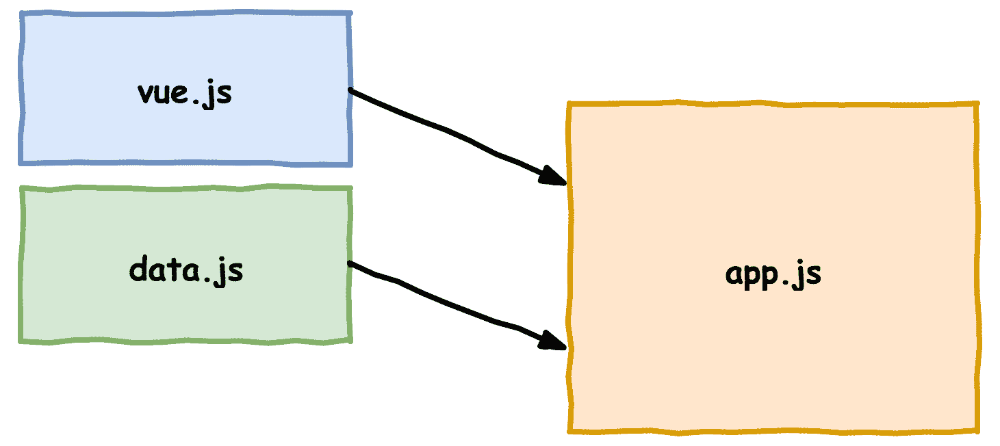图 5.3。Vuebnb 原型依赖关系

除了确保任何共享的函数和变量具有全局范围，并且脚本按正确的顺序加载外，在浏览器中没有真正的方法来管理这些依赖关系。

例如，由于`node_modules/vue/dist/vue.js`定义了全局的`Vue`对象并且首先加载，我们可以在`app.js`脚本中使用`Vue`对象。如果不满足这两个条件中的任何一个，当`app.js`运行时，`Vue`将未被定义，导致错误：

```php
<script src="node_modules/vue/dist/vue.js"></script>
<script src="sample/data.js"></script>
<script src="app.js"></script>
```

这个系统有一些缺点：

+   全局变量引入了命名冲突和意外变异的可能性

+   脚本加载顺序是脆弱的，随着应用程序的增长很容易被破坏

+   我们无法利用性能优化，比如异步加载脚本

# 模块

解决依赖管理问题的一个方法是使用 CommonJS 或原生 ES 模块等模块系统。这些系统允许 JavaScript 代码模块化，并导入到其他文件中。

这里是一个 CommonJS 的例子：

```php
// moduleA.js module.exports = function(value) {
  return value * 2;
}

// moduleB.js
var multiplyByTwo = require('./moduleA'); console.log(multiplyByTwo(2));

// Output: 4
```

这里是一个原生 ES 模块的例子：

```php
// moduleA.js
export default function(value) {
  return value * 2;
}

// moduleB.js
import multiplyByTwo from './moduleA'; console.log(multiplyByTwo(2)); // Output: 4
```

问题在于 CommonJS 不能在浏览器中使用（它是为服务器端 JavaScript 设计的），而原生 ES 模块现在才开始得到浏览器支持。如果我们想在项目中使用模块系统，我们需要一个构建工具：Webpack。

# 打包

将模块解析为适合浏览器的代码的过程称为**打包**。Webpack 从**入口文件**开始打包过程。在 Laravel 前端应用中，`resources/assets/js/app.js`是入口文件。

Webpack 分析入口文件以找到任何依赖关系。在`app.js`的情况下，它会找到三个：`bootstrap`、`vue`和`Example.vue`。

`resources/assets/js/app.js`：

```php
require('./bootstrap'); window.Vue = require('vue'); Vue.component('example', require('./components/Example.vue'));

...
```

Webpack 将解析这些依赖关系，然后分析它们以找到它们可能具有的任何依赖关系。这个过程会一直持续，直到找到项目的所有依赖关系。结果是一个依赖关系图，在一个大型项目中，可能包括数百个不同的模块。

Webpack 将这些依赖关系图作为打包所有代码到单个适合浏览器的文件的蓝图：

```php
<script src="bundle.js"></script>
```

# 加载器

Webpack 之所以如此强大的部分原因是，在打包过程中，它可以使用一个或多个 Webpack 加载器来*转换*模块。

例如，*Babel*是一个编译器，将下一代 JavaScript 语法（如 ES2015）转换为标准的 ES5。Webpack Babel 加载器是最受欢迎的加载器之一，因为它允许开发人员使用现代特性编写他们的代码，但仍然在旧版浏览器中提供支持。

例如，在入口文件中，我们看到了 IE10 不支持的 ES2015 `const`声明。

`resources/assets/js/app.js`：

```php
const app = new Vue({ el: '#app'
});
```

如果使用了 Babel 加载器，`const`将在添加到包中之前被转换为`var`。

`public/js/app.js`：

```php
var app = new Vue({ el: '#app'
});
```

# Laravel Mix

Webpack 的一个缺点是配置它很繁琐。为了简化事情，Laravel 包含一个名为*Mix*的模块，它将最常用的 Webpack 选项放在一个简单的 API 后面。

Mix 配置文件可以在项目目录的根目录中找到。Mix 配置涉及将方法链接到`mix`对象，声明应用程序的基本构建步骤。例如，`js`方法接受两个参数，入口文件和输出目录，默认情况下应用 Babel 加载器。`sass`方法以类似的方式工作。

`webpack.mix.js`：

```php
let mix = require('laravel-mix'); mix.js('resources/assets/js/app.js', 'public/js')
  .sass('resources/assets/sass/app.scss', 'public/css');
```

# 运行 Webpack

现在我们对 Webpack 有了一个高层次的理解，让我们运行它并看看它是如何捆绑默认的前端资产文件的。

首先，确保您已安装所有开发依赖项：

```php
$ npm install
```

# CLI

通常情况下，Webpack 是从命令行运行的，例如：

```php
$ webpack [options]
```

与其自己找出正确的 CLI 选项，我们可以使用`package.json`中预定义的 Weback 脚本之一。例如，`development`脚本将使用适合创建开发构建的选项运行 Webpack。

`package.json`：

```php
"scripts": {
  ...
  "development": "cross-env NODE_ENV=development node_modules/webpack/bin/webpack.js --progress --hide-modules --config=node_modules/laravel-mix/setup/webpack.config.js",
  ...
}
```

# 首次构建

现在让我们运行`dev`脚本（`development`脚本的快捷方式）：

```php
$ npm run dev
```

运行后，您应该在终端中看到类似以下的输出：

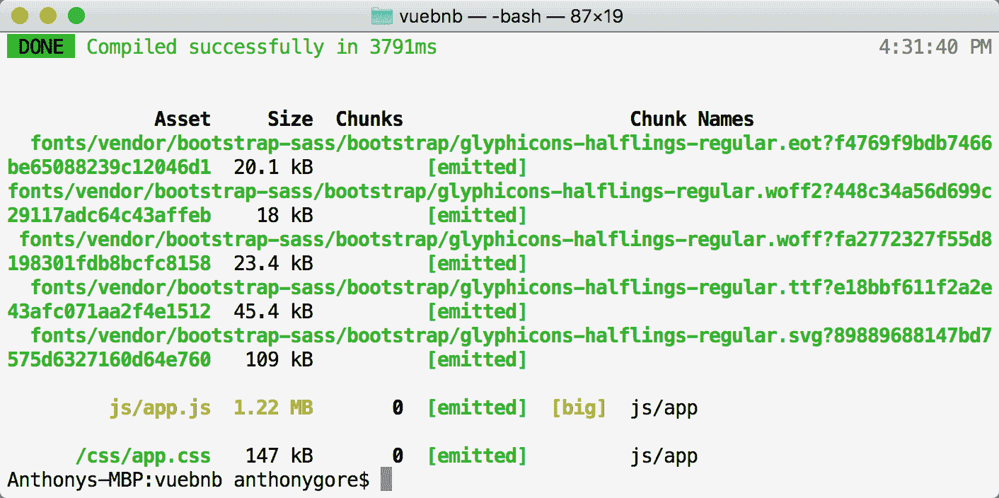图 5.4. Webpack 终端输出

这个输出告诉我们很多事情，但最重要的是构建成功了，以及输出了哪些文件，包括字体、JavaScript 和 CSS。请注意，输出文件路径是相对于`public`目录而不是项目根目录，所以`js/apps.js`文件将在`public/js/app.js`找到。

# JavaScript

检查输出的 JavaScript 文件`public/js/app.js`，我们会看到里面有大量的代码 - 大约 42,000 行！这是因为 jQuery、Lodash、Vue 和其他 JavaScript 依赖项都被捆绑到这个文件中。这也是因为我们使用了不包括缩小或丑化的开发构建。

如果您搜索文件，您会看到我们的入口文件`app.js`的代码已经按预期转换为 ES5：

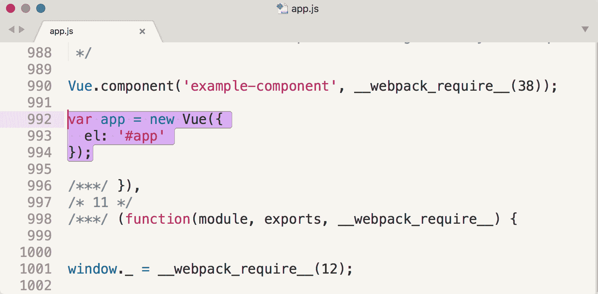图 5.5. 捆绑文件 public/js/app.js

# CSS

我们还有一个 CSS 捆绑文件`public/css/app.css`。如果您检查这个文件，您会发现导入的 Bootstrap CSS 框架已经包含在内，Sass 语法已经编译成普通的 CSS。

# 字体

你可能会觉得奇怪的是输出中有字体，因为 Mix 没有包含任何显式的字体配置。这些字体是 Bootstrap CSS 框架的依赖项，Mix 默认会将它们单独输出而不是打包成一个字体包。

# 迁移 Vuebnb

现在我们熟悉了默认的 Laravel 前端应用程序代码和配置，我们准备将 Vuebnb 原型迁移到主项目中。这个迁移将允许我们将所有源代码放在一个地方，而且我们可以利用这个更复杂的开发环境来构建 Vuebnb 的其余部分。

迁移将涉及：

1.  移除任何不必要的模块和文件

1.  将原型文件移动到 Laravel 项目结构中

1.  修改原型文件以适应新环境

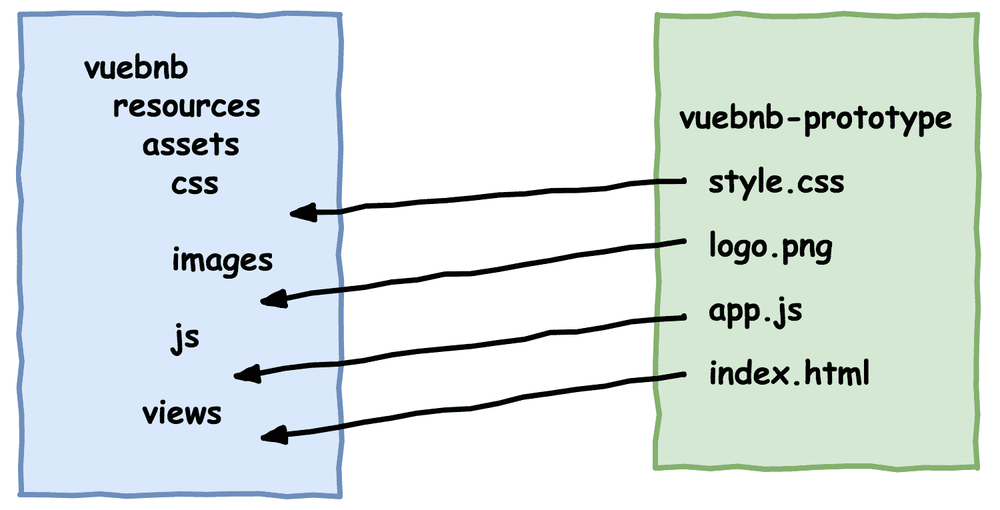图 5.6. Vuebnb 原型迁移

# 移除不必要的依赖项和文件

让我们首先移除我们不再需要的 Node 依赖项。我们将保留`axis`，因为它将在后面的章节中使用，以及`cross-env`，因为它确保我们的 NPM 脚本可以在各种环境中运行。我们将摆脱其余的：

```php
$ npm uninstall bootstrap-sass jquery lodash --save-dev
```

这个命令会让你的开发依赖项看起来像这样。

`package.json`：

```php
"devDependencies": {
  "axios": "⁰.17",
  "cross-env": "⁵.1",
  "laravel-mix": "¹.4",
  "vue": "².5.3"
}
```

接下来，我们将移除我们不需要的文件。这包括几个 JavaScript 资产，所有的 Sass 以及`welcome`视图：

```php
$ rm -rf \
resources/assets/js/app.js \
resources/assets/js/bootstrap.js \
resources/assets/js/components/* \
resources/assets/sass \
resources/views/welcome.blade.php
```

由于我们正在移除所有 Sass 文件，我们还需要在 Mix 配置中移除`sass`方法。

`webpack.mix.js`：

```php
let mix = require('laravel-mix'); mix .js('resources/assets/js/app.js', 'public/js')
;
```

现在我们的前端应用程序没有杂乱的东西，我们可以将原型文件移动到它们的新家。

# HTML

现在让我们将原型项目中的`index.html`的内容复制到一个新文件`app.blade.php`中。这将允许模板作为 Laravel 视图使用：

```php
$ cp ../vuebnb-prototype/index.html ./resources/views/app.blade.php
```

我们还将更新主页 web 路由，指向这个新视图而不是欢迎页面。

`routes/web.php`:

```php
<?php Route::get('/', function () {
  return view('app');
});
```

# 语法冲突

使用原型模板文件作为视图会导致一个小问题，因为 Vue 和 Blade 共享相同的语法。例如，查看 Vue.js 在标题部分插入标题和列表地址的地方。

`resources/views/app.blade.php`:

```php
<div class="heading">
  <h1>{{ title }}</h1>
  <p>{{ address }}</p>
</div>
```

当 Blade 处理这个时，它会认为双大括号是它自己的语法，并且会生成一个 PHP 错误，因为`title`和`address`都不是定义的函数。

有一个简单的解决方案：通过在双大括号前加上`@`符号来让 Blade 知道忽略它们。这可以通过在前面加上`@`符号来实现。

`resources/views/app.blade.php`:

```php
<div class="heading">
  <h1>@{{ title }}</h1>
  <p>@{{ address }}</p>
</div>
```

在文件中的每一组双大括号中完成这些操作后，加载浏览器中的主页路由以测试新视图。没有 JavaScript 或 CSS，它看起来不太好，但至少我们可以确认它可以工作：

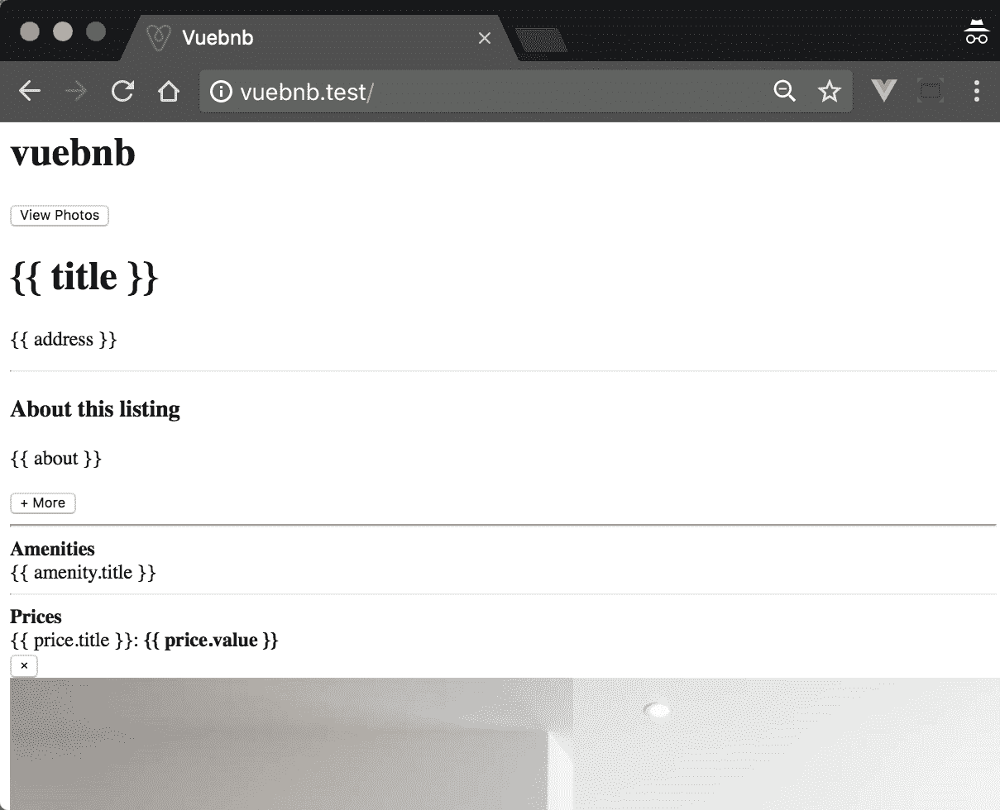图 5.7。主页路由

# JavaScript

现在让我们将原型的主要脚本文件`app.js`移动到 Laravel 项目中：

```php
$ cp ../vuebnb-prototype/app.js ./resources/assets/js/
```

根据当前的 Mix 设置，这将成为 JavaScript 捆绑包的入口文件。这意味着视图底部的 JavaScript 依赖项可以被捆绑包替换。

`resources/views/app.blade.php`:

```php
<script src="node_modules/vue/dist/vue.js"></script>
<script src="sample/data.js"></script>
<script src="app.js"></script>
```

可以被替换为，

`resources/views/app.blade.php`:

```php
<script src="{{ asset('js/app.js') }}"></script>
```

# 模拟数据依赖项

让我们也将模拟数据依赖项复制到项目中：

```php
$ cp ../vuebnb-prototype/sample/data.js ./resources/assets/js/
```

目前，这个文件声明了一个全局变量`sample`，然后在入口文件中被引用。让我们通过用 ES2015 的`export default`替换变量声明来将这个文件变成一个模块。

`resources/assets/js/data.js`:

```php
export default {
 ...
}
```

现在我们可以在我们的入口文件顶部导入这个模块。请注意，Webpack 可以在导入语句中猜测文件扩展名，因此您可以省略`data.js`中的`.js`。

`resources/assets/js/app.js`:

```php
import sample from './data';

var app = new Vue({
  ...
});
```

虽然 Laravel 选择使用 CommonJS 语法来包含模块，即`require`，但我们将使用原生 ES 模块语法，即`import`。这是因为 ES 模块正在成为 JavaScript 标准的一部分，并且它更符合 Vue 使用的语法。

# 使用 Webpack 显示模块

让我们运行 Webpack 构建，确保 JavaScript 迁移到目前为止是有效的：

```php
$ npm run dev
```

如果一切顺利，您将看到 JavaScript 捆绑文件被输出：

图 5.8。Webpack 终端输出

很好地知道模拟数据依赖项是如何添加的，而不必手动检查捆绑包以找到代码。我们可以通过告诉 Webpack 在终端输出中打印它处理过的模块来实现这一点。

在我们的`package.json`的`development`脚本中，设置了一个`--hide-modules`标志，因为一些开发人员更喜欢简洁的输出消息。让我们暂时将其移除，而是添加`--display-modules`标志，使脚本看起来像这样：

```php
"scripts": { ... "development": "cross-env NODE_ENV=development node_modules/webpack/bin/webpack.js --progress --display-modules --config=node_modules/laravel-mix/setup/webpack.config.js", ... }
```

现在再次运行构建，我们会得到更详细的终端输出：

图 5.9。带有 display-modules 标志的 Webpack 终端输出

这可以确保我们的`app.js`和`data.js`文件都包含在捆绑包中。

# Vue.js 依赖项

现在让我们将 Vue.js 作为我们入口文件的依赖项导入。

`resources/assets/js/app.js`:

```php
import Vue from 'vue';
import sample from './data';

var app = new Vue({
  ...
});
```

再次运行构建，我们现在会在终端输出中看到 Vue.js 在模块列表中，以及它引入的一些依赖项：

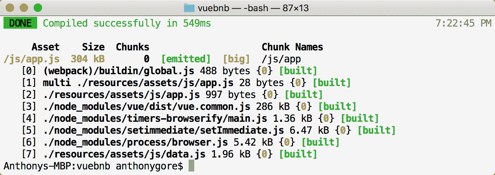图 5.10。显示 Vue.js 的 Webpack 终端输出

你可能想知道`import Vue from 'vue'`是如何解析的，因为它似乎不是一个正确的文件引用。Webpack 默认会在项目的`node_modules`文件夹中检查任何依赖项，这样就不需要将`import Vue from 'node_modules/vue';`放在项目中了。

但是，它又是如何知道这个包的入口文件呢？看一下前面截图中的 Webpack 终端输出，你会看到它已经包含了`node_modules/vue/dist/vue.common.js`。它知道要使用这个文件，是因为当 Webpack 将节点模块添加为依赖项时，它会检查它们的`package.json`文件，并查找`main`属性，而在 Vue 的情况下是。

`node_modules/vue/package.json`：

```php
{ ... "main": "dist/vue.runtime.common.js", ... }
```

但是，Laravel Mix 会覆盖这一点，以强制使用不同的 Vue 构建。

`node_modules/laravel-mix/setup/webpack.config.js`：

```php
alias: {
  'vue$': 'vue/dist/vue.common.js'
}
```

简而言之，`import Vue from 'vue'`实际上与`import Vue from 'node_modules/vue/dist/vue.common.js'`是一样的。

我们将在第六章中解释不同的 Vue 构建，*使用 Vue.js 组件组合小部件*。

搞定了，我们的 JavaScript 已成功迁移。再次加载主页路由，我们现在可以更好地看到 Vuebnb 的列表页面，其中包括 JavaScript：

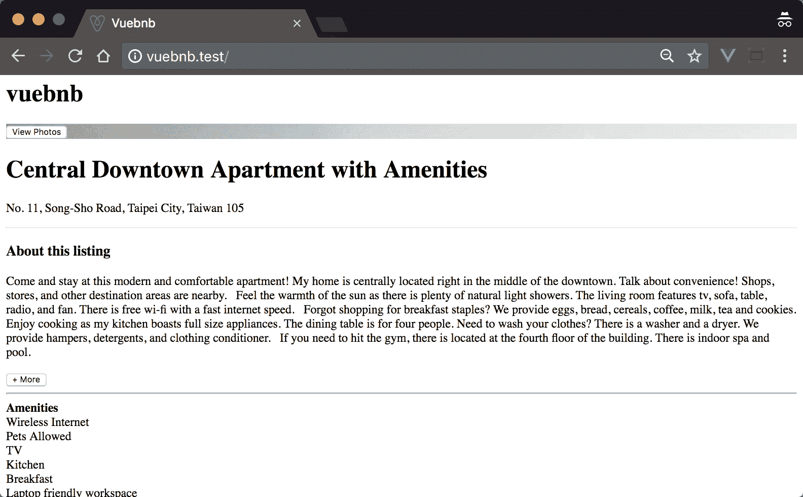图 5.11.带有 JavaScript 迁移的主页路由

# CSS

要迁移 CSS，我们将从原型中复制`style.css`到 Laravel 项目中。默认的 Laravel 前端应用程序使用 Sass 而不是 CSS，因此我们需要先为 CSS 资产创建一个目录：

```php
$ mkdir ./resources/assets/css
$ cp ../vuebnb-prototype/style.css ./resources/assets/css/
```

然后在我们的 Mix 配置中进行新的声明，使用`styles`方法获取一个 CSS 捆绑包。

`webpack.mix.js`：

```php
mix .js('resources/assets/js/app.js', 'public/js')
  .styles('resources/assets/css/style.css', 'public/css/style.css')
;
```

现在我们将在视图中链接到 CSS 捆绑包，更新链接的`href`。

`resources/views/app.blade.php`：

```php
<link rel="stylesheet" href="{{ asset('css/style.css') }}" type="text/css">
```

# 字体样式

我们还有 Open Sans 和 Font Awesome 样式表要包含。首先，使用 NPM 安装字体包：

```php
$ npm i --save-dev font-awesome open-sans-all
```

我们将修改我们的 Mix 配置，将我们的应用程序 CSS、Open Sans 和 Font Awesome CSS 捆绑在一起。我们可以通过将数组传递给`styles`方法的第一个参数来实现这一点。

`webpack.mix.js`：

```php
mix .js('resources/assets/js/app.js', 'public/js')
  .styles([
    'node_modules/open-sans-all/css/open-sans.css',
    'node_modules/font-awesome/css/font-awesome.css',
    'resources/assets/css/style.css'
```

```php
  ], 'public/css/style.css')
;
```

Mix 将在终端输出中附加有关 CSS 捆绑包的统计信息：

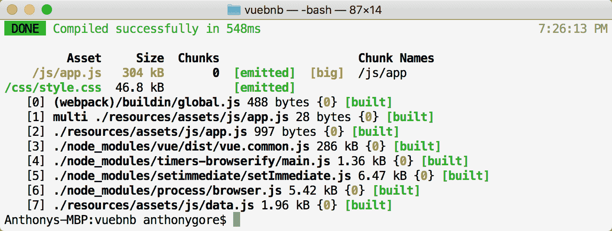图 5.12.带有 CSS 的 Webpack 终端输出

记得从视图中删除对字体样式表的链接，因为现在它们将在 CSS 捆绑包中。

# 字体

Open Sans 和 Font Awesome 都需要一个 CSS 样式表和相关的字体文件。与 CSS 一样，Webpack 可以将字体捆绑为模块，但我们目前不需要利用这一点。相反，我们将使用`copy`方法，告诉 Mix 将字体从它们的主目录复制到`public`文件夹中，这样前端应用程序就可以访问它们了。

`webpack.mix.js`：

```php
mix .js('resources/assets/js/app.js', 'public/js')
  .styles([
    'node_modules/open-sans-all/css/open-sans.css',
    'node_modules/font-awesome/css/font-awesome.css',
    'resources/assets/css/style.css'
  ], 'public/css/style.css')
  .copy('node_modules/open-sans-all/fonts',  'public/fonts')
  .copy('node_modules/font-awesome/fonts',  'public/fonts')
;
```

再次构建后，您现在将在项目结构中看到一个`public/fonts`文件夹。

# 图像

我们现在将迁移图像，包括工具栏的标志和模拟数据标题图像：

```php
$ cp ../vuebnb-prototype/logo.png ./resources/assets/images/
$ cp ../vuebnb-prototype/sample/header.jpg ./resources/assets/images/
```

让我们再链上另一个`copy`方法，将它们包含在`public/images`目录中。

`webpack.mix.js`：

```php
mix .js('resources/assets/js/app.js', 'public/js')
  .styles([
    'node_modules/open-sans-all/css/open-sans.css',
    'node_modules/font-awesome/css/font-awesome.css',
    'resources/assets/css/style.css'
  ], 'public/css/style.css')
  .copy('node_modules/open-sans-all/fonts',  'public/fonts')
  .copy('node_modules/font-awesome/fonts',  'public/fonts')
  .copy('resources/assets/images', 'public/images')
;
```

我们还需要确保视图指向正确的图像文件位置。在工具栏中。

`resources/views/app.blade.php`：

```php
<div id="toolbar">
  
  <h1>vuebnb</h1>
</div>
```

以及在模态框中。

`resources/views/app.blade.php`：

```php
<div class="modal-content">
  
</div>
```

不要忘记需要更新入口文件中的`headerImageStyle`数据属性。

`resources/assets/js/app.js`：

```php
headerImageStyle: {
  'background-image': 'url(/images/header.jpg)'
},
```

虽然不完全是一张图片，我们也将迁移`favicon`。这可以直接放入`public`文件夹中：

```php
$ cp ../vuebnb-prototype/favicon.ico ./public
```

再次构建后，我们现在将完全迁移 Vuebnb 客户端应用程序原型：

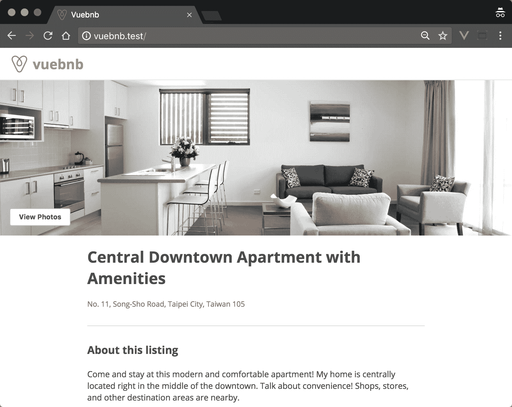图 5.13.从 Laravel 提供的 Vuebnb 客户端应用程序原型

# 开发工具

我们可以利用一些方便的开发工具来改进我们的前端工作流程，包括：

+   监视模式

+   BrowserSync

# 监视模式

到目前为止，我们一直在每次进行更改时手动运行应用程序的构建，使用`npm run dev`。Webpack 还有一个观察模式，在这种模式下，当依赖项发生更改时，它会自动运行构建。由于 Webpack 的设计，它能够通过仅重新构建已更改的模块来高效地完成这些自动构建。

要使用观察模式，请运行`package.json`中包含的`watch`脚本：

```php
$ npm run watch
```

要测试它是否有效，请在`resources/assets/js/app.js`的底部添加以下内容：

```php
console.log("Testing watch");
```

如果观察模式正在正确运行，保存此文件将触发构建，并且您将在终端中看到更新的构建统计信息。然后刷新页面，您将在控制台中看到测试观察模式的消息。

要关闭观察模式，在终端中按*Ctrl* + *C*。然后可以随时重新启动。不要忘记在满意观察模式工作后删除`console.log`。

我假设您在本书的其余部分中都在使用*watch*，所以我不会再提醒您在更改后构建项目了！

# BrowserSync

另一个有用的开发工具是 BrowserSync。与观察模式类似，BrowserSync 监视文件的更改，当发生更改时，将更改插入浏览器。这样可以避免在每次构建后手动刷新浏览器。

要使用 BrowserSync，您需要安装 Yarn 软件包管理器。如果您在 Vagrant Box 中运行终端命令，那么您已经准备就绪，因为 Yarn 已预先安装在 Homestead 中。否则，请按照此处的 Yarn 安装说明进行安装：[`yarnpkg.com/en/docs/install`](https://yarnpkg.com/en/docs/install)。

BrowserSync 已与 Mix 集成，并且可以通过在 Mix 配置中调用`browserSync`方法来使用。传递一个带有应用程序 URL 作为`proxy`属性的选项对象，例如，`browserSync({ proxy: http://vuebnb.test })`。

我们将应用程序的 URL 存储为`.env`文件中的环境变量，因此让我们从那里获取它，而不是硬编码到我们的 Mix 文件中。首先，安装 NPM `dotenv`模块，它将`.env`文件读入 Node 项目中：

```php
$ npm i dotenv --save-devpm
```

在 Mix 配置文件的顶部要求`dotenv`模块，并使用`config`方法加载`.env`。然后环境变量将作为`process.env`对象的属性可用。

现在我们可以将一个带有`process.env.APP_URL`分配给`proxy`的选项对象传递给`browserSync`方法。我还喜欢使用`open: false`选项，这样可以防止 BrowserSync 自动打开一个标签页。

`webpack.mix.js`：

```php
require('dotenv').config();
let mix = require('laravel-mix'); mix ...
  .browserSync({ proxy: process.env.APP_URL, open: false
  })
;
```

BrowserSync 默认在自己的端口`3000`上运行。当您再次运行`npm run watch`时，在`localhost:3000`上打开一个新标签页。在对代码进行更改后，您会发现这些更改会自动反映在此 BrowserSync 标签页中！

请注意，如果您在 Homestead 框中运行 BrowserSync，可以在`vuebnb.test:3000`上访问它。

即使 BrowserSync 服务器在不同的端口上运行，我将继续在应用程序中引用 URL 而不指定端口，以避免任何混淆，例如，`vuebnb.test`而不是`localhost:3000`或`vuebnb.test:3000`。

# ES2015

`js` Mix 方法将 Babel 插件应用于 Webpack，确保任何 ES2015 代码在添加到捆绑文件之前被转译为浏览器友好的 ES5。

我们使用 ES5 语法编写了 Vuebnb 前端应用程序原型，因为我们直接在浏览器中运行它，没有任何构建步骤。但现在我们可以利用 ES2015 语法，其中包括许多方便的功能。

例如，我们可以使用一种简写方式将函数分配给对象属性。

`resources/assets/js/app.js`：

```php
escapeKeyListener: function(evt) {
  ...
}
```

可以更改为：

```php
escapeKeyListener(evt) {
  ...
}
```

在`app.js`中有几个这样的实例，我们可以更改。尽管在我们的代码中还没有其他使用 ES2015 语法的机会，但在接下来的章节中我们会看到更多。

# Polyfills

ES2015 提案包括新的语法，还包括新的 API，如`Promise`，以及对现有 API 的添加，如`Array`和`Object`。

Webpack Babel 插件可以转译 ES2015 语法，但新的 API 方法需要进行 polyfill。**Polyfill**是在浏览器中运行的脚本，用于覆盖可能缺失的 API 或 API 方法。

例如，`Object.assign`是一个新的 API 方法，在 Internet Explorer 11 中不受支持。如果我们想在前端应用程序中使用它，我们必须在脚本的顶部检查 API 方法是否存在，如果不存在，则使用 polyfill 手动定义它：

```php
if (typeof Object.assign != 'function') {
  // Polyfill to define Object.assign
}
```

说到这一点，`Object.assign`是合并对象的一种方便方法，在我们的前端应用程序中会很有用。让我们在我们的代码中使用它，然后添加一个 polyfill 来确保代码在旧版浏览器中运行。

查看我们入口文件`resources/assets/js/app.js`中的`data`对象。我们手动将`sample`对象的每个属性分配给`data`对象，给它相同的属性名。为了避免重复，我们可以使用`Object.assign`来简单地合并这两个对象。实际上，这并没有做任何不同的事情，只是更简洁的代码。

`resources/assets/js/app.js`:

```php
data: Object.assign(sample, { headerImageStyle: {
    'background-image': 'url(/images/header.jpg)'
  }, contracted: true, modalOpen: false
}),
```

为了 polyfill`Object.assign`，我们必须安装一个新的`core-js`依赖项，这是一个为大多数新的 JavaScript API 提供 polyfill 的库。我们稍后将在项目中使用一些其他`core-js`的 polyfill：

```php
$ npm i --save-dev core-js
```

在`app.js`的顶部，添加以下行以包含`Object.assign`的 polyfill：

```php
import "core-js/fn/object/assign";
```

构建完成后，刷新页面以查看是否有效。除非您可以在旧版浏览器（如 Internet Explorer）上测试，否则您很可能不会注意到任何区别，但现在您可以确保这段代码几乎可以在任何地方运行。

# 模拟数据

我们现在已经完全将 Vuebnb 原型迁移到了我们的 Laravel 项目中，并且我们已经添加了一个构建步骤。前端应用程序中的一切都像第二章中的一样工作，*Vuebnb 原型设计，您的第一个 Vue.js 项目*。

但是，我们仍然在前端应用程序中硬编码了模拟数据。在本章的最后部分，我们将删除这些硬编码的数据，并用后端数据替换它。

# 路由

目前，主页路由，即`*/*`，加载我们的前端应用程序。但是，我们迄今为止构建的前端应用程序并不是一个主页！我们将在以后的章节中构建它。

我们构建的是*listing*页面，应该在类似`/listing/5`的路由上，其中`5`是正在使用的模拟数据列表的 ID。

| 页面 | 路由 |
| --- | --- |
| 主页 | / |
| 列表页面 | /listing/{listing} |

让我们修改路由以反映这一点。

`routes/web.php`:

```php
<?php

use App\Listing; Route::get('/listing/{listing}', function ($id) {
  return view('app');
});
```

就像在我们的`api/listing/{listing}`路由中一样，动态段意味着要匹配我们模拟数据列表中的一个 ID。如果您还记得上一章，我们创建了 30 个模拟数据列表，ID 范围是 1 到 30。

如果我们现在在`闭包`函数的配置文件中对`Listing`模型进行类型提示，Laravel 的服务容器将传递一个与动态路由段匹配的 ID 的模型。

`routes/web.php`:

```php
Route::get('/listing/{listing}', function (Listing $listing) {
  // echo $listing->id // will equal 5 for route /listing/5
  return view('app');
});
```

一个很酷的内置功能是，如果动态段与模型不匹配，例如`/listing/50`或`/listing/somestring`，Laravel 将中止路由并返回 404。

# 架构

考虑到我们可以在路由处理程序中检索到正确的列表模型，并且由于 Blade 模板系统的存在，我们可以动态地将内容插入到我们的*app*视图中，一个明显的架构出现了：我们可以将模型注入到页面的头部。这样，当 Vue 应用程序加载时，它将立即访问模型：

图 5.14。将内联列表模型插入页面的头部

# 注入数据

将模拟列表数据传递到客户端应用程序将需要几个步骤。我们将首先将模型转换为数组。然后可以使用`view`助手在模板中运行时使模型可用。

`routes/web.php`:

```php
Route::get('/listing/{listing}', function (Listing $listing) {
  $model = $listing->toArray();
  return view('app', [ 'model' => $model ]);
});
```

现在，在 Blade 模板中，我们将在文档的头部创建一个脚本。通过使用双花括号，我们可以直接将模型插入脚本中。

`resources/views/app.blade.php`：

```php
<head> ... <script type="text/javascript"> console.log({{ $model[ 'id' ] }}); </script>
</head>
```

现在，如果我们转到`/listing/5`路由，我们将在页面源代码中看到以下内容：

```php
<script type="text/javascript"> console.log(5); </script>
```

并且您将在控制台中看到以下内容：

图 5.15。注入模型 ID 后的控制台输出

# JSON

现在我们将整个模型编码为 JSON 放在视图中。JSON 格式很好，因为它可以存储为字符串，并且可以被 PHP 和 JavaScript 解析。

在我们的内联脚本中，让我们将模型格式化为 JSON 字符串并分配给`model`变量。

`resources/views/app.blade.php`：

```php
<script type="text/javascript"> var model = "{!! addslashes(json_encode($model)) !!}"; console.log(model); </script>
```

请注意，我们还必须在另一个全局函数`addslashes`中包装`json_encode`。这个函数将在需要转义的任何字符之前添加反斜杠。这是必要的，因为 JavaScript JSON 解析器不知道字符串中的引号是 JavaScript 语法的一部分，还是 JSON 对象的一部分。

我们还必须使用不同类型的 Blade 语法进行插值。Blade 的一个特性是，双花括号`{{ }}`中的语句会自动通过 PHP 的`htmlspecialchars`函数发送，以防止 XSS 攻击。不幸的是，这将使我们的 JSON 对象无效。解决方案是使用替代的`{!! !!}`语法，它不会验证内容。在这种情况下这样做是安全的，因为我们确定我们没有使用任何用户提供的内容。

现在，如果我们刷新页面，我们将在控制台中看到 JSON 对象作为字符串：

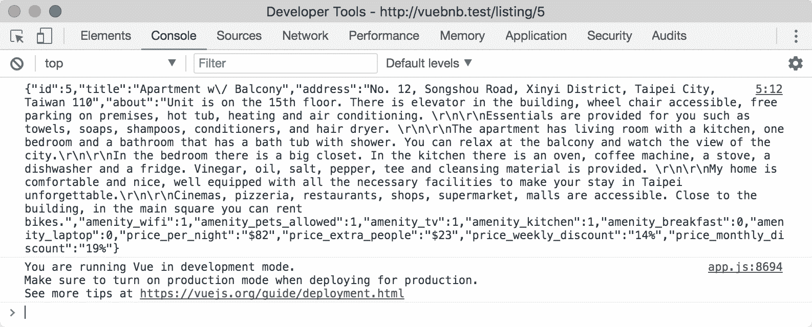图 5.16。控制台中的 JSON 字符串模型

如果我们将日志命令更改为`console.log(JSON.parse(model));`，我们将看到我们的模型不是一个字符串，而是一个 JavaScript 对象：

图 5.17。控制台中的对象模型

我们现在已经成功地将我们的模型从后端传递到前端应用程序！

# 在脚本之间共享数据

现在我们有另一个问题要克服。文档头部的内联脚本，其中包含我们的模型对象，与我们的客户端应用程序所在的脚本不同，这是需要的地方。

正如我们在前一节中讨论的，通常不建议使用多个脚本和全局变量，因为它们会使应用程序变得脆弱。但在这种情况下，它们是必需的。在两个脚本之间安全共享对象或函数的最佳方法是将其作为全局`window`对象的属性。这样，从您的代码中很明显，您有意使用全局变量：

```php
// scriptA.js window.myvar = 'Hello World';

// scriptB.js console.log(window.myvar); // Hello World
```

如果您向项目添加其他脚本，特别是第三方脚本，它们可能也会添加到`window`对象，并且可能会发生命名冲突的可能性。为了尽量避免这种情况，我们将确保使用非常特定的属性名称。

`resources/views/app.blade.php`：

```php
<script type="text/javascript"> window.vuebnb_listing_model = "{!! addslashes(json_encode($model)) !!}" </script>
```

现在，在前端应用程序的入口文件中，我们可以在脚本中使用这个`window`属性。

`resources/assets/js/app.js`：

```php
let model = JSON.parse(window.vuebnb_listing_model);

var app = new Vue({
  ...
});
```

# 替换硬编码的模型

现在我们可以在入口文件中访问我们的列表模型，让我们将其与`data`属性分配中的硬编码模型进行交换。

`resources/assets/js/app.js`：

```php
let model = JSON.parse(window.vuebnb_listing_model);

var app = new Vue({ el: '#app' data: Object.assign(model, {
    ...
  })
  ...
});
```

完成后，我们现在可以从`app.js`的顶部删除`import sample from './data';`语句。我们还可以删除示例数据文件，因为它们在项目中将不再使用：

```php
$ rm resources/assets/js/data.js resources/assets/images/header.jpg
```

# 设施和价格

如果您现在刷新页面，它将加载，但脚本将出现一些错误。问题在于设施和价格数据在前端应用程序中的结构与后端中的结构不同。这是因为模型最初来自我们的数据库，它存储标量值。在 JavaScript 中，我们可以使用更丰富的对象，允许我们嵌套数据，使其更容易处理和操作。

这是模型对象当前的外观。请注意，设施和价格是标量值：

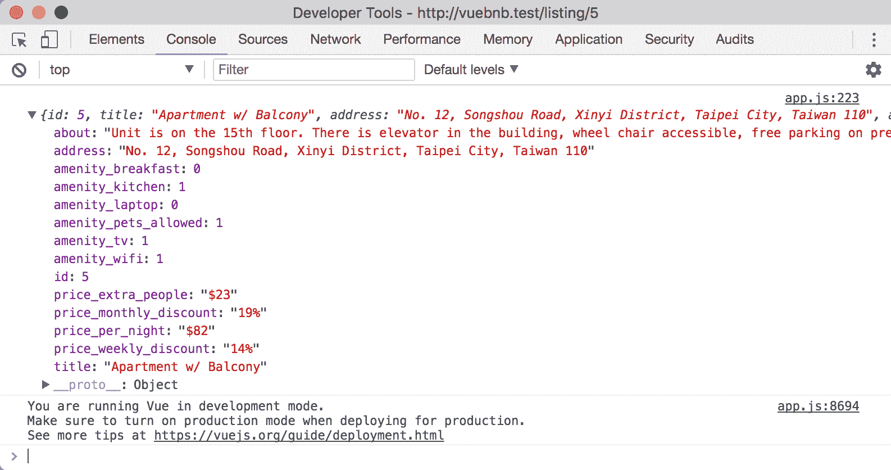图 5.18。列表模型当前的外观

这就是我们需要的样子，包括设施和价格作为数组：

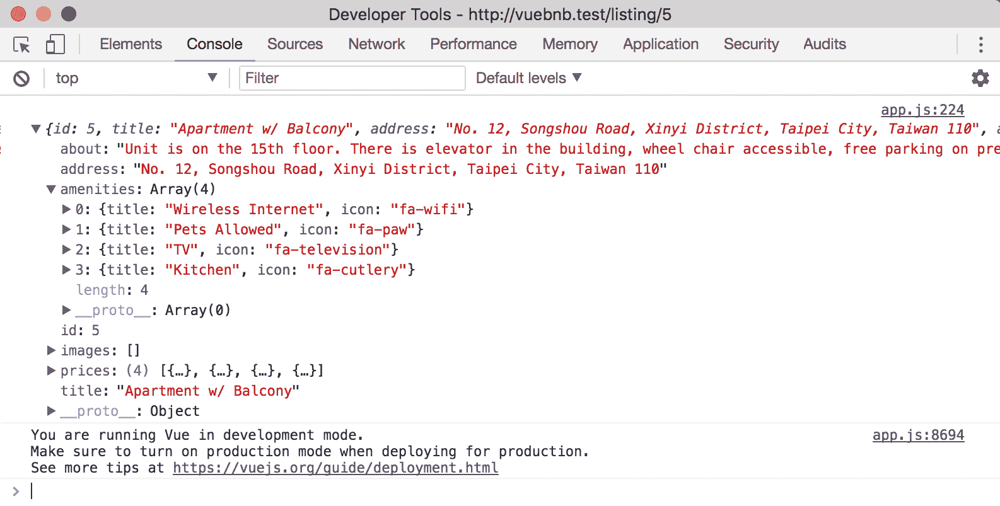图 5.19。列表模型应该的外观

为了解决这个问题，我们需要在将模型传递给 Vue 之前对其进行转换。为了让您不必过多考虑这个问题，我已经将转换函数放入了一个文件`resources/assets/js/helpers.js`中。这个文件是一个 JavaScript 模块，我们可以将其导入到我们的入口文件中，并通过简单地将模型对象传递给函数来使用它。

`resources/assets/js/app.js`：

```php
import Vue from 'vue';
import { populateAmenitiesAndPrices } from './helpers';

let model = JSON.parse(window.vuebnb_listing_model); model = populateAmenitiesAndPrices(model)</span>;
```

完成这些步骤并刷新页面后，我们应该在页面的文本部分看到新的模型数据（尽管图像仍然是硬编码的）：

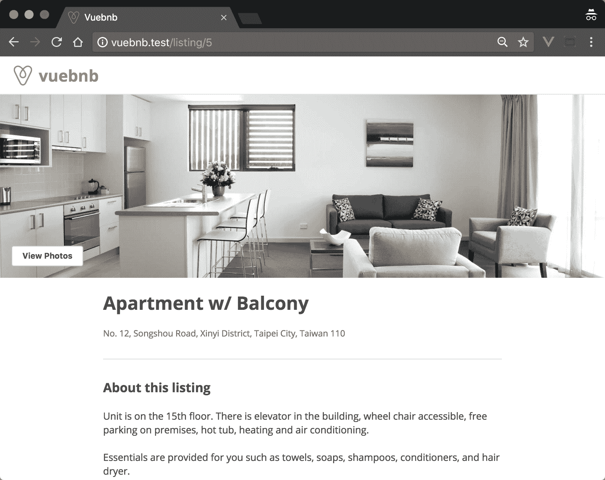图 5.20。页面中的新模型数据与硬编码的图像

# 图像 URL

最后要做的事情是替换前端应用程序中的硬编码图像 URL。这些 URL 目前不是模型的一部分，因此需要在将其注入模板之前手动添加到模型中。

我们已经在第四章中做了一个非常类似的工作，*使用 Laravel 构建 Web 服务*，用于 API 列表路由。

`app/Http/Controllers/ListingController.php`：

```php
public function get_listing_api(Listing $listing) 
{ $model = $listing->toArray();
  for($i = 1; $i <=4; $i++) { $model['image_' . $i] = asset(
      'images/' . $listing->id . '/Image_' . $i . '.jpg'
    );
  }
  return response()->json($model);
}
```

实际上，我们的 web 路由最终将与这个 API 路由的代码相同，只是不返回 JSON，而是返回一个视图。

让我们分享共同的逻辑。首先将路由闭包函数移动到列表控制器中的一个新的`get_listing_web`方法。

`app/Http/Controllers/ListingController.php`：

```php
<?php

namespace App\Http\Controllers;

use Illuminate\Http\Request;
use App\Listing;

class ListingController extends Controller
{
  public function get_listing_api(Listing $listing) 
  {
    ...
  }

  public function get_listing_web(Listing $listing) 
  {
    $model = $listing->toArray();
    return view('app', ['model' => $model]);
  }
}
```

然后调整路由以调用这个新的控制器方法。

`routes/web.php`：

```php
<?php Route::get('/listing/{listing}', 'ListingController@get_listing_web');
```

现在让我们更新控制器，使得*web*和 API 路由都将图像的 URL 添加到它们的模型中。我们首先创建一个新的`add_image_urls`方法，它抽象了在`get_listing_api`中使用的逻辑。现在路由处理方法都将调用这个新方法。

`app/Http/Controllers/ListingController.php`：

```php
<?php

namespace App\Http\Controllers;

use Illuminate\Http\Request;
use App\Listing;

class ListingController extends Controller
{
  private function add_image_urls($model, $id) 
  {
    for($i = 1; $i <=4; $i++) {
      $model['image_' . $i] = asset(
        'images/' . $id . '/Image_' . $i . '.jpg'
      );
    }
    return $model;
  }

  public function get_listing_api(Listing $listing) 
  {
    $model = $listing->toArray();
    $model = $this->add_image_urls($model, $listing->id);
    return response()->json($model);
  }

  public function get_listing_web(Listing $listing) 
  {
    $model = $listing->toArray();
    $model = $this->add_image_urls($model, $listing->id);
```

```php
    return view('app', ['model' => $model]);
  }
}
```

完成后，如果我们刷新应用并打开 Vue Devtools，我们应该看到我们有图像 URL 作为`images`数据属性：

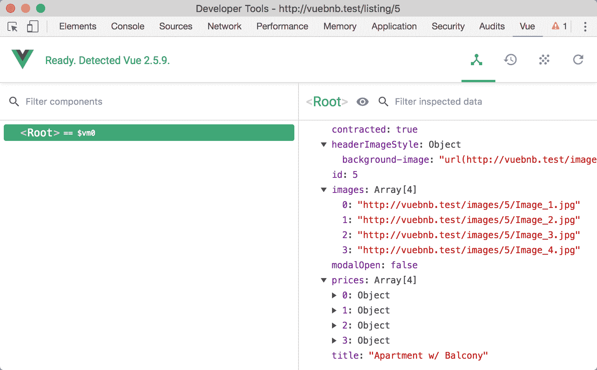图 5.21。如 Vue Devtools 中所示，图像现在是一个数据属性

# 替换硬编码的图像 URL

最后一步是使用后端的图像 URL，而不是硬编码的 URL。记住`images`是一个 URL 数组，我们将使用第一个图像作为默认值，即`images[0]`。

首先，我们将更新入口文件，

`resources/assets/js/app.js`：

```php
headerImageStyle: {
  'background-image': `url(${model.images[0]})`
}
```

然后是模态图像的视图。

`resources/views/app.blade.php`：

```php
<div class="modal-content">
  
</div>
```

完成重建和页面刷新后，您将在页面中看到模拟数据列表`#5`的内容：

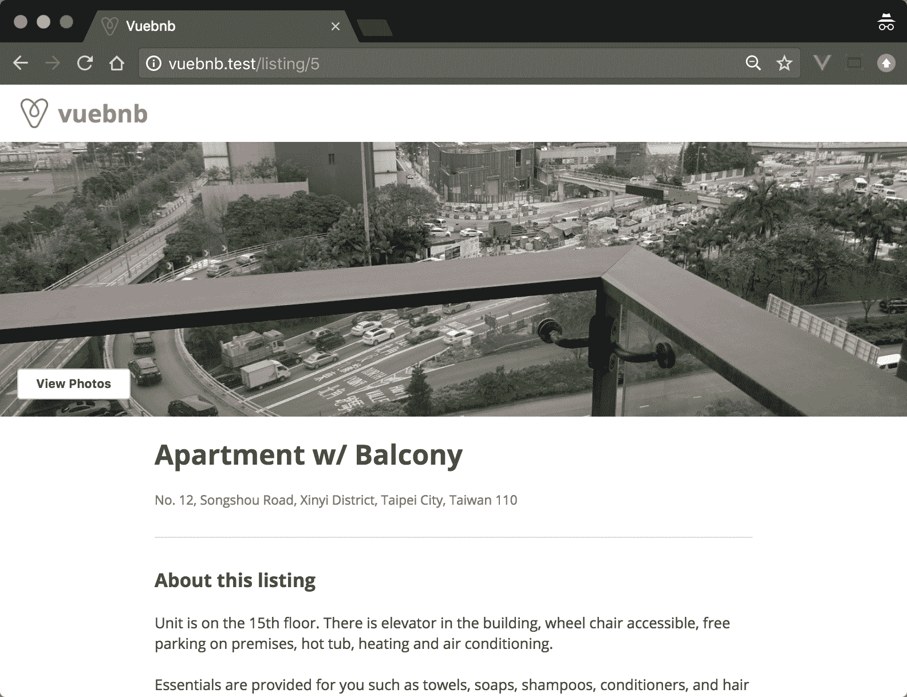图 5.22。带有模拟数据的列表页面

为了验证并欣赏我们的工作，让我们尝试另一个路由，例如`/listing/10`：

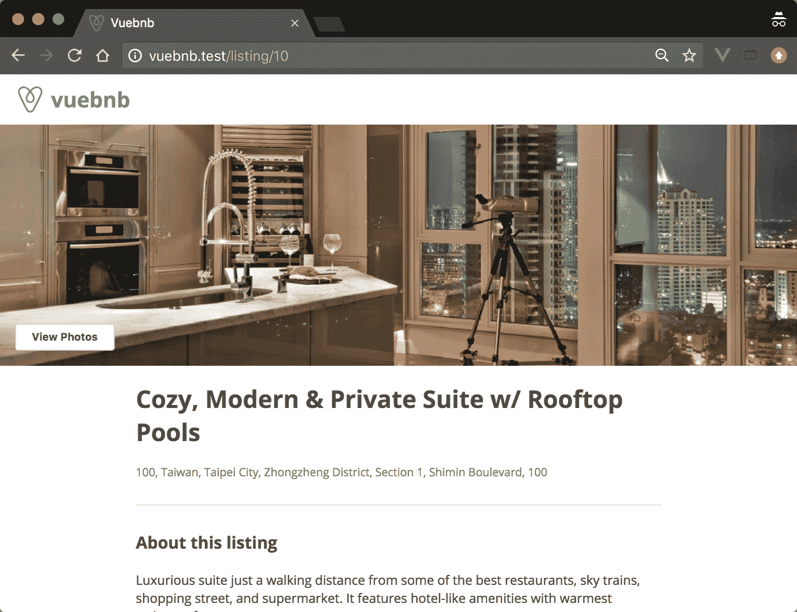图 5.23。带有模拟数据的列表页面

# 总结

在本章中，我们熟悉了 Laravel 默认前端应用程序的文件和配置。然后我们将 Vuebnb 客户端应用程序原型迁移到我们的 Laravel 项目中，实现了 Vuebnb 的第一个全栈迭代。

我们还了解了 Webpack，看到它是如何通过将模块捆绑到浏览器友好的构建文件中来解决 JavaScript 依赖管理问题的。我们通过 Laravel Mix 在项目中设置了 Webpack，它提供了一个简单的 API 来处理常见的构建场景。

然后我们调查了一些工具，使得我们的前端开发过程更容易，包括 Webpack 的监视模式和 BrowserSync。

最后，我们看到如何通过将数据注入到文档头部，将数据从后端传递到前端应用程序。

在第六章中，*使用 Vue.js 组件组合小部件*，我们将介绍构建 Vue.js 用户界面的最重要和强大的工具之一：组件。我们将为 Vuebnb 构建一个图像轮播，并利用组件的知识将 Vuebnb 客户端应用程序重构为灵活的基于组件的架构。
