# 第六章：使用 Vue.js 组件组合小部件

组件正在成为前端开发的一个重要方面，并且是大多数现代前端框架的一个特性，包括 Vue、React、Angular、Polymer 等。组件甚至通过一个称为**Web Components**的新标准成为 Web 的本地特性。

在本章中，我们将使用组件为 Vuebnb 创建一个图像轮播，允许用户查看房间列表的不同照片。我们还将重构 Vuebnb 以符合基于组件的架构。

本章涵盖的主题：

+   组件是什么以及如何使用 Vue.js 创建它们

+   通过 props 和 events 进行组件通信

+   单文件组件- Vue 中最有用的功能之一

+   使用插槽向组件添加自定义内容

+   完全从组件构建应用程序的好处

+   如何使用渲染函数跳过模板编译器

+   使用 Vue 的仅运行时构建来减小捆绑包大小

# 组件

当我们构建 Web 应用程序的模板时，我们可以使用 HTML 元素，如`div`，`table`和`span`。这种各种元素使得我们可以轻松创建页面上所需的任何结构。

如果我们可以通过例如`my-element`创建自定义元素，那该多好？这将允许我们创建专门为我们的应用程序设计的可重用结构。

*组件*是在 Vue.js 中创建自定义元素的工具。当我们注册一个组件时，我们定义一个模板，它呈现为一个或多个标准 HTML 元素：

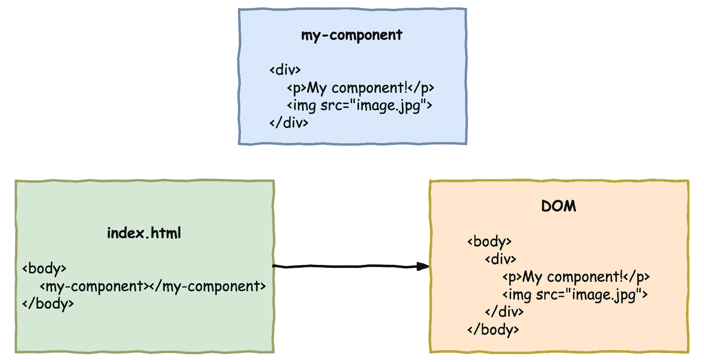图 6.1。组件促进可重用的标记，并呈现为标准 HTML

# 注册

有许多注册组件的方法，但最简单的方法是使用`component` API 方法。第一个参数是您要给组件的名称，第二个是配置对象。配置对象通常会包括一个`template`属性，以使用字符串声明组件的标记：

```php
Vue.component('my-component', { template: '<div>My component!</div>'
});

new Vue({ el: '#app'
});
```

注册了这样一个组件后，我们可以在项目中使用它：

```php
<div id="app">
  <my-component></my-component>
  <!-- Renders as <div>My component!</div> -->
</div>
```

# 数据

除了可重用的标记之外，组件还允许我们重用 JavaScript 功能。配置对象不仅可以包括一个模板，还可以包括自己的状态，就像 Vue 实例一样。实际上，每个组件都可以被视为 Vue 的迷你实例，具有自己的数据、方法、生命周期钩子等。

我们对待组件数据的方式与 Vue 实例略有不同，因为组件是可重用的。例如，我们可以像这样创建一个`check-box`组件库：

```php
<div id="app">
  <check-box></check-box>
  <check-box></check-box>
  <check-box></check-box>
</div>
<script> Vue.component('check-box', { template: '<div v-on:click="checked = !checked"></div>' data: { checked: false
    }
  }); </script>
```

现在，如果用户点击复选框`div`，则`checked`状态会同时从 true 切换到 false！这不是我们想要的，但这将会发生，因为组件的所有实例都引用相同的`data`对象，因此具有相同的状态。

为了使每个实例具有自己的唯一状态，`data`属性不应该是一个对象，而应该是一个返回对象的工厂函数。这样，每次组件被实例化时，它都链接到一个新的数据对象。实现这一点就像这样简单：

```php
data() {
  return { checked: false 
  }
}
```

# 图像轮播

让我们使用组件为 Vuebnb 前端应用程序构建一个新功能。正如您从之前的章节中记得的那样，我们的模拟数据列表中有四个不同的图像，并且我们正在将 URL 传递给前端应用程序。

为了让用户查看这些图像，我们将创建一个图像轮播。这个轮播将取代当前在单击列表标题时弹出的模态窗口中的静态图像。

首先打开应用视图。删除静态图像，并将其替换为自定义 HTML 元素`image-carousel`。

`resources/views/app.blade.php`：

```php
<div class="modal-content">
  <image-carousel></image-carousel>
</div>
```

组件可以在您的代码中通过 kebab-case 名称（如`my-component`）、PascalCase 名称（如`MyComponent`）或 camelCase 名称（如`myComponent`）来引用。Vue 将这些视为相同的组件。然而，在 DOM 或字符串模板中，组件应始终使用 kebab-case。Vue 不强制执行这一点，但页面中的标记在 Vue 开始处理之前会被浏览器解析，因此应符合 W3C 命名约定，否则解析器可能会将其删除。

现在让我们在入口文件中注册组件。这个新组件的模板将简单地是我们从视图中移除的图像标签，包裹在一个`div`中。我们添加这个包装元素，因为组件模板必须有一个单一的根元素，并且我们很快将在其中添加更多元素。

作为概念验证，组件数据将包括一个硬编码的图像 URL 数组。一旦我们学会如何将数据传递给组件，我们将删除这些硬编码的 URL，并用来自我们模型的动态 URL 替换它们。

`resources/assets/js/app.js`:

```php
Vue.component('image-carousel', { template: `<div class="image-carousel">
              
            </div>`,
  data() {
    return { images: [
        '/images/1/Image_1.jpg',
        '/images/1/Image_2.jpg',
        '/images/1/Image_3.jpg',
        '/images/1/Image_4.jpg'
      ]
    }
  }
});

var app = new Vue({
  ...
});
```

在测试这个组件之前，让我们对 CSS 进行调整。我们之前有一个规则，确保模态窗口内的图像通过`.modal-content img`选择器拉伸到全宽。让我们改用`.image-carousel`选择器，因为我们正在将图像与模态窗口解耦。

`resources/assets/css/style.css`:

```php
.image-carousel img {
  width: 100%;
}
```

在代码重建后，将浏览器导航到`/listing/1`，你应该看不到任何区别，因为组件应该以几乎与之前标记完全相同的方式呈现。

然而，如果我们检查 Vue Devtools，并打开到“组件”选项卡，你会看到我们现在在`Root`实例下嵌套了`ImageCarousel`组件。选择`ImageCarousel`，甚至可以检查它的状态：

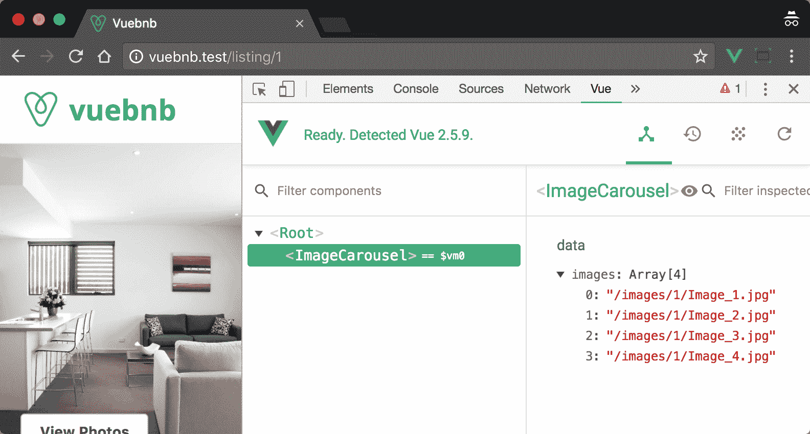图 6.2。Vue Devtools 显示 ImageCarousel 组件

# 更改图像

轮播图的目的是允许用户浏览一系列图像，而无需滚动页面。为了实现这一功能，我们需要创建一些 UI 控件。

但首先，让我们向我们的组件添加一个新的数据属性`index`，它将决定当前显示的图像。它将被初始化为 0，UI 控件稍后将能够增加或减少该值。

我们将把图像源绑定到位置为`index`的数组项。

`resources/assets/js/app.js`:

```php
Vue.component('image-carousel', { template: `<div class="image-carousel">
              
            </div>`,
  data() {
    return { images: [
        '/images/1/Image_1.jpg',
        '/images/1/Image_2.jpg',
        '/images/1/Image_3.jpg',
        '/images/1/Image_4.jpg'
      ], index: 0
    }
  }
});
```

页面刷新后，屏幕上看到的内容应该没有变化。但是，如果你将`index`的值初始化为`1`、`2`或`3`，当你重新打开模态窗口时，你会发现显示的是不同的图像：

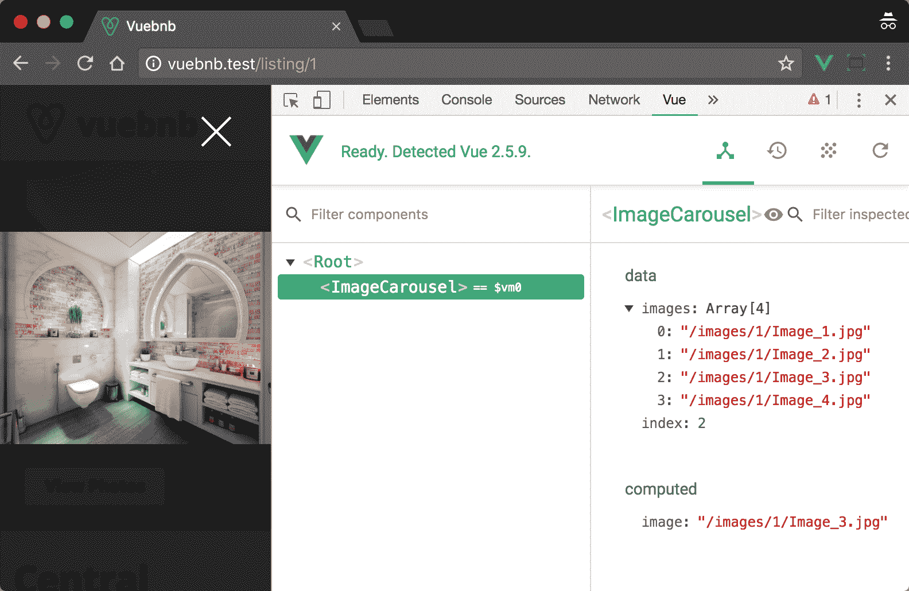图 6.3。将`index`设置为 2 会选择不同的 URL，显示不同的图像

# 计算属性

直接将逻辑写入我们的模板作为一个表达式是很方便的，例如`v-if="myExpression"`。但是对于无法定义为表达式的更复杂的逻辑，或者对于模板来说变得太冗长的情况怎么办呢？

在这种情况下，我们使用**计算属性**。这些属性是我们添加到 Vue 配置中的，可以被视为响应式方法，当依赖值发生变化时会重新运行。

在下面的示例中，我们在`computed`配置部分下声明了一个计算属性`message`。请注意，该函数依赖于`val`，也就是说，`message`的返回值将随着`val`的变化而不同。

当这个脚本运行时，Vue 将注意到`message`的任何依赖关系，并建立响应式绑定，这样，与普通方法不同，函数将在依赖关系发生变化时重新运行：

```php
<script>
  var app = new Vue({ el: '#app', data: { val: 1
    }, computed: {
      message() {
        return `The value is ${this.val}`
      }
    }   
  });

  setTimeout(function() { app.val = 2;
  }, 2000);
</script>
<div id="app">
  <!--Renders as "The value is 1"-->
  <!--After 2 seconds, re-renders as "The value is 2"-->
  {{ message }}
</div>
```

回到图像轮播，让我们通过将绑定到图像`src`的表达式抽象为计算属性，使模板更加简洁。

`resources/assets/js/app.js`:

```php
Vue.component('image-carousel', { template: `<div class="image-carousel">
              
            </div>`,
  data() { ... }, computed: {
    image() {
      return this.images[this.index];
    }
  }
});
```

# 组合组件

组件可以像标准 HTML 元素一样嵌套在其他组件中。例如，如果`component A`在其模板中声明`component B`，则`component B`可以是`component A`的子级：

```php
<div id="app">
  <component-a></component-a>
</div>
<script> Vue.component('component-a', { template: `
      <div>
        <p>Hi I'm component A</p>
        <component-b></component-b>
      </div>`
  }); Vue.component('component-b', { template: `<p>And I'm component B</p>`
  });

  new Vue({ el: '#app'
  }); </script>
```

这将呈现为：

```php
<div id="app">
  <div>
    <p>Hi I'm component A</p>
    <p>And I'm component B</p>
  </div>
</div>
```

# 注册范围

虽然一些组件设计用于在应用程序的任何地方使用，但其他组件可能具有更具体的目的。当我们使用 API 注册组件，即`Vue.component`时，该组件是*全局*注册的，并且可以在任何其他组件或实例中使用。

我们还可以通过在根实例或另一个组件的`components`选项中声明来*本地*注册组件：

```php
Vue.component('component-a', { template: `
    <div>
      <p>Hi I'm component A</p>
      <component-b></component-b>
    </div>`, components: {
    'component-b': { template: `<p>And I'm component B</p>`
```

```php
    }
  }
});
```

# 轮播控件

为了允许用户更改轮播中当前显示的图像，让我们创建一个新的组件`CarouselControl`。该组件将呈现为一个浮动在轮播上的箭头，并将响应用户的点击。我们将使用两个实例，因为将有一个左箭头和一个右箭头，用于减少或增加图像索引。

我们将在`ImageCarousel`组件中本地注册`CarouselControl`。`CarouselControl`模板将呈现为一个`i`标签，通常用于显示图标。轮播图标的一个很好的图标是 Font Awesome 的*chevron*图标，它是一个优雅的箭头形状。目前，我们还没有办法区分左右，所以现在，两个实例都将有一个朝左的图标。

`resources/assets/js/app.js`：

```php
Vue.component('image-carousel', { template: ` <div class="image-carousel">
      
      <div class="controls">
        <carousel-control></carousel-control>
        <carousel-control></carousel-control>
      </div>
    </div> `,
  data() { ... }, computed: { ... }, components: {
    'carousel-control': { template: `<i class="carousel-control fa fa-2x fa-chevron-left"></i>` }
  }
});
```

为了让这些控件在我们的图像轮播上漂亮地浮动，我们还会在我们的 CSS 文件中添加一些新的规则。

`resources/assets/css/style.css`：

```php
.image-carousel {
  height: 100%;
  margin-top: -12vh; position: relative;
  display: flex;
  align-items: center;
  justify-content: center;
}

.image-carousel .controls {
  position: absolute;
  width: 100%;
  display: flex;
  justify-content: space-between;
}

.carousel-control {
  padding: 1rem;
  color: #ffffff;
  opacity: 0.85 }

@media (min-width: 744px) {
  .carousel-control {
      font-size: 3rem;
  }
}
```

添加了该代码后，打开模态窗口查看我们迄今为止的工作成果：

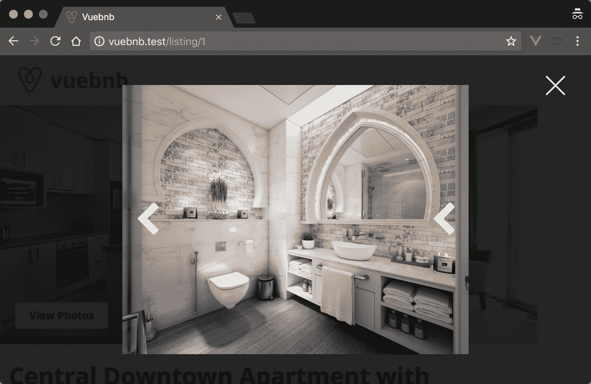图 6.4。添加到图像轮播的轮播控件

# 与组件通信

组件的一个关键方面是它们是可重用的，这就是为什么我们给它们自己的状态以使它们独立于应用程序的其余部分。但是，我们可能仍然希望发送数据，或者将其发送出去。组件有一个用于与应用程序的其他部分通信的接口，我们现在将进行探讨。

# 属性

我们可以通过自定义 HTML 属性*prop*向组件发送数据。我们还必须在组件的配置中的数组`props`中注册此自定义属性。在下面的示例中，我们创建了一个 prop，`title`：

```php
<div id="app">
  <my-component title="My component!"></my-component>
  <!-- Renders as <div>My component!</div> -->
</div>
<script> Vue.component('my-component', { template: '<div>{{ title }}</div>', props: ['title']
  });

  new Vue({ el: '#app'
  });
</script>
```

prop 可以像组件的任何数据属性一样使用：您可以在模板中插值，将其用于方法和计算属性等。但是，您不应该改变 prop 数据。将 prop 数据视为从另一个组件或实例*借用*的数据-只有所有者应该更改它。

属性被代理到实例中，就像数据属性一样，这意味着你可以在组件的代码中将属性称为`this.myprop`。一定要将您的属性名称设置为与数据属性不同，以避免冲突！

# 单向数据流

由于 prop 必须在使用组件的模板中声明，因此 prop 数据只能从父级传递到子级。这就是为什么您不应该改变 prop 的原因-因为数据是向下流动的，更改不会反映在父级中，因此您将拥有不同版本的应该是相同状态的内容。

如果您确实需要告诉所有者更改数据，那么有一个单独的接口用于从子级向父级传递数据，我们稍后会看到。

# 动态 prop

我们可以使用`v-bind`指令将数据动态绑定到组件。当父级数据发生变化时，它将自动流向子级。

在下面的示例中，根实例中`title`的值在两秒后以编程方式更新。此更改将自动流向`MyComponent`，后者将以响应方式重新呈现以显示新值：

```php
<div id="app">
  <my-component :title="title"></my-component>
  <!-- Renders initially as <div>Hello World</div> -->
  <!-- Re-renders after two seconds as <div>Goodbye World</div> -->
</div>
<script> Vue.component('my-component', { template: '<div>{{ title }}</div>', props: [ 'title' ]
  });

  var app = new Vue({ el: '#app', data: { title: 'Hello World'
    }
  });

  setTimeout(() => { app.title = 'Goodbye World'
  }, 2000); </script>
```

由于在模板中经常使用`v-bind`指令，您可以省略指令名称作为简写：`<div v-bind:title="title">`可以缩写为`<div :title="title">`。

# 图片 URL

当我们创建`ImageCarousel`时，我们硬编码了图像 URL。通过 props，我们现在有了一种机制，可以从根实例向组件发送动态数据。让我们将根实例数据属性`images`绑定到一个 prop，也叫`images`，在我们的`ImageCarousel`声明中。

`resources/views/app.blade.php`：

```php
<div class="modal-content">
  <image-carousel :images="images"></image-carousel>
</div>
```

现在，删除`ImageCarousel`组件中的数据属性`images`，并将`images`声明为 prop。

`resources/assets/js/app.js`：

```php
Vue.component('image-carousel', { props: ['images'],
  data() {
    return { index: 0
    }
  },
  ...
}
```

根实例现在将负责图像 URL 的状态，图像轮播组件将负责显示它们。

使用 Vue Devtools，我们可以检查图像轮播组件的状态，现在包括`images`作为 prop 值而不是数据值：

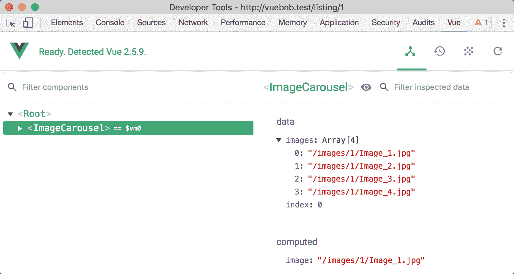图 6.5。图像 URL 是发送到 ImageCarousel 组件的 props

现在图像 URL 来自模型，我们可以访问其他列表路由，比如`/listing/2`，并再次在模态窗口中看到正确的图像显示。

# 区分轮播控件

`CarouselControl`组件应该有两种可能的状态：要么指向左，要么指向右。当用户点击时，前者将上升到可用图像，后者将下降。

这种状态不应该由内部确定，而应该从`ImageCarousel`传递下来。为此，让我们向`CarouselControl`添加一个 prop`dir`，它将采用一个字符串值，应该是`left`或`right`。

有了`dir`prop，我们现在可以将正确的图标绑定到`i`元素。这是通过一个计算属性完成的，它将 prop 的值附加到字符串`fa-chevron-`，结果要么是`fa-chevron-left`要么是`fa-chevron-right`。

`resources/assets/js/app.js`：

```php
Vue.component('image-carousel', { template: ` <div class="image-carousel">
      
      <div class="controls">
        <carousel-control dir="left"></carousel-control>
        <carousel-control dir="right"></carousel-control>
      </div>
    </div> `,
  ... components: {
    'carousel-control': { template: `<i :class="classes"></i>`, props: [ 'dir' ], computed: {
        classes() {
          return 'carousel-control fa fa-2x fa-chevron-' + this.dir;
        }
      } }
  }
} 
```

现在我们可以看到轮播控制图标正确指向：

图 6.6。轮播控制图标现在正确指向

# 自定义事件

我们的轮播控件显示得很好，但它们还没有做任何事情！当它们被点击时，我们需要它们告诉`ImageCarousel`要么增加要么减少它的`index`值，这将导致图像被更改。

动态 props 对于这个任务不起作用，因为 props 只能从父组件向子组件发送数据。当子组件需要向父组件发送数据时，我们该怎么办？

*自定义事件*可以从子组件发出，并由其父组件监听。为了实现这一点，我们在子组件中使用`$emit`实例方法，它将事件名称作为第一个参数，并为任何要随事件发送的数据附加任意数量的额外参数，例如`this.$emit('my-event', 'My event payload');`。

父组件可以在声明组件的模板中使用`v-on`指令来监听此事件。如果您使用方法处理事件，那么随事件发送的任何参数都将作为参数传递给此方法。

考虑这个例子，一个子组件`MyComponent`发出一个名为`toggle`的事件，告诉父组件，根实例，改变一个数据属性`toggle`的值：

```php
<div id="app">
  <my-component @toggle="toggle = !toggle"></my-component> {{ message }} </div>
<script> Vue.component('my-component', { template: '<div v-on:click="clicked">Click me</div>', methods: { clicked: function() {
        this.$emit('toggle');
      }
    }
  });

  new Vue({ el: '#app', data: { toggle: false
    }, computed: { message: function() {
        return this.toggle ? 'On' : 'Off';
      }
    }
  }); </script>
```

# 更改轮播图像

回到`CarouselControl`，让我们通过使用`v-on`指令和触发一个方法`clicked`来响应用户的点击。这个方法将反过来发出一个自定义事件`change-image`，其中将包括一个`-1`或`1`的有效负载，具体取决于组件的状态是`left`还是`right`。

就像`v-bind`一样，`v-on`也有一个简写。只需用`@`替换`v-on:`；例如，`<div @click="handler"></div>`相当于`<div v-on:click="handler"></div>`。

`resources/assets/js/app.js`：

```php
components: {
  'carousel-control': { template: `<i :class="classes" @click="clicked"></i>`, props: [ 'dir' ], computed: {
      classes() {
        return 'carousel-control fa fa-2x fa-chevron-' + this.dir;
      }
    }, methods: {
      clicked() {
        this.$emit('change-image', this.dir === 'left' ? -1 : 1);
      }
    }
  }
}
```

打开 Vue Devtools 到`Events`选项卡，并同时点击轮播控件。自定义事件将在此处记录，因此我们可以验证`change-image`是否被发出：

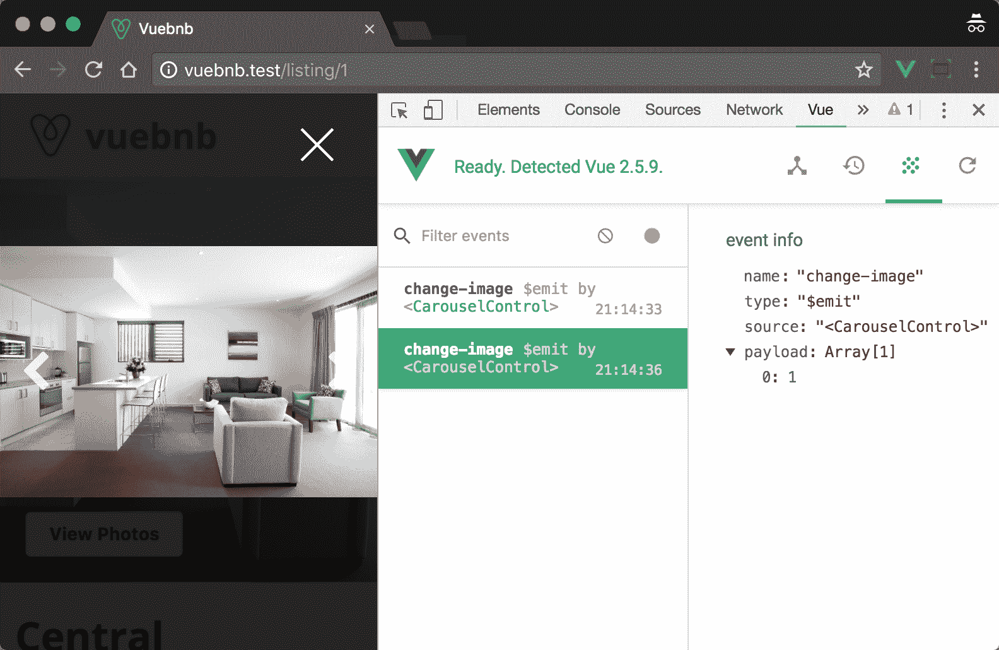图 6.7。屏幕截图显示自定义事件及其有效负载

`ImageCarousel`现在需要通过`v-on`指令监听`change-image`事件。该事件将由一个名为`changeImage`的方法处理，该方法将具有一个参数`val`，反映事件中发送的有效负载。然后，该方法将使用`val`来调整`index`的值，确保它在超出数组索引范围时循环到开始或结束。

`resources/assets/js/app.js`：

```php
Vue.component('image-carousel', { template: ` <div class="image-carousel">
      
      <div class="controls">
        <carousel-control 
 dir="left" 
 @change-image="changeImage" ></carousel-control>
        <carousel-control 
 dir="right" 
 @change-image="changeImage" ></carousel-control>
      </div>
    </div> `,
  ... methods: {
    changeImage(val) {
      let newVal = this.index + parseInt(val);
      if (newVal < 0) {
        this.index = this.images.length -1;
      } else if (newVal === this.images.length) {
        this.index = 0;
      } else {
        this.index = newVal;
      }
    }
  },
  ...
}
```

完成后，图像轮播将正常工作：

图 6.8。图像轮播在更改图像后的状态

# 单文件组件

**单文件组件**（**SFCs**）是具有`.vue`扩展名的文件，包含单个组件的完整定义，并可以导入到您的 Vue.js 应用程序中。SFC 使创建和使用组件变得简单，并带有各种其他好处，我们很快会探讨。

SFC 类似于 HTML 文件，但最多有三个根元素：

+   `template`

+   `script`

+   `style`

组件定义放在`script`标签内，除了以下内容，其余与任何其他组件定义完全相同：

+   它将导出一个 ES 模块

+   它将不需要`template`属性（或`render`函数；稍后会详细介绍）

组件的模板将在`template`标签内声明为 HTML 标记。这应该是一个从编写繁琐的模板字符串中解脱出来的好消息！

`style`标签是 SFC 独有的功能，可以包含组件所需的任何 CSS 规则。这主要有助于组织 CSS。

这是声明和使用单文件组件的示例。

`MyComponent.vue`：

```php
<template>
  <div id="my-component">{{ title }}</div>
</template>
<script> export default {
    data() { title: 'My Component'
    }
  }; </script>
<style> .my-component {
    color: red;
  } </style>
```

`app.js`：

```php
import 'MyComponent' from './MyComponent.vue';

new Vue({ el: '#app', components: { MyComponent }
});
```

# 转换

要在应用程序中使用单文件组件，只需像使用 ES 模块一样导入它。*.vue*文件不是有效的 JavaScript 模块文件。就像我们使用 Webpack Babel 插件将 ES2015 代码转译为 ES5 代码一样，我们必须使用*Vue Loader*将*.vue*文件转换为 JavaScript 模块。

Vue Loader 已经默认配置了 Laravel Mix，因此在这个项目中我们无需做其他操作；我们导入的任何 SFC 都会正常工作！

要了解有关 Vue Loader 的更多信息，请查看[`vue-loader.vuejs.org/`](https://vue-loader.vuejs.org/)上的文档。

# 将组件重构为 SFC

我们的`resource/assets/js/app.js`文件现在几乎有 100 行。如果我们继续添加组件，它将变得难以管理，因此现在是时候考虑拆分它了。

让我们从重构现有组件为 SFC 开始。首先，我们将创建一个新目录，然后创建`.vue`文件：

```php
$ mkdir resources/assets/components
$ touch resources/assets/components/ImageCarousel.vue
$ touch resources/assets/components/CarouselControl.vue
```

从`ImageCarousel.vue`开始，第一步是创建三个根元素。

`resources/assets/components/ImageCarousel.vue`：

```php
<template></template>
<script></script>
<style></style>
```

现在，我们将`template`字符串移入`template`标签中，将组件定义移入`script`标签中。组件定义必须导出为模块。

`resources/assets/components/ImageCarousel.vue`：

```php
<template>
  <div class="image-carousel">
    
    <div class="controls">
      <carousel-control 
        dir="left" 
        @change-image="changeImage" ></carousel-control>
      <carousel-control 
        dir="right" 
        @change-image="changeImage" ></carousel-control>
    </div>
  </div>
</template>
<script> export default { props: [ 'images' ],
    data() {
      return { index: 0
      }
    }, computed: {
      image() {
        return this.images[this.index];
      }
    }, methods: {
      changeImage(val) {
        let newVal = this.index + parseInt(val);
        if (newVal < 0) {
          this.index = this.images.length -1;
        } else if (newVal === this.images.length) {
          this.index = 0;
        } else {
          this.index = newVal;
        }
      }
    }, components: {
      'carousel-control': { template: `<i :class="classes" @click="clicked"></i>`, props: [ 'dir' ], computed: {
          classes() {
            return 'carousel-control fa fa-2x fa-chevron-' + this.dir;
          }
        }, methods: {
          clicked() {
            this.$emit('change-image', this.dir === 'left' ? -1 : 1);
          }
        }
      }
    }
  } </script>
<style></style>
```

现在我们可以将此文件导入到我们的应用程序中，并在根实例中本地注册它。如前所述，Vue 能够自动在 kebab-case 组件名称和 Pascal-case 组件名称之间切换。这意味着我们可以在`component`配置中使用对象简写语法，Vue 将正确解析它。

`resources/assets/js/app.js`：

```php
import ImageCarousel from '../components/ImageCarousel.vue';

var app = new Vue({
  ... components: { ImageCarousel }
});
```

在继续之前，请确保删除`app.js`中原始`ImageCarousel`组件定义的任何剩余代码。

# CSS

SFC 允许我们向组件添加样式，有助于更好地组织我们的 CSS 代码。让我们将为图像轮播创建的 CSS 规则移入这个新 SFC 的`style`标签中：

```php
<template>...</template>
<script>...</script>
<style> .image-carousel {
    height: 100%;
    margin-top: -12vh; position: relative;
    display: flex;
    align-items: center;
    justify-content: center;
  }

  .image-carousel img {
    width: 100%;
  }

  .image-carousel .controls {
    position: absolute;
    width: 100%;
    display: flex;
    justify-content: space-between;
  } </style>
```

项目构建完成后，你应该发现它仍然是一样的。然而，有趣的是，CSS 最终出现在了构建中的位置。如果你检查`public/css/style.css`，你会发现它不在那里。

它实际上包含在 JavaScript 捆绑包中作为一个字符串：

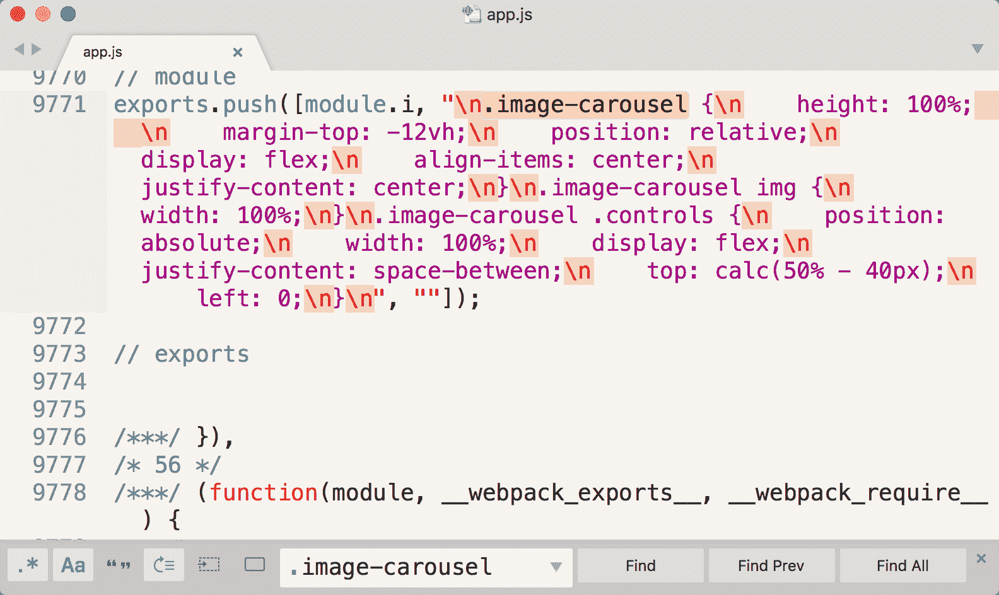图 6.9. CSS 存储为 JavaScript 捆绑文件中的字符串

要使用它，Webpack 的引导代码将在应用程序运行时将此 CSS 字符串内联到文档的头部：

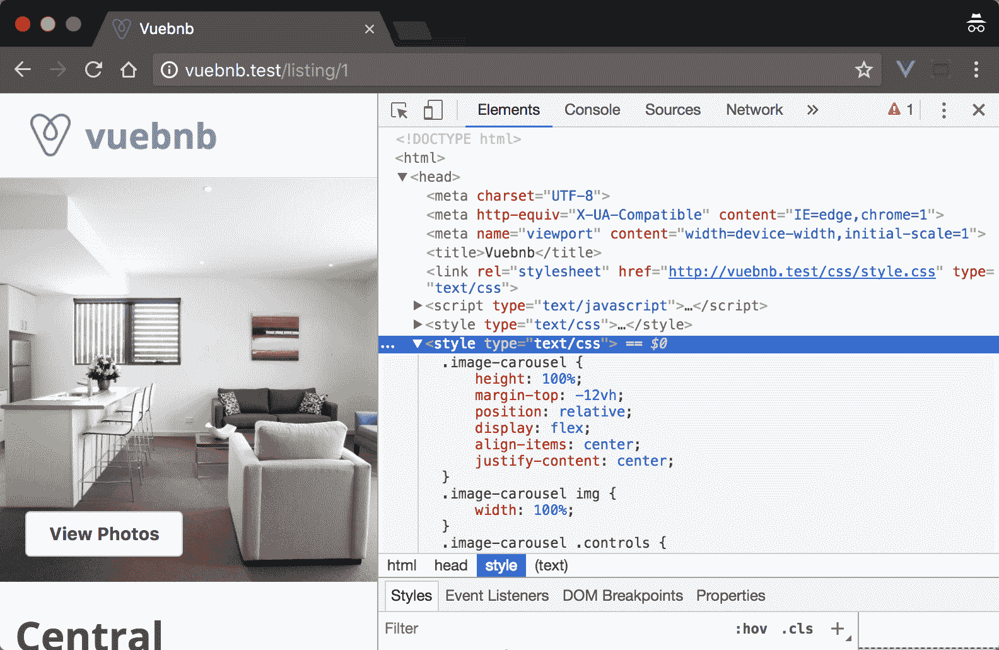图 6.10. 文档头中的内联 CSS

内联 CSS 实际上是 Vue Loader 的默认行为。但是，我们可以覆盖这一行为，让 Webpack 将 SFC 样式写入它们自己的文件中。在 Mix 配置的底部添加以下内容。

`webpack.mix.js`：

```php
mix.options({ extractVueStyles: 'public/css/vue-style.css'
});
```

现在，一个额外的文件`public/css/vue-style.css`将被输出到构建中：

图 6.11. 包括单文件组件样式的 Webpack 输出

我们需要在主样式表之后在视图中加载这个新文件。

`resources/views/app.blade.php`：

```php
<head> ... <link rel="stylesheet" href="{{ asset('css/style.css') }}" type="text/css">
  <link rel="stylesheet" href="{{ asset('css/vue-style.css') }}" type="text/css"> ... </head>
```

# CarouselControl

现在让我们将`CarouselControl`组件抽象成一个 SFC，并将`resources/assets/css/style.css`中的任何相关 CSS 规则移动过来。

`resources/assets/components/CarouselControl.vue`：

```php
<template>
  <i :class="classes" @click="clicked"></i>
</template>
<script> export default { props: [ 'dir' ], computed: {
      classes() {
        return 'carousel-control fa fa-2x fa-chevron-' + this.dir;
      }
    }, methods: {
      clicked() {
        this.$emit('change-image', this.dir === 'left' ? -1 : 1);
      }
    }
  } </script>
<style> .carousel-control {
    padding: 1rem;
    color: #ffffff;
    opacity: 0.85 }

  @media (min-width: 744px) {
    .carousel-control {
      font-size: 3rem;
    }
  } </style>
```

现在，这个文件可以被`ImageCarousel`组件导入。

`resources/assets/components/ImageCarousel.vue`：

```php
<template>...</style>
<script> import CarouselControl from '../components/CarouselControl.vue';

  export default {
    ... components: { CarouselControl }
  } </script>
<style>...</style>
```

完成后，我们现有的组件已经重构为 SFC。这并没有对我们应用程序的功能产生明显的影响（尽管稍微快一点，我稍后会解释），但随着我们的开发继续，这将使开发变得更容易。

# 内容分发

想象一下，你将要构建一个基于组件的 Vue.js 应用程序，它的结构类似于以下结构：

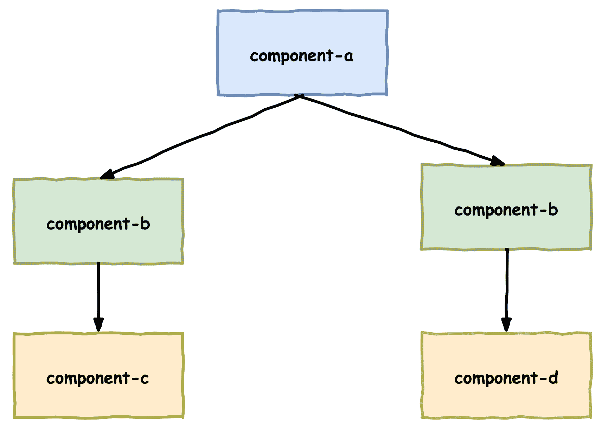图 6.12. 基于组件的 Vue.js 应用程序

请注意，在上图的左分支中，`ComponentC`由`ComponentB`声明。然而，在右分支中，`ComponentD`由`ComponentB`的另一个实例声明。

根据你目前对组件的了解，如果`ComponentB`必须声明两个不同的组件，你会如何制作`ComponentB`的模板？也许它会包括一个`v-if`指令，根据从`ComponentA`传递下来的某个变量来使用`ComponentC`或`ComponentD`。这种方法可以工作，但是它会使`ComponentB`非常不灵活，在应用程序的其他部分限制了它的可重用性。

# 插槽

到目前为止，我们已经学到了组件的内容是由它自己的模板定义的，而不是由它的父级定义的，所以我们不会期望以下内容能够工作：

```php
<div id="app">
  <my-component>
    <p>Parent content</p>
  </my-component>
</div>
```

但是，如果`MyComponent`在它的模板中有一个*插槽*，它将起作用。插槽是组件内的分发出口，使用特殊的`slot`元素定义：

```php
Vue.component('my-component', { template: `
    <div>
      <slot></slot>
      <p>Child content</p>
    </div>`
});

new Vue({ el: '#app'
});
```

这将呈现为：

```php
<div id="app">
  <div>
    <p>Parent content</p>
    <p>Child content</p>
  </div>
</div>
```

如果`ComponentB`在它的模板中有一个插槽，就像这样：

```php
Vue.component('component-b', { 
 template: '<slot></slot>'
}); 
```

我们可以解决刚才提到的问题，而不必使用繁琐的`v-for`：

```php
<component-a>
  <component-b>
    <component-c></component-c>
  </component-b>
  <component-b>
    <component-d></component-d>
  </component-b>
</component-a>
```

重要的是要注意，在父模板中声明的组件内的内容是在父模板的范围内编译的。尽管它在子组件内呈现，但它无法访问子组件的任何数据。以下示例应该能够区分这一点：

```php
<div id="app">
  <my-component>
    <!--This works-->
    <p>{{ parentProperty }}</p>

    <!--This does not work. childProperty is undefined, as this content--> 
    <!--is compiled in the parent's scope-->
    <p>{{ childProperty }} </my-component>
</div>
<script> Vue.component('my-component', { template: `
      <div>
        <slot></slot>
        <p>Child content</p>
      </div>`,
    data() {
      return { childProperty: 'World'
      }
    }
  });

  new Vue({ el: '#app', data: { parentProperty: 'Hello'
    }
  }); </script>
```

# 模态窗口

我们根 Vue 实例中剩下的大部分功能都涉及模态窗口。让我们将这些抽象成一个单独的组件。首先，我们将创建新的组件文件：

```php
$ touch resources/assets/components/ModalWindow.vue
```

现在，我们将把视图中的标记移到组件中。为了确保轮播图与模态窗口保持解耦，我们将在标记中的`ImageCarousel`声明替换为一个插槽。

`resources/assets/components/ModalWindow.vue`：

```php
<template>
  <div id="modal" :class="{ show : modalOpen }">
    <button @click="modalOpen = false" class="modal-close">&times;</button>
    <div class="modal-content">
      <slot></slot>
    </div>
  </div>
</template>
<script></script>
<style></style>
```

现在，我们可以在视图中刚刚创建的洞中声明一个`ModalWindow`元素，并将`ImageCarousel`作为插槽的内容。

`resources/views/app.blade.php`：

```php
<div id="app">
  <div class="header">...</div>
  <div class="container">...</div>
  <modal-window>
    <image-carousel :images="images"></image-carousel>
  </modal-window>
</div>
```

我们现在将从根实例中移动所需的功能，并将其放置在`script`标签内。

`resources/assets/components/ModalWindow.vue`：

```php
<template>...</template>
<script> export default {
    data() {
      return { modalOpen: false
      }
    }, methods: {
      escapeKeyListener(evt) {
        if (evt.keyCode === 27 && this.modalOpen) {
          this.modalOpen = false;
        }
      }
    }, watch: {
      modalOpen() {
        var className = 'modal-open';
        if (this.modalOpen) { document.body.classList.add(className);
        } else { document.body.classList.remove(className);
        }
      }
    },
    created() { document.addEventListener('keyup', this.escapeKeyListener);
    },
    destroyed() { document.removeEventListener('keyup', this.escapeKeyListener);
    },
  } </script>
<style></style>
```

接下来在入口文件中导入`ModalWindow`。

`resources/assets/js/app.js`：

```php
import ModalWindow from '../components/ModalWindow.vue';

var app = new Vue({ el: '#app', data: Object.assign(model, { headerImageStyle: {
      'background-image': `url(${model.images[0]})`
    }, contracted: true
  }), components: { ImageCarousel, ModalWindow }
});
```

最后，让我们将任何与模态相关的 CSS 规则也移入 SFC 中：

```php
<template>...</template>
<script>...</script>
<style> #modal {
    display: none;
    position: fixed;
    top: 0;
    right: 0;
    bottom: 0;
    left: 0;
    z-index: 2000;
    background-color: rgba(0,0,0,0.85);
  }

  #modal.show {
    display: block;
  }

  body.modal-open {
    overflow: hidden;
    position: fixed;
  }

  .modal-close {
    cursor: pointer;
    position: absolute;
    right: 0;
    top: 0;
    padding: 0px 28px 8px;
    font-size: 4em;
    width: auto;
    height: auto;
    background: transparent;
    border: 0;
    outline: none;
    color: #ffffff;
    z-index: 1000;
    font-weight: 100;
    line-height: 1;
  }

  .modal-content {
    height: 100%;
    max-width: 105vh;
    padding-top: 12vh;
    margin: 0 auto;
    position: relative;
  } </style>
```

项目构建完成后，您会注意到模态窗口不会打开。我们将在下一节中修复这个问题。

如果您检查 Vue Devtools，您会看到现在组件层次结构中有一个`ModalWindow`组件：

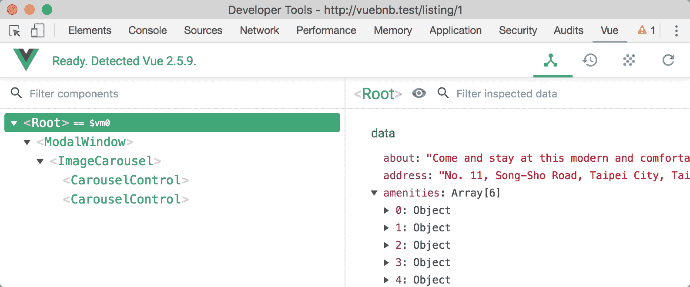图 6.13。Vue Devtools 显示组件层次结构我们在 Vue Devtools 中的应用程序表示略有误导。它使得`ImageCarousel`看起来是`ModalWindow`的子组件。即使`ImageCarousel`由于插槽而在`ModalWindow`内部呈现，但这些组件实际上是同级的！

# Refs

在初始状态下，模态窗口使用`display: none` CSS 规则隐藏。要打开模态窗口，用户必须点击标题图像。然后，点击事件侦听器将设置根实例数据属性`modelOpen`为 true，这将反过来向模态窗口添加一个类，以覆盖`display: none`为`display: block`。

然而，在重构之后，`modalOpen`已经移动到`ModalWindow`组件中，连同其余的模态逻辑，因此模态打开功能目前已经失效。修复这个问题的一种可能的方法是让根实例管理模态的打开/关闭状态，将逻辑移回根实例。然后我们可以使用 prop 来通知模态何时需要打开。当模态关闭时（这发生在模态组件的范围内，关闭按钮所在的地方），它会向根实例发送事件以更新状态。

这种方法可以工作，但不符合使我们的组件解耦且可重用的精神；模态组件应该管理自己的状态。那么，我们如何才能让模态保持其状态，但让根实例（父级）改变它？事件不起作用，因为事件只能向上流动，而不能向下流动。

`ref`是一个特殊的属性，允许您直接引用子组件的数据。要使用它，声明`ref`属性并为其分配一个唯一值，例如`imagemodal`。

`resources/views/app.blade.php`：

```php
<modal-window ref="imagemodal"> ... </modal-window>
```

现在根实例可以通过`$refs`对象访问特定的`ModalWindow`组件数据。这意味着我们可以在根实例方法中更改`modalOpen`的值，就像我们可以从`ModalWindow`内部一样。

`resources/assets/js/app.js`：

```php
var app = new Vue({
  ... methods: {
    openModal() {
      this.$refs.imagemodal.modalOpen = true;
    },
  }
});
```

现在我们可以在标题图像的点击侦听器中调用`openModal`方法，从而恢复模态打开功能。

`resources/views/app.blade.php`：

```php
<div id="app">
  <div class="header">
    <div class="header-img" :style="headerImageStyle" @click="openModal">
      <button class="view-photos">View Photos</button>
    </div>
  </div> ... </div>
```

当使用组件的正常交互方法，即 prop 和事件，足以满足需求时，使用`ref`是一种反模式。`ref`通常只用于与页面正常流程之外的元素进行通信，就像模态窗口一样。

# 标题图像

现在让我们将标题图像抽象成一个组件。首先，创建一个新的`.vue`文件：

```php
$ touch resources/assets/components/HeaderImage.vue
```

现在移动到标记、数据和 CSS。注意以下修改：

+   必须发出事件`header-clicked`。这将用于打开模态窗口

+   图像 URL 作为 prop 传递，`image-url`，然后通过计算属性转换为内联样式规则

`resource/assets/components/HeaderImage.vue`：

```php
<template>
  <div class="header">
    <div class="header-img" 
      :style="headerImageStyle" 
      @click="$emit('header-clicked')"
    >
      <button class="view-photos">View Photos</button>
    </div>
  </div>
</template>
<script> export default { computed: {
      headerImageStyle() {
        return {
          'background-image': `url(${this.imageUrl})`
        };
      }
    }, props: [ 'image-url' ]
  } </script>
<style> .header {
    height: 320px;
  }

  .header .header-img {
    background-repeat: no-repeat;
    -moz-background-size: cover;
    -o-background-size: cover;
    background-size: cover;
    background-position: 50% 50%;
    background-color: #f5f5f5;
    height: 100%;
    cursor: pointer;
    position: relative;
  }

  .header .header-img button {
    font-size: 14px;
    padding: 7px 18px;
    color: #484848;
    line-height: 1.43;
    background: #ffffff;
    font-weight: bold;
    border-radius: 4px;
    border: 1px solid #c4c4c4;
  }

  .header .header-img button.view-photos {
    position: absolute;
    bottom: 20px;
    left: 20px;
  } </style>
```

一旦在`resources/assets/js/app.js`中导入了这个组件，就在主模板中声明它。确保绑定`image-url`prop 并处理点击事件。

`resources/views/app.blade.php`：

```php
<div id="app">
  <header-image 
    :image-url="images[0]" 
    @header-clicked="openModal" ></header-image>
  <div class="container">...</div> <modal-window>...</modal-window>
</div>
```

# 功能列表

让我们继续将 Vuebnb 重构为组件，并将设施和价格列表抽象出来。这些列表具有类似的目的和结构，因此创建一个单一的通用组件是有意义的。

让我们回顾一下当前列表的标记是什么样子的。

`resources/views/app.blade.php`：

```php
<div class="lists">
  <hr>
  <div class="amenities list">
    <div class="title"><strong>Amenities</strong></div>
    <div class="content">
      <div class="list-item" v-for="amenity in amenities">
        <i class="fa fa-lg" :class="amenity.icon"></i>
        <span>@{{ amenity.title }}</span>
      </div>
    </div>
  </div>
  <hr>
  <div class="prices list">
    <div class="title"><strong>Prices</strong></div>
    <div class="content">
      <div class="list-item" v-for="price in prices"> @{{ price.title }}: <strong>@{{ price.value }}</strong>
      </div>
    </div>
  </div>
</div>
```

两个列表之间的主要区别在于`<div class="content">...</div>`部分，因为在每个列表中显示的数据结构略有不同。设施有一个图标和一个标题，而价格有一个标题和一个值。我们将在这一部分使用插槽，以允许父级自定义每个内容。

但首先，让我们创建新的`FeatureList`组件文件：

```php
$ touch resources/assets/components/FeatureList.vue
```

我们将一个列表的标记移到其中，使用插槽替换列表内容。我们还将为标题添加一个 prop，并移入任何与列表相关的 CSS。

`resources/assets/components/FeatureList.vue`:

```php
<template>
  <div>
    <hr>
    <div class="list">
      <div class="title"><strong>{{ title }}</strong></div>
      <div class="content">
        <slot></slot>
      </div>
    </div>
  </div>
</template>
<script> export default { props: ['title']
  } </script>
<style> hr {
    border: 0;
    border-top: 1px solid #dce0e0;
  }
  .list {
    display: flex;
    flex-wrap: nowrap;
    margin: 2em 0;
  }

  .list .title {
    flex: 1 1 25%;
  }

  .list .content {
    flex: 1 1 75%;
    display: flex;
    flex-wrap: wrap;
  }

  .list .list-item {
    flex: 0 0 50%;
    margin-bottom: 16px;
  }

  .list .list-item > i {
    width: 35px;
  }

  @media (max-width: 743px) {
    .list .title {
      flex: 1 1 33%;
    }

    .list .content {
      flex: 1 1 67%;
    }

    .list .list-item {
      flex: 0 0 100%;
    }
  } </style>
```

继续将`FeatureList`导入`resources/assets/js/app.js`，并将其添加到本地注册的组件中。现在我们可以在主模板中使用`FeatureList`，每个列表都有一个单独的实例。

`resources/views/app.blade.php`:

```php
<div id="app"> ... <div class="container"> ... <div class="lists">
      <feature-list title="Amenities">
        <div class="list-item" v-for="amenity in amenities">
          <i class="fa fa-lg" :class="amenity.icon"></i>
          <span>@{{ amenity.title }}</span>
        </div>
      </feature-list>
      <feature-list title="Prices">
        <div class="list-item" v-for="price in prices"> @{{ price.title }}: <strong>@{{ price.value }}</strong>
        </div>
      </feature-list>
    </div>
  </div>
</div>
```

# 作用域插槽

`FeatureList`组件可以工作，但相当薄弱。大部分内容都通过插槽传递，因此似乎父级做了太多的工作，而子级做得太少。鉴于在组件的两个声明中都有重复的代码（`<div class="list-item" v-for="...">`），最好将这些代码委托给子级。

为了使我们的组件模板更加灵活，我们可以使用*作用域插槽*而不是常规插槽。作用域插槽允许您将*模板*传递给插槽，而不是传递渲染的元素。当这个模板在父级中声明时，它将可以访问子级提供的任何 props。

例如，一个带有作用域插槽的组件`child`可能如下所示：

```php
<div>
  <slot my-prop="Hello from child"></slot>
</div>
```

使用这个组件的父级将声明一个`template`元素，其中将有一个命名别名对象的`slot-scope`属性。在子级模板中添加到插槽的任何 props 都可以作为别名对象的属性使用：

```php
<child>
  <template slot-scope="props">
    <span>Hello from parent</span>
    <span>{{ props.my-prop }}</span>
  </template>
</child>
```

这将呈现为：

```php
<div>
  <span>Hello from parent</span>
  <span>Hello from child</span>
</div>
```

让我们通过包含一个带有`FeatureList`组件的作用域插槽的步骤。目标是能够将列表项数组作为 prop 传递，并让`FeatureList`组件对它们进行迭代。这样，`FeatureList`将拥有任何重复的功能。然后父级将提供一个模板来定义每个列表项的显示方式。

`resources/views/app.blade.php`:

```php
<div class="lists">
  <feature-list title="Amenities" :items="amenities">
    <!--template will go here-->
  </feature-list>
  <feature-list title="Prices" :items="prices">
    <!--template will go here-->
  </feature-list>   
</div>
```

现在专注于`FeatureList`组件，按照以下步骤操作：

1.  在配置对象的 props 数组中添加`items`

1.  `items`将是一个我们在`<div class="content">`部分内部迭代的数组。

1.  在循环中，`item`是任何特定列表项的别名。我们可以创建一个插槽，并使用`v-bind="item"`将该列表项绑定到插槽。（我们以前没有使用过没有参数的`v-bind`，但这将整个对象的属性绑定到元素。这对于设施和价格对象具有不同属性的情况很有用，现在我们不必指定它们。）

`resources/assets/components/FeatureList.vue`:

```php
<template>
  <div>
    <hr>
    <div class="list">
      <div class="title"><strong>{{ title }}</strong></div>
      <div class="content">
        <div class="list-item" v-for="item in items">
          <slot v-bind="item"></slot>
        </div>
      </div>
    </div>
  </div>
</template>
<script> export default { props: ['title', 'items']
  } </script>
<style>...</style>
```

现在我们将回到我们的视图。让我们先处理设施列表：

1.  在`FeatureList`声明中声明一个`template`元素。

1.  模板必须包含`slot-scope`属性，我们将其分配给一个别名`amenity`。这个别名允许我们访问作用域 props。

1.  在模板中，我们可以使用与以前完全相同的标记来显示我们的设施列表项。

`resources/views/app.blade.php`:

```php
<feature-list title="Amenities" :items="amenities">
  <template slot-scope="amenity">
    <i class="fa fa-lg" :class="amenity.icon"></i>
    <span>@{{ amenity.title }}</span>
  </template>
</feature-list>
```

这是包含价格的完整主模板。

`resources/views/app.blade.php`:

```php
<div id="app"> ... <div class="container"> ... <div class="lists">
      <feature-list title="Amenities" :items="amenities">
        <template slot-scope="amenity">
          <i class="fa fa-lg" :class="amenity.icon"></i>
          <span>@{{ amenity.title }}</span>
        </template>
      </feature-list>
      <feature-list title="Prices" :items="prices">
        <template slot-scope="price"> @{{ price.title }}: <strong>@{{ price.value }}</strong>
        </template>
      </feature-list>
    </div>
  </div>
</div>
```

尽管这种方法的标记与以前一样多，但它已经将更常见的功能委托给了组件，这使得设计更加健壮。

# 可展开的文本

我们在第二章中创建了功能，*原型 Vuebnb，你的第一个 Vue.js 项目*，允许关于文本在页面加载时部分收缩，并通过点击按钮展开到完整长度。让我们也将这个功能抽象成一个组件：

```php
$ touch resources/assets/components/ExpandableText.vue
```

将所有标记、配置和 CSS 移入新组件。请注意，我们在文本内容中使用了一个插槽。

`resources/assets/components/ExpandableText.vue`：

```php
<template>
  <div>
    <p :class="{ contracted: contracted }">
      <slot></slot>
    </p>
    <button v-if="contracted" class="more" @click="contracted = false"> + More
    </button>
  </div>
</template>
<script> export default {
    data() {
      return { contracted: true
      }
    }
  } </script>
<style> p {
    white-space: pre-wrap;
  }

  .contracted {
    height: 250px;
    overflow: hidden;
  } .about button.more {
    background: transparent;
    border: 0;
    color: #008489;
    padding: 0;
    font-size: 17px;
 font-weight: bold;
  } .about button.more:hover, 
 .about button.more:focus, 
 .about button.more:active {
    text-decoration: underline;
    outline: none;
  } </style>
```

一旦你在`resources/assets/js/app.js`中导入了这个组件，在主模板中声明它，记得在插槽中插入`about`数据属性。

`resource/views/app.blade.php`：

```php
<div id="app">
  <header-image>...</header-image>
  <div class="container">
    <div class="heading">...</div>
    <hr>
    <div class="about">
      <h3>About this listing</h3>
      <expandable-text>@{{ about }}</expandable-text>
    </div>
    ... </div>
</div>
```

做到这一点后，Vuebnb 客户端应用的大部分数据和功能都已经被抽象成了组件。让我们看看`resources/assets/js/app.js`，看看它变得多么简洁！

`resources/assets/js/app.js`：

```php
...

import ImageCarousel from '../components/ImageCarousel.vue';
import ModalWindow from '../components/ModalWindow.vue';
import FeatureList from '../components/FeatureList.vue';
import HeaderImage from '../components/HeaderImage.vue';
import ExpandableText from '../components/ExpandableText.vue';

var app = new Vue({ el: '#app', data: Object.assign(model, {}), components: { ImageCarousel, ModalWindow, FeatureList, HeaderImage, ExpandableText }, methods: {
    openModal() {
      this.$refs.imagemodal.modalOpen = true;
    }
  }
});
```

# 虚拟 DOM

现在让我们改变方向，讨论 Vue 如何渲染组件。看看这个例子：

```php
Vue.component('my-component', { template: '<div id="my-component">My component</div>'
});
```

为了让 Vue 能够将这个组件渲染到页面上，它将首先使用内部模板编译器库将模板字符串转换为 JavaScript 对象：

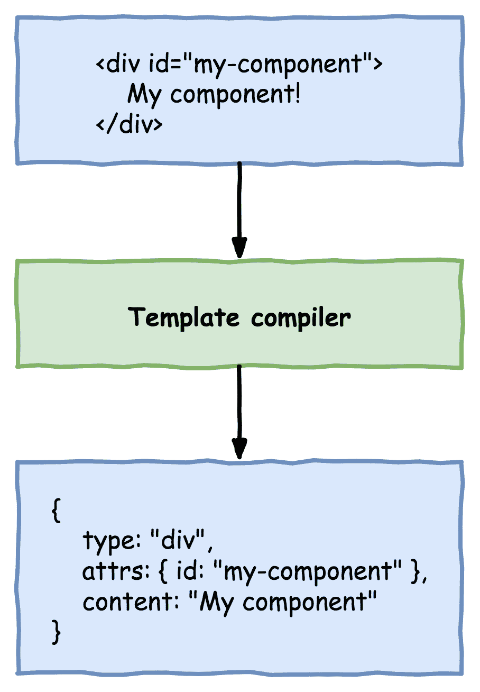图 6.14。模板编译器如何将模板字符串转换为对象

一旦模板被编译，任何状态或指令都可以很容易地应用。例如，如果模板包括一个`v-for`，可以使用简单的 for 循环来复制节点并插入正确的变量。

之后，Vue 可以与 DOM API 交互，将页面与组件的状态同步。

# 渲染函数

与为组件提供字符串模板不同，你可以提供一个`render`函数。即使不理解语法，你可能也能从以下例子中看出，`render`函数生成了一个与前面例子中的字符串模板在语义上等价的模板。两者都定义了一个带有`id`属性为`my-component`的`div`，并且内部文本为`My component`：

```php
Vue.component('my-component'</span>, {
  render(createElement) {
    createElement('div', {attrs:{id:'my-component'}}, 'My component');
    // Equivalent to <div id="my-component">My component</div>
  }
})
```

渲染函数更高效，因为它们不需要 Vue 首先编译模板字符串。不过，缺点是，编写渲染函数不像标记语法那样简单或表达性强，一旦你有了一个大模板，将会很难处理。

# Vue Loader

如果我们能够在开发中创建 HTML 标记模板，然后让 Vue 的模板编译器在构建步骤中将它们转换为`render`函数，那将是两全其美的。

这正是当 Webpack 通过*Vue Loader*转换它们时发生在单文件组件中的情况。看一下下面的 JavaScript 捆绑包片段，你可以看到 Webpack 在转换和捆绑`ImageCarousel`组件后的情况：

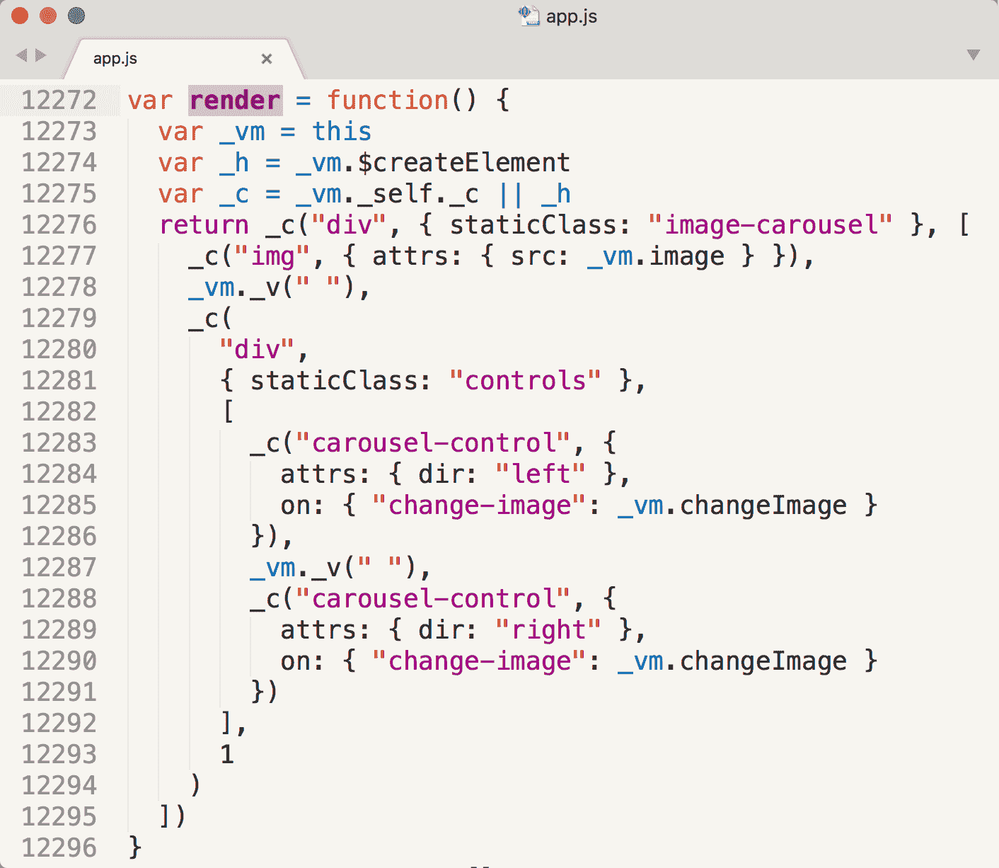图 6.15。捆绑文件中的 image-carousel 组件

# 将主模板重构为单文件组件

我们应用的根实例的模板是*app*视图中`#app`元素内的内容。这样的 DOM 模板需要 Vue 模板编译器，就像任何字符串模板一样。

如果我们能够将这个 DOM 模板抽象成一个 SFC，那么我们所有的前端应用模板都将被构建为`render`函数，并且不需要在运行时调用模板编译器。

让我们为主模板创建一个新的 SFC，并将其命名为`ListingPage`，因为这部分应用是我们的列表页面：

```php
$ touch resources/assets/components/ListingPage.vue
```

我们将主模板、根配置和任何相关的 CSS 移到这个组件中。注意以下内容：

+   我们需要将模板放在一个包装的`div`中，因为组件必须有一个单一的根元素

+   现在我们可以删除`@`转义，因为这个文件不会被 Blade 处理

+   现在组件与我们创建的其他组件相邻，所以确保更改导入的相对路径

`resource/assets/components/ListingPage.vue`：

```php
<template>
  <div>
    <header-image 
      :image-url="images[0]" 
      @header-clicked="openModal" ></header-image>
    <div class="container">
      <div class="heading">
        <h1>{{ title }}</h1>
        <p>{{ address }}</p>
      </div>
      <hr>
      <div class="about">
        <h3>About this listing</h3>
        <expandable-text>{{ about }}</expandable-text>
      </div>
      <div class="lists">
        <feature-list title="Amenities" :items="amenities">
          <template slot-scope="amenity">
            <i class="fa fa-lg" :class="amenity.icon"></i>
            <span>{{ amenity.title }}</span>
          </template>
        </feature-list>
        <feature-list title="Prices" :items="prices">
          <template slot-scope="price"> {{ price.title }}: <strong>{{ price.value }}</strong>
          </template>
        </feature-list>
      </div>
    </div>
    <modal-window ref="imagemodal">
      <image-carousel :images="images"></image-carousel>
    </modal-window>
  </div>
</template>
<script> import { populateAmenitiesAndPrices } from '../js/helpers';

  let model = JSON.parse(window.vuebnb_listing_model); model = populateAmenitiesAndPrices(model);

  import ImageCarousel from './ImageCarousel.vue';
  import ModalWindow from './ModalWindow.vue';
  import FeatureList from './FeatureList.vue';
  import HeaderImage from './HeaderImage.vue';
  import ExpandableText from './ExpandableText.vue';

  export default {
    data() {
      return Object.assign(model, {});
    }, components: { ImageCarousel, ModalWindow, FeatureList, HeaderImage, ExpandableText }, methods: {
      openModal() {
        this.$refs.imagemodal.modalOpen = true;
      }
    }
  } </script>
<style> .about {
    margin: 2em 0;
  }

  .about h3 {
    font-size: 22px;
  } </style>
```

# 使用渲染函数挂载根级组件

现在我们主模板中的挂载元素将是空的。我们需要声明`Listing`组件，但我们不想在视图中这样做。

`resources/views/app.blade.php`：

```php
<body>
<div id="toolbar">
  
  <h1>vuebnb</h1>
</div>
<div id="app">
  <listing></listing>
</div>
<script src="{{ asset('js/app.js') }}"></script>
</body>
```

如果我们这样做，就无法完全消除应用中的所有字符串和 DOM 模板，所以我们将保持挂载元素为空。

`resources/views/app.blade.php`：

```php
... <div id="app"></div> ...
```

我们现在可以在我们的根实例中声明`Listing`并使用渲染函数。

`resources/assets/js/app.js`：

```php
import "core-js/fn/object/assign";
import Vue from 'vue';

import ListingPage from '../components/ListingPage.vue';

var app = new Vue({ el: '#app', render: h => h(ListingPage)
});
```

为了避免走神，我不会在这里解释`render`函数的语法，因为这是我们在整本书中唯一要编写的函数。如果您想了解更多关于`render`函数的信息，请查看 Vue.js 文档[`vuejs.org/`](https://vuejs.org/)。

现在 Vuebnb 不再使用字符串或 DOM 模板，我们不再需要模板编译器功能。有一个特殊的 Vue 构建可以使用，不包括它！

# Vue.js 构建

运行 Vue.js 有许多不同的环境和用例。在一个项目中，您可能直接在浏览器中加载 Vue，在另一个项目中，您可能在 Node.js 服务器上加载它，以进行服务器渲染。因此，提供了不同的 Vue *构建*，以便您可以选择最合适的一个。

在 Vue NPM 包的*dist*文件夹中，我们可以看到八个不同的 Vue.js 构建：

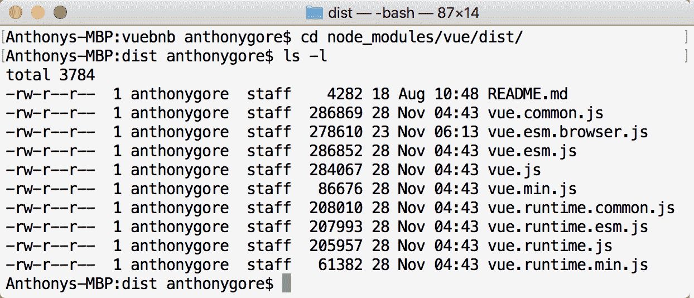图 6.16。node_modules/vue/dist 文件夹中的各种构建

Vue.js 网站提供了一个表格来解释这八个不同的构建：

|  | UMD | CommonJS | ES Module |
| --- | --- | --- | --- |
| **完整** | vue.js | vue.common.js | vue.esm.js |
| **仅运行时** | vue.runtime.js | vue.runtime.common.js | vue.runtime.esm.js |
| **完整（生产环境）** | vue.min.js | - | - |
| **仅运行时（生产环境）** | vue.runtime.min.js | - | - |

# 模块系统

表格的列将构建分类为*UMD*、*CommonJS*或*ES Module*。我们在第五章中讨论了 CommonJS 和 ES 模块，但我们没有提到**UMD**（**通用模块定义**）。关于 UMD，您需要知道的主要是它是另一种模块模式，并且在浏览器中运行良好。如果您直接在`script`标签中链接到 Vue，UMD 就是最佳选择。

# 生产构建

表格的行分为两种类型：完整或运行时，以及带有或不带有生产环境。

*生产*构建用于部署的应用程序，而不是在开发中运行的应用程序。它已经被缩小，并且关闭或剥离了任何警告、注释或其他开发选项。目的是使构建尽可能小和安全，这是您在生产中想要的。

请注意，生产构建只有 UMD 版本，因为只有 UMD 可以直接在浏览器中运行。CommonJS 和 ES 模块需要与构建工具一起使用，比如 Webpack，它提供了自己的生产处理。

# 完整构建与仅运行时

正如我们所讨论的，Vue 包括一个模板编译器，用于在运行时将任何字符串或 DOM 模板转换为渲染函数。*完整*构建包括模板编译器，这是您通常会使用的。但是，如果您已经在开发中将模板转换为渲染函数，您可以使用*仅运行时*构建，它不包括编译器，大小约小 30％！

# 选择构建

对于 Vuebnb 来说，一个很好的构建是`vue.runtime.esm.js`，因为我们使用 Webpack，不需要模板编译器。我们也可以使用`vue.runtime.common.js`，但这与我们在项目的其他地方使用 ES 模块不一致。实际上，它们没有区别，因为 Webpack 会以相同的方式处理它们。

请记住，在我们的入口文件顶部包含了 Vue 的语句`import Vue from 'vue'`。最后的`'vue'`是 Webpack 运行时解析的 Vue 构建的*别名*。目前，这个别名在默认的 Mix 配置中定义，并设置为构建`vue.common.js`。我们可以通过在`webpack.mix.js`文件底部添加以下内容来覆盖该配置。

`webpack.mix.js`：

```php
...

mix.webpackConfig({ resolve: { alias: {
      'vue$': 'vue/dist/vue.runtime.esm.js'
    }
  }
});
```

在新的构建之后，我们应该期望看到由于模板编译器被移除而导致的较小的捆绑包大小。在下面的屏幕截图中，我展示了在单独的终端标签页中运行`dev`构建之前和之后的捆绑包：

图 6.17。应用运行时构建后捆绑包大小的差异

请记住，没有了模板编译器，我们不能再为我们的组件提供字符串模板。这样做将导致运行时错误。不过，这不应该是一个问题，因为我们有更强大的 SFC 选项。

# 摘要

在本章中，我们看到了如何使用组件来创建可重用的自定义元素。然后，我们注册了我们的第一个 Vue.js 组件，并用模板字符串来定义它们。

接下来，我们将使用 props 和自定义事件来进行组件通信。我们利用这些知识在列表页面模态窗口中构建了一个图像轮播。

在本章的下半部分，我们介绍了单文件组件，我们使用它来重构 Vuebnb 成为基于组件的架构。然后，我们学习了插槽如何帮助我们通过组合父级和子级内容来创建更多功能的组件。

最后，我们看到了如何使用仅运行时构建来使 Vue 应用程序的大小更小。

在下一章中，我们将通过构建主页并使用 Vue Router 来实现页面之间的导航而不重新加载，将 Vuebnb 打造成一个多页面应用程序。
