# 第七章：使用 Vue Router 构建多页面应用程序

在上一章中，我们了解了 Vue.js 组件，并将 Vuebnb 转换为基于组件的架构。现在我们已经做到了这一点，我们可以使用 Vue Router 轻松地向我们的应用程序添加新页面。

在本章中，我们将为 Vuebnb 创建一个主页，其中包括一个可点击的缩略图库，展示完整的模拟列表。

本章涉及的主题：

+   解释了路由器库是什么，以及为什么它们是单页面应用的关键部分

+   Vue Router 及其主要功能概述

+   Vue Router 的安装和基本配置

+   使用`RouterLink`和`RouterView`特殊组件来管理页面导航

+   设置 Vue 的 AJAX 以从 Web 服务检索数据而无需刷新页面

+   使用路由导航守卫在加载新页面之前检索数据

# 单页面应用程序

大多数网站都被分成页面，以使它们包含的信息更容易消化。传统上，这是通过服务器/客户端模型完成的，其中每个页面必须使用不同的 URL 从服务器加载。要导航到新页面，浏览器必须发送到该页面的 URL 的请求。服务器将发送数据回来，浏览器可以卸载现有页面并加载新页面。对于普通的互联网连接，这个过程可能需要几秒钟，用户必须等待新页面加载。

通过使用强大的前端框架和 AJAX 实用程序，可以实现不同的模型：浏览器可以加载初始网页，但导航到新页面不需要浏览器卸载页面并加载新页面。相反，新页面所需的任何数据都可以通过 AJAX 异步加载。从用户的角度来看，这样的网站看起来就像任何其他网站一样有页面，但从技术角度来看，这个网站实际上只有一个页面。因此得名，**单页面应用**（**SPA**）。

单页面应用程序架构的优势在于它可以为用户创建更无缝的体验。新页面的数据仍然必须被检索，因此会对用户的流程造成一些小的中断，但由于数据检索可以异步进行并且 JavaScript 可以继续运行，因此这种中断被最小化。此外，由于 SPA 页面通常需要较少的数据，因为一些页面元素可以重复使用，所以页面加载速度更快。

SPA 架构的缺点是，由于增加的功能，客户端应用程序变得更加臃肿，因此通过加快页面切换所获得的收益可能会被用户必须在第一次页面加载时下载一个大型应用程序所抵消。此外，处理路由会给应用程序增加复杂性，因为必须管理多个状态，处理 URL，并且必须在应用程序中重新创建许多默认的浏览器功能。

# 路由器

如果您选择 SPA 架构，并且您的应用设计包括多个页面，您将需要使用*路由器*。在这种情况下，路由器是一个库，它将通过 JavaScript 和各种本机 API 模拟浏览器导航，以便用户获得类似于传统多页面应用的体验。路由器通常包括以下功能：

+   从页面内部处理导航操作

+   将应用程序的部分与路由匹配

+   管理地址栏

+   管理浏览器历史记录

+   管理滚动条行为

# Vue 路由器

一些前端框架，如 Angular 或 Ember，包含一个即插即用的路由器库。这些框架的理念是，开发人员更适合使用完整的、集成的解决方案来构建他们的 SPA。

其他框架/库，如 React 和 Vue.js，不包括路由器。相反，您必须安装一个单独的库。

在 Vue.js 的情况下，有一个名为*Vue Router*的官方路由器库可用。这个库是由 Vue.js 核心团队开发的，因此它针对与 Vue.js 一起使用进行了优化，并充分利用了基本的 Vue 功能，如组件和响应性。

使用 Vue Router，应用程序的不同*页面*由不同的组件表示。当您设置 Vue Router 时，您将传递配置，告诉它哪个 URL 映射到哪个组件。然后，在应用程序中点击链接时，Vue Router 将交换活动组件，以匹配新的 URL，例如：

```php
let routes = [
  { path: '/', component: HomePage },
  { path: '/about', component: AboutPage },
  { path: '/contact', component: ContactPage }
];
```

由于在正常情况下渲染组件是一个几乎瞬间的过程，使用 Vue Router 在页面之间的转换也是如此。但是，有一些异步钩子可以被调用，以便让您有机会从服务器加载新数据，如果您的不同页面需要它。

# 特殊组件

当您安装 Vue Router 时，两个组件将全局注册，供整个应用程序使用：`RouterLink`和`RouterView`。

`RouterLink`通常用于替代`a`标签，并使您的链接可以访问 Vue Router 的特殊功能。

正如所解释的，Vue Router 将交换指定的页面组件，以模拟浏览器导航。`RouterView`是此组件交换发生的出口。就像插槽一样，您可以将其放在主页面模板的某个位置。例如：

```php
<div id="app">
  <header></header>
  <router-view> // This is where different page components display </router-view>
  <footer></footer>
</div>
```

# Vuebnb 路由

Vuebnb 从未被规定为单页面应用程序的目标。事实上，Vuebnb 将偏离纯 SPA 架构，我们将在本书的后面看到。

也就是说，将 Vue Router 纳入 Vuebnb 将对用户在应用程序中的导航体验非常有益，因此我们将在本章中将其添加到 Vuebnb 中。

当然，如果我们要添加一个路由，我们需要一些额外的页面！到目前为止，在项目中，我们一直在 Vuebnb 的*listing*页面上工作，但尚未开始在应用程序的首页上工作。因此，除了安装 Vue Router 之外，我们还将开始在 Vuebnb 主页上工作，该主页显示缩略图和链接到我们所有模拟列表的页面：

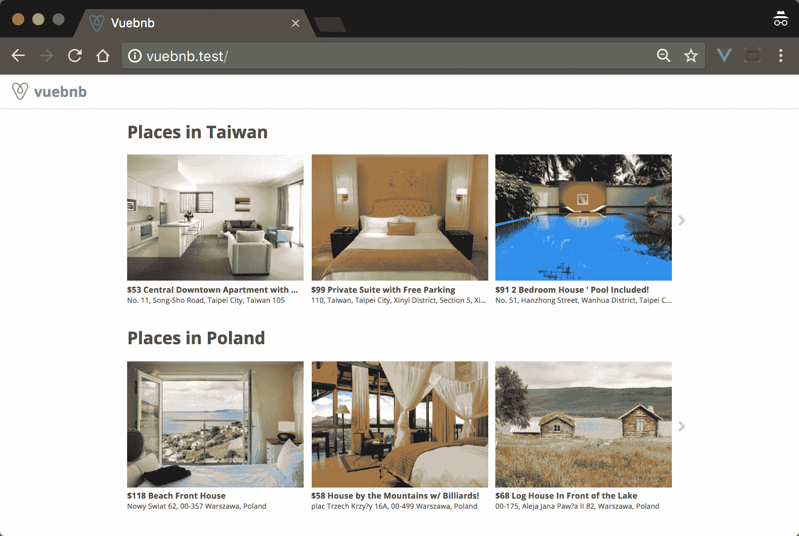图 7.1。Vuebnb 的首页

# 安装 Vue Router

Vue Router 是一个 NPM 包，可以在命令行上安装：

```php
$  npm i --save-dev vue-router
```

让我们将我们的路由器配置放入一个新文件`router.js`中：

```php
$ touch resources/assets/js/router.js
```

要将 Vue Router 添加到我们的项目中，我们必须导入该库，然后使用`Vue.use`API 方法使 Vue 与 Vue Router 兼容。这将为 Vue 提供一个新的配置属性`router`，我们可以使用它来连接一个新的路由器。

然后，我们使用`new VueRouter()`创建 Vue Router 的实例。

`resources/assets/js/router.js`：

```php
import Vue from 'vue';
import VueRouter from 'vue-router'; Vue.use(VueRouter);

export default new VueRouter();
```

通过从这个新文件中导出我们的路由器实例，我们已经将其转换为一个可以在`app.js`中导入的模块。如果我们将导入的模块命名为`router`，则可以使用对象解构来简洁地将其连接到我们的主配置对象。

`resources/assets/js/app.js`：

```php
import "core-js/fn/object/assign";
import Vue from 'vue';

import ListingPage from '../components/ListingPage.vue';
import router from './router'

var app = new Vue({ el: '#app', render: h => h(ListingPage), router });
```

# 创建路由

Vue Router 的最基本配置是提供一个`routes`数组，它将 URL 映射到相应的页面组件。此数组将包含至少两个属性的对象：`path`和`component`。

请注意，通过*页面组件*，我只是指任何我们指定为在我们的应用程序中表示页面的组件。它们在其他方面都是常规组件。

目前，我们的应用程序中只会有两个路由，一个用于我们的主页，一个用于我们的列表页面。`HomePage`组件尚不存在，因此在创建它之前，我们将保持其路由被注释掉。

`resources/assets/js/router.js`：

```php
import ListingPage from '../components/ListingPage.vue';

export default new VueRouter({ mode: 'history', routes: [
    // { path: '/', component: HomePage }, // doesn't exist yet!
    { path: '/listing/:listing', component: ListingPage }
  ]
});
```

您会注意到我们的`ListingPage`组件的路径包含一个动态段`:listing`，因此此路由将匹配包括`/listing/1、listing/2...listing/whatever`在内的路径。

Vue Router 有两种模式：*hash*模式和*history*模式。哈希模式使用 URL 哈希来模拟完整的 URL，因此当哈希更改时页面不会重新加载。历史模式有*真实*的 URL，并利用`history.pushState`API 来更改 URL 而不引起页面重新加载。历史模式的唯一缺点是 Vue 无法处理应用程序之外的 URL，例如`/some/weird/path`，必须由服务器处理。这对我们来说不是问题，所以我们将使用 Vuebnb 的历史模式。

# 应用程序组件

为了使我们的路由器工作，我们需要在页面模板的某个地方声明一个`RouterView`组件。否则，页面组件将无处可渲染。

我们稍微重构我们的应用程序来做到这一点。目前，`ListingPage`组件是应用程序的`root`组件，因为它位于组件层次结构的顶部，并加载我们使用的所有其他组件。

由于我们希望路由器根据 URL 在`ListingPage`和`HomePage`之间切换，我们需要另一个组件在组件层次结构中位于`ListingPage`之上并处理这项工作。我们将称这个新的根组件为`App`：

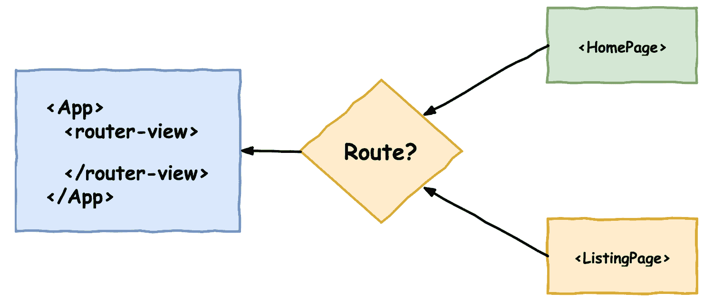图 7.2。App、ListingPage 和 HomePage 之间的关系

让我们创建`App`组件文件：

```php
$ touch resources/assets/components/App.vue
```

Vue 的根实例在加载时应该将这个渲染到页面上，而不是`ListingPage`。

`resources/assets/js/app.js`：

```php
import App from '../components/App.vue';

...

var app = new Vue({ el: '#app', render: h => h(App), router });
```

以下是`App`组件的内容。我在模板中添加了特殊的`RouterView`组件，这是`HomePage`或`ListingPage`组件将渲染的出口。

您还会注意到我已经将工具栏从`app.blade.php`移动到了`App`的模板中。这样工具栏就在 Vue 的领域内；之前它在安装点之外，因此无法被 Vue 触及。我这样做是为了以后我们可以使用`RouterLink`将主标志变成一个指向主页的链接，因为这是大多数网站的惯例。我也将任何与工具栏相关的 CSS 移入了`style`元素中。

`resources/assets/components/App.vue`：

```php
<template>
  <div>
    <div id="toolbar">
      
      <h1>vuebnb</h1>
    </div>
    <router-view></router-view>
  </div>
</template>
<style> #toolbar {
    display: flex;
    align-items: center;
    border-bottom: 1px solid #e4e4e4;
    box-shadow: 0 1px 5px rgba(0, 0, 0, 0.1);
  }

  #toolbar .icon {
    height: 34px;
    padding: 16px 12px 16px 24px;
    display: inline-block;
  }

  #toolbar h1 {
    color: #4fc08d;
    display: inline-block;
    font-size: 28px;
    margin: 0;
  } </style>
```

完成后，如果您现在将浏览器导航到类似`/listing/1`的 URL，您会发现一切看起来与以前一样。但是，如果您查看 Vue Devtools，您会发现组件层次结构已经改变，反映了`App`组件的添加。

还有一个指示器，告诉我们`ListingPage`组件是 Vue Router 的活动页面组件：

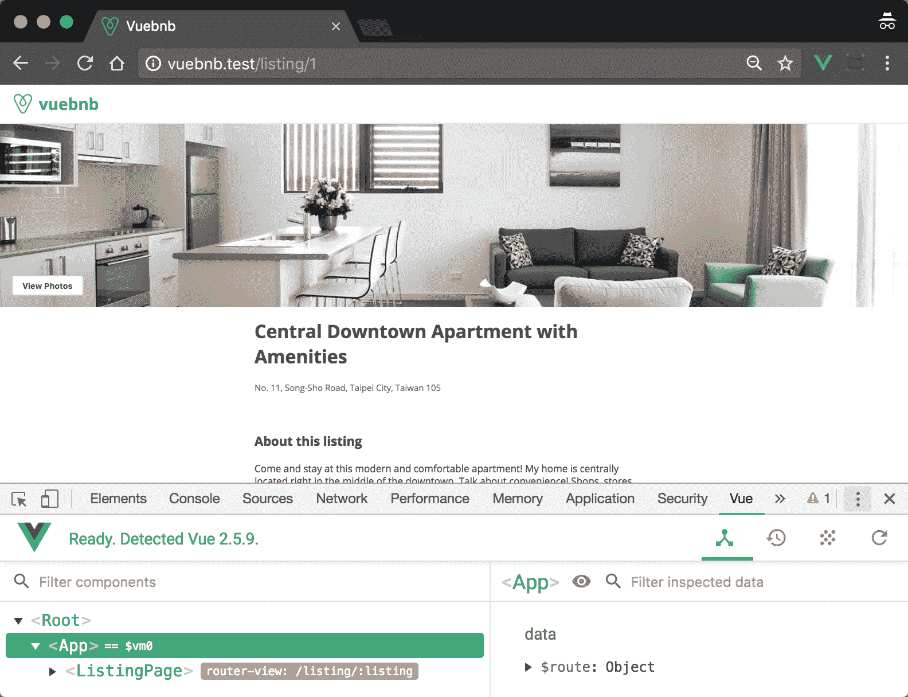图 7.3。在 Vue Devtools 打开的情况下，显示组件层次结构的/listing/1

# 主页

现在让我们开始在我们的主页上工作。我们首先创建一个新组件`HomePage`：

```php
$ touch resources/assets/components/HomePage.vue
```

现在，让我们在设置之前向组件添加占位符标记。

`resources/assets/components/HomePage.vue`：

```php
<template>
  <div>Vuebnb home page</div>
</template>
```

确保在`router`文件中导入此组件，并取消使用它的路由。

`resources/assets/js/router.js`：

```php
....

import HomePage from '../components/HomePage.vue';
import ListingPage from '../components/ListingPage.vue';

export default new VueRouter({ mode: 'history', routes: [
    { path: '/', component: HomePage },
    { path: '/listing/:listing', component: ListingPage }
  ]
});
```

您可能会尝试通过将 URL`http://vuebnb.test/`放入浏览器地址栏来测试这个新路由。但是，您会发现这导致 404 错误。请记住，我们仍然没有在服务器上为此创建路由。尽管 Vue 从*内部*管理路由，但任何地址栏导航请求必须由 Laravel 提供。

现在，让我们通过使用`RouterLink`组件在工具栏中创建一个指向我们主页的链接。这个组件就像一个增强版的`a`标签。例如，如果给你的路由一个`name`属性，你可以简单地使用`to`属性，而不必提供一个`href`。Vue 会在渲染时解析这个到正确的 URL。

`resources/assets/components/App.vue`：

```php
<div id="toolbar">
  <router-link :to="{ name: 'home' }">
    
    <h1>vuebnb</h1>
  </router-link>
</div>
```

让我们也为我们的路由添加`name`属性，以使其工作。

`resources/assets/js/app.js`：

```php
routes: [
  { path: '/', component: HomePage, name: 'home' },
  { path: '/listing/:listing', component: ListingPage, name: 'listing' }
]
```

现在我们必须修改我们的 CSS，因为我们现在的标志周围有另一个标签。修改工具栏 CSS 规则以匹配后面的规则。

`resources/assets/components/App.vue`：

```php
<template>...</template>
<style> #toolbar { border-bottom: 1px solid #e4e4e4; box-shadow: 0 1px 5px rgba(0, 0, 0, 0.1);
  }

 ... #toolbar a { display: flex; align-items: center; text-decoration: none;
  }
</style>
```

现在让我们打开一个列表页面，比如`/listing/1`。如果你检查 DOM，你会看到我们的工具栏现在里面有一个新的`a`标签，其中包含一个正确解析的链接返回到主页：

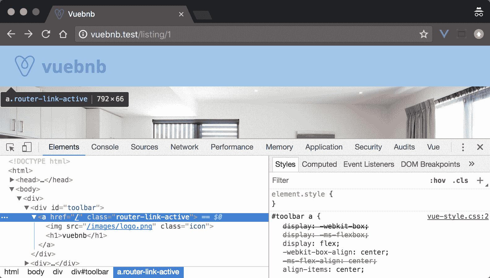图 7.4 工具栏是通过`RouterLink`元素返回到主页的链接

如果你点击那个链接，你会被带到主页！记住，*页面*实际上并没有改变；Vue 路由器只是在`RouterView`内将`ListingPage`替换为`HomePage`，并且通过`history.pushState`API 更新了浏览器 URL：

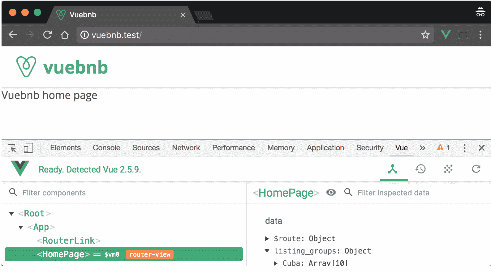图 7.5 主页与 Vue Devtools 显示的组件层次结构

# 主页路由

现在让我们为主页添加一个服务器端路由，这样我们就可以从根路径加载我们的应用程序。这个新路由将指向`ListingController`类中的`get_home_web`方法。

`routes/web.php`：

```php
<?php

Route::get('/', 'ListingController@get_home_web'); Route::get('/listing/{listing}', 'ListingController@get_listing_web');
```

现在去控制器，我们将使`get_home_web`方法返回`app`视图，就像它为列表 web 路由所做的那样。`app`视图包括一个模板变量`model`，我们使用它来传递初始应用程序状态，就像在第五章中设置的那样，*使用 Webpack 集成 Laravel 和 Vue.js*。现在，只需将一个空数组分配为占位符。

`app/Http/Controllers/ListingController.php`：

```php
public function get_home_web() 
{
  return view('app', ['model' => []]);
}
```

完成这些后，我们现在可以导航到`http://vuebnb.test/`，它会工作！当 Vue 应用程序启动时，Vue Router 将检查 URL 值，并且看到路径是`*/*`，将在应用程序的第一次渲染中在`RouterView`出口内加载`HomePage`组件。

查看这个页面的源代码，它与我们加载列表路由时得到的页面完全相同，因为它是相同的视图，即`app.blade.php`。唯一的区别是初始状态是一个空数组：

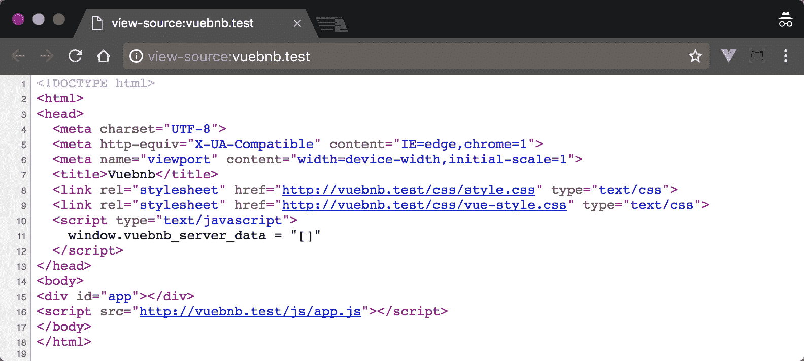图 7.6 vuebnb.test 的页面源代码，初始状态为空

# 初始状态

就像我们的列表页面一样，我们的主页也需要初始状态。从最终产品来看，我们可以看到主页显示了我们所有模拟列表的摘要，包括缩略图、标题和简短描述：

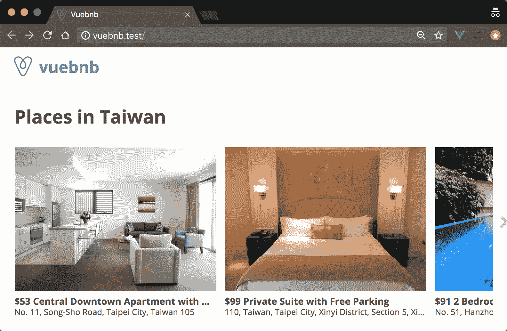图 7.7 完成的主页，关注列表

# 重构

在我们将初始状态注入到主页之前，让我们对代码进行一些小的重构，包括重命名一些变量和重构一些方法。这将确保代码语义反映出不断变化的需求，并保持我们的代码可读性和易理解性。

首先，让我们将我们的模板变量从`$model`重命名为更一般的`$data`。

`resources/views/app.blade.php`：

```php
<script type="text/javascript"> window.vuebnb_server_data = "{!! addslashes(json_encode($data)) !!}" </script>
```

在我们的列表控制器中，我们现在要将任何通用逻辑从我们的列表路由方法中抽象出来，放到一个名为`get_listing`的新辅助方法中。在这个辅助方法中，我们将`Listing`模型嵌套在 Laravel 的`Collection`中，`Collection`是 Eloquent 模型的类似数组的包装器，提供了一堆方便的方法，我们很快就会用到。`get_listing`将包括来自`add_image_urls`辅助方法的逻辑，现在可以安全地删除它。

当我们调用`view`方法时，我们还需要反映对我们的模板变量的更改。

`app/Http/Controllers/ListingController.php`：

```php
private function get_listing($listing)
{
  $model = $listing->toArray();
  for($i = 1; $i <=4; $i++) {
    $model['image_' . $i] = asset( 'images/' . $listing->id . '/Image_' . $i . '.jpg' );
  }
  return collect(['listing' => $model]);
}

public function get_listing_api(Listing $listing)
{
  $data = $this->get_listing($listing);
  return response()->json($data);
}

public function get_listing_web(Listing $listing)
{
  $data = $this->get_listing($listing);
  return view('app', ['data' => $data]);
}

public function get_home_web() 
```

```php
{
 return view('app', ['data' => []]);
} 
```

最后，我们需要更新我们的`ListingPage`组件，以反映我们正在注入的服务器数据的新名称和结构。

`resources/assets/components/ListingPage.vue`：

```php
<script> let serverData = JSON.parse(window.vuebnb_server_data);
  let model = populateAmenitiesAndPrices(serverData.listing);

  ... </script>
```

# 主页初始状态

使用 Eloquent ORM，使用`Listing::all`方法检索所有我们的列表条目是微不足道的。这个方法在一个`Collection`对象中返回多个`Model`实例。

请注意，我们不需要模型上的所有字段，例如`amenities`，`about`等在填充主页的列表摘要时没有用到。为了确保我们的数据尽可能精简，我们可以将一个字段数组传递给`Listing::all`方法，告诉数据库只包括那些明确提到的字段。

`app/Http/Controllers/ListingController.php`：

```php
public function get_home_web() 
{
  $collection = Listing::all([
    'id', 'address', 'title', 'price_per_night'
  ]);
  $data = collect(['listings' => $collection->toArray()]);
  return view('app', ['data' => $data]);
}

/*
  [
    "listings" => [
      0 => [
        "id" => 1,
        "address" => "...",
        "title" => "...",
        "price_per_night" => "..." ]
      1 => [ ... ]
      ... 29 => [ ... ]
    ]
  ]
*/
```

# 添加缩略图

每个模拟列表都有第一张图片的缩略版本，可以用于列表摘要。缩略图比我们用于列表页面标题的图片要小得多，非常适合在主页上显示列表摘要。缩略图的 URL 是`public/images/{x}/Image_1_thumb.jpg`，其中`{x}`是列表的 ID。

`Collection`对象有一个辅助方法`transform`，我们可以使用它来为每个列表添加缩略图图片 URL。`transform`接受一个回调闭包函数，每个项目调用一次，允许您修改该项目并将其返回到集合中，而不费吹灰之力。

`app/Http/Controllers/ListingController.php`：

```php
public function get_home_web() 
{
  $collection = Listing::all([
    'id', 'address', 'title', 'price_per_night'
  ]);
  $collection->transform(function($listing) {
    $listing->thumb = asset(
      'images/' . $listing->id . '/Image_1_thumb.jpg'
    );
    return $listing;
  });
  $data = collect(['listings' => $collection->toArray()]);
  return view('app', ['data' => $data]);
}

/*
  [
    "listings" => [
      0 => [
        "id" => 1,
        "address" => "...",
        "title" => "...",
        "price_per_night" => "...",
        "thumb" => "..." ]
      1 => [ ... ]
      ... 29 => [ ... ]
    ]
  ]
*/
```

# 在客户端接收

现在初始状态已经准备好了，让我们将其添加到我们的`HomePage`组件中。但在我们使用它之前，还有一个额外的方面需要考虑：列表摘要是按*国家*分组的。再次看一下*图 7.7*，看看这些组是如何显示的。

在我们解析了注入的数据之后，让我们修改对象，使得列表按国家分组。我们可以很容易地创建一个函数来做到这一点，因为每个列表对象都有一个`address`属性，其中国家总是明确命名的，例如，*台湾台北市万华区汉中街 51 号 108*。

为了节省您编写这个函数的时间，我在`helpers`模块中提供了一个名为`groupByCountry`的函数，可以在组件配置的顶部导入。

`resources/assets/components/HomePage.vue`：

```php
...

<script>
  import { groupByCountry } from '../js/helpers';

  let serverData = JSON.parse(window.vuebnb_server_data);
  let listing_groups = groupByCountry(serverData.listings);

  export default {
    data() {
      return { listing_groups }
    }
  }
</script>
```

我们现在将通过 Vue Devtools 看到`HomePage`已经成功加载了按国家分组的列表摘要，准备显示：

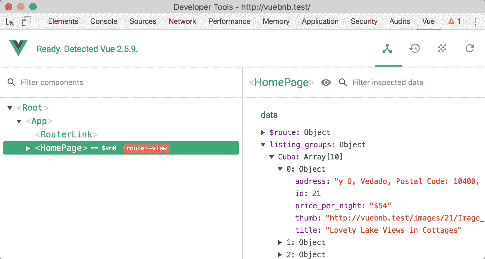图 7.8. Vue Devtools 显示了 HomePage 组件的状态

# ListingSummary 组件

现在`HomePage`组件有了可用的数据，我们可以开始显示它。

首先，清空组件的现有内容，并将其替换为一个`div`。这个`div`将使用`v-for`指令来遍历我们的每一个列表组。由于`listing_groups`是一个具有键/值对的对象，我们将给我们的`v-for`两个别名：`group`和`country`，分别是每个对象项的值和键。

我们将在一个标题中插入`country`。`group`将在下一节中使用。

`resources/assets/components/HomePage.vue`：

```php
<template>
  <div>
    <div v-for="(group, country) in listing_groups">
      <h1>Places in {{ country }}</h1>
      <div> Each listing will go here </div>
    </div>
  </div>
</template>
<script>...</script> 
```

现在主页将会是这个样子：

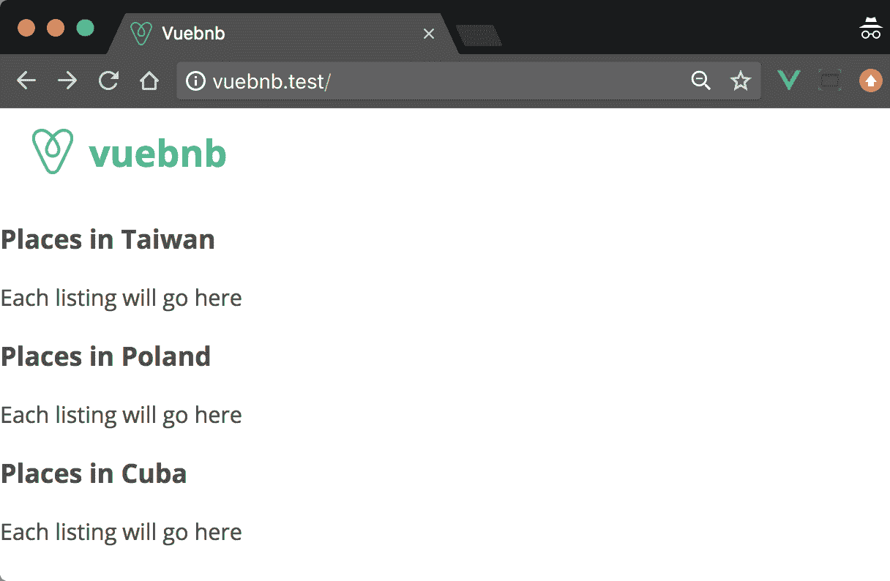图 7.9. 在 HomePage 组件中迭代列表摘要组

由于每个列表摘要都会有一定的复杂性，我们将创建一个单独的组件`ListingSummary`来显示它们：

```php
$ touch resources/assets/components/ListingSummary.vue
```

让我们在`HomePage`模板中声明`ListingSummary`。我们将再次使用`v-for`指令来遍历`group`，一个数组，为每个成员创建一个`ListingSummary`的新实例。每个成员的数据将绑定到一个单独的 prop`listing`。

`resources/assets/components/HomePage.vue`：

```php
<template>
  <div>
    <div v-for="(group, country) in listing_groups">
      <h1>Places in {{ country }}</h1>
      <div class="listing-summaries">
        <listing-summary v-for="listing in group" 
          :key="listing.id" 
          :listing="listing"
        ></listing-summary>
      </div>
    </div>
  </div>
</template>
<script> import { groupByCountry } from '../js/helpers';
 import ListingSummary from './ListingSummary.vue'; let serverData = JSON.parse(window.vuebnb_server_data);
  let listing_groups = groupByCountry(serverData.listings);

  export default {
    data() {
      return { listing_groups }
    }, components: { ListingSummary }
  } </script>
```

让我们为`ListingSummary`组件创建一些简单的内容，只是为了测试我们的方法。

`resources/assets/components/ListingSummary.vue`：

```php
<template>
  <div class="listing-summary"> {{ listing.address }} </div>
</template>
<script> export default { props: [ 'listing' ],
  } </script>
```

刷新我们的页面，现在我们将看到我们的列表摘要的原型：

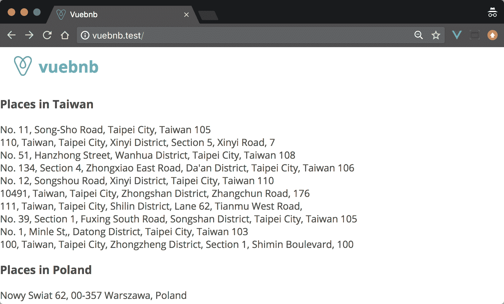图 7.10. ListingSummary 组件的原型

由于这种方法有效，现在让我们完成`ListingSummary`组件的结构。为了显示缩略图，我们将其绑定为固定宽度/高度的背景图片`div`。我们还需要一些 CSS 规则来使其显示得很好。

`resources/assets/components/ListingSummary.vue`：

```php
<template>
  <div class="listing-summary">
    <div class="wrapper">
      <div class="thumbnail" :style="backgroundImageStyle"></div>
      <div class="info title">
        <span>{{ listing.price_per_night }}</span>
        <span>{{ listing.title }}</span>
      </div>
      <div class="info address">{{ listing.address }}</div>
    </div>
  </div>
</template>
<script> export default { props: [ 'listing' ], computed: {
      backgroundImageStyle() {
        return {
          'background-image': `url("${this.listing.thumb}")` }
      }
    }
  } </script>
<style> .listing-summary {
    flex: 0 0 auto;
  }

  .listing-summary a {
    text-decoration: none;
  }

  .listing-summary .wrapper {
    max-width: 350px;
    display: block;
  }

  .listing-summary .thumbnail {
    width: 350px;
    height: 250px;
    background-size: cover;
    background-position: center;
  }

  .listing-summary .info {
    color: #484848;
    word-wrap: break-word;
    letter-spacing: 0.2px;
    white-space: nowrap;
    overflow: hidden;
    text-overflow: ellipsis;
  }

  .listing-summary .info.title {
    padding-top: 5px;
    font-weight: 700;
    font-size: 16px;
    line-height: 24px;
  }

  .listing-summary .info.address {
    font-size: 14px;
    line-height: 18px;
  } </style>
```

添加了该代码后，您的列表摘要将如下所示：

图 7.11。显示完整的列表摘要

我们给每个列表摘要一个固定的宽度/高度，以便我们可以以整齐的网格显示它们。目前，它们显示在一个高列中，所以让我们向`HomePage`组件添加一些 CSS flex 规则，将摘要放入行中。

我们将在包装摘要的元素中添加一个名为`listing-summary-group`的类。我们还将在根`div`中添加一个名为`home-container`的类，以限制页面的宽度并使内容居中。

`resources/assets/components/HomePage.vue`：

```php
<template>
  <div class="home-container">
    <div v-for="(group, country) in listing_groups" 
      class="listing-summary-group"
    > ... </div>
  </div>
</template>
<script>...</script>
<style> .home-container {
    margin: 0 auto;
    padding: 0 25px;
  }

  @media (min-width: 1131px) {
    .home-container {
      width: 1080px;
    }
  }

  .listing-summary-group {
    padding-bottom: 20px;
  }

  .listing-summaries {
    display: flex;
    flex-direction: row;
    justify-content: space-between;
    overflow: hidden;
  }
  .listing-summaries > .listing-summary {
    margin-right: 15px;
  } .listing-summaries > .listing-summary:last-child {
```

```php
 margin-right: 0;
  } </style>
```

最后，我们需要添加一个规则，防止列表强制文档边缘超出视口。将这个规则添加到主 CSS 文件中。

`resources/assets/css/style.css`：

```php
html, body {
  overflow-x: hidden;
}
```

有了这个，我们得到了一个漂亮的主页：

图 7.12。列表摘要按行显示

您会注意到在整个页面宽度上，我们只能看到每个国家组的三个列表。其他七个被 CSS 的`overflow: hidden`规则隐藏了。很快，我们将为每个组添加图像滑块功能，以允许用户浏览所有列表。

# 应用内导航

如果我们使用浏览器的地址栏导航到主页，`http://vuebnb.test/`，它可以工作，因为 Laravel 现在在这个路由上提供页面。但是，如果我们从列表页导航到主页，就不再有页面内容了：

图 7.13。从列表页导航到空的主页

我们目前没有从主页到列表页的任何链接，但如果有的话，我们会遇到类似的问题。

原因是我们的页面组件目前从我们注入到文档头部的数据中获取它们的初始状态。如果我们使用 Vue Router 导航到不会引发页面刷新的不同页面，下一个页面组件将合并错误的初始状态。

我们需要改进我们的架构，以便在导航到页面时检查注入到头部的模型是否与当前页面匹配。为了实现这一点，我们将在模型中添加一个`path`属性，并检查它是否与活动 URL 匹配。如果不匹配，我们将使用 AJAX 从网络服务获取正确的数据：

图 7.14。页面如何决定需要什么数据如果您对阅读更多关于这种设计模式感兴趣，请查看文章*Avoid This Common Anti-Pattern In Full-Stack Vue/Laravel Apps*，网址为[`vuejsdevelopers.com/2017/08/06/vue-js-laravel-full-stack-ajax/`](https://vuejsdevelopers.com/2017/08/06/vue-js-laravel-full-stack-ajax/)。

# 向模型添加路径

让我们转到列表控制器，并向注入到我们视图头部的数据添加一个`path`属性。为此，我们将添加一个名为`add_meta_data`的辅助函数，它将在后面的章节中添加路径，以及一些其他元属性。

请注意，当前路由的路径可以通过`Request`对象确定。这个对象可以被声明为任何`route-handling`函数的最后一个参数，并且由服务容器在每个请求中提供。

`app/Http/Controllers/ListingController.php`：

```php
...

private function add_meta_data($collection, $request)
{
  return $collection->merge([
    'path' => $request->getPathInfo()
  ]);
}

public function get_listing_web(Listing $listing, Request $request)
{
  $data = $this->get_listing($listing);
  $data = $this->add_meta_data($data, $request);
  return view('app', ['data' => $data]);
}

public function get_home_web(Request $request)
{
  $collection = Listing::all([
    'id', 'address', 'title', 'price_per_night'
  ]);
  $collection->transform(function($listing) {
    $listing->thumb = asset(
      'images/' . $listing->id . '/Image_1_thumb.jpg'
    );
    return $listing;
  });
  $data = collect(['listings' => $collection->toArray()]);
  $data = $this->add_meta_data($data, $request);
  return view('app', ['data' => $data]);
}

/*
  [
    "listings" => [ ... ],
    "path" => "/"
  ]
*/
```

# 路由导航守卫

类似于生命周期钩子，*导航守卫*允许您在其生命周期的特定时刻拦截 Vue Router 导航。这些守卫可以应用于特定组件、特定路由或所有路由。

例如，`afterEach`是在任何路由被导航离开后调用的导航守卫。您可以使用此钩子来存储分析信息，例如：

```php
router.afterEach((to, from) => {
  storeAnalytics(userId, from.path);
})
```

我们可以使用`beforeRouteEnter`导航守卫从我们的网络服务中获取数据，如果头部的数据不合适。考虑以下伪代码，说明我们可能如何实现这一点：

```php
beforeRouteEnter(to, from, next) {
  if (to !== injectedData.path) { getDataWithAjax.then(data => {
      applyData(data)
    })
  } else {
    applyData(injectedData)
  }
  next()
}
```

# 下一个

导航守卫的一个重要特性是它们会阻止导航，直到调用`next`函数。这允许在解析导航之前执行异步代码。

```php
beforeRouteEnter(to, from, next) {
  new Promise(...).then(() => {
    next();  
  });
}
```

你可以向`next`函数传递`false`来阻止导航，或者你可以传递一个不同的路由来重定向它。如果你什么都不传，导航被认为是确认的。

`beforeRouteEnter`守卫是一个特殊情况。首先，在它内部，`this`是未定义的，因为它是在下一个页面组件被创建之前调用的。

```php
beforeRouteEnter(to, from, next) { console.log(this); // undefined
}
```

然而，在`beforeRouteEnter`中的`next`函数可以接受一个回调函数作为参数，例如，`next(component => { ... });`其中`component`是页面组件实例。

这个回调函数直到路由确认并且组件实例被创建后才会被触发。由于 JavaScript 闭包的工作原理，回调函数将可以访问它被调用的周围代码的作用域。

```php
beforeRouteEnter(to, from, next) {
  var data = { ... }
  next(component => { component.$data = data;
  });
}
```

# HomePage 组件

让我们把`beforeRouteEnter`添加到`HomePage`组件中。首先，将从文档头部检索数据的任何逻辑移到这个钩子中。然后我们检查数据的`path`属性，看它是否与当前路由匹配。如果是，我们调用`next`并传递一个将数据应用到组件实例的回调函数。如果不是，我们需要使用 AJAX 来获取正确的数据。

`resources/assets/components/HomePage.vue`：

```php
export default {
  data() {
    return { listing_groups: []
    };
  }, components: { ListingSummary }, beforeRouteEnter(to, from, next) {
    let serverData = JSON.parse(window.vuebnb_server_data);
    if (to.path === serverData.path) {
      let listing_groups = groupByCountry(serverData.listings);
      next(component => component.listing_groups = listing_groups);
    } else { console.log('Need to get data with AJAX!')
      next(false);
    }
  }
}
```

我已经添加了`listing_groups`作为数据属性。之前，我们在组件实例创建时应用我们的数据。现在，我们在组件创建后应用数据。为了设置响应式数据，Vue 必须知道数据属性的名称，所以我们用空值初始化，当需要的数据可用时再更新它。

# 主页 API 端点

现在我们将实现 AJAX 功能。不过，在我们这样做之前，我们需要在我们的 Web 服务中添加一个主页端点。

首先添加主页 API 路由。

`routes/api.php`：

```php
...

Route::get('/', 'ListingController@get_home_api');
```

现在看看`ListingController`类，我们将把`get_home_web`中的大部分逻辑抽象成一个新函数`get_listing_summaries`。然后我们将在`get_home_api`方法中使用这个函数并返回一个 JSON 响应。

`app/Http/Controllers/ListingController.php`：

```php
private function get_listing_summaries()
{
  $collection = Listing::all([
    'id', 'address', 'title', 'price_per_night'
  ]);
  $collection->transform(function($listing) {
    $listing->thumb = asset(
      'images/' . $listing->id . '/Image_1_thumb.jpg'
    );
    return $listing;
  });
  return collect(['listings' => $collection->toArray()]);
}

public function get_home_web(Request $request)
{
  $data = $this->get_listing_summaries();
  $data = $this->add_meta_data($data, $request);
  return view('app', ['data' => $data]);
}

public function get_home_api()
{
  $data = $this->get_listing_summaries();
  return response()->json($data);
}
```

# Axios

为了执行对 Web 服务的 AJAX 请求，我们将使用包含在 Laravel 默认前端代码中的 Axios HTTP 客户端。Axios 有一个非常简单的 API，允许我们向 GET URL 发出请求，如下所示：

```php
axios.get('/my-url');
```

Axios 是一个基于 Promise 的库，所以为了获取响应，你可以简单地链接一个`then`回调：

```php
axios.get('/my-url').then(response => { console.log(response.data); // Hello from my-url
});
```

由于 Axios NPM 包已经安装，我们可以导入`HomePage`组件。然后我们可以使用它来执行对主页 API 端点`/api/`的请求。在`then`回调中，我们将返回的数据应用到组件实例，就像我们在内联模型中所做的那样。

`resources/assets/components/HomePage.vue`：

```php
...
import axios from 'axios';

export default {
  data() { ... },
  components: { ... },
  beforeRouteEnter (to, from, next) {
    let serverData = JSON.parse(window.vuebnb_server_data);
    if (to.path === serverData.path) {
      let listing_groups = groupByCountry(serverData.listings);
      next(component => component.listing_groups = listing_groups);
    } else {
      axios.get(`/api/`).then(({ data }) => {
        let listing_groups = groupByCountry(data.listings);
        next(component => component.listing_groups = listing_groups);
      });
    }
  }
}
```

有了这个，我们现在可以以两种方式导航到主页，一种是通过地址栏，另一种是从列表页面的链接导航。无论哪种方式，我们都能得到正确的数据！

# 混合

如果你有任何在组件之间共同的功能，你可以把它放在一个`mixin`中，以避免重写相同的功能。

Vue `mixin`是一个与组件配置对象形式相同的对象。要在组件中使用它，声明为一个数组，并将其分配给配置属性`mixin`。当这个组件被实例化时，`mixin`的任何配置选项将与你在组件上声明的选项合并：

```php
var mixin = { methods: {
    commonMethod() { console.log('common method');
    }
  }
}; Vue.component('a', { mixins: [ mixin ]
}); Vue.component('b', { mixins: [ mixin ] methods: {
    otherMethod() { ... }
  }
});
```

你可能想知道，如果组件配置中有一个与`mixin`冲突的方法或其他属性会发生什么。答案是`mixins`有一个*合并策略*来确定任何冲突的优先级。通常，组件指定的配置将优先。合并策略的详细信息在 Vue.js 文档中解释[`vuejs.org`](http://vuejs.org)。

# 将解决方案移动到 mixin

让我们将解决方案概括为获取首页正确数据的解决方案，以便我们也可以在列表页面上使用它。为此，我们将 Axios 和`beforeRouteEnter`钩子从`HomePage`组件移动到一个 mixin 中，然后可以将其添加到两个页面组件中：

```php
$ touch resources/assets/js/route-mixin.js
```

同时，让我们通过删除`next`函数调用的重复来改进代码。为此，我们将创建一个新方法`getData`，它将负责找出页面的正确数据来源，并获取它。请注意，这个方法将是异步的，因为它可能需要等待 AJAX 解析，所以它将返回一个 Promise 而不是实际值。这个 Promise 然后在导航守卫中解析。

`resources/assets/js/route-mixin.js`：

```php
import axios from 'axios';

function getData(to) {
  return new Promise((resolve) => {
    let serverData = JSON.parse(window.vuebnb_server_data);
    if (!serverData.path || to.path !== serverData.path) { axios.get(`/api${to.path}`).then(({ data }) => {
        resolve(data);
      });
    } else {
      resolve(serverData);
    }
  });
}

export default { beforeRouteEnter: (to, from, next) => {
    getData(to).then((data) => {
      next(component => component.assignData(data));
    });
  }
};
```

我们不需要为 Promise 添加 polyfill，因为`Axios`库中已经提供了。

# assignData

您会注意到在`next`回调中，我们调用了主题组件上的一个方法`assignData`，并将数据对象作为参数传递。我们需要在使用这个`mixin`的任何组件中实现`assignData`方法。我们这样做是为了让组件在应用到组件实例之前，如果需要的话，可以处理数据。例如，`ListingPage`组件必须通过`populateAmenitiesAndPrices`辅助函数处理数据。

`resources/assets/components/ListingPage.vue`：

```php
...

import routeMixin from '../js/route-mixin';

export default { mixins: [ routeMixin ],
  data() {
    return { title: null, about: null, address: null, amenities: [], prices: [], images: []
    }
  }, components: { ... }, methods: {
    assignData({ listing }) { Object.assign(this.$data, populateAmenitiesAndPrices(listing));
    },
    openModal() {
      this.$refs.imagemodal.modalOpen = true;
    }
  }
}
```

我们还需要将`assignData`添加到`HomePage`组件中。

`resources/assets/components/HomePage.vue`：

```php
<script>
  import { groupByCountry } from '../js/helpers';
  import ListingSummary from './ListingSummary.vue';

  import axios from 'axios';
  import routeMixin from '../js/route-mixin';

  export default { mixins: [ routeMixin ],
    data() { ... }, methods: {
      assignData({ listings }) {
        this.listing_groups = groupByCountry(listings);
      },
    }, components: { ... }
  }
</script>
```

# 链接到列表页面

上面的方法应该有效，但我们无法测试，因为尚未有任何应用内链接到列表页面！

我们的每个`ListingSummary`实例代表一个单独的列表，并且应该是指向该列表页面的可点击链接。让我们使用`RouterLink`组件来实现这一点。请注意，我们绑定到`to`属性的对象包括路由的名称以及一个`params`对象，其中包括路由的动态段的值，即列表 ID。

`resources/assets/components/ListingSummary.vue`：

```php
<div class="listing-summary">
  <router-link :to="{ name: 'listing', params: { listing: listing.id } }">
    <div class="wrapper">
      <div class="thumbnail" :style="backgroundImageStyle"></div>
      <div class="info title">
        <span>{{ listing.price_per_night }}</span>
        <span>{{ listing.title }}</span>
      </div>
      <div class="info address">{{ listing.address }}</div>
    </div>
  </router-link>
</div>
```

完成后，列表摘要现在将是链接。从一个链接到列表页面，我们看到这个：

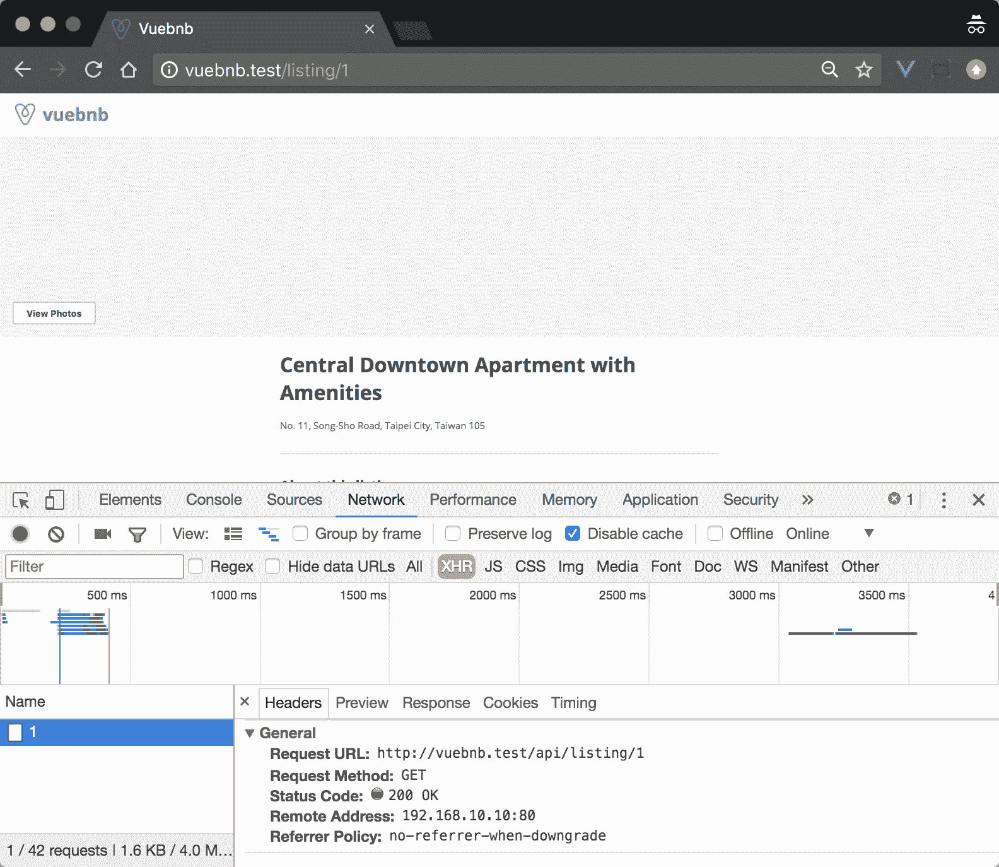图 7.15\. 导航到列表页面后成功的 AJAX 调用

我们可以在*图 7.15*中看到，对列表 API 的 AJAX 调用成功返回了我们想要的数据。如果我们还查看 Vue Devtools 选项卡，以及 Dev Tools 控制台，我们可以看到组件实例中的正确数据。问题是，现在我们对头部图片有一个未处理的 404 错误：

图 7.16\. Dev Tools 控制台显示错误

原因是组件的第一次渲染发生在`next`钩子中的回调之前。这意味着组件数据的初始化值在第一次渲染中被使用。

`resources/assets/components/ListingPage.vue`：

```php
data() {
  return { title: null, about: null, address: null, amenities: [], prices: [], images: []
  }
},
```

在`HeaderImage`声明中，我们像这样绑定第一个图像：`:image-url="images[0]"`。由于数组最初是空的，这将是一个未定义的值，并导致未处理的错误。

解释很复杂，但修复很简单：只需在`header-image`中添加`v-if`，确保在有效数据可用之前不会渲染。

`resources/assets/components/ListingPage.vue`：

```php
<header-image v-if="images[0]" 
  :image-url="images[0]" 
  @header-clicked="openModal"
></header-image>
```

# 滚动行为

网站导航的另一个方面是浏览器自动管理的*滚动行为*。例如，如果您滚动到页面底部，然后导航到新页面，滚动位置将被重置。但是，如果您返回到上一个页面，浏览器会记住滚动位置，并将您带回底部。

当我们使用 Vue Router 劫持导航时，浏览器无法做到这一点。因此，当您滚动到 Vuebnb 主页的底部并点击古巴的某个列表时，当加载列表页面组件时，滚动位置不会改变。这对用户来说感觉非常不自然，用户期望被带到新页面的顶部：

图 7.17。使用 Vue Router 导航后的滚动位置问题

Vue Router 有一个`scrollbehavior`方法，允许您通过简单地定义水平和垂直滚动条的`x`和`y`位置来调整页面在更改路由时滚动到的位置。为了保持简单，但仍然保持用户体验自然，让我们使得在加载新页面时总是在页面顶部。

`resources/assets/js/router.js`：

```php
export default new VueRouter({ mode: 'history', routes: [ ... ], scrollBehavior (to, from, savedPosition) {
    return { x: 0, y: 0 }
  }
});
```

# 添加页脚

为了改进 Vuebnb 的设计，让我们在每个页面的底部添加一个页脚。我们将把它做成一个可重用的组件，所以让我们从创建它开始：

```php
$ touch resources/assets/components/CustomFooter.vue
```

这是标记。目前，它只是一个无状态的组件。

`resources/assets/js/CustomFooter.vue`：

```php
<template>
  <div id="footer">
    <div class="hr"></div>
    <div class="container">
      <p>
         <span>
          <strong>Vuebnb</strong>. A full-stack Vue.js and Laravel demo app
 </span> </p>
    </div>
  </div>
</template>
<style> #footer {
    margin-bottom: 3em;
  }

  #footer .icon {
    height: 23px;
    display: inline-block;
    margin-bottom: -6px;
  }

  .hr {
    border-bottom: 1px solid #dbdbdb;
    margin: 3em 0;
  }

  #footer p {
    font-size</span>: 15px;
    color: #767676 !important;
 display: flex; }
 #footer p img {
 padding-right: 6px;
 } </style>
```

让我们将页脚添加到`App`组件中，在输出页面的`RouterView`下方。

`resources/assets/js/App.vue`：

```php
<template>
  <div>
    <div id="toolbar">...</div>
    <router-view></router-view>
    <custom-footer></custom-footer>
  </div>
</template>
<script> import CustomFooter from './CustomFooter.vue';

  export default { components: { CustomFooter }
  } </script>
<style>...</style>
```

这是它在列表页面上的样子：

图 7.18。列表页面上的自定义页脚

现在它在主页上的样子。它看起来不太好，因为文本没有左对齐，这不是您期望的。这是因为在这个页面上使用的容器约束与我们添加到页脚的`.container`类不同：

图 7.19。主页上的自定义页脚

事实上，`.container`是专门为列表页面设计的，而`.home-container`是为主页设计的。为了解决这个问题，让事情变得不那么混乱，让我们首先将`.container`类重命名为`.listing-container`。您还需要更新`ListingPage`组件，以确保它使用这个新的类名。

其次，让我们也将`.home-container`移到主 CSS 文件中，因为我们将全局使用它。

`resources/assets/css/style.css`：

```php
.listing-container {
  margin: 0 auto;
  padding: 0 12px;
}

@media (min-width: 744px) {
  .listing-container {
    width: 696px;
  }
}

.home-container {
  margin: 0 auto;
  padding: 0 25px;
}

@media (min-width: 1131px) {
  .home-container {
    width: 1080px;
  }
}
```

现在我们有`.home-container`和`.listing-container`作为我们`custom-footer`组件的两个可能的容器。让我们根据路由动态选择类，以便页脚始终正确对齐。

# 路由对象

*路由对象*代表当前活动路由的状态，并可以在根实例或组件实例中访问，如`this.$route`。该对象包含当前 URL 的解析信息以及 URL 匹配的路由记录：

```php
created() { console.log(this.$route.fullPath); // /listing/1 console.log(this.$route.params); // { listing: "1" }
}
```

# 动态选择容器类

为了在`custom-footer`中选择正确的容器类，我们可以从路由对象中获取当前路由的名称，并在模板文字中使用它。

`resources/assets/components/CustomFooter.vue`：

```php
<template>
  <div id="footer">
    <div class="hr"></div>
    <div :class="containerClass">
      <p>...</p>
    </div>
  </div>
</template>
<script>
  export default { computed: {
      containerClass() {
        // this.$route.name is either 'home' or 'listing'
        return `${this.$route.name}-container`;
      }
    }
  }
</script>
<style>...</style>  
```

现在，当在主页上显示时，页脚将使用`.home-container`：

图 7.20。主页上的自定义页脚与正确的容器类

# 列表摘要图像滑块

在我们的主页上，我们需要让用户能够看到每个国家的可能 10 个列表中不止三个。为此，我们将每个列表摘要组转换为图像滑块。

让我们创建一个新的组件来容纳每个列表摘要组。然后我们将箭头添加到该组件的两侧，让用户可以轻松地浏览其列表：

```php
$ touch resources/assets/components/ListingSummaryGroup.vue
```

现在，我们将从`HomePage`中将显示列表摘要的标记和逻辑抽象到这个新组件中。每个组需要知道国家的名称和包含的列表，因此我们将这些数据添加为 props。

`resources/assets/components/ListingSummaryGroup.vue`：

```php
<template>
  <div class="listing-summary-group">
    <h1>Places in {{ country }}</h1>
    <div class="listing-summaries">
      <listing-summary v-for="listing in listings"
        :key="listing.id"
        :listing="listing"
      ></listing-summary>
    </div>
  </div>
</template>
<script> import ListingSummary from './ListingSummary.vue';

  export default { props: [ 'country', 'listings' ], components: { ListingSummary }
  } </script>
<style> .listing-summary-group {
    padding-bottom: 20px;
  }

  .listing-summaries {
    display: flex;
    flex-direction: row;
    justify-content: space-between;
    overflow: hidden;
  }
  .listing-summaries > .listing-summary {
    margin-right: 15px;
  }

  .listing-summaries > .listing-summary:last-child {
    margin-right: 0;
  } </style>
```

回到`HomePage`，我们将使用`v-for`声明`ListingSummaryGroup`，对每个国家组进行迭代。

`resources/assets/components/HomePage.vue`:

```php
<template>
  <div class="home-container">
    <listing-summary-group v-for="(group, country) in listing_groups"
      :key="country"
      :listings="group"
      :country="country"
      class="listing-summary-group"
    ></listing-summary-group>
  </div>
</template>
<script> import routeMixin from '../js/route-mixin';
  import ListingSummaryGroup from './ListingSummaryGroup.vue';
  import { groupByCountry } from '../js/helpers';

  export default { mixins: [ routeMixin ],
    data() {
      return { listing_groups: []
      };
    }, methods: {
      assignData({ listings }) {
        this.listing_groups = groupByCountry(listings);
      }
    }, components: { ListingSummaryGroup }
  } </script>
```

大多数开发人员会将术语*图像轮播*和*图像滑块*互换使用。在本书中，我做了一个细微的区分，*轮播*包含一个完全被另一个替换的单个图像，而*滑块*则是移动图像的位置，同时可见几个图像。

# 添加滑块

现在我们将为`ListingSummaryGroup`添加滑块功能。为此，我们将重用我们在第六章中制作的`CarouselControl`组件，*使用 Vue.js 组件组合小部件*。我们希望在组的两侧显示一个，所以让我们将它们放入模板中，记得声明`dir`属性。我们还将添加一些结构标记和 CSS 来显示控件。

`resources/assets/components/ListingSummaryGroup.vue`:

```php
<template>
  <div class="listing-summary-group">
    <h1>Places in {{ country }}</h1>
    <div class="listing-carousel">
      <div class="controls">
        <carousel-control dir="left"></carousel-control>
        <carousel-control dir="right"></carousel-control>
      </div>
      <div class="listing-summaries-wrapper">
        <div class="listing-summaries">
          <listing-summary v-for="listing in listings"
            :listing="listing"
            :key="listing.id"
          ></listing-summary>
        </div>
      </div>
    </div>
  </div>
</template>
<script> import ListingSummary from './ListingSummary.vue';
  import CarouselControl from './CarouselControl.vue';

  export default { props: [ 'country', 'listings' ], components: { ListingSummary, CarouselControl }
  } </script>
<style> ... .listing-carousel {
  position: relative;
}

.listing-carousel .controls {
  display: flex;
  justify-content: space-between;
  position: absolute;
  top: calc(50% - 45px);
  left: -45px;
  width: calc(100% + 90px);
}

.listing-carousel .controls .carousel-control{
  color: #c5c5c5;
  font-size: 1.5rem;
  cursor: pointer;
}

.listing-summaries-wrapper {
  overflow: hidden;
} </style>
```

添加了这段代码后，您的主页将如下所示：

图 7.21\. 列表摘要组的轮播控件

# 平移

为了在点击轮播控件时*移动*我们的列表摘要，我们将使用一个名为`translate`的 CSS 变换。这将使受影响的元素从当前位置移动指定像素的距离。

每个列表摘要的总宽度为 365px（350px 固定宽度加上 15px 边距）。这意味着如果我们将我们的组向左移动 365px，它将产生将所有图像位置向左移动一个的效果。您可以在这里看到我已经添加了平移作为内联样式以测试它是否有效。请注意，我们以*负*方向进行平移以使组向左移动：

图 7.22\. 使用平移向左移动的列表组

通过将内联样式绑定到具有`listing-summary`类的元素，我们可以通过 JavaScript 控制平移。让我们通过一个计算属性来做到这一点，这样我们就可以动态计算平移量。

`resources/assets/components/ListingSummaryGroup.vue`:

```php
<template>
  <div class="listing-summary-group">
    <h1>Places in {{ country }}</h1>
    <div class="listing-carousel">
      <div class="controls">...</div>
      <div class="listing-summaries" :style="style">
        <listing-summary...>...</listing-summary>
      </div>
    </div>
  </div>
</template>
<script>
  export default { props: [ 'country', 'listings' ], computed: {
      style() {
        return { transform: `translateX(-365px)` }
      }
    }, components: { ... }
  }
</script>
```

现在所有的摘要组都将被移动：

图 7.23\. 通过 JavaScript 控制的平移后的列表组

*图 7.23*中显而易见的问题是，我们一次只能看到三张图像，并且它们溢出到容器的其他部分。

为了解决这个问题，我们将把 CSS 规则`overflow: hidden`从`listing-summaries`移到`listing-summaries-wrapper`。

`resources/assets/components/ListingSummaryGroup.vue`:

```php
... .listing-summaries-wrapper {
  overflow: hidden;
}

.listing-summaries {
  display: flex;
  flex-direction: row;
  justify-content: space-between;  
} ...
```

# 轮播控件

现在我们需要轮播控件来改变平移的值。为此，让我们在`ListingSummaryGroup`中添加一个数据属性`offset`。这将跟踪我们移动了多少图像，即它将从零开始，最多到七（不是 10，因为我们不希望移动得太远，以至于所有图像都超出屏幕）。

我们还将添加一个名为`change`的方法，它将作为自定义事件的事件处理函数，该事件由轮播控件组件发出。该方法接受一个参数`val`，根据触发了左侧还是右侧轮播控件，它将是`-1`或`1`。

`change`将步进`offset`的值，然后乘以每个列表的宽度（365px）来计算平移。

`resources/assets/components/ListingSummaryGroup.vue`:

```php
...

const rowSize = 3;
const listingSummaryWidth = 365;

export default { props: [ 'country', 'listings' ],
  data() {
    return { offset: 0   
    }
  }, methods: {
    change(val) {
      let newVal = this.offset + parseInt(val);
      if (newVal >= 0 && newVal <= this.listings.length - rowSize) {
        this.offset = newVal;
      }
    }
  }, computed: {
    style() {
      return { transform: `translateX(${this.offset * -listingSummaryWidth}px)` 
      }
    }
  }, components: { ... }
}
```

最后，我们必须在模板中使用`v-on`指令来注册对`CarouselControl`组件的`change-image`事件的监听器。

`resources/assets/components/ListingSummaryGroup.vue`:

```php
<div class="controls">
  <carousel-control dir="left" @change-image="change"></carousel-control>
```

```php
  <carousel-control dir="right" @change-image="change"></carousel-control>
</div>
```

完成后，每个列表组都有一个工作中的图像滑块！

# 最后的修饰

还有两个小功能要添加到这些图像滑块中，以给 Vuebnb 用户最佳体验。首先，让我们添加 CSS 过渡，以在半秒钟的时间内动画平移变化，并产生一个漂亮的*滑动*效果。

`resources/assets/components/ListingSummaryGroup.vue`:

```php
.listing-summaries {
  display: flex;
  flex-direction: row;
  justify-content: space-between;
  transition: transform 0.5s;
}
```

遗憾的是你无法在书中看到这些效果，所以你得自己尝试一下！

最后，与我们的图像轮播不同，这些滑块不是连续的；它们有一个最小值和最大值。如果达到了最小值或最大值，让我们隐藏相应的箭头。例如，当滑块加载时，左箭头应该被隐藏，因为用户不能再减小偏移量到零以下。

为了做到这一点，我们将使用样式绑定动态添加`visibility: hidden`的 CSS 规则。

`resources/assets/components/ListingSummaryGroup.vue`：

```php
<div class="controls">
  <carousel-control dir="left" 
    @change-image="change" 
    :style="leftArrowStyle"
  ></carousel-control>
  <carousel-control dir="right" 
    @change-image="change" 
    :style="rightArrowStyle"
  ></carousel-control>
</div>
```

以及计算属性。

`resources/assets/components/ListingSummaryGroup.vue`：

```php
computed: {
  ...
  leftArrowStyle() {
    return { visibility: (this.offset > 0 ? 'visible' : 'hidden') }
  },
  rightArrowStyle() {
    return { visibility: (
        this.offset < (this.listings.length - rowSize) 
        ? 'visible' : 'hidden'
      ) 
    }
  }
}
```

完成这些后，我们可以看到左箭头在页面加载时隐藏，正如预期的那样：

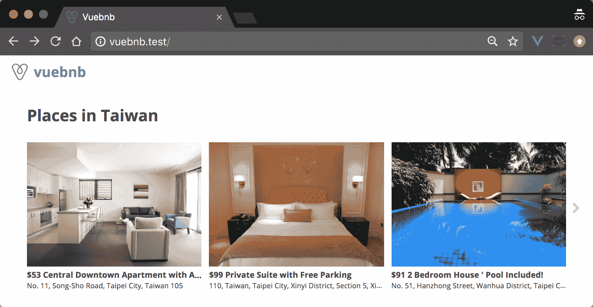图 7.24。页面加载时隐藏的左箭头

# 摘要

在本章中，我们学习了路由库的工作原理以及它们为单页应用程序的重要性。然后我们熟悉了 Vue Router 的关键特性，包括路由对象、导航守卫以及`RouterLink`和`RouterView`特殊组件。

将这些知识付诸实践，我们安装了 Vue Router 并配置了它以在我们的应用程序中使用。然后我们为 Vuebnb 建立了一个主页，其中包括一个在图像滑块内组织的列表摘要画廊。

最后，我们实现了一个架构，正确匹配页面与可用的本地数据或通过 AJAX 从 Web 服务检索到的新数据。

现在我们的应用程序中有大量的组件，其中许多组件之间进行数据通信，是时候调查另一个关键的 Vue.js 工具了：Vuex。Vuex 是一个基于 Flux 的库，提供了一种更优越的管理应用程序状态的方式。
