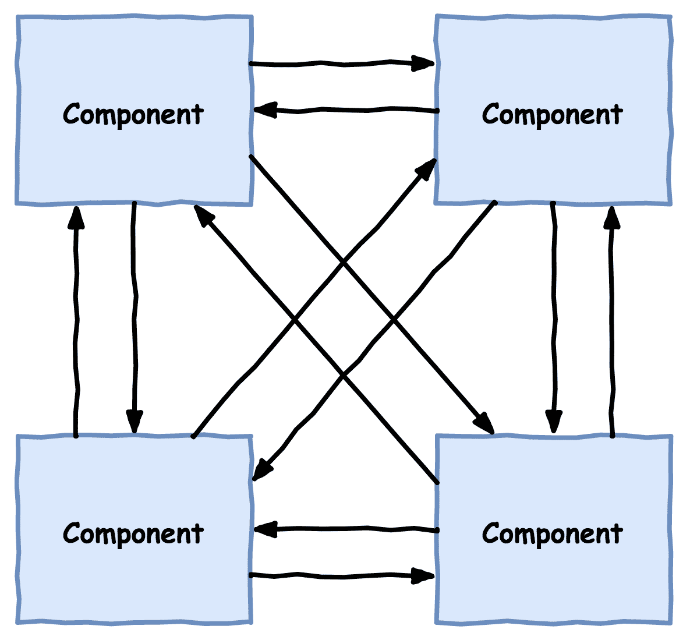
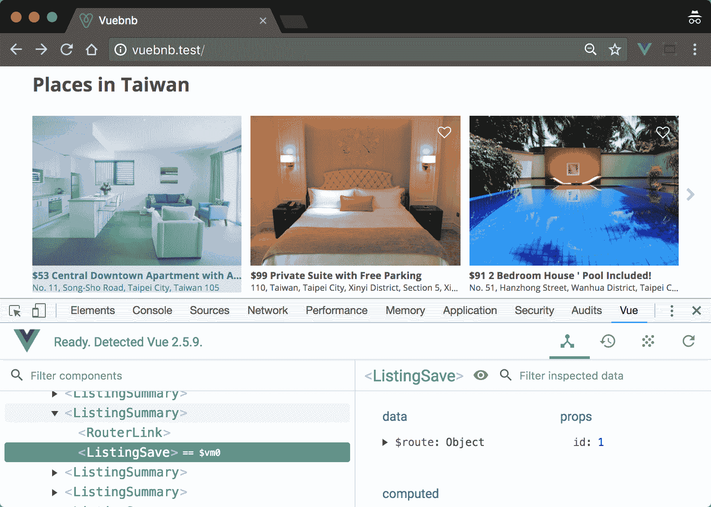
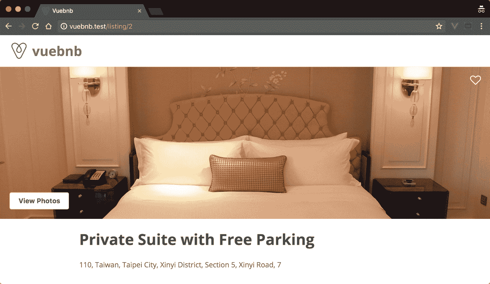
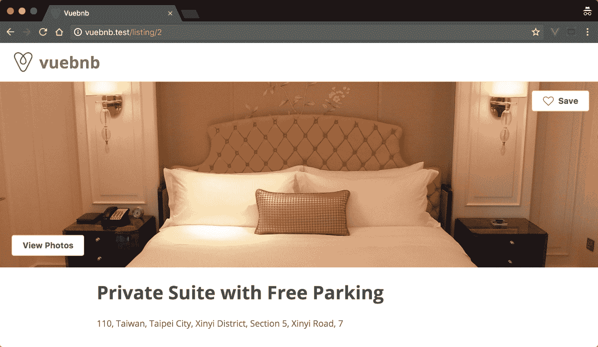
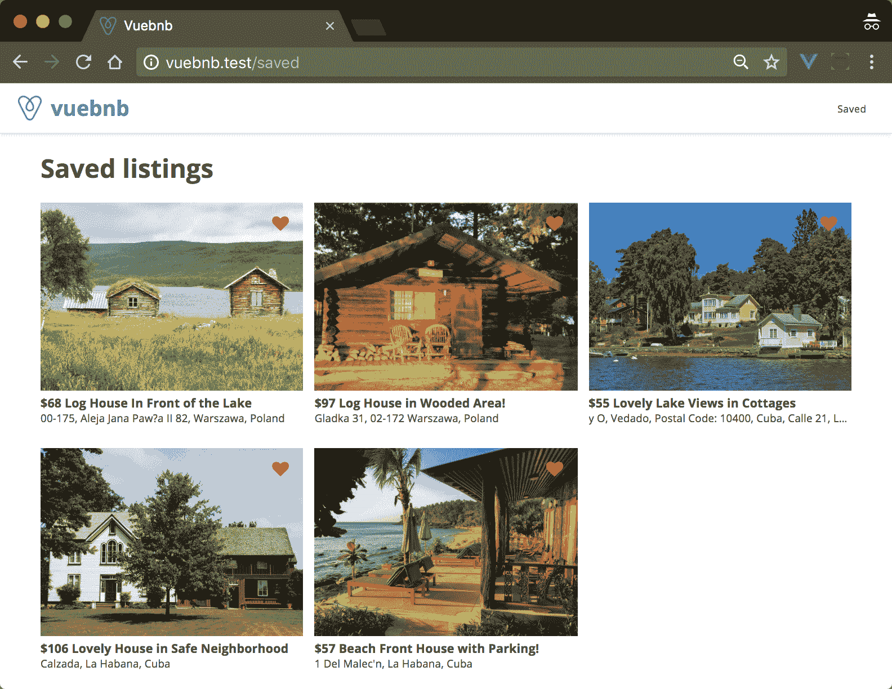
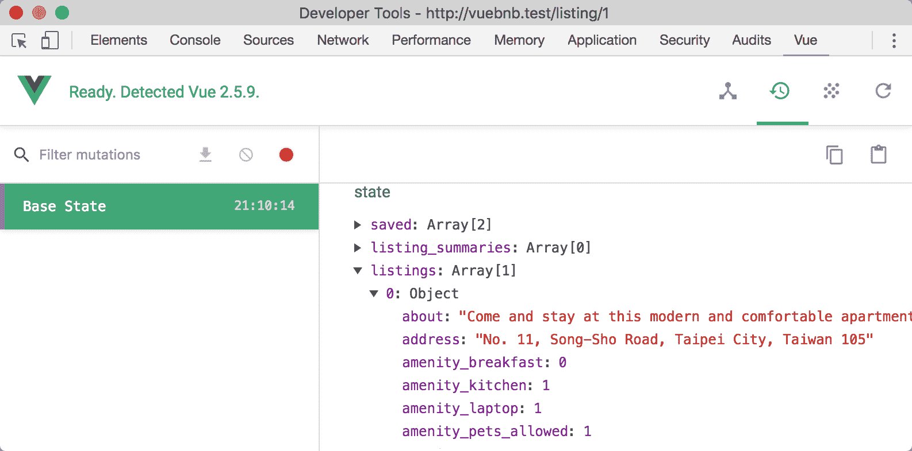
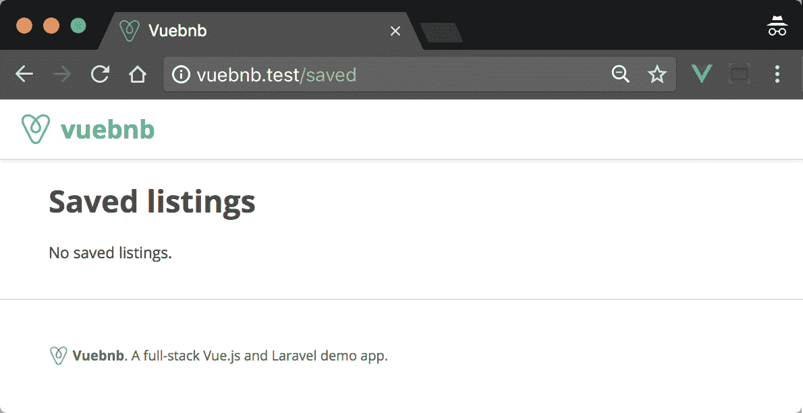

# 第八章：使用 Vuex 管理应用程序状态

在上一章中，您学习了如何使用 Vue Router 将虚拟页面添加到 Vue.js 单页面应用程序中。现在，我们将在 Vuebnb 中添加跨页面共享数据的组件，因此不能依赖于瞬态本地状态。为此，我们将利用 Vuex，这是一个受 Flux 启发的 Vue.js 库，提供了一种强大的管理全局应用程序状态的方法。

本章涵盖的主题：

+   Flux 应用程序架构简介以及它在构建用户界面时的用处

+   Vuex 的概述及其关键特性，包括状态和突变

+   如何安装 Vuex 并设置可以被 Vue.js 组件访问的全局存储

+   Vuex 如何通过突变日志和时间旅行调试实现更好的调试

+   为 Vuebnb 列表创建保存功能和保存列表页面

+   将页面状态移入 Vuex 以减少从服务器检索不必要数据

# Flux 应用程序架构

想象一下，您开发了一个多用户聊天应用程序。界面上有用户列表、私人聊天窗口、带有聊天记录的收件箱和通知栏，用于通知用户有未读消息。

数百万用户每天通过您的应用程序进行聊天。但是，有关一个令人讨厌的问题的投诉：应用程序的通知栏偶尔会发出虚假通知；也就是说，用户将收到新的未读消息的通知，但当他们检查时，发现只是他们已经看过的消息。

我描述的是 Facebook 开发人员几年前在他们的聊天系统中遇到的一个真实场景。解决这个问题的过程激发了他们的开发人员创建了一个他们称之为*Flux*的应用程序架构。Flux 是 Vuex、Redux 和其他类似库的基础。

Facebook 的开发人员为这个*僵尸通知*问题苦苦挣扎了一段时间。他们最终意识到，它的持久性不仅仅是一个简单的错误；它指向了应用程序架构中的一个根本缺陷。

这个缺陷在抽象中最容易理解：当应用程序中有多个共享数据的组件时，它们之间的相互连接的复杂性将增加到一个程度，使得数据的状态不再可预测或可理解。当像上面描述的错误不可避免地出现时，应用程序数据的复杂性使得它们几乎不可能解决：

图 8.1。组件之间通信的复杂性随着每个额外组件的增加而增加

Flux 不是一个库。你不能去 GitHub 上下载它。Flux 是一组指导原则，描述了一种可扩展的前端架构，足以减轻这个缺陷。它不仅适用于聊天应用程序，还适用于任何具有共享状态的复杂 UI 组件，比如 Vuebnb。

现在让我们探索 Flux 的指导原则。

# 原则＃1-真相的唯一来源

组件可能有它们自己需要知道的*本地数据*。例如，用户列表组件中滚动条的位置可能对其他组件没有兴趣：

```php
Vue.component('user-list', {
  data() { scrollPos: ...
  }
});
```

但是，任何要在组件之间共享的数据，例如*应用程序数据*，都需要保存在一个单独的位置，与使用它的组件分开。这个位置被称为*存储*。组件必须从这个位置读取应用程序数据，而不是保留自己的副本，以防冲突或分歧：

图 8.2。集中式数据简化了应用程序状态

# 原则＃2-数据是只读的

组件可以自由地从存储中读取数据。但是它们不能直接改变存储中的数据，至少不能直接改变。

相反，它们必须通知存储它们改变数据的意图，存储将负责通过一组定义的函数（称为*mutator 方法*）进行这些更改。

为什么要这样做？如果我们集中数据修改逻辑，那么如果状态存在不一致，我们就不必远程查找。我们正在最小化某些随机组件（可能在第三方模块中）以意想不到的方式改变数据的可能性：

图 8.3。状态是只读的。使用改变器方法来写入存储

# 原则＃3 - 变异是同步的

在实现上述两个原则的应用程序中，调试状态不一致要容易得多。您可以记录提交并观察状态如何响应更改（这在 Vue Devtools 中自动发生，我们将看到）。

但是，如果我们的变异被异步应用，这种能力将受到破坏。我们会知道我们提交的顺序，但我们不会知道我们的组件提交它们的顺序和时间。同步变异确保状态不依赖于不可预测事件的顺序和时间。

# Vuex

*Vuex*（通常发音为*veweks*）是 Flux 架构的官方 Vue.js 实现。通过强制执行先前描述的原则，即使在数据被共享到许多组件时，Vuex 也可以保持应用程序数据处于透明和可预测的状态。

Vuex 包括具有状态和变异方法的存储，并且将对从存储中读取数据的任何组件进行反应性更新。它还允许方便的开发功能，如热模块重新加载（更新运行中应用程序中的模块）和时间旅行调试（通过回溯变异来跟踪错误）。

在本章中，我们将为 Vuebnb 列表添加一个*保存*功能，以便用户可以跟踪他们最喜欢的列表。与迄今为止我们应用程序中的其他数据不同，保存的状态必须在页面之间持久存在；例如，当用户从一个页面切换到另一个页面时，应用程序必须记住用户已经保存了哪些项目。我们将使用 Vuex 来实现这一点：

图 8.4。保存状态对所有页面组件可用

# 安装 Vuex

Vuex 是一个可以从命令行安装的 NPM 包：

```php
$ npm i --save-dev vuex
```

我们将把我们的 Vuex 配置放入一个新的模块文件`store.js`：

```php
$ touch resources/assets/js/store.js
```

我们需要在此文件中导入 Vuex，并像 Vue Router 一样使用`Vue.use`进行安装。这使 Vue 具有特殊属性，使其与 Vuex 兼容，例如允许组件通过`this.$store`访问存储。

`resources/assets/js/store.js`：

```php
import Vue from 'vue';
import Vuex from 'vuex'; Vue.use(Vuex);

export default new Vuex.Store();
```

然后我们将在我们的主应用程序文件中导入存储模块，并将其添加到我们的 Vue 实例中。

`resources/assets/js/app.js`：

```php
... import router from './router';
import store from './store';

var app = new Vue({ el: '#app', render: h => h(App), router, store });
```

# 保存功能

如前所述，我们将为 Vuebnb 列表添加一个*保存*功能。该功能的 UI 是一个小的可点击图标，叠加在列表摘要的缩略图像的右上角。它类似于复选框，允许用户切换特定列表的保存状态：

图 8.5。在列表摘要上显示的保存功能

保存功能还将添加为列表页面上的标题图像中的按钮：

图 8.6。在列表页面上显示的保存功能

# ListingSave 组件

让我们开始创建新组件：

```php
$ touch resources/assets/components/ListingSave.vue
```

此组件的模板将包括一个 Font Awesome *heart*图标。它还将包括一个点击处理程序，用于切换保存状态。由于此组件始终是列表或列表摘要的子级，因此它将很快使用列表 ID 作为 prop 来保存状态。不久将使用此 prop。

`resources/assets/components/ListingSave.vue`：

```php
<template>
  <div class="listing-save" @click.stop="toggleSaved()">
    <i class="fa fa-lg fa-heart-o"></i>
  </div>
</template>
<script> export default { props: [ 'id' ], methods: {
      toggleSaved() {
        // Implement this
      }
    }
  } </script>
<style> .listing-save {
    position: absolute;
    top: 20px;
    right: 20px;
    cursor: pointer;
  }

  .listing-save .fa-heart-o {
    color: #ffffff;
  } </style>
```

请注意，点击处理程序具有`stop`修饰符。此修饰符可防止点击事件冒泡到祖先元素，特别是可能触发页面更改的任何锚标签！

现在我们将`ListingSave`添加到`ListingSummary`组件中。记得将列表的 ID 作为 prop 传递。顺便说一句，让我们在`.listing-summary`类规则中添加`position: relative`，这样`ListingSave`可以绝对定位。

`resources/assets/components/ListingSummary.vue`:

```php
<template>
  <div class="listing-summary">
    <router-link :to="{ name: 'listing', params: {listing: listing.id}}"> ... </router-link>
    <listing-save :id="listing.id"></listing-save>
  </div>
</template>
<script> import ListingSave from './ListingSave.vue';

  export default {
    ... components: { ListingSave }
  } </script>
<style> .listing-summary { ... position: relative;
  } ... @media (max-width: 400px) {
    .listing-summary .listing-save {
      left: 15px;
      right: auto;
    }
  } </style>
```

完成后，我们现在将在每个摘要中看到`ListingSave`心形图标的呈现：

图 8.7。`ListingSummary`组件中的`ListingSave`组件

# 已保存状态

`ListingSave`组件没有任何本地数据；相反，我们将保存任何已保存的列表在我们的 Vuex 存储中。为此，我们将在存储中创建一个名为`saved`的数组。每当用户切换列表的保存状态时，其 ID 将被添加或从此数组中移除。

首先，让我们在 Vuex 存储中添加一个`state`属性。这个对象将保存我们想要在应用程序组件中全局可用的任何数据。我们将在这个对象中添加`saved`属性，并将其分配为空数组。

`resources/assets/js/store.js`:

```php
...

export default new Vuex.Store({ state: { saved: []
  }
});
```

# 变更方法

我们在`ListingSave`组件中创建了`toggleSaved`方法的存根。此方法应该在存储中的`saved`状态中添加或删除列表的 ID。组件可以通过`this.$store`访问存储。更具体地说，`saved`数组可以在`this.$store.state.saved`中访问。

`resources/assets/components/ListingSave.vue`:

```php
methods: {
  toggleSaved() { console.log(this.$store.state.saved);
    /* Currently an empty array. []
    */
  }
}
```

请记住，在 Flux 架构中，状态是只读的。这意味着我们不能直接从组件中修改`saved`。相反，我们必须在存储中创建一个变更方法来为我们进行修改。

让我们在存储配置中创建一个`mutations`属性，并添加一个函数属性`toggleSaved`。Vuex 变更方法接收两个参数：存储状态和有效负载。此有效负载可以是您想要从组件传递给变更方法的任何内容。对于当前情况，我们将发送列表 ID。

`toggleSaved`的逻辑是检查列表 ID 是否已经在`saved`数组中，如果是，则将其移除，如果不是，则添加。

`resources/assets/js/store.js`:

```php
export default new Vuex.Store({ state: { saved: []
  }, mutations: {
    toggleSaved(state, id) {
      let index = state.saved.findIndex(saved => saved === id);
      if (index === -1) { state.saved.push(id);
      } else { state.saved.splice(index, 1);
      }
    }
  }
});
```

现在我们需要从`ListingSave`提交这个变更。*提交*是 Flux 术语，与*调用*或*触发*是同义词。提交看起来像一个自定义事件，第一个参数是变更方法的名称，第二个是有效负载。

`resources/assets/components/ListingSave.vue`:

```php
export default { props: [ 'id' ], methods: {
    toggleSaved() {
      this.$store.commit('toggleSaved', this.id);
    }
  }
}
```

在存储架构中使用变更方法的主要目的是保持状态的一致性。但还有一个额外的好处：我们可以轻松地记录这些更改以进行调试。如果您在单击保存按钮后检查 Vue Devtools 中的 Vuex 选项卡，您将看到该变更的条目：

图 8.8：变更日志

日志中的每个条目都可以告诉您在提交更改后的状态，以及变化的具体情况。

如果您双击已记录的变更，Vue Devtools 将将应用程序的状态恢复到该更改后的状态。这被称为*时间旅行调试*，对于精细调试非常有用。

# 将图标更改以反映状态

我们的`ListingSave`组件的图标将以不同的方式显示，取决于列表是否已保存；如果列表已保存，它将是不透明的，如果没有保存，则是透明的。由于组件不会在本地存储其状态，因此我们需要从存储中检索状态以实现此功能。

Vuex 存储状态通常应通过计算属性检索。这确保了组件没有自己的副本，这违反了*单一数据源*原则，并且当状态被这个组件或其他组件改变时，组件会重新渲染。响应性也适用于 Vuex 状态！

让我们创建一个计算属性`isListingSaved`，它将返回一个布尔值，反映这个特定列表是否已保存。

`resources/assets/components/ListingSave.vue`:

```php
export default { props: [ 'id' ], methods: {
    toggleSaved() {
      this.$store.commit('toggleSaved', this.id);
    }
  }, computed: {
    isListingSaved() {
      return this.$store.state.saved.find(saved => saved === this.id);
    }
  }
}
```

我们现在可以使用这个计算属性来改变图标。目前我们使用的是 Font Awesome 图标 fa-heart-o。这应该代表“未保存”状态。当列表被保存时，我们应该使用图标 fa-heart。我们可以通过动态类绑定来实现这一点。

`resources/assets/components/ListingSave.vue`:

```php
<template>
  <div class="listing-save" @click.stop="toggleSaved()">
    <i :class="classes"></i>
  </div>
</template>
<script> export default { props: [ 'id' ], methods: { ... }, computed: {
      isListingSaved() { ...},
      classes() {
        let saved = this.isListingSaved;
        return {
          'fa': true,
          'fa-lg': true,
          'fa-heart': saved,
          'fa-heart-o': !saved }
      }
    }
  } </script>
<style> ... .listing-save .fa-heart {
    color: #ff5a5f;
  } </style>
```

现在用户可以直观地识别哪些列表已经被保存，哪些没有。由于响应式的 Vuex 数据，当从应用程序的任何地方对 saved 状态进行更改时，图标将立即更新：

图 8.9。ListingSave 图标将根据状态改变

# 添加到 ListingPage

我们还希望保存功能出现在列表页面上。它将放在 HeaderImage 组件中，与查看照片按钮一起，这样，就像列表摘要一样，按钮将覆盖在列表的主图像上。

`resources/assets/components/HeaderImage.vue`:

```php
<template>
  <div class="header">
    <div 
      class="header-img" 
      :style="headerImageStyle" 
      @click="$emit('header-clicked')" >
      <listing-save :id="id"></listing-save>
      <button class="view-photos">View Photos</button>
    </div>
  </div>
</template>
<script> import ListingSave from './ListingSave.vue';

  export default {
    computed: { ... }, props: ['image-url', 'id'], components: { ListingSave }
  } </script>
<style>...</style>
```

请注意，HeaderImage 的范围中没有列表 ID，因此我们将不得不从 ListingPage 将其作为属性传递下来。id 当前也不是 ListingPage 的数据属性，但是，如果我们声明它，它将简单地工作。

这是因为 ID 已经是组件接收到的初始状态/AJAX 数据的属性，因此当组件被路由加载时，id 将自动由 Object.assign 填充。

`resources/assets/components/ListingPage.vue`:

```php
<template>
  <div>
    <header-image v-if="images[0]"
      :image-url="images[0]"
      @header-clicked="openModal"
      :id="id"
    ></header-image> ... </div>
</template>
<script> ...
   export default {
    data() {
      ... id: null
    }, methods: {
      assignData({ listing }) { Object.assign(this.$data, populateAmenitiesAndPrices(listing));
      },
      ...
    },
    ...
   } </script>
<style>...</style>
```

完成后，保存功能现在将出现在列表页面上：

图 8.10。列表页面上的列表保存功能如果您通过列表页面保存一个列表，然后返回主页，相应的列表摘要将被保存。这是因为我们的 Vuex 状态是全局的，并且将在页面更改时持续存在（尽管不是页面刷新...但）。

# 将 ListingSave 设置为按钮

目前，ListingSave 功能在列表页面标题中显得太小，用户很容易忽略它。让我们把它做成一个合适的按钮，类似于标题左下角的查看照片按钮。

为此，我们将修改 ListingSave 以允许父组件发送一个名为 button 的 prop。这个布尔 prop 将指示组件是否应该包含一个包裹在图标周围的按钮元素。

这个按钮的文本将是一个计算属性 message，它将根据 isListingSaved 的值从 Save 变为 Saved。

`resources/assets/components/ListingSave.vue`:

```php
<template>
  <div class="listing-save" @click.stop="toggleSaved()">
    <button v-if="button">
      <i :class="classes"></i> {{ message }} </button>
    <i v-else :class="classes"></i>
  </div>
</template>
<script> export default { props: [ 'id', 'button' ], methods: { ... }, computed: {
      isListingSaved() { ... },
      classes() { ... },
      message() {
        return this.isListingSaved ? 'Saved' : 'Save';
      }
    }
  } </script>
<style> ... .listing-save i {
    padding-right: 4px;
  }

  .listing-save button .fa-heart-o {
    color: #808080;
  } </style>
```

现在我们将在 HeaderImage 中将 button prop 设置为 true。即使值不是动态的，我们也使用 v-bind 来确保该值被解释为 JavaScript 值，而不是字符串。

`resources/assets/components/HeaderImage.vue`:

```php
<listing-save :id="id" :button="true"></listing-save>
```

有了这个，ListingSave 将出现在我们的列表页面上：

图 8.11。列表保存功能显示为列表页面上的按钮

# 将页面状态移入存储

现在用户可以保存他们喜欢的任何列表，我们将需要一个“保存”页面，他们可以在那里查看这些保存的列表。我们将很快构建这个新页面，它将如下所示：

图 8.12：已保存页面

实现保存页面将需要对我们的应用架构进行增强。让我们快速回顾一下从服务器检索数据的方式，以了解为什么。

我们应用中的所有页面都需要服务器上的路由返回一个视图。这个视图包括相关页面组件的数据内联在文档头部。或者，如果我们通过应用内链接导航到该页面，一个 API 端点将提供相同的数据。我们在第七章中设置了这个机制，*使用 Vue Router 构建多页面应用*。

保存的页面将需要与主页相同的数据（列表摘要数据），因为保存的页面实际上只是主页的轻微变体。因此，在主页和保存的页面之间共享数据是有意义的。换句话说，如果用户从主页加载 Vuebnb，然后导航到保存的页面，或者反之亦然，多次加载列表摘要数据将是一种浪费。

让我们将页面状态与页面组件解耦，并将其移入 Vuex。这样，它可以被任何需要它的页面使用，并避免不必要的重新加载：

图 8.13。存储中的页面状态

# 状态和变更方法

让我们向 Vuex 存储添加两个新的状态属性：`listings`和`listing_summaries`。这些将是分别存储我们的列表和列表摘要的数组。当页面首次加载时，或者当路由更改并调用 API 时，加载的数据将被放入这些数组中，而不是直接分配给页面组件。页面组件将从存储中检索这些数据。

我们还将添加一个变更方法`addData`，用于填充这些数组。它将接受一个带有两个属性`route`和`data`的有效负载对象。`route`是路由的名称，例如*listing*，*home*等。`data`是从文档头或 API 检索到的列表或列表摘要数据。

`resources/assets/js/store.js`：

```php
import Vue from 'vue';
import Vuex from 'vuex'; Vue.use(Vuex);

export default new Vuex.Store({ state: { saved: [], listing_summaries: [], listings: []
  }, mutations: {
    toggleSaved(state, id) { ... },
    addData(state, { route, data }) {
      if (route === 'listing') { state.listings.push(data.listing);
      } else { state.listing_summaries = data.listings;
      }
    }
  }
});
```

# 路由器

检索页面状态的逻辑在 mixin 文件`route-mixin.js`中。这个 mixin 为页面组件添加了一个`beforeRouteEnter`钩子，当组件实例可用时，将页面状态应用于组件实例。

现在我们将页面状态存储在 Vuex 中，我们将利用不同的方法。首先，我们不再需要 mixin；我们现在将这个逻辑放入`router.js`中。其次，我们将使用不同的导航守卫`beforeEach`。这不是一个组件钩子，而是一个可以应用于路由器本身的钩子，并且在每次导航之前触发。

您可以在以下代码块中看到我如何在`router.js`中实现这一点。请注意，在调用`next()`之前，我们将页面状态提交到存储中。

`resources/assets/js/router.js`：

```php
... 
import axios from 'axios';
import store from './store';

let router = new VueRouter({
  ...
}); router.beforeEach((to, from, next) => {
  let serverData = JSON.parse(window.vuebnb_server_data);
  if (!serverData.path || to.path !== serverData.path) { axios.get(`/api${to.path}`).then(({data}) => { store.commit('addData', {route: to.name, data});
      next();
    });
  }
  else { store.commit('addData', {route: to.name, data: serverData});
    next();
  }
});

export default router;
```

完成后，我们现在可以删除路由 mixin：

```php
$ rm resources/assets/js/route-mixin.js
```

# 从 Vuex 中检索页面状态

现在我们已经将页面状态移入 Vuex，我们需要修改我们的页面组件来检索它。从`ListingPage`开始，我们必须进行的更改是：

+   删除本地数据属性。

+   添加一个计算属性`listing`。这将根据路由从存储中找到正确的列表数据。

+   删除 mixin。

+   更改模板变量，使它们成为`listing`的属性：例如`{{ title }}`，将变成`{{ listing.title }}`。不幸的是，现在所有变量都是`listing`的属性，这使得我们的模板稍微冗长。

`resources/assets/components/ListingPage.vue`：

```php
<template>
  <div>
    <header-image v-if="listing.images[0]" 
      :image-url="listing.images[0]" 
      @header-clicked="openModal" 
      :id="listing.id"
    ></header-image>
    <div class="listing-container">
      <div class="heading">
        <h1>{{ listing.title }}</h1>
        <p>{{ listing.address }}</p>
      </div>
      <hr>
      <div class="about">
        <h3>About this listing</h3>
        <expandable-text>{{ listing.about }}</expandable-text>
      </div>
      <div class="lists">
        <feature-list title="Amenities" :items="listing.amenities"> ... </feature-list>
        <feature-list title="Prices" :items="listing.prices"> ... </feature-list>
      </div>
    </div>
    <modal-window ref="imagemodal">
      <image-carousel :images="listing.images"></image-carousel>
    </modal-window>
  </div>
</template>
<script> ...

  export default { components: { ... }, computed: {
      listing() {
        let listing = this.$store.state.listings.find( listing => listing.id == this.$route.params.listing );
        return populateAmenitiesAndPrices(listing);
      }
    }, methods: { ... }
  } </script>
```

对`HomePage`的更改要简单得多；只需删除 mixin 和本地状态，并用计算属性`listing_groups`替换它，该属性将从存储中检索所有列表摘要。

`resources/assets/components/HomePage.vue`：

```php
export default { computed: {
    listing_groups() {
      return groupByCountry(this.$store.state.listing_summaries);
    }
  }, components: { ... }
}
```

进行这些更改后，重新加载应用程序，您应该看不到行为上的明显变化。但是，检查 Vue Devtools 的 Vuex 选项卡，您将看到页面数据现在在存储中：

图 8.14。页面状态现在在 Vuex 存储中

# Getters

有时我们想要从商店得到的不是直接的价值，而是一个派生的价值。例如，假设我们只想获取用户保存的那些列表摘要。为此，我们可以定义一个*getter*，它类似于存储的计算属性：

```php
state: { saved: [5, 10], listing_summaries: [ ... ]  
}, getters: {
  savedSummaries(state) {
    return state.listing_summaries.filter( item => state.saved.indexOf(item.id) > -1
    );
  }
}
```

现在，任何需要 getter 数据的组件都可以从存储中检索它：

```php
console.log(this.$store.state.getters.savedSummaries);

/*
[
  5 => [ ... ],
  10 => [ ... ]
]
*/
```

通常，当几个组件需要相同的派生值时，您会定义一个 getter 来避免重复编写代码。让我们创建一个 getter 来检索特定的列表。我们已经在`ListingPage`中创建了这个功能，但由于我们在路由器中也需要它，我们将将其重构为 getter。

关于 getter 的一件事是，它们不像 mutations 那样接受有效负载参数。如果要将值传递给 getter，您需要返回一个函数，其中有效负载是该函数的参数。

`resources/assets/js/router.js`:

```php
getters: {
  getListing(state) {
    return id => state.listings.find(listing => id == listing.id);
  }
}
```

现在让我们在`ListingPage`中使用这个 getter 来替换以前的逻辑。

`resources/assets/components/ListingPage.vue`:

```php
computed: {
 listing() {
    return populateAmenitiesAndPrices(
      this.$store.getters.getListing(this.$route.params.listing)
    );
  }
} 
```

# 检查页面状态是否在存储中

我们已成功将页面状态移入存储。现在在导航守卫中，我们将检查页面需要的数据是否已经存储，以避免两次检索相同的数据：

图 8.15。获取页面数据的决策逻辑

让我们在`router.js`的`beforeEach`钩子中实现这个逻辑。我们将在开头添加一个`if`块，如果数据已经存在，它将立即解析钩子。`if`使用一个带有以下逻辑的三元函数：

+   如果路由名称是*listing*，则使用`getListing` getter 来查看特定列表是否可用（如果不可用，则此 getter 返回`undefined`）

+   如果路由名称*不是* *listing*，请检查存储是否有列表摘要可用。列表摘要总是一次性检索的，因此如果至少有一个，您可以假定它们都在那里。

`resources/assets/js/router.js`:

```php
router.beforeEach((to, from, next) => {
  let serverData = JSON.parse(window.vuebnb_server_data);
  if ( to.name === 'listing'
      ? store.getters.getListing(to.params.listing)
      : store.state.listing_summaries.length > 0
  ) {
    next();
  }
  else if (!serverData.path || to.path !== serverData.path) { axios.get(`/api${to.path}`).then(({data}) => { store.commit('addData', {route: to.name, data});
      next();
    });

  }
  else { store.commit('addData', {route: to.name, data: serverData});
    next();
  }
});
```

完成后，如果在应用内导航中从主页导航到列表 1，然后返回主页，然后返回列表 1，应用程序将只从 API 中检索列表 1 一次。在以前的架构下，它会做两次！

# 保存的页面

现在我们将保存的页面添加到 Vuebnb。让我们首先创建组件文件：

```php
$ touch resources/assets/components/SavedPage.vue
```

接下来，我们将在路径`/saved`上创建一个新的路由，并使用这个组件。

`resources/assets/js/router.js`:

```php
...

import SavedPage from '../components/SavedPage.vue';

let router = new VueRouter({
  ... routes: [
    ...
    { path: '/saved', component: SavedPage, name: 'saved' }
  ]
});
```

让我们还在 Laravel 项目中添加一些服务器端路由。如上所述，保存的页面使用与主页完全相同的数据。这意味着我们可以调用用于主页的相同控制器方法。

`routes/web.php`:

```php
Route::get('/saved', 'ListingController@get_home_web');
```

`routes/api.php`:

```php
Route::get('/saved', 'ListingController@get_home_api');
```

现在我们将定义`SavedPage`组件。从`script`标签开始，我们将导入我们在第六章中创建的`ListingSummary`组件，*使用 Vue.js 组件组合小部件*。我们还将创建一个计算属性`listings`，它将从存储中返回列表摘要，并根据是否保存进行过滤。

`resources/assets/components/SavedPage.vue`:

```php
<template></template>
<script> import ListingSummary from './ListingSummary.vue';

  export default { computed: {
      listings() {
        return this.$store.state.listing_summaries.filter( item => this.$store.state.saved.indexOf(item.id) > -1
        );
      }
    }, components: { ListingSummary }
  } </script>
<style></style>
```

接下来，我们将添加到`SavedPage`的`template`标签。主要内容包括检查`listings`计算属性返回的数组长度。如果为 0，则尚未保存任何项目。在这种情况下，我们会显示一条消息通知用户。然而，如果有保存的列表，我们将遍历它们并使用`ListingSummary`组件显示它们。

`resources/assets/components/SavedPage.vue`:

```php
<template>
  <div id="saved" class="home-container">
    <h2>Saved listings</h2>
    <div v-if="listings.length" class="listing-summaries">
      <listing-summary v-for="listing in listings"
        :listing="listing"
        :key="listing.id"
      ></listing-summary>
    </div>
    <div v-else>No saved listings.</div>
  </div>
</template>
<script>...</script>
<style>...</style>
```

最后，我们将添加到`style`标签。这里需要注意的主要是我们正在利用`flex-wrap: wrap`规则并向左对齐。这确保我们的列表摘要将自行组织成没有间隙的行。

`resources/assets/components/SavedPage.vue`:

```php
<template>...</template>
<script>...</script>
<style> #saved .listing-summaries {
    display: flex;
    flex-wrap: wrap;
    justify-content: left;
    overflow: hidden;
  }

  #saved .listing-summaries .listing-summary {
    padding-bottom: 30px;
  }

  .listing-summaries > .listing-summary {
    margin-right: 15px;
  } </style>
```

让我们还在全局 CSS 文件中添加`.saved-container` CSS 规则。这确保我们的自定义页脚也可以访问这些规则。

`resources/assets/css/style.css`:

```php
.saved-container {
  margin: 0 auto;
  padding: 0 25px;
}

@media (min-width: 1131px) {
  .saved-container {
    width: 1095px;
    padding-left: 40px;
    margin-bottom: -10px;
  }
}
```

最后的任务是向存储中添加一些默认的保存列表。我随机选择了 1 和 15，但您可以添加任何您想要的。在下一章中，当我们使用 Laravel 将保存的列表持久化到数据库时，我们将再次删除这些。

`resources/assets/js/store.js`:

```php
state: { saved: [1, 15],
  ...
},
```

完成后，我们的保存页面如下所示：

图 8.16。保存页面

如果我们删除所有保存的列表，我们会看到：

图 8.17。没有列表的保存页面

# 工具栏链接

本章的最后一件事是在工具栏中添加一个链接到保存页面，以便从任何其他页面访问保存页面。为此，我们将添加一个内联`ul`，其中链接被包含在一个子`li`中（我们将在第九章中在工具栏中添加更多链接，*添加用户登录和使用 Passport 进行 API 身份验证*）。

`resources/assets/components/App.vue`:

```php
<div id="toolbar">
  <router-link :to="{ name: 'home' }">
    
    <h1>vuebnb</h1>
  </router-link>
  <ul class="links">
    <li>
      <router-link :to="{ name: 'saved' }">Saved</router-link>
    </li>
  </ul>
</div>
```

为了正确显示这一点，我们需要添加一些额外的 CSS。首先，我们将修改`#toolbar`声明，使工具栏使用 flex 进行显示。我们还将在下面添加一些新规则来显示链接。

`resources/assets/components/App.vue`:

```php
<style> #toolbar {
    display: flex;
    justify-content: space-between;
    border-bottom: 1px solid #e4e4e4;
    box-shadow: 0 1px 5px rgba(0, 0, 0, 0.1);
  }

  ... #toolbar ul {
    display: flex;
    align-items: center;
    list-style: none;
    padding: 0 24px 0 0;
    margin: 0;
  }

  @media (max-width: 373px) {
    #toolbar ul  {
      padding-right: 12px;
    }
  }

  #toolbar ul li {
    padding: 10px 10px 0 10px;
  }

  #toolbar ul li a {
    text-decoration: none;
    line-height: 1;
    color: inherit;
    font-size: 13px;
    padding-bottom: 8px;
    letter-spacing: 0.5px;
 cursor: pointer; }

  #toolbar ul li a:hover {
    border-bottom: 2px solid #484848;
    padding-bottom: 6px;
  } </style>
```

现在我们在工具栏中有一个指向保存页面的链接：

图 8.18：工具栏中的保存链接

# 摘要

在本章中，我们学习了 Vuex，Vue 的官方状态管理库，它基于 Flux 架构。我们在 Vuebnb 中安装了 Vuex，并设置了一个存储库，可以在其中编写和检索全局状态。

然后，我们学习了 Vuex 的主要特性，包括状态、变化方法和获取器，以及我们如何使用 Vue Devtools 调试 Vuex。我们利用这些知识实现了一个列表保存组件，然后将其添加到我们的主页面。

最后，我们将 Vuex 和 Vue Router 结合起来，以便在路由更改时更有效地存储和检索页面状态。

在下一章中，我们将涵盖全栈应用程序中最棘手的主题之一 - 认证。我们将在 Vuebnb 中添加用户配置文件，以便用户可以将其保存的项目持久保存到数据库中。我们还将继续增加对 Vuex 的了解，利用一些更高级的功能。
