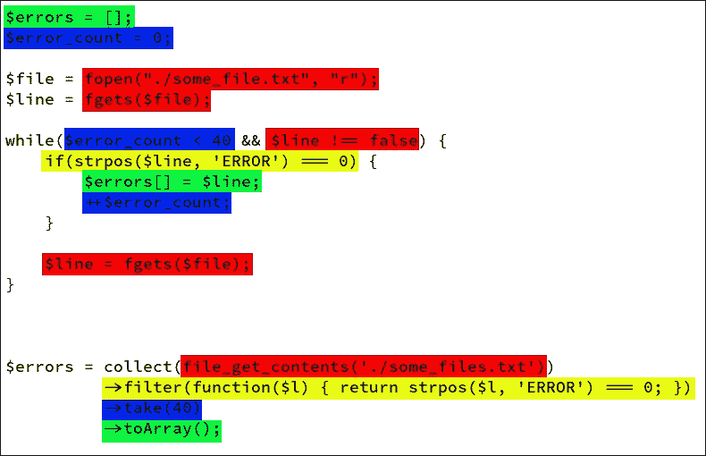

# 第十二章：当我们谈论函数式编程时，我们在谈论什么

函数式编程在过去几年中获得了很多关注。各大科技公司已经开始使用函数式语言：

+   Twitter 使用 Scala：[`www.artima.com/scalazine/articles/twitter_on_scala.html`](http://www.artima.com/scalazine/articles/twitter_on_scala.html)

+   WhatsApp 使用 Erlang 编写：[`www.fastcompany.com/3026758/inside-erlang-the-rare-programming-language-behind-whatsapps-success`](http://www.fastcompany.com/3026758/inside-erlang-the-rare-programming-language-behind-whatsapps-success)

+   Facebook 使用 Haskell：[`code.facebook.com/posts/302060973291128/open-sourcing-haxl-a-library-for-haskell/1`](https://code.facebook.com/posts/302060973291128/open-sourcing-haxl-a-library-for-haskell/1)

在编译为 JavaScript 的函数式语言上已经做了一些非常出色和成功的工作：**Elm**和**PureScript**语言，这只是其中的一部分。有人正在努力创建新的语言，这些语言要么扩展，要么编译为一些更传统的语言；我们可以引用**Hy**和**Coconut**语言用于 Python。

甚至苹果的 iOS 开发新语言**Swift**中也集成了多个函数式编程概念。

然而，本书不是关于使用新语言，而是关于在不必改变整个堆栈或学习全新技术的情况下从函数式技术中获益。通过将一些原则应用到我们日常的 PHP 中，我们可以极大地改善我们的生活和代码质量。

但在进一步之前，让我们从一个对函数式范式的温和介绍开始，解释它到底是什么以及它来自哪里。

# 函数式编程到底是什么？

如果你尝试在互联网上搜索函数式编程的定义，很有可能你会在某个时候找到维基百科的文章([`en.wikipedia.org/wiki/Functional_programming`](https://en.wikipedia.org/wiki/Functional_programming))。除其他事项外，函数式编程被描述如下：

> *在计算机科学中，函数式编程是一种编程范式-一种构建计算机程序的结构和元素的风格，它将计算视为数学函数的评估，并避免改变状态和可变数据。*

Haskell 维基([`wiki.haskell.org/Functional_programming`](https://wiki.haskell.org/Functional_programming))这样描述：

> *在函数式编程中，程序通过评估表达式来执行，与命令式编程相反，在命令式编程中，程序由改变全局状态的语句组成。函数式编程通常避免使用可变状态。*

尽管我们的看法可能有些不同，但我们可以从中概述一些函数式编程的关键定义：

+   评估数学函数或表达式

+   避免可变状态

从这两个核心思想中，我们可以得出许多有趣的属性和好处，这些你将在本书中发现。

## 函数

你可能知道编程语言中的函数是什么，但它与数学函数有何不同，或者像 Haskell 称之为表达式有何不同？ 

数学函数不关心外部世界或程序的状态。对于给定的输入集，输出将始终完全相同。为了避免混淆，开发人员通常在这种情况下使用术语**纯函数**。我们在第二章中讨论了这一点，*纯函数，引用透明度和不可变性*。

## 声明式编程

另一个区别是，函数式编程有时也被称为**声明式编程**，与命令式编程相对。这些被称为**编程范式**。面向对象编程也是一种范式，但它与命令式编程紧密相连。

不必冗长解释差异，让我们通过一个例子来演示。首先是使用 PHP 的命令式方法：

```php
<?php
function getPrices(array $products) {
  // let's assume the $products parameter is an array of products. $prices = [];

  foreach($products as $p) {
    if($p->stock > 0) {
      $prices[] = $p->price;
    }
  }
  return $prices;
}
```

现在让我们看看如何使用 SQL 来完成相同的操作，它是除其他外，还是一种声明性语言：

```php
SELECT price FROM products WHERE stock > 0;
```

注意到区别了吗？在第一个例子中，您逐步告诉计算机要做什么，自己负责存储中间结果。第二个例子只描述您想要的内容；然后，数据库引擎将返回结果。

在某种程度上，函数式编程看起来更像 SQL，而不像我们刚才看到的 PHP 代码。

没有任何解释，以下是您可以使用 PHP 以更加函数式的方式完成的方法：

```php
<?php
function getPrices2(array $products) {
  return array_map(function($p) {
    return $p->price;
  }, array_filter(function($p) {
    return $p->stock > 0;
  }));
}
```

我很乐意承认，这段代码可能并不比第一段更清晰。通过使用专用库，可以改进这一点。我们还将详细了解这种方法的优势。

## 避免可变状态

正如名称本身所暗示的那样，函数是函数式编程的最重要的构建模块。最纯粹的函数式语言只允许您使用函数，根本不允许使用变量，因此避免了任何与状态和其变异有关的问题，同时也使任何一种命令式编程都变得不可能。

尽管这个想法很好，但并不实际；这就是为什么大多数函数式语言允许您拥有某种类型的变量。然而，这些变量通常是不可变的，意味着一旦分配了值，它们的值就不能改变。

# 为什么函数式编程是软件开发的未来？

正如我们刚才看到的，函数式世界正在发展，企业界对其采用正在增长，甚至新的命令式语言也从函数式语言中汲取灵感。但为什么呢？

## 减轻开发人员的认知负担

您可能经常读到或听到程序员不应该被打断，因为即使是小的打断也会导致失去几十分钟。其中我最喜欢的一个例子是下面的漫画：


这在一定程度上是由于认知负担，或者换句话说，您必须记住的信息量，以便理解手头的问题或函数。

如果我们能够减少这个问题，那么好处将是巨大的：

+   代码理解所需的时间将更少，更容易推理

+   打断将导致思维过程中的干扰减少

+   由于遗忘了一些信息而引入的错误将更少

+   对于项目新手来说，学习曲线较小

我认为函数式编程可以极大地帮助。

### 保持状态远离

在认知负担方面的主要竞争者之一，正如之前所展示的漫画中所描述的那样，是在试图理解代码的一部分时，记住所有这些小的状态信息。

每次访问变量或在对象上调用方法时，您都必须问自己它的值是什么，并将其记住，直到您达到当前正在阅读的代码段的末尾。

通过使用纯函数，几乎所有这些问题都会消失。所有参数都在函数签名中。此外，您可以绝对确定，任何使用相同参数的后续调用都会产生完全相同的结果，因为您的函数不依赖于外部数据或任何对象状态。

为了进一步强调这一点，让我们引用本·莫斯利和彼得·马克斯的《Out of the Tar Pit》：

> *[...] 我们相信，当今大多数大型系统中复杂性的最大原因是状态，我们能够限制和管理状态的越多，就越好。*

您可以在[`shaffner.us/cs/papers/tarpit.pdf`](http://shaffner.us/cs/papers/tarpit.pdf)上阅读整篇论文。

### 小的构建模块

当您进行函数式编程时，通常会创建许多小函数。然后您可以像积木一样组合它们。这些小代码片段通常比试图做很多事情的大杂乱方法更容易理解。

我并不是说所有的命令式代码都是一团糟，只是函数式思维真的鼓励编写更小、更简洁的函数，更容易处理。

### 关注点的局部性

让我们看看以下两个例子：



命令式与函数式-关注点的分离

如前面在两个虚构的代码片段中所示，函数式技术有助于以鼓励关注的方式组织代码。在这些片段中，我们可以将关注点分开如下：

+   创建一个列表

+   从文件中获取数据

+   过滤所有以**ERROR**文本开头的行

+   获取前 40 个错误

第二个片段明显对每个关注点有更好的局部性；它们没有分散在代码中。

有人可能会说第一个代码不够优化，可以重写以达到相同的结果。是的，这可能是真的。但就像前面提到的，函数式思维从一开始就鼓励这种架构。

### 声明式编程

我们看到，声明式编程关注的是“做什么”而不是“怎么做”。这有助于更好地理解新代码，因为我们的大脑更容易思考我们想要的东西，而不是如何去做。

当您在线或在餐厅订购东西时，您不会想象您想要的东西将如何被创建或交付，您只会考虑您想要什么。函数式编程也是一样-您从一些数据开始，然后告诉语言您想要对其进行什么操作。

这种代码对非程序员或语言经验较少的人来说通常也更容易理解，因为我们可以可视化数据将会发生什么。以下是《Out of the Tar Pit》中的另一段引文，说明了这一点：

> *当程序员被迫（通过使用具有隐式控制流的语言）指定控制时，他或她被迫指定系统应该如何工作的一个方面，而不仅仅是所需的内容。实际上，他们被迫过度指定问题*

## 更少错误的软件

我们已经看到，函数式编程减少了认知负担，使您的代码更容易理解。这在处理错误时已经是一个巨大的优势，因为它将使您能够快速发现问题，因为您将花费更少的时间理解代码的工作原理，而更多地关注它应该做什么。

但我们刚刚看到的所有好处还有另一个优势。它们也使测试变得更容易！如果您有一个纯函数，并使用一组给定的值进行测试，您可以绝对确定它在生产中总是会返回完全相同的结果。

你有多少次认为你的测试没问题，结果发现在应用程序的某些特定情况下触发了一些隐蔽状态的隐藏依赖？使用纯函数，这种情况应该会少得多。

我们还将在本书的后面学习关于基于属性的测试。尽管这种技术可以用于任何命令式代码库，但其背后的理念来自函数式世界。

## 更容易的重构

重构从来都不容易。但由于纯函数的唯一输入是其参数，唯一输出是返回值，事情变得更简单了。

如果您重构的函数继续为给定输入返回相同的输出，您可以保证您的软件将继续工作。您不会忘记在对象的某个地方设置一些状态，因为您的函数是无副作用的。

## 并行执行

我们的计算机拥有越来越多的核心，云计算使跨多个节点共享工作变得更加容易。然而，挑战在于确保计算可以分布。

诸如映射和折叠等技术，再加上不可变性和状态的缺失，使这变得相当容易。

当然，你仍然会遇到与分布式计算本身相关的问题，比如分区和故障检测，但将计算分成多个工作负载会变得更加容易！如果你想了解更多关于分布式系统的知识，我可以推荐这篇文章（[`videlalvaro.github.io/2015/12/learning-about-distributed-systems.html`](http://videlalvaro.github.io/2015/12/learning-about-distributed-systems.html)）。

## 强制执行良好的实践

这本书证明了函数式编程更多地关乎我们做事情的方式，而不是特定的语言。你可以在几乎任何具有函数的语言中使用函数式技术。你的语言仍然需要具有某些属性，但不需要太多。我喜欢谈论拥有函数式思维。

如果是这样，为什么公司要转向函数式语言呢？因为这些语言强制执行我们将在本书中学到的最佳实践。在 PHP 中，你必须始终记住使用函数式技术。在 Haskell 中，你不能做其他任何事情；语言强制你编写纯函数。

当然，你仍然可以在任何语言中写糟糕的代码，即使是最纯净的代码。但通常，人们，尤其是开发人员，喜欢选择最不费力的路径。如果这条路径是通向高质量代码的路径，他们会选择它。

# 函数式世界的简史

从历史上看，函数式编程起源于学术界。直到最近几年，更多的主流公司才开始使用它来开发面向消费者的应用程序。现在甚至有些人在大学以外进行这个领域的新研究。但让我们从一开始开始。

## 最初的几年

我们的故事始于 20 世纪 30 年代，当时阿隆佐·丘吉尔正式化了λ演算，这是一种使用接受其他函数作为参数的函数来解决数学问题的方法。尽管这是函数式编程的基础，但直到 1958 年约翰·麦卡锡发布了**Lisp**，这个概念才首次被用于实现编程语言。公平地说，被认为是第一种编程语言的**Fortran**是在 1957 年发布的。

尽管 LISP 被认为是一种多范式语言，但它经常被引用为第一种函数式语言。很快，其他人也领会了这个暗示，并开始围绕函数式编程的思想进行工作，导致了**APL**（1964）、**Scheme**（1970）、**ML**（1973）、**FP**（1977）等许多其他语言的诞生。

FP 本身现在基本上已经死了，但约翰·巴克斯在演讲中提出的概念对函数式范式的研究至关重要。这可能不是最容易阅读的，但仍然非常有趣。我建议你尝试阅读整篇论文，网址是[`worrydream.com/refs/Backus-CanProgrammingBeLiberated.pdf`](http://worrydream.com/refs/Backus-CanProgrammingBeLiberated.pdf)。

## Lisp 家族

Scheme，于 1970 年首次发布，是试图修复 Lisp 的一些缺点。与此同时，Lisp 诞生了一个编程语言家族或方言：

**Common Lisp**（1984 年）：试图编写一个语言规范，以重新统一当时正在编写的所有 Lisp 方言。

**Emacs Lisp**（1985 年）：用于定制和扩展 Emacs 编辑器的脚本语言。

**Racket**（1994 年）：最初创建为围绕语言设计和创建的平台，现在被用于多个领域，如游戏脚本、教育和研究。

**Clojure**（2007 年）：由 Rich Hickey 在长时间反思后创建的，旨在创建完美语言。Clojure 以**Java 虚拟机**（**JVM**）为目标。有趣的是，Clojure 现在也可以有其他目标，例如 JavaScript（ClojureScript）和.NET 虚拟机。

**Hy**（2013 年）：一个以 Python 运行时为目标的方言，允许使用所有 Python 库。

## ML

ML 也产生了一些后代，最著名的是**Standard ML**和**OCaml**（1996 年），至今仍在使用。它也经常被引用为许多现代语言设计的影响。举几个例子：Go、Rust、Erlang、Haskell 和 Scala。

## 爱尔兰语的崛起

我之前说过，函数式语言的主流使用是在最近几年开始发生的。这并不完全正确。爱立信早在 1986 年就开始研究爱尔兰语，对函数式语言所承诺的稳定性和健壮性感兴趣。

起初，爱尔兰语是在**Prolog**之上实现的，但证明速度太慢，1992 年改用将 Erlang 编译为 C 的虚拟机进行重写，使得爱立信能够在 1995 年早期在生产电话系统上使用 Erlang。自那时起，它已经被全球电信公司使用，并被认为是高可用性时最好的语言之一。

## Haskell

1990 年标志着 Haskell 的首次发布，这是全球学术界进行规范工作的结果，旨在创建第一个围绕惰性纯函数式语言的开放标准。其想法是将现有的函数式语言整合成一个共同的语言，以便成为进一步研究函数式语言设计的基础。

此后，Haskell 已经从纯学术语言发展成为领先的函数式语言之一。

## Scala

Scala 的开发始于 2001 年，由前 Java 核心开发人员 Martin Odersky 发起。主要思想是通过将函数式编程与更传统的命令式概念混合在一起，使函数式编程更易接近。2004 年的首次公开发布同时面向 JVM 和.NET 使用的**通用运行时语言**（**CRM**）（第二个目标在 2012 年后被放弃）。

Scala 源代码可以与目标虚拟机的语言结构一起使用。直接使用现有的 Java 库以及能够回退到命令式风格是 Scala 迅速在企业界获得地位的原因之一。

由于 Android 使用了与 Java 兼容的虚拟机，Scala 非常适合移动开发，还有一个将其编译成 JavaScript 的倡议，这意味着你可以在服务器和客户端都使用它进行 Web 开发。

## 新来者

如今，函数式编程语言开始在主流中获得更多认可，并且新的语言也在学术界之外被创造出来。以下是世界各地人们正在积极开发的一些语言的快速概述。

**Elm**是一次认真的尝试，旨在创建一个编译成 JavaScript 的函数式语言，除了 ClojureScript 之外。这是 Evan Czaplicki 的论文的结果，试图创建一种函数式响应式语言，这是我们将在本书的最后一章中探讨的概念。几年前首次展示了一个时间旅行调试器（[`debug.elm-lang.org/`](http://debug.elm-lang.org/)），这个想法后来在 JavaScript 框架如**React**中以更多的痛苦实现。通过在线编辑器、非常好的教程以及可以使用**npm**进行安装，大大降低了入门门槛。

**PureScript**是另一种编译成 JavaScript 的函数式语言。它比 Elm 更接近 Haskell，并遵循更数学化的方法。社区规模较小，但正在进行大量工作，使语言更加用户友好。PureScript 编译器是用 Haskell 编写的，开始起步有点困难，但如果你想要健壮的客户端代码，这是值得的。

**Idris**在我看来，实际上还没有准备好在生产环境中大放异彩。然而，它在这个列表中有它的位置，因为它是实现依赖类型的更先进的函数语言之一。依赖类型是一个高级的类型概念，主要出现在纯学术语言中。这本书的范围超出了详细解释它的范围，但让我们做一个快速的例子：*一对整数*是一个**类型**；*第二个整数大于第一个整数的一对整数*是一个**依赖类型**，因为类型取决于变量的值。这样的类型系统的优势在于您可以更彻底地证明您的数据是正确的，因此您的软件的结果也是正确的。然而，这是一种非常高级的技术，这样的语言很少，而且很难学习。

# 函数式编程术语

像其他领域一样，函数式编程也有自己的术语。这个小词汇表的目标是使阅读本书更容易，同时为您提供更多对您在网上找到的资源的理解。

**Arity**

函数接受的参数数量。术语 nullary、unary、binary 和 ternary 也用于表示分别接受 0、1、2 和 3 个参数的函数。另请参见可变参数。

**高阶函数**

返回另一个函数的函数。《第一章》*PHP 中的函数作为一等公民*进一步解释了高阶函数的概念，因为这是函数式编程的基础之一。

**副作用**

任何影响当前函数外部世界的事物：改变全局状态，通过引用传递的变量，对象中的值，写入屏幕或文件，接受用户输入。这个概念是重要的，并将在本书的多个章节中进一步探讨。

**纯度**

如果一个函数只使用显式参数并且没有副作用，则称该函数是纯的。纯函数是一个在使用相同参数调用时总是产生完全相同结果的函数。纯语言是只允许纯函数的语言。这个概念是函数式编程的基石，正如《第二章》*纯函数、引用透明度和不可变性*中所讨论的那样。

**函数组合**

组合函数是一种有用的技术，可以重用各种函数作为构建块来实现更复杂的操作。您可以组合两个函数来创建一个新函数`h`，而不是总是在函数`f`的结果上调用函数`g`。《第四章》*组合函数*演示了如何使用这个想法。

**不可变性**

一旦赋值就不能更改的不可变变量。

**部分应用**

将给定值分配给函数的某些参数的过程，以创建一个较小 arity 的新函数。这有时被称为固定或绑定一个值到一个参数。这在 PHP 中有点难以实现，但《第四章》*组合函数*给出了一些如何做到这一点的想法。

**柯里化**

类似于部分应用，柯里化是将具有多个参数的函数转换为多个一元函数组合以实现相同结果的过程。柯里化的原因和思想在《第四章》*组合函数*中有介绍。

**折叠/减少**

将集合减少到*单个*值的过程。这是函数式编程中经常使用的概念，在《第三章》*PHP 中的函数基础*中有详细演示。

**映射**

在集合的所有值上应用函数的过程。这是函数式编程中经常使用的概念，并且在第三章，“PHP 中的函数基础”中得到了详细展示。

**函子**

任何类型的值或集合都可以应用映射操作。函子在给定函数时负责将其应用于其内部值。据说函子*包装*值。这个概念在第五章，“函子、应用程序和单子”中被提出。

**应用程序**

包含上下文中的函数的数据结构。应用程序在给定值时负责将“内部”函数应用于它。据说函子*包装*函数。这个概念在第五章，“函子、应用程序和单子”中被提出。

**半群**

任何类型，您可以将两个值关联起来。例如，字符串是一个半群，因为您可以将它们连接起来。

整数有多个半群：

+   加法半群，其中将整数相加

+   乘法半群，其中将整数相乘

单子

单子是一个同时具有标识值的半群。标识值是一个值，当与相同类型的对象关联时不会改变其值。整数的加法标识是 0，字符串的标识是空字符串。

单子还要求多个值的关联顺序不会改变结果，例如，*(1 + 2) + 3 == 1 + (2 + 3)*。

**单子**

单子既可以作为函子，也可以作为应用程序；有关更多信息，请参阅专用第五章，“函子、应用程序和单子”。

**Lift/LiftA/LiftM**

将某物放入函子、应用程序或单子的过程。

**态射**

转换函数。我们可以区分多种形态：

+   **自同态**：输入和输出的类型保持不变，例如，将字符串大写。

+   **同构**：类型改变，但数据保持不变，例如，将包含坐标的数组转换为坐标对象。

**代数类型/联合类型**

将两种类型组合成一种新类型。Scala 称这些为任一类型。

**选项类型/可能类型**

包含有效值和等效空值的联合类型。当函数不确定返回有效值时使用这种类型。第三章，“PHP 中的函数基础”解释了如何使用这些简化错误管理。

**幂等性**

如果重新应用函数到其结果不会产生不同的结果，则称函数是幂等的。如果将幂等函数与自身组合，它仍将产生相同的结果。

**Lambda**

匿名函数的同义词，即分配给变量的函数。

**谓词**

对于给定的一组参数返回 true 或 false 的函数。谓词经常用于过滤集合。

**引用透明性**

如果表达式可以被其值替换而不改变程序的结果，则称表达式是引用透明的。这个概念与纯度紧密相关。第二章，“纯函数、引用透明和不可变性”探讨了两者之间的细微差别。

**惰性评估**

如果表达式的结果只有在需要时才计算，则称语言是惰性评估的。这允许您创建无限列表，并且只有在表达式是引用透明时才可能。

**非严格语言**

非严格语言是一种所有构造都是惰性评估的语言。只有少数语言是非严格的，主要是因为语言必须是纯粹的才能是非严格的，并且它带来了非平凡的实现问题。最著名的非严格语言可能是 Haskell。

几乎所有常见的语言都是严格的：C、Java、PHP、Ruby、Python 等等。

**可变元**

具有动态元数的函数称为**可变元**。这意味着函数接受可变数量的参数。
