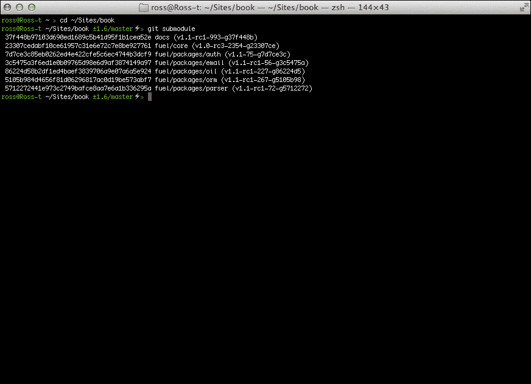
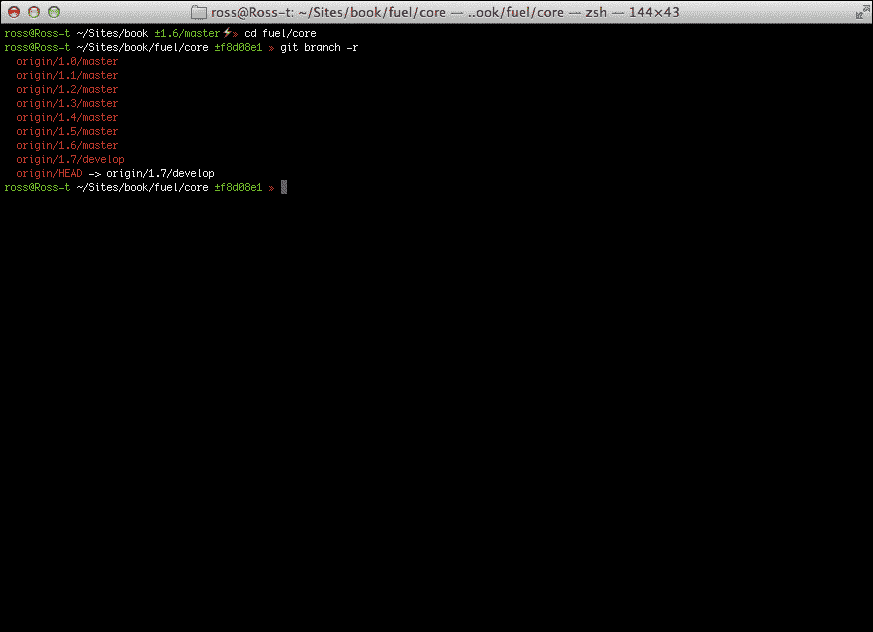
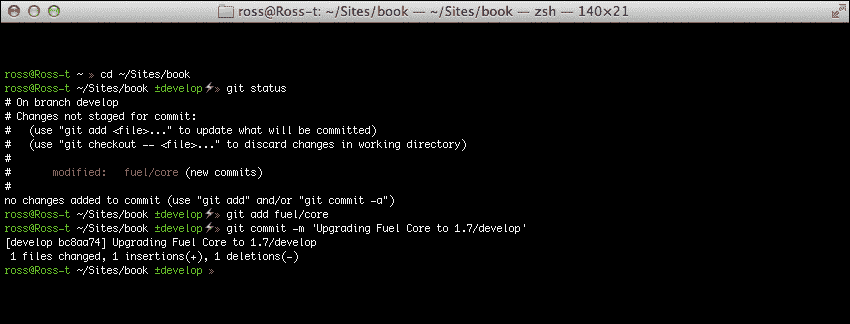
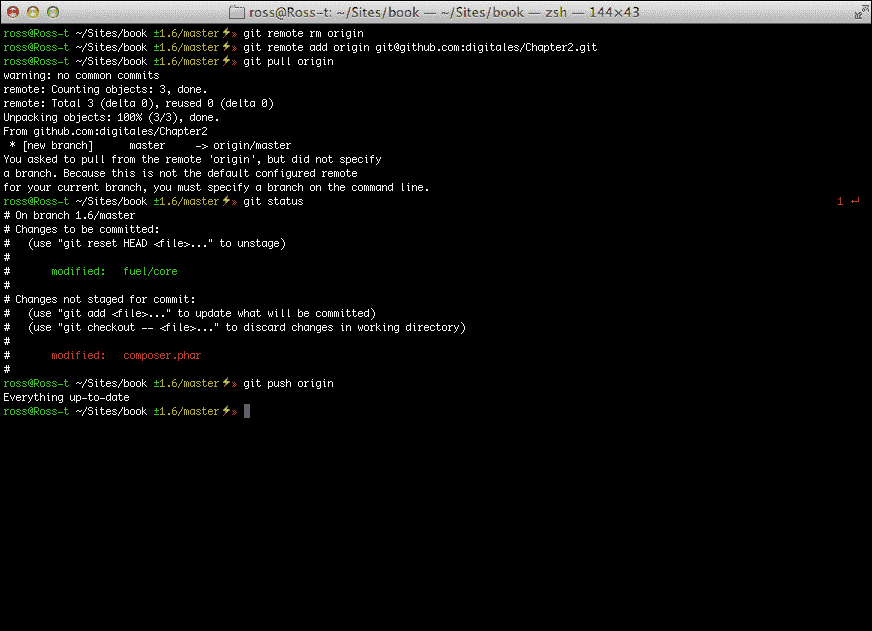

# 第二章：安装

在本章中，我们将介绍一些安装 FuelPHP 的基础知识。即使作为经验丰富的 PHP 开发人员，一些主题可能是新的。我们将介绍源代码控制的基础知识**Git**，并在后面的章节中介绍使用名为**Capistrano**的 Ruby 工具进行自动部署。不用担心，尽管它是用 Ruby 编写的，但即使您以前没有使用过 Ruby，它也很容易使用。

每个人都有自己设置开发环境的方式—有些人喜欢从源代码编译 Apache，而其他人则喜欢 MAMP 或 WAMP 的简单性。无论您选择的环境是什么，FuelPHP 都很可能相当快速和容易设置。

在本章中，我们将涵盖以下主题：

+   准备开发环境

+   使用 Git 进行源代码控制

+   安装 FuelPHP 并设置您的项目

+   与不同环境一起工作并迁移数据库更改

# 准备开发环境

FuelPHP 应该可以在任何 Web 服务器上运行，并且已经经过 Apache、IIS 和 Nginx 的测试。它还可以在 Windows 和*nix（Unix、Linux 和 Mac）操作系统上运行。

就这份指南而言，示例将基于*nix 和 Mac，但相同的步骤也适用于其他操作系统，如 Windows。

## Apache

还有其他的 Web 服务器可用，但在本书中，我们假设使用 Apache。

为了使用诸如`http://example.com/welcome/hello`这样的清晰 URL，Apache 将需要安装和启用`mod_rewrite`模块。

## PHP

您可能已经安装了 PHP，尤其是对 FuelPHP 感兴趣的人。

FuelPHP 需要 PHP 版本 5.3 或更高。它还使用了几个 PHP 扩展：

+   `fileinfo()`: 此扩展用于上传文件，可能需要在 Windows 上手动安装

+   `mbstring()`: 这在整个框架中都在使用

+   `mcrypt`: 这用于核心加密功能

+   `PHPSecLib`: 如果找不到`mcrypt`，则可以使用此作为替代

有许多设置 PHP 的方法，更多信息可以在`php.net`和[`www.phptherightway.com`](http://www.phptherightway.com)找到。

## 数据库交互

在 FuelPHP 中与数据库的交互由驱动程序处理；因此，它可以支持多种数据库。FuelPHP 默认支持 MySQL（通过 MySQL、MySQLi 驱动程序）、MongoDB、Redis 和任何具有**PHP 数据对象**（**PDO**）驱动程序的数据库。

在 FuelPHP 中编写的应用程序和站点可以在没有关系数据库或无 SQL 数据存储（如 Mongol DB）的情况下完美运行，但在本书中，我们将使用一个来演示 FuelPHP 一些令人惊叹的功能。

MySQL 在大多数平台上都得到很好的支持，并且是最广泛使用的数据库系统之一。您可以访问[`dev.mysql.com/downloads/mysql`](http://dev.mysql.com/downloads/mysql)，那里有很好的指导和安装程序。

## 源代码控制-介绍 Git

尽管并非所有项目都需要使用源代码控制，但回滚到旧版本的代码或与开发团队合作肯定会很方便。

Git 是一个非常强大的工具，相对容易上手。尽管并非所有项目都需要使用 Git 或**Subversion**等源代码控制系统，但它们都会受益于此。一个关键的好处是能够恢复到代码的先前版本，可以将其视为通用的“撤销”功能。这个“撤销”功能不仅适用于单个文档，还适用于整个项目。核心团队在开发和增强 FuelPHP 框架时也使用它们。如果您不熟悉源代码控制，可以手动安装框架，但本书将假定您正在使用 Git 和源代码控制。

如果您想了解更多关于使用 Git 的信息，可以在以下链接找到在线版本的手册：

[`git-scm.com/book/`](http://git-scm.com/book/)

Git 起源于 Linux 世界。因此，从源代码编译是安装它的传统方式，但现在也存在替代方法。Ubuntu 可以使用以下`apt-get`命令安装 Git：

```php
**$ sudo apt-get install git-core**

```

OS X 用户有多种安装 Git 的选项，包括**MacPorts** ([`www.macports.org`](http://www.macports.org)) 和**Homebrew** ([`github.com/mxcl/homebrew`](http://github.com/mxcl/homebrew))：

+   在通过 MacPorts 安装时，我们使用以下命令：

```php
$ sudo port install git-core +svn
```

+   在使用 Homebrew 时，我们使用：

```php
$ brew install git
```

Windows 用户可以在以下链接找到`msysGit`安装程序：

[`msysgit.github.io`](http://msysgit.github.io)

安装 Git 后，建议使用您的用户详细信息配置它，如以下命令所示：

```php
**$ git config --global user.name "Your name"**
**$ git config --global user.email "user@domain.com"**

```

为了使 Git 的输出更加直观，建议在命令行中启用颜色：

```php
**$ git config --global color.ui auto**

```

### 有关 Git 的更多信息

可以在[`git-scm.com`](http://git-scm.com)找到 Git 客户端和可用命令的一个很好的替代方案。GitHub 也有一个设置 Git 的良好指南，可在以下链接找到：

[`help.github.com/articles/set-up-git`](http:// https://help.github.com/articles/set-up-git)

### 提示

**额外阅读材料**

如果您熟悉源代码控制，Git 的核心概念将非常熟悉。可能需要一些时间来习惯语法。以下是一些有关学习更多关于 Git 的有用链接：

+   [`git-scm.com/book/en/`](http://git-scm.com/book/en/)：Git 的在线指南

+   [`git-scm.com`](http://git-scm.com)：一个很好的资源集合

+   [`nvie.com/posts/a-successful-git-branching-model/`](http://nvie.com/posts/a-successful-git-branching-model/)：使用名为**git-flow**的工具来与 Git 一起工作是一个很好的方法，它有助于保持分支结构化和受控

# 使用 curl 和 Oil 获取并安装 FuelPHP

通过使用`curl`（或`wget`）和 FuelPHP 命令行工具 Oil 的精简版本，安装 FuelPHP 的最简单方法。

要安装快速安装程序，可以从 shell 或终端窗口运行以下命令：

```php
**$ curl get.fuelphp.com/oil | sh***

```

这将要求您输入密码，以将新文件安装到`/usr/bin`目录中。

完成后，您只需要使用`oil`而不是`php oil`，但两者都可以用于命令行迭代。

### 注意

如果您之前使用的 FuelPHP 版本旧于 1.6，您需要重新安装 FuelPHP 以允许其使用**Composer**工具。

要创建一个新项目，只需运行以下命令：

```php
**$ oil create <project>**

```

在这里，`<project>`是您的项目名称。这将在当前目录中创建一个名为项目名称的文件夹。您的所有应用程序代码和软件包都将在项目文件夹中创建。

## 从 GitHub 克隆

如果您不想使用 curl，或者只想在命令行中克隆 FuelPHP 存储库，可以导航到您希望文件放置的文件夹。例如：

```php
**$ cd /Users/ross/Sites**
**$ git clone --recursive git://github.com/fuel/fuel.git <project name>**

```

这将在您的 Web 服务器根目录中创建一个名为`<project name>`的文件夹。它将包含所有必要的 FuelPHP 文件，包括所有核心软件包。

### 继续安装

除了单个命令或从 GitHub 克隆之外，还可以手动下载文件并以这种方式安装。有关此方法的更多信息，请访问[`fuelphp.com/docs/installation/instructions.html`](http://fuelphp.com/docs/installation/instructions.html)。

### 注意

如果您手动安装文件，出于安全原因，建议将 fuel 文件夹移出公共可访问的 Web 文件夹目录。FuelPHP 默认的`.htaccess`文件也阻止核心文件被 Web 访问。

在项目上工作时，某些应用程序文件夹的写入权限可能会发生更改。这些文件夹可能包括日志和缓存，导致应用程序停止运行。如果发生这种情况，可以使用 Oil 来进行更正。它还可以用于使它们可被 Web 服务器写入：

```php
**$ php oil refine install**
 **Made writable: APPPATH/cache**
 **Made writable: APPPATH/logs**
 **Made writable: APPPATH/tmp**
 **Made writable: APPPATH/config**

```

## 设置您的项目

现在您已经安装了 FuelPHP，设置新项目非常容易。首先，您需要导航到您想要从中工作的文件夹，例如 Mac OS X 上的`Sites`文件夹。之后，运行以下命令：

```php
**php oil create <project name>**

```

然后再次运行：

```php
**$ cd ~/Sites/**
**$ php oil create book**

```

这将安装运行 FuelPHP 所需的核心文件和软件包。它还将在项目中设置 Git 子模块。这有时可能会很棘手，但 FuelPHP 以非常灵活和强大的方式使用它们。使用子模块，您可以对项目中使用的软件包的版本进行精细控制。它还使升级或安装安全更新变得非常容易。

FuelPHP 创建的结构相当简单：

```php
**/**
 **fuel/**
 **app/**
 **core/**
 **packages/**
 **public/**
 **.htaccess**
 **assets/**
 **index.php**
 **oil**

```

像 CSS 和 JavaScript 这样的文件放在公共目录中的`assets`文件夹中。一旦安装了一些软件包，您对项目所做的大部分更改将发生在`fuel/app`文件夹中。我们将在接下来的几章中通过示例来介绍这些更改。

## 使用子模块轻松更新 FuelPHP 核心和软件包

子模块是以受控方式处理项目中的多个存储库的绝佳方式。例如，可以升级核心 FuelPHP 框架的版本，同时保留其他第三方软件包的旧版本。这使得更容易测试新功能，以确保它不会影响您的项目，或者突出显示您可能需要进行的更改。在本节中，我们将介绍使用子模块的一些基础知识，但如果您想要更多信息，我建议查看[`git-scm.com/book/en/Git-Tools-Submodules`](http://git-scm.com/book/en/Git-Tools-Submodules)中提供的 Git 手册的*子模块*部分。

如果您想查看当前为您的项目设置了哪些子模块，请导航到项目的根目录，然后运行`git submodule`命令，如下所示：

```php
**$ cd ~/Sites/book**
**$ git submodule**

```



如您所见，为每个 FuelPHP 项目设置了六个子模块并使用了它们。

如果您想要检查可用的其他子模块版本，请导航到子模块的文件夹，然后运行`git branch -r`命令，如下所示：

```php
**$ cd fuel/core**
**$ git branch -r**

```



然后，我们可以从其他分支中复制代码来测试新功能，或者回滚到以前的代码版本。例如，让我们看看当我们使用 FuelPHP 的开发版本时会发生什么：

```php
**$ git checkout origin/1.7/develop**

```


每个子模块都像自己的存储库一样，并且不考虑主项目存储库。如果您希望主项目考虑子模块的更改，只需提交所有更改到子模块，然后导航到主项目文件夹并提交项目存储库的更改，如下所示：

```php
**$ cd ~/Sites/book**
**$ git status**
**$ git add fuel/core**
**$ git commit -m 'Upgrading Fuel Core to 1.7/develop'**

```

### 注意

`fuel/core`与`fuel/core/`不同。



## 提交您的代码

设置项目后，Git 设置将希望将代码发送到 FuelPHP 存储库。因此，首先要做的是更改此设置，以便将其发送到您的项目。我们将使用 GitHub 进行演示，这与 FuelPHP 存储在同一位置。

首先，在 GitHub 上创建一个帐户（[`github.com/new`](https://github.com/new)），然后按照说明创建一个存储库。创建存储库后，复制存储库地址，例如`git@github.com:digitales/Chapter2.git`；您很快就会需要它。

### 注意

[Bitbucket.org](http://Bitbucket.org)是一个类似的服务，除了它将允许您拥有无限的私人存储库。

一旦您创建了存储库并复制了存储库地址，就该回到终端了。在终端中导航到项目目录，然后为存储库添加一个远程，例如：

```php
**$ cd ~/Sites/book**
**$ git remote rm origin** 
**$ git remote add origin git@github.com:digitales/Chapter2.git**
**$ git pull origin**
**$ git push origin master**

```



现在我们已经更新了 origin，是时候深入了解一下子模块，然后进行配置和一些基本的生产环境配置。

### 提示

**下载示例代码**

您可以从[`www.packtpub.com`](http://www.packtpub.com)的帐户中下载您购买的所有 Packt 图书的示例代码文件。如果您在其他地方购买了这本书，您可以访问[`www.packtpub.com/support`](http://www.packtpub.com/support)并注册，以便文件直接通过电子邮件发送给您。

## Composer - 包管理器

在较新版本的 FuelPHP 中，Composer 包管理器用于动态地从**Packagist**、Github 或自定义位置拉取依赖项。它使用`composer.json`文件进行控制，您会在项目的 FuelPHP 安装的根文件夹中找到该文件。

通常，您需要手动安装 Composer，但 FuelPHP 包含了`composer.phar`库，因此您可以直接运行 Composer：

```php
**$ php composer.phar self-update**
**$ php composer.phar update**

```


### 注意

如果您不执行此步骤，FuelPHP 将无法启动，因为现在正在使用 Composer 加载框架的重要组件。

## 配置

FuelPHP 采用配置优于约定的方法，遵循最佳实践和指南。所有应用程序或项目特定的代码都存储在`app/config`文件夹中，主配置文件包括`config.php`。值得一提的是，您可以选择覆盖哪些配置。任何未指定的键或值将从核心配置中加载。这意味着在升级 FuelPHP 版本时，对默认配置的任何更改都不会丢失。

## 在生产环境中运行

当您安装 FuelPHP 时，默认情况下它会认为自己处于开发环境中，但可以通过设置环境来快速更改。

这可以通过虚拟主机（或类似）为域完成，也可以通过应用程序的公共文件夹中的`.htaccess`文件完成，使用以下代码：

```php
**Set FUEL_ENV production**

```

默认情况下，环境将在应用程序和命令行任务中设置为开发环境。本书的后续章节将介绍在生产环境中运行命令行任务。

## 执行迁移

迁移是确保数据库在不同环境或团队成员之间保持一致的好方法。它提供了一种系统化的方式来更新数据存储结构。手动在数据库上运行 SQL 语句然后想知道是否已更新了正确的数据库结构的日子已经过去了。在开发网站的任何阶段，数据库都可以向前更改或回滚到旧版本的数据库结构。

迁移的示例将在本书的后续部分中成为项目的一部分。

# 总结

在本章中，我们已经设置了开发环境，并介绍了 Git 源代码控制及其一些好处。我们简要地研究了如何将项目调整到不同的环境，并配置源代码控制以考虑不同的分支。我们还安装了 FuelPHP。

在下一章中，我们将在构建演示应用程序之前检查 FuelPHP 架构。
