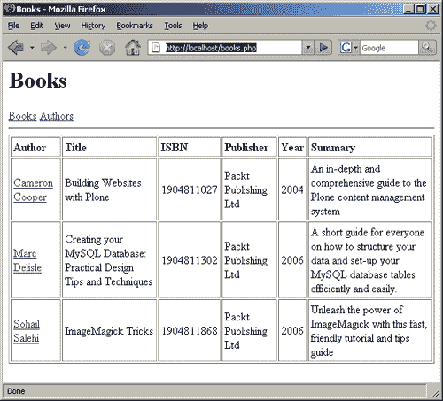

# 第二章。使用 PHP 数据对象：第一步

在上一章中，我们简要概述了 PDO 是什么，如何使用 PDO 连接到您喜欢的数据库，如何发出简单的查询以及如何处理错误。现在您已经确信 PDO 是一个好东西，并且正在考虑积极使用它，我们将深入了解它所提供的所有功能。

在本章中，我们将更仔细地研究使用 PDO 和连接字符串（数据源名称）创建数据库连接，`PDOStatement`类以及如何遍历结果集。我们还将创建一个小型的图书管理应用程序，它将允许我们管理您家中图书的收藏。该应用程序将能够列出书籍和作者，并添加和编辑它们。

我们将首先看一下连接字符串，因为没有它们，我们将无法连接到任何数据库。然后我们将创建一个示例数据库，本书中的所有示例都将基于此数据库。

我们将离开简单的、想象中的汽车数据库，并创建一个真正的工作数据库，其中包含几个表。但是，现在我们将处理书籍和作者的经典示例。我们选择这个例子是因为这样的实体更常见。关系模型将相对简单，这样您就可以轻松地跟随示例，如果您已经在其他地方遇到过这样的数据库。

# 连接字符串

连接字符串或数据源名称（在 PDO 文档中称为 DSN）是 PHP 字符串，其中包含数据库管理系统的名称和数据库本身的名称，以及其他连接参数。

它们相对于使用传统的方法创建数据库连接的优势在于，如果更改数据库管理系统，您无需修改代码。连接字符串可以在配置文件中定义，并且该文件由您的应用程序处理。如果您的数据库（数据源）更改，您只需编辑该配置文件，其余代码将保持完整。

由于不同的数据库管理系统的存在，PDO 中使用的连接字符串不同。但是，它们始终具有一个共同的前缀，表示底层数据库驱动程序。请记住第一章中的 MySQL、SQLite 和 PostgreSQL 示例。三个连接字符串看起来像下面这样：

```php
mysql:host=localhost;dbname=cars
sqlite:/path/to/cars.db
pgsql:host=localhost dbname=cars

```

如我们所见，前缀（第一个分号之前的子字符串）始终保留 PDO 驱动程序的名称。由于我们不必使用不同的函数来创建与 PDO 的连接，这个前缀告诉我们应该使用哪个内部驱动程序。字符串的其余部分由该驱动程序解析以进一步初始化连接。在这些情况下，我们提供了数据库名称；对于 MySQL 和 PostgreSQL；我们还提供了服务器运行的主机名。（由于 SQLite 是一个本地数据库引擎，这样的参数是没有意义的。）

如果您想指定其他参数，您应该查阅您的数据库手册（[www.php.net/pdo](http://www.php.net/pdo)始终是一个很好的起点）。例如，MySQL PDO 驱动程序理解以下参数：

+   **host** - 服务器运行的主机名（在我们的示例中为*localhost*）

+   **port** - 数据库服务器正在侦听的端口号（默认为*3306*）

+   **dbname** - 数据库的名称（在我们的示例中为*cars*）

+   **unix_socket** - MySQL 的 UNIX 套接字（而不是主机和/或端口）。

### 注意

`SQLite:`前缀表示连接到 SQLite 3 数据库。要连接到 SQLite 2 数据库，您必须使用`SQLite2:`前缀。有关详细信息，请参阅[`www.php.net/manual/en/ref.pdo-sqlite.connection.php`](http://www.php.net/manual/en/ref.pdo-sqlite.connection.php)。

正如您可能已经注意到的，不同的驱动程序使用不同的字符来分隔参数——例如 MySQL 中的分号和 PostgreSQL 中的空格。

## 创建示例数据库

假设您在家里有一个很好的图书馆，您希望计算机帮助您管理它。您决定使用 PHP 和当然 PDO 创建一个基于 Web 的数据库。从现在开始，示例将是针对 MySQL 和 SQLite 数据库的。

### 数据模型

由于我们的数据库非常简单，因此我们只会在其中有两个实体：作者和书籍。因此，我们将创建两个同名的表。现在，让我们考虑每个实体将具有哪些属性。

作者将有他们的名字、姓氏和简短的传记。表格将需要一个我们称之为*id*的主键。我们将使用它来从`books`表中引用作者。

书是由作者写的。（有时它们是由多位作者写的，但我们将在这里只考虑由一位作者写的书。）因此，我们将需要一个字段来存储作者的 ID，以及书的标题、ISBN 号、出版商名称和出版年份。此外，我们将包括书的简短摘要。

我们需要一个单独的作者表，因为一个作者可能写了多本书。否则，我们的示例将非常简单！因此，我们选择了一个两表数据库结构。如果我们考虑由多位作者编写的书籍，我们将需要三个表，这将使示例变得非常复杂。

### 创建 MySQL 数据库

当您启动了 MySQL 命令行客户端后，您将看到`mysql>`提示符，您可以在其中发出命令来创建数据库和其中的表：

```php
mysql> create database pdo;
Query OK, 1 row affected (0.05 sec)
mysql> use pdo;
Database changed
mysql> create table books(
-> id int primary key not null auto_increment,
-> author int not null,
-> title varchar(70) not null,
-> isbn varchar(20),
-> publisher varchar(30) not null,
-> year int(4) not null,
-> summary text(2048));
Query OK, 0 rows affected (0.17 sec)
mysql> create table authors(
-> id int primary key not null auto_increment,
-> firstName varchar(30) not null,
-> lastName varchar(40) not null,
-> bio text(2048));
Query OK, 0 rows affected (0.00 sec)

```

如您所见，我们已经创建了一个名为`pdo`的数据库。我们还创建了两个表：books 和 authors，就像我们计划的那样。现在让我们看看如何在 SQLite 中做到这一点。由于我们无法在 SQLite 命令行客户端内创建数据库，我们会这样启动它：

```php
> sqlite3 pdo.db
sqlite> create table books(
...> id integer primary key,
...> author integer(11) not null,
...> title varchar(70) not null,
...> isbn varchar(20),
...> publisher varchar(30) not null,
...> year integer(4) not null,
...> summary text(2048));
sqlite> create table authors(
...> id integer(11) primary key,
...> firstName varchar(30) not null,
...> lastName varchar(40) not null,
...> bio text(2048));

```

如您所见，SQLite 的 SQL 略有不同——主键声明时没有`NOT NULL`和`auto_increment`选项。在 SQLite 中，声明为`INTEGER PRIMARY KEY`的列会自动递增。现在让我们向数据库插入一些值。MySQL 和 SQLite 的语法将是相同的，所以这里我们只呈现 MySQL 命令行客户端的示例。我们将从作者开始，因为我们需要他们的主键值来插入到书籍表中：

```php
mysql> insert into authors(firstName, lastName, bio) values(
-> 'Marc', 'Delisle', 'Marc Delisle is a member of the MySQL
Developers Guide');
Query OK, 1 row affected (0.14 sec)
mysql> insert into authors(firstName, lastName, bio) values(
-> 'Sohail', 'Salehi', 'In recent years, Sohail has contributed
to over 20 books, mainly in programming and computer graphics');
Query OK, 1 row affected (0.00 sec)
mysql> insert into authors(firstName, lastName, bio) values(
-> 'Cameron', 'Cooper', 'J. Cameron Cooper has been playing
around on the web since there was not much of a web with which to
play around');
Query OK, 1 row affected (0.00 sec)

```

现在我们已经插入了三位作者，让我们添加一些书籍。但在这样做之前，我们应该知道哪个*作者*有哪个*id*。一个简单的`SELECT`查询将帮助我们：

```php
mysql> select id, firstName, lastName from authors;
+----+-----------+----------+
| id | firstName | lastName |
+----+-----------+----------+
| 1 | Marc | Delisle |
| 2 | Sohail | Salehi |
| 3 | Cameron | Cooper |
+----+-----------+----------+
3 rows in set (0.03 sec)

```

现在我们终于可以使用这些信息添加三本书，每本书都是由这些作者中的一位写的：

```php
mysql> insert into books(author, title, isbn, publisher, year, summary) values(
-> 1, 'Creating your MySQL Database: Practical Design Tips and
Techniques', '1904811302', 'Packt Publishing Ltd', '2006',
-> 'A short guide for everyone on how to structure your data and
set-up your MySQL database tables efficiently and easily.');
Query OK, 1 row affected (0.00 sec)
mysql> insert into books(author, title, isbn, publisher, year, summary) values(
-> 2, 'ImageMagick Tricks', '1904811868', 'Packt Publishing
Ltd', '2006',
-> 'Unleash the power of ImageMagick with this fast, friendly
tutorial, and tips guide');
Query OK, 1 row affected (0.02 sec)
mysql> insert into books(author, title, isbn, publisher, year,
summary) values(
-> 3, 'Building Websites with Plone', '1904811027', 'Packt
Publishing Ltd', '2004',
-> 'An in-depth and comprehensive guide to the Plone content
management system');
Query OK, 1 row affected (0.00 sec)

```

现在我们已经填充了`authors`和`books`表，我们可以开始创建我们小型图书馆管理网络应用的第一个页面。

### 注意

所使用的数据基于由 Packt Publishing Ltd 出版的真实书籍（这是为您带来正在阅读的这本书的出版商）。要了解更多信息，请访问他们的网站[`www.packtpub.com`](http://www.packtpub.com)

# 设计我们的代码

良好的应用架构是应用的另一个关键因素，除了正确的数据模型。由于我们将在本章开发的应用程序相对较小，因此这项任务并不是很复杂。首先，我们将创建两个页面，分别列出书籍和作者。首先，我们应该考虑这些页面的外观。为了使我们的简单示例小巧紧凑，我们将在所有页面上呈现一个标题，其中包含指向书籍列表和作者列表的链接。稍后，我们将添加另外两个页面，允许我们添加作者和书籍。

当然，我们应该创建一个通用的包含文件，用于定义共同的函数，如标题和页脚显示以及与数据库的连接。我们的示例非常小，因此我们将不使用任何模板系统甚至面向对象的语法。（事实上，这些主题超出了本书的范围。）因此，总结一下：

+   所有通用函数（包括创建 PDO 连接对象的代码）将保存在一个包含文件中（称为`common.inc.php`）。

+   每个页面将保存在一个单独的文件中，其中包括`common.inc.php`文件。

+   每个页面将处理数据并显示数据（因此我们没有数据处理和数据呈现的分离，这是人们从设计为模型-视图-控制器模式的应用程序所期望的）。

现在我们有了这个小计划，我们可以开始编写我们的`common.inc.php`文件。正如我们刚刚讨论的，目前，它将包含显示页眉和页脚的函数，以及创建连接对象的代码。让我们将 PDO 对象保存在一个名为`$conn`的全局变量中，并调用我们的页眉函数`showHeader()`，页脚函数`showFooter()`。此外，我们将在这个包含文件中保留数据库连接字符串、用户名和密码：

```php
<?php
/**
* This is a common include file
* PDO Library Management example application
* @author Dennis Popel
*/
// DB connection string and username/password
$connStr = 'mysql:host=localhost;dbname=pdo';
$user = 'root';
$pass = 'root';
/**
* This function will render the header on every page,
* including the opening html tag,
* the head section and the opening body tag.
* It should be called before any output of the
* page itself.
* @param string $title the page title
*/
function showHeader($title)
{
?>
<html>
<head><title><?=htmlspecialchars($title)?></title></head>
<body>
<h1><?=htmlspecialchars($title)?></h1>
<a href="books.php">Books</a>
<a href="authors.php">Authors</a>
<hr>
<?php
}
/**
* This function will 'close' the body and html
* tags opened by the showHeader() function
*/
function showFooter()
{
?>
</body>
</html>
<?php
}
// Create the connection object
$conn = new PDO($connStr, $user, $pass);

```

正如你所看到的，这个文件非常简单，你只需要更改`$user`和`$pass`变量的值（第 9 行和第 10 行）以匹配你的设置。对于 SQLite 数据库，你还需要更改第 8 行，使其包含一个适当的连接字符串，例如：

```php
$connStr = 'sqlite:/www/hosts/localhost/pdo.db';

```

当然，你应该根据你创建 SQLite 数据库的路径进行更改。此外，`showHeader()`函数只是呈现 HTML 代码，并通过`htmlspecialchars()`函数传递`$title`变量的值，以便任何非法字符（如小于号）都能得到适当的转义。

将文件保存到您的 Web 根目录。这取决于您的 Web 服务器设置。例如，它可以是`C:\Apache\htdocs`或`/var/www/html`。

现在，让我们创建一个列出书籍的页面。我们将发出查询，然后遍历结果，以呈现每本书的单独行。稍后，我们将创建一个页面，列出我们之前创建的数据库中的所有作者。完成这项任务后，我们将查看结果集遍历。

让我们称我们的文件为`books.php`并创建代码：

```php
<?php
/**
* This page lists all the books we have
* PDO Library Management example application
* @author Dennis Popel
*/
// Don't forget the include
include('common.inc.php');
// Issue the query
$q = $conn->query("SELECT * FROM books ORDER BY title");
// Display the header
showHeader('Books');
// now create the table
?>
<table width="100%" border="1" cellpadding="3">
<tr style="font-weight: bold">
<td>Title</td>
<td>ISBN</td>
<td>Publisher</td>
<td>Year</td>
<td>Summary</td>
</tr>
<?php
// Now iterate over every row and display it
while($r = $q->fetch(PDO::FETCH_ASSOC))
{
?>
<tr>
<td><?=htmlspecialchars($r['title'])?></td>
<td><?=htmlspecialchars($r['isbn'])?></td>
<td><?=htmlspecialchars($r['publisher'])?></td>
<td><?=htmlspecialchars($r['year'])?></td>
<td><?=htmlspecialchars($r['summary'])?></td>
</tr>
<?php
}
?>
</table>
<?php
// Display footer
showFooter();

```

这个文件应该保存在`common.inc.php`文件所在的目录中。正如你所看到的，代码中有更多的注释和 HTML，但这里没有什么非常复杂的东西。正如我们之前决定的，代码包括`common.inc.php`文件，然后呈现页面页眉，在第 10 行发出查询，呈现表头，最后遍历结果集中的每一行，输出每本书的详细信息。

就像在第一章中一样，我们使用`PDOStatement`对象的`fetch()`方法（保存在`$q`变量中）在`while`行中遍历结果集。我们指示该方法返回由表列名称索引的数组行（通过指定`PDO::FETCH_ASSOC`参数）。

在循环内，我们呈现每一行的 HTML，插入表中的列。循环结束后，我们关闭表并显示页脚。

现在是测试我们第一个 PDO 驱动的应用程序的时候了。打开你的浏览器，转到`http://localhost/books.php`。如果你做得正确（这样你的 Web 服务器和数据库都正确设置），你应该看到一个类似下面截图的表格（尽管你的页面可能看起来更宽，我们在截图之前调整了窗口大小，以便它适合打印页面）：


一旦我们确保我们的应用程序可以与 MySQL 一起工作，让我们看看它如何与 SQLite 一起工作。为此，我们必须编辑`common.inc.php`文件中的第 8 行，使其包含 SQLite DSN：

```php
$connStr = 'sqlite:/www/hosts/localhost/pdo.db';

```

如果你做得正确，那么刷新你的浏览器后，你应该看到相同的屏幕。正如我们之前讨论过的——当你开始使用另一个数据库系统时，只需要更改一个配置选项。

现在，让我们为列出作者的页面创建代码。创建一个名为`authors.php`的文件，并将其放在您保存前两个文件的目录中。代码几乎与书籍列表页面相同：

```php
<?php
/**
* This page lists all the authors we have
* PDO Library Management example application
* @author Dennis Popel
*/
// Don't forget the include
include('common.inc.php');
// Issue the query
$q = $conn->query("SELECT * FROM authors ORDER BY lastName,
firstName");
// Display the header
showHeader('Authors');
// now create the table
?>
<table width="100%" border="1" cellpadding="3">
<tr style="font-weight: bold">
<td>First Name</td>
<td>Last Name</td>
<td>Bio</td>
</tr>
<?php
// Now iterate over every row and display it
while($r = $q->fetch(PDO::FETCH_ASSOC))
{
?>
<tr>
<td><?=htmlspecialchars($r['firstName'])?></td>
<td><?=htmlspecialchars($r['lastName'])?></td>
<td><?=htmlspecialchars($r['bio'])?></td>
</tr>
<?php
}
?>
</table>
<?php
// Display footer
showFooter();

```

这个文件遵循相同的逻辑：包含`common.inc.php`文件，然后发出查询并遍历结果集。如果你做的一切都正确，那么你只需在浏览器中点击位于书籍列表页面上的**作者**链接，就可以得到以下页面：


正如您所看到的，页面正确地呈现了我们在本章开头添加的三位作者。如果您想要使用 SQLite 进行测试，请将第 10 行更改为包含 SQLite 连接字符串。刷新浏览器后，您应该看到相同的页面，但现在基于 SQLite 数据库内容。

现在我们已经创建了这两个页面，并且看到使用 PDO 并不复杂，让我们在扩展应用程序之前先看一些理论。

# PDO 语句和结果集

我们的示例使用了 PHP 数据对象中的两个主要类：`PDO`类，用于创建连接和发出查询，以及`PDOStatement`类，我们用它来循环遍历结果集。我们将在后面的章节中查看这两个类中的第一个。在这里，我们将检查`PDOStatement`类，看看它提供了哪些其他遍历结果集的方式。

正如我们已经知道的那样，从对`PDO::query()`方法的调用中返回`PDOStatement`类的实例。这个类的主要目的是提供一个接口来访问结果集。事实上，我们已经使用了它最重要的方法来遍历结果集。我们只看了一个获取样式（或返回行的模式），但 PDO 提供了几种样式。这个类还可以提供有关结果集的其他信息，比如行数和列数，并将整个结果集获取到一个二维数组中。

让我们首先看一些不同的获取样式。我们已经知道`PDO::FETCH_ASSOC`模式，它返回一个由列名索引的数组。`PDOStatement`对象的默认操作是返回一个由整数索引和列名索引的数组，即`PDO::FETCH_BOTH`获取模式。我们还可以使用`PDO::FETCH_NUM`获取样式来请求只有整数索引的数组。PDO 还支持使用`PDO::FETCH_OBJ`模式将行作为对象获取。在这种情况下，对`PDO::fetch()method`的调用将返回一个`stdClass`内部类的实例，其属性填充了行的值。这在以下代码中发生：

```php
$q = $conn->query('SELECT * FROM authors ORDER BY lastName,
firstName');
$r = $q->fetch(PDO::FETCH_OBJ);
var_dump($r);
//would print:
object(stdClass)#4 (4)
{
["id"]=>
string(1) "3"
["firstName"]=>
string(7) "Cameron"
["lastName"]=>
string(6) "Cooper"
["bio"]=>
string(112) "J. Cameron Cooper has been playing around on the web
since there was not much of a web with which to play around"
}

```

`PDOStatement`类还允许您为所有后续对其`fetch()`方法的调用设置获取模式。这是通过`PDOStatement::setFetchMode()`方法完成的，该方法接受`PDO::FETCH_ASSOC, PDO::FETCH_BOTH, PDO::FETCH_NUM`和`PDO::FETCH_OBJ`常量中的任何一个。有了这个想法，我们可以将`authors.php`文件的第 23 和 24 行重写为以下形式：

```php
// Now iterate over every row and display it
$q->setFetchMode(PDO::FETCH_ASSOC);
while($r = $q->fetch())
{

```

您可以在`authors.php`文件的副本上尝试并刷新浏览器，看看它是否有效。

您可能已经注意到，SQLite、MySQL 和 pgSQL PHP 扩展都提供了类似的功能。事实上，我们可以使用`mysql_fetch_row()、mysql_fetch_assoc()、mysql_fetch_array()`或`mysql_fetch_object()`函数来实现相同的效果。这就是为什么 PDO 更进一步，使我们能够使用三种额外的获取模式。这三种模式只能通过`PDOStatement::setFetchMode()`调用来设置，它们分别是：

+   `PDO::FETCH_COLUMN`允许您指示`PDOStatement`对象返回每行的指定列。在这种情况下，`PDO::fetch()`将返回一个标量值。列从 0 开始编号。这在以下代码片段中发生：

```php
    $q = $conn->query('SELECT * FROM authors ORDER BY lastName,
    firstName');
    $q->setFetchMode(PDO::FETCH_COLUMN, 1);
    while($r = $q->fetch())
    {
    var_dump($r);
    }
    //would print:
    string(7) "Cameron"
    string(4) "Marc"
    string(6) "Sohail"

    ```

这揭示了对`$q->fetch()`的调用确实返回标量值（而不是数组）。请注意，索引为 1 的列应该是作者的姓，而不是他们的名，如果您只是查看作者列表页面。然而，我们的查询看起来像是`SELECT * FROM authors`，所以它也检索了作者的 ID，这些 ID 存储在第 0 列中。您应该意识到这一点，因为您可能会花费数小时来寻找这样一个逻辑错误的源头。

+   `PDO::FETCH_INTO`可以用来修改对象的实例。让我们将上面的示例重写如下：

```php
    $q = $conn->query('SELECT * FROM authors ORDER BY lastName,
    firstName');
    $r = new stdClass();
    $q->setFetchMode(PDO::FETCH_INTO, $r);
    while($q->fetch())
    {
    var_dump($r);
    }
    //would print something like:
    object(stdClass)#3 (4)
    {
    ["id"]=>
    string(1) "3"
    ["firstName"]=>
    string(7) "Cameron"
    ["lastName"]=>
    string(6) "Cooper"
    ["bio"]=>
    string(112) "J. Cameron Cooper has been playing around on the
    web since there was not much of a web with which to play around"
    }
    object(stdClass)#3 (4)
    {
    ["id"]=>
    string(1) "1"
    ["firstName"]=>
    string(4) "Marc"
    ["lastName"]=>
    string(7) "Delisle"
    ["bio"]=>
    string(54) "Marc Delisle is a member of the MySQL Developer Guide"
    }
    object(stdClass)#3 (4)
    {
    ["id"]=>
    string(1) "2"
    ["firstName"]=>
    string(6) "Sohail"
    ["lastName"]=>
    string(6) "Salehi"
    ["bio"]=>
    string(101) "In recent years, Sohail has contributed to over 20
    books, mainly in programming and computer graphics"
    }

    ```

### 注意

在`while`循环中，我们没有分配`$r`变量，这是`$q->fetch()`的返回值。在循环之前，通过调用`$q->setFetchMode()`将`$r`绑定到这个方法。

+   `PDO::FETCH_CLASS`可以用来返回指定类的对象。对于每一行，将创建这个类的一个实例，并将结果集列的值命名和赋值给这些属性。请注意，该类不一定要声明这些属性，因为 PHP 允许在运行时创建对象属性。例如：

```php
    $q = $conn->query('SELECT * FROM authors ORDER BY lastName,
    firstName');
    $q->setFetchMode(PDO::FETCH_CLASS, stdClass);
    while($r = $q->fetch())
    {
    var_dump($r);
    }

    ```

这将打印类似于上一个示例的输出。此外，这种获取模式允许您通过将参数数组传递给它们的构造函数来创建实例：

```php
    $q->setFetchMode(PDO::FETCH_CLASS, SomeClass, array(1, 2, 3));

    ```

（这只有在`SomeClass`类已经被定义的情况下才会起作用。）

我们建议使用`PDOStatement::setFetchMode()`，因为它更方便，更容易维护（当然，功能也更多）。

描述所有这些获取模式可能看起来有些多余，但在某些情况下，它们每一个都是有用的。实际上，您可能已经注意到书籍列表有些不完整。它不包含作者的名字。我们将添加这个缺失的列，并且为了使我们的示例更加棘手，我们将使作者的名字可点击，并将其链接到作者的个人资料页面（我们将创建）。这个个人资料页面需要作者的 ID，以便我们可以在 URL 中传递它。它将显示我们关于作者的所有信息，以及他们所有书籍的列表。让我们从这个作者的个人资料页面开始：

```php
    <?php
    /**
    * This page shows an author's profile
    * PDO Library Management example application
    * @author Dennis Popel
    */
    // Don't forget the include
    include('common.inc.php');
    // Get the author
    $id = (int)$_REQUEST['id'];
    $q = $conn->query("SELECT * FROM authors WHERE id=$id");
    $author = $q->fetch(PDO::FETCH_ASSOC);
    $q->closeCursor();
    // Now see if the author is valid - if it's not,
    // we have an invalid ID
    if(!$author) {
    showHeader('Error');
    echo "Invalid Author ID supplied";
    showFooter();
    exit;
    }
    // Display the header - we have no error
    showHeader("Author: $author[firstName] $author[lastName]");
    // Now fetch all his books
    $q = $conn->query("SELECT * FROM books WHERE author=$id ORDER BY title");
    $q->setFetchMode(PDO::FETCH_ASSOC);
    // now display everything
    ?>
    <h2>Author</h2>
    <table width="60%" border="1" cellpadding="3">
    <tr>
    <td><b>First Name</b></td>
    <td><?=htmlspecialchars($author['firstName'])?></td>
    </tr>
    <tr>
    <td><b>Last Name</b></td>
    <td><?=htmlspecialchars($author['lastName'])?></td>
    </tr>
    <tr>
    <td><b>Bio</b></td>
    <td><?=htmlspecialchars($author['bio'])?></td>
    </tr>
    </table>
    <h2>Books</h2>
    <table width="100%" border="1" cellpadding="3">
    <tr style="font-weight: bold">
    <td>Title</td>
    <td>ISBN</td>
    <td>Publisher</td>
    <td>Year</td>
    <td>Summary</td>
    </tr>
    <?php
    // Now iterate over every book and display it
    while($r = $q->fetch())
    {
    ?>
    <tr>
    <td><?=htmlspecialchars($r['title'])?></td>
    <td><?=htmlspecialchars($r['isbn'])?></td>
    <td><?=htmlspecialchars($r['publisher'])?></td>
    <td><?=htmlspecialchars($r['year'])?></td>
    <td><?=htmlspecialchars($r['summary'])?></td>
    </tr>
    <?php
    }
    ?>
    </table>
    <?php
    // Display footer
    showFooter();

    ```

将此文件命名为`author.php`并将其保存到其他文件所在的目录中。

以下是有关代码的一些评论：

+   我们通过将作者的 ID（第 13 行）显式转换为整数来处理它，以防止可能的安全漏洞。我们稍后将`$id`变量传递给查询文本，而不用引号引用，因为对于数字值来说这样做是可以的。

+   我们将在接下来的章节中讨论第 13 行中对`$q->closeCursor(); $q = null`的调用。在这里我们只想指出，调用这个方法是一个好主意，可以在同一个连接对象上执行查询之间调用它，然后将其设置为 null。我们的示例如果没有它将无法工作。还要注意的是，在最后一个查询之后我们不需要这样做。

+   我们在这里也进行了简单的错误处理：我们检查作者 ID 是否无效。如果无效，我们会显示错误消息，然后退出。（见第 22 至 27 行。）

+   在第 25 和 27 行，我们使用作者的 ID 创建查询，并将获取模式设置为`PDO::FETCH_ASSOC`。然后我们继续显示数据：首先我们呈现作者的详细信息，然后是他的所有书籍。

现在您可以返回浏览器，将其指向 URL：`http://localhost/author.php?id=1`。

以下屏幕应该出现：


正如您所看到的，页面上的一切都是正确的：我们首先填写的作者详细信息（`id=1`），以及这位作者的唯一一本书。现在让我们看看我们的应用程序如何对提交的无效 ID 做出反应。我们知道我们只有三位作者，所以除了 1、2 或 3 之外的任何数字都是无效的。此外，非数字参数将计算为 0，这是无效的。如果我们将地址栏中的 URL 更改为`http://localhost/author.php?id=zzz`。我们将得到以下结果：


您还应该在`common.inc.php`中切换到 SQLite，并查看此页面是否也适用于此数据库。

现在，让我们修改现有的`books.php`文件，以添加一个带有指向作者个人资料页面的链接的作者列。我们将不得不连接两个表，其中书的`作者`字段等于作者的 ID 字段，并选择作者的 ID、名和姓。因此，我们的查询将如下所示：

```php
SELECT authors.id, authors.firstName, authors.lastName, books.* FROM authors, books WHERE author=authors.id ORDER BY title;

```

在继续更改之前，让我们在命令行客户端中运行此查询。我们还将修改此查询以适应客户端，因为其窗口无法容纳整行：

```php
mysql> SELECT authors.id, firstName, lastName, books.id, title FROM
authors, books WHERE books.author=authors.id;
+----+-----------+----------+----+------------------------------+
| id | firstName | lastName | id | title |
+----+-----------+----------+----+------------------------------+
| 1 | Marc | Delisle | 1 | Creating your MySQL... |
| 2 | Sohail | Salehi | 2 | ImageMagick Tricks | | 3 | Cameron | Cooper | 3 | Building Websites with Plone |
+----+-----------+----------+----+------------------------------+
3 rows in set (0.00 sec)

```

正如您所看到的，查询返回了两列名为`id`。这意味着我们将无法使用`PDO::FETCH_ASSOC`模式，因为只能有一个`id`数组索引。我们有两个选择：要么使用`PDO::FETCH_NUM`模式，要么使用别名检索 ID 字段。

让我们看看如何使用`PDO::FETCH_NUM`编写页面：

```php
<?php
/**
* This page lists all the books we have
* PDO Library Management example application
* @author Dennis Popel
*/
// Don't forget the include
include('common.inc.php');
// Issue the query
**$q = $conn->query("SELECT authors.id, firstName, lastName, books.*
FROM authors, books WHERE author=authors.id ORDER
BY title");
$q->setFetchMode(PDO::FETCH_NUM);**
// Display the header
showHeader('Books');
// now create the table
?>
<table width="100%" border="1" cellpadding="3">
<tr style="font-weight: bold">
**<td>Author</td>**
<td>Title</td>
<td>ISBN</td>
<td>Publisher</td>
<td>Year</td>
<td>Summary</td>
</tr>
<?php
// Now iterate over every row and display it
**while($r = $q->fetch())**
{
?>
<tr>
**<td><a href="author.php?id=<?=$r[0]?>">
<?=htmlspecialchars("$r[1] $r[2]")?></a></td>
<td><?=htmlspecialchars($r[5])?></td>
<td><?=htmlspecialchars($r[6])?></td>
<td><?=htmlspecialchars($r[7])?></td>
<td><?=htmlspecialchars($r[8])?></td>
<td><?=htmlspecialchars($r[9])?></td>**
</tr>
<?php
}
?>
</table>
<?php
// Display footer
showFooter();

```

请注意高亮显示的行-它们包含更改；文件的其余部分相同。正如您所看到的，我们添加了对`$q->setFetchMode()`的调用，并更改了循环以使用数字列索引。

如果我们导航回`http://localhost/books.php`，我们将看到与此截图中类似的列表：



我们可以点击每个作者以进入其个人资料页面。当然，在`common.inc.php`中切换回 SQLite 也应该起作用。

另一个（更好的）选择是在 SQL 代码中为列名使用别名。如果我们这样做，我们就不必关心数字索引，并且每次从我们的表中添加或删除列时都要更改代码。我们只需将 SQL 更改为以下内容：

```php
SELECT authors.id AS authorId, firstName, lastName, books.* FROM
authors, books WHERE author=authors.id ORDER BY title;

```

`books.php`的最终版本将如下所示：

```php
<?php
/**
* This page lists all the books we have
* PDO Library Management example application
* @author Dennis Popel
*/
// Don't forget the include
include('common.inc.php');
// Issue the query
**$q = $conn->query("SELECT authors.id AS authorId, firstName,
lastName, books.* FROM authors, books WHERE
author=authors.id
ORDER BY title");
$q->setFetchMode(PDO::FETCH_ASSOC);**
// Display the header
showHeader('Books');
// now create the table
?>
<table width="100%" border="1" cellpadding="3">
<tr style="font-weight: bold">
<td>Author</td>
<td>Title</td>
<td>ISBN</td>
<td>Publisher</td>
<td>Year</td>
<td>Summary</td>
</tr>
<?php
// Now iterate over every row and display it
while($r = $q->fetch())
{
?>
<tr>
**<td><a href="author.php?id=<?=$r['authorId']?>">
<?=htmlspecialchars("$r[firstName] $r[lastName]")?></a></td>
<td><?=htmlspecialchars($r['title'])?></td>
<td><?=htmlspecialchars($r['isbn'])?></td>
<td><?=htmlspecialchars($r['publisher'])?></td>
<td><?=htmlspecialchars($r['year'])?></td>
<td><?=htmlspecialchars($r['summary'])?></td>**
</tr>
<?php
}
?>
</table>
<?php
// Display footer
showFooter();

```

请注意，我们将提取模式更改回`PDO::FETCH_ASSOC`。此外，我们在第 34 行使用`$r['authorId']`访问作者的 ID，因为我们在查询中使用`authorId`对该列进行了别名。

PDO 还允许我们将所有结果提取到数组中。我们可能需要这个用于进一步处理或传递给某个函数。但是，这应该仅用于小型结果集。这在我们这样的应用程序中是非常不鼓励的，因为我们只是显示书籍或作者的列表。将大型结果集提取到数组中将需要为整个结果分配内存，而在我们的情况下，我们逐行显示结果，因此只需要一行的内存。

这个方法被称为`PDOStatement::fetchAll()`。结果数组可以是一个二维数组，也可以是对象列表-这取决于提取模式。这个方法接受所有`PDO::FETCH_xxxx`常量，就像`PDOStatement::fetch()`一样。例如，我们可以以以下方式重写我们的`books.php`文件以达到相同的结果。以下是`books.php`第 9 到 46 行的相关部分：

```php
// Issue the query
$q = $conn->query("SELECT authors.id AS authorId, firstName,
lastName, books.* FROM authors, books WHERE
author=authors.id ORDER BY title");
**$books = $q->fetchAll(PDO::FETCH_ASSOC);**
// Display the header
showHeader('Books');
// now create the table
?>
<table width="100%" border="1" cellpadding="3">
<tr style="font-weight: bold">
<td>Author</td>
<td>Title</td>
<td>ISBN</td>
<td>Publisher</td>
<td>Year</td>
<td>Summary</td>
</tr>
<?php
// Now iterate over every row and display it
**foreach($books as $r)
{**
?>
<tr>
<td><a href="author.php?id=<?=$r['authorId']?>">
<?=htmlspecialchars("$r[firstName] $r[lastName]")?></a></td>
<td><?=htmlspecialchars($r['title'])?></td>
<td><?=htmlspecialchars($r['isbn'])?></td>
<td><?=htmlspecialchars($r['publisher'])?></td>
<td><?=htmlspecialchars($r['year'])?></td>
<td><?=htmlspecialchars($r['summary'])?></td>
</tr>
<?php
}
?>
</table>

```

请注意这里的高亮显示的行-我们在第 5 行将整个结果提取到`$books`数组中，然后在第 21 行使用`foreach`循环对其进行迭代。如果运行修改后的页面，您将看到我们收到相同的结果。如果在`common.inc.php`文件中切换到 SQLite 数据库，这也将起作用。

`PDOStatement::fetchAll()`方法还允许我们使用`PDO::FETCH_COLUMN`模式选择单个列的值。如果我们想使用上一个示例中的查询提取整个书名，我们可以这样做（注意列的数量和顺序）：

```php
$q = $conn->query("SELECT authors.id AS authorId, firstName,
lastName, books.* FROM authors, books WHERE
author=authors.id ORDER BY title");
$books = $q->fetchAll(PDO::FETCH_COLUMN, 5);
var_dump($books);

```

这将产生以下输出：

```php
array(3)
{
[0]=>
string(28) "Building Websites with Plone"
[1]=>
string(66) "Creating your MySQL Database: Practical Design Tips and
Techniques"
[2]=>
string(18) "ImageMagick Tricks"
}

```

正如您所看到的，当请求单个列时，此方法返回一维数组。

# 检索结果集元数据

正如我们在前一节中所看到的，`PDOStatement`类允许我们检索有关结果集中包含的数据的一些信息。这些信息称为**元数据**，您可能已经以某种方式使用过其中的一些。

结果集最重要的元数据当然是它包含的行数。我们可以使用行数来增强用户体验，例如对长结果集进行分页。我们的示例库应用目前还很小，只有三本书，但随着数据库的增长，我们肯定需要一些工具来获取每个表的总行数，并对其进行分页以便浏览。

传统上，您会使用`mysql_num_rows(), sqlite_num_rows()`函数或`pg_num_rows()`函数（取决于您的数据库）来获取查询返回的总行数。在 PDO 中，负责检索行数的方法称为`PDOStatement::rowCount()`。但是，如果你想用以下代码测试它：

```php
$q = $conn->query("SELECT * FROM books ORDER BY title");
$q->setFetchMode(PDO::FETCH_ASSOC);
var_dump($q->rowCount());

```

你会发现 PDO 对 MySQL 和 SQLite 都返回 0。这是因为 PDO 的操作方式与传统的数据库扩展不同。文档中说：“如果与关联的`PDOStatement`类执行的最后一个 SQL 语句是`SELECT`语句，则某些数据库可能返回该语句返回的行数。但是，并不是所有数据库都保证这种行为。”

可移植应用程序不应依赖于这种方法。" MySQL 和 SQLite 驱动程序都不支持此功能，这就是为什么该方法的返回值为 0。我们将在第五章中看到如何使用 PDO 计算返回的行数（因此这是一个真正可移植的方法）。

### 注意

*RDBMS*不知道查询将返回多少行，直到检索到最后一行。这是出于性能考虑。在大多数情况下，带有`WHERE`子句的查询只返回表中存储的部分行，数据库服务器会尽力确保这样的查询尽快执行。这意味着他们在发现与`WHERE`子句匹配的行时就开始返回行——这比到达最后一行要早得多。这就是为什么他们真的不知道事先将返回多少行。`mysql_num_rows(), sqlite_num_rows()`函数或`pg_num_rows()`函数操作的是已经预取到内存中的结果集（缓冲查询）。PDO 的默认行为是使用非缓冲查询。我们将在第六章中讨论 MySQL 缓冲查询。

另一个可能感兴趣的方法是`PDOStatement::columnCount()`方法，它返回结果集中的列数。当我们执行任意查询时，这很方便。（例如，像`phpMyAdmin`这样的数据库管理应用程序可以充分利用这种方法，因为它允许用户输入任意 SQL 查询。）我们可以这样使用它：

```php
$q = $conn->query("SELECT authors.id AS authorId, firstName,
lastName, books.* FROM authors, books WHERE
author=authors.id ORDER BY title");
var_dump($q->columnCount());

```

这将揭示我们的查询返回了一个包含 10 列的结果集（**books**表的七列和**authors**表的三列）。

不幸的是，PDO 目前不允许您从结果集中检索表的名称或特定列的名称。如果您的应用程序使用了连接两个或多个表的查询，这个功能就很有用。在这种情况下，可以根据其数字索引（从 0 开始）获取每列的表名。但是，正确使用列别名可以消除使用这种功能的需要。例如，当我们修改书籍列表页面以显示作者的姓名时，我们为作者的 ID 列设置了别名以避免名称冲突。该别名清楚地标识了该列属于`authors`表。

# 总结

在本章中，我们初步使用了 PDO，甚至创建了一个可以在两个不同数据库上运行的小型数据库驱动动态应用程序。现在你应该能够连接到任何支持的数据库，使用构建连接字符串的规则。然后你应该能够对其运行查询，并遍历和显示结果集。

在下一章中，我们将处理任何数据库驱动应用程序的一个非常重要的方面——错误处理。我们还将通过为其添加和编辑书籍和作者的功能来扩展我们的示例应用程序，从而使其更加真实和有用。
