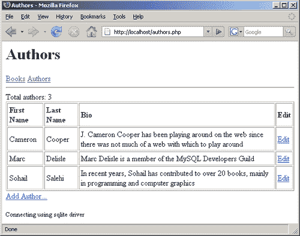

# 第六章：PDO 的高级用法

现在我们已经熟悉了 PDO 的基本特性，并用它们来构建了数据驱动的 Web 应用程序，让我们来看一些高级功能。在这一章中，我们将看到如何获取和设置连接属性（比如列名、大小写转换以及底层 PDO 驱动的名称），以及通过指定连接配置文件名或在`php.ini`文件中的选项来连接数据库。我们还将讨论事务。

我们将修改我们的图书馆应用程序，以在每个页面的页脚显示数据库驱动程序的名称。除了这个简单的改变，我们还将扩展应用程序，以跟踪我们拥有的单本书的副本数量，并跟踪那些借阅了书的人。我们将使用事务来实现这个功能。

# 设置和获取连接属性

我们在第三章中简要介绍了设置连接属性，当我们看到如何使用异常作为错误报告的手段时。连接属性允许我们控制连接的某些方面，以及查询诸如驱动程序名称和版本之类的东西。

+   一种方法是在 PDO 构造函数中指定属性名称/值对的数组。

+   另一种方法是调用`PDO::setAttribute()`方法，它接受两个参数：

+   属性的名称

+   属性的值

在 PDO 中，属性及其值被定义为`PDO`类中的常量，就像在`common.inc.php`文件中的以下调用一样：

```php
$conn->setAttribute(PDO::ATTR_ERRMODE, PDO::ERRMODE_EXCEPTION);

```

它包括两个这样的常量——`PDO::ATTR_ERRMODE`和`PDO::ERRMODE_EXCEPTION`。

要获取属性的值，有`PDO::getAttribute()`方法。它接受一个参数，属性名称，并返回属性的值。例如，下面的代码将打印`Exception:`。

```php
if($conn->getAttribute(PDO::ATTR_ERRMODE) == PDO::ERRMODE_EXCEPTION) {
echo 'Exception';
}

```

现在，让我们看看 PDO 中有哪些连接属性。

+   `PDO::ATTR_CASE`。这个属性控制了`PDOStatement::fetch()`方法返回的列名的大小写。如果获取模式是`PDO::FETCH_ASSOC`或`PDO::FETCH_BOTH`（当行以包含按名称索引的列的数组返回时），这将非常有用。这个属性可以有以下三个值：`PDO::CASE_LOWER, PDO::CASE_NATURAL`和`PDO::CASE_UPPER`。根据这个值，列名将分别是小写、不改变、或大写，就像下面的代码片段一样：

```php
$conn->setAttribute(PDO::ATTR_CASE, PDO::CASE_UPPER);
$stmt = $conn->query("SELECT * FROM authors LIMIT 1");
$r = $stmt->fetch(PDO::FETCH_ASSOC);
$stmt->closeCursor();
var_dump($r);

```

将会打印：

```php
array(4)
{
["ID"]=>
string(1) "1"
["FIRSTNAME"]=>
string(4) "Marc"
["LASTNAME"]=>
string(7) "Delisle"
["BIO"]=>
string(54) "Marc Delisle is a member of the MySQL Developers
Guild"
}

```

默认行为是不改变列名的大小写，即`PDO::CASE_NATURAL`。

+   `PDO::ATTR_ORACLE_NULLS:` 这个属性，尽管名字是这样，但是对所有数据库都有效，不仅仅是 Oracle。它控制了`NULL`值和空字符串在 PHP 中的传递。可能的取值有`PDO::NULL_NATURAL`（表示不进行任何转换），`PDO::NULL_EMPTY_STRING`（表示空字符串将被替换为 PHP 的 null 值），以及`PDO::NULL_TO_STRING`（表示 SQL 的 NULL 值在 PHP 中被转换为空字符串）。

你可以看到这个属性是如何工作的，下面是代码：

```php
$conn->setAttribute(PDO::ATTR_ORACLE_NULLS, PDO::NULL_TO_STRING);
$stmt = $conn->query("SELECT * FROM books WHERE coverImage IS
NULL LIMIT 1");
$r = $stmt->fetch(PDO::FETCH_ASSOC);
$stmt->closeCursor();
var_dump($r);

```

将会产生：

```php
array(9)
{
["id"]=>
string(1) "2"
["author"]=>
string(1) "2"
["title"]=>
string(18) "ImageMagick Tricks"
["isbn"]=>
string(10) "1904811868"
["publisher"]=>
string(20) "Packt Publishing Ltd"
["year"]=>
string(4) "2006"
["summary"]=>
string(81) "Unleash the power of ImageMagick
with this fast,friendly tutorial and tips guide"
["coverMime"]=>
string(0) ""
["coverImage"]=>
string(0) ""
}

```

正如你所看到的，高亮显示的字段被报告为字符串，而不是 NULL（如果我们没有设置`PDO::ATTR_ORACLE_NULLS`属性的话）。

+   `PDO::ATTR_ERRMODE`。这个属性设置了连接的错误报告模式。它接受三个值：

+   `PDO::ERRMODE_SILENT:` 不采取任何行动，错误代码可以通过`PDO::errorCode()`和`PDO::errorInfo()`方法（或它们在`PDOStatement`类中的等价物）获得。这是默认值。

+   `PDO::ERRMODE_WARNING:` 与以前一样，不采取任何行动，但会引发一个`E_WARNING`级别的错误。

+   `PDO::ERRMODE_EXCEPTION`将设置错误代码（与`PDO::ERRMODE_SILENT`一样），并且将抛出一个`PDOException`类的异常。

还有特定于驱动程序的属性，我们在这里不会涉及。有关更多信息，请参阅[`www.php.net/pdo`](http://www.php.net/pdo)。但是，有一个值得我们关注的特定于驱动程序的属性：`PDO::ATTR_PERSISTENT`。您可以使用它来指定 MySQL 驱动程序应该使用持久连接，这样可以获得更好的性能（您可以将其视为`mysql_pconnect()`函数的对应物）。此属性应该在 PDO 构造函数中设置，而不是通过 PDO::setAttribute()调用：

```php
$conn = new PDO($connStr, $user, $pass,
array(PDO::ATTR_PERSISTENT => true);

```

上述三个属性是读/写属性，这意味着它们可以被读取和写入。还有只能通过`PDO::getAttribute()`方法获得的只读属性。这些属性可能返回字符串值（而不是在 PDO 类中定义的常量）。

+   `PDO::ATTR_DRIVER_NAME:` 这将返回底层数据库驱动程序的名称：

```php
echo $conn->getAttribute(PDO::ATTR_DRIVER_NAME);

```

这将打印出 MySQL 或 SQLite，具体取决于您使用的驱动程序。

+   `PDO::ATTR_CLIENT_VERSION:` 这将返回底层数据库客户端库版本的名称。例如，对于 MySQL，这可能是类似于 5.0.37 的东西。

+   `PDO::ATTR_SERVER_VERSION:` 这将返回您正在连接的数据库服务器的版本。对于 MySQL，这可以是一个字符串，比如`"4.1.8-nt"`。

现在让我们回到我们的应用程序，并修改它以在每个页面的页脚中显示数据库驱动程序。为了实现这一点，我们将修改`common.inc.php`中的`showFooter()`函数：

```php
function showFooter()
{
global $conn;
if($conn instanceof PDO) {
$driverName = $conn->getAttribute(PDO::ATTR_DRIVER_NAME);
echo "<br/><br/>";
echo "<small>Connecting using $driverName driver</small>";
}
?>
</body>
</html>
<?php
}

```

在此函数中，我们从全局命名空间导入了`$conn`变量。如果此变量是`PDO`类的对象，那么我们将调用上面讨论的`getAttribute()`方法。我们必须进行此检查，因为在某些情况下，`$conn`变量可能未设置。例如，如果`PDO`构造函数失败并抛出异常，我们将无法调用`$conn`变量上的任何方法（这将导致致命错误——在非对象上调用成员函数是致命错误）。

由于我们应用程序中的所有页面都调用`showFooter()`方法函数，这个改变将在所有地方都可见：



# MySQL 缓冲查询

如果您只使用 MySQL 数据库，那么您可能希望使用 MySQL 的 PDO 驱动程序缓冲查询模式。当连接设置为缓冲查询模式时，每个 SELECT 查询的整个结果集都会在返回到应用程序之前预先获取到内存中。这给我们带来了一个好处——我们可以使用`PDOStatement::rowCount()`方法来检查结果集包含多少行。在第二章中，我们讨论了这个方法，并展示了它对 MySQL 和 SQLite 数据库返回 0 的情况。现在，当 PDO 被指示使用缓冲查询时，这个方法将返回有意义的值。

要强制 PDO 进入 MySQL 缓冲查询模式，您必须指定`PDO::MYSQL_ATTR_USE_BUFFERED_QUERY`连接属性。考虑以下示例：

```php
$conn = new PDO($connStr, $user, $pass);
$conn->setAttribute(PDO::ATTR_ERRMODE, PDO::ERRMODE_EXCEPTION); **$conn->setAttribute(PDO::MYSQL_ATTR_USE_BUFFERED_QUERY, 1);**
$q = $conn->query("SELECT * FROM books");
echo $q->rowCount();

```

这将打印返回的行数。

请注意，此属性仅适用于 MySQL，并且在数据库之间不可移植。如果您的应用程序只使用 MySQL，应该使用它。此外，请记住，返回大型结果集的缓冲查询在资源方面非常昂贵，应该避免使用。如果要使用缓冲查询，请确保在发出此类昂贵的查询之前禁用它们。可以通过关闭此属性来实现：

```php
$conn->setAttribute(PDO::MYSQL_ATTR_USE_BUFFERED_QUERY, 0);

```

您可以通过调用查询 MySQL 缓冲查询是否当前启用

```php
$conn->getAttribute(PDO::MYSQL_ATTR_USE_BUFFERED_QUERY);

```

我已经为每个截图切换了数据库（并且在第一个截图中，页面向下滚动到底部以节省空间）。

# 使用连接配置文件和 php.ini 设置连接

当我们讨论连接字符串（或 PDO 的数据源名称）时，我们看到连接字符串以驱动程序名称开头，后跟一个分号。PDO 还支持配置文件 - 包含连接字符串的文件。例如，我们可以在应用程序文件所在的目录中创建一个名为`pdo.dsn`的文件，并在其中放置连接字符串：

```php
mysql:host=localhost;dbname=pdo
or
sqlite:/www/hosts/localhost/pdo.db

```

或者，我们可以创建两个文件，`mysql.dsn`和`sqlite.dsn`，分别包含第一个和第二个连接字符串。

然后在 PDO 构造函数中，我们可以指定配置文件路径或 URL，而不仅仅是连接字符串：

```php
uri:./pdo.dsn

```

PDO 将读取文件并使用其中指定的连接字符串。使用此方法的优势在于，您不仅可以指定本地文件，还可以指定任何 URL，以便包含远程文件（前提是系统为诸如 HTTP 或 FTP 之类的协议注册了合适的流处理程序）。另一方面，如果文件未受到所有用户的网络访问保护，则可能会向第三方泄露安全信息，因此在使用此方法指定连接字符串时应谨慎。

还有另一种指定连接字符串的方法：在`php.ini`文件中。例如，您可以在`php.ini`文件中定义以下指令：

```php
pdo.dsn.mysql= mysql:host=localhost;dbname=pdo
pdo.dsn.sqlite=sqlite:/www/hosts/localhost/pdo.db

```

然后可以分别将'mysql'或'sqlite'字符串传递给`PDO`构造函数，而不是整个 mysql 和 sqlite 的连接字符串：

```php
$conn = new PDO('mysql', $user, $pass);
$conn = new PDO('sqlite', $user, $pass);

```

如您所见，此处的连接字符串应与`php.ini`文件中的相应选项匹配，带有`'pdo.dsn'`前缀。

# 获取可用驱动程序列表

PDO 允许您以编程方式获取所有已安装驱动程序的列表。可以调用`PDO::getAvailableDrivers()`方法返回一个包含可以使用的数据库驱动程序名称的数组。例如，此代码将打印类似以下内容的内容：

```php
var_dump(PDO::getAvailableDrivers());
array(3)
{
[0]=>
string(5) "mysql"
[1]=>
string(6) "sqlite"
[2]=>
string(7) "sqlite2"
}

```

此数组中包含的驱动程序名称是连接字符串的前缀。同时，相同的名称作为`PDO::ATTR_DRIVER_NAME`属性的值返回。

### 注意

`PDO::getAvailableDrivers()`方法返回在`php.ini`文件中注册到 PDO 系统的驱动程序的名称。您可能无法在本地机器上使用所有这些驱动程序 - 例如，如果 MySQL 服务器未运行，则返回的数组中存在 MySQL 项目并不意味着您可以连接到本地 MySQL 服务器，如果某个数据库服务器在本地机器上运行，但其驱动程序未注册到 PDO，则您将无法连接到该数据库服务器。

# 交易

PDO API 还标准化了事务处理方法。默认情况下，在成功创建 PDO 连接后，它被设置为`autocommit`模式。这意味着对于每个支持事务的数据库，每个查询都包装在一个隐式事务中。对于那些不支持事务的数据库，每个查询都会按原样执行。

通常，事务处理策略是这样的：

1.  开始交易。

1.  将与数据库相关的代码放在*try...catch*块中。

1.  与数据库相关的代码（在*try*块中）应在所有更新完成后提交更改。

1.  *catch*块应回滚事务。

当然，只有更新数据库的代码和可能破坏数据完整性的代码应该在事务中处理。交易的一个经典例子是资金转移：

1.  开始交易。

1.  如果付款人的帐户上有足够的钱：

+   从付款人的帐户中扣除金额。

+   向受益人的帐户中添加金额。

1.  提交交易。

如果在交易中间发生了任何不好的事情，数据库不会得到更新，数据完整性得到保留。此外，通过将帐户余额检查包装到交易中，我们确保并发更新不会破坏数据完整性。

PDO 只提供了三种处理事务的方法：`PDO::beginTransaction()`用于启动事务，`PDO::commit()`用于提交自从调用`PDO::beginTransaction()`以来所做的更改，`PDO::rollBack()`用于回滚自从启动事务以来的任何更改。

`PDO::beginTransaction()`方法不接受任何参数，并根据事务启动的成功与否返回一个布尔值。如果调用此方法失败，PDO 将抛出一个异常（例如，如果您已经处于事务中，PDO 会告诉您）。同样，如果没有活动事务，`PDO::rollBack()`方法将抛出一个异常，如果在调用`PDO::beginTransaction()`之前调用`PDO::commit()`方法，也会发生相同的情况。（当然，您的错误处理模式必须设置为`PDO::ERRMODE_EXCEPTION`才能抛出异常。）

还应该注意，如果您正在使用 PDO 进行任务控制，不应该使用直接查询来控制事务。我们的意思是，您不应该使用诸如`BEGIN TRANSATION，COMMIT`或`ROLLBACK`等查询来使用`PDO::query()`方法。否则，这三种方法的行为将是不一致的。此外，PDO 目前不支持保存点。

现在让我们回到我们的图书馆应用程序。为了看看事务是如何实际工作的，我们将修改它，使其能够跟踪我们有多少本特定书籍的副本，并实现一个函数来跟踪我们借出书籍的人。

这个修改将包括以下更改：

+   我们将不得不通过向书籍表添加一个新列来修改书籍表，以保留每本书的副本数量。`editBook.php`页面将需要修改以更改这个值。

+   我们将创建一个表来跟踪所有借阅者，但为了简化示例，我们不会创建一个借阅者表（就像我们为真实的图书馆应用程序所做的那样）。我们只会将借阅者的姓名与我们借给他们的书籍的书籍 ID 关联起来。

+   我们将创建一个页面，用于借出书籍。这个页面将要求借阅者的姓名，然后将记录插入到借阅者表中，并减少书籍表中的副本数量。

+   我们还需要一个页面，用于列出所有借阅者，以及另一个脚本，允许他们归还书籍。这个脚本将从借阅者表中删除一条记录，并增加书籍表中的副本数量。

我们只在同时更新两个表时使用事务（就像上面列表中的最后两点）。

在进行编码之前，我们将修改书籍表：

```php
mysql> alter table books add column copies tinyint not null default 1;
Query OK, 3 rows affected (0.50 sec)
Records: 3 Duplicates: 0 Warnings: 0

```

对于 SQLite，应该执行相同的命令。

现在，让我们稍微修改`books.php`，以显示每本书的副本数量，并提供一个链接。以下是需要更改的代码行（第 20 至 58 行）：

```php
<table width="100%" border="1" cellpadding="3">
<tr style="font-weight: bold">
<td>Cover</td>
<td>Author and Title</td>
<td>ISBN</td>
<td>Publisher</td>
<td>Year</td>
<td>Summary</td>
**<td>Copies</td>
<td>Lend</td>**
<td>Edit</td>
</tr>
<?php
// Now iterate over every row and display it
while($r = $q->fetch())
{
?>
<tr>
<td>
<?php if($r['coverMime']) { ?>
">
<?php } else { ?>
n/a
<? } ?>
</td>
<td>
<a href="author.php?id=<?=$r['authorId']?>"><?=htmlspecialchars
("$r[firstName] $r[lastName]")?></a><br/>
<b><?=htmlspecialchars($r['title'])?></b>
</td>
<td><?=htmlspecialchars($r['isbn'])?></td>
<td><?=htmlspecialchars($r['publisher'])?></td>
<td><?=htmlspecialchars($r['year'])?></td>
<td><?=htmlspecialchars($r['summary'])?></td>
**<td><?=$r['copies']?></td>
<td>
<a href="lendBook.php?book=<?=$r['id']?>">Lend</a>
</td>**
<td>
<a href="editBook.php?book=<?=$r['id']?>">Edit</a>
</td>
</tr>
<?php
}
?>

```

现在，对于 MySQL 和 SQLite，您应该看到一个页面，就像以下的屏幕截图一样（我们已经向下滚动并向右滚动，以便它适合页面）：


现在，让我们创建借阅者表。正如我们之前讨论过的，该表将包含一个 ID 字段，书籍的 ID 字段，借阅者的姓名和一个时间戳列。我们需要在这个表上有一个 ID（主键），以防止可能的数据损坏；例如，如果同一个借阅者两次借同一本书。如果我们只通过姓名和书籍 ID 跟踪借阅者，那么在该表中可能会有重复的记录，而归还一本书可能会删除该表中的多行，这将导致数据损坏：

```php
mysql> create table borrowers(
-> id int primary key not null auto_increment,
-> book int not null,
-> name varchar(40),
-> dt int);
Query OK, 0 rows affected (0.13 sec)

```

对于 SQLite，语法会有些不同：

```php
sqlite> create table borrowers(
...> id integer primary key,
...> book int not null,
...> name varchar(40),
...> dt int);

```

借出图书的页面（`lendBook.php`）可能是最困难的部分。这个页面将包括一个表单，您可以在其中输入借阅者的姓名。提交成功后，脚本将启动事务，检查图书是否至少有一本可用，向借阅者表插入一条记录并减少图书表中的副本列，提交事务，并重定向到`books.php`页面。

```php
<?php
/**
* This page allows lending a book
* PDO Library Management example application
* @author Dennis Popel
*/
// Don't forget the include
include('common.inc.php');
// First see if the request contains the book ID
// Return back to books.php if not
$id = (int)$_REQUEST['book'];
if(!$id) {
header("Location: books.php");
exit;
}
// Now see if the form was submitted
$warnings = array();
if($_POST['submit']) {
// Require that the borrower's name is entered
if(!$_POST['name']) {
$warnings[] = 'Please enter borrower\'s name';
}
else {
// Form is OK, "lend" the book
$conn->beginTransaction();
try
{
$stmt = $conn->query("SELECT copies FROM books WHERE id=$id");
$copies = $stmt->fetchColumn();
$stmt->closeCursor();
if($copies > 0) {
// If we can lend it
$conn->query("UPDATE books SET copies=copies-1
WHEREid=$id");
$stmt = $conn->prepare("INSERT INTO borrowers(book, name, dt)
VALUES(?, ?, ?)");
$stmt->execute(array($id, $_POST['name'], time()));
}
else {
// Else show warning
$warnings[] = 'There are no more copies of this book
available';
}
$conn->commit();
}
catch(PDOException $e)
{
// Something bad happened
// Roll back and rethrow the exception
$conn->rollBack();
throw $e;
}
}
// Now, if we don't have errors,
// redirect back to books.php
if(count($warnings) == 0) {
header("Location: books.php");
exit;
}
// otherwise, the warnings will be displayed
}
// Display the header
showHeader('Lend Book');
// If we have any warnings, display them now
if(count($warnings)) {
echo "<b>Please correct these errors:</b><br>";
foreach($warnings as $w)
{
echo "- ", htmlspecialchars($w), "<br>";
}
}
// Now display the form
?>
<form action="lendBook.php" method="post">
<input type="hidden" name="book" value="<?=$id?>">
<b>Please enter borrower's name:<br></b>
<input type="text" name="name"value="<?=htmlspecialchars
($_POST['name'])?>">
<input type="submit" name="submit" value=" Lend book ">
</form>
<?php
// Display footer
showFooter();

```

现在让我们来看看代码。我们首先检查图书的 ID 是否通过 URL 或表单传递给脚本。（我们将 ID 保存在表单的隐藏字段中。）然后，如果有表单提交（按下提交按钮），我们检查姓名字段是否填写正确。如果测试成功，我们继续进行事务，在其中计算剩余的副本数量，并检查这个数字是否大于零，我们减少副本列，并使用准备好的语句将一条记录插入到`borrowers`表中。如果副本少于一本，我们向`$warnings`数组添加一条消息，以便在页面上显示警告。

如果事务中出现故障，将执行`catch`块。事务将被回滚，并且异常将再次被抛出。我们这样做是为了让我们的默认错误处理程序发挥作用。

现在，如果您将上面的代码列表保存在`lendBook.php`中，并点击图书列表页面上的一个**借出**链接，您应该会到达以下页面：


当然，你应该在数据库之间切换，以查看代码是否与 MySQL 和 SQLite 一起工作。

### 注意

为了增强页面，我们还应该显示图书的标题和作者，但这部分留给你。另外，如果你想知道为什么我们在表单提交后才警告用户没有更多的副本，这是因为我们只能在事务中决定这一点。如果我们在事务中检测到有副本可用，那么我们才能确保没有并发更新会改变这一点。当然，从用户的角度来看，另一个补充可能是在图书详情旁边显示一个警告。然而，事务中也需要进行检查。

现在，如果您借出一本书，您会看到图书列表页面上的**副本**列已经减少。现在，让我们创建一个页面，列出所有借阅者和借给他们的图书。让我们称之为`borrowers.php`。虽然这个页面不处理任何用户输入，但它包含一个查询，连接了三个表（借阅者、图书和作者）：

```php
<?php
/**
* This page lists all borrowed books
* PDO Library Management example application
* @author Dennis Popel
*/
// Don't forget the include
include('common.inc.php');
// Display the header
showHeader('Lended Books');
// Get all lended books count and list
$sql = "SELECT borrowers.*, books.title, authors.firstName,
authors.lastName
FROM borrowers, books, authors
WHERE borrowers.book=books.id AND books.author=authors.id
ORDER BY borrowers.dt";
$totalBooks = getRowCount($sql);
$q = $conn->query($sql);
$q->setFetchMode(PDO::FETCH_ASSOC);
// now create the table
?>
Total borrowed books: <?=$totalBooks?>
<table width="100%" border="1" cellpadding="3">
<tr style="font-weight: bold">
<td>Title</td>
<td>Author</td>
<td>Borrowed by</td>
<td>Borrowed on</td>
<td>Return</td>
</tr>
<?php
// Now iterate over every row and display it
while($r = $q->fetch())
{
?>
<tr>
<td><?=htmlspecialchars($r['title'])?></td>
<td><?=htmlspecialchars("$r[firstName] $r[lastName]")?></td>
<td><?=htmlspecialchars($r['name'])?></td>
<td><?=date('d M Y', $r['dt'])?></td>
<td>
<a href="returnBook.php?borrower=<?=$r['id']?>">Return</a>
</td>
</tr>
<?php
}
?>
</table>
<?php
// Display footer
showFooter();

```

代码很容易理解；它遵循与`books.php`或`authors.php`相同的逻辑。但是，由于这个页面没有从任何地方链接过来，我们应该在网站页眉（`common.inc.php`中的`showHeader()`函数）中添加一个链接：

```php
function showHeader($title)
{
?>
<html>
<head><title><?=htmlspecialchars($title)?></title></head>
<body>
<h1><?=htmlspecialchars($title)?></h1>
<a href="books.php">Books</a>
<a href="authors.php">Authors</a>
**<a href="borrowers.php">Borrowers</a>**
<hr>
<?php
}

```

现在，如果您导航到`borrowers.php`，您应该看到类似于这个屏幕截图的东西：


正如我们所看到的，这个页面包含指向`returnBook.php`页面的链接，但这个页面还不存在。这个脚本将从借阅者表中删除相关记录，并增加图书表中的副本列。这个操作也将被包装在一个事务中。此外，`returnBook.php`接受借阅者表的 ID 字段（与`lendBook.php`接受图书的 ID 相反）。因此，我们还应该从借阅者表中获取图书的 ID：

```php
<?php
/**
* This page "returns" a book back to the library
* PDO Library Management example application
* @author Dennis Popel
*/
// Don't forget the include
include('common.inc.php');
// First see if the request contains the borrowers ID
// Return back to books.php if not
$id = (int)$_REQUEST['borrower'];
if(!$id) {
header("Location: books.php");
exit;
}
// Now start the transaction
$conn->beginTransaction();
try
{
$q = $conn->query("SELECT book FROM borrowers WHERE id=$id");
$book = (int)$q->fetchColumn();
$q->closeCursor();
$conn->query("DELETE FROM borrowers WHERE id=$id");
$conn->query("UPDATE books SET copies=copies+1 WHERE id=$book");
$conn->commit();
header("Location: books.php");
}
catch(PDOException $e)
{
$conn->rollBack();
throw $e;
}

```

代码应该是相当自解释的。首先，我们检查请求是否包含借阅者的 ID，然后更新两个表。成功完成后，我们将被重定向到图书列表页面，否则，错误处理程序将显示相关消息。

现在，最后的一步：`editBook.php`页面，可以用来编辑我们拥有的书籍副本数量。我们将把这个任务留给你，但这里有一些考虑。跟踪已借出的书籍的建议方式对于实际的图书馆应用来说并不是很好。我们应该保留图书馆中总副本数的一个列，以及已借出的副本数的另一个列，而不是保留可用副本数。这样做是因为编辑可用书籍的数量可能会导致数据损坏。归还一本书将增加图书表中的副本列。如果同时有其他人在编辑可用副本数，他们可能不知道借阅者正在归还一本书，因此可能输入一个不正确的数字。

另一方面，如果有两个独立的列，那么更新总副本数将完全独立于借出和归还书籍所引起的更新。然而，在这种情况下，借书的脚本应该检查已借出的副本数是否小于总副本数。只有在满足这个条件的情况下，事务才能继续。

# 总结

在本章中，我们看了一些 PDO 提供的扩展功能，特别是事务。我们修改了应用示例，提供了依赖事务的额外功能。我们还看了事务感知代码的组织。

然而，正如你可能已经注意到的，我们在一个文件中混合了更新数据库、处理用户输入和呈现页面的代码。虽然我们试图将输入处理和呈现分开放在一个文件的不同部分（首先是数据处理，然后是页面呈现），但我们无法分开数据处理。

在下一章中，我们将看到如何分离数据模型和应用逻辑，以便数据不仅可以从我们的应用程序中访问和操作，还可以从其他地方访问和操作。我们将开发一个数据模型类，封装我们的图书馆应用程序数据处理方法。然后这个类可以被其他应用程序使用。
