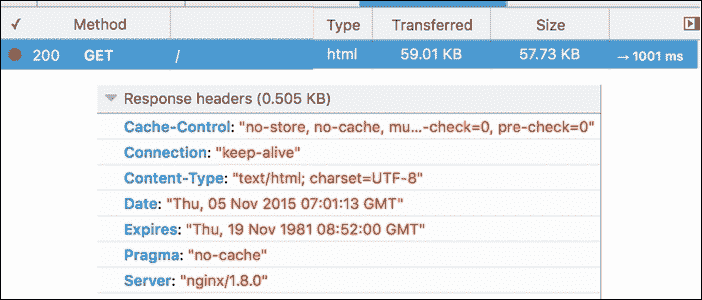
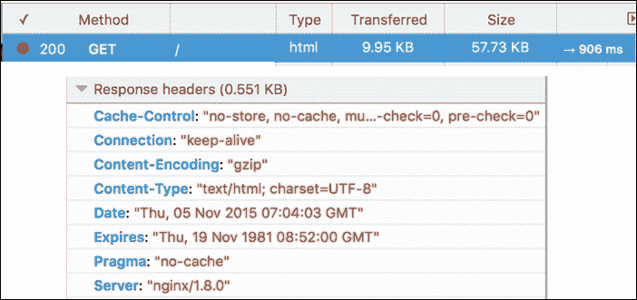
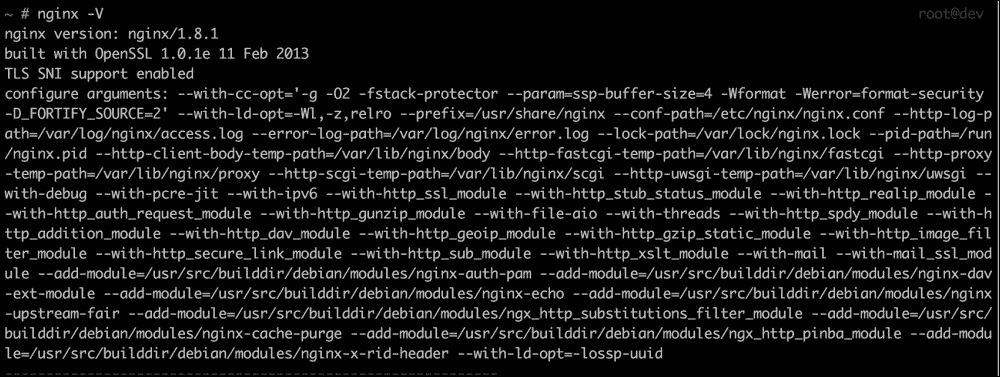
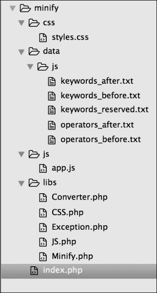

# 第三章。提高 PHP 7 应用程序性能

PHP 7 已经完全重写，基于**PHP Next Generation**（**phpng**或**PHPNG**）进行性能优化。然而，总是有更多的方法来提高应用程序的性能，包括编写高性能代码、使用最佳实践、Web 服务器优化、缓存等。在本章中，我们将讨论以下列出的这些优化：

+   NGINX 和 Apache

+   HTTP 服务器优化

+   内容交付网络（CDN）

+   JavaScript/CSS 优化

+   完整页面缓存

+   Varnish

+   基础设施

# NGINX 和 Apache

有太多的 HTTP 服务器软件可用，每个都有其优缺点。最常用的两个 HTTP 服务器是 NGINX 和 Apache。让我们来看看它们两个，并注意哪一个更适合我们的需求。

## Apache

Apache 是最广泛使用的 HTTP 服务器，大多数管理员都喜爛它。管理员选择它是因为它的灵活性、广泛的支持、强大的功能以及对大多数解释性语言（如 PHP）的模块支持。由于 Apache 可以处理大量的解释性语言，它不需要与其他软件通信来满足请求。Apache 可以在 prefork（进程在线程之间生成）、worker（线程在进程之间生成）和事件驱动（与 worker 进程相同，但为*keep-alive*连接设置专用线程和为活动连接设置单独线程）中处理请求；因此，它提供了更大的灵活性。

正如前面讨论的，每个请求将由单个线程或进程处理，因此 Apache 消耗了太多资源。当涉及高流量应用程序时，Apache 可能会减慢应用程序的速度，因为它不提供良好的并发处理支持。

## NGINX

NGINX 是为解决高流量应用程序的并发问题而构建的。NGINX 提供了异步、事件驱动和非阻塞的请求处理。由于请求是异步处理的，NGINX 不会等待请求完成以阻塞资源。

NGINX 创建工作进程，每个工作进程可以处理成千上万的连接。因此，少量进程可以同时处理高流量。

NGINX 不提供任何解释性语言的内置支持。它依赖外部资源来实现这一点。这也是好的，因为处理是在 NGINX 之外进行的，NGINX 只处理连接和请求。大多数情况下，NGINX 被认为比 Apache 更快。在某些情况下，例如处理静态内容（提供图像、`.css`和`.js`文件等），这可能是真的，但在当前高性能服务器中，Apache 并不是问题；PHP 是瓶颈。

### 注意

Apache 和 NGINX 都适用于各种操作系统。在本书中，我们将使用 Debian 和 Ubuntu，因此所有文件路径都将根据这些操作系统进行提及。

如前所述，我们将在本书中使用 NGINX。

# HTTP 服务器优化

每个 HTTP 服务器都提供了一些功能，可以用来优化请求处理和提供内容。在本节中，我们将分享一些适用于 Apache 和 NGINX 的技术，用来优化 Web 服务器并提供最佳性能和可伸缩性。通常，应用这些优化后，需要重新启动 Apache 或 NGINX。

## 缓存静态文件

大多数静态文件，如图像、`.css`、`.js`和字体，不经常更改。因此，最佳做法是在最终用户的机器上缓存这些静态文件。为此，Web 服务器会在响应中添加特殊标头，告诉用户浏览器将静态内容缓存一段时间。以下是 Apache 和 NGINX 的配置代码。

### Apache

让我们来看看 Apache 配置如何缓存以下静态内容：

```php
<FilesMatch "\.(ico|jpg|jpeg|png|gif|css|js|woff)$">
  Header set Cache-Control "max-age=604800, public
</FileMatch>
```

在前面的代码中，我们使用了 Apache 的`FilesMatch`指令来匹配文件的扩展名。如果请求了所需的扩展名文件，Apache 会将头设置为缓存控制七天。然后浏览器会将这些静态文件缓存七天。

### NGINX

以下配置可以放置在`/etc/nginx/sites-available/your-virtual-host-conf-file`中：

```php
Location ~* .(ico|jpg|jpeg|png|gif|css|js|woff)$ {
  Expires 7d;
}
```

在前面的代码中，我们使用了 NGINX 的`Location`块和不区分大小写的修饰符(`~*`)来设置七天的`Expires`。此代码将为所有定义的文件类型设置七天的缓存控制头。

进行这些设置后，请求的响应头将如下所示：


在前面的图中，可以清楚地看到`.js`文件是从缓存中加载的。它的缓存控制头设置为七天或 604,800 秒。到期日期也可以清楚地在`expires`头中注意到。到期日期后，浏览器将从服务器加载此`.js`文件，并根据缓存控制头中定义的持续时间再次缓存它。

# HTTP 持久连接

在 HTTP 持久连接或 HTTP keep-alive 中，单个 TCP/IP 连接用于多个请求或响应。与正常连接相比，它具有巨大的性能改进，因为它只使用一个连接，而不是为每个单独的请求或响应打开和关闭连接。HTTP keep-alive 的一些好处如下：

+   由于一次只打开了较少的 TCP 连接，并且对于后续的请求和响应不会打开新的连接，因为这些 TCP 连接用于它们，所以 CPU 和内存的负载减少了。

+   在建立 TCP 连接后，减少了后续请求的延迟。当要建立 TCP 连接时，用户和 HTTP 服务器之间进行了三次握手通信。成功握手后，建立了 TCP 连接。在 keep-alive 的情况下，仅对初始请求进行一次握手以建立 TCP 连接，并且对于后续请求不进行握手或 TCP 连接的打开/关闭。这提高了请求/响应的性能。

+   网络拥塞减少了，因为一次只打开了少量 TCP 连接到服务器。

除了这些好处，keep-alive 还有一些副作用。每个服务器都有并发限制，当达到或消耗此并发限制时，应用程序的性能可能会大幅下降。为了解决这个问题，为每个连接定义了超时，超过超时后，HTTP keep-alive 连接将自动关闭。现在，让我们在 Apache 和 NGINX 上都启用 HTTP keep-alive。

## Apache

在 Apache 中，keep-alive 可以通过两种方式启用。您可以在`.htaccess`文件或 Apache 配置文件中启用它。

要在`.htaccess`文件中启用它，请在`.htaccess`文件中放置以下配置：

```php
<ifModule mod_headers.c>
  Header set Connection keep-alive
</ifModule>
```

在前面的配置中，我们在`.htaccess`文件中将连接头设置为 keep-alive。由于`.htaccess`配置会覆盖配置文件中的配置，这将覆盖 Apache 配置文件中对 keep-alive 所做的任何配置。

要在 Apache 配置文件中启用 keep-alive 连接，我们必须修改三个配置选项。搜索以下配置并将值设置为示例中的值：

```php
KeepAlive On
MaxKeepAliveRequests 100
KeepAliveTimeout 100
```

在前面的配置中，我们通过将`KeepAlive`的值设置为`On`来打开了 keep-alive 配置。

接下来是`MaxKeepAliveRequests`，它定义了同时向 Web 服务器保持活动连接的最大数量。在 Apache 中，默认值为 100，并且可以根据要求进行更改。为了获得高性能，应该保持这个值较高。如果设置为 0，将允许无限的 keep-alive 连接，这是不推荐的。

最后一个配置是`KeepAliveTimeout`，设置为 100 秒。这定义了在同一 TCP 连接上等待来自同一客户端的下一个请求的秒数。如果没有请求，则连接将关闭。

## NGINX

HTTP keep-alive 是`http_core`模块的一部分，默认情况下已启用。在 NGINX 配置文件中，我们可以编辑一些选项，如超时。打开`nginx`配置文件，编辑以下配置选项，并将其值设置为以下值：

```php
keepalive_requests 100
keepalive_timeout 100
```

`keepalive_requests`配置定义了单个客户端在单个 HTTP keep-alive 连接上可以发出的最大请求数。

`keepalive_timeout`配置是服务器需要等待下一个请求的秒数，直到关闭 keep-alive 连接。

## GZIP 压缩

内容压缩提供了一种减少 HTTP 服务器传送的内容大小的方法。Apache 和 NGINX 都支持 GZIP 压缩，同样，大多数现代浏览器都支持 GZIP。启用 GZIP 压缩后，HTTP 服务器会发送压缩的 HTML、CSS、JavaScript 和大小较小的图像。这样，内容加载速度很快。

当浏览器发送有关自身支持 GZIP 压缩的信息时，Web 服务器才会通过 GZIP 压缩内容。通常，浏览器在*Request*标头中发送此类信息。

以下是启用 GZIP 压缩的 Apache 和 NGINX 代码。

### Apache

以下代码可以放置在`.htaccess`文件中：

```php
<IfModule mod_deflate.c>
SetOutputFilter DEFLATE
 #Add filters to different content types
AddOutputFilterByType DEFLATE text/html text/plain text/xml    text/css text/javascript application/javascript
    #Don't compress images
    SetEnvIfNoCase Request_URI \.(?:gif|jpe?g|png)$ no-gzip dont-   
    vary
</IfModule>
```

在上述代码中，我们使用了 Apache 的`deflate`模块来启用压缩。我们按类型进行过滤，只压缩特定类型的文件，如`.html`，纯文本，`.xml`，`.css`和`.js`。此外，在结束模块之前，我们设置了一个条件，不压缩图像，因为压缩图像会导致图像质量下降。

### NGINX

如前所述，您必须将以下代码放置在 NGINX 的虚拟主机配置文件中：

```php
gzip on;
gzip_vary on;
gzip_types text/plain text/xml text/css text/javascript application/x-javascript;
gzip_com_level 4;
```

在上述代码中，通过`gzip on;`行激活了 GZIP 压缩。`gzip_vary on;`行用于启用不同的标头。`gzip_types`行用于定义要压缩的文件类型。根据要求可以添加任何文件类型。`gzip_com_level 4;`行用于设置压缩级别，但要小心这个值；不要设置得太高。它的范围是 1 到 9，所以保持在中间。

现在，让我们检查压缩是否真的有效。在下面的截图中，请求发送到一个未启用 GZIP 压缩的服务器。下载或传输的最终 HTML 页面的大小为 59 KB：



在启用 Web 服务器上的 GZIP 压缩后，传输的 HTML 页面的大小减小了 9.95 KB，如下截图所示：



此外，还可以注意到加载内容的时间也减少了。因此，您的内容越小，页面加载速度就越快。

## 将 PHP 用作独立服务

Apache 使用`mod_php`模块来处理 PHP。这样，PHP 解释器集成到 Apache 中，所有处理都由这个 Apache 模块完成，这会消耗更多的服务器硬件资源。可以使用 PHP-FPM 与 Apache 一起使用，它使用 FastCGI 协议并在单独的进程中运行。这使得 Apache 可以处理 HTTP 请求处理，而 PHP 处理由 PHP-FPM 完成。

另一方面，NGINX 不提供任何内置支持或模块支持 PHP 处理。因此，在 NGINX 中，PHP 始终用作独立服务。

现在，让我们看看当 PHP 作为独立服务运行时会发生什么：Web 服务器不知道如何处理动态内容请求，并将请求转发到另一个外部服务，从而减少了 Web 服务器的处理负载。

## 禁用未使用的模块

Apache 和 NGINX 都内置了许多模块。在大多数情况下，您不需要其中一些模块。最好的做法是禁用这些模块。

最好的做法是制作一个启用的模块列表，逐个禁用这些模块，并重新启动服务器。之后，检查您的应用程序是否工作。如果工作正常，继续；否则，在应用程序再次停止正常工作之后，启用模块。

这是因为您可能会发现某个模块可能不需要，但其他一些有用的模块依赖于这个模块。因此，最好的做法是制作一个列表，启用或禁用模块，如前所述。

### Apache

要列出为 Apache 加载的所有模块，请在终端中发出以下命令：

```php
**sudo apachectl –M**

```

这个命令将列出所有加载的模块，如下截图所示：


现在，分析所有加载的模块，检查它们是否对应用程序有用，并禁用它们，如下所示。

打开 Apache 配置文件，找到加载所有模块的部分。这里包括一个示例：

```php
LoadModule access_compat_module modules/mod_access_compat.so
LoadModule actions_module modules/mod_actions.so
LoadModule alias_module modules/mod_alias.so
LoadModule allowmethods_module modules/mod_allowmethods.so
LoadModule asis_module modules/mod_asis.so
LoadModule auth_basic_module modules/mod_auth_basic.so
#LoadModule auth_digest_module modules/mod_auth_digest.so
#LoadModule auth_form_module modules/mod_auth_form.so
#LoadModule authn_anon_module modules/mod_authn_anon.so
```

在前面加上`#`符号的模块是未加载的。因此，要在完整列表中禁用模块，只需放置一个`#`符号。`#`符号将注释掉该行，模块将不再加载。

### NGINX

要检查 NGINX 编译时使用了哪些模块，请在终端中发出以下命令：

```php
**sudo Nginx –V**

```

这将列出 NGINX 安装的完整信息，包括版本和 NGINX 编译时使用的模块。请查看以下截图：



通常情况下，NGINX 只启用了 NGINX 工作所需的模块。要启用已安装的任何其他模块，我们可以在`nginx.conf`文件中为其添加一些配置，但是没有单一的方法来禁用任何 NGINX 模块。因此，最好搜索特定模块，并查看 NGINX 网站上的模块页面。在那里，我们可以找到有关特定模块的信息，如果可用，我们可以找到有关如何禁用和配置该模块的信息。

## Web 服务器资源

每个 Web 服务器都有自己的通用最佳设置。但是，这些设置可能不适用于您当前的服务器硬件。Web 服务器硬件上最大的问题是 RAM。服务器的 RAM 越多，Web 服务器就能处理的请求就越多。

### NGINX

NGINX 提供了两个变量来调整资源，即`worker_processes`和`worker_connections`。`worker_processes`设置决定了应该运行多少个 NGINX 进程。

现在，我们应该使用多少`worker_processes`资源？这取决于服务器。通常情况下，每个处理器核心使用一个工作进程。因此，如果您的服务器处理器有四个核心，这个值可以设置为 4。

`worker_connections`的值显示每秒每个`worker_processes`设置的连接数。简单地说，`worker_connections`告诉 NGINX 可以处理多少个同时请求。`worker_connections`的值取决于系统处理器核心。要找出 Linux 系统（Debian/Ubuntu）上核心的限制，请在终端中发出以下命令：

```php
**Ulimit –n**

```

这个命令将显示一个应该用于`worker_connections`的数字。

现在，假设我们的处理器有四个核心，每个核心的限制是 512。然后，我们可以在 NGINX 主配置文件中设置这两个变量的值。在 Debian/Ubuntu 上，它位于`/etc/nginx/nginx.conf`。

现在，找出这两个变量并设置如下：

```php
Worker_processes 4;
Worker_connections 512
```

前面的值可能会很高，特别是`worker_connections`，因为服务器处理器核心有很高的限制。

# 内容交付网络（CDN）

内容交付网络用于托管静态媒体文件，如图像、`.css`和`.js`文件，以及音频和视频文件。这些文件存储在地理网络上，其服务器位于不同的位置。然后，这些文件根据请求位置从特定服务器提供给请求。

CDN 提供以下功能：

+   由于内容是静态的，不经常更改，CDN 会将它们缓存在内存中。当对某个文件发出请求时，CDN 会直接从缓存中发送文件，这比从磁盘加载文件并发送到浏览器要快。

+   CDN 服务器位于不同的位置。所有文件都存储在每个位置，取决于您在 CDN 中的设置。当浏览器请求到达 CDN 时，CDN 会从最近可用的位置发送请求的内容到请求的位置。例如，如果 CDN 在伦敦、纽约和迪拜都有服务器，并且来自中东的请求到达时，CDN 将从迪拜服务器发送内容。这样，由于 CDN 从最近的位置提供内容，响应时间得到了缩短。

+   每个浏览器对向同一域发送并行请求有限制。通常是三个请求。当对请求的响应到达时，浏览器会向同一域发送更多的请求，这会导致完整页面加载的延迟。CDN 提供子域（可以是它们自己的子域或您主域的子域，使用您主域的 DNS 设置），这使得浏览器可以向从不同域加载的相同内容发送更多的并行请求。这使得浏览器可以快速加载页面内容。

+   通常，动态内容的请求量很小，静态内容的请求量更多。如果您的应用的静态内容托管在单独的 CDN 服务器上，这将极大地减轻服务器的负载。

## 使用 CDN

那么，您如何在应用中使用 CDN 呢？在最佳实践中，如果您的应用流量很大，为每种内容类型在 CDN 上创建不同的子域是最好的选择。例如，为 CSS 和 JavaScript 文件创建一个单独的域，为图像创建一个子域，为音频/视频文件创建另一个单独的子域。这样，浏览器将为每种内容类型发送并行请求。假设我们对每种内容类型有以下 URL：

+   **对于 CSS 和 JavaScript**：`http://css-js.yourcdn.com`

+   **对于图像**：`http://images.yourcdn.com`

+   **对于其他媒体**：`http://media.yourcdn.com`

现在，大多数开源应用程序在其管理控制面板中提供设置以设置 CDN URL，但如果您使用的是开源框架或自定义构建的应用程序，您可以通过将上述 URL 放在数据库中或全局加载的配置文件中来定义自己的 CDN 设置。

对于我们的示例，我们将把上述 URL 放在一个配置文件中，并为它们创建三个常量，如下所示：

```php
Constant('CSS_JS_URL', 'http://css-js.yourcdn.com/');
Constant('IMAGES_URL', 'http://images.yourcdn.com/');
Constant('MEDiA_URL', 'http://css-js.yourcdn.com/');
```

如果我们需要加载 CSS 文件，可以按以下方式加载：

```php
<script type="text/javascript" src="<?php echo CSS_JS_URL ?>js/file.js"></script>
```

对于 JavaScript 文件，可以按以下方式加载：

```php
<link rel="stylesheet" type="text/css" href="<?php echo CSS_JS_URL ?>css/file.css" />
```

如果我们加载图像，可以在`img`标签的`src`属性中使用上述方式，如下所示：

```php
images/image.png" />
```

在上述示例中，如果我们不需要使用 CDN 或想要更改 CDN URL，只需在一个地方进行更改即可。

大多数知名的 JavaScript 库和模板引擎都在其自己的个人 CDN 上托管其静态资源。谷歌在其自己的 CDN 上托管查询库、字体和其他 JavaScript 库，可以直接在应用程序中使用。

有时，我们可能不想使用 CDN 或负担不起它们。为此，我们可以使用一种称为域共享的技术。使用域分片，我们可以创建子域或将其他域指向我们在同一服务器和应用程序上的资源目录。这种技术与之前讨论的相同；唯一的区别是我们自己将其他域或子域指向我们的媒体、CSS、JavaScript 和图像目录。

这可能看起来不错，但它不会为我们提供 CDN 的最佳性能。这是因为 CDN 根据客户的位置决定内容的地理可用性，进行广泛的缓存，并在运行时对文件进行优化。

# CSS 和 JavaScript 优化

每个网络应用程序都有 CSS 和 JavaScript 文件。如今，大多数应用程序都有大量的 CSS 和 JavaScript 文件，以使应用程序具有吸引力和互动性。每个 CSS 和 JavaScript 文件都需要浏览器向服务器发送请求来获取文件。因此，你拥有的 CSS 和 JavaScript 文件越多，浏览器就需要发送的请求就越多，从而影响其性能。

每个文件都有一个内容大小，浏览器下载它需要时间。例如，如果我们有 10 个每个 10KB 的 CSS 文件和 10 个每个 50KB 的 JavaScript 文件，CSS 文件的总内容大小为 100KB，JavaScript 文件的总内容大小为 500KB，两种类型的文件总共为 600KB。这太多了，浏览器会花费时间来下载它们。

### 注意

性能在网络应用程序中扮演着至关重要的角色。即使是 Google 在其索引中也计算性能。不要认为一个文件只有几 KB 并且需要 1 毫秒下载，因为在性能方面，每一毫秒都是被计算的。最好的方法是优化、压缩和缓存一切。

在这一部分，我们将讨论两种优化我们的 CSS 和 JS 的方法，如下所示：

+   合并

+   压缩

## 合并

在合并过程中，我们可以将所有的 CSS 文件合并成一个文件，JavaScript 文件也是同样的过程，从而创建一个 CSS 和 JavaScript 的单一文件。如果我们有 10 个 CSS 文件，浏览器会发送 10 个请求来获取所有这些文件。然而，如果我们将它们合并成一个文件，浏览器只会发送一个请求，因此节省了九个请求所花费的时间。

## 压缩

在压缩过程中，CSS 和 JavaScript 文件中的所有空行、注释和额外的空格都被移除。这样，文件的大小就减小了，文件加载速度就快了。

例如，假设你在一个文件中有以下 CSS 代码：

```php
.header {
  width: 1000px;
  height: auto;
  padding: 10px
}

/* move container to left */
.float-left {
  float: left;
}

/* Move container to right */
.float-right {
  float: right;
}
```

压缩文件后，我们将得到类似以下的 CSS 代码：

```php
.header{width:100px;height:auto;padding:10px}.float-left{float:left}.float-right{float:right}
```

同样地，对于 JavaScript，假设我们在一个 JavaScript 文件中有以下代码：

```php
/* Alert on page load */
$(document).ready(function() {
  alert("Page is loaded");
});

/* add three numbers */
function addNumbers(a, b, c) {
  return a + b + c;
}
```

现在，如果前述文件被压缩，我们将得到以下代码：

```php
$(document).ready(function(){alert("Page is loaded")});function addNumbers(a,b,c){return a+b+c;}
```

可以注意到在前面的例子中，所有不必要的空格和换行都被移除了。它还将完整的文件代码放在一行中。所有的代码注释都被移除了。这样，文件大小就减小了，有助于文件快速加载。此外，这个文件将消耗更少的带宽，如果服务器资源有限的话，这是有用的。

大多数开源应用程序，如 Magento、Drupal 和 WordPress，提供内置支持或支持第三方插件/模块的应用程序。在这里，我们不会涵盖如何在这些应用程序中合并 CSS 或 JavaScript 文件，但我们将讨论一些可以合并 CSS 和 JavaScript 文件的工具。

### Minify

Minify 是一组完全用 PHP 编写的库。Minify 支持 CSS 和 JavaScript 文件的合并和压缩。它的代码完全是面向对象和命名空间的，因此可以嵌入到任何当前的或专有的框架中。

### 注意

Minify 主页位于[`minifier.org`](http://minifier.org)。它也托管在 GitHub 上，网址为[`github.com/matthiasmullie/minify`](https://github.com/matthiasmullie/minify)。值得注意的是，Minify 库使用了一个路径转换库，这个库是由同一作者编写的。路径转换库可以从[`github.com/matthiasmullie/path-converter`](https://github.com/matthiasmullie/path-converter)下载。下载这个库并将其放在与 minify 库相同的文件夹中。

现在，让我们创建一个小项目，用来缩小和合并 CSS 和 JavaScript 文件。项目的文件夹结构将如下截图所示：



在上面的截图中，显示了完整的项目结构。项目名称是`minify`。`css`文件夹中包含了所有的 CSS 文件，包括缩小或合并的文件。同样，`js`文件夹中包含了所有的 JavaScript 文件，包括缩小或合并的文件。`libs`文件夹中包含了`Minify`库和`Converter`库。`Index.php`包含了我们用来缩小和合并 CSS 和 JavaScript 文件的主要代码。

### 注意

项目树中的`data`文件夹与 JavaScript 缩小有关。由于 JavaScript 有需要在其前后加上空格的关键字，这些`.txt`文件用于识别这些运算符。

因此，让我们从`index.php`中使用以下代码来缩小我们的 CSS 和 JavaScript 文件：

```php
include('libs/Converter.php');
include('libs/Minify.php');
include('libs/CSS.php');
include('libs/JS.php');
include('libs/Exception.php');

use MatthiasMullie\Minify;

/* Minify CSS */
$cssSourcePath = 'css/styles.css';
$cssOutputPath = 'css/styles.min.css';
$cssMinifier = new Minify\CSS($cssSourcePath);
$cssMinifier->minify($cssOutputPath);

/* Minify JS */
$jsSourcePath = 'js/app.js';
$jsOutputPath = 'js/app.min.js';
$jsMinifier = new Minify\JS($jsSourcePath);
$jsMinifier->minify($jsOutputPath);
```

前面的代码很简单。首先，我们包含了所有需要的库。然后，在`Minify CSS`块中，我们创建了两个路径变量：`$cssSourcePath`，它包含了我们需要缩小的 CSS 文件的路径，以及`$cssOutputPath`，它包含了将要生成的缩小 CSS 文件的路径。

之后，我们实例化了`CSS.php`类的一个对象，并传递了我们需要缩小的 CSS 文件。最后，我们调用了`CSS`类的缩小方法，并传递了输出路径以及文件名，这将为我们生成所需的文件。

JS 缩小过程也是同样的解释。

如果我们运行上述 PHP 代码，所有文件都就位，一切顺利，那么将会创建两个新的文件名：`styles.min.css`和`app.min.js`。这些是它们原始文件的新缩小版本。

现在，让我们使用 Minify 来合并多个 CSS 和 JavaScript 文件。首先，在项目中的相应文件夹中添加一些 CSS 和 JavaScript 文件。之后，我们只需要在当前代码中添加一点代码。在下面的代码中，我将跳过包含所有库，但是每当您需要使用 Minify 时，这些文件都必须被加载。

```php
/* Minify CSS */
$cssSourcePath = 'css/styles.css';
**$cssOutputPath = 'css/styles.min.merged.css';**
$cssMinifier = new Minify\CSS($cssSourcePath);
**$cssMinifier->add('css/style.css');**
**$cssMinifier->add('css/forms.js');**
$cssMinifier->minify($cssOutputPath);

/* Minify JS */
$jsSourcePath = 'js/app.js';
**$jsOutputPath = 'js/app.min.merged.js';**
$jsMinifier = new Minify\JS($jsSourcePath);
**$jsMinifier->add('js/checkout.js');**
$jsMinifier->minify($jsOutputPath);
```

现在，看一下高亮显示的代码。在 CSS 部分，我们将缩小和合并的文件保存为`style.min.merged.css`，但命名并不重要；这完全取决于我们自己的选择。

现在，我们只需使用`$cssMinifier`和`$jsMinifier`对象的`add`方法来添加新文件，然后调用`minify`。这将导致所有附加文件合并到初始文件中，然后进行缩小，从而生成单个合并和缩小的文件。

### Grunt

根据其官方网站，Grunt 是一个 JavaScript 任务运行器。它自动化了某些重复的任务，这样你就不必重复工作。这是一个很棒的工具，在 Web 程序员中被广泛使用。

安装 Grunt 非常容易。在这里，我们将在 MAC OS X 上安装它，大多数 Linux 系统，如 Debian 和 Ubuntu，使用相同的方法。

### 注意

Grunt 需要 Node.js 和 npm。安装和配置 Node.js 和 npm 超出了本书的范围，因此在本书中，我们将假设这些工具已经安装在您的计算机上，或者您可以搜索它们并弄清楚如何安装它们。

如果 Node.js 和 npm 已经安装在您的计算机上，只需在终端中输入以下命令：

```php
**sudo npm install –g grunt**

```

这将安装 Grunt CLI。如果一切顺利，那么以下命令将显示 Grunt CLI 的版本：

```php
**grunt –version**

```

上述命令的输出是`grunt-cli v0.1.13;`，在撰写本书时，这个版本是可用的。

Grunt 为您提供了一个命令行，可以让您运行 Grunt 命令。一个 Grunt 项目在您的项目文件树中需要两个文件。一个是`package.json`，它被`npm`使用，并列出了项目需要的 Grunt 和 Grunt 插件作为 DevDependencies。

第二个文件是`GruntFile`，它存储为`GruntFile.js`或`GruntFile.coffee`，用于配置和定义 Grunt 任务并加载 Grunt 插件。

现在，我们将使用相同的项目，但我们的文件夹结构将如下所示：


现在，在项目根目录中打开终端并发出以下命令：

```php
**sudo npm init**

```

这将通过询问一些问题生成`package.json`文件。现在，打开`package.json`文件并修改它，使最终的`package.json`文件的内容看起来类似于以下内容：

```php
{
  "name" : "grunt"  //Name of the project
  "version : "1.0.0" //Version of the project
  "description" : "Minify and Merge JS and CSS file",
  "main" : "index.js",
  "DevDependencies" : {
    "grunt" : "0.4.1", //Version of Grunt

    //Concat plugin version used to merge css and js files
    "grunt-contrib-concat" : "0.1.3"

    //CSS minifying plugin
    "grunt-contrib-cssmin" : "0.6.1",

    //Uglify plugin used to minify JS files.
    "grunt-contrib-uglify" : "0.2.0" 

   },
"author" : "Altaf Hussain",
"license" : ""
}
```

我在`package.json`文件的不同部分添加了注释，以便易于理解。请注意，对于最终文件，我们将从该文件中删除注释。

可以看到，在`DevDependencies`部分，我们添加了用于不同任务的三个 Grunt 插件。

下一步是添加`GruntFile`。让我们在项目根目录创建一个名为`GruntFile.js`的文件，内容类似于`package.json`文件。将以下内容放入`GruntFile`：

```php
module.exports = function(grunt) {
   /*Load the package.json file*/
   pkg: grunt.file.readJSON('package.json'),
  /*Define Tasks*/
  grunt.initConfig({
    concat: {
      css: {
        src: [
        'css/*' //Load all files in CSS folder
],
         dest: 'dest/combined.css' //Destination of the final combined file.

      }, //End of CSS
js: {
      src: [
     'js/*' //Load all files in js folder
],
      dest: 'dest/combined.js' //Destination of the final combined file.

    }, //End of js

}, //End of concat
cssmin:  {
  css: {
    src : 'dest/combined.css',
    dest : 'dest/combined.min.css' 
}
},//End of cssmin
uglify: {
  js: {
    files: {
      'dest/combined.min.js' : ['dest/combined.js'] // destination Path : [src path]
    }
  }
} //End of uglify

}); //End of initConfig

grunt.loadNpmTasks('grunt-contrib-concat');
grunt.loadNpmTasks('grunt-contrib-uglify');
grunt.loadNpmTasks('grunt-contrib-cssmin');
grunt.registerTask('default', ['concat:css', 'concat:js', 'cssmin:css', 'uglify:js']);

}; //End of module.exports
```

前面的代码简单易懂，需要时添加注释。在顶部，我们加载了我们的`package.json`文件，之后，我们定义了不同的任务以及它们的源文件和目标文件。请记住，每个任务的源文件和目标文件语法都不同，这取决于插件。在`initConfig`块之后，我们加载了不同的插件和 npm 任务，然后将它们注册到 GRUNT 上。

现在，让我们运行我们的任务。

首先，让我们合并 CSS 和 JavaScript 文件，并将它们存储在 GruntFile 中任务列表中定义的各自目标中，通过以下命令：

```php
**grunt concat**

```

在您的终端中运行上述命令后，如果看到`完成，无错误`的消息，则任务已成功完成。

同样，让我们使用以下命令来压缩我们的 css 文件：

```php
**grunt cssmin**

```

然后，我们将使用以下命令来压缩我们的 JavaScript 文件：

```php
**grunt uglify**

```

现在，使用 Grunt 可能看起来需要很多工作，但它提供了一些其他功能，可以让开发人员的生活变得更轻松。例如，如果您需要更改 JavaScript 和 CSS 文件怎么办？您应该再次运行所有前面的命令吗？不，Grunt 提供了一个 watch 插件，它会激活并执行任务中目标路径中的所有文件，如果发生任何更改，它会自动运行任务。

要了解更多详细信息，请查看 Grunt 的官方网站[`gruntjs.com/`](http://gruntjs.com/)。

# 完整页面缓存

在完整页面缓存中，网站的完整页面存储在缓存中，对于下一个请求，将提供此缓存页面。如果您的网站内容不经常更改，则完整页面缓存更有效；例如，在一个简单的博客上，每周添加新帖子。在这种情况下，可以在添加新帖子后清除缓存。

如果您有一个网站，其中页面具有动态部分，例如电子商务网站怎么办？在这种情况下，完整页面缓存会带来问题，因为每个请求的页面总是不同；用户登录后，他/她可能会向购物车中添加产品等。在这种情况下，使用完整页面缓存可能并不容易。

大多数流行的平台都提供对完整页面缓存的内置支持或通过插件和模块。在这种情况下，插件或模块会为每个请求处理页面的动态块。

# Varnish

如官方网站所述，Varnish 可以让您的网站飞起来；这是真的！Varnish 是一个开源的 Web 应用程序加速器，运行在您的 Web 服务器软件的前面。它必须配置在端口 80 上，以便每个请求都会经过它。

现在，Varnish 配置文件（称为带有`.vcl`扩展名的 VCL 文件）有一个后端的定义。后端是配置在另一个端口（比如说 8080）上的 Web 服务器（Apache 或 NGINX）。可以定义多个后端，并且 Varnish 也会负责负载均衡。

当请求到达 Varnish 时，它会检查该请求的数据是否在其缓存中可用。如果它在缓存中找到数据，则将缓存的数据返回给请求，不会发送请求到 Web 服务器或后端。如果 Varnish 在其缓存中找不到任何数据，则会向 Web 服务器发送请求并请求数据。当它从 Web 服务器接收数据时，首先会缓存这些数据，然后将其发送回请求。

正如前面的讨论所清楚的那样，如果 Varnish 在缓存中找到数据，就不需要向 Web 服务器发送请求，因此也不需要在那里进行处理，响应会非常快速地返回。

Varnish 还提供了负载平衡和健康检查等功能。此外，Varnish 不支持 SSL 和 cookies。如果 Varnish 从 Web 服务器或后端接收到 cookies，则不会缓存该页面。有不同的方法可以轻松解决这些问题。

我们已经讲了足够的理论；现在，让我们通过以下步骤在 Debian/Ubuntu 服务器上安装 Varnish：

1.  首先将 Varnish 存储库添加到`sources.list`文件中。在文件中加入以下行：

```php
        deb https://repo.varnish-cache.org/debian/ Jessie varnish-4.1
    ```

1.  之后，输入以下命令以更新存储库：

```php
    **sudo apt-get update**

    ```

1.  现在，输入以下命令：

```php
    **sudo apt-get install varnish**

    ```

1.  这将下载并安装 Varnish。现在，首先要做的是配置 Varnish 以侦听端口 80，并使您的 Web 服务器侦听另一个端口，例如 8080。我们将在这里使用 NGINX 进行配置。

1.  现在，打开 Varnish 配置文件位置`/etc/default/varnish`，并进行更改，使其看起来类似于以下代码：

```php
        DAEMON_OPS="-a :80 \
          -T localhost:6082 \ 
          -f /etc/varnish/default.vcl \
          -S /etc/varnish/secret \
          -s malloc,256m"
    ```

1.  保存文件并在终端中输入以下命令重新启动 Varnish：

```php
    **sudo service varnish restart**

    ```

1.  现在我们的 Varnish 在端口`80`上运行。让 NGINX 在端口`8080`上运行。编辑应用程序的 NGINX `vhost`文件，并将侦听端口从`80`更改为`8080`，如下所示：

```php
        listen 8080;
    ```

1.  现在，在终端中输入以下命令重新启动 NGINX：

```php
    **sudo service nginx restart**

    ```

1.  下一步是配置 Varnish VCL 文件并添加一个将与我们的后端通信的后端，端口为`8080`。编辑位于`/etc/varnish/default.vcl`的 Varnish VCL 文件，如下所示：

```php
        backend default {
          .host = "127.0.0.1";
          .port = "8080";
        }
    ```

在上述配置中，我们的后端主机位于 Varnish 运行的同一台服务器上，因此我们输入了本地 IP。在这种情况下，我们也可以输入 localhost。但是，如果我们的后端在远程主机或另一台服务器上运行，则应输入该服务器的 IP。

现在，我们已经完成了 Varnish 和 Web 服务器的配置。重新启动 Varnish 和 NGINX。打开浏览器，输入服务器的 IP 或主机名。初始响应可能会很慢，因为 Varnish 正在从后端获取数据，然后对其进行缓存，但其他后续响应将非常快，因为 Varnish 已经对其进行了缓存，并且现在正在发送缓存的数据而不与后端通信。

Varnish 提供了一个工具，我们可以轻松监视 Varnish 缓存状态。这是一个实时工具，会实时更新其内容。它被称为 varnishstat。要启动 varnishstat，只需在终端中输入以下命令：

```php
**varnishstat**

```

上述命令将显示类似于以下截图的会话：


如前面的截图所示，它显示非常有用的信息，例如运行时间和开始时的请求数，缓存命中，缓存未命中，所有后端，后端重用等。我们可以使用这些信息来调整 Varnish 以获得最佳性能。

### 注意

Varnish 的完整配置超出了本书的范围，但可以在 Varnish 官方网站[`www.varnish-cache.org`](https://www.varnish-cache.org)找到很好的文档。

# 基础设施

我们讨论了太多关于提高应用性能的话题。现在，让我们讨论一下我们应用的可扩展性和可用性。随着时间的推移，我们应用的流量可能会增加到同时使用数千名用户。如果我们的应用在单个服务器上运行，性能将受到严重影响。此外，将应用保持在单一点上并不是一个好主意，因为如果该服务器宕机，我们的整个应用将会宕机。

为了使我们的应用程序更具可扩展性和可用性，我们可以使用基础架构设置，在其中我们可以在多个服务器上托管我们的应用程序。此外，我们可以将应用程序的不同部分托管在不同的服务器上。为了更好地理解，看一下以下图表：


这是基础设施的一个非常基本的设计。让我们谈谈它的不同部分以及每个部分和服务器将执行的操作。

### 注意

可能只有负载均衡器（LB）连接到公共互联网，其余部分可以通过机架内的私有网络相互连接。如果有一个机架可用，这将非常好，因为所有服务器之间的通信都将在私有网络上进行，因此是安全的。

## Web 服务器

在上图中，我们有两个 Web 服务器。可以有任意数量的 Web 服务器，并且它们可以轻松连接到 LB。Web 服务器将托管我们的实际应用程序，并且应用程序将在 NGINX 或 Apache 和 PHP 7 上运行。我们将在本章讨论的所有性能调整都可以在这些 Web 服务器上使用。此外，并不一定要求这些服务器应该在端口 80 上监听。最好是我们的 Web 服务器应该在另一个端口上监听，以避免使用浏览器进行任何公共访问。

## 数据库服务器

数据库服务器主要用于安装 MySQL 或 Percona Server 的数据库。然而，基础架构设置中的一个问题是将会话数据存储在一个地方。为此，我们还可以在数据库服务器上安装 Redis 服务器，它将处理我们应用的会话数据。

上述基础设施设计并不是最终或完美的设计。它只是为了给出多服务器应用托管的想法。它有很多改进的空间，比如添加另一个本地负载均衡器、更多的 Web 服务器和数据库集群的服务器。

## 负载均衡器（LB）

第一部分是**负载均衡器**（**LB**）。负载均衡器的目的是根据每个 Web 服务器上的负载将流量分配给 Web 服务器。

对于负载均衡器，我们可以使用广泛用于此目的的 HAProxy。此外，HAProxy 会检查每个 Web 服务器的健康状况，如果一个 Web 服务器宕机，它会自动将该宕机的 Web 服务器的流量重定向到其他可用的 Web 服务器。为此，只有 LB 将在端口 80 上监听。

我们不希望在可用的 Web 服务器上（在我们的情况下，有两个 Web 服务器）上加重 SSL 通信的加密和解密负载，因此我们将使用 HAProxy 服务器在那里终止 SSL。当我们的负载均衡器接收到带有 SSL 的请求时，它将终止 SSL 并将普通请求发送到其中一个 Web 服务器。当它收到响应时，HAProxy 将加密响应并将其发送回客户端。这样，与使用两个服务器进行 SSL 加密/解密相比，只需使用一个单独的负载均衡器服务器来实现此目的。

### 注意

Varnish 也可以用作负载均衡器，但这并不是一个好主意，因为 Varnish 的整个目的是 HTTP 缓存。

## HAProxy 负载均衡

在上述基础设施中，我们在 Web 服务器前放置了一个负载均衡器，它会平衡每个服务器上的负载，检查每个服务器的健康状况，并终止 SSL。我们将安装 HAProxy 并配置它以实现之前提到的所有配置。

### HAProxy 安装

我们将在 Debian/Ubuntu 上安装 HAProxy。在撰写本书时，HAProxy 1.6 是最新的稳定版本。执行以下步骤安装 HAProxy：

1.  首先，在终端中发出以下命令更新系统缓存：

```php
    **sudo apt-get update**

    ```

1.  接下来，在终端中输入以下命令安装 HAProxy：

```php
    **sudo apt-get install haproxy**

    ```

这将在系统上安装 HAProxy。

1.  现在，在终端中发出以下命令确认 HAProxy 安装：

```php
    **haproxy -v**

    ```


如果输出与上述截图相同，则恭喜！HAProxy 已成功安装。

### HAProxy 负载均衡

现在是使用 HAProxy 的时候了。为此，我们有以下三个服务器：

+   第一个是负载均衡器服务器，安装了 HAProxy。我们将其称为 LB。对于本书的目的，LB 服务器的 IP 是 10.211.55.1。此服务器将在端口 80 上进行监听，并且所有 HTTP 请求将发送到此服务器。此服务器还充当前端服务器，因为我们的应用的所有请求都将发送到此服务器。

+   第二个是 Web 服务器，我们将其称为 Web1。NGINX、PHP 7、MySQL 或 Percona Server 都安装在上面。此服务器的 IP 是 10.211.55.2。此服务器将在端口 80 或任何其他端口上进行监听。我们将其保持在端口 8080 上进行监听。

+   第三个是第二个 Web 服务器，我们将其称为 Web2，IP 为 10.211.55.3。这与 Web1 服务器的设置相同，并将在端口 8080 上进行监听。

Web1 和 Web2 服务器也称为后端服务器。首先，让我们配置 LB 或前端服务器在端口 80 上进行监听。

打开位于`/etc/haproxy/`的`haproxy.cfg`文件，并在文件末尾添加以下行：

```php
frontend http
  bind *:80
  mode http
  default_backend web-backends
```

在上述代码中，我们将 HAProxy 设置为在任何 IP 地址（本地回环 IP 127.0.0.1 或公共 IP）上监听 HTTP 端口 80。然后，我们设置默认的后端。

现在，我们将添加两个后端服务器。在同一文件中，在末尾放置以下代码：

```php
backend web-backend 
  mode http
  balance roundrobin
  option forwardfor
  server web1 10.211.55.2:8080 check
  server web2 10.211.55.3:8080 check
```

在上述配置中，我们将两个服务器添加到 Web 后端。后端的引用名称是`web-backend`，在前端配置中也使用了它。我们知道，我们的两个 Web 服务器都在端口 8080 上进行监听，因此我们提到这是每个 Web 服务器的定义。此外，我们在每个 Web 服务器的定义末尾使用了`check`，告诉 HAProxy 检查服务器的健康状况。

现在，在终端中发出以下命令重新启动 HAProxy：

```php
**sudo service haproxy restart**

```

### 注意

要启动 HAProxy，可以使用`sudo service haproxy start`命令。要停止 HAProxy，可以使用`sudo service haproxy stop`命令。

现在，在浏览器中输入 LB 服务器的 IP 或主机名，我们的 Web 应用页面将显示为来自 Web1 或 Web2。

现在，禁用任何一个 Web 服务器，然后再次重新加载页面。应用程序仍将正常工作，因为 HAProxy 自动检测到其中一个 Web 服务器已关闭，并将流量重定向到第二个 Web 服务器。

HAProxy 还提供了一个基于浏览器的统计页面。它提供有关 LB 和所有后端的完整监控信息。要启用统计信息，打开`haprox.cfg`，并在文件末尾放置以下代码：

```php
listen stats *:1434
  stats enable
  stats uri /haproxy-stats
  stats auth phpuser:packtPassword
```

统计信息在端口`1434`上启用，可以设置为任何端口。页面的 URL 是`stats uri`。它可以设置为任何 URL。`auth`部分用于基本的 HTTP 身份验证。保存文件并重新启动 HAProxy。现在，打开浏览器，输入 URL，例如`10.211.55.1:1434/haproxy-stats`。统计页面将显示如下：


在上述截图中，可以看到每个后端 Web 服务器，包括前端信息。

此外，如果一个 Web 服务器宕机，HAProxy 统计信息将突出显示此 Web 服务器的行，如下截图所示：


对于我们的测试，我们停止了 Web2 服务器上的 NGINX，并刷新了统计页面，然后在后端部分中，Web2 服务器行被突出显示。

要使用 HAProxy 终止 SSL，非常简单。我们只需在 SSL 端口 443 绑定上添加 SSL 证书文件位置。打开`haproxy.cfg`文件，编辑前端块，并在其中添加高亮显示的代码，如下所示的块：

```php
frontend http 
bind *:80
**bind *:443 ssl crt /etc/ssl/www.domain.crt**
  mode http
  default_backend web-backends
```

现在，HAProxy 也在 443 端口监听，当 SSL 请求发送到它时，它在那里处理并终止它，以便不会将 HTTPS 请求发送到后端服务器。这样，SSL 加密/解密的负载就从 Web 服务器中移除，并由 HAProxy 服务器单独管理。由于 SSL 在 HAProxy 服务器上终止，因此无需让 Web 服务器在 443 端口监听，因为来自 HAProxy 服务器的常规请求会发送到后端。

# 总结

在本章中，我们讨论了从 NGINX 和 Apache 到 Varnish 等多个主题。我们讨论了如何优化我们的 Web 服务器软件设置以获得最佳性能。此外，我们还讨论了 CDN 以及如何在客户应用程序中使用它们。我们讨论了优化 JavaScript 和 CSS 文件以获得最佳性能的两种方法。我们简要讨论了完整页面缓存和 Varnish 的安装和配置。最后，我们讨论了多服务器托管或基础架构设置，以使我们的应用程序具有可伸缩性和最佳可用性。

在下一章中，我们将探讨如何提高数据库性能的方法。我们将讨论包括 Percona Server、数据库的不同存储引擎、查询缓存、Redis 和 Memcached 在内的多个主题。
