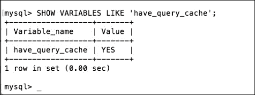
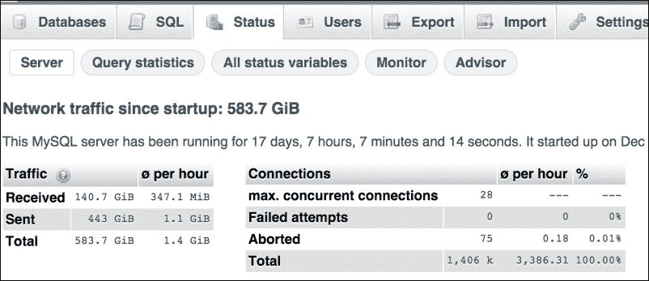
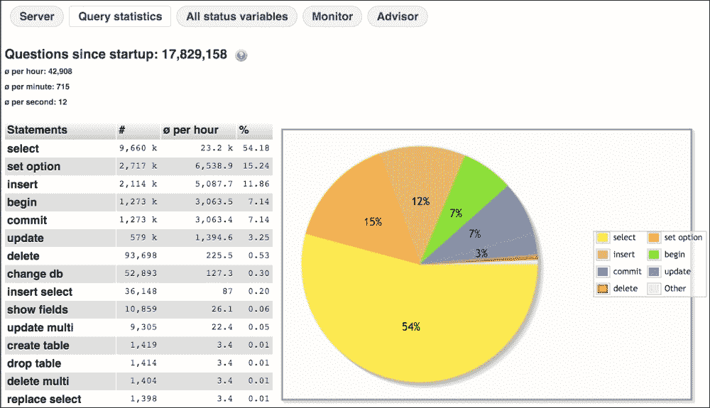
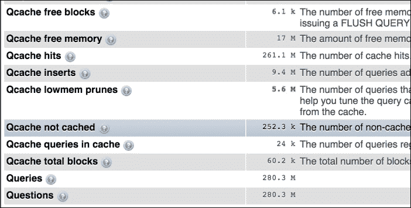
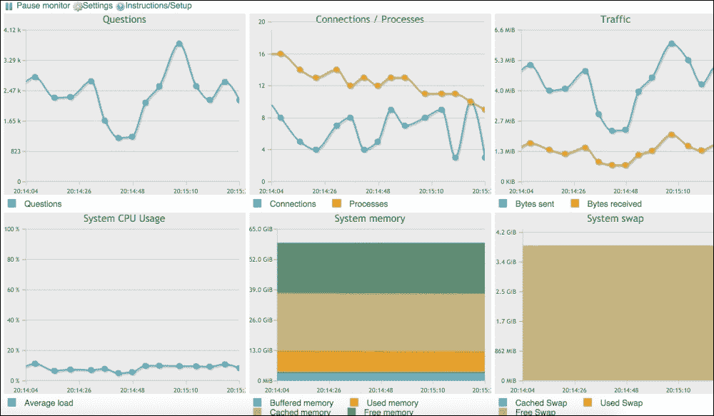
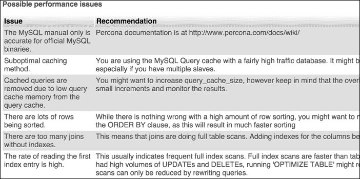
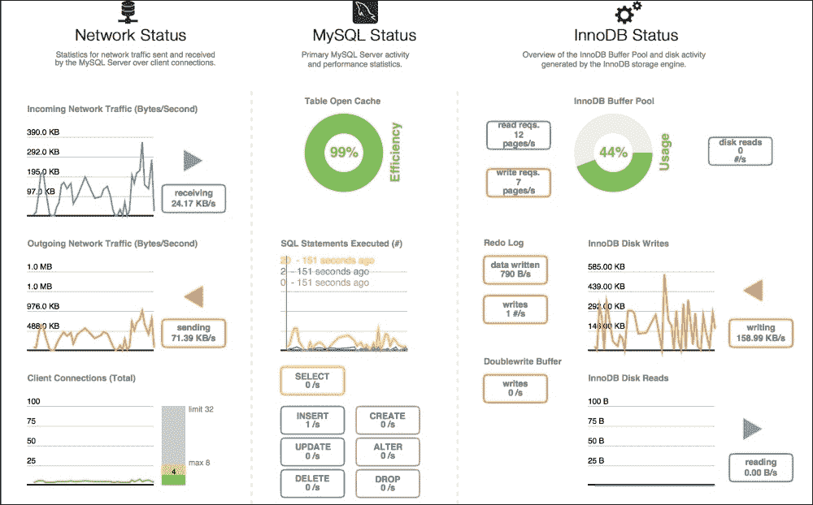
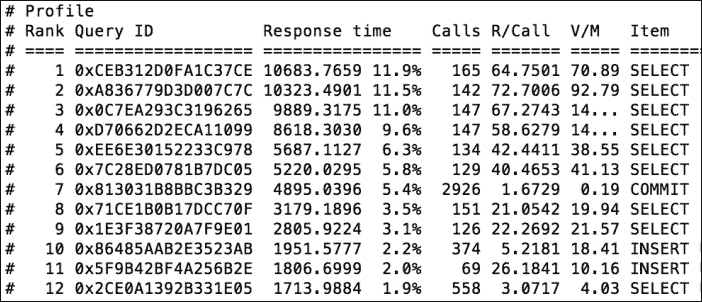
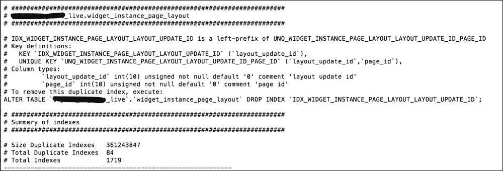
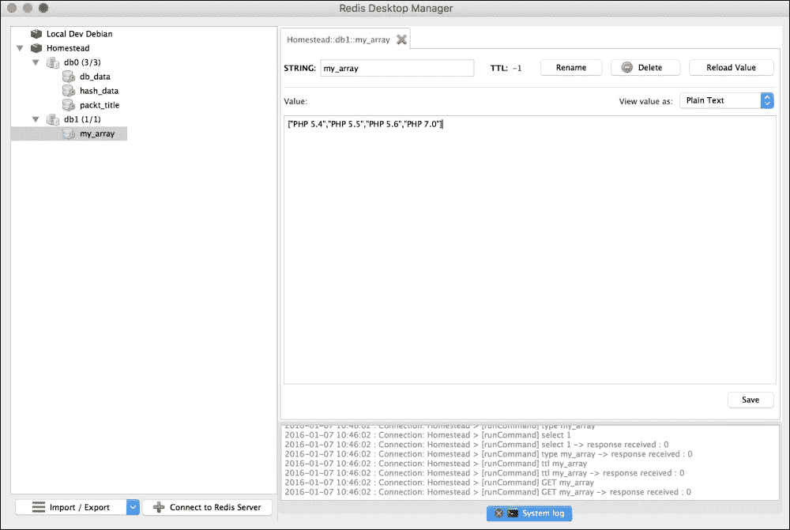

# 第四章。提高数据库性能

数据库在动态网站中扮演着关键角色。所有进出数据都存储在数据库中。因此，如果 PHP 应用程序的数据库设计和优化不好，将会极大地影响应用程序的性能。在本章中，我们将探讨优化 PHP 应用程序数据库的方法。本章将涵盖以下主题：

+   MySQL

+   查询缓存

+   MyISAM 和 InnoDB 存储引擎

+   Percona DB 和 Percona XtraDB 存储引擎

+   MySQL 性能监控工具

+   Redis

+   内存缓存

# MySQL 数据库

MySQL 是 Web 上最常用的关系型数据库管理系统（RDMS）。它是开源的，有免费的社区版本。它提供了企业级数据库可以提供的所有功能。

MySQL 安装提供的默认设置可能对性能不太好，总是有方法可以微调这些设置以获得更好的性能。另外，记住你的数据库设计在性能方面起着重要作用。设计不良的数据库会影响整体性能。

在本节中，我们将讨论如何提高 MySQL 数据库的性能。

### 注意

我们将修改 MySQL 配置的`my.cnf`文件。这个文件在不同的操作系统中位于不同的位置。另外，如果您在 Windows 上使用 XAMPP、WAMP 或任何其他跨平台 Web 服务器解决方案堆栈包，这个文件将位于相应的文件夹中。无论使用哪个操作系统，只要提到`my.cnf`，就假定文件是打开的。

## 查询缓存

查询缓存是 MySQL 的一个重要性能特性。它缓存`SELECT`查询以及结果数据集。当出现相同的`SELECT`查询时，MySQL 会从内存中获取数据，以便查询执行得更快，从而减少数据库的负载。

要检查 MySQL 服务器上是否启用了查询缓存，请在 MySQL 命令行中输入以下命令：

```php
**SHOW VARIABLES LIKE 'have_query_cache';**

```

上述命令将显示以下输出：



上一个结果集显示查询缓存已启用。如果查询缓存被禁用，值将为`NO`。

要启用查询缓存，打开`my.cnf`文件并添加以下行。如果这些行已经存在并被注释掉了，就取消注释：

```php
query_cache_type = 1
query_cache_size = 128MB
query_cache_limit = 1MB
```

保存`my.cnf`文件并重新启动 MySQL 服务器。让我们讨论一下前面三个配置的含义：

+   `query_cache_type`：这起着一种令人困惑的作用。

+   如果`query_cache_type`设置为`1`，`query_cache_size`为 0，则不分配内存，查询缓存被禁用。

如果`query_cache_size`大于 0，则查询缓存已启用，分配了内存，并且所有不超过`query_cache_limit`值或使用`SQL_NO_CACHE`选项的查询都被缓存。

+   如果`query_cache_type`的值为 0，`query_cache_size`为`0`，则不分配内存，缓存被禁用。

如果`query_cache_size`大于 0，则分配了内存，但没有缓存——即缓存被禁用。

+   `query_cache_size`：`query_cache_size`：这表示将分配多少内存。有些人认为使用的内存越多，效果就越好，但这是一个误解。这完全取决于数据库大小、查询类型和读写比例、硬件、数据库流量和其他因素。`query_cache_size`的一个好值在 100MB 到 200MB 之间；然后，您可以监视性能和其他影响查询缓存的变量，并调整大小。我们在一个中等流量的 Magento 网站上使用了 128MB，效果非常好。将此值设置为`0`以禁用查询缓存。

+   `query_cache_limit`：这定义了要缓存的查询数据集的最大大小。如果查询数据集的大小大于此值，则不会被缓存。可以通过找出最大的`SELECT`查询和其返回数据集的大小来猜测此配置的值。

# 存储引擎

存储引擎（或表类型）是 MySQL 核心的一部分，负责处理表上的操作。MySQL 提供了几种存储引擎，其中最常用的是 MyISAM 和 InnoDB。这两种存储引擎都有各自的优缺点，但总是优先考虑 InnoDB。从 5.5 开始，MySQL 开始使用 InnoDB 作为默认存储引擎。

### 注意

MySQL 提供了一些其他具有自己目的的存储引擎。在数据库设计过程中，可以决定哪个表应该使用哪种存储引擎。MySQL 5.6 的存储引擎的完整列表可以在[`dev.mysql.com/doc/refman/5.6/en/storage-engines.html`](http://dev.mysql.com/doc/refman/5.6/en/storage-engines.html)找到。

可以在数据库级别设置存储引擎，然后将其用作每个新创建的表的默认存储引擎。请注意，存储引擎是表的基础，单个数据库中的不同表可以具有不同的存储引擎。如果已经创建了一个表并且想要更改其存储引擎怎么办？很容易。假设我们的表名是`pkt_users`，其存储引擎是 MyISAM，我们想将其更改为 InnoDB；我们将使用以下 MySQL 命令：

```php
**ALTER TABLE pkt_users ENGINE=INNODB;**

```

这将把表的存储引擎值更改为`INNODB`。

现在，让我们讨论两种最常用的存储引擎 MyISAM 和 InnoDB 之间的区别。

## MyISAM 存储引擎

以下是 MyISAM 支持或不支持的功能的简要列表：

+   MyISAM 旨在提高速度，最适合与`SELECT`语句一起使用。

+   如果表更加静态，即该表中的数据更新/删除较少，大部分情况下只是获取数据，那么 MyISAM 是该表的最佳选项。

+   MyISAM 支持表级锁定。如果需要对表中的数据执行特定操作，那么可以锁定整个表。在此锁定期间，无法对该表执行任何操作。如果表更加动态，即该表中的数据经常更改，这可能会导致性能下降。

+   MyISAM 不支持外键。

+   MyISAM 支持全文搜索。

+   MyISAM 不支持事务。因此，不支持`COMMIT`和`ROLLBACK`。如果对表执行查询，则执行查询，没有回头的余地。

+   支持数据压缩、复制、查询缓存和数据加密。

+   不支持集群数据库。

## InnoDB 存储引擎

以下是 InnoDB 支持或不支持的功能的简要列表：

+   InnoDB 旨在在处理大量数据时具有高可靠性和高性能。

+   InnoDB 支持行级锁定。这是一个很好的特性，对性能非常有利。与 MyISAM 锁定整个表不同，它仅锁定`SELECT`、`DELETE`或`UPDATE`操作的特定行，在这些操作期间，该表中的其他数据可以被操作。

+   InnoDB 支持外键并强制外键约束。

+   支持事务。可以进行 COMMIT 和 ROLLBACK，因此可以从特定事务中恢复数据。

+   支持数据压缩、复制、查询缓存和数据加密。

+   InnoDB 可以在集群环境中使用，但它并没有完全支持。然而，InnoDB 表可以通过将表引擎更改为 NDB 来转换为 MySQL 集群中使用的 NDB 存储引擎。

在接下来的部分中，我们将讨论与 InnoDB 相关的一些性能特性。以下配置的值在`my.cnf`文件中设置。

### innodb_buffer_pool_size

此设置定义了用于 InnoDB 数据和加载到内存中的索引的内存量。对于专用的 MySQL 服务器，推荐值是服务器上安装内存的 50-80%。如果此值设置得太高，操作系统和 MySQL 的其他子系统，如事务日志，将没有内存。因此，让我们打开我们的`my.cnf`文件，搜索`innodb_buffer_pool_size`，并将值设置在推荐值（即 RAM 的 50-80%）之间。

### innodb_buffer_pool_instances

这个特性并不是那么广泛使用。它使多个缓冲池实例能够共同工作，以减少 64 位系统和`innodb_buffer_pool_size`较大值的内存争用的机会。

有不同的选择来计算`innodb_buffer_pool_instances`的值。一种方法是每 GB 的`innodb_buffer_pool_size`使用一个实例。因此，如果`innodb_bufer_pool_size`的值为 16GB，我们将把`innodb_buffer_pool_instances`设置为 16。

### innodb_log_file_size

`innodb_log_file_size`是存储执行的每个查询信息的日志文件的大小。对于专用服务器，最多可以设置为 4GB，但如果日志文件太大，崩溃恢复所需的时间可能会增加。因此，在最佳实践中，它保持在 1 到 4GB 之间。

# Percona Server - MySQL 的一个分支

根据 Percona 网站的说法，Percona 是一个免费、完全兼容、增强、开源的 MySQL 替代品，提供卓越的性能、可伸缩性和工具。

Percona 是一个具有增强性能功能的 MySQL 分支。MySQL 中可用的所有功能在 Percona 中也是可用的。Percona 使用一个名为 XtraDB 的增强存储引擎。根据 Percona 网站的说法，这是 MySQL 的 InnoDB 存储引擎的增强版本，具有更多功能，在现代硬件上具有更快的性能和更好的可伸缩性。Percona XtraDB 在高负载环境中更有效地使用内存。

如前所述，XtraDB 是 InnoDB 的一个分支，因此 InnoDB 中可用的所有功能在 XtraDB 中也是可用的。

## 安装 Percona Server

Percona 目前仅适用于 Linux 系统。目前不支持 Windows。在本书中，我们将在 Debian 8 上安装 Percona Server。对于 Ubuntu 和 Debian，安装过程是相同的。

### 注意

要在其他 Linux 版本上安装 Percona Server，请查看 Percona 安装手册[`www.percona.com/doc/percona-server/5.5/installation.html`](https://www.percona.com/doc/percona-server/5.5/installation.html)。目前，他们提供了 Debian、Ubuntu、CentOS 和 RHEL 的安装说明。他们还提供了从源代码和 Git 安装 Percona Server 的说明。

现在，让我们通过以下步骤安装 Percona Server：

1.  使用终端中的以下命令打开您的源列表文件：

```php
**sudo nano /etc/apt/sources.list** 

```

如果提示输入密码，请输入您的 Debian 密码。文件将被打开。

1.  现在，将以下存储库信息放在`sources.list`文件的末尾：

```php
deb http://repo.percona.com/apt jessie main
deb-src http://repo.percona.com/apt jessie main
```

1.  按下*CTRL* + *O*保存文件，按下*CTRL* + *X*关闭文件。

1.  使用终端中的以下命令更新系统：

```php
**sudo apt-get update**

```

1.  通过在终端中发出以下命令开始安装：

```php
**sudo apt-get install percona-server-server-5.5**

```

1.  安装将开始。该过程与安装 MySQL 服务器的过程相同。在安装过程中，将要求输入 Percona Server 的 root 密码；您只需输入即可。安装完成后，您将可以像使用 MySQL 一样使用 Percona Server。

1.  根据之前的章节配置和优化 Percona Server。

# MySQL 性能监控工具

始终需要监视数据库服务器的性能。为此，有许多可用的工具，使监视 MySQL 服务器和性能变得容易。其中大多数是开源和免费的，并且一些提供了图形界面。命令行工具更加强大，是最好的选择，尽管需要一点时间来理解和习惯它们。我们将在这里讨论一些。 

## phpMyAdmin

这是最著名的基于 Web 的开源免费工具，用于管理 MySQL 数据库。除了管理 MySQL 服务器外，它还提供了一些很好的工具来监视 MySQL 服务器。如果我们登录到 phpMyAdmin，然后点击顶部的**状态**选项卡，我们将看到以下屏幕：



**服务器**选项卡向我们显示了关于 MySQL 服务器的基本数据，例如启动时间，自上次启动以来处理的流量量，连接信息等。

接下来是**查询统计**。这部分提供了关于所有执行的查询的完整统计信息。它还提供了一个饼图，可视化显示每种查询类型的百分比，如下面的截图所示。

如果我们仔细观察图表，我们会发现我们有 54%的`SELECT`查询正在运行。如果我们使用某种缓存，比如 Memcached 或 Redis，这些`SELECT`查询不应该这么高。因此，这个图表和统计信息为我们提供了分析我们的缓存系统的手段。



下一个选项是**所有状态变量**，列出了所有 MySQL 变量及其当前值。在这个列表中，可以很容易地找出 MySQL 的配置情况。在下面的截图中，显示了我们的查询缓存变量及其值：



phpMyAdmin 提供的下一个选项是**监视器**。这是一个非常强大的工具，以图形方式实时显示服务器资源及其使用情况。



如前面的截图所示，我们可以在一个漂亮的图形界面中看到**问题**、**连接/进程**、**系统 CPU 使用率**、**流量**、**系统内存**和**系统交换**。

最后一个重要部分是**顾问**。它为我们提供有关性能设置的建议。它尽可能多地为您提供细节，以便调整 MySQL 服务器以提高性能。以下截图显示了顾问部分的一个小节：



如果应用了所有这些建议，就可以获得一些性能提升。

## MySQL 工作台

这是 MySQL 的桌面应用程序，配备了管理和监控 MySQL 服务器的工具。它为我们提供了一个性能仪表板，可以以美观和图形的方式查看与服务器相关的所有数据，如下面的截图所示：



## Percona Toolkit

之前提到的所有工具都很好，并提供了一些关于我们数据库服务器的可视化信息。然而，它们还不足以向我们显示一些更有用的信息或提供更多可以简化我们生活的功能。为此，还有另一个命令行工具包可用，名为 Percona Toolkit。

Percona Toolkit 是一套包括用于分析慢查询、存档、优化索引等的 30 多个命令行工具。

### 注意

Percona Toolkit 是免费开源的，可在 GPL 下使用。它的大多数工具在 Linux/Unix 系统上运行，但也有一些可以在 Windows 上运行。安装指南可以在[`www.percona.com/doc/percona-toolkit/2.2/installation.html`](https://www.percona.com/doc/percona-toolkit/2.2/installation.html)找到。完整的工具集可以在[`www.percona.com/doc/percona-toolkit/2.2/index.html`](https://www.percona.com/doc/percona-toolkit/2.2/index.html)找到。

现在，让我们在接下来的小节中讨论一些工具。

### pt-query-digest

该工具分析来自慢查询、一般查询和二进制日志文件的查询。它生成有关查询的复杂报告。让我们使用以下命令对慢查询运行此工具：

```php
**Pt-query-digest /var/log/mysql/mysql-slow.log**

```

在终端中输入上述命令后，我们将看到一个很长的报告。在这里，我们将讨论报告的一小部分，如下屏幕截图所示：



在前面的屏幕截图中，慢查询按最慢的顺序列出。第一个查询是一个`SELECT`查询，花费最长的时间，大约占总时间的 12%。第二个查询也是一个`SELECT`查询，占总时间的 11.5%。从这份报告中，我们可以看到哪些查询很慢，以便优化它们以获得最佳性能。

此外，pt-query-digest 显示每个查询的信息，如下屏幕截图所示。屏幕截图中提到了第一个查询的数据，包括总时间；时间百分比（pct）；最小、最大和平均时间；发送的字节数；以及其他一些参数：


### pt-duplicate-key-checker

该工具查找指定表集或完整数据库中的重复索引和重复外键。让我们在终端中使用以下命令再次执行此工具：

```php
**Pt-duplicate-key-checker –user packt –password dbPassword –database packt_pub**

```

执行时，将打印以下输出：



在报告末尾，显示了指标摘要，这是不言自明的。此工具还打印出每个重复索引的`ALTER`查询，可以作为 MySQL 查询执行以修复索引，如下所示：

```php
**Pt-variable-advisor**

```

该工具显示每个查询的 MySQL 配置信息和建议。这是一个可以帮助我们正确设置 MySQL 配置的好工具。我们可以通过运行以下命令来执行此工具：

```php
**Pt-variable-advisor –user packt –password DbPassword localhost**

```

执行后，将显示以下输出：


Percona Toolkit 还提供了许多其他工具，超出了本书的范围。但是，[`www.percona.com/doc/percona-toolkit/2.2/index.html`](https://www.percona.com/doc/percona-toolkit/2.2/index.html)上的文档非常有帮助且易于理解。它为每个工具提供了完整的详细信息，包括描述和风险，如何执行以及其他选项（如果有）。如果您希望了解 Percona Toolkit 中的任何工具，这份文档值得一读。

# Percona XtraDB Cluster（PXC）

Percona XtraDB Cluster 提供了一个高性能的集群环境，可以帮助轻松配置和管理多台服务器上的数据库。它使数据库可以使用二进制日志相互通信。集群环境有助于在不同的数据库服务器之间分担负载，并在服务器宕机时提供故障安全性。

要设置集群，我们需要以下服务器：

+   一台带有 IP 10.211.55.1 的服务器，我们将其称为 Node1

+   第二台带有 IP 10.211.55.2 的服务器，我们将其称为 Node2

+   第三台带有 IP 10.211.55.3 的服务器，我们将其称为 Node3

由于我们已经在我们的资源中有 Percona 存储库，让我们开始安装和配置 Percona XtraDB Cluster，也称为 PXC。执行以下步骤：

1.  首先，在终端中发出以下命令在 Node1 上安装 Percona XtraDB Cluster：

```php
**apt-get install percona-xtradb-cluster-56**

```

安装将类似于正常的 Percona Server 安装开始。在安装过程中，还将要求设置 root 用户的密码。

1.  安装完成后，我们需要创建一个具有复制权限的新用户。在登录到 MySQL 终端后，发出以下命令：

```php
**CREATE USER 'sstpackt'@'localhost' IDENTIFIED BY 'sstuserpassword';**
**GRANT RELOAD, LOCK TABLES, REPLICATION CLIENT ON *.* TO 'sstpackt'@'localhost';**
**FLUSH PRIVILEGES;**

```

第一个查询创建一个用户名为`sstpackt`，密码为`sstuserpassword`的用户。用户名和密码可以是任何内容，但建议使用一个好的和强大的密码。第二个查询为我们的新用户设置适当的权限，包括锁定表和复制。第三个查询刷新权限。

1.  现在，打开位于`/etc/mysql/my.cnf`的 MySQL 配置文件。然后，在`mysqld`块中放置以下配置：

```php
#Add the galera library
wsrep_provider=/usr/lib/libgalera_smm.so

#Add cluster nodes addresses
wsrep_cluster_address=gcomm://10.211.55.1,10.211.55.2,10.211.55.3

#The binlog format should be ROW. It is required for galera to work properly
binlog_format=ROW

#default storage engine for mysql will be InnoDB
default_storage_engine=InnoDB

#The InnoDB auto increment lock mode should be 2, and it is required for galera
innodb_autoinc_lock_mode=2

#Node 1 address
wsrep_node_address=10.211.55.1

#SST method
wsrep_sst_method=xtrabackup

#Authentication for SST method. Use the same user name and password created in above step 2
wsrep_sst_auth="sstpackt:sstuserpassword"

#Give the cluster a name
wsrep_cluster_name=packt_cluster
```

在添加上述配置后保存文件。

1.  现在，通过发出以下命令启动第一个节点：

```php
**/etc/init.d/mysql bootstrap-pxc**

```

这将引导第一个节点。引导意味着启动初始集群并定义哪个节点具有正确的信息，其他所有节点都应该同步到哪个节点。由于 Node1 是我们的初始集群节点，并且我们在这里创建了一个新用户，因此我们只需引导 Node1。

### 注意

**SST**代表**State Snapshot Transfer**。它负责从一个节点复制完整数据到另一个节点。仅在向集群添加新节点并且此节点必须从现有节点获取完整的初始数据时使用。`Percona XtraDB Cluster`中有三种 SST 方法，`mysqldump`、`rsync`和`xtrabackup`。

1.  在第一个节点上登录 MySQL 终端，并发出以下命令：

```php
**SHOW STATUS LIKE '%wsrep%';**

```

将显示一个非常长的列表。以下是其中的一些：


1.  现在，对所有节点重复步骤 1 和步骤 3。每个节点需要更改的唯一配置是`wsrep_node_address`，它应该是节点的 IP 地址。编辑所有节点的`my.cnf`配置文件，并将节点地址放在`wsrep_node_address`中。

1.  通过在终端中发出以下命令来启动两个新节点：

```php
**/etc/init.d/mysql start**

```

现在可以通过重复步骤 7 来验证每个节点。

要验证集群是否正常工作，请在一个节点中创建一个数据库，并向表中添加一些表和数据。之后，检查其他节点是否有新创建的数据库、表和每个表中输入的数据。我们将把所有这些数据同步到每个节点。

# Redis - 键值缓存存储

Redis 是一个开源的内存键值数据存储，广泛用于数据库缓存。根据 Redis 网站（[www.Redis.io](http://www.Redis.io)）的说法，Redis 支持诸如字符串、哈希、列表、集合和排序列表等数据结构。此外，Redis 支持复制和事务。

### 注意

Redis 安装说明可以在[`redis.io/topics/quickstart`](http://redis.io/topics/quickstart)找到。

要检查 Redis 在服务器上是否正常工作，请在终端中运行以下命令启动 Redis 服务器实例：

```php
**redis server**

```

然后在不同的终端窗口中发出以下命令：

```php
**redis-cli ping**

```

如果上述命令的输出如下，则 Redis 服务器已准备就绪：


Redis 提供了一个命令行，其中提供了一些有用的命令。在 Redis 服务器上执行命令有两种方法。您可以使用以前的方法，也可以只输入`redis-cli`并按*Enter*；然后我们将看到 Redis 命令行，然后我们可以输入要执行的 Redis 命令。

默认情况下，Redis 使用 IP 127.0.0.1 和端口 6379。虽然不允许远程连接，但可以启用远程连接。Redis 存储已在数据库中创建的数据。数据库名称是整数，如 0、1、2 等。

我们不会在这里详细讨论 Redis，但我们将讨论一些值得注意的命令。请注意，所有这些命令都可以以前面的方式执行，或者我们可以只输入`redis-cli`命令窗口并输入命令，而不输入`redis-cli`。此外，以下命令可以直接在 PHP 中执行，这样就可以直接从我们的 PHP 应用程序中清除缓存：

+   `选择`：此命令更改当前数据库。默认情况下，redis-cli 将在数据库 0 打开。因此，如果我们想要转到数据库 1，我们将运行以下命令：

```php
**SELECT 1**

```

+   `FLUSHDB`：此命令刷新当前数据库。当前数据库中的所有键或数据将被删除。

+   `FLUSHALL`：此命令刷新所有数据库，无论在哪个数据库中执行。

+   `KEYS`：此命令列出与模式匹配的当前数据库中的所有键。以下命令列出当前数据库中的所有键。

```php
**KEYS ***

```

现在，是时候在 PHP 中与 Redis 进行一些操作了。

### 注意

在撰写本主题时，PHP 7 尚未内置对 Redis 的支持。为了本书的目的，我们为 PHP 7 编译了 PHPRedis 模块，并且它运行得非常好。该模块可以在[`github.com/phpredis/phpredis`](https://github.com/phpredis/phpredis)找到。

## 与 Redis 服务器连接

如前所述，默认情况下，Redis 服务器在 IP 127.0.0.1 和端口 6379 上运行。因此，为了建立连接，我们将使用这些详细信息。请看以下代码：

```php
$redisObject = new Redis();
if( !$redisObject->connect('127.0.0.1', 6379))
  die("Can't connect to Redis Server");
```

在第一行中，我们通过名称`redisObject`实例化了一个 Redis 对象，然后在第二行中使用它连接到 Redis 服务器。主机是本地 IP 地址 127.0.0.1，端口是 6379。`connect()`方法如果连接成功则返回`TRUE`；否则返回`FALSE`。

## 从 Redis 服务器存储和获取数据

现在，我们已连接到我们的 Redis 服务器。让我们在 Redis 数据库中保存一些数据。例如，我们想要在 Redis 数据库中存储一些字符串数据。代码如下：

```php
//Use same code as above for connection.
//Save Data in to Redis database.
$rdisObject->set('packt_title', 'Packt Publishing');

//Lets get our data from database
echo $redisObject->get('packt_title');
```

`set`方法将数据存储到当前 Redis 数据库，并接受两个参数：键和值。键可以是任何唯一名称，值是我们需要存储的内容。因此，我们的键是`packt_title`，值是`Packt Publishing`。除非显式设置，否则默认数据库始终设置为 0（零）。因此，上述`set`方法将保存我们的数据到数据库 0，并使用`packt_title`键。

现在，`get`方法用于从当前数据库中获取数据。它以键作为参数。因此，上述代码的输出将是我们保存的字符串数据`Packt Publishing`。

那么，来自数据库的数组或一组数据怎么办？我们可以以多种方式在 Redis 中存储它们。让我们首先尝试正常的字符串方式，如下所示：

```php
//Use same connection code as above.

/* This $array can come from anywhere, either it is coming from database or user entered form data or an array defined in code */

$array = ['PHP 5.4', PHP 5.5, 'PHP 5.6', PHP 7.0];

//Json encode the array
$encoded = json_encode($array);

//Select redis database 1
$redisObj->select(1);

//store it in redis database 1
$redisObject->set('my_array', $encoded);

//Now lets fetch it
$data = $redisObject->get('my_array');

//Decode it to array
$decoded = json_decode($data, true);

print_r($decoded); 
```

上述代码的输出将是相同的数组。为了测试目的，我们可以注释掉`set`方法，并检查`get`方法是否获取数据。请记住，在上述代码中，我们将数组存储为`json`字符串，然后将其作为`json`字符串获取，并解码为数组。这是因为我们使用了字符串数据类型可用的方法，不可能将数组存储在字符串数据类型中。

此外，我们使用`select`方法选择另一个数据库并在 0 之外使用它。这些数据将存储在数据库 1 中，如果我们在数据库 0，则无法获取它们。

### 注意

对 Redis 的完整讨论超出了本书的范围。因此，我们提供了一个简介。请注意，如果您使用任何框架，都可以轻松使用 Redis 提供的内置库，并且可以轻松使用任何数据类型。

## Redis 管理工具

Redis 管理工具提供了一种简单的方式来管理 Redis 数据库。这些工具提供了功能，以便可以轻松检查每个键并清除缓存。Redis 自带一个默认工具，称为 Redis-cli，我们之前已经讨论过。现在，让我们讨论一个视觉工具，非常好用，叫做**Redis Desktop Manage**（**RDM**）。RDM 的主窗口的屏幕截图如下所示：



RDM 提供以下功能：

+   它连接到远程多个 Redis 服务器

+   以不同格式显示特定键中的数据

+   它向所选数据库添加新键

+   它向选定的键添加更多数据

+   它编辑/删除键和它们的名称

+   它支持 SSH 和 SSL，并且可以在云中使用

还有一些其他工具可以使用，但 RDM 和 Redis-cli 是最好和最容易使用的。

# Memcached 键值缓存存储

根据 Memcached 官方网站的说法，它是一个免费、开源、高性能、分布式内存对象缓存系统。Memcached 是一个内存中的键值存储，可以存储来自数据库或 API 调用的数据集。

与 Redis 类似，Memcached 也在加速网站方面有很大帮助。它将数据（字符串或对象）存储在内存中。这使我们能够减少与外部资源（如数据库或 API）的通信。

### 注意

我们假设 Memcached 已经安装在服务器上。同时，也假设 PHP 7 的 PHP 扩展也已安装。

现在，让我们在 PHP 中稍微玩一下 Memcachd。看一下下面的代码：

```php
//Instantiate Memcached Object
$memCached = new Memcached();

//Add server
$memCached->addServer('127.0.0.1', 11211);

//Lets get some data
$data = $memCached->get('packt_title');

//Check if data is available
if($data)
{
  echo $data;
}
else
{
  /*No data is found. Fetch your data from any where and add to   memcached */

  $memCached->set('packt_title', 'Packt Publishing');

}
```

上面的代码是一个非常简单的使用 Memcached 的例子。每行代码都有注释，很容易理解。在实例化一个 Memcached 对象之后，我们必须添加一个 Memcached 服务器。默认情况下，Memcached 服务器在本地主机 IP 上运行，即 127.0.0.1，端口号为 11211。之后，我们使用一个键来检查一些数据，如果数据可用，我们可以处理它（在这种情况下，我们将其显示出来，也可以返回它，或者进行其他所需的处理）。如果数据不可用，我们可以直接添加它。请注意，数据可以来自远程服务器 API 或数据库。

### 注意

我们刚刚介绍了 Memcached 以及它如何帮助我们存储数据和提高性能。在本标题中无法进行完整的讨论。关于 Memcached 的一本好书是 Packt Publishing 出版的《Getting Started with Memcached》。

# 摘要

在本章中，我们涵盖了 MySQL 和 Percona Server。此外，我们详细讨论了查询缓存和其他 MySQL 性能配置选项。我们提到了不同的存储引擎，比如 MyISAM、InnoDB 和 Percona XtraDB。我们还在三个节点上配置了 Percona XtraDB 集群。我们讨论了不同的监控工具，比如 PhpMyAdmin 监控工具、MySQL Workbench 性能监控和 Percona Toolkit。我们还讨论了 Redis 和 Memcached 对 PHP 和 MySQL 的缓存。

在下一章中，我们将讨论基准测试和不同的工具。我们将使用 XDebug、Apache JMeter、ApacheBench 和 Siege 来对不同的开源系统进行基准测试，比如 WordPress、Magento、Drupal 以及不同版本的 PHP，并将它们与 PHP 7 的性能进行比较。
