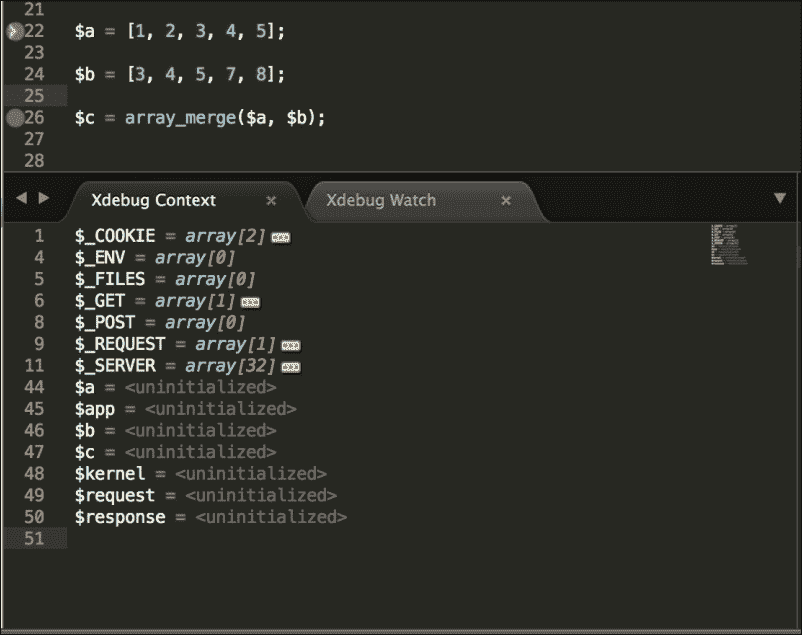
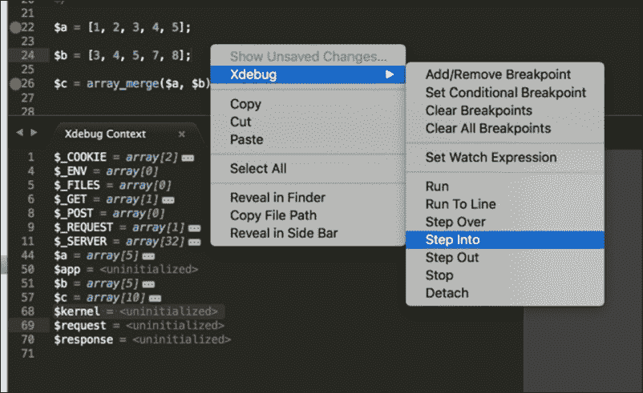
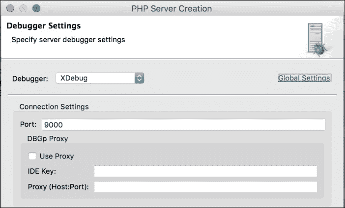

# 第五章：调试和性能分析

在开发过程中，每个开发人员都会遇到问题，不清楚到底发生了什么，以及为什么会产生问题。大多数时候，这些问题可能是逻辑性的或者与数据有关。要找到这样的问题总是很困难。调试是一个找到这样的问题并解决它们的过程。同样，我们经常需要知道脚本消耗了多少资源，包括内存消耗，CPU 以及执行所需的时间。

在本章中，我们将涵盖以下主题：

+   Xdebug

+   使用 Sublime Text 3 进行调试

+   使用 Eclipse 进行调试

+   使用 Xdebug 进行性能分析

+   PHP DebugBar

# Xdebug

Xdebug 是 PHP 的一个扩展，为 PHP 脚本提供调试和性能分析信息。Xdebug 显示错误的完整堆栈跟踪信息，包括函数名称，行号和文件名。此外，它提供了使用不同 IDE（如 Sublime Text，Eclipse，PHP Storm 和 Zend Studio）交互式调试脚本的能力。

要检查 Xdebug 是否已安装并在我们的 PHP 安装中启用，我们需要检查 phpinfo（）的详细信息。在 phpinfo 详细信息页面上搜索 Xdebug，您应该看到类似以下屏幕截图的详细信息：

！[Xdebug]（graphics / B05225_05_01.jpg）

这意味着我们的 PHP 安装已经安装了 Xdebug。现在，我们需要配置 Xdebug。Xdebug 配置要么在`php.ini`文件中，要么有自己的单独的`.ini`文件。在我们的安装中，我们将在`/etc/php/7.0/fpm/conf.d/`路径下放置一个单独的`20-xdebug.ini`文件。

### 注意

为了本书的目的，我们将使用 Laravel 的 Homestead Vagrant 框。它在 Ubuntu 14.04 LTS 安装中提供了完整的工具，包括带有 Xdebug 的 PHP7，NGINX 和 MySQL。对于开发目的，这个 Vagrant 框是一个完美的解决方案。更多信息可以在[https://laravel.com/docs/5.1/homestead]（https://laravel.com/docs/5.1/homestead）找到。

现在，打开`20-xdebug.ini`文件并将以下配置放入其中：

```php
zend_extension = xdebug.so
xdebug.remote_enable = on
xdebug.remote_connect_back = on
xdebug.idekey = "vagrant"
```

上述是我们应该使用的最低配置，它们启用了远程调试并设置了 IDE 密钥。现在，通过在终端中发出以下命令来重新启动 PHP：

```php
**sudo service php-fpm7.0 restart**

```

现在我们准备调试一些代码。

## 使用 Sublime Text 进行调试

Sublime Text 编辑器有一个插件，可以用来使用 Xdebug 调试 PHP 代码。首先，让我们为 Sublime Text 安装`xdebug`包。

### 注意

对于这个主题，我们将使用仍处于 beta 阶段的 Sublime Text 3。使用版本 2 还是 3 是你自己的选择。

首先，转到**工具** | **命令面板**。将显示类似于以下内容的弹出窗口：

！[使用 Sublime Text 进行调试]（graphics / B05225_05_02.jpg）

选择**Package Control：Install Package**，将显示类似于以下屏幕截图的弹出窗口：

！[使用 Sublime Text 进行调试]（graphics / B05225_05_03.jpg）

键入`xdebug`，将显示**Xdebug Client**包。单击它，等待一会直到安装完成。

现在，在 Sublime Text 中创建一个项目并保存它。打开 Sublime Text 项目文件并插入以下代码：

```php
{
  "folders":
  [
    {
    "follow_symlinks": true,
    "path": "."
  }
],

**"settings": {**
 **"xdebug": {**
 **"path_mapping": {**
 **"full_path_on_remote_host" : "full_path_on_local_host"**
 **},**
 **"url" : http://url-of-application.com/,**
 **"super_globals" : true,**
 **"close_on_stop" : true,**
 **}**
 **}**
}
```

突出显示的代码很重要，必须输入 Xdebug。路径映射是最重要的部分。它应该有远程主机应用程序根目录的完整路径和本地主机应用程序根目录的完整路径。

现在，让我们开始调试。在项目的根目录创建一个文件，命名为`index.php`，并将以下代码放入其中：

```php
$a = [1,2,3,4,5];
$b = [4,5,6,7,8];

$c = array_merge($a, $b);
```

现在，在编辑器中右键单击一行，然后选择**Xdebug**。然后，单击**添加/删除断点**。让我们按照以下屏幕截图中显示的方式添加一些断点：

！[使用 Sublime Text 进行调试]（graphics / B05225_05_04.jpg）

当在一行上添加断点时，将在左侧靠近行号处显示一个填充的圆圈，如前面的屏幕截图所示。

现在我们已经准备好调试我们的 PHP 代码了。转到**工具** | **Xdebug** | **开始调试（在浏览器中启动）**。浏览器窗口将打开应用程序，并附带 Sublime Text 调试会话参数。浏览器窗口将处于加载状态，因为一旦到达第一个断点，执行就会停止。浏览器窗口将类似于以下内容：


一些新的小窗口也会在 Sublime Text 编辑器中打开，显示调试信息以及所有可用的变量，如下面的屏幕截图所示：



在上面的屏幕截图中，我们的`$a`，`$b`和`$c`数组未初始化，因为执行光标位于第 22 行，并且停在那里。此外，所有服务器变量、cookie、环境变量、请求数据以及 POST 和 GET 数据都可以在这里看到。这样，我们可以调试各种变量、数组和对象，并检查每个变量、对象或数组在某个特定点上持有的数据。这使我们有可能找出那些在没有调试的情况下很难检测到的错误。

现在，让我们将执行光标向前移动。在编辑器代码部分右键单击，然后转到**Xdebug** | **步入**。光标将向前移动，变量数据可能会根据下一行而改变。可以在以下屏幕截图中注意到这一点：



单击**工具** | **Xdebug** | **停止调试**即可停止调试。

## 使用 Eclipse 进行调试

Eclipse 是最自由和功能强大的广泛使用的 IDE。它支持几乎所有主要的编程语言，包括 PHP。我们将讨论如何配置 Eclipse 以使用 Xdebug 进行调试。

首先，在 Eclipse 中打开项目。然后，单击工具栏中小虫图标右侧的向下箭头，如下面的屏幕截图所示：


之后，单击**调试配置**菜单，将打开以下窗口：


在左侧面板中选择**PHP Web 应用程序**，然后单击左上角的**添加新**图标。这将添加一个新的配置，如上面的屏幕截图所示。给配置命名。现在，我们需要向配置中添加一个 PHP 服务器。单击右侧面板上的**新建**按钮，将打开以下窗口： 


我们将服务器名称输入为`PHP 服务器`。服务器名称可以是任何用户友好的名称，只要以后可以识别。在**基本 URL**字段中，输入应用程序的完整 URL。**文档根**应该是应用程序根目录的本地路径。输入所有有效数据后，单击**下一步**按钮，我们将看到以下窗口：



在**调试器**下拉列表中选择**XDebug**，其余字段保持不变。单击**下一步**按钮，我们将进入路径映射窗口。将正确的本地路径映射到正确的远程路径非常重要。单击**添加**按钮，我们将看到以下窗口：


在远程服务器上输入应用程序的文档根的完整路径。然后，选择**文件系统中的路径**，并输入应用程序文档根的本地路径。单击**确定**，然后单击路径映射窗口中的**完成**按钮。然后，在下一个窗口中单击**完成**，以完成添加 PHP 服务器。

现在，我们的配置已经准备好。首先，我们将通过点击行号栏上的小蓝点来向我们的 PHP 文件添加一些断点，如下截图所示。现在，点击工具栏上的小虫子图标，选择**Debug As**，然后点击**PHP Web Application**。调试过程将开始，并且浏览器中将打开一个窗口。它将处于加载状态，就像我们在 Sublime Text 调试中看到的一样。此外，Eclipse 中将打开 Debug 视图，如下所示：


当我们点击右侧边栏中的小(**X**)=图标时，我们将看到所有的变量。还可以编辑任何变量数据，甚至是任何数组的元素值、对象属性和 cookie 数据。修改后的数据将在当前调试会话中保留。

要进入下一行，我们只需按下*F5*，执行光标将移动到下一行。要跳出到下一个断点，我们将按下*F6*。

# 使用 Xdebug 进行分析

分析提供了有关应用程序中执行的每个脚本或任务的成本的信息。它有助于提供有关任务花费多少时间的信息，因此我们可以优化我们的代码以减少时间消耗。

Xdebug 有一个默认情况下被禁用的分析器。要启用分析器，打开配置文件并在其中放置以下两行：

```php
xdebug.profiler_enable=on
xdebug.profiler_output_dir=/var/xdebug/profiler/
```

第一行启用了分析器。我们定义了分析器文件的输出目录的第二行非常重要。在这个目录中，当分析器执行时，Xdebug 将存储输出文件。输出文件以`cachegrind.out.id`的名称存储。这个文件包含了所有的分析数据，以简单的文本格式。

现在，我们准备对 Laravel 应用程序主页的简单安装进行分析。这个安装是全新的和干净的。现在，让我们在浏览器中打开应用程序，并在末尾添加`?XDEBUG_PROFILE=on`，如下所示：

`http://application_url.com?XDEBUG_PROFILE=on`

在加载完这个页面后，将在指定位置生成一个`cachegrind`文件。现在，当我们在文本编辑器中打开文件时，我们将只看到一些文本数据。

### 注意

`cachegrind`文件可以用不同的工具打开。Windows 的一个工具是 WinCacheGrind。对于 Mac，我们有 qcachegrind。这些应用程序中的任何一个都将以一种可以轻松分析的交互形式查看文件数据。此外，PHP Storm 有一个用于 cachegrind 的良好分析器。在这个主题中，我们使用了 PHP Storm IDE。

在 PHP Storm 中打开文件后，我们将得到一个类似以下截图的窗口：


如前面的截图所示，我们在上面的窗格中有执行统计信息，显示了每个调用脚本单独花费的时间（以毫秒为单位），以及它被调用的次数。在下面的窗格中，我们有调用了这个脚本的调用者。

我们可以分析哪个脚本花费了更多的时间，然后优化这个脚本以减少执行时间。此外，我们可以找出在某个特定点是否需要调用特定的脚本。如果不需要，那么我们可以删除这个调用。

# PHP DebugBar

PHP DebugBar 是另一个很棒的工具，它在页面底部显示一个漂亮且完整的信息栏。它可以显示为了调试目的而添加的自定义消息，以及包括`$_COOKIE`、`$_SERVER`、`$_POST`和`$_GET`数组在内的完整请求信息，以及它们的数据（如果有的话）。此外，PHP DebugBar 还显示了异常的详细信息，执行的数据库查询及其详细信息。它还显示了脚本占用的内存和页面加载的时间。

根据 PHP Debug 网站，DebugBar 可以轻松集成到任何应用项目中，并显示来自应用程序任何部分的调试和分析数据。

它的安装很容易。您可以下载完整的源代码，将其放在应用程序的某个地方，并设置自动加载器来加载所有类，或者使用 composer 来安装它。我们将使用 composer，因为这是安装它的简单和干净的方式。

### 注意

Composer 是一个用于管理项目依赖关系的 PHP 工具。它是用 PHP 编写的，并且可以从[`getcomposer.org/`](https://getcomposer.org/)免费获取。我们假设 composer 已经安装在您的机器上。

在项目的`composer.json`文件中，在所需的部分中放置以下代码：

```php
"maximebf/debugbar" : ">=1.10.0"
```

保存文件，然后发出以下命令：

```php
**composer update**

```

Composer 将开始更新依赖项并安装 composer。此外，它将生成自动加载器文件和/或 DebugBar 所需的其他依赖项。

### 注意

前面的 composer 命令只有在系统上全局安装了 composer 才能工作。如果没有，我们必须使用以下命令：

```php
php composer.phar update
```

前面的命令应该在放置`composer.phar`的文件夹中执行。

安装后，DebugBar 的项目树可能如下：


目录结构可能有点不同，但通常会如我们之前所述。`src`目录包含了 DebugBar 的完整源代码。`vendor`目录包含了一些可能需要的第三方模块或 PHP 工具。还要注意`vendor`文件夹中有自动加载器来自动加载所有类。

让我们现在检查我们的安装，看看它是否工作。在项目根目录中创建一个新文件，命名为`index.php`。之后，在其中放置以下代码：

```php
<?php
require "vendor/autoloader.php";
use Debugbar\StandardDebugBar;
$debugger = new StandardDebugBar();
$debugbarRenderer = $debugbar->getJavascriptRenderer();

//Add some messages
$debugbar['messages']->addMessage('PHP 7 by Packt');
$debugbar['messages']->addMessage('Written by Altaf Hussain');

?>

<html>
  <head>
    <?php echo $debugbarRenderer->renderHead(); ?>
  </head>
  <title>Welcome to Debug Bar</title>
  <body>
    <h1>Welcome to Debug Bar</h1>

  <!—- display debug bar here -->
  <?php echo $debugbarRenderer->render();  ?>

  </body>
</html>
```

在前面的代码中，我们首先包含了我们的自动加载器，这是由 composer 为我们生成的，用于自动加载所有类。然后，我们使用了`DebugBar\StandardDebugbar`命名空间。之后，我们实例化了两个对象：`StandardDebugBar`和`getJavascriptRenderer`。`StandardDebugBar`对象是一个对象数组，其中包含了不同收集器的对象，例如消息收集器等。`getJavascriptRenderer`对象负责在页眉处放置所需的 JavaScript 和 CSS 代码，并在页面底部显示栏。

我们使用`$debugbar`对象向消息收集器添加消息。收集器负责从不同来源收集数据，例如数据库、HTTP 请求、消息等。

在 HTML 代码的头部，我们使用了`$debugbarRenderer`的`renderHead`方法来放置所需的 JavaScript 和 CSS 代码。之后，在`<body>`块的末尾之前，我们使用了相同对象的`render`方法来显示调试栏。

现在，在浏览器中加载应用程序，如果您注意到浏览器底部有一个栏，如下面的屏幕截图所示，那么恭喜！DebugBar 已正确安装并且运行正常。


在右侧，我们有应用程序消耗的内存和加载时间。

如果我们点击**消息**选项卡，我们将看到我们添加的消息，如下面的屏幕截图所示：


DebugBar 提供数据收集器，用于从不同来源收集数据。这些被称为*基本收集器*，以下是一些数据收集器：

+   消息收集器收集日志消息，如前面的示例所示

+   TimeData 收集器收集总执行时间以及特定操作的执行时间

+   异常收集器显示所有发生的异常

+   PDO 收集器记录 SQL 查询

+   RequestData 收集器收集 PHP 全局变量的数据，例如`$_SERVER`、`$_POST`、`$_GET`等。

+   配置收集器用于显示数组的任何键值对

此外，还有一些收集器可以从 Twig、Swift Mailer、Doctrine 等第三方框架中收集数据。这些收集器被称为桥接收集器。PHP DebugBar 也可以轻松集成到著名的 PHP 框架，如 Laravel 和 Zend Framework 2 中。

### 注

本书无法对 PHP DebugBar 进行全面讨论。因此，这里只提供了一个简单的介绍。PHP DebugBar 有一个很好的文档，其中提供了完整的详细信息和示例。文档可以在[`phpdebugbar.com/docs/readme.html`](http://phpdebugbar.com/docs/readme.html)找到。

# 总结

在本章中，我们讨论了调试 PHP 应用程序的不同工具。我们使用 Xdebug、Sublime Text 3 和 Eclipse 来调试我们的应用程序。然后，我们使用 Xdebug 分析器来分析应用程序，以找出执行统计信息。最后，我们讨论了 PHP DebugBar 来调试应用程序。

在下一章中，我们将讨论负载测试工具，我们可以使用这些工具在我们的应用程序上放置负载或虚拟访问者，以对其进行负载测试，并找出我们的应用程序能承受多少负载，以及它如何影响性能。
