# 第六章。压力/负载测试 PHP 应用程序

在应用程序开发、测试、调试和分析之后，是时候将其投入生产了。但是，在投入生产之前，最好的做法是对应用程序进行压力/负载测试。这项测试将为我们提供一个关于服务器在运行应用程序时可以处理多少请求的大致结果。利用这些结果，我们可以优化应用程序、Web 服务器、数据库和缓存工具，以获得更好的结果并处理更多的请求。

在本章中，我们将对 PHP 5.6 和 PHP 7 上的不同开源工具进行负载测试，并比较这些应用程序在 PHP 的两个版本上的性能。

我们将涵盖以下主题：

+   Apache JMeter

+   ApacheBench (ab)

+   Seige

+   在 PHP 5.6 和 PHP 7 上对 Magento 2 进行负载测试

+   在 PHP 5.6 和 PHP 7 上对 WordPress 进行负载测试

+   在 PHP 5.6 和 PHP 7 上对 Drupal 8 进行负载测试

# Apache JMeter

Apache JMeter 是一个图形化的开源工具，用于对服务器的性能进行负载测试。JMeter 完全由 Java 编写，因此与安装了 Java 的所有操作系统兼容。JMeter 拥有一套完整的广泛工具，可用于各种负载测试，从静态内容到动态资源和 Web 服务。

安装很简单。我们需要从 JMeter 网站下载它，然后运行应用程序。如前所述，它将需要在计算机上安装 Java。

### 注意

JMeter 可以测试 FTP 服务器、邮件服务器、数据库服务器、查询等等。在本书中，我们无法涵盖所有这些主题，因此我们只会对 Web 服务器进行负载测试。Apache JMeter 的功能列表可以在[`jmeter.apache.org/`](http://jmeter.apache.org/)找到。

当我们首次运行应用程序时，将看到以下窗口：

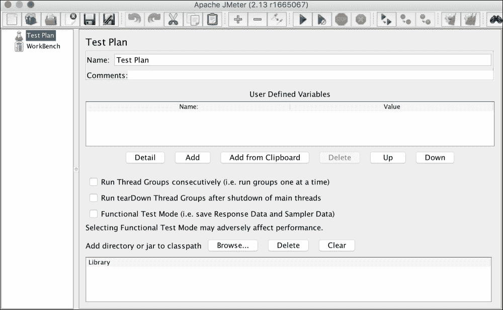

要运行任何类型的测试，首先需要创建一个测试计划。测试计划包含执行此测试所需的所有组件。默认情况下，JMeter 有一个名为 Test Plan 的测试计划。让我们将其命名为我们自己的计划，`Packt Publisher Test Plan`，如下面的屏幕截图所示：


现在，保存测试计划，JMeter 将创建一个`.jmx`文件。将其保存在适当的位置。

下一步是添加一个线程组。*线程组定义了测试计划的一些基本属性，这些属性可以在所有类型的测试中通用*。要添加线程组，请右键单击左侧面板中的计划，然后导航到**Add** | **Threads (Users)** | **Thread Group**。将显示以下窗口：

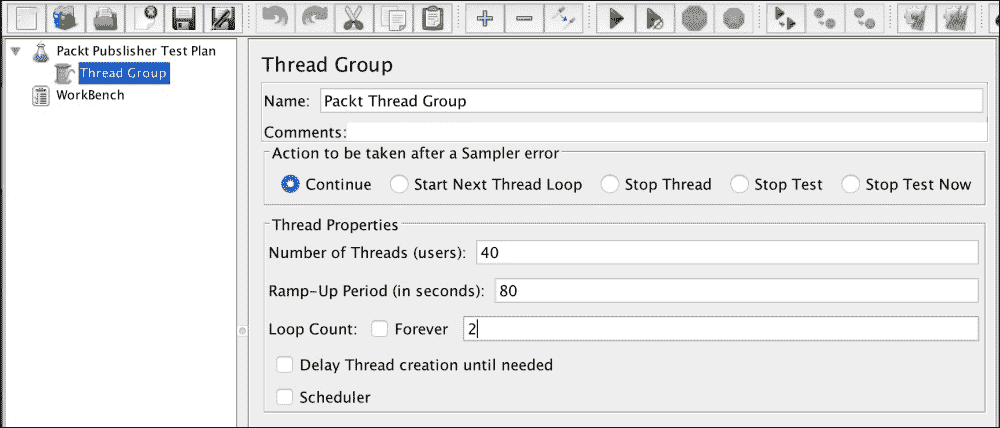

线程组具有以下重要属性：

+   **线程数**：这是虚拟用户的数量。

+   **渐进周期**：这告诉 JMeter 它应该花多长时间才能达到线程数的最大容量。例如，在前面的屏幕截图中，我们有 40 个线程和 80 秒的渐进时间；在这里，JMeter 将花 80 秒的时间完全启动 40 个线程，每个线程启动需要 2 秒。

+   **循环计数**：这告诉 JMeter 运行此线程组需要多长时间。

+   **调度程序**：这用于安排稍后执行线程组。

现在，我们需要添加 HTTP 请求默认值。右键单击**Packt Thread Group**，然后转到**Add** | **Config Element** | **HTTP Request Defaults**。将出现类似以下的窗口：

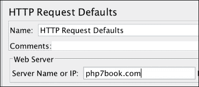

在前面的窗口中，我们只需输入应用程序的 URL 或 IP 地址。如果 Web 服务器使用 cookie，我们还可以添加 HTTP Cookie Manager，在其中可以添加用户定义的 cookie 及其所有数据，如名称、值、域、路径等。

接下来，我们将通过右键单击并导航到**Packt Thread Group** | **Add** | **Sampler** | **HTTP Request**来添加一个 HTTP 请求，然后将出现以下窗口：


这里的重要字段是**路径**。我们只想针对主页运行测试，所以对于这个 HTTP 请求，我们只需在**路径**字段中添加一个斜杠（`/`）。如果我们想测试另一个路径，比如"联系我们"，我们需要添加另一个 HTTP 请求采样器，如上面的屏幕截图所示。然后，在路径中，我们将添加`path/contact-us`。

HTTP 请求采样器也可以用于测试表单，可以通过在**方法**字段中选择 POST 方法来向 URL 发送 POST 请求。还可以模拟文件上传。

接下来的步骤是添加一些监听器。*监听器提供了一些强大的视图来显示结果*。结果可以显示在表格视图中，并且不同类型的图表可以保存在文件中。对于这个线程组，我们将添加三个监听器：在表中查看结果，响应时间图和图表结果。每个监听器视图显示不同类型的数据。通过右键单击**Packt Thread Group**，然后导航到**添加** | **监听器**来添加所有前面的监听器。我们将有一个所有可用监听器的完整列表。逐个添加所有三个监听器。我们左侧的 JMeter 上的最终**Packt Publisher Test Plan**面板将类似于以下内容：

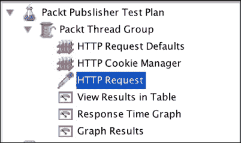

现在，我们可以通过点击上方工具栏中的**开始**按钮来运行我们的测试计划，如下面的屏幕截图所示：


一旦我们点击**开始**按钮（指向右侧的绿色箭头），JMeter 将启动我们的测试计划。现在，如果我们在左侧面板上点击**在表中查看结果**监听器，我们将看到每个请求的数据在表中显示，如下面的屏幕截图所示：

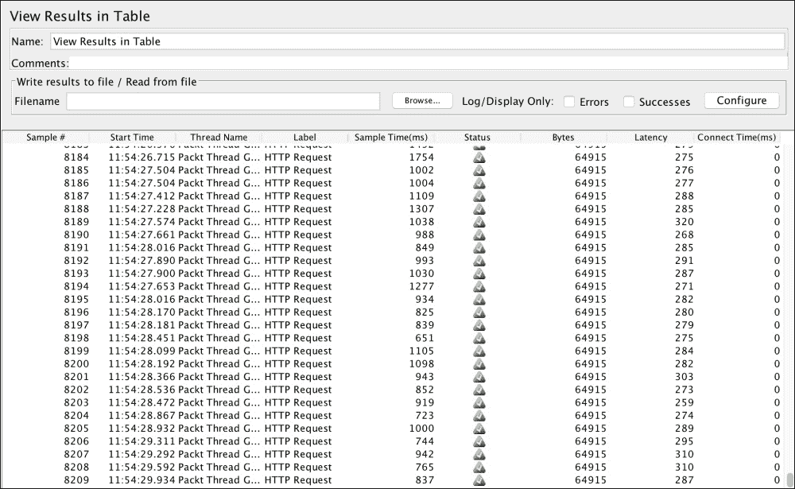

上述屏幕截图显示了一些有趣的数据，如样本时间、状态、字节和延迟。

**样本时间**是服务器提供完整请求所用的毫秒数。**状态**是请求的状态。它可以是成功、警告或错误。**字节**是请求接收的字节数。**延迟**是 JMeter 从服务器接收到初始响应所用的毫秒数。

现在，如果我们点击**响应时间图**，我们将看到响应时间的可视图表，类似于以下内容：

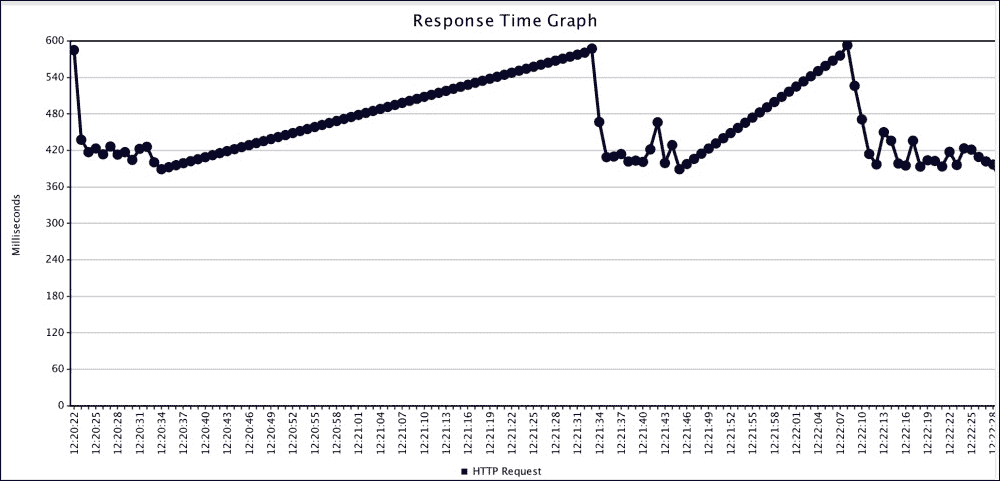

现在，如果我们点击**图表结果**，我们将看到响应时间数据以及平均值、中位数、偏差和吞吐量图表，如下图所示：

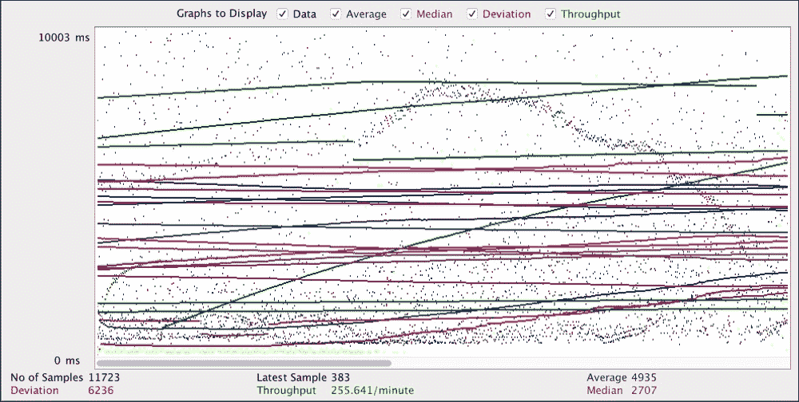

Apache JMeter 提供了非常强大的工具，可以通过模拟用户来对我们的 Web 服务器进行负载测试。它可以为我们提供关于使我们的 Web 服务器响应变慢的负载量的数据，并且使用这些数据，我们可以优化我们的 Web 服务器和应用程序。

# ApacheBench (ab)

ApacheBench (ab)也由 Apache 提供，是一个命令行工具。这是一个非常适合命令行爱好者的工具。这个工具通常默认安装在大多数 Linux 发行版上。此外，它也随 Apache 一起安装，所以如果你安装了 Apache，你可能也会安装 ab。

ab 命令的基本语法如下：

```php
**ab –n <Number_Requests> -c <Concurrency> <Address>:<Port><Path>**

```

让我们讨论上述命令的每个部分的含义：

+   `n`：这是测试的请求数。

+   `c`：这是并发数，即同时发出的请求数。

+   `地址`：这是 Web 服务器的应用程序 URL 或 IP 地址。

+   `端口`：这是应用程序运行的端口号。

+   `路径`：这是我们可以用来测试的应用程序的 Web 路径。斜杠（`/`）用于主页。

现在，让我们通过发出以下命令使用 ab 工具进行测试：

```php
**ab –n 500 –c 10 packtpub.com/**

```

由于 Web 服务器的默认端口是 80，因此不需要提及它。请注意末尾的斜杠；这是必需的，因为它是路径的一部分。

执行上述命令后，我们将获得类似以下内容的输出：

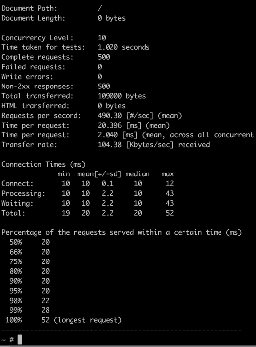

我们可以在这里看到一些有用的信息，包括每秒请求的数量，为**490.3**；测试所用的总时间，为**1.020 秒**；最短请求为**20 毫秒**；最长请求为**52 毫秒**。

可以通过增加请求数量和并发级别并检查 Web 服务器的性能来找到服务器负载限制。

# Siege

Siege 是另一个命令行开源工具，用于测试负载和性能。Siege 是一个 HTTP/FTP 负载测试工具和基准测试实用程序。它旨在供开发人员和管理员在负载下测量其应用程序的性能。它可以向服务器发送可配置数量的并发请求，并且这些请求会使服务器处于围攻状态。

它的安装简单而容易。对于 Linux 和 Mac OS X，首先通过在终端中发出以下命令来下载 Siege：

```php
**wget http://download.joedog.org/siege/siege-3.1.4.tar.gz**

```

它将下载 Siege TAR 压缩文件。现在，通过发出以下命令来解压缩它：

```php
**tar –xvf siege-3.1.4.tar.gz**

```

现在，所有文件都将位于`siege-3.1.4`文件夹中。通过在终端中依次发出以下命令来构建和安装它：

```php
**cd siege-3.1.4**
**./configure**
**make**
**make install**

```

现在，Siege 已安装。要确认这一点，请发出以下命令以检查 Siege 版本：

```php
**siege –V**

```

如果显示带有其他信息的版本，则 Siege 已成功安装。

### 注意

在撰写本书时，当前的 Siege 稳定版本是 3.1.4。此外，Siege 不原生支持 Windows，当然，可以使用 Siege 测试和基准测试 Windows 服务器。

现在，让我们进行一次负载测试。可以通过运行以下命令来执行基本的负载测试：

```php
**siege some_url_or_ip**

```

然后 Siege 将开始测试。我们必须输入要进行负载测试的应用程序 URL 或服务器 IP。要停止测试，请按*Ctrl* + *C*，然后我们将获得类似以下内容的输出：

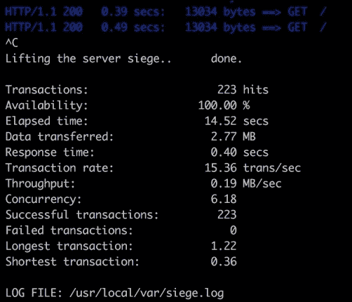

在上述屏幕截图中，我们可以看到**事务**、**响应时间**和**事务速率**，以及**最长事务**和**最短事务**。

默认情况下，Siege 创建 15 个并发用户。可以通过使用`-c`选项进行更改，方法是在命令中进行以下更改：

```php
**siege url_or_ip –c 100**

```

但是，Siege 对并发用户有限制，对于每个操作系统可能不同。这可以在 Siege 配置文件中设置。要找出`config`文件位置和并发用户限制，请在终端中发出以下命令：

```php
**siege -C**

```

将显示配置选项列表。还将显示资源文件或`config`文件位置。打开该文件，找到配置并将其值设置为适当的值。

Siege 的另一个重要功能是可以使用包含所有需要测试的 URL 的文件。该文件每行应包含一个 URL。使用`-f`标志与 Siege 一起使用如下：

```php
**siege -f /path/to/url/file.txt –c 120**

```

Siege 将加载文件并开始对每个 URL 进行负载测试。

Siege 的另一个有趣的功能是互联网模式，可以使用以下命令中的`-i`标志进入：

```php
**siege –if path_to_urls_file –c 120**

```

在互联网模式下，每个 URL 都会随机访问，并模拟真实生活中无法预测哪个 URL 会被访问的情况。

### 注意

Siege 有很多有用的标志和功能。详细列表可以在官方文档中找到[`www.joedog.org/siege-manual/`](https://www.joedog.org/siege-manual/)。

# 负载测试真实应用

在本章中，我们研究了三种工具进行负载测试。现在，是时候对一些真实世界的应用进行负载测试了。在本节中，我们将测试 Magento 2、Drupal 8 和 WordPress 4。所有这些开源工具都将使用它们的默认数据。

我们有三个配置了 NGINX 作为 Web 服务器的 VPS。一个 VPS 安装了 PHP 5.5-FPM，第二个安装了 PHP 5.6-FPM，第三个安装了 PHP 7-FPM。所有三个 VPS 的硬件规格相同，我们将测试的所有应用程序都将具有相同的数据和相同的版本。

这样，我们将使用 PHP 5.5、PHP 5.6 和 PHP 7 对这些应用程序进行基准测试，并查看它们在不同版本的 PHP 上运行的速度。

### 注意

在本主题中，我们不会涉及配置带有 NGINX、PHP 和数据库的服务器。我们将假设 VPS 已配置，并且在其上安装了 Magento 2、Drupal 8 和 WordPress 4。

## Magento 2

Magento 2 安装在所有 VPS 上，并且为 Magento 启用了所有缓存。还启用了 PHP OPcache。在运行测试后，我们得到了所有三个 Magento 2 安装的平均结果，如下图所示：

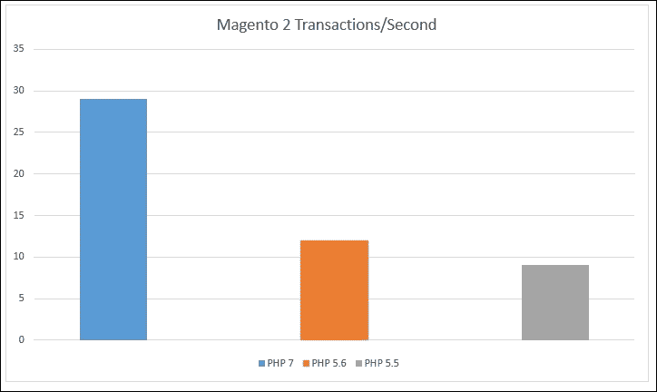

在上图中，垂直线或 Y 轴显示每秒事务数。如图所示，Magento 2 在 PHP 7 上每秒有 29 个事务，而在相同硬件上使用 PHP 5.6 的同一 Magento 2 安装每秒有 12 个事务。此外，在 PHP 5.5 上，相同的 Magento 安装每秒有 9 个事务。因此，在这种情况下，Magento 在 PHP 7 上的运行速度比在 PHP 5.6 上快约 241%，比在 PHP 5.5 上快约 320%。这是 PHP 7 在 PHP 5.6 和 PHP 5.5 上的非常巨大的改进。

## WordPress 4

WordPress 安装在所有三个 VPS 上。不幸的是，WordPress 中没有默认缓存，我们也不会安装任何第三方模块，因此不使用缓存。结果仍然很好，如下图所示。启用了 PHP OPcache。

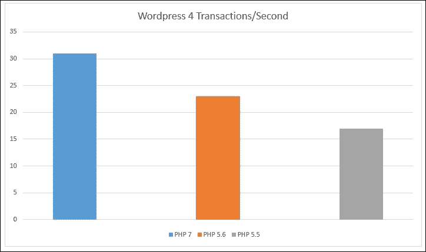

如前图所示，WordPress 在 PHP 7 上运行速度比在 PHP 5.6 上快 135%，比在 PHP 5.5 上快 182%。

## Drupal 8

我们在同一台 VPS 上使用了 PHP 5.5、PHP 5.6 和 PHP 7。默认启用了 Drupal 8 缓存。在对 Drupal 8 的默认主页进行负载测试后，我们得到了以下结果：

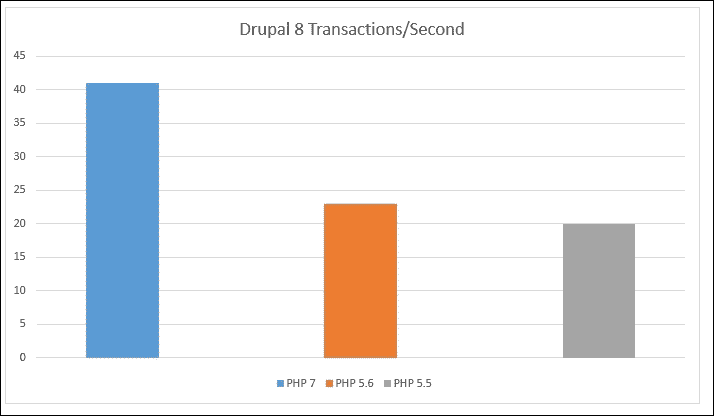

上图显示，Drupal 8 在 PHP 7 上的运行速度比在 PHP 5.6 上快 178%，比在 PHP 5.5 上快 205%。

### 注意

在上述图表中，所有这些值都是近似值。如果使用低性能硬件，则会生成较小的值。如果我们使用具有 Web 服务器和数据库优化的更强大的多处理器专用服务器，我们将获得更高的值。需要考虑的一点是，我们在 PHP 7 上始终会获得比 PHP 5.6 更好的性能。

这里显示了一个合并的图表，显示了不同应用程序在 PHP 7 上相对于 PHP 5.5 和 PHP 5.6 的性能改进：

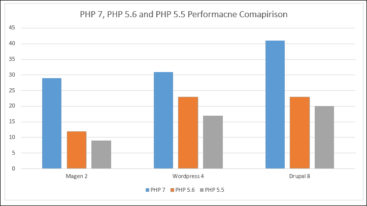

# 总结

在本章中，我们讨论了一些负载测试和基准测试工具，如 JMeter、ApacheBench（ab）和 Siege。我们使用每个工具进行负载测试，并讨论了输出及其含义。最后，我们对三个著名的开源应用程序进行了负载测试，分别是 Magento 2、WordPress 4 和 Drupal 8，并为每个应用程序在 PHP 7 和 PHP 5.6 中的每秒事务创建了图表。

在下一章中，我们将讨论 PHP 开发的最佳实践。这些实践不仅限于 PHP，还可以用于任何编程语言。
