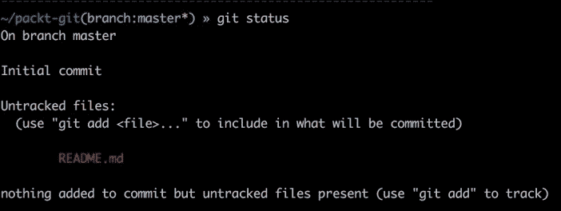
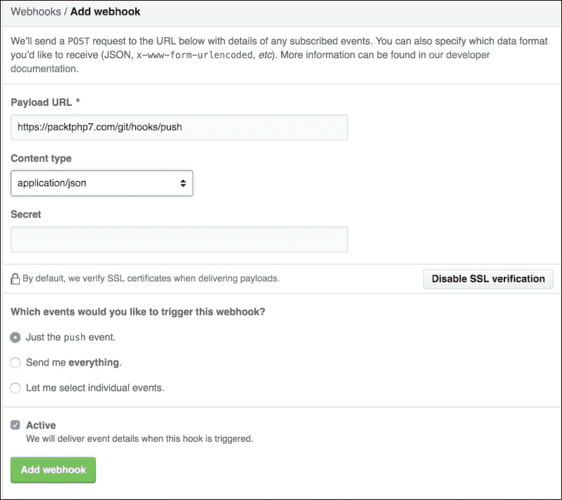
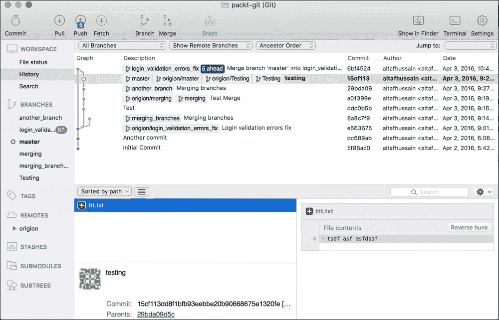
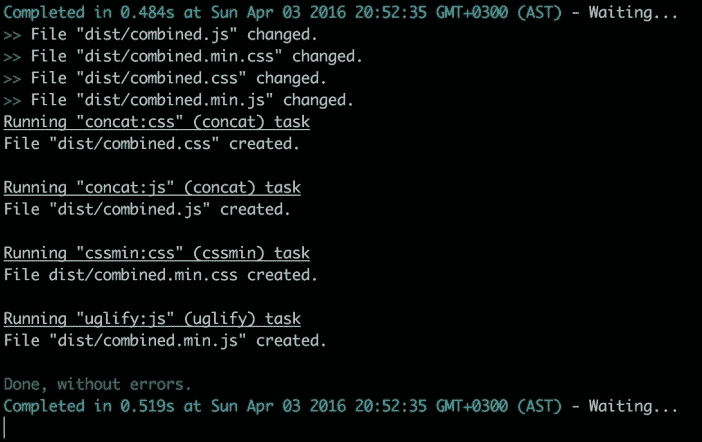

# 附录 A. 使生活更轻松的工具

我们在本书中涵盖了许多内容，从 PHP 7 中的新功能开始，到编程中的最佳技术结束。在每一章中，我们都使用并讨论了一些工具，但由于章节和书籍的有限长度，我们没有对这些工具进行太多详细介绍。在这个附录中，我们将更详细地讨论其中三个工具。我们将讨论的工具如下：

+   Composer

+   Git

+   Grunt watch

所以，让我们开始吧。

# Composer – PHP 的依赖管理器

Composer 是 PHP 的依赖管理工具，它使我们能够为 PHP 应用程序定义依赖关系，并安装/更新它们。Composer 完全由 PHP 编写，并且是 PHP 存档（PHAR）格式的应用程序。

### 注意

Composer 从[`packagist.org/`](https://packagist.org/)下载依赖项。只要在 Packagist 上可用，就可以通过 Composer 安装应用程序的任何依赖项。此外，如果在 Packagist 上可用，还可以通过 Composer 安装完整的应用程序。

## Composer 安装

Composer 是一个命令行工具，可以在操作系统中全局安装，或者可以将`composer.phar`文件放在应用程序的根目录中，然后从命令行执行。对于 Windows，提供了一个可执行的安装程序文件，可以用于全局安装 Composer。对于本书，我们将遵循 Debian/Ubuntu 全局安装的说明。执行以下步骤：

1.  发出以下命令以下载 Composer 安装程序。文件名为`installer`，安装后只能通过以下代码使用 PHP 执行：

```php
    **Wget https://getcomposer.org/installer**

    ```

1.  发出以下命令在 Debian 或 Ubuntu 上全局安装它：

```php
    **Php install --install-dir=/usr/local/bin --filename=composer**

    ```

此命令将下载 Composer 并将其安装在`/usr/local/bin`目录中，文件名为`composer`。现在，我们将能够全局运行 Composer。

1.  通过在终端中发出以下命令来验证 Composer 安装：

```php
    **Composer --version**

    ```

如果显示 Composer 版本，则 Composer 已成功全局安装。

### 注意

如果 Composer 是安装在应用程序本地的，那么我们将有一个`composer.phar`文件。命令是相同的，但所有命令都应该使用 PHP 执行。例如，`php composer.phar --version`将显示 Composer 版本。

现在，Composer 已成功安装并且正在工作；是时候使用它了。

## 使用 Composer

要在我们的项目中使用 Composer，我们将需要一个`composer.json`文件。该文件包含项目所需的所有依赖项和一些其他元数据。Composer 使用此文件来安装和更新不同的库。

假设我们的应用程序需要以不同的方式记录不同的信息。为此，我们可以使用`monolog`库。首先，在应用程序的根目录中创建一个`composer.json`文件，并添加以下代码：

```php
{
  "require": {
    "monolog/monolog": "1.0.*"
  }
}
```

保存文件后，执行以下命令安装应用程序的依赖项：

```php
Composer install
```

此命令将下载依赖项并将它们放在`vendor`目录中，如下面的屏幕截图所示：


如前面的屏幕截图所示，下载了 monolog 版本 1.0.2，并创建了一个`vendor`目录。`monolog`库放在这个目录中。此外，如果一个包需要自动加载信息，Composer 会将库放在 Composer 自动加载器中，该自动加载器也放在`vendor`目录中。因此，在应用程序执行期间，任何新的库或依赖项都将自动加载。

还可以看到一个新文件，名为`composer.lock`。当 Composer 下载和安装任何依赖项时，确切的版本和其他信息将写入此文件，以锁定应用程序到这些依赖项的特定版本。这确保所有团队成员或任何想要设置应用程序的人将使用相同的依赖项版本，从而减少使用不同版本的依赖项的可能性。

如今，Composer 被广泛用于包管理。大型开源项目，如 Magento、Zend Framework、Laravel、Yii 等，都可以通过 Composer 轻松安装。我们将在下一个附录中使用 Composer 安装其中一些。

# Git-版本控制系统

Git 是最广泛使用的版本控制系统。根据 Git 官方网站，它是一个分布式版本控制系统，能够处理从小型到大型项目的一切事务，并具有速度和效率。

## Git 安装

Git 适用于所有主要操作系统。对于 Windows，提供了一个可执行的安装程序文件，可以用于安装 Git 并在命令行中使用它。在 OS X 上，Git 已经安装好了，但如果找不到，可以从官方网站下载。要在 Debian/Ubuntu 上安装 Git，只需在终端中发出以下命令：

```php
**sudo apt-get install git**

```

安装完成后，发出以下命令检查是否已正确安装：

```php
**git –version**

```

然后，我们将查看 Git 的当前安装版本。

## 使用 Git

为了更好地理解 Git，我们将从一个测试项目开始。我们的测试项目名称是`packt-git`。对于这个项目，我们还创建了一个名为`packt-git`的 GitHub 存储库，我们将在其中推送我们的项目文件。

首先，我们将通过发出以下命令在我们的项目中初始化 Git：

```php
**git init**

```

上述命令将在我们的项目根目录中初始化一个空的 Git 存储库，并将头保留在主分支上，这是每个 Git 存储库的默认分支。它将创建一个名为`.git`的隐藏目录，其中包含有关存储库的所有信息。接下来，我们将添加一个远程存储库，我们将在 GitHub 上创建。我在 GitHub 上创建了一个测试存储库，其 URL 为[`github.com/altafhussain10/packt-git.git`](https://github.com/altafhussain10/packt-git.git)。

现在，发出以下命令将 GitHub 存储库添加到我们的空存储库中：

```php
**git remote add origion https://github.com/altafhussain10/packt-git.git**

```

现在，在项目根目录创建一个`README.md`文件，并向其中添加一些内容。`README.md`文件用于显示存储库信息和有关 Git 存储库的其他详细信息。该文件还用于显示有关如何使用创建此存储库的项目的存储库和/或项目的说明。

现在，发出以下命令来查看我们的 Git 存储库的状态：

```php
**git status**

```

这个命令将显示存储库的状态，如下面的屏幕截图所示：



如前面的屏幕截图所示，我们的存储库中有一个未跟踪的文件尚未提交。首先，我们将通过在终端中发出以下命令来添加要跟踪的文件：

```php
**git add README.md** 

```

`git add`命令使用当前工作树中找到的当前内容更新索引。此命令将添加对路径所做的所有更改。有一些选项可用于添加一些特定更改。我们之前使用的命令将只将`README.md`文件添加到存储库中进行跟踪。因此，如果我们想要跟踪所有文件，那么我们将使用以下命令：

```php
**git add**

```

这将开始跟踪当前工作目录中的所有文件或当前分支的根目录。现在，如果我们想要跟踪一些特定的文件，比如所有带有`.php`扩展名的文件，那么我们可以使用如下方式：

```php
**git add '*.php**

```

这将添加所有带有`.php`扩展名的文件进行跟踪。

接下来，我们将使用以下命令提交对我们的存储库的更改或添加：

```php
**git commit –m "Initial Commit"**

```

`git commit`命令将所有更改提交到本地存储库。`-m`标志指定要`commit`的任何日志消息。请记住，更改只提交到本地存储库。

现在，我们将使用以下命令将更改推送到我们的远程存储库：

```php
**git push –u origion master**

```

上述命令将把本地存储库中的所有更改推送到远程存储库或原始存储库。`-u`标志用于设置上游，它将我们的本地存储库链接到我们的远程中央存储库。因为我们第一次推送了更改，所以我们必须使用`-u`选项。之后，我们只需使用以下命令：

```php
**git push**

```

这将把所有更改推送到我们当前所在的主分支的主存储库。

## 创建新分支和合并

在开发过程中总是需要新分支。如果需要任何更改，最好为这些更改创建一个新分支。然后，在此分支上进行所有更改，最后提交、合并并推送到远程存储库。

为了更好地理解这一点，让我们假设我们想要修复登录页面上的问题。问题是关于验证错误的。我们将为我们的新分支命名为`login_validation_errors_fix`。给分支起一个更易理解的名字是一个好习惯。此外，我们希望从主分支头部创建这个新分支。这意味着我们希望新分支继承主分支的所有数据。因此，如果我们不在主分支上，我们必须使用以下命令切换到主分支：

```php
**git checkout master**

```

上述命令将无论我们在哪个分支，都会将我们切换到主分支。要创建分支，在终端中发出以下命令：

```php
**git branch login_validation_errors_fix**

```

现在，我们的新分支是从主分支头部创建的，因此所有更改都应该在这个新分支上进行。完成所有更改和修复后，我们必须将更改提交到本地和远程存储库。请注意，我们没有在远程存储库中创建新分支。现在，让我们使用以下命令提交更改：

```php
**git commit -a -m "Login validation errors fix"**

```

请注意，我们没有使用`git add`来添加更改或新添加。为了自动提交我们的更改，我们在`commit`中使用了`-a`选项，这将自动添加所有文件。如果使用了`git add`，则在`commit`中就不需要使用`-a`选项。现在，我们的更改已经提交到本地存储库。我们需要将更改推送到远程存储库。在终端中发出以下命令：

```php
**git push -u origion login_validation_errors_fix**

```

上述命令将在远程存储库创建一个新分支，将相同的本地分支跟踪到远程分支，并将所有更改推送到远程存储库。

现在，我们想要将更改与我们的主分支合并。首先，我们需要使用以下命令切换到我们的主分支：

```php
**git checkout master**

```

接下来，我们将发出以下命令，将我们的新分支`login_validation_errors_fix`与主分支合并：

```php
**git checkout master**
**git merge login_validation_errors_fix** 
**git push**

```

重要的是要切换到我们想要合并新分支的分支。之后，我们需要使用`git merge branch_to_merge`语法将此分支与当前分支合并。最后，我们只需推送到远程存储库。现在，如果我们查看远程存储库，我们将看到新分支以及主分支中的更改。

## 克隆存储库

有时，我们需要在托管在存储库上的项目上工作。为此，我们将首先克隆此存储库，这将把完整的存储库下载到我们的本地系统，并为此远程存储库创建一个本地存储库。其余的工作与我们之前讨论的一样。要克隆存储库，我们应该首先知道远程存储库的网址。假设我们想要克隆`PHPUnit`存储库。如果我们转到 PHPUnit 的 GitHub 存储库，我们将在右上角看到存储库的网址，如下面的截图所示：


**HTTPS**按钮后面的 URL 是此存储库的网址。复制此 URL 并使用以下命令克隆此存储库：

```php
**git clone https://github.com/sebastianbergmann/phpunit.git**

```

这将开始下载存储库。完成后，我们将有一个`PHPUnit`文件夹，其中包含存储库及其所有文件。现在，可以执行前面主题中提到的所有操作。

## Webhooks

Git 最强大的功能之一是 webhooks。Webhooks 是在存储库上发生特定操作时触发的事件。如果对`Push`请求进行了事件或挂钩，那么每次向此存储库进行推送时都会触发此挂钩。

要向存储库添加 webhook，请单击右上角的**设置**链接。在新页面中，左侧将有一个**Webhooks and Services**链接。单击它，我们将看到类似以下页面的页面：



如前面的屏幕截图所示，我们必须输入有效负载 URL，每次选择的事件触发时都会调用它。在**内容类型**中，我们将选择将有效负载发送到我们的 URL 的数据格式。在事件部分，我们可以选择是否只想要推送事件或所有事件；我们可以选择多个事件，希望此挂钩被触发。保存此挂钩后，每次发生所选事件时都会触发它。

Webhooks 主要用于部署。当更改被推送并且推送事件有一个 webhook 时，将调用特定的 URL。然后，此 URL 执行一些命令来下载更改并在本地服务器上处理它们，并将它们放置在适当的位置。此外，webhooks 用于持续集成和部署到云服务。

## 管理存储库的桌面工具

有几种工具可用于管理 Git 存储库。GitHub 提供了自己的名为 GitHub Desktop 的工具，可用于管理 GitHub 存储库。它可用于创建新存储库，查看历史记录，并推送、拉取和克隆存储库。它提供了我们可以在命令行中使用的每个功能。接下来的屏幕截图显示了我们的测试`packt-git`存储库：


### 注意

GitHub Desktop 可以从[`desktop.github.com/`](https://desktop.github.com/)下载，仅适用于 Mac 和 Windows。此外，GitHub Desktop 只能与 GitHub 一起使用，除非使用一些技巧使其与其他存储库（如 GitLab 或 Bitbucket）一起工作。

另一个强大的工具是 SourceTree。SourceTree 可以轻松与 GitHub、GitLab 和 Bitbucket 一起使用。它提供了完整的功能来管理存储库，包括拉取、推送、提交、合并和其他操作。SourceTree 为分支和提交提供了一个非常强大和美观的图形工具。以下是用于连接到我们的`packt-git`测试存储库的 SourceTree 的屏幕截图：



除了前面介绍的两个好工具外，每个开发 IDE 都提供完整支持的版本控制系统，并提供诸如不同颜色表示修改和新添加文件等功能。

### 注意

Git 是一个强大的工具；这个附录无法涵盖它。有几本书可供选择，但 Git Book 是一个很好的起点。可以从[`git-scm.com/book/en/v2`](https://git-scm.com/book/en/v2)以不同格式下载，也可以在线阅读。

# Grunt watch

我们在第三章中学习了 Grunt，*改进 PHP 7 应用程序性能*。我们只用它来合并 CSS 和 JavaScript 文件并对其进行缩小。然而，Grunt 不仅用于此目的。它是一个 JavaScript 任务运行器，可以通过监视特定文件的更改或手动运行任务来运行任务。我们学习了如何手动运行任务，现在我们将学习如何使用 grunt watch 在进行一些更改时运行特定任务。

Grunt watch 非常有用，可以节省大量时间，因为它会自动运行特定任务，而不是每次更改时手动运行任务。

让我们回顾一下第三章中的例子，*改进 PHP 7 应用程序性能*。我们使用 Grunt 来合并和压缩 CSS 和 JavaScript 文件。为此，我们创建了四个任务。一个任务是合并所有 CSS 文件，第二个任务是合并所有 JavaScript 文件，第三个任务是压缩 CSS 文件，第四个任务是压缩所有 JavaScript 文件。如果我们每次进行一些更改都要手动运行所有这些任务，那将会非常耗时。Grunt 提供了一个名为 watch 的功能，它会监视不同的目标文件夹以检测文件更改，如果发生任何更改，它会执行在 watch 中定义的任务。

首先，检查`grunt watch`模块是否已安装。检查`node_modules`目录，看看是否有另一个名为`grunt-contrib-watch`的目录。如果有这个目录，那么 watch 已经安装。如果没有这个目录，那么只需在项目根目录中包含`GruntFile.js`的终端中发出以下命令：

```php
**npm install grunt-contrib-watch**

```

上面的命令将安装 Grunt watch，`grunt-contrib-watch`目录将与`watch`模块一起可用。

现在，我们将修改`GruntFile.js`文件以添加`watch`模块，它将监视我们定义的目录中的所有文件，如果发生任何更改，它将自动运行这些任务。这将节省大量时间，不再需要手动执行这些任务。看一下以下代码；高亮显示的代码是修改后的部分：

```php
module.exports = function(grunt) {
  /*Load the package.json file*/
  pkg: grunt.file.readJSON('package.json'),
  /*Define Tasks*/
  grunt.initConfig({
    concat: {
      css: {
      src: [
        'css/*' //Load all files in CSS folder
],
      dest: 'dest/combined.css' //Destination of the final combined file.

      },//End of CSS
js: {
      src: [
        'js/*' //Load all files in js folder
],
       dest: 'dest/combined.js' //Destination of the final combined file.

      }, //End of js

}, //End of concat
cssmin:  {
  css: {
    src : 'dest/combined.css',
    dest : 'dest/combined.min.css' 
}
}, //End of cssmin
uglify: {
  js: {
        files: {
        'dest/combined.min.js' : ['dest/combined.js']//destination Path : [src path]
}
}
}, //End of uglify

//The watch starts here
**watch: {**
 **mywatch: {**
 **files: ['css/*', 'js/*', 'dist/*'],**
 **tasks: ['concat', 'cssmin', 'uglify']**
 **},**
**},**
}); //End of initConfig

**grunt.loadNpmTasks('grunt-contrib-watch'); //Include watch module**
grunt.loadNpmTasks('grunt-contrib-concat');
grunt.loadNpmTasks('grunt-contrib-uglify');
grunt.loadNpmTasks('grunt-contrib-cssmin');
grunt.registerTask('default', ['concat:css', 'concat:js', 'cssmin:css', 'uglify:js']);
}; //End of module.exports
```

在上面的高亮代码中，我们添加了一个`watch`块。`mywatch`标题可以是任何名称。`files`块是必需的，它接受一个源路径的数组。Grunt watch 会监视这些目的地的更改，并执行在 tasks 块中定义的任务。此外，tasks 块中提到的任务已经在`GruntFile.js`中创建。此外，我们必须使用`grunt.loadNpmTasks`加载`watch`模块。

现在，在项目根目录打开终端，其中包含`GruntFile.js`，并运行以下命令：

```php
**grunt watch**

```

Grunt 将开始监视源文件的更改。现在，在`GruntFile.js`中的`files`块中修改任何文件，并保存该文件。一旦保存文件，任务将被执行，并且任务的输出将显示在终端中。以下截图中可以看到示例输出：



在`watch`块中可以监视尽可能多的任务，但是这些任务应该存在于`GruntFile.js`中。

# 总结

在本附录中，我们讨论了 Composer 以及如何使用它来安装和更新软件包。此外，我们详细讨论了 Git，包括推送、拉取、提交、创建分支和合并不同的分支。此外，我们还讨论了 Git 钩子。最后，我们讨论了 Grunt watch，并创建了一个监视器，每当`GruntFile.js`中定义的文件路径发生更改时，就会执行四个任务。
