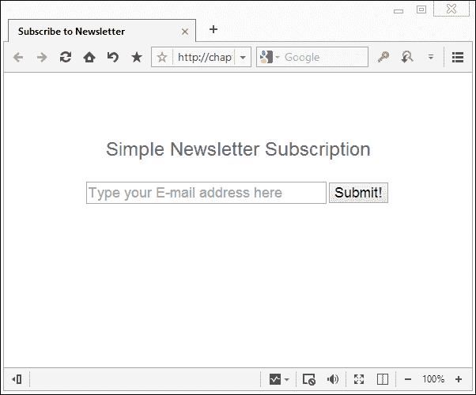

# 第七章：创建一个通讯系统

在本章中，我们将介绍一个高级的通讯系统，它将使用 Laravel 的`queue`和`email`库。在本节之后，我们将学习如何设置和触发排队任务，以及如何解析电子邮件模板并向订阅者发送大量电子邮件。本章涵盖的主题有：

+   创建一个数据库并迁移订阅者的表

+   创建一个订阅者模型

+   创建我们的订阅表单

+   验证和处理表单

+   创建一个处理电子邮件的队列系统

+   使用 Email 类来处理队列中的电子邮件

+   测试系统

+   直接使用队列发送电子邮件

在本章中，我们将使用第三方服务，这将需要访问你的脚本，所以在继续之前，请确保你的项目可以在线访问。

# 创建一个数据库并迁移订阅者表

成功安装 Laravel 4 并从`app/config/database.php`中定义数据库凭据后，创建一个名为`chapter7`的数据库。

创建数据库后，打开你的终端，导航到你的项目文件夹，并运行以下命令：

```php
**php artisan migrate:make create_subscribers_table --table=subscribers –-create**

```

上述命令将为我们生成一个名为`subscribers`的新 MySQL 迁移。现在转到`app/database/`中的`migrations`文件夹，并打开刚刚由上述命令创建的迁移文件，并按照下面的代码更改其内容：

```php
<?php
use Illuminate\Database\Schema\Blueprint;
use Illuminate\Database\Migrations\Migration;

class CreateSubscribersTable extends Migration {

  /**
   * Run the migrations.
   *
   * @return void
   */
  public function up()
  {
    Schema::create('subscribers', function(Blueprint $table)
    {
      $table->increments('id');
      $table->string('email,100)->default('');
      $table->timestamps();
    });
  }

  /**
  * Reverse the migrations.
  *
  * @return void
  */
  public function down()
  {
    Schema::drop('subscribers');
  }
}
```

对于本章，我们只需要`email`列，它将保存订阅者的电子邮件地址。我将这一列设置为最多 100 个字符长，数据类型为`VARCHAR`，并且不允许为空。

保存文件后，运行以下命令执行迁移：

```php
**php artisan migrate**

```

如果没有发生错误，你已经准备好进行项目的下一步了。

# 创建一个订阅者模型

为了从 Eloquent ORM 中受益，最佳实践是创建一个模型。

将以下代码保存在`app/models/`下的`subscribers.php`文件中：

```php
<?php
Class Subscribers Extends Eloquent{
  protected $table = 'subscribers';
  protected $fillable = array('email');
}
```

我们使用变量`$table`设置表名，并使用变量`$fillable`设置用户必须填写值的列。现在我们的模型已经准备好了，我们可以继续下一步，开始创建我们的控制器和表单。

# 创建我们的订阅表单

现在我们应该创建一个表单来保存记录到数据库并指定它的属性。

1.  首先，打开你的终端，输入以下命令：

```php
php artisan controller:make SubscribersController
```

这个命令将为你在`app/controllers`目录中生成一个`SubscribersController.php`文件，并在其中添加一些空方法。

### 注意

`artisan`命令生成的默认控制器方法不是 RESTful 的。

1.  现在，打开`app/routes.php`并添加以下代码：

```php
//We define a RESTful controller and all its via route//directly
Route::controller('subscribers', 'SubscribersController');
```

我们可以使用`controller()`方法一次性定义控制器上声明的所有操作，而不是逐个定义所有操作。如果你的方法名可以直接用作`get`或`post`操作，使用`controller()`方法可以节省大量时间。第一个参数设置控制器的**URI**（统一资源标识符），第二个参数定义了控制器文件夹中将要访问和定义的类。

### 注意

像这样设置的控制器自动是 RESTful 的。

1.  现在，让我们创建表单的控制器。删除自动生成的类中的所有方法，并在你的控制器文件中添加以下代码：

```php
//The method to show the form to add a new feed
public function getIndex() {
  //We load a view directly and return it to be served
  return View::make('subscribe_form');
}
```

首先，我们定义了这个过程。这里很简单；我们将方法命名为`getCreate()`，因为我们希望我们的`Create`方法是 RESTful 的。我们简单地加载了一个视图文件，我们将在下一步直接生成。

1.  现在让我们创建我们的视图文件。在这个例子中，我使用了 jQuery 的 Ajax POST 技术。将这个文件保存为`subscribe_form.blade.php`，放在`app/views/`下：

```php
<!doctype html>
<!doctype html>
<html lang="en">
  <head>
    <meta charset="UTF-8">
    <title>Subscribe to Newsletter</title>
    <style>
      /*Some Little Minor CSS to tidy up the form*/
      body{margin:0;font-family:Arial,Tahoma,sans-serif;text-align:center;padding-top:60px;color:#666;font-size:24px}
      input{font-size:18px}
      input[type=text]{width:300px}
      div.content{padding-top:24px;font-weight:700;font-size:24px}
      .success{color:#0b0}
      .error{color:#b00}
    </style>
  </head>
  <body>

    {{-- Form Starts Here --}}
    {{Form::open(array('url'=> URL::to('subscribers/submit'),'method' => 'post'))}}
    <p>Simple Newsletter Subscription</p>
    {{Form::text('email',null,array('placeholder'=>'Type your E-mail address here'))}}
    {{Form::submit('Submit!')}}

    {{Form::close()}}
    {{-- Form Ends Here --}}

    {{-- This div will show the ajax response --}}
    <div class="content"></div>
    {{-- Because it'll be sent over AJAX, We add thejQuery source --}}
    {{ HTML::script('http://code.jquery.com/jquery-1.8.3.min.js') }}
    <script type="text/javascript">
      //Even though it's on footer, I just like to make//sure that DOM is ready
      $(function(){
        //We hide de the result div on start
        $('div.content').hide();
        //This part is more jQuery Related. In short, we //make an Ajax post request and get the response//back from server
        $('input[type="submit"]').click(function(e){
          e.preventDefault();
          $.post('/subscribers/submit', {
            email: $('input[name="email"]').val()
          }, function($data){
            if($data=='1') {
              $('div.content').hide().removeClass('success error').addClass('success').html('You\'ve successfully subscribed to ournewsletter').fadeIn('fast');
            } else {
              //This part echos our form validation errors
              $('div.content').hide().removeClass('success error').addClass('error').html('There has been an error occurred:<br /><br />'+$data).fadeIn('fast');
            }
          });
        });
        //We prevented to submit by pressing enter or anyother way
        $('form').submit(function(e){
          e.preventDefault();
          $('input[type="submit"]').click();
        });
      });
    </script>
  </body>
</html>
```

上述代码将生成一个简单的表单，如下截图所示：



现在我们的表单已经准备好了，我们可以继续并处理表单。

# 验证和处理表单

现在我们有了表单，我们需要验证和存储数据。我们还需要检查请求是否是 Ajax 请求。此外，我们需要使用 Ajax 方法将成功的代码或错误消息返回到表单，以便最终用户可以理解后端发生了什么。

将数据保存在`SubscribersController.php`中的`app/controllers/`：

```php
//This method is to process the form
public function postSubmit() {

  //we check if it's really an AJAX request
  if(Request::ajax()) {

    $validation = Validator::make(Input::all(), array(
      //email field should be required, should be in an email//format, and should be unique
      'email' => 'required|email|unique:subscribers,email'
    )
    );

    if($validation->fails()) {
      return $validation->errors()->first();
    } else {

      $create = Subscribers::create(array(
        'email' => Input::get('email')
      ));

      //If successful, we will be returning the '1' so the form//understands it's successful
      //or if we encountered an unsuccessful creation attempt,return its info
      return $create?'1':'We could not save your address to oursystem, please try again later';
    }

  } else {
    return Redirect::to('subscribers');
  }
}
```

以下几点解释了前面的代码：

1.  使用`Request`类的`ajax()`方法，你可以检查请求是否是 Ajax 请求。如果不是 Ajax 请求，我们将被重定向回我们的订阅者页面（表单本身）。

1.  如果是有效的请求，那么我们将使用`Validation`类的`make()`方法运行我们的表单。在这个例子中，我直接编写了规则，但最佳实践是在模型中设置它们，并直接调用它们到控制器。规则`required`检查字段是否已填写。规则`email`检查输入是否是有效的电子邮件格式，最后，规则`unique`帮助我们知道值是否已经在行中或不在。

1.  如果表单验证失败，我们直接返回第一个错误消息。返回的内容将是 Ajax 的响应，将被回显到我们的表单页面中。由于错误消息是自动生成的有意义的文本消息，所以可以直接在我们的示例中使用。这条消息将显示所有验证错误。例如，它将回显字段是否不是有效的电子邮件地址，或者电子邮件是否已经提交到数据库中。

1.  如果表单验证通过，我们尝试使用 Laravel 的 Eloquent ORM 的`create()`方法将电子邮件添加到我们的数据库中。

# 为基本的电子邮件发送创建一个队列系统

Laravel 4 中的队列是该框架提供的最好的功能之一。想象一下你有一个长时间的过程，比如调整所有图片的大小，发送大量电子邮件，或者大量数据库操作。当你处理这些时，它们会花费时间。那么为什么我们要等待呢？相反，我们将把这些过程放入队列中。使用 Laravel v4，这是相当容易管理的。在本节中，我们将创建一个简单的队列，并循环遍历电子邮件，尝试向每个订阅者发送电子邮件，使用以下步骤：

1.  首先，我们需要一个队列驱动程序。这可以是**Amazon SQS**、**Beanstalkd**或**Iron IO**。我选择了 Iron IO，因为它目前是唯一支持 push 队列的队列驱动程序。然后我们需要从 packagist 获取包。将`"iron-io/iron_mq": "dev-master"`添加到`composer.json`的`require`键中。它应该看起来像以下代码：

```php
"require": {
     "laravel/framework": "4.0.*",
     "iron-io/iron_mq": "dev-master"
},
```

1.  现在，你应该运行以下命令来更新/下载新的包：

```php
**php composer.phar update**

```

1.  我们需要一个来自 Laravel 官方支持的队列服务的账户。在这个例子中，我将使用免费的**Iron.io**服务。

1.  首先，注册网站[`iron.io`](http://iron.io)。

1.  其次，在登录后，创建一个名为`laravel`的项目。

1.  然后，点击你的项目。有一个关键图标，会给你项目的凭据。点击它，它会提供给你`project_id`和`token`。

1.  现在导航到`app/config/queue.php`，并将默认的键驱动更改为 iron。

在我们打开的`queue`文件中，有一个名为`iron`的键，你将使用它来填写凭据。在那里提供你的`token`和`project_id`信息，对于`queue`键，输入`laravel`。

1.  现在，打开你的终端并输入以下命令：

```php
**php artisan queue:subscribe laravel
  http://your-site-url/queue/push**

```

1.  如果一切顺利，你将得到以下输出：

```php
**Queue subscriber added: http://your-site-url/queue/push**

```

1.  现在，当你在 Iron.io 项目页面上检查队列标签时，你会看到一个由 Laravel 生成的新的`push`队列。因为它是一个 push 队列，当队列到达时间时，队列会调用我们。

1.  现在我们需要一些方法来捕获`push`请求，对其进行编组并触发它。

1.  首先，我们需要一个`get`方法来触发`push`队列（模拟触发队列的代码）。

将以下代码添加到`app`文件夹中的`routes.php`文件中：

```php
       //This code will trigger the push request
       Route::get('queue/process',function(){
         Queue::push('SendEmail');
         return 'Queue Processed Successfully!';
       });
```

这段代码将向一个名为`SendEmail`的类发出`push`请求，我们将在后续步骤中创建该类。

1.  现在我们需要一个监听器来管理队列。将以下代码添加到`app`文件夹中的`routes.php`文件中：

```php
//When the push driver sends us back, we will have to
  //marshal and process the queue.
Route::post('queue/push',function(){
  return Queue::marshal();
});
```

这段代码将从我们的队列驱动程序获取`push`请求，然后将其放入队列并运行。

我们需要一个类来启动队列并发送电子邮件，但首先我们需要一个电子邮件模板。将代码保存为`test.blade.php`，并保存在`app/views/emails/`目录中：

```php
       <!DOCTYPE html>
       <html lang="en-US">
         <head>
           <meta charset="utf-8">
         </head>
         <body>
           <h2>Welcome to our newsletter</h2>
           <div>Hello {{$email}}, this is our test message fromour Awesome Laravel queue system.</div>
         /body>
       </html>
```

这是一个简单的电子邮件模板，将包装我们的电子邮件。

1.  现在我们需要一个类来启动队列并发送电子邮件。将这些类文件直接保存到`app`文件夹中的`routes.php`文件中：

```php
       //When the queue is pushed and waiting to be marshalled, we should assign a Class to make the job done 
       Class SendEmail {

         public function fire($job,$data) {

           //We first get the all data from our subscribers//database
           $subscribers = Subscribers::all(); 

           foreach ($subscribers as $each) {

             //Now we send an email to each subscriber
             Mail::send('emails.test',array('email'=>$each->email), function($message){

               $message->from('us@oursite.com', 'Our Name');

               $message->to($each->email);

             });
           }

           $job->delete();
         }
       }
```

我们在前面的代码中编写的`SendEmail`类将覆盖我们将分配的队列作业。`fire()`方法是 Laravel 自己的方法，用于处理队列事件。因此，当队列被管理时，`fire()`方法内的代码将运行。我们还可以在调用`Queue::push()`方法时将参数作为第二个参数传递给`job`。

借助 Eloquent ORM，我们使用`all()`方法从数据库中获取了所有订阅者方法，然后使用`foreach`循环遍历了所有记录。

在成功处理`job`之后，底部使用`delete()`方法，以便下一次队列调用时不会再次启动`job`。

在进一步深入代码之前，我们必须了解 Laravel 4 的新功能**Email 类**的基础知识。

# 使用 Email 类在队列内处理电子邮件

在进一步进行之前，我们需要确保我们的电子邮件凭据是正确的，并且我们已经正确设置了所有值。打开`app/config/`目录中的`mail.php`文件，并根据您的配置填写设置：

+   参数驱动程序设置要使用的电子邮件驱动程序；`mail`、`sendmail`和`smtp`是默认的邮件发送参数。

+   如果您正在使用`smtp`，您需要根据您的提供商填写`host`、`port`、`encryption`、`username`和`password`字段。

+   您还可以使用字段`from`设置默认的发件人地址，这样您就不必一遍又一遍地输入相同的地址。

+   如果您正在使用`sendmail`作为邮件发送驱动程序，您应该确保参数`sendmail`中的路径是正确的。否则，邮件将无法发送。

+   如果您仍在测试应用程序，或者您处于实时环境并希望测试更新而不会发送错误/未完成的电子邮件，您应该将`pretend`设置为`true`，这样它不会实际发送电子邮件，而是将它们保留在日志文件中供您调试。

当我们遍历所有记录时，我们使用了 Laravel 的新电子邮件发送器`Mail`类，它基于流行的组件`Swiftmailer`。

`Mail::send()`方法有三个主要参数：

+   第一个参数是电子邮件模板文件的路径，电子邮件将在其中包装

+   第二个参数是将发送到视图的变量

+   第三个参数是一个闭包函数，我们可以在其中设置标题`from`、`to`、`CC/BCC`和`attachments`

此外，您还可以使用`attach()`方法向电子邮件添加附件

# 测试系统

设置队列系统和`email`类之后，我们准备测试我们编写的代码：

1.  首先，确保数据库中有一些有效的电子邮件地址。

1.  现在通过浏览器导航并输入[`your-site-url/queue/process`](http://your-site-url/queue/process)。

1.  当您看到消息“队列已处理”时，这意味着队列已成功发送到我们的队列驱动程序。我想逐步描述这里发生的事情：

+   首先，我们使用包含`Queue::push()`的队列驱动程序进行 ping，并传递我们需要排队的参数和附加数据

+   然后，在队列驱动程序获取我们的响应后，它将向我们之前使用`queue:subscribe`artisan 命令设置的`queue`/`push`的 post 路由发出 post 请求

+   当我们的脚本从队列驱动程序接收到`push`请求时，它将调度并触发排队事件

+   触发后，类中的`fire()`方法将运行并执行我们分配给它的任务

1.  过一段时间，如果一切顺利，您将开始在收件箱中收到这些电子邮件。

# 直接使用队列发送电子邮件

在某些发送电子邮件的情况下，特别是如果我们正在使用第三方 SMTP，并且正在发送用户注册、验证电子邮件等，队列调用可能不是最佳解决方案，但如果我们可以在发送电子邮件时直接将其排队，那将是很好的。Laravel 的`Email`类也可以处理这个问题。如果我们使用相同的参数使用`Mail::queue()`而不是`Mail::send()`，则电子邮件发送将借助队列驱动程序完成，并且最终用户的响应时间将更快。

# 总结

在本章中，我们使用 Laravel 的`Form Builder`类和 jQuery 的 Ajax 提交方法创建了一个简单的新闻订阅表单。我们对表单进行了验证和处理，并将数据保存到数据库中。我们还学习了如何使用 Laravel 4 的`queue`类轻松排队长时间的处理过程。我们还介绍了使用 Laravel 4 进行电子邮件发送的基础知识。

在下一章中，我们将编写一个**问答**网站，该网站将具有分页系统、标签系统、第三方身份验证库、问题和答案投票系统、选择最佳答案的选项以及问题的搜索系统。
