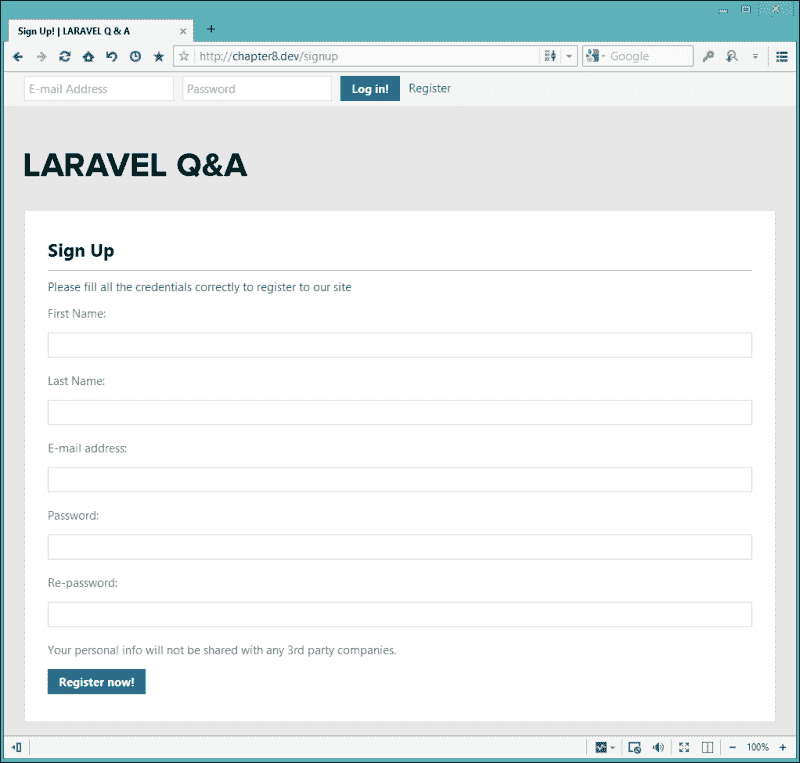
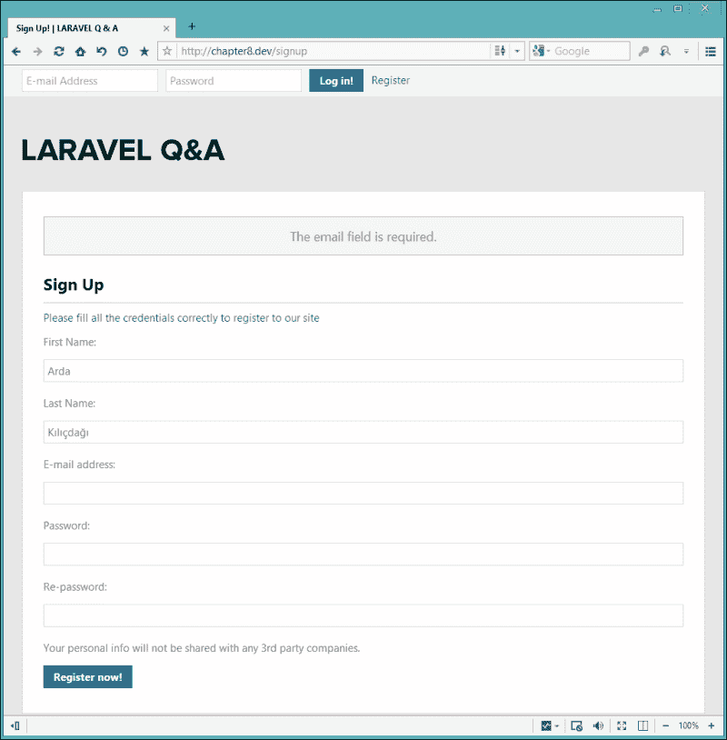
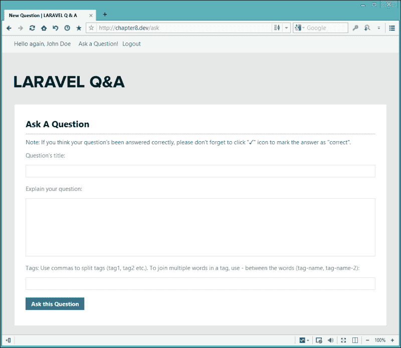
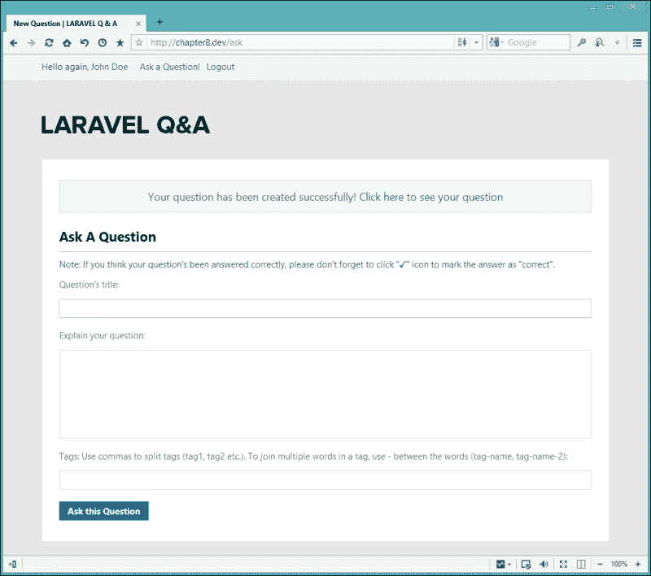
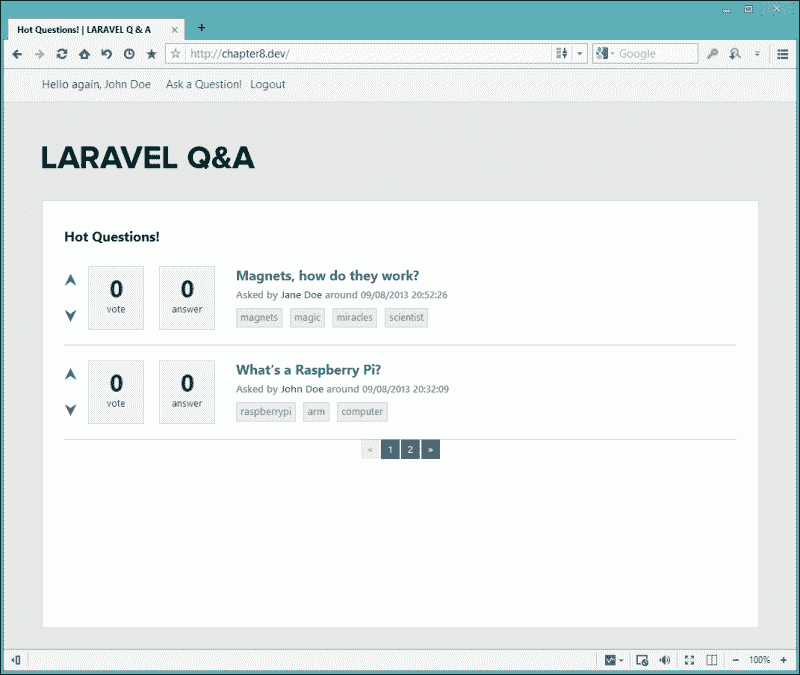
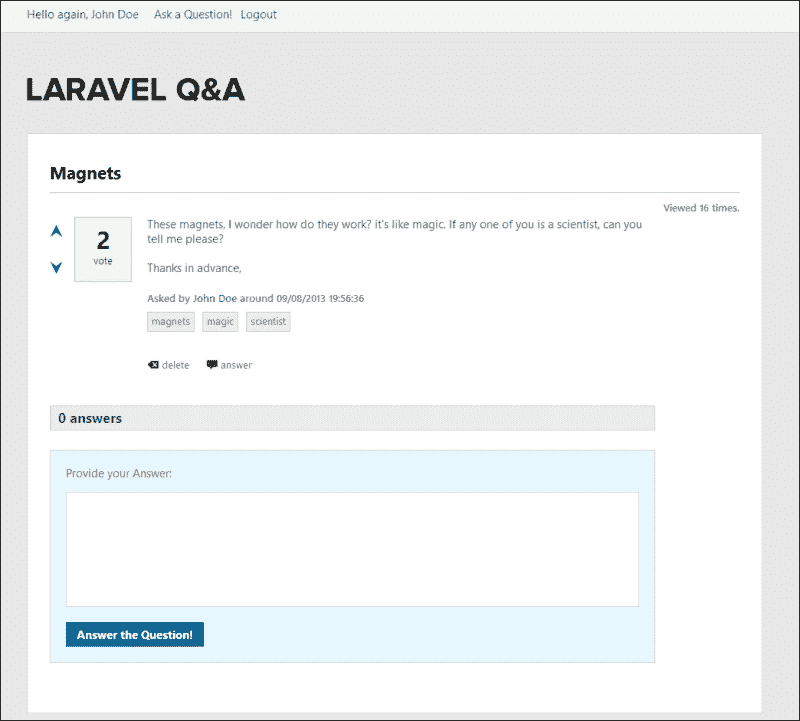
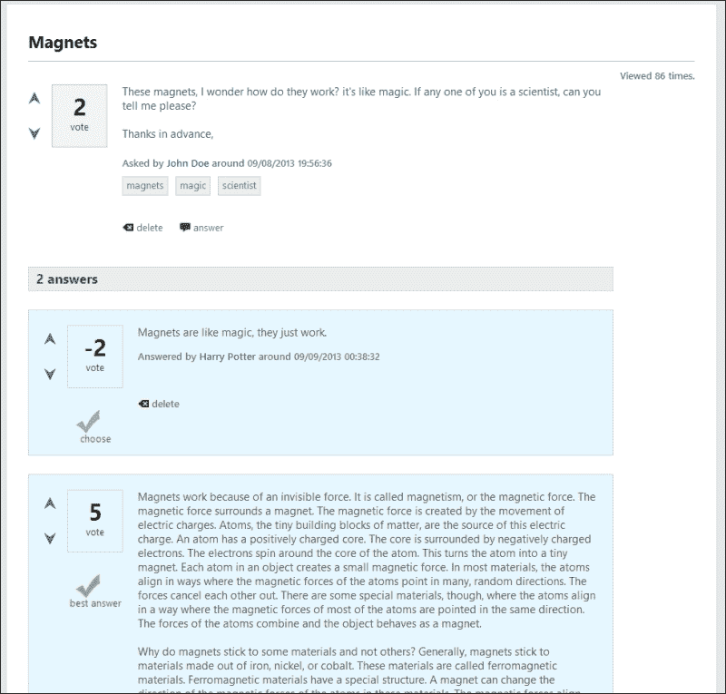
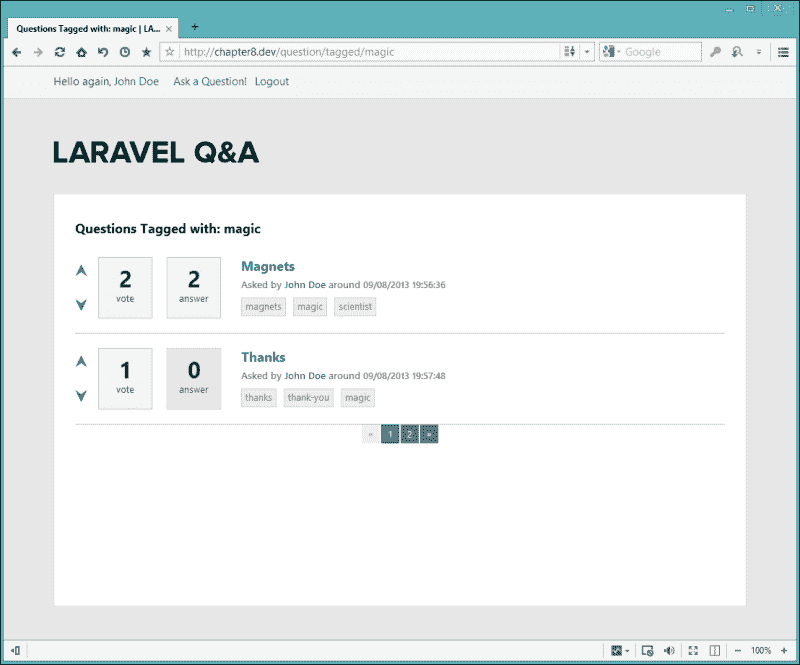

# 第八章：构建问答 Web 应用程序

在本章中，我们将创建一个问答 Web 应用程序。首先，我们将学习如何从 Laravel 中移除 public 段，以便能够使用一些共享主机解决方案。然后，我们将使用第三方扩展进行认证和访问权限处理。最后，我们将创建一个问题系统，允许评论和回答问题，一个标签系统，点赞和踩，以及选择最佳答案。我们将使用中间表来处理问题标签。我们还将在各个地方受益于 jQuery Ajax 请求。以下是本章将涉及的主题：

+   从 Laravel 4 中移除 public 段

+   安装 Sentry 2 和一个认证库，并设置访问权限

+   创建自定义过滤器

+   创建我们的注册和登录表单

+   创建我们的问题表和模型

+   使用一个中间表创建我们的标签表

+   创建和处理我们的问题表单

+   创建我们的问题列表页面

+   创建我们的问题页面

+   创建我们的答案表和资源

+   按标签搜索问题

# 从 Laravel 4 中移除 public 段

在一些现实情况下，你可能不得不坚持使用配置不良的共享 Web 主机解决方案，它们没有`www`、`public_html`或类似的文件夹。在这种情况下，你会想要从你的 Laravel 4 安装中移除 public 段。要移除这个 public 段，有一些简单的步骤要遵循：

1.  首先确保你有一个正在运行的 Laravel 4 实例。

1.  然后，将`public`文件夹中的所有内容移动到父文件夹中（其中包括`app`、`bootstrap`、`vendor`和其他文件夹），然后删除空的 public 文件夹。

1.  接下来，打开`index.php`文件（我们刚刚从 public 文件夹中移动过来），找到以下行：

```php
require __DIR__.'/../bootstrap/autoload.php';
```

用以下行替换上一行：

```php
require __DIR__.'/bootstrap/autoload.php';
```

1.  现在，在`index.php`文件中找到这行：

```php
$app = require_once __DIR__.'/../bootstrap/start.php';
```

用以下行替换上一行：

```php
$app = require_once __DIR__.'/bootstrap/start.php';
```

1.  现在，打开`bootstrap`文件夹下的`paths.php`文件，并找到这行：

```php
'public' => __DIR__.'/../public',
```

用以下行替换上一行：

```php
'public' => __DIR__.'/..',
```

1.  如果你使用虚拟主机，请不要忘记更改目录设置并重新启动你的 Web 服务器。

在前面的步骤中，我们首先将所有内容从`public`文件夹移动到`parent`文件夹，因为我们将不再使用`parent`段。然后我们修改了`index.php`文件，以识别`autoload.php`和`start.php`的正确路径，以便框架可以运行。如果一切顺利，当你刷新页面时不会看到任何问题，这意味着你已成功从 Laravel 4 安装中移除了 public 段。

### 注意

不要忘记，这种方法会使你的所有代码都可以在公共 Web 根目录中使用，这可能会给你的项目带来安全问题。在这种情况下，你应该避免使用这种方法，或者你应该找到一个更好的 Web 主机解决方案。

# 安装 Sentry 2 和一个认证库，并设置访问权限

在这一部分，我们将安装一个第三方库用于用户认证和访问权限，名为 Sentry 2，由**Cartalyst**提供。Cartalyst 是一个以开发者为中心的开源公司，专注于文档、社区支持和框架。在这一部分，我们将按照 Sentry 官方的 Laravel 4 安装步骤进行操作，还有一个简单的额外步骤，目前可以在[`docs.cartalyst.com/sentry-2/installation/laravel-4`](http://docs.cartalyst.com/sentry-2/installation/laravel-4)找到。

1.  首先，打开你的`composer.json`文件，并在`require`属性中添加以下行：

```php
"cartalyst/sentry": "2.0.*"
```

1.  然后，运行 composer update 命令来获取包：

```php
php composer.phar update
```

1.  现在，打开`app/config`下的`app.php`文件，并在`providers`数组中添加以下行：

```php
'Cartalyst\Sentry\SentryServiceProvider',
```

1.  现在，在`app.php`中的`aliases`数组中添加以下行：

```php
'Sentry' => 'Cartalyst\Sentry\Facades\Laravel\Sentry',
```

1.  现在，运行以下命令来安装所需的表（或用户）到数据库中：

```php
php artisan migrate --package=cartalyst/sentry
```

1.  接下来，我们需要将 Sentry 2 的配置文件发布到我们的`app`文件夹中，这样我们就可以管理节流或其他设置（如果需要的话）。从终端运行以下命令：

```php
php artisan config:publish cartalyst/sentry
```

1.  现在，我们应该修改默认的用户模型，以便能够在 Sentry 2 中使用它。打开`app/models`目录下的`User.php`文件，并用以下代码替换所有内容：

```php
<?php
class User extends Cartalyst\Sentry\Users\Eloquent\User {
}
```

1.  最后，我们应该创建我们的管理员用户。将以下代码添加到`app`文件夹下的`routes.php`文件中，并运行一次。之后注释或删除该代码。我们实际上为我们的系统分配了 ID=1 的管理员，具有名为`admin`的访问权限。

```php
/**
* This method is to create an admin once.
* Just run it once, and then remove or comment it out.
**/
Route::get('create_user',function(){

$user = Sentry::getUserProvider()->create(array(
  'email' => 'admin@admin.com',
  //password will be hashed upon creation by Sentry 2
  'password' => 'password',
  'first_name' => 'John',
  'last_name' => 'Doe',
  'activated' => 1,
  'permissions' => array (
    'admin' => 1
  )
));
return 'admin created with id of '.$user->id;
});
```

通过这样做，您已成功创建了一个以`admin@admin.com`作为电子邮件地址和`password`作为密码的用户。密码将在 Sentry 2 创建时自动进行哈希处理，因此我们无需在创建之前对密码进行哈希和盐处理。我们将管理员的名字设置为`John`，姓氏设置为`Doe`。此外，我们为刚刚生成的用户设置了一个名为`admin`的权限，以在请求处理之前检查访问权限。

您现在已经准备就绪。如果一切顺利，并且您检查您的数据库，您应该会看到由 Laravel 4 生成的迁移表（在 Laravel 3 中您必须在第一次迁移之前手动设置），以及由 Sentry 2 生成的表。在`users`表中，您应该会看到我们的闭包方法生成的用户条目。

现在我们的用户认证系统已经准备就绪，我们需要生成我们的过滤器，然后创建注册和登录表单。

# 创建自定义过滤器

自定义过滤器将帮助我们过滤请求，并在请求之前进行一些预检查。利用 Sentry 2 内置的方法，我们可以轻松定义自定义过滤器。但首先，我们需要定义一些在项目中将要使用的路由。

将以下代码添加到`app`文件夹下的`routes.php`文件中：

```php
//Auth Resource
Route::get('signup',array('as'=>'signup_form', 'before'=>
'is_guest', 'uses'=>'AuthController@getSignup'));
Route::post('signup',array('as'=>'signup_form_post', 'before' =>
'csrf|is_guest', 'uses' => 'AuthController@postSignup'));
Route::post('login',array('as'=>'login_post', 'before' =>
'csrf| is_guest', 'uses' => 'AuthController@postLogin'));
Route::get('logout',array('as'=>'logout', 'before'=>'
user', 'uses' => 'AuthController@getLogout'));
//---- Q & A Resources
Route::get('/',array('as'=>'index','uses'=>
'MainController@getIndex'));
```

在这些命名资源中，名称是在数组中用键`as`定义的，过滤器是用键`before`设置的。正如您所看到的，有一些`before`参数，比如`is_guest`和`user`。这些过滤器将在用户发出任何请求之前运行，甚至调用控制器。键`uses`设置了在调用资源时将执行的控制器。我们稍后将为这些控制器编写代码。因此，例如，用户甚至无法尝试提交登录表单。如果用户尝试这样做，我们的过滤器将在用户发出请求之前运行并进行过滤。

现在我们的路由已经准备就绪，我们可以添加过滤器。要添加过滤器，请打开`app`文件夹下的`filters.php`文件，并添加以下代码：

```php
/*
 |----------------------------------------------------------- 
 | Q&A Custom Filters
 |-----------------------------------------------------------
*/

Route::filter('user',function($route,$request){
  if(Sentry::check()) {
    //is logged in
  } else {
    return Redirect::route('index')
      ->with('error','You need to log in first');
  }
});

Route::filter('is_guest',function($route,$request){
  if(!Sentry::check()) {
    //is a guest
  } else {
    return Redirect::route('index')
      ->with('error','You are already logged in');
  }
});

Route::filter('access_check',function($route,$request,$right){
  if(Sentry::check()) {
    if(Sentry::getUser()->hasAccess($right)) {
      //logged in and can access
    } else {
      return Redirect::route('index')
        ->with('error','You don\'t have enough priviliges to access that page');
    }
  } else {
    return Redirect::route('index')
      ->with('error','You need to log in first');
  }
});
```

`Route::filter()`方法允许我们创建自己的过滤器。第一个参数是过滤器的名称，第二个参数是一个闭包函数，它本身至少需要两个参数。如果需要向过滤器提供参数，可以将其添加为第三个参数。

Sentry 2 的`check()`辅助函数返回一个布尔值，用于判断用户是否已登录。如果返回 true，表示用户已登录，否则正在浏览网页的用户尚未登录。在我们的自定义过滤器`user`和`is_guest`中，我们正是在检查这一点。您的过滤器的通过条件可以留空。但如果用户未满足过滤器的条件，可以采取适当的行动。在我们的示例中，我们将用户重定向到我们的`index`路由。

然而，我们的第三个过滤器`access_check`有点复杂。正如你所看到的，我们添加了一个名为`$right`的第三个参数，我们将通过调用过滤器传递它。这个过滤器检查两个条件。首先，它使用`Sentry::check()`方法检查用户是否已登录。然后，它使用`hasAccess()`方法检查用户是否有访问`$right`部分的权限（我们将在定义过滤器时看到）。但是这个方法首先需要一个当前登录的用户。为此，我们将使用 Sentry 2 的`getUser()`方法验证当前用户的信息。

在调用过滤器时传递参数，可以使用`filter_name:parameter1, parameter2`。在我们的示例中，我们将使用过滤器`access_check:admin`来检查用户是否是管理员。

在`before`参数中使用多个过滤器，可以在参数之间添加`|`字符。在我们的示例中，我们的登录提交和注册资源的过滤器被定义为`csrf|guest`（csrf 在 Laravel 的`filters.php`文件中是预定义的）。

# 创建我们的注册和登录表单

在创建我们的注册和登录表单之前，我们需要一个模板来设置这些部分。我将使用我为本章生成的自定义 HTML/CSS 模板，这个模板受到开源问答脚本**Question2Answer**的**Snow**主题的启发。

我们执行以下步骤来创建我们的注册和登录表单：

1.  首先，将提供的示例代码中`assets`文件夹中的所有内容复制到项目文件夹的根目录（`app`、`bootstrap`和其他文件夹所在的位置），因为我们在本章的第一节中删除了 public 文件夹部分。

1.  接下来，在`app/views`下的`template_masterpage.blade.php`文件中添加以下代码：

```php
<!DOCTYPE html>
<!--[if lt IE 7]> <html class="no-js lt-ie9 lt-ie8 lt-ie7">
<![endif]-->
<!--[if IE 7]> <html class="no-js lt-ie9 lt-ie8">
<![endif]-->
<!--[if IE 8]> <html class="no-js lt-ie9">
<![endif]-->
<!--[if gt IE 8]><!--> <html class="no-js">
<!--<![endif]-->

<head>
  <meta charset="utf-8" />
  <title>{{isset($title)?$title.' | ':''}} LARAVEL Q & A
  </title>
  {{ HTML::style('assets/css/style.css') }}
</head>
<body>

  {{-- We include the top menu view here --}}
  @include('template.topmenu')

  <div class="centerfix" id="header">
  <div class="centercontent">
    <a href="{{URL::route('index')}}">
      {{HTML::image('assets/img/header/logo.png')}}
    </a>
  </div>
  </div>
  <div class="centerfix" id="main" role="main">
  <div class="centercontent clearfix">
    <div id="contentblock">

    {{-- Showing the Error and Success Messages--}}
    @if(Session::has('error'))
    <div class="warningx wredy">
      {{Session::get('error')}}
    </div>
    @endif

    @if(Session::has('success'))
    <div class="warningx wgreeny">
      {{Session::get('success')}}
    </div>
    @endif

    {{-- Content section of the template --}}
    @yield('content')
    </div>
  </div>
  </div>
  {{-- JavaScript Files --}}
  {{ HTML::script('assets/js/libs.js') }}
  {{ HTML::script('assets/js/plugins.js') }}
  {{ HTML::script('assets/js/script.js') }}

  {{-- Each page's custom assets (if available) will be yielded here --}}
  @yield('footer_assets')

</body>
</html>
```

现在，让我们来看代码：

+   如果我们使用`title`属性加载视图，`<title>`标签将包含标题；否则它将只显示我们网站的名称。

+   `HTML`类的`style()`方法将帮助我们轻松地向我们的模板添加 CSS 文件。此外，`HTML`类的`script()`方法允许我们向输出的 HTML 文件添加 JavaScript。

+   我们使用 Blade 模板引擎的`@include()`方法将另一个文件包含到我们的`template_masterpage.blade.php`文件中。我们将在下一步中描述它的部分。

+   `URL`类的`route()`方法将返回一个命名路由的链接。这实际上非常方便，因为如果我们更改 URL 结构，我们不需要深入所有模板文件并编辑所有链接。

+   `HTML`类的`image()`方法允许我们向我们的模板添加``标签。

+   在过滤器中，我们使用`with()`方法和参数`error`重定向到路由页面。如果我们使用`with()`加载页面（`View::make()`），参数将是变量。但是因为我们已经将用户重定向到一个页面，通过`with()`传递的这些参数将是会话 flashdata，只能使用一次。为了检查这些会话是否设置，我们使用`Session`类的`has()`方法。`Session::has('sessionName')`将返回一个布尔值，以确定会话是否设置。如果设置了，我们可以使用`Session`类的`get()`方法在视图、控制器和其他地方使用它。

+   Blade 模板引擎的`@yield()`方法获取`@section()`中的数据，并将其解析到主模板页面。

1.  在上一节中，我们通过调用`@include()`方法包含了另一个视图，如`@include('template.topmenu')`。现在将以下代码保存为`topmenu.blade.php`，放在`app/views/template`下：

```php
{{-- Top error (about login etc.) --}}
@if(Session::has('topError'))
  <div class="centerfix" id="infobar">
    <div class="centercontent">{{ Session::get('topError') }}
    </div>
  </div>
@endif

{{-- Check if a user is logged in, login and logout has different templates --}}
@if(!Sentry::check())
<div class="centerfix" id="login">
  <div class="centercontent">
    {{Form::open(array('route'=>'login_post'))}}
    {{Form::email('email', Input::old('email'), array('placeholder'=>'E-mail Address'))}}
    {{Form::password('password', array('placeholder' => 'Password'))}}
    {{Form::submit('Log in!')}}
    {{Form::close()}}

    {{HTML::link('signup_form','Register',array(),array('class'=>'wybutton'))}}
  </div>
</div>
@else
  <div class="centerfix" id="login">
    <div class="centercontent">
      <div id="userblock">Hello again, {{HTML::link('#',Sentry::getUser()->first_name.' '.Sentry::getUser()->last_name)}}</div>
      {{HTML::linkRoute('logout','Logout',array(),array('class'=>'wybutton'))}}
    </div>
  </div>
@endif
```

现在，让我们来看代码：

+   在我们的模板中，有两个错误消息，其中第一个完全保留给将在顶部显示的登录区域。我将其命名为`error_top`。使用我们刚学到的`has()`和`get()`方法，我们检查是否存在错误，并显示它。

+   顶部菜单将取决于用户是否已登录。因此，我们使用 Sentry 2 的用户检查方法`check()`创建一个`if`子句来检查用户是否已登录。如果用户未登录（访客），我们将显示使用`Form`类制作的登录表单，否则我们将显示用户`infobar`，其中包含个人资料和**注销**按钮。

1.  现在，我们需要一个注册表单页面。我们之前已经在`app`文件夹下的`routes.php`文件中定义了它的方法：

```php
//Auth Resource
Route::get('signup',array('as'=>'signup_form', 'before' => 'is_guest', 'uses' => 'AuthController@getSignup'));
Route::post('signup',array('as' => 'signup_form_post', 'before' => 'csrf|is_guest', 'uses' => 'AuthController@postSignup'));
```

1.  根据我们创建的路由资源，我们需要一个名为`AuthController`的控制器，其中包含两个名为`getSignup()`和`postSignup()`的方法。现在让我们首先创建控制器。打开你的终端并输入以下命令：

```php
**php artisan controller:make AuthController**

```

1.  上一个命令将在`app/controllers`文件夹下创建一个名为`AuthController.php`的新文件，并带有一些默认方法。删除`AuthController`类内的现有代码，并添加以下代码到该类内，以创建注册表单：

```php
/**
  * Signup GET method
**/
public function getSignup() {
  return View::make('qa.signup')
    ->with('title','Sign Up!');
}
```

1.  现在我们需要一个视图文件来制作表单。将以下代码保存为`signup.blade.php`，放在`app/views/qa`文件夹下：

```php
@extends('template_masterpage')

@section('content')
  <h1 id="replyh">Sign Up</h1>
  <p class="bluey">Please fill all the credentials correctly to register to our site</p>
  {{Form::open(array('route'=>'signup_form_post'))}}
    <p class="minihead">First Name:</p>
    {{Form::text('first_name',Input::get('first_name'),array('class'=>'fullinput'))}}
    <p class="minihead">Last Name:</p>
    {{Form::text('last_name',Input::get('last_name'),array('class'=>'fullinput'))}}<p class="minihead">E-mail address:</p>
    {{Form::email('email',Input::get('email'),array('class'=>'fullinput'))}}
    <p class="minihead">Password:</p>
    {{Form::password('password','',array('class'=>'fullinput'))}}
    <p class="minihead">Re-password:</p>
    {{Form::password('re_password','',array('class'=>'fullinput'))}}
    <p class="minihead">Your personal info will not be shared with any 3rd party companies.</p>
    {{Form::submit('Register now!')}}
  {{Form::close()}}
@stop
```

如果你已经正确完成了所有步骤，当你导航到`chapter8.dev/signup`时，你应该会看到以下表单：



## 验证和处理表单

现在，我们需要验证和处理表单。我们首先需要定义我们的验证规则。将以下代码添加到`app/models`文件夹下的`user.php`文件中的`User`类中：

```php
public static $signup_rules = array(
  'first_name' => 'required|min:2',
  'last_name' => 'required|min:2',
  'email' => 'required|email|unique:users,email',
  'password' => 'required|min:6',
  're_password' => 'required|same:password'
);
```

前面代码中提到的规则将使所有字段都为`required`。我们将`first_name`和`last_name`列设置为`required`，并设置最小长度为两个字符。我们将`email`字段设置为有效的电子邮件格式，并且代码将检查`users`表（在安装 Sentry 2 时创建）中的唯一电子邮件地址。我们将`password`字段设置为`required`，并且其长度应至少为六个字符。我们还将`re_password`字段设置为与`password`字段匹配，以确保密码输入正确。

### 注意

Sentry 2 也可以在尝试登录用户时抛出唯一电子邮件检查异常。

在处理表单之前，我们需要一个虚拟的索引页面来在成功注册后返回用户。我们将通过以下步骤创建一个临时的索引页面：

1.  首先，运行以下命令来创建一个新的控制器：

```php
**php artisan controller:make MainController**

```

1.  然后，删除所有自动插入的方法，并在类内添加以下方法：

```php
public function getIndex() {
  return View::make('qa.index');
}
```

1.  现在，将此视图文件保存为`index.blade.php`，放在`app/views/qa`文件夹下：

```php
@extends('template_masterpage')

@section('content')
Heya!
@stop
```

1.  现在，我们需要一个控制器方法（我们在`routes.php`中定义的）来处理`signup`表单的`post`请求。为此，将以下代码添加到`app/controllers`文件夹下的`AuthController.php`文件中：

```php
/**
  * Signup Post Method
**/
public function postSignup() {

  //Let's validate the form first
  $validation = Validator::make(Input::all(),User::$signup_rules);

  //let's check if the validation passed
  if($validation->passes()) {

    //Now let's create the user with Sentry 2's create method
    $user = Sentry::getUserProvider()->create(array(
      'email' => Input::get('email'),
      'password' => Input::get('password'),
      'first_name' => Input::get('first_name'),
      'last_name' => Input::get('last_name'),
      'activated' => 1
    ));

    //Since we don't use an email validation in this example, let's log the user in directly
    $login = Sentry::authenticate(array('email'=>Input::get('email'),'password'=>Input::get('password')));

    return Redirect::route('index')
      ->with('success','You\'ve signed up and logged in successfully!');
    //if the validation failed, let's return the user 
    //to the signup form with the first error message
  } else {
    return Redirect::route('signup_form')
    ->withInput(Input::except('password','re_password'))
      ->with('error',$validation->errors()->first());
  }
}
```

现在，让我们来看看代码：

1.  首先，我们使用 Laravel 内置的表单验证类来检查表单项，使用我们在模型中定义的规则。

1.  我们使用`passes()`方法来检查表单验证是否通过。我们也可以使用`fails()`方法来检查相反的情况。

如果验证失败，我们将使用`withInput()`将用户返回到**注册**表单，并使用`Input::except()`过滤一些列，如`password`和`re_password`，以便这些字段的值不会返回。此外，通过使用`with`传递参数，将返回表单验证的错误消息。`$validation->errors()->first()`在表单验证步骤后返回第一个错误消息字符串。



如果验证通过，我们将使用提供的凭据创建一个新用户。我们将`activated`列设置为`1`，这样在我们的示例中注册过程不需要电子邮件验证。

### 注意

Sentry 2 还使用 try/catch 子句来捕获错误。不要忘记查看 Sentry 2 的文档，了解如何捕获异常错误。

1.  由于我们没有使用电子邮件验证系统，我们可以简单地使用 Sentry 2 的`authenticate()`方法对用户进行身份验证和登录，就在注册后。第一个参数接受一个`email`和`password`的数组（与`key => value`匹配），可选的第二个参数接受一个布尔值作为输入，以检查用户是否要被记住（`记住我`按钮）。

1.  身份验证后，我们只需将用户重定向到我们的`index`路由，并显示成功消息，如下图所示：

## 处理登录和注销请求

现在我们的注册系统已经准备好了，我们需要处理登录和注销请求。由于我们的登录表单已经准备好了，我们可以直接进行处理。要处理登录和注销请求，我们执行以下步骤：

1.  首先，我们需要登录表单验证规则。将以下代码添加到`app/models`目录下的`User.php`文件中：

```php
public static $login_rules = array(
	'email'		=> 'required|email|exists:users,email',
	'password'	=> 'required|min:6'
);
```

1.  现在，我们需要一个控制器方法来处理登录请求。在`app/controllers`目录下的`AuthController.php`文件中添加以下代码：

```php
/**
 * Login Post Method Resource
**/
public function postLogin() {
  //let's first validate the form:
  $validation = Validator::make(Input::all(),User::$login_rules);

  //if the validation fails, return to the index page with first error message
  if($validation->fails()) {
    return Redirect::route('index')
      ->withInput(Input::except('password'))
      ->with('topError',$validation->errors()->first());
  } else {

    //if everything looks okay, we try to authenticate the user
    try {

      // Set login credentials
      $credentials = array('email' => Input::get('email'),'password' => Input::get('password'),);

      // Try to authenticate the user, remember me is set to false
      $user = Sentry::authenticate($credentials, false);
      //if everything went okay, we redirect to index route with success message
      return Redirect::route('index')
        ->with('success','You\'ve successfully logged in!');
    } catch (Cartalyst\Sentry\Users\LoginRequiredException $e) {
      return Redirect::route('index')
        -> withInput(Input::except('password'))
        ->with('topError','Login field is required.');
    } catch (Cartalyst\Sentry\Users\PasswordRequiredException $e) {
      return Redirect::route('index')
        -> withInput(Input::except('password'))
        ->with('topError','Password field is required.');
    } catch (Cartalyst\Sentry\Users\WrongPasswordException $e) {
      return Redirect::route('index')
        -> withInput(Input::except('password'))
        ->with('topError','Wrong password, try again.');
    } catch (Cartalyst\Sentry\Users\UserNotFoundException $e) {
      return Redirect::route('index')
        -> withInput(Input::except('password'))
        ->with('topError','User was not found.');
    } catch (Cartalyst\Sentry\Users\UserNotActivatedException $e) {
      return Redirect::route('index')
        -> withInput(Input::except('password'))
        ->with('topError','User is not activated.');
    }

    // The following is only required if throttle is enabled
    catch (Cartalyst\Sentry\Throttling\UserSuspendedException $e) {
    return Redirect::route('index')
      -> withInput(Input::except('password'))
      ->with('topError','User is suspended.');
    } catch (Cartalyst\Sentry\Throttling\UserBannedException $e) {
      return Redirect::route('index')
        -> withInput(Input::except('password'))
        ->with('topError','User is banned.');
    }
  }
}
```

现在，让我们来看看代码：

1.  首先，我们使用 Laravel 内置的表单验证类检查表单项，使用我们在模型中定义的规则。

1.  然后，我们使用表单验证类的`fails()`方法检查表单验证是否失败。如果表单验证失败，我们将用户返回到`index`路由，并显示第一个表单验证错误。

1.  上面代码中的`else`子句包含了如果表单验证通过将要执行的事件。在这里，我们使用 Sentry 2 的 try/catch 子句对用户进行身份验证，捕获所有的异常，并根据异常的类型返回错误消息。

在我们的示例应用程序中，我们不需要所有的异常，但是作为一个示例，我们尝试展示所有的异常，以防您需要在跟进时做一些不同的事情。

### 注意

所有这些 try/catch 异常都在 Sentry 2 的网站上有记录。

1.  如果 Sentry 2 没有抛出任何异常，我们将返回到带有成功消息的索引页面。

1.  现在，关于身份验证，唯一剩下的事情就是注销按钮。要创建一个，将以下代码添加到`app/controllers`目录下的`AuthController.php`文件中：

```php
/**
  * Logout method 
**/
public function getLogout() {
  //we simply log out the user
  Sentry::logout();

  //then, we return to the index route with a success message
  return Redirect::route('index')
    ->with('success','You\'ve successfully signed out');
}
```

现在让我们来看看代码：

1.  首先，我们调用 Sentry 2 的`logout()`方法，将用户注销。

1.  然后，我们只需将当前是访客的用户重定向到`index`路由，并显示成功消息，告诉他们已成功注销。

现在我们的身份验证系统已经准备好了，我们准备创建我们的问题表。

# 创建我们的问题表和模型

现在我们有一个完全可用的身份验证系统，我们准备创建我们的`questions`表。为了创建我们的`questions`表，我们将使用数据库迁移。

要创建一个迁移，请在终端中运行以下命令：

```php
**php artisan migrate:make create_questions_table --table= questions --create**

```

上面的命令将在`app/database/migrations`下创建一个新的迁移。

对于问题，我们将需要一个问题标题，问题详情，问题的提问者，问题的日期，问题被查看的次数，投票的总和以及问题的标签。

现在，打开您刚刚创建的迁移，并用以下代码替换其内容：

```php
Schema::create('questions', function(Blueprint $table)
{
  //Question's ID
  $table->increments('id');
  //title of the question
  $table->string('title',400)->default('');
  //asker's id
  $table->integer('userID')->unsigned()->default(0);
  //question's details
  $table->text('question')->default('');
  //how many times it's been viewed:
  $table->integer('viewed')->unsigned()->default(0);
  //total number of votes:
  $table->integer('votes')->default(0);
  //Foreign key to match userID (asker's id) to users
  $table->foreign('userID')->references('id')->on('users')->onDelete('cascade');
  //we will get asking time from the created_at column
  $table->timestamps();
});
```

对于标签，我们将使用一个数据透视表，这就是为什么它们不在我们当前的模式中。对于投票，在这个例子中，我们只是持有一个整数（可以是正数或负数）。在现实世界的应用中，您会想要使用第二个数据透视表来保留用户的投票，以防止重复投票，并获得更准确的结果。

1.  现在您的模式已经准备好了，请使用以下命令运行迁移：

```php
**php artisan migrate**

```

1.  成功迁移模式后，我们现在需要一个模型来从 Eloquent 中受益。将以下代码保存为`Question.php`，放在`app/models`目录下：

```php
<?php

class Question extends Eloquent {

  protected $fillable = array('title', 'userID', 'question', 'viewed', 'answered', 'votes');

}
```

1.  现在，我们需要数据库关系来匹配表。首先，将以下代码添加到`app/models`文件夹下的`User.php`文件中：

```php
public function questions() {
  return $this->hasMany('Question','userID');
}
```

1.  接下来，将以下代码添加到`app/models`文件夹下的`Question.php`文件中：

```php
public function users() {
  return $this->belongsTo('User','userID');
}
```

由于用户可能有多个问题，我们在我们的`User`模型中使用了`hasMany()`方法来进行关联。同样，由于所有的问题都是用户拥有的，我们使用`belongsTo()`方法来将问题与用户匹配。在这些方法中，第一个参数是模型名称，在我们的例子中是`Question`和`User`。第二个参数是该模型中用来匹配表的列名，在我们的例子中是`userID`。

# 创建我们的标签表和枢轴表

首先，我们应该理解为什么我们需要标签的枢轴表。在现实世界的情况下，一个问题可能有多个标签；同样，一个标签可能有多个问题。在这种情况下（多对多关系），两个表都可能有多个相互匹配的情况，我们应该创建并使用第三个枢轴表。

1.  首先，我们应该使用架构创建一个新的标签表。打开您的终端并运行以下命令来创建我们的枢轴表架构：

```php
**php artisan migrate:make create_tags_table --table= tags --create**

```

1.  现在我们需要填充表的内容。在我们的例子中，我们只需要标签名称和标签的友好 URL 名称。用以下代码替换架构的`up`函数内容：

```php
Schema::create('tags', function(Blueprint $table)
{
  //id is needed to match pivot
  $table->increments('id');

  //Tag's name
  $table->string('tag')->default('');
  //Tag's URL-friendly name
  $table->string('tagFriendly')->unique();

  //I like to keep timestamps
  $table->timestamps();
});
```

我们有`id`列来匹配问题和枢轴表中的标签。我们有一个字符串字段`tag`，它将是标签的标题，列`tagFriendly`是将显示为 URL 的内容。我还保留了时间戳，这样，将来它可以为我们提供标签创建的信息。

1.  最后，在您的终端中运行以下命令来运行迁移并安装表：

```php
**php artisan migrate**

```

1.  现在，我们需要一个`tags`表的模型。将以下文件保存为`Tag.php`，放在`app/models`文件夹下：

```php
<?php

class Tag extends Eloquent {

  protected $fillable = array('tag', 'tagFriendly');

}
```

1.  现在，我们需要创建我们的枢轴表。作为一个良好的实践，它的名称应该是`modelname1_modelname2`，并且内容按字母顺序排序。在我们的例子中，我们有`questions`和`tags`表，所以我们将枢轴表的名称设置为`question_tags`（这不是强制的，您可以给您的枢轴表任何名称）。正如您可能猜到的那样，它的架构将有两列来匹配两个表和这两个列的外键。您甚至可以向枢轴表添加额外的列。

要创建迁移文件，请在终端中运行以下命令：

```php
**php artisan migrate:make create_question_tags_table --table=question_tags --create**

```

1.  现在，打开我们在`app/database`的`migrations`文件夹中生成的架构，并用以下代码修改其`up()`方法的内容：

```php
Schema::create('question_tags', function(Blueprint $table)
{
  $table->increments('id');

  $table->integer('question_id')->unsigned()->default(0);
  $table->integer('tag_id')->unsigned()->default(0);

  $table->foreign('question_id')->references('id')->on('questions')->onDelete('cascade');
  $table->foreign('tag_id')->references('id')->on('tags')->onDelete('cascade');

  $table->timestamps();
});
```

我们需要两列，其名称结构应为`modelname_id`。在我们的迁移中，它们是`question_id`和`tag_id`。此外，我们已经设置了外键来匹配它们在我们的数据库中。

1.  现在，运行迁移并安装表：

```php
**php artisan migrate**

```

1.  现在，我们需要添加方法来描述 Eloquent 我们正在使用一个枢轴表。将以下代码添加到`app/models`文件夹下的`Question.php`文件中：

```php
public function tags() {
  return $this->belongsToMany('Tag','question_tags')->withTimestamps();
}
```

描述枢轴信息到标签模型，将以下代码添加到`app/models`文件夹下的`Tag.php`文件中：

```php
public function questions() {
  return $this->belongsToMany('Question','question_tags')->withTimestamps();
}
```

`belongsToMany()`方法中的第一个参数是模型名称，第二个参数是枢轴表的名称。使用`withTimestamps()`（它为我们带来了枢轴数据的创建和更新日期）是可选的。此外，如果我们有一些额外的数据要添加到枢轴表中，我们可以使用`withPivot()`方法来调用它。考虑以下示例代码：

```php
$this->belongsToMany('Question ', 'question_tags')->withPivot('column1', 'column2')->withTimestamps();
```

现在我们的枢轴表结构准备好了，在后面的章节中，我们可以轻松地获取问题的标签和所有标记为`$tagname`的问题。

# 创建和处理我们的问题表单

现在我们的结构准备好了，我们可以继续创建和处理我们的问题表单。

## 创建我们的问题表单

我们执行以下步骤来创建我们的问题表单：

1.  首先，我们需要为问题表单创建一个新的路由资源。打开`app`文件夹中的`routes.php`文件，并添加以下代码：

```php
Route::get('ask',array('as'=>'ask', 'before'=>'user', 
   'uses' => 'QuestionsController@getNew'));

Route::post('ask',array('as'=>'ask_post', 
  'before'=>'user|csrf', 'uses' => 
  'QuestionsController@postNew'));
```

1.  现在我们的资源已经定义，我们需要将资源添加到顶部菜单以进行导航。打开`app/views/template`目录下的`topmenu.blade.php`文件，并找到以下行：

```php
{{HTML::linkRoute('logout','Logout',array(), array('class'=>'wybutton'))}}
```

在以下行的上方添加上述行：

```php
{{HTML::linkRoute('ask','Ask a Question!', array(), array('class'=>'wybutton'))}}
```

1.  现在，我们需要控制器文件来处理资源。在您的终端中运行以下命令：

```php
**php artisan controller:make QuestionsController**

```

1.  接下来，打开`app/controllers`目录下新创建的`QuestionsController.php`文件，并删除类中的所有方法。然后添加以下代码：

```php
/**
  * A new question asking form
**/
public function getNew() {
  return View::make('qa.ask')
    ->with('title','New Question');
}
```

1.  现在，我们需要创建我们刚刚分配的视图。将以下代码保存为`ask.blade.php`，放在`app/views/qa`目录下：

```php
@extends('template_masterpage')

@section('content')

  <h1 id="replyh">Ask A Question</h1>
  <p class="bluey">Note: If you think your question's been answered correctly, please don't forget to click "✓" icon to mark the answer as "correct".</p>
  {{Form::open(array('route'=>'ask_post'))}}

  <p class="minihead">Question's title:</p>
  {{Form::text('title',Input::old('title'),array('class'=>'fullinput'))}}

  <p class="minihead">Explain your question:</p>
  {{Form::textarea('question',Input::old('question'),array('class'=>'fullinput'))}}

  <p class="minihead">Tags: Use commas to split tags (tag1, tag2 etc.). To join multiple words in a tag, use - between the words (tag-name, tag-name-2):</p>
  {{Form::text('tags',Input::old('tags'),array('class'=>'fullinput'))}}
  {{Form::submit('Ask this Question')}}
  {{Form::close()}}

@stop
@section('footer_assets')

  {{-- A simple jQuery code to lowercase all tags before submission --}}
  <script type="text/javascript">
    $('input[name="tags"]').keyup(function(){
      $(this).val($(this).val().toLowerCase());
    });
  </script>

@stop
```

除了我们之前创建的视图之外，在这个视图中，我们通过填充`footer_assets`部分向页脚添加了 JavaScript 代码，这是我们在主页面中之前定义的。

1.  如果您已经正确完成了所有操作，当您导航到`site.com/ask`时，您将看到一个类似以下截图的样式化表单：

现在我们的问题表单已经准备好，我们可以开始处理表单了。

## 处理我们的问题表单

为了处理表单，我们需要一些验证规则和控制器方法。

1.  首先，将以下表单验证规则添加到`app/models`目录下的`Question.php`文件中：

```php
public static $add_rules = array('title' => 'required|min:2','question' => 'required|min:10');
```

1.  成功保存问题后，我们希望向用户提供问题的永久链接，以便用户可以轻松访问问题。但是，为了做到这一点，我们首先需要定义一个创建此链接的路由。将以下行添加到`app`文件夹中的`routes.php`文件中：

```php
Route::get('question/{id}/{title}',array('as'=> 'question_details', 'uses' => 'QuestionsController@getDetails' ))-> where(array('id'=>'[0-9]+' , 'title' => '[0-9a-zA-Z\-\_]+'));
```

我们将两个参数设置到这个路由中，`id`和`title`。`id`参数必须是正整数，而`title`应该只包含字母数字字符、分数和下划线。

1.  现在，我们准备处理问题表单。将以下代码添加到`app/controllers`目录下的`QuestionsController.php`文件中：

```php
/**
 * Post method to process the form
**/
public function postNew() {

  //first, let's validate the form
  $validation = Validator::make(Input::all(), Question::$add_rules);

  if($validation->passes()) {
    //First, let's create the question
    $create = Question::create(array('userID' => Sentry::getUser()->id,'title' => Input::get('title'),'question' => Input::get('question')
    ));

    //We get the insert id of the question
    $insert_id = $create->id;

    //Now, we need to re-find the question to "attach" the tag to the question
    $question = Question::find($insert_id);

    //Now, we should check if tags column is filled, and split the string and add a new tag and a relation
    if(Str::length(Input::get('tags'))) {
      //let's explode all tags from the comma
      $tags_array = explode(',', Input::get('tags'));
      //if there are any tags, we will check if they are new, if so, we will add them to database
      //After checking the tags, we will have to "attach" tag(s) to the new question 
      if(count($tags_array)) {
        foreach ($tags_array as $tag) {
          //first, let's trim and get rid of the extra space bars between commas 
          //(tag1, tag2, vs tag1,tag2) 
          $tag = trim($tag);

          //We should double check its length, because the user may have just typed "tag1,,tag2" (two or more commas) accidentally
          //We check the slugged version of the tag, because tag string may only be meaningless character(s), like "tag1,+++//,tag2"
          if(Str::length(Str::slug($tag))) {
            //the URL-Friendly version of the tag
            $tag_friendly = Str::slug($tag);

            //Now let's check if there is a tag with the url friendly version of the provided tag already in our database:
            $tag_check = Tag::where('tagFriendly',$tag_friendly);

            //if the tag is a new tag, then we will create a new one
            if($tag_check->count() == 0) {
              $tag_info = Tag::create(array('tag' => $tag,'tagFriendly' => $tag_friendly));

              //If the tag is not new, this means There was a tag previously added on the same name to another question previously
              //We still need to get that tag's info from our database 
            } else {
              $tag_info = $tag_check->first();
            }
          }

          //Now the attaching the current tag to the question
          $question->tags()->attach($tag_info->id);
        }
      }
    }

    //lastly, we should return the user to the asking page with a permalink of the question
    return Redirect::route('ask')
      ->with('success','Your question has been created successfully! '.HTML::linkRoute('question_details','Click here to see your question',array('id'=>$insert_id,'title'=>Str::slug($question->title))));

  } else {
    return Redirect::route('ask')
      ->withInput()
      ->with('error',$validation->errors()->first());
  }
}
```

现在，让我们来看看代码：

1.  首先，我们运行表单验证类来检查数值是否有效。如果验证失败，我们将用户带回问题页面，并显示用户之前提供的旧输入以及第一个验证错误消息。

1.  如果验证通过，我们继续处理表单。我们首先创建并添加问题，向数据库添加一行，然后获取我们刚刚创建的行。为了获取当前用户的 ID，我们使用 Sentry 2 的`getUser()`方法的`id`对象，该方法返回当前登录用户的信息。

1.  创建问题后，我们检查`tags`字段的长度。如果字段不为空，我们将字符串在逗号处分割，并创建一个原始的`tags`数组。

1.  之后，我们循环遍历我们分割的每个标签，并使用 Laravel 4 的`String`类的`slug()`方法创建它们的友好 URL 版本。如果生成的版本长度大于 0，则是有效的标签。

1.  在找到所有有效的标签之后，我们检查数据库是否已经创建了标签。如果是，我们获取它的 ID。如果标签是系统中的新标签，那么我们就创建一个新的标签。这样，我们就避免了系统中不必要的多个标签。

1.  之后，我们使用`attach()`方法在中间表中创建一个新的标签关系。要附加一个新的关系，我们首先需要找到要附加的 ID，然后转到附加的模型并使用`attach()`方法。

1.  在我们的示例中，我们需要将问题附加到标签上。因此，我们找到需要附加的问题，使用多对多关系来显示标签将附加到问题，并将标签的`id`附加到问题上。

1.  如果一切顺利，您应该会被重定向回问题页面，并显示一个成功消息和问题的永久链接。

1.  另外，如果您检查`question_tags`表，您会看到填充的关系数据。

### 注意

始终验证和过滤来自表单的内容，并确保你不接受任何不需要的内容。

成功添加问题后，你应该会看到一个如下截图的页面：



# 创建我们的问题列表页面

现在我们可以创建问题了，是时候用实际的问题数据填充我们的虚拟索引页面了。为此，打开`app/controllers`下的`MainController.php`文件，并用以下代码修改`getIndex()`函数：

```php
public function getIndex() {
  return View::make('qa.index')
    ->with('title','Hot Questions!')
    ->with('questions',Question::with('users','tags')->orderBy('id','desc')->paginate(2));
}
```

在这个方法中，我们加载了相同的页面，但添加了两个名为`title`和`questions`的变量。`title`变量是我们应用程序的动态标题，`questions`变量保存了最后两个问题，带有分页。如果使用`paginate($number)`而不是`get()`，你可以获得一个准备就绪的分页系统。此外，使用`with()`方法，我们直接预加载了`users`和`tags`关系，以获得更好的性能。

在视图中，我们将为问题提供一个简单的点赞/踩选项，以及一个标记为`$tag`的问题的路由链接。为此，我们需要一些新的路由。将以下代码添加到`app`文件夹下的`routes.php`文件中：

```php
//Upvoting and Downvoting
Route::get('question/vote/{direction}/{id}',array('as'=> 'vote', 'before'=>'user', 'uses'=> 'QuestionsController@getvote'))->where (array('direction'=>'(up|down)', 'id'=>'[0-9]+'));

//Question tags page
Route::get('question/tagged/{tag}',array('as'=>'tagged','uses'=>'QuestionsController@getTaggedWith'))->where('tag','[0-9a-zA-Z\-\_]+');
```

现在打开`app/views/qa`下的`index.blade.php`文件，并用以下代码修改整个文件：

```php
@extends('template_masterpage')

@section('content')
  <h1>{{$title}}</h1>

  @if(count($questions))

    @foreach($questions as $question)

      <?php
        //Question's asker and tags info
        $asker = $question->users;
        $tags = $question->tags;	 
      ?>

      <div class="qwrap questions">
        {{-- Guests cannot see the vote arrows --}}
        @if(Sentry::check())
          <div class="arrowbox">
            {{HTML::linkRoute('vote','',array('up', $question->id),array('class'=>'like', 'title'=>'Upvote'))}}
            {{HTML::linkRoute('vote','',array('down',$question->id),array('class'=>'dislike','title'=>'Downvote'))}}
          </div>
        @endif

        {{-- class will differ on the situation --}}
        @if($question->votes > 0)
          <div class="cntbox cntgreen">
        @elseif($question->votes == 0)
          <div class="cntbox">
        @else
          <div class="cntbox cntred">
        @endif
        <div class="cntcount">{{$question->votes}}</div>
        <div class="cnttext">vote</div>
        </div>

        {{--Answer section will be filled later in this chapter--}}
        <div class="cntbox">
          <div class="cntcount">0</div>
          <div class="cnttext">answer</div>
        </div>

        <div class="qtext">
          <div class="qhead">
            {{HTML::linkRoute('question_details',$question->title,array($question->id,Str::slug($question->title)))}}
          </div>
          <div class="qinfo"">Asked by <a href="#">{{$asker->first_name.' '.$asker->last_name}}</a> around {{date('m/d/Y H:i:s',strtotime($question->created_at))}}</div>
          @if($tags!=null)
            <ul class="qtagul">
              @foreach($tags as $tag)
                <li>{{HTML::linkRoute('tagged',$tag->tag,$tag->tagFriendly)}}</li>
              @endforeach
            </ul>
          @endif
        </div>
      </div>
    @endforeach

    {{-- and lastly, the pagination --}}
    {{$questions->links()}}

  @else
    No questions found. {{HTML::linkRoute('ask','Ask a question?')}}
  @endif

@stop
```

由于我们已经设置了关系，我们可以直接使用`$question->users`来访问提问者，或者`$question->tags`来直接访问问题的标签。

`links()`方法带来了 Laravel 内置的分页系统。该系统已准备好与 Bootstrap 一起使用。此外，我们可以从`app/config`下的`view.php`文件中修改其外观。

如果你一直跟到这里，当你导航到你的索引页面，在插入一些新问题后，你会看到一个如下截图的视图：



现在，我们需要为点赞和踩按钮添加功能。

## 添加点赞和踩功能

点赞和踩按钮将出现在我们项目的几乎每个页面上，因此将它们添加到主页面是一个更好的做法，而不是在每个模板中多次添加和克隆它们。

为了做到这一点，打开`app/views`下的`template_masterpage.php`文件，并找到以下行：

```php
@yield('footer_assets')
```

在上一段代码下面添加以下代码：

```php
{{-- if the user is logged in and on index or question details page--}}
@if(Sentry::check() && (Route::currentRouteName() == 'index' || Route::currentRouteName() == 'question_details'))
  <script type="text/javascript">
    $('.questions .arrowbox .like, .questions .arrowbox .dislike').click(function(e){
      e.preventDefault();
      var $this = $(this);
      $.get($(this).attr('href'),function($data){
        $this.parent('.arrowbox').next('.cntbox').find('.cntcount').text($data);
      }).fail(function(){
        alert('An error has been occurred, please try again later');
      });
    });
  </script>
@endif
```

在前面的代码中，我们检查用户是否已登录，以及用户是否已导航到索引或详细页面。然后我们使用 JavaScript 防止用户点击链接，并修改点击事件为 Ajax `get()`请求。在下一段代码中，我们将用来自`Ajax()`请求的结果来填充投票的值。

现在我们需要编写投票更新方法，使其正常工作。为此，打开`app/controllers`下的`QuestionsController.php`文件，并添加以下代码：

```php
/**
  * Vote AJAX Request
**/
public function getVote($direction,$id) {

  //request has to be AJAX Request
  if(Request::ajax()) {

    $question = Question::find($id);

    //if the question id is valid
    if($question) {

      //new vote count
      if($direction == 'up') {
        $newVote = $question->votes+1;
      } else {
        $newVote = $question->votes-1;
      }

      //now the update
      $update = $question->update(array(
        'votes' => $newVote
      ));

      //we return the new number
      return $newVote;
    } else {
      //question not found
      Response::make("FAIL", 400);
    }
  } else {
    return Redirect::route('index');
  }
}
```

`getVote()`方法检查问题是否有效，如果有效，它会增加或减少一个投票计数。我们在这里没有验证参数`$direction`，因为我们已经在资源的正则表达式中预先过滤了，`$direction`的值应该是`up`或`down`。

### 注意

在现实世界的情况下，你甚至应该将投票存储在一个新的表中，并检查用户的投票是否唯一。你还应该确保用户只投一次票。

现在我们的索引页面已经准备就绪并运行，我们可以继续下一步了。

# 创建我们的问题页面

在详细页面中，我们需要向用户展示完整的问题。还会有一个答案的地方。为了创建我们的问题页面，我们执行以下步骤：

1.  首先，我们需要添加我们之前在路由中定义的详细方法。将以下代码添加到`app/controllers`下的`QuesionsController.php`文件中：

```php
/**
 * Details page
**/
public function getDetails($id,$title) {
  //First, let's try to find the question:
  $question = Question::with('users','tags')->find($id);

  if($question) {

    //We should increase the "viewed" amount
    $question->update(array(
      'viewed' => $question->viewed+1
    ));

    return View::make('qa.details')
      ->with('title',$question->title)
      ->with('question',$question);

  } else {
    return Redirect::route('index')
    ->with('error','Question not found');
  }
}
```

我们首先尝试使用标签和发布者的信息来获取问题信息。如果找到问题，我们将浏览次数增加一次，然后简单地加载视图，并将标题和问题信息添加到视图中。

1.  在显示视图之前，我们首先需要一些额外的路由来删除问题和回复帖子。要添加这些，将以下代码添加到`app`文件夹中的`routes.php`文件中：

```php
//Reply Question:
Route::post('question/{id}/{title}',array('as'=>'question_reply','before'=>'csrf|user', 'uses'=>'AnswersController@postReply'))->where(array('id'=>'[0-9]+','title'=>'[0-9a-zA-Z\-\_]+'));

//Admin Question Deletion
Route::get('question/delete/{id}',array('as'=>'delete_question','before'=>'access_check:admin','uses'=>'QuestionsController@getDelete'))->where('id','[0-9]+');
```

1.  现在控制器方法和视图中所需的路由已经准备好，我们需要视图来向最终用户显示数据。按照步骤，逐部分将所有提供的代码添加到`app/views/qa`目录下的`details.blade.php`文件中：

```php
@extends('template_masterpage')

@section('content')

<h1 id="replyh">{{$question->title}}</h1>
<div class="qwrap questions">
  <div id="rcount">Viewed {{$question->viewed}} time{{$question->viewed>0?'s':''}}.</div>

  @if(Sentry::check())
    <div class="arrowbox">
      {{HTML::linkRoute('vote',''array('up',$question->id),array('class'=>'like', 'title'=>'Upvote'))}}
      {{HTML::linkRoute('vote','',array('down',$question->id),array('class'=>'dislike','title'=>'Downvote'))}}
    </div>
  @endif

  {{-- class will differ on the situation --}}
  @if($question->votes > 0)
    <div class="cntbox cntgreen">
  @elseif($question->votes == 0)
    <div class="cntbox">
  @else
    <div class="cntbox cntred">
  @endif
      <div class="cntcount">{{$question->votes}}</div>
      <div class="cnttext">vote</div>
    </div>
```

在视图的第一部分，我们将视图文件扩展到我们的主页面`template_masterpage`。然后我们开始填写`content`部分的代码。我们使用命名路由创建了两个链接，用于投票和反对票，这将使用 Ajax 处理。此外，由于每种投票状态都有不同的样式（正面投票为绿色，负面投票为红色），我们使用`if`子句并修改了开放的`<div>`标签。

1.  现在将以下代码添加到`details.blade.php`中：

```php
  <div class="rblock">
    <div class="rbox">
      <p>{{nl2br($question->question)}}</p>
    </div>
    <div class="qinfo">Asked by <a href="#">{{$question->users->first_name.' '.$question->users->last_name}}</a> around {{date('m/d/Y H:i:s',strtotime($question->created_at))}}</div>

    {{--if the question has tags, show them --}}
    @if($question->tags!=null)
      <ul class="qtagul">
        @foreach($question->tags as $tag)
          <li>{{HTML::linkRoute('tagged',$tag->tag,$tag->tagFriendly)}}</li>
        @endforeach
      </ul>
    @endif
```

在这一部分，我们展示问题本身，并检查是否有标签。如果`tags`对象不为空（存在标签），我们为每个标签使用命名路由创建一个链接，以显示带有`$tag`标签的问题。

1.  现在将以下代码添加到`details.blade.php`中：

```php
    {{-- if the user/admin is logged in, we will have a buttons section --}}
    @if(Sentry::check())
      <div class="qwrap">
        <ul class="fastbar">
          @if(Sentry::getUser()->hasAccess('admin'))
            <li class="close">{{HTML::linkRoute('delete_question','delete',$question->id)}}</li>
          @endif
          <li class="answer"><a href="#">answer</a></li>
        </ul>
      </div>
    @endif
  </div>
  <div id="rreplycount">{{count($question->answers)}} answers</div>
```

在这一部分，如果最终用户是管理员，我们会显示回答和删除问题的按钮。

1.  现在将以下代码添加到`details.blade.php`中：

```php
  {{-- if it's a user, we will also have the answer block inside our view--}}
  @if(Sentry::check())
    <div class="rrepol" id="replyarea" style="margin-bottom:10px">
      {{Form::open(array('route'=>array('question_reply',$question->id,Str::slug($question->title))))}}
      <p class="minihead">Provide your Answer:</p>
      {{Form::textarea('answer',Input::old('answer'),array('class'=>'fullinput'))}}
      {{Form::submit('Answer the Question!')}}
      {{Form::close()}}
    </div>
  @endif

</div>
@stop
```

在这一部分，我们将向问题本身添加回答块，利用 Laravel 4 内置的`Form`类。这个表单只对已登录的用户可用（也对管理员可用，因为他们也是已登录用户）。我们使用`@stop`来完成这一部分的内容。

1.  现在将以下代码添加到`details.blade.php`中：

```php
@section('footer_assets')

  {{--If it's a user, hide the answer area and make a simple show/hide button --}}
  @if(Sentry::check())
    <script type="text/javascript">

    var $replyarea = $('div#replyarea');
    $replyarea.hide();

    $('li.answer a').click(function(e){
      e.preventDefault();

      if($replyarea.is(':hidden')) {
        $replyarea.fadeIn('fast');
      } else {
        $replyarea.fadeOut('fast');
      }
    });
    </script>
  @endif

  {{-- If the admin is logged in, make a confirmation to delete attempt --}}
  @if(Sentry::check())
    @if(Sentry::getUser()->hasAccess('admin'))
      <script type="text/javascript">
      $('li.close a').click(function(){
        return confirm('Are you sure you want to delete this? There is no turning back!');
      });
      </script>
    @endif
  @endif
@stop
```

在这一部分，我们填充`footer_assets`部分以添加一些 JavaScript 来向用户显示/隐藏答案字段，并在删除问题之前向管理员显示确认框。

如果所有步骤都已完成，您应该有一个如下截图所示的视图：



最后，我们需要一个删除问题的方法。将以下代码添加到`app/controllers`目录下的`QuestionsController.php`文件中：

```php
/**
 * Deletes the question
**/

public function getDelete($id) {
  //First, let's try to find the question:
  $question = Question::find($id);

  if($question) {
    //We delete the question directly
    Question::delete();
    //We won't have to think about the tags and the answers,
    //because they are set as foreign key and we defined them cascading on deletion, 
    //they will be automatically deleted

    //Let's return to the index page with a success message
    return Redirect::route('index')
      ->with('success','Question deleted successfully!');
  } else {
    return Redirect::route('index')
      ->with('error','Nothing to delete!');
  }
}
```

由于我们已经设置了相关表在删除时级联删除，我们不必担心删除答案和标签。

现在我们准备发布答案，我们应该创建答案表并处理我们的答案。

# 创建我们的答案表和资源

我们的答案表将与当前的问题表非常相似，只是它将有更少的列。我们的答案也可以被投票，一个答案可以被问题的发布者或管理员标记为最佳答案。为了创建我们的答案表和资源，我们执行以下步骤：

1.  首先，让我们创建数据库表。在终端中运行以下命令：

```php
**php artisan migrate:make create_answers_table --table=answers --create**

```

1.  现在，打开迁移文件，它创建在`app/database/migrations`目录下，并用以下代码替换`up()`函数的内容：

```php
Schema::create('answers', function(Blueprint $table)
{
  $table->increments('id');

  //question's id
  $table->integer('questionID')->unsigned()->default(0);
  //answerer's user id
  $table->integer('userID')->unsigned()->default(0);
  $table->text('answer');
  //if the question's been marked as correct
  $table->enum('correct',array('0','1'))->default(0);
  //total number of votes:
  $table->integer('votes')->default(0);
  //foreign keys
  $table->foreign('questionID')->references('id')->on('questions')->onDelete('cascade');
  $table->foreign('userID')->references('id')->on('users')->onDelete('cascade');

  $table->timestamps();
});
```

1.  现在，为了从 Eloquent ORM 及其关系中受益，我们需要为`answers`表创建一个模型。将以下代码添加为`app/models`目录下的`Answer.php`文件：

```php
<?php

class Answer extends Eloquent {

  //The relation with users
  public function users() {
    return $this->belongsTo('User','userID');
  }

  //The relation with questions
  public function questions() {
    return $this->belongsTo('Question','questionID');
  }

  //which fields can be filled
  protected $fillable = array('questionID', 'userID', 'answer', 'correct', 'votes');

  //Answer Form Validation Rules
  public static $add_rules = array(
    'answer'	=> 'required|min:10'
  );

}
```

答案是用户和问题的子级，这就是为什么在我们的模型中，我们应该使用`belongsTo()`来关联他们的表。

1.  由于一个问题可能有多个答案，我们还应该从`questions`表到`answers`表添加一个关系（以获取关于问题的答案数据，您问题的所有答案，或我赞过的问题的所有答案）。为此，打开`app/models`目录下的`Question.php`文件，并添加以下代码：

```php
public function answers() {
  return $this->hasMany('Answer','questionID');
}
```

1.  最后，我们需要一个控制器来处理与答案相关的请求。在终端中运行以下命令以为答案创建一个控制器：

```php
**php artisan controller:make AnswersController**

```

这个命令将在`app/controllers`目录下创建一个`AnswersController.php`文件。

现在我们的答案资源已经准备好，我们可以处理答案了。

## 处理答案

在上一节中，我们成功地创建了一个带有标签的问题和我们的答案形式。现在我们需要处理答案并将它们添加到数据库中。有一些简单的步骤需要遵循：

1.  首先，我们需要一个控制器表单来处理答案并将其添加到表中。为此，请打开`app/controllers`目录下新创建的`AnswersController.php`文件，删除类内部的每个自动生成的方法，并在类定义内添加以下代码：

```php
/**
 * Adds a reply to the questions
**/
public function postReply($id,$title) {

  //First, let's check if the question id is valid
  $question = Question::find($id);

  //if question is found, we keep on processing
  if($question) {

    //Now let's run the form validation
    $validation = Validator::make(Input::all(), Answer::$add_rules);

    if($validation->passes()) {

      //Now let's create the answer
      Answer::create(array('questionID' => $question->id,'userID' => Sentry::getUser()->id,'answer' => Input::get('answer')
      ));

      //Finally, we redirect the user back to the question page with a success message
      return Redirect::route('question_details',array($id,$title))
        ->with('success','Answer submitted successfully!');

    } else {
      return Redirect::route('question_details',array($id,$title))
        ->withInput()
        ->with('error',$validation->errors()->first());
    }

  } else {
    return Redirect::route('index')
      ->with('error','Question not found');
  }

}
```

`postReply()`方法简单地检查问题是否有效，运行表单验证，将一个答案添加到数据库，并将用户返回到问题页面。

1.  现在在问题页面中，我们还需要包括答案和答案数量。但在此之前，我们需要先获取它们。有一些步骤需要完成。

1.  首先，打开`app/controllers`目录下的`QuestionsController.php`文件，并找到以下行：

```php
       $question = Question::with('users','tags')->find($id);
```

用以下行替换上一行：

```php
       $question = Question::with('users','tags','answers')->find($id);
```

1.  现在，在`app/controllers`目录下的`MainController.php`文件中找到以下行：

```php
      ->with('questions',Question::with('users','tags')-> orderBy('id','desc')->paginate(2));
```

用以下行替换上一行：

```php
     ->with('questions',Question::with('users', 'tags', 'answers')->orderBy('id','desc')->paginate(2));
```

1.  现在打开`app/views/qa`目录下的`index.blade.php`文件，并找到以下代码：

```php
      {{--Answer section will be filled later in this chapter--}}
      <div class="cntbox">
        <div class="cntcount">0</div>
        <div class="cnttext">answer</div>
      </div>
```

用以下代码替换上一段代码：

```php
       <?php
       //does the question have an accepted answer?
       $answers = $question->answers; 
       $accepted = false; //default false

       //We loop through each answer, and check if there is an accepted answer
       if($question->answers!=null) {
         foreach ($answers as $answer) {
           //If an accepted answer is found, we break       the loop
           if($answer->correct==1) {
             $accepted=true;
             break;
           }
         }
       }
       ?>
       @if($accepted)
         <div class="cntbox cntgreen">
       @else
         <div class="cntbox cntred">
       @endif
         <div class="cntcount">{{count($answers)}}</div>
         <div class="cnttext">answer</div>
       </div>
```

在这个修改中，我们添加了一个 PHP 代码和一个循环，检查每个答案是否被接受。如果是，我们就改变`div`的容器类。此外，我们还添加了一个显示答案数量的功能。

1.  接下来，我们需要定义路由资源来处理答案的点赞和踩和选择最佳答案。将以下代码添加到`app`文件夹下的`routes.php`文件中：

```php
       //Answer upvoting and Downvoting
       Route::get('answer/vote/{direction}}/{id}',array('as'=>'vote_answer', 'before'=>'user', 'uses'=>'AnswersController@getVote'))->where(array('direction'=>'(up|down)', 'id'=>'[0-9]+'));
```

1.  现在我们需要在问题详情页面中显示答案，以便用户可以看到答案。为此，请打开`app/views/qa`目录下的`details.blade.php`文件，并执行以下步骤：

1.  首先，找到以下行：

```php
       <div id="rreplycount">0 answers</div>
```

用以下行替换上一行：

```php
       <div id="rreplycount">{{count($question->answers)}} answers</div>
```

1.  现在找到以下代码：

```php
       </div>
       @stop

       @section('footer_assets')
```

在上一行上面添加以下代码：

```php
       @if(count($question->answers))
         @foreach($question->answers as $answer)

           @if($answer->correct==1)
             <div class="rrepol correct">
           @else
             <div class="rrepol">
    @endif
           @if(Sentry::check())
             <div class="arrowbox">
               {{HTML::linkRoute('vote_answer','',array('up', $answer->id),array('class'=>'like', 'title'=>'Upvote'))}}
               {{HTML::linkRoute('vote_answer','', array('down',$answer->id), array('class'=>'dislike','title'=>'Downvote'))}}

             </div>
           @endif

           <div class="cntbox">
             <div class="cntcount">{{$answer->votes}}</div>
             <div class="cnttext">vote</div>
           </div>

           @if($answer->correct==1)
             <div class="bestanswer">best answer</div>
           @else
             {{-- if the user is admin or the owner of the question, show the best answer button --}}
             @if(Sentry::check())
               @if(Sentry::getUser()->hasAccess('admin') || Sentry::getUser()->id == $question->userID)
                   <a class="chooseme" href="{{URL::route('choose_answer',$answer->id)}}"><div class="choosebestanswer">choose</div></a>
               @endif
             @endif
           @endif
           <div class="rblock">
             <div class="rbox">
               <p>{{nl2br($answer->answer)}}</p>
             </div>
             <div class="rrepolinf">
             <p>Answered by <a href="#">{{$answer->users->first_name.' '.$answer->users->last_name}}</a> around {{date('m/d/Y H:i:s',strtotime($answer->created_at))}}</p>
             </div>
           </div>
         </div>
         @endforeach
       @endif
```

答案的当前结构与我们在本章前面创建的问题结构非常接近。此外，我们有一个按钮可以选择最佳答案，只有提问者和管理员才能看到。

1.  现在，我们需要在同一个视图中添加一个确认按钮。为此，请将以下代码添加到`footer_assets`部分：

```php
       {{-- for admins and question owners --}}
       @if(Sentry::check())
         @if(Sentry::getUser()->hasAccess('admin') || Sentry::getUser()->id == $question->userID)
           <script type="text/javascript">
             $('a.chooseme').click(function(){
               return confirm('Are you sure you want to choose this answer as best answer?');
             });
           </script>
         @endif
       @endif
```

1.  现在，我们需要一个方法来增加或减少答案的投票数。将以下代码添加到`app/controllers`目录下的`AnswersController.php`文件中：

```php
/**
  * Vote AJAX Request
**/
public function getVote($direction, $id) {

  //request has to be AJAX Request
  if(Request::ajax()) {
    $answer = Answer::find($id);
    //if the answer id is valid
    if($answer) {
      //new vote count
      if($direction == 'up') {
        $newVote = $answer->votes+1;
      } else {
        $newVote = $answer->votes-1;
      }

      //now the update
      $update = $answer->update(array(
        'votes' => $newVote
      ));

      //we return the new number
      return $newVote;
    } else {
      //answer not found
      Response::make("FAIL", 400);
    }
  } else {
    return Redirect::route('index');
  }
}
```

`getVote()`方法与问题投票方法完全相同。这里唯一的区别是，影响的是答案而不是问题。

## 选择最佳答案

我们需要一个处理方法来选择最佳答案。为了选择最佳答案，我们执行以下步骤：

1.  打开`app/controllers`目录下的`AnswersController.php`文件，并添加以下代码：

```php
/**
  * Chooses a best answer
**/
public function getChoose($id) {

  //First, let's check if there is an answer with that given ID
  $answer = Answer::with('questions')->find($id);

  if($answer) {
    //Now we should check if the user who clicked is an admin or the owner of the question 
    if(Sentry::getUser()->hasAccess('admin') || $answer->userID == Sentry::getUser()->id) {
        //First we should unmark all the answers of the question from correct (1) to incorrect (0)
        Answer::where('questionID',$answer->questionID)
          ->update(array(
            'correct' => 0
          ));

        //And we should mark the current answer as correct/best answer
      $answer->update(array(
        'correct' => 1
      ));

      //And now let's return the user back to the questions page
      return Redirect::route('question_details',array($answer->questionID, Str::slug($answer->questions->title)))
          ->with('success','Best answer chosen successfully');
    } else {
      return Redirect::route('question_details',array($answer->questionID, Str::slug($answer->questions->title)))
        ->with('error','You don\'t have access to this attempt!');
    }

  } else {
    return Redirect::route('index')
      ->with('error','Answer not found');
  }

}
```

在上述代码中，我们首先检查答案是否有效。然后，我们检查点击**最佳答案**按钮的用户是否是问题的提问者或应用程序的管理员。之后，我们将问题的所有答案标记为未选中（清除问题的所有最佳答案信息），并将选择的答案标记为最佳答案。最后，我们返回带有成功消息的表单。

1.  现在，我们需要一个方法来删除答案。首先，我们需要一个路由。打开`app`目录下的`routes.php`文件，并添加以下代码：

```php
//Deleting an answer
Route::get('answer/delete/{id}',array('as'=>'delete_answer','before'=>'user', 'uses'=> 'AnswersController@getDelete'))->where('id','[0-9]+');
```

1.  接下来，在`app/views/qa`下的`details.blade.php`文件中找到以下代码：

```php
<p>Answered by <a href="#">{{$answer->users->first_name.' '.$answer->users->last_name}}</a> around {{date('m/d/Y H:i:s',strtotime($answer->created_at))}}</p>
```

在之前的代码下面添加以下代码：

```php
{{-- Only the answer's owner or the admin can delete the answer --}}
@if(Sentry::check())
  <div class="qwrap">
    <ul class="fastbar">
      @if(Sentry::getUser()->hasAccess('admin') || Sentry::getUser()->id == $answer->userID)
        <li class="close">{{HTML::linkRoute('delete_answer','delete',$answer->id)}}</li>
      @endif
    </ul>
  </div>
@endif
```

1.  现在，我们需要一个控制器方法来删除答案。在`app/controllers`下的`AnswersController.php`文件中添加以下代码：

```php
/**
 * Deletes an answer
**/
public function getDelete($id) {

  //First, let's check if there is an answer with that given ID
  $answer = Answer::with('questions')->find($id);

  if($answer) {
    //Now we should check if the user who clicked is an admin or the owner of the question 
    if(Sentry::getUser()->hasAccess('admin') || $answer->userID==Sentry::getUser()->id) {

      //Now let's delete the answer
      $delete = Answer::find($id)->delete();

      //And now let's return the user back to the questions page
      return Redirect::route('question_details',array($answer->questionID, Str::slug($answer->questions->title)))
        ->with('success','Answer deleted successfully');
    } else {
      return Redirect::route('question_details',array($answer->questionID, Str::slug($answer->questions->title)))
        ->with('error','You don\'t');
    }

  } else {
    return Redirect::route('index')
      ->with('error','Answer not found');
  }
}
```

如果你已经做了一切正确，我们详情页面的最终版本将会像下面的截图一样：



现在一切准备就绪，可以提问、回答、标记最佳答案和删除，我们应用中只缺少一个功能，即标签搜索。正如你所知，我们已经将所有标签都做成了链接，所以现在我们应该处理它们的路由。

# 通过标签搜索问题

在我们的主页面和详情页面中，我们给所有标签都加了一个特殊链接。我们将执行以下步骤来通过标签搜索问题：

1.  首先，打开`app/controllers`下的`QuestionsController.php`文件，并添加以下代码：

```php
/**
  * Shows the questions tagged with $tag friendly URL
**/
public function getTaggedWith($tag) {

  $tag = Tag::where('tagFriendly',$tag)->first();

  if($tag) {
    return View::make('qa.index')
      ->with('title','Questions Tagged with: '.$tag->tag)
      ->with('questions',$tag->questions()->with('users','tags','answers')->paginate(2));
  } else {
    return Redirect::route('index')
      ->with('error','Tag not found');
  }
}
```

这段代码的作用是，首先使用列`tagFriendly`搜索标签，这会得到一个唯一的结果。因此，我们可以安全地使用`first()`返回第一个结果。然后我们检查标签是否存在于我们的系统中。如果没有，我们会返回用户到索引页面，并显示一个错误消息，说明未找到该标签。

如果找到了标签，我们使用我们定义的关系捕获所有使用该标签标记的问题，并使用急加载来加载用户、标签（所有问题的标签）和答案（尽管我们在这个页面上不显示答案，但我们需要它们的计数来在页面上显示）。我们的视图将与索引页面的视图完全相同。因此，我们直接使用了那个视图，而不是创建一个新的。

我们将分页限制保持为两，只是为了展示它的工作原理。

1.  最后，为了允许页面上的 JavaScript 资源（例如启用 Ajax 投票和取消投票），打开`app/views`下的`template_masterpage.php`文件，并找到以下行：

```php
@if(Sentry::check() && (Route::currentRouteName() == 'index' || Route::currentRouteName() == 'question_details'))
```

用以下代码替换之前的代码：

```php
@if(Sentry::check() && (Route::currentRouteName() == 'index' || Route::currentRouteName() == 'tagged' || Route::currentRouteName() == 'question_details'))
```

这样，我们甚至可以在具有名称为`tagged`的路由的页面上允许这些 Ajax 事件。

如果你已经做了一切正确，当你点击标签的名称时，会出现如下页面：



# 摘要

在本章中，我们使用了 Laravel 4 的各种功能。我们学会了去除公共部分，使 Laravel 可以在一些共享主机解决方案上运行。我们还学会了 Sentry 2 的基础知识，这是一个强大的身份验证类。我们学会了如何使用多对多关系和中间表。我们还使用了 Eloquent ORM 来定义属于和拥有任何关系。我们使用资源来定义所有的 URL、表单操作和链接。因此，如果你需要更改应用程序的 URL 结构（比如你需要将你的网站更改为德语，而德语中的问题是“frage”），你只需要编辑`routes.php`。这样一来，你就不需要深入每个文件来修复链接。我们使用分页类来浏览记录，还使用了 Laravel 表单构建器类。

在下一章中，我们将使用我们到目前为止学到的一切来开发一个功能齐全的电子商务网站。
