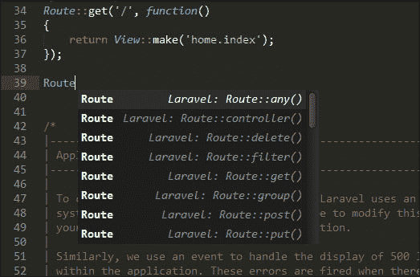
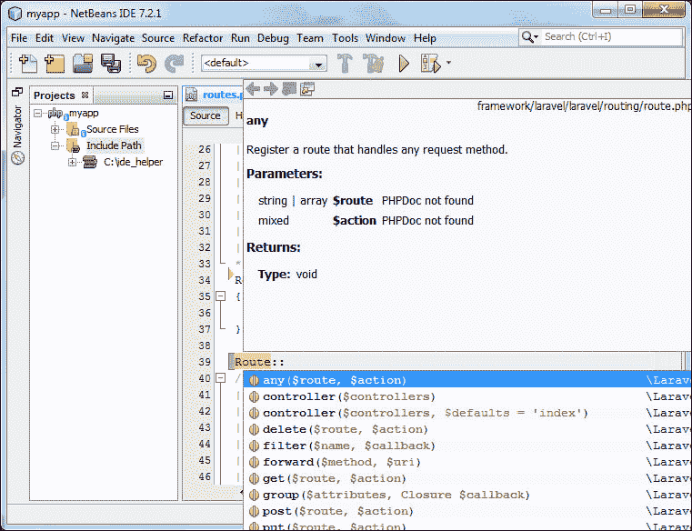

# 第一章. 设置和安装 Laravel

在本章中，我们将涵盖：

+   将 Laravel 安装为 git 子模块

+   在 Apache 中设置虚拟主机和开发环境

+   创建“干净”的 URL

+   配置 Laravel

+   使用 Sublime Text 2 与 Laravel

+   设置 IDE 以自动完成 Laravel 的命名空间

+   使用自动加载程序将类名映射到其文件

+   使用命名空间和目录创建高级自动加载程序

# 介绍

在本章中，我们将学习如何轻松地启动和运行 Laravel，并确保在进行任何核心更改时更新它变得简单。我们还将设置我们的开发和编码环境，以便非常高效，这样我们就可以专注于编写优秀的代码，而不必担心与我们的应用程序无关的问题。最后，我们将看一些方法，让 Laravel 自动为我们做一些工作，这样我们就能在很短的时间内扩展我们的应用程序。

# 将 Laravel 安装为 git 子模块

也许有一段时间，我们希望将我们的 Laravel 安装与我们的公共文件的其余部分分开。在这种情况下，将 Laravel 安装为 git 子模块将是一个解决方案。这将允许我们通过 git 更新我们的 Laravel 文件，而不影响我们的应用程序代码。

## 准备工作

要开始，我们应该让我们的开发服务器运行，并安装 git。在服务器的 web 目录中，创建一个`myapp`目录来保存我们的文件。安装将在命令行中完成。

## 操作步骤...

要完成这个步骤，请按照以下步骤进行：

1.  在您的终端或命令行中，导航到`myapp`的根目录。第一步是初始化 git 并下载我们的项目文件：

```php
**$ git init**
**$ git clone git@github.com:laravel/laravel.git**

```

1.  由于我们只需要`public`目录，所以移动到`/laravel`并删除其他所有内容：

```php
**$ cd laravel**
**$ rm –r app bootstrap vendor**

```

1.  然后，回到根目录，创建一个`framework`目录，并将 Laravel 添加为子模块：

```php
**$ cd ..**
**$ mkdir framework**
**$ cd framework**
**$ git init**
**$ git submodule add https://github.com/laravel/laravel.git**

```

1.  现在我们需要运行 Composer 来安装框架：

```php
**php composer.phar install**

```

### 提示

有关安装 Composer 的更多信息，请访问[`getcomposer.org/doc/00-intro.md`](http://getcomposer.org/doc/00-intro.md)。本书的其余部分将假定我们正在使用`composer.phar`，但我们也可以将其全局添加，并通过键入`composer`来简单调用它。

1.  现在，打开`/laravel/public/index.php`并找到以下行：

```php
**require __DIR__.'/../bootstrap/autoload.php';**
**$app = require_once __DIR__.'/../bootstrap/start.php';**

```

1.  将前面的行改为：

```php
**require __DIR__.'/../../framework/laravel/bootstrap/autoload.php';**
**$app = require_once __DIR__.'/../../framework/laravel/bootstrap/start.php';**

```

## 它是如何工作的...

对许多人来说，简单运行`git clone`就足以让他们的项目运行起来。然而，由于我们希望我们的框架作为一个子模块，我们需要将这些文件与我们的项目分开。

首先，从 GitHub 下载文件，由于我们不需要任何框架文件，我们可以删除除了我们的公共文件夹之外的所有内容。然后，在`framework`目录中创建我们的子模块，并下载所有内容。完成后，我们运行`composer install`来安装所有供应商包。

为了将框架连接到我们的应用程序，我们修改`/laravel/public/index.php`并将`require`路径更改为我们的框架目录。这将让我们的应用程序准确地知道框架文件的位置。

## 还有更多...

一个替代方案是将`public`目录移动到我们服务器的根目录。然后，在更新我们的`index.php`文件时，我们将使用`__DIR__ . '/../framework/laravel/bootstrap'`来正确包含所有内容。

# 在 Apache 中设置虚拟主机和开发环境

在开发我们的 Laravel 应用程序时，我们需要一个 web 服务器来运行所有内容。在 PHP 5.4 及更高版本中，我们可以使用内置的 web 服务器，但如果我们需要一些更多的功能，我们将需要一个完整的 web 堆栈。在这个步骤中，我们将在 Windows 上使用 Apache 服务器，但任何带有 Apache 的操作系统都将类似。

## 准备工作

这个步骤需要一个最新版本的 WAMP 服务器，可在[`wampserver.com`](http://wampserver.com)上找到，尽管基本原则适用于 Windows 上的任何 Apache 配置。

## 操作步骤...

要完成这个步骤，请按照以下步骤进行：

1.  打开 WAMP Apache `httpd.conf`文件。它通常位于`C:/wamp/bin/apache/Apach2.#.#/conf`。

1.  找到`#Include conf/extra/httpd-vhosts.conf`一行，并删除第一个`#`。

1.  转到`extra`目录，打开`httpd-vhosts.conf`文件，并添加以下代码：

```php
<VirtualHost *:80>
    ServerAdmin {your@email.com}
    DocumentRoot "C:/path/to/myapp/public"
    ServerName myapp.dev
    <Directory "C:/path/to/myapp/public">
        Options Indexes FollowSymLinks
        AllowOverride all
        # onlineoffline tag - don't remove
        Order Deny,Allow
        Deny from all
        Allow from 127.0.0.1
    </Directory>
</VirtualHost>
```

1.  重新启动 Apache 服务。

1.  打开 Windows 主机文件，通常在`C:/Windows/System32/drivers/etc`，并在文本编辑器中打开`hosts`文件。

1.  在文件底部添加一行`127.0.0.1 myapp.dev`。

## 它是如何工作的...

首先，在 Apache 配置文件`httpd.conf`中，我们取消注释允许文件包含`vhosts`配置文件的行。您可以直接在`httpd.conf`文件中包含代码，但这种方法可以使事情更有条理。

在`httpd-vhosts.conf`文件中，我们添加我们的 VirtualHost 代码。`DocumentRoot`告诉服务器文件的位置，`ServerName`是服务器将查找的基本 URL。由于我们只想在本地开发中使用这个，我们确保只允许通过 IP`127.0.0.1`访问本地主机。

在`hosts`文件中，我们需要告诉 Windows 为`myapp.dev` URL 使用哪个 IP。重新启动 Apache 和我们的浏览器后，我们应该能够转到`http://myapp.dev`并查看我们的应用程序。

## 还有更多...

虽然这个配方特定于 Windows 和 WAMP，但同样的想法可以应用于大多数 Apache 安装。唯一的区别将是`httpd.conf`文件的位置（在 Linux Ubuntu 中，它在`/etc/apache2`中）和 DocumentRoot 的`public`目录的路径（在 Ubuntu 中，它可能类似于`/var/www/myapp/public`）。Linux 和 Mac OS X 的`hosts`文件将位于`/etc/hosts`中。

# 创建“干净”的 URL

在安装 Laravel 时，我们将使用的默认 URL 是`http://{your-server}/public`。如果我们决定删除`/public`，我们可以使用 Apache 的`mod_rewrite`来更改 URL。

## 准备工作

对于这个配方，我们只需要一个新安装的 Laravel 和一切都在正确配置的 Apache 服务器上运行。

## 如何做...

要完成这个配方，请按照以下步骤操作：

1.  在我们应用程序的根目录中，添加一个`.htaccess`文件并使用此代码：

```php
<IfModule mod_rewrite.c>
    RewriteEngine On
    RewriteRule ^(.*)$ public/$1 [L]
</IfModule>
```

1.  转到`http://{your-server}`并查看您的应用程序。

## 它是如何工作的...

这段简单的代码将接受我们在 URL 中添加的任何内容并将其指向`public`目录。这样，我们就不需要手动输入`/public`。

## 还有更多...

如果我们决定将此应用程序移至生产环境，这不是完成任务的最佳方式。在那种情况下，我们只需将文件移出 Web 根目录，并将`/public`作为我们的根目录。

# 配置 Laravel

安装 Laravel 后，它几乎可以立即使用，几乎不需要配置。但是，有一些设置我们要确保更新。

## 准备工作

对于这个配方，我们需要一个常规的 Laravel 安装。

## 如何做...

要完成这个配方，请按照以下步骤操作：

1.  打开`/app/config/app.php`并更新这些行：

```php
'url' => 'http://localhost/,
'locale' => 'en',
'key' => 'Seriously-ChooseANewKey',
```

1.  打开`app/config/database.php`并选择您首选的数据库：

```php
'default' => 'mysql',
'connections' => array(
    'mysql' => array(
        'driver'    => 'mysql',
        'host'      => 'localhost',
        'database'  => 'database',
        'username'  => 'root',
        'password'  => '',
        'charset'   => 'utf8',
        'collation' => 'utf8_unicode_ci',
        'prefix'    => '',
        ),
    ),
```

1.  在命令行中，转到应用程序的根目录，并确保`storage`文件夹是可写的：

```php
**chmod –R 777 app/storage**

```

## 它是如何工作的...

大部分配置将在`/app/config/app.php`文件中进行。虽然设置 URL 并不是必需的，而且 Laravel 在没有设置的情况下也能很好地解决这个问题，但最好是尽量减少框架的工作量。接下来，我们设置我们的位置。如果我们选择在应用程序中提供**本地化**，这个设置将是我们的默认设置。然后，我们设置我们的应用程序密钥，因为最好不要保留默认设置。

接下来，我们设置将使用的数据库驱动程序。Laravel 默认提供四种驱动程序：mysql、sqlite、sqlsrv（MS SQL Server）和 pgsql（Postgres）。

最后，我们的`app/storage`目录将用于保存任何临时数据，例如会话或缓存，如果我们选择的话。为了允许这一点，我们需要确保应用程序可以写入该目录。

## 还有更多...

要轻松创建一个安全的应用程序密钥，删除默认密钥并将其留空。然后，在命令行中，转到应用程序根目录并键入：

```php
**php artisan key:generate**

```

这将创建一个独特且安全的密钥，并自动保存在您的配置文件中。

# 使用 Sublime Text 2 与 Laravel

用于编码的最受欢迎的文本编辑器之一是 Sublime Text。Sublime 具有许多功能，使编码变得有趣，通过插件，我们可以添加特定于 Laravel 的功能来帮助我们的应用程序。

## 准备工作

Sublime Text 2 是一款非常可扩展的流行代码编辑器，使编写代码变得轻松。可以从[`www.sublimetext.com/2`](http://www.sublimetext.com/2)下载评估版本。

我们还需要在 Sublime 中安装并启用 Package Control 包，可以在[`wbond.net/sublime_packages/package_control/installation`](http://wbond.net/sublime_packages/package_control/installation)找到。

## 操作步骤...

按照以下步骤进行操作：

1.  在菜单栏中，转到**首选项**然后**包控制**：

1.  选择**安装包**：

1.  搜索`laravel`以查看列表。选择**Laravel 4 Snippets**并让其安装。安装完成后，选择**Laravel-Blade**并安装它。

## 工作原理...

Sublime Text 2 中的 Laravel 片段大大简化了编写常见代码，并且几乎包括了我们在应用程序开发中所需的一切。例如，当创建路由时，只需开始输入`Route`，然后会弹出一个列表，允许我们选择我们想要的路由，然后自动完成我们需要的其余代码。



## 还有更多...

安装 Laravel-Blade 包对于使用 Laravel 自带的 Blade 模板系统非常有帮助。它可以识别文件中的 Blade 代码，并自动突出显示语法。

# 设置 IDE 以自动完成 Laravel 的命名空间

大多数**IDEs**（集成开发环境）在程序的一部分中具有某种形式的代码完成。为了使 Laravel 的命名空间自动完成，我们可能需要帮助它识别命名空间是什么。

## 准备工作

对于这个操作，我们将在 NetBeans IDE 中添加命名空间，但是在其他 IDE 中的过程类似。

## 操作步骤...

按照以下步骤完成此操作：

1.  下载列出 Laravel 命名空间的预制文件：[`gist.github.com/barryvdh/5227822`](https://gist.github.com/barryvdh/5227822)。

1.  在计算机的任何位置创建一个文件夹来保存此文件。为了我们的目的，我们将文件添加到`C:/ide_helper/ide_helper.php`：

1.  在使用 Laravel 框架创建项目后，转到**文件** | **项目属性** | **PHP 包含路径**：

1.  单击**添加文件夹...**，然后添加`C:/ide_helper`文件夹。

1.  现在，当我们开始输入代码时，IDE 将自动建议完成的代码：

## 工作原理...

一些 IDE 需要帮助理解框架的语法。为了让 NetBeans 理解，我们下载了所有 Laravel 类和选项的列表。然后，当我们将其添加到包含路径时，NetBeans 将自动检查文件并显示自动完成选项。

## 还有更多...

我们可以使用 Composer 自动下载和更新文档。有关安装说明，请访问[`github.com/barryvdh/laravel-ide-helper`](https://github.com/barryvdh/laravel-ide-helper)。

# 使用 Autoloader 将类名映射到其文件

使用 Laravel 的 ClassLoader，我们可以轻松地在我们的代码中包含任何自定义类库，并使它们随时可用。

## 准备工作

对于这个操作，我们需要设置一个标准的 Laravel 安装。

## 操作步骤...

要完成此操作，请按照以下步骤进行操作：

1.  在 Laravel 的`/app`目录中，创建一个名为`custom`的新目录，其中将保存我们的自定义类。

1.  在`custom`目录中，创建一个名为`MyShapes.php`的文件，并添加以下简单代码：

```php
<?php
class MyShapes {
    public function octagon() 
    {
        return 'I am an octagon';
    }
}
```

1.  在`/app/start`目录中，打开`global.php`并更新`ClassLoader`，使其看起来像这样：

```php
ClassLoader::addDirectories(array(

    app_path().'/commands',
    app_path().'/controllers',
    app_path().'/models',
    app_path().'/database/seeds',
    app_path().'/custom',

));
```

1.  现在我们可以在应用程序的任何部分使用该类。例如，如果我们创建一个路由：

```php
Route::get('shape', function()
{
    $shape = new MyShapes;
    return $shape->octagon();
});
```

## 它是如何工作的...

大多数情况下，我们会使用 Composer 向我们的应用程序添加包和库。但是，可能有一些库无法通过 Composer 获得，或者我们想要保持独立的自定义库。为了实现这一点，我们需要专门的位置来保存我们的类库；在这种情况下，我们创建一个名为`custom`的目录，并将其放在我们的`app`目录中。

然后我们添加我们的类文件，确保类名和文件名相同。这既可以是我们自己创建的类，也可以是我们需要使用的传统类。

最后，我们将目录添加到 Laravel 的 ClassLoader 中。完成后，我们将能够在应用程序的任何地方使用这些类。

## 另请参阅

+   使用命名空间和目录创建高级自动加载器

# 使用命名空间和目录创建高级自动加载器

如果我们想确保我们的自定义类不会与应用程序中的任何其他类发生冲突，我们需要将它们添加到命名空间中。使用 PSR-0 标准和 Composer，我们可以轻松地将这些类自动加载到 Laravel 中。

## 准备工作

对于这个配方，我们需要设置一个标准的 Laravel 安装。

## 如何做...

要完成这个配方，请按照以下步骤进行：

1.  在`/app`目录中，创建一个名为`custom`的新目录，并在`custom`中创建一个名为`Custom`的目录，在`Custom`中创建一个名为`Shapes`的目录。

1.  在`/app/custom/Custom/Shapes`目录中，创建一个名为`MyShapes.php`的文件，并添加以下代码：

```php
<?php namespace Custom\Shapes;

class MyShapes {
    public function triangle() 
    {
        return 'I am a triangle';
    }
}
```

1.  在应用程序的根目录中，打开`composer.json`文件并找到`autoload`部分。更新它使其看起来像这样：

```php
"autoload": {
    "classmap": [
    "app/commands",
        "app/controllers",
        "app/models",
        "app/database/migrations",
        "app/database/seeds",
        "app/tests/TestCase.php",
    ],
    "psr-0": {
        "Custom": "app/custom"
    }
}
```

1.  在命令行中运行`composer`上的`dump-autoload`：

```php
**php composer.phar dump-autoload**

```

1.  现在我们可以通过其命名空间调用该类。例如，如果我们创建一个路由：

```php
Route::get('shape', function()
{
    $shape = new Custom\Shapes\MyShapes;
    return $shape->triangle();
});
```

## 它是如何工作的...

命名空间是 PHP 的一个强大补充，它允许我们使用类而不必担心它们的类名与其他类名发生冲突。通过在 Laravel 中自动加载命名空间，我们可以创建一组复杂的类，而不必担心类名与其他命名空间发生冲突。

为了我们的目的，我们通过 composer 加载自定义类，并使用 PSR-0 标准进行自动加载。

## 还有更多...

为了进一步扩展我们的命名空间类的使用，我们可以使用**IoC**将其绑定到我们的应用程序。更多信息可以在 Laravel 文档中找到[`laravel.com/docs/ioc`](http://laravel.com/docs/ioc)。

## 另请参阅

+   使用自动加载器将类名映射到其文件的配方
