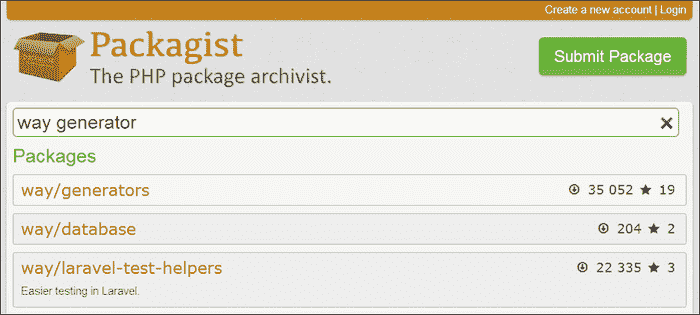
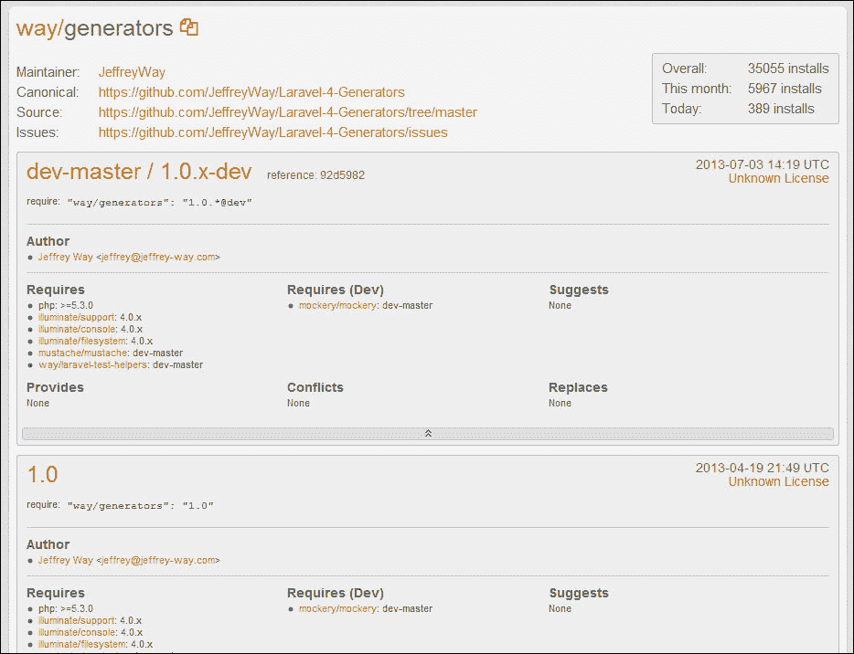
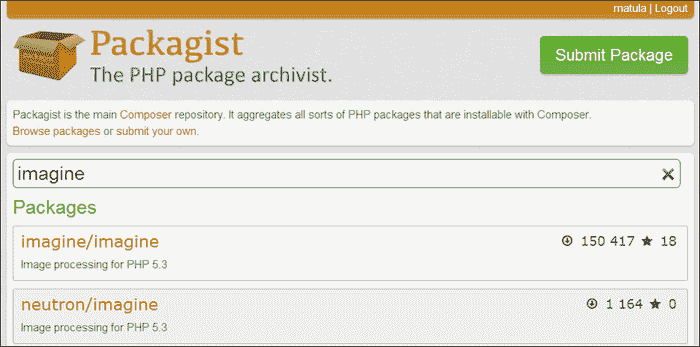
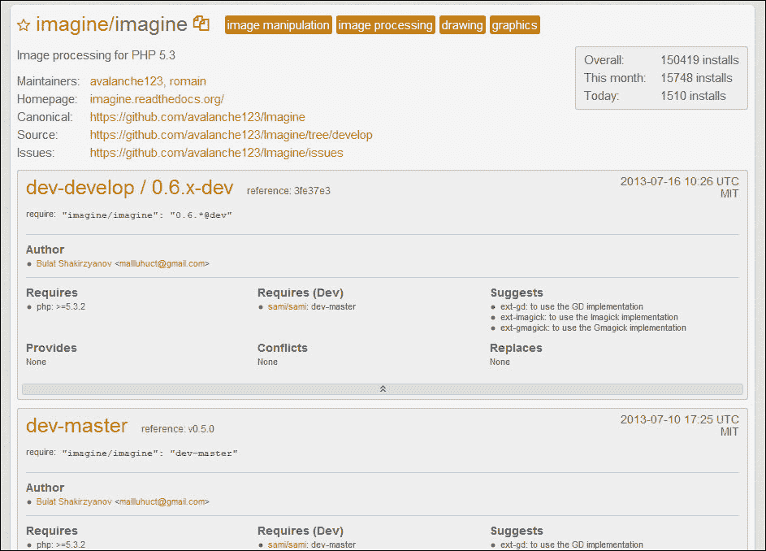
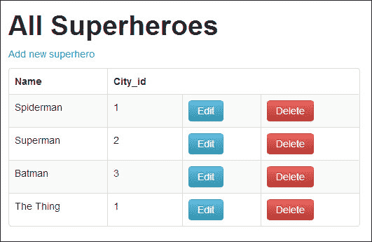
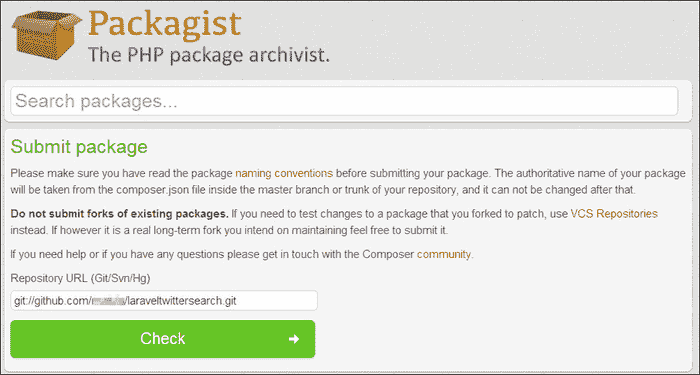

# 第七章：创建和使用 Composer 包

在本章中，我们将涵盖：

+   下载和安装包

+   使用生成器包设置应用程序

+   在 Laravel 中创建 Composer 包

+   将您的 Composer 包添加到 Packagist

+   将非 Packagist 包添加到 Composer

+   创建自定义 artisan 命令

# 介绍

Laravel 中的一个很棒的功能是我们可以轻松地使用包含其他人使用 bundles 制作的类库。在 Laravel 网站上，已经有许多有用的 bundles，其中一些自动化某些任务，而其他一些则可以轻松地与第三方 API 集成。

PHP 世界的最新补充是 Composer，它允许我们使用不特定于 Laravel 的库（或包）。

在本章中，我们将开始使用 bundles，并创建自己的 bundle 供其他人下载。我们还将看到如何将 Composer 整合到我们的 Laravel 安装中，以打开我们可以在应用程序中使用的各种 PHP 库。

# 下载和安装包

Laravel 最好的功能之一是它的模块化。大部分框架都是使用经过充分测试并在其他项目中广泛使用的库或**包**构建的。通过使用 Composer 进行依赖管理，我们可以轻松地包含其他包并将它们无缝地整合到我们的 Laravel 应用程序中。

对于这个配方，我们将在我们的应用程序中安装两个流行的包：Jeffrey Way 的 Laravel 4 生成器和`Imagine`图像处理包。

## 准备工作

对于这个配方，我们需要使用 Composer 进行 Laravel 的标准安装。

## 如何操作...

对于这个配方，我们将按照以下步骤进行：

1.  转到[`packagist.org/`](https://packagist.org/)。

1.  在搜索框中，搜索`way generator`，如下截图所示：

1.  点击**way/generators**的链接：

1.  在[`packagist.org/packages/way/generators`](https://packagist.org/packages/way/generators)查看详细信息，并注意获取包版本的**require**行。对于我们的目的，我们将使用**"way/generators": "1.0.*"**。

1.  在我们应用程序的根目录中，打开`composer.json`文件，并在`require`部分中添加包，使其看起来像这样：

```php
"require": {
       "laravel/framework": "4.0.*",
       "way/generators": "1.0.*"
},
```

1.  返回到[`packagist.org`](http://packagist.org)，并按照以下截图中显示的方式搜索`imagine`：

1.  点击**imagine/imagine**的链接，并复制**dev-master**的 require 代码：

1.  返回到我们的`composer.json`文件，并更新`require`部分以包括`imagine`包。现在它应该类似于以下代码：

```php
"require": {
      "laravel/framework": "4.0.*",
      "way/generators": "1.0.*",
      "imagine/imagine": "dev-master"
},
```

1.  打开命令行，在我们应用程序的根目录中，运行 Composer update 如下：

```php
php composer.phar update
```

1.  最后，我们将添加生成器服务提供者，因此打开`app/config/app.php`文件，并在 providers 数组中添加以下行：

```php
'Way\Generators\GeneratorsServiceProvider'
```

## 它是如何工作的...

要获取我们的包，我们首先转到[packagist.org](http://packagist.org)，并搜索我们想要的包。我们也可以点击**浏览包**链接。它将显示最近的包列表以及最受欢迎的包。点击我们想要的包后，我们将被带到详细页面，其中列出了各种链接，包括包的存储库和主页。我们还可以点击包的维护者链接，查看他们发布的其他包。

在下面，我们将看到包的各种版本。如果我们打开该版本的详细页面，我们将找到我们需要在`composer.json`文件中使用的代码。我们可以选择使用严格的版本号，为版本添加通配符，或者使用`dev-master`，这将安装包的主分支上更新的任何内容。对于`Generators`包，我们只会使用 1.0 版本，但允许对该版本进行任何次要修复。对于`imagine`包，我们将使用`dev-master`，因此无论版本号如何，都将下载其存储库的主分支中的内容。

然后我们在 Composer 上运行更新，它将自动下载并安装我们选择的所有包。最后，要在我们的应用程序中使用`Generators`，我们需要在应用程序的配置文件中注册服务提供者。

# 使用 Generators 包设置应用程序

`Generators`是一个流行的 Laravel 包，可以自动化相当多的文件创建。除了`controllers`和`models`之外，它还可以通过命令行界面生成`views`、`migrations`、`seeds`等等。

## 准备工作

对于这个示例，我们将使用由*Jeffrey Way*维护的 Laravel 4 Generators 包，该包在*下载和安装包*示例中安装。我们还需要一个正确配置的 MySQL 数据库。

## 操作步骤…

按照这个示例的步骤：

1.  在我们应用程序的根目录中打开命令行，并使用生成器按如下方式为我们的城市创建一个脚手架：

```php
**php artisan generate:scaffold cities --fields="city:string"**

```

1.  在命令行中，按如下方式为我们的超级英雄创建一个脚手架：

```php
**php artisan generate:scaffold superheroes --fields="name:string, city_id:integer:unsigned"**

```

1.  在我们的项目中，查看`app/database/seeds`目录，并找到名为`CitiesTableSeeder.php`的文件。打开它，并按如下方式向`$cities`数组中添加一些数据：

```php
<?php

class CitiesTableSeeder extends Seeder {

  public function run()
  {
    DB::table('cities')->delete();

    $cities = array(
         array(
                'id'         => 1,
                'city'       => 'New York',
                'created_at' => date('Y-m-d g:i:s',time())
              ),
         array(
                'id'         => 2,
                'city'       => 'Metropolis',
                'created_at' => date('Y-m-d g:i:s',time())
              ),
         array(
                'id'         => 3,
                'city'       => 'Gotham',
                'created_at' => date('Y-m-d g:i:s',time())
              )
    );

    DB::table('cities')->insert($cities);
  }
}
```

1.  在`app/database/seeds`目录中，打开`SuperheroesTableSeeder.php`并向其中添加一些数据：

```php
<?php

class SuperheroesTableSeeder extends Seeder {

  public function run()
  {
    DB::table('superheroes')->delete();

      $superheroes = array(
           array(
                 'name'       => 'Spiderman',
                 'city_id'    => 1,
                 'created_at' => date('Y-m-d g:i:s', time())
                 ),
           array(
                 'name'       => 'Superman',
                 'city_id'    => 2,
                 'created_at' => date('Y-m-d g:i:s', time())
                 ),
           array(
                 'name'       => 'Batman',
                 'city_id'    => 3,
                 'created_at' => date('Y-m-d g:i:s', time())
                 ),
           array(
                 'name'       => 'The Thing',
                 'city_id'    => 1,
                 'created_at' => date('Y-m-d g:i:s', time())
                 )
      );

    DB::table('superheroes')->insert($superheroes);
  }
}
```

1.  在命令行中，运行迁移，然后按如下方式对数据库进行种子处理：

```php
php artisan migrate
**php artisan db:seed**

```

1.  打开一个网页浏览器，转到`http://{your-server}/cities`。我们将看到我们的数据如下截图所示：

1.  现在，导航到`http://{your-server}/superheroes`，我们将看到我们的数据如下截图所示：

## 工作原理…

我们首先运行城市和超级英雄表的脚手架生成器。使用`--fields`标签，我们可以确定我们想要在表中的列，并设置数据类型等选项。对于我们的城市表，我们只需要城市的名称。对于我们的超级英雄表，我们希望得到英雄的名称以及他们居住的城市的 ID。

当我们运行生成器时，许多文件将自动为我们创建。例如，对于城市，我们将在我们的 models 中得到`City.php`，在 controllers 中得到`CitiesController.php`，在我们的 views 中得到一个`cities`目录，其中包括索引、显示、创建和编辑视图。然后我们得到一个名为`Create_cities_table.php`的迁移，一个`CitiesTableSeeder.php`种子文件，以及我们的`tests`目录中的`CitiesTest.php`。我们还将有我们的`DatabaseSeeder.php`文件和我们的`routes.php`文件更新以包含我们需要的一切。

为了向我们的表中添加一些数据，我们打开了`CitiesTableSeeder.php`文件，并更新了我们的`$cities`数组，其中包含我们想要添加的每一行的数组。我们对`SuperheroesTableSeeder.php`文件也做了同样的事情。最后，我们运行迁移和种子处理，我们的数据库将被创建，并且所有数据将被插入。

`Generators`包已经创建了我们需要操纵数据的视图和控制器，因此我们可以轻松地转到我们的浏览器并查看所有数据。我们还可以创建新行，更新现有行和删除行。

# 在 Laravel 中创建一个 Composer 包

使用 Laravel 的工作台，我们可以轻松创建一个可以由 Composer 使用和安装的包。我们还可以添加功能，使该包无缝集成到我们的 Laravel 应用程序中。在这个示例中，我们将创建一个简单的包，用于显示指定用户的 Vimeo 视频列表。

## 准备工作

对于这个示例，我们需要一个标准的 Laravel 安装。

## 如何做…

要完成这个示例，请按照以下步骤进行：

1.  在`app/config`目录中，打开`workbench.php`文件并使用以下信息进行更新：

```php
<?php

return array(

    'name' => 'Terry Matula',

    'email' => 'terrymatula@gmail.com',

);
```

1.  在命令行中，使用 artisan 来设置我们的包：

```php
**php artisan workbench matula/vimeolist --resources**

```

1.  找到将保存我们源文件的目录，并创建一个名为`Vimeolist.php`的文件。在这个示例中，我们将文件放在`workbench/matula/vimeolist/src/Matula/Vimeolist/`中：

```php
<?php namespace Matula\Vimeolist;

class Vimeolist
{
  private $base_url = 'http://vimeo.com/api/v2/{username}/videos.json';
  private $username;

  public function __construct($username = 'userscape') {
      $this->setUser($username);
      return $this;
  }

  /**
   * Set the username for our list
   *
   * @return void
   */
  public function setUser($username = NULL) {
      $this->username = is_null($username) ? $this->username : urlencode($username);
       return $this;
  }

  /**
   * Set up the url and get the contents
   *
   * @return json
   */
  private function getFeed() {
      $url  = str_replace('{username}', $this->username,$this->base_url);
      $feed = file_get_contents($url);
      return $feed;
  }

  /**
   * Turn the feed into an object
   *
   * @return object
   */
  public function parseFeed() {
       $json = $this->getFeed();
       $object = json_decode($json);
       return $object;
  }

  /**
   * Get the list and format the return
   *
   * @return array
   */
  public function getList() {
       $list = array();
       $posts = $this->parseFeed();
       foreach ($posts as $post) {
             $list[$post->id]['title']    = $post->title;
             $list[$post->id]['url']    = $post->url;
             $list[$post->id]['description'] = $post->description;
             $list[$post->id]['thumbnail'] = $post->thumbnail_small;
       }
       return $list;
  }
}
```

1.  在刚刚创建的文件所在的目录中，打开名为`VimeolistServiceProvider.php`的文件并更新它：

```php
<?php namespace Matula\Vimeolist;

use Illuminate\Support\ServiceProvider;

class VimeolistServiceProvider extends ServiceProvider {

  /**
   * Indicates if loading of the provider is deferred.
   *
   * @var bool
   */
  protected $defer = false;

  /**
   * Bootstrap the application events.
   *
   * @return void
   */
  public function boot()
  {
        $this->package('matula/vimeolist');
  }

  /**
   * Register the service provider.
   *
   * @return void
   */
  public function register()
  {
      $this->app['vimeolist'] = $this->app->share(function($app)
            {
             return new Vimeolist;
            });
  }

  /**
   * Get the services provided by the provider.
   *
   * @return array
   */
  public function provides()
  {
    return array('vimeolist');
  }
}
```

1.  在`app/config`目录中的`app.php`文件中，在`providers`数组中，添加我们的服务提供程序如下：

```php
'Matula\Vimeolist\VimeolistServiceProvider',
```

1.  在命令行中，运行以下命令：

```php
**php composer.phar dump-autoload**

```

1.  在`routes.php`中，添加一个显示数据的路由如下：

```php
Route::get('vimeo/{username?}', function($username = null) use ($app)
{
  $vimeo = $app['vimeolist'];
  if ($username) {
      $vimeo->setUser($username);
  }
  dd($vimeo->getList());
});
```

## 它是如何工作的…

我们的第一步是更新我们工作台的配置文件，以保存我们的姓名和电子邮件地址。然后，这将用于我们在 Laravel 中创建的任何其他包。

接下来，我们运行 artisan 命令来创建我们包所需的文件。通过使用`--resources`标志，它还将生成其他文件和目录，可以专门用于 Laravel。完成后，我们的工作台目录中将有一个包含所有包文件的新文件夹。在深入目录之后，我们将进入一个包含我们服务提供程序文件的目录，在这个目录中，我们将添加我们的类文件。

这个示例类将简单地从 Vimeo API 中获取用户的视频列表。我们有一些方法可以允许我们设置用户名，获取 API 端点的内容，将 JSON 转换为 PHP 对象，然后创建并返回一个格式化的数组。作为最佳实践，我们还应该确保我们的代码经过测试，并且我们可以将这些文件放在`test`目录中。

为了更好地与 Laravel 集成，我们需要更新服务提供程序。我们首先更新`register`方法并设置要传递给 Laravel 的`app`变量的名称，然后我们更新`provides`方法以返回包名称。接下来，我们需要更新我们的应用程序配置文件以实际注册服务提供程序。然后，一旦我们在 Composer 中运行`dump-autoload`命令，我们的新包将可供使用。

最后，我们创建一个与包交互的路由。我们将有一个可选参数，即用户名。我们还需要确保我们的路由中有`$app`变量。然后，当我们调用`$app['vimeolist']`时，服务提供程序将自动实例化我们的类，并允许我们访问 Vimeo 列表。对于我们的目的，我们只使用 Laravel 的`dd()`辅助函数来显示数据，但我们也可以将其传递给视图并使其看起来更好。

## 还有更多…

Laravel 还可以选择为我们的包创建一个门面，因此我们可以使用类似`$vimeo = Vimeolist::setUser()`的方式进行调用。还有许多其他可以在[`laravel.com/docs/packages`](http://laravel.com/docs/packages)文档中找到的包选项。

# 将您的 Composer 包添加到 Packagist

为了更容易地分发我们的包，我们应该将它们提交到网站[packagist.org](http://packagist.org)。在这个示例中，我们将看到如何在 GitHub 上设置我们的包并将其添加到 Packagist。

## 准备工作

对于这个示例，我们需要完成*Laravel 中创建 Composer 包*示例，并且我们还需要一个活跃的 GitHub 帐户。

## 如何做…

要完成这个示例，请按照以下步骤进行：

1.  在命令行中，移动到`workbench/matula/vimeolist`目录并设置我们的`git`仓库如下：

```php
git init
git add -A
git commit –m 'First Package commit'
```

1.  在[`github.com/new`](https://github.com/new)创建一个新的 GitHub 存储库，并将其命名为`vimeolist`。

1.  将我们的包添加到 GitHub：

```php
git remote add origin git@github.com:{username}/vimeolist.git
**git push –u origin master**

```

1.  前往[`packagist.org/login/`](https://packagist.org/login/)并使用您的 GitHub 帐户登录。

1.  单击以下截图中显示的绿色**提交包**按钮：

1.  在**存储库 URL**文本字段中，添加 GitHub 的只读 Git URL，如下截图所示：

1.  单击**检查**，如果一切正常，单击**提交**。

## 它是如何工作的...

我们首先在包的主目录中创建一个`git`存储库。然后我们在 GitHub 中为我们的文件创建一个存储库，将该远程存储库添加到我们的本地存储库，然后将我们的本地存储库推送到 GitHub。

在 Packagist 网站上，我们使用我们的 GitHub 帐户登录，并允许[packagist.org](http://packagist.org)访问。然后，我们使用来自我们存储库的 GitHub URL 在[`packagist.org/packages/submit`](https://packagist.org/packages/submit)提交我们的包。单击**检查**后，Packagist 将查看代码并将其格式化以供 Composer 使用。如果有任何错误，我们将收到提示需要做什么来修复它们。

如果一切正常，并且我们单击**提交**，我们的包将被列在 Packagist 网站上。

## 另请参阅

+   *在 Laravel 中创建一个 Composer 包*教程

# 向 Composer 添加一个非 Packagist 包

向我们的`composer.json`文件添加一行，并让 Composer 自动下载和安装一个包非常好，但它要求该包在[packagist.org](http://packagist.org)上可用。在这个教程中，我们将看到如何安装在 Packagist 上不可用的包。

## 准备工作

对于这个教程，我们将需要一个标准的 Laravel 安装。

## 如何做...

要完成这个教程，请按照以下步骤操作：

1.  在 GitHub 上，我们需要找到一个我们想要使用的包。在这个例子中，我们将使用在[`github.com/wesleytodd/Universal-Forms-PHP`](https://github.com/wesleytodd/Universal-Forms-PHP)找到的`UniversalForms`包。

1.  打开我们的主`composer.json`文件，并按以下方式更新`require`部分：

```php
"require": {
       "laravel/framework": "4.0.*",
       "wesleytodd/universal-forms": "dev-master"
  },
```

1.  在`composer.json`中，在`require`部分下，添加我们要使用的存储库：

```php
"repositories": [
     {
         "type": "vcs",
         "url": "https://github.com/wesleytodd/Universal-Forms-PHP"
     }
  ],
```

1.  在命令行中，按以下方式更新 Composer：

```php
**php composer.phar update**

```

1.  打开`app/config/app.php`文件，并使用以下行更新`providers`数组：

```php
'Wesleytodd\UniversalForms\Drivers\Laravel\UniversalFormsServiceProvider',
```

1.  在`routes.php`中，实例化该类，并在我们的路由上使用它，如下所示：

```php
$form_json = '{
       "action" : "uform",
       "method" : "POST",
       "fields" : [
             {
               "name" : "name",
               "type" : "text",
               "label" : "Name",
               "rules" : ["required"]
             },
             {
               "name" : "email",
               "type" : "email",
               "label" : "Email",
               "value" : "myemail@example.com",
               "rules" : ["required", "email"]
              },
              {
                "name" : "message",
                "type" : "textarea",
                "label" : "Message",
                "rules" : ["required", "length[30,0]"]
              }
       ]
}';

$uform = new Wesleytodd\UniversalForms\Drivers\Laravel\Form($form_json);

Route::get('uform', function() use ($uform)
{
  return $uform->render();
});

Route::post('uform', function() use ($uform)
{
  // validate
  $valid = $uform->valid(Input::all());
  if ($valid) {
       // Could also save to database
       dd(Input::all());
  } else {
       // Could redirect back to form
       dd($uform->getErrors());
  }
});
```

## 它是如何工作的...

我们的第一步是像其他 Composer 包一样添加所需包的行。但是，由于这个包在[packagist.org](http://packagist.org)上不可用，如果我们尝试更新 Composer，它将抛出错误。为了使其工作，我们需要添加一个 Composer 要使用的存储库。Composer 有许多不同的选项可用于使用其他存储库，它们可以在[`getcomposer.org/doc/05-repositories.md#vcs`](http://getcomposer.org/doc/05-repositories.md#vcs)找到。

接下来，我们更新 Composer，它将为我们安装包。由于这个包带有一个 Laravel 服务提供者，我们然后更新我们的配置文件以注册它。

现在我们可以在我们的应用程序中使用该包。对于我们的目的，我们将在路由之外实例化该类，并将其传递到路由的闭包中。然后我们可以像平常一样使用该库。这个特定的包将接受一个 JSON 字符串或文件，并自动为我们创建表单输出。

# 创建自定义 artisan 命令

Laravel 的 artisan 命令行工具使许多任务变得容易完成。如果我们想要创建自己的任务并使用 artisan 来运行它们，这个过程非常简单。在这个教程中，我们将看到如何创建一个 artisan 任务，自动在我们的`views`目录中创建一个 HTML5 骨架。

## 准备工作

对于这个教程，我们将需要一个标准的 Laravel 安装。

## 如何做...

要完成这个教程，请按照以下步骤操作：

1.  在命令行中，运行`artisan`命令来创建我们需要的文件：

```php
**php artisan command:make SkeletonCommand**

```

1.  在`app/commands`目录中，打开`SkeletonCommand.php`文件并按以下方式更新代码：

```php
<?php

use Illuminate\Console\Command;
use Symfony\Component\Console\Input\InputOption;
use Symfony\Component\Console\Input\InputArgument;
use Illuminate\Filesystem\Filesystem as File;

class SkeletonCommand extends Command {

  /**
   * The console command name.
   *
   * @var string
   */
  protected $name = 'skeleton:make';

  /**
   * The console command description.
   *
   * @var string
   */
  protected $description = 'Creates an HTML5 skeleton view.';

   /**
     * File system instance
     *
     * @var File
     */
    protected $file;

  /**
   * Create a new command instance.
   *
   * @return void
   */
  public function __construct()
  {
    parent::__construct();
    $this->file = new File();
  }

  /**
   * Execute the console command.
   *
   * @return void
   */
  public function fire()
  {
        $view = $this->argument('view');
        $file_name = 'app/views/' . $view;
        $ext = ($this->option('blade')) ? '.blade.php' :'.php';
            $template = '<!DOCTYPE html>
            <html>
            <head>
               <meta charset=utf-8 />
               <title></title>
               <link rel="stylesheet" type="text/css"media="screen" href="css/style.css" />
                <script type="text/javascript" src="http://ajax.googleapis.com/ajax/libs/jquery/2.0.3/jquery.min.js">
                </script>
                  <!--[if IE]>
                        <script src="http://html5shiv.googlecode.com/svn/trunk/html5.js"></script>
                  <![endif]-->
            </head>
            <body>
            </body>
            </html>';

            if (!$this->file->exists($file_name)) {
               $this->info('HTML5 skeleton created!');
               return $this->file->put($file_name . $ext,$template) !== false;
        } else {
             $this->info('HTML5 skeleton created!');
             return $this->file->put($file_name . '-' .time() . $ext, $template) !== false;
        }

    $this->error('There was a problem creating yourHTML5 skeleton');
       return false;
  }

  /**
   * Get the console command arguments.
   *
   * @return array
   */
  protected function getArguments()
  {
      return array(
           array('view', InputArgument::REQUIRED, 'The name of the view.'),
      );
  }

  /**
   * Get the console command options.
   *
   * @return array
   */
  protected function getOptions()
  {
     return array(
     array('blade', null, InputOption::VALUE_OPTIONAL, 'Use Blade templating?', false),
     );
  }

} 
```

1.  在`app/start`目录中，打开`artisan.php`文件并添加以下行：

```php
Artisan::add(new SkeletonCommand);
```

1.  在命令行中，测试新命令：

```php
**php artisan skeleton:make MyNewView --blade=true**

```

## 它是如何工作的...

我们的第一步是使用 artisan 的`command:make`函数，并传入我们想要使用的命令的名称。运行后，我们会在`app/commands`目录中找到一个与我们选择的名称相同的新文件。

在我们的`SkeletonCommand`文件中，我们首先添加一个名称。这将是 artisan 要响应的命令。接下来，我们设置一个描述，当我们列出所有 artisan 命令时将显示。

对于这个命令，我们将访问文件系统，因此我们需要确保添加 Laravel 的`Filesystem`类，并在我们的构造函数中实例化它。然后，我们来到`fire()`方法。这是我们想要运行的所有代码的地方。为了我们的目的，我们使用一个单一参数来确定我们的`view`文件名将是什么，如果`--blade`参数设置为`true`，我们将把它变成一个`blade`文件。然后，我们创建一个包含我们的 HTML5 骨架的字符串，尽管我们也可以将其制作成一个单独的文件并引入文本。

然后使用模板创建新文件作为我们的 HTML，并在控制台中显示成功消息。
