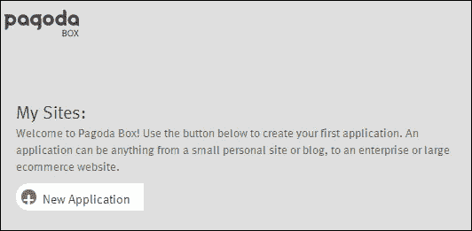
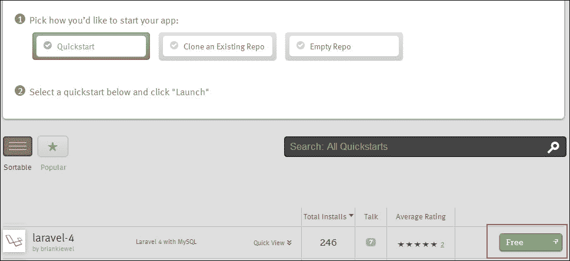
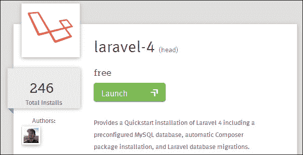
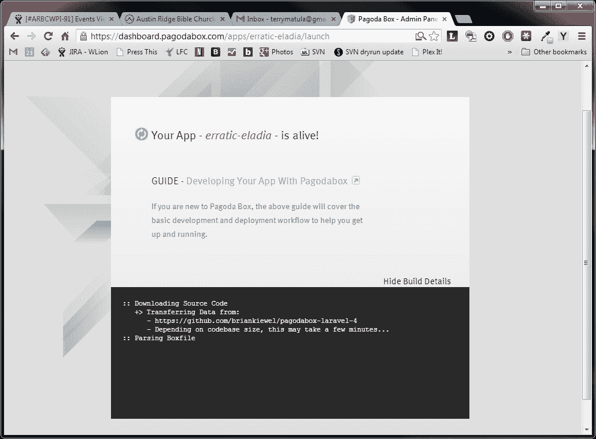
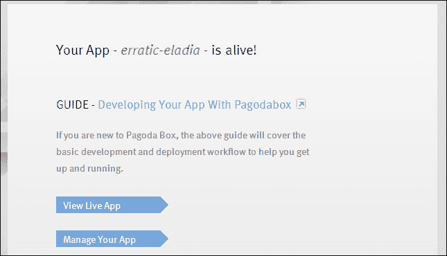

# 第十一章。将第三方服务部署和集成到您的应用程序中

在本章中，我们将涵盖：

+   创建队列并使用 Artisan 运行它

+   将 Laravel 应用程序部署到 Pagoda Box

+   在 Laravel 中使用 Stripe 支付网关

+   进行 GeoIP 查找并设置自定义路由

+   收集电子邮件地址并与第三方电子邮件服务一起使用

+   从 Amazon S3 存储和检索云内容

# 介绍

Web 应用程序通常会依赖第三方服务来帮助我们的应用程序运行。使用 Composer 和 Laravel，我们可以集成现有的代码，以便与这些服务进行交互。在本章中，我们将看到如何将我们的应用程序部署到 Pagoda Box，使用 Stripe 支付，进行 GeoIP 查找，使用第三方电子邮件服务，并将内容存储到云中。

# 创建队列并使用 Artisan 运行它

有时我们的应用程序需要在后台执行大量工作来完成任务。我们可以将它们添加到队列中，并稍后进行处理，而不是让用户等待任务完成。有许多队列系统可用，但 Laravel 有一些非常容易实现的。在本示例中，我们将使用 IronMQ。

## 准备工作

对于此示例，我们将需要一个安装良好的 Laravel 4，以及 IronMQ 的 API 凭据。可以在[`www.iron.io/`](http://www.iron.io/)创建免费帐户。

## 如何做...

要完成此示例，请按照给定的步骤进行操作：

1.  在`app/config`目录中，打开`queue.php`文件，将默认值设置为`iron`，并填写来自 IronMQ 的凭据。

1.  打开 Laravel 的`composer.json`文件并更新所需部分，使其类似于以下代码片段：

```php
"require": {
"laravel/framework": "4.0.*",
"iron-io/iron_mq": "dev-master"
}
```

1.  在命令行窗口中，使用以下命令更新 composer 文件：

```php
**php composer.phar update**

```

1.  安装完成后，打开`routes.php`文件并创建一个命中队列的路由：

```php
Route::get('queueships', function() {
$ships = array(
  array(
    'name' => 'Galactica',
    'show' => 'Battlestar Galactica'),
    array(
    'name' => 'Millennium Falcon',
    'show' => 'Star Wars'),
    array(
    'name' => 'USS Prometheus',
    'show' => 'Stargate SG-1')
);
$queue = Queue::push('Spaceship', array('ships' => 
$ships));
  return 'Ships are queued.';
});
```

1.  在`app/models`目录中创建一个名为`Spaceship.php`的文件，如下面的代码所示：

```php
<?php

class Spaceship extends Eloquent{

  protected $table = 'spaceships';

  public function fire($job, $data)
{
// Could be added to database here!
  Log::info('We can put this in the database: ' . print_r($data, TRUE));
  $job->delete();
}
}
```

1.  在浏览器中，转到`http://{your-url}}/public/queueships`，然后刷新几次。

1.  在 IronMQ 窗口中检查是否添加了新消息。

1.  打开命令行窗口并运行以下命令：

```php
 **php artisan queue:listen**

```

1.  几分钟后，查看`app/storage/logs`文件夹，并找到带有今天日期的文件。它将打印出我们添加到队列中的数组。

## 它是如何工作的...

首先，我们要确保在`config`文件中将 IronMQ 作为我们的默认队列驱动程序。如果我们想要使用另一个队列系统，可以在这里设置。然后，我们使用 composer 将 IronMQ 包安装到我们的应用程序中。这将添加我们需要的所有文件，以及 Iron 需要工作的任何依赖项。

此时，Laravel 已经设置好了使用我们选择的任何队列系统，因此我们可以开始使用它。我们首先在我们的路由中创建一个数据数组。这可以很容易地成为表单输入，因此我们希望等待处理的其他一些数据。然后，我们使用`Queue::push()`方法，设置应该使用的类（`Spaceship`），然后传递数据到该类。

如果我们现在转到这个路由，然后检查 IronMQ 队列，我们会看到有一个作业正在等待处理。我们的下一个任务是创建一个类来处理队列。为此，我们创建一个名为`Spaceship`的模型。我们需要创建一个`fire()`方法来解析我们从队列中获取的数据。在这里，我们可以将信息保存到数据库或进行其他一些繁重的处理。现在，我们只是将数据发送到日志文件。在`fire()`方法的末尾，我们确保删除作业。

如果我们转到我们的`queueships`路由并刷新几次，我们会看到我们的队列中有多个作业，但我们还没有处理它们。因此，在命令行中，我们运行 artisan 的`queue:listen`命令，这将开始处理我们的队列。很快，我们可以进入我们的日志目录，看到从队列中发送的信息。

## 还有更多...

我们可能需要队列的原因有很多。最常见的是处理图像或进行大量数据解析等。将我们想要从网站发送的任何电子邮件排队也很有用，而 Laravel 有一种特殊的方法可以使用`Mail::queue()`命令来实现。

# 将 Laravel 应用程序部署到 Pagoda Box

Pagoda Box 是一个流行的云托管服务，可以很容易地创建 Web 应用程序。有了 Laravel 的预制框，我们可以在云中创建自己的网站。

## 准备工作

为了完成此操作，我们需要在 Pagoda Box 拥有一个免费帐户，可以在[`dashboard.pagodabox.com/account/register`](https://dashboard.pagodabox.com/account/register)上获得。注册后，我们还需要在我们的帐户中添加一个 SSH 密钥。有关 SSH 密钥的更多信息，请访问[`help.pagodabox.com/customer/portal/articles/202068`](http://help.pagodabox.com/customer/portal/articles/202068)。

## 如何做...

要完成此操作，请按照给定的步骤进行：

1.  登录 Pagodabox 后，点击**新应用程序**选项卡，如下面的屏幕截图所示：

1.  确保选择**Quickstart**，然后向下滚动找到 laravel-4 quickstart。然后点击**免费**按钮，如下面的屏幕截图所示：

1.  在下一页中，点击**启动**按钮，如下面的屏幕截图所示：

1.  等待几分钟，直到所有内容都安装完成。

1.  完成后，点击蓝色的**管理您的应用**按钮，如下面的屏幕截图所示：

1.  复制 git clone URL，如下面的屏幕截图所示：

1.  在命令行窗口中，转到服务器的根目录并运行 git clone 命令。在我们的情况下，它将是：

```php
**git clone git@git.pagodabox.com:erratic-eladia.git pagodaapp**

```

1.  下载所有内容后，打开`app/routes.php`文件并添加一个路由，以便我们可以根据以下代码进行测试：

```php
Route::get('cool', function()
{
  return 'Pagoda Box is awesome!';
});
```

1.  在命令行窗口中，提交以下更改并将其发送回 Pagoda Box

```php
 **git commit –am 'Added route'**
 **git push origin master**

```

1.  Pagoda Box 完成更改后，转到新路由查看是否有效。在我们的情况下，它将是[`erratic-eladia.gopagoda.com/cool`](http://erratic-eladia.gopagoda.com/cool)。

## 工作原理...

如果我们想要托管我们的应用程序并确保它是可扩展的，我们可能需要考虑使用云托管服务。这将使我们能够在出现大量流量时提高其性能，并在流量减少时降低性能。一个与 PHP 和 Laravel 兼容的优秀主机是 Pagoda Box。Pagoda Box 还有一个非常好的免费选项，可以让我们测试并创建一个完整的应用程序而无需付费。

首先，在 Pagoda Box 仪表板中，我们创建一个新应用程序并选择我们想要使用的 Quickstart 包。列表中有一个方便的 Laravel 4 安装；如果我们选择它，所有依赖项都将被安装。

设置完成后，我们可以复制 git clone 代码并将文件下载到本地服务器。下载后，我们可以进行任何更新并提交。将其推送回 Pagoda Box 后，我们的更新代码将自动部署，并且我们将在实时站点上看到更改。

## 还有更多...

还有其他与 Laravel 兼容的云托管提供商。它们通常都有免费选项，因此我们可以尝试它们。其他一些主机如下：

+   Engine Yard [`www.engineyard.com/`](https://www.engineyard.com/)

+   Digital Ocean [`www.digitalocean.com/`](https://www.digitalocean.com/)

+   Heroku（有隐藏的 PHP 支持）[`www.heroku.com/`](https://www.heroku.com/)

# 使用 Stripe 支付网关与 Laravel

电子商务网站是网站开发中的一个持续的重点。过去，诸如信用卡处理之类的事情一直很困难，学习曲线非常陡峭。使用 Laravel 和 Stripe 服务，提供信用卡交易变得更容易。

## 准备工作

对于这个食谱，我们需要一个正常安装的 Laravel 4 和 Stripe 的正确凭据。可以在[`stripe.com/`](https://stripe.com/)创建一个免费的 Stripe 账户。

## 如何做...

要完成这个食谱，请按照以下步骤进行：

1.  打开应用的`composer.json`文件，并更新`require`部分以类似以下代码片段的方式进行更新：

```php
"require": {
  "laravel/framework": "4.0.*",
  "stripe/stripe-php": "dev-master"
},
```

1.  在命令行窗口中，使用以下命令运行 composer update：

```php
 **php composer.phar update**

```

1.  在`app/config`目录中，创建一个名为`stripe.php`的新文件，使用以下代码：

```php
<?php

return array(
  'key' => 'fakeKey-qWerTyuuIo4f5'
);
```

1.  在`routes.php`文件中，添加一个`Route`到付款表单，如下所示的代码：

```php
Route::get('pay', function()
{
  return View::make('pay');
});
```

1.  在`app/views`文件夹中，使用以下代码片段创建一个名为`pay.blade.php`的文件，用于我们的表单：

```php
{{ Form::open(array('url' => 'pay', 'method' => 'post')) }}
  Card Number: {{ Form::text('cc_number', 
    '4242424242424242') }}<br>

  Expiration (month):
    {{ Form::select('cc_exp_month', array(1 => '01', 2 => 
    '02', 3 => '03', 4 => '04', 5 => '05',6 => '06', 7 => 
    '07', 8 => '08', 9 => '09', 10 => '10', 11 
    => '11', 12 => '12')) }}<br>

  Expiration (year):
    {{ Form::select('cc_exp_year', array(2013 => 2013,
    2014 => 2014, 2015 => 2015, 2016 => 2016)) }}<br>

  {{ Form::submit('Charge $37 to my card') }}
  {{ Form::close() }}
```

1.  回到`routes.php`，创建一个`Route`来接受表单提交，并按照以下代码对卡进行收费：

```php
Route::post('pay', function()
{
  Stripe::setApiKey(Config::get('stripe.key'));
  $chargeCard = array(
    'number' => Input::get('cc_number'),
    'exp_month' => Input::get('cc_exp_month'),
    'exp_year'  => Input::get('cc_exp_year')
);
  $charge = Stripe_Charge::create(array('card' => 
    $chargeCard, 'amount' => 3700, 'currency' => 'usd'));

// Save returned info here
  var_dump($charge);
});
```

## 工作原理...

我们首先将 Stripe 包添加到我们的 composer 文件中并进行更新。这将安装 Stripe 代码，以及如果需要的话任何依赖项。然后我们需要创建一个配置文件来保存我们的 API 密钥。在这里，我们可以创建另一个与我们的环境变量相同的目录，并将文件添加到那里。因此，如果我们有一个开发和一个生产服务器，我们可以在`app/config/development`目录中有一个 Stripe `config`文件，其中保存我们的测试 API 密钥，然后在`app/config/production`目录中有一个文件来保存我们的生产 API 密钥。

接下来，我们需要一个表单，让用户输入他们的信用卡信息。我们创建一个`pay`路由来显示我们的`pay`视图。在该视图中，我们将使用 Blade 模板来创建表单。Stripe 所需的最少信息是卡号和到期日，尽管有时我们可能需要获取卡的 CVV 码或用户的地址。

在表单提交后，我们使用 API 密钥创建一个 Stripe 实例。然后我们将信用卡信息添加到一个数组中。最后，我们将金额（以美分为单位）、卡数组和货币发送到 Stripe 进行处理。

然后可以将从 Stripe 返回的数据添加到数据库中，或者进行其他跟踪。

## 还有更多...

Stripe 提供了许多易于使用的方法来管理信用卡交易，甚至订阅等事项。有关更多信息，请务必查看[`stripe.com/docs`](https://stripe.com/docs)上提供的文档。

# 进行 GeoIP 查找和设置自定义路由

也许我们的应用程序在某些时候需要根据用户所在的国家/地区提供不同的页面。使用 Laravel 和 MaxMind 的 GeoIP 数据，我们可以根据用户的 IP 地址查找其所在的国家/地区，然后将其重定向到我们需要的页面。

## 准备工作

对于这个食谱，我们只需要一个正常的 Laravel 4 安装。

## 如何做...

要完成这个食谱，请按照以下步骤进行：

1.  打开`composer.json`文件并更新`require`部分，使其看起来像以下代码片段：

```php
"require": {
  "laravel/framework": "4.0.*",
  "geoip/geoip": "dev-master"
},
```

1.  在命令行窗口中，使用以下命令运行 composer update：

```php
 **php composer.phar update**

```

1.  转到[`dev.maxmind.com/geoip/legacy/geolite/`](http://dev.maxmind.com/geoip/legacy/geolite/)并下载最新的**GeoLite Country**数据库。解压缩并将`GeoIP.dat`文件放在我们应用的根目录中。

1.  在`app/config`目录中，创建一个名为`geoip.php`的文件，使用以下代码：

```php
<?php

return array(
  'path' => realpath("path/to/GeoIP.dat")
);
```

1.  打开`app/filters.php`文件，并添加一个用于我们的`geoip`文件的过滤器，使用以下代码：

```php
  Route::filter('geoip', function($route, $request, $value = NULL)
{
  $ip = is_null($value) ? Request::getClientIp() : $value;
  $gi = geoip_open(Config::get('geoip.path'), GEOIP_STANDARD);
  $code = geoip_country_code_by_addr($gi, $ip);
  return Redirect::to('geo/' . strtolower($code));
});
```

1.  在我们的`routes.php`文件中，创建一个路由来应用过滤器，并创建一个接受国家代码的路由，如下所示的代码：

```php
Route::get('geo', array('before' => 'geoip:80.24.24.24', function()
{
return '';
}));
Route::get('geo/{country_code}', function($country_code)
{
return 'Welcome! Your country code is: ' . $country_code;
});
```

## 工作原理...

我们首先通过将其添加到我们的`composer.json`文件并进行更新来安装`geoip`库。一旦下载完成，我们就可以下载 MaxMind 的免费`geoip`数据文件并将其添加到我们的应用程序中。在我们的情况下，我们将文件放在我们的应用程序的根目录中。然后，我们需要创建一个`config`文件，用于保存`geoip`数据文件的位置。

接下来，我们想要检查用户的 IP 地址并将他们重定向到特定国家的页面。为此，我们将使用 Laravel 的 before 过滤器。它从设置`$ip`变量开始。如果我们手动传递一个 IP 地址，那就是它将使用的；否则，我们运行`Request::getClientIp()`方法来尝试确定它。一旦我们有了 IP 地址，我们就通过`geoip`函数运行它来获取 IP 地址的国家代码。然后我们将用户重定向到带有国家代码作为参数的路由。

然后我们创建一个路由来添加过滤器。在我们的情况下，我们将手动传递一个 IP 地址给过滤器，但如果没有，它将尝试使用用户的地址。我们的下一个路由将以国家代码作为参数。在这一点上，我们可以根据国家提供自定义内容，甚至自动设置要使用的语言文件。

# 收集电子邮件地址并与第三方电子邮件服务一起使用

电子邮件列表和通讯简报仍然是与大量人群沟通的一种流行和高效的方式。在这个步骤中，我们将使用 Laravel 和免费的 MailChimp 服务来建立一个收集电子邮件订阅的简单方式。

## 准备工作

对于这个步骤，我们将需要一个可用的 Laravel 4 安装，以及在 Mailchimp 帐户部分生成的[`mailchimp.com/`](http://mailchimp.com/)免费帐户和 API 密钥。我们还需要在 Mailchimp 中创建至少一个列表。

## 如何做...

要完成这个步骤，请按照以下步骤操作：

1.  在`app`目录中，创建一个名为`libraries`的新目录。

1.  从[`apidocs.mailchimp.com/api/downloads/#php`](http://apidocs.mailchimp.com/api/downloads/#php)下载 Mailchimp 的 API 库，然后解压缩并将文件`MCAPI.class.php`放入新的`libraries`文件夹中。

1.  打开 Laravel 的`composer.json`文件，并将 libraries 目录添加到`autoload`部分。该部分应该类似于以下代码片段：

```php
"autoload": {
    "classmap": [
    "app/commands",
    "app/controllers",
    "app/models",
    "app/database/migrations",
    "app/database/seeds",
    "app/tests/TestCase.php",
    "app/libraries"
]
},

```

1.  打开命令行窗口，并运行 composer 的`dump-autoload`命令，如下所示：

```php
 **php composer.phar dump-autoload**

```

1.  在`app/config`目录中，创建一个名为`mailchimp.php`的文件，并使用以下代码：

```php
<?php

return array(
  'key' => 'mykey12345abcde-us1',
  'list' => 'q1w2e3r4t5'
);
```

1.  要获取我们的 Mailchimp 列表，并查看它们的 ID，请打开`routes.php`文件并添加一个新的路由，如下所示：

```php
Route::get('lists', function()
{
  $mc = new MCAPI(Config::get('mailchimp.key'));
  $lists = $mc->lists();

  if($mc->errorCode) {
    echo 'Error loading list: ' . $mc->errorMessage;
  } else {
    echo '<h1>Lists and IDs</h1><h3>Total lists: '
    $lists['total'] . '</h3>';
  foreach($lists['data'] as $list) {
   echo '<strong>' . $list['name'] . ':</strong> ' .
   $list['id'] . '<br>';
}
}
});

```

1.  在`routes.php`文件中，使用以下代码创建一个路由来显示`subscribe`表单：

```php
Route::get('subscribe', function()
{
  return View::make('subscribe');
});
```

1.  在`app/views`目录中，创建一个名为`subscribe.blade.php`的文件，如下所示：

```php
  {{ Form::open() }}
  First Name: {{ Form::text('fname') }} <br>
  Last Name: {{ Form::text('lname') }} <br>
  Email: {{ Form::text('email') }} <br>
  {{ Form::submit() }}
  {{ Form::close() }}
```

1.  在`routes.php`文件中，创建一个路由来接受和处理表单提交，如下所示：

```php
Route::post('subscribe', function()
{
  $mc = new MCAPI(Config::get('mailchimp.key'));

  $merge_vars = array('FNAME' => Input::get('fname'), 'LNAME' => Input::get('lname'));
  $ret = $mc->listSubscribe(Config::get('mailchimp.list'), Input::get('email'), $merge_vars);

if ($mc->errorCode){
  return 'There was an error: ' . $mc->errorMessage;
} else {
  return 'Thank you for your subscription!';
}
});
```

## 它是如何工作的...

要开始这个步骤，我们需要添加 Mailchimp 的 PHP 库。由于我们不会使用 composer，我们需要设置一个目录来保存我们的非 composer 库。因此，我们在`app`文件夹中创建一个`libraries`目录，并在其中添加 Mailchimp。

为了让 Laravel 知道我们想要在新目录中`autoload`任何内容，我们需要更新`composer.json`文件。然后我们将目录位置添加到`Classmap`部分。然后我们需要运行 composer 的`dump-autoload`命令来重新创建我们的`autload`文件，并将其添加到我们的新目录中。

然后我们需要创建一个新的`config`文件来保存我们的 Mailchimp 凭据和我们想要使用的列表的 ID。我们可以从 Mailchimp 仪表板获取`list` ID，或者我们可以使用`lists`路由来显示它们。

为了捕获用户的电子邮件，我们创建一个路由和视图来保存我们的表单。这个表单也可以是一个弹出窗口、模态框或更大页面的一部分。我们要求他们的姓名和电子邮件，然后将其发布到 Mailchimp。

在我们的`post`路由中，我们只需要实例化 Mailchimp 类，创建一个数组来保存名称，并将所有内容发送到`listSubscribe()`方法。最后，我们检查来自 Mailchimp 的任何错误并显示成功消息。

## 还有更多...

Mailchimp 提供了一个非常广泛的 API，允许我们轻松管理我们的电子邮件列表。要查看他们提供的所有内容，请查看在线文档：[`apidocs.mailchimp.com/`](http://apidocs.mailchimp.com/)

# 从亚马逊 S3 存储和检索云内容

使用像亚马逊的 S3 这样的服务来存储我们的文件将使我们能够利用他们服务器的速度和可靠性。要使用该服务，我们可以轻松地实现一个 Laravel 包来处理我们上传到亚马逊的文件。

## 准备工作

对于这个食谱，我们需要一个可用的 Laravel 4 安装。我们还需要一个免费的亚马逊 AWS 账户，可以在以下网址注册：[`aws.amazon.com/s3/`](http://aws.amazon.com/s3/)

注册后，我们需要从“安全凭据”页面获取我们的**访问密钥 ID**和**秘密 ID**。此外，在 S3 管理控制台中，我们需要至少创建一个存储桶。对于这个食谱，我们将把存储桶命名为`laravelcookbook`。

## 如何做…

完成这个食谱，按照给定的步骤进行：

1.  打开 Laravel 的`composer.json`文件并添加亚马逊 SDK 包。要求部分应该类似于以下片段：

```php
"require": {
  "laravel/framework": "4.0.*",
  "aws/aws-sdk-php-laravel": "dev-master"
},
```

1.  打开命令行窗口，并使用 Composer 包安装包，如下所示：

```php
 **php composer.phar update**

```

1.  安装完成后，在`app/config`目录中，创建一个名为`aws.php`的文件，如下所示：

```php
<?php

return array(
  'key'    => 'MYKEY12345',
  'secret' => 'aLongS3cretK3y1234abcdef',
  'region' => '',
);
```

1.  在`app/config`目录中，打开`app.php`文件。在`providers`数组的末尾，按照以下代码添加 AWS 提供程序：

```php
  'Aws\Laravel\AwsServiceProvider',
```

1.  还在`app.php`文件中，在别名数组中，添加以下别名：

```php
  'AWS' => 'Aws\Laravel\AwsFacade',
```

1.  在我们的`routes.php`文件中，通过创建一个列出我们的`buckets`的路由来测试一切是否正常，如下所示：

```php
Route::get('buckets', function()
{
  $list = AWS::get('s3')->listBuckets();
    foreach ($list['Buckets'] as $bucket) {
    echo $bucket['Name'] . '<br>';
}
});

```

1.  要测试存储桶，请转到`http://{your-server}/buckets`，它应该显示我们设置的所有存储桶的列表。

1.  现在让我们创建一个用户上传图像的表单。我们首先创建一个包含表单的路由，如下所示：

```php
Route::get('cloud', function()
{
  return View::make('cloud');
});
```

1.  在`app/views`文件夹中，创建一个名为`cloud.blade.php`的文件，其中包含以下代码：

```php
  {{ Form::open(array('files' => true)) }}
  Image: {{ Form::file('my_image') }} <br>
  {{ Form::submit() }}
  {{ Form::close() }}
```

1.  回到`routes.php`文件，在下面的代码中创建一个路由来处理文件并将其上传到 S3：

```php
Route::post('cloud', function()
{
  $my_image = Input::file('my_image');
  $s3_name = date('Ymdhis') . '-' . $my_image
    >getClientOriginalName();
  $path = $my_image->getRealPath();

  $s3 = AWS::get('s3');
  $obj = array(
    'Bucket'     => 'laravelcookbook',
    'Key'        => $s3_name,
    'SourceFile' => $path,
    'ACL'        => 'public-read',
);

  if ($s3->putObject($obj)) {
  return
    Redirect::to('https://s3.amazonaws.com/laravelcookbook/
    ' . $s3_name);
} else {
  return 'There was an S3 error';
}
});

```

## 它是如何工作的…

我们首先通过安装亚马逊的 AWS SDK 来开始这个食谱。幸运的是，亚马逊发布了一个专门为 Laravel 4 设计的 composer 包，所以我们只需将其添加到我们的`composer.json`文件中并进行更新。

安装完成后，我们需要创建一个配置文件并添加我们的亚马逊凭据。我们还可以添加`region`（例如`Aws\Common\Enum\Region::US_WEST_2`），但是，如果我们将其留空，它将使用`US Standard`区域。然后我们更新我们的`app.php`配置，包括亚马逊提供的 AWS `ServiceProvider`和`Facade`。

如果我们已经在 S3 中有存储桶，我们可以创建一个路由来列出这些存储桶。它通过创建一个新的 S3 实例并简单调用`listBuckets()`方法开始。然后我们循环遍历`Buckets`数组并显示它们的名称。

我们的下一个目标是创建一个表单，用户可以在其中添加图像。我们创建一个名为`cloud`的路由，显示`cloud`视图。我们的视图是一个简单的 Blade 模板表单，只有一个`file`字段。然后该表单将被提交到`cloud`。

在我们的`cloud` post 路由中，我们首先使用`Input::file()`方法检索图像。接下来，我们通过在文件名的开头添加日期来为我们的图像创建一个新名称。然后我们获取上传图像的路径，这样我们就知道要发送到 S3 的文件是哪个。

接下来，我们创建一个 S3 实例。我们还需要一个数组来保存要发送到 S3 的值。`Bucket`只是我们想要使用的 S3 存储桶的名称，`Key`是我们想要给文件的名称，`SourceFile`是我们想要发送的文件的位置，然后`ACL`是我们想要给文件的权限。在我们的情况下，我们将`ACL`设置为`public-read`，这允许任何人查看图像。

我们的最后一步是调用`putObject()`方法，这应该将所有内容发送到我们的 S3 存储桶。如果成功，我们将重定向用户查看已上传的文件。

## 还有更多...

在我们的示例中，用户被迫等待图像上传到亚马逊之前才能继续。这将是一个使用队列处理一切的绝佳案例。

## 参见

+   *创建队列并使用 Artisan 运行它*的配方
