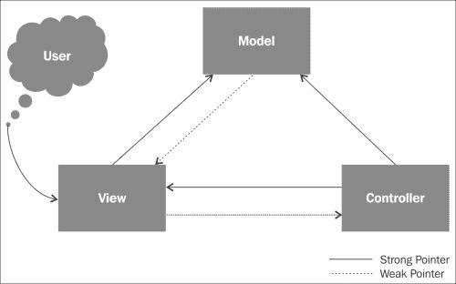
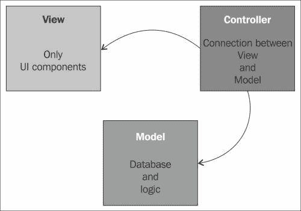

# 第三章：MVC 中的视图

在本章中，我们将讨论视图是什么，它的结构，它的目的，以及 Laravel 的视图层和 Blade 模板引擎的优势。

# 什么是视图？

Laravel 中的 View 指的是 MVC 中的 V。视图包括演示逻辑方面，如模板和缓存，以及涉及演示的代码。准确地说，视图定义了向用户呈现的内容。通常，控制器将数据传递给每个视图以某种格式呈现。视图也从用户那里收集数据。这是你可能在 MVC 应用程序中找到 HTML 标记的地方。

大多数现代 MVC，如 Laravel 框架，实现了一种模板语言，从 PHP 中添加了一个抽象层。添加层意味着增加了开销。在这里，我们坚持在模板中使用 PHP 的速度，但所有逻辑都留在外面。这使得用户界面（UI）设计师可以开发主题/模板，而无需学习任何编程语言。

在许多 MVC 实现中，视图层与控制器和模型进行通信。这种方法在以下图中得到了很好的解释：



正如你在上图中所看到的，视图与控制器和模型都有通信。乍一看，这似乎是一种使用面向对象编程语言开发应用程序的非常灵活的方法。在 MVC 的所有对象之间共享数据，并在应用程序的任何层中访问它们听起来非常酷。不幸的是，这种方法会导致一些依赖于项目规模的问题。

最主要的问题是在团队/开发人员之间分配开发任务的复杂性。如果你不设定开发规则，就会导致混乱的情况，比如无法管理的意大利面代码。此外，我们还必须考虑开发的额外成本，比如培训开发人员和相对较长的开发过程，这直接影响项目的成本。

正如我们在本书开头提到的，开发不仅涉及编码或共享任务，还包括规划和推广项目开发方法的过程。

Laravel 采用了一种不同的 MVC 方法。根据 Laravel，视图层应该只与控制器通信。模型与控制器通信。让我们看一下以下图：



正如你在上图中所看到的，应用程序的层完全分离。因此，你可以轻松地管理代码和开发团队。通常，我们在 MVC 中至少需要三个文件：模型文件、控制器文件和视图文件。让我们通过视图文件来解释视图。

# 视图对象

在你的应用程序中，通常会有多个包含表单、资产引用等的 HTML 页面；例如，如果你正在开发一个电子商务应用程序。在一个简单的电子商务系统中，有产品列表、类别、购物车和产品详细页面。这意味着我们需要四个模板和太多的数据呈现给用户。我们可以将视图层的对象分组如下：

+   HTML 元素（div、header、section 等）

+   HTML 表单元素（输入、选择等）

+   资产和 JavaScript 引用（.css 和.js）

当你在处理具有动态数据的项目时，分离模板文件并不能简化问题，因为你仍然需要编程语言函数来处理对象。这会导致我们不想面对的“意大利面代码”。当项目中的 HTML 文档中有内联 PHP 代码时，你将面临保持代码简单的问题。让我们来看一下以下代码中没有使用任何模板语言实现的通用模板文件内容：

```php
<!DOCTYPE html> 
<html lang="en"> 
<head> 
<title><?php echo $title; ?></title> 
<meta http-equiv="Content-Type" content="text/html; charset=utf-8" /> 
<meta http-equiv="x-ua-compatible" content="chrome=1" /> 
<meta name="description" content="<?php echo $meta_desc; ?>" /> 
<meta name="keywords" content="<?php echo $meta_keys; ?>" /> 
<meta name="robots" content="index,follow" /> 
<meta property="og:title" content="<?php echo $title; ?>" /> 
<meta property="og:site_name" content="<?php echo $site_name; ?>" /> 
<meta property="og:image" content="http://www.example.com/images/"<?php echo $thumbnail; ?> /> 
<meta property="og:type" content="product" /> 
<meta property="og:description" content="<?php echo $meta_desc; ?>" /> 
</head> 
<body> 
<?php 
if($user_name){ 
?>
<div class="username">Welcome <?php echo strtoupper($user_name); ?> !</div> 
<?php 
}else{ 

echo '<div class="username">Welcome Guest!</div>'; 

} 
?> 
</body> 
```

作为 UI 开发人员，你需要对 PHP 语言有一定的了解（至少要了解语言的语法）才能理解你看到的代码。正如我们在第一章中提到的，*设计和架构模式基础*，大多数现代 MVC 框架都附带了一个模板语言，用于在视图中使用。Laravel 附带了一个实现的模板语言用于视图；这就是 Blade 模板引擎，或者简称 Blade。

# 在 Laravel 中的视图

根据 Laravel 的 MVC 方法，视图处理来自控制器的数据。这意味着视图获取的数据通常已经按我们的需要格式化了。如果视图直接与模型通信，我们必须在视图层格式化、验证或过滤数据，就像前面示例代码中所示的那样。因此，让我们看看 Blade 模板文件在下面的代码中是什么样子的：

```php
<!DOCTYPE html> 
<html lang="en"> 
<head> 
<title>{{$title}}</title> 
<meta http-equiv="Content-Type" content="text/html; charset=utf-8" /> 
<meta http-equiv="x-ua-compatible" content="chrome=1" /> 
<meta name="description" content="{{$meta_desc}}" /> 
<meta name="keywords" content="{{$meta_keys}}" /> 
<meta name="robots" content="index,follow" /> 
<meta property="og:title" content="{{$title}}" />
<meta property="og:site_name" content="{{$site_name}}" /> 
<meta property="og:image" content="http://www.example.com/images/"{{$thumbnail}} /> 
<meta property="og:type" content="product" /> 
<meta property="og:description" content="{{$meta_desc}}" /> 

</head> 

<body> 
@if($user_name) 

<div class="username">Welcome {{$user_name}} !</div> 

@else 

<div class="username">Welcome Guest !</div> 

@endif 
</body>
```

没有 PHP 语法问题，也没有未闭合的括号问题。因此，我们有一个更清晰的模板文件。由于 Blade 内置的功能，我们可以得到更清晰的视图文件。通常，头部和底部部分在我们应用程序的所有页面中都是通用的。有两种方法可以添加它们。第一种不推荐的方法是将头部、底部和主体部分分别放在三个文件中，类似于下面的示例：

```php
@include('header')
<body> 
@if($user_name) 

<div class="username">Welcome {{Str::upper($user_name)}} !</div> 

@else 

<div class="username">Welcome Guest !</div> 

@endif 
</body>

@include('footer')
```

这种方式不推荐，因为它要求每个页面都包括头部和底部。这也意味着，如果我们添加右侧或左侧栏，我们将需要更改应用程序的所有视图。在 Blade 中实现这一点的最佳方式如下所示：

```php
<!D       OCTYPE html> 
<html lang="en"> 
<head> 
<title>{{$title}}</title> 
<meta http-equiv="Content-Type" content="text/html; charset=utf-8" /> 
<meta http-equiv="x-ua-compatible" content="chrome=1" /> 
<meta name="description" content="{{$meta_desc}}" /> 
<meta name="keywords" content="{{$meta_keys}}" /> 
<meta name="robots" content="index,follow" /> 
<meta property="og:title" content="{{$title}}" /> 
<meta property="og:site_name" content="{{$site_name}}" /> 
<meta property="og:image" content="http://www.example.com/images/"{{$thumbnail}} /> 
<meta property="og:type" content="product" /> 
<meta property="og:description" content="{{$meta_desc}}" /> 

</head> 

<body> 

   @yield('content')

</body>
```

上面的文件是我们的布局视图，例如，`master_layout.blade.php`。正如你所看到的，这里有一个用到`yield()`函数的内容函数。这是一个占位符；因此，当任何视图文件扩展了这个文件，名为`content`的部分将显示在`yield()`函数的位置。你可以在你的主布局中定义尽可能多的部分。所以，当我们想在一个视图文件中使用这个布局时，我们应该像下面的代码一样使用它：

```php
@extends('master_layout')

@section(''content')
<body> 
@if($user_name) 

<div class="username">Welcome {{Str::upper($user_name)}} !</div> 

@else 

<div class="username">Welcome Guest !</div> 

@endif 
</body>

@stop
```

就是这样！你可以在需要的视图中扩展主布局，并根据应用程序的需要创建多个布局。

# 总结

在这一章中，我们学习了 MVC 模式中视图的角色，以及 Laravel 对视图的处理方式。我们了解了 Blade 模板引擎函数的基础知识。更多信息，请参考 Laravel 的在线文档[`laravel.com/`](http://laravel.com/)。

在下一章中，我们将介绍控制器的角色，即 Laravel MVC 哲学中的主角。
