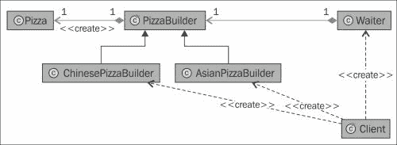
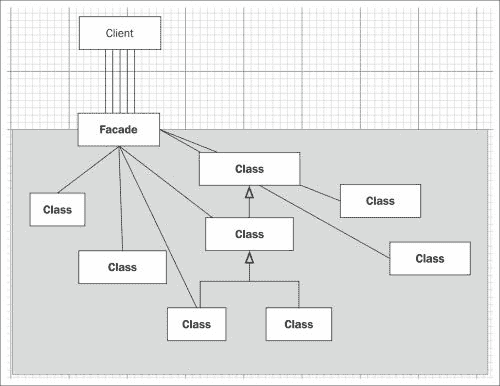

# 第五章：Laravel 中的设计模式

在本章中，我们将讨论 Laravel 使用的设计模式，以及它们的使用方式和原因，以示例说明。

本章将讨论以下主题：

+   Laravel 中使用的设计模式

+   Laravel 中使用这些模式的原因

# 建造者（管理者）模式

这种设计模式旨在获得更简单、可重用的对象。其目标是将更大、更复杂的对象构建层与其余部分分离，以便分离的层可以在应用程序的不同层中使用。

## 建造者（管理者）模式的需求

在 Laravel 中，`AuthManager`类需要创建一些安全元素，以便与选定的身份验证存储驱动程序（如 cookie、会话或自定义元素）重用。为了实现这一点，`AuthManager`类需要使用`Manager`类的存储函数，如`callCustomCreator()`和`getDrivers()`。

让我们看看建造者（管理者）模式在 Laravel 中的使用。要查看此模式中发生了什么，请导航到`vendor/Illuminate/Support/Manager.php`和`vendor/Illuminate/Auth/AuthManager.php`文件，如下面的代码所示：

```php
   public function driver($driver = null)
   {
      ...

   }

   protected function createDriver($driver)
   {
      $method = 'create'.ucfirst($driver).'Driver';

      ...
   }

   protected function callCustomCreator($driver)
   {
      return $this->customCreators$driver;
   }

   public function extend($driver, Closure $callback)
   {
      $this->customCreators[$driver] = $callback;

      return $this;
   }
   public function getDrivers()
   {
      return $this->drivers;
   }

   public function __call($method, $parameters)
   {
      return call_user_func_array(array($this->driver(), $method), $parameters);
   }
```

现在，导航到`/vendor/Illuminate/Auth/AuthManager.php`文件，如下面的代码所示：

```php
   protected function createDriver($driver)
   {

      ....
   }

   protected function callCustomCreator($driver)
   {

   }

   public function createDatabaseDriver()
   {

   }

   protected function createDatabaseProvider()
   {

      ....
   }

   public function createEloquentDriver()
   {
      ...

   }

   protected function createEloquentProvider()
   {
      ...

   }

   public function getDefaultDriver()
   {
      ...
   }

   public function setDefaultDriver($name)
   {
      ...
   }
```

正如我们在前面的代码中所看到的，`AuthManager`类是从`Manager`类继承而来的。Laravel 自带基本的身份验证机制。因此，我们需要将身份验证凭据存储在数据库中。首先，该类使用`AuthManager::setDefaultDriver()`函数检查我们的默认数据库配置。这个函数实际上使用`Manager`类进行 eloquent 操作。除了身份验证模型表名，所有数据库和身份验证选项（如 cookie 名称）都是从应用程序的配置文件中获取的。

为了更好地理解这种建造者（管理者）模式，我们可以以以下演示为例：



在前面的示例图中，我们假设我们想要从前面的示例中获取比萨等数据。客户点了两份比萨：一份亚洲比萨和/或一份中国比萨。这个比萨是通过`Waiter`类请求的。`PizzaBuilder`类（在我们的例子中是`Manager`类）根据`AuthRequest`请求制作了一份比萨，并通过服务员将比萨送到了客户那里。

此外，您可以导航到`vendor/Illuminate/Session/SessionManage.php`，查看在 Laravel 框架中使用此模式。

# 读累了记得休息一会哦~

**公众号：古德猫宁李**

+   电子书搜索下载

+   书单分享

+   书友学习交流

**网站：**[沉金书屋 https://www.chenjin5.com](https://www.chenjin5.com)

+   电子书搜索下载

+   电子书打包资源分享

+   学习资源分享

# 工厂模式

在这一小节中，我们将研究工厂模式及其在 Laravel 框架中的使用。工厂模式是基于创建模板方法对象的，这是基于在子类中定义类的算法来实现算法。在这种模式结构中，有一个从大的超类派生出来的子类。主类，我们可以称之为超类，只包含主要和通用的逻辑；子类是从这个超类派生出来的。因此，可能会有多个子类从这个超类中继承，这些子类旨在不同的目的。

与 Laravel 中使用的其他设计模式不同，`Factory`方法更具可定制性。对于扩展的子类加上主类，您不需要设置一个新的类，只需要一个新的操作。如果类或其组件通常发生变化，或者需要重写方法，就像初始化一样，这种方法是有益的。

在创建设计时，开发人员通常从在其应用程序中使用工厂模式开始。这种模式会转变为抽象工厂、建造者或原型模式。与工厂模式不同，原型模式需要初始化一次。由于模式的架构，工厂模式的方法（工厂方法）通常在模板方法内部调用。

工厂模式与抽象工厂或原型模式之间存在一些差异。它们如下：

+   与抽象工厂模式不同，工厂模式不能使用原型模式实现。

+   与原型模式不同，工厂模式不需要初始化，但需要子类化。与其他模式相比，这是一个优势。由于这种方法，工厂模式可以返回一个注入的子类而不是一个对象。

+   由于使用工厂模式设计的类可能直接返回子类给其他组件，因此不需要其他类或组件知道和访问构造方法。因此，建议所有构造方法和变量都应该是受保护的或私有的。

+   还有一件事需要考虑。由于这种模式可能返回针对确切需求的子类，因此不建议使用关键字 new 使用此模式的类创建新实例。

## 工厂模式的需求

Laravel 使用`Validation`类提供各种类型的验证规则。当我们开发应用程序时，通常需要在进行过程中验证数据。为了做到这一点，一个常见的方法是在模型中设置验证规则，并从控制器中调用它们。这里所说的“规则”既指验证类型又指其范围。

有时，我们需要设置自定义规则和自定义错误消息来验证数据。让我们看看它是如何工作的，以及我们如何能够扩展`Validation`类来创建自定义规则。MVC 模式中的控制器也可以被描述为模型和视图之间的桥梁。这可以通过一个现实世界的例子来最好地解释。

假设我们有一个新闻聚合网站。在管理面板中，管理员试图删除新闻项目。在 SOLID 设计模式中，如果管理员点击**删除新闻**按钮，就会发生这种情况。

首先，作为一个检查的例子，让我们打开`vendor/Illuminate/Validation/Factory.php`文件，如下所示：

```php
<?php namespace Illuminate\Validation;

use Closure;
use Illuminate\Container\Container;
use Symfony\Component\Translation\TranslatorInterface;

class Factory {

   protected $translator;

   protected $verifier;

   protected $container;

   protected $extensions = array();

   protected $implicitExtensions = array();

   protected $replacers = array();

   protected $fallbackMessages = array();

   protected $resolver;

   public function __construct(TranslatorInterface $translator, Container $container = null)
   {
      $this->container = $container;
      $this->translator = $translator;
   }

   public function make(array $data, array $rules, array $messages = array(), array $customAttributes = array())
   {

      $validator = $this->resolve($data, $rules, $messages, $customAttributes);

      if ( ! is_null($this->verifier))
      {
         $validator->setPresenceVerifier($this->verifier);
      }

      if ( ! is_null($this->container))
      {
         $validator->setContainer($this->container);
      }

      $this->addExtensions($validator);

      return $validator;
   }

      protected function addExtensions(Validator $validator)
   {
      $validator->addExtensions($this->extensions);

      $implicit = $this->implicitExtensions;

      $validator->addImplicitExtensions($implicit);

      $validator->addReplacers($this->replacers);

      $validator->setFallbackMessages($this->fallbackMessages);
   }

   protected function resolve(array $data, array $rules, array $messages, array $customAttributes)
   {
      if (is_null($this->resolver))
      {
         return new Validator($this->translator, $data, $rules, $messages, $customAttributes);
      }
      else
      {
         return call_user_func($this->resolver, $this->translator, $data, $rules, $messages, $customAttributes);
      }
   }

      public function extend($rule, $extension, $message = null)
   {
      $this->extensions[$rule] = $extension;

      if ($message) $this->fallbackMessages[snake_case($rule)] =  $message;
   }

   public function extendImplicit($rule, $extension, $message =  null)
   {
      $this->implicitExtensions[$rule] = $extension;

      if ($message) $this->fallbackMessages[snake_case($rule)] =  $message;
   }

   public function replacer($rule, $replacer)
   {
      $this->replacers[$rule] = $replacer;
   }

   public function resolver(Closure $resolver)
   {
      $this->resolver = $resolver;
   }

   public function getTranslator()
   {
      return $this->translator;
   }

   public function getPresenceVerifier()
   {
      return $this->verifier;
   }

   public function setPresenceVerifier(PresenceVerifierInterface $presenceVerifier
   {
      $this->verifier = $presenceVerifier;
   }

}
```

正如我们在前面的代码中所看到的，`Validation Factory`类是使用`Translator`类和一个 IoC 容器构建的。在此之后设置了`addExtensions()`函数。这个方法包括用户定义的扩展到`Validator`实例，从而允许我们编写创建`Validator`类的扩展的模板（结构）。这些公共函数允许我们实现`Translator`类，也就是说它们允许我们编写自定义验证规则和消息。参考以下**CarFactory**图表：


在上图中，你可以看到所有的汽车都是基于**CarFactory**（所有汽车的基础）的，无论品牌如何。对于所有品牌，主要过程是相同的（所有汽车都有发动机、轮胎、刹车、灯泡、齿轮等等）。你可能想要一辆**Suzuki**汽车或一辆**Toyota**汽车，根据这个选择，**SuzukiFactory**或**ToyotaFactory**从**CarFactory**创建一个**Suzuki**汽车或**Toyota**汽车。

# 存储库模式

存储库模式通常用于在应用程序的两个不同层之间创建接口。在我们的情况下，Laravel 的开发人员使用这种模式来在`NamespaceItemResolver`（解析命名空间并了解哪个文件在哪个命名空间中）和`Loader`（需要并将另一个类加载到应用程序中的类）之间创建一个抽象层。`Loader`类简单地加载给定命名空间的配置组。正如你可能知道的，几乎所有的 Laravel 框架代码都是使用命名空间开发的。

## 存储库模式的需求

假设您正在尝试使用 Eloquent ORM 从数据库中获取产品。在您的控制器中，该方法将是`Product::find(1)`。出于抽象目的，这种方法并不理想。如果您现在放置这样的代码，您的控制器知道您正在使用 Eloquent，这在一个良好和抽象的结构中理想情况下不应该发生。如果您想要包含对数据库方案所做的更改，以便类外的调用不直接引用字段而是通过存储库，您必须逐个查找所有代码。

现在，让我们为用户创建一个`imaginart`存储库接口（将在模式中使用的方法列表）。让我们称之为`UserRepository.php`。

```php
<?php namespace Arda\Storage\User;

interface UserRepository {

   public function all();

   public function get();

   public function create($input);

   public function update($input);

   public function delete($input);

   public function find($id);

}
```

在这里，您可以看到模型中使用的所有方法名称都是逐个声明的。现在，让我们创建存储库并将其命名为`EloquentUserRepository.php`：

```php
<?php namespace Arda\Storage\User;

use User;

class EloquentUserRepository implements UserRepository {

  public function all()
  {
    return User::all();
  }

  public function get()
  {
    return User::get();
  }

  public function create($input)
  {
    return User::create($input);
  }

  public function update($input)
  {
    return User::update($input);
  }

  public function delete($input)
  {
    return User::delete($input);
  }

  public function find($input)
  {
    return User::find($input);
  }

}
```

正如您所看到的，这个存储库类实现了我们之前创建的`UserRepository`。现在，您需要绑定这两个，这样当调用`UserRepositoryInterface`接口时，我们实际上获得了`EloquentUserRepository`。

这可以通过服务提供商或 Laravel 中的简单命令来完成，例如：

```php
App:bind(
   'Arda\Storage\User\UserRepository',
   'Arda\Storage\User\EloquentUserRepository'
);
```

现在，在您的控制器中，您可以简单地使用存储库作为`Use Arda\Storage\User\UserRepository as User`。

每当控制器使用`User::find($id)`代码时，它首先进入接口，然后进入绑定的存储库，这在我们的情况下是 Eloquent 存储库。通过这种方式，它进入 Eloquent ORM。这样，控制器就不可能知道数据是如何获取的。

# 策略模式

描述策略模式的最佳方法是通过一个问题。

## 策略模式的需求

在这种设计模式中，逻辑从复杂的类中提取到更简单的组件中，以便它们可以轻松地用更简单的方法替换。例如，您想在您的网站上显示热门博客文章。在传统方法中，您将计算受欢迎程度，进行分页，并列出与当前分页偏移和受欢迎程度相关的项目，并在一个简单的类中进行所有计算。这种模式旨在将每个算法分离成单独的组件，以便它们可以轻松地在应用程序的其他部分中重用或组合。这种方法还带来了灵活性，并使全局系统中更改算法变得容易。

为了更好地理解这一点，让我们来看一下位于`vendor/Illuminate/Config/LoaderInterface`的以下加载器接口：

```php
<?php namespace Illuminate\Config;

interface LoaderInterface {

   public function load($environment, $group, $namespace = null);

   public function exists($group, $namespace = null);

    public function addNamespace($namespace, $hint);

   public function getNamespaces();

   public function cascadePackage($environment, $package, $group, $items);

}
```

当我们查看代码时，`LoaderInterface`的工作将遵循一定的结构。`getNamespaces()`函数加载`app\config\app.php`文件中定义的所有命名空间。`addNamespace()`方法将命名空间作为分组传递给`load()`函数。如果`exist()`函数返回`true`，则至少有一个配置组属于给定命名空间。有关完整结构，您可以参考本章的存储库部分。因此，您可以通过`Loader`类的接口轻松调用您需要的方法，以加载各种配置选项。如果我们通过 composer 下载一个包，或者将一个包实现到正在编写的应用程序中，该模式使所有这些包都可用，并且可以从它们自己的命名空间中加载，而不会发生冲突，尽管它们位于不同的命名空间或具有相同的文件名。

# 提供程序模式

提供程序模式是由微软为在 ASP.NET Starter Kits 中使用而制定的，并在.NET 版本 2.0 中正式化（[`en.wikipedia.org/wiki/Provider_model`](http://en.wikipedia.org/wiki/Provider_model)）。它是 API 类和应用程序的业务逻辑/数据抽象层之间的中间层。提供程序是 API 的实现与 API 本身分离开来的。

这种模式及其目标和用法与策略模式非常相似。这就是为什么许多开发人员已经在讨论是否接受这种方法作为一种设计模式。

为了更好地理解这些模式，让我们打开`vendor/Illuminate/Auth/AuthServiceProvider.php`和`vendor/Illuminate/Hashing/HashServiceProvider.php`：

```php
<?php namespace Illuminate\Auth;

use Illuminate\Support\ServiceProvider;

class AuthServiceProvider extends ServiceProvider {

   protected $defer = true;

   public function register()
   {
      $this->app->bindShared('auth', function($app)
      {
           // Once the authentication service has actually been requested by the developer
          // we will set a variable in the application indicating this, which helps us
          // to know that we need to set any queued cookies in the after event later.
         $app['auth.loaded'] = true;

          return new AuthManager($app);
      });
   }

   public function provides()
   {
      return array('auth');
   }

}

<?php namespace Illuminate\Hashing;

use Illuminate\Support\ServiceProvider;

class HashServiceProvider extends ServiceProvider {

   protected $defer = true;

   public function register()
   {
      $this->app->bindShared('hash', function() { return new BcryptHasher; });
   }

   public function provides()
   {
      return array('hash');
   }

}
```

正如您所看到的，这两个类都扩展了`ServiceProvider`。`AuthServiceProvider`类允许我们在进行身份验证请求时向`AuthManager`提供所有服务，比如检查是否创建了 cookie 和会话，或者内容是否无效。在请求身份验证服务之后，开发人员可以通过`AuthDriver`来定义是否通过响应设置会话或 cookie。

然而，`HashServiceProvider`在进行安全哈希请求时为我们提供了相关的方法，这样我们就可以使用、获取、检查或对这些哈希进行其他操作。这两个提供者都将值作为数组返回。

# 外观模式

外观（façade）模式允许开发人员将各种复杂的接口统一到一个单一的类接口中。这种模式还允许您将来自各种类的各种方法包装成一个单一的结构。



在 Laravel 4 中，你可能已经知道，几乎每个方法都看起来像一个静态方法，例如，`Input::has()`，`Config::get()`，`URL::route()`，`View::make()`和`HTML::style()`。然而，它们并不是静态方法。如果它们是静态方法，那么对它们进行测试将会非常困难。它们实际上是这种行为的模拟。在后台，借助于 IoC 容器（一种将依赖项注入到类中的方法），Laravel 实际上通过`Facade`类调用另一个类（们）。Facade 基类受益于 PHP 自己的`__callStatic()`魔术方法来调用所需的方法，比如静态方法。

例如，假设我们有一个名为`URL::to('home')`的方法。让我们检查一下 URL 是什么，它指的是什么。首先，让我们打开`app/config/app.php`。在别名数组中，有一行如下：

```php
'URL' => 'Illuminate\Support\Facades\URL',
```

因此，如果我们调用`URL::to('home')`，我们实际上调用的是`Illuminate\Support\Facades\URL::to('home')`。

现在，让我们来看看文件里面有什么。打开`vendor/Illuminate/Support/Facades/URL.php`文件：

```php
<?php namespace Illuminate\Support\Facades;

class URL extends Facade {

   protected static function getFacadeAccessor() { return 'url'; }

}
```

正如您所看到的，该类实际上是从`Facade`类继承而来的，并且没有名为`to()`的静态方法。相反，有一个名为`getFacadeAccessor()`的方法，它返回字符串`url`。`getFacadeAccessor()`方法的目的是定义要注入什么。这样，Laravel 就明白了这个类正在寻找`$app['url']`。

这是在`vendor/Illuminate/Routing/RoutingServiceProvider.php`中定义的，如下所示：

```php
protected function registerUrlGenerator()
{
   $this->app['url'] = $this->app->share(function($app)
      {

      $routes = $app['router']->getRoutes();

      return new UrlGenerator($routes, $app->rebinding('request', function($app, $request)
      {
         $app['url']->setRequest($request);
      }));
   });
}
```

正如您所看到的，它返回了同一命名空间中`UrlGenerator`类的一个新实例，其中包含我们正在寻找的`to()`方法：

```php
//Illuminate/Routing/UrlGenerator.php
public function to($path, $extra = array(), $secure = null)
{
   //...
}
```

因此，每次你使用这样的方法时，Laravel 首先去检查 facade，然后检查通过注入的内容，然后通过`injected`类调用真正的方法。

# 总结

在本章中，我们了解了 Laravel PHP 框架中各种设计模式的用法，以及它们为什么被使用，它们可以解决什么问题。

在下一章中，我们将学习使用设计模式在 Laravel 项目中的最佳实践来创建应用程序。
