# 第四章：模块化网店应用的需求规范

从头开始构建软件应用程序需要多种技能，因为它不仅涉及编写代码。写下功能要求和勾画线框图通常是过程中的第一步，尤其是在我们处理客户项目时。这些步骤通常由开发人员以外的人员完成，因为它们需要对客户业务案例、用户行为等方面有一定的了解。作为一个更大的开发团队的一部分，我们作为开发人员通常会得到需求、设计和线框图，然后开始编码。独自完成项目，很容易忽略这些步骤，直接开始编码。然而，这种做法往往是低效的。制定功能要求和一些线框图是值得知道和遵循的技能，即使只是一个开发人员。

在本章后期，我们将讨论高级应用程序要求，以及一个粗略的线框图。

在本章中，我们将涵盖以下主题：

+   定义应用程序要求

+   线框图

+   定义技术栈：

+   Symfony 框架

+   基础框架

# 定义应用程序要求

我们需要构建一个简单但响应迅速的网店应用程序。为了做到这一点，我们需要列出一些基本要求。我们目前感兴趣的要求类型是那些涉及用户与系统之间互动的要求。在用户使用方面，最常见的两种规定要求的技术是用例和用户故事。用户故事是一种不太正式但足够描述要求的方式。使用用户故事，我们封装了客户和商店经理的行为，如下所述。

客户应该能够做到以下事情：

+   浏览静态信息页面（关于我们，客户服务）

+   通过联系表格联系店主

+   浏览商店分类

+   查看产品详情（价格，描述）

+   查看产品图片并放大查看（缩放）

+   查看特价商品

+   查看畅销产品

+   将产品添加到购物车

+   创建客户账户

+   更新客户账户信息

+   找回丢失的密码

+   结账

+   查看订单总成本

+   在几种付款方式中选择

+   在几种运输方式中选择

+   在下订单后收到电子邮件通知

+   检查订单状态

+   取消订单

+   查看订单历史

商店经理应该能够做到以下事情：

+   创建产品（至少包括以下属性：`标题`，`价格`，`sku`，`url-key`，`描述`，`数量`，`类别`和`图片`）

+   上传产品图片

+   更新和删除产品

+   创建分类（至少包括以下属性：`标题`，`url-key`，`描述`和`图片`）

+   上传图片到分类

+   更新和删除分类

+   在新的销售订单被创建时收到通知

+   在新的销售订单被取消时收到通知

+   按其状态查看现有销售订单

+   更新订单状态

+   禁用客户账户

+   删除客户账户

用户故事是一种方便的高级方式来记录应用程序要求。作为敏捷开发的一种特别有用的方式。

# 线框图

有了用户故事，让我们把重点转向实际的线框图。出于我们稍后会讨论的原因，我们的线框图工作将集中在客户的角度。

有许多线框工具，免费和商业化的都有。一些商业化的工具，比如[`ninjamock.com`](https://ninjamock.com)，我们将用于我们的示例，仍然提供免费计划。这对个人项目非常方便，因为它节省了我们很多时间。

每个网站应用程序的起点是它的主页。以下线框图说明了我们网店应用程序的主页：

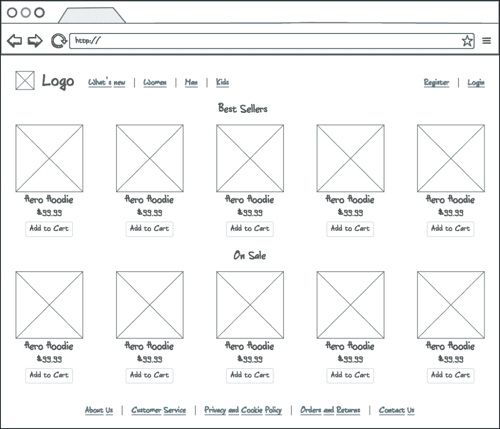

在这里，我们可以看到一些部分确定页面结构。页眉由标志、类别菜单和用户菜单组成。要求没有提到类别结构的任何内容，我们正在构建一个简单的网店应用，因此我们将坚持扁平的类别结构，没有任何子类别。用户菜单最初将显示**注册**和**登录**链接，直到用户实际登录，此时菜单将如下线框图所示更改。内容区域填充有畅销商品和特价商品，每个商品都有图像、标题、价格和定义的**添加到购物车**按钮。页脚区域包含链接到大多是静态内容页面和**联系我们**页面。

以下线框图展示了我们网店应用的分类页面：

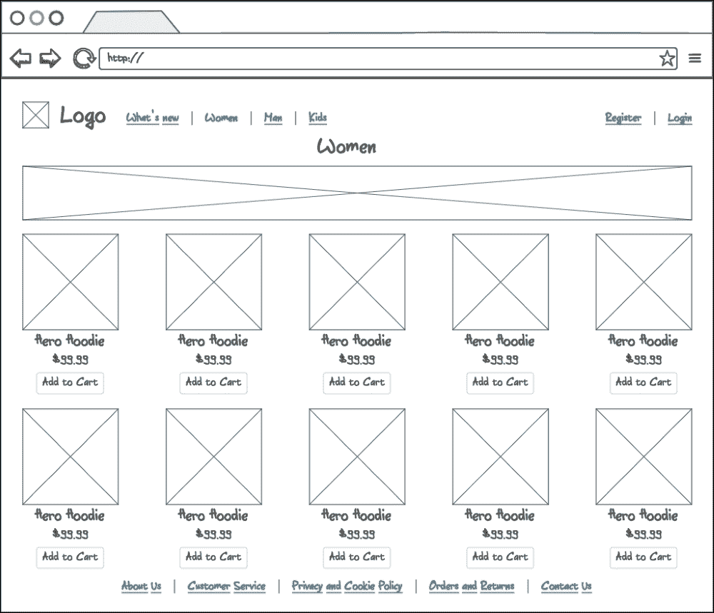

页眉和页脚区域在整个网站中概念上保持不变。内容区域现在已更改为列出任何给定类别内的产品。单个产品区域的呈现方式与主页上的方式相同。类别名称和图像呈现在产品列表上方。类别图像的宽度给出了我们应该准备和上传到我们类别的图像类型的一些提示。

以下线框图展示了我们网店应用的产品页面：

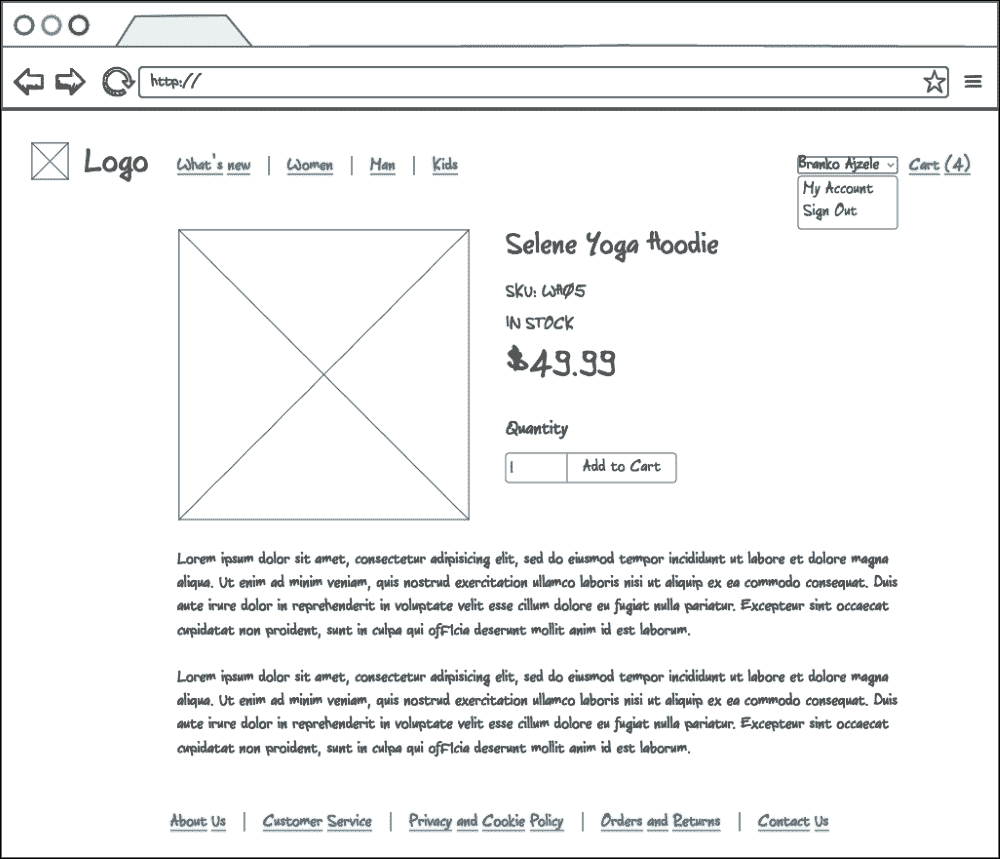

这里的内容区域现在更改为列出单个产品信息。我们可以看到一个大的图像占位符、标题、sku、库存状态、价格、数量字段、**添加到购物车**按钮和产品描述。当商品可供购买时，将显示**有货**消息，当商品不再可用时将显示**缺货**。这与产品数量属性相关。我们还需要记住“查看具有大视图（放大）的产品图像”要求，点击图像将放大显示。

以下线框图展示了我们网店应用的注册页面：

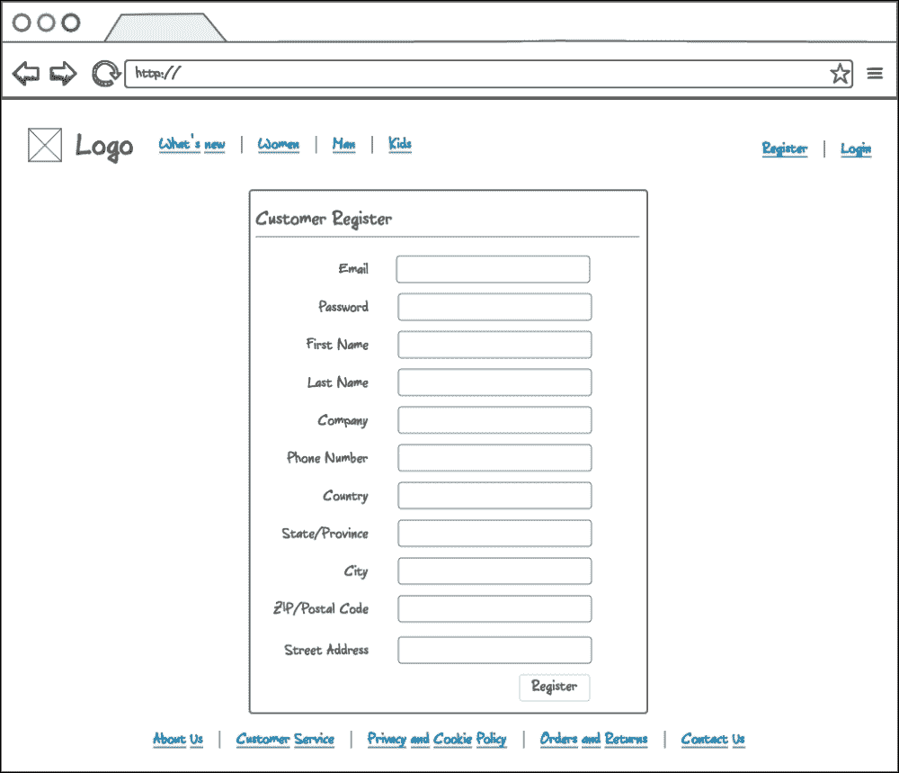

这里的内容区域现在更改为呈现注册表单。我们可以以许多方式实现注册系统。通常情况下，在注册屏幕上询问的信息量最少，因为我们希望尽快让用户进入。然而，让我们假设我们正在尝试在注册屏幕上获取更完整的用户信息。我们不仅要求电子邮件和密码，还要求整个地址信息。

以下线框图展示了我们网店应用的登录页面：

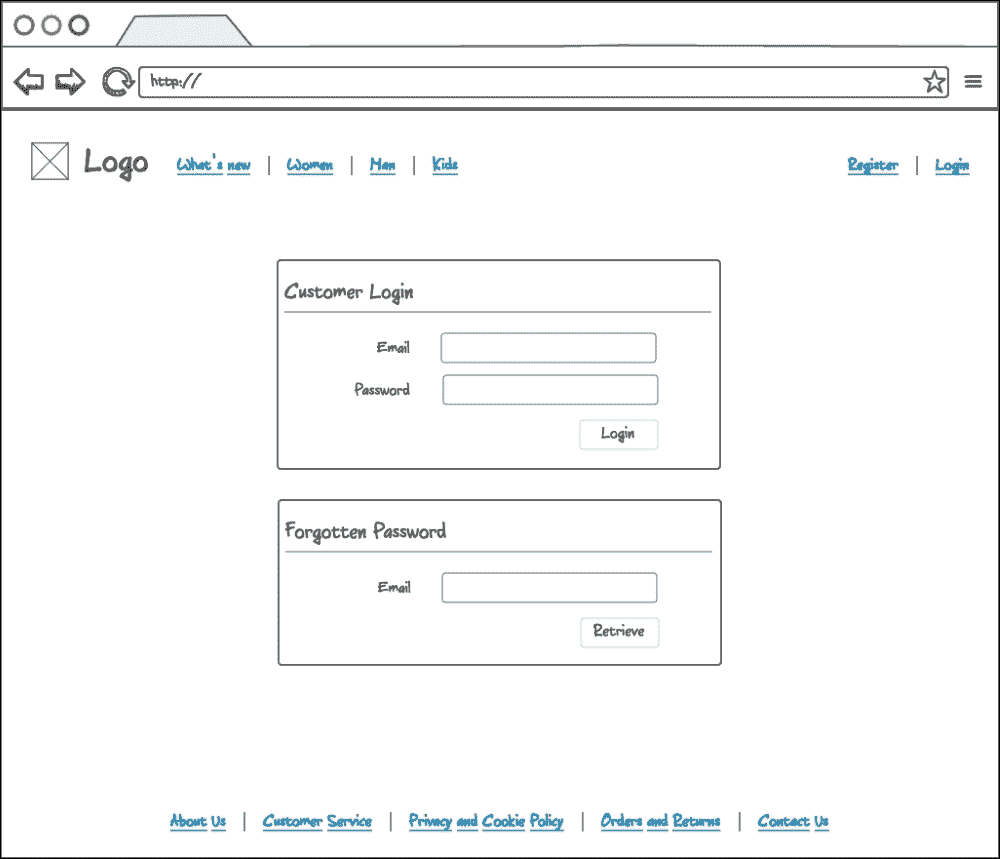

这里的内容区域现在更改为呈现客户登录和忘记密码表单。我们为用户提供**电子邮件**和**密码**字段以进行登录，或者在重置密码操作时只提供**电子邮件**字段。

以下线框图展示了我们网店应用的客户账户页面：

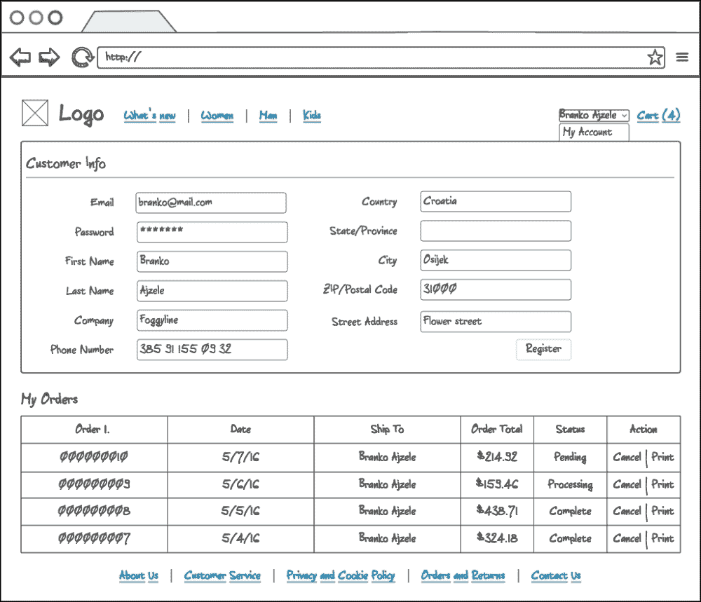

这里的内容区域现在更改为呈现仅对已登录客户可见的客户账户区域。在这里，我们看到了两个主要信息。一个是客户信息，另一个是订单历史。客户可以从此屏幕更改其电子邮件、密码和其他地址信息。此外，客户可以查看、取消和打印其以前的所有订单。**我的订单**表按从新到旧的顺序列出订单。尽管用户故事没有指定，但订单取消应仅适用于待处理订单。这是我们稍后将更详细地讨论的内容。

这也是第一个显示用户菜单状态的屏幕，当用户登录时。我们可以看到一个下拉菜单显示用户的全名，**我的账户**和**退出**链接。紧挨着它，我们有**购物车（%s）**链接，用于列出购物车中的确切数量。

以下线框图展示了我们网店应用的结账购物车页面：


这里的内容区现在改变为呈现购物车的当前状态。如果客户已经向购物车中添加了任何商品，它们将在这里列出。每个商品应列出产品标题、单价、添加的数量和小计。客户应该能够更改数量并点击**更新购物车**按钮来更新购物车的状态。如果数量为`0`，点击**更新购物车**按钮将从购物车中移除该商品。购物车数量应始终反映页眉菜单中**购物车（%s）**链接的状态。屏幕右侧显示了当前订单总价的快速摘要，以及一个清晰的**去结账**按钮。

以下线框图展示了我们网店应用的结账购物车运输页面：

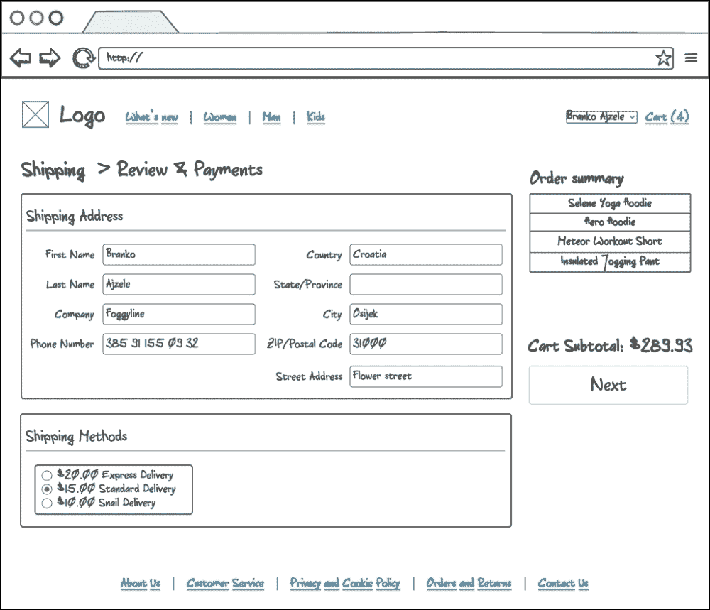

这里的内容区现在改变为呈现结账流程的第一步，即收集运输信息。这个页面对未登录客户不可见。客户可以在这里提供他们的地址详细信息，以及选择运输方式。运输方式区列出了几种运输方式。在右侧，显示了可折叠的订单摘要部分，列出购物车中当前商品。在其下方，有购物车小计值和一个清晰的**下一步**按钮。只有在提供了所有必要信息时，**下一步**按钮才会触发，此时它应该将我们带到结账购物车付款页面上的付款信息。

以下线框图展示了我们网店应用的结账购物车付款页面：

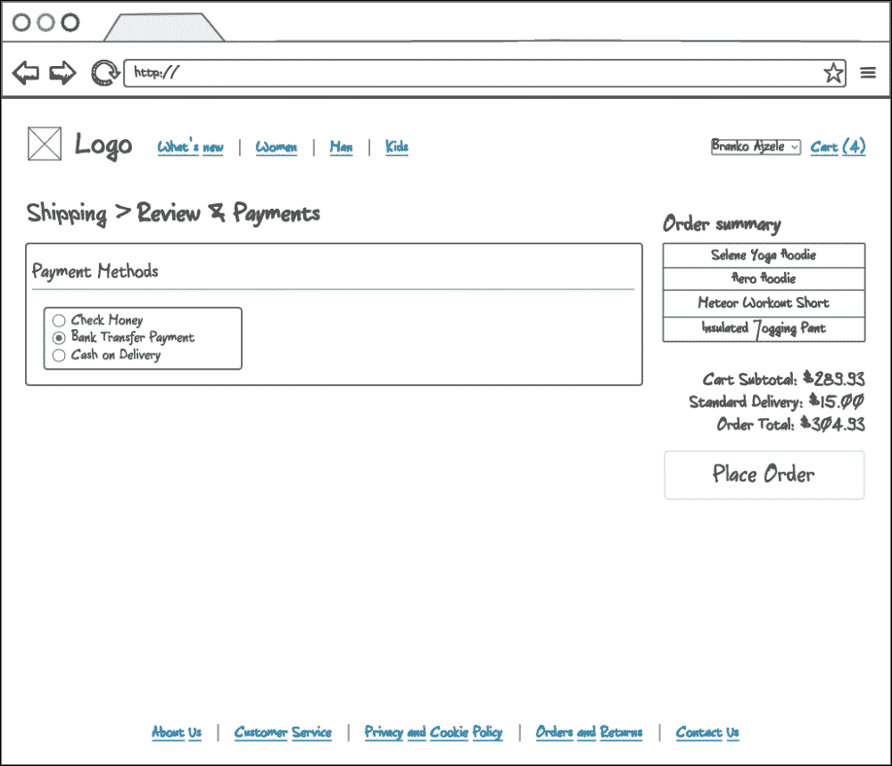

这里的内容区现在改变为呈现结账流程的第二步，即收集付款信息。这个页面对未登录客户不可见。客户将看到可用付款方式的列表。为了简化应用程序，我们将只关注固定付款，不会使用像 PayPal 或 Stripe 这样复杂的付款方式。在屏幕右侧，我们可以看到一个可折叠的**订单摘要**部分，列出购物车中当前商品。在其下方，有订单总额部分，分别列出**购物车小计**、**标准运费**、**订单总额**和一个清晰的**下订单**按钮。只有在提供了所有必要信息时，**下订单**按钮才会触发，此时它应该将我们带到结账成功页面。

以下线框图展示了我们网店应用的结账成功页面：

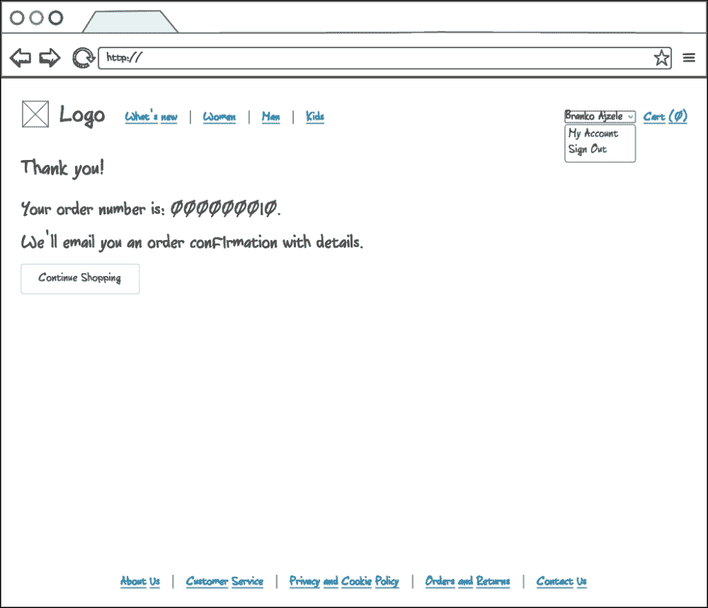

这里的内容区现在改变为输出结账成功的消息。显然，这个页面只对刚刚完成结账流程的已登录客户可见。订单号可点击并链接到**我的账户**区域，重点关注具体订单。到达这个页面时，客户和商店经理都应该收到通知邮件，根据*下订单后收到邮件通知*和*新销售订单创建后收到通知*的要求。

通过这些，我们结束了面向客户的线框图。

关于商店经理用户故事需求，我们现在将简单定义一个管理界面，如下截图所示：

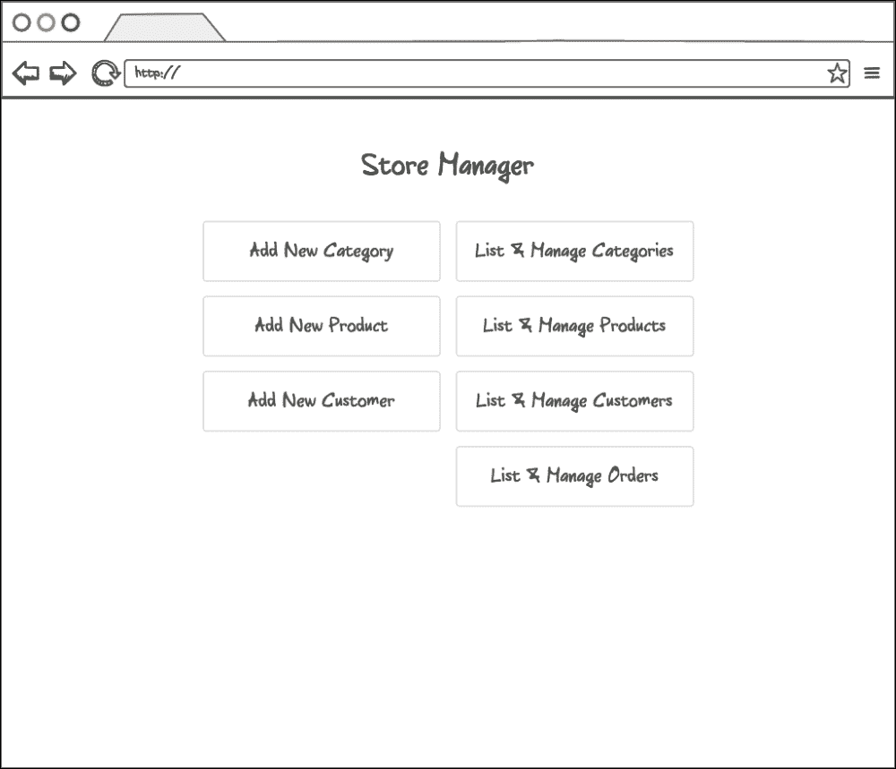

稍后使用框架，我们将获得一个完整的自动生成的 CRUD 界面，用于多个**添加新**和**列表和管理**链接。对这个界面和其链接的访问将由框架的安全组件控制，因为这个用户不会是客户或数据库中的任何用户。

Symfony 框架

# 创建新记录

此外，在接下来的章节中，我们将把我们的应用程序分成几个模块。在这样的设置中，每个模块将负责各自的功能，处理客户、目录、结账和其他需求。

## Symfony 框架对我们的应用程序来说是一个不错的选择。它是一个企业级框架，已经存在多年，文档和支持非常完善。可以从官方网站[`symfony.com`](http://symfony.com)下载，如下所示：

编辑现有记录

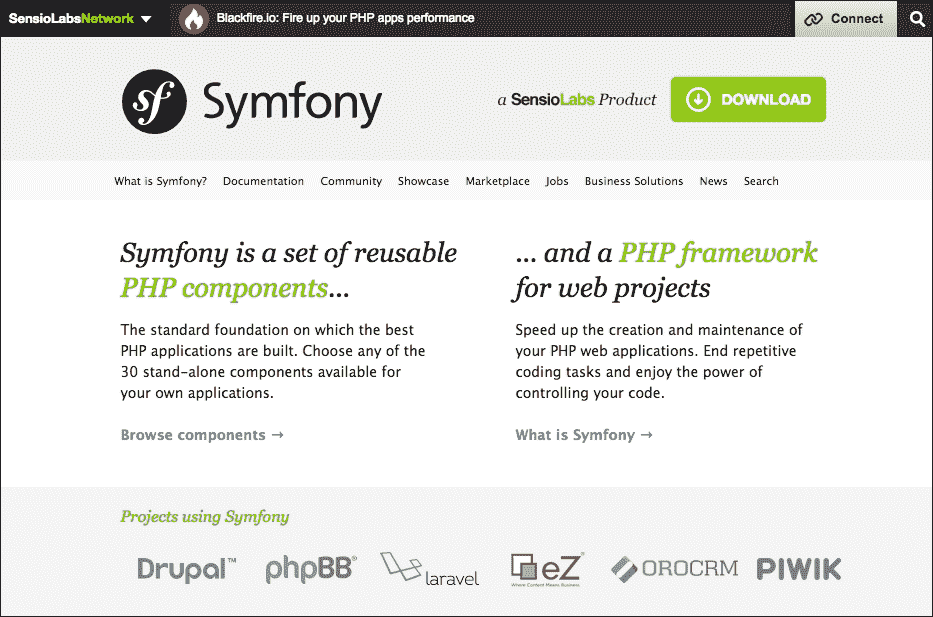

将技术栈定义为

+   控制器

+   路由

+   ORM（通过 Doctrine）

+   表单

+   验证

+   安全

这些是我们应用程序所需的基本功能。ORM 特别在快速应用程序开发中起着重要作用。不用太担心编码，CRUD 的每个方面都可以将开发速度提高一倍或两倍。Symfony 在这方面的伟大之处在于，它允许通过执行两个简单的命令自动生成实体和围绕它们的 CRUD 操作：

```php
php bin/console doctrine:generate:entity
php app/console generate:doctrine:crud
```

通过这样做，Symfony 生成实体模型和必要的控制器，使我们能够执行以下操作：

+   列出所有记录

+   显示由其主键标识的给定记录

+   一旦需求和线框图确定，我们就可以将注意力集中在选择技术栈上。在第一章中，*生态系统概述*，我们简要介绍了几种最流行的 PHP 框架，并指出了它们的优势。在这种情况下，选择合适的框架更多地是一种偏好，因为大部分应用需求可以很容易地满足任何一个框架。然而，我们的选择落在了 Symfony 上。除了 PHP 框架，我们仍然需要一个 CSS 框架，在客户端浏览器中提供一些结构、样式和响应能力。由于本书的重点是 PHP 技术，我们选择了 Foundation CSS 框架来完成这项任务。

+   Foundation 框架

+   删除现有记录

基本上，我们免费获得了一个最小的商店经理界面。这本身就涵盖了商店经理角色的大部分 CRUD 相关需求。然后，我们可以轻松修改生成的模板，进一步整合剩余的功能。

此外，安全组件提供了身份验证和授权，我们可以用来满足客户和商店经理的登录需求。因此，商店经理将是 Symfony 防火墙固定的、预先创建的用户，是唯一可以访问 CRUD 控制器操作的用户。

## 基础框架

Foundation 框架由 Zurb 公司支持，是现代响应式 Web 应用程序的一个很好的选择。我们可以说它是一个企业级框架，提供了一套 HTML、CSS 和 JavaScript，我们可以构建在其上。可以从官方网站[`foundation.zurb.com`](http://foundation.zurb.com)下载，如下所示：

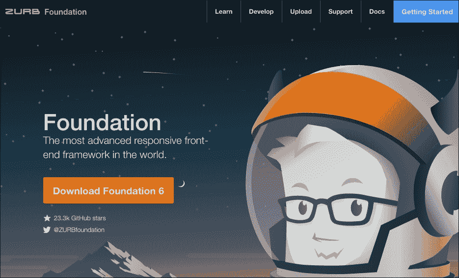

Foundation 有三种风格：

+   Foundation for sites

+   电子邮件基础

+   Foundation for apps

我们对网站版本感兴趣。除了一般的样式外，Foundation for sites 还提供了大量的控件、导航元素、容器、媒体元素和插件。这些在我们的应用程序中将特别有用，比如标题菜单、类别产品列表、响应式购物车表格等。

Foundation 是一个以移动设备为先的框架，我们首先为小屏幕编码，然后大屏幕继承这些样式。它的默认 12 列网格系统使我们能够快速轻松地创建强大的多设备布局。

我们将使用 Foundation 来提供结构、一些基本样式和响应性，而不需要自己编写一行 CSS。这样就足以使我们的应用在移动和桌面屏幕上看起来足够美观，同时仍然将我们大部分的编码技能集中在后端事务上。

除了提供强大的功能外，Foundation 背后的公司还提供优质的技术支持。虽然我们在本书中不需要它，但选择应用程序框架时，这些事情建立了信心。

# 摘要

创建 Web 应用程序可能是一项乏味且耗时的任务，Web 商店可能是最健壮和最密集的应用程序类型之一，因为它们涵盖了大量的功能。在交付最终产品时涉及许多组件；从数据库、服务器端（PHP）代码到客户端（HTML、CSS 和 JavaScript）代码。在本章中，我们首先通过定义一些基本用户故事来定义我们小型网店的高级应用程序要求。将线框图加入其中有助于我们可视化客户界面，而商店管理界面将由框架提供。

我们进一步概述了支持模块化应用程序设计的两个最流行的框架。我们将注意力转向 Symfony 作为服务器端技术和 Foundation 作为客户端响应式框架。

在接下来的章节中，我们将更深入地了解 Symfony。Symfony 不仅是一组可重用的组件，还是最健壮和最流行的全栈 PHP 框架之一。因此，它是快速 Web 应用程序开发的一个有趣选择。
