# 第五章：一览 Symfony

像 Symfony 这样的全栈框架有助于通过提供所有必要的组件，从用户界面到数据存储，来简化构建模块化应用程序的过程。这使得在应用程序增长时能够更快地交付各个部分。我们将通过将应用程序分割为几个较小的模块或 Symfony 术语中的 bundle 来体验到这一点。

接下来，我们将安装 Symfony，创建一个空项目，并开始研究构建模块化应用程序所必需的各个框架特性：

+   控制器

+   路由

+   模板

+   表单

+   Bundle 系统

+   数据库和 Doctrine

+   测试

+   验证

# 安装 Symfony

安装 Symfony 非常简单。我们可以使用以下命令在 Linux 或 Mac OS X 上安装 Symfony：

```php
**sudo curl -LsS https://symfony.com/installer -o /usr/local/bin/symfony**
**sudo chmod a+x /usr/local/bin/symfony**

```

我们可以使用以下命令在 Windows 上安装 Symfony：

```php
**c:\> php -r "file_put_contents('symfony', file_get_contents('https://symfony.com/installer'));"**

```

执行该命令后，我们可以简单地将新创建的`symfony`文件移动到我们的项目目录，并在 Windows 中进一步执行它作为`symfony`或`php symfony`。

这应该触发以下输出：

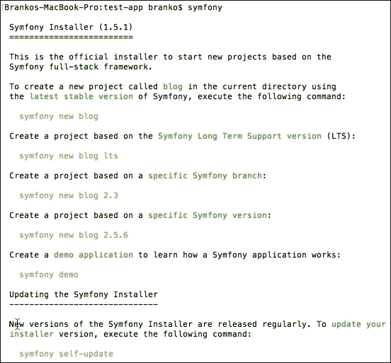

前面的响应表明我们已经成功设置了 Symfony，现在准备开始创建新项目。

# 创建一个空项目

既然我们已经设置好了 Symfony 安装程序，让我们继续创建一个新的空项目。我们只需执行`symfony new test-app`命令，如下面的命令行示例所示：

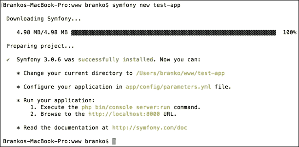

在这里，我们正在创建一个名为`test-app`的新项目。我们可以看到 Symfony 安装程序正在从互联网下载最新的 Symfony 框架，并输出一个简要的指令，说明如何通过 Symfony 控制台应用程序运行内置的 PHP 服务器。整个过程可能需要几分钟。

新创建的`test-app`目录的结构与以下类似：

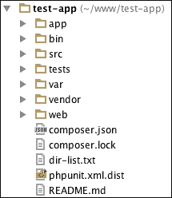

这里为我们创建了许多文件和目录。然而，我们感兴趣的是`app`和`src`目录。`app`目录是整个站点应用程序配置的所在地。在这里，我们可以找到数据库、路由、安全和其他服务的配置。此外，这也是默认布局和模板文件所在的地方，如下面的截图所示：

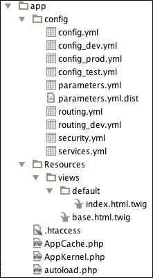

另一方面，`src`目录包含了已经模块化的代码，以`AppBundle`模块的形式，如下面的截图所示：

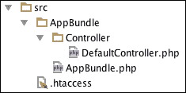

随着我们的进展，我们将更详细地讨论这些文件的作用。目前，值得注意的是，将我们的浏览器指向这个项目会使`DefaultController.php`实际上渲染输出。

# 使用 Symfony 控制台

Symfony 框架自带一个内置的控制台工具，我们可以通过在项目根目录中执行以下命令来触发它：

```php
**php bin/console**

```

这样做会在屏幕上显示一个可用命令的广泛列表，分为以下几组：

+   `资产`

+   `缓存`

+   `配置`

+   `调试`

+   `doctrine`

+   `生成`

+   `lint`

+   `orm`

+   `路由`

+   `安全`

+   `服务器`

+   `swiftmailer`

+   `翻译`

这些命令赋予我们各种功能。我们未来特别感兴趣的是`doctrine`和`generate`命令。`doctrine`命令，特别是`doctrine:generate:crud`，基于现有的 Doctrine 实体生成一个 CRUD。此外，`doctrine:generate:entity`命令在现有 bundle 中生成一个新的 Doctrine 实体。在我们需要快速轻松地创建实体以及围绕它的整个 CRUD 时，这些命令非常有用。同样，`generate:doctrine:entity`和`generate:doctrine:crud`也是如此。

在继续测试这些命令之前，我们需要确保我们的数据库配置参数已经设置好，以便 Symfony 可以看到并与我们的数据库进行通信。为此，我们需要在`app/config/parameters.yml`文件中设置适当的值。

为了本节的目的，让我们继续在默认的`AppBundle`包中创建一个简单的 Customer 实体，围绕它创建整个 CRUD，假设 Customer 实体具有以下属性：`firstname`、`lastname`和`e-mail`。我们首先在项目根目录中运行`php bin/console generate:doctrine:entity`命令，结果如下输出：

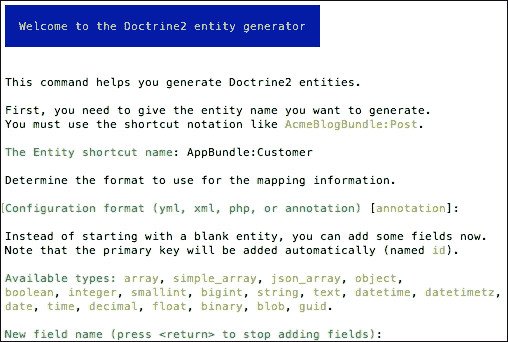

在这里，我们首先提供了`AppBundle:Customer`作为实体名称，并确认了注释作为配置格式的使用。

最后，我们被要求开始向我们的实体添加字段。输入名字并按回车键，将我们移动到一系列关于字段类型、长度、可空和唯一状态的简短问题，如下屏幕截图所示：

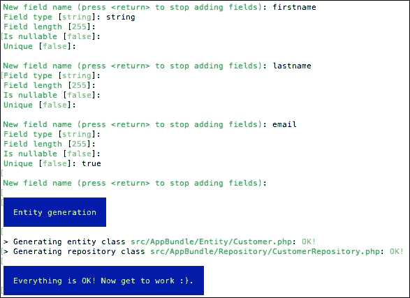

现在我们应该已经为我们的 Customer 实体生成了两个类。通过 Symfony 和 Doctrine 的帮助，这些类被放置在**对象关系映射器**（**ORM**）的上下文中，因为它们将 Customer 实体与适当的数据库表进行了关联。但是，我们还没有指示 Symfony 实际上为我们的实体创建表。为此，我们执行以下命令：

```php
**php bin/console doctrine:schema:update --force**

```

这应该会产生如下屏幕截图所示的输出：


如果我们现在查看数据库，应该会看到一个`customer`表，其中包含使用 SQL 创建 dsyntax 创建的所有正确列，如下所示：

```php
**CREATE TABLE `customer` (**
 **`id` int(11) NOT NULL AUTO_INCREMENT,**
 **`firstname` varchar(255) COLLATE utf8_unicode_ci NOT NULL,**
 **`lastname` varchar(255) COLLATE utf8_unicode_ci NOT NULL,**
 **`email`** **varchar(255) COLLATE utf8_unicode_ci NOT NULL,**
 **PRIMARY KEY (`id`),**
 **UNIQUE KEY `UNIQ_81398E09E7927C74` (`email`)**
**) ENGINE=InnoDB DEFAULT CHARSET=utf8 COLLATE=utf8_unicode_ci;**

```

此时，我们仍然没有实际的 CRUD 功能。我们只是有一个经过 ORM 授权的 Customer 实体类和适当的数据库表。以下命令将为我们生成实际的 CRUD 控制器和模板：

```php
**php bin/console generate:doctrine:crud**

```

这应该产生以下交互式输出：


通过提供完全分类的实体名称`AppBundle:Customer`，生成器将继续一系列附加输入，从生成写操作、读取的配置类型到路由前缀，如下屏幕截图所示：

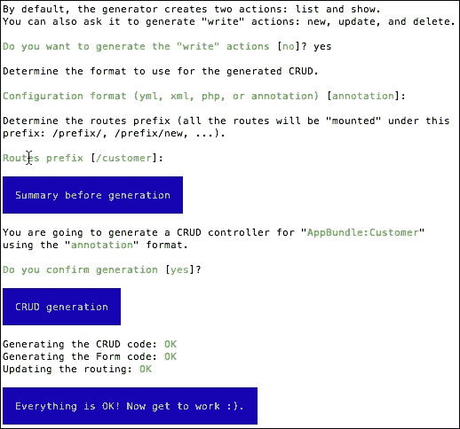

完成后，我们应该能够通过简单打开类似`http://test.app/customer/`的 URL（假设`test.app`是我们设置的主机）来访问我们的 Customer CRUD 操作，如下所示：

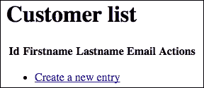

如果我们单击**创建新条目**链接，我们将被重定向到`/customer/new/` URL，如下屏幕截图所示：

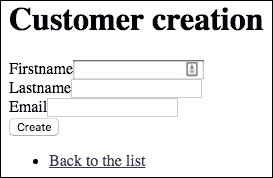

在这里，我们可以输入我们的 Customer 实体的实际值，并单击**Create**按钮，以将其持久化到数据库的`customer`表中。添加了一些实体后，初始的`/customer/` URL 现在能够列出它们所有，如下屏幕截图所示：

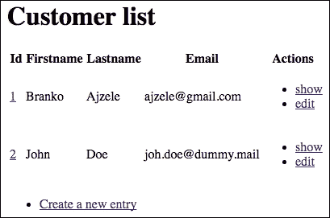

在这里，我们看到了**显示**和**编辑**操作的链接。**显示**操作是我们可能考虑的面向客户的操作，而**编辑**操作是面向管理员的操作。单击**编辑**操作，将我们带到表单的 URL`/customer/1/edit/`，而在这种情况下的数字`1`是数据库中客户实体的 ID：


在这里，我们可以更改属性值并单击**编辑**以将它们持久化到数据库中，或者我们可以单击**删除**按钮以从数据库中删除实体。

如果我们要创建一个具有已存在电子邮件的新实体，该电子邮件被标记为唯一字段，系统将抛出一个通用错误，如下所示：


这只是默认的系统行为，随着我们的进展，我们将探讨如何使其更加用户友好。到目前为止，我们已经看到了 Symfony 控制台的强大之处。通过几个简单的命令，我们能够创建实体及其整个 CRUD 操作。控制台还有很多功能。我们甚至可以创建自己的控制台命令，因为我们可以实现任何类型的逻辑。然而，就我们的需求而言，当前的实现暂时足够了。

# 控制器

控制器在 Web 应用程序中扮演着重要的角色，是任何应用程序输出的前沿。它们是端点，是在每个 URL 后面执行的代码。从技术上讲，我们可以说控制器是任何可调用的东西（函数、对象上的方法或闭包），它接受 HTTP 请求并返回 HTTP 响应。响应不限于单一格式，可以是 XML、JSON、CSV、图像、重定向、错误等任何东西。

让我们来看一下之前创建的（部分）`src/AppBundle/Controller/CustomerController.php`文件，更确切地说是它的`newAction`方法：

```php
/**
 * Creates a new Customer entity.
 *
 * @Route("/new", name="customer_new")
 * @Method({"GET", "POST"})
 */
public function newAction(Request $request)
{
  //...

  return $this->render('customer/new.html.twig', array(
    'customer' => $customer,
    'form' => $form->createView(),
  ));
}
```

如果我们忽略实际的数据检索部分（`//…`），在这个小例子中有三个重要的事情需要注意：

+   `@Route`：这是 Symfony 的注释方式来指定 HTTP 端点，我们将用它来访问。第一个`"/new"`参数表示实际的端点，第二个`name="customer_new"`参数设置了这个路由的名称，我们可以在模板中的 URL 生成函数中使用它作为别名。值得注意的是，这是建立在实际`CustomerController`类上的`@Route("/customer")`注释之上的，因此完整的 URL 可能是`http://test.app/customer/new`。

+   `@Method`：这里接受一个或多个 HTTP 方法的名称。这意味着`newAction`方法只会在 HTTP 请求与先前定义的`@Route`匹配并且是在`@Method`中定义的一个或多个 HTTP 方法类型时触发。

+   `$this->render`：这返回`Response`对象。`$this->render`调用`Symfony\Bundle\FrameworkBundle\Controller\Controller`类的`render`函数，它实例化新的`Response()`，设置其内容，并返回该对象的整个实例。

现在让我们来看一下我们控制器中的`editAction`方法，如下面的代码块所示：

```php
/**
 * Displays a form to edit an existing Customer entity.
 *
 * @Route("/{id}/edit", name="customer_edit")
 * @Method({"GET", "POST"})
 */
public function editAction(Request $request, Customer $customer)
{
  //...
}
```

在这里，我们看到一个路由接受一个单一的 ID，标记为第一个`@Route`注释参数中的`{id}`。方法的主体（在此处排除）不包含对获取`id`参数的直接引用。我们可以看到`editAction`函数接受两个参数，一个是`Request`，另一个是`Customer`。但是方法如何知道要接受`Customer`对象呢？这就是 Symfony 的`@ParamConverter`注释发挥作用的地方。它调用转换器将请求参数转换为对象。

`@ParamConverter`注释的好处在于我们可以明确或隐式地使用它。也就是说，如果我们不添加`@ParamConverter`注释，但在方法参数中添加类型提示，Symfony 将尝试为我们加载对象。这正是我们在上面的例子中的情况，因为我们没有明确地添加`@ParamConverter`注释。

术语上，控制器经常被用来交换路由。然而，它们并不是同一回事。

# 路由

简而言之，路由是将控制器与浏览器中输入的 URL 链接起来。现代的 Web 应用程序需要友好的 URL。这意味着从像`/index.php?product_id=23`这样的 URL 迁移到像`/catalog/product/t-shirt`这样的 URL。这就是路由发挥作用的地方。

Symfony 有一个强大的路由机制，使我们能够做到以下几点：

+   创建映射到控制器的复杂路由

+   在模板中生成 URL

+   在控制器内生成 URL

+   从各种位置加载路由资源

Symfony 中路由的工作方式是所有请求都通过`app.php`。然后，Symfony 核心要求路由器检查请求。路由器然后将传入的 URL 与特定路由匹配，并返回有关路由的信息。这些信息，除其他事项外，包括应执行的控制器。最后，Symfony 内核执行控制器，返回一个响应对象。

所有应用程序路由都从单个路由配置文件加载，通常是`app/config/routing.yml`文件，如我们的测试应用程序所示：

```php
app:
  resource: "@AppBundle/Controller/"
  type:     annotation
```

该应用程序只是许多可能输入之一。它的资源值指向`AppBundle`控制器目录，类型设置为注释，这意味着类注释将被读取以指定确切的路由。

我们可以定义具有多种变化的路由。其中一种如下所示：

```php
// Basic Route Configuration
/**
 * @Route("/")
 */
public function homeAction()
{
  // ...
}

// Routing with Placeholders
/**
 * @Route("/catalog/product/{sku}")
 */
public function showAction($sku)
{
  // ...
}

// >>Required<< and Optional Placeholders
/**
 * @Route("/catalog/product/{id}")
 */
public function indexAction($id)
{
  // ...
}
// Required and >>Optional<< Placeholders
/**
 * @Route("/catalog/product/{id}", defaults={"id" = 1})
 */
public function indexAction($id)
{
  // ...
}
```

前面的例子展示了我们可以定义路由的几种方式。有趣的是带有必需和可选参数的情况。如果我们考虑一下，从最新的例子中删除 ID 将匹配带有 sku 的前一个例子。Symfony 路由器总是选择它找到的第一个匹配路由。我们可以通过在`@Route`注释上添加正则表达式要求来解决这个问题，如下所示：

```php
@Route(
  "/catalog/product/{id}",
  defaults={"id": 1},
  requirements={"id": "\d+"}
)
```

关于控制器和路由还有更多要说的，一旦我们开始构建我们的应用程序，我们将会看到。

# 模板

之前我们说过控制器接受请求并返回响应。然而，响应往往可以是任何内容类型。实际内容的生成是控制器委托给模板引擎的。然后模板引擎有能力将响应转换为 HTML、JSON、XML、CSV、LaTeX 或任何其他基于文本的内容类型。

在过去，程序员将 PHP 与 HTML 混合到所谓的 PHP 模板（`.php`和`.phtml`）中。尽管在某些平台上仍在使用，但这种方法被认为是不安全的，并且在许多方面缺乏。其中之一是将业务逻辑塞入模板文件中。

为了解决这些缺点，Symfony 打包了自己的模板语言 Twig。与 PHP 不同，Twig 旨在严格表达演示文稿，而不是思考程序逻辑。我们不能在 Twig 中执行任何 PHP 代码。而 Twig 代码只不过是带有一些特殊语法类型的 HTML。

Twig 定义了三种特殊语法类型：

+   `{{ ... }}`：这将把变量或表达式的结果输出到模板中。

+   ``：这个标签控制模板的逻辑（`if`和`for`循环等）。

+   `{# ... #}`：它相当于 PHP 的`/* comment */`语法。注释内容不包括在渲染页面中。

过滤器是 Twig 的另一个很好的功能。它们就像对变量值进行链式方法调用一样，修改输出之前的内容，如下所示：

```php
<h1>{{ title|upper }}</h1>

{{ filter upper }}
<h1>{{ title }}</h1>


<h1>{{ title|lower|escape }}</h1>


<h1>{{ title }}</h1>

```

它还支持以下列出的函数：

```php
{{ random(['phone', 'tablet', 'laptop']) }}
```

前面的随机函数调用将从数组中返回一个随机值。除了内置的过滤器和函数列表外，Twig 还允许根据需要编写自己的过滤器和函数。

与 PHP 类继承类似，Twig 也支持模板和布局继承。让我们快速回顾一下`app/Resources/views/customer/index.html.twig`文件，如下所示：

```php



<h1>Customer list</h1>
…

```

在这里，我们看到一个客户`index.html.twig`模板，使用`extends`标签来扩展另一个模板，这种情况下是在`app/Resources/views/`目录中找到的`base.html.twig`，内容如下：

```php
<!DOCTYPE html>
<html>
  <head>
    <meta charset="UTF-8" />
    <title>Welcome!</title>
    
    <link rel="icon" type="image/x-icon"href="{{ asset('favicon.ico') }}" />
  </head>
  <body>
    
    
  </body>
</html>
```

在这里，我们看到几个块标签：`title`，`stylesheets`，`body`和`javascripts`。我们可以在这里声明任意数量的块，并以任何我们喜欢的方式命名它们。这使得`extend`标签成为模板继承的关键。它告诉 Twig 首先评估基础模板，设置布局并定义块，然后子模板如`customer/index.html.twig`填充这些块的内容。

模板存在于两个位置：

+   `app/Resources/views/`

+   `bundle-directory/Resources/views/`

这意味着为了`render/extend app/Resources/views/base.html.twig`，我们将在我们的模板文件中使用`base.html.twig`，而为了`render/extend app/Resources/views/customer/index.html.twig`，我们将使用`customer/index.html.twig`路径。

当与存储在 bundles 中的模板一起使用时，我们必须稍微不同地引用它们。在这种情况下，使用`bundle:directory:filename`字符串语法。以`FoggylineCatalogBundle:Product:index.html.twig`路径为例。这将是使用 bundles 模板文件的完整路径。这里`FoggylineCatalogBundle`是一个 bundle 名称，`Product`是该 bundle`Resources/views`目录中的一个目录名称，`index.html.twig`是`Product`目录中实际模板的名称。

每个模板文件名都有两个扩展名，首先指定格式，然后指定该模板的引擎；例如`*.html.twig`，`*.html.php`和`*.css.twig`。

一旦我们开始构建我们的应用程序，我们将更详细地了解这些模板。

# 表单

注册、登录、添加到购物车、结账，所有这些以及更多操作都在网店应用程序和其他地方使用 HTML 表单。构建表单是开发人员最常见的任务之一。通常需要时间来正确完成。

Symfony 有一个`form`组件，通过它我们可以以面向对象的方式构建 HTML 表单。这个组件本身也是一个独立的库，可以独立于 Symfony 使用。

让我们来看看`src/AppBundle/Entity/Customer.php`文件的内容，这是为我们自动生成的`Customer`实体类，当我们通过控制台定义它时：

```php
class Customer {
  private $id;
  private $firstname;
  private $lastname;
  private $email;

  public function getId() {
    return $this->id;
  }

  public function setFirstname($firstname) {
    $this->firstname = $firstname;
    return $this;
  }

  public function getFirstname() {
    return $this->firstname;
  }

  public function setLastname($lastname) {
    $this->lastname = $lastname;
    return $this;
  }

  public function getLastname() {
    return $this->lastname;
  }

  public function setEmail($email) {
    $this->email = $email;
    return $this;
  }

  public function getEmail() {
    return $this->email;
  }
}
```

在这里，我们有一个普通的 PHP 类，它既不继承任何东西，也不以任何其他方式与 Symfony 相关联。它代表一个单一的客户实体，为其设置和获取数据。有了实体类，我们想要渲染一个表单，该表单将获取我们类使用的所有相关数据。这就是`Form`组件的作用所在。

当我们之前通过控制台使用 CRUD 生成器时，它为我们的 Customer 实体创建了`Form`类，位于`src/AppBundle/Form/CustomerType.php`文件中，内容如下：

```php
namespace AppBundle\Form;

use Symfony\Component\Form\AbstractType;
use Symfony\Component\Form\FormBuilderInterface;
use Symfony\Component\OptionsResolver\OptionsResolver;

class CustomerType extends AbstractType
{
  public function buildForm(FormBuilderInterface $builder, array $options) {
    $builder
    ->add('firstname')
    ->add('lastname')
    ->add('email')
    ;
  }

  public function configureOptions(OptionsResolver $resolver) {
    $resolver->setDefaults(array(
      'data_class' =>'AppBundle\Entity\Customer'
    ));
  }
}
```

我们可以看到表单组件背后的简单性归结为以下几点：

+   **扩展表单类型**：我们从`Symfony\Component\Form\AbstractType`类继承

+   **实现 buildForm 方法**：这是我们添加要在表单上显示的实际字段的地方

+   **实现 configureOptions**：这至少指定了`data_class`配置，指向我们的 Customer 实体。

表单构建器对象在这里承担了大部分工作。它不需要太多的工作就可以创建一个表单。有了`form`类，让我们来看看负责向模板提供表单的`controller`动作。在这种情况下，我们将专注于`src/AppBundle/Controller/CustomerController.php`文件中的`newAction`，内容如下：

```php
$customer = new Customer();
$form = $this->createForm('AppBundle\Form\CustomerType', $customer);
$form->handleRequest($request);

if ($form->isSubmitted() && $form->isValid()) {
  $em = $this->getDoctrine()->getManager();
  $em->persist($customer);
  $em->flush();

  return $this->redirectToRoute('customer_show', array('id' =>$customer->getId()));
}

return $this->render('customer/new.html.twig', array(
  'customer' => $customer,
  'form' => $form->createView(),
));
```

上述代码首先实例化了`Customer`实体类。`$this->createForm(…)`实际上是调用了`$this->container->get('form.factory')->create(…)`，将我们的`form`类名和`customer`对象的实例传递给它。然后我们有`isSubmitted`和`isValid`检查，以查看这是 GET 请求还是有效的 POST 请求。根据这个检查，代码要么返回到客户列表，要么设置`form`和`customer`实例，以便与模板`customer/new.html.twig`一起使用。我们稍后会更详细地讨论实际的验证。

最后，让我们来看看`app/Resources/views/customer/new.html.twig`文件中的实际模板：

```php



<h1>Customer creation</h1>

{{ form_start(form) }}
{{ form_widget(form) }}
<input type="submit" value="Create" />
{{ form_end(form) }}

<ul>
  <li>
    <a href="{{ path('customer_index') }}">Back to the list</a>
  </li>
</ul>

```

在这里我们看到了`extends`和`block`标签，以及一些相关的函数。Symfony 向 Twig 添加了几个表单渲染函数，如下所示：

+   `form(view, variables)`

+   `form_start(view, variables)`

+   `form_end(view, variables)`

+   `form_label(view, label, variables)`

+   `form_errors(view)`

+   `form_widget(view, variables)`

+   `form_row(view, variables)`

+   `form_rest(view, variables)`

我们的大多数应用程序表单将会像这样自动生成，因此我们能够获得一个完全功能的 CRUD，而不需要深入了解其他表单功能。

# 配置 Symfony

为了跟上现代需求，今天的框架和应用程序需要一个灵活的配置系统。Symfony 通过其强大的配置文件和环境概念很好地实现了这一角色。

默认的 Symfony 配置文件`config.yml`位于`app/config/`目录下，（部分）内容如下分段：

```php
imports:
  - { resource: parameters.yml }
  - { resource: security.yml }
  - { resource: services.yml }

framework:
…

# Twig Configuration
twig:
…

# Doctrine Configuration
doctrine:
…

# Swiftmailer Configuration
swiftmailer:
…
```

像`framework`、`twig`、`doctrine`和`swiftmailer`这样的顶级条目定义了单个 bundle 的配置。

可选地，配置文件可以是 XML 或 PHP 格式（`config.xml`或`config.php`）。虽然 YAML 简单易读，XML 更强大，而 PHP 更强大但不太易读。

我们可以使用控制台工具来转储整个配置，如下所示：

```php
**php bin/console config:dump-reference FrameworkBundle**

```

前面的示例列出了核心`FrameworkBundle`的配置文件。我们可以使用相同的命令来显示任何实现容器扩展的 bundle 的可能配置，这是我们稍后将要研究的内容。

Symfony 对环境概念有一个很好的实现。查看`app/config`目录，我们可以看到默认的 Symfony 项目实际上从三种不同的环境开始：

+   `config_dev.yml`

+   `config_prod.yml`

+   `config_test.yml`

每个应用程序可以在各种环境中运行。每个环境共享相同的代码，但不同的配置。开发环境可能会使用大量的日志记录，而生产环境可能会使用大量的缓存。

这些环境被触发的方式是通过前端控制器文件，如下面的部分示例所示：

```php
# web/app.php
…
$kernel = new AppKernel('prod', false);
…

# web/app_dev.php
…
$kernel = new AppKernel('dev', true);
…
```

测试环境在这里是缺失的，因为它只在运行自动化测试时使用，不能直接通过浏览器访问。

`app/AppKernel.php`文件实际上加载配置，无论是 YAML、XML 还是 PHP，如下面的代码片段所示：

```php
public function registerContainerConfiguration(LoaderInterface $loader)
{
  $loader->load($this->getRootDir().'/config/config_'.$this->getEnvironment().'.yml');
}
```

环境遵循相同的概念，每个环境导入基本配置文件，然后修改其值以满足特定环境的需求。

# bundle 系统

大多数流行的框架和平台都支持某种形式的模块、插件、扩展或 bundle。大多数情况下，区别实际上只是在命名上，而可扩展性和模块化的概念是相同的。在 Symfony 中，这些模块化块被称为 bundles。

bundles 在 Symfony 中是一等公民，因为它们支持其他组件可用的所有操作。在 Symfony 中，一切都是一个 bundle，甚至核心框架也是。bundles 使我们能够构建模块化的应用程序，其中给定功能的整个代码都包含在一个单独的目录中。

一个单一的 bundle 包含所有的 PHP 文件、模板、样式表、JavaScript 文件、测试以及其他任何内容在一个根目录中。

当我们首次设置我们的测试应用程序时，它为我们创建了一个`AppBundle`，位于`src`目录下。随着我们继续使用自动生成的 CRUD，我们看到我们的 bundle 获得了各种目录和文件。

要让 Symfony 注意到一个 bundle，需要将其添加到`app/AppKernel.php`文件中的`registerBundles`方法中，如下所示：

```php
public function registerBundles()
{
  $bundles = [
    new Symfony\Bundle\FrameworkBundle\FrameworkBundle(),
    new Symfony\Bundle\SecurityBundle\SecurityBundle(),
    new Symfony\Bundle\TwigBundle\TwigBundle(),
    new Symfony\Bundle\SwiftmailerBundle\SwiftmailerBundle(),
    new Doctrine\Bundle\DoctrineBundle\DoctrineBundle(),
    //…
    new AppBundle\AppBundle(),
  ];

  //…

  return $bundles;
}
```

创建一个新的 bundle 就像创建一个单个的 PHP 文件一样简单。让我们继续创建一个`src/TestBundle/TestBundle.php`文件，内容看起来像这样：

```php
namespace TestBundle;

use Symfony\Component\HttpKernel\Bundle\Bundle;

class TestBundle extends Bundle
{
  …
}
```

一旦文件就位，我们只需要通过`app/AppKernel.php`文件的`registerBundles`方法进行注册，如下所示：

```php
class AppKernel extends Kernel {
//…
  public function registerBundles() {
    $bundles = [
      // …
      new TestBundle\TestBundle(),
      // …
    ];
    return $bundles;
  }
  //…
}
```

创建 bundle 的更简单的方法是只需运行一个控制台命令，如下所示：

```php
**php bin/console generate:bundle --namespace=Foggyline/TestBundle**

```

这将触发一系列关于 bundle 的问题，最终导致 bundle 创建，看起来像下面的截图：

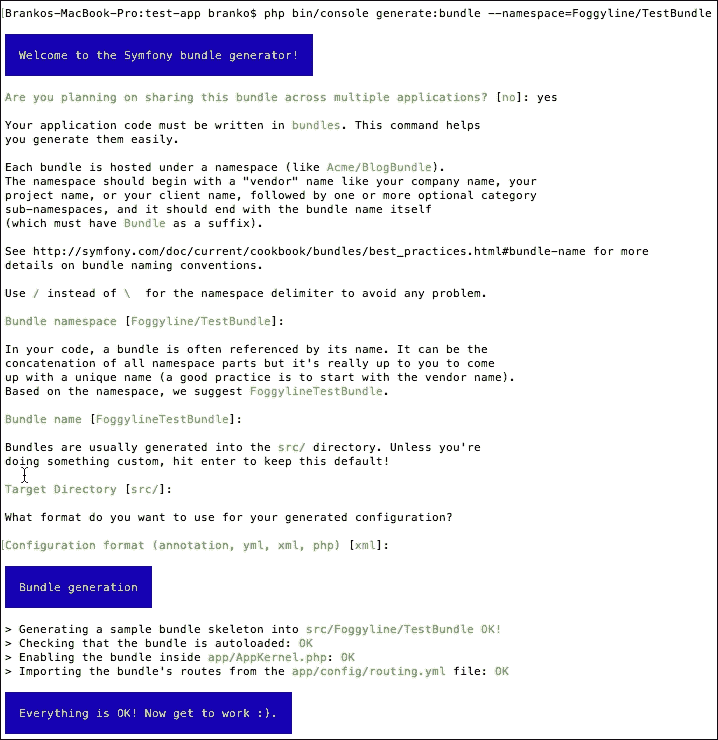

一旦过程完成，将创建一个新的 bundle，其中包含几个目录和文件，如下面的截图所示：

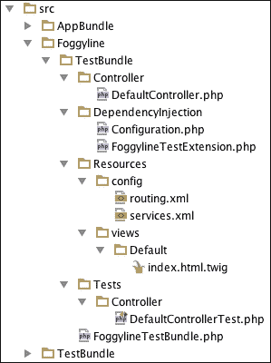

Bundle 生成器很友好地创建了控制器、依赖注入扩展、路由、准备服务配置、模板，甚至测试。由于我们选择共享我们的 bundle，Symfony 选择 XML 作为默认配置格式。依赖扩展简单地意味着我们可以通过在 Symfony 的主`config.yml`中使用`foggyline_test`作为根元素来访问我们的 bundle 配置。实际的`foggyline_test`元素在`DependencyInjection/Configuration.php`文件中定义。

# 数据库和 Doctrine

数据库几乎是每个 Web 应用程序的支柱。每当我们需要存储或检索数据时，我们都是通过数据库来实现的。在现代面向对象编程世界中的挑战是将数据库抽象化，以便我们的 PHP 代码与数据库无关。MySQL 可能是 PHP 世界中最知名的数据库。PHP 本身对与 MySQL 的工作有很好的支持，无论是通过`mysqli_*`扩展还是通过 PDO。然而，这两种方法都是针对 MySQL 特定的，离数据库太近。Doctrine 通过引入一层抽象解决了这个问题，使我们能够使用代表 MySQL 中的表、行及其关系的 PHP 对象进行工作。

Doctrine 完全与 Symfony 解耦，因此使用它完全是可选的。然而，它的一个很棒的地方是 Symfony 控制台提供了基于 Doctrine ORM 的自动生成 CRUD，就像我们在之前的示例中创建 Customer 实体时看到的那样。

一旦我们创建了项目，Symfony 就会为我们提供一个自动生成的`app/config/parameters.yml`文件。这个文件中，我们提供数据库访问信息，就像下面的示例中所示的那样。

```php
parameters:
database_host: 127.0.0.1
database_port: null
database_name: symfony
database_user: root
database_password: mysql
```

一旦我们配置了适当的参数，我们就可以使用控制台生成功能。

值得注意的是，该文件中的参数仅仅是一种约定，因为`app/config/config.yml`将它们拉入`doctrine dbal`配置，就像这里所示的那样。

```php
doctrine:
dbal:
  driver:   pdo_mysql
  host:     "%database_host%"
  port:     "%database_port%"
  dbname:   "%database_name%"
  user:     "%database_user%"
  password: "%database_password%"
  charset:  UTF8
```

Symfony 控制台工具允许我们根据这个配置来删除和创建数据库，在开发过程中非常方便，就像下面的代码块所示的那样。

```php
php bin/console doctrine:database:drop --force
php bin/console doctrine:database:create
```

我们之前看到控制台工具如何使我们能够创建实体并将它们映射到数据库表中。这将足够满足我们在本书中的需求。一旦我们创建了它们，我们需要能够对它们执行 CRUD 操作。如果我们忽略自动生成的 CRUD 控制器`src/AppBundle/Controller/CustomerController.php`文件，我们可以看到以下与 CRUD 相关的代码：

```php
// Fetch all entities
$customers = $em->getRepository('AppBundle:Customer')->findAll();

// Persist single entity (existing or new)
$em = $this->getDoctrine()->getManager();
$em->persist($customer);
$em->flush();

// Delete single entity
$em = $this->getDoctrine()->getManager();
$em->remove($customer);
$em->flush();
```

关于 Doctrine 还有很多要说的，这已经超出了本书的范围。更多信息可以在官方页面找到（[`www.doctrine-project.org`](http://www.doctrine-project.org)）。

# 测试

现在，测试已经成为每个现代 Web 应用程序的一个组成部分。通常，测试这个术语意味着单元测试和功能测试。单元测试是关于测试我们的 PHP 类。每个单独的 PHP 类被认为是一个单元，因此称为单元测试。另一方面，功能测试测试我们应用程序的各个层面，通常集中在测试整体功能，比如登录或注册过程。

PHP 生态系统有一个很棒的单元测试框架叫做**PHPUnit**，可以在[`phpunit.de`](https://phpunit.de)下载。它使我们能够编写主要是单元测试，但也包括功能类型测试。Symfony 的一个很棒的地方是它内置了对 PHPUnit 的支持。

在我们开始运行 Symfony 的测试之前，我们需要确保已安装 PHPUnit 并且可以作为控制台命令使用。当执行时，PHPUnit 会自动尝试从当前工作目录中的`phpunit.xml`或`phpunit.xml.dist`中读取测试配置，如果可用的话。默认情况下，Symfony 在其根文件夹中带有一个`phpunit.xml.dist`文件，因此`phpunit`命令可以获取其测试配置。

以下是默认`phpunit.xml.dist`文件的部分示例：

```php
<phpunit … >
  <php>
    <ini name="error_reporting" value="-1" />
    <server name="KERNEL_DIR" value="app/" />
  </php>

  <testsuites>
    <testsuite name="Project Test Suite">
      <directory>tests</directory>
    </testsuite>
  </testsuites>

  <filter>
    <whitelist>
      <directory>src</directory>
      <exclude>
        <directory>src/*Bundle/Resources</directory>
        <directory>src/*/*Bundle/Resources</directory>
        <directory>src/*/Bundle/*Bundle/Resources</directory>
      </exclude>
    </whitelist>
  </filter>
</phpunit>
```

`testsuites`元素定义了包含所有测试的目录 tests。`filter`元素及其子元素用于配置代码覆盖报告的白名单。`php`元素及其子元素用于配置 PHP 设置、常量和全局变量。

对于像我们这样的默认项目运行`phpunit`命令将产生以下输出：


请注意，bundle 测试不会自动被捡起。我们自动创建的`src/AppBundle/Tests/Controller/CustomerControllerTest.php`文件在我们使用自动生成的 CRUD 时自动创建，但没有被执行。这不是因为它的内容默认被注释掉，而是因为`bundle`测试目录对`phpunit`不可见。为了使其执行，我们需要通过以下方式扩展`phpunit.xml.dist`文件，将目录添加到`testsuite`：

```php
<testsuites>
  <testsuite name="Project Test Suite">
    <directory>tests</directory>
    <directory>src/AppBundle/Tests</directory>
  </testsuite>
</testsuites>
```

根据我们构建应用程序的方式，我们可能希望将所有 bundle 添加到`testsuite`列表中，即使我们计划独立分发 bundle。

关于测试还有很多要说的。随着我们进一步学习并覆盖各个 bundle 的需求，我们将逐步进行。目前，了解如何触发测试以及如何向测试配置添加新位置就足够了。

# 验证

验证在现代应用程序中起着至关重要的作用。谈到 Web 应用程序时，我们可以说我们区分两种主要类型的验证；表单数据和持久化数据验证。通过 Web 表单从用户那里获取输入应该进行验证，与进入数据库的任何持久化数据一样。

Symfony 通过提供基于 JSR 303 Bean Validation 的验证组件在这方面表现出色，该组件起草并可在[`beanvalidation.org/1.0/spec/`](http://beanvalidation.org/1.0/spec/)上找到。如果我们回顾一下我们的`app/config/config.yml`，在`framework`根元素下，我们可以看到`validation`服务默认已启用：

```php
framework:
  validation:{ enable_annotations: true }
```

我们可以通过简单地通过`$this->get('validator')`表达式调用任何控制器类中的验证服务，如下例所示：

```php
$customer = new Customer();

$validator = $this->get('validator');

$errors = $validator->validate($customer);

if (count($errors) > 0) {
  // Handle error state
}

// Handle valid state
```

上面示例的问题在于验证永远不会返回任何错误。原因是我们的类上没有设置任何断言。控制台自动生成的 CRUD 实际上没有在我们的`Customer`类上定义任何约束。我们可以通过尝试添加新客户并在电子邮件字段中输入任何文本来确认这一点，因为我们可以看到电子邮件不会被验证。

让我们继续编辑`src/AppBundle/Entity/Customer.php`文件，通过向`$email`属性添加`@Assert\Email`函数，就像这里所示的那样：

```php
//…
use Symfony\Component\Validator\Constraints as Assert;
//…
class Customer
{
  //…
  /**
  * @var string
  *
  * @ORM\Column(name="email", type="string", length=255, unique=true)
  * @Assert\Email(
    *      checkMX = true,
    *      message = "Email '{{ value }}' is invalid.",
    * )
    */
  private $email;
  //…
}
```

断言约束的好处是它们像函数一样接受参数。因此，我们可以根据特定需求对单个约束进行微调。如果我们现在尝试跳过或添加一个错误的电子邮件地址，我们将收到类似**Email "john@gmail.test" is invalid**的消息。

有许多可用的约束，我们可以在[`symfony.com/doc/current/book/validation.html`](http://symfony.com/doc/current/book/validation.html)页面上查阅完整列表。

约束可以应用于类属性或公共 getter 方法。虽然属性约束最常见且易于使用，但 getter 方法约束允许我们指定更复杂的验证规则。

让我们来看一下`src/AppBundle/Controller/CustomerController.php`文件中的`newAction`方法：

```php
$customer = new Customer();
$form = $this->createForm('AppBundle\Form\CustomerType', $customer);
$form->handleRequest($request);

if ($form->isSubmitted() && $form->isValid()) {
// …
```

在这里，我们看到一个`CustomerType`表单实例被绑定到`Customer`实例。实际的 GET 或 POST 请求数据通过`handleRequest`方法传递给表单的一个实例。现在，表单能够理解实体验证约束，并通过其`isValid`方法调用做出适当的响应。这意味着我们不必手动使用验证服务进行验证，表单可以为我们完成这项工作。

在我们逐个捆绑包进展的过程中，我们将继续扩展验证功能。

# 总结

在本章中，我们涉及了一些使 Symfony 如此出色的重要功能。控制器、模板、Doctrine、ORM、表单和验证构成了完整的数据呈现和持久化解决方案。我们已经看到了每个组件背后的灵活性和强大功能。捆绑包系统通过将这些组件封装成单独的小应用程序或模块，进一步提升了功能。现在，我们能够完全控制传入的 HTTP 请求，操作数据存储，并向用户呈现数据，所有这些都在一个捆绑包内完成。

在接下来的章节中，我们将利用前几章获得的见解和知识，最终根据要求开始构建我们的模块化应用程序。
