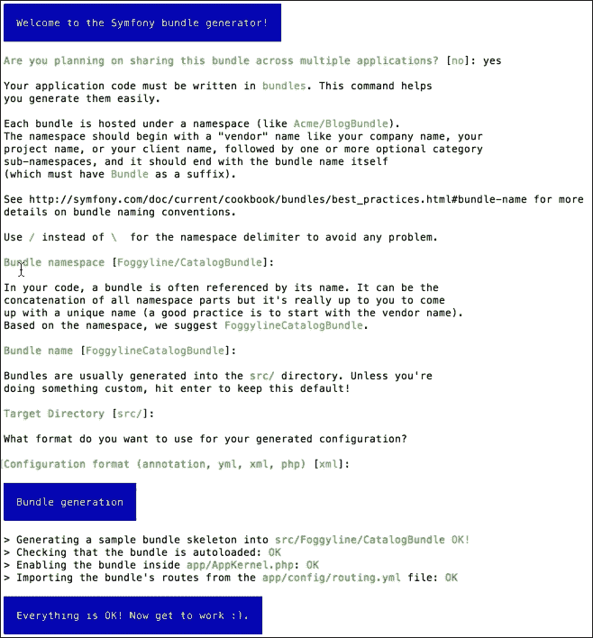
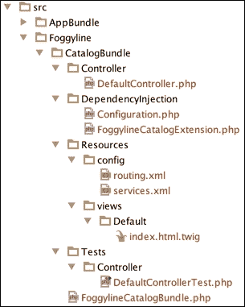
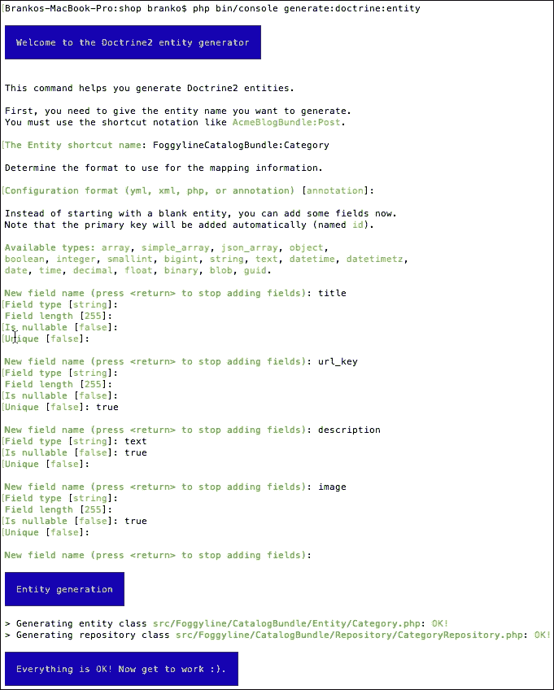
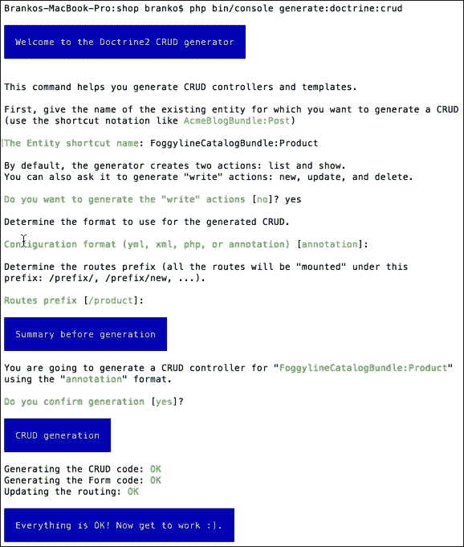
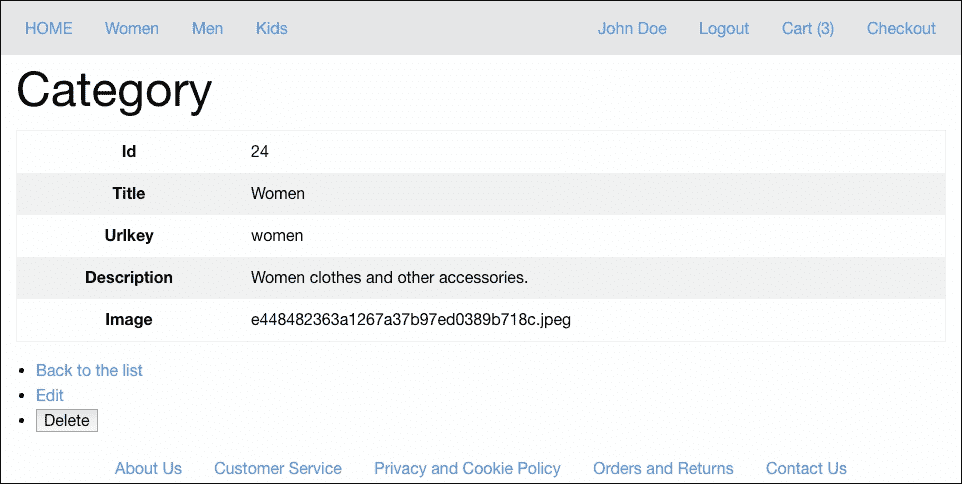
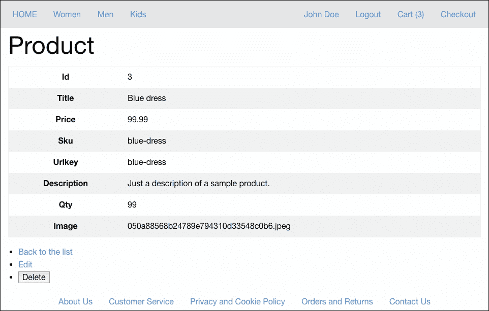

# 第七章。构建目录模块

目录模块是每个网店应用程序的基本组成部分。在最基本的级别上，它负责管理和显示类别和产品。这是以后模块的基础，例如结账，它为我们的网店应用程序添加了实际的销售功能。

更强大的目录功能可能包括大规模产品导入、产品导出、多仓库库存管理、私人会员类别等。然而，这些超出了本章的范围。

在本章中，我们将涵盖以下主题：

+   要求

+   依赖关系

+   实现

+   单元测试

+   功能测试

# 要求

根据第四章中定义的高级应用程序要求，*模块化网店应用的需求规范*，我们的模块将实现多个实体和其他特定功能。

以下是所需模块实体的列表：

+   类别

+   产品

类别实体包括以下属性及其数据类型：

+   `id`：整数，自增

+   `title`：字符串

+   `url_key`：字符串，唯一

+   `description`：文本

+   `image`：字符串

产品实体包括以下属性：

+   `id`：整数，自增

+   `category_id`：整数，引用类别表 ID 列的外键

+   `title`：字符串

+   `price`：十进制

+   `sku`：字符串，唯一

+   `url_key`：字符串，唯一

+   `description`：文本

+   `qty`：整数

+   `image`：字符串

+   `onsale`：布尔值

除了添加这些实体及其 CRUD 页面之外，我们还需要覆盖负责构建类别菜单和特价商品的核心模块服务。

# 依赖关系

该模块对任何其他模块没有明确的依赖关系。Symfony 框架服务层使我们能够以这样的方式编写模块，大多数情况下它们之间不需要依赖关系。虽然该模块确实覆盖了核心模块中定义的一个服务，但该模块本身并不依赖于它，如果覆盖的服务丢失，也不会出现任何问题。

# 实现

我们首先创建一个名为`Foggyline\CatalogBundle`的新模块。我们通过控制台运行以下命令来完成：

```php
**php bin/console generate:bundle --namespace=Foggyline/CatalogBundle**

```

该命令触发一个交互过程，在这个过程中，会向我们询问几个问题，如下截图所示：



完成后，我们生成了以下结构：



如果我们现在查看`app/AppKernel.php`文件，我们会在`registerBundles`方法下看到以下行：

```php
new Foggyline\CatalogBundle\FoggylineCatalogBundle()
```

同样，`app/config/routing.yml`中添加了以下路由定义：

```php
foggyline_catalog:
  resource: "@FoggylineCatalogBundle/Resources/config/routing.xml"
  prefix: /
```

在这里，我们需要将`prefix: /`更改为`prefix: /catalog/`，以便不与核心模块路由冲突。保持`prefix: /`将简单地覆盖我们的核心`AppBundle`，并从`src/Foggyline/CatalogBundle/Resources/views/Default/index.html.twig`模板向浏览器输出`Hello World!`。我们希望保持事情的清晰分离。这意味着该模块不为自身定义根路由。

## 创建实体

让我们继续创建一个`Category`实体。我们通过控制台来完成，如下所示：

```php
**php bin/console generate:doctrine:entity**

```



这将在`src/Foggyline/CatalogBundle/`目录中创建`Entity/Category.php`和`Repository/CategoryRepository.php`文件。之后，我们需要更新数据库，以便引入`Category`实体，如下命令行示例所示：

```php
**php bin/console doctrine:schema:update --force**

```

这将产生一个类似于以下截图的屏幕：


有了实体，我们就可以生成其 CRUD。我们通过以下命令来完成：

```php
**php bin/console generate:doctrine:crud**

```

这将产生如下交互式输出：


这导致创建了`src/Foggyline/CatalogBundle/Controller/CategoryController.php`。它还在我们的`app/config/routing.yml`文件中添加了一个条目，如下所示：

```php
foggyline_catalog_category:
  resource: "@FoggylineCatalogBundle/Controller/CategoryController.php"
  type:     annotation
```

此外，视图文件创建在`app/Resources/views/category/`目录下，这不是我们所期望的。我们希望它们在我们的模块`src/Foggyline/CatalogBundle/Resources/views/Default/category/`目录下，因此我们需要将它们复制过去。此外，我们需要修改`CategoryController`中的所有`$this->render`调用，通过在每个模板路径后附加`FoggylineCatalogBundle:default: string`来修改它们。

接下来，我们继续使用之前讨论过的交互式生成器创建`Product`实体：

```php
**php bin/console generate:doctrine:entity**

```

我们遵循交互式生成器，尊重以下属性的最小值：`title`、`price`、`sku`、`url_key`、`description`、`qty`、`category`和`image`。除了`price`和`qty`是十进制和整数类型之外，所有其他属性都是字符串类型。此外，`sku`和`url_key`被标记为唯一。这将在`src/Foggyline/CatalogBundle/`目录中创建`Entity/Product.php`和`Repository/ProductRepository.php`文件。

与我们为`Category view`模板所做的类似，我们需要为`Product view`模板做同样的事情。也就是说，将它们从`app/Resources/views/product/`目录复制到`src/Foggyline/CatalogBundle/Resources/views/Default/product/`，并通过在每个模板路径后附加`FoggylineCatalogBundle:default: string`来更新`ProductController`中的所有`$this->render`调用。

此时，我们不会急于更新模式，因为我们想要为我们的代码添加适当的关系。每个产品应该能够与单个`Category`实体建立关系。为了实现这一点，我们需要编辑`src/Foggyline/CatalogBundle/Entity/`目录中的`Category.php`和`Product.php`，如下所示：

```php
// src/Foggyline/CatalogBundle/Entity/Category.php

/**
 * @ORM\OneToMany(targetEntity="Product", mappedBy="category")
 */
private $products;

public function __construct()
{
  $this->products = new \Doctrine\Common\Collections\ArrayCollection();
}

// src/Foggyline/CatalogBundle/Entity/Product.php

/**
 * @ORM\ManyToOne(targetEntity="Category", inversedBy="products")
 * @ORM\JoinColumn(name="category_id", referencedColumnName="id")
 */
private $category;
```

我们还需要编辑`Category.php`文件，添加`__toString`方法的实现，如下所示：

```php
public function __toString()
{
    return $this->getTitle();
}
```

我们这样做的原因是，稍后，我们的产品编辑表单将知道在类别选择下列出什么标签，否则系统会抛出以下错误：

```php
Catchable Fatal Error: Object of class Foggyline\CatalogBundle\Entity\Category could not be converted to string
```

有了以上更改，我们现在可以运行模式更新，如下所示：

```php
**php bin/console doctrine:schema:update --force**

```

如果我们现在查看我们的数据库，`product`表的`CREATE`命令语法如下所示：

```php
CREATE TABLE `product` (
  `id` int(11) NOT NULL AUTO_INCREMENT,
  `category_id` int(11) DEFAULT NULL,
  `title` varchar(255) COLLATE utf8_unicode_ci NOT NULL,
  `price` decimal(10,2) NOT NULL,
  `sku` varchar(255) COLLATE utf8_unicode_ci NOT NULL,
  `url_key` varchar(255) COLLATE utf8_unicode_ci NOT NULL,
  `description` longtext COLLATE utf8_unicode_ci,
  `qty` int(11) NOT NULL,
  `image` varchar(255) COLLATE utf8_unicode_ci DEFAULT NULL,
  PRIMARY KEY (`id`),
  UNIQUE KEY `UNIQ_D34A04ADF9038C4` (`sku`),
  UNIQUE KEY `UNIQ_D34A04ADDFAB7B3B` (`url_key`),
  KEY `IDX_D34A04AD12469DE2` (`category_id`),
  CONSTRAINT `FK_D34A04AD12469DE2` FOREIGN KEY (`category_id`) REFERENCES `category` (`id`)
) ENGINE=InnoDB DEFAULT CHARSET=utf8 COLLATE=utf8_unicode_ci;
```

我们可以看到定义了两个唯一键和一个外键约束，根据我们交互式实体生成器提供的条目。现在我们准备为我们的`Product`实体生成 CRUD。为此，我们运行`generate:doctrine:crud`命令，并按照交互式生成器的指示进行操作，如下所示：



## 管理图像上传

此时，如果我们访问`/category/new/`或`/product/new/`URL，图像字段只是一个简单的文本输入字段，而不是我们想要的实际图像上传。为了将其变成图像上传字段，我们需要编辑`Category.php`和`Product.php`中的`$image`属性，如下所示：

```php
//…
use Symfony\Component\Validator\Constraints as Assert;
//…
class [Category|Product]
{
  //…
  /**
  * @var string
  *
  * @ORM\Column(name="image", type="string", length=255, nullable=true)
  * @Assert\File(mimeTypes={ "image/png", "image/jpeg" }, mimeTypesMessage="Please upload the PNG or JPEG image file.")
  */
  private $image;
  //…
}
```

一旦我们这样做，输入字段就变成了文件上传字段，如下所示：


接下来，我们将继续将上传功能实现到表单中。

我们首先通过在`src/Foggyline/CatalogBundle/Resources/config/services.xml`文件的`services`元素下添加以下条目来定义处理实际上传的服务：

```php
<service id="foggyline_catalog.image_uploader" class="Foggyline\CatalogBundle\Service\ImageUploader">
  <argument>%foggyline_catalog_images_directory%</argument>
</service>
```

`%foggyline_catalog_images_directory%`参数值是我们即将定义的一个参数的名称。

然后，我们创建`src/Foggyline/CatalogBundle/Service/ImageUploader.php`文件，内容如下：

```php
namespace Foggyline\CatalogBundle\Service;

use Symfony\Component\HttpFoundation\File\UploadedFile;

class ImageUploader
{
  private $targetDir;

  public function __construct($targetDir)
  {
    $this->targetDir = $targetDir;
  }

  public function upload(UploadedFile $file)
  {
    $fileName = md5(uniqid()) . '.' . $file->guessExtension();
    $file->move($this->targetDir, $fileName);
    return $fileName;
  }
}
```

然后，我们在`src/Foggyline/CatalogBundle/Resources/config`目录中创建自己的`parameters.yml`文件，内容如下：

```php
parameters:
  foggyline_catalog_images_directory: "%kernel.root_dir%/../web/uploads/foggyline_catalog_images"
```

这是我们的服务期望找到的参数。如果需要，可以在`app/config/parameters.yml`下用相同的条目轻松覆盖它。

为了使我们的 bundle 能够看到`parameters.yml`文件，我们仍然需要编辑`src/Foggyline/CatalogBundle/DependencyInjection/ directory`中的`FoggylineCatalogExtension.php`文件，通过在`load`方法的末尾添加以下`loader`来实现：

```php
$loader = new Loader\YamlFileLoader($container, new FileLocator(__DIR__.'/../Resources/config'));
$loader->load('parameters.yml');
```

此时，我们的 Symfony 模块能够读取其`parameters.yml`，从而使其定义的服务能够获取其参数的正确值。现在只需要调整我们的`new`和`edit`表单的代码，将上传功能附加到它们上。由于这两个表单是相同的，以下是一个同样适用于`Product`表单的`Category`示例：

```php
public function newAction(Request $request) {
  // ...

  if ($form->isSubmitted() && $form->isValid()) {
    /* @var $image \Symfony\Component\HttpFoundation\File\UploadedFile */
    if ($image = $category->getImage()) {
      $name = $this->get('foggyline_catalog.image_uploader')->upload($image);
      $category->setImage($name);
    }

    $em = $this->getDoctrine()->getManager();
    // ...
  }

  // ...
}

public function editAction(Request $request, Category $category) {
  $existingImage = $category->getImage();
  if ($existingImage) {
    $category->setImage(
      new File($this->getParameter('foggyline_catalog_images_directory') . '/' . $existingImage)
    );
  }

  $deleteForm = $this->createDeleteForm($category);
  // ...

  if ($editForm->isSubmitted() && $editForm->isValid()) {
    /* @var $image \Symfony\Component\HttpFoundation\File\UploadedFile */
    if ($image = $category->getImage()) {
      $name = $this->get('foggyline_catalog.image_uploader')->upload($image);
      $category->setImage($name);
    } elseif ($existingImage) {
      $category->setImage($existingImage);
    }

    $em = $this->getDoctrine()->getManager();
    // ...
  }

  // ...
}
```

现在`new`和`edit`表单都应该能够处理文件上传。

## 覆盖核心模块服务

现在让我们继续处理类别菜单和特价商品。在构建核心模块时，我们在`app/config/config.yml`文件的`twig:global`部分定义了全局变量。这些变量指向了在`app/config/services.yml`文件中定义的服务。为了改变类别菜单和特价商品的内容，我们需要覆盖这些服务。

我们首先在`src/Foggyline/CatalogBundle/Resources/config/services.xml`文件中添加以下两个服务定义：

```php
<service id="foggyline_catalog.category_menu" class="Foggyline\CatalogBundle\Service\Menu\Category">
  <argument type="service" id="doctrine.orm.entity_manager" />
  <argument type="service" id="router" />
</service>

<service id="foggyline_catalog.onsale" class="Foggyline\CatalogBundle\Service\Menu\OnSale">
  <argument type="service" id="doctrine.orm.entity_manager" />
  <argument type="service" id="router" />
</service>
```

这两个服务都接受 Doctrine ORM 实体管理器和路由器服务参数，因为我们需要在内部使用它们。

然后我们在`src/Foggyline/CatalogBundle/Service/Menu/`目录中创建了实际的`Category`和`OnSale`服务类，如下所示：

```php
//Category.php

namespace Foggyline\CatalogBundle\Service\Menu;

class Category
{
  private $em;
  private $router;

  public function __construct(
    \Doctrine\ORM\EntityManager $entityManager,
    \Symfony\Bundle\FrameworkBundle\Routing\Router $router
  )
  {
    $this->em = $entityManager;
    $this->router = $router;
  }

  public function getItems()
  {
    $categories = array();
    $_categories = $this->em->getRepository('FoggylineCatalogBundle:Category')->findAll();

    foreach ($_categories as $_category) {
      /* @var $_category \Foggyline\CatalogBundle\Entity\Category */
      $categories[] = array(
        'path' => $this->router->generate('category_show', array('id' => $_category->getId())),
        'label' => $_category->getTitle(),
      );
    }

    return $categories;
  }
}
 //OnSale.php

namespace Foggyline\CatalogBundle\Service\Menu;

class OnSale
{
  private $em;
  private $router;

  public function __construct(\Doctrine\ORM\EntityManager $entityManager, $router)
  {
    $this->em = $entityManager;
    $this->router = $router;
  }

  public function getItems()
  {
    $products = array();
    $_products = $this->em->getRepository('FoggylineCatalogBundle:Product')->findBy(
        array('onsale' => true),
        null,
        5
    );

    foreach ($_products as $_product) {
      /* @var $_product \Foggyline\CatalogBundle\Entity\Product */
      $products[] = array(
        'path' => $this->router->generate('product_show', array('id' => $_product->getId())),
        'name' => $_product->getTitle(),
        'image' => $_product->getImage(),
        'price' => $_product->getPrice(),
        'id' => $_product->getId(),
      );
    }

    return $products;
  }
}
```

这样单独做不会触发核心模块服务的覆盖。在`src/Foggyline/CatalogBundle/DependencyInjection/Compiler/`目录中，我们需要创建一个实现`CompilerPassInterface`的`OverrideServiceCompilerPass`类。在其`process`方法中，我们可以改变服务的定义，如下所示：

```php
namespace Foggyline\CatalogBundle\DependencyInjection\Compiler;

use Symfony\Component\DependencyInjection\Compiler\CompilerPassInterface;
use Symfony\Component\DependencyInjection\ContainerBuilder;

class OverrideServiceCompilerPass implements CompilerPassInterface
{
  public function process(ContainerBuilder $container)
  {
    // Override the core module 'category_menu' service
    $container->removeDefinition('category_menu');
    $container->setDefinition('category_menu', $container->getDefinition('foggyline_catalog.category_menu'));

    // Override the core module 'onsale' service
    $container->removeDefinition('onsale');
    $container->setDefinition('onsale', $container->getDefinition('foggyline_catalog.onsale'));
  }
}
```

最后，我们需要编辑`src/Foggyline/CatalogBundle/FoggylineCatalogBundle.php`文件的`build`方法，以添加这个编译器通行证，如下所示：

```php
public function build(ContainerBuilder $container)
{
  parent::build($container);
  $container->addCompilerPass(new \Foggyline\CatalogBundle\DependencyInjection\Compiler\OverrideServiceCompilerPass());
}
```

现在我们的`Category`和`OnSale`服务应该覆盖核心模块中定义的服务，从而为主页的标题**类别**菜单和**特价**部分提供正确的值。

## 设置类别页面

自动生成的 CRUD 为我们创建了一个类别页面，布局如下：



这与第四章中定义的类别页面有很大不同，因此我们需要修改`src/Foggyline/CatalogBundle/Resources/views/Default/category/`目录中的`show.html.twig`文件来修改我们的类别展示页面。我们通过用以下代码替换`body`块的整个内容来实现：

```php
<div class="row">
  <div class="small-12 large-12 columns text-center">
    <h1>{{ category.title }}</h1>
    <p>{{ category.description }}</p>
  </div>
</div>

<div class="row">
  
</div>



<div class="row products_onsale text-center small-up-1 medium-up-3 large-up-5" data-equalizer data-equalize-by-row="true">

<div class="column product">
  
  <a href="{{ path('product_show', {'id': product.id}) }}">{{ product.title }}</a>

  <div>${{ product.price }}</div>
  <div><a class="small button" href="{{ path('product_show', {'id': product.id}) }}">View</a></div>
  </div>
  
</div>

<div class="row">
  <p>There are no products assigned to this category.</p>
</div>



<ul>
  <li>
    <a href="{{ path('category_edit', { 'id': category.id }) }}">Edit</a>
  </li>
  <li>
    {{ form_start(delete_form) }}
    <input type="submit" value="Delete">
    form_end(delete_form) }}
  </li>
</ul>

```

现在主体分为三个区域。首先，我们处理类别标题和描述输出。然后，我们获取并循环遍历分配给类别的产品列表，渲染每个单独的产品。最后，我们使用`is_granted` Twig 扩展来检查当前用户角色是否为`ROLE_ADMIN`，在这种情况下，我们显示类别的`编辑`和`删除`链接。

## 设置产品页面

自动生成的 CRUD 为我们创建了一个产品页面，布局如下：



这与第四章中定义的产品页面有所不同，*模块化网店应用的需求规格*。为了纠正问题，我们需要修改`src/Foggyline/CatalogBundle/Resources/views/Default/product/`目录中的`show.html.twig`文件，通过替换`body`块的整个内容来实现。

```php
<div class="row">
  <div class="small-12 large-6 columns">
    
  </div>
  <div class="small-12 large-6 columns">
    <h1>{{ product.title }}</h1>
    <div>SKU: {{ product.sku }}</div>
    
    <div>IN STOCK</div>
    
    <div>OUT OF STOCK</div>
    
    <div>$ {{ product.price }}</div>
    <form action="{{ add_to_cart_url.getAddToCartUrl
      (product.id) }}" method="get">
      <div class="input-group">
        <span class="input-group-label">Qty</span>
        <input class="input-group-field" type="number">
        <div class="input-group-button">
          <input type="submit" class="button" value="Add to Cart">
        </div>
      </div>
    </form>
  </div>
</div>

<div class="row">
  <p>{{ product.description }}</p>
</div>


<ul>
  <li>
    <a href="{{ path('product_edit', { 'id': product.id }) }}">Edit</a>
  </li>
  <li>
    {{ form_start(delete_form) }}
    <input type="submit" value="Delete">
    {{ form_end(delete_form) }}
  </li>
</ul>

```

现在，主体分为两个主要部分。首先，我们处理产品图片、标题、库存状态和添加到购物车输出。添加到购物车表单使用`add_to_cart_url`服务来提供正确的链接。这个服务在核心模块中定义，并且目前只提供一个虚拟链接。稍后，当我们到达结账模块时，我们将为这个服务实现一个覆盖，并注入正确的添加到购物车链接。然后我们输出描述部分。最后，我们使用`is_granted` Twig 扩展，就像我们在 Category 示例中所做的那样，来确定用户是否可以访问产品的`编辑`和`删除`链接。

# 单元测试

现在我们有几个与控制器无关的类文件，这意味着我们可以对它们进行单元测试。但是，作为本书的一部分，我们不会追求完整的代码覆盖率，而是专注于一些小而重要的事情，比如在我们的测试类中使用容器。

我们首先在`phpunit.xml.dist`文件的`testsuites`元素下添加以下行：

```php
<directory>src/Foggyline/CatalogBundle/Tests</directory>
```

有了这个设置，从我们商店的根目录运行`phpunit`命令应该会捡起我们在`src/Foggyline/CatalogBundle/Tests/`目录下定义的任何测试。

现在让我们为我们的 Category 服务菜单创建一个测试。我们通过创建一个`src/Foggyline/CatalogBundle/Tests/Service/Menu/CategoryTest.php`文件来实现：

```php
namespace Foggyline\CatalogBundle\Tests\Service\Menu;

use Symfony\Bundle\FrameworkBundle\Test\KernelTestCase;
use Foggyline\CatalogBundle\Service\Menu\Category;

class CategoryTest extends KernelTestCase
{
  private $container;
  private $em;
  private $router;

  public function setUp()
  {
    static::bootKernel();
    $this->container = static::$kernel->getContainer();
    $this->em = $this->container->get('doctrine.orm.entity_manager');
    $this->router = $this->container->get('router');
  }

  public function testGetItems()
  {
    $service = new Category($this->em, $this->router);
    $this->assertNotEmpty($service->getItems());
  }

  protected function tearDown()
  {
    $this->em->close();
    unset($this->em, $this->router);
  }
}
```

前面的例子展示了`setUp`和`tearDown`方法的使用，它们的行为类似于 PHP 的`__construct`和`__destruct`方法。我们使用`setUp`方法来设置实体管理器和路由器服务，以便在类的其余部分中使用。`tearDown`方法只是一个清理工作。现在如果我们运行`phpunit`命令，我们应该能看到我们的测试被捡起并在其他测试之后执行。

我们甚至可以通过执行带有完整类路径的`phpunit`命令来专门针对这个类，如下所示：

```php
**phpunit src/Foggyline/CatalogBundle/Tests/Service/Menu/CategoryTest.php**

```

类似于我们为`CategoryTest`所做的，我们可以继续创建`OnSaleTest`；两者之间唯一的区别是类名。

# 功能测试

自动生成 CRUD 工具的好处在于它甚至为我们生成了功能测试。具体来说，在这种情况下，它在`src/Foggyline/CatalogBundle/Tests/Controller/`目录下生成了`CategoryControllerTest.php`和`ProductControllerTest.php`文件。

### 提示

自动生成的功能测试在类体内有注释掉的方法。这在`phpunit`运行时会报错。我们至少需要在其中定义一个虚拟的`test`方法，以便让`phpunit`忽略它们。

如果我们查看这两个文件，我们会发现它们都定义了一个`testCompleteScenario`方法，但是这个方法完全被注释掉了。让我们继续并修改`CategoryControllerTest.php`的内容如下：

```php
// Create a new client to browse the application
$client = static::createClient(
  array(), array(
    'PHP_AUTH_USER' => 'john',
    'PHP_AUTH_PW' => '1L6lllW9zXg0',
  )
);

// Create a new entry in the database
$crawler = $client->request('GET', '/category/');
$this->assertEquals(200, $client->getResponse()->getStatusCode(), "Unexpected HTTP status code for GET /product/");
$crawler = $client->click($crawler->selectLink('Create a new entry')->link());

// Fill in the form and submit it
$form = $crawler->selectButton('Create')->form(array(
  'category[title]' => 'Test',
  'category[urlKey]' => 'Test urlKey',
  'category[description]' => 'Test description',
));

$client->submit($form);
$crawler = $client->followRedirect();

// Check data in the show view
$this->assertGreaterThan(0, $crawler->filter('h1:contains("Test")')->count(), 'Missing element h1:contains("Test")');

// Edit the entity
$crawler = $client->click($crawler->selectLink('Edit')->link());

$form = $crawler->selectButton('Edit')->form(array(
  'category[title]' => 'Foo',
  'category[urlKey]' => 'Foo urlKey',
  'category[description]' => 'Foo description',
));

$client->submit($form);
$crawler = $client->followRedirect();

// Check the element contains an attribute with value equals "Foo"
$this->assertGreaterThan(0, $crawler->filter('[value="Foo"]')->count(), 'Missing element [value="Foo"]');

// Delete the entity
$client->submit($crawler->selectButton('Delete')->form());
$crawler = $client->followRedirect();

// Check the entity has been delete on the list
$this->assertNotRegExp('/Foo title/', $client->getResponse()->getContent());
```

我们首先将`PHP_AUTH_USER`和`PHP_AUTH_PW`设置为`createClient`方法的参数。这是因为我们的`/new`和`/edit`路由受核心模块安全保护。这些设置允许我们在请求中传递基本的 HTTP 身份验证。然后我们测试了类别列表页面是否可以访问以及它的`创建新条目`链接是否可以被点击。此外，我们还测试了`create`和`edit`表单以及它们的结果。

现在剩下的就是重复我们刚才在`CategoryControllerTest.php`中使用的方法，在`ProductControllerTest.php`中进行。我们只需要在`ProductControllerTest`类文件中更改一些标签，以匹配`product`路由和预期结果。

现在运行`phpunit`命令应该能成功执行我们的测试。

# 总结

在本章中，我们构建了一个微型但功能齐全的目录模块。它允许我们创建、编辑和删除类别和产品。通过在自动生成的 CRUD 之上添加几行自定义代码，我们能够为类别和产品实现图像上传功能。我们还看到了如何覆盖核心模块服务，只需删除现有的服务定义并提供一个新的定义。在测试方面，我们看到了如何在我们的请求中传递身份验证以测试受保护的路由。

在接下来的章节中，我们将构建一个客户模块。
