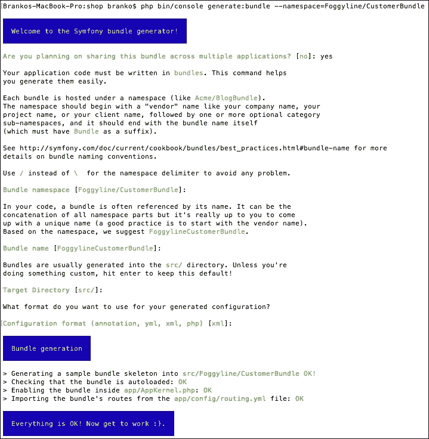
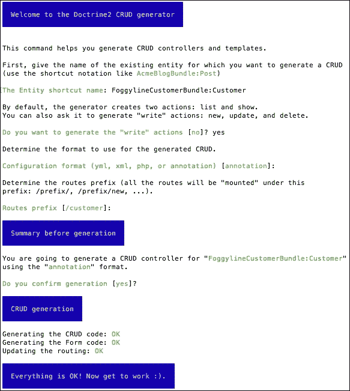
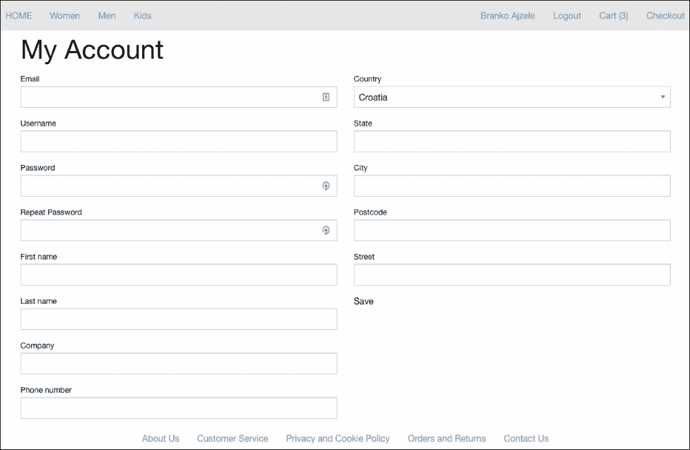

# 第八章。构建客户模块

客户模块为我们的网店提供了进一步销售功能的基础。在非常基本的层面上，它负责注册、登录、管理和显示相关客户信息。这是后续销售模块的要求，它为我们的网店应用程序添加了实际的销售功能。

在本章中，我们将涵盖以下主题：

+   要求

+   依赖关系

+   实现

+   单元测试

+   功能测试

# 要求

根据第四章中定义的高级应用程序要求，*模块化网店应用的需求规范*，我们的模块将定义一个名为`Customer`的实体。

`Customer`实体包括以下属性：

+   `id`: integer, auto-increment

+   `email`: string, unique

+   `username`: string, unique, needed for login system

+   `password`: string

+   `first_name`: string

+   `last_name`: string

+   `company`: string

+   `phone_number`: string

+   `country`: string

+   `state`: string

+   `city`: string

+   `postcode`: string

+   `street`: string

在本章中，除了添加`Customer`实体及其 CRUD 页面之外，我们还需要处理登录、注册、忘记密码页面的创建，以及覆盖一个负责构建客户菜单的核心模块服务。

# 依赖关系

该模块不依赖于任何其他模块。虽然它覆盖了核心模块中定义的一个服务，但模块本身并不依赖于它。此外，一些安全配置将作为核心应用程序的一部分提供，我们稍后会看到。

# 实现

我们首先创建一个名为`Foggyline\CustomerBundle`的新模块。我们可以通过控制台运行以下命令来实现：

```php
**php bin/console generate:bundle --namespace=Foggyline/CustomerBundle**

```

该命令触发了一个交互式过程，在这个过程中会问我们一些问题，如下面的截图所示：



完成后，我们得到了以下结构：


如果我们现在查看`app/AppKernel.php`文件，我们会在`registerBundles`方法下看到以下行：

```php
new Foggyline\CustomerBundle\FoggylineCustomerBundle()
```

同样，`app/config/routing.yml`目录中添加了以下路由定义：

```php
foggyline_customer:
  resource: "@FoggylineCustomerBundle/Resources/config/routing.xml"
  prefix:   /
```

在这里，我们需要将`prefix: /`更改为`prefix: /customer/`，这样我们就不会与核心模块的路由冲突。保持`prefix: /`不变将简单地覆盖我们的核心`AppBundle`，并从`src/Foggyline/CustomerBundle/Resources/views/Default/index.html.twig`模板向浏览器输出**Hello World!**。我们希望保持事情的清晰和分离。这意味着该模块不为自己定义`root`路由。

## 创建客户实体

让我们继续创建一个`Customer`实体。我们可以通过控制台来实现：

```php
**php bin/console generate:doctrine:entity**

```

这个命令触发了交互式生成器，我们需要提供实体属性。完成后，生成器将在`src/Foggyline/CustomerBundle/`目录中创建`Entity/Customer.php`和`Repository/CustomerRepository.php`文件。之后，我们需要更新数据库，以便通过运行以下命令引入`Customer`实体：

```php
**php bin/console doctrine:schema:update --force**

```

这导致了一个屏幕，如下面的截图所示：


有了实体，我们就可以生成它的 CRUD。我们可以通过以下命令来实现：

```php
**php bin/console generate:doctrine:crud**

```

这导致了一个交互式输出，如下所示：



这导致了`src/Foggyline/CustomerBundle/Controller/CustomerController.php`目录的创建。它还在我们的`app/config/routing.yml`文件中添加了一个条目，如下所示：

```php
foggyline_customer_customer:
  resource: "@FoggylineCustomerBundle/Controller/CustomerController.php"
  type:     annotation
```

同样，视图文件是在`app/Resources/views/customer/`目录下创建的，这不是我们所期望的。我们希望它们在我们的模块`src/Foggyline/CustomerBundle/Resources/views/Default/customer/`目录下，所以我们需要将它们复制过去。此外，我们需要修改`CustomerController`中的所有`$this->render`调用，通过在每个模板路径后附加`FoggylineCustomerBundle:default: string`来实现。

## 修改安全配置

在我们继续进行模块内的实际更改之前，让我们想象一下我们的模块要求规定了某种安全配置以使其工作。这些要求规定我们需要对`app/config/security.yml`文件进行几处更改。我们首先编辑`providers`元素，添加以下条目：

```php
foggyline_customer:
  entity:
    class: FoggylineCustomerBundle:Customer
  property: username
```

这有效地将我们的`Customer`类定义为安全提供者，而`username`元素是存储用户身份的属性。

然后，在`encoders`元素下定义编码器类型，如下所示：

```php
Foggyline\CustomerBundle\Entity\Customer:
  algorithm: bcrypt
  cost: 12
```

这告诉 Symfony 在加密密码时使用`bcrypt`算法，算法成本为`12`。这样，我们的密码在保存到数据库中时就不会以明文形式出现。

然后，我们继续在`firewalls`元素下定义一个新的防火墙条目，如下所示：

```php
foggyline_customer:
  anonymous: ~
  provider: foggyline_customer
  form_login:
    login_path: foggyline_customer_login
    check_path: foggyline_customer_login
    default_target_path: customer_account
  logout:
    path:   /customer/logout
    target: /
```

这里发生了很多事情。我们的防火墙使用`anonymous: ~`定义来表示它实际上不需要用户登录即可查看某些页面。默认情况下，所有 Symfony 用户都被验证为匿名用户，如下图所示，在**Developer**工具栏上：


`form_login`定义有三个属性。`login_path`和`check_path`指向我们的自定义路由`foggyline_customer_login`。当安全系统启动认证过程时，它将重定向用户到`foggyline_customer_login`路由，我们将很快实现所需的控制器逻辑和视图模板，以处理登录表单。一旦登录，`default_target_path`确定用户将被重定向到哪里。

最后，我们重用 Symfony 匿名用户功能，以排除某些页面被禁止。我们希望我们的非认证客户能够访问登录、注册和忘记密码页面。为了实现这一点，我们在`access_control`元素下添加以下条目：

```php
- { path: customer/login, roles: IS_AUTHENTICATED_ANONYMOUSLY }
- { path: customer/register, roles: IS_AUTHENTICATED_ANONYMOUSLY }
- { path: customer/forgotten_password, roles: IS_AUTHENTICATED_ANONYMOUSLY }
- { path: customer/account, roles: ROLE_USER }
- { path: customer/logout, roles: ROLE_USER }
- { path: customer/, roles: ROLE_ADMIN }
```

值得注意的是，这种处理模块和基本应用程序之间安全性的方法远非理想。这只是一个可能的例子，说明了我们如何实现这个模块所需的功能。

## 扩展客户实体

有了前面的`security.yml`添加，我们现在准备开始实际实现注册流程。首先，我们编辑`src/Foggyline/CustomerBundle/Entity/`目录中的`Customer`实体，使其实现`Symfony\Component\Security\Core\User\UserInterface`、`\Serializable`。这意味着需要实现以下方法：

```php
public function getSalt()
{
  return null;
}

public function getRoles()
{
  return array('ROLE_USER');
}

public function eraseCredentials()
{
}

public function serialize()
{
  return serialize(array(
    $this->id,
    $this->username,
    $this->password
  ));
}

public function unserialize($serialized)
{
  list (
    $this->id,
    $this->username,
    $this->password,
  ) = unserialize($serialized);
}
```

尽管所有密码都需要使用盐进行哈希处理，但在这种情况下`getSalt`函数是无关紧要的，因为`bcrypt`在内部已经处理了这个问题。`getRoles`函数是重要的部分。我们可以返回一个或多个个体客户将拥有的角色。为了简化，我们将为每个客户分配一个`ROLE_USER`角色。但是这可以很容易地更加健壮，以便将角色存储在数据库中。`eraseCredentials`函数只是一个清理方法，我们将其留空。

由于用户对象首先被反序列化、序列化并保存到每个请求的会话中，我们实现了`\Serializable`接口。序列化和反序列化的实际实现可以只包括一小部分客户属性，因为我们不需要将所有东西都存储在会话中。

在我们继续并开始实现注册、登录、忘记密码和其他部分之前，让我们先定义我们稍后要使用的所需服务。

## 创建订单服务

我们将创建一个`orders`服务，用于填充**我的账户**页面下可用的数据。稍后，其他模块可以覆盖此服务并注入真实的客户订单。要定义一个`orders`服务，我们通过在`src/Foggyline/CustomerBundle/Resources/config/services.xml`文件中在`services`元素下添加以下内容来进行编辑：

```php
<service id="foggyline_customer.customer_orders" class="Foggyline\CustomerBundle\Service\CustomerOrders">
</service>
```

然后，我们继续创建`src/Foggyline/CustomerBundle/Service/CustomerOrders.php`目录，内容如下：

```php
namespace Foggyline\CustomerBundle\Service;

class CustomerOrders
{
  public function getOrders()
  {
    return array(
      array(
        'id' => '0000000001',
        'date' => '23/06/2016 18:45',
        'ship_to' => 'John Doe',
        'order_total' => 49.99,
        'status' => 'Processing',
        'actions' => array(
          array(
            'label' => 'Cancel',
            'path' => '#'
          ),
          array(
            'label' => 'Print',
            'path' => '#'
          )
        )
      ),
    );
  }
}
```

`getOrders`方法在这里只是返回一些虚拟数据。我们可以很容易地使其返回一个空数组。理想情况下，我们希望它返回符合某些特定接口的某些类型元素的集合。

## 创建客户菜单服务

在上一个模块中，我们定义了一个填充客户菜单的`customer`服务，并填充了一些虚拟数据。现在我们将创建一个覆盖服务，根据客户登录状态填充菜单的实际客户数据。要定义一个`customer menu`服务，我们通过在`src/Foggyline/CustomerBundle/Resources/config/services.xml`文件中在`services`元素下添加以下内容来进行编辑：

```php
<service id="foggyline_customer.customer_menu" class="Foggyline\CustomerBundle\Service\Menu\CustomerMenu">
  <argument type="service" id="security.token_storage"/>
  <argument type="service" id="router"/>
</service>
```

在这里，我们将`token_storage`和`router`对象注入到我们的服务中，因为我们需要它们根据客户的登录状态构建菜单。

然后，我们继续创建`src/Foggyline/CustomerBundle/Service/Menu/CustomerMenu.php`目录，内容如下：

```php
namespace Foggyline\CustomerBundle\Service\Menu;

class CustomerMenu
{
  private $token;
  private $router;

  public function __construct(
    $tokenStorage,
    \Symfony\Bundle\FrameworkBundle\Routing\Router $router
  )
  {
    $this->token = $tokenStorage->getToken();
    $this->router = $router;
  }

  public function getItems()
  {
    $items = array();
    $user = $this->token->getUser();

    if ($user instanceof \Foggyline\CustomerBundle\Entity\Customer) {
      // customer authentication
      $items[] = array(
        'path' => $this->router->generate('customer_account'),
        'label' => $user->getFirstName() . ' ' . $user->getLastName(),
      );
      $items[] = array(
        'path' => $this->router->generate('customer_logout'),
        'label' => 'Logout',
      );
    } else {
      $items[] = array(
        'path' => $this->router->generate('foggyline_customer_login'),
        'label' => 'Login',
      );
      $items[] = array(
        'path' => $this->router->generate('foggyline_customer_register'),
        'label' => 'Register',
      );
    }

    return $items;
  }
}
```

在这里，我们看到一个基于用户登录状态构建菜单。这样，客户在登录时可以看到**注销**链接，未登录时可以看到**登录**链接。

然后，我们添加`src/Foggyline/CustomerBundle/DependencyInjection/Compiler/OverrideServiceCompilerPass.php`目录，内容如下：

```php
namespace Foggyline\CustomerBundle\DependencyInjection\Compiler;

use Symfony\Component\DependencyInjection\Compiler\CompilerPassInterface;
use Symfony\Component\DependencyInjection\ContainerBuilder;

class OverrideServiceCompilerPass implements CompilerPassInterface
{
  public function process(ContainerBuilder $container)
  {
    // Override the core module 'onsale' service
    $container->removeDefinition('customer_menu');
    $container->setDefinition('customer_menu', $container->getDefinition('foggyline_customer.customer_menu'));
  }
}
```

在这里，我们正在实际进行`customer_menu`服务覆盖。但是，这不会生效，直到我们通过添加以下内容来编辑`src/Foggyline/CustomerBundle/FoggylineCustomerBundle.php`目录的`build`方法：

```php
namespace Foggyline\CustomerBundle;

use Symfony\Component\HttpKernel\Bundle\Bundle;
use Symfony\Component\DependencyInjection\ContainerBuilder;
use Foggyline\CustomerBundle\DependencyInjection\Compiler\OverrideServiceCompilerPass;

class FoggylineCustomerBundle extends Bundle
{
  public function build(ContainerBuilder $container)
  {
    parent::build($container);;
    $container->addCompilerPass(new OverrideServiceCompilerPass());
  }
}
```

`addCompilerPass`方法调用接受我们的`OverrideServiceCompilerPass`实例，确保我们的服务覆盖将生效。

## 实现注册流程

要实现注册页面，我们首先修改`src/Foggyline/CustomerBundle/Controller/CustomerController.php`文件如下：

```php
/**
 * @Route("/register", name="foggyline_customer_register")
 */
public function registerAction(Request $request)
{
  // 1) build the form
  $user = new Customer();
  $form = $this->createForm(CustomerType::class, $user);

  // 2) handle the submit (will only happen on POST)
  $form->handleRequest($request);
  if ($form->isSubmitted() && $form->isValid()) {

    // 3) Encode the password (you could also do this via Doctrine listener)
    $password = $this->get('security.password_encoder')
    ->encodePassword($user, $user->getPlainPassword());
    $user->setPassword($password);

    // 4) save the User!
    $em = $this->getDoctrine()->getManager();
    $em->persist($user);
    $em->flush();

    // ... do any other work - like sending them an email, etc
    // maybe set a "flash" success message for the user

    return $this->redirectToRoute('customer_account');
  }

  return $this->render(
    'FoggylineCustomerBundle:default:customer/register.html.twig',
    array('form' => $form->createView())
  );
}
```

注册页面使用标准的自动生成的客户 CRUD 表单，只需将其指向`src/Foggyline/CustomerBundle/Resources/views/Default/customer/register.html.twig`模板文件，内容如下：

```php


  {{ form_start(form) }}
  {{ form_widget(form) }}
  <button type="submit">Register!</button>
  {{ form_end(form) }}

```

一旦这两个文件就位，我们的注册功能应该就能正常工作了。

## 实现登录流程

我们将在独立的`/customer/login` URL 上实现登录页面，因此我们通过添加以下`loginAction`函数来编辑`CustomerController.php`文件：

```php
/**
 * Creates a new Customer entity.
 *
 * @Route("/login", name="foggyline_customer_login")
 */
public function loginAction(Request $request)
{
  $authenticationUtils = $this->get('security.authentication_utils');

  // get the login error if there is one
  $error = $authenticationUtils->getLastAuthenticationError();

  // last username entered by the user
  $lastUsername = $authenticationUtils->getLastUsername();

  return $this->render(
    'FoggylineCustomerBundle:default:customer/login.html.twig',
    array(
      // last username entered by the user
      'last_username' => $lastUsername,
      'error'         => $error,
    )
  );
}
```

在这里，我们只是检查用户是否已经尝试登录，如果是，我们将将该信息传递给模板，以及潜在的错误。然后我们编辑`src/Foggyline/CustomerBundle/Resources/views/Default/customer/login.html.twig`文件，内容如下：

```php



<div>{{ error.messageKey|trans(error.messageData, 'security') }}</div>


<form action="{{ path('foggyline_customer_login') }}" method="post">
  <label for="username">Username:</label>
  <input type="text" id="username" name="_username" value="{{ last_username }}"/>
  <label for="password">Password:</label>
  <input type="password" id="password" name="_password"/>
  <button type="submit">login</button>
</form>

<div class="row">
  <a href="{{ path('customer_forgotten_password') }}">Forgot your password?</a>
</div>

```

一旦登录，用户将被重定向到`/customer/account`页面。我们通过在`CustomerController.php`文件中添加`accountAction`方法来创建此页面，如下所示：

```php
/**
 * Finds and displays a Customer entity.
 *
 * @Route("/account", name="customer_account")
 * @Method({"GET", "POST"})
 */
public function accountAction(Request $request)
{
  if (!$this->get('security.authorization_checker')->isGranted('ROLE_USER')) {
    throw $this->createAccessDeniedException();
  }

  if ($customer = $this->getUser()) {

    $editForm = $this->createForm('Foggyline\CustomerBundle\Form\CustomerType', $customer, array( 'action' => $this->generateUrl('customer_account')));
    $editForm->handleRequest($request);

    if ($editForm->isSubmitted() && $editForm->isValid()) {
      $em = $this->getDoctrine()->getManager();
      $em->persist($customer);
      $em->flush();

      $this->addFlash('success', 'Account updated.');
      return $this->redirectToRoute('customer_account');
    }

    return $this->render('FoggylineCustomerBundle:default:customer/account.html.twig', array(
    'customer' => $customer,
    'form' => $editForm->createView(),
    'customer_orders' => $this->get('foggyline_customer.customer_orders')->getOrders()
    ));
  } else {
    $this->addFlash('notice', 'Only logged in customers can access account page.');
    return $this->redirectToRoute('foggyline_customer_login');
  }
}
```

使用`$this->getUser()`我们正在检查已登录用户是否已设置，如果是，则将其信息传递给模板。然后我们编辑`src/Foggyline/CustomerBundle/Resources/views/Default/customer/account.html.twig`文件，内容如下：

```php


<h1>My Account</h1>
{{ form_start(form) }}
<div class="row">
  <div class="medium-6 columns">
    {{ form_row(form.email) }}
    {{ form_row(form.username) }}
    {{ form_row(form.plainPassword.first) }}
    {{ form_row(form.plainPassword.second) }}
    {{ form_row(form.firstName) }}
    {{ form_row(form.lastName) }}
    {{ form_row(form.company) }}
    {{ form_row(form.phoneNumber) }}
  </div>
  <div class="medium-6 columns">
    {{ form_row(form.country) }}
    {{ form_row(form.state) }}
    {{ form_row(form.city) }}
    {{ form_row(form.postcode) }}
    {{ form_row(form.street) }}
    <button type="submit">Save</button>
  </div>
</div>
{{ form_end(form) }}
<!-- customer_orders -->

```

通过这样做，我们解决了**我的账户**页面的实际客户信息部分。在当前状态下，该页面应该呈现一个编辑表单，如下截图所示，使我们能够编辑所有客户信息：



然后，我们通过以下方式替换`<!-- customer_orders -->`：

```php

<h2>My Orders</h2>
<div class="row">
  <table>
    <thead>
      <tr>
        <th width="200">Order Id</th>
        <th>Date</th>
        <th width="150">Ship To</th>
        <th width="150">Order Total</th>
        <th width="150">Status</th>
        <th width="150">Actions</th>
      </tr>
    </thead>
    <tbody>
      
      <tr>
        <td>{{ order.id }}</td>
        <td>{{ order.date }}</td>
        <td>{{ order.ship_to }}</td>
        <td>{{ order.order_total }}</td>
        <td>{{ order.status }}</td>
        <td>
          <div class="small button-group">
            
            <a class="button" href="{{ action.path }}">{{ action.label }}</a>
            
          </div>
        </td>
      </tr>
      
    /tbody>
  </table>
</div>

```

现在应该呈现**My Account**页面的**My Orders**部分，如下所示：

实现登录流程

这只是来自`src/Foggyline/CustomerBundle/Resources/config/services.xml`中定义的服务的虚拟数据。在后面的章节中，当我们到达销售模块时，我们将确保它覆盖`foggyline_customer.customer_orders`服务，以便在这里插入真实的客户数据。

## 实现注销流程

在定义防火墙时，我们对`security.yml`所做的更改之一是配置注销路径，我们将其指向`/customer/logout`。该路径的实现在`CustomerController.php`文件中如下：

```php
/**
 * @Route("/logout", name="customer_logout")
 */
public function logoutAction()
{

}
```

注意，`logoutAction`方法实际上是空的。没有实际的实现。不需要实现，因为 Symfony 拦截请求并为我们处理注销。但是，我们需要定义这个路由，因为我们在`system.xml`文件中引用了它。

## 管理忘记密码

忘记密码功能将作为一个单独的页面实现。我们通过向`CustomerController.php`文件添加`forgottenPasswordAction`函数来编辑它，如下所示：

```php
/**
 * @Route("/forgotten_password", name="customer_forgotten_password")
 * @Method({"GET", "POST"})
 */
public function forgottenPasswordAction(Request $request)
{

  // Build a form, with validation rules in place
  $form = $this->createFormBuilder()
  ->add('email', EmailType::class, array(
    'constraints' => new Email()
  ))
  ->add('save', SubmitType::class, array(
    'label' => 'Reset!',
    'attr' => array('class' => 'button'),
  ))
  ->getForm();

  // Check if this is a POST type request and if so, handle form
  if ($request->isMethod('POST')) {
    $form->handleRequest($request);

    if ($form->isSubmitted() && $form->isValid()) {
      $this->addFlash('success', 'Please check your email for reset password.');

      // todo: Send an email out to website admin or something...

      return $this->redirect($this->generateUrl('foggyline_customer_login'));
    }
  }

  // Render "contact us" page
  return $this->render('FoggylineCustomerBundle:default:customer/forgotten_password.html.twig', array(
      'form' => $form->createView()
    ));
}
```

在这里，我们仅检查 HTTP 请求是 GET 还是 POST，然后发送电子邮件或加载模板。为了简单起见，我们实际上没有实现实际的电子邮件发送。这是需要在本书之外解决的问题。渲染的模板指向`src/Foggyline/CustomerBundle/Resources/views/Default/customer/forgotten_password.html.twig`文件，内容如下：

```php


<div class="row">
  <h1>Forgotten Password</h1>
</div>

<div class="row">
  {{ form_start(form) }}
  {{ form_widget(form) }}
  {{ form_end(form) }}
</div>

```

# 单元测试

除了自动生成的`Customer`实体及其 CRUD 控制器之外，我们创建了两个自定义服务类作为这个模块的一部分。由于我们不追求完整的代码覆盖率，我们将仅在单元测试中涵盖`CustomerOrders`和`CustomerMenu`服务类。

我们首先在`phpunit.xml.dist`文件的`testsuites`元素下添加以下行：

```php
<directory>src/Foggyline/CustomerBundle/Tests</directory>
```

有了这个，从我们商店的根目录运行`phpunit`命令应该能够捕捉到我们在`src/Foggyline/CustomerBundle/Tests/`目录下定义的任何测试。

现在让我们继续为我们的`CustomerOrders`服务创建一个测试。我们通过创建一个`src/Foggyline/CustomerBundle/Tests/Service/CustomerOrders.php`文件来实现：

```php
namespace Foggyline\CustomerBundle\Tests\Service;

use Symfony\Bundle\FrameworkBundle\Test\KernelTestCase;

class CustomerOrders extends KernelTestCase
{
  private $container;

  public function setUp()
  {
    static::bootKernel();
    $this->container = static::$kernel->getContainer();
  }

  public function testGetItemsViaService()
  {
    $orders = $this->container->get('foggyline_customer.customer_orders');
    $this->assertNotEmpty($orders->getOrders());
  }

  public function testGetItemsViaClass()
  {
    $orders = new \Foggyline\CustomerBundle\Service\CustomerOrders();
    $this->assertNotEmpty($orders->getOrders());
  }
}
```

这里我们总共有两个测试，一个是通过服务实例化类，另一个是直接实例化。我们仅使用`setUp`方法来设置`container`属性，然后在`testGetItemsViaService`方法中重用它。

接下来，我们在目录中创建`CustomerMenu`测试如下：

```php
namespace Foggyline\CustomerBundle\Tests\Service\Menu;
use Symfony\Bundle\FrameworkBundle\Test\KernelTestCase;

class CustomerMenu extends KernelTestCase
{
  private $container;
  private $tokenStorage;
  private $router;

  public function setUp()
  {
    static::bootKernel();
    $this->container = static::$kernel->getContainer();
    $this->tokenStorage = $this->container->get('security.token_storage');
    $this->router = $this->container->get('router');
  }

  public function testGetItemsViaService()
  {
    $menu = $this->container->get('foggyline_customer.customer_menu');
    $this->assertNotEmpty($menu->getItems());
  }

  public function testGetItemsViaClass()
  {
    $menu = new \Foggyline\CustomerBundle\Service\Menu\CustomerMenu(
      $this->tokenStorage,
      $this->router
    );

    $this->assertNotEmpty($menu->getItems());
  }
}
```

现在，如果我们运行`phpunit`命令，我们应该能够看到我们的测试被捕捉并与其他测试一起执行。我们甚至可以通过执行带有完整类路径的`phpunit`命令来专门针对这两个测试，如下所示：

```php
**phpunit src/Foggyline/CustomerBundle/Tests/Service/CustomerOrders.php**
**phpunit src/Foggyline/CustomerBundle/Tests/Service/Menu/CustomerMenu.php**

```

# 功能测试

自动生成的 CRUD 工具在`src/Foggyline/CustomerBundle/Tests/Controller/`目录中为我们生成了`CustomerControllerTest.php`文件。在上一章中，我们展示了如何向`static::createClient`传递身份验证参数，以便模拟用户登录。然而，这不同于我们的客户将使用的登录。我们不再使用基本的 HTTP 身份验证，而是一个完整的登录表单。

为了解决登录表单测试问题，让我们继续编辑`src/Foggyline/CustomerBundle/Tests/Controller/CustomerControllerTest.php`文件如下：

```php
namespace Foggyline\CustomerBundle\Tests\Controller;

use Symfony\Bundle\FrameworkBundle\Test\WebTestCase;
use Symfony\Component\BrowserKit\Cookie;
use Symfony\Component\Security\Core\Authentication\Token\UsernamePasswordToken;

class CustomerControllerTest extends WebTestCase
{
  private $client = null;

  public function setUp()
  {
    $this->client = static::createClient();
  }

  public function testMyAccountAccess()
  {
    $this->logIn();
    $crawler = $this->client->request('GET', '/customer/account');

    $this->assertTrue($this->client->getResponse()->
      isSuccessful());
    $this->assertGreaterThan(0, $crawler->filter('html:contains("My Account")')->count());
  }

  private function logIn()
  {
    $session = $this->client->getContainer()->get('session');
    $firewall = 'foggyline_customer'; // firewall name
    $em = $this->client->getContainer()->get('doctrine')->getManager();
    $user = $em->getRepository('FoggylineCustomerBundle:Customer')->findOneByUsername('john@test.loc');
    $token = new UsernamePasswordToken($user, null, $firewall, array('ROLE_USER'));
    $session->set('_security_' . $firewall, serialize($token));
    $session->save();
    $cookie = new Cookie($session->getName(), $session->getId());
    $this->client->getCookieJar()->set($cookie);
  }
}
```

在这里，我们首先创建了`logIn`方法，其目的是通过将正确的令牌值设置到会话中，并通过 cookie 将该会话 ID 传递给客户端来模拟登录。然后我们创建了`testMyAccountAccess`方法，该方法首先调用`logIn`方法，然后检查爬虫是否能够访问“我的账户”页面。这种方法的好处在于，我们不必编写用户密码，只需编写用户名。

现在，让我们继续处理客户注册表单，通过向`CustomerControllerTest`添加以下内容：

```php
public function testRegisterForm()
{
  $crawler = $this->client->request('GET', '/customer/register');
  $uniqid = uniqid();
  $form = $crawler->selectButton('Register!')->form(array(
    'customer[email]' => 'john_' . $uniqid . '@test.loc',
    'customer[username]' => 'john_' . $uniqid,
    'customer[plainPassword][first]' => 'pass123',
    'customer[plainPassword][second]' => 'pass123',
    'customer[firstName]' => 'John',
    'customer[lastName]' => 'Doe',
    'customer[company]' => 'Foggyline',
    'customer[phoneNumber]' => '00 385 111 222 333',
    'customer[country]' => 'HR',
    'customer[state]' => 'Osijek',
    'customer[city]' => 'Osijek',
    'customer[postcode]' => '31000',
    'customer[street]' => 'The Yellow Street',
  ));

  $this->client->submit($form);
  $crawler = $this->client->followRedirect();
  //var_dump($this->client->getResponse()->getContent());
  $this->assertGreaterThan(0, $crawler->filter('html:contains("customer/login")')->count());
}
```

在上一章中，我们已经看到了类似于这个的测试。在这里，我们只是打开了一个客户/注册页面，然后找到一个带有“注册！”标签的按钮，以便我们可以通过它获取整个表单。然后我们设置所有必需的表单数据，并模拟表单提交。如果成功，我们观察重定向主体，并断言其中的预期值。

现在运行`phpunit`命令应该成功执行我们的测试。

# 总结

在本章中，我们构建了一个微型但功能齐全的客户模块。该模块假定我们在`security.yml`文件上进行了一定程度的设置，如果我们要重新分发它，可以将其作为模块文档的一部分进行覆盖。这些更改包括定义我们自己的自定义防火墙和自定义安全提供程序。安全提供程序指向我们的`customer`类，而该类又是按照 Symfony`UserInterface`构建的。然后我们构建了注册、登录和忘记密码表单。尽管每个表单都带有一组最小的功能，但我们看到构建完全自定义的注册和登录系统是多么简单。

此外，我们通过使用专门定义的服务在“我的账户”页面下设置“我的订单”部分，采取了一些前瞻性的做法。这绝对是理想的做法，它有其作用，因为我们稍后将从“销售”模块中清晰地覆盖此服务。

在接下来的章节中，我们将构建一个“支付”模块。
