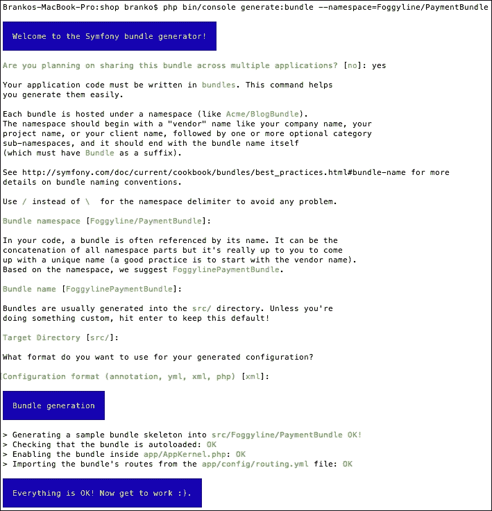

# 第九章：构建支付模块

支付模块为我们的网店提供了进一步销售功能的基础。当我们到达即将推出的销售模块的结账流程时，它将使我们能够实际选择支付方式。支付方式通常可以是各种类型。有些可以是静态的，如支票和货到付款，而其他一些可以是常规信用卡，如 Visa、MasterCard、American Express、Discover 和 Switch/Solo。在本章中，我们将讨论这两种类型。

在本章中，我们将研究以下主题：

+   要求

+   依赖

+   实施

+   单元测试

+   功能测试

# 要求

我们的应用要求在第四章下定义，*模块化网店应用的需求规范*，实际上并没有说明我们需要实现的支付方式类型。因此，在本章中，我们将开发两种支付方式：卡支付和支票支付。关于信用卡支付，我们不会连接到真实的支付处理器，但其他所有操作都将按照与信用卡一起工作的方式进行。

理想情况下，我们希望通过接口完成以下操作：

```php
namespace Foggyline\SalesBundle\Interface;

interface Payment
{
  function authorize();
  function capture();
  function cancel();
}
```

这将需要`SalesBundle`模块，但我们还没有开发。因此，我们将使用一个简单的 Symfony`controller`类来进行支付方法，该类提供了自己的方式来处理以下功能：

+   函数`authorize();`

+   函数`capture();`

+   函数`cancel();`

`authorize`方法用于仅授权交易而不实际执行交易的情况。结果是一个交易 ID，我们未来的`SalesBundle`模块可以存储并重复使用以进行进一步的`capture`和`cancel`操作。`capture`方法首先执行授权操作，然后捕获资金。`cancel`方法基于先前存储的授权令牌执行取消操作。

我们将通过标记的 Symfony 服务公开我们的支付方式。服务的标记是一个很好的功能，它使我们能够查看容器和所有标记为相同标记的服务，这是我们可以用来获取所有`paymentmethod`服务的东西。标记命名必须遵循一定的模式，这是我们作为应用程序创建者所强加给自己的。考虑到这一点，我们将使用`name`,`payment_method`标记每个支付服务。

稍后，`SalesBundle`模块将获取并使用所有标记为`payment_method`的服务，然后在内部使用它们生成可用支付方式的列表。

# 依赖

该模块不依赖于任何其他模块。但是，首先构建`SalesBundle`模块，然后公开一些`payment`模块可能使用的接口可能更方便。

# 实施

我们首先创建一个名为`Foggyline\PaymentBundle`的新模块。我们通过运行以下命令来完成这个操作：

```php
**php bin/console generate:bundle --namespace=Foggyline/PaymentBundle**

```

该命令触发一个交互式过程，沿途询问我们几个问题，如下所示：



完成后，文件`app/AppKernel.php`和`app/config/routing.yml`将自动修改。`AppKernel`类的`registerBundles`方法已添加到`$bundles`数组下的以下行：

```php
new Foggyline\PaymentBundle\FoggylinePaymentBundle(),
```

`routing.yml`已更新为以下条目：

```php
foggyline_payment:
  resource: "@FoggylinePaymentBundle/Resources/config/routing.xml"
  prefix:   /
```

为了避免与核心应用程序代码冲突，我们需要将`prefix: /`更改为`prefix: /payment/`。

## 创建卡实体

尽管在本章中我们不会在数据库中存储任何信用卡，但我们希望重用 Symfony 自动生成的 CRUD 功能，以便为我们提供信用卡模型和表单。让我们继续创建一个`Card`实体。我们将使用控制台来实现，如下所示：

```php
php bin/console generate:doctrine:entity
```

该命令触发交互式生成器，为实体快捷方式提供`FoggylinePaymentBundle:Card`，我们还需要提供实体属性。我们想要用以下字段对`Card`实体建模：

+   `card_type`: string

+   `card_number`: string

+   `expiry_date`: date

+   `security_code`: string

完成后，生成器将在`src/Foggyline/PaymentBundle/`目录中创建`Entity/Card.php`和`Repository/CardRepository.php`。我们现在可以更新数据库，以便引入`Card`实体，如下所示：

```php
php bin/console doctrine:schema:update --force
```

有了实体，我们准备生成其 CRUD。我们将使用以下命令来实现：

```php
php bin/console generate:doctrine:crud
```

这将导致创建`src/Foggyline/PaymentBundle/Controller/CardController.php`文件。它还会向我们的`app/config/routing.yml`文件添加一个条目，如下所示：

```php
foggyline_payment_card:
  resource: "@FoggylinePaymentBundle/Controller/CardController.php"
  type:    annotation
```

同样，视图文件是在`app/Resources/views/card/`目录下创建的。由于我们实际上不会围绕卡片执行任何与 CRUD 相关的操作，因此我们可以继续删除所有生成的视图文件，以及`CardController`类的整个主体。此时，我们应该有`Card`实体，`CardType`表单和空的`CardController`类。

### 创建卡支付服务

卡支付服务将为我们未来的销售模块提供其结账流程所需的相关信息。它的作用是提供订单的支付方法标签、代码和处理 URL，如`authorize`、`capture`和`cancel`。

我们将首先在`src/Foggyline/PaymentBundle/Resources/config/services.xml`文件的 services 元素下定义以下服务：

```php
<service id="foggyline_payment.card_payment"class="Foggyline\PaymentBundle\Service\CardPayment">
  <argument type="service" id="form.factory"/>
  <argument type="service" id="router"/>
  <tag name="payment_method"/>
</service>
```

该服务接受两个参数：一个是`form.factory`，另一个是`router`。`form.factory`将在服务内部用于为`CardType`表单创建表单视图。标签在这里是一个关键元素，因为我们的`SalesBundle`模块将根据分配给服务的`payment_method`标签来寻找支付方法。

现在我们需要在`src/Foggyline/PaymentBundle/Service/CardPayment.php`文件中创建实际的服务类，如下所示：

```php
namespace Foggyline\PaymentBundle\Service;

use Foggyline\PaymentBundle\Entity\Card;

class CardPayment
{
  private $formFactory;
  private $router;

  public function __construct(
    $formFactory,
    \Symfony\Bundle\FrameworkBundle\Routing\Router $router
  )
  {
    $this->formFactory = $formFactory;
    $this->router = $router;
  }

  public function getInfo()
  {
    $card = new Card();
    $form = $this->formFactory->create('Foggyline\PaymentBundle\Form\CardType', $card);

    return array(
      'payment' => array(
      'title' =>'Foggyline Card Payment',
      'code' =>'card_payment',
      'url_authorize' => $this->router->generate('foggyline_payment_card_authorize'),
      'url_capture' => $this->router->generate('foggyline_payment_card_capture'),
      'url_cancel' => $this->router->generate('foggyline_payment_card_cancel'),
      'form' => $form->createView()
      )
    );
  }
}
```

`getInfo`方法将为我们未来的`SalesBundle`模块提供必要的信息，以便它构建结账流程的支付步骤。我们在这里传递了三种不同类型的 URL：`authorize`，`capture`和`cancel`。这些路由目前还不存在，我们将很快创建它们。我们的想法是将支付操作和流程转移到实际的`payment`方法。我们未来的`SalesBundle`模块只会对这些支付 URL 进行**AJAX POST**，并期望获得成功或错误的 JSON 响应。成功的响应应该产生某种交易 ID，错误的响应应该产生一个标签消息显示给用户。

## 创建卡支付控制器和路由

我们将通过向`src/Foggyline/PaymentBundle/Resources/config/routing.xml`文件添加以下路由定义来编辑它：

```php
<route id="foggyline_payment_card_authorize" path="/card/authorize">
  <default key="_controller">FoggylinePaymentBundle:Card:authorize</default>
</route>

<route id="foggyline_payment_card_capture" path="/card/capture">
  <default key="_controller">FoggylinePaymentBundle:Card:capture</default>
</route>

<route id="foggyline_payment_card_cancel" path="/card/cancel">
  <default key="_controller">FoggylinePaymentBundle:Card:cancel</default>
</route>
```

然后，我们将通过添加以下内容来编辑`CardController`类的主体：

```php
public function authorizeAction(Request $request)
{
  $transaction = md5(time() . uniqid()); // Just a dummy string, simulating some transaction id, if any

  if ($transaction) {
    return new JsonResponse(array(
      'success' => $transaction
    ));
  }

  return new JsonResponse(array(
    'error' =>'Error occurred while processing Card payment.'
  ));
}

public function captureAction(Request $request)
{
  $transaction = md5(time() . uniqid()); // Just a dummy string, simulating some transaction id, if any

  if ($transaction) {
    return new JsonResponse(array(
      'success' => $transaction
    ));
  }

  return new JsonResponse(array(
    'error' =>'Error occurred while processing Card payment.'
  ));
}

public function cancelAction(Request $request)
{
  $transaction = md5(time() . uniqid()); // Just a dummy string, simulating some transaction id, if any

  if ($transaction) {
    return new JsonResponse(array(
      'success' => $transaction
    ));
  }

  return new JsonResponse(array(
    'error' =>'Error occurred while processing Card payment.'
  ));
}
```

现在，我们应该能够访问像`/app_dev.php/payment/card/authorize`这样的 URL，并看到`authorizeAction`的输出。这里给出的实现是虚拟的。在本章中，我们不打算连接到真实的支付处理 API。对我们来说重要的是，`sales`模块在结账过程中，会通过`payment_method`标记的服务的`getInfo`方法中的`['payment']['form']`键来渲染任何可能的表单视图。这意味着结账过程应该在信用卡付款下显示一个信用卡表单。结账的行为将被编码，以便如果选择了带有表单的付款，并且点击了**下订单**按钮，那么付款表单将阻止结账过程继续进行，直到付款表单被提交到支付本身定义的授权或捕获 URL。当我们到达`SalesBundle`模块时，我们将更详细地讨论这一点。

## 创建支票付款服务

除了信用卡付款方式，让我们继续定义另一种静态付款，称为**支票**。

我们将从`src/Foggyline/PaymentBundle/Resources/config/services.xml`文件的 services 元素下定义以下服务开始：

```php
<service id="foggyline_payment.check_money"class="Foggyline\PaymentBundle\Service\CheckMoneyPayment">
  <argument type="service" id="router"/>
  <tag name="payment_method"/>
</service>
```

这里定义的`service`只接受一个`router`参数。标签名称与信用卡付款服务相同。

然后，我们将创建`src/Foggyline/PaymentBundle/Service/CheckMoneyPayment.php`文件，内容如下：

```php
namespace Foggyline\PaymentBundle\Service;

class CheckMoneyPayment
{
  private $router;

  public function __construct(
    \Symfony\Bundle\FrameworkBundle\Routing\Router $router
  )
  {
    $this->router = $router;
  }

  public function getInfo()
  {
    return array(
      'payment' => array(
        'title' =>'Foggyline Check Money Payment',
        'code' =>'check_money',
        'url_authorize' => $this->router->generate('foggyline_payment_check_money_authorize'),
        'url_capture' => $this->router->generate('foggyline_payment_check_money_capture'),
        'url_cancel' => $this->router->generate('foggyline_payment_check_money_cancel'),
        //'form' =>''
      )
    );
  }
}
```

与信用卡付款不同，支票付款在`getInfo`方法下没有定义表单键。这是因为没有信用卡条目需要定义。它只是一个静态付款方式。但是，我们仍然需要定义`authorize`、`capture`和`cancel`的 URL，即使它们的实现可能只是一个简单的 JSON 响应，带有成功或错误键。

## 创建支票付款控制器和路由

一旦支票付款服务就位，我们就可以继续为其创建必要的路由。我们将首先在`src/Foggyline/PaymentBundle/Resources/config/routing.xml`文件中添加以下路由定义：

```php
<route id="foggyline_payment_check_money_authorize"path="/check_money/authorize">
  <default key="_controller">FoggylinePaymentBundle:CheckMoney:authorize</default>
</route>

<route id="foggyline_payment_check_money_capture"path="/check_money/capture">
  <default key="_controller">FoggylinePaymentBundle:CheckMoney:capture</default>
</route>

<route id="foggyline_payment_check_money_cancel"path="/check_money/cancel">
  <default key="_controller">FoggylinePaymentBundle:CheckMoney:cancel</default>
</route>
```

然后，我们将创建`src/Foggyline/PaymentBundle/Controller/CheckMoneyController.php`文件，内容如下：

```php
namespace Foggyline\PaymentBundle\Controller;

use Symfony\Component\HttpFoundation\JsonResponse;
use Symfony\Component\HttpFoundation\Request;
use Symfony\Bundle\FrameworkBundle\Controller\Controller;

class CheckMoneyController extends Controller
{
  public function authorizeAction(Request $request)
  {
    $transaction = md5(time() . uniqid());
    return new JsonResponse(array(
      'success' => $transaction
    ));
  }

  public function captureAction(Request $request)
  {
    $transaction = md5(time() . uniqid());
    return new JsonResponse(array(
      'success' => $transaction
    ));
  }

  public function cancelAction(Request $request)
  {
    $transaction = md5(time() . uniqid());
    return new JsonResponse(array(
      'success' => $transaction
    ));
  }
}
```

与信用卡付款类似，这里我们添加了`authorize`、`capture`和`cancel`方法的简单虚拟实现。这些方法的响应将在后面的`SalesBundle`模块中使用。我们可以很容易地从这些方法中实现更健壮的功能，但这超出了本章的范围。

# 单元测试

我们的`FoggylinePaymentBundle`模块非常简单。它只提供两种付款方式：信用卡和支票。它通过两个简单的`service`类来实现。由于我们不追求完整的代码覆盖率测试，我们将只在单元测试中覆盖`CardPayment`和`CheckMoneyPayment`服务类。

我们将首先在`phpunit.xml.dist`文件的`testsuites`元素下添加以下行：

```php
<directory>src/Foggyline/PaymentBundle/Tests</directory>
```

有了这个设置，从商店的根目录运行`phpunit`命令应该会捕捉到我们在`src/Foggyline/PaymentBundle/Tests/`目录下定义的任何测试。

现在，让我们继续为我们的`CardPayment`服务创建一个测试。我们将创建一个`src/Foggyline/PaymentBundle/Tests/Service/CardPaymentTest.php`文件，内容如下：

```php
namespace Foggyline\PaymentBundle\Tests\Service;

use Symfony\Bundle\FrameworkBundle\Test\KernelTestCase;

class CardPaymentTest extends KernelTestCase
{
  private $container;
  private $formFactory;
  private $router;

  public function setUp()
  {
    static::bootKernel();
    $this->container = static::$kernel->getContainer();
    $this->formFactory = $this->container->get('form.factory');
    $this->router = $this->container->get('router');
  }

  public function testGetInfoViaService()
  {
    $payment = $this->container->get('foggyline_payment.card_payment');
    $info = $payment->getInfo();
    $this->assertNotEmpty($info);
    $this->assertNotEmpty($info['payment']['form']);
  }

  public function testGetInfoViaClass()
  {
    $payment = new \Foggyline\PaymentBundle\Service\CardPayment(
       $this->formFactory,
       $this->router
    );

    $info = $payment->getInfo();
    $this->assertNotEmpty($info);
    $this->assertNotEmpty($info['payment']['form']);
  }
}
```

在这里，我们运行了两个简单的测试，以查看我们是否可以通过容器或直接实例化一个服务，并简单地调用它的`getInfo`方法。预期该方法将返回一个包含`['payment']['form']`键的响应。

现在，让我们继续为我们的`CheckMoneyPayment`服务创建一个测试。我们将创建一个`src/Foggyline/PaymentBundle/Tests/Service/CheckMoneyPaymentTest.php`文件，内容如下：

```php
namespace Foggyline\PaymentBundle\Tests\Service;

use Symfony\Bundle\FrameworkBundle\Test\KernelTestCase;

class CheckMoneyPaymentTest extends KernelTestCase
{
  private $container;
  private $router;

  public function setUp()
  {
    static::bootKernel();
    $this->container = static::$kernel->getContainer();
    $this->router = $this->container->get('router');
  }

  public function testGetInfoViaService()
  {
    $payment = $this->container->get('foggyline_payment.check_money');
    $info = $payment->getInfo();
    $this->assertNotEmpty($info);
  }

  public function testGetInfoViaClass()
  {
    $payment = new \Foggyline\PaymentBundle\Service\CheckMoneyPayment(
        $this->router
      );

    $info = $payment->getInfo();
    $this->assertNotEmpty($info);
  }
}
```

同样，在这里我们也有两个简单的测试：一个通过容器获取`payment`方法，另一个直接通过一个类获取。不同之处在于我们没有检查`getInfo`方法响应中是否存在表单键。

# 功能测试

我们的模块有两个控制器类，我们希望测试它们的响应。我们要确保`CardController`和`CheckMoneyController`类的`authorize`、`capture`和`cancel`方法是有效的。

我们首先创建了一个`src/Foggyline/PaymentBundle/Tests/Controller/CardControllerTest.php`文件，内容如下：

```php
namespace Foggyline\PaymentBundle\Tests\Controller;

use Symfony\Bundle\FrameworkBundle\Test\WebTestCase;

class CardControllerTest extends WebTestCase
{
  private $client;
  private $router;

  public function setUp()
  {
    $this->client = static::createClient();
    $this->router = $this->client->getContainer()->get('router');
  }

  public function testAuthorizeAction()
  {
    $this->client->request('GET', $this->router->generate('foggyline_payment_card_authorize'));
    $this->assertTests();
  }

  public function testCaptureAction()
  {
    $this->client->request('GET', $this->router->generate('foggyline_payment_card_capture'));
    $this->assertTests();
  }

  public function testCancelAction()
  {
    $this->client->request('GET', $this->router->generate('foggyline_payment_card_cancel'));
    $this->assertTests();
  }

  private function assertTests()
  {
    $this->assertSame(200, $this->client->getResponse()->getStatusCode());
    $this->assertSame('application/json', $this->client->getResponse()->headers->get('Content-Type'));
    $this->assertContains('success', $this->client->getResponse()->getContent());
    $this->assertNotEmpty($this->client->getResponse()->getContent());
  }
}
```

然后我们创建了`src/Foggyline/PaymentBundle/Tests/Controller/CheckMoneyControllerTest.php`，内容如下：

```php
namespace Foggyline\PaymentBundle\Tests\Controller;

use Symfony\Bundle\FrameworkBundle\Test\WebTestCase;

class CheckMoneyControllerTest extends WebTestCase
{
  private $client;
  private $router;

  public function setUp()
  {
    $this->client = static::createClient();
    $this->router = $this->client->getContainer()->get('router');
  }

  public function testAuthorizeAction()
  {
    $this->client->request('GET', $this->router->generate('foggyline_payment_check_money_authorize'));
    $this->assertTests();
  }

  public function testCaptureAction()
  {
    $this->client->request('GET', $this->router->generate('foggyline_payment_check_money_capture'));
    $this->assertTests();
  }

  public function testCancelAction()
  {
    $this->client->request('GET', $this->router->generate('foggyline_payment_check_money_cancel'));
    $this->assertTests();
  }

  private function assertTests()
  {
    $this->assertSame(200, $this->client->getResponse()->getStatusCode());
    $this->assertSame('application/json', $this->client->getResponse()->headers->get('Content-Type'));
    $this->assertContains('success', $this->client->getResponse()->getContent());
    $this->assertNotEmpty($this->client->getResponse()->getContent());
  }
}
```

这两个测试几乎是相同的。它们包含了对`authorize`、`capture`和`cancel`方法的测试。由于我们的方法是使用固定的成功 JSON 响应实现的，所以这里没有什么意外。然而，我们可以通过将我们的付款方法扩展为更强大的东西来轻松地进行调试。

# 总结

在本章中，我们构建了一个具有两种付款方法的付款模块。信用卡付款方法是为了模拟涉及信用卡的付款。因此，它包括一个表单作为其`getInfo`方法的一部分。另一方面，支票付款是模拟一个静态的付款方法 - 不包括任何形式的信用卡。这两种方法都是作为虚拟方法实现的，这意味着它们实际上并没有与任何外部付款处理器进行通信。

我们的想法是创建一个最小的结构，展示如何开发一个简单的付款模块以进行进一步的定制。我们通过将每种付款方法公开为一个标记服务来实现这一点。使用`payment_method`标记是一种共识，因为我们是构建完整应用程序的人，所以我们可以选择如何在`sales`模块中实现这一点。通过为每种付款方法使用相同的标记名称，我们有效地为未来的`sales`模块创建了条件，以便选择所有的付款方法并在其结账流程下呈现它们。

在接下来的章节中，我们将构建一个**shipment**模块。
