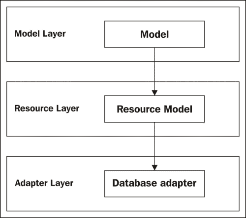
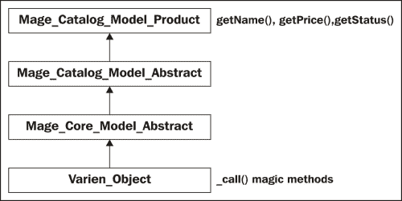
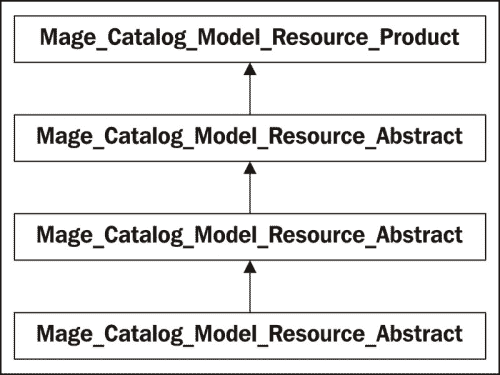
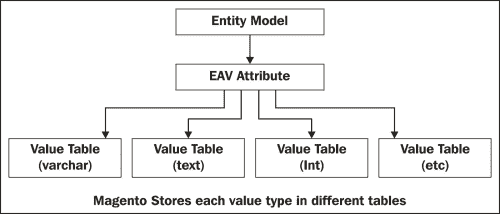
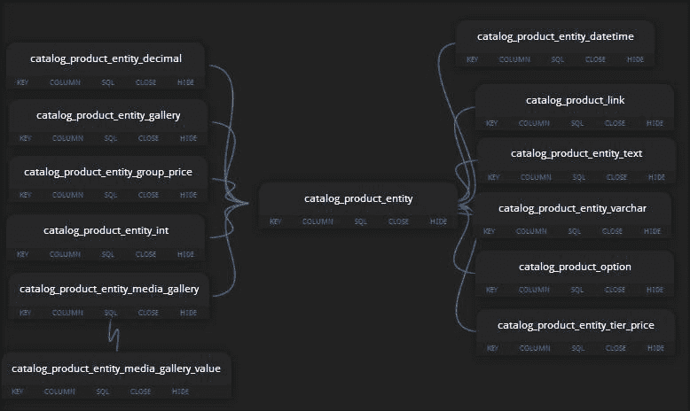
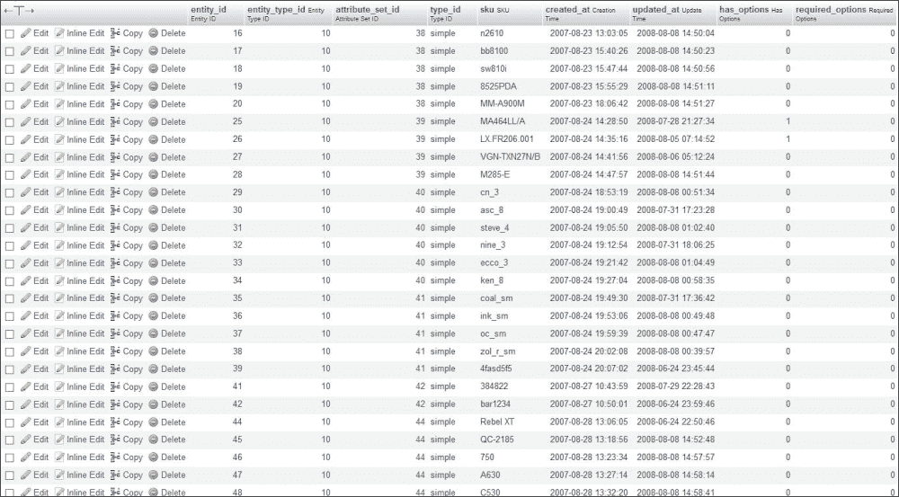
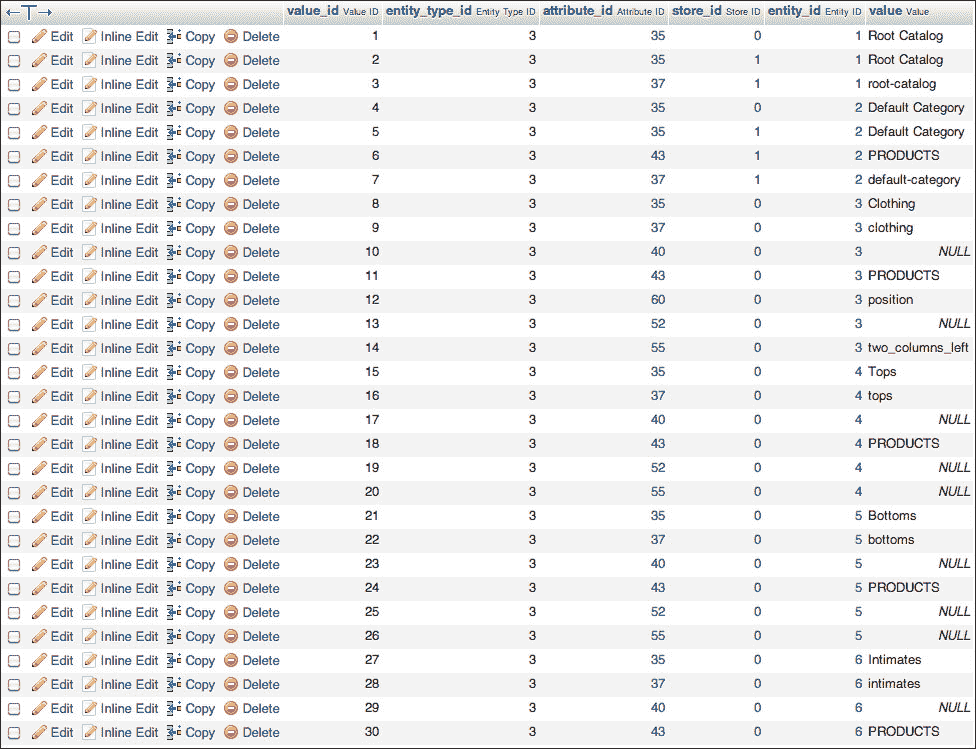
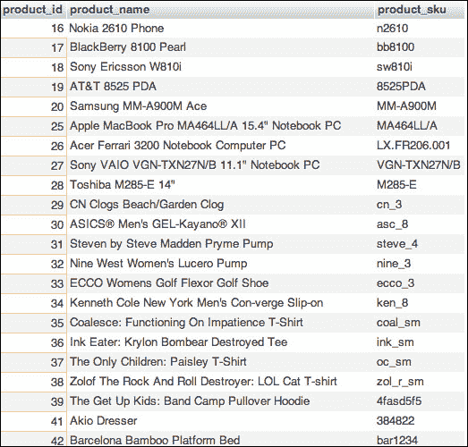
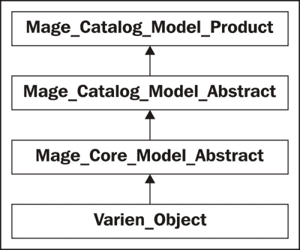

# 第三章。ORM 和数据集合

集合和模型是日常 Magento 开发的基础。在本章中，我们将向读者介绍 Magento ORM 系统，并学习如何正确地处理数据集合和 EAV 系统。与大多数现代系统一样，Magento 实现了一个**对象关系映射**（**ORM**）系统。

> *对象关系映射（ORM，O/RM 和 O/R 映射）是计算机软件中的一种编程技术，用于在面向对象的编程语言中在不兼容的类型系统之间转换数据。这实际上创建了一个可以从编程语言内部使用的“虚拟对象数据库”。

在本章中，我们将涵盖以下主题：

+   Magento 模型

+   Magento 数据模型的解剖学

+   EAV 和 EAV 模型

+   使用直接 SQL 查询

我们还将使用几个代码片段来提供一个方便的框架，以便在 Magento 中进行实验和玩耍。

### 注意

请注意，本章中的交互式示例假定您正在使用 VagrantBox 内的默认 Magento 安装或带有示例数据的 Magento 安装。

为此，我创建了**交互式 Magento 控制台**（**IMC**），这是一个专门为本书创建的 shell 脚本，受 Ruby 自己的**交互式 Ruby 控制台**（**IRB**）启发。请按照以下步骤：

1.  我们需要做的第一件事是安装 IMC。为此，请从[`github.com/amacgregor/mdg_imc`](https://github.com/amacgregor/mdg_imc)下载源文件，并将其提取到 Magento 测试安装下。IMC 是一个简单的 Magento shell 脚本，可以让我们实时测试我们的代码。

1.  提取脚本后，登录到您的虚拟机的 shell。

1.  接下来，我们需要导航到我们的 Magento 根文件夹。如果您正在使用默认的 vagrant box，安装已经提供；根文件夹位于`/srv/www/ce1720/public_html/`下，我们可以通过运行以下命令行来导航到它：

```php
**$ cd /srv/www/ce1720/public_html**

```

1.  最后，我们可以通过运行以下命令行来启动 IMC：

```php
**$ php shell/imc.php**

```

1.  如果一切安装成功，我们应该看到一行新的以`magento >`开头的内容。

# Magento 模型解剖学

正如我们在上一章中学到的，Magento 数据模型用于操作和访问数据。模型层分为两种基本类型，简单模型和 EAV，其中：

+   **简单模型**：这些模型实现是一个对象到一个表的简单映射，这意味着我们的对象属性与每个字段匹配，我们的表结构

+   **实体属性值模型（EAV）**：这种类型的模型用于描述具有动态属性数量的实体

### 注意

请注意，重要的是要澄清并非所有 Magento 模型都扩展或使用 ORM。观察者是一个明显的例子，它们是不与特定数据库表或实体映射的简单模型类。

除此之外，每种模型类型由以下层组成：

+   **模型类**：这是大部分业务逻辑所在的地方。模型用于操作数据，但不直接访问数据。

+   **资源模型类**：资源模型用于代表我们的模型与数据库交互。它们负责实际的 CRUD 操作。

+   **模型集合类**：每个数据模型都有一个集合类；集合是保存多个单独的 Magento 模型实例的对象。

### 注意

CRUD 代表数据库的四种基本操作：创建、读取、更新和删除。

Magento 模型不包含与数据库通信的任何逻辑；它们是与数据库无关的。相反，这些代码存在于资源模型层。

这使 Magento 有能力支持不同类型的数据库和平台。尽管目前只有 MySQL 得到官方支持，但完全可以编写一个新的资源类来支持新的数据库，而不用触及任何模型逻辑。



现在让我们通过实例化一个产品对象并按照以下步骤设置一些属性来进行实验：

1.  启动 Magento 交互式控制台，运行在 Magento 分期安装根目录下：

```php
**php shell/imc.php**

```

1.  我们的第一步是通过输入来创建一个新的产品对象实例：

```php
**magento> $product = Mage::getModel('catalog/product');**

```

1.  我们可以通过运行以下命令来确认这是否是产品类的空实例：

```php
**magento> echo get_class($product);**

```

1.  我们应该看到以下成功的输出：

```php
**magento> Magento_Catalog_Model_Product**

```

1.  如果我们想了解更多关于类方法的信息，可以运行以下命令行：

```php
**magento> print_r(get_class_methods($product));**

```

这将返回一个包含类内所有可用方法的数组。让我们尝试运行以下代码片段并修改产品的价格和名称：

```php
$product = Mage::getModel('catalog/product')->load(2);
$name    = $product->getName() . '-TEST';
$price   = $product->getPrice();
$product->setPrice($price + 15);
$product->setName($name);
$product->save();
```

在第一行代码中，我们实例化了一个特定的对象，然后我们继续从对象中检索名称属性。接下来，我们设置价格和名称，最后保存对象。

如果我们打开我们的 Magento 产品类`Mage_Catalog_Model_Product`，我们会注意到虽然`getName()`和`getPrice()`都在我们的类中定义了，但是`setPrice()`和`setName()`函数却没有在任何地方定义。

但是为什么，更重要的是，Magento 是如何神奇地定义每个产品对象的 setter 和 getter 方法的呢？虽然`getPrice()`和`getName()`确实被定义了，但是对于产品属性的任何 getter 和 setter 方法，比如颜色或制造商，都没有定义。

## 这是魔法-方法

事实上，Magento ORM 系统确实使用了魔术；或者更准确地说，使用了 PHP 更强大的特性来实现其 getter 和 setter，即`magic __call()`方法。Magento 中使用的方法用于设置、取消设置、检查或检索数据。

当我们尝试调用一个实际上在相应类中不存在的方法时，PHP 将查找每个父类中是否有该方法的声明。如果我们在任何父类中找不到该函数，它将使用最后的手段并尝试使用`__call()`方法，如果找到，Magento（或者 PHP）将调用魔术方法，从而传递请求的方法名和其参数。

现在，产品模型没有定义`__call()`方法，但是它从所有 Magento 模型继承的`Varien_Object`类中获得了一个。`Mage_Catalog_Model_Product`类的继承树如下流程图所示：



### 提示

每个 Magento 模型都继承自`Varien_Object`类。

让我们更仔细地看一下`Varien_Object`类：

1.  打开位于`magento_root/lib/Varien/Object.php`中的文件。

1.  `Varien_Object`类不仅有一个`__call()`方法，还有两个已弃用的方法，`__set()`和`__get()`；这两个方法被`__call()`方法替代，因此不再使用。

```php
public function __call($method, $args)
{
   switch (substr($method, 0, 3)) {
       case 'get' :
           //Varien_Profiler::start('GETTER: '.get_class($this).'::'.$method);
           $key = $this->_underscore(substr($method,3));
           $data = $this->getData($key, isset($args[0]) ? $args[0] : null);
           //Varien_Profiler::stop('GETTER: '.get_class($this).'::'.$method);
           return $data;

       case 'set' :
           //Varien_Profiler::start('SETTER: '.get_class($this).'::'.$method);
           $key = $this->_underscore(substr($method,3));
           $result = $this->setData($key, isset($args[0]) ? $args[0] : null);
           //Varien_Profiler::stop('SETTER: '.get_class($this).'::'.$method);
           return $result;

       case 'uns' :
           //Varien_Profiler::start('UNS: '.get_class($this).'::'.$method);
           $key = $this->_underscore(substr($method,3));
           $result = $this->unsetData($key);
           //Varien_Profiler::stop('UNS: '.get_class($this).'::'.$method);
           return $result;
       case 'has' :
           //Varien_Profiler::start('HAS: '.get_class($this).'::'.$method);
           $key = $this->_underscore(substr($method,3));
           //Varien_Profiler::stop('HAS: '.get_class($this).'::'.$method);
           return isset($this->_data[$key]);
   }
   throw new Varien_Exception("Invalid method" . get_class($this)."::".$method."(".print_r($args,1).")");
}
```

在`__call()`方法内部，我们有一个 switch 语句，不仅处理 getter 和 setter，还处理`unset`和`has`函数。

如果我们启动调试器并跟踪我们的代码片段调用`__call()`方法，我们可以看到它接收两个参数：方法名，例如`setName()`，以及原始调用的参数。

有趣的是，Magento 尝试根据被调用方法的前三个字母来匹配相应的方法类型；这是在 switch case 参数调用 substring 函数时完成的：

```php
substr($method, 0, 3)
```

在每种情况下调用的第一件事是`_underscore()`函数，它以方法名的前三个字符之后的任何内容作为参数；按照我们的例子，传递的参数将是`Name`。

`__underscore()`函数返回一个数据键。然后每种情况下都使用这个键来操作数据。有四种基本的数据操作，每种操作对应一个 switch case：

+   `setData($parameters)`

+   `getData($parameters)`

+   `unsetData($parameters)`

+   `isset($parameters)`

这些函数中的每一个都将与`Varien_Object`数据数组交互，并相应地对其进行操作。在大多数情况下，将使用魔术 set/get 方法与我们的对象属性交互；只有在需要额外的业务逻辑时，才会定义 getter 和 setter。在我们的示例中，它们是`getName()`和`getPrice()`。

```php
public function getPrice()
{
   if ($this->_calculatePrice || !$this->getData('price')) {
       return $this->getPriceModel()->getPrice($this);
   } else {
       return $this->getData('price');
   }
}
```

我们不会详细介绍价格函数实际在做什么，但它清楚地说明了对模型的某些部分可能需要额外的逻辑。

```php
public function getName()
{
   return $this->_getData('name');
}
```

另一方面，`getName()`getter 并不是因为需要实现特殊逻辑而声明的，而是因为需要优化 Magento 的一个关键部分。`Mage_Catalog_Model_Product getName()`函数可能在每次页面加载时被调用数百次，是 Magento 中最常用的函数之一；毕竟，如果它不是围绕产品中心的电子商务平台，那它会是什么样子呢？

前端和后端都会在某个时候调用`getName()`函数。例如，如果我们加载一个包含 24 个产品的类别页面，也就是说，`getName()`函数会被调用 24 次，每次调用都会在父类中寻找`getName()`方法，然后当我们尝试使用`magic __call()`方法时，会导致丢失宝贵的毫秒。

资源模型包含所有特定于数据库的逻辑，并为其相应的数据源实例化特定的读取和写入适配器。让我们回到我们的产品示例，并查看位于`Mage_Catalog_Model_Resource_Product`的产品资源模型。



资源模型有两种不同类型：实体和 MySQL4。后者是一个相当标准的单表/单模型关联，而前者则复杂得多。

# EAV 模型

EAV 代表实体、属性和值，这可能是新 Magento 开发人员难以理解的概念。虽然 EAV 概念并不是 Magento 独有的，但它在现代系统中很少实现，而且 Magento 的实现也并不简单。



## 什么是 EAV？

为了理解 EAV 是什么以及它在 Magento 中的作用，我们需要将其分解为 EAV 模型的各个部分。

+   **实体**：实体代表 Magento 产品、客户、类别和订单中的数据项（对象）。每个实体都以唯一 ID 存储在数据库中。

+   **属性**：这些是我们的对象属性。与产品表上每个属性都有一列不同，属性存储在单独的表集上。

+   **值**：顾名思义，它只是与特定属性相关联的值链接。

这种设计模式是 Magento 灵活性和强大性的秘密，允许实体添加和删除新属性，而无需对代码或模板进行任何更改。

虽然模型可以被视为增加数据库的垂直方式（新属性增加更多行），传统模型将涉及水平增长模式（新属性增加更多列），这将导致每次添加新属性时都需要对模式进行重新设计。

EAV 模型不仅允许我们的数据库快速发展，而且更有效，因为它只处理非空属性，避免了为 null 值在数据库中保留额外空间的需要。

### 提示

如果您有兴趣探索和了解 Magento 数据库结构，我强烈建议您访问[www.magereverse.com](http://www.magereverse.com)。

添加新产品属性就像进入 Magento 后端并指定新属性类型一样简单，比如颜色、尺寸、品牌等。相反的也是真的，因为我们可以在我们的产品或客户模型上摆脱未使用的属性。

### 注意

有关管理属性的更多信息，请访问[`www.magentocommerce.com/knowledge-base/entry/how-do-attributes-work-in-magento`](http://www.magentocommerce.com/knowledge-base/entry/how-do-attributes-work-in-magento)。

Magento 社区版目前有八种不同类型的 EAV 对象：

+   客户

+   客户地址

+   产品

+   产品类别

+   订单

+   发票

+   信贷备忘录

+   发货

### 注意

Magento 企业版有一个额外的类型称为 RMA 项目，它是**退货授权**（RMA）系统的一部分。

所有这些灵活性和功能都是有代价的；实施 EAV 模型会导致我们的实体数据分布在大量的表中，例如，仅产品模型就分布在大约 40 个不同的表中。

以下图表仅显示了保存 Magento 产品信息所涉及的一些表：



EAV 的另一个主要缺点是在检索大量 EAV 对象时性能下降，数据库查询复杂性增加。由于数据更分散（存储在更多的表中），选择单个记录涉及多个连接。

让我们继续以 Magento 产品作为示例，并手动构建检索单个产品的查询。

### 提示

如果您在开发环境中安装了 PHPMyAdmin 或 MySQL Workbench，可以尝试以下查询。可以从 PHPMyAdmin（[`www.phpmyadmin.net/`](http://www.phpmyadmin.net/)）和 MySQL Workbench（[`www.mysql.com/products/workbench/`](http://www.mysql.com/products/workbench/)）下载每个查询。

我们需要使用的第一个表是`catalog_product_entity`。我们可以将其视为我们的主要产品 EAV 表，因为它包含了我们产品的主要实体记录：



通过运行以下 SQL 查询来查询表：

```php
SELECT * FROM `catalog_product_entity`;
```

该表包含以下字段：

+   `entity_id`：这是我们产品的唯一标识符，由 Magento 在内部使用。

+   `entity_type_id`：Magento 有几种不同类型的 EAV 模型，产品、客户和订单，这些只是其中一些。通过类型标识，Magento 可以从适当的表中检索属性和值。

+   `attribute_set_id`：产品属性可以在本地分组到属性集中。属性集允许对产品结构进行更灵活的设置，因为产品不需要使用所有可用的属性。

+   `type_id`：Magento 中有几种不同类型的产品：简单、可配置、捆绑、可下载和分组产品，每种产品都具有独特的设置和功能。

+   `sku`：**库存保留单位**（SKU）是用于标识商店中每个唯一产品或商品的编号或代码。这是用户定义的值。

+   `has_options`：这用于标识产品是否具有自定义选项。

+   `required_options`：这用于标识是否需要任何自定义选项。

+   `created_at`：这是行创建日期。

+   `updated_at`：显示行上次修改的时间。

现在我们对产品实体表有了基本的了解，我们也知道每条记录代表着我们 Magento 商店中的一个产品，但是我们对该产品的信息并不多，除了 SKU 和产品类型之外。

那么，属性存储在哪里？Magento 如何区分产品属性和客户属性？

为此，我们需要通过运行以下 SQL 查询来查看`eav_attribute`表：

```php
SELECT * FROM `eav_attribute`;
```

因此，我们不仅会看到产品属性，还会看到与客户模型、订单模型等对应的属性。幸运的是，我们已经有一个用于从该表中过滤属性的关键。让我们运行以下查询：

```php
SELECT * FROM `eav_attribute`
WHERE entity_type_id = 4;
```

这个查询告诉数据库只检索`entity_type_id`列等于产品`entity_type_id(4)`的属性。在继续之前，让我们分析`eav_attribute`表中最重要的字段：

+   `attribute_id`: 这是每个属性的唯一标识符和表的主键。

+   `entity_type_id`: 这个字段将每个属性关联到特定的 EAV 模型类型。

+   `attribute_code`: 这个字段是我们属性的名称或键，用于生成我们的魔术方法的 getter 和 setter。

+   `backend_model`: 后端模型负责加载和存储数据到数据库中。

+   `backend_type`: 这个字段指定存储在后端（数据库）的值的类型。

+   `backend_table`: 这个字段用于指定属性是否应该存储在特殊表中，而不是默认的 EAV 表中。

+   `frontend_model`: 前端模型处理属性元素在 web 浏览器中的呈现。

+   `frontend_input`: 类似于前端模型，前端输入指定 web 浏览器应该呈现的输入字段类型。

+   `frontend_label`: 这个字段是属性的标签/名称，应该由浏览器呈现。

+   `source_model`: 源模型用于为属性填充可能的值。Magento 带有几个预定义的源模型，用于国家、是或否值、地区等。

## 检索数据

此时，我们已经成功检索了一个产品实体和适用于该实体的特定属性，现在是时候开始检索实际的值了。为了简单执行示例（和查询），我们将尝试只检索我们产品的名称属性。

但是，我们如何知道我们的属性值存储在哪个表中？幸运的是，Magento 遵循了一种命名约定来命名表。如果我们检查我们的数据库结构，我们会注意到有几个表使用`catalog_product_entity`前缀：

+   `catalog_product_entity`

+   `catalog_product_entity_datetime`

+   `catalog_product_entity_decimal`

+   `catalog_product_entity_int`

+   `catalog_product_entity_text`

+   `catalog_product_entity_varchar`

+   `catalog_product_entity_gallery`

+   `catalog_product_entity_media_gallery`

+   `catalog_product_entity_tier_price`

但是，等等，我们如何知道查询我们名称属性值的正确表？如果你在关注，我们已经看到了答案。你还记得`eav_attribute`表有一个叫做`backend_type`的列吗？

Magento EAV 根据属性的后端类型将每个属性存储在不同的表中。如果我们想确认我们的名称的后端类型，可以通过运行以下代码来实现：

```php
SELECT * FROM `eav_attribute`
WHERE `entity_type_id` =4 AND `attribute_code` = 'name';
```

并且我们应该看到，后端类型是`varchar`，这个属性的值存储在`catalog_product_entity_varchar`表中。让我们检查这个表：



`catalog_product_entity_varchar`表只由六列组成：

+   `value_id`: 属性值是唯一标识符和主键

+   `entity_type_id`: 这个值属于实体类型 ID

+   `attribute_id`: 这是一个外键，将值与我们的`eav_entity`表关联起来

+   `store_id`: 这是一个外键，将属性值与 storeview 进行匹配

+   `entity_id`: 这是对应实体表的外键；在这种情况下，它是`catalog_product_entity`

+   `value`: 这是我们要检索的实际值

### 提示

根据属性配置，我们可以将其作为全局值，表示它适用于所有 storeview，或者作为每个 storeview 的值。

现在我们终于有了检索产品信息所需的所有表，我们可以构建我们的查询：

```php
SELECT p.entity_id AS product_id, var.value AS product_name, p.sku AS product_sku
FROM catalog_product_entity p, eav_attribute eav, catalog_product_entity_varchar var
WHERE p.entity_type_id = eav.entity_type_id 
   AND var.entity_id = p.entity_id
   AND eav.attribute_code = 'name'
   AND eav.attribute_id = var.attribute_id
```



作为查询结果，我们应该看到一个包含三列的结果集：`product_id`，`product_name`和`product_sku`。因此，让我们退后一步，以便获取产品名称和 SKU。使用原始 SQL，我们将不得不编写一个五行的 SQL 查询，我们只能从我们的产品中检索两个值：如果我们想要检索数字字段，比如价格，或者从文本值，比如产品，我们只能从一个单一的 EAV 值表中检索。

如果我们没有 ORM，维护 Magento 几乎是不可能的。幸运的是，我们有一个 ORM，并且很可能你永远不需要处理 Magento 的原始 SQL。

说到这里，让我们看看如何使用 Magento ORM 来检索相同的产品信息：

1.  我们的第一步是实例化一个产品集合：

```php
**$collection = Mage::getModel('catalog/product')->getCollection();**

```

1.  然后，我们将明确告诉 Magento 选择名称属性：

```php
**$collection->addAttributeToSelect('name');**

```

1.  现在按名称对集合进行排序：

```php
**$collection->setOrder('name', 'asc');**

```

1.  最后，我们将告诉 Magento 加载集合：

```php
**$collection->load();**

```

1.  最终结果是商店中所有产品的集合按名称排序；我们可以通过运行以下命令来检查实际的 SQL 查询：

```php
**echo $collection->getSelect()->__toString();**

```

仅仅通过三行代码的帮助，我们就能告诉 Magento 抓取商店中的所有产品，具体选择名称，并最终按名称排序产品。

### 提示

最后一行`$collection->getSelect()->__toString()`，允许我们查看 Magento 代表我们执行的实际查询。

Magento 生成的实际查询是：

```php
SELECT `e`.*. IF( at_name.value_id >0, at_name.value, at_name_default.value ) AS `name`
FROM `catalog_product_entity` AS `e`
LEFT JOIN `catalog_product_entity_varchar` AS `at_name_default` ON (`at_name_default`.`entity_id` = `e`.`entity_id`)
AND (`at_name_default`.`attribute_id` = '65')
AND `at_name_default`.`store_id` =0
LEFT JOIN `catalog_product_entity_varchar` AS `at_name` ON ( `at_name`.`entity_id` = `e`.`entity_id` )
AND (`at_name`.`attribute_id` = '65')
AND (`at_name`.`store_id` =1)
ORDER BY `name` ASC
```

正如我们所看到的，ORM 和 EAV 模型是非常棒的工具，不仅为开发人员提供了很多功能和灵活性，而且还以一种全面易用的方式实现了这一点。

# 使用 Magento 集合

如果您回顾前面的代码示例，您可能会注意到我们不仅实例化了一个产品模型，还调用了`getCollection()`方法。`getCollection()`方法是`Mage_Core_Model_Abstract`类的一部分，这意味着 Magento 中的每个单个模型都可以调用此方法。

### 提示

所有集合都继承自`Varien_Data_Collection`。

Magento 集合基本上是包含其他模型的模型。因此，我们可以使用产品集合而不是使用数组来保存产品集合。集合不仅提供了一个方便的数据结构来对模型进行分组，还提供了特殊的方法，我们可以用来操作和处理实体的集合。

一些最有用的集合方法是：

+   `addAttributeToSelect`：要向集合中的实体添加属性，可以使用`*`作为通配符来添加所有可用的属性

+   `addFieldToFilter`：要向集合添加属性过滤器，需要在常规的非 EAV 模型上使用此函数

+   `addAttributeToFilter`：此方法用于过滤 EAV 实体的集合

+   `addAttributeToSort`：此方法用于添加属性以排序顺序

+   `addStoreFilter`：此方法用于存储可用性过滤器；它包括可用性产品

+   `addWebsiteFilter`：此方法用于向集合添加网站过滤器

+   `addCategoryFilter`：此方法用于为产品集合指定类别过滤器

+   `addUrlRewrite`：此方法用于向产品添加 URL 重写数据

+   `setOrder`：此方法用于设置集合的排序顺序

这些只是一些可用的集合方法；每个集合实现了不同的独特方法，具体取决于它们对应的实体类型。例如，客户集合`Mage_Customer_Model_Resource_Customer_Collection`有一个称为`groupByEmail()`的唯一方法，它的名称正确地暗示了通过电子邮件对集合中的实体进行分组。

与之前的示例一样，我们将继续使用产品模型，并在这种情况下是产品集合。



为了更好地说明我们如何使用集合，我们将处理以下常见的产品场景：

1.  仅从特定类别获取产品集合。

1.  获取自 X 日期以来的新产品。

1.  获取畅销产品。

1.  按可见性过滤产品集合。

1.  过滤没有图片的产品。

1.  添加多个排序顺序。

## 仅从特定类别获取产品集合

大多数开发人员在开始使用 Magento 时尝试做的第一件事是从特定类别加载产品集合，虽然我看到过许多使用`addCategoryFilter()`或`addAttributeToFilter()`的方法，但实际上，对于大多数情况来说，这种方法要简单得多，而且有点违反我们迄今为止学到的直觉。

最简单的方法不是首先获取产品集合，然后按类别进行过滤，而是实际上实例化我们的目标类别，并从那里获取产品集合。让我们在 IMC 上运行以下代码片段：

```php
$category = Mage::getModel('catalog/category')->load(5);
$productCollection = $category->getProductCollection();
```

我们可以在`Mage_Catalog_Model_Category`类中找到`getProductCollection()`方法的声明。让我们更仔细地看看这个方法：

```php
public function getProductCollection()
{
    $collection = Mage::getResourceModel('catalog/product_collection')
        ->setStoreId($this->getStoreId())
        ->addCategoryFilter($this);
    return $collection;
}
```

正如我们所看到的，该函数实际上只是实例化产品集合的资源模型，即将存储设置为当前存储 ID，并将当前类别传递给`addCategoryFilter()`方法。

这是为了优化 Magento 性能而做出的决定之一，而且坦率地说，也是为了简化与之合作的开发人员的生活，因为在大多数情况下，某种方式都会提供类别。

## 获取自 X 日期以来添加的新产品

现在，我们知道如何从特定类别获取产品集合，让我们看看是否能够对结果产品应用过滤器，并且只对符合我们条件的检索产品进行过滤；在这种特殊情况下，我们将请求所有在 2012 年 12 月之后添加的产品。根据我们之前的示例代码，我们可以通过在 IMC 上运行以下代码来按产品创建日期过滤我们的集合：

```php
// Product collection from our previous example
$productCollection->addFieldToFilter('created_at', array('from' => '2012-12-01));
```

很简单，不是吗？我们甚至可以添加一个额外的条件，并获取在两个日期之间添加的产品。假设我们只想检索在 12 月份创建的产品：

```php
$productCollection->addFieldToFilter('created_at', array('from' => '2012-12-01));
$productCollection->addFieldToFilter('created_at', array('to' => '2012-12-30));
```

Magento 的`addFieldToFilter`支持以下条件：

| 属性代码 | SQL 条件 |
| --- | --- |
| `eq` | `=` |
| `neq` | `!=` |
| `like` | `LIKE` |
| `nlike` | `NOT LIKE` |
| `in` | `IN ()` |
| `nin` | `NOT IN ()` |
| `is` | `IS` |
| `notnull` | `NOT NULL` |
| `null` | `NULL` |
| `moreq` | `>=` |
| `gt` | `>` |
| `lt` | `<` |
| `gteq` | `>=` |
| `lteq` | `<=` |

我们可以尝试其他类型的过滤器，例如，在添加了我们的创建日期过滤器后，在 IMC 上使用以下代码，这样我们就可以只检索可见产品：

```php
$productCollection->addAttributeToFilter('visibility', 4);
```

可见性属性是产品用来控制产品显示位置的特殊属性；它具有以下值：

+   **不单独可见**：它的值为 1

+   **目录**：它的值为 2

+   **搜索**：它的值为 3

+   **目录和搜索**：它的值为 4

## 获取畅销产品

要尝试获取特定类别的畅销产品，我们需要提升自己的水平，并与`sales_order`表进行连接。以后为了创建特殊类别或自定义报告，检索畅销产品将非常方便；我们可以在 IMC 上运行以下代码：

```php
$category = Mage::getModel('catalog/category')->load(5);
$productCollection = $category->getProductCollection();
$productCollection->getSelect()
            ->join(array('o'=> 'sales_flat_order_item'), 'main_table.entity_id = o.product_id', array('o.row_total','o.product_id'))->group(array('sku'));
```

让我们分析一下我们片段的第三行发生了什么。`getSelect()`是直接从`Varien_Data_Collection_Db`继承的方法，它返回存储`Select`语句的变量，除了提供指定连接和分组的方法之外，还无需编写任何 SQL。

这不是向集合添加连接的唯一方法。实际上，有一种更干净的方法可以使用`joinField()`函数来实现。让我们重写我们之前的代码以使用这个函数：

```php
$category = Mage::getModel('catalog/category')->load(5);
$productCollection = $category->getProductCollection();
$productCollection->joinField('o', 'sales_flat_order_item', array('o.row_total','o.product_id'), 'main_table.entity_id = o.product_id')
->group(array('sku'));
```

## 按可见性过滤产品集合

这在使用`addAttributeToFilter`的帮助下非常容易实现。Magento 产品有一个名为 visibility 的系统属性，它有四个可能的数字值，范围从 1 到 4。我们只对可见性为 4 的产品感兴趣；也就是说，它可以在搜索结果和目录中都能看到。让我们在 IMC 中运行以下代码：

```php
$category = Mage::getModel('catalog/category')->load(5);
$productCollection = $category->getProductCollection();
$productCollection->addAttributeToFilter('visibility', 4);
```

如果我们更改可见性代码，我们可以比较不同的集合结果。

## 过滤没有图像的产品

在处理第三方导入系统时，过滤没有图像的产品非常方便，因为这种系统有时可能不可靠。与我们迄今为止所做的一切一样，产品图像是我们产品的属性。

```php
$category = Mage::getModel('catalog/category')->load(5);
$productCollection = $category->getProductCollection();
$productCollection->addAttributeToFilter('small_image',array('notnull'=>'','neq'=>'no_selection'));
```

通过添加额外的过滤器，我们要求产品必须指定一个小图像；默认情况下，Magento 有三种产品：图像类型，缩略图和`small_image`和图像。这三种类型在应用程序的不同部分使用。如果我们愿意，甚至可以为产品设置更严格的规则。

```php
$productCollection->addAttributeToFilter('small_image', array('notnull'=>'','neq'=>'no_selection'));
->addAttributeToFilter('thumbnail, array('notnull'=>'','neq'=>'no_selection'))
->addAttributeToFilter('image', array('notnull'=>'','neq'=>'no_selection'));
```

只有具有三种类型图像的产品才会包含在我们的集合中。尝试通过不同的图像类型进行过滤。

## 添加多个排序顺序

最后，让我们先按库存状态排序，然后按价格从高到低排序我们的集合。为了检索库存状态信息，我们将使用一个特定于库存状态资源模型的方法`addStockStatusToSelect()`，它将负责为我们的集合查询生成相应的 SQL。

```php
$category = Mage::getModel('catalog/category')->load(5);
$productCollection = $category->getProductCollection();
$select = $productCollection->getSelect();
Mage::getResourceModel('cataloginventory/stock_status')->addStockStatusToSelect($select, Mage::app()->getWebsite());
$select->order('salable desc');
$select->order('price asc');
```

在这个查询中，Magento 将根据可销售状态（true 或 false）和价格对产品进行排序；最终结果是所有可用产品将显示从最昂贵到最便宜的产品，然后，缺货产品将显示从最昂贵到最便宜的产品。

尝试不同的排序顺序组合，看看 Magento 如何组织和排序产品集合。

# 使用直接 SQL

到目前为止，我们已经学习了 Magento 数据模型和 ORM 系统提供了一种清晰简单的方式来访问、存储和操作我们的数据。在我们直接进入本节之前，了解 Magento 数据库适配器以及如何运行原始 SQL 查询，我觉得重要的是我们要理解为什么尽可能避免使用你即将在本节中学到的内容。

Magento 是一个非常复杂的系统，正如我们在上一章中学到的，框架部分由事件驱动；仅仅保存一个产品就会触发不同的事件，每个事件执行不同的任务。如果你决定只创建一个查询并直接更新产品，这种情况就不会发生。因此，作为开发人员，我们必须非常小心，确保是否有正当理由去绕过 ORM。

也就是说，当然也有一些情况下，能够直接与数据库一起工作非常方便，实际上比使用 Magento 模型更简单。例如，当全局更新产品属性或更改产品集合状态时，我们可以加载产品集合并循环遍历每个单独的产品进行更新和保存。虽然这在较小的集合上可以正常工作，但一旦我们开始扩大规模并处理更大的数据集，性能就会开始下降，脚本执行需要几秒钟。

另一方面，直接的 SQL 查询将执行得更快，通常在 1 秒内，这取决于数据集的大小和正在执行的查询。

Magento 将负责处理与数据库建立连接的所有繁重工作，使用`Mage_Core_Model_Resource`模型；Magento 为我们提供了两种类型的连接，`core_read`和`core_write`。

让我们首先实例化一个资源模型和两个连接，一个用于读取，另一个用于写入：

```php
$resource = Mage::getModel('core/resource');
$read = $resource->getConnection('core_read');
$write = $resource->getConnection('core_write');
```

即使我们使用直接的 SQL 查询，由于 Magento 的存在，我们不必担心设置到数据库的连接，只需实例化一个资源模型和正确类型的连接。

## 阅读

让我们通过执行以下代码来测试我们的读取连接：

```php
$resource = Mage::getModel('core/resource');
$read = $resource->getConnection('core_read');
$query = 'SELECT * FROM catalog_product_entity';
$results = $read->fetchAll($query);
```

尽管此查询有效，但它将返回`catalog_product_entity`表中的所有产品。但是，如果我们尝试在使用表前缀的 Magento 安装上运行相同的代码会发生什么？或者如果 Magento 在下一个升级中突然更改了表名会发生什么？这段代码不具备可移植性或易维护性。幸运的是，资源模型提供了另一个方便的方法，称为`getTableName()`。

`getTableName()`方法将以工厂名称作为参数，并根据`config.xml`建立的配置，不仅会找到正确的表，还会验证该表是否存在于数据库中。让我们更新我们的代码以使用`getTableName()`：

```php
$resource = Mage::getModel('core/resource');
$read = $resource->getConnection('core_read');
$query = 'SELECT * FROM ' . $resource->getTableName('catalog/product');
$results = $read->fetchAll($query);
```

我们还在使用`fetchAll()`方法。这将以数组形式返回查询的所有行，但这并不是唯一的选项；我们还可以使用`fetchCol()`和`fetchOne()`。让我们看看以下函数：

+   `fetchAll`：此函数检索原始查询返回的所有行

+   `fetchOne`：此函数将仅返回查询返回的第一行数据库的值

+   `fetchCol`：此函数将返回查询返回的所有行，但只返回第一行；如果您只想检索具有唯一标识符的单个列，例如产品 ID 或 SKU，这将非常有用

## 写作

正如我们之前提到的，由于后端触发的观察者和事件数量，保存 Magento 中的模型（无论是产品、类别、客户等）可能相对较慢。

但是，如果我们只想更新简单的静态值，通过 Magento ORM 进行大型集合的更新可能是一个非常缓慢的过程。例如，假设我们想要使网站上的所有产品都缺货。我们可以简单地执行以下代码片段，而不是通过 Magento 后端进行操作或创建一个迭代所有产品集合的自定义脚本：

```php
$resource = Mage::getModel('core/resource');
$read = $resource->getConnection('core_write);
$tablename = $resource->getTableName('cataloginventory/stock_status');
$query = 'UPDATE {$tablename} SET `is_in_stock` = 1';
$write->query($query);
```

# 摘要

在本章中，我们学习了：

+   Magento 模型、它们的继承和目的

+   Magento 如何使用资源和集合模型

+   EAV 模型及其在 Magento 中的重要性

+   EAV 的工作原理和数据库内部使用的结构

+   Magento ORM 模型是什么以及它是如何实现的

+   如何使用直接 SQL 和 Magento 资源适配器

到目前为止，章节更多地是理论性的而不是实践性的；这是为了引导您了解 Magento 的复杂性，并为您提供本书其余部分所需的工具和知识。在本书的其余部分，我们将采取更加实践性的方法，逐步构建扩展，应用我们到目前为止学到的所有概念。

在下一章中，我们将开始涉足并开发我们的第一个 Magento 扩展。
