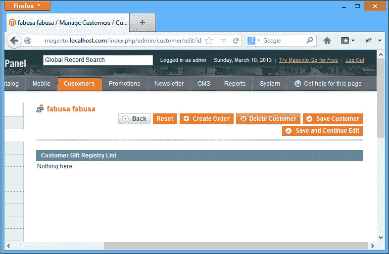
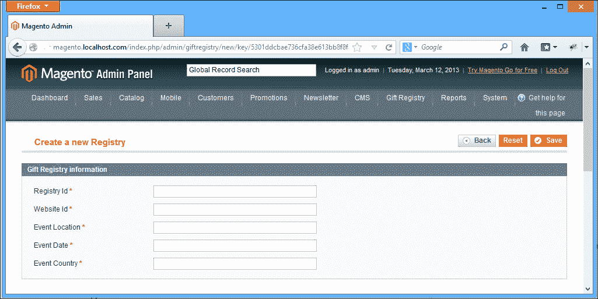

# 第五章：后端开发

在上一章中，我们为礼品注册表添加了所有前端功能。现在客户能够创建注册表并向客户注册表添加产品，并且通常可以完全控制自己的注册表。

在本章中，我们将构建所有商店所有者需要通过 Magento 后端管理和控制注册表的功能。

Magento 后端在许多方面可以被视为与 Magento 前端分开的应用程序；它使用完全不同的主题、样式和不同的基本控制器。

对于我们的礼品注册表，我们希望允许商店所有者查看所有客户注册表，修改信息，并添加和删除项目。在本章中，我们将涵盖以下内容：

+   使用配置扩展 Adminhtml

+   使用网格小部件

+   使用表单小部件

+   使用访问控制列表限制访问和权限

# 扩展 Adminhtml

`Mage_Adminhtml`是一个单一模块，通过使用配置提供 Magento 的所有后端功能。正如我们之前学到的，Magento 使用范围来定义配置。在上一章中，我们使用前端范围来设置我们自定义模块的配置。

要修改后端，我们需要在配置文件中创建一个名为`admin`的新范围。执行以下步骤来完成：

1.  打开`config.xml`文件，可以在`app/code/loca/Mdg/Giftregistry/etc/`位置找到。

1.  将以下代码添加到其中：

```php
<admin>
 <routers>
   <giftregistry>
     <use>admin</use>
       <args>
           <module>Mdg_Giftregistry_Adminhmtl</module>
           <frontName>giftregistry</frontName>
       </args>
   </giftregistry>
 </routers>
</admin>
```

这段代码与我们以前用来指定前端路由的代码非常相似；然而，通过这种方式声明路由，我们正在打破一个未写的 Magento 设计模式。

为了在后端保持一致，所有新模块都应该扩展主管理路由。

与以前的代码定义路由不同，我们正在创建一个全新的管理路由。通常情况下，除非您正在创建一个需要管理员访问但不需要 Magento 后端其余部分的新路由，否则不要在 Magento 后端这样做。管理员操作的回调 URL 就是这种情况的一个很好的例子。

幸运的是，有一种非常简单的方法可以在 Magento 模块之间共享路由名称。

### 注意

在 Magento 1.3 中引入了共享路由名称，但直到今天，我们仍然看到一些扩展没有正确使用这种模式。

让我们更新我们的代码：

1.  打开`config.xml`文件，可以在`app/code/loca/Mdg/Giftregistry/etc/`位置找到。

1.  使用以下代码更新路由配置：

```php
<admin>
 <routers>
   <adminhtml>
     <args>
       <modules>
         <mdg_giftregistry before="Mage_Adminhtml">Mdg_Giftregistry_Adminhtml</mdg_giftregistry>
       </modules>
     </args>
   </adminhtml>
 </routers>
</admin>
```

做出这些改变后，我们可以通过管理命名空间正确访问我们的管理控制器；例如，`http://magento.localhost.com/giftregistry/index`现在将是`http://magento.localhost.com/admin/giftregistry/index`。

我们的下一步将是创建一个新的控制器，我们可以用来管理客户注册表。我们将把这个控制器称为`GiftregistryController.php`。执行以下步骤来完成：

1.  导航到您的模块控制器文件夹。

1.  创建一个名为`Adminhtml`的新文件夹。

1.  在`app/code/loca/Mdg/Giftregistry/controllers/Adminhtml/`位置创建名为`GiftregistryController.php`的文件。

1.  将以下代码添加到其中：

```php
<?php
class Mdg_Giftregistry_Adminhtml_GiftregistryController extends Mage_Adminhtml_Controller_Action
{
    public function indexAction()
    {
        $this->loadLayout();
        $this->renderLayout();
        return $this;
    }

    public function editAction()
    {
        $this->loadLayout();
        $this->renderLayout();
        return $this;
    }

    public function saveAction()
    {
        $this->loadLayout();
        $this->renderLayout();
        return $this;
    }

    public function newAction()
    {
        $this->loadLayout();
        $this->renderLayout();
        return $this;
    }

    public function massDeleteAction()
    {
        $this->loadLayout();
        $this->renderLayout();
        return $this;
    }
}
```

请注意一个重要的事情：这个新控制器扩展了`Mage_Adminhtml_Controller_Action`而不是我们到目前为止一直在使用的`Mage_Core_Controller_Front_Action`。这样做的原因是`Adminhtml`控制器具有额外的验证，以防止非管理员用户访问它们的操作。

请注意，我们将我们的控制器放在`controllers/`目录内的一个新子文件夹中；通过使用这个子目录，我们可以保持前端和后端控制器的组织。这是一个被广泛接受的 Magento 标准实践。

现在，让我们暂时不管这个空控制器，让我们扩展 Magento 后端导航并向客户编辑页面添加一些额外的选项卡。

## 回到配置

到目前为止，我们已经看到，大多数情况下 Magento 由 XML 配置文件控制，后端布局也不例外。我们需要创建一个新的`adminhtml`布局文件。执行以下步骤来完成：

1.  导航到设计文件夹。

1.  创建一个名为`adminhtml`的新文件夹，并在其中创建以下文件夹结构：

+   `adminhtml/`

+   `--default/`

+   `----default/`

+   `------template/`

+   `------layout/`

1.  在`layout`文件夹内，让我们在位置`app/code/design/adminhtml/default/default/layout/`创建一个名为`giftregistry.xml`的新布局文件。

1.  将以下代码复制到布局文件中：

```php
<?xml version="1.0"?>
<layout version="0.1.0">
    <adminhtml_customer_edit>
        <reference name="left">
            <reference name="customer_edit_tabs">
                <block type="mdg_giftregistry/adminhtml_customer_edit_tab_giftregistry" name="tab_giftregistry_main" template="mdg_giftregistry/giftregistry/customer/main.phtml">
                </block>
                <action method="addTab">
                 <name>mdg_giftregistry</name>
              <block>tab_giftregistry_main</block>
          </action>
            </reference>
        </reference>
    </adminhtml_customer_edit>
</layout>
```

我们还需要将新的布局文件添加到`config.xml`模块中。执行以下步骤来完成：

1.  导航到`etc/`文件夹。

1.  打开`config.xml`文件，可以在位置`app/code/loca/Mdg/Giftregistry/etc/`找到。

1.  将以下代码复制到`config.xml`文件中：

```php
…
    <adminhtml>
        <layout>
            <updates>
                <mdg_giftregistry module="mdg_giftregistry">
                    <file>giftregistry.xml</file>
                </mdg_giftregistry>
            </updates>
        </layout>
    </adminhtml>
…
```

在布局内部，我们正在创建一个新的容器块，并声明一个包含此块的新选项卡。

让我们通过登录到 Magento 后端并打开**客户管理**，进入**客户** | **管理客户**，快速测试我们迄今为止所做的更改。

我们应该在后端得到以下错误：


这是因为我们正在尝试添加一个尚未声明的块；为了解决这个问题，我们需要创建一个新的块类。执行以下步骤来完成：

1.  导航到块文件夹，并按照目录结构创建一个名为`Giftregistry.php`的新块类，位置在`app/code/loca/Mdg/Giftregistry/Block/Adminhtml/Customer/Edit/Tab/`。

1.  将以下代码添加到其中：

```php
<?php 
class Mdg_Giftregistry_Block_Adminhtml_Customer_Edit_Tab_Giftregistry
    extends Mage_Adminhtml_Block_Template
    implements Mage_Adminhtml_Block_Widget_Tab_Interface {

    public function __construct()
    {
        $this->setTemplate('mdg/giftregistry/customer/main.phtml');
        parent::_construct();
    }

    public function getCustomerId()
    {
        return Mage::registry('current_customer')->getId();
    }

    public function getTabLabel()
    {
        return $this->__('GiftRegistry List');
    }

    public function getTabTitle()
    {
        return $this->__('Click to view the customer Gift Registries');
    }

    public function canShowTab()
    {
        return true;
    }

    public function isHidden()
    {
        return false;
    }
}
```

这个块类有一些有趣的事情发生。首先，我们正在扩展一个不同的块类`Mage_Adminhtml_Block_Template`，并实现一个新的接口`Mage_Adminhtml_Block_Widget_Tab_Interface`。这样做是为了访问 Magento 后端的所有功能和功能。

我们还在类的构造函数中设置了块模板；同样在`getCustomerId`下，我们使用 Magento 全局变量来获取当前客户。

我们的下一步将是为此块创建相应的模板文件，否则我们将在块初始化时出现错误。

1.  在位置`app/code/design/adminhtml/default/default/template/mdg/giftregistry/customer/`创建一个名为`main.phtml`的模板文件。

1.  将以下代码复制到其中：

```php
<div class="entry-edit">
    <div class="entry-edit-head">
        <h4 class="icon-head head-customer-view"><?php echo $this->__('Customer Gift Registry List') ?></h4>
    </div>
    <table cellspacing="2" class="box-left">
        <tr>
            <td>
                Nothing here 
            </td>
        </tr>
    </table>
</div>
```

目前，我们只是向模板添加占位内容，以便我们实际上可以看到我们的选项卡在操作中；现在，如果我们转到后端的客户部分，我们应该看到一个新的选项卡可用，并且单击该选项卡将显示我们的占位内容。

到目前为止，我们已经修改了后端，并通过更改配置和添加一些简单的块和模板文件，向客户部分添加了**Customers**选项卡。但到目前为止，这还没有特别有用，所以我们需要一种方法来显示所有客户礼品注册在**礼品注册**选项卡下。

# 网格小部件

我们可以重用 Magento `Adminhtml`模块已经提供的块，而不必从头开始编写我们自己的网格块。

我们将要扩展的块称为网格小部件；网格小部件是一种特殊类型的块，旨在以特定的表格网格中呈现 Magento 对象的集合。

网格小部件通常呈现在网格容器内；这两个元素的组合不仅允许以网格形式显示我们的数据，还添加了搜索、过滤、排序和批量操作功能。执行以下步骤：

1.  导航到块`Adminhtml/`文件夹，并在位置`app/code/loca/Mdg/Giftregistry/Block/Adminhtml/Customer/Edit/Tab/`创建一个名为`Giftregistry/`的文件夹。

1.  在该文件夹内创建一个名为`List.php`的类。

1.  将以下代码复制到`Giftregistry/List.php`文件中：

```php
<?php
class Mdg_Giftregistry_Block_Adminhtml_Customer_Edit_Tab_Giftregistry_List extends Mage_Adminhtml_Block_Widget_Grid
{
    public function __construct()
    {
        parent::__construct();
        $this->setId('registryList');
        $this->setUseAjax(true);
        $this->setDefaultSort('event_date');
        $this->setFilterVisibility(false);
        $this->setPagerVisibility(false);
    }

    protected function _prepareCollection()
    {
        $collection = Mage::getModel('mdg_giftregistry/entity')
            ->getCollection()
            ->addFieldToFilter('main_table.customer_id', $this->getRequest()->getParam('id'));
        $this->setCollection($collection);
        return parent::_prepareCollection();
    }

    protected function _prepareColumns()
    {
        $this->addColumn('entity_id', array(
            'header'   => Mage::helper('mdg_giftregistry')->__('Id'),
            'width'    => 50,
            'index'    => 'entity_id',
            'sortable' => false,
        ));

        $this->addColumn('event_location', array(
            'header'   => Mage::helper('mdg_giftregistry')->__('Location'),
            'index'    => 'event_location',
            'sortable' => false,
        ));

        $this->addColumn('event_date', array(
            'header'   => Mage::helper('mdg_giftregistry')->__('Event Date'),
            'index'    => 'event_date',
            'sortable' => false,
        ));

        $this->addColumn('type_id', array(
            'header'   => Mage::helper('mdg_giftregistry')->__('Event Type'),
            'index'    => 'type_id',
            'sortable' => false,
        ));
        return parent::_prepareColumns();
    }
}
```

看看我们刚刚创建的类，只涉及三个函数：

+   `__construct()`

+   `_prepareCollection()`

+   `_prepareColumns()`

在`__construct`函数中，我们指定了关于我们的网格类的一些重要选项。我们设置了`gridId`；默认排序为`eventDate`，并启用了分页和过滤。

`__prepareCollection()`函数加载了一个由当前`customerId`过滤的注册表集合。这个函数也可以用来在我们的集合中执行更复杂的操作；例如，连接一个辅助表以获取有关客户或其他相关记录的更多信息。

最后，通过使用`__prepareColumns()`函数，我们告诉 Magento 应该显示哪些列和数据集的属性，以及如何渲染它们。

现在我们已经创建了一个功能性的网格块，我们需要对我们的布局 XML 文件进行一些更改才能显示它。执行以下步骤：

1.  打开`giftregistry.xml`文件，该文件位于`app/design/adminhtml/default/default/layout/`位置。

1.  进行以下更改：

```php
<?xml version="1.0"?>
<layout version="0.1.0">
    <adminhtml_customer_edit>
        <reference name="left">
            <reference name="customer_edit_tabs">
                <block type="mdg_giftregistry/adminhtml_customer_edit_tab_giftregistry" name="tab_giftregistry_main" template="mdg/giftregistry/customer/main.phtml">
                    <block type="mdg_giftregistry/adminhtml_customer_edit_tab_giftregistry_list" name="tab_giftregistry_list" as="giftregistry_list" />
                </block>
                <action method="addTab">
                    <name>mdg_giftregistry</name>
                    <block>mdg_giftregistry/adminhtml_customer_edit_tab_giftregistry</block>
                </action>
            </reference>
        </reference>
    </adminhtml_customer_edit>
</layout>
```

我们所做的是将网格块添加为我们的主块的一部分，但如果我们转到客户编辑页面并点击**礼品注册**选项卡，我们仍然看到旧的占位文本，并且网格没有显示。



这是因为我们还没有对`main.phtml`模板文件进行必要的更改。为了显示子块，我们需要明确告诉模板系统加载任何或特定的子块；现在，我们将只加载我们特定的网格块。执行以下步骤：

1.  打开`main.phtml`模板文件，该文件位于`app/design/adminhtml/default/default/template/customer/`位置。

1.  用以下内容替换模板代码：

```php
<div class="entry-edit">
    <div class="entry-edit-head">
        <h4 class="icon-head head-customer-view"><?php echo $this->__('Customer Gift Registry List') ?></h4>
    </div>
    <?php echo $this->getChildHtml('tab_giftregistry_list'); ?>
</div>
```

`getChildHtml()`函数负责渲染所有子块。

`getChildHtml()`函数可以使用特定的子块名称或无参数调用；如果没有参数调用，它将加载所有可用的子块。

在我们的扩展情况下，我们只对实例化特定的子块感兴趣，所以我们将传递块名称作为函数参数。现在，如果我们刷新页面，我们应该看到我们的网格块加载了该特定客户的所有可用礼品注册。

## 管理注册表

现在，如果我们想要管理特定客户的注册表，这很方便，但如果我们想要管理商店中所有可用的注册表，这并不真正帮助我们。为此，我们需要创建一个加载所有可用礼品注册的网格。

由于我们已经为后端创建了礼品注册控制器，我们可以使用索引操作来显示所有可用的注册表。

我们需要做的第一件事是修改 Magento 后端导航，以显示指向我们新控制器索引操作的链接。同样，我们可以通过使用 XML 来实现这一点。在这种特殊情况下，我们将创建一个名为`adminhtml.xml`的新 XML 文件。执行以下步骤：

1.  导航到您的模块`etc`文件夹，该文件夹位于`app/code/local/Mdg/Giftregistry/`位置。

1.  创建一个名为`adminhtml.xml`的新文件。

1.  将以下代码放入该文件中：

```php
<?xml version="1.0"?>
<config>
    <menu>
        <mdg_giftregistry module="mdg_giftregistry">
            <title>Gift Registry</title>
            <sort_order>71</sort_order>
            <children>
                <items module="mdg_giftregistry">
                    <title>Manage Registries</title>
                    <sort_order>0</sort_order>
                    <action>adminhtml/giftregistry/index</action>
                </items>
            </children>
        </mdg_giftregistry>
    </menu>
</config>
```

### 注意

虽然标准是将此配置添加到`adminhtml.xml`中，但您可能会遇到未遵循此标准的扩展。此配置可以位于`config.xml`中。

这个配置代码正在创建一个新的主级菜单和一个新的子级选项；我们还指定了菜单应映射到哪个操作，在这种情况下，是我们的礼品注册控制器的索引操作。

如果我们现在刷新后端，我们应该会看到一个新的**礼品注册**菜单添加到顶级导航中。

## 权限和 ACL

有时我们需要根据管理员规则限制对模块的某些功能甚至整个模块的访问。Magento 允许我们使用一个称为**ACL**或**访问控制列表**的强大功能来实现这一点。Magento 后端中的每个角色都可以具有不同的权限和不同的 ACL。

启用我们自定义模块的 ACL 的第一步是定义 ACL 应该受限制的资源；这由配置 XML 文件控制，这并不奇怪。执行以下步骤：

1.  打开`adminhtml.xml`配置文件，该文件位于`app/code/local/Mdg/Giftregistry/etc/`位置。

1.  在菜单路径之后添加以下代码：

```php
<acl>
    <resources>
        <admin>
            <children>
                <giftregistry translate="title" module="mdg_giftregistry">
                    <title>Gift Registry</title>
                    <sort_order>300</sort_order>
                    <children>
                        <items translate="title" module="mdg_giftregistry">
                            <title>Manage Registries</title>
                            <sort_order>0</sort_order>
                        </items>
                    </children>
                </giftregistry>
            </children>
        </admin>
    </resources>
</acl>
```

现在，在 Magento 后端，如果我们导航到**系统** | **权限** | **角色**，选择**管理员**角色，并尝试在列表底部设置**角色资源**，我们可以看到我们创建的新 ACL 资源，如下面的截图所示：


通过这样做，我们可以精细控制每个用户可以访问哪些操作。

如果我们点击**管理注册表**菜单，我们应该会看到一个空白页面；因为我们还没有创建相应的网格块、布局和模板，所以我们应该会看到一个完全空白的页面。

所以让我们开始创建我们新网格所需的块；我们创建礼品注册表网格的方式将与我们为**客户**选项卡所做的略有不同。

我们需要创建一个网格容器块和一个网格块。网格容器用于保存网格标题、按钮和网格内容，而网格块只负责呈现带有分页、过滤和批量操作的网格。执行以下步骤：

1.  导航到您的块`Adminhtml`文件夹。

1.  在`app/code/local/Mdg/Giftregistry/Block/Adminhtml/`位置创建一个名为`Registries.php`的新块：

1.  将以下代码添加到其中：

```php
<?php
class Mdg_Giftregistry_Block_Adminhtml_Registries extends Mage_Adminhtml_Block_Widget_Grid_Container
{
public function __construct(){
    $this->_controller = 'adminhtml_registries';
    $this->_blockGroup = 'mdg_giftregistry';
    $this->_headerText = Mage::helper('mdg_giftregistry')->__('Gift Registry Manager');
    parent::__construct();
  }
}
```

我们在网格容器内的`construct`函数中设置的一个重要的事情是使用受保护的`_controller`和`_blockGroup`值，Magento 网格容器通过这些值来识别相应的网格块。

重要的是要澄清，`$this->_controller`不是实际的控制器名称，而是块类名称，`$this->_blockGroup`实际上是模块名称。

让我们继续创建网格块，正如我们之前学到的那样，它有三个主要功能：`_construct`，`_prepareCollection()`和`_prepareColumns()`。但在这种情况下，我们将添加一个名为`_prepareMassActions()`的新功能，它允许我们修改所选记录集而无需逐个编辑。执行以下步骤：

1.  导航到您的块`Adminhtml`文件夹并创建一个名为`Registries`的新文件夹。

1.  在`Model`文件夹下，在`app/code/local/Mdg/Giftregistry/Block/Adminhtml/Registries/`位置创建一个名为`Grid.php`的新块。

1.  将以下代码添加到`Grid.php`中：

```php
File Location: Grid.php
<?php
class Mdg_Giftregistry_Block_Adminhtml_Registries_Grid extends Mage_Adminhtml_Block_Widget_Grid
{
    public function __construct(){
        parent::__construct();
        $this->setId('registriesGrid');
        $this->setDefaultSort('event_date');
        $this->setDefaultDir('ASC');
        $this->setSaveParametersInSession(true);
    }

    protected function _prepareCollection(){
        $collection = Mage::getModel('mdg_giftregistry/entity')->getCollection();
        $this->setCollection($collection);
        return parent::_prepareCollection();
    }

    protected function _prepareColumns()
    {
        $this->addColumn('entity_id', array(
            'header'   => Mage::helper('mdg_giftregistry')->__('Id'),
            'width'    => 50,
            'index'    => 'entity_id',
            'sortable' => false,
        ));

        $this->addColumn('event_location', array(
            'header'   => Mage::helper('mdg_giftregistry')->__('Location'),
            'index'    => 'event_location',
            'sortable' => false,
        ));

        $this->addColumn('event_date', array(
            'header'   => Mage::helper('mdg_giftregistry')->__('Event Date'),
            'index'    => 'event_date',
            'sortable' => false,
        ));

        $this->addColumn('type_id', array(
            'header'   => Mage::helper('mdg_giftregistry')->__('Event Type'),
            'index'    => 'type_id',
            'sortable' => false,
        ));
        return parent::_prepareColumns();
    }

    protected function _prepareMassaction(){
    }
}
```

这个网格代码与我们之前为**客户**选项卡创建的非常相似，唯一的区别是这次我们不是特别按客户记录进行过滤，而且我们还创建了一个网格容器块，而不是实现一个自定义块。

最后，为了在我们的控制器动作中显示网格，我们需要执行以下步骤：

1.  打开`giftregistry.xml`文件，该文件位于`app/code/design/adminhtml/default/default/layout/`位置。

1.  将以下代码添加到其中：

```php
…
    <adminhtml_giftregistry_index>
         <reference name="content">
             <block type="mdg_giftregistry/adminhtml_registries" name="registries" />
         </reference>
     </adminhtml_giftregistry_index>
…
```

由于我们使用了网格容器，我们只需要指定网格容器块，Magento 将负责加载匹配的网格容器。

无需为网格或网格容器指定或创建模板文件，因为这两个块都会自动从`adminhtml/base/default`主题加载基本模板。

现在，我们可以通过在后端导航到**礼品注册** | **管理注册表**来检查我们新添加的礼品注册。


## 使用大规模操作进行批量更新

在创建我们的基本网格块时，我们定义了一个名为`_prepareMassactions()`的函数，它提供了一种简单的方式来操作网格中的多条记录。在我们的情况下，现在让我们只实现一个大规模删除动作。执行以下步骤：

1.  打开注册表格块`Grid.php`，该文件位于`app/code/local/Mdg/Giftregistry/Block/Adminhtml/Registries/`位置。

1.  用以下代码替换`_prepareMassaction()`函数：

```php
protected function _prepareMassaction(){
    $this->setMassactionIdField('entity_id');
    $this->getMassactionBlock()->setFormFieldName('registries');

    $this->getMassactionBlock()->addItem('delete', array(
        'label'     => Mage::helper('mdg_giftregistry')->__('Delete'),
        'url'       => $this->getUrl('*/*/massDelete'),
        'confirm'   => Mage::helper('mdg_giftregistry')->__('Are you sure?')
    ));
    return $this;
}
```

大规模操作的工作方式是通过将一系列选定的 ID 传递给我们指定的控制器动作；在这种情况下，`massDelete()`动作将添加代码来迭代注册表集合并删除每个指定的注册表。执行以下步骤：

1.  打开`GiftregistryController.php`文件，该文件位于`app/code/local/Mdg/Giftregistry/controllers/Adminhtml/`位置。

1.  用以下代码替换空白的`massDelete()`动作：

```php
…
public function massDeleteAction()
{
    $registryIds = $this->getRequest()->getParam('registries');
        if(!is_array($registryIds)) {
             Mage::getSingleton('adminhtml/session')->addError(Mage::helper('mdg_giftregistry')->__('Please select one or more registries.'));
        } else {
            try {
                $registry = Mage::getModel('mdg_giftregistry/entity');
                foreach ($registryIds as $registryId) {
                    $registry->reset()
                        ->load($registryId)
                        ->delete();
                }
                Mage::getSingleton('adminhtml/session')->addSuccess(
                Mage::helper('adminhtml')->__('Total of %d record(s) were deleted.', count($registryIds))
                );
            } catch (Exception $e) {
                Mage::getSingleton('adminhtml/session')->addError($e->getMessage());
            }
        }
        $this->_redirect('*/*/index');
}
```

### 注意

**挑战**：添加两个新的大规模操作，将注册表的状态分别更改为启用或禁用。要查看完整代码和详细分解的答案，请访问[`www.magedevguide.com/`](http://www.magedevguide.com/)。

最后，我们还希望能够编辑我们网格中列出的记录。为此，我们需要向我们的注册表格类添加一个新函数；这个函数被称为`getRowUrl()`，它用于指定单击网格行时要执行的操作；在我们的特定情况下，我们希望将该函数映射到`editAction()`。执行以下步骤：

1.  打开`Grid.php`文件，该文件位于`app/code/local/Mdg/Giftregistry/Block/Adminhtml/Registries/`位置。

1.  向其中添加以下函数：

```php
…
public function getRowUrl($row)
{
    return $this->getUrl('*/*/edit', array('id' => $row->getEntityId()));
}
…
```

# 表单小部件

到目前为止，我们一直在处理礼品注册表格，但现在我们除了获取所有可用注册表的列表或批量删除注册表之外，无法做更多事情。我们需要一种方法来获取特定注册表的详细信息；我们可以将其映射到编辑控制器动作。

`edit`动作将显示特定注册表的详细信息，并允许我们修改注册表的详细信息和状态。我们需要为此动作创建一些块和模板。

为了查看和编辑注册表信息，我们需要实现一个表单小部件块。表单小部件的工作方式与网格小部件块类似，需要有一个表单块和一个扩展`Mage_Adminhtml_Block_Widget_Form_Container`类的表单容器块。为了创建表单容器，让我们执行以下步骤：

1.  导航到`Registries`文件夹。

1.  在`app/code/local/Mdg/Giftregistry/Block/Adminhtml/Registries/`位置创建一个名为`Edit.php`的新类文件。

1.  向类文件中添加以下代码：

```php
class Mdg_Giftregistry_Block_Adminhtml_Registries_Edit extends Mage_Adminhtml_Block_Widget_Form_Container
{
    public function __construct(){
        parent::__construct();
        $this->_objectId = 'id';
        $this->_blockGroup = 'registries';
        $this->_controller = 'adminhtml_giftregistry';
        $this->_mode = 'edit';

        $this->_updateButton('save', 'label', Mage::helper('mdg_giftregistry')->__('Save Registry'));
        $this->_updateButton('delete', 'label', Mage::helper('mdg_giftregistry')->__('Delete Registry'));
    }

    public function getHeaderText(){
        if(Mage::registry('registries_data') && Mage::registry('registries_data')->getId())
            return Mage::helper('mdg_giftregistry')->__("Edit Registry '%s'", $this->htmlEscape(Mage::registry('registries_data')->getTitle()));
        return Mage::helper('mdg_giftregistry')->__('Add Registry');
    }
}
```

与网格小部件类似，表单容器小部件将自动识别并加载匹配的表单块。

在表单容器中声明的另一个受保护属性是 mode 属性；这个受保护属性被容器用来指定表单块的位置。

我们可以在`Mage_Adminhtml_Block_Widget_Form_Container`类中找到负责创建表单块的代码：

```php
$this->getLayout()->createBlock($this->_blockGroup . '/' . $this->_controller . '_' . $this->_mode . '_form')
```

现在我们已经创建了表单容器块，我们可以继续创建匹配的表单块。执行以下步骤：

1.  导航到`Registries`文件夹。

1.  创建一个名为`Edit`的新文件夹。

1.  在`app/code/local/Mdg/Giftregistry/Block/Adminhtml/Registries/Edit/`位置创建一个名为`Form.php`的新文件。

1.  向其中添加以下代码：

```php
<?php
class Mdg_Giftregistry_Block_Adminhtml_Registries_Edit_Form extends  Mage_Adminhtml_Block_Widget_Form
{
    protected function _prepareForm(){
        $form = new Varien_Data_Form(array(
            'id' => 'edit_form',
            'action' => $this->getUrl('*/*/save', array('id' => $this->getRequest()->getParam('id'))),
            'method' => 'post',
            'enctype' => 'multipart/form-data'
        ));
        $form->setUseContainer(true);
        $this->setForm($form);

        if (Mage::getSingleton('adminhtml/session')->getFormData()){
            $data = Mage::getSingleton('adminhtml/session')->getFormData();
            Mage::getSingleton('adminhtml/session')->setFormData(null);
        }elseif(Mage::registry('registry_data'))
            $data = Mage::registry('registry_data')->getData();

        $fieldset = $form->addFieldset('registry_form', array('legend'=>Mage::helper('mdg_giftregistry')->__('Gift Registry information')));

        $fieldset->addField('type_id', 'text', array(
            'label'     => Mage::helper('mdg_giftregistry')->__('Registry Id'),
            'class'     => 'required-entry',
            'required'  => true,
            'name'      => 'type_id',
        ));

        $fieldset->addField('website_id', 'text', array(
            'label'     => Mage::helper('mdg_giftregistry')->__('Website Id'),
            'class'     => 'required-entry',
            'required'  => true,
            'name'      => 'website_id',
        ));

        $fieldset->addField('event_location', 'text', array(
            'label'     => Mage::helper('mdg_giftregistry')->__('Event Location'),
            'class'     => 'required-entry',
            'required'  => true,
            'name'      => 'event_location',
        ));

        $fieldset->addField('event_date', 'text', array(
            'label'     => Mage::helper('mdg_giftregistry')->__('Event Date'),
            'class'     => 'required-entry',
            'required'  => true,
            'name'      => 'event_date',
        ));

        $fieldset->addField('event_country', 'text', array(
            'label'     => Mage::helper('mdg_giftregistry')->__('Event Country'),
            'class'     => 'required-entry',
            'required'  => true,
            'name'      => 'event_country',
        ));

        $form->setValues($data);
        return parent::_prepareForm();
    }
}
```

我们还需要修改我们的布局文件，并告诉 Magento 加载我们的表单容器。

将以下代码复制到布局文件`giftregistry.xml`中，该文件位于`app/code/design/adminhtml/default/default/layout/`位置：

```php
<?xml version="1.0"?>
<layout version="0.1.0">
    …
    <adminhtml_giftregistry_edit>
        <reference name="content">
            <block type="mdg_giftregistry/adminhtml_registries_edit" name="new_registry_tabs" />
        </reference>
    </adminhtml_giftregistry_edit>
    …
```

此时，我们可以进入 Magento 后端，点击我们的示例注册表之一，查看我们的进展。我们应该看到以下表单：



但似乎有一个问题。没有加载任何数据；我们只有一个空表单，因此我们必须修改我们的控制器`editAction()`以加载数据。

## 加载数据

让我们从修改`GiftregistryController.php`文件中的`editAction()`开始，该文件位于`app/code/local/Mdg/Giftregistry/controllers/Adminhtml/`位置：

```php
…
public function editAction()
{
    $id     = $this->getRequest()->getParam('id', null);
    $registry  = Mage::getModel('mdg_giftregistry/entity');

    if ($id) {
        $registry->load((int) $id);
        if ($registry->getId()) {
            $data = Mage::getSingleton('adminhtml/session')->getFormData(true);
            if ($data) {
                $registry->setData($data)->setId($id);
            }
        } else {
            Mage::getSingleton('adminhtml/session')->addError(Mage::helper('awesome')->__('The Gift Registry does not exist'));
            $this->_redirect('*/*/');
        }
    }
    Mage::register('registry_data', $registry);

    $this->loadLayout();
    $this->getLayout()->getBlock('head')->setCanLoadExtJs(true);
    $this->renderLayout();
}
```

我们在`editAction()`中所做的是检查是否存在具有相同 ID 的注册表，如果存在，我们将加载该注册表实体并使其可用于我们的表单。之前，在将表单代码添加到文件`app/code/local/Mdg/Giftregistry/Block/Adminhtml/Registries/Edit/Form.php`时，我们包括了以下内容：

```php
…
if (Mage::getSingleton('adminhtml/session')->getFormData()){
    $data = Mage::getSingleton('adminhtml/session')->getFormData();
    Mage::getSingleton('adminhtml/session')->setFormData(null);
}elseif(Mage::registry('registry_data'))
    $data = Mage::registry('registry_data')->getData();  
…
```

现在，我们可以通过重新加载表单来测试我们的更改：


## 保存数据

现在我们已经为编辑注册表创建了表单，我们需要创建相应的操作来处理并保存表单提交的数据。我们可以使用保存表单操作来处理这个过程。执行以下步骤：

1.  打开`GiftregistryController.php`类，该类位于`app/code/local/Mdg/Giftregistry/controllers/Adminhtml/`位置。

1.  用以下代码替换空白的`saveAction()`函数：

```php
public function saveAction()
{
    if ($this->getRequest()->getPost())
    {
        try {
            $data = $this->getRequest()->getPost();
            $id = $this->getRequest()->getParam('id');

            if ($data && $id) {
                $registry = Mage::getModel('mdg_giftregistry/entity')->load($id);
                $registry->setData($data);
                $registry->save();
                  $this->_redirect('*/*/edit', array('id' => $this->getRequest()->getParam('registry_id')));
            }
        } catch (Exception $e) {
            $this->_getSession()->addError(
                Mage::helper('mdg_giftregistry')->__('An error occurred while saving the registry data. Please review the log and try again.')
            );
            Mage::logException($e);
            $this->_redirect('*/*/edit', array('id' => $this->getRequest()->getParam('registry_id')));
            return $this;
        }
    }
}
```

让我们逐步分解一下这段代码在做什么：

1.  我们检查请求是否具有有效的提交数据。

1.  我们检查`$data`和`$id`变量是否都设置了。

1.  如果两个变量都设置了，我们加载一个新的注册表实体并设置数据。

1.  最后，我们尝试保存注册表实体。

我们首先要做的是检查提交的数据不为空，并且我们在参数中获取了注册表 ID；我们还检查注册表 ID 是否是注册表实体的有效实例。

# 总结

在本章中，我们学会了如何修改和扩展 Magento 后端以满足我们的特定需求。

前端扩展了客户和用户可以使用的功能；扩展后端允许我们控制这个自定义功能以及客户与其交互的方式。

网格和表单是 Magento 后端的重要部分，通过正确使用它们，我们可以添加很多功能，而不必编写大量代码或重新发明轮子。

最后，我们学会了如何使用权限和 Magento ACL 来控制和限制我们的自定义扩展以及 Magento 的权限。

在下一章中，我们将深入研究 Magento API，并学习如何扩展它以使用多种方法（如 SOAP、XML-RPC 和 REST）来操作我们的注册表数据。
