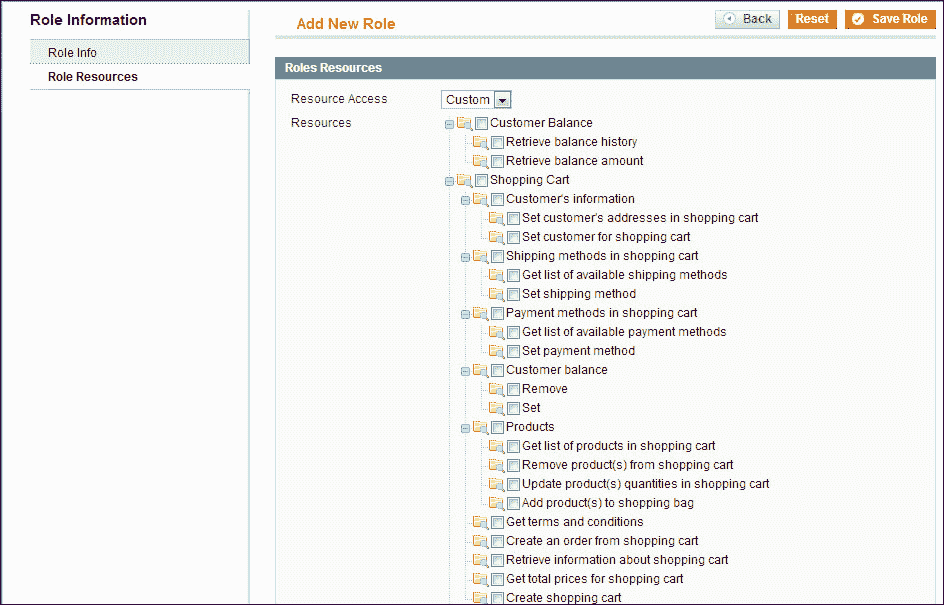
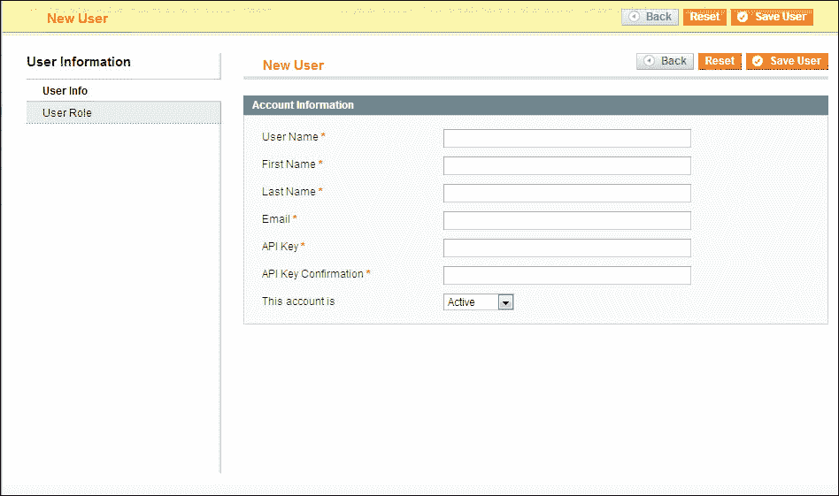
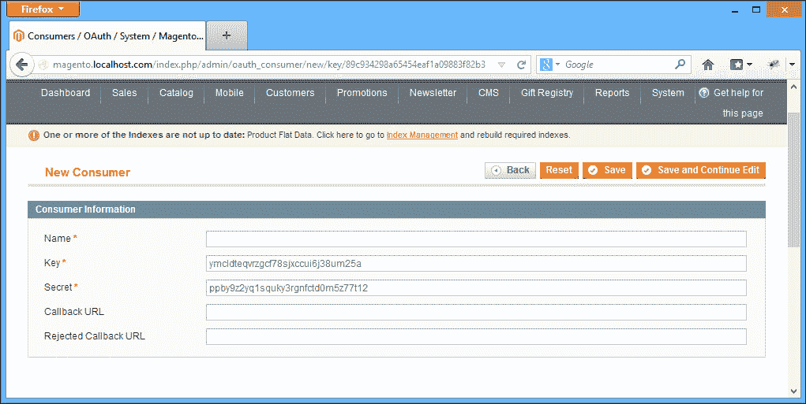

# 第六章。Magento API

在上一章中，我们扩展了 Magento 后端，并学习了如何使用一些后端组件，以便商店所有者可以管理和操作每个客户的礼品注册数据。

在本章中，我们将涵盖以下主题：

+   Magento 核心 API

+   可用的多个 API 协议（REST、SOAP、XML-RPC）

+   如何使用核心 API

+   如何扩展 API 以实现新功能

+   如何将 API 的部分限制为特定的 Web 用户角色

虽然后端提供了日常操作的界面，但有时我们需要访问和/或传输来自第三方系统的数据。Magento 已经为大多数核心功能提供了 API 功能，但对于我们的自定义礼品注册扩展，我们需要扩展`Mage_Api`功能。

# 核心 API

在谈论 API 时，我经常听到开发人员谈论 Magento SOAP API 或 Magento XML-RPC API 或 RESTful API。但重要的事实是，这些并不是针对每个协议的单独 API；相反，Magento 有一个单一的核心 API。

正如您可能注意到的，Magento 主要建立在抽象和配置（主要是 XML）周围，Magento API 也不例外。我们有一个单一的核心 API 和每种不同协议类型的适配器。这是非常灵活的，如果我们愿意，我们可以为另一个协议实现自己的适配器。

核心 Magento API 使我们能够管理产品、类别、属性、订单和发票。这是通过暴露三个核心模块来实现的：

+   `Mage_Catalog`

+   `Mage_Sales`

+   `Mage_Customer`

API 支持三种不同类型：SOAP、XML-RPC 和 REST。现在，如果您在 Magento 之外进行了 Web 开发并使用了其他 API，那么很可能那些 API 是 RESTful API。

在我们深入研究 Magento API 架构的具体细节之前，重要的是我们了解每种支持的 API 类型之间的区别。

## XML-RPC

XML-RPC 是 Magento 支持的第一个协议，也是最古老的协议。该协议有一个单一的端点，所有功能都在此端点上调用和访问。

### 注意

**XML-RPC**是一种使用 XML 编码其调用和 HTTP 作为传输机制的**远程过程调用**（**RPC**）协议。

由于只有一个单一的端点，XML-RPC 易于使用和维护；它的目的是成为发送和接收数据的简单有效的协议。实现使用简单的 XML 来编码和解码远程过程调用以及参数。

然而，这是有代价的，整个 XML-RPC 协议存在几个问题：

+   发现性和文档不足。

+   参数是匿名的，XML-RPC 依赖于参数的顺序来区分它们。

+   简单性是 XML-RPC 的最大优势，也是最大问题所在。虽然大多数任务可以很容易地通过 XML-RPC 实现，但有些任务需要您费尽周折才能实现应该很简单的事情。

SOAP 旨在解决 XML-RPC 的局限性并提供更强大的协议。

### 注意

有关 XML-RPC 的更多信息，您可以访问以下链接：

[`en.wikipedia.org/wiki/XML-RPC`](http://en.wikipedia.org/wiki/XML-RPC)

## SOAP

自 Magento 1.3 以来，SOAP v1 是 Magento 支持的第一个协议，与 XML-RPC 一起。

### 注意

**SOAP**最初定义为**简单对象访问协议**，是用于在计算机网络中实现 Web 服务的结构化信息交换的协议规范。

**SOAP 请求**基本上是一个包含 SOAP 信封、头和主体的 HTTP POST 请求。

SOAP 的核心是**Web 服务描述语言**（**WSDL**），基本上是 XML。WSDL 用于描述 Web 服务的功能，这里是我们的 API 方法。这是通过使用以下一系列预定的对象来实现的：

+   **类型**：用于描述与 API 传输的数据；类型使用 XML Schema 进行定义，这是一种专门用于此目的的语言

+   **消息**：用于指定执行每个操作所需的信息；在 Magento 的情况下，我们的 API 方法将始终使用请求和响应消息

+   **端口类型**：用于定义可以执行的操作及其相应的消息

+   **端口**：用于定义连接点；在 Magento 的情况下，使用简单的字符串

+   **服务**：用于指定通过 API 公开的功能

+   **绑定**：用于定义与 SOAP 协议的操作和接口

### 注意

有关 SOAP 协议的更多信息，请参考以下网站：

[`en.wikipedia.org/wiki/SOAP`](http://en.wikipedia.org/wiki/SOAP)

所有 WSDL 配置都包含在每个模块的`wsdl.xml`文件中；例如，让我们看一下目录产品 API 的摘录：

文件位置为`app/code/local/Mdg/Giftregistry/etc/wsdl.xml`。

```php
<?xml version="1.0" encoding="UTF-8"?>
<definitions  

             name="{{var wsdl.name}}" targetNamespace="urn:{{var wsdl.name}}">
    <types>
        <schema  targetNamespace="urn:Magento">
      ...
            <complexType name="catalogProductEntity">
                <all>
                    <element name="product_id" type="xsd:string"/>
                    <element name="sku" type="xsd:string"/>
                    <element name="name" type="xsd:string"/>
                    <element name="set" type="xsd:string"/>
                    <element name="type" type="xsd:string"/>
                    <element name="category_ids" type="typens:ArrayOfString"/>
                    <element name="website_ids" type="typens:ArrayOfString"/>
                </all>
            </complexType>

        </schema>
    </types>
    <message name="catalogProductListResponse">
        <part name="storeView" type="typens:catalogProductEntityArray"/>
    </message>
  ...
    <portType name="{{var wsdl.handler}}PortType">
    ...
        <operation name="catalogProductList">
            <documentation>Retrieve products list by filters</documentation>
            <input message="typens:catalogProductListRequest"/>
            <output message="typens:catalogProductListResponse"/>
        </operation>
        ...
    </portType>
    <binding name="{{var wsdl.handler}}Binding" type="typens:{{var wsdl.handler}}PortType">
        <soap:binding style="rpc" transport="http://schemas.xmlsoap.org/soap/http"/>
    ...
        <operation name="catalogProductList">
            <soap:operation soapAction="urn:{{var wsdl.handler}}Action"/>
            <input>
                <soap:body namespace="urn:{{var wsdl.name}}" use="encoded"
                           encodingStyle="http://schemas.xmlsoap.org/soap/encoding/"/>
            </input>
            <output>
                <soap:body namespace="urn:{{var wsdl.name}}" use="encoded"
                           encodingStyle="http://schemas.xmlsoap.org/soap/encoding/"/>
            </output>
        </operation>
    ...
    </binding>
    <service name="{{var wsdl.name}}Service">
        <port name="{{var wsdl.handler}}Port" binding="typens:{{var wsdl.handler}}Binding">
            <soap:address location="{{var wsdl.url}}"/>
        </port>
    </service>
</definitions>
```

通过使用 WSDL，我们可以记录、列出和支持更复杂的数据类型。

## RESTful API

RESTful API 是 Magento 支持的协议家族的新成员，仅适用于 Magento CE 1.7 或更早版本。

### 注意

**RESTful web** **service**（也称为**RESTful web API**）是使用 HTTP 和 REST 原则实现的 Web 服务。

RESTful API 可以通过以下三个方面来定义：

+   它使用标准的 HTTP 方法，如 GET、POST、DELETE 和 PUT

+   其公开的 URI 以目录结构的形式进行格式化

+   它使用 JSON 或 XML 来传输信息

### 注意

REST API 支持两种格式的响应，即 XML 和 JSON。

REST 相对于 SOAP 和 XML-RPC 的优势之一是，与 REST API 的所有交互都是通过 HTTP 协议完成的，这意味着它几乎可以被任何编程语言使用。

Magento REST API 具有以下特点：

+   通过向 Magento API 服务发出 HTTP 请求来访问资源

+   服务回复请求的数据或状态指示器，甚至两者都有

+   所有资源都可以通过`https://magento.localhost.com/api/rest/`访问

+   资源返回 HTTP 状态码，例如`HTTP 状态码 200`表示响应成功，或`HTTP 状态码 400`表示错误请求

+   通过将特定路径添加到基本 URL（`https://magento.localhost.com/api/rest/`）来请求特定资源

REST 使用**HTTP 动词**来管理资源的状态。在 Magento 实现中，有四个动词可用：GET、POST、PUT 和 DELETE。因此，在大多数情况下，使用 RESTful API 是微不足道的。

# 使用 API

现在我们已经澄清了每个可用协议，让我们探索一下 Magento API 可以做什么，以及如何使用每个可用协议进行操作。

我们将使用产品端点作为访问和处理不同 API 协议的示例。

### 注意

示例是用 PHP 提供的，并且使用了三种不同的协议。要获取 PHP 的完整示例并查看其他编程语言的示例，请访问[`magedevguide.com`](http://magedevguide.com)。

## 为 XML-RPC/SOAP 设置 API 凭据

在开始之前，我们需要创建一组 Web 服务凭据，以便访问 API 功能。

我们需要设置 API 用户角色。**角色**通过使用**访问控制列表**（**ACL**）来控制 API 的权限。通过实施这种设计模式，Magento 能够限制其 API 的某些部分只对特定用户开放。

在本章的后面，我们将学习如何将自定义函数添加到 ACL 并保护自定义扩展的 API 方法。现在，我们只需要通过执行以下步骤创建一个具有完全权限的角色：

1.  转到 Magento 后端。

1.  从主导航菜单转到**系统** | **Web 服务** | **角色**。

1.  单击**添加新角色**按钮。

1.  如下截图所示，您将被要求提供角色名称并指定角色资源：

1.  默认情况下，**资源访问**选项设置为**自定义**，未选择任何资源。在我们的情况下，我们将通过从下拉菜单中选择**全部**来更改**资源访问**选项。

1.  单击**保存角色**按钮。

现在我们在商店中有一个有效的角色，让我们继续创建 Web API 用户：

1.  转到 Magento 后端。

1.  从主导航菜单转到**系统** | **Web 服务** | **用户**。

1.  单击**添加新用户**按钮。

1.  接下来，我们将被要求提供用户信息，如下截图所示：

1.  在**API 密钥**和**API 密钥确认**字段中输入您想要的密码。

1.  单击**用户角色**选项卡。

1.  选择我们刚创建的用户角色。

1.  单击**保存用户**按钮。

我们需要为访问 API 创建用户名和角色的原因是，每个 API 函数都需要传递会话令牌作为参数。

因此，每次我们需要使用 API 时，我们必须首先调用`login`函数，该函数将返回有效的会话令牌 ID。

## 设置 REST API 凭据

新的 RESTful API 在身份验证方面略有不同；它不是使用传统的 Magento 网络服务用户，而是使用三足 OAuth 1.0 协议来提供身份验证。

OAuth 通过要求用户授权其应用程序来工作。当用户注册应用程序时，他/她需要填写以下字段：

+   **用户**：这是一个客户，他在 Magento 上有帐户，并可以使用 API 的服务。

+   **消费者**：这是使用 OAuth 访问 Magento API 的第三方应用程序。

+   **消费者密钥**：这是用于识别 Magento 用户的唯一值。

+   **消费者密钥**：这是客户用来保证消费者密钥所有权的秘密。此值永远不会在请求中传递。

+   **请求令牌**：此值由消费者（应用程序）用于从用户那里获取授权以访问 API 资源。

+   **访问令牌**：这是在成功认证时以请求令牌交换返回的。

让我们继续通过转到**系统** | **Web 服务** | **REST - OAuth 消费者**并在**管理**面板中选择**添加新**来注册我们的应用程序：



### 注意

需要注意的一件重要的事情是必须定义回调 URL，用户在成功授权应用程序后将被重定向到该 URL。

我们的第一步是学习如何在每个可用的 API 协议中获取此会话令牌 ID。

要在 XML-RPC 中获取会话令牌 ID，我们需要执行以下代码：

```php
$apiUser = 'username';
$apiKey = 'password';
$client = new Zend_XmlRpc_Client('http://ourhost.com/api/xmlrpc/');
// We authenticate ourselves and get a session token id 
$sessionId = $client->call('login', array($apiUser, $apiKey));
```

要在 SOAP v2 中获取会话令牌 ID，我们需要执行以下代码：

```php
$apiUser = 'username';
$apiKey = 'password';
$client = new SoapClient('http://ourhost.com/api/v2_soap/?wsdl');
// We authenticate ourselves and get a session token id 
$sessionId = $client->login($apiUser, $apiKey);
```

要在 REST 中获取会话令牌 ID，我们需要执行以下步骤：

```php
$callbackUrl = "http://magento.localhost.com/oauth_admin.php";
$temporaryCredentialsRequestUrl = "http://magento.localhost.com/oauth/initiate?oauth_callback=" . urlencode($callbackUrl);
$adminAuthorizationUrl = 'http://magento.localhost.com/admin/oAuth_authorize';
$accessTokenRequestUrl = 'http://magento.localhost.com/oauth/token';
$apiUrl = 'http://magento.localhost.com/api/rest';
$consumerKey = 'yourconsumerkey';
$consumerSecret = 'yourconsumersecret';

session_start();

$authType = ($_SESSION['state'] == 2) ? OAUTH_AUTH_TYPE_AUTHORIZATION : OAUTH_AUTH_TYPE_URI;
$oauthClient = new OAuth($consumerKey, $consumerSecret, OAUTH_SIG_METHOD_HMACSHA1, $authType);

$oauthClient->setToken($_SESSION['token'], $_SESSION['secret']);
```

## 加载和读取数据

`Mage_Catalog`模块产品端点具有以下公开方法，我们可以使用这些方法来管理产品：

+   `catalog_product.currentStore`：设置/获取当前商店视图

+   `catalog_product.list`：使用过滤器检索产品列表

+   `catalog_product.info`：检索产品

+   `catalog_product.create`：创建新产品

+   `catalog_product.update`：更新产品

+   `catalog_product.setSpecialPrice`：为产品设置特殊价格

+   `catalog_product.getSpecialPrice`：获取产品的特殊价格

+   `catalog_product.delete`：删除产品

目前，我们特别感兴趣的功能是`catalog_product.list`和`catalog_product.info`。让我们看看如何使用 API 从我们的暂存商店中检索产品数据。

要从我们的暂存商店中以 XML-RPC 检索产品数据，请执行以下代码：

```php
…
$result = $client->call($sessionId, 'catalog_product.list');
print_r ($result);
…
```

要从我们的暂存商店中以 SOAPv2 检索产品数据，请执行以下代码：

```php
…
$result = $client->catalogProductList($sessionId);
print_r($result);
…
```

要从我们的暂存商店中以 REST 检索产品数据，请执行以下代码：

```php
…
$resourceUrl = $apiUrl . "/products";
$oauthClient->fetch($resourceUrl, array(), 'GET', array('Content-Type' => 'application/json'));
$productsList = json_decode($oauthClient->getLastResponse());
…
```

无论使用哪种协议，我们都将得到所有产品的 SKU 列表，但是如果我们想根据属性筛选产品列表呢？Magento 列出了允许我们根据属性筛选产品列表的功能，通过传递参数。话虽如此，让我们看看如何为我们的产品列表调用添加过滤器。

要在 XML-RPC 中为我们的产品列表调用添加过滤器，请执行以下代码：

```php
…
$result = $client->call('catalog_product.list', array($sessionId, $filters);
print_r ($result);
…
```

要在 SOAPv2 中为我们的产品列表调用添加过滤器，请执行以下代码：

```php
…
$result = $client->catalogProductList($sessionId,$filters);
print_r($result);
…
```

使用 REST，事情并不那么简单，无法按属性检索产品集合。但是，我们可以通过执行以下代码来检索属于特定类别的所有产品：

```php
…
$categoryId = 3;
$resourceUrl = $apiUrl . "/products/category_id=" . categoryId ;
$oauthClient->fetch($resourceUrl, array(), 'GET', array('Content-Type' => 'application/json'));
$productsList = json_decode($oauthClient->getLastResponse());
…
```

## 更新数据

现在我们能够从 Magento API 中检索产品信息，我们可以开始更新每个产品的内容。

`catalog_product.update`方法将允许我们修改任何产品属性；函数调用需要以下参数。

要在 XML-RPC 中更新数据，请执行以下代码：

```php
…
$productId = 200;
$productData = array( 'sku' => 'changed_sku', 'name' => 'New Name', 'price' => 15.40 );
$result = $client->call($sessionId, 'catalog_product.update', array($productId, $productData));
print_r($result);
…
```

要在 SOAPv2 中更新数据，请执行以下代码：

```php
…
$productId = 200;
$productData = array( 'sku' => 'changed_sku', 'name' => 'New Name', 'price' => 15.40 );
$result = $client->catalogProductUpdate($sessionId, array($productId, $productData));
print_r($result);
…
```

要在 REST 中更新数据，请执行以下代码：

```php
…
$productData = json_encode(array(
    'type_id'           => 'simple',
    'attribute_set_id'  => 4,
    'sku'               => 'simple' . uniqid(),
    'weight'            => 10,
    'status'            => 1,
    'visibility'        => 4,
    'name'              => 'Test Product',
    'description'       => 'Description',
    'short_description' => 'Short Description',
    'price'             => 29.99,
    'tax_class_id'      => 2,
));
$oauthClient->fetch($resourceUrl, $productData, OAUTH_HTTP_METHOD_POST, array('Content-Type' => 'application/json'));
$updatedProduct = json_decode($oauthClient->getLastResponseInfo());
…
```

## 删除产品

使用 API 删除产品非常简单，可能是最常见的操作之一。

要在 XML-RPC 中删除产品，请执行以下代码：

```php
…
$productId = 200;
$result = $client->call($sessionId, 'catalog_product.delete', $productId);
print_r($result);
…
```

要在 SOAPv2 中删除产品，请执行以下代码：

```php
…
$productId = 200;
$result = $client->catalogProductDelete($sessionId, $productId);
print_r($result);
…
```

要删除 REST 中的代码，请执行以下代码：

```php
…
$productData = json_encode(array(
    'id'           => 4
));
$oauthClient->fetch($resourceUrl, $productData, OAUTH_HTTP_METHOD_DELETE, array('Content-Type' => 'application/json'));
$updatedProduct = json_decode($oauthClient->getLastResponseInfo());
…
```

# 扩展 API

现在我们已经基本了解了如何使用 Magento Core API，我们可以继续扩展并添加我们自己的自定义功能。为了添加新的 API 功能，我们必须修改/创建以下文件：

+   `wsdl.xml`

+   `api.xml`

+   `api.php`

为了使我们的注册表可以被第三方系统访问，我们需要创建并公开以下功能：

+   `giftregistry_registry.list`：这将检索所有注册表 ID 的列表，并带有可选的客户 ID 参数

+   `giftregistry_registry.info`：这将检索所有注册表信息，并带有必需的`registry_id`参数

+   `giftregistry_item.list`：这将检索与注册表关联的所有注册表项 ID 的列表，并带有必需的`registry_id`参数

+   `giftregistry_item.info`：这将检索注册表项的产品和详细信息，并带有一个必需的`item_id`参数

到目前为止，我们只添加了读取操作。现在让我们尝试包括用于更新、删除和创建注册表和注册表项的 API 方法。

### 提示

要查看完整代码和详细说明的答案，请访问[`www.magedevguide.com/`](http://www.magedevguide.com/)。

我们的第一步是实现 API 类和所需的功能：

1.  导航到`Model`目录。

1.  创建一个名为`Api.php`的新类，并将以下占位符内容放入其中：

文件位置是`app/code/local/Mdg/Giftregistry/Model/Api.php`。

```php
<?php
class Mdg_Giftregisty_Model_Api extends Mage_Api_Model_Resource_Abstract
{
    public function getRegistryList($customerId = null)
    {

    }

    public function getRegistryInfo($registryId)
    {

    }

    public function getRegistryItems($registryId)
    {

    }

    public function getRegistryItemInfo($registryItemId)
    {

    }
}
```

1.  创建一个名为`Api/`的新目录。

1.  在`Api/`内创建一个名为`V2.php`的新类，并将以下占位符内容放入其中：

文件位置是`app/code/local/Mdg/Giftregistry/Model/Api/V2.php`。

```php
<?php
class Mdg_Giftregisty_Model_Api_V2 extends Mdg_Giftregisty_Model_Api
{

}
```

您可能注意到的第一件事是`V2.php`文件正在扩展我们刚刚创建的`API`类。唯一的区别是`V2`类由`SOAP_v2`协议使用，而常规的`API`类用于所有其他请求。

让我们使用以下有效代码更新`API`类：

文件位置是`app/code/local/Mdg/Giftregistry/Model/Api.php`。

```php
<?php 
class Mdg_Giftregisty_Model_Api extends Mage_Api_Model_Resource_Abstract
{
    public function getRegistryList($customerId = null)
    {
        $registryCollection = Mage::getModel('mdg_giftregistry/entity')->getCollection();
        if(!is_null($customerId))
        {
            $registryCollection->addFieldToFilter('customer_id', $customerId);
        }
        return $registryCollection;
    }

    public function getRegistryInfo($registryId)
    {
        if(!is_null($registryId))
        {
            $registry = Mage::getModel('mdg_giftregistry/entity')->load($registryId);
            if($registry)
            {
                return $registry;
            } else {
		   return false;	  
		}
        } else {
            return false;
        }
    }

    public function getRegistryItems($registryId)
    {
        if(!is_null($registryId))
        {
            $registryItems = Mage::getModel('mdg_giftregistry/item')->getCollection();
            $registryItems->addFieldToFilter('registry_id', $registryId);
		Return $registryItems;
        } else {
            return false;
        }
    }

    public function getRegistryItemInfo($registryItemId)
    {
        if(!is_null($registryItemId))
        {
            $registryItem = Mage::getModel('mdg_giftregistry/item')->load($registryItemId);
            if($registryItem){
                return $registryItem;
            } else {
		   return false;
		}
        } else {
            return false;
        }
    }
}
```

从前面的代码中可以看到，我们并没有做任何新的事情。每个函数负责加载 Magento 对象的集合或基于所需参数加载特定对象。

为了将这个新功能暴露给 Magento API，我们需要配置之前创建的 XML 文件。让我们从更新`api.xml`文件开始：

1.  打开`api.xml`文件。

1.  添加以下 XML 代码：

文件位置是`app/code/local/Mdg/Giftregistry/etc/api.xml`。

```php
<?xml version="1.0"?>
<config>
    <api>
        <resources>
            <giftregistry_registry translate="title" module="mdg_giftregistry">
                <model>mdg_giftregistry/api</model>
                <title>Mdg Giftregistry Registry functions</title>
                <methods>
                    <list translate="title" module="mdg_giftregistry">
                        <title>getRegistryList</title>
                        <method>getRegistryList</method>
                    </list>
                    <info translate="title" module="mdg_giftregistry">
                        <title>getRegistryInfo</title>
                        <method>getRegistryInfo</method>
                    </info>
                </methods>
            </giftregistry_registry>
            <giftregistry_item translate="title" module="mdg_giftregistry">
                <model>mdg_giftregistry/api</model>
                <title>Mdg Giftregistry Registry Items functions</title>
                <methods>
                    <list translate="title" module="mdg_giftregistry">
                        <title>getRegistryItems</title>
                        <method>getRegistryItems</method>
                    </list>
                    <info translate="title" module="mdg_giftregistry">
                        <title>getRegistryItemInfo</title>
                        <method>getRegistryItemInfo</method>
                    </info>
                </methods>
            </giftregistry_item>
        </resources>
        <resources_alias>
            <giftregistry_registry>giftregistry_registry</giftregistry_registry>
            <giftregistry_item>giftregistry_item</giftregistry_item>
        </resources_alias>
        <v2>
            <resources_function_prefix>
                <giftregistry_registry>giftregistry_registry</giftregistry_registry>
                <giftregistry_item>giftregistry_item</giftregistry_item>
            </resources_function_prefix>
        </v2>
    </api>
</config>
```

还有一个文件需要更新，以确保 SOAP 适配器接收到我们的新 API 函数：

1.  打开`wsdl.xml`文件。

1.  由于`wsdl.xml`文件通常非常庞大，我们将在几个地方分解它。让我们从定义`wsdl.xml`文件的框架开始：

文件位置是`app/code/local/Mdg/Giftregistry/etc/wsdl.xml`。

```php
<?xml version="1.0" encoding="UTF-8"?>
<definitions   

             name="{{var wsdl.name}}" targetNamespace="urn:{{var wsdl.name}}">
    <types>

    </types>
    <message name="gitregistryRegistryListRequest">

    </message>
    <portType name="{{var wsdl.handler}}PortType">

    </portType>
    <binding name="{{var wsdl.handler}}Binding" type="typens:{{var wsdl.handler}}PortType">
        <soap:binding style="rpc" transport="http://schemas.xmlsoap.org/soap/http" />

    </binding>
    <service name="{{var wsdl.name}}Service">
        <port name="{{var wsdl.handler}}Port" binding="typens:{{var wsdl.handler}}Binding">
            <soap:address location="{{var wsdl.url}}" />
        </port>
    </service>
</definitions> 
```

1.  这是基本的占位符。我们有本章开头定义的所有主要节点。我们首先要定义的是我们的 API 将使用的自定义数据类型：

文件位置是`app/code/local/Mdg/Giftregistry/etc/wsdl.xml`。

```php
…
<schema  targetNamespace="urn:Magento">
            <import namespace="http://schemas.xmlsoap.org/soap/encoding/" schemaLocation="http://schemas.xmlsoap.org/soap/encoding/"/>
            <complexType name="giftRegistryEntity">
                <all>
                    <element name="entity_id" type="xsd:integer" minOccurs="0" />
                    <element name="customer_id" type="xsd:integer" minOccurs="0" />
                    <element name="type_id" type="xsd:integer" minOccurs="0" />
                    <element name="website_id" type="xsd:integer" minOccurs="0" />
                    <element name="event_date" type="xsd:string" minOccurs="0" />
                    <element name="event_country" type="xsd:string" minOccurs="0" />
                    <element name="event_location" type="xsd:string" minOccurs="0" />
                </all>
            </complexType>
            <complexType name="giftRegistryEntityArray">
                <complexContent>
                    <restriction base="soapenc:Array">
                        <attribute ref="soapenc:arrayType" wsdl:arrayType="typens:giftRegistryEntity[]" />
                    </restriction>
                </complexContent>
            </complexType>
            <complexType name="registryItemsEntity">
                <all>
                    <element name="item_id" type="xsd:integer" minOccurs="0" />
                    <element name="registry_id" type="xsd:integer" minOccurs="0" />
                    <element name="product_id" type="xsd:integer" minOccurs="0" />
                </all>
            </complexType>
            <complexType name="registryItemsArray">
                <complexContent>
                    <restriction base="soapenc:Array">
                        <attribute ref="soapenc:arrayType" wsdl:arrayType="typens:registryItemsEntity[]" />
                    </restriction>
                </complexContent>
            </complexType>
        </schema>
…
```

### 注意

复杂数据类型允许我们映射通过 API 传输的属性和对象。

1.  消息允许我们定义在每个 API 调用请求和响应中传输的复杂类型。让我们继续在我们的`wsdl.xml`中添加相应的消息：

文件位置是`app/code/local/Mdg/Giftregistry/etc/wsdl.xml`。

```php
…
    <message name="gitregistryRegistryListRequest">
        <part name="sessionId" type="xsd:string" />
        <part name="customerId" type="xsd:integer"/>
    </message>
    <message name="gitregistryRegistryListResponse">
        <part name="result" type="typens:giftRegistryEntityArray" />
    </message>
    <message name="gitregistryRegistryInfoRequest">
        <part name="sessionId" type="xsd:string" />
        <part name="registryId" type="xsd:integer"/>
    </message>
    <message name="gitregistryRegistryInfoResponse">
        <part name="result" type="typens:giftRegistryEntity" />
    </message>
    <message name="gitregistryItemListRequest">
        <part name="sessionId" type="xsd:string" />
        <part name="registryId" type="xsd:integer"/>
    </message>
    <message name="gitregistryItemListResponse">
        <part name="result" type="typens:registryItemsArray" />
    </message>
    <message name="gitregistryItemInfoRequest">
        <part name="sessionId" type="xsd:string" />
        <part name="registryItemId" type="xsd:integer"/>
    </message>
    <message name="gitregistryItemInfoResponse">
        <part name="result" type="typens:registryItemsEntity" />
    </message>
…
```

1.  一个重要的事情要注意的是，每个请求消息将始终包括一个`sessionId`属性，用于验证和认证每个请求，而响应用于指定返回的编译数据类型或值：

文件位置是`app/code/local/Mdg/Giftregistry/etc/wsdl.xml`。

```php
…
    <portType name="{{var wsdl.handler}}PortType">
        <operation name="giftregistryRegistryList">
            <documentation>Get Registries List</documentation>
            <input message="typens:gitregistryRegistryListRequest" />
            <output message="typens:gitregistryRegistryListResponse" />
        </operation>
        <operation name="giftregistryRegistryInfo">
            <documentation>Get Registry Info</documentation>
            <input message="typens:gitregistryRegistryInfoRequest" />
            <output message="typens:gitregistryRegistryInfoResponse" />
        </operation>
        <operation name="giftregistryItemList">
            <documentation>getAllProductsInfo</documentation>
            <input message="typens:gitregistryItemListRequest" />
            <output message="typens:gitregistryItemListResponse" />
        </operation>
        <operation name="giftregistryItemInfo">
            <documentation>getAllProductsInfo</documentation>
            <input message="typens:gitregistryItemInfoRequest" />
            <output message="typens:gitregistryItemInfoResponse" />
        </operation>
    </portType>
…
```

1.  为了正确添加新的 API 端点，下一个需要的是定义绑定，用于指定哪些方法是公开的：

文件位置是`app/code/local/Mdg/Giftregistry/etc/wsdl.xml`。

```php
…        
<operation name="giftregistryRegistryList">
            <soap:operation soapAction="urn:{{var wsdl.handler}}Action" />
            <input>
                <soap:body namespace="urn:{{var wsdl.name}}" use="encoded" encodingStyle="http://schemas.xmlsoap.org/soap/encoding/" />
            </input>
            <output>
                <soap:body namespace="urn:{{var wsdl.name}}" use="encoded" encodingStyle="http://schemas.xmlsoap.org/soap/encoding/" />
            </output>
        </operation>
        <operation name="giftregistryRegistryInfo">
            <soap:operation soapAction="urn:{{var wsdl.handler}}Action" />
            <input>
                <soap:body namespace="urn:{{var wsdl.name}}" use="encoded" encodingStyle="http://schemas.xmlsoap.org/soap/encoding/" />
            </input>
            <output>
                <soap:body namespace="urn:{{var wsdl.name}}" use="encoded" encodingStyle="http://schemas.xmlsoap.org/soap/encoding/" />
            </output>
        </operation>
        <operation name="giftregistryItemList">
            <soap:operation soapAction="urn:{{var wsdl.handler}}Action" />
            <input>
                <soap:body namespace="urn:{{var wsdl.name}}" use="encoded" encodingStyle="http://schemas.xmlsoap.org/soap/encoding/" />
            </input>
            <output>
                <soap:body namespace="urn:{{var wsdl.name}}" use="encoded" encodingStyle="http://schemas.xmlsoap.org/soap/encoding/" />
            </output>
        </operation>
        <operation name="giftregistryInfoList">
            <soap:operation soapAction="urn:{{var wsdl.handler}}Action" />
            <input>
                <soap:body namespace="urn:{{var wsdl.name}}" use="encoded" encodingStyle="http://schemas.xmlsoap.org/soap/encoding/" />
            </input>
            <output>
                <soap:body namespace="urn:{{var wsdl.name}}" use="encoded" encodingStyle="http://schemas.xmlsoap.org/soap/encoding/" />
            </output>
        </operation>
…
```

### 注意

你可以在`http://magedevguide.com/chapter6/wsdl`上看到完整的`wsdl.xml`。

即使我们把它分解了，WSDL 代码仍然可能令人不知所措，老实说，我花了一些时间才习惯这样一个庞大的 XML 文件。所以如果你觉得或者感觉它太多了，就一步一步来吧。

## 扩展 REST API

到目前为止，我们只是在扩展 API 的 SOAP 和 XML-RPC 部分上工作。扩展 RESTful API 的过程略有不同。

### 注意

REST API 是在 Magento Community Edition 1.7 和 Enterprise Edition 1.12 中引入的。

为了将新的 API 方法暴露给 REST API，我们需要创建一个名为`api2.xml`的新文件。这个文件的配置比普通的`api.xml`复杂一些，所以我们将在添加完整代码后对其进行分解：

1.  在`etc/`文件夹下创建一个名为`api2.xml`的新文件。

1.  打开`api2.xml`。

1.  复制以下代码：

文件位置是`app/code/local/Mdg/Giftregistry/etc/api2.xml`。

```php
<?xml version="1.0"?>
<config>
    <api2>
        <resource_groups>
            <giftregistry translate="title" module="mdg_giftregistry">
                <title>MDG GiftRegistry API calls</title>
                <sort_order>30</sort_order>
                <children>
                    <giftregistry_registry translate="title" module="mdg_giftregistry">
                        <title>Gift Registries</title>
                        <sort_order>50</sort_order>
                    </giftregistry_registry>
                    <giftregistry_item translate="title" module="mdg_giftregistry">
                        <title>Gift Registry Items</title>
                        <sort_order>50</sort_order>
                    </giftregistry_item>
                </children>
            </giftregistry>
        </resource_groups>
        <resources>
            <giftregistryregistry translate="title" module="mdg_giftregistry">
                <group>giftregistry_registry</group>
                <model>mdg_giftregistry/api_registry</model>
                <working_model>mdg_giftregistry/api_registry</working_model>
                <title>Gift Registry</title>
                <sort_order>10</sort_order>
                <privileges>
                    <admin>
                        <create>1</create>
                        <retrieve>1</retrieve>
                        <update>1</update>
                        <delete>1</delete>
                    </admin>
                </privileges>
                <attributes translate="product_count" module="mdg_giftregistry">
                    <registry_list>Registry List</registry_list>
                    <registry>Registry</registry>
                    <item_list>Item List</item_list>
                    <item>Item</item>
                </attributes>
                <entity_only_attributes>
                </entity_only_attributes>
                <exclude_attributes>
                </exclude_attributes>
                <routes>
                    <route_registry_list>
                        <route>/mdg/registry/list</route>
                        <action_type>collection</action_type>
                    </route_registry_list>
                    <route_registry_entity>
                        <route>/mdg/registry/:registry_id</route>
                        <action_type>entity</action_type>
                    </route_registry_entity>
                    <route_registry_list>
                        <route>/mdg/registry_item/list</route>
                        <action_type>collection</action_type>
                    </route_registry_list>
                    <route_registry_list>
                        <route>/mdg/registry_item/:item_id</route>
                        <action_type>entity</action_type>
                    </route_registry_list>
                </routes>
                <versions>1</versions>
            </giftregistryregistry>
        </resources>
    </api2>
</config>
```

一个重要的事情要注意的是，我们在这个配置文件中定义了一个路由节点。这被 Magento 视为前端路由，用于访问 RESTful `api`函数。还要注意的是，我们不需要为此创建一个新的控制器。

现在，我们还需要包括一个新的类来处理 REST 请求，并实现每个定义的权限：

1.  在`Model/Api/Registry/Rest/Admin`下创建一个名为`V1.php`的新类。

1.  打开`V1.php`类并复制以下代码：

文件位置是`app/code/local/Mdg/Giftregistry/Model/Api/Registry/Rest/Admin/V1.php`。

```php
<?php

class Mdg_Giftregistry_Model_Api_Registry_Rest_Admin_V1 extends Mage_Catalog_Model_Api2_Product_Rest {
    /**
     * @return stdClass
     */
    protected function _retrieve()
    {
        $registryCollection = Mage::getModel('mdg_giftregistry/entity')->getCollection();
        return $registryCollection;
    }
}
```

# 保护 API

保护我们的 API 已经是创建模块过程的一部分，也由配置处理。Magento 限制对其 API 的访问方式是使用 ACL。

正如我们之前学到的，这些 ACL 允许我们设置具有访问 API 不同部分权限的角色。现在，我们要做的是使我们的新自定义功能对 ACL 可用：

1.  打开`api.xml`文件。

1.  在`</v2>`节点之后添加以下代码：

文件位置为`app/code/local/Mdg/Giftregistry/etc/api.xml`。

```php
<acl>
    <resources>
        <giftregistry translate="title" module="mdg_giftregistry">
            <title>MDG Gift Registry</title>
            <sort_order>1</sort_order>
            <registry translate="title" module="mdg_giftregistry">
                <title>MDG Gift Registry</title>
                <list translate="title" module="mdg_giftregistry">
                    <title>List Available Registries</title>
                </list>
                <info translate="title" module="mdg_giftregistry">
                    <title>Retrieve registry data</title>
                </info>
            </registry>
            <item translate="title" module="mdg_giftregistry">
                <title>MDG Gift Registry Item</title>
                <list translate="title" module="mdg_giftregistry">
                    <title>List Available Items inside a registry</title>
                </list>
                <info translate="title" module="mdg_giftregistry">
                    <title>Retrieve registry item data</title>
                </info>
            </item>
        </giftregistry>
    </resources>
</acl>
```

# 总结

在之前的章节中，我们学会了如何扩展 Magento 以为商店所有者和客户添加新功能；了解如何扩展和使用 Magento API 为我们打开了无限的可能性。

通过使用 API，我们可以将 Magento 与 ERP 和销售点等第三方系统集成；既可以导入数据，也可以导出数据。

在下一章中，我们将学习如何为我们迄今为止构建的所有代码正确构建测试，并且我们还将探索多个测试框架。
