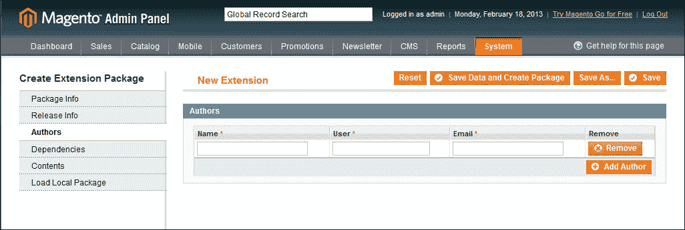
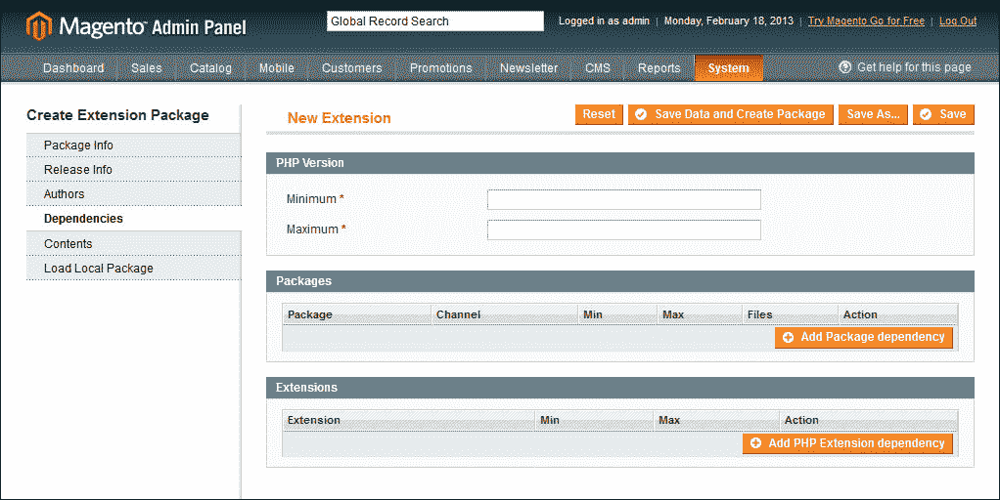
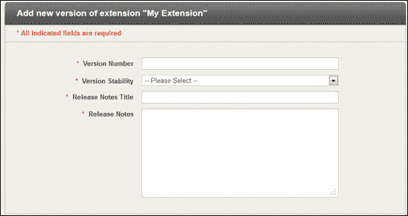

# 第八章：部署和分发

欢迎来到本书的最后一章；我们已经走了很远，并且在这个过程中学到了很多。到目前为止，您应该清楚地了解了为 Magento 工作和开发自定义扩展所涉及的一切。

嗯，几乎一切，就像其他 Magento 开发人员一样，您的代码最终需要被推广到生产环境，或者可能需要打包进行分发；在本章中，我们将看到可用于我们的不同技术、工具和策略。

本章的最终目标是为您提供工具和技能，使您能够自信地进行部署，几乎没有停机时间。

# 通往零停机部署的道路

对于开发人员来说，将产品部署到生产环境可能是最令人害怕的任务之一，往往情况不会很好。

但是什么是零停机部署？嗯，就是自信地将代码部署到生产环境，知道代码经过了适当的测试并且准备就绪，这是所有 Magento 开发人员应该追求的理想。

这不是通过单一的流程或工具实现的，而是通过一系列技术、标准和工具的组合。在本章中，我们将学习以下内容：

+   通过 Magento Connect 分发我们的扩展

+   版本控制系统在部署中的作用

+   分支和合并更改的正确实践

## 从头开始做对

在上一章中，我们学到了测试不仅可以增强我们的工作流程，还可以避免未来的麻烦。单元测试、集成测试和自动化工具都可以确保我们的代码经过了适当的测试。

编写测试意味着不仅仅是组织一些测试并称之为完成；我们负责考虑可能影响我们代码的所有可能边缘情况，并为每种情况编写测试。

## 确保所见即所得

在本书的第一章中，我们立即开始设置我们的开发环境，这是一项非常重要的任务。为了确保我们交付的代码是质量和经过测试的，我们必须能够在尽可能接近生产环境的环境中开发和测试我们的代码。

我将通过 Magento 早期的一个例子来说明这个环境的重要性。我听说这种情况发生了好几次；开发人员在他们的本地环境中从头开始创建新的扩展，完成开发并在本地暂存环境中进行测试，一切似乎都正常工作。

常见的工作流程之一是：

+   在开发人员的本地机器上开始开发，该机器运行着一个接近生产环境的虚拟机

+   在尽可能接近生产环境的暂存环境上测试和批准更改

+   最后，将更改部署到生产环境

现在是时候将他们的代码推广到生产环境了，他们充满信心地这样做了；当然，在本地是可以工作的，因此它也必须在生产环境中工作，对吧？在这些特定情况下，情况并非如此；相反的是，新代码加载到生产环境后，商店崩溃了，说自动加载程序无法找到该类。

发生了什么？嗯，问题在于开发人员的本地环境是 Windows，扩展文件夹的名称是 CamelCase，例如`MyExtension`，但在类名内部他们使用的是大写文本（`Myextension`）。

现在在 Windows 上这将正常工作，因为文件不区分大写、首字母大写或小写的文件夹名称；而大多数 Web 服务器一样的基于 Unix 的系统会区分文件夹和文件的命名。

尽管这个例子看起来可能很愚蠢，但它很好地说明了标准化开发环境的必要性；Magento 安装中有很多部分和“移动的部件”。PHP 的不同版本或者在生产环境中启用的额外 Apache 模块，但在暂存环境中没有启用，可能会产生天壤之别。

### 注意

在[`www.magedevguide.com/naming-conventions`](http://www.magedevguide.com/naming-conventions)了解更多关于 Magento 命名约定的信息。

## 准备好意味着准备好

但是当我们说我们的代码实际上已经准备好投入生产时，准备好到底意味着什么呢？每个开发者可能对准备好和完成实际上意味着什么有不同的定义。在开发新模块或扩展 Magento 时，我们应该始终定义这个特定功能/代码的准备好意味着什么。

所以我们现在有所进展，我们知道为了将代码传递到生产环境，我们必须做以下事情：

1.  测试我们的代码，并确保我们已经涵盖了所有边缘情况。

1.  确保代码符合标准和指南。

1.  确保它已经在尽可能接近生产环境的环境中进行了测试和开发。

# 版本控制系统和部署

**版本控制系统**（**VCSs**）是任何开发者的命脉，尽管 Git 和 SVN 的支持者之间可能存在一些分歧（没有提到 Mercurial 的人），但基本功能仍然是一样的。

让我们快速了解一下每种版本控制系统之间的区别，以及它们的优势和劣势。

## SVN

这是一个强大的系统，已经存在了相当长的时间，非常有名并且被广泛使用。

**Subversion**（**SVN**）是一个集中式的版本控制系统；这意味着有一个被认为是“好”的单一主要源，所有开发者都从这个中央源检出和推送更改。

尽管这使得更改更容易跟踪和维护，但它也有一个严重的缺点。分散也意味着我们必须与中央仓库保持不断的通信，因此无法远程工作或在没有互联网连接的情况下工作。

## Git

Git 是一个更年轻的版本控制系统，由于被开源社区广泛采用和 Github 的流行（[www.github.com](http://www.github.com)），它已经流行了几年。

SVN 和 Git 之间的一个关键区别是，Git 是一个分散式版本控制系统，这意味着没有中央管理机构或主仓库；每个开发者都有完整的仓库副本可供本地使用。

Git 是分散式的，这使得 Git 比其他版本控制系统更快，并且具有更好和更强大的分支系统；此外，可以远程工作或在没有互联网连接的情况下工作。

无论我们选择哪种版本控制系统，任何版本控制系统最强大（有时被忽视）的功能都是分支或创建分支的能力。

分支允许我们进行实验和开发新功能，而不会破坏我们主干或主代码中的稳定代码；创建分支需要我们对当前主干/主代码进行快照，然后进行任何更改和测试。

现在，分支只是方程式的一部分；一旦我们对我们的代码更改感到满意，并且已经正确测试了每个边缘情况，我们需要一种重新整合这些更改到我们主要代码库的方法。合并通过运行几个命令，使我们能够重新整合所有我们的分支修改。

通过将分支集成和合并更改到我们的工作流程中，我们获得了灵活性和自由，可以在不干扰实验性或正在进行中的代码的情况下，处理不同的更改、功能和错误修复。

此外，正如我们将在下一节中学到的，版本控制可以帮助我们进行无缝的推广，并轻松地在多个 Magento 安装中保持我们的代码最新。

# 分发

您可能希望自由分发您的扩展或将其商业化，但是如何能够保证每次正确安装代码而无需自己操作呢？更新呢？并非所有商店所有者都精通技术或能够自行更改文件。

幸运的是，Magento 自带了自己的包管理器和扩展市场，称为 Magento Connect。

Magento Connect 允许开发人员和解决方案合作伙伴与社区分享其开源和商业贡献，并不仅限于自定义模块；我们可以在 Magento Connect 市场中找到以下类型的资源：

+   模块

+   语言包

+   自定义主题

## 打包我们的扩展

Magento Connect 的核心功能之一是允许我们直接从 Magento 后端打包我们的扩展。

要打包我们的扩展，请执行以下步骤：

1.  登录 Magento 后端。

1.  从后端，选择**系统** | **Magento Connect** | **打包扩展**。

正如我们所看到的，**创建扩展** **包**部分由六个不同的子部分组成，我们将在下面介绍。

### 包信息

**包信息**用于指定一般扩展信息，例如名称、描述和支持的 Magento 版本，如下所示：

+   **名称**：标准做法是保持名称简单，只使用单词

+   **渠道**：这指的是扩展的代码池；正如我们在前几章中提到的，为了分发设计的扩展应该使用“社区”渠道

+   **支持的版本**：选择我们的扩展应该支持的 Magento 版本

+   **摘要**：此字段包含扩展的简要描述，用于扩展审核过程

+   **描述**：这里有扩展和其功能的详细描述

+   **许可证**：这是用于此扩展的许可证；一些可用的选项是：

+   **开放软件许可证**（**OSL**）

+   **Mozilla 公共许可证**（**MPL**）

+   **麻省理工学院许可证**（**MITL**）

+   **GNU 通用公共许可证**（**GPL**）

+   如果您的扩展要进行商业分发，则使用任何其他许可证

+   **许可证 URI**：这是许可证文本的链接

### 注意

有关不同许可类型的更多信息，请访问[`www.magedevguide.com/license-types`](http://www.magedevguide.com/license-types)。

### 发布信息

以下截图显示了**发布信息**屏幕：

**发布信息**部分包含有关当前软件包发布的重要数据：

+   **发布版本**：初始发布可以是任意数字，但是，重要的是每次发布都要递增版本号。Magento Connect 不会允许您两次更新相同的版本。

+   **发布稳定性**：有三个选项 - **稳定**，**Beta**和**Alpha**。

+   **注释**：在这里，我们可以输入所有特定于发布的注释，如果有的话。

### 作者

以下截图显示了**作者**屏幕：

在此部分，指定了有关作者的信息；每个作者的信息都有以下字段：

+   **名称**：作者的全名

+   **用户**：Magento 用户名

+   **电子邮件**：联系电子邮件地址

### 依赖项

以下截图显示了**依赖项**屏幕：

在打包 Magento 扩展时使用了三种类型的依赖关系：

+   **PHP 版本**：在这里，我们需要在**最小**和**最大**字段中指定此扩展支持的 PHP 的最小和最大版本

+   **软件包**：这用于指定此扩展所需的任何其他软件包

+   **扩展**：在这里，我们可以指定我们的扩展是否需要特定的 PHP 扩展才能工作

如果软件包依赖关系未满足，Magento Connect 将允许我们安装所需的扩展；对于 PHP 扩展，Magento Connect 将抛出错误并停止安装。

### 内容

以下截图显示了**内容**屏幕：

**内容**部分允许我们指定构成扩展包的每个文件和文件夹。

### 注意

这是扩展打包过程中最重要的部分，也是最容易出错的部分。

每个内容条目都有以下字段：

+   **目标**：这是目标基本目录，用于指定搜索文件的基本路径。以下选项可用：

+   **Magento 核心团队模块文件 - ./app/code/core**

+   **Magento 本地模块文件 - ./app/code/local**

+   **Magento 社区模块文件 - ./app/code/community**

+   **Magento 全局配置 - ./app/etc**

+   **Magento 区域语言文件 - ./app/locale**

+   **Magento 用户界面（布局、模板）- ./app/design**

+   **Magento 库文件 - ./lib**

+   **Magento 媒体库 - ./media**

+   **Magento 主题皮肤（图像、CSS、JS）- ./skin**

+   **Magento 其他可访问的 Web 文件 - ./**

+   **Magento PHPUnit 测试 - ./tests**

+   **Magento 其他 - ./**

+   **路径**：这是相对于我们指定目标的文件名和/或路径

+   **类型**：对于此字段，我们有两个选项 - **文件**或**递归目录**

+   **包括**：此字段采用正则表达式，允许我们指定要包括的文件

+   **忽略**：此字段采用正则表达式，允许我们指定要排除的文件

### 加载本地包

以下屏幕截图显示了**加载本地包**的屏幕：

此部分将允许我们加载打包的扩展；由于我们尚未打包任何扩展，因此列表目前为空。

让我们继续打包我们的礼品注册扩展。确保填写所有字段，然后单击**保存数据并创建包**；这将在`magento_root/var/connect/`文件夹中打包和保存扩展。

扩展包文件包含所有源文件和所需的源代码；此外，每个包都会创建一个名为`package.xml`的新文件。此文件包含有关扩展的所有信息以及文件和文件夹的详细结构。

# 发布我们的扩展

最后，为了使我们的扩展可用，我们必须在 Magento Connect 中创建一个扩展配置文件。要创建扩展配置文件，请执行以下步骤：

1.  登录[magentocommerce.com](http://magentocommerce.com)。

1.  单击**我的帐户**链接。

1.  单击左侧导航中的**开发人员**链接。

1.  单击**添加新扩展**。

**添加新扩展**窗口看起来像以下屏幕截图：

重要的是要注意，**扩展标题**字段必须是您在生成包时使用的确切名称。

创建扩展配置文件后，我们可以继续上传我们的扩展包；所有字段应与扩展打包过程中指定的字段匹配。

最后，一旦完成，我们可以单击**提交审批**按钮。扩展可以具有以下状态：

+   **已提交**：这意味着扩展已提交审核

+   **未获批准**：这意味着扩展存在问题，并且您还将收到一封解释为什么扩展未获批准的电子邮件

+   **在线**：这意味着扩展已获批准，并可通过 Magento Connect 获得

+   **离线**：这意味着您可以随时从您的帐户**扩展管理器**中将扩展下线

# 摘要

在本章中，我们学习了如何部署和共享我们的自定义扩展。我们可以使用许多不同的方法来共享和部署我们的代码到生产环境。

这是我们书的最后一章；我们已经学到了很多关于 Magento 开发的知识，虽然我们已经涵盖了很多内容，但这本书只是您漫长旅程的一个起点。

Magento 不是一个容易学习的框架，虽然可能是一次令人生畏的经历，但我鼓励您继续尝试和学习。
