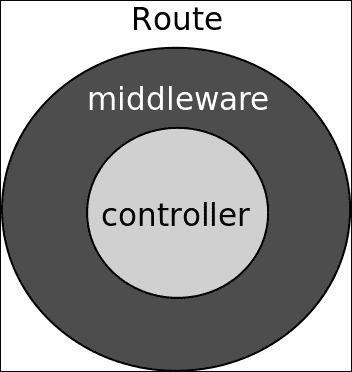

# 第七章：使用中间件过滤请求

在本章中，将详细讨论中间件，并提供来自住宿软件的示例。中间件是帮助将软件应用程序分隔成不同层的重要机制。为了说明这一原则，中间件在应用程序的最内部提供了保护层，可以将其视为内核。

在 Laravel 4 中，中间件被称为过滤器。这些过滤器用于路由中执行在控制器之前的操作，如身份验证，用户将根据特定标准进行过滤。此外，过滤器也可以在控制器之后执行。

在 Laravel 5 中，中间件的概念已经存在，但在 Laravel 4 中并不突出，现在已经被引入到实际请求工作流中，并可以以各种方式使用。可以将其视为俄罗斯套娃，其中每个套娃代表应用程序中的一层 - 拥有正确凭据将允许我们深入应用程序。

# HTTP 内核

位于`app/Http/Kernel.php`的文件是管理程序内核配置的文件。基本结构如下：

```php
<?php namespace App\Http;

use Illuminate\Foundation\Http\Kernel as HttpKernel;

class Kernel extends HttpKernel {

  /**
   * The application's global HTTP middleware stack.
   *
   * @var array
   */
  protected $middleware = [
  'Illuminate\Foundation\Http\Middleware\CheckForMaintenanceMode',
    'Illuminate\Cookie\Middleware\EncryptCookies',
    'Illuminate\Cookie\Middleware\AddQueuedCookiesToResponse',
    'Illuminate\Session\Middleware\StartSession',
    'Illuminate\View\Middleware\ShareErrorsFromSession',
    'Illuminate\Foundation\Http\Middleware\VerifyCsrfToken',
  ];

  /**
   * The application's route middleware.
   *
   * @var array
   */
  protected $routeMiddleware = [
    'auth' => 'App\Http\Middleware\Authenticate',
    'auth.basic' => 'Illuminate\Auth\Middleware\AuthenticateWithBasicAuth',
    'guest' => 'App\Http\Middleware\RedirectIfAuthenticated',
  ];

}
```

`$middleware`数组是中间件类及其命名空间的列表，并在每个请求时执行。`$routeMiddleware`数组是一个键值数组，作为*别名*列表，可与路由一起使用以过滤请求。

# 基本中间件结构

路由中间件类实现了`Middleware`接口：

```php
<?php namespace Illuminate\Contracts\Routing;

use Closure;

interface Middleware {

  /**
   * Handle an incoming request.
   *
   * @param  \Illuminate\Http\Request  $request
   * @param  \Closure  $next
   * @return mixed
   */
  public function handle($request, Closure $next);

}
```

在实现此基类的任何类中，必须有一个接受`$request`和`Closure`的`handle`方法。

中间件的基本结构如下：

```php
<?php namespace Illuminate\Foundation\Http\Middleware;

use Closure;
use Illuminate\Contracts\Routing\Middleware;
use Illuminate\Contracts\Foundation\Application;
use Symfony\Component\HttpKernel\Exception\HttpException;

class CheckForMaintenanceMode implements Middleware {

  /**
   * The application implementation.
   *
   * @var \Illuminate\Contracts\Foundation\Application
   */
  protected $app;

  /**
   * Create a new filter instance.
   *
   * @param  \Illuminate\Contracts\Foundation\Application  $app
   * @return void
   */
  public function __construct(Application $app)
  {
    $this->app = $app;
  }

  /**
   * Handle an incoming request.
   *
   * @param  \Illuminate\Http\Request  $request
   * @param  \Closure  $next
   * @return mixed
   */
  public function handle($request, Closure $next)
  {
    if ($this->app->isDownForMaintenance())
    {
      throw new HttpException(503);
    }
    return $next($request);
  }
}
```

在这里，`CheckForMaintenanceMode`中间件确实如其名称所示：`handle`方法检查应用程序是否处于应用模式。调用应用程序的`isDownForMaintenance`方法，如果返回`true`，则会返回 503 HTTP 异常并停止方法的执行。否则，将带有`$request`参数的`$next`闭包返回给调用类。

### 提示

诸如`CheckForMaintenanceMode`之类的中间件可以从`$middleware`数组中移除，并移入`$routeMiddleware`数组中，以便不需要在每个请求时执行，而只在从特定路由所需时执行。

# 路由中间件揭秘

在 Laravel 5 中存在两个基于路由的中间件类，位于`app/Http/Middleware/`中。其中一个类名为`Authenticate`。它提供基本身份验证并使用合同。

关于路由，中间件位于路由和控制器之间：



## 默认中间件 - Authenticate 类

一个名为`Authenticate.php`的类有以下代码：

```php
<?php namespace MyCompany\Http\Middleware;

use Closure;
use Illuminate\Contracts\Auth\Guard;

class Authenticate {
  /**
   * The Guard implementation.
   *
   * @var Guard
   */
  protected $auth;

  /**
   * Create a new filter instance.
   *
   * @param  Guard  $auth
   * @return void
   */
  public function __construct(Guard $auth)
  {
    $this->auth = $auth;
  }

  /**
   * Handle an incoming request.
   *
   * @param  \Illuminate\Http\Request  $request
   * @param  \Closure  $next
   * @return mixed
   */
  public function handle($request, Closure $next)
  {
    if ($this->auth->guest())
    {
      if ($request->ajax())
      {
        return response('Unauthorized.', 401);
      }
      else
      {
        return redirect()->guest('auth/login');
      }
    }
    return $next($request);
  }
}
```

首先要注意的是`Illuminate\Contracts\Auth\Guard`，它处理检查用户是否已登录的逻辑。它被注入到构造函数中。

## 合同

请注意，合同的概念是使用接口提供非具体类以将实际类与调用类分离的新方法。这提供了一个良好的分离层，并允许在需要时轻松切换底层类，同时保持方法的参数和返回类型。

## 处理

`handle`类是真正工作的地方。`$request`对象与`$next`闭包一起传入。接下来发生的事情非常简单但重要。代码询问当前用户是否是访客，即未经身份验证或登录。如果用户未登录，则该方法将不允许用户访问下一步。如果请求是通过 Ajax 到达的，则会向浏览器返回 401 消息。

如果请求不是通过 Ajax 请求到达的，代码会假定请求是通过标准页面请求到达的，并且用户被重定向到 auth/login 页面，允许用户登录应用程序。否则，如果用户已经认证（`guest()`不等于`true`），则将`$next`闭包与`$request`对象作为参数返回给软件应用程序。总之，只有在用户未经认证时才会停止应用程序的执行；否则，执行将继续。

要记住的重要一点是，在这种情况下，`$request`对象被返回给软件。

## 自定义中间件 - 记录

使用 Artisan 创建自定义中间件很简单。`artisan`命令如下：

```php
**$ php artisan make:middleware LogMiddleware**

```

我们的`LogMiddleware`类需要添加到`Http/Kernel.php`文件中的`$middleware`数组中，如下所示：

```php
protected $middleware = [
  'Illuminate\Foundation\Http\Middleware\CheckForMaintenanceMode',
  'Illuminate\Cookie\Middleware\EncryptCookies',
  'Illuminate\Cookie\Middleware\AddQueuedCookiesToResponse',
  'Illuminate\Session\Middleware\StartSession',
  'Illuminate\View\Middleware\ShareErrorsFromSession',
  'MyCompany\Http\Middleware\LogMiddleware'
];
```

`LogMiddleware`类是给中间件类的名称，用于记录使用网站的用户。该类只有一个方法，即`handle`。与认证中间件一样，它接受`$request`对象以及`$next`闭包：

```php
<?php namespace MyCompany\Http\Middleware;

use Closure;

class LogMiddleware {

  /**
   * Handle an incoming request.
   *
   * @param  \Illuminate\Http\Request  $request
   * @param  \Closure  $next
   * @return mixed
   */
  public function handle($request, Closure $next)
  {
    return $next($request);
  }
}
```

在这种情况下，我们只想简单地记录用户 ID 以及执行某个操作的日期和时间。将`$request`对象分配给`$response`对象，然后返回`$response`对象而不是`$next`。代码如下：

```php
public function handle($request, Closure $next)
{
  $response = $next($request);
  Log::create(['user_id'=>\Auth::user()->id,'created_at'=>date("Y- 
  m-d H:i:s")]);
  return $response;
}

```

### 记录模型

使用以下命令创建`Log`模型：

```php
**$php artisan make:model Log**

```

使用受保护的`$table`属性将`Log`模型设置为使用名为`log`而不是`logs`的表。接下来，通过将公共`$timestamps`属性设置为`false`，设置模型不使用时间戳。最后，通过将受保护的`$fillable`属性设置为要填充的字段数组，允许使用`create`函数同时填充`user_id`和`created_at`字段。在进行上述修改后，该类将如下所示：

```php
<?php namespace MyCompany;

use Illuminate\Database\Eloquent\Model;

class Log extends Model {
    protected $table = 'log';
    public $timestamps = false;
    protected $fillable = ['user_id','created_at'];
}
```

我们还可以将`Log`模型创建为多态模型，使其可以在多个上下文中使用，通过将以下代码添加到`Log`模型中：

```php
public function loggable()
{
     return $this->morphTo();
}
```

### 提示

有关此更多信息，请参阅 Laravel 文档。

### 记录模型迁移

需要调整`database/migrations/[date_time]_create_logs_table.php`迁移，以使用`log`表而不是`logs`。还需要创建两个字段：`user_id`，一个无符号的小整数，以及`created_at`，一个将模仿 Laravel 时间戳格式的`datetime`字段。代码如下：

```php
<?php

use Illuminate\Database\Schema\Blueprint;
use Illuminate\Database\Migrations\Migration;

class CreateLogsTable extends Migration {

  /**
   * Run the migrations.
   *
   * @return void
   */
  public function up()
  {
    Schema::create('log', function(Blueprint $table)
    {
      $table->smallInteger('user_id')->unsigned();
      $table->dateTime('created_at');
    });
  }

  /**
   * Reverse the migrations.
   *
   * @return void
   */
  public function down()
  {
    Schema::drop('log');
  }
}
```

## 可终止中间件

除了在请求到达或响应到达后执行操作之外，甚至可以在响应发送到浏览器后执行操作。该类添加了`terminate`方法并实现了`TerminableMiddleware`：

```php
use Illuminate\Contracts\Routing\TerminableMiddleware;

class StartSession implements TerminableMiddleware {

    public function handle($request, $next)
    {
        return $next($request);
    }

    public function terminate($request, $response)
    {
        // Store the session data...
    }
}
```

### 作为可终止的记录

我们可以在`terminate`函数中轻松地执行用户记录，因为记录可能是生命周期中的最后一个动作。代码如下：

```php
<?php namespace MyCompany\Http\Middleware;

use Closure;
use Illuminate\Contracts\Routing\TerminableMiddleware;
use MyCompany\Log;

class LogMiddleware implements TerminableMiddleware {
  /**
   * Handle an incoming request.
   *
   * @param  \Illuminate\Http\Request  $request
   * @param  \Closure  $next
   * @return mixed
   */
  public function handle($request, Closure $next)
  {
    return  $next($request);

  }
  /**
   * Terminate the request.
   *
   * @param  \Illuminate\Http\Request  $request
   * @param  \Illuminate\Http\Response $response
   */
  public function terminate($request, $response)
  {
    Log::create(['user_id'=>\Auth::user()- >id,'created_at'=>date("Y-m-d H:i:s")]);

  }
}
```

代码已放置到`terminate`方法中，因此它位于请求-响应路径之外，使得代码保持清晰。

# 使用中间件

如果我们希望用户在执行某个操作之前必须经过身份验证，我们可以将数组作为第二个参数传递，`middleware`作为键强制路由在`AccommodationsController`的`search`方法上调用`auth`中间件：

```php
Route::get('search-accommodation',
  ['middleware' => 'auth','AccommodationsController@search']);
```

在这种情况下，如果用户未经认证，将被重定向到登录页面。

## 路由组

路由可以分组以共享相同的中间件。例如，如果我们想保护应用程序中的所有路由，我们可以创建一个路由组，并只传入键值对`middleware`和`auth`。代码如下：

```php
Route::group(['middleware' => 'auth'], function()
{
  Route::resource('accommodations', 'AccommodationsController');
  Route::resource('accommodations.amenities', 'AccommodationsAmenitiesController');
  Route::resource('accommodations.rooms', 'AccommodationsRoomsController');
  Route::resource('accommodations.locations', 'AccommodationsLocationsController');
  Route::resource('amenities', 'AmenitiesController');
  Route::resource('rooms', 'RoomsController');
  Route::resource('locations', 'LocationsController');
})
```

这将保护路由组内的每个路由的每个方法。

## 路由组中的多个中间件

如果希望进一步保护非经过身份验证的用户，可以创建一个白名单，只允许特定范围的 IP 地址访问应用程序。

以下命令将创建所需的中间件：

```php
$ php artisan make:middleware WhitelistMiddleware
```

`WhitelistMiddleware`类如下所示：

```php
<?php namespace MyCompany\Http\Middleware;

use Closure;

class WhitelistMiddleware {
    private $whitelist = ['192.2.3.211'];
  /**
   * Handle an incoming request.
   *
   * @param  \Illuminate\Http\Request  $request
   * @param  \Closure  $next
   * @return mixed
   */
  public function handle($request, Closure $next)
  {
    if (in_array($request->getClientIp(),$this->whitelist)) {
      return $next($request);
    } else {
      return response('Unauthorized.', 401);
    }

  }
}
```

在这里，创建了一个私有的`$whitelist`数组，其中包含设置在公司内的 IP 地址列表。 然后，将请求的远程端口与数组中的值进行比较，并通过返回`$next`闭包来允许其继续。 否则，将返回未经授权的响应。

现在，需要将`whitelist`中间件与`auth`中间件结合使用。 要在路由组内使用`whitelist`中间件，需要为中间件创建别名，并将其插入到`app/Http/Kernel.php`文件的`$routeMiddleware`数组中。 代码如下：

```php
protected $routeMiddleware = [
  'auth' => 'MyCompany\Http\Middleware\Authenticate',
  'auth.basic' => 'Illuminate\Auth\Middleware\AuthenticateWithBasicAuth',
  'guest' => 'MyCompany\Http\Middleware\RedirectIfAuthenticated',
  'log' => 'MyCompany\Http\Middleware\LogMiddleware',
  'whitelist' => 'MyCompany\Http\Middleware\WhitelistMiddleware'
];
```

接下来，要将其添加到此路由组的中间件列表中，需要用数组替换字符串`auth`，其中包含`auth`和`whitelist`。 代码如下：

```php
Route::group(['middleware' => ['auth','whitelist']], function()
{
  Route::resource('accommodations', 'AccommodationsController');
  Route::resource('accommodations.amenities',
            'AccommodationsAmenitiesController');
  Route::resource('accommodations.rooms', 'AccommodationsRoomsController');
  Route::resource('accommodations.locations', 'AccommodationsLocationsController');
  Route::resource('amenities', 'AmenitiesController');
  Route::resource('rooms', 'RoomsController');
  Route::resource('locations', 'LocationsController');
});
```

现在，即使用户已登录，也将无法访问受保护的内容，除非 IP 地址在白名单中。

此外，如果只想要对某些路由进行白名单操作，可以嵌套路由组如下：

```php
Route::group(['middleware' => 'auth', function()
{
  Route::resource('accommodations', 'AccommodationsController');
  Route::resource('accommodations.amenities',
            'AccommodationsAmenitiesController');
  Route::resource('accommodations.rooms', 'AccommodationsRoomsController');
  Route::resource('accommodations.locations', 'AccommodationsLocationsController');
  Route::resource('amenities', 'AmenitiesController');
  Route::group(['middleware' => 'whitelist'], function()
  {
    Route::resource('rooms', 'RoomsController');
  });
  Route::resource('locations', 'LocationsController');
});
```

这将要求对`RoomsController`进行身份验证（`auth`）和白名单操作，而路由组内的所有其他控制器将仅需要身份验证。

# 中间件排除和包含

如果希望仅对某些路由执行身份验证或白名单操作，则应向控制器添加构造方法，并且可以使用类的`middleware`方法如下所示：

```php
<?php namespace MyCompany\Http\Controllers;

use MyCompany\Http\Requests;
use MyCompany\Http\Controllers\Controller;
use Illuminate\Http\Request;
use MyCompany\Accommodation\Room;

class RoomsController extends Controller {

  public function __construct()
  {
    $this->middleware('auth',['except' => ['index','show']);
  }
```

第一个参数是`Kernel.php`文件中`$routeMiddleware`数组的键。 第二个参数是键值数组。 选项要么是`except`，要么是`only`。 `except`选项显然是排除，而`only`选项是包含。 在上面的示例中，`auth`中间件将应用于除`index`或`show`方法之外的所有方法，这两个方法是两种读取方法（它们不修改数据）。 相反，如果`log`中间件应用于`index`和`show`，则将使用以下构造方法：

```php
  public function __construct()
  {
    $this->middleware('log',['only' => ['index','show']);
  }
```

如预期的那样，两种方法都如下所示，并且还添加了`whitelist`中间件：

```php
public function __construct()
{
  $this->middleware('whitelist',['except' => ['index','show']);
  $this->middleware('auth',['except' => ['index','show']);
  $this->middleware('log',['only' => ['index','show']);
}
```

此代码将要求对所有非读取操作进行身份验证和白名单 IP 地址，同时记录对`index`和`show`的任何请求。

# 结论

中间件可以巧妙地过滤请求并保护应用程序或 RESTful API 免受不必要的请求。 它还可以执行日志记录并重定向任何符合特定条件的请求。

中间件还可以为现有应用程序提供附加功能。 例如，Laravel 提供了`EncryptCookies`和`AddQueuedCookiesToResponse`中间件来处理 cookies，而`StartSession`和`ShareErrorsFromSession`处理会话。

`AddQueuedCookiesToResponse`中的代码不会过滤请求，而是向其添加内容：

```php
public function handle($request, Closure $next)
  {
    $response = $next($request);
    foreach ($this->cookies->getQueuedCookies() as $cookie)
    {
      $response->headers->setCookie($cookie);
    }
    return $response;
  }
```

# 总结

在本章中，我们看了中间件，这是一个对每个请求执行的任何功能或附加到某些路由的有用机制。 这是一种灵活的机制，并允许程序员*编码到接口*，因为任何实现`Middleware`接口的中间件类都必须包括`handle`方法。 通过这种结构不仅鼓励，而且要求遵循良好的开发原则。

在下一章中，我们将讨论 Eloquent ORM。
