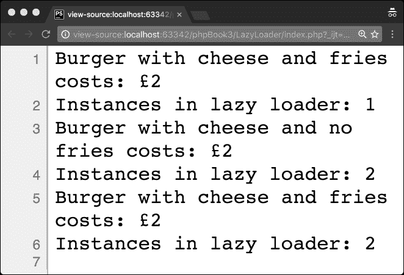
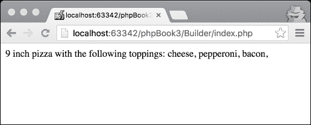
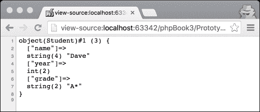
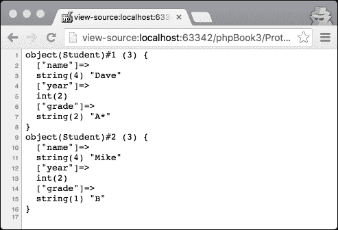
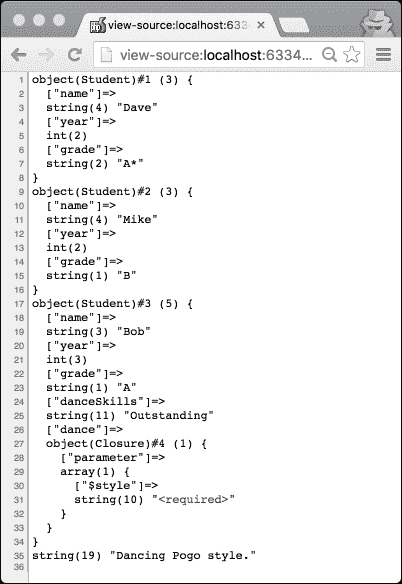

# 第三章：创建性设计模式

创建性设计模式是与四人帮经常相关的三种设计模式之一；它们是涉及对象创建机制的设计模式。

在没有控制这个过程的情况下实例化对象或基本类的创建，可能会导致设计问题，或者只是给过程增加额外的复杂性。

在这一章中，我们将涵盖以下主题：

+   软件设计过程

+   简单工厂

+   工厂方法

+   抽象工厂模式

+   延迟初始化

+   建造者模式

+   原型模式

在我们学习创建性设计模式之前，让我们稍微谈谈架构过程。

# 软件设计过程

*软件工程知识体系*是由*IEEE*出版的一本书，通常被称为**SWEBoK**，它总结了整个软件工程领域的通常被接受的知识体系。

在这本书中，软件设计的定义如下：

> “定义系统或组件的架构、组件、接口和其他特征的过程”和“[该]过程的结果”。

具体来说，软件设计可以分为两个层次的层次结构：

+   架构设计，描述软件如何分割成其组成部分

+   详细设计，描述每个组件的具体细节，以描述其组件。

组件是软件解决方案的一部分，具有接口，这些接口作为*所需接口*（软件需要的功能）和*提供的接口*（软件提供给其他组件的功能）。

这两个设计过程（架构设计和详细设计）应该产生一组记录主要决策的模型和工件，并解释为什么做出了非平凡决策。将来，开发人员可以很容易地参考这些文档，以了解架构决策背后的原理，通过确保决策经过深思熟虑，并将思考过程传递下去，使代码更易于维护。

这两个过程中的第一个，架构设计，可以对整个团队来说是相当有创意和吸引力的。这个过程的结果，无论你选择如何做，都应该是一个通过接口相互连接组件的组件图。

这个过程通常可以更倾向于一般开发人员的团队，而不是虎队。 *虎队*通常是在特定产品知识领域的专家小组，他们在一个时间限定的环境中聚集在一起，以解决特定问题，由架构师主持。通常，特别是涉及到遗留系统时，这样的设计工作可能需要广泛的知识来提取必要的架构约束。

有了这个说法，为了防止过程变成委员会设计或群体规则，你可能想要遵循一些基本规则：让架构师主持会议，并从组件级别图开始工作，不要深入到更深层次。在会议之前制作一个组件图通常会有所帮助，并在会议中根据需要进行编辑，这有助于确保团队保持在纠正图表的轨道上，而不深入到具体的操作。

在我曾经参与的一个环境中，有一个非常详细的工程师担任工程团队的负责人；他坚持立即深入组件的细节进行架构，这会迅速使流程瓦解和无组织；他会即兴开始*会议中的会议*。在这些架构会议上构建组件图在保持会议秩序和确保操作事项和详细设计事项都不会过早涉及方面起到了至关重要的作用。如何和在哪里托管某些东西的操作事项通常不在软件工程的权限范围内，除非它直接影响软件的创建方式。

下一步是详细设计；这解释了组件如何构建。在这一点上可以决定使用的构造中的设计模式、类图和必要的外部资源。无论设计有多好，都将在构建级别进行一些详细设计工作，软件开发人员将需要对设计进行微小的更改，以添加更多细节或弥补架构过程中的一些疏忽。在此设计之前的过程必须简单地指定组件的足够细节，以便促进其构建，并允许开发人员不必过多考虑架构细节。开发人员应该从与代码密切相关的构件（例如详细设计）中开发代码，而不是从高级需求、设计或计划中编写代码。

顺便说一句，让我们记住，单元测试可以成为设计的一部分（例如，在使用测试驱动开发时），每个单元测试都指定一个设计元素（类、方法和特定行为）。虽然将代码逆向工程到设计构件中并不现实（尽管有人会声称是），但可以将*架构表示为代码*；单元测试就是实现这一目标的一种方式。

正如本书前面提到的，设计模式在软件设计中起着至关重要的作用；它们允许设计更复杂的软件部分，而无需重新发明轮子。

好了，现在是创建型设计模式。

# 简单工厂

什么是工厂？让我们想象一下，您订购了一辆新车；经销商将您的订单发送到工厂，工厂建造您的汽车。您的汽车以组装好的形式发送给您，您不需要关心它是如何制造的。

同样，软件工厂为您生产对象。工厂接受您的请求，使用构造函数组装对象并将它们交还给您使用。其中一种工厂模式称为**简单工厂**。让我向您展示它是如何工作的。

首先，我们定义一个抽象类，我们希望用其他类扩展：

```php
<?php 

abstract class Notifier 
{ 
  protected $to; 

  public function __construct(string $to) 
  { 
    $this->to = $to; 
  } 

  abstract public function validateTo(): bool; 

  abstract public function sendNotification(): string; 

} 

```

这个类用于允许我们拥有共同的方法，并定义我们希望在工厂中构建的所有类中具有的任何共同功能。我们还可以使用接口而不是抽象类来实现，而不定义任何功能。

使用这个接口，我们可以构建两个通知器，`SMS`和`Email`。

`SMS`通知器在`SMS.php`文件中如下：

```php
<?php 

class SMS extends Notifier 
{ 
  public function validateTo(): bool 
  { 
    $pattern = '/^(\+44\s?7\d{3}|\(?07\d{3}\)?)\s?\d{3}\s?\d{3}$/'; 
    $isPhone = preg_match($pattern, $this->to); 

    return $isPhone ? true : false; 

  } 

  public function sendNotification(): string 
  { 

    if ($this->validateTo() === false) { 
      throw new Exception("Invalid phone number."); 
    } 

    $notificationType = get_class($this); 
    return "This is a " . $notificationType . " to " . $this->to . "."; 
  } 
} 

```

同样，让我们在`Email.php`文件中放出`Email`通知器：

```php
<?php 

class Email extends Notifier 
{ 

  private $from; 

  public function __construct($to, $from) 
  { 
    parent::__construct($to); 

    if (isset($from)) { 
      $this->from = $from; 
    } else { 
      $this->from = "Anonymous"; 
    } 
  } 

  public function validateTo(): bool 
  { 
    $isEmail = filter_var($this->to, FILTER_VALIDATE_EMAIL); 

    return $isEmail ? true : false; 

  } 

  public function sendNotification(): string 
  { 
    if ($this->validateTo() === false) { 
      throw new Exception("Invalid email address."); 
    } 

    $notificationType = get_class($this); 
    return "This is a " . $notificationType . " to " . $this->to . " from " . $this->from . "."; 
  } 
} 

```

我们可以按以下方式构建我们的工厂：

```php
<?php 

class NotifierFactory 
{ 
  public static function getNotifier($notifier, $to) 
  { 

    if (empty($notifier)) { 
      throw new Exception("No notifier passed."); 
    } 

    switch ($notifier) { 
      case 'SMS': 
        return new SMS($to); 
        break; 
      case 'Email': 
        return new Email($to, 'Junade'); 
        break; 
      default: 
        throw new Exception("Notifier invalid."); 
        break; 
    } 
  } 
} 

```

虽然我们通常会使用 Composer 进行自动加载，但为了演示这种方法有多简单，我将手动包含依赖项；因此，不多说了，这是我们的演示：

```php
<?php 

require_once('Notifier.php'); 
require_once('NotifierFactory.php'); 

require_once('SMS.php'); 
$mobile = NotifierFactory::getNotifier("SMS", "07111111111"); 
echo $mobile->sendNotification(); 

require_once('Email.php'); 
$email = NotifierFactory::getNotifier("Email", "test@example.com"); 
echo $email->sendNotification(); 

```

我们应该得到这样的输出：


# 工厂方法

工厂方法与普通简单工厂的不同之处在于，我们可以拥有多个工厂。

那么为什么要这样做呢？嗯，为了理解这一点，我们必须看看开闭原则（OCP）。Bertrand Meyer 通常被认为是在他的书《面向对象的软件构造》中首次提出了“开闭原则”这个术语。Meyer 说过以下话：

> “软件实体（类、模块、函数等）应该对扩展开放，但对修改关闭”

软件实体需要扩展时，应该可以在不修改其源代码的情况下进行。那些熟悉面向对象软件的**SOLID**（单一职责、开闭原则、里氏替换、接口隔离和依赖倒置）原则的人可能已经听说过这个原则。

工厂方法允许您将某些类组合在一起，并通过一个单独的工厂来处理它们。如果要添加另一组，只需添加另一个工厂即可。

那么，现在我们该怎么做呢？嗯，基本上我们要为每个工厂创建一个接口（或者抽象方法）；然后我们将该接口实现到我们想要构建的任何其他工厂中。

让我们克隆我们的简单工厂演示；我们要做的是让我们的`NotifierFactory`成为一个接口。然后我们可以重建工厂，为电子通知（电子邮件或短信）建立一个工厂，然后我们可以实现我们的接口来创建，比如说，一个邮政快递通知器工厂。

让我们从在`NotifierFactory.php`文件中创建接口开始：

```php
<?php 

interface NotifierFactory 
{ 
  public static function getNotifier($notifier, $to); 
} 

```

现在让我们构建我们的`ElectronicNotifierFactory`，它实现了我们的`NotifierFactory`接口：

```php
<?php 

class ElectronicNotifierFactory implements NotifierFactory 
{ 
  public static function getNotifier($notifier, $to) 
  { 

    if (empty($notifier)) { 
      throw new Exception("No notifier passed."); 
    } 

    switch ($notifier) { 
      case 'SMS': 
        return new SMS($to); 
        break; 
      case 'Email': 
        return new Email($to, 'Junade'); 
        break; 
      default: 
        throw new Exception("Notifier invalid."); 
        break; 
    } 
  } 
} 

```

我们现在可以重构我们的`index.php`来使用我们制作的新工厂：

```php
<?php 

require_once('Notifier.php'); 
require_once('NotifierFactory.php'); 
require_once('ElectronicNotifierFactory.php'); 

require_once('SMS.php'); 
$mobile = ElectronicNotifierFactory::getNotifier("SMS", "07111111111"); 
echo $mobile->sendNotification(); 

echo "\n"; 

require_once('Email.php'); 
$email = ElectronicNotifierFactory::getNotifier("Email", "test@example.com"); 
echo $email->sendNotification(); 

```

现在这与以前的输出相同：

```php
This is a SMS to 07111111111\. 
This is a Email to test@example.com from Junade. 

```

然而，现在的好处是，我们现在可以添加新类型的通知器，而无需打开工厂，所以让我们为邮政通信添加一个新的通知器：

```php
<?php 

class Post extends Notifier 
{ 
  public function validateTo(): bool 
  { 
    $address = explode(',', $this->to); 
    if (count($address) !== 2) { 
      return false; 
    } 

    return true; 
  } 

  public function sendNotification(): string 
  { 

    if ($this->validateTo() === false) { 
      throw new Exception("Invalid address."); 
    } 

    $notificationType = get_class($this); 
    return "This is a " . $notificationType . " to " . $this->to . "."; 
  } 
} 

```

然后我们可以引入`CourierNotifierFactory`：

```php
<?php 

class CourierNotifierFactory implements NotifierFactory 
{ 
  public static function getNotifier($notifier, $to) 
  { 

    if (empty($notifier)) { 
      throw new Exception("No notifier passed."); 
    } 

    switch ($notifier) { 
      case 'Post': 
        return new Post($to); 
        break; 
      default: 
        throw new Exception("Notifier invalid."); 
        break; 
    } 
  } 
} 

```

最后，我们现在可以修改我们的`index.php`文件以包含这种新格式：

```php
<?php 

require_once('Notifier.php'); 
require_once('NotifierFactory.php'); 
require_once('ElectronicNotifierFactory.php'); 

require_once('SMS.php'); 
$mobile = ElectronicNotifierFactory::getNotifier("SMS", "07111111111"); 
echo $mobile->sendNotification(); 

echo "\n"; 

require_once('Email.php'); 
$email = ElectronicNotifierFactory::getNotifier("Email", "test@example.com"); 
echo $email->sendNotification(); 

echo "\n"; 

require_once('CourierNotifierFactory.php'); 

require_once('Post.php'); 
$post = CourierNotifierFactory::getNotifier("Post", "10 Downing Street, SW1A 2AA"); 
echo $post->sendNotification(); 

```

`index.php`文件现在产生了这个结果：


在生产中，通常会将通知器放在不同的命名空间中，并将工厂放在不同的命名空间中。

# 抽象工厂模式

首先，如果你在阅读本书之前做了一些背景阅读，你可能已经听说过“具体类”这个词。这是什么意思？简单来说，它是抽象类的相反；它是一个可以实例化为对象的类。

抽象工厂由以下类组成：抽象工厂、具体工厂、抽象产品、具体产品和我们的客户端。

在工厂模式中，我们生成了特定接口的实现（例如，`notifier`是我们的接口，电子邮件、短信和邮件是我们的实现）。使用抽象工厂模式，我们将创建工厂接口的实现，每个工厂都知道如何创建它们的产品。

假设我们有两个玩具工厂，一个在旧金山，一个在伦敦。它们都知道如何为两个地点创建两家公司的产品。

考虑到这一点，我们的`ToyFactory`接口看起来是这样的：

```php
<?php 

interface ToyFactory { 
  function makeMaze(); 
  function makePuzzle(); 
} 

```

现在这样做了，我们可以建立我们的旧金山玩具工厂（`SFToyFactory`）作为我们的具体工厂：

```php
<?php 

class SFToyFactory implements ToyFactory 
{ 
  private $location = "San Francisco"; 

  public function makeMaze() 
  { 
    return new Toys\SFMazeToy(); 
  } 

  public function makePuzzle() 
  { 
    return new Toys\SFPuzzleToy; 
  } 
} 

```

现在我们可以添加我们的英国玩具工厂（`UKToyFactory`）：

```php
<?php 

class UKToyFactory implements ToyFactory 
{ 
  private $location = "United Kingdom"; 

  public function makeMaze() 
  { 
    return new Toys\UKMazeToy; 
  } 

  public function makePuzzle() 
  { 
    return new Toys\UKPuzzleToy; 
  } 
} 

```

正如你注意到的，我们正在在 Toys 命名空间中创建各种玩具，所以现在我们可以为我们的玩具组合起来的抽象方法。让我们从我们的`Toy`类开始。每个玩具最终都会扩展这个类：

```php
<?php 

namespace Toys; 

abstract class Toy 
{ 
  abstract public function getSize(): int; 
  abstract public function getPictureName(): string; 
} 

```

现在，对于我们在开始时在`ToyFactory`接口中声明的两种类型的玩具（迷宫和拼图），我们可以声明它们的抽象方法，从我们的`Maze`类开始：

```php
<?php 

namespace Toys; 

abstract class MazeToy extends Toy 
{ 
  private $type = "Maze"; 
} 

```

现在让我们来做我们的`Puzzle`类：

```php
<?php 

namespace Toys; 

abstract class PuzzleToy extends Toy 
{ 
  private $type = "Puzzle"; 
} 

```

现在是时候为我们的具体类做准备了，让我们从我们的旧金山实现开始。

`SFMazeToy`的代码如下：

```php
<?php 

namespace Toys; 

class SFMazeToy extends MazeToy 
{ 
  private $size; 
  private $pictureName; 

  public function __construct() 
  { 
    $this->size = 9; 
    $this->pictureName = "San Francisco Maze"; 
  } 

  public function getSize(): int 
  { 
    return $this->size; 
  } 

  public function getPictureName(): string 
  { 
    return $this->pictureName; 
  } 
} 

```

这是`SFPuzzleToy`类的代码，这是对`Maze`玩具类的不同实现：

```php
<?php 

namespace Toys; 

class SFPuzzleToy extends PuzzleToy 
{ 
  private $size; 
  private $pictureName; 

  public function __construct() 
  { 
    $rand = rand(1, 3); 

    switch ($rand) { 
      case 1: 
        $this->size = 3; 
        break; 
      case 2: 
        $this->size = 6; 
        break; 
      case 3: 
        $this->size = 9; 
        break; 
    } 

    $this->pictureName = "San Francisco Puzzle"; 
  } 

  public 
  function getSize(): int 
  { 
    return $this->size; 
  } 

  public function getPictureName(): string 
  { 
    return $this->pictureName; 
  } 
} 

```

现在，我们可以用我们的英国工厂实现来完成这一切。

让我们先为迷宫玩具制作一个，`UKMazeToy.php`：

```php
<?php 

namespace Toys; 

class UKMazeToy extends Toy 
{ 
  private $size; 
  private $pictureName; 

  public function __construct() 
  { 
    $this->size = 9; 
    $this->pictureName = "London Maze"; 
  } 

  public function getSize(): int 
  { 
    return $this->size; 
  } 

  public function getPictureName(): string 
  { 
    return $this->pictureName; 
  } 
} 

```

让我们也为拼图玩具制作一个类，`UKPuzzleToy.php`：

```php
<?php 

namespace Toys; 

class UKPuzzleToy extends PuzzleToy 
{ 
  private $size; 
  private $pictureName; 

  public function __construct() 
  { 
    $rand = rand(1, 2); 

    switch ($rand) { 
      case 1: 
        $this->size = 3; 
        break; 
      case 2: 
        $this->size = 9; 
        break; 
    } 

    $this->pictureName = "London Puzzle"; 
  } 

  public 
  function getSize(): int 
  { 
    return $this->size; 
  } 

  public 
  function getPictureName(): string 
  { 
    return $this->pictureName; 
  } 
} 

```

现在，让我们把所有这些放在我们的`index.php`文件中：

```php
<?php 

require_once('ToyFactory.php'); 
require_once('Toys/Toy.php'); 
require_once('Toys/MazeToy.php'); 
require_once('Toys/PuzzleToy.php'); 

require_once('SFToyFactory.php'); 
require_once('Toys/SFMazeToy.php'); 
require_once('Toys/SFPuzzleToy.php'); 

$sanFraciscoFactory = new SFToyFactory(); 
var_dump($sanFraciscoFactory->makeMaze()); 
echo "\n"; 
var_dump($sanFraciscoFactory->makePuzzle()); 
echo "\n"; 

require_once('UKToyFactory.php'); 
require_once('Toys/UKMazeToy.php'); 
require_once('Toys/UKPuzzleToy.php'); 

$britishToyFactory = new UKToyFactory(); 
var_dump($britishToyFactory->makeMaze()); 
echo "\n"; 
var_dump($britishToyFactory->makePuzzle()); 
echo "\n"; 

```

如果您运行给定的代码，输出应该看起来像以下截图中显示的输出：


现在，假设我们想要添加一个新的工厂，带有一组新的产品（比如纽约），我们只需添加玩具`NYMazeToy`和`NYPuzzleToy`，然后我们可以创建一个名为`NYToyFactory`的新工厂（实现`ToyFactory`接口），然后就完成了。

现在，当您需要添加新的产品类时，这个类的缺点就会显现出来；抽象工厂需要更新，这违反了接口隔离原则。因此，如果您需要添加新的产品类，它就不严格符合 SOLID 原则。

这种设计模式可能需要一些时间才能完全理解，所以一定要尝试一下源代码，看看你能做些什么。

# 延迟初始化

Slappy Joe's 汉堡是一家高品质的餐厅，汉堡的价格是在制作后使用的肉的准确重量来计算的。不幸的是，由于制作时间的长短，让他们在订单之前制作每一种汉堡将会对资源造成巨大的消耗。

与其为每种类型的汉堡准备好让别人点餐，当有人点餐时，汉堡会被制作（如果还没有），然后他们会被收取相应的价格。

`Burger.php`类的结构如下：

```php
<?php 
class Burger 
{ 
  private $cheese; 
  private $chips; 
  private $price; 

  public function __construct(bool $cheese, bool $chips) 
  { 
    $this->cheese = $cheese; 
    $this->chips = $chips; 

    $this->price = rand(1, 2.50) + ($cheese ? 0.5 : 0) + ($chips ? 1 : 0); 
  } 

  public function getPrice(): int 
  { 
    return $this->price; 
  } 
} 

```

请注意，汉堡的价格只有在实例化后才计算，这意味着顾客在制作之前无法收费。类中的另一个函数只是返回汉堡的价格。

与直接从`Burger`类实例化不同，创建了一个懒初始化类`BurgerLazyLoader.php`，这个类存储了每个已制作的汉堡的实例列表；如果请求了一个尚未制作的汉堡，它将制作它。或者，如果已经存在特定配置的汉堡，那么返回该汉堡。

这是`LazyLoader`类，它根据需要实例化`Burger`对象：

```php
<?php 
class BurgerLazyLoader 
{ 
  private static $instances = array(); 

  public static function getBurger(bool $cheese, bool $chips): Burger 
  { 
    if (!isset(self::$instances[$cheese . $chips])) { 
      self::$instances[$cheese . $chips] = new Burger($cheese, $chips); 
    } 

    return self::$instances[$cheese . $chips]; 
  } 

  public static function getBurgerCount(): int 
  { 
    return count(self::$instances); 
  } 
} 

```

唯一添加的其他函数是`getBurgerCount`函数，它返回`LazyLoader`中所有实例的计数。

所以让我们把所有这些放在我们的`index.php`文件中：

```php
<?php 

require_once('Burger.php'); 
require_once('BurgerLazyLoader.php'); 

$burger = BurgerLazyLoader::getBurger(true, true); 
echo "Burger with cheese and fries costs: £".$burger->getPrice(); 

echo "\n"; 
echo "Instances in lazy loader: ".BurgerLazyLoader::getBurgerCount(); 
echo "\n"; 

$burger = BurgerLazyLoader::getBurger(true, false); 
echo "Burger with cheese and no fries costs: £".$burger->getPrice(); 

echo "\n"; 
echo "Instances in lazy loader: ".BurgerLazyLoader::getBurgerCount(); 
echo "\n"; 

$burger = BurgerLazyLoader::getBurger(true, true); 
echo "Burger with cheese and fries costs: £".$burger->getPrice(); 

echo "\n"; 
echo "Instances in lazy loader: ".BurgerLazyLoader::getBurgerCount(); 
echo "\n"; 

```

然后我们得到了这样的输出：



由于价格是随机的，您会注意到数字会有所不同，但带奶酪和薯条的汉堡的价格在第一次和最后一次调用时保持不变。实例只创建一次；而且，它只在需要时才创建，而不是在想要时实例化。

假设汉堡店一边，当您需要时，这种创造性模式可以发挥一些很好的作用，比如当您需要延迟从一个类构造对象时。当构造函数是一个昂贵或耗时的操作时，通常会使用这种方法。

如果一个对象还不能被使用，就会以及时的方式创建一个。

# 建造者模式

当我们审查工厂设计模式时，我们看到它们对实现多态性是有用的。工厂模式和建造者模式之间的关键区别在于，建造者模式仅仅旨在解决一个反模式，并不寻求执行多态性。所涉及的反模式是望远镜构造函数。

望远镜构造函数问题实质上是指构造函数包含的参数数量增长到一定程度，使用起来变得不切实际，甚至不切实际地知道参数的顺序。

假设我们有一个`Pizza`类如下，它基本上包含一个构造函数和一个`show`函数，详细说明了披萨的大小和配料。类看起来像这样：

```php
<?php 

class Pizza 
{ 

  private $size; 
  private $cheese; 
  private $pepperoni; 
  private $bacon; 

  public function __construct($size, $cheese, $pepperoni, $bacon) 
  { 
    $this->size = $size; 
    $this->cheese = $cheese; 
    $this->pepperoni = $pepperoni; 
    $this->bacon = $bacon; 
  } 

  public function show() 
  { 
    $recipe = $this->size . " inch pizza with the following toppings: "; 
    $recipe .= $this->cheese ? "cheese, " : ""; 
    $recipe .= $this->pepperoni ? "pepperoni, " : ""; 
    $recipe .= $this->bacon ? "bacon, " : ""; 

    return $recipe; 
  } 

} 

```

注意构造函数包含多少参数，它实际上包含大小和每个配料。我们可以做得更好。事实上，让我们的目标是通过将所有参数添加到一个建造者对象中来构建披萨，然后我们可以使用它来创建披萨。这就是我们的目标：

```php
$pizzaRecipe = (new PizzaBuilder(9)) 
  ->cheese(true) 
  ->pepperoni(true) 
  ->bacon(true) 
  ->build(); 

$order = new Pizza($pizzaRecipe); 

```

这并不难做；实际上，您甚至可能会发现这是我们在这里学到的更容易的设计模式之一。让我们首先为我们的披萨制作一个建造者，让我们将这个类命名为`PizzaBuilder`：

```php
<?php 

class PizzaBuilder 
{ 
  public $size; 
  public $cheese; 
  public $pepperoni; 
  public $bacon; 

  public function __construct(int $size) 
  { 
    $this->size = $size; 
  } 

  public function cheese(bool $present): PizzaBuilder 
  { 
    $this->cheese = $present; 
    return $this; 
  } 

  public function pepperoni(bool $present): PizzaBuilder 
  { 
    $this->pepperoni = $present; 
    return $this; 
  } 

  public function bacon(bool $present): PizzaBuilder 
  { 
    $this->bacon = $present; 
    return $this; 
  } 

  public function build() 
  { 
    return $this; 
  } 
} 

```

这个类并不难理解，我们有一个设置大小的构造函数，对于我们想要添加的每个额外配料，我们可以调用相应的配料方法，并将参数设置为 true 或 false。如果没有调用配料方法，相应的配料就不会被设置为参数。

最后，我们有一个 build 方法，可以在将数据发送到`Pizza`类的构造函数之前调用以运行任何最后一刻的逻辑来组织数据。话虽如此，我通常不喜欢这样做，因为如果方法需要按特定顺序执行，这可能被认为是顺序耦合，这本质上会破坏我们制作建造者来执行这样的任务的一个目的。

因此，每个配料方法也返回它们正在创建的对象，允许任何函数的输出直接注入到我们想要用它来构造的任何类中。

接下来，让我们调整我们的`Pizza`类以利用这个建造者：

```php
<?php 

class Pizza 
{ 

  private $size; 
  private $cheese; 
  private $pepperoni; 
  private $bacon; 

  public function __construct(PizzaBuilder $builder) 
  { 
    $this->size = $builder->size; 
    $this->cheese = $builder->cheese; 
    $this->pepperoni = $builder->pepperoni; 
    $this->bacon = $builder->bacon; 
  } 

  public function show() 
  { 
    $recipe = $this->size . " inch pizza with the following toppings: "; 
    $recipe .= $this->cheese ? "cheese, " : ""; 
    $recipe .= $this->pepperoni ? "pepperoni, " : ""; 
    $recipe .= $this->bacon ? "bacon, " : ""; 

    return $recipe; 
  } 

} 

```

对于构造函数来说，这是相当简单的；我们只需在需要时访问建造者中的`public`属性。

请注意，我们可以在构造函数中添加对来自建造者的数据的额外验证，尽管您也可以根据所需的逻辑类型在建造者中设置方法时添加验证。

现在我们可以把所有这些放在我们的`index.php`文件中：

```php
<?php 

require_once('Pizza.php'); 
require_once('PizzaBuilder.php'); 

$pizzaRecipe = (new PizzaBuilder(9)) 
  ->cheese(true) 
  ->pepperoni(true) 
  ->bacon(true) 
  ->build(); 

$order = new Pizza($pizzaRecipe); 
echo $order->show(); 

```

我们应该得到的输出看起来像这样：



建造者设计模式非常容易采用，但在构建对象时可以节省很多麻烦。

这种方法的缺点是每个类都需要一个单独的建造者；这是对对象构建过程如此控制的代价。

在此之上，建造者设计模式允许您改变构造函数变量，并且还提供了对构造对象本身的代码进行良好封装。就像所有设计模式一样，由您决定在代码中何处最适合使用每个设计模式。

传统上，键值数组经常被用来替代建造者类。然而，建造者类可以更好地控制构建过程。

还有一件事我应该提一下；在这里，我们只是使用我们的`index.php`方法引用了这些方法；通常，我们在那里运行的方法被放置在一个可以称为*Director*类的类中。

在此之上，您还可以考虑在您的建造者中应用接口以实现大量逻辑。

# 原型模式

原型设计模式允许我们有效地复制对象，同时最小化重新实例化对象的性能影响。

如果您曾经使用过 JavaScript，您可能已经听说过原型语言。在这样的语言中，您通过克隆原型对象来创建新对象；反过来，创建新对象的成本降低了。

到目前为止，我们已经广泛讨论了`__construct magic`方法的使用，但我们还没有涉及`__clone magic`方法。`__clone magic`方法是在对象被克隆（如果可能的话）之前运行的；该方法不能直接调用，也不接受任何参数。

在使用这种设计模式时，您可能会发现使用`__clone`方法很有用；也就是说，根据您的用例，您可能不需要它。

非常重要的一点是要记住，当我们克隆一个对象时，`__construct`函数不会重新运行。对象已经被构造，因此 PHP 认为没有重新运行的理由，因此在使用这种设计模式时，最好避免在这里放置有意义的逻辑。

让我们首先定义一个基本的`Student`类：

```php
<?php 

class Student 
{ 
  public $name; 
  public $year; 
  public $grade; 

  public function setName(string $name) 
  { 
    $this->name = $name; 
  } 

  public function setYear(int $year) 
  { 
    $this->year = $year; 
  } 

  public function setGrade(string $grade) 
  { 
    $this->grade = $grade; 
  } 

} 

```

现在让我们开始构建我们的`index.php`文件，首先包括我们的`Student.php`类文件：

```php
require_once('Student.php'); 

```

然后，我们可以创建这个类的一个实例，设置各种变量，然后`var_dump`对象的内容，以便我们可以调试对象内部的细节，看看它是如何工作的：

```php
$prototypeStudent = new Student(); 
$prototypeStudent->setName('Dave'); 
$prototypeStudent->setYear(2); 
$prototypeStudent->setGrade('A*'); 

var_dump($prototypeStudent); 

```

此脚本的输出如下：



到目前为止，一切都很好；我们基本上声明了一个基本类并设置了各种属性。对于我们的下一个挑战，让我们克隆这个脚本。我们可以通过将以下行添加到我们的`index.php`文件来实现这一点：

```php
$theLesserChild = clone $prototypeStudent; 
$theLesserChild->setName('Mike'); 
$theLesserChild->setGrade('B'); 

var_dump($theLesserChild); 

```

这是什么样子？好吧，看一下：



看起来很简单；我们已经克隆了一个对象并成功更改了该对象的属性。我们的初始对象，原型，现在已经被克隆以构建一个新的学生。

是的，我们可以再次这样做，如下所示：

```php
$theChildProdigy = clone $prototypeStudent; 
$theChildProdigy->setName('Bob'); 
$theChildProdigy->setYear(3); 
$theChildProdigy->setGrade('A'); 

```

但我们也可以做得更好；通过使用匿名函数，也称为闭包，我们实际上可以动态地向这个对象添加额外的方法。

让我们为我们的对象定义一个匿名函数：

```php
$theChildProdigy->danceSkills = "Outstanding"; 
$theChildProdigy->dance = function (string $style) { 
  return "Dancing $style style."; 
}; 

```

最后，让我们同时输出新克隆对象的`var_dump`，但也执行我们刚刚创建的`dance`函数：

```php
var_dump($theChildProdigy); 
var_dump($theChildProdigy->dance->__invoke('Pogo')); 

```

您会注意到，实际上，我们不得不使用`__invoke`魔术方法来调用匿名函数。当脚本尝试将对象作为函数调用时，将调用此方法；在类变量中调用匿名函数时，这是至关重要的。

这是因为 PHP 类属性和方法都在不同的命名空间中；为了执行在类变量中的闭包，您需要使用`__invoke`；首先将其分配给一个类变量，使用`call_user_func`，或者使用`__call`魔术方法。

在这种情况下，我们只使用`__invoke`方法。

因此，脚本的输出如下：



注意我们的函数是在最底部运行的？

因此，完成的`index.php`文件看起来像这样：

```php
<?php 

require_once('Student.php'); 

$prototypeStudent = new Student(); 
$prototypeStudent->setName('Dave'); 
$prototypeStudent->setYear(2); 
$prototypeStudent->setGrade('A*'); 

var_dump($prototypeStudent); 

$theLesserChild = clone $prototypeStudent; 
$theLesserChild->setName('Mike'); 
$theLesserChild->setGrade('B'); 

var_dump($theLesserChild); 

$theChildProdigy = clone $prototypeStudent; 
$theChildProdigy->setName('Bob'); 
$theChildProdigy->setYear(3); 
$theChildProdigy->setGrade('A'); 

$theChildProdigy->danceSkills = "Outstanding"; 
$theChildProdigy->dance = function (string $style) { 
  return "Dancing $style style."; 
}; 

var_dump($theChildProdigy); 
var_dump($theChildProdigy->dance->__invoke('Pogo')); 

```

这有一些很好的用例；假设您想执行事务。您可以取一个对象，克隆它，然后在所有查询成功并将克隆的对象提交到数据库中以替换原始对象。

这是一种非常有用且轻量级的方式，可以克隆一个对象，其中您知道克隆的对象需要与其父对象相同或几乎相同的内容。

# 总结

在本章中，我们开始学习与对象创建相关的一些关键 PHP 设计模式。我们了解了各种不同的工厂设计模式以及它们如何使您的代码更符合常见标准。我们还介绍了建造者设计模式如何帮助您避免在构造函数中使用过多参数。我们还学习了延迟实例化以及它如何帮助您的代码更加高效。最后，我们学习了如何使用原型设计模式从原型对象中复制对象。

继续设计模式，下一章我们将讨论结构设计模式。
