# 第五章：行为设计模式

行为设计模式关乎对象之间的通信。

牢记单一责任原则，类只封装一个责任是至关重要的。鉴于此，显然有必要允许对象进行通信。

通过使用行为设计模式，我们能够增加进行这些通信的灵活性。

在本章中，我们将介绍以下模式：

+   观察者模式（SplObserver/SplSubject）

+   迭代器

+   PHP 的许多迭代器

+   生成器

+   模板模式

+   责任链模式

+   策略模式

+   规范模式

+   定时任务模式

# 热情程序员的个性特征

在我们开始讨论行为设计模式之前，让我们先谈谈你作为开发人员的行为。在本书的早些时候，我已经谈到开发失败经常是由于糟糕的管理实践而出现的。

让我们想象两种情景：

+   一家公司引入 Scrum 作为一种方法论（或者另一种缺乏技术知识的“敏捷”方法论），而他们的代码并不足够灵活以承受代码。在这些情况下，当代码被添加时，它经常被拼凑在一起，几乎可以肯定的是，代码的实现时间比没有技术债务时要长得多。这导致开发速度缓慢。

+   或者，一个公司遵循严格预定义的流程，而这种方法论是一成不变的。这些流程通常是不合理的，但开发人员经常遵循它们，因为他们没有接受更好流程的教育，不想卷入官僚纠纷来改变它们，甚至可能因试图改进流程而担心受到纪律处分。

在这两种情况下，一个糟糕的流程是问题的核心。即使你没有处理遗留项目，由于财产要求的变化，这也可能成为一个问题。软件的一个好特性是能够改变，甚至改变软件本身的设计（我们将在重构的最后一章讨论这个问题）。

Alastair Cockburn 指出，软件开发人员通常不适合预定义的生产线流程。人类是不可预测的，当他们是任何给定流程中的关键行为者时，流程也变得不可预测。人类容易出错，在软件开发中有很多错误的空间，他们在预定义流程中不会完美地行事。基本上，这就是为什么人必须高于流程，正如敏捷宣言中所述。开发人员必须高于流程。

一些管理职位的人想要购买所谓的敏捷。他们会雇佣一个不了解软件开发如何真正取得成功的顾问，而是作为销售敏捷的摇钱树运营实施一个荒谬的流程。我认为 Scrum 是这种情况的最糟糕的例子（部分原因是因为不准确的课程和伪资格的数量），但毫无疑问其他敏捷流程也可以被用作摇钱树。

我曾多次接触到声称“Scrum 说我们应该做…”或“敏捷说我们应该做…”的经理或 Scrum 大师。这在心理上是不合逻辑的，应该避免。当你说这句话时，你基本上没有理解敏捷方法论是基于灵活性原则的，因此，人必须高于流程。

让我们再次回顾第一个情景。请注意，争议主要是由于开发质量的缺乏而不是项目管理流程。Scrum 未能实施开发流程，因此，通过 Scrum 尝试的项目往往会失败。

极限编程（XP）包含这些开发规则，Scrum 缺乏这些规则。以下是一些例子：

+   编码标准（在 PHP 中，你可以选择我们在前几章讨论过的 PSR 标准）

+   首先编写单元测试，然后编写代码使其通过测试

+   所有的生产代码都是成对编程的

+   一个专用的集成服务器一次只集成一对代码，代码被频繁地集成

+   使用集体所有权；代码库的任何部分都不会对其他开发人员限制

这一切都是在修复 XP 的背景下完成的，使改进过程成为开发的常规部分。

引入技术标准和开发规则需要对开发有先验知识并对学习有热情；因此，逻辑和以证据为基础的思维过程至关重要。这些都是成为优秀软件工程师的关键要素。

配对编程不能成为辅导的一种努力，也不能成为学生和老师之间的关系；两个开发人员都必须愿意提出想法并接受这些想法的批评。事实上，能够互相学习是至关重要的。

在敏捷关系中，每个人都必须愿意理解和贡献规划过程，因此沟通是一项至关重要的技能。同样，彼此尊重是关键；从客户到开发人员，每个人都应该受到尊重。开发人员在许多方面都必须勇敢，尤其是在关于进展和估计的真实性方面，同时也必须适应变化。我们必须在处理或拒绝反馈之前努力理解我们收到的反馈。

这些技能不仅仅是开关，它们是开放式的技能和知识基础，我们必须努力维护和运用。事情会出错；通过使用反馈，我们能够确保我们的代码在部署之前具有足够高的质量。

# 观察者模式（SplObserver/SplSubject）

观察者设计模式本质上允许一个对象（主题）维护一个观察者列表，当该对象的状态发生变化时，这些观察者会自动收到通知。

这种模式应用于对象之间的一对多依赖关系；总是有一个主题更新多个观察者。

四人帮最初确定这种模式特别适用于抽象有两个方面，其中一个依赖于另一个的情况。除此之外，当对象的更改需要对其他对象进行更改，而你不知道需要更改多少其他对象时，这种模式也非常有用。最后，当一个对象应该通知其他对象而不做出关于这些对象是什么的假设时，这种模式也非常有用，因此这种模式非常适用于松散耦合的关系。

PHP 提供了一个非常有用的接口，称为`SplObserver`和`SplSubject`。这些接口提供了实现观察者设计模式的模板，但实际上并没有实现任何功能。

实质上，当我们实现这种模式时，我们允许无限数量的对象观察主题中的事件。

通过在`subject`对象中调用`attach`方法，我们可以将观察者附加到主题上。当主题发生变化时，主题的`notify`方法可以遍历观察者并多态地调用它们的`update`方法。

我们还可以在主题中调用一个未通知的方法，这将允许我们停止一个`观察者`对象观察一个`主题`对象。

鉴于此，`Subject`类包含了将观察者附加到自身和从自身分离的方法，该类还包含了一个`notify`方法来更新正在观察它的观察者。因此，PHP 的`SplSubject`接口如下：

```php
interface SplSubject  { 
  public function attach (SplObserver $observer); 
   public function detach (SplObserver $observer); 
   public function notify (); 
} 

```

与此相比，我们的`SplObserver`接口看起来更简单；它只需要实现一个允许主题更新观察者的方法：

```php
interface SplObserver  { 
  public function update (SplSubject $subject); 
} 

```

现在，让我们看看如何实现这两个接口来实现这个设计模式。在这个例子中，我们将有一个新闻订阅类，它将更新正在阅读这些类的各种读者。

让我们定义我们的`Feed`类，它将实现`SplSubject`接口：

```php
<?php 

class Feed implements SplSubject 
{ 
  private $name; 
  private $observers = array(); 
  private $content; 

  public function __construct($name) 
  { 
    $this->name = $name; 
  } 

  public function attach(SplObserver $observer) 
  { 
    $observerHash = spl_object_hash($observer); 
    $this->observers[$observerHash] = $observer; 
  } 

  public function detach(SplObserver $observer) 
  { 
    $observerHash = spl_object_hash($observer); 
    unset($this->observers[$observerHash]); 
  } 

  public function breakOutNews($content) 
  { 
    $this->content = $content; 
    $this->notify(); 
  } 

  public function getContent() 
  { 
    return $this->content . " on ". $this->name . "."; 
  } 

  public function notify() 
  { 
    foreach ($this->observers as $value) { 
      $value->update($this); 
    } 
  } 
} 

```

我们讨论的实现总体上相当简单。请注意，它使用了我们在本书中之前探讨过的`spl_object_hash`函数，以便让我们轻松地分离对象。通过使用哈希作为数组的键，我们能够快速找到给定的对象，而无需进行其他操作。

现在我们可以定义我们的`Reader`类，它将实现`SplObserver`接口：

```php
<?php 

class Reader implements SplObserver 
{ 
  private $name; 

  public function __construct($name) 
  { 
    $this->name = $name; 
  } 

  public function update(SplSubject $subject) 
  { 
    echo $this->name . ' is reading the article ' . $subject->getContent() . ' '; 
  } 
} 

```

让我们将所有这些内容放在我们的`index.php`文件中：

```php
<?php 

require_once('Feed.php'); 
require_once('Reader.php'); 

$newspaper = new  Feed('Junade.com'); 

$allen = new Reader('Mark'); 
$jim = new Reader('Lily'); 
$linda = new Reader('Caitlin'); 

//add reader 
$newspaper->attach($allen); 
$newspaper->attach($jim); 
$newspaper->attach($linda); 

//remove reader 
$newspaper->detach($linda); 

//set break outs 
$newspaper->breakOutNews('PHP Design Patterns'); 

```

在这个脚本中，我们首先用三个读者实例化一个订阅源。我们将它们全部附加，然后分离一个。最后，我们发送一个新的警报，产生以下输出：

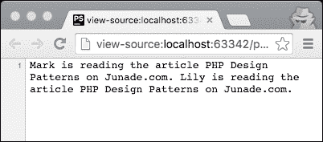

这种设计模式的主要优势在于观察者和主题之间关系的松散耦合性。有更大的模块化，因为主题和观察者可以独立变化。除此之外，我们可以添加任意多的观察者，提供我们想要的任意多的功能。这种可扩展性和定制性通常是这种设计模式应用于应用程序视图上下文的原因，也经常在**模型-视图-控制器**（**MVC**）框架中实现。

使用这种模式的缺点在于当我们需要调试整个过程时会出现问题；流程控制可能会变得困难，因为观察者彼此之间并不知道对方的存在。除此之外，还存在更新开销，当处理特别大的观察者时，可能会使内存管理变得困难。

请记住，这种设计模式仅用于一个程序内部，不适用于进程间通信或消息系统。本书后面，我们将介绍如何使用消息模式来描述消息解析系统的不同部分如何相互连接，当我们想要允许不同进程之间的互通，而不仅仅是一个进程内的不同类时。

# 迭代器

迭代器设计模式是使用迭代器遍历容器的地方。在 PHP 中，如果最终继承了可遍历接口，类就可以使用`foreach`构造进行遍历。不幸的是，这是一个抽象基础接口，你不能单独实现它（除非你是在 PHP 核心中编写）。相反，你必须实现称为`Iterator`或`IteratorAggregate`的接口。通过实现这些接口中的任何一个，你可以使一个类可迭代，并可以使用`foreach`进行遍历。

`Iterator`和`IteratorAggregate`接口非常相似，除了`IteratorAggregate`接口创建一个外部迭代器。`IteratorAggregate`作为一个接口只需要定义一个方法`getIterator`。这个方法必须返回`ArrayIterator`接口的一个实例。

## IteratorAggregate

假设我们想要创建一个实现这个接口的实现，它将遍历各种时间。

首先，让我们从一个`IternatorAggregate`类的基本实现开始，以了解它是如何工作的：

```php
<?php 

class timeIterator implements IteratorAggregate { 

  public function getIterator() 
  { 
    return new ArrayIterator(array( 
      'property1' => 1, 
      'property2' => 2, 
      'property4' => 3 
    )); 
  } 
} 

```

我们可以按照以下方式遍历这个类：

```php
<?php 

$time = new timeIterator; 

foreach($time as $key => $value) { 
  var_dump($key, $value); 
  echo "n"; 
} 

```

这个输出如下：

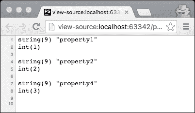

我修改了这个脚本，使它接受一个`time`值，并计算两侧的各种值，并使它们可迭代：

```php
<?php 

class timeIterator implements IteratorAggregate 
{ 

  public function __construct(int $time) 
  { 
    $this->weekAgo   = $time - 604800; 
    $this->yesterday = $time - 86400; 
    $this->now       = $time; 
    $this->tomorrow  = $time + 86400; 
    $this->nextWeek  = $time + 604800; 
  } 

  public function getIterator() 
  { 
    return new ArrayIterator($this); 
  } 
} 

$time = new timeIterator(time()); 

foreach ($time as $key => $value) { 
  var_dump($key, $value); 
  echo "n"; 
} 

```

此脚本的输出如下：

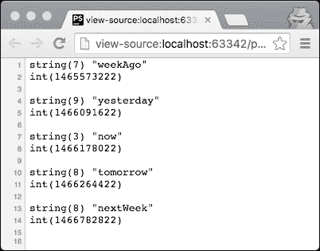

## 迭代器

假设我们想要创建一个实现这个接口的实现，它将遍历各种时间。

## PHP 的许多迭代器

之前，我们已经探讨了**SPL（标准 PHP 库）**中的一些函数，这是一个解决常见问题的接口和类的集合。鉴于这个目标，它们与设计模式有着共同的目标，但它们都以不同的方式解决这些问题。构建这个扩展和在 PHP 7 中编译不需要外部库；事实上，你甚至不能禁用它。

作为这个库的一部分，在 SPL 中有很多迭代器。您可以在文档中找到它们的列表[`php.net/manual/en/spl.iterators.php`](http://php.net/manual/en/spl.iterators.php)。

以下是一些这些迭代器的列表，以便让您了解您可以利用它们的用途：

+   追加迭代器

+   数组迭代器

+   缓存迭代器

+   回调过滤迭代器

+   目录迭代器

+   空迭代器

+   文件系统迭代器

+   过滤迭代器

+   Glob 迭代器

+   无限迭代器

+   迭代器迭代器

+   限制迭代器

+   多重迭代器

+   无需倒带迭代器

+   父迭代器

+   递归数组迭代器

+   递归缓存迭代器

+   递归回调过滤迭代器

+   递归目录迭代器

+   递归过滤迭代器

+   递归迭代器迭代器

+   递归正则表达式迭代器

+   递归树迭代器

+   正则表达式迭代器

# 生成器

PHP 有一个很好的机制来以紧凑的方式创建迭代器。这种类型的迭代器有一些严重的限制；它们只能向前，不能倒带。事实上，即使只是从头开始一个迭代器，你也必须重新构建生成器。本质上，这是一个只能向前的迭代器。

一个使用`yield`关键字而不是`return`关键字的函数。这将像`return`语句一样工作，但不会停止该函数的执行。生成器函数可以`yield`数据，只要你愿意。

当您用值填充一个数组时，这些值必须存储在内存中，这可能导致您超出 PHP 内存限制，或者需要大量的处理时间来生成器。当您将逻辑放在生成器函数中时，这种开销就不存在了。生成器函数可能只产生它需要的结果；不需要先预先填充一个数组。

这是一个简单的生成器，将`var_dump`一个声明字符串，生成器已经启动。该函数将生成前五个平方数，同时输出它们在序列中的位置。然后最后指示生成器已结束：

```php
<?php 
function squaredNumbers() 
{ 
  var_dump("Generator starts."); 
  for ($i = 0; $i < 5; ++$i) { 
    var_dump($i . " in series."); 
    yield pow($i, 2); 
  } 
  var_dump("Generator ends."); 
} 

foreach (squaredNumbers() as $number) { 
  var_dump($number); 
} 

```

这个脚本的第二部分循环运行这个函数，并对每个数字运行一个`var_dump`字符串。这个输出如下：

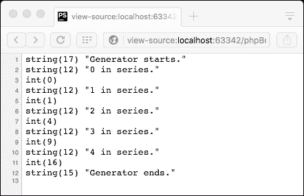

让我们稍微修改这个函数。

非常重要的一点是，如果你给变量添加了返回类型，你只能声明`Generator`，`Iterator`或`Traversable`，`integer`的返回类型。

这是代码：

```php
<?php 
function squaredNumbers(int $start, int $end): Generator 
{ 
  for ($i = $start; $i <= $end; ++$i) { 
    yield pow($i, 2); 
  } 
} 

foreach (squaredNumbers(1, 5) as $number) { 
  var_dump($number); 
} 

```

这个结果如下：

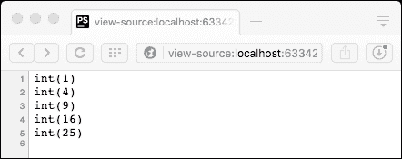

如果我们想要产生一个键和一个值，那么这是相当容易的。

还有一些关于在 PHP 5 中使用生成器的事情要提及：在 PHP 5 中，当您想要同时产生一个变量并将其设置为一个变量时，必须将 yield 语句包装在括号中。这个限制在 PHP 7 中不存在。

这在 PHP 5 和 7 中有效：

```php
**$data = (yield $value);**

```

这只在 PHP 7 中有效：

```php
**$data = yield $value;**

```

假设我们想修改我们的生成器，使其产生一个键值结果。代码如下：

```php
<?php 

function squaredNumbers(int $start, int $end): Generator 
{ 
  for ($i = $start; $i <= $end; ++$i) { 
    yield $i => pow($i, 2); 
  } 
} 

foreach (squaredNumbers(1, 5) as $key => $number) { 
  var_dump([$key, $number]); 
} 

```

当我们测试这个时，我们将`var_dump`一个包含键值存储的二维数组，这个数组包含了生成器在给定迭代中产生的任何值。

这是输出：

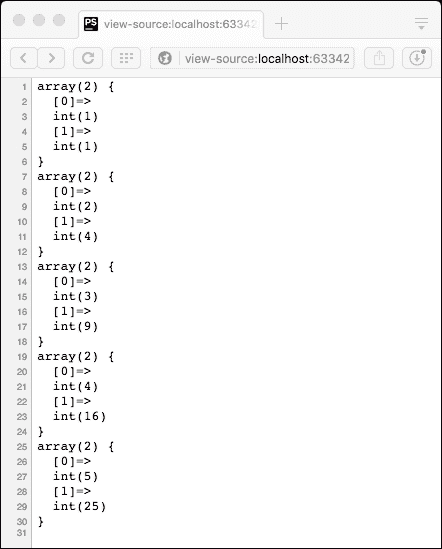

还有一些其他提示，一个没有变量的 yield 语句（就像在下面的命令中所示的那样）将简单地产生`null`：

```php
**yield;**

```

您还可以使用`yield from`，它将产生任何给定生成器的内部值。

假设我们有一个包含两个值的数组：

```php
[1, 2] 

```

当我们使用`yield from`来产生一个包含两个值的数组时，我们得到了数组的内部值。让我演示一下：

```php
<?php 

function innerGenerator() 
{ 
  yield from [1, 2]; 
} 

foreach (innerGenerator() as $number) { 
  var_dump($number); 
} 

```

这将显示以下输出：


然而，现在让我们修改这个脚本，使其使用`yield`而不是`yield from`：

```php
<?php 

function innerGenerator() 
{ 
  yield [1, 2]; 
} 

foreach (innerGenerator() as $number) { 
  var_dump($number); 
} 

```

现在我们将看到，我们不仅仅得到了数组的内部值，还得到了外部容器：

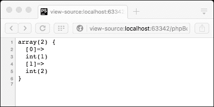

# 模板方法设计模式

模板方法设计模式用于创建一组必须执行类似行为的子类。

这种设计模式由模板方法组成，它是一个抽象类。具体的子类可以重写抽象类中的方法。模板方法包含算法的骨架；子类可以使用重写来改变算法的具体行为。

因此，这是一个非常简单的设计模式；它鼓励松散耦合，同时控制子类化的点。因此，它比简单的多态行为更精细。

考虑一个`Pasta`类的抽象：

```php
<?php 

abstract class Pasta 
{ 
  public function __construct(bool $cheese = true) 
  { 
    $this->cheese = $cheese; 
  } 

  public function cook() 
  { 

    var_dump('Cooked pasta.'); 

    $this->boilPasta(); 
    $this->addSauce(); 
    $this->addMeat(); 

    if ($this->cheese) { 
      $this->addCheese(); 
    } 
  } 

  public function boilPasta(): bool 
  { 
    return true; 
  } 

  public abstract function addSauce(): bool; 

  public abstract function addMeat(): bool; 

  public abstract function addCheese(): bool; 

} 

```

这里有一个简单的构造函数，用于确定意大利面是否应该包含奶酪，以及一个运行烹饪算法的`cook`函数。

请注意，添加各种配料的函数被抽象掉了；在子类中，我们使用所需的行为来实现这些方法。

假设我们想做肉丸意大利面。我们可以按照以下方式实现这个抽象类：

```php
<?php 

class MeatballPasta extends Pasta 
{ 

  public function addSauce(): bool 
  { 
    var_dump("Added tomato sauce"); 

    return true; 
  } 

  public function addMeat(): bool 
  { 
    var_dump("Added meatballs."); 

    return true; 

  } 

  public function addCheese(): bool 
  { 
    var_dump("Added cheese."); 

    return true; 
  } 

} 

```

我们可以使用以下脚本在我们的`index.php`文件中对这段代码进行测试：

```php
<?php 

require_once('Pasta.php'); 
require_once('MeatballPasta.php'); 

var_dump("Meatball pasta"); 
$dish = new MeatballPasta(true); 
$dish->cook(); 

```

感谢各种函数中的`var_dump`变量显示各种状态消息，我们可以看到如下输出：

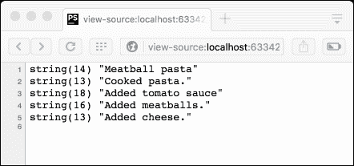

现在，假设我们想要制作一个素食食谱。我们可以在不同的上下文中利用相同的抽象。

这一次，在添加肉或奶酪时，这些函数什么也不做；它们可以返回`false`或`null`值：

```php
<?php 

class VeganPasta extends Pasta 
{ 

  public function addSauce(): bool 
  { 
    var_dump("Added tomato sauce"); 

    return true; 
  } 

  public function addMeat(): bool 
  { 
    return false; 
  } 

  public function addCheese(): bool 
  { 
    return false; 
  } 

} 

```

让我们修改我们的`index.php`文件以表示这种行为：

```php
<?php 

require_once('Pasta.php'); 
require_once('MeatballPasta.php'); 

var_dump("Meatball pasta"); 
$dish = new MeatballPasta(true); 
$dish->cook(); 

var_dump(""); 
var_dump("Vegan pasta"); 
require_once('VeganPasta.php'); 

$dish = new VeganPasta(true); 
$dish->cook(); 

```

输出如下：

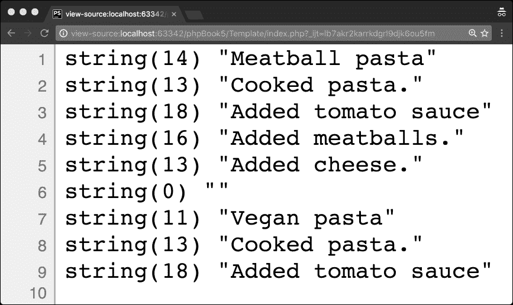

这种设计模式简单易用，但基本上允许您抽象化您的算法设计，并将责任委托给您想要的子类。

# 责任链

假设我们有一组对象，它们一起解决问题。当一个对象无法解决问题时，我们希望对象将任务发送给链中的另一个对象。这就是责任链设计模式的用途。

为了使这个工作起来，我们需要一个处理程序，这将是我们的`Chain`接口。链中的各个对象都将实现这个`Chain`接口。

让我们从一个简单的例子开始；一个助理可以为少于 100 美元购买资产，一个经理可以为少于 500 美元购买东西。

我们的`Purchaser`接口的抽象如下：

```php
<?php 

interface Purchaser 
{ 
  public function setNextPurchaser(Purchaser $nextPurchaser): bool; 

  public function buy($price): bool; 
} 

```

我们的第一个实现是`Associate`类。非常简单，我们实现`setNextPurchaser`函数，以便将`nextPurchaser`类属性设置为链中的下一个对象。

当我们调用`buy`函数时，如果价格在范围内，助理将购买它。如果不是，链中的下一个购买者将购买它：

```php
<?php 

class AssociatePurchaser implements Purchaser 
{ 
  public function setNextPurchaser(Purchaser $nextPurchaser): bool 
  { 
    $this->nextPurchaser = $nextPurchaser; 
    return true; 
  } 

  public function buy($price): bool 
  { 
    if ($price < 100) { 
      var_dump("Associate purchased"); 
      return true; 
    } else { 
      if (isset($this->nextPurchaser)) { 
        reurn $this->nextPurchaser->buy($price); 
      } else { 
        var_dump("Could not buy"); 
        return false; 
      } 
    } 
  } 
} 

```

我们的`Manager`类完全相同；我们只允许经理购买低于 500 美元的资产。实际上，当您应用这种模式时，您不会只是复制一个类，因为您的类会有不同的逻辑；这个例子只是一个非常简单的实现。

以下是代码：

```php
<?php 

class ManagerPurchaser implements Purchaser 
{ 
  public function setNextPurchaser(Purchaser $nextPurchaser): bool 
  { 
    $this->nextPurchaser = $nextPurchaser; 
    return true; 
  } 

  public function buy($price): bool 
  { 
    if ($price < 500) { 
      var_dump("Associate purchased"); 
      return true; 
    } else { 
      if (isset($this->nextPurchaser)) { 
        return $this->nextPurchaser->buy($price); 
      } else { 
        var_dump("Could not buy"); 
        return false; 
      } 
    } 
  } 
} 

```

让我们在我们的`index.php`文件中运行一个来自助理的基本购买。

首先，这是我们放在`index.php`文件中的代码：

```php
<?php 

require_once('Purchaser.php'); 
require_once('AssociatePurchaser.php'); 

$associate = new AssociatePurchaser(); 

$associate->buy(50); 

```

所有这些的输出如下：


接下来，让我们测试我们的`Manager`类。我们将在我们的`index.php`文件中修改购买价格，并将我们的`Manager`类添加到链中。

这是我们修改后的`index.php`：

```php
<?php 

require_once('Purchaser.php'); 
require_once('AssociatePurchaser.php'); 
require_once('ManagerPurchaser.php'); 

$associate = new AssociatePurchaser(); 
$manager = new ManagerPurchaser(); 

$associate->setNextPurchaser($manager); 

$associate->buy(400); 

```

这有以下输出：


让我们看看如果改变价格会发生什么导致购买失败。

我们在我们的`index.php`文件的最后一行进行更改，使购买价格现在为 600 美元：

```php
<?php 

require_once('Purchaser.php'); 
require_once('AssociatePurchaser.php'); 
require_once('ManagerPurchaser.php'); 

$associate = new AssociatePurchaser(); 
$manager = new ManagerPurchaser(); 

$associate->setNextPurchaser($manager); 

$associate->buy(600); 

```

这有以下输出：

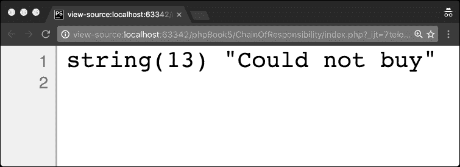

现在我们可以扩展这个脚本。让我们添加`DirectorPurchaser`和`BoardPurchaser`，这样我们就可以以更高的成本进行购买。

我们将创建一个`DirectorPurchaser`，他可以在 10,000 美元以下购买。

这个类如下：

```php
<?php 

class DirectorPurchaser implements Purchaser 
{ 
  public function setNextPurchaser(Purchaser $nextPurchaser): bool 
  { 
    $this->nextPurchaser = $nextPurchaser; 
    return true; 
  } 

  public function buy($price): bool 
  { 
    if ($price < 10000) { 
      var_dump("Director purchased"); 
      return true; 
    } else { 
      if (isset($this->nextPurchaser)) { 
        return $this->nextPurchaser->buy($price); 
      } else { 
        var_dump("Could not buy"); 
        return false; 
      } 
    } 
  } 
} 

```

让我们为`BoardPurchaser`类做同样的事情，他可以在 10 万美元以下购买：

```php
<?php 

class BoardPurchaser implements Purchaser 
{ 
  public function setNextPurchaser(Purchaser $nextPurchaser): bool 
  { 
    $this->nextPurchaser = $nextPurchaser; 
    return true; 
  } 

  public function buy($price): bool 
  { 
    if ($price < 100000) { 
      var_dump("Board purchased"); 
      return true; 
    } else { 
      if (isset($this->nextPurchaser)) { 
        return $this->nextPurchaser->buy($price); 
      } else { 
        var_dump("Could not buy"); 
        return false; 
      } 
    } 
  } 
} 

```

现在我们可以更新我们的`index.php`脚本，需要新的类，实例化它们，然后将所有内容绑定在一起。最后，我们将尝试通过调用链中的第一个来运行购买。

以下是脚本：

```php
<?php 

require_once('Purchaser.php'); 
require_once('AssociatePurchaser.php'); 
require_once('ManagerPurchaser.php'); 
require_once('DirectorPurchaser.php'); 
require_once('BoardPurchaser.php'); 

$associate = new AssociatePurchaser(); 
$manager = new ManagerPurchaser(); 
$director = new DirectorPurchaser(); 
$board = new BoardPurchaser(); 

$associate->setNextPurchaser($manager); 
$manager->setNextPurchaser($director); 
$director->setNextPurchaser($board); 

$associate->buy(11000); 

```

以下是此脚本的输出：

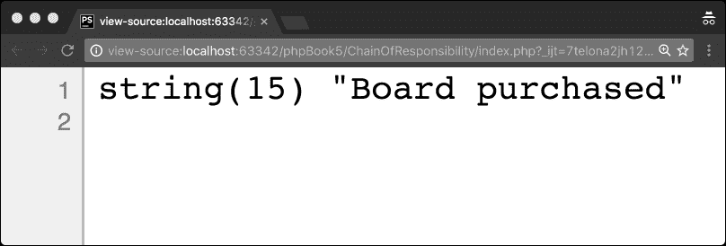

这使我们能够遍历一系列对象来处理数据。当处理树数据结构（例如，XML 树）时，这是特别有用的。这可以以启动并离开的方式工作，我们可以降低处理遍历链的开销。

此外，链是松散耦合的，数据通过链传递直到被处理。任何对象都可以链接到任何其他对象，任何顺序。

# 策略设计模式

策略设计模式存在是为了允许我们在运行时改变对象的行为。

假设我们有一个类，将一个数字提高到一个幂，但在运行时我们想要改变是否平方或立方一个数字。

让我们首先定义一个接口，一个将数字提高到给定幂的函数：

```php
<?php 

interface Power 
{ 
  public function raise(int $number): int; 
} 

```

我们可以相应地定义`Square`和`Cube`一个给定数字的类，通过实现接口。

这是我们的`Square`类：

```php
<?php 

class Square implements Power 
{ 
  public function raise(int $number): int 
  { 
    return pow($number, 2); 
  } 
} 

```

让我们定义我们的`Cube`类：

```php
<?php 

class Cube implements Power 
{ 
  public function raise(int $number): int 
  { 
    return pow($number, 3); 
  } 
} 

```

我们现在可以构建一个类，它将基本上使用其中一个这些类来处理一个数字。

这是这个类：

```php
<?php 

class RaiseNumber 
{ 
  public function __construct(Power $strategy) 
  { 
    $this->strategy = $strategy; 
  } 

  public function raise(int $number) 
  { 
    return $this->strategy->raise($number); 
  } 
} 

```

现在我们可以使用`index.php`文件来演示整个设置：

```php
<?php 

require_once('Power.php'); 
require_once('Square.php'); 
require_once('Cube.php'); 
require_once('RaiseNumber.php'); 

$processor = new RaiseNumber(new Square()); 

var_dump($processor->raise(5)); 

```

输出如预期，5²是`25`。

以下是输出：

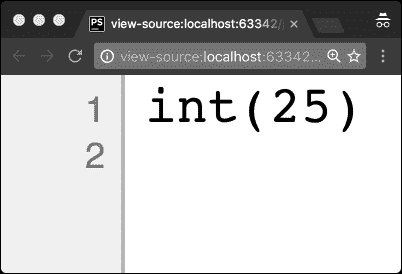

我们可以在我们的`index.php`文件中用`Cube`对象替换`Square`对象：

```php
<?php 

require_once('Power.php'); 
require_once('Square.php'); 
require_once('Cube.php'); 
require_once('RaiseNumber.php'); 

$processor = new RaiseNumber(new Cube()); 

var_dump($processor->raise(5)); 

```

以下是更新脚本的输出：

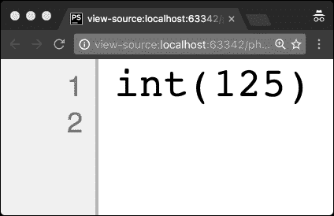

到目前为止一切顺利；但之所以伟大的原因是我们可以动态添加实际改变类操作的逻辑。

以下是所有这些的一个相当粗糙的演示：

```php
<?php 

require_once('Power.php'); 
require_once('Square.php'); 
require_once('Cube.php'); 
require_once('RaiseNumber.php'); 

if (isset($_GET['n'])) { 
  $number = $_GET['n']; 
} else { 
  $number = 0; 
} 

if ($number < 5) { 
  $power = new Cube(); 
} else { 
  $power = new Square(); 
} 

$processor = new RaiseNumber($power); 

var_dump($processor->raise($number)); 

```

所以为了演示这一点，让我们运行脚本，将*n*`GET`变量设置为`4`，这应该将数字`4`立方，得到一个输出`64`：

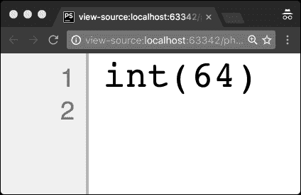

现在如果我们通过数字`6`，我们期望脚本将数字`6`平方，得到一个输出`36`：


在这种设计模式中，我们已经做了很多：

+   我们定义了一系列算法，它们都有一个共同的接口

+   这些算法是可以互换的；它们可以在不影响客户端实现的情况下进行交换

+   我们在一个类中封装了每个算法

现在我们可以独立于使用它的客户端来变化算法。

# 规范设计模式

规范设计模式非常强大。在这里，我将尝试对其进行高层概述，但还有很多可以探索；如果您有兴趣了解更多，我强烈推荐*Eric Evans*和*Martin Fowler*的论文*Specifications*。

这种设计模式用于编码关于对象的业务规则。它们告诉我们一个对象是否满足某些业务标准。

我们可以以以下方式使用它们：

+   对于*验证*一个对象，我们可以做出断言

+   从给定集合中获取*选择*的对象

+   为了指定如何通过*按订单制造*来创建对象

在这个例子中，我们将构建规范来查询

让我们看看以下对象：

```php
<?php 

$workers = array(); 

$workers['A'] = new StdClass(); 
$workers['A']->title = "Developer"; 
$workers['A']->department = "Engineering"; 
$workers['A']->salary = 50000; 

$workers['B'] = new StdClass(); 
$workers['B']->title = "Data Analyst"; 
$workers['B']->department = "Engineering"; 
$workers['B']->salary = 30000; 

$workers['C'] = new StdClass(); 
$workers['C']->title = "Personal Assistant"; 
$workers['C']->department = "CEO"; 
$workers['C']->salary = 25000; 

The workers array will look like this if we var_dump it: 
array(3) { 
  ["A"]=> 
  object(stdClass)#1 (3) { 
    ["title"]=> 
    string(9) "Developer" 
    ["department"]=> 
    string(11) "Engineering" 
    ["salary"]=> 
    int(50000) 
  } 
  ["B"]=> 
  object(stdClass)#2 (3) { 
    ["title"]=> 
    string(12) "Data Analyst" 
    ["department"]=> 
    string(11) "Engineering" 
    ["salary"]=> 
    int(30000) 
  } 
  ["C"]=> 
  object(stdClass)#3 (3) { 
    ["title"]=> 
    string(18) "Personal Assistant" 
    ["department"]=> 
    string(3) "CEO" 
    ["salary"]=> 
    int(25000) 
  } 
} 

```

让我们以一个`EmployeeSpecification`接口开始；这是我们所有规范都需要实现的接口。确保用您处理的对象类型（例如，员工，或您从实例化对象的类的名称）替换`StdClass`。

这是代码：

```php
<?php 

interface EmployeeSpecification 
{ 
  public function isSatisfiedBy(StdClass $customer): bool; 
} 

```

现在是时候编写一个名为`EmployeeIsEngineer`的实现了：

```php
<?php 

class EmployeeIsEngineer implements EmployeeSpecification 
{ 
  public function isSatisfiedBy(StdClass $customer): bool 
  { 
    if ($customer->department === "Engineering") { 
      return true; 
    } 

    return false; 
  } 
} 

```

然后，我们可以遍历我们的工作人员，检查哪些符合我们制定的标准：

```php
$isEngineer = new EmployeeIsEngineer(); 

foreach ($workers as $id => $worker) { 
  if ($isEngineer->isSatisfiedBy($worker)) { 
    var_dump($id); 
  } 
} 

```

让我们把这一切放在我们的`index.php`文件中：

```php
<?php 

require_once('EmployeeSpecification.php'); 
require_once('EmployeeIsEngineer.php'); 

$workers = array(); 

$workers['A'] = new StdClass(); 
$workers['A']->title = "Developer"; 
$workers['A']->department = "Engineering"; 
$workers['A']->salary = 50000; 

$workers['B'] = new StdClass(); 
$workers['B']->title = "Data Analyst"; 
$workers['B']->department = "Engineering"; 
$workers['B']->salary = 30000; 

$workers['C'] = new StdClass(); 
$workers['C']->title = "Personal Assistant"; 
$workers['C']->department = "CEO"; 
$workers['C']->salary = 25000; 

$isEngineer = new EmployeeIsEngineer(); 

foreach ($workers as $id => $worker) { 
  if ($isEngineer->isSatisfiedBy($worker)) { 
    var_dump($id); 
  } 
} 

```

这是此脚本的输出：

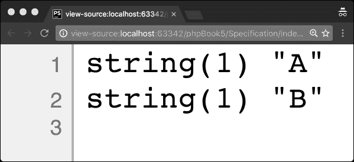

组合规范允许您组合规范。通过使用`AND`、`NOT`、`OR`和`NOR`运算符，您可以将它们的各自功能构建到不同的规范类中。

同样，您也可以使用规范来获取对象。

随着代码的进一步复杂化，这段代码变得更加复杂，但是您理解了要点。事实上，我在本节开头提到的 Eric Evans 和 Martin Fowler 的论文涉及了一些更加复杂的安排。

无论如何，这种设计模式基本上允许我们封装业务逻辑以陈述关于对象的某些事情。这是一种非常强大的设计模式，我强烈鼓励更深入地研究它。

# 定期任务模式

定期任务基本上由三个部分组成：任务本身，通过定义任务运行的时间和允许运行的时间来进行调度的作业，最后是执行此作业的作业注册表。

通常，这些是通过在 Linux 服务器上使用 cron 来实现的。您可以使用以下配置语法向“配置”文件添加一行：

```php
 **# ┌───────────── min (0 - 59)
     # │ ┌────────────── hour (0 - 23)
     # │ │ ┌─────────────── day of month (1 - 31)
     # │ │ │ ┌──────────────── month (1 - 12)
     # │ │ │ │ ┌───────────────── day of week (0 - 6) (0 to 6 are Sunday to
     # │ │ │ │ │                  Saturday, or use names; 7 is also Sunday)
     # │ │ │ │ │
     # │ │ │ │ │
     # * * * * *  command to execute** 

```

通常可以通过在命令行中运行`crontab -e`来编辑`cron`文件。您可以使用此模式安排任何 Linux 命令。以下是一个 cron 作业，将在每天 20:00（晚上 8 点）运行一个 PHP 脚本：

```php
**0 20 * * * /usr/bin/php /opt/test.php**

```

这些实现起来非常简单，但是在创建它们时，以下是一些指导方针可以帮助您：

+   不要将您的 cron 作业暴露给互联网。

+   当运行任务时，任务不应检查是否需要运行的标准。这个测试应该在任务之外。

+   任务应该只执行其预期执行的计划活动，而不执行任何其他目的。

+   谨防我们在第七章中讨论的数据库作为 IPC 模式，重构。

您可以在任务中放入任何您想要的东西（在合理范围内）。您可能会发现异步执行是最佳路线。Icicle 是一个执行异步行为的出色的 PHP 库。您可以在[`icicle.io/`](https://icicle.io/)上找到在线文档。

当我们的任务需要按特定顺序完成几项任务时，您可能会从使用我们在结构设计模式部分讨论的组合设计模式中受益，并调用使用此模式调用其他任务的单个任务。

# 总结

在本章中，我们涵盖了一些识别对象之间常见通信模式的模式。

我们讨论了观察者模式如何用于更新观察者关于给定主题状态的。此外，我们还了解了标准 PHP 库包含的功能可以帮助我们实现这一点。

然后，我们继续讨论了如何在 PHP 中以许多不同的方式实现迭代器，使用 PHP 核心中的各种接口以及利用生成器函数。

我们继续讨论了模板模式如何定义算法骨架，我们可以以比标准多态性更严格的方式动态调整它。我们讨论了责任链模式，它允许我们将对象链接在一起以执行各种功能。策略模式教会了我们如何在运行时改变代码的行为。然后我介绍了规范模式的基础知识以及其中的高级功能。最后，我们复习了定期任务模式以及如何使用 Linux 上的 cron 来实现它。

这些设计模式对开发人员来说是一些最关键的设计模式。对象之间的通信在许多项目中至关重要，而这些模式确实可以帮助我们进行这种通信。

在下一章中，我们将讨论架构模式以及这些模式如何帮助您处理出现的软件架构任务，以及如何帮助您解决可能面临的更广泛的软件工程挑战（尽管它们在技术上可能不被认为是设计模式本身）。
