# 第六章：架构模式

架构模式，有时被称为架构风格，为软件架构中的重复问题提供解决方案。

尽管与软件设计模式类似，但其范围更广，涉及软件工程中的各种问题，而不仅仅是软件本身的开发。

在本章中，我们将涵盖以下主题：

+   模型-视图-控制器（MVC）

+   面向服务的架构

+   微服务

+   异步排队

+   消息队列模式

# 模型-视图-控制器（MVC）

MVC 是 PHP 开发人员遇到的最常见类型的架构模式。基本上，MVC 是一种用于实现用户界面的架构模式。

它主要围绕以下方法论展开：

+   **模型**：为应用程序提供数据，无论是来自 MySQL 数据库还是其他任何数据存储。

+   **控制器**：控制器基本上是业务逻辑所在。控制器处理视图提供的任何查询，使用模型来协助其进行此行为。

+   **视图**：提供给最终用户的实际内容。这通常是一个 HTML 模板。

一个交互的业务逻辑并不严格分离于另一个交互。应用程序的不同类之间没有正式的分离。

需要考虑的关键是 MVC 模式主要是一种 UI 模式，因此在整个应用程序中无法很好地扩展。也就是说，UI 的呈现越来越多地通过 JavaScript 应用程序完成，即一个简单消耗 RESTful API 的单页面 JavaScript HTML 应用程序。

如果您使用 JavaScript，可以使用诸如 Backbone.js（模型-视图-控制器）、React.js 或 Angular 等框架与后端 API 进行通信，尽管这当然需要一个启用 JavaScript 的 Web 浏览器，这对我们的一些用户来说可能是理所当然的。

如果您处于无法使用 JavaScript 应用程序且必须提供渲染的 HTML 的环境中，对于您的 MVC 应用程序来说，将其简单地消耗 REST API 通常是一个好主意。REST API 执行所有业务逻辑，但标记的呈现是在 MVC 应用程序中完成的。尽管这增加了复杂性，但它提供了更大的责任分离，因此您不会将 HTML 与核心业务逻辑合并。也就是说，即使在这个 REST API 中，您也需要某种形式的关注点分离，您需要能够将标记的呈现与实际业务逻辑分开。

选择适合应用程序的架构模式的关键因素是复杂性是否适合应用程序的规模。因此，选择 MVC 框架也应基于应用程序本身的复杂性及其后续预期的复杂性。

鉴于基础设施即代码的增长，可以以完全编排的方式部署多个 Web 服务的基础设施。事实上，使用诸如 Docker 之类的容器化技术，可以以很小的开销（无需为每个服务启动新服务器）部署多个架构（例如具有单独 API 服务的 MVC 应用程序）。

在开发出色的架构时，关注点分离是一个重要特征，其中包括将 UI 与业务逻辑分离。

当以 MVC 模式思考时，重要的是要记住以下交互：

+   模型存储数据，根据模型提出的查询检索数据，并由视图显示

+   视图根据模型的更改生成输出

+   控制器发送命令以更新模型的状态；它还可以更新与之关联的视图，以改变给定模型的呈现方式

或者，通常使用以下图表表示：

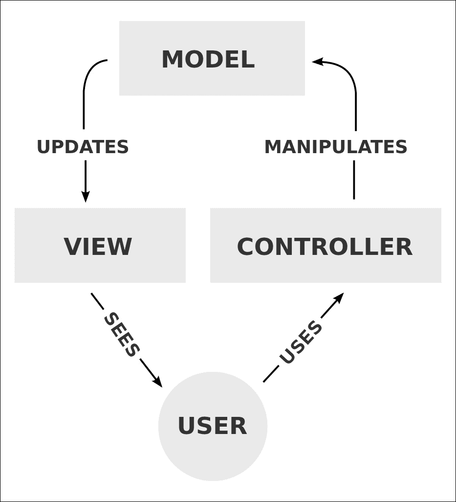

不要仅仅为了使用而使用 MVC 框架，要理解它们存在的原因以及它们在特定用例中的适用性。记住，当你使用一个功能繁多的框架时，你要负责维护整个框架的运行。

根据需要引入组件（即通过 Composer）是开发具有相当多业务逻辑的软件的更实际的方法。

# 面向服务的架构

面向服务的架构主要由与数据存储库通信的服务中的业务逻辑组成。

这些服务可以以不同的形式衍生出来构建应用程序。这些应用程序以不同的格式采用这些服务来构建各种应用程序。将这些服务视为可以组合在一起以构建特定格式应用程序的乐高积木。

这个描述相当粗糙，让我进一步澄清：

+   服务的边界是明确的（它们可以将不同域上的 Web 服务分开，等等。）

+   服务可以使用共同的通信协议进行相互通信（例如都使用 RESTful API）

+   服务是自治的（它们是解耦的，与其他服务没有任何关联）

+   消息处理机制和架构对每个微服务都是可理解的（因此通常是相同的），但编程环境可以是不同的。

面向服务的架构本质上是分布式的，因此其初始复杂性可能比其他架构更高。

# 微服务

微服务架构可以被认为是面向服务的架构的一个子集。

基本上，微服务通过由小型独立进程组成的复杂应用程序，这些进程通过语言无关的 API 进行相互通信，使每个服务都可以相互访问。微服务可以作为单独的服务进行部署。

在微服务中，业务逻辑被分离成独立的、松耦合的服务。微服务的一个关键原则是每个数据库都应该有自己的数据库，这对确保微服务不会彼此紧密耦合至关重要。

通过减少单个服务的复杂性，我们可以减少该服务可能出现故障的点。理论上，通过使单个服务符合单一职责原则，我们可以更容易地调试和减少整个应用程序中出现故障的机会。

在计算机科学中，CAP 定理规定在给定的分布式计算机系统中不可能同时保证一致性、可用性和分区容错性。

想象一下，有两个分布式数据库都包含用户的电子邮件地址。如果我们想要更新这个电子邮件地址，没有办法可以在两个数据库中同时实时更新电子邮件地址，同时不将两个数据集重新合并。在分布式系统中，我们要么延迟访问数据以验证数据的一致性，要么呈现一个未更新的数据副本。

这使得传统的数据库事务变得困难。因此，在微服务架构中处理数据的最佳方式是使用一种最终一致的、事件驱动的架构。

每个服务在发生变化时都会发布一个事件，其他服务可以订阅此事件。当接收到事件时，数据会相应地更新。因此，应用程序能够在不需要使用分布式事务的情况下在多个服务之间保持数据一致性。

为了了解如何在微服务之间实现进程间通信的架构，请参阅本章节中的*消息队列模式（使用 RabbitMQ 入门）*部分。

在这种情况下，缓解这种限制的一种简单方法是通过使用时间验证系统来验证数据的一致性。因此，我们为一致性和分区容忍性而放弃了可用性。

如果您可以预见在给定的微服务架构中会出现这种问题，通常最好将需要满足 CAP 定理的服务分组到一个单一的服务中。

让我们考虑一个比萨外卖网站应用，它由以下微服务组成：

+   用户

+   优惠

+   食谱

+   购物车

+   计费

+   支付

+   餐厅

+   交付

+   比萨

+   评论

+   前端微服务

在这个例子中，我们可能会有以下用户旅程：

1.  用户通过用户微服务进行身份验证。

1.  用户可以使用优惠微服务选择优惠。

1.  用户使用食谱微服务选择他们想要订购的比萨。

1.  使用购物车微服务将所选的比萨添加到购物车中。

1.  计费凭据通过计费微服务进行优化。

1.  用户使用支付微服务进行支付。

1.  订单通过餐厅微服务发送到餐厅。

1.  当餐厅烹饪食物时，交付微服务会派遣司机去取食物并送达。

1.  一旦交付微服务表明食物已经送达，用户就会被邀请使用评论微服务完成评论（评论微服务通过用户微服务通知用户）。

1.  Web 前端使用前端微服务包装在一起。

前端微服务可以简单地是一个消费其他微服务并将内容呈现给 Web 前端的微服务。这个前端可以通过 REST 与其他微服务通信，可能在浏览器中实现为 JavaScript 客户端，或者仅作为其他微服务 API 的消费者的 PHP 应用。

无论哪种方式，将前端 API 消费者与后端之间放置一个网关通常是一个好主意。这使我们能够在确定与微服务的通信之前放置一些中间件；例如，我们可以使用网关查询用户微服务，以检查用户是否经过授权，然后允许访问购物车微服务。

如果您使用 JavaScript 直接与微服务通信，当您的 Web 前端尝试与不同主机名/端口上的微服务通信时，可能会遇到跨域问题；微服务网关可以通过将网关放置在与 Web 前端本身相同的源上来防止这种情况。

为了方便使用网关，您可能会感受到缺点，因为您将需要担心另一个系统和额外的响应时间（尽管您可以在网关级别添加缓存以改善性能）。

考虑到网关的添加，我们的架构现在可能看起来像这样：

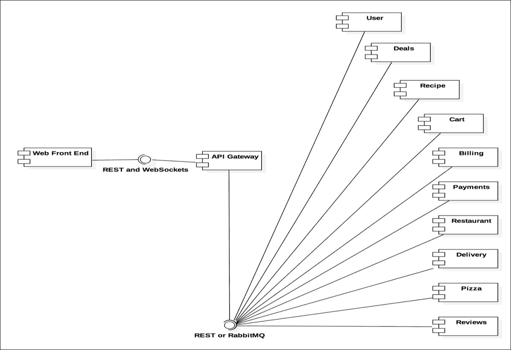

在 PHP 中越来越多地出现微框架，比如 Lumen、Silex 和 Slim；这些都是面向 API 的框架，可以轻松构建支持我们应用的微服务。也就是说，您可能更好地采用更轻量级的方法，只需在需要时通过 Composer 引入所需的组件。

记住，添加另一种技术或框架会给整体情况增加额外的复杂性。不仅要考虑实施新解决方案的技术原因，还要考虑这将如何使客户和架构受益。微服务不是增加不必要复杂性的借口：*保持简单，愚蠢*。

# 异步排队

消息队列提供异步通信协议。在异步通信协议中，发送方和接收方不需要同时与消息队列交互。

另一方面，典型的 HTTP 是一种同步通信协议，这意味着客户端在操作完成之前被阻塞。

考虑一下；您给某人打电话，然后等待电话响起，您与之交谈的人立即倾听您要说的话。在通信结束时，您说“再见”，对方也会回答“再见”。这可以被认为是同步的，因为在您收到与您交流的人的响应以结束通信之前，您不会做任何事情。

但是，如果您要发送短信给某人，发送完短信后，您可以随心所欲地进行任何行为；当对方想要与您交流时，您可以收到对您发送的消息的回复。当某人正在起草要发送的回复时，您可以随心所欲地进行任何行为。虽然您不直接与发送方进行通信，但您仍然通过手机保持同步通信，当您收到新消息时通知您（或者每隔几分钟检查手机）；但与对方的通信本身是异步的。双方都不需要了解对方的任何信息，他们只是在寻找自己的短信以便彼此进行通信。

## 消息队列模式（使用 RabbitMQ）

RabbitMQ 是一个消息代理；它接受并转发消息。在这里，让我们配置它，以便我们可以从一个 PHP 脚本发送消息到另一个脚本。

想象一下，我们正在将一个包裹交给快递员，以便他们交给客户；RabbitMQ 就是快递员，而脚本是分别接收和发送包裹的个体。

作为第一步，让我们在 Ubuntu 14.04 系统上安装 RabbitMQ；我将在此演示。

首先，我们需要将 RabbitMQ APT 存储库添加到我们的`/etc/apt/sources.list.d`文件夹中。幸运的是，可以使用以下命令执行此操作：

```php
**echo 'deb http://www.rabbitmq.com/debian/ testing main' | sudo tee /etc/apt/sources.list.d/rabbitmq.list**

```

请注意，存储库可能会发生变化；如果发生变化，您可以在[`www.rabbitmq.com/install-debian.html`](https://www.rabbitmq.com/install-debian.html)找到最新的详细信息。

我们还可以选择将 RabbitMQ 公钥添加到受信任的密钥列表中，以避免在通过`apt`命令安装或升级软件包时出现未签名的警告：

```php
**wget -O- https://www.rabbitmq.com/rabbitmq-release-signing-key.asc | sudo apt-key add -**

```

到目前为止，一切都很好：

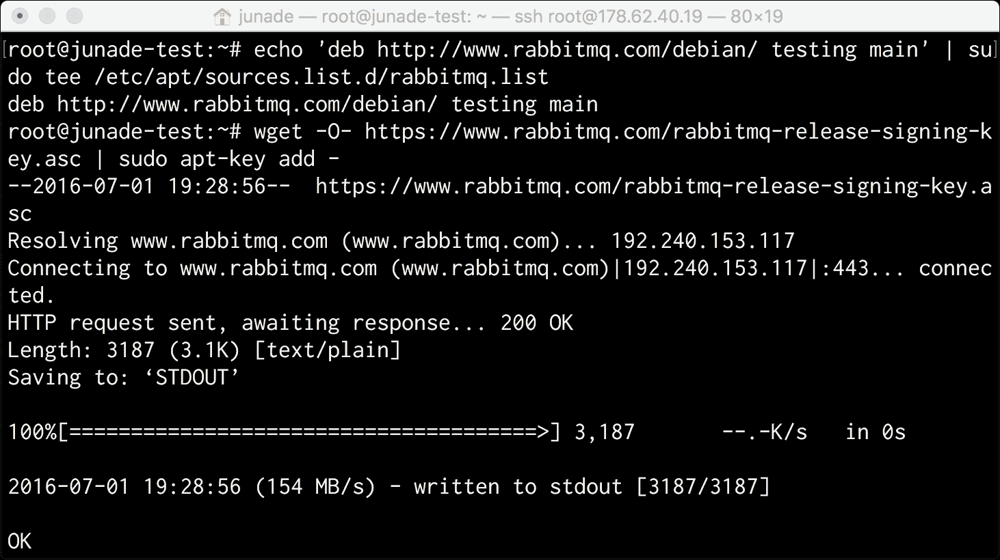

接下来，让我们运行`apt-get update`命令，从我们包含的新存储库中获取软件包。完成后，我们可以使用`apt-get install rabbitmq-server`命令安装我们需要的软件包：

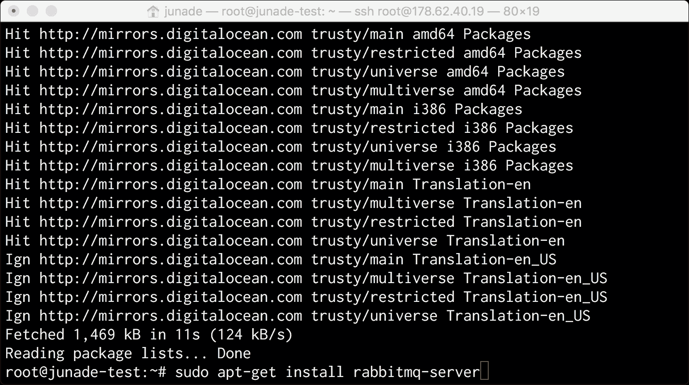

在被询问时，请务必接受各种提示：

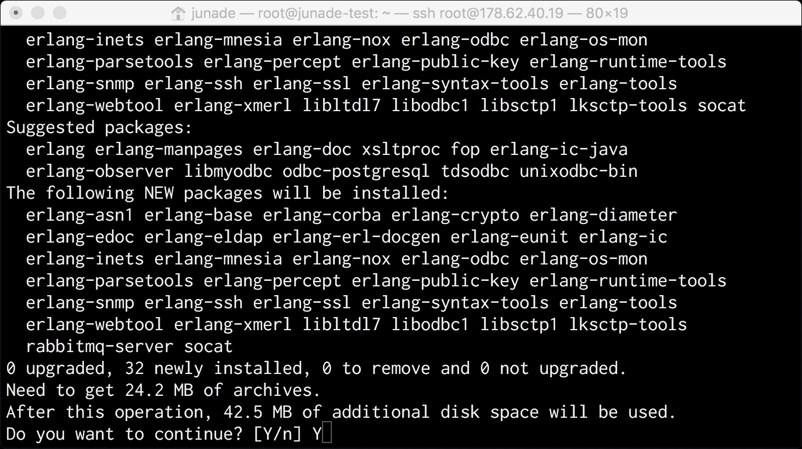

安装后，您可以运行`rabbitmqctl status`来检查应用程序的状态，以确保它正常运行：

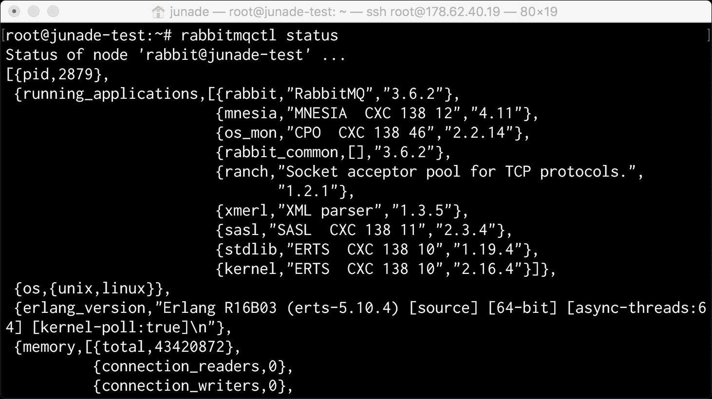

让我们简化一下生活。我们可以使用 Web GUI 来管理 RabbitMQ；只需运行以下命令：

```php
**rabbitmq-plugins enable rabbitmq_management**

```

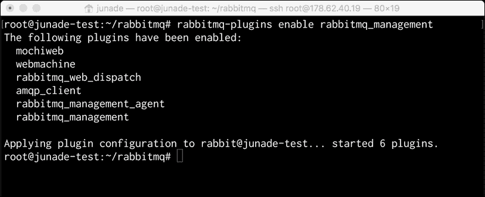

我们现在可以在`<您的服务器 IP 地址>:15672`看到管理界面：

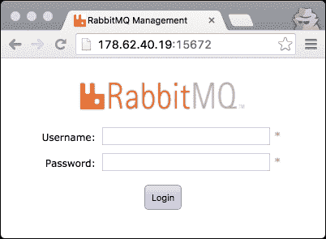

但在我们登录之前，我们需要创建一些登录凭据。为了做到这一点，我们需要回到命令行。

首先，我们需要设置一个新帐户，用户名为`junade`，密码为`insecurepassword`：

```php
**rabbitmqctl add_user junade insecurepassword**

```

然后我们可以添加一些管理员权限：

```php
**rabbitmqctl set_user_tags junade administrator**
**rabbitmqctl set_permissions -p / junade ".*" ".*" ".*"**

```

返回登录页面后，我们现在可以在输入这些凭据后看到我们很酷的管理界面：

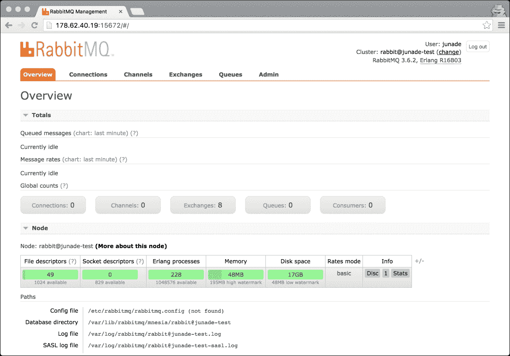

这是 RabbitMQ 服务的 Web 界面，可通过我们的 Web 浏览器访问

现在我们可以测试我们安装的东西。让我们首先为这个新项目编写一个`composer.json`文件：

```php
{ 
  "require": { 
    "php-amqplib/php-amqplib": "2.5.*" 
  } 
} 

```

RabbitMQ 使用**高级消息队列协议**（**AMQP**），这就是为什么我们正在安装一个 PHP 库，它基本上将帮助我们通过这个协议与它进行通信。

接下来，我们可以编写一些代码来使用我们刚刚安装的 RabbitMQ 消息代理发送消息：

这假设端口是`5672`，安装在`localhost`上，这可能会根据您的情况而改变。

让我们写一个小的 PHP 脚本来利用这个：

```php
<?php 

require_once(__DIR__ . '/vendor/autoload.php'); 
use PhpAmqpLib\Connection\AMQPStreamConnection; 
use PhpAmqpLib\Message\AMQPMessage; 

$connection = new AMQPStreamConnection('localhost', 5672, 'junade', 'insecurepassword'); 
$channel    = $connection->channel(); 

$channel->queue_declare( 
  'sayHello',     // queue name 
  false,          // passive 
  true,           // durable 
  false,          // exclusive 
  false           // autodelete 
); 

$msg = new AMQPMessage("Hello world!"); 

$channel->basic_publish( 
  $msg,           // message 
  '',             // exchange 
  'sayHello'      // routing key 
); 

$channel->close(); 
$connection->close(); 

echo "Sent hello world message." . PHP_EOL; 

```

所以让我们来详细分析一下。在前几行中，我们只是从 Composer 的`autoload`中包含库，并且`state`了我们要使用的命名空间。当我们实例化`AMQPStreamConnection`对象时，我们实际上连接到了消息代理；然后我们可以创建一个新的通道对象，然后用它来声明一个新的队列。我们通过调用`queue_declare`消息来声明一个队列。持久选项允许消息在 RabbitMQ 重新启动时存活。最后，我们只需发送出我们的消息。

现在让我们运行这个脚本：

```php
**php send.php**

```

这个输出看起来像这样：

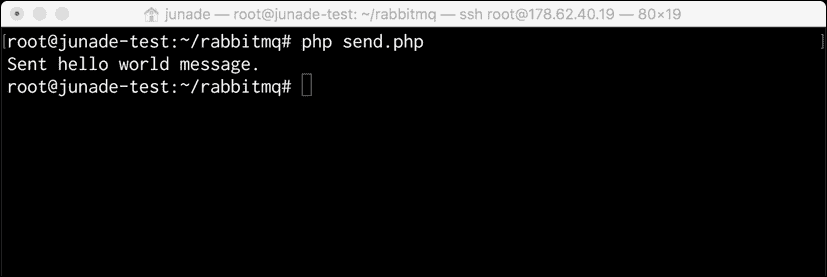

如果现在转到 RabbitMQ 的 Web 界面，点击队列选项卡并切换到获取消息对话框；您应该能够拉取我们刚刚发送到代理的消息：

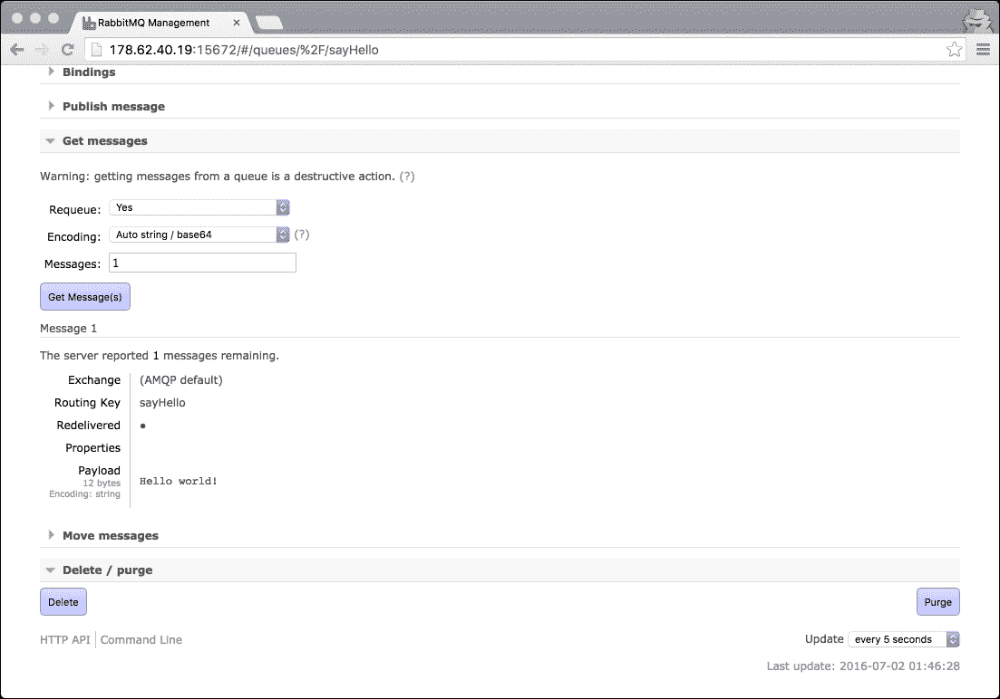

在界面中使用这个网页，我们可以从队列中提取消息，这样我们就可以查看它们的内容

当然，这只是故事的一半。我们现在需要使用另一个应用程序实际检索这条消息。

让我们写一个`receive.php`脚本：

```php
<?php 

require_once(__DIR__ . '/vendor/autoload.php'); 
use PhpAmqpLib\Connection\AMQPStreamConnection; 
use PhpAmqpLib\Message\AMQPMessage; 

$connection = new AMQPStreamConnection('localhost', 5672, 'junade', 'insecurepassword'); 
$channel    = $connection->channel(); 

$channel->queue_declare( 
  'sayHello',     // queue name 
  false,          // passive 
  false,          // durable 
  false,          // exclusive 
  false           // autodelete 
); 

$callback = function ($msg) { 
  echo "Received: " . $msg->body . PHP_EOL; 
}; 

$channel->basic_consume( 
  'sayHello',                     // queue 
  '',                             // consumer tag 
  false,                          // no local 
  true,                           // no ack 
  false,                          // exclusive 
  false,                          // no wait 
  $callback                       // callback 
); 

while (count($channel->callbacks)) { 
  $channel->wait(); 
} 

```

请注意，前几行与我们的发送脚本是相同的；我们甚至重新声明队列，以防在运行`send.php`脚本之前运行此接收脚本。

让我们运行我们的`receive.php`脚本：


在另一个 bash 终端中，让我们运行`send.php`脚本几次：

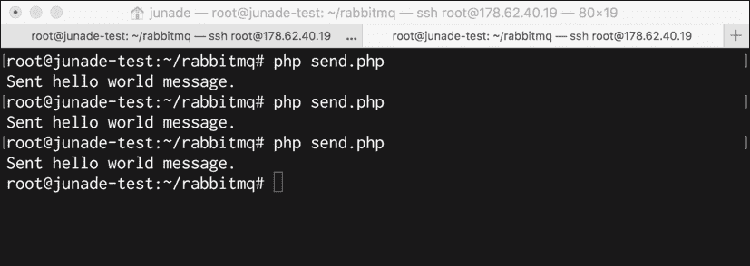

因此，在`receive.php`终端选项卡中，我们现在可以看到我们已经收到了我们发送的消息：


RabbitMQ 文档使用以下图表来描述消息的基本接受和转发：


## 发布-订阅模式

发布-订阅模式（或简称 Pub/Sub）是一种设计模式，其中消息不是直接从发布者发送到订阅者；相反，发布者在没有任何知识的情况下推送消息。

在 RabbitMQ 中，*生产者*从不直接发送任何消息到队列。生产者甚至经常不知道消息是否最终会进入队列。相反，生产者必须将消息发送到*交换机*。它从生产者那里接收消息，然后将它们推送到队列。

*消费者*是将接收消息的应用程序。

必须告诉交换机如何处理给定的消息，以及应该将其附加到哪个队列。这些规则由*交换类型*定义。

RabbitMQ 文档描述了发布-订阅关系（连接发布者、交换机、队列和消费者）如下：

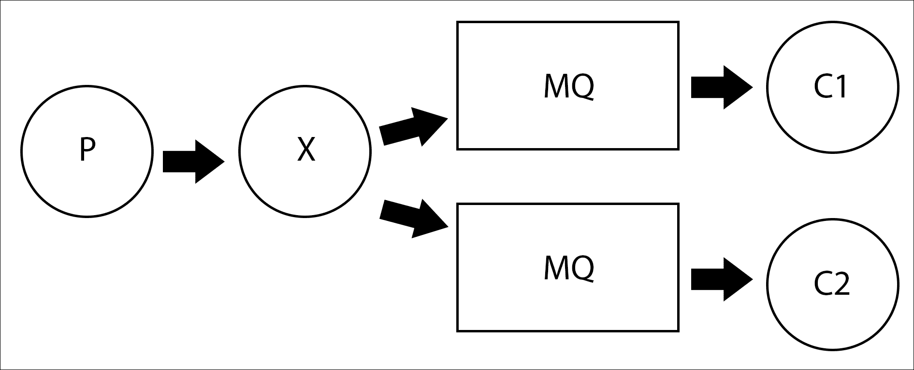

*直接*交换类型根据路由键传递消息。它可以用于一对一和一对多形式的路由，但最适合一对一的关系。

*扇出*交换类型将消息路由到绑定到它的所有队列，并且路由键完全被忽略。实际上，您无法区分消息将基于路由键分发到哪些工作者。

*主题* 交换类型通过根据消息路由队列和用于将队列绑定到交换的模式来将消息路由到一个或多个队列。当有多个消费者/应用程序想要选择他们想要接收的消息类型时，这种交换有潜力很好地工作，通常是多对多的关系。

*headers* 交换类型通常用于根据消息头中更好地表达的一组属性进行路由。与使用路由键不同，路由的属性基于头属性。

为了测试发布/订阅队列，我们将使用以下脚本。它们与之前的示例类似，只是我修改了它们以便它们使用交换。这是我们的 `send.php` 文件：

```php
<?php 

require_once(__DIR__ . '/vendor/autoload.php'); 
use PhpAmqpLib\Connection\AMQPStreamConnection; 
use PhpAmqpLib\Message\AMQPMessage; 

$connection = new AMQPStreamConnection('localhost', 5672, 'junade', 'insecurepassword'); 
$channel    = $connection->channel(); 

$channel->exchange_declare( 
  'helloHello',   // exchange 
  'fanout',       // exchange type 
  false,          // passive 
  false,          // durable 
  false           // auto-delete 
); 

$msg = new AMQPMessage("Hello world!"); 

$channel->basic_publish( 
  $msg,           // message 
  'helloHello'    // exchange 
); 

$channel->close(); 
$connection->close(); 

echo "Sent hello world message." . PHP_EOL; 

```

这是我们的 `receive.php` 文件。和之前一样，我修改了这个脚本，以便它也使用交换：

```php
<?php 

require_once(__DIR__ . '/vendor/autoload.php'); 
use PhpAmqpLib\Connection\AMQPStreamConnection; 
use PhpAmqpLib\Message\AMQPMessage; 

$connection = new AMQPStreamConnection('localhost', 5672, 'junade', 'insecurepassword'); 
$channel    = $connection->channel(); 

$channel->exchange_declare( 
  'helloHello',   // exchange 
  'fanout',       // exchange type 
  false,          // passive 
  false,          // durable 
  false           // auto-delete 
); 

$callback = function ($msg) { 
  echo "Received: " . $msg->body . PHP_EOL; 
}; 

list($queueName, ,) = $channel->queue_declare("", false, false, true, false); 

$channel->queue_bind($queueName, 'helloHello'); 

$channel->basic_consume($queueName, '', false, true, false, false, $callback); 

while (count($channel->callbacks)) { 
  $channel->wait(); 
} 

$channel->close(); 
$connection->close(); 

```

现在，让我们测试这些脚本。我们首先需要运行我们的 `receive.php` 脚本，然后我们可以使用我们的 `send.php` 脚本发送消息。

首先，让我们触发我们的 `receive.php` 脚本，以便它开始运行：

*发布-订阅模式* 图片

完成后，我们可以通过运行我们的 `send.php` 脚本来发送消息：

*发布-订阅模式* 图片

这将在运行 `receive.php` 的终端中填充以下信息：

*发布-订阅模式* 图片

# 总结

在本章中，我们学习了架构模式。从 MVC 开始，我们学习了使用 UI 框架的好处和挑战，并讨论了如何以更严格的方式将我们的 UI 与业务逻辑解耦。

然后，我们转向了 SOA，并学习了它与微服务的比较，以及在分布式系统提出挑战的情况下，这样的架构在哪些情况下是合理的。

最后，我们深入了解了队列系统，它们适用的情况以及如何在 RabbitMQ 中实现它们。

在接下来的章节中，我们将介绍架构模式的最佳实践使用条件。
