# 第八章：如何编写更好的代码

这是本书的最后一章。我们已经讨论了很多模式，但在本章中，我希望我们讨论一下如何应用这些模式。

我希望我们在这里讨论我们的代码如何相互配合的大局观，以及我们撰写优秀代码的关键要点。

除此之外，我想讨论模式在开发阶段适用于我们的应用程序的地方。

在本章中，我们将涵盖以下几点：

+   HTTP 请求的性质

+   RESTful API 设计

+   保持简单愚蠢

+   软件开发生命周期和工程实践

+   测试的重要性

+   对 BDD 的简要介绍

# HTTP 请求的性质

许多开发人员发现 HTTP 请求被抽象化了；事实上，许多 PHP 开发人员永远不需要了解 HTTP 请求在幕后实际是如何工作的。

PHP 开发人员在开发时经常与 HTTP 网络一起工作。事实上，PHP 包含一些核心功能，非常适合在处理 HTTP 通信时使用。

让我们使用一个名为**curl**的工具，从高层次上看一下 HTTP 请求。curl 本质上是一个命令行工具，允许我们模拟网络请求。它允许您使用各种协议模拟数据传输。

### 注意

* cURL *的名称最初代表*查看 URL*。

curl 项目同时产生`libcurl`和`curl`命令行工具。Libcurl 是 PHP 支持的库，允许您在 PHP 中连接和通信多种协议，前提是您的安装中已经安装了它。

然而，在这种情况下，我们将使用命令行工具来模拟请求。

让我们从对给定网站进行简单的`curl`请求开始，如下所示：

```php
**curl https://junade.com**

```

根据您在命令中查询的站点，您会注意到终端输出为空：


这里发生了什么？为了找出，我们需要深入挖掘一下。

您可以在`curl`命令中使用`-v`参数，以便查看正在进行的详细输出：

```php
**curl -v http://junade.com**

```

这个输出实际上是截然不同的：

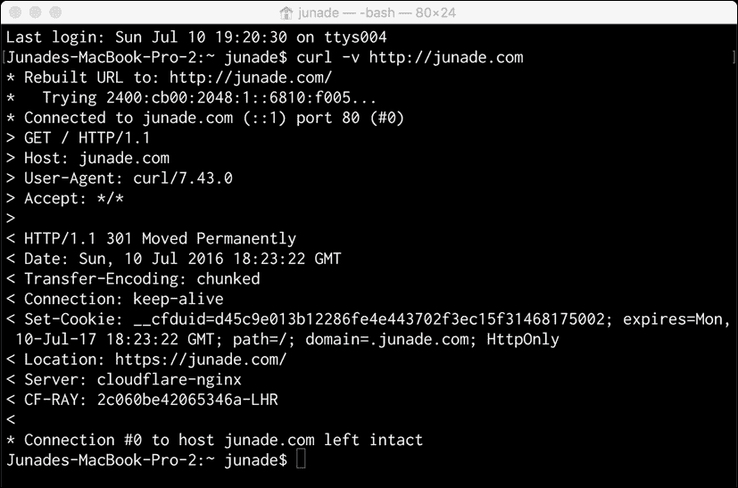

通过这个输出，我们可以看到发送的标头和接收的标头。

以星号`*`开头的块表示正在建立连接。我们可以看到 curl 如何重建 URL，使其正确（包含末尾的斜杠），然后解析服务器的 IP 地址（在我的情况下是 IPv6 地址），最后建立与 Web 服务器的连接：

```php
* Rebuilt URL to: http://junade.com/ 
*   Trying 2400:cb00:2048:1::6810:f005... 
* Connected to junade.com (::1) port 80 (#0) 

```

主机名通过查询 DNS 服务器转换为 IP 地址；我们稍后会更详细地讨论这一点。但在这一点上，重要的是要记住，在这一点之后，使用 IP 地址建立与服务器的连接。

如果我们去掉末尾的斜杠，我们实际上可以看到在第一行中，重建 URL 将消失，因为在我们发出请求之前，它已经以正确的格式存在：

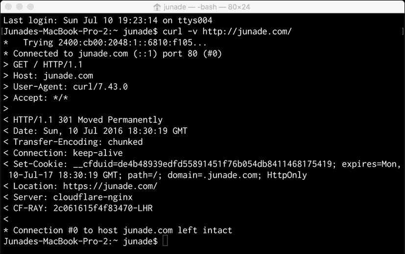

接下来让我们看看后续行中的星号。我们看到了大于号`>`中的出站标头。

这些标头看起来像这样：

```php
> GET / HTTP/1.1 
> Host: junade.com 
> User-Agent: curl/7.43.0 
> Accept: */* 
> 

```

因此，我们看到的第一条消息是请求方法`GET`，然后是端点`/`和协议`HTTP/1.1`。

接下来，我们看到了`Host`标头，它告诉我们服务器的域名，也可以包含服务器正在监听的 TCP 端口号，但如果端口是所请求服务的标准端口，则通常会被修改。但是，为什么需要这个呢？假设服务器包含许多虚拟主机；这实际上是允许服务器使用标头区分虚拟主机的内容。虚拟主机本质上允许服务器托管多个域名。为了做到这一点，我们需要这个标头；当服务器看到 HTTP 请求进来时，它们不会看到这个标头。

还记得我说过连接是使用 IP 地址建立的吗？这个`Host`头部允许我们通过发送主机名变量来指示 IP 地址是什么。

接下来，我们看到了`User-Agent`头部，指示客户端使用的浏览器；在这个请求中，我们的`User-Agent`头部表示我们正在使用 curl 命令发送我们的 HTTP 请求。记住不要相信来自客户端的任何 HTTP 头部，因为它们可以被操纵以包含恶意对手想要放入其中的任何数据。它们可以包含从伪造的浏览器标识符到 SQL 注入的一切。

最后，`Accept`头部指示了响应可接受的`Content-Type`头部。在这里，我们看到了通配符接受，表示我们愿意接收服务器发送给我们的任何内容。在其他情况下，我们可以使用`Accept: text/plain`来表示我们想要看到纯文本，或者`Accept:application/json`来表示 JSON。我们甚至可以通过使用`Accept: image/jpg`来指定是否要接收 JPG 图像。

还有各种参数也可以通过`Accept`头部发送；例如，我们可以使用`Accept: text/html; charset=UTF-8`来请求使用 UTF-8 字符集的 HTML。

在基本级别上，这个头部中允许的语法看起来像这样：

```php
top-level type name / subtype name [ ; parameters ] 

```

服务器可以使用响应中的`Content-Type`头部指示返回给用户的内容类型。因此，服务器可以向最终用户发送一个头部，如下所示：

```php
Content-Type: text/html; charset=utf-8 

```

关于响应的话题，让我们来看看响应。这些都是以<:为前缀的。

```php
< HTTP/1.1 301 Moved Permanently 
< Date: Sun, 10 Jul 2016 18:23:22 GMT 
< Transfer-Encoding: chunked 
< Connection: keep-alive 
< Set-Cookie: __cfduid=d45c9e013b12286fe4e443702f3ec15f31468175002; expires=Mon, 10-Jul-17 18:23:22 GMT; path=/; domain=.junade.com; HttpOnly 
< Location: https://junade.com/ 
< Server: cloudflare-nginx 
< CF-RAY: 2c060be42065346a-LHR 
< 

```

因此，我们在响应中首先得到的是格式和状态码。HTTP/1.1 表示我们正在接收一个`HTTP/1.1`响应，而`301 Moved Permanently`消息表示永久重定向。因此，我们还收到了一个`Location: https://junade.com/`头部，告诉我们接下来去哪里。

`Server`头部指示了提供我们请求的网络服务器的签名。它可以是 Apache 或 Nginx；在这种情况下，它是 CloudFlare 用于他们的网络的修改版本的 Nginx。

`Set-Cookie`头部用于指示浏览器应该设置哪些 cookie；这方面的标准在一份名为 RFC 6265 的文档中。

**RFC**代表**请求评论**；有许多类型的 RFC。标准跟踪 RFC 是那些打算成为互联网标准（STDs）的 RFC，而信息性 RFC 可以是任何东西。还有许多其他类型的 RFC，比如实验性的，最佳当前实践，历史性的，甚至是未知的 RFC 类型，用于那些如果今天发布的话状态不清楚的 RFC。

`Transfer-Encoding`头部指示了用于将实体传输给用户的编码，可以是任何东西，从分块甚至到像 gzip 这样的压缩实体。

有趣的是，2015 年 5 月发布的 RFC 7540 实际上允许头部压缩。如今，我们发送的头部数据比创建`HTTP/1`协议时原始传输的数据更多（原始的`HTTP`协议甚至没有`Host`头部！）。

`Connection`头部提供了连接的控制选项。它允许发送者指定当前连接所需的选项。最后，`Date`头部指示了消息发送的日期和时间。

考虑一下：一个 HTTP 请求/响应中是否可以包含多个相同名称的头部？

是的，这在一些头部中特别有用，比如`Link`头部。这个头部用于执行`HTTP/2`服务器推送；服务器推送允许服务器在被请求之前向客户端推送请求。每个头部可以指定一个资源；因此，需要多个头部来推送多个资源。

这是我们在 PHP 中可以做的事情。在 PHP 中，使用以下`header`函数调用：

```php
header("Link: <{$uri}>; rel=preload; as=image", false); 

```

虽然第一个参数是我们发送的实际标头的字符串，但第二个参数（`false`）表示我们不希望替换同样的先前标头，而是希望发送这个标头，但不替换它。通过将此标志设置为`true`，我们反而声明要覆盖先前的标头；如果根本没有指定标志，则这是默认选项。

最后，当请求关闭时，您将看到最终的星号，表示连接已关闭：

```php
* Connection #0 to host junade.com left intact 

```

通常，如果有主体，它将出现在主体下面。在此请求中，由于只是重定向，所以没有主体。

现在，我将使用以下命令向`Location`标头指向的位置发出`curl`请求：

```php
**curl -v https://junade.com/**

```

您现在会注意到，连接关闭消息出现在 HTML 主体结束后：

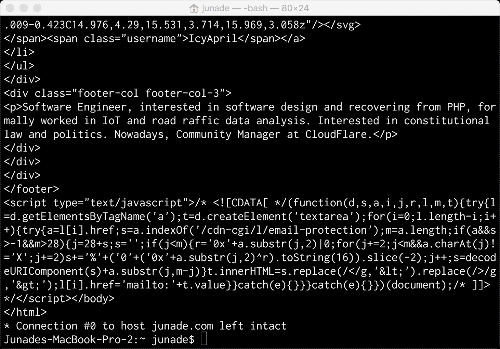

现在让我们尝试探索一些 HTTP 方法。在 REST API 中，您经常会使用`GET`、`POST`、`PUT`和`DELETE`；但首先，我们将先探索另外两种方法，`HEAD`和`OPTIONS`。

`HTTP OPTIONS`请求详细说明了您可以在给定端点上使用哪些请求方法。它提供了有关特定端点可用的通信选项的信息。

让我演示一下。我将使用一个名为`HTTPBin`的服务，它允许我通过 curl 向真实服务器发出请求并获得一些响应。

这是我使用 curl 发出的`OPTIONS`请求：

```php
**curl -v -X OPTIONS https://httpbin.org/get** 

```

`-X`选项允许我们指定特定的 HTTP 请求类型，而不仅仅是默认的 curl。

让我们看看执行后的样子：

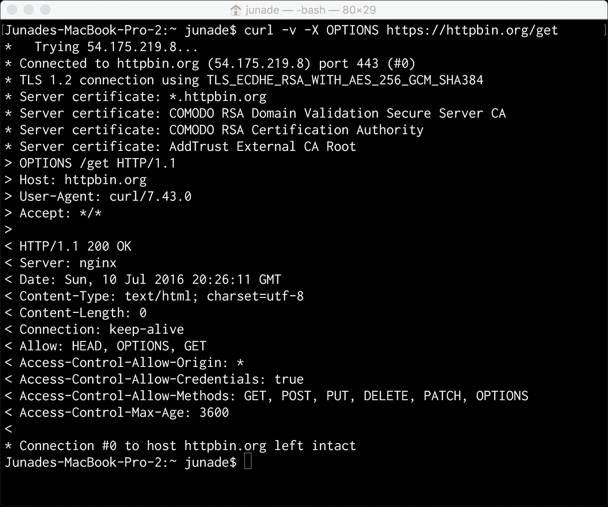

首先，您会注意到，由于请求是通过 HTTP 进行的，您将在星号中看到一些额外的信息；这些信息包含用于加密连接的 TLS 证书信息。

看看以下一行：

```php
TLS 1.2 connection using TLS_ECDHE_RSA_WITH_AES_256_GCM_SHA384 

```

`TLS 1.2`表示我们正在处理的传输层安全版本；第二部分，即`TLS_ECDHE_RSA_WITH_AES_256_GCM_SHA384`，表示连接的密码套件。

密码套件首先详细说明了我们正在处理的“TLS”。 ECDHE_RSA 表示密钥交换是使用椭圆曲线 Diffie-Hellman 完成的。密钥交换基本上允许安全地传输加密密钥。通过使用椭圆曲线密码学，可以共享特定的密钥，然后可以用于以后加密数据。 `ECDHE_RSA`表示我们使用椭圆曲线 Diffie-Hellman 来共享基于服务器获取的 RSA 密钥的密钥。还有许多其他密钥交换算法；例如，`ECDH_ECDSA`使用带有 ECDSA 签名证书的固定 ECDH。

以 access-control 为前缀的标头用于一种称为 CORS 的机制，它基本上允许 JavaScript 进行跨源 API 请求；让我们不在这里担心这个。

我们需要担心的`OPTIONS`请求的标头是`Allow`标头。这详细说明了我们被允许向特定端点提交哪些请求方法。

因此，这是我们查询`/get`端点时收到的请求：

```php
**< Allow: HEAD, OPTIONS, GET**

```

请注意，我在此处使用的端点使用了`/get`端点。相反，让我们使用以下`curl`请求向`/post`端点发出另一个`OPTIONS`请求：

```php
**curl -v -X OPTIONS https://httpbin.org/post**

```

这是我们收到的回复：

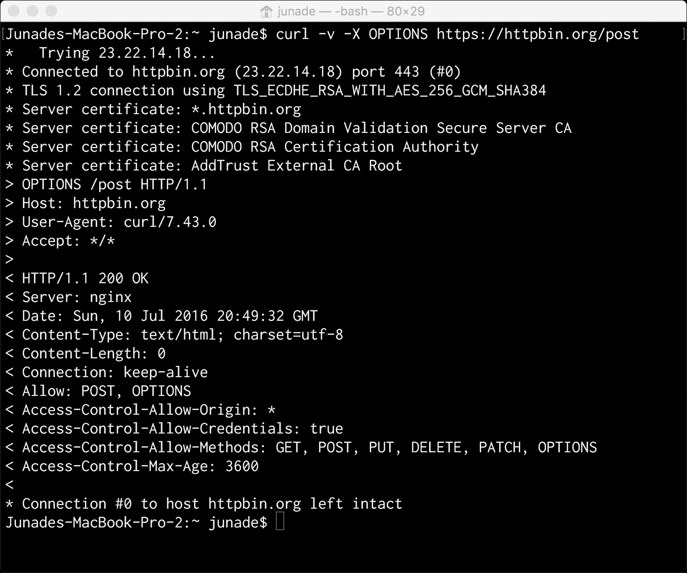

您会注意到，`Allow`标头现在包含`POST`和`OPTIONS`。还要注意，`HEAD`选项已经消失。

您很快会发现，`HEAD`请求与`GET`请求非常相似，只是没有消息主体。它仅返回 HTTP 请求的标头，而不是请求的主体。因此，它允许您获取有关实体的元信息，而无需获取完整的响应。

让我们向`/get`端点发出 HEAD 请求：

```php
**curl -I -X HEAD https://httpbin.org/get**

```

在这个请求中，我没有使用`-v`（冗长）选项，而是使用了`-I`选项，它只会获取`HTTP`头。这非常适合使用`HEAD`选项进行 HTTP 请求：

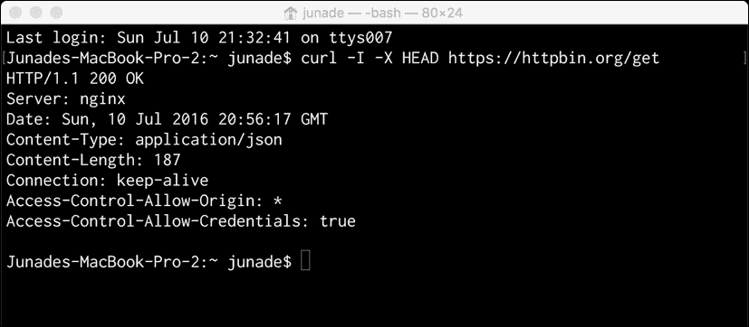

正如您所看到的，我们在`Content-Type`头部中得到了响应的类型。除此之外，您还将在`Content-Length`头部中得到请求的长度。长度以八位字节（8 位）来衡量；您可能认为这与字节相同，但在所有架构上，字节并不一定是 8 位。

还有许多其他头部可以发送以表达元信息。这可能包括标准头部或非标准头部，以表达您无法在标准化的 RFC 支持的头部中表达的其他信息。

**HTTP ETags**（实体标签）是一种提供缓存验证的机制。您可以在 RESTful API 的上下文中使用它们进行乐观并发控制；这基本上允许多个请求完成而无需相互干预。这是一个非常先进的 API 概念，所以我在这里不会详细介绍。

请注意，在我们的`HTTP HEAD`和`OPTIONS`请求中，我们都收到了`200 OK`头消息。`200`状态代码表示成功的 HTTP 请求。

有许多不同类型的状态代码。它们被分类如下：

+   **1xx 消息**：信息

+   **2xx 消息**：成功

+   **3xx 消息**：重定向

+   **4xx 消息**：客户端错误

+   **5xx 消息**：服务器错误

信息头可能是`101`响应，表示客户端正在切换协议，服务器已同意这样做。如果您正在开发 RESTful API，您可能不会遇到信息头消息；这些最有可能是由 Web 服务器发送的，这对于您作为开发人员来说是抽象的。

使用其他 HTTP 状态代码的正确方式对于正确开发 API 至关重要，特别是对于 RESTful API。

成功状态代码不仅限于`200 OK`消息；201 Created 表示已满足已创建新资源的请求。当使用`PUT`请求创建新资源或使用`POST`创建子资源时，这是特别有用的。`202 Accepted`表示已接受请求进行处理，但处理尚未完成，这在分布式系统中非常有用。`204 No Content`表示服务器已处理请求并且不返回任何信息；`205 Reset Content`头部也是如此，但要求请求者重置其文档视图。这只是一些 200 的消息；显然还有许多其他消息。

重定向消息包括`301 Moved Permanently`，这是我们在第一个`curl`示例中展示的，而`302 Found`可以用于更临时的重定向。同样，还有其他消息代码。

客户端错误代码包括臭名昭著的`404 Not Found`消息，当找不到资源时。除此之外，我们还有`401 Unauthorized`，表示需要身份验证但未提供，`403 Forbidden`表示服务器拒绝响应请求（例如，权限不正确）。`405 Method Not Allowed`允许我们基于使用无效请求方法提交请求来拒绝请求，这对于 RESTful API 非常有用。`405 Not Acceptable`是一个响应，其中服务器无法根据发送给它的`Accept`头部生成响应。同样，还有许多其他 4xx 的 HTTP 代码。

### 注意

HTTP 代码 451 表示由于法律原因请求不可用。选择的代码是*华氏 451 度*，一部以 451 华氏度为书名的小说，作者声称 451 华氏度是纸张的自燃温度。

最后，`服务器错误`允许服务器指示他们未能满足明显有效的请求。这些消息包括`500 Internal Server Error`，这是在遇到意外条件时给出的通用错误消息。

现在让我们来看一下如何进行`GET`请求。默认情况下，`curl`会发出一个`GET`请求，如果我们没有指定要发送的数据或特定的方法：

```php
**curl -v https://httpbin.org/get**

```

我们也可以指定我们想要一个`GET`请求：

```php
**curl -v -X GET https://httpbin.org/get**

```

这个输出如下：

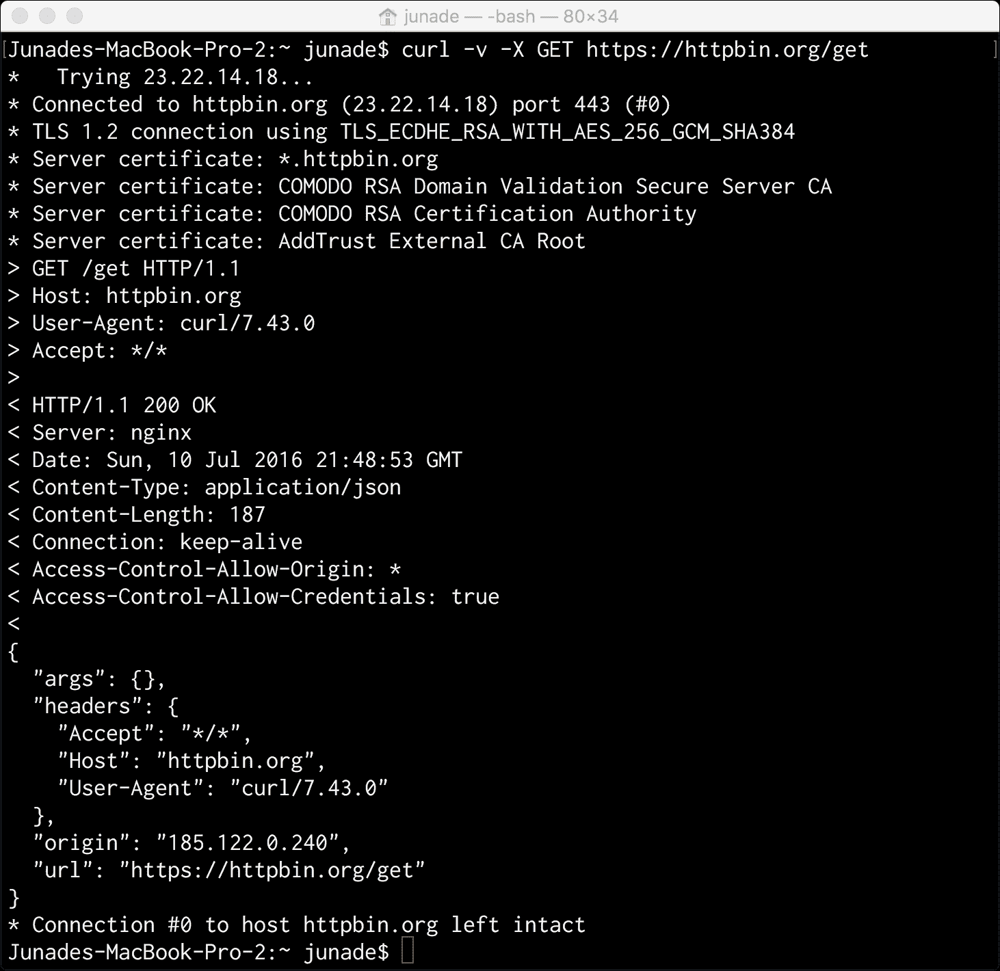

在这里，你可以看到我们得到了与`HEAD`请求中相同的标头，另外还有一个主体；一些 JSON 数据，无论我们试图访问的资源是什么。

在这里我们得到了一个`200 Success`的消息，但让我们向一个不存在的端点发出 HTTP 请求，这样我们就可以触发一个 404 消息：

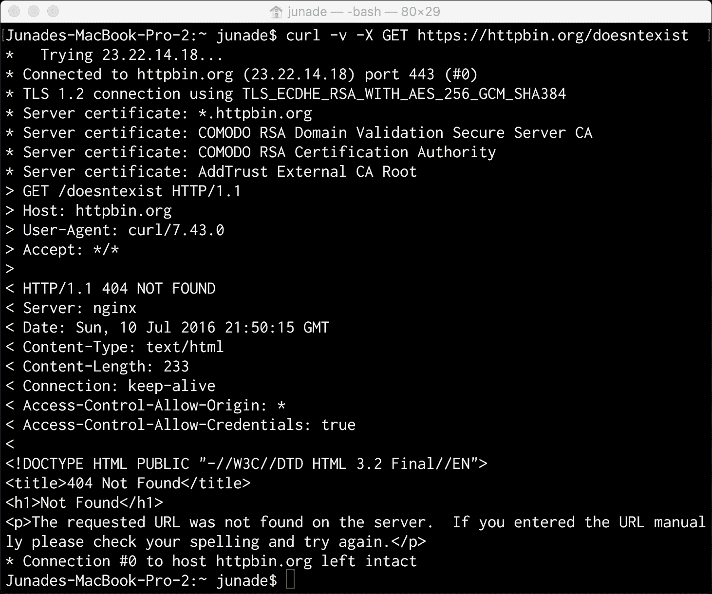

正如你所看到的，我们得到了一个标头，上面写着`404 NOT FOUND`，而不是我们通常的`200 OK`消息。

`HTTP 404`响应也可以没有主体：

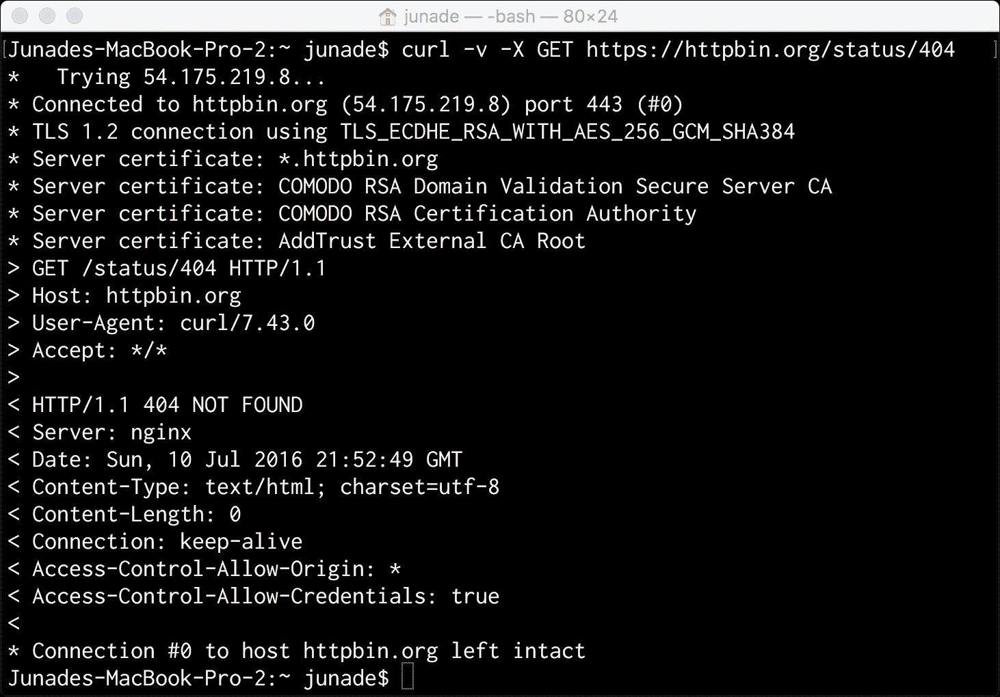

虽然`GET`请求只是显示一个现有的资源，`POST`请求允许我们修改和更新一个资源。相反，`PUT`请求允许我们创建一个新资源或覆盖一个资源，但是特定于给定的端点。

有什么区别？`PUT`是幂等的，而`POST`不是幂等的。`PUT`就像设置一个变量，`$x = 3`。你可以一遍又一遍地做，但输出是一样的，`$x`是`3`。

`POST`就像运行`$x++`一样；它会引起一个不是幂等的变化，就像`$x++`不能一遍又一遍地重复以得到完全相同的变量一样。`POST`更新一个资源，添加一个辅助资源，或者引起一个变化。当你知道要创建的 URL 时，就会使用`PUT`。

当你知道创建资源的工厂的 URL 时，可以使用`POST`来创建。

因此，例如，如果端点/用户想要生成一个具有唯一 ID 的用户帐户，我们将使用这个：

```php
**POST /user**

```

但是，如果我们想要在特定的端点创建一个用户帐户，我们将使用`PUT`：

```php
**PUT /user/tom**

```

同样，如果我们想要在给定的端点上覆盖`tom`，我们可以在那里放置另一个`PUT`请求：

```php
**PUT /user/tom**

```

但假设我们不知道 Tom 的端点；相反，我们只想向一个带有用户 ID 参数的端点发送`PUT`请求，并且一些信息将被更新：

```php
**POST /user**

```

希望这是有意义的！

现在让我们来看一个给定的`HTTP POST`请求。

我们可以使用 URL 编码的数据创建一个请求：

```php
**curl --data "user=tom&manager=bob" https://httpbin.org/post**

```

请注意，如果我们在`curl`中指定了数据但没有指定请求类型，它将默认为`POST`。

如果我们执行这个，你会看到`Content-Type`是`x-www-form-urlencoded`：

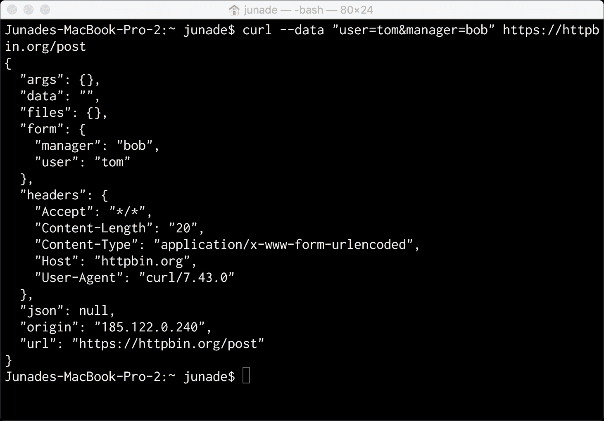

然而，如果 API 允许我们并接受这种格式，我们也可以向端点提交 JSON 数据：

```php
**curl -H "Content-Type: application/json" -X POST -d '{"user":"tom","manager":"bob"}' https://httpbin.org/post**

```

这提供了以下输出，注意`Content-Type`现在是 JSON，而不是之前的`x-www-form-urlencoded`表单：

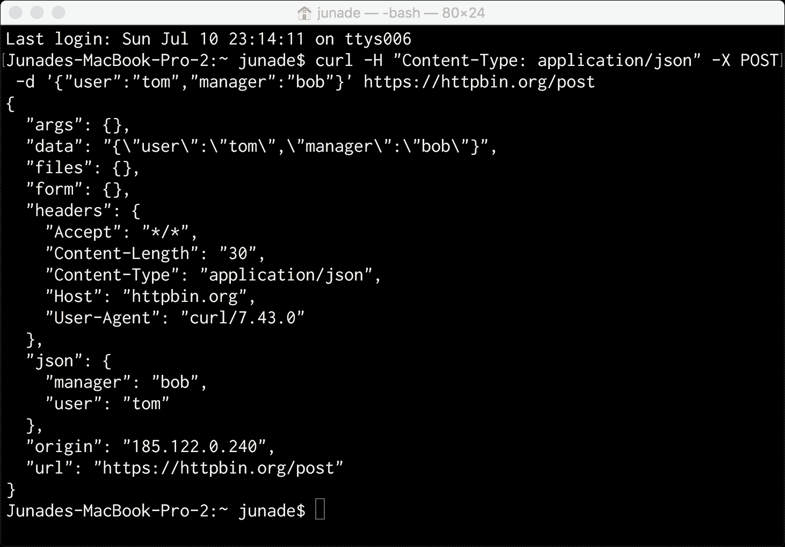

现在我们可以通过向`/put`端点发送相同的数据来进行`PUT`的 HTTP 请求：

```php
**curl -H "Content-Type: application/json" -X PUT -d '{"user":"tom","manager":"bob"}' https://httpbin.org/put**

```

让我们把请求类型改成`PUT`：

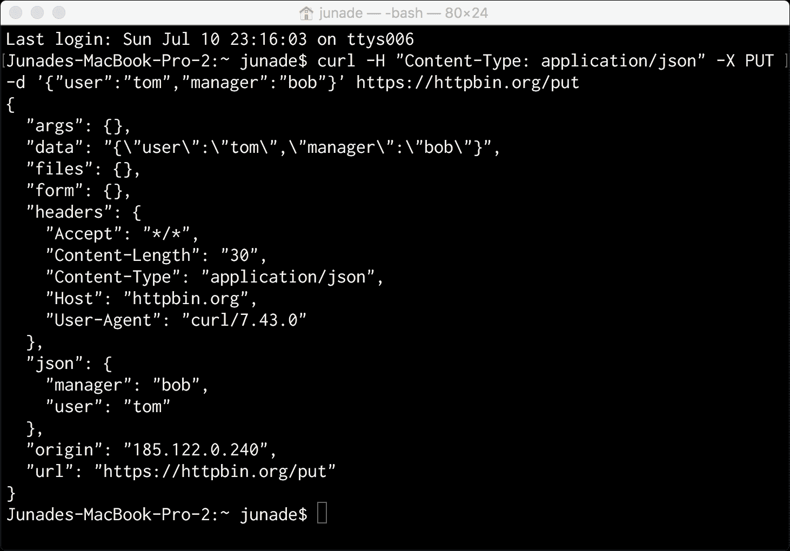

让我们使用以下`curl`请求向`DELETE`端点发送相同的请求（在这个例子中，我们将提交数据）：

```php
**curl -H "Content-Type: application/json" -X DELETE -d '{"user":"tom"}' https://httpbin.org/delete**

```

这有以下输出：

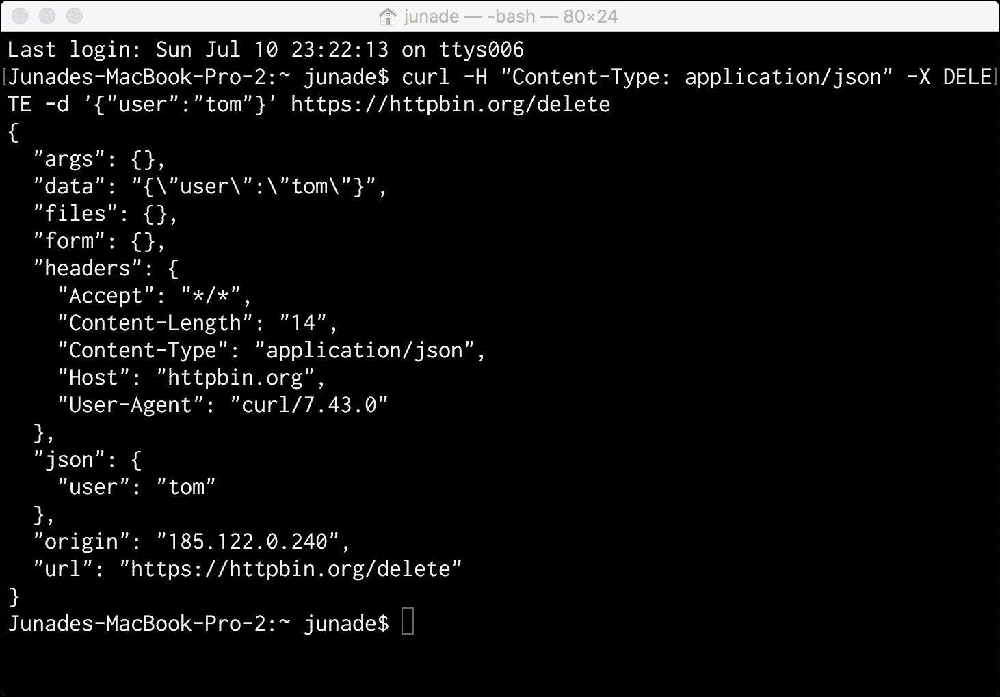

在现实世界中，你可能并不一定需要提交与我们刚刚删除一个资源相关的任何信息（这就是`DELETE`的作用）。相反，我们可能只想提交一个`204 No Content`消息。通常，我不会传回消息。

`HTTP/2`在高层次上维护了这个请求结构。请记住，大多数`HTTP/2`实现都需要 TLS（`h2`），而大多数浏览器不支持明文传输的`HTTP/2`（`h2c`），尽管在 RFC 标准中实际上是可能的。如果使用`HTTP/2`，你实际上需要在请求上使用 TLS 加密。

哇！这真是一大堆，但这就是你需要了解的关于 HTTP 请求的一切，从一个非常高的层次来看。我们没有深入网络细节，但这种理解对于 API 架构是必要的。

现在我们对 HTTP 请求和 HTTP 通信中使用的方法有了很好的理解，我们可以继续了解什么使 API 成为 RESTful。

# RESTful API 设计

许多开发人员在不了解何为 RESTful 的情况下使用和构建 REST API。那么*REpresentational State Transfer*到底是什么？此外，为什么 API 是*RESTful*很重要？

API 成为 RESTful 的一些关键架构约束，其中第一个是其无状态性质。

## 无状态性质

RESTful API 是无状态的；客户端的上下文在请求之间不会存储在服务器上。

假设您创建了一个具有登录功能的基本 PHP 应用程序。在验证放入登录表单的用户凭据之后，您可以使用会话来存储已登录用户的状态，因为他们继续进行下一个状态以执行下一个任务。

这在 REST API 中是不可接受的；REST 是一种无状态协议。REST 中的*ST*代表*State Transfer*；请求的状态应该被传输而不仅仅存储在服务器上。通过传输会话而不是存储它们，您可以避免具有*粘性会话*或*会话亲和性*。

为了很好地实现这一点，HTTP 请求在完全隔离的情况下发生。服务器需要执行`GET`，`POST`，`PUT`或`DELETE`请求的所有内容都在 HTTP 请求本身中。服务器从不依赖于先前请求的信息。

这样做的好处是什么？首先，它的扩展性更好；最明显的好处是您根本不需要在服务器上存储会话。这还带来了额外的功能，当您将 API Web 服务器放在负载均衡器后面时。

集群是困难的；使用状态对 Web 服务器进行集群意味着您需要具有粘性负载平衡，或者在会话方面需要具有共同的存储。

## 版本控制

对 API 进行版本控制，您需要进行更改，而不希望它们破坏客户端的实现。这可以通过标头或 URL 本身来完成。例如，可以使用`/api/resource.json`而不是`/api/v1/resource.json`这样的版本标签。

您还可以实现`HTTP Accept`标头来执行此行为，甚至可以设置自己的标头。客户端可以发送一个带有`API-Version`标头设置为`2`的请求，服务器将知道使用 API 的第 2 个版本与客户端进行通信。

## 过滤

使用参数查询，我们可以使用参数来过滤给定的内容。如果我们在`/orders`端点上处理订单系统，那么实现基本过滤就相当容易。

在这里，我们使用`state`参数来过滤未完成的订单：

```php
**GET /orders?state=open**

```

## 排序

我们还可以添加一个`sort`参数来按字段排序。`sort`字段反过来包含一个逗号分隔的列列表，以便进行排序；列表中的第一个是最高的排序优先级。为了进行负排序，您可以在列前加上负号`-`

+   `GET /tickets?sort=-amount`：按金额降序排序订单（最高优先）。

+   `GET /tickets?sort=-amount,created_at`：按金额降序排序订单（最高优先）。在这些金额中（具有相同金额的订单），较早的订单首先列出。

## 搜索

然后，我们可以使用一个简单的参数进行搜索查询，然后可以通过搜索服务（例如 ElasticSearch）路由该查询。

假设我们想要搜索包含“refund”短语的订单，我们可以为搜索查询定义一个字段：

```php
**GET /orders?q=refund**

```

## 限制字段

此外，使用`fields`参数，我们可以查询特定字段：

```php
**GET /orders?fields=amount,created_at,customer_name,shipping_address**

```

## 返回新字段

PUT，POST 或 PATCH 可以更改我们更新的字段以外的其他条件。这可能是新的时间戳或新生成的 ID。因此，我们应该在更新时返回新的资源表示。

在创建资源的`POST`请求中，您可以发送一个`HTTP 201 CREATED`的消息，以及一个指向该资源的`Location`头。

# 当有疑问时-保持简单

**KISS**是**保持简单，愚蠢**的缩写。

KISS 原则指出，大多数系统最好保持简单而不是复杂。在整个编程过程中，牢记这一原则至关重要。

决定使用一些预定义的设计模式来编写程序通常是一个不好的主意。代码永远不应该被强制进入模式中。虽然为设计模式编写代码可能对于“Hello World”演示模式有效，但通常情况下效果并不好。

设计模式存在是为了解决代码中常见的重复问题。重要的是它们被用来解决问题，而不是在没有这样的问题存在的地方实施。通过尽可能简化代码并减少整个程序的复杂性，您可以减少失败的机会。

英国计算机协会发布了一份名为《IT 项目高级管理》的建议，表明项目、人员、利益、复杂性和进展都必须得到充分理解；除此之外，项目的全面理解也是至关重要的。为什么要完成这个项目？有哪些风险？如果项目出现偏离，有什么恢复机制？

复杂系统必须能够优雅地处理错误才能够健壮。冗余必须与复杂性平衡。

# 软件开发生命周期

这张图表是一个开源图表，描述了软件开发的步骤：

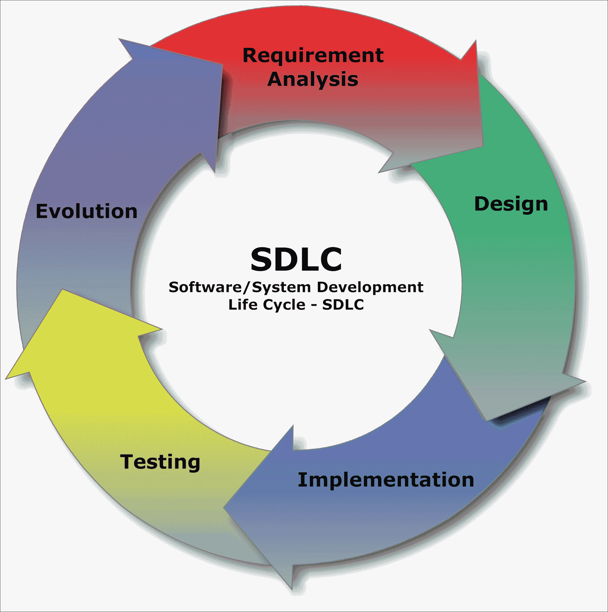

有许多不同类型的软件生产流程，但所有流程都必须包含图表中显示的步骤，因为它们对软件工程流程至关重要。

虽然现在几乎普遍认为瀑布式软件工程方法已不再适用，但替代它的敏捷方法仍需要一些设计（尽管规模较小且更迭代），以及强大的测试实践。

重要的是，软件开发不应该被视为显微镜下的东西，而应该在软件工程的更广泛视野中看待。

# 关于 Scrum 和真正的敏捷

Scrum 是一种迭代的软件开发框架，它声称是敏捷的，基于 Scrum 联盟发布的流程。它的图表如下：

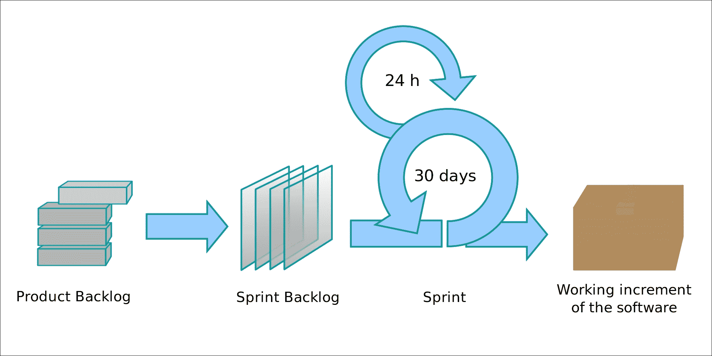

我们许多人看到了认证 Scrum 大师在软件开发团队中留下的灾难，他们大多将敏捷作为一个噱头，提供一些简直愚蠢的软件编写流程。

敏捷宣言以“个体和互动优于流程和工具”开始。Scrum 是一个流程，而且是一个严格定义的流程。Scrum 经常以开发过程凸显于团队的方式实施。如果这一部分有一个要点，那就是记住“人胜于流程”这个短语。如果你选择实施 Scrum，你必须愿意适应和改变其流程以应对变化。

敏捷的整个意义在于灵活；我们希望能够迅速适应不断变化的需求。我们需要灵活性，不希望受到严格定义的流程的限制，这会阻碍我们迅速适应不断变化的需求。

填写时间表、采购订单和处理官僚治理流程并不能帮助将软件交到客户手中，因此如果不能交付，就必须尽量简化。

时间表是完全浪费的完美想法。它们只是用来监控开发人员的表现，尽管在一些管理层中，他们会假装它们有一些神奇的敏捷好处。无论如何，它们肯定不会帮助你做出更好的软件估算；敏捷环境应该寻求使用预测而不是预测。

我见过一些 Scrum Master 不断重复这句话：“没有一个战斗计划能在与敌人接触后生存下来”；同时又强制执行严格的预测方案。

在现实世界中，准确的预测是个矛盾。你无法对不确定的事情进行准确预测，而且在几乎所有情况下，开发人员都不会充分了解他们正在处理的系统。此外，他们也不知道自己的个人效率从一天到另一天的变化；这是无法准确预测的。

我甚至遇到过这样的环境，严格的预测（通常甚至不是由开发人员自己制定的）是通过严格的纪律程序强制执行的。

通过将问题分解并以小块的方式解决问题来减少复杂性是很好的做法；将庞大的程序员团队分成小团队也是很好的做法。

在这些小团队（通常被称为*部落*）中开发的系统之间，通常需要系统架构师来确保团队之间保持一致性。

Spotify 使用部落架构来开发软件；事实上，我强烈建议阅读 Henrik Kniberg 和 Anders Ivarsson 的论文*Scaling Agile @ Spotify with Tribes, Squads*, *Chapters & Guilds*。

这位系统架构师确保所有构建的不同服务之间保持一致性。

转向具体的 Scrum，Scrum 是一种敏捷流程。Scrum 指南（是的，它甚至是一个商标）在一份 16 页的文件中定义了 Scrum 的规则。

敏捷方法包含许多不同的流程以及许多其他方法论；敏捷是一个非常广泛的知识库。

Scrum Master 喜欢假装敏捷发生在开发团队的孤立环境中。这与事实相去甚远；整个组织结构都影响 Scrum。

**极限编程**（**XP**）是一个非常广泛的流程，人们在很大程度上理解这些流程之间的互动。通过挑选这些流程，你最终得到的是一个无效的流程；这就是为什么 Scrum 会遇到困难。

需求会变化；这包括它们在 Sprint 进行中发生变化。当 Scrum Master 坚持在 Sprint 开始后不进行任何更改时，这会使团队更无法有效地应对真正的变化。

在敏捷机制中开发时，我们必须记住我们的软件必须足够弹性以应对不断变化的需求（导致软件设计不断变化）。你的软件架构必须能够应对变化的压力。因此，开发人员也必须理解并参与到实现足够弹性的软件所需的技术流程中。

不能灵活应对变化的公司比能够灵活应对变化的公司效率低；因此，他们在商业世界中具有重要优势。在选择公司时，它们的敏捷性不仅仅关乎你的工作质量，也关乎你的工作安全。

我的观点很简单；在实施流程时要认真对待技术实践，并且不要盲目遵循荒谬的流程，因为这可能会损害整个业务。

开发人员不应该被像孩子一样对待。如果他们不能编码或者编写糟糕的代码，他们就不能继续作为开发人员被雇佣。

实质上，为了管理风险，最好查看你的积压工作并利用历史进展来创建关于项目进展的预测。经理的角色应该是消除阻碍开发人员工作的障碍。

最后，如果你在一个 Scrum Master 对软件开发（甚至对敏捷）理解很差的团队中，要坚决提醒他们，人必须高于流程，真正的敏捷性是由能够经受变化压力的代码所支持的。

Scrum Master 有时会争辩说敏捷意味着没有预先设计。这是不正确的，敏捷意味着没有*大量*的预先设计。

# 有时候你需要解雇人

我曾在开发环境中工作过，那里的经理们太害怕解雇员工，要么就是通过对开发人员进行惩罚来折磨他们，因为他们显然无法胜任工作，要么就是让他们在开发过程中肆意破坏。

有才华的开发人员对糟糕的代码或不公平的技能基础感到失望。其他开发人员在被迫进行维护时，往往会陷入维护噩梦。面对维护噩梦的前景（或很可能是不断加剧的维护噩梦），他们会辞职。

另一方面，为了弥补糟糕的开发人员而施加的限制性工作条件会让有才华的开发人员感到失望。厌倦了被当作白痴对待（因为其他开发人员是白痴），他们会接受更好的公司提供的工作机会，那里有更好的职业前景，更好的工作环境和更快乐、更有才华的员工。他们接受这个工作机会，因为他们要去的公司很可能也有更好的业务前景和更好的补偿，同时还有更快乐的工程师和更好的工作环境。

在这种情况下还有一个更极端的情况；企业声誉受损，无法雇佣永久开发人员；他们会支付昂贵的合同开发人员费用，同时冒险使用他们的技能。在支付合同开发人员的费用时，企业可能会选择任何愿意参与这些项目的人。这些开发人员的面试官可能没有问对问题，导致对被雇佣的承包商的质量进行了大赌注。公司减少了雇佣优秀永久员工的机会，企业陷入了恶性循环，公司的衰落变得更加严重。我曾多次见到这种情况；每次公司都面临着缓慢而痛苦的衰退。如果你曾被邀请加入类似的公司，我强烈建议你寻找其他地方，除非你真的相信你能够为这样的组织带来改革。

如果你在这样的组织中担任管理工作，确保你有能力进行有意义的改变，有权雇用合适的人并解雇错误的人。如果没有，你在这样的组织中的任期只会是在试图转移责任，同时遭受高员工流失率的困扰。

有才华的员工是值得信任的；那些对自己的工作充满热情的人不需要限制来防止他们偷懒。

如果有才华的员工无法履行职责，那么你的开发人员很可能不只是懒惰；你需要消除对开发的限制性官僚流程。

强迫执行对将软件交付给用户没有任何价值的仪式是对开发团队没有任何帮助的。

# 精益项目管理

精益项目管理使您能够定期交付业务价值，而不是基于需求、功能和功能列表。

《改变世界的机器》一书是基于麻省理工学院对汽车工业进行的 500 万美元、5 年的研究，使精益生产这个术语世界闻名。

这本书提出了精益的以下原则：

+   确定客户并明确价值

+   确定和映射价值流

+   通过消除浪费来创造流程

+   响应客户需求

+   追求完美

基于这一点，软件开发的精益原则主要基于精益生产的制造原则：

+   消除浪费

+   加强学习

+   尽量晚做决定

+   尽快交付

+   激发团队的力量

+   建立完整性

+   看整体

通过可重用的组件、自动化部署和良好的架构，可以帮助实现这一目标。

# YAGNI 和推迟决策

*你不会需要它* - 你不需要添加功能，直到有必要。只添加对项目成功至关重要的东西。你可能不需要很多功能来完成你的 Web 应用的第一个版本；最好推迟到必要时再添加。

通过推迟不必要的功能，你可以保持软件设计尽可能简单。这有助于你应对变化的速度。在软件开发过程的后期，你将更加了解需求，更重要的是，你的客户将对他们想要产品发展的方向有更精确的预测。

当你在以后做软件决策时，你会有更多的数据和更多的教育。有些决策必须提前做出，但如果你能推迟它们，那通常是一个好主意。

# 监控

随着规模的扩大，监控系统变得至关重要。有效的监控可以极大地简化服务的维护。

在这一领域与多位专家交谈后，这是我收集到的建议：

+   小心选择你的关键统计数据。用户不在乎你的机器 CPU 是否低，但他们在乎你的 API 是否慢。

+   使用聚合器；考虑服务，而不是机器。如果你有超过几台机器，你应该将它们视为一个无定形的块。

+   避免图表墙。它们很慢，对人类来说信息过载。每个仪表板应该有五个图表，每个图表不超过五条线。

+   分位数不可聚合，很难得到有意义的信息。然而，平均数更容易理解。第一四分位的响应时间为 10 毫秒并不是真正有用的信息，但平均响应时间为 400 毫秒显示出一个明显的需要解决的问题。

+   此外，平均数比分位数更容易计算。它们在计算上很容易，并且在需要扩展监控系统时特别有用。

+   监控是有成本的。要考虑资源是否真的值得。1 秒的监控频率真的比 10 秒的监控更好吗？成本是否值得？监控不是免费的，它有计算成本。

+   也就是说，Nyquist-Shannon 采样定理表明，如果你每 20 秒采样一次，就无法重建 10 秒间隔的模式。假设有一个服务每 10 秒就崩溃或减慢你的计算机系统的速度-这是无法检测到的。在数据分析过程中要牢记这一点。

+   相关性不等于因果关系-小心确认偏见。在采取任何激烈行动之前，一定要确保建立起导致特定问题的正式关系。

+   日志和指标都很好。日志让你了解细节，指标让你了解高层次。

+   有一种方法来处理非关键警报。你在 Web 服务器日志文件中的所有 404 错误该怎么办？

+   记住之前提到的 KISS 原则；尽可能保持你的监控简单。

# 测试对抗遗留

自动化测试是对抗遗留代码的最佳工具。

通过拥有自动化测试，如单元测试或行为测试，你能够有信心有效地重构遗留代码，几乎不会破坏。

糟糕的系统通常由紧密耦合的函数组成。一个类中的函数的更改很可能会破坏完全不同类中的函数，导致更多类被破坏，直到整个应用程序被破坏。

为了解耦类并遵循单一职责原则等实践，必须进行重构。任何重构工作都必须确保不会破坏应用程序中的其他代码。

这就引出了测试覆盖率的话题：这是一个真正有意义的数字吗？

阿尔贝托·萨沃亚在 artima.com 上发布了一个有趣的轶事，最好地回答了这个问题；让我们来看一下：

> *清晨，一位程序员问大师：“我准备写一些单元测试。我应该追求什么代码覆盖率呢？”*
> 
> *大师回答道：“不要担心覆盖率，只是写一些好的测试。”*
> 
> *程序员微笑着鞠躬离开了。*
> 
> *...*
> 
> *当天晚些时候，第二位程序员问了同样的问题。大师指着一锅开水说：“我应该往锅里放多少粒米？”*
> 
> *程序员困惑地回答道：“我怎么可能告诉你呢？这取决于你需要喂多少人，他们有多饿，你还提供了什么其他食物，你有多少大米可用，等等。”*
> 
> *“没关系，”大师说。*
> 
> *第二位程序员微笑着鞠躬离开了。*
> 
> *...*
> 
> *一天结束时，第三位程序员也问了同样关于代码覆盖率的问题。*
> 
> *“80%以上，不可少！”大师用严厉的声音回答，一边拍着桌子。*
> 
> *第三位程序员微笑着鞠躬离开了。*
> 
> *...*
> 
> *在这之后，一位年轻的学徒走向了大师：*
> 
> *“大师，今天我听到您对同一个问题给出了三个不同的答案。为什么呢？”*
> 
> *大师站起来，说：“跟我一起喝杯新茶，我们谈谈这个问题。”*
> 
> *在他们的杯子里倒满了冒着热气的绿茶后，大师开始回答：“第一位程序员是新手，刚刚开始测试。现在他有很多代码但没有测试。他还有很长的路要走；此时专注于代码覆盖率会令人沮丧且毫无用处。他最好只是习惯写一些测试并运行。他以后可以担心覆盖率。”*
> 
> *“另一方面，第二位程序员在编程和测试方面都非常有经验。当我回答她应该往锅里放多少粒米时，我帮助她意识到测试的必要程度取决于许多因素，而她比我更了解这些因素——毕竟那是她的代码。没有单一简单的答案，她足够聪明去接受事实并与之共事。”*
> 
> *“我明白了，”年轻的学徒说，“但如果没有单一简单的答案，那您为什么对第三位程序员说‘80%以上’呢？”*
> 
> *大师笑得很大声，他的肚子上下翻动，这是他喝了不止绿茶的证据。*
> 
> *“第三位程序员只想要简单的答案——即使没有简单的答案……然后也不遵循。”*
> 
> *年轻的学徒和古老的大师在沉思的沉默中喝完了他们的茶。*

阿尔贝托传达了一个简单的信息：专注于拥有尽可能多的业务逻辑和功能是前进的最佳方式。测试覆盖率不是应该追求任意数字的东西。

有些东西是有道理不进行测试的，即使是已经经过测试的代码也有不同的逻辑路径。

此外，在分布式系统中，API 或系统之间的通信可能会破坏系统。在分布式架构中，仅仅测试代码可能是不够的。强大的监控系统变得至关重要。基础设施即代码可以确保一致的部署和升级。此外，实现松散耦合的服务和适当的进程间通信对整体架构更有益，而不是一些单元测试。

测试驱动开发（TDD）有一种替代方法。行为驱动开发（BDD）为我们提供了一种不同的测试代码的机制；让我们讨论一下。

# 行为驱动开发

BDD 通过使用人类可读的故事来实现测试。

黄瓜是一种工具，通过使用用简单英语语言编写的人类可读的特性文件来实现 BDD 工作流程，例如：

```php
Feature: Log in to site. 
  In order to see my profile 
    As a user 
    I need to log-in to the site. 

Scenario: Logs in to the site 
  Given I am on "/" 
  When I follow "Log In" 
    And I fill in "Username" with "admin" 
    And I fill in "Password" with "test" 
    And I press "Log in" 
  Then I should see "Log out" 
    And I should see "My account" 

```

现在，这一部分将是对 Behat 的非常简单的探索，以激发你的好奇心。如果你想了解更多，请访问[`www.behat.org`](http://www.behat.org)。

Behat 指南中包含了`ls`命令的用户故事的示例。这是一个相当体面的例子，所以在这里：

```php
Feature: ls 
  In order to see the directory structure 
  As a UNIX user 
  I need to be able to list the current directory's contents 

  Scenario: List 2 files in a directory 
    Given I am in a directory "test" 
    And I have a file named "foo" 
    And I have a file named "bar" 
    When I run "ls" 
    Then I should get: 
      """ 
      bar 
      foo 
      """ 

```

为了安装 Behat，你可以修改你的`composer.json`文件，以便在开发环境中需要它：

```php
{ 
  "require-dev": { 
    "behat/behat": "~2.5" 
  }, 
  "config": { 
    "bin-dir": "bin/" 
  } 
} 

```

这将安装 Behat 版本 2.5，还有 Behat 版本 3，其中包含了一整套新功能，而且没有失去太多向后兼容性。也就是说，很多项目仍在使用 Behat 2。

然后你可以使用以下命令运行 Behat：

```php
**bin/behat**

```

我们得到以下输出：

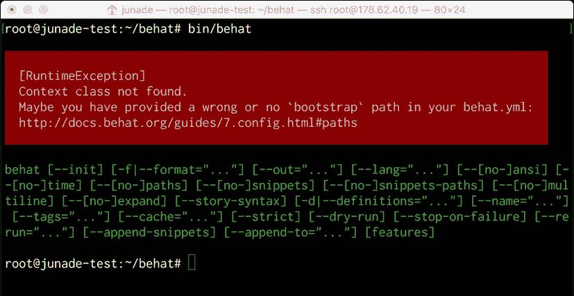

通过使用`init`标志，我们可以创建一个包含一些基本信息的特性目录，让我们开始：


因此，让我们编写我们的`feature/ls.feature`文件，包括以下功能和场景，如下所示：

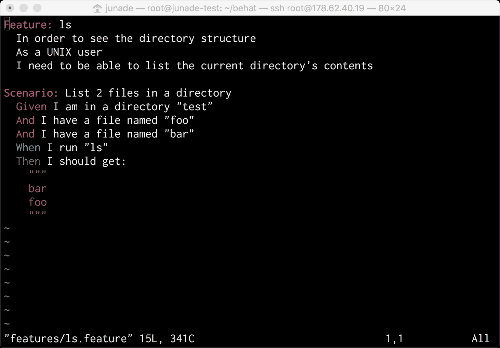

如果我们现在运行 Behat，我们会得到以下输出：

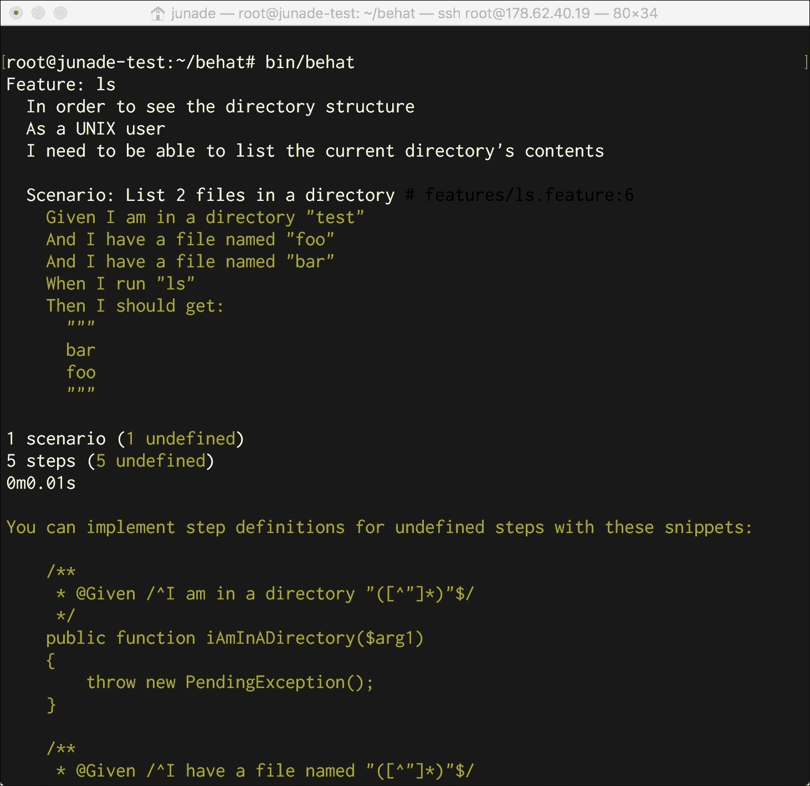

因此，Behat 返回一些代码片段，以便我们可以实现未定义的步骤：

```php
  /** 
   * @Given /^I am in a directory "([^"]*)"$/ 
   */ 
  public function iAmInADirectory($arg1) 
  { 
    throw new PendingException(); 
  } 

  /** 
   * @Given /^I have a file named "([^"]*)"$/ 
   */ 
  public function iHaveAFileNamed($arg1) 
  { 
    throw new PendingException(); 
  } 

  /** 
   * @When /^I run "([^"]*)"$/ 
   */ 
  public function iRun($arg1) 
  { 
    throw new PendingException(); 
  } 

  /** 
   * @Then /^I should get:$/ 
   */ 
  public function iShouldGet(PyStringNode $string) 
  { 
    throw new PendingException(); 
  } 

```

现在，在为我们创建的特性目录中有一个包含`FeatureContext.php`文件的引导文件夹。在这个文件中，你将能够找到你的类的主体：

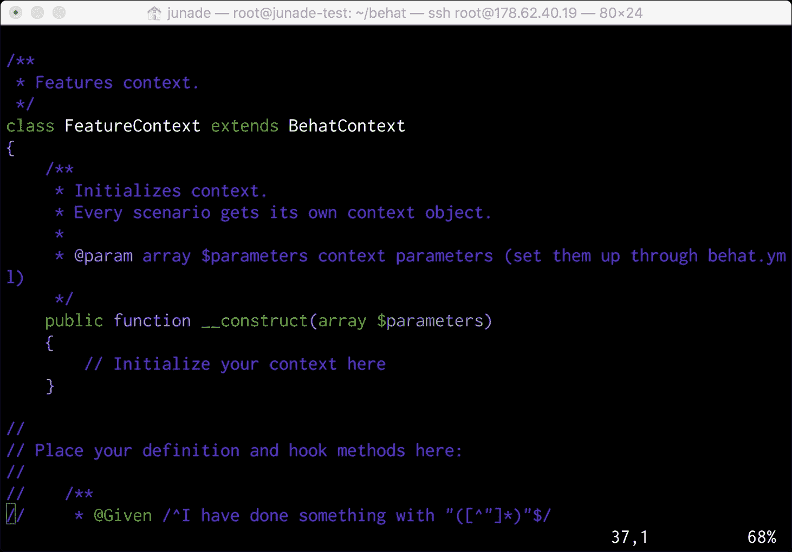

你可能已经注意到了类主体中的这个块。我们可以把生成的方法放在这里：

```php
// 
// Place your definition and hook methods here: 
// 
//  /** 
//   * @Given /^I have done something with "([^"]*)"$/ 
//   */ 
//  public function iHaveDoneSomethingWith($argument) 
//  { 
//    doSomethingWith($argument); 
//  } 
// 

```

我已经这样做了：

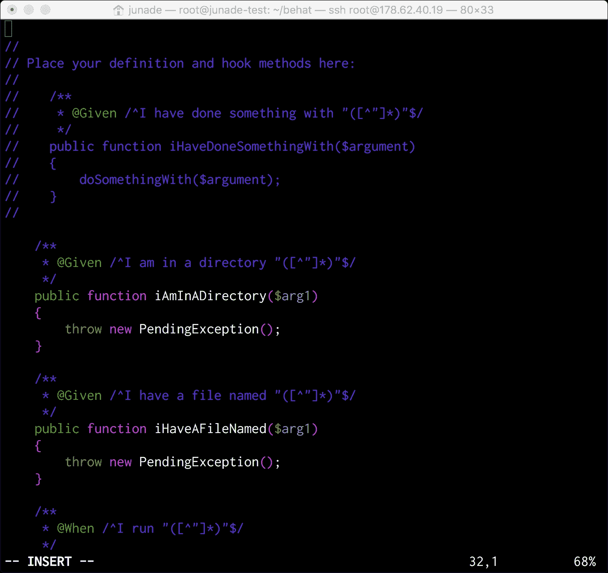

你可能会注意到代码中充满了`PendingException`消息。我们需要用实际的功能替换这些代码块；幸运的是，Behat 文档中包含了这些方法的函数：

```php
  /** @Given /^I am in a directory "([^"]*)"$/ */ 
  public function iAmInADirectory($dir) 
  { 
    if (!file_exists($dir)) { 
      mkdir($dir); 
    } 
    chdir($dir); 
  } 

  /** @Given /^I have a file named "([^"]*)"$/ */ 
  public function iHaveAFileNamed($file) 
  { 
    touch($file); 
  } 

  /** @When /^I run "([^"]*)"$/ */ 
  public function iRun($command) 
  { 
    exec($command, $output); 
    $this->output = trim(implode("\n", $output)); 
  } 

  /** @Then /^I should get:$/ */ 
  public function iShouldGet(PyStringNode $string) 
  { 
    if ((string) $string !== $this->output) { 
      throw new Exception( 
        "Actual output is:\n" . $this->output 
      ); 
    } 
  } 

```

现在我们可以运行 Behat，我们应该看到我们的场景及其各种步骤已经完成：

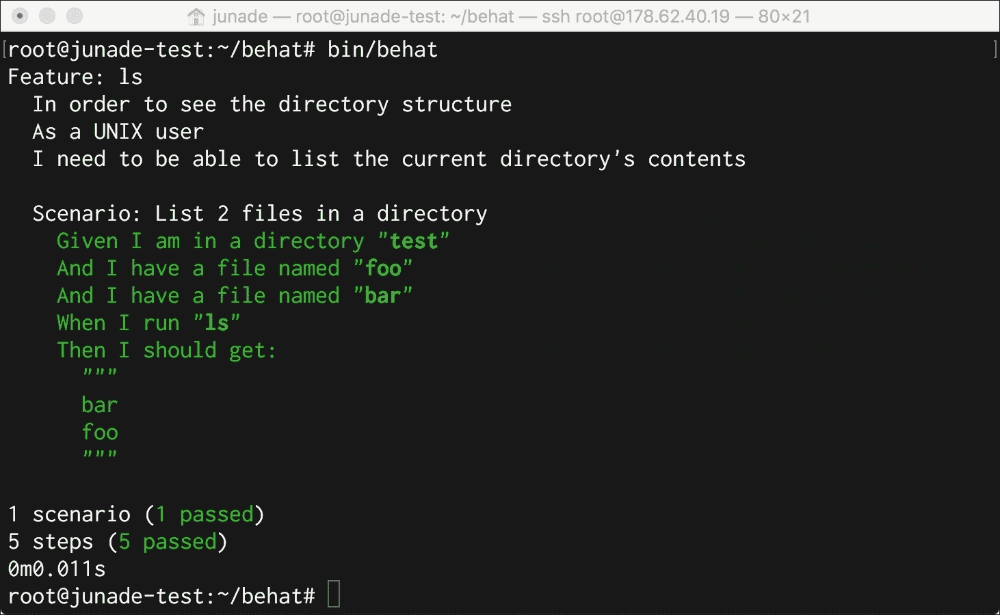

通过使用 Mink 和 Behat，我们能够相应地使用 Selenium 来运行浏览器测试。Selenium 将使用 Mink 启动浏览器，然后我们可以在浏览器中运行 Behat 测试。

# 总结

在这一章中，我试图解决一些问题。我们通过学习 HTTP 来讨论了一些网络开发的方面。除此之外，我们还学习了如何有效地设计 RESTful API。

这本书现在要结束了；让我们重新审视一些使我们的代码变得伟大的核心价值观：

+   优先使用组合而不是继承

+   避免重复编码（DRY 原则意味着不要重复自己）

+   保持简单，傻瓜

+   不要仅仅为了使用设计模式而使用设计模式，当你发现它们可以解决重复出现的问题时引入设计模式

+   抽象很棒，接口帮助你抽象

+   按照良好的标准编写代码

+   在你的代码中分离责任

+   使用依赖管理和依赖注入；Composer 现在可用

+   测试可以节省开发时间；它们对于任何重构工作都是至关重要的，并且可以减少故障

感谢你读完了这本书；这本书是我对软件开发的一系列抱怨；在经历了非常多样化的职业生涯后，我学到了很多教训，也不得不重构了很多令人眼花缭乱的代码。我见过一些最糟糕的，但也参与了一些最激动人心的 PHP 项目。我希望在这本书中能够分享一些我在这个领域的经验。

开发人员很容易把自己藏起来，远离开发的现实；很少有人知道在软件设计和架构方面的最佳实践，而且其中很少有人选择 PHP 作为他们的开发语言。

对于我们许多人来说，我们所创造的代码不仅仅是一种爱好或工作，它是我们作为软件工程师表达的极限。因此，以诗意、表达力和持久的方式编写代码是我们的责任。

想想你希望维护的代码；那就是你有责任创造的代码。极简主义、减少复杂性和分离关注点是实现这一目标的关键。

计算机科学可能根植于数学和定理，但我们的代码超越了这一点。通过利用图灵完备语言的基础，我们能够编写创造性和功能性的代码。

这使得软件工程处于与许多其他学科相比的奇特真空中；虽然它非常度量化，但也必须吸引人类。我希望这本书能帮助你实现这些目标。
