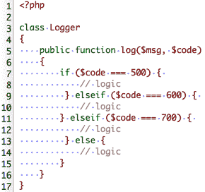
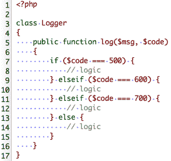

# 第二章：接受标准

每个行业都有自己的一套标准。无论是正式还是非正式，它们都规范着事物的做法。软件行业倾向于将标准规范化为文件，以确保产品和服务的质量和可靠性。它们进一步激发了兼容性和互操作性的过程，否则可能无法实现。

将代码放入产品的背景中，多年来出现了各种编码标准。它们的使用可以提高代码质量，减少我们代码库中的认知摩擦。代码质量是可持续软件开发的支柱之一，因此标准对于任何专业开发人员都非常重要，这并不奇怪。

在涉及 PHP 时，我们需要考虑几个层面的标准。有一些是特定于语言本身的编码标准，还有一些是特定于个别库、框架或平台的标准。虽然其中一些标准是相互兼容的，但有些时候它们会发生冲突。通常，这种冲突是关于一些小事情，比如将开放函数括号放在新行上还是保留在同一行上。在这种情况下，特定的库、框架和平台标准应优先于纯语言标准。

2009 年，在芝加哥的**php[tek]**会议上，许多开发人员联合起来成立了*PHP 标准组*。组织在`standards@lists.php.net`的邮件列表周围，最初的目标是建立适当的自动加载标准。自动加载对框架和平台开发人员来说是一个严峻的挑战。不同的开发人员在为其类文件命名时使用了不同的约定。这对互操作性产生了严重影响。**PHP 标准建议**，代号**PSR-0**，旨在通过概述必须遵循的自动加载器互操作性实践和约束来解决这个问题。在早期阶段，组织被 PHP 社区保留。他们还没有赢得社区的认可。两年后，该组织将自己改名为**框架互操作性组**，缩写为**PHP-FIG**。迄今为止，PHP-FIG 已经制定了几个 PSR，用每一个都重新确立了自己在开发人员中的地位。

PHP-FIG 及其 PSR 是由 PEAR 编码标准先于的，这在今天仍然相当占主导地位。它主要关注 PHP 语言本身的元素。这些元素涉及我们编写函数、变量、类等的方式。另一方面，PSR 主要关注互操作性方面。PHP-FIG 和 PEAR 在 PSR-1 和 PSR-2 的范围内交叉；这使开发人员现在可以自由遵循 PHP-FIG 组提供的一套标准。

在本章中，我们将详细了解当前发布和接受的 PSR 标准：

+   PSR-1 - 基本编码标准

+   PSR-2 - 编码风格指南

+   PSR-3 - 记录器接口

+   PSR-4 - 自动加载标准

+   PSR-6 - 缓存接口

+   PSR-7 - HTTP 消息接口

+   PSR-13 - 超媒体链接

在 PSR 中，广泛使用了**MUST**、**MUST NOT**、**REQUIRED**、**SHALL**、**SHALL NOT**、**SHOULD**、**SHOULD NOT**、**RECOMMENDED**、**MAY**和**OPTIONAL**等关键字。这些关键字的含义在 RFC 2119 ([`www.ietf.org/rfc/rfc2119.txt`](http://www.ietf.org/rfc/rfc2119.txt))中有更详细的描述。

# PSR-1 - 基本编码标准

PSR-1 是基本的编码标准。它概述了我们的代码应该遵循的规则，这是 PHP-FIG 成员的看法。标准本身非常简短。

*文件必须仅使用<?php 和<?=标签。* 一度，PHP 支持几种不同的标签（`<?php ?>`，`<? ?>`，`<?= ?>`，`<% %>`，`<%= %>`，`<script language="php"></script>`）。其中一些的使用取决于配置指令`short_open_tag`（`<? ?>`）和`asp_tags`（`<% %>`，`<%= %>`）。PHP 7 版本移除了 ASP 标签（`<%`，`<%=`），以及脚本标签（`<script language="php">`）。现在建议只使用`<?php ?>`和`<?= ?>`标签，以最大程度地提高兼容性。

*文件必须仅使用 UTF-8 而不带 BOM 的 PHP 代码。* **字节顺序标记**（**BOM**）是一个 Unicode 字符，U+FEFF 字节顺序标记（BOM），出现在文档的开头。正确使用时，BOM 是不可见的。HTML5 浏览器需要识别 UTF-8 BOM，并使用它来检测页面的编码。另一方面，PHP 可能会遇到 BOM 的问题。位于文件开头的 BOM 会导致页面在解释头命令之前开始输出，从而与 PHP 头部发生冲突。

*文件应该声明符号（类、函数、常量等），或者引起副作用（例如生成输出、更改.ini 设置等），但不应该两者兼而有之。* PHP 的简单性往往成为其弊端。在使用时，这种语言非常宽松。我们可以轻松地从一个空白文件开始，在其中编写整个应用程序。这意味着有数十个不同的类、函数、常量、变量、包含、需要和其他指令，都堆叠在一起。虽然这对于快速原型设计可能会很方便，但在构建应用程序时绝不是一个应该采取的方法。

以下代码行演示了一个要避免的示例：

```php
<?php

// side effect: change ini settings
ini_set('error_reporting', E_ALL);

// side effect: loads a file
include 'authenticate.php';

// side effect: generates output
echo "<h1>Hello</h1>";

// declaration
function log($msg)
{
  // body
}

```

以下代码行演示了一个要遵循的示例：

```php
<?php

// declaration
function log()
{
  // body
}

// conditional declaration is *not* a side effect
if (!function_exists('hello')) {
 function hello($msg)
 {
   // body
 }
}

```

*命名空间和类必须遵循自动加载 PSR：[PSR-0，PSR-4]。* 自动加载在 PHP 中扮演着重要的角色。这个概念通过从各种文件中自动拉入我们的类和函数，减少了对 require 结构的使用。默认情况下，语言本身提供了`__autoload()`和`spl_autoload_register()`函数来协助实现这一点。PHP-FIG 小组制定了两个自动加载标准。PSR-0 标准是第一个发布的 PSR，很快就被许多 PHP 框架广泛采用。截至 2014 年 10 月，PSR-0 已被标记为弃用，留下 PSR-4 作为替代方案。我们将在稍后更详细地介绍 PSR-4。目前，可以说，从 PHP 5.3 开始编写的代码必须使用正式的命名空间。

以下代码行演示了一个要避免的示例：

```php
<?php

class Foggyline_User_Model
{
  // body
}

```

以下代码行演示了一个要遵循的示例：

```php
<?php

namespace Foggyline\Model;

class User 
{
  // body
}

```

*类名必须使用* **StudlyCaps***.* 类名，有时包括多个单词。例如，负责 XML 解析的类。合理地，我们可能称之为`Xml_Parser`，`XmlParser`，`XML_Parser`，`XMLParser`或类似的组合。有许多不同的规则用于将多个单词压缩在一起，以提高代码的可读性，例如驼峰命名法、短横线命名法、下划线命名法等。这个标准提倡使用 StudlyCaps，其中字母的大写方式是任意的。它们类似于，但可能以更随机的方式进行。

以下代码行演示了一个要避免的示例：

```php
<?php

class xmlParser 
{
  // body
}

class XML_Parser 
{
  // body
}

```

以下代码行演示了一个要遵循的示例：

```php
<?php

class XmlParser 
{
  // body
}

class XMLParser 
{
  // body
}

```

类常量必须以大写字母和下划线分隔符声明。PHP 系统有两种常量，一种是在类外部定义的，使用 define 结构定义，另一种是在类内部定义的。鉴于常量代表不可变的变量，它们的名称应该突出显示。这个标准明确规定任何类常量名称都应该完全大写。然而，它避免了对属性名称的任何建议。只要我们保持一致，我们可以自由使用以下任何组合（$StudlyCaps，$camelCase 或$under_score）。

以下代码行演示了一个要避免的例子：

```php
<?php

class XmlParser 
{
  public const APPVERSION = 1.2;
  private const app_package = 'net.foggyline.xml.parser';
  protected const appLicence = 'OSL';
}

```

以下代码行演示了一个要避免的例子：

```php
<?php

class XmlParser 
{
  public const APP_VERSION = 1.2;
  private const APP_PACKAGE = 'net.foggyline.xml.parser';
  protected const APP_LICENCE = 'OSL';
}

```

方法名必须以 camelCase 声明。类中的函数称为方法。这里的命名模式与前面提到的 StudlyCaps 不同，它使用较少武断的 camelCase。更具体地说，使用小写的 camelCase，这意味着方法名以小写字母开头。

以下代码行演示了一个要避免的例子：

```php
<?php

class User 
{
  function say_hello($name) { /* … */ }
  function Pay($salary) { /* … */ }
  function RegisterBankAccount($account) { /* … */ }
}

```

以下代码行演示了一个要避免的例子：

```php
<?php

class User 
{
  function sayHello($name) { /* … */ }
  function pay($salary) { /* … */ }
  function registerBankAccount($account) { /* … */ }
}

```

官方的完整的 PSR-1 基本编码标准指南可在[`www.php-fig.org/psr/psr-1/`](http://www.php-fig.org/psr/psr-1/)上找到。

# PSR-2 - 编码风格指南

PSR-2 是 PSR-1 的扩展。这意味着在谈论 PSR-2 时，PSR-1 标准在某种程度上是隐含的。不同之处在于，PSR-2 扩展了基本的类和函数格式，通过列举一组规则来格式化 PHP 代码。所述的样式规则源自 PFP-FIG 成员项目之间的共同相似之处。

代码必须遵循编码风格指南 PSR（PSR-1）。可以说每个 PSR-2 代码都隐含地符合 PSR-1。

代码必须使用 4 个空格进行缩进，而不是制表符。空格与制表符的困境在编程世界中已经存在很久了。有些人 PHP-FIG 组投票使用空格，而 4 个空格代表通常的单个制表符缩进。空格胜过制表符的好处在于一致性。而制表符可能会根据环境显示为不同数量的列，单个空格始终是一个列。虽然这可能不是最令人信服的论点，但标准继续说 4 个空格构成一个单独的缩进。可以将其视为曾经单个缩进的 4 个空格。大多数现代 IDE 编辑器，如 PhpStorm，现在都会自动处理这个问题。

行长度不得有硬限制；软限制必须为 120 个字符；行应为 80 个字符或更少。80 个字符的行长度论点与编程本身一样古老。1928 年设计的 IBM 穿孔卡每行有 80 列，每列有 12 个穿孔位置，每列一个字符。这种每行 80 个字符的设计选择后来传递给基于字符的终端。尽管显示设备的进步远远超出了这些限制，但即使在今天，一些命令提示仍然设置为 80 列。这个标准基本上是说，虽然我们可以使用任何长度，但最好保持在 80 个字符以下。

在命名空间声明后必须有一个空行，并且在使用声明块后必须有一个空行。虽然这不是语言本身强加的技术要求，但标准要求如此。这个要求本身更多是为了美观。结果使用对代码可读性更好。

以下代码行演示了一个要避免的例子：

```php
<?php
namespace Foggyline\User\Model;
use Foggyline\User\Model\Director;

class Employee 
{
}

```

以下代码行演示了一个要避免的例子：

```php
<?php
namespace Foggyline\User\Model;
use Foggyline\User\Model\Director;

class Employee 
{
}

```

类的大括号必须放在下一行，而右括号必须放在主体的下一行。同样，这不是语言的技术要求，而是美学上的要求。

以下代码行演示了一个要避免的例子：

```php
<?php

class Employee {
  // body
}

```

以下代码行演示了一个要避免的示例：

```php
<?php

class Employee 
{
  // body
}

```

*方法的左花括号必须放在下一行，右花括号必须放在主体的下一行。*再次强调，这只是一种对代码格式的要求，实际上并不是语言本身强加的。

以下代码行演示了一个要避免的示例：

```php
<?php

class Employee {
  public function pay() {
    // body
  }
}

```

以下代码行演示了一个要避免的示例：

```php
<?php

class Employee 
{
  public function pay()
  {
    // body
  }
}

```

*所有属性和方法都必须声明可见性；抽象和最终必须在可见性之前声明；静态必须在可见性之后声明。*可见性只是官方称为**访问修饰符**的一种简写。PHP 中的类方法可以使用多个访问修饰符。在这种情况下，访问修饰符的顺序并不重要；我们可以轻松地说`abstract public function`和`public abstract function`或`final public function`和`public final function`。当我们将`static`访问修饰符添加到混合中时，情况也是一样的，我们实际上可能在单个方法上有三种不同的访问修饰符。这个标准明确规定了如果使用`abstract`和`final`修饰符，需要首先设置它们，而如果使用`static`修饰符，需要跟在`public`和`private`修饰符后面。

以下代码块演示了一个要避免的示例：

```php
<?php

abstract class User
{
  public function func1()
  {
    // body
  }

  private function func2()
  {
    // body
  }

  protected function func3()
  {
    // body
  }

  public static abstract function func4();

  static public final function func5()
  {
    // body
  }
}

class Employee extends User
{
  public function func4()
  {
    // body
  }
}

```

以下代码块演示了一个要避免的示例：

```php
<?php

abstract class User
{
  public function func1()
  {
    // body
  }

  private function func2()
  {
    // body
  }

  protected function func3()
  {
    // body
  }

  abstract public static function func4();

  final public static function func5()
  {
    // body
  }
}

class Employee extends User
{
  public static function func4()
  {
    // body
  }
}

```

*控制结构关键字后必须有一个空格；方法和函数调用不得有。*这只是一种对代码可读性的影响较大的要求。

以下代码行演示了一个要避免的示例：

```php
<?php

class Logger
{
  public function log($msg, $code)
  {
    if($code >= 500) {
      // logic
    }
  }
}

```

以下代码行演示了一个要避免的示例：

```php
<?php

class Logger
{
  public function log($msg, $code)
  {
    if ($code >= 500)
    {

    }
  }
}

```

*控制结构的左花括号必须放在同一行，右花括号必须放在主体的下一行。*

以下代码块演示了一个要避免的示例：

```php
<?php

class Logger
{
  public function log($msg, $code)
  {
    if ($code === 500)
    {
      // logic
    }
    elseif ($code === 600)
    {
      // logic
    }
    elseif ($code === 700)
    {
      // logic
    }
    else
    {
      // logic
    }
  }
}

```

以下代码块演示了一个要避免的示例：

```php
<?php

class Logger
{
  public function log($msg, $code)
  {
    if ($code === 500) {
      // logic
    } elseif ($code === 600) {
      // logic
    } elseif ($code === 700) {
      // logic
    } else {
      // logic
    }
  }
}

```

*控制结构的左括号后面不得有空格，控制结构的右括号前面不得有空格。*这里可能有点令人困惑，因为之前我们看到标准强制使用空格来缩进而不是制表符。这意味着我们将在右括号之前有空格。然而，在右括号处应该只有足够的空格来表示实际的缩进，而不是更多。

演示了一个要避免的示例（注意第 7 行，在左花括号后面有一个空格）：



演示了一个要避免的示例：

官方的完整*PSR-2 编码风格*指南可在[`www.php-fig.org/psr/psr-2/`](http://www.php-fig.org/psr/psr-2/)上找到。

# PSR-3 - 记录器接口

记录不同类型的事件是应用程序的常见做法。虽然一个应用程序可能将这些类型的事件分类为错误、信息事件和警告，但其他应用程序可能会引入更复杂的严重性级别记录。日志消息本身的实际格式也是如此。可以说每个应用程序可能都有自己的日志记录机制。这阻碍了互操作性。

PSR-3 标准旨在通过定义实际记录器接口的标准来解决这个问题。这样一个标准化的接口使我们能够以简单和通用的方式编写 PHP 应用程序日志。

*syslog 协议*（RFC 5424），由**互联网工程任务组**（**IETF**）定义，区分了以下八个严重级别：

+   `紧急`：这表示系统无法使用

+   `警报`：这表示必须立即采取行动

+   `严重`：这表示严重条件

+   `错误`：这表示错误条件

+   `警告`：这表示警告条件

+   `注意`：这表示正常但重要的条件

+   `信息`：这表示信息消息

+   `调试`：这表示调试级别的消息

PSR-3 标准建立在 RFC 5424 之上，通过指定`LoggerInterface`，为八个严重级别中的每一个公开了一个特殊方法，如下所示：

```php
<?php

interface LoggerInterface
{
  public function emergency($message, array $context = array());
  public function alert($message, array $context = array());
  public function critical($message, array $context = array());
  public function error($message, array $context = array());
  public function warning($message, array $context = array());
  public function notice($message, array $context = array());
  public function info($message, array $context = array());
  public function debug($message, array $context = array());
  public function log($level, $message, array $context = array());
}

```

我们还可以注意到第九个`log()`方法，其签名与前八个不同。`log()`方法更像是一个便利方法，其级别参数需要指示八个严重级别中的一个。调用此方法必须与调用特定级别的方法具有相同的结果。每个方法都接受一个字符串作为`$message`，或者具有`__toString()`方法的对象。尝试使用未知严重级别调用这些方法必须抛出`Psr\Log\InvalidArgumentException`。

`$message`字符串可能包含一个或多个占位符，接口实现者可能将其与传递到`$context`字符串中的键值参数进行插值，如下面的抽象示例所示：

```php
<?php

//...
$message = "User {email} created, with role {role}.";
//...
$context = array('email' => ‘john@mail.com', ‘role’ => 'CUSTOMER');
//...

```

不需要深入实现细节，可以说 PSR-3 是一个简单的标准，用于对记录器机制的重要角色进行排序。使用记录器接口，我们不必依赖特定的记录器实现。我们可以在应用程序代码中对`LoggerInterface`进行类型提示，以获取符合 PSR-3 的记录器。

如果我们在项目中使用**Composer**，我们可以很容易地将`psr/log`包包含到其中。这将使我们能够以以下一种方式之一将符合 PSR 标准的记录器集成到我们的项目中：

+   实现`LoggerInterface`接口并定义其所有方法

+   继承`AbstractLogger`类并定义`log`方法

+   使用`LoggerTrait`并定义`log`方法

然而，使用现有的 Composer 包，如`monolog/monolog`或`katzgrau/klogger`，并完全避免编写自己的记录器实现会更容易。

*Monolog*项目是一个流行且强大的 PHP 库的很好的例子，它实现了 PSR-3 记录器接口。它可以用于将日志发送到文件、套接字、收件箱、数据库和各种网络服务。官方的完整的*PSR-3: Logger Interface*指南可在[`www.php-fig.org/psr/psr-3/`](http://www.php-fig.org/psr/psr-3/)上找到。

# PSR-4 - 自动加载标准

迄今为止，PHP-FIG 小组已发布了两个自动加载标准。在 PSR-4 之前是 PSR-0。这是 PHP-FIG 小组发布的第一个标准。其类命名具有与更旧的 PEAR 标准对齐的某些向后兼容特性。而每个层次的分隔符都是用单个下划线，表示伪命名空间和目录结构。然后，PHP 5.3 发布了官方的命名空间支持。PSR-0 允许同时使用旧的 PEAR 下划线模式和新的命名空间表示法。允许一段时间使用下划线来进行过渡，促进了命名空间的采用。很快，Composer 出现了。

Composer 是一个流行的 PHP 依赖管理器，通过将包和库安装在项目的`vendor/`目录中来处理它们。

使用 Composer 的`vendor/`目录哲学，没有像 PEAR 那样的单一主目录用于 PHP 源代码。PSR-0 成为瓶颈，并于 2014 年 10 月被标记为废弃。

PSR-4 是目前推荐的自动加载标准。

根据 PSR-4，完全限定的类名现在具有如下示例所示的形式：

```php
\<NamespaceName>(\<SubNamespaceNames>)*\<ClassName>

```

这里的术语*class*不仅指类。它还指*interfaces*、*traits*和其他类似的结构。

为了将其放入上下文中，让我们来看一下从*Magento 2*商业平台中摘取的部分类代码，如下所示：

```php
<?php

namespace Magento\Newsletter\Model;

use Magento\Customer\Api\AccountManagementInterface;
use Magento\Customer\Api\CustomerRepositoryInterface;

class Subscriber extends \Magento\Framework\Model\AbstractModel
{
  // ...

  public function __construct(
    \Magento\Framework\Model\Context $context,
    \Magento\Framework\Registry $registry,
    \Magento\Newsletter\Helper\Data $newsletterData,
    \Magento\Framework\App\Config\ScopeConfigInterface $scopeConfig,
    \Magento\Framework\Mail\Template\TransportBuilder
      $transportBuilder,
    \Magento\Store\Model\StoreManagerInterface $storeManager,
    \Magento\Customer\Model\Session $customerSession,
    CustomerRepositoryInterface $customerRepository,
      AccountManagementInterface $customerAccountManagement,
    \Magento\Framework\Translate\Inline\StateInterface
      $inlineTranslation,
    \Magento\Framework\Model\ResourceModel\AbstractResource
      $resource = null,
    \Magento\Framework\Data\Collection\AbstractDb
      $resourceCollection = null,
    array $data = []
  ) {
   // ...
  }

  // ...
}

```

前面的`Subscriber`类定义在`vendor\Magento\module-newsletter\Model\`中的`Subscriber.php`文件中，相对于*Magento*项目的根目录。我们可以看到`__construct`使用了各种完全分类的类名。Magento 平台在其代码库中到处都有这种强大的构造函数，这是因为它处理依赖注入的方式。我们可以想象，如果没有统一的自动加载标准，需要手动单独`require`所有这些类所需的额外代码量。

PSR-4 标准还规定，自动加载程序实现不能抛出异常或引发任何级别的错误。这是为了确保可能的多个自动加载程序不会相互破坏。

官方的完整*PSR-4：自动加载程序标准*指南可在[`www.php-fig.org/psr/psr-4/`](http://www.php-fig.org/psr/psr-4/)上找到。

# PSR-6 - 缓存接口

性能问题一直是应用程序开发中的热门话题。性能不佳的应用程序可能会对财务产生严重影响。早在 2007 年，亚马逊报告称[`www.amazon.com/`](https://www.amazon.com/)加载时间增加了 100 毫秒，销售额减少了 1%。几项研究还表明，将近一半的用户可能会在页面加载时间超过 3 秒时放弃网站。为了解决性能问题，我们需要研究缓存解决方案。

浏览器和服务器都允许缓存各种资源，如图像、网页、CSS/JS 文件。然而，有时这还不够，因为我们需要能够在应用程序级别控制各种其他位的缓存，比如对象本身。随着时间的推移，各种库推出了它们自己的缓存解决方案。这让开发人员感到困难，因为他们需要在其代码中实现特定的缓存解决方案。这使得以后很难轻松更改缓存实现。

为了解决这些问题，PHP-FIG 小组提出了 PSR-6 标准。

该标准定义了两个主要接口，`CacheItemPoolInterface`和`CacheItemInterface`，用于处理**Pool**和**Items**。池表示缓存系统中的项目集合。而项目表示存储在池中的单个**键**/值对。键部分充当唯一标识符，因此必须是不可变的。

以下代码片段反映了 PSR-6 `CacheItemInterface` 的定义：

```php
<?php

namespace Psr\Cache;

interface CacheItemInterface
{
  public function getKey();
  public function get();
  public function isHit();
  public function set($value);
  public function expiresAt($expiration);
  public function expiresAfter($time);
}

```

以下代码片段反映了 PSR-6 `CacheItemPoolInterface` 的定义：

```php
<?php

namespace Psr\Cache;

interface CacheItemPoolInterface
{
  public function getItem($key);
  public function getItems(array $keys = array());
  public function hasItem($key);
  public function clear();
  public function deleteItem($key);
  public function deleteItems(array $keys);
  public function save(CacheItemInterface $item);
  public function saveDeferred(CacheItemInterface $item);
  public function commit();
}

```

实现 PSR-6 标准的库必须支持以下可序列化的 PHP 数据类型：

+   字符串

+   整数

+   浮点数

+   布尔值

+   空值

+   数组

+   对象

复合结构，如数组和对象，总是棘手的。标准规定，必须支持任意深度的索引、关联和多维数组。由于 PHP 中的数组不一定是单一数据类型，这是需要小心的地方。对象可能利用 PHP 的`Serializable`接口、`__sleep()`或`__wakeup()`魔术方法，或类似的语言功能。重要的是，传递给实现 PSR-6 的库的任何数据都应该如传递时一样返回。

通过 Composer 可以获得几种 PSR-6 缓存实现，它们都支持标签。以下是最受欢迎的一些缓存实现的部分列表：

+   `cache/filesystem-adapter`：使用文件系统

+   `cache/array-adapter`：使用 PHP 数组

+   `cache/memcached-adapter`：使用 Memcached

+   `cache/redis-adapter`：使用 Redis

+   `cache/predis-adapter`：使用 Redis（Predis）

+   `cache/void-adapter`：使用 Void

+   `cache/apcu-adapter`：使用 APCu

+   `cache/chain-adapter`：使用链

+   `cache/doctrine-adapter`：使用 Doctrine

我们可以通过使用`Composer require new/package`轻松地将这些缓存库中的任何一个添加到我们的项目中。PSR-6 的兼容性使我们能够在项目中轻松地交换这些库，而无需更改任何代码。

*Redis*是一个开源的内存数据结构存储，用作数据库、缓存和消息代理。它在 PHP 开发人员中非常受欢迎作为缓存解决方案。官方*Redis*页面可在[`redis.io/`](https://redis.io/)找到。官方的完整*PSR-6：缓存接口*指南可在[`www.php-fig.org/psr/psr-6/`](http://www.php-fig.org/psr/psr-6/)找到。

# PSR-7 - HTTP 消息接口

HTTP 协议已经存在了相当长的时间。它的发展始于 1989 年，由 CERN 的 Tim Berners-Lee 发起。多年来，**互联网工程任务组**（**IETF**）和**万维网联盟**（**W3C**）为其定义了一系列标准，称为**请求评论**（**RFCs**）。HTTP/1.1 的第一个定义出现在 1997 年的 RFC 2068 中，后来在 1999 年被 RFC 2616 废弃。十多年后，HTTP/2 在 2015 年被标准化。尽管 HTTP/2 现在得到了主要 Web 服务器的支持，但 HTTP/1.1 仍然被广泛使用。

底层的 HTTP 通信归结为请求和响应，通常称为**HTTP 消息**。这些消息被抽象出来，形成了 Web 开发的基础，因此对每个 Web 应用程序开发人员都很重要。虽然 RFC 7230、RFC 7231 和 RFC 3986 规定了 HTTP 本身的细节，但 PSR-7 描述了根据这些 RFC 表示 HTTP 消息的常见接口。

PSR-7 总共定义了以下七个接口：

+   `Psr\Http\Message\MessageInterface`

+   `Psr\Http\Message\RequestInterface`

+   `Psr\Http\Message\ServerRequestInterface`

+   `Psr\Http\Message\ResponseInterface`

+   `Psr\Http\Message\StreamInterface`

+   `Psr\Http\Message\UriInterface`

+   `Psr\Http\Message\UploadedFileInterface`

它们可以通过 Composer 作为`psr/http-message`包的一部分获取。

以下代码块反映了 PSR-7 `Psr\Http\Message\MessageInterface` 的定义：

```php
<?php   namespace Psr\Http\Message;   interface MessageInterface {
  public function getProtocolVersion();
  public function withProtocolVersion($version);
  public function getHeaders();
  public function hasHeader($name);
  public function getHeader($name);
  public function getHeaderLine($name);
  public function withHeader($name, $value);
  public function withAddedHeader($name, $value);
  public function withoutHeader($name);
  public function getBody();
  public function withBody(StreamInterface $body); }

```

前面的`MessageInterface`方法适用于请求和响应类型的消息。消息被认为是不可变的。实现`MessageInterface`接口的类需要通过为每个改变消息状态的方法调用返回一个新的消息实例来确保这种不可变性。

以下代码块反映了 PSR-7 `Psr\Http\Message\RequestInterface` 的定义：

```php
<?php namespace Psr\Http\Message; interface RequestInterface extends MessageInterface {
  public function getRequestTarget();
  public function withRequestTarget($requestTarget);
  public function getMethod();
  public function withMethod($method);
  public function getUri();
  public function withUri(UriInterface $uri, $preserveHost = false); }

```

`RequestInterface`接口扩展了`MessageInterface`，作为对外的客户端请求的表示。与前面提到的消息一样，请求也被认为是不可变的。这意味着相同的类行为适用。如果类方法要改变请求状态，需要为每个这样的方法调用返回新的请求实例。

以下`Psr\Http\Message\ServerRequestInterface`定义反映了 PSR-7 标准：

```php
<?php

namespace Psr\Http\Message;

interface ServerRequestInterface extends RequestInterface
{
  public function getServerParams();
  public function getCookieParams();
  public function withCookieParams(array $cookies);
  public function getQueryParams();
  public function withQueryParams(array $query);
  public function getUploadedFiles();
  public function withUploadedFiles(array $uploadedFiles);
  public function getParsedBody();
  public function withParsedBody($data);
  public function getAttributes();
  public function getAttribute($name, $default = null);
  public function withAttribute($name, $value);
  public function withoutAttribute($name);
}

```

`ServerRequestInterface`的实现作为对内的服务器端 HTTP 请求的表示。它们也被认为是不可变的；这意味着与前面提到的状态改变方法相同的规则适用。

以下代码片段反映了 PSR-7 `Psr\Http\Message\ResponseInterface` 的定义：

```php
<?php

namespace Psr\Http\Message;

interface ResponseInterface extends MessageInterface
{
  public function getStatusCode();
  public function withStatus($code, $reasonPhrase = '');
  public function getReasonPhrase();
}

```

只定义了三种方法，`ResponseInterface`的实现作为对外的服务器端响应的表示。这些类型的消息也被认为是不可变的。

以下代码片段反映了 PSR-7 `Psr\Http\Message\StreamInterface` 的定义：

```php
<?php

namespace Psr\Http\Message;

interface StreamInterface
{
  public function __toString();
  public function close();
  public function detach();
  public function getSize();
  public function tell();
  public function eof();
  public function isSeekable();
  public function seek($offset, $whence = SEEK_SET);
  public function rewind();
  public function isWritable();
  public function write($string);
  public function isReadable();
  public function read($length);
  public function getContents();
  public function getMetadata($key = null);
}

```

`StreamInterface`提供了一个包装器，包括对整个流进行序列化为字符串的常见 PHP 流操作。

以下代码片段反映了 PSR-7 `Psr\Http\Message\UriInterface` 的定义：

```php
<?php

namespace Psr\Http\Message;

interface UriInterface
{
  public function getScheme();
  public function getAuthority();
  public function getUserInfo();
  public function getHost();
  public function getPort();
  public function getPath();
  public function getQuery();
  public function getFragment();
  public function withScheme($scheme);
  public function withUserInfo($user, $password = null);
  public function withHost($host);
  public function withPort($port);
  public function withPath($path);
  public function withQuery($query);
  public function withFragment($fragment);
  public function __toString();
}

```

这里的`UriInterface`接口表示了根据 RFC 3986 的 URI。接口方法强制实现者提供 URI 对象的大多数常见操作的方法。URI 对象的实例也被认为是不可变的。

以下代码片段反映了 PSR-7 `Psr\Http\Message\UploadedFileInterface` 的定义：

```php
<?php

namespace Psr\Http\Message;

interface UploadedFileInterface
{
  public function getStream();
  public function moveTo($targetPath);
  public function getSize();
  public function getError();
  public function getClientFilename();
  public function getClientMediaType();
}

```

`UploadedFileInterface` 接口代表通过 HTTP 请求上传的文件，这是 Web 应用程序的常见角色。少数方法强制类实现覆盖文件上执行的最常见操作。与之前的所有接口一样，类的实现需要确保对象的不可变性。

*Guzzle* 是一个流行的符合 PSR-7 标准的 HTTP 客户端库，它可以轻松处理请求、响应和流。它可以在[`github.com/guzzle/guzzle`](https://github.com/guzzle/guzzle)获取，也可以作为 Composer `guzzlehttp/guzzle` 包获取。官方的完整的*PSR-7: HTTP 消息接口*指南可以在[`www.php-fig.org/psr/psr-7/`](http://www.php-fig.org/psr/psr-7/)获取。

# PSR-13 - 超媒体链接

超媒体链接是任何 Web 应用程序的重要组成部分，无论是 HTML 还是 API 格式。至少，每个超媒体链接都包括一个代表目标资源的 URI 和一个定义目标资源与源资源关系的关系。目标链接必须是绝对 URI 或相对 URI，由 RFC 5988 定义，或者可能是由 RFC 6570 定义的 URI 模板。

PSR-13 标准定义了一系列接口，概述了一个常见的超媒体格式以及表示这些格式之间链接的方法：

+   `Psr\Link\LinkInterface`

+   `Psr\Link\EvolvableLinkInterface`

+   `Psr\Link\LinkProviderInterface`

+   `Psr\Link\EvolvableLinkProviderInterface`

这些接口可以通过 Composer 作为`psr/link`包的一部分获取。

以下代码片段反映了 PSR-13 `Psr\Link\LinkInterface` 的定义，代表了一个单一的可读链接对象：

```php
<?php

namespace Psr\Link;

interface LinkInterface
{
  public function getHref();
  public function isTemplated();
  public function getRels();
  public function getAttributes();
}

```

以下代码片段反映了 PSR-13 `Psr\Link\LinkProviderInterface` 的定义，代表了一个单一的链接提供者对象：

```php
<?php

namespace Psr\Link;

interface LinkProviderInterface
{
  public function getLinks();
  public function getLinksByRel($rel);
}

```

以下代码片段反映了 PSR-13 `Psr\Link\EvolvableLinkInterface` 的定义，代表了一个单一的可发展链接值对象：

```php
<?php

namespace Psr\Link;

interface EvolvableLinkInterface extends LinkInterface
{
  public function withHref($href);
  public function withRel($rel);
  public function withoutRel($rel);
  public function withAttribute($attribute, $value);
  public function withoutAttribute($attribute);
}

```

以下代码片段反映了 PSR-13 `Psr\Link\EvolvableLinkProviderInterface` 的定义，代表了一个单一的可发展链接提供者值对象：

```php
<?php

namespace Psr\Link;

interface EvolvableLinkProviderInterface extends LinkProviderInterface
{
  public function withLink(LinkInterface $link);
  public function withoutLink(LinkInterface $link);
}

```

这意味着这些接口的对象实例表现出与 PSR-7 相同的行为。默认情况下，对象需要是不可变的。当对象状态需要改变时，该变化应该反映到一个新的对象实例中。由于 PHP 的写时复制行为，这对类来说很容易实现。

PHP 代码的写时复制行为是一个内置机制，PHP 会避免不必要的变量复制。直到一个或多个字节的变量被改变，变量才会被复制。

官方的完整的*PSR-13: 超媒体链接*指南可以在[`www.php-fig.org/psr/psr-13/`](http://www.php-fig.org/psr/psr-13/)获取。

# 总结

PHP-FIG 组通过其 PSR 解决了各种问题。其中一些关注代码的结构和可读性，其他则通过定义众多接口来增加互操作性。这些 PSR，直接或间接地，有助于提高我们项目和我们可能使用的第三方库的质量。RFC 2119 标准是每个 PSR 的共同基础。它消除了围绕 may、must、should 等词语描述标准的任何歧义。这确保了文档被阅读时与 PHP-FIG 的意图一致。虽然我们可能不会每天都接触到这些标准中的每一个，但在选择项目的库时，注意它们是值得的。符合标准的库，比如 Monolog，通常意味着更多的灵活性，因为我们可以在项目的后期轻松地在不同的库之间切换。

接下来，我们将研究错误处理和日志记录背后的配置选项、机制和库。
