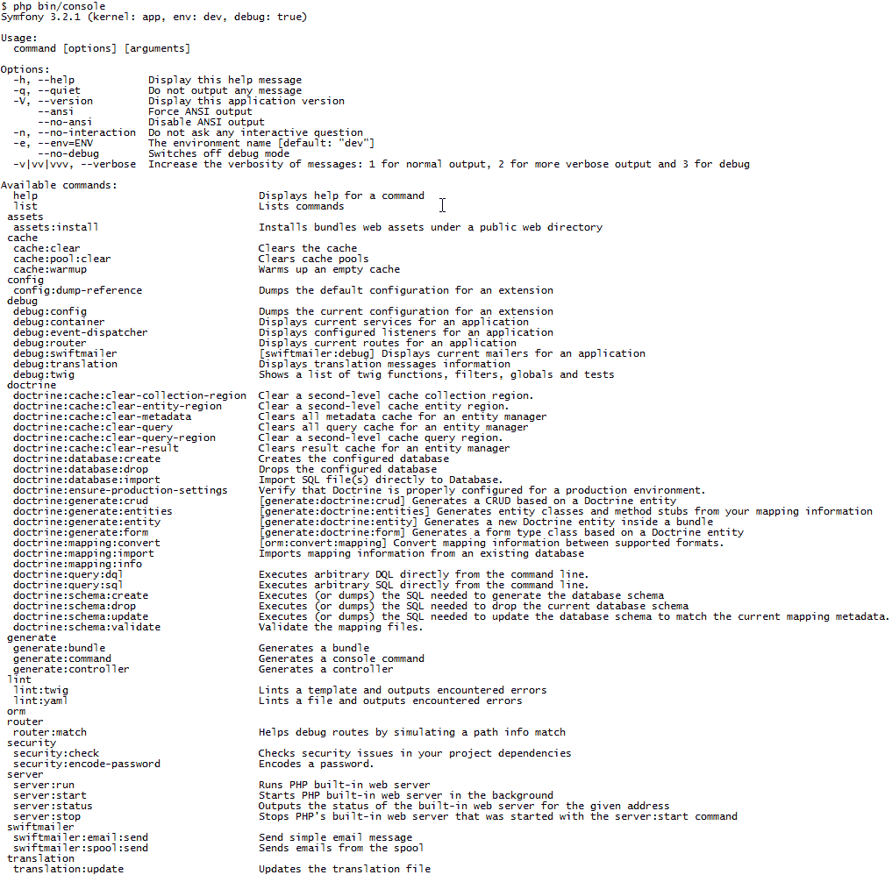
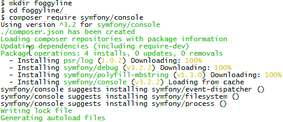
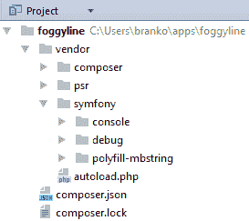
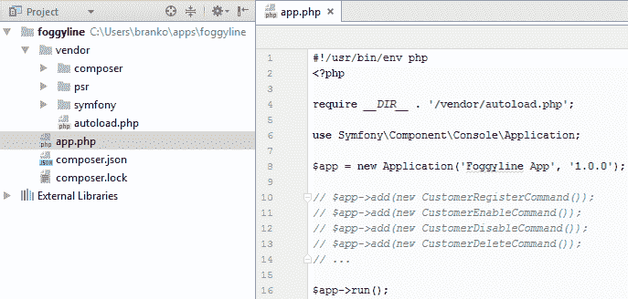

# CLI 的领域

现代应用程序开发涉及许多可见的部分。无论是服务器基础设施、开发工具还是最终的应用程序本身，图形界面都主导着我们的体验。虽然可用的 GUI 工具的多样性和整体列表似乎是无穷无尽的，但控制台仍然是开发中的一个重要部分，任何自尊的开发人员都应该熟悉。

有无数理由说明控制台只是工作的正确工具。以大型数据库备份为例。尝试通过 GUI 工具备份几 GB 的 MySQL 数据很可能会导致完全失败或损坏的备份文件，而基于控制台的`mysqldump`工具对备份的大小或执行所需的时间都是无所畏惧的。诸如大型和耗时的数据导入、数据导出、数据同步等操作是许多 PHP 应用程序的常见操作。这些只是我们希望从浏览器中移出并进入控制台的一些操作。

在本章中，我们将查看以下部分：

+   理解 PHP CLI

+   控制台组件

+   输入/输出流

+   进程控制：

+   滴答声

+   信号

+   警报

+   多处理

# 理解 PHP CLI

通过 PHP CLI SAPI 或简称 PHP CLI，通过 PHP CLI 在 PHP 中使用控制台非常容易。PHP CLI 首次在 PHP 4.2.0 中作为实验性功能引入，不久之后，在后续版本中成为完全支持并默认启用的功能。它的好处在于它在所有流行的操作系统（Linux、Windows、OSX、Solaris）上都可用。这使得编写几乎在任何平台上执行的控制台应用程序变得容易。

查看[`en.wikipedia.org/wiki/Command-line_interface`](https://en.wikipedia.org/wiki/Command-line_interface)和[`en.wikipedia.org/wiki/Server_Application_Programming_Interface`](https://en.wikipedia.org/wiki/Server_Application_Programming_Interface)以获取有关一般 CLI 和 SAPI 缩写的更详细描述。

PHP CLI 并不是 PHP 支持的唯一 SAPI 接口。使用`php_sapi_name()`函数，我们可以获得 PHP 正在使用的当前接口的名称。其他可能的接口包括 aolserver、apache、apache2handler、cgi、cgi-fcgi、cli、cli-server、continuity、embed、fpm-fcgi 等。

在我们的操作系统控制台中运行简单的`php -v`命令应该给我们一个类似以下的输出：

```php
PHP 7.1.0-3+deb.sury.org~yakkety+1 (cli) ( NTS )
Copyright (c) 1997-2016 The PHP Group
Zend Engine v3.1.0-dev, Copyright (c) 1998-2016 Zend Technologies
 with Zend OPcache v7.1.0-3+deb.sury.org~yakkety+1, Copyright (c) 1999-2016, by Zend Technologies

```

这应该作为 PHP CLI SAPI 正在运行的确认。PHP 的 CLI 版本有自己的`php.ini`配置，与其他 SAPI 接口分开。在控制台上运行`php --ini`命令将公开有关当前使用的`php.ini`文件的以下详细信息：

```php
Configuration File (php.ini) Path: /etc/php/7.1/cli
Loaded Configuration File: /etc/php/7.1/cli/php.ini
Scan for additional .ini files in: /etc/php/7.1/cli/conf.d
Additional .ini files parsed: /etc/php/7.1/cli/conf.d/10-opcache.ini,
/etc/php/7.1/cli/conf.d/10-pdo.ini,
/etc/php/7.1/cli/conf.d/20-calendar.ini,
/etc/php/7.1/cli/conf.d/20-ctype.ini,
...

```

在这里，我们可以看到主配置文件（`php.ini`）和特定于扩展的配置文件的位置。链接这些配置文件的配置会立即生效，因为它们在每次调用 PHP 时都会加载。

# 控制台组件

许多流行的 PHP 框架和平台利用某种控制台应用程序来协助开发、部署和维护我们的项目。例如，Symfony 框架自带自己的控制台应用程序，具有数十个巧妙的命令。这些可以通过在 Symfony 项目的根目录中执行`php bin/console`命令来访问：



列出的每个命令都执行非常具体的目的；因此，在各种方式上协助我们的项目。虽然 Symfony 框架的安装和整体细节超出了本书的范围，但其中有一个我们感兴趣的组件。控制台组件，虽然是 Symfony 框架的一部分，但也可以作为独立组件来构建这些类型的控制台应用程序。

# 设置控制台组件

控制台组件有两种风格：

+   Composer 包（Packagist 上的`symfony/console`）

+   Git 存储库（[`github.com/symfony/console`](https://github.com/symfony/console)）

鉴于 Composer 在处理 PHP 组件时是事实上的标准，我们将使用`composer require`命令快速启动我们的第一个控制台应用程序，如下所示：

```php
mkdir foggyline
cd foggyline
composer require symfony/console

```

运行此命令会触发以下输出：



完成后，Composer 在我们的`foggyline`目录中生成以下结构：



现在我们只需要创建一个应用程序入口文件，比如`app.php`，并包含由 Composer 生成的`vendor/autoload.php`文件，如下所示：



文件的第一行，称为*shebang*，包含自动检测脚本类型所需的指令。虽然这行本身并不是必需的，但它使得在执行应用程序脚本时，`php app.php`和`./app.php`之间有所不同。在*shebang*行之后是处理`autoload.php`的 PHP 代码和实例化`Console\Application`类。`Console\Application`类接受两个参数：应用程序的名称和我们希望分配给它的版本。在实例化和运行应用程序之间，我们有一些被注释掉的行，仅仅是演示我们通常会注册个别应用程序命令的地方。

要了解更多关于*shebang*字符序列的信息，请查看维基百科文章[`en.wikipedia.org/wiki/Shebang_(Unix)`](https://en.wikipedia.org/wiki/Shebang_(Unix))。

要使*shebang*行生效，`app.php`文件需要标记为：

```php
$ chmod +x app.php
$ ./app.php

```

有了这四行 PHP 代码，我们已经有足够的条件来执行我们的


输出以彩色和良好的格式呈现，正如我们从现代控制台应用程序所期望的那样。这只是控制台组件为我们处理的一小部分。通过这个，我们完成了控制台组件的设置。现在我们可以继续使用`$app`实例的`add()`方法来注册我们的应用程序命令。

# 创建一个控制台命令

现在我们已经设置了*裸骨*控制台应用程序，让我们创建三个命令来处理以下虚构的操作：

+   客户注册

+   客户状态设置

+   客户导出

“虚构”一词只是表示我们实际上不会关注执行命令的内部细节，因为我们的重点是理解如何重用控制台组件。

我们首先在项目的`src/Foggyline/Console/Command/`目录中创建`CustomerRegisterCommand.php`，`CustomerStatusSetCommand.php`和`CustomerExportCommand.php`。

`CustomerRegisterCommand.php`文件的内容如下：

```php
<?php

namespace Foggyline\Console\Command;

use Symfony\Component\Console\{
  Command\Command,
  Input\InputInterface,
  Output\OutputInterface
};

class CustomerRegisterCommand extends Command
{
  protected function configure()
  {
    $this->setName('customer:register')
    ->setDescription('Registers new customer.');
  }

  protected function execute(InputInterface $input, OutputInterface
    $output)
  {
    // Some imaginary logic here...
    $output->writeln('Customer registered.');
  }
}

```

`CustomerStatusSetCommand.php`文件的内容如下：

```php
<?php

namespace Foggyline\Console\Command;

use Symfony\Component\Console\{
  Command\Command,
  Input\InputInterface,
  Output\OutputInterface
};

class CustomerStatusSetCommand extends Command
{
  protected function configure()
  {
    $this->setName('customer:status:set')
    ->setDescription('Enables of disables existing customer.');
  }

  protected function execute(InputInterface $input, OutputInterface
    $output)
  {
    // Some imaginary logic here...
    $output->writeln('Customer disabled.');
  }
}

```

`CustomerExportCommand.php`文件的内容如下：

```php
<?php

namespace Foggyline\Console\Command;

use Symfony\Component\Console\{
  Command\Command,
  Input\InputInterface,
  Output\OutputInterface
};

class CustomerExportCommand extends Command
{
  protected function configure()
  {
    $this->setName('customer:export')
    ->setDescription('Exports one or more customers.');
  }

  protected function execute(InputInterface $input, OutputInterface $output)
  {
    // Some imaginary logic here...
    $output->writeln('Customers exported.');
  }
}

```

我们可以看到所有三个命令都扩展了`Symfony\Component\Console\Command\Command`，并提供了它们自己的`configure()`和`execute()`方法的实现。`configure()`方法有点像构造函数，我们可以在其中放置我们的初始配置，比如命令的名称、描述、选项、参数等。`execute()`方法是我们需要实现的实际命令逻辑的地方，或者在其他地方实现了则调用它。有了这三个命令，我们需要回到`app.php`文件并修改其内容如下：

```php
#!/usr/bin/env php
<?php   $loader = require __DIR__ . '/vendor/autoload.php'; $loader->add('Foggyline', __DIR__ . '/src/');   use Symfony\Component\Console\Application; use Foggyline\Console\Command\{
 CustomerExportCommand, CustomerRegisterCommand, CustomerStatusSetCommand };   $app = new Application('Foggyline App', '1.0.0');   $app->add(new CustomerRegisterCommand()); $app->add(new CustomerStatusSetCommand()); $app->add(new CustomerExportCommand());   $app->run();

```

与我们最初的`app.php`文件相比，这里有一些变化。请注意我们需要`autoload.php`文件的行。如果我们实际查看该文件，我们会发现它返回`Composer\Autoload\ClassLoader`类的一个实例。这是 Composer 的 PSR-0、PSR-4 和 classmap 类加载器，我们可以利用它来加载我们的命令。这正是`$loader->add('Foggyline'...`行所做的。最后，我们使用应用程序的`add()`方法注册我们新创建的命令。

在进行这些更改后，执行我们的应用程序会产生以下输出：


我们的三个命令现在出现在可用命令列表中。我们在`configure()`方法中设置的`name`和`description`值显示在每个命令中。我们现在可以轻松地执行其中一个命令：


`Customer disabled.`标签确认了我们的`CustomerStatusSetCommand`的`execute()`方法的执行。虽然到目前为止，我们的控制台应用程序及其命令的整体概念相当容易理解，但我们的命令目前几乎没有用处，因为我们没有向它们传递任何输入。

# 处理输入

制作实用和有用的命令通常需要能够将操作系统控制台的动态信息传递给我们的应用程序命令。控制台组件区分两种类型的输入--`arguments`和`options`：

+   参数是有序的，以空格分隔（`John Doe`），可选或必需，是字符串类型的信息。参数的分配在命令名称之后。我们使用`Symfony\Component\Console\Command\Command`实例的`addArgument()`方法来为我们的自定义命令分配参数。

+   选项是无序的，以双破折号分隔（`--name=John --surname=Doe`），始终是可选的，分配的信息类型。选项的分配在命令名称之后。我们使用`Symfony\Component\Console\Command\Command`实例的`addOption()`方法来为我们的自定义命令分配选项。

`addArgument()`方法接受四个参数，如下概要所示：

```php
public function addArgument(
  $name, 
  $mode = null, 
  $description = '', 
  $default = null
)

```

而`addArgument()`方法的参数具有以下含义：

+   `$name`: 这是参数名称

+   `$mode`: 这是参数模式，可以是`InputArgument::REQUIRED`或`InputArgument::OPTIONAL`

+   `$description`: 这是描述文本

+   `$default`: 这是默认值（仅适用于`InputArgument::OPTIONAL`模式）

`addOption()`方法接受五个参数，如下概要所示：

```php
public function addOption(
  $name, 
  $shortcut = null, 
  $mode = null, 
  $description = '', 
  $default = null
)

```

而`addOption()`方法的参数具有以下含义：

+   `$name`: 这是选项名称

+   `$shortcut`: 这是快捷方式（可以为`null`）

+   `$mode`: 这是选项模式，是`InputOption::VALUE_*`常量之一

+   `$description`: 这是描述文本

+   `$default`: 这是默认值（对于`InputOption::VALUE_NONE`必须为`null`）

我们可以轻松地构建我们的命令，使它们同时使用这两种输入类型，因为它们不互斥。

让我们继续修改我们的`src\Foggyline\Console\Command\CustomerRegisterCommand.php`文件，进行以下更改：

```php
<?php

namespace Foggyline\Console\Command;

use Symfony\Component\Console\{
  Command\Command,
  Input\InputInterface,
  Input\InputArgument,
  Input\InputOption,
  Output\OutputInterface
};

class CustomerRegisterCommand extends Command
{
  protected function configure()
  {
    $this->setName('customer:register')
    ->addArgument(
      'name', InputArgument::REQUIRED, 'Customer full name.'
    )
    ->addArgument(
      'email', InputArgument::REQUIRED, 'Customer email address.'
    )
    ->addArgument(
      'dob', InputArgument::OPTIONAL, 'Customer date of birth.'
    )
    ->addOption(
      'email', null, InputOption::VALUE_REQUIRED, 'Send email to  
      customer?'
    )
    ->addOption(
      'log', null, InputOption::VALUE_OPTIONAL, 'Log to event system?'
    )
    ->setDescription('Enables or disables existing customer.');
  }

  protected function execute(InputInterface $input, OutputInterface $output)
 {
    var_dump($input->getArgument('name'));
    var_dump($input->getArgument('email'));
    var_dump($input->getArgument('dob'));
    var_dump($input->getOption('email'));
    var_dump($input->getOption('log'));
  }
} 

```

我们的修改主要扩展了*group use*声明和`configure()`方法。在`configure()`方法中，我们利用`addArgument()`和`addOption()`实例方法来向我们的命令添加输入数量。

尝试现在执行我们的控制台命令，不带任何参数，将触发`RuntimaException`，如下截图所示：


错误足够描述，可以提供缺少参数的列表。但它不会触发我们自己的参数和选项描述。要显示这些内容，我们可以轻松运行`./app.php customer:register --help`命令。这告诉控制台组件显示我们指定的命令详情：


现在我们看到了我们参数和选项背后的确切描述，我们可以发出一个更有效的命令，不会触发错误，例如`./app.php customer:register John Doe --log=true`。传递所有必需的参数使我们进入`execute()`方法，该方法已被修改以对我们传递的值进行原始转储，如下面的截图所示：


我们现在有一个简单但有效的命令版本，可以接受输入。`addArgument()`和`addOption()`方法使得通过单个表达式定义和描述这些输入变得非常容易。控制台组件已经证明是我们控制台应用程序的一个非常方便的补充。

# 使用控制台组件助手

理解参数和选项是利用控制台组件的第一步。一旦我们了解如何处理输入，我们就会转向其他更高级的功能。助手功能帮助我们轻松处理常见任务，如格式化输出，显示运行进程，显示可更新的进度信息，提供交互式问答过程，显示表格数据等。

以下是我们可以使用的几个控制台组件助手：

+   格式化助手

+   进程助手

+   进度条

+   问题助手

+   表格

+   调试格式化助手

您可以在我们项目的`vendor\symfony\console\Helper`目录中看到完整的助手实现。

为了展示这些助手的易用性，让我们继续在*customer export*命令中实现简单的*进度条*和*表格*助手。

我们通过修改`src\Foggyline\Console\Command\CustomerExportCommand.php`类文件的`execute()`方法来实现：

```php
protected function execute(InputInterface $input, OutputInterface $output)
{
  // Fake data source 
  $customers = [
    ['John Doe', 'john.doe@mail.loc', '1983-01-16'],
    ['Samantha Smith', 'samantha.smith@mail.loc', '1986-10-23'],
    ['Robert Black', 'robert.black@mail.loc', '1978-11-18'],
  ];

  // Progress Bar Helper
  $progress = new 
    \Symfony\Component\Console\Helper\ProgressBar($output,
    count($customers));

  $progress->start();

  for ($i = 1; $i <= count($customers); $i++) {
    sleep(5);
    $progress->advance();
  }

  $progress->finish();

  // Table Helper
  $table = new \Symfony\Component\Console\Helper\Table($output);
  $table->setHeaders(['Name', 'Email', 'DON'])
  ->setRows($customers)
  ->render();
}

```

我们首先通过添加虚假的客户数据来启动我们的代码。然后我们实例化`ProgressBar`，传递给它我们虚假客户数据数组中的条目数。进度条实例需要显式调用`start()`、`advance()`和`finish()`方法来实际推进进度条。一旦进度条完成，我们实例化`Table`，传递适当的标题和我们客户数据数组中的行数据。

控制台组件助手提供了大量的配置选项。要了解更多信息，请查看[`symfony.com/doc/current/components/console/helpers/index.html`](http://symfony.com/doc/current/components/console/helpers/index.html)。

通过进行上述更改，触发控制台上的`./app.php customer:export`命令现在应该在执行命令时给出以下输出：


首先我们会看到进度条显示确切的进度。一旦进度条完成，表格助手开始工作，生成最终输出，如下面的截图所示：


使用助手可以改善我们的控制台应用程序用户体验。我们现在能够编写提供信息丰富和结构化反馈的应用程序。

# 输入/输出流

在开发的早期阶段，每个程序员都会遇到**流**这个术语。这个看似可怕的术语代表一种数据形式。与典型的有限数据类型不同，流代表一种潜在无限的数据*序列*。在 PHP 术语中，流是一种展现可流动行为的资源对象。使用各种包装器，PHP 语言支持各种流。`stream_get_wrappers()`函数可以检索当前运行系统上所有已注册的流包装器的列表，例如以下内容：

+   `php`

+   `file`

+   `glob`

+   `data`

+   `http`

+   `ftp`

+   `zip`

+   `compress.zlib`

+   `compress.bzip2`

+   `https`

+   `ftps`

+   `phar`

包装器的列表非常广泛，但并非无限。我们还可以使用`stream_wrapper_register()`函数注册自己的包装器。每个包装器告诉流如何处理特定的协议和编码。因此，每个流都是通过`scheme://target`语法访问的，例如以下内容：

+   `php://stdin`

+   `file:///path/to/file.ext`

+   `glob://var/www/html/*.php`

+   `data://text/plain;base64,Zm9nZ3lsaW5l`

+   `http://foggyline.net/`

语法的`scheme`部分表示要使用的包装器的名称，而`target`部分取决于所使用的包装器。作为本节的一部分，我们对`php`包装器及其目标值感兴趣，因为它们涉及标准流。

标准流是以下三个 I/O 连接，可供所有程序使用：

+   标准输入（`stdin`）- 文件描述符`0`

+   标准输出（`stdout`）- 文件描述符`1`

+   标准错误（`stderr`）- 文件描述符`2`

文件描述符是一个表示用于访问 I/O 资源的句柄的整数。作为 POSIX 应用程序编程接口的一部分，Unix 进程应该具有这三个文件描述符。知道文件描述符的值，我们可以使用`php://fd`来直接访问给定的文件描述符，例如`php://fd/1`。但是，还有一种更优雅的方法。

要了解更多关于 POSIX 的信息，请查看[`en.wikipedia.org/wiki/POSIX`](https://en.wikipedia.org/wiki/POSIX)。

PHP CLI SAPI 默认提供了这三个标准流的三个常量：

+   `define('STDIN', fopen('php://stdin', 'r'));`：这表示已经打开了一个到`stdin`的流

+   `define('STDOUT', fopen('php://stdout', 'w'));`：这表示已经打开了一个到`stdout`的流

+   `define('STDERR', fopen('php://stderr', 'w'));`：这表示已经打开了一个到`stderr`的流

以下简单的代码片段演示了这些标准流的使用：

```php
<?php   fwrite(STDOUT, "Type something: "); $line = fgets(STDIN); fwrite(STDOUT, 'You typed: ' . $line); fwrite(STDERR, 'Triggered STDERR!' . PHP_EOL);

```

执行它，我们首先会在屏幕上看到“输入一些内容：”，之后，我们需要提供一个字符串并按*Enter*，最后得到以下输出：


虽然示例本身最终是简化的，但它展示了获得流句柄的简便性。我们对这些流做什么取决于使用流的函数（`fopen()`，`fputs()`等）和实际的流函数。

PHP 提供了超过四十个流函数，以及`streamWrapper`类原型。这些为我们提供了一种以几乎任何想象得到的方式创建和操作流的方法。查看[`php.net/manual/en/book.stream.php`](http://php.net/manual/en/book.stream.php)了解更多详情。

# 进程控制

构建 CLI 应用程序往往意味着与系统进程一起工作。PHP 提供了一个称为**PCNTL**的**强大的进程控制扩展**。该扩展允许我们处理进程创建、程序执行、信号处理和进程终止。它仅在类 Unix 机器上工作，其中 PHP 是使用`--enable-pcntl`配置选项编译的。

要确认 PCNTL 在我们的系统上可用，我们可以执行以下控制台命令：

```php
php -m | grep pcntl

```

考虑到它的功能，不鼓励在生产 Web 环境中使用 PCNTL 扩展。编写 PHP 守护进程脚本用于命令行应用程序是我们想要使用它的方式。

为了开始有所了解，让我们继续看看如何使用 PCNTL 功能来处理进程信号。

# Ticks

PCNTL 依赖于 ticks 来进行信号处理回调机制。关于 tick 的官方定义（[`php.net/manual/en/control-structures.declare.php`](http://php.net/manual/en/control-structures.declare.php)）如下：

tick 是在`declare`块内由解析器执行的 N 个低级 tickable 语句的事件。N 的值是在`declare`块的指令部分使用`ticks=N`指定的。

为了详细说明，tick 是一个事件。使用`declare()`语言结构，我们控制了多少语句需要触发一个 tick。然后我们使用`register_ tick_ function()`在每个*触发的 tick*上执行我们的函数。Ticks 基本上是一系列被评估表达式的副作用；这是我们可以用我们的自定义函数来做出反应的副作用。虽然大多数语句是可 tick 的，但某些条件表达式和参数表达式是不可 tick 的。

执行一个*语句*，而*表达式*是被评估的。

除了`declare()`语言结构，PHP 还提供了以下两个函数来处理 ticks：

+   `register_ tick_ function()`：这将注册一个函数，在每个 tick 上执行

+   `unregister_ tick_ function()`：这将取消之前注册的函数

让我们看一下以下示例，在这个示例中，`declare()`结构使用`{}`块来包装表达式：

```php
<?php

echo 'started' . PHP_EOL;

function tickLogger()
{
  echo 'Tick logged!' . PHP_EOL;
}

register_tick_function('tickLogger');

declare (ticks = 2) {
  for ($i = 1; $i <= 10; $i++) {
    echo '$i => ' . $i . PHP_EOL;
  }
}

echo 'finished' . PHP_EOL;

```

这导致以下输出：

```php
started
$i => 1
$i => 2
Tick logged!
$i => 3
$i => 4
Tick logged!
$i => 5
$i => 6
Tick logged!
$i => 7
$i => 8
Tick logged!
$i => 9
$i => 10
Tick logged!
finished

```

这基本上是我们所期望的，基于`declare()`结构的`{}`块中精心包装的表达式。在循环的每秒迭代中，tick 被很好地触发了。

让我们看一下以下示例，在这个示例中，`declare()`结构被添加为 PHP 脚本的第一行，没有任何`{}`块来包装表达式：

```php
<?php

declare (ticks = 2);

echo 'started' . PHP_EOL;

function tickLogger()
{
  echo 'Tick logged!' . PHP_EOL;
}

register_tick_function('tickLogger');

for ($i = 1; $i <= 10; $i++) {
  echo '$i => ' . $i . PHP_EOL;
}

echo 'finished' . PHP_EOL;

```

这导致以下输出：

```php
started
Tick logged!
$i => 1
Tick logged!
$i => 2
Tick logged!
$i => 3
Tick logged!
$i => 4
Tick logged!
$i => 5
Tick logged!
$i => 6
Tick logged!
$i => 7
Tick logged!
$i => 8
Tick logged!
$i => 9
Tick logged!
$i => 10
Tick logged!
Tick logged!
finished
Tick logged!

```

这里的输出并不是我们一开始所期望的。`N`值，`ticks = 2`，似乎并没有被尊重，因为 tick 似乎在每个语句之后都被触发。即使最后完成的输出后面还跟着一个 tick。

Ticks 提供了一种可能有用的功能，用于运行监视、清理、通知、调试或其他类似任务。它们应该被非常小心地使用，否则我们可能会得到一些意想不到的结果，就像我们在前面的例子中看到的那样。

# 信号

信号是在 POSIX 兼容的操作系统中发送给运行中进程的异步消息。它们可以被程序的用户发送。以下是 Linux 支持的标准信号列表：

+   `SIGHUP`：挂断（POSIX）

+   `SIGINT`：终端中断（ANSI）

+   `SIGQUIT`：终端退出（POSIX）

+   `SIGILL`：非法指令（ANSI）

+   `SIGTRAP`：跟踪陷阱（POSIX）

+   `SIGIOT`：IOT 陷阱（4.2 BSD）

+   `SIGBUS`：总线错误（4.2 BSD）

+   `SIGFPE`：浮点异常（ANSI）

+   `SIGKILL`：杀死（无法被捕获或忽略）（POSIX）

+   `SIGUSR1`：用户定义信号 1（POSIX）

+   `SIGSEGV`：无效的内存段访问（ANSI）

+   `SIGUSR2`：用户定义信号 2（POSIX）

+   `SIGPIPE`：在没有读取器的管道上写入，管道中断（POSIX）

+   `SIGALRM`：闹钟（POSIX）

+   `SIGTERM`：终止（ANSI）

+   `SIGSTKFLT`：堆栈故障

+   `SIGCHLD`：子进程已停止或退出，已更改（POSIX）

+   `SIGCONT`：继续执行，如果停止（POSIX）

+   `SIGSTOP`：停止执行（无法被捕获或忽略）（POSIX）

+   `SIGTSTP`：终端停止信号（POSIX）

+   `SIGTTIN`：后台进程试图从 TTY 读取（POSIX）

+   `SIGTTOU`：后台进程试图写入 TTY（POSIX）

+   `SIGURG`：套接字上的紧急情况（4.2 BSD）

+   `SIGXCPU`：CPU 限制超过（4.2 BSD）

+   `SIGXFSZ`：文件大小限制超过（4.2 BSD）

+   `SIGVTALRM`：虚拟闹钟（4.2 BSD）

+   `SIGPROF`：性能分析闹钟（4.2 BSD）

+   `SIGWINCH`：窗口大小改变（4.3 BSD，Sun）

+   `SIGIO`：现在可以进行 I/O（4.2 BSD）

+   `SIGPWR`：电源故障重启（System V）

用户可以使用`kill`命令从控制台手动发出信号消息，比如`kill -SIGHUP 4321`。

`SIGKILL`和`SIGSTOP`信号是终极的关闭开关，因为它们无法被捕获、阻止或忽略。

PHP 提供了几个函数来处理信号，其中一些如下：

+   `pcntl_ signal()`：这将安装一个信号处理程序

+   `pcntl_signal_dispatch()`: 这个函数调用待处理信号的信号处理程序

+   `pcntl_sigprocmask()`: 这个函数设置和检索被阻塞的信号

+   `pcntl_sigtimedwait()`: 这个函数等待信号，带有超时

+   `pcntl_sigwaitinfo()`: 这个函数等待信号

`pcntl_signal()`函数是最有趣的一个。

让我们看一个使用`pcntl_signal()`函数的例子：

```php
#!/usr/bin/env php
<?php

declare(ticks = 1);

echo 'started' . PHP_EOL;

function signalHandler($signal)
{
  echo 'Triggered signalHandler: ' . $signal . PHP_EOL;
  // exit;
}

pcntl_signal(SIGINT, 'signalHandler');

$loop = 0;
while (true) {
  echo 'loop ' . (++$loop) . PHP_EOL;
  flush();
  sleep(2);
}

echo 'finished' . PHP_EOL;

```

我们从*declare ticks*定义开始我们的代码。如果没有它，通过`pcntl_signal()`函数安装我们自定义的`signalHandler`函数将不会生效。`pcntl_signal()`函数本身为`SIGINT`信号安装了`signalHandler()`函数。运行上述代码将产生以下输出：

```php
$ ./app.php
started
loop 1
loop 2
loop 3
^CTriggered signalHandler: 2
loop 4
loop 5
^CTriggered signalHandler: 2
loop 6
loop 7
loop 8
^CTriggered signalHandler: 2
loop 9
loop 10
...

```

`^C`字符串表示我们在键盘上按下*Ctrl* + *C*的时刻。我们可以看到紧接着就是来自我们自定义的`signalHandler()`函数的`Triggered signalHandler: *N*`输出。虽然我们成功捕获了`SIGINT`信号，但在完成`signalHandler()`函数后我们没有跟进并实际执行它，这导致信号被忽略，程序继续执行。事实证明，我们通过允许程序在按下*Ctrl* + *C*后继续执行，实际上破坏了默认的操作系统功能。

信号如何帮助我们？首先，在`signalHandler()`函数内部简单的`exit;`调用将解决这种情况下的破损功能。除此之外，我们还有一个强大的机制，可以让我们接触（几乎）任何系统信号，并执行我们选择的任意代码。

# 警报

`pcntl_alarm()`函数通过提供信号传递的闹钟来丰富 PHP 信号功能。简而言之，它创建一个定时器，在给定的秒数后向进程发送`SIGALRM`信号。

一旦警报触发，信号处理程序函数就会启动。一旦信号处理程序函数代码执行完毕，我们就会回到应用程序在跳转到信号处理程序函数之前停止的代码点。

让我们看下面的代码片段：

```php
#!/usr/bin/env php
<?php

declare(ticks = 1);

echo 'started' . PHP_EOL;

function signalHandler($signal)
{
  echo 'Triggered signalHandler: ' . $signal . PHP_EOL;
}

pcntl_signal(SIGALRM, 'signalHandler');
pcntl_alarm(7);

while (true) {
  echo 'loop ' . date('h:i:sa') . PHP_EOL;
  flush();
  sleep(2);
}

echo 'finished' . PHP_EOL;

```

我们使用`pcntl_signal()`函数将`signalHandler`注册为`SIGALRM`信号的信号处理函数。然后调用`pcntl_alarm()`函数，传递 7 秒的整数值。while 循环被设置为仅向控制台输出一些内容，以便更容易理解警报的行为。执行后，显示以下输出：

```php
$ ./app.php
started
loop 02:17:28pm
loop 02:17:30pm
loop 02:17:32pm
loop 02:17:34pm
Triggered signalHandler: 14
loop 02:17:35pm
loop 02:17:37pm
loop 02:17:39pm
loop 02:17:41pm
loop 02:17:43pm
loop 02:17:45pm
loop 02:17:47pm
loop 02:17:49pm
loop 02:17:51pm

```

我们可以看到`Triggered signalHandler: 14`字符串只显示了一次。这是因为警报只触发了一次。输出中显示的时间表明了第一次循环迭代和警报之间确切的七秒延迟。我们可以在`signalHandler()`函数内部轻松地再次调用`pcntl_alarm()`函数：

```php
function signalHandler($signal)
{
  echo 'Triggered signalHandler: ' . $signal . PHP_EOL;
  pcntl_alarm(3);
}

```

这将把我们的输出转换成这样：

```php
$ ./app.php
started
loop 02:20:46pm
loop 02:20:48pm
loop 02:20:50pm
loop 02:20:52pm
Triggered signalHandler: 14
loop 02:20:53pm
loop 02:20:55pm
Triggered signalHandler: 14
loop 02:20:56pm
loop 02:20:58pm
Triggered signalHandler: 14
loop 02:20:59pm
loop 02:21:01pm
Triggered signalHandler: 14
loop 02:21:02pm

```

虽然可以指定多个警报，但在到达上一个警报之前这样做会使新警报替换旧警报。在应用程序内执行非线性处理时，警报的用处变得明显。`pcntl_alarm()`函数是非阻塞的，可以轻松使用，而不用担心阻塞程序执行。

# 多进程

谈到**多进程**时，我们经常遇到两个看似冲突的术语：**进程**和**线程**。进程可以被视为应用程序的当前运行实例，而线程是进程内的执行路径。线程可以做几乎任何进程可以做的事情。然而，由于线程驻留在进程内，我们将它们视为轻量级任务的解决方案，或者至少比进程使用的任务更轻。

在多进程/多线程方面，PHP 语言还有很多需要改进的地方。以下两种解决方案最受欢迎：

+   `pcntl_fork()`：这是一个分叉当前运行进程的函数

+   `pthreads`：这是一个基于 Posix 线程提供多线程的面向对象 API

`pcntl_fork()`函数是 PCNTL 扩展的一部分，我们在之前的部分中也使用了它的函数。该函数只能分叉进程，不能创建线程。虽然`pthreads`是一种更现代和面向对象的解决方案，但在本节中我们将继续使用`pcntl_fork()`函数。

当我们运行`pcntl_fork()`函数时，它为我们创建了一个子进程。这个子进程与父进程的唯一区别在于它的`PID`和`PPID`：

+   `PID`：这是进程 ID

+   `PPID`：这是父进程 ID，启动此 PID 的进程

虽然使用`pcntl_fork()`函数进行实际进程分叉非常简单，但它给我们留下了一些挑战。诸如*进程间通信*和*僵尸子进程*之类的挑战使得交付稳定的应用程序变得繁琐。

让我们来看一下`pcntl_fork()`函数的以下用法：

```php
#!/usr/bin/env php
<?php

for ($i = 1; $i <= 5; $i++) {
  $pid = pcntl_fork();

  if (!$pid) {
    echo 'Child ' . $i . PHP_EOL;
    sleep(2);
    exit;
  }
}

```

上述代码的输出结果如下：

```php
$ time php ./app.php

real 0m0.031s
user 0m0.012s
sys 0m0.016s
$ Child 1
Child 4
Child 2
Child 3
Child 5

$

```

尽管有五个子进程在运行，但控制台立即返回了控制权。控制权首先在输出 Child 1 字符串之前返回，然后几秒钟后，所有 Child 字符串都被输出，控制台再次返回了控制权。输出清楚地显示子进程不一定按照它们被分叉的顺序执行。这由操作系统决定，而不是我们。我们可以进一步使用`pcntl_waitpid()`和`pcntl_wexitstatus()`函数来调整行为。

`pcntl_waitpid()`函数指示 PHP 等待子进程，而`pcntl_wexitstatus()`函数获取终止子进程返回的值。以下示例演示了这一点：

```php
#!/usr/bin/env php
<?php

function generatePdf($content, $size)
{
  echo 'Started PDF ' . $size . ' - ' . date('h:i:sa') . PHP_EOL;
  sleep(3); /* simulate PDF generating */
  echo 'Finished PDF ' . $size . ' - ' . date('h:i:sa') . PHP_EOL;
}

$sizes = ['A1', 'A2', 'A3'];
$content = 'foggyline';

for ($i = 0; $i < count($sizes); $i++) {
  $pid = pcntl_fork();

  if (!$pid) {
    generatePdf($content, $sizes[$i]);
    exit($i);
  }
}

while (pcntl_waitpid(0, $status) != -1) {
  $status = pcntl_wexitstatus($status);
  echo "Child $status finished! - " . date('h:i:sa') . PHP_EOL;
}

```

尽管这个例子的大部分内容与上一个例子相似，但请注意底部的整个`while`循环。`while`循环将一直循环直到`pcntl_waitpid()`函数返回`-1`（没有子进程了）。`while`循环的每次迭代都会检查终止子进程的返回代码，并将其存储到`$status`变量中，然后再次在`while`循环表达式中进行评估。

查看[`php.net/manual/en/ref.pcntl.php`](http://php.net/manual/en/ref.pcntl.php)以获取有关`pcntl_fork()`、`pcntl_waitpid()`和`pcntl_wexitstatus()`函数参数和返回值的更多详细信息。

上述代码的输出结果如下：

```php
$ time ./app.php
Started PDF A2 - 04:52:37pm
Started PDF A3 - 04:52:37pm
Started PDF A1 - 04:52:37pm
Finished PDF A2 - 04:52:40pm
Finished PDF A1 - 04:52:40pm
Finished PDF A3 - 04:52:40pm
Child 2 finished! - 04:52:40pm
Child 1 finished! - 04:52:40pm
Child 0 finished! - 04:52:40pm

real 0m3.053s
user 0m0.016s
sys 0m0.028s
$

```

控制台直到所有子进程执行完毕才会返回控制权，这可能是大多数任务的首选解决方案。

虽然进程分叉为我们打开了几种可能性，但我们需要问自己，这真的值得吗？如果简单地重组我们的应用程序以使用更多的消息队列、CRON 和其他更简单的技术，可以获得类似的性能，并且更容易扩展、维护和调试，那么我们可能应该避免分叉。

# 总结

在本章中，我们熟悉了 PHP CLI 周围一些有趣的特性和工具。本章以 PHP CLI SAPI 的基本介绍开始，作为 PHP 中众多 SAPI 接口之一。然后我们深入了解了一个简单但功能强大的控制台组件，学习了如何轻松创建自己的控制台应用程序。I/O 流部分帮助我们理解标准流以及它们如何被 PHP 处理。最后，我们深入了解了 PCNTL 扩展提供的进程控制函数。这些函数的组合为我们编写控制台应用程序打开了广阔的可能性。虽然与面向浏览器的应用程序相比，整体控制台应用程序开发可能不够有趣，但它在现代开发中肯定有其作用。CLI 环境简单地允许我们更好地控制我们的应用程序。

往前看，我们将深入了解 PHP 中最重要和有趣的面向对象编程特性之一。
