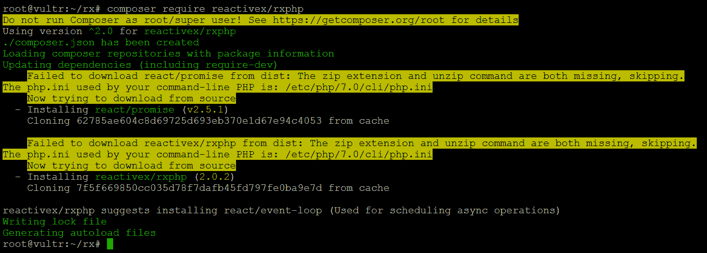
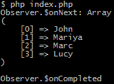
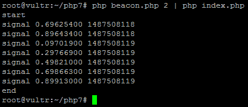
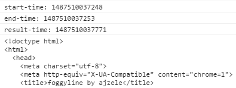
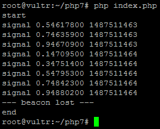
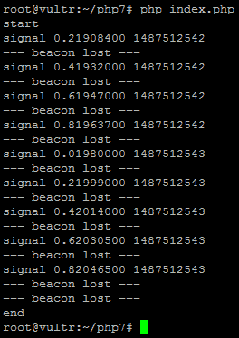
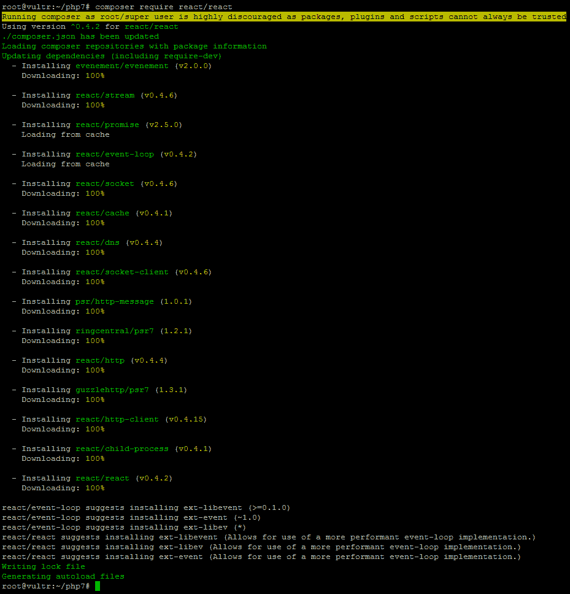
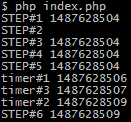
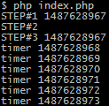
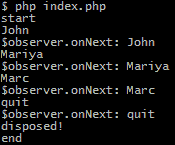

# 第九章：响应式编程

软件行业时不时会发生变革。这种变革丰富了思想，承诺更容易的系统和应用程序开发。如今，驱动这一切的主要是互联网，因为它是所有连接应用程序的媒介，不仅仅是在我们的浏览器中运行的应用程序。大多数移动用户消费大量的云服务，甚至没有意识到。在这样一个互联的世界中确保一致的用户体验是一个以多种方式解决的挑战。响应性就是其中一种观点，其中编程语言本身起着重要作用。

传统上，PHP 遵循同步编程模型，不太适合异步编程。尽管标准库已经包含了编写异步 I/O 应用程序所需的一切，但现实可能大相径庭。例如，MySQLi 和 MySQL（PDO）仍然是阻塞的，使得使用 PHP 进行异步编程毫无意义。幸运的是，形势正在改变，人们对 PHP 的异步性有了更多的认识。

响应式编程是软件行业的新兴话题，它建立在可观察对象的基础上。我们将其与异步行为联系在一起，因为可观察对象提供了访问多个项目的异步序列的理想方式。在更高的层面上，它只是另一种编程范式，就像过程式、面向对象、声明式和函数式编程一样。虽然采用可观察对象、操作符、观察者和其他构建块需要一定的思维转变，但作为回报，它允许更大的表现力和单向数据流，从而导致更清洁和简单的代码。

在本章中，我们将更详细地研究以下几个部分：

+   与事件驱动编程的相似之处

+   使用 RxPHP：

+   安装 RxPHP

+   可观察对象和观察者

+   主题

+   操作符

+   编写自定义操作符

+   非阻塞 I/O

+   使用 React：

+   安装 React

+   React 事件循环

+   可观察对象和事件循环

# 与事件驱动编程的相似之处

维基百科对响应式编程的定义如下：

“以数据流和变化传播为导向的编程范式。”

这个想法的第一印象可能暗示与众所周知的事件驱动编程有些相似。数据流和变化的传播听起来有点像我们可以通过 PHP 中的`\SplSubject`、`\SplObjectStorage`和`\SplObserver`接口来实现的东西，如下面的琐碎例子所示。`\SplObjectStorage`接口进一步封装了`\Countable`、`\Iterator`、`\Traversable`、`\Serializable`和`\ArrayAccess`接口：

```php
<?php   class UserRegister implements \SplSubject {
  protected $user;
  protected $observers;    public function __construct($user)
 {  $this->user = $user;
  $this->observers = new \SplObjectStorage();
 }    public function attach(\SplObserver $observer)
 {  $this->observers->attach($observer);
 }    public function detach(\SplObserver $observer)
 {  $this->observers->detach($observer);
 }    public function notify()
 {  foreach ($this->observers as $observer) {
  $observer->update($this);
 } }    public function getUser()
 {  return $this->user;
 } }   class Mailer implements \SplObserver {
  public function update(\SplSubject $subject)
 {  if ($subject instanceof UserRegister) {
  echo 'Mailing ', $subject->getUser(), PHP_EOL;
 } } }   class Logger implements \SplObserver {
  public function update(\SplSubject $subject)
 {  if ($subject instanceof UserRegister) {
  echo 'Logging ', $subject->getUser(), PHP_EOL;
 } } }   $userRegister = new UserRegister('John'); // some code... $userRegister->attach(new Mailer()); // some code... $userRegister->attach(new Logger()); // some code... $userRegister->notify();

```

我们可以说，数据流转化为从`$userRegister`实例的`notify()`方法传来的更新序列，变化的传播转化为触发`mailer`和`logger`实例的`update()`方法，而`\SplObjectStorage`方法则起着重要作用。这只是在 PHP 代码的上下文中对响应式编程范式的一个琐碎和肤浅的解释。此外，目前这里没有异步性。PHP 运行时和标准库有效地提供了编写异步代码所需的一切。在其中加入*响应性*，只是选择合适的库的问题。

尽管 PHP 反应式编程的库选择远不及 JavaScript 生态系统丰富，但有一些值得注意的库，如 RxPHP 和 React。

# 使用 RxPHP

最初由微软为.NET 平台开发，名为**ReactiveX**（响应式扩展）的一组库可在[`reactivex.io`](http://reactivex.io)上找到。 ReactiveX 允许我们使用可观察序列编写异步和基于事件的程序。 他们通过抽象化低级关注点（例如非阻塞 I/O）来实现这一点，我们稍后会谈论。 随着时间的推移，几种编程语言制作了自己的 ReactiveX 实现，遵循几乎相同的设计模式。 名为 RxPHP 的 PHP 实现可以从[`github.com/ReactiveX/RxPHP`](https://github.com/ReactiveX/RxPHP)下载：


# 安装 RxPHP

RxPHP 库可作为 Composer`reactivex/rxphp`包使用。 假设我们已经安装了 PHP 和 Composer，我们可以在空目录中简单地执行以下命令：

```php
composer require reactivex/rxphp

```

这应该给我们一个类似以下的输出：



输出建议安装`react/event-loop`；我们需要确保执行以下命令进行跟进：

```php
composer require react/event-loop

```

这应该给我们一个类似以下的输出：


现在剩下的就是创建一个`index.php`文件，其中包括由 Composer 生成的`autoload.php`文件，然后我们就可以开始玩了


RxPHP 库由几个关键组件组成，其中最基本的是以下内容：

+   可观察

+   观察者

+   主题

+   操作员

继续前进，让我们更仔细地看看每个组件。

# 可观察和观察者

在我们的介绍示例中，我们提到了使用`\SplSubject`和`\SplObserver`的观察者模式。 现在，我们正在介绍 RxPHP 可观察和观察者组件。 我们可能会说`\SplSubject`类似于`Rx\Observable`，而`\SplObserver`类似于`Rx\Observer\CallbackObserver`。 然而，整个 SPL 和 Rx 只是表面上类似。 `Rx\Observable`比`\SplObserver`更强大。 我们可以将`Rx\Observable`视为事件的惰性源，一种随时间产生值的东西。 可观察对象向其观察者发出以下三种类型的事件：

+   流中的当前项目

+   错误，如果发生了错误

+   完整的状态

简而言之，它是一个知道如何发出内部数据更改信号的响应式数据源。

让我们看下面的简单例子：

```php
<?php   require_once __DIR__ . '/vendor/autoload.php';   use \Rx\Observable; use \Rx\Observer\CallbackObserver; use \React\EventLoop\Factory; use \Rx\Scheduler;   $loop = Factory::create();   Scheduler::setDefaultFactory(function () use ($loop) {
  return new Scheduler\EventLoopScheduler($loop); });   $users = Observable::fromArray(['John', 'Mariya', 'Marc', 'Lucy']);   $logger = new CallbackObserver(
  function ($user) {
  echo 'Logging: ', $user, PHP_EOL;
 },  function (\Throwable $t) {
  echo $t->getMessage(), PHP_EOL;
 },  function () {
  echo 'Stream complete!', PHP_EOL;
 } );   $users->subscribe($logger);   $loop->run();

```

其输出如下：

```php
Logging: John
Logging: Mariya
Logging: Marc
Logging: Lucy
Stream complete!

```

我们看到`Observable`实例的`subscribe()`方法接受`CallbackObserver`的实例。 观察者的三个参数中的每一个都是回调函数。 第一个回调处理流项目，第二个返回潜在错误，第三个指示已完成的流。

RxPHP 提供了几种类型的可观察对象：

+   `AnonymousObservable`

+   `ArrayObservable`

+   `ConnectableObservable`

+   `EmptyObservable`

+   `ErrorObservable`

+   `ForkJoinObservable`

+   `GroupedObservable`

+   `IntervalObservable`

+   `IteratorObservable`

+   `MulticastObservable`

+   `NeverObservable`

+   `RangeObservable`

+   `RefCountObservable`

+   `ReturnObservable`

+   `TimerObservable`

让我们来看一个更详细的例子：可观察和观察者

```php
<?php   require_once __DIR__ . '/vendor/autoload.php';   use \Rx\Observable; use \Rx\Observer\CallbackObserver; use \React\EventLoop\Factory; use \Rx\Scheduler;   $loop = Factory::create();   Scheduler::setDefaultFactory(function () use ($loop) {
  return new Scheduler\EventLoopScheduler($loop); });   // Generator function, reads CSV file function users($file) {
  $users = fopen($file, 'r');
  while (!feof($users)) {
  yield fgetcsv($users)[0];
 }  fclose($users); }   // The RxPHP Observer $logger = new CallbackObserver(
  function ($user) {
  echo $user, PHP_EOL;
 },  function (\Throwable $t) {
  echo $t->getMessage(), PHP_EOL;
 },  function () {
  echo 'stream complete!', PHP_EOL;
 } );   // Dummy map callback function $mapper = function ($value) {
  return time() . ' | ' . $value; };   // Dummy filter callback function $filter = function ($value) {
  return strstr($value, 'Ma'); };   // Generator function $users = users(__DIR__ . '/users.csv');   // The RxPHP Observable - from generator Observable::fromIterator($users)
 ->map($mapper)
 ->filter($filter)
 ->subscribe($logger);   $loop->run();

```

我们首先创建了一个名为`users()`的简单生成器函数。 生成器的好处是它充当迭代器，这使得使用`fromIterator()`方法从中创建 RxPHP 可观察对象变得容易。 一旦我们有了可观察对象，我们可以将其方法链接在一起，例如`map()`和`filter()`。 通过这种方式，我们控制了流向我们订阅的观察者的数据流。

假设`users.csv`文件包含以下内容：

```php
"John"
"Mariya"
"Marc"
"Lucy"

```

前面代码的输出应该是这样的：

```php
1487439356 | Mariya
1487439356 | Marc
stream complete!

```

现在，假设我们想要将多个观察者附加到我们的`$users`流：

```php
$mailer = new CallbackObserver(
  function ($user) {
    echo 'Mailer: ', $user, PHP_EOL;
  },
  function (\Throwable $t) {
    echo 'Mailer: ', $t->getMessage(), PHP_EOL;
  },
  function () {
    echo 'Mailer stream complete!', PHP_EOL;
  }
);

$logger = new CallbackObserver(
  function ($user) {
    echo 'Logger: ', $user, PHP_EOL;
  },
  function (\Throwable $t) {
    echo 'Logger: ', $t->getMessage(), PHP_EOL;
  },
  function () {
    echo 'Logger stream complete!', PHP_EOL;
  }
);

$users = Observable::fromIterator(users(__DIR__ . '/users.csv'));

$users->subscribe($mailer);
$users->subscribe($logger);

```

这不会起作用。 代码不会抛出任何错误，但结果可能不是我们期望的：

```php
Mailer: John
Logger: Mariya
Mailer: Marc
Logger: Lucy
Mailer:
Logger:
Mailer stream complete!
Logger stream complete!

```

我们不能通过这种方式真正附加多个订阅者。第一个附加的观察者消耗了流，这就是为什么第二个观察者看到它是空的。这就是`Rx\Subject\Subject`组件可能会派上用场的地方。

# 主题

`Rx\Subject\Subject`是一个有趣的组件--它既充当可观察对象又充当观察者。这种好处在以下示例中得以体现：

```php
use \Rx\Subject\Subject;

$mailer  = new class() extends Subject {
  public function onCompleted()
 {  echo 'mailer.onCompleted', PHP_EOL;
  parent::onCompleted();
 }    public function onNext($val)
 {  echo 'mailer.onNext: ', $val, PHP_EOL;
  parent::onNext($val);
 }    public function onError(\Throwable $error)
 {  echo 'mailer.onError', $error->getMessage(), PHP_EOL;
  parent::onError($error);
 } };     $logger = new class() extends Subject {
  public function onCompleted()
 {  echo 'logger.onCompleted', PHP_EOL;
  parent::onCompleted();
 }    public function onNext($val)
 {  echo 'logger.onNext: ', $val, PHP_EOL;
  parent::onNext($val);
 }    public function onError(\Throwable $error)
 {  echo 'logger.onError', $error->getMessage(), PHP_EOL;
  parent::onError($error);
 } };   $users = Observable::fromIterator(users(__DIR__ . '/users.csv')); $mailer->subscribe($logger); $users->subscribe($mailer);

```

使用匿名类，我们能够即时扩展`Rx\Subject\Subject`类。底层的`onCompleted()`，`onError(Exception $error)`和`onNext($value)`方法是我们连接到观察者相关逻辑的地方。一旦执行，代码的输出如下：

```php
mailer.onNext: John
logger.onNext: John
mailer.onNext: Mariya
logger.onNext: Mariya
mailer.onNext: Marc
logger.onNext: Marc
mailer.onNext: Lucy
logger.onNext: Lucy
mailer.onNext:
logger.onNext:
mailer.onCompleted
logger.onCompleted

```

这里发生的是邮件程序首先进入流，然后流回到记录器流。这是因为`Rx\Subject\Subject`的双重性质才可能。重要的是要注意记录器不观察原始流。我们可以通过将过滤器添加到`$mailer`来轻松测试这一点：

```php
// ...

$mailer
 ->filter(function ($val) {
   return strstr($val, 'Marc') == false;
 })
 ->subscribe($logger);

$users->subscribe($mailer);

```

现在的输出将不包括记录器观察者上的用户名：

```php
mailer.onNext: John
logger.onNext: John
mailer.onNext: Mariya
logger.onNext: Mariya
mailer.onNext: Marc
mailer.onNext: Lucy
logger.onNext: Lucy
mailer.onNext:
logger.onNext:
mailer.onCompleted
logger.onCompleted

```

# 操作符

RxPHP 的可观察模型允许我们使用简单和可组合的操作来处理流。每个操作都是由一个单独的操作符完成的。操作符的组合是可能的，因为操作符本身在其操作的结果中大多返回可观察对象。快速查看`vendor\reactivex\rxphp\lib\Rx\Operator`目录，会发现 48 个不同的操作符实现，分为几个不同的类别

+   创建 o

+   转换可观察对象

+   过滤可观察对象

+   组合可观察对象

+   错误处理操作符

+   可观察对象实用程序操作符

+   条件和布尔操作符

+   数学和聚合操作符

+   可连接的可观察对象操作符

`map`，`filter`和`reduce`方法可能是最为人熟知和流行的操作符，所以让我们从它们开始我们的示例：

```php
<?php   require_once __DIR__ . '/vendor/autoload.php';   use \Rx\Observable; use \Rx\Observer\CallbackObserver; use \React\EventLoop\Factory; use \Rx\Scheduler;   $loop = Factory::create();   Scheduler::setDefaultFactory(function () use ($loop) {
  return new Scheduler\EventLoopScheduler($loop); });   // Generator function function xrange($start, $end, $step = 1) {
  for ($i = $start; $i <= $end; $i += $step) {
  yield $i;
 } }   // Observer $observer = new CallbackObserver(
  function ($item) {
  echo $item, PHP_EOL;
 } );   echo 'start', PHP_EOL; // Observable stream, made from iterator/generator Observable::fromIterator(xrange(1, 10, 1))
 ->map(function ($item) {
  return $item * 2;
 }) ->filter(function ($item) {
  return $item % 3 == 0;
 }) ->reduce(function ($x, $y) {
  return $x + $y;
 }) ->subscribe($observer);   echo 'end', PHP_EOL;   $loop->run();

```

我们首先编写了一个名为`xrange()`的简单生成器函数。生成器的美妙之处在于，无论我们选择的范围如何，`xrange()`函数始终占用相同的内存量。这为我们提供了一个很好的基础来使用 ReactiveX 操作符。然后，我们创建了一个简单的`$observer`，仅利用其`$onNext`可调用，而忽略了`$onError`和`$onCompleted`可调用，以便本节的目的。然后，我们从我们的`xrange()`函数创建了一个可观察流，传递了一个范围从 1 到 20。最后，我们到了将`map()`，`filter()`，`reduce()`和`subscribe()`方法调用连接到我们的可观察实例的地步。

如果我们现在执行这段代码，结果输出将是数字`36`。要理解这是从哪里来的，让我们退一步并注释掉`filter()`和`reduce()`方法：

```php
Observable::fromIterator(xrange(1, 10, 1))
 ->map(function ($item) {
   return $item * 2;
 })
// ->filter(function ($item) {
  // return $item % 3 == 0;
// })
// ->reduce(function ($x, $y) {
  // return $x + $y;
// })
 ->subscribe($observer);

```

现在的输出如下：

```php
start
2
4
6
8
10
12
14
16
18
20
end

```

`map()`函数通过将函数应用于每个项目来转换发出的项目。在这种情况下，该函数是`$item * 2`。现在，让我们继续恢复`filter()`函数，但将`reduce()`函数注释掉：

```php
Observable::fromIterator(xrange(1, 10, 1))
 ->map(function ($item) {
   return $item * 2;
 })
 ->filter(function ($item) {
   return $item % 3 == 0;
 })
// ->reduce(function ($x, $y) {
  // return $x + $y;
// })
 ->subscribe($observer);

```

现在知道`filter()`函数将接收`map()`函数输出流（`2`，`4`，`6`，... `20`），我们观察到以下输出：

```php
start
6
12
18
end

```

`filter()`函数通过仅发出通过谓词测试的项目来转换发出的项目。在这种情况下，谓词测试是`$item % 3 == 0`，这意味着它返回能被`3`整除的项目。

最后，如果我们恢复`reduce()`函数，结果将返回为`36`。与`map()`和`filter()`只接受单个发出的项目值不同，`reduce()`函数回调接受两个值。

对`reduce()`回调的快速更改澄清了发生了什么：

```php
 ->reduce(function ($x, $y) {
   $z = $x + $y;
   echo '$x: ', $x, PHP_EOL;
   echo '$y: ', $y, PHP_EOL;
   echo '$z: ', $z, PHP_EOL, PHP_EOL;
   return $z;
 })

```

这将产生以下输出：

```php
start
$x: 6
$y: 12
$z: 18

$x: 18
$y: 18
$z: 36

36
end

```

我们可以看到，`$x`作为第一个发出的项目的值，而`$y`作为第二个发出的项目的值。然后函数对它们进行求和计算，使得返回结果现在是第二次迭代中的第一个发出的项目，基本上是给出了`(6 + 12) => 18 => (18 + 18) => 36`。

考虑到 RxPHP 支持的大量操作符，我们可以想象通过简单地将多个操作符组合成链来解决现实生活中的复杂问题的优雅方式：

```php
$observable
 ->operator1(function () { /* ...*/ })
 ->operator2(function () { /* ...*/ })
 ->operator3(function () { /* ...*/ })
 // ...
 ->operatorN(function () { /* ...*/ })
 ->subscribe($observer);

```

如果现有的操作符不够用，我们可以通过扩展`Rx\Operator\OperatorInterface`来轻松编写自己的操作符。

# 编写自定义操作符

虽然 RxPHP 为我们提供了 40 多个操作符供我们使用，但有时可能需要使用不存在的操作符。考虑以下情况：

```php
<?php   require_once __DIR__ . '/vendor/autoload.php';   use \Rx\Observer\CallbackObserver; use \React\EventLoop\Factory; use \Rx\Scheduler;   $loop = Factory::create();   Scheduler::setDefaultFactory(function () use ($loop) {
  return new Scheduler\EventLoopScheduler($loop); });   // correct $users = serialize(['John', 'Mariya', 'Marc', 'Lucy']);   // faulty // $users = str_replace('i:', '', serialize(['John', 'Mariya', 'Marc', 'Lucy']));   $observer = new CallbackObserver(
  function ($value) {
  echo 'Observer.$onNext: ', print_r($value, true), PHP_EOL;
 },  function (\Throwable $t) {
  echo 'Observer.$onError: ', $t->getMessage(), PHP_EOL;
 },  function () {
  echo 'Observer.$onCompleted', PHP_EOL;
 } );   Rx\Observable::just($users)
 ->map(function ($value) {
  return unserialize($value);
 }) ->subscribe($observer);   $loop->run();

```

使用*正确的*`$users`变量执行此代码会得到以下预期输出：



然而，如果我们去掉*有问题的*`$user`变量前面的注释，输出结果会稍微出乎意料，或者至少不是我们希望处理的方式：


我们真正想要的是将反序列化逻辑转移到 RxPHP 操作符中，并优雅地处理失败的`unserialize()`尝试。幸运的是，编写自定义操作符是一项简单的任务。快速查看`vendor/reactivex/rxphp/src/Operator/OperatorInterface.php`文件，可以看到以下接口：

```php
<?php   declare(strict_types=1);   namespace Rx\Operator;   use Rx\DisposableInterface; use Rx\ObservableInterface; use Rx\ObserverInterface;   interface OperatorInterface {
  public function __invoke(
 ObservableInterface $observable,
 ObserverInterface $observer
  ): DisposableInterface; } 

```

接口非常简单，只需要实现一个`__invoke()`方法。我们在第四章中详细介绍了`__invoke()`方法，*魔术方法背后的魔术*。当我们尝试将对象作为函数调用时，将调用此方法。在这种情况下，`OperatorInterface`列出了`__invoke()`方法的三个参数，其中两个是必需的。

+   `$observable`：这将是我们的输入可观察对象，我们将订阅它

+   `$observer`：这是我们将发出输出值的地方

考虑到这一点，以下是我们自定义`UnserializeOperator`的实现：

```php
<?php   use \Rx\DisposableInterface; use \Rx\ObservableInterface; use \Rx\ObserverInterface; use \Rx\SchedulerInterface; use \Rx\Observer\CallbackObserver; use \Rx\Operator\OperatorInterface;   class UnserializeOperator implements OperatorInterface {
  /**
 * @param \Rx\ObservableInterface $observable
 * @param \Rx\ObserverInterface $observer
 * @param \Rx\SchedulerInterface $scheduler  * @return \Rx\DisposableInterface
 */  public function __invoke(
 ObservableInterface $observable,
 ObserverInterface $observer,
 SchedulerInterface $scheduler  = null
  ): DisposableInterface
 {  $callbackObserver = new CallbackObserver(
  function ($value) use ($observer) {
  if ($unsValue = unserialize($value)) {
  $observer->onNext($unsValue);
 } else {
  $observer->onError(
  new InvalidArgumentException('Faulty serialized string.')
 ); } },  function ($error) use ($observer) {
  $observer->onError($error);
 },  function () use ($observer) {
  $observer->onCompleted();
 } );    // ->subscribe(...) => DisposableInterface
  return $observable->subscribe($callbackObserver, $scheduler);
 } }

```

不幸的是，我们无法像链式调用 RxPHP 操作符那样直接链式调用我们的操作符。我们需要使用`lift()`操作符来帮助自己：

```php
Rx\Observable::just($users)
 ->lift(function () {
  return new UnserializeOperator();
 })
 ->subscribe($observer);

```

有了`UnserializeOperator`，有问题的序列化`$users`字符串现在会得到以下输出：


我们的操作符现在成功地处理错误，即将它们委托给观察者的`onError`回调。

充分利用 RxPHP 主要是了解其操作符的各个方面。`vendor/reactivex/rxphp/demo/`目录提供了许多操作符使用示例。值得花一些时间逐个查看。

# 非阻塞 IO

使用 RxPHP 扩展开启了许多可能性。它的可观察对象、操作符和订阅者/观察者实现确实很强大。然而，它们没有提供异步性。这就是 React 库发挥作用的地方，它提供了一个基于事件驱动的、非阻塞的 I/O 抽象层。在我们讨论 React 之前，让我们先举一个 PHP 中阻塞与非阻塞 I/O 的简单例子。

我们创建一个小的*信标*脚本，它只会随着时间生成一些**标准输出**（**stdout**）。然后，我们将创建一个从**标准输入**（**stdin**）读取的脚本，并查看在读取时以流阻塞和流非阻塞模式下的行为。

我们首先创建`beacon.php`文件，内容如下：

```php
<?php

$now = time();

while ($now + $argv[1] > time()) {
  echo 'signal ', microtime(), PHP_EOL;
  usleep(200000); // 0.2s
}

```

使用`$argv[1]`表明该文件是用于从控制台运行。使用`$argv[1]`，我们提供希望脚本运行的秒数。在循环内，我们有一个信号...输出，然后是短暂的`0.2`秒脚本休眠。

我们的信标脚本已经就位，让我们继续创建`index.php`文件，内容如下：

```php
<?php

// stream_set_blocking(STDIN, 0);
// stream_set_blocking(STDIN, 1); // default

echo 'start', PHP_EOL;

while (($line = fgets(STDIN)) !== false) {
  echo $line;
}

echo 'end', PHP_EOL;

```

除了两个明显的开始/结束输出外，我们利用`fgets()`函数从标准输入中读取。`stream_set_blocking()`方法故意被暂时注释掉。请注意，这两个脚本完全不相关。`index.php`从未引用`beacon.php`文件。这是因为我们将使用控制台及其管道（`|`）来将`beacon.php`脚本的 stdout 桥接到`index.php`消耗的 stdin。

```php
php beacon.php 2 | php index.php

```

结果输出如下：



这个输出没有问题；这是我们预期的。我们首先看到开始字符串出现，然后出现几次 signal...，最后是结束字符串。然而，问题在于，`fgets()`函数从 stdout 中拉取的所有 signal...位都是阻塞 I/O 的一个例子。虽然在这个小例子中我们可能不会察觉到，但我们很容易想象一个 beacon 脚本从一个非常大的文件或一个慢的数据库连接中发送输出。我们的`index.php`脚本将在那段时间内被简单地挂起执行，或者更好地说，它将等待`while (($line = fgets(STDIN)...`行解决。

我们如何解决这个问题？首先，我们需要明白这实际上并不是一个技术问题。等待接收数据并没有什么问题。无论我们如何抽象事物，总会有某个人或某些东西需要在某个地方等待数据。诀窍在于将这个地方放在正确的位置，这样它就不会妨碍用户体验。JavaScript 的 promise 和回调就是我们可能想要放置这个地方的一个例子。让我们来看一下 JavaScript jQuery 库所做的简单 AJAX 调用：

```php
console.log('start-time: ' + Date.now());

$.ajax({
  url: 'http://foggyline.net/',
  success: function (result) {
    console.log('result-time: ' + Date.now())
    console.log(result)
  }
});

console.log('end-time: ' + Date.now());

```

以下截图显示了结果输出：



注意`start-time`和`end-time`在`result-time`之前被输出。JavaScript 没有像 PHP 在前面的例子中的`while (($line = fgets(STDIN)...`行那样在`$.ajax({...`行阻塞执行。这是因为 JavaScript 运行时与 PHP 根本不同。JavaScript 的异步性质依赖于代码块的分离和单独执行，然后通过回调机制更新所需的内容，这是由 JavaScript 事件循环并发模型和消息队列机制实现的功能。这种情况下的回调是分配给`ajax()`方法调用的`success`属性的匿名函数。一旦 AJAX 调用成功执行，它调用了分配的`success`函数，这反过来导致了 AJAX 调用需要时间来执行的输出。

现在，让我们回到我们的小 PHP 例子，通过删除我们放在`stream_set_blocking(STDIN, 0);`表达式前面的注释来修改`index.php`文件。再次运行命令，这次使用管道（`|`），结果输出如下：


这一次，`while (($line = fgets(STDIN)...`行没有通过等待`beacon.php`完成来阻塞执行。诀窍在于`stream_set_blocking()`函数，因为它使我们能够控制流的阻塞模式，默认情况下设置为阻塞 I/O。让我们继续制作一个更像 PHP 的例子，这次不使用控制台管道。我们将保留`beacon.php`文件不变，但修改`index.php`文件如下：

```php
<?php

echo 'start', PHP_EOL;

$process = proc_open('php beacon.php 2', [
  ['pipe', 'r'], // STDIN
  ['pipe', 'w'], // STDOUT
  ['file', './signals.log', 'a'] //STDERR
], $pipes);

//stream_set_blocking($pipes[1], 1); // Blocking I/O
//stream_set_blocking($pipes[1], 0); // Non-blocking I/O

while (proc_get_status($process)['running']) {
  usleep(100000); // 0.1s
  if ($signal = fgets($pipes[1])) {
    echo $signal;
  } else {
    echo '--- beacon lost ---', PHP_EOL;
  }
}

fclose($pipes[1]);
proc_close($process);

echo 'end', PHP_EOL;

```

我们从`proc_open()`函数开始，它允许我们执行一个命令并为标准输入、输出和错误打开文件指针。`'php beacon.php 2'`参数基本上做了我们控制台命令的事情，关于管道字符左边的部分。我们捕获信标脚本的输出方式是使用`fgets()`函数。然而，我们不是直接这样做的，我们是通过这里的 while 循环来做的，条件是进程`running`状态。换句话说，只要进程在运行，就检查是否有新的输出来自新创建的进程。如果有输出，显示它；如果没有，显示`---信标丢失---`消息。以下截图显示了默认（阻塞）I/O 的结果：



如果我们现在取消注释`stream_set_blocking($pipes[1], 0);`前面的注释，生成的输出将变成这样：



这里的输出显示了信标和我们运行的脚本之间的非阻塞关系。解除流的阻塞，我们能够利用`fgets()`函数，这通常会阻塞脚本以定期检查标准输入，只要进程正在运行。简而言之，我们现在能够从子进程读取输出，同时能够初始化更多的子进程。尽管这个例子本身离 jQuery promise/callback 例子的便利还有很长的路要走，但这是我们写代码时阻塞和非阻塞 I/O 背后复杂性的第一步。这就是我们将会欣赏 RxPHP 可观察对象和 React 事件循环的作用的地方。

# 使用 React

React 是一个库，它使得在 PHP 中进行事件驱动编程成为可能，就像 JavaScript 一样。基于反应器模式，它本质上充当一个事件循环，允许使用其组件的各种第三方库编写异步代码。

[`en.wikipedia.org/wiki/Reactor_pattern`](https://en.wikipedia.org/wiki/Reactor_pattern)页面上说，*反应器设计模式是一种处理服务请求的事件处理模式，由一个或多个输入并发地传递给服务处理程序*。

该库可在[`github.com/reactphp/react`](https://github.com/reactphp/react)找到


# 安装 React

React 库可作为 Composer `react/react`包获得。假设我们仍然在我们安装 RxPHP 的项目目录中，我们可以简单地执行以下命令来将 React 添加到我们的项目中：

```php
composer require react/react

```

这应该给我们一个类似以下的输出：



我们可以看到一些有趣的`react/*`包被引入，`react/event-loop`是其中之一。建议我们安装更高性能的循环实现的消息绝对值得关注，尽管超出了本书的范围。

# React 事件循环

没有建议的任何事件循环扩展，React 事件循环默认为`React\EventLoop\StreamSelectLoop`类，这是基于`stream_select()`函数的事件循环。

[`php.net/manual/en/function.stream-select.php`](http://php.net/manual/en/function.stream-select.php)页面上说，*stream_select()函数接受流数组并等待它们改变状态*

正如我们在之前的例子中看到的，使用 React 创建事件循环是简单的

```php
<?php   require_once __DIR__ . '/vendor/autoload.php';   use \React\EventLoop\Factory; use \Rx\Scheduler;   $loop = Factory::create();   Scheduler::setDefaultFactory(function () use ($loop) {
  return new Scheduler\EventLoopScheduler($loop); });   // Within the loop   $loop->run();

```

我们使用了`Factory::create()`静态函数，实现如下：

```php
class Factory
{
  public static function create()
  {
    if (function_exists('event_base_new')) {
      return new LibEventLoop();
    } elseif (class_exists('libev\EventLoop', false)) {
      return new LibEvLoop;
    } elseif (class_exists('EventBase', false)) {
      return new ExtEventLoop;
    }
    return new StreamSelectLoop();
  }
}

```

在这里，我们可以看到，除非我们安装了`ext-libevent`、`ext-event`或`ext-libev`，否则将使用`StreamSelectLoop`实现。

循环的每次迭代都是一个滴答。事件循环跟踪计时器和流。如果没有这两者中的任何一个，就没有滴答声，循环就简单地

```php
<?php   require_once __DIR__ . '/vendor/autoload.php';   use \React\EventLoop\Factory; use \Rx\Scheduler;   echo 'STEP#1 ', time(), PHP_EOL;   $loop = Factory::create();   Scheduler::setDefaultFactory(function () use ($loop) {
  return new Scheduler\EventLoopScheduler($loop); });    echo 'STEP#2 ', time(), PHP_EOL;   $loop->run();   echo 'STEP#3 ', time(), PHP_EOL;

```

前面的代码给我们以下输出：


一旦我们添加了一些计时器，情况就会发生变化

```php
<?php   require_once __DIR__ . '/vendor/autoload.php';   use \React\EventLoop\Factory; use \Rx\Scheduler;   echo 'STEP#1 ', time(), PHP_EOL;   $loop = Factory::create();   Scheduler::setDefaultFactory(function () use ($loop) {
  return new Scheduler\EventLoopScheduler($loop); });   echo 'STEP#2 ', PHP_EOL;   $loop->addTimer(2, function () {
  echo 'timer#1 ', time(), PHP_EOL; });   echo 'STEP#3 ', time(), PHP_EOL;   $loop->addTimer(5, function () {
  echo 'timer#2 ', time(), PHP_EOL; });   echo 'STEP#4 ', time(), PHP_EOL;   $loop->addTimer(3, function () {
  echo 'timer#3 ', time(), PHP_EOL; });   echo 'STEP#5 ', time(), PHP_EOL; $loop->run();   echo 'STEP#6 ', time(), PHP_EOL;

```

前面的代码给我们以下输出：



注意计时器输出的顺序和每个计时器旁边的时间。我们的循环仍然成功结束了，因为我们的计时器到期了。为了使循环持续运行，我们可以添加一个*周期计时器*。

```php
<?php   require_once __DIR__ . '/vendor/autoload.php';   use \React\EventLoop\Factory; use \Rx\Scheduler;   echo 'STEP#1 ', time(), PHP_EOL;   $loop = Factory::create();   Scheduler::setDefaultFactory(function () use ($loop) {
  return new Scheduler\EventLoopScheduler($loop); });   echo 'STEP#2 ', PHP_EOL;   $loop->addPeriodicTimer(1, function () {
  echo 'timer ', time(), PHP_EOL; });   echo 'STEP#3 ', time(), PHP_EOL;   $loop->run();   echo 'STEP#4 ', time(), PHP_EOL;

```

前面的代码给我们以下输出：



这个循环现在将继续产生相同的计时器...输出，直到我们在控制台上按下*Ctrl* + *C*。我们可能会想，这与 PHP 的`while`循环有什么不同？一般来说，`while`循环是轮询类型的，因为它不断地检查事物，几乎没有机会让处理器切换任务。事件循环使用更有效的中断驱动 I/O，而不是轮询。然而，默认的`StreamSelectLoop`使用`while`循环来实现其事件循环。

计时器和流的添加使其变得有用，因为它将难点抽象化了。

# 可观察对象和事件循环

让我们继续看看如何使我们的可观察对象与事件循环一起工作：

```php
<?php   require_once __DIR__ . '/vendor/autoload.php';   use \React\EventLoop\Factory; use \Rx\Scheduler; use \Rx\Observable; use  \Rx\Subject\Subject; use \Rx\Scheduler\EventLoopScheduler;   $loop = Factory::create();   Scheduler::setDefaultFactory(function () use ($loop) {
  return new Scheduler\EventLoopScheduler($loop); });   $stdin = fopen('php://stdin', 'r');   stream_set_blocking($stdin, 0);   $observer = new class() extends Subject  {
  public function onCompleted()
 {  echo '$observer.onCompleted: ', PHP_EOL;
  parent::onCompleted();
 }    public function onNext($val)
 {  echo '$observer.onNext: ', $val, PHP_EOL;
  parent::onNext($val);
 }    public function onError(\Throwable $error)
 {  echo '$observer.onError: ', $error->getMessage(), PHP_EOL;
  parent::onError($error);
 } };   $loop = Factory::create();   $scheduler = new EventLoopScheduler($loop);   $disposable = Observable::interval(500, $scheduler)
 ->map(function () use ($stdin) {
  return trim(fread($stdin, 1024));
 }) ->filter(function ($str) {
  return strlen($str) > 0;
 }) ->subscribe($observer);   $observer->filter(function ($value) {
  return $value == 'quit'; })->subscribeCallback(function ($value) use ($disposable) {
  echo 'disposed!', PHP_EOL;
  $disposable->dispose(); });   $loop->run(); 

```

这里有很多事情要做。我们首先创建了一个标准输入，然后将其标记为非阻塞。然后我们创建了`Subject`类型的观察者。这是因为，正如我们将在后面看到的，我们希望我们的观察者表现得像观察者和可观察者。然后我们实例化了循环，并传递给`EventLoopScheduler`。为了使可观察对象与循环一起工作，我们需要用调度程序包装它们。然后我们使用`IntervalObservable`的实例，使其`map()`操作符读取标准输入，而`filter()`操作符被设置为过滤掉任何空输入（在控制台上按 Enter 键而没有文本）。我们将这个可观察对象存储到`$disposable`变量中。最后，由于我们的`$observer`是`Subject`的一个实例，我们能够将`filter()`操作符附加到它以及`subscribeCallback()`。我们在这里指示`filter()`操作符只过滤出带有退出字符串的输入。一旦在控制台上输入`quit`，然后按*Enter*键，`subscribeCallback()`就会被执行。在`subscribeCallback()`中，我们有一个`$disposable->dispose()`表达式。调用可处置的 dispose 方法会自动取消`$observer`对`$observable`的订阅。鉴于循环中没有其他计时器或流，这会自动终止循环。

以下截图显示了前面代码的控制台输出：



当代码运行时，我们首先看到`start`字符串，然后我们输入`John`并按下，然后我们说$observer.onNext...，一直重复，直到我们输入`quit`。

React 事件循环为我们打开了一个有趣的可能性，就像我们在 JavaScript 和浏览器中习惯看到的那样。虽然关于 React 还有很多要说的，但这应该足以让我们开始使用 RxPHP 和 React 的组合。

# 总结

在本章中，我们涉及了 RxPHP 和 React，这两个库承诺将响应式编程带到 PHP 中。虽然 RxPHP 提供了强大的可组合语法包装的可观察对象，React 则通过事件循环实现丰富了我们的体验。需要谨慎的是，这对于 PHP 来说仍然是一个相对实验性的领域，远未准备好用于主流生产。然而，它确实表明了 PHP 在运行时能力上并不受限，并在响应式领域显示出了潜力。

接下来，我们将把重点转移到现代 PHP 应用程序中常见的设计模式。
